# 2.图像和视频处理的核心概念

本章介绍了图像的构造块，并描述了操作它们的各种方法。本章中我们的学习目标如下:

*   了解图像的最小单位(像素)以及颜色是如何表现的

*   了解图像中的像素是如何组织的，以及如何访问和操作它们

*   在图像上绘制不同的形状，如线条、矩形和圆形

*   使用 Python 编写代码并使用 OpenCV 处理示例来访问和操作图像

## 图像处理

图像处理是一种处理数字图像以获得增强图像或从中提取有用信息的技术。在图像处理中，输入是图像，输出可以是图像或与该图像相关联的一些特性或特征。视频是一系列图像或帧。因此，图像处理技术也适用于视频处理。在这一章中，我将解释数字图像处理的核心概念。我还将向您展示如何处理图像并编写代码来操作它们。

## 图像基础

数字图像是对象/场景或扫描文档的电子表示。图像的数字化意味着将其转换成一系列数字，并将这些数字存储在计算机存储系统中。理解这些数字是如何排列的以及如何操作它们是本章的主要目标。在这一章中，我将解释图像是由什么组成的，以及如何使用 OpenCV 和 Python 来操作它。

## 像素

想象一系列按行和列排列的点，这些点有不同的颜色。这差不多就是图像的形成过程。形成图像的点称为*像素*。这些像素用数字表示，数字的值决定了像素的颜色。将图像想象成一个由正方形单元组成的网格，每个单元由特定颜色的一个像素组成。例如，300×400 像素的图像意味着图像被组织成 300 行 400 列的网格。这意味着我们的图像有 300×400 = 120，000 个像素。

### 像素颜色

像素以两种方式表示:灰度和颜色。

#### 灰度等级

在灰度图像中，每个像素取 0 到 255 之间的值。值 0 代表黑色，255 代表白色。介于两者之间的值是不同的灰度。接近 0 的值是较暗的灰色阴影，接近 255 的值是较亮的灰色阴影。

#### 颜色

RGB(代表红色、蓝色和绿色)颜色模型是最流行的像素颜色表示之一。还有其他颜色模型，但在本书中我们将坚持使用 RGB。

在 RGB 模型中，每个像素被表示为三个值的元组，一般表示如下:(红色分量的值，绿色分量的值，蓝色分量的值)。这三种颜色中的每一种都用从 0 到 255 的整数来表示。以下是一些例子:

*   (0，0，0)是黑色。

*   (255，0，0)是纯红色。

*   (0，255，0)是纯绿色。

(0，0，255)代表什么颜色？

(255，255，255)代表什么颜色？

这个 w3school 网站( [`https://www.w3schools.com/colors/colors_rgb.asp`](https://www.w3schools.com/colors/colors_rgb.asp) )是一个玩 RGB 元组不同组合探索更多模式的好地方。

探究以下每个元组代表什么颜色:

*   (0,0,128)

*   (128,0,128)

*   (128,128,0)

让我们试着做黄色。这里有一个线索:红色和绿色组成黄色。这意味着一个纯红色(255)，一个纯绿色(255)，没有蓝色(0)将使黄色。因此，黄色的 RGB 元组是(255，255，0)。

现在我们对像素和它们的颜色有了很好的了解，让我们来了解像素在图像中是如何排列的，以及如何访问它们。下一节将讨论图像处理中坐标系的概念。

## 坐标系统

图像中的像素以网格的形式排列，网格由行和列组成。想象一个八行八列的正方形网格。这将形成一个 8×8 或 64 像素的图像。这可以想象成一个 2D 坐标系，其中(0，0)是左上角。图 [2-1](#Fig1) 显示了我们的示例 8×8 像素图像。

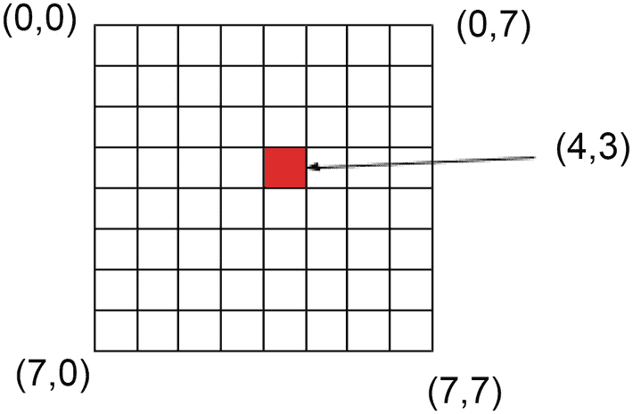

图 2-1

像素坐标系

左上角是图像坐标系的起点或原点。右上角的像素用(7，0)表示，左下角的像素用(7，0)表示，右下角的像素用(7，7)表示。这可以概括为(x，y)，其中 x 是单元格距图像左边缘的位置，y 是距图像上边缘的垂直位置。在图 [2-1](#Fig1) 中，红色像素位于左起第五个位置和上起第四个位置。由于坐标系从 0 开始，所以图 [2-1](#Fig1) 中红色像素的坐标为(4，3)。

为了更清楚一点，让我们想象一个 8×8 像素的图像，上面写着字母 *H* (如图 [2-3](#Fig3) )。此外，为了简单起见，假设这是一个灰度图像，字母 *H* 用黑色书写，图像的其余区域为白色。

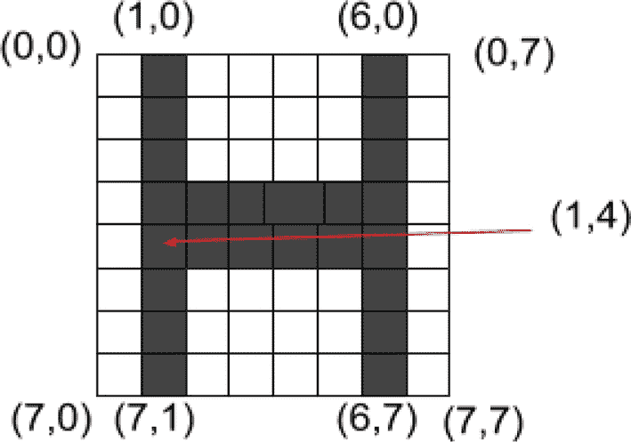

图 2-2

像素坐标系示例

记住，在灰度模型中，黑色像素用 0 表示，白色像素用 255 表示。图 [2-3](#Fig3) 显示了 8×8 网格内每个像素的值。

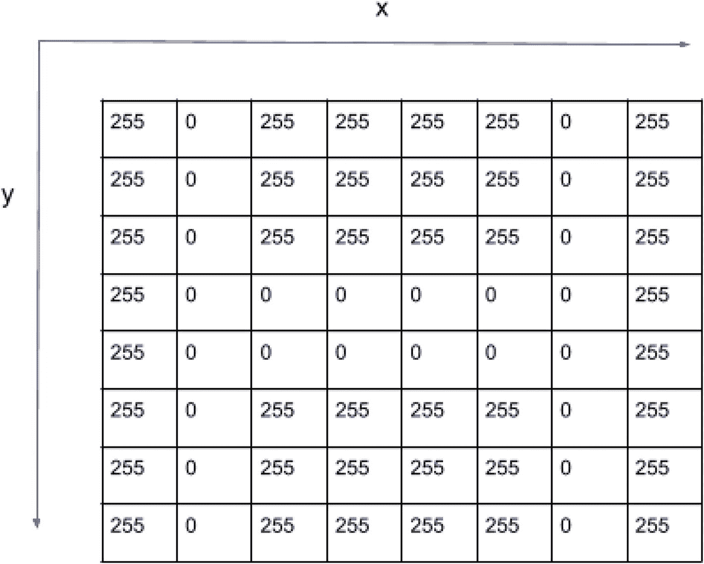

图 2-3

像素矩阵和值

那么，位置(1，4)的像素值是多少呢？而在位置(2，2)？

我希望你现在已经清楚图像是如何用排列在网格中的数字来表示的了。这些数字被序列化并存储在计算机的存储系统中，并在屏幕上显示为图像。至此，您已经知道了如何使用坐标系访问像素，以及如何为这些像素分配颜色。

我们已经建立了坚实的基础，并学习了图像表示的基本概念。让我们自己动手练习一些 Python 和 OpenCV 编码。在下一节中，我将一步一步地向您展示如何编写代码来从计算机磁盘加载图像、访问像素、操作它们，以及将它们写回磁盘。事不宜迟，我们开始吧！

## Python 和 OpenCV 代码来操作图像

OpenCV 将图像的像素值表示为 NumPy 数组。(不熟悉 NumPy？可以在 [`https://numpy.org/devdocs/user/quickstart.html`](https://numpy.org/devdocs/user/quickstart.html) 找到“入门”教程)。换句话说，当您加载一个图像时，OpenCV 会创建一个 NumPy 数组。通过简单地提供(x，y)坐标，可以从 NumPy 中获得像素值。

当您给出(x，y)坐标时，NumPy 将返回这些坐标处像素的颜色值，如下所示:

*   *对于灰度图像*，NumPy 返回的值将是 0 到 255 之间的单个值。

*   *对于彩色图像*，NumPy 返回的值将是一个红色、绿色和蓝色的元组。请注意，OpenCV 以相反的顺序维护 RGB 序列。请记住 OpenCV 的这个重要特性，以避免在使用 OpenCV 时出现任何混淆。

换句话说，OpenCV 在 BGR 序列中存储颜色，在 RGB 序列中存储*而不是*。

在我们写任何代码之前，让我们确保我们总是使用我们的 virtualenv，在`~/cv`目录中，我们已经用 PyCharm 设置了它。

启动你的 PyCharm IDE，做一个项目(我把我的项目命名为 cviz，是“计算机视觉”的简称)。参考图 [2-4](#Fig4) 并确保您已经选择了现有的解释器并选择了我们的 virtualenv Python 3.6(cv)。

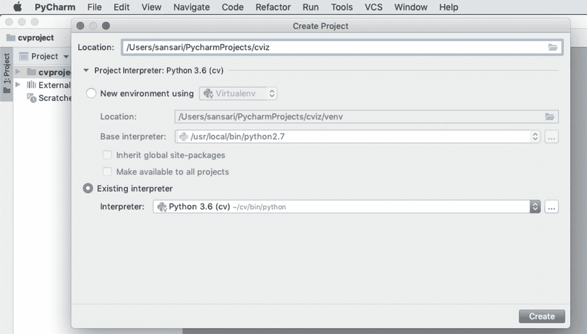

图 2-4

PyCharm IDE，显示了使用 virtualenv 的项目设置

### 程序:加载、浏览和显示图像

清单 [2-1](#PC1) 展示了加载、浏览和显示图像的 Python 代码。

```py
Filename: Listing_2_1.py
1    from __future__ import print_function
2    import cv2
3
4    # image path
5    image_path = "images/marsrover.png"
6    # Read or load image from its path
7    image = cv2.imread(image_path)
8    # image is a NumPy array
9    print("Dimensions of the image: ", image.ndim)
10   print("Image height: ", format(image.shape[0]))
11   print("Image width: ", format(image.shape[1]))
12   print("Image channels: ", format(image.shape[2]))
13   print("Size of the image array: ", image.size)
14   # Display the image and wait until a key is pressed
15   cv2.imshow("My Image", image)
16   cv2.waitKey(0)

Listing 2-1Python Code to Load, Explore, and Display an Image

```

这里解释清单 [2-1](#PC1) 中的代码。

在第 1 行和第 2 行，我们从 OpenCV 的`__future__`包和`cv2`中导入 Python 的`print_function`。

第 5 行只是我们要从一个目录中加载的图像的路径。如果您的输入路径在不同的目录中，您应该给出图像文件的完整或相对路径。

在第 7 行，使用 OpenCV 的`cv2.imread()`函数，我们将图像读入一个 NumPy 数组，并赋给一个名为`image`的变量(这个变量可以是您喜欢的任何东西)。

在第 9 行到第 13 行，使用 NumPy 特性，我们显示了图像数组的维度、高度、宽度、通道数和数组的大小(即像素数)。

第 15 行使用 OpenCV 的`imshow()`函数显示图像。

在第 16 行中，`waitKey()`函数允许程序不立即终止并等待用户按下任何键。当您看到将在第 15 行显示的图像窗口时，按任意键终止程序，否则程序将阻塞。

图 [2-5](#Fig5) 显示了清单 [2-1](#PC1) 的输出。

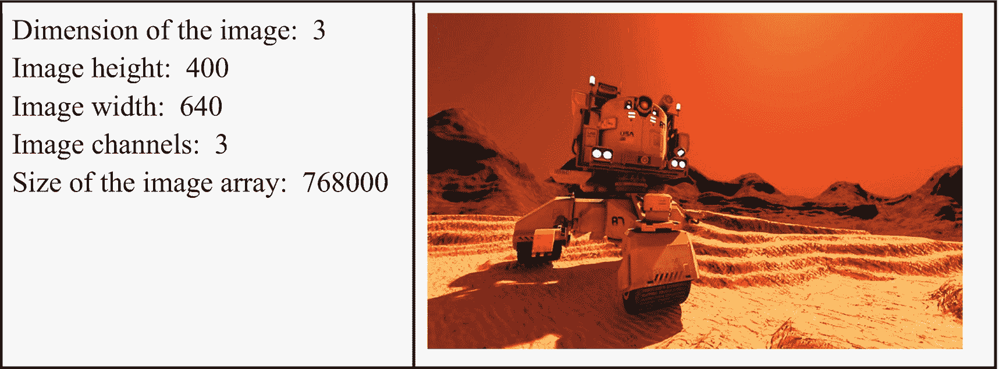

图 2-5

输出和图像显示

`image` NumPy 数组由三个维度组成:高×宽×通道。数组的第一个元素是高度，它告诉我们像素网格有多少行。类似地，第二个元素是宽度，它表示网格的列数。这三个通道代表 BGR(不是 RBG)颜色分量。数组的大小为 400×640×3 = 768，000。这实际上意味着我们的图像有 400×640 = 256000 个像素，每个像素有三个颜色值。

### 程序:访问和操作像素的 OpenCV 代码

在下一个程序中，我们将看到如何使用我们之前学过的坐标系来访问和修改像素值。清单 [2-2](#PC2) 显示了代码示例，后面有逐行解释。

```py
Filename: Listing_2_2.py
1    from __future__ import print_function
2    import cv2
3
4    # image path
5    image_path = "images/marsrover.png"
6    # Read or load image from its path
7    image = cv2.imread(image_path)
8
9    # Access pixel at (0,0) location
10   (b, g, r) = image[0, 0]
11   print("Blue, Green and Red values at (0,0): ", format((b, g, r)))
12
13   # Manipulate pixels and show modified image
14   image[0:100, 0:100] = (255, 255, 0)
15   cv2.imshow("Modified Image", image)
16   cv2.waitKey(0)

Listing 2-2Code Example to Access and Manipulate Image Pixels

```

列表 [2-2](#PC2) 在此说明。

第 1 行到第 7 行从一个目录路径导入和读取图像(如讨论清单 [2-1](#PC1) 时所解释的)。

在第 10 行，我们获得了坐标(0，0)处像素的 BGR(而不是 RBG)值，并使用 NumPy 语法将它们分配给(b，g，r)元组。

第 11 行显示了 BGR 值。

在第 14 行中，我们沿着 y 轴从 0 到 100 以及沿着 x 轴从 0 到 100 的像素范围来形成一个 100×100 的正方形，并且将值(255，255，0)或者纯蓝色、纯绿色和无红色分配给该正方形内的所有像素。

第 16 行显示修改后的图像。

第 17 行等待用户按任意键退出程序。

图 [2-6](#Fig6) 显示了清单 [2-2](#PC2) 的一些示例输出。

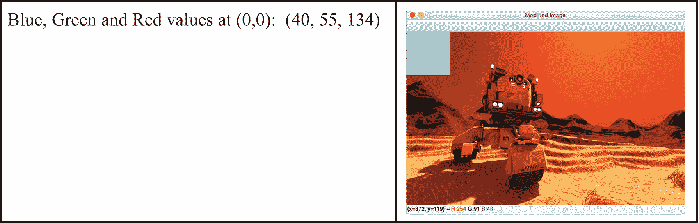

图 2-6

输出和修改的图像显示

如图 [2-6](#Fig6) 所示，修改后的图像在左上角有一个 100×100 像素的正方形，颜色为浅绿色，用 BGR 方案的(255，255，0)表示。

## 图画

OpenCV 提供了在图像上绘制形状的便捷方法。我们将学习如何使用以下方法在图像上绘制直线、矩形和圆形:

*   *线* : `cv2.line()`

*   *长方形* : `cv2.rectangle()`

*   *圈* : `cv2.circle()`

### 在图像上画线

我们将使用一种简单的方法在图像上画线，如下所示:

1.  将图像加载到 NumPy 数组中。

2.  确定直线起始位置的坐标。

3.  确定直线终点的坐标。

4.  设置线条的颜色。

5.  或者，设置线条的粗细。

清单 [2-3](#PC3) 演示了如何在图像上画线。

```py
Filename: Listing_2_3.py
1    from __future__ import print_function
2    import cv2
3
4    # image path
5    image_path = "images/marsrover.png"
6    # Read or load image from its path
7    image = cv2.imread(image_path)
8
9    # set start and end coordinates
10   start = (0, 0)
11   end = (image.shape[1], image.shape[0])
12   # set the color in BGR
13   color = (255,0,0)
14   # set thickness in pixel
15   thickness = 4
16   cv2.line(image, start, end, color, thickness)
17
18   #display the modified image
19   cv2.imshow("Modified Image", image)
20   cv2.waitKey(0)

Listing 2-3Drawing a Line on an Image

```

下面是对代码的逐行解释。

第 1 行和第 2 行是通常的导入。从现在开始，我不会重复进口，除非我们有一个新的提及。

第 5 行是图像路径。

第 7 行实际上将图像加载到一个名为 image 的 NumPy 数组中。

第 10 行定义了绘制直线的起点坐标。回想一下，位置(0，0)是图像的左上角。

第 11 行指定了图像端点的坐标。您会注意到表达式`(image.shape[1], image.shape[0])`代表图像右下角的坐标。

你现在可能已经猜到我们在画一条对角线。

第 13 行设置我们要画的线的颜色，第 15 行设置它的粗细。

实际的线画在第 16 行。`cv2.line()`函数采用以下参数:

*   图像编号。这就是我们正在划线的图像。

*   开始坐标。

*   结束坐标。

*   颜色。

*   厚度。(这是可选的。如果您不传递这个参数，我们的线条将有一个默认的厚度 1。)

最后，修改后的图像显示在第 19 行。第 20 行等待用户按任意键来终止程序。图 [2-7](#Fig7) 显示了我们刚刚画了一条线的图像的样本输出。

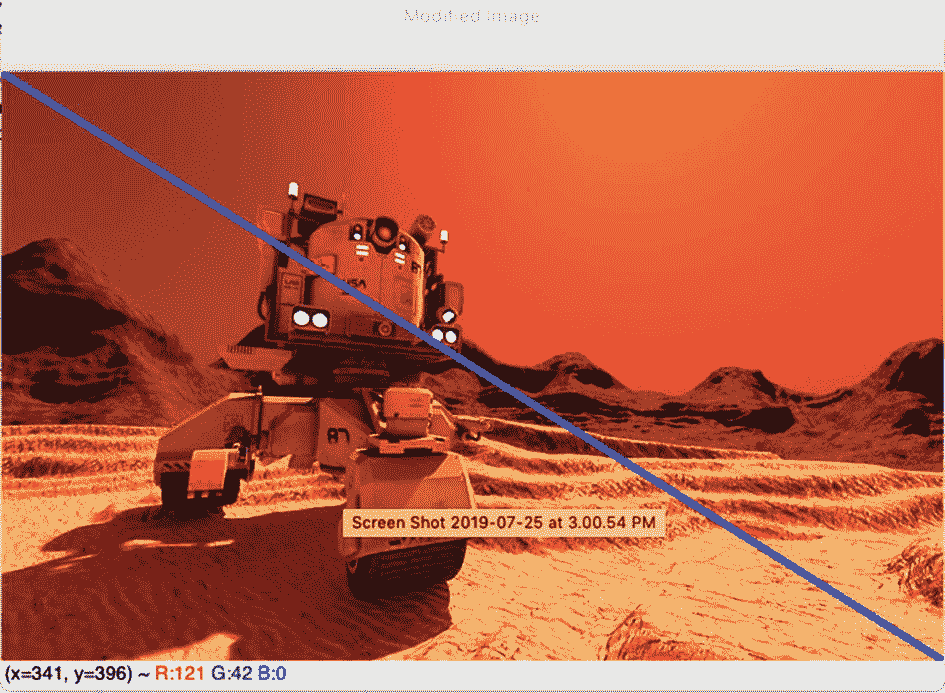

图 2-7

带有蓝色对角线的图像

### 在图像上绘制矩形

用 OpenCV 画矩形很容易。让我们直接深入代码(清单 [2-4](#PC4) )。我们将首先加载一个图像，并为其绘制一个矩形。我们会将修改后的图像保存到磁盘。

```py
Filename: Listing_2_4.py
1    from __future__ import print_function
2    import cv2
3
4    # image path
5    image_path = "images/marsrover.png"
6    # Read or load image from its path
7    image = cv2.imread(image_path)
8    # set the start and end coordinates
9    # of the top-left and bottom-right corners of the rectangle
10   start = (100,70)
11   end = (350,380)
12   # Set the color and thickness of the outline
13   color = (0,255,0)
14   thickness = 5
15   # Draw the rectangle
16   cv2.rectangle(image, start, end, color, thickness)
17   # Save the modified image with the rectangle drawn to it.
18   cv2.imwrite("rectangle.jpg", image)
19   # Display the modified image
20   cv2.imshow("Rectangle", image)
21   cv2.waitKey(0)

Listing 2-4Loading an Image, Drawing a Rectangle to It, Saving It, and Displaying the Modified Image

```

下面是清单 [2-4](#PC4) 的逐行解释。

1 号线和 2 号线是我们通常的进口货。

第 5 行指定了图像路径。

第 6 行从它的路径中读取图像。

第 10 行设置了我们想要在图像上绘制的矩形的起点。起点由矩形左上角的坐标组成。

第 11 行设置矩形的端点。这表示矩形右下角的坐标。

第 13 行设置颜色，第 14 行设置矩形轮廓的粗细。

第 16 行实际上绘制了矩形。我们使用 OpenCV 的`rectangle()`函数，它接受以下参数:

*   保存图像像素值的 NumPy 数组

*   起始坐标(矩形的左上角)

*   结束坐标(矩形的右下角)

*   轮廓的颜色

*   轮廓的粗细

注意，第 16 行没有任何赋值操作符。换句话说，我们没有将来自`cv2.rectangle()`函数的返回值赋给任何变量。作为参数传递给`cv2.rectangle()`函数的 NumPy 数组`image`被修改。

第 18 行将修改后的画有矩形的图像保存到磁盘上的一个文件中。

第 20 行显示修改后的图像。

第 21 行调用`waitKey()`函数，允许图像保持显示在屏幕上，直到按下一个键。函数`waitKey()`无限期等待一个按键事件，或者等待一定的毫秒级延迟。由于操作系统在切换线程之间有一个最小时间间隔，在按键后，`waitKey()`函数不会等待作为参数传递给`waitKey()`函数的延迟时间。实际等待时间取决于按下按键和调用`waitKey()`功能时您的电脑可能正在运行的其他程序。

图 [2-8](#Fig8) 显示了画有矩形的图像的输出。

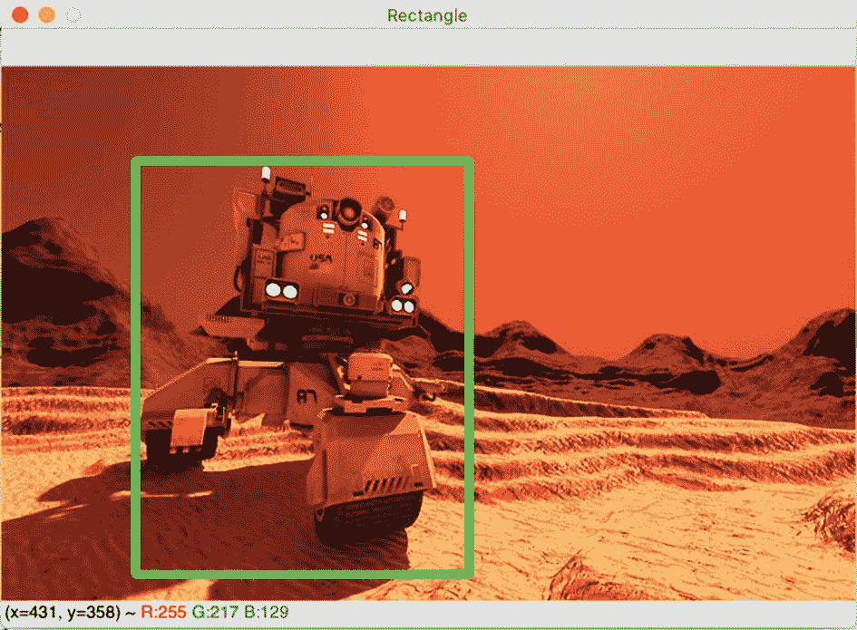

图 2-8

绘制了矩形的图像

在前面的例子中，我们首先从磁盘中读取一个图像，并在上面画了一个矩形。我们现在将稍微修改这个例子，并在空白画布上绘制矩形。我们将首先创建一个画布(而不是加载一个现有的图像),并在其上绘制一个矩形。然后，我们将保存并显示结果图像。参见清单 [2-5](#PC5) 。

```py
Filename: Listing 2_5.py
1    from __future__ import print_function
2    import cv2
3    import numpy as np
4
5    # create a new canvas
6    canvas = np.zeros((200, 200, 3), dtype = "uint8")
7    start = (10,10)
8    end = (100,100)
9    color = (0,0,255)
10   thickness = 5
11   cv2.rectangle(canvas, start, end, color, thickness)
12   cv2.imwrite("rectangle.jpg", canvas)
13   cv2.imshow("Rectangle", canvas)
14   cv2.waitKey(0)

Listing 2-5Drawing a Rectangle on a New Canvas and Saving the Image

```

在清单 [2-5](#PC5) 中，除了第 3 行和第 6 行之外的所有行与清单 [2-4](#PC4) 中的相同。

第 3 行导入了我们将用来创建画布的 NumPy 库。

第 6 行是我们创建图像的地方(称为*画布*)。我们的画布是 200×200 像素，每个像素保存三个通道(保存 BGR 值)。变量名`canvas`是一个 NumPy 数组，在本例中，它为每个像素保存一个零值。请注意，画布的每个像素值的数据类型是一个 8 位无符号整数(如第 [1](01.html) 章所述)。

你会怎么画一个实心矩形(意思是，用特定颜色填充的矩形)？

线索:厚度设为-1。

图 [2-9](#Fig9) 显示了清单 [2-5](#PC5) 的输出。图 [2-10](#Fig10) 显示了一个画有实心矩形的画布。

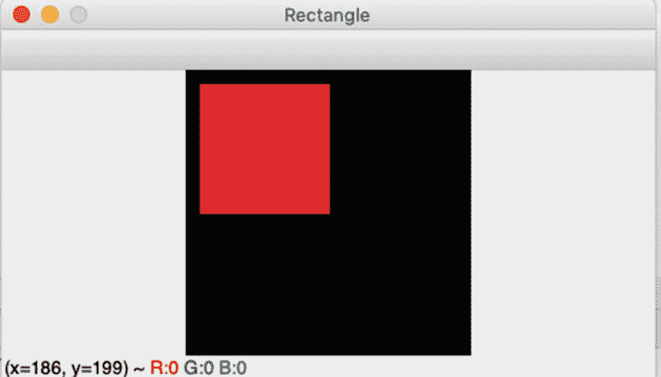

图 2-10

厚度为-1 的实心矩形

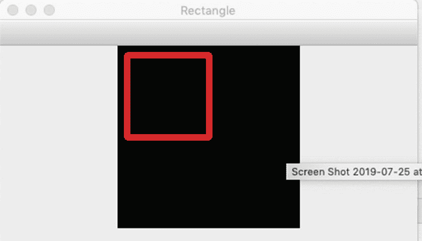

图 2-9

边框粗细为 5 的矩形

### 在图像上画一个圆

在图像上画一个圆也同样容易。您可以创建自己的画布或加载现有图像，然后设置圆心坐标、半径、颜色和圆轮廓的粗细。

清单 [2-6](#PC6) 显示了一段在空白画布上画圆的工作代码。图 [2-11](#Fig11) 显示了该代码清单的输出。

```py
Filename: Listing_2_6.py
1    from __future__ import print_function
2    import cv2
3    import numpy as np
4
5    # create a new canvas
6    canvas = np.zeros((200, 200, 3), dtype = "uint8")
7    center = (100,100)
8    radius = 50
9    color = (0,0,255)
10   thickness = 5
11   cv2.circle(canvas, center, radius, color, thickness)
12   cv2.imwrite("circle.jpg", canvas)
13   cv2.imshow("My Circle", canvas)
14   cv2.waitKey(0)

Listing 2-6Drawing a Circle on a Canvas

```

清单 [2-6](#PC6) 中的代码与清单 [2-5](#PC5) 中的代码差别不大，除了第 7 行定义了圆心。

此外，第 8 行设置半径，第 9 行定义颜色，第 10 行设置圆的厚度。最后，第 11 行画圆并接受以下参数:

*   要在其上绘制圆的图像。这是包含图像像素的 NumPy 数组。

*   圆心的坐标。

*   圆的半径。

*   圆轮廓的颜色。

*   轮廓的粗细。

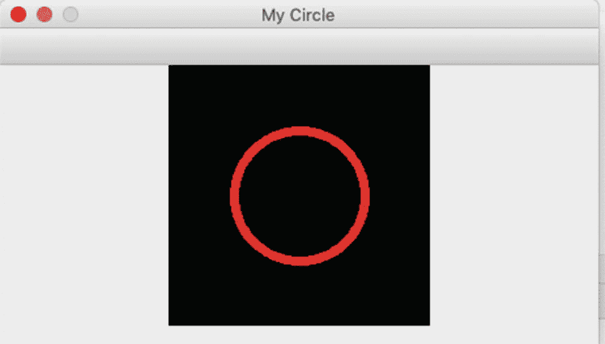

图 2-11

画在黑色画布中心的圆

给你做个练习:

1.  在画布的中心画一个实心圆。

2.  画两个同心圆，最外圆的半径是内圆半径的 1.5 倍。

## 摘要

在这一章中，我们学习了图像的基础知识，从像素开始，以及它们如何在不同的配色方案中表示，即灰色和彩色。坐标系有助于定位特定的像素并处理它们的值。我们学习了如何在图像上绘制一些基本的形状，如直线、矩形和圆形。虽然这些都是非常基本和容易的，但它们是在图像处理中做任何事情的重要概念。

在下一章，我们将探索图像处理中使用的不同技术和算法。