# 四、构建基于机器学习的计算机视觉系统

在前一章中，您学习了各种图像处理技术。在本章中，我们将讨论开发机器学习计算机视觉系统的步骤。本章是下一章的入门，下一章将详细介绍各种深度学习算法，以及如何用 Python 编写代码在 TensorFlow 上执行。

## 图像处理流水线

*计算机视觉* (CV)是计算机捕捉和分析图像并对其做出解释和决策的能力。例如，CV 可用于检测和识别图像，并识别其中的模式或对象。一个*人工智能* (AI)系统摄取图像，处理它们，提取特征，并对它们进行解释。换句话说，图像从一个系统或组件移动到另一个系统或组件，并转换成各种形式，以便机器识别模式并检测其中的对象。

图像通过一组组件进行处理，这些组件执行各种类型的变换，从而产生最终产品。这个过程被称为*图像处理流水线*或*计算机视觉流水线*。图 [4-1](#Fig1) 显示了处理流水线的高级视图。

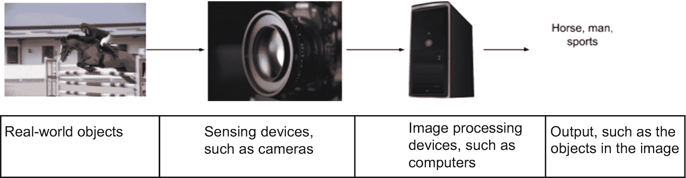

图 4-1

图像流水线

如图 [4-1](#Fig1) 所示，真实世界的物体被感应设备，如照相机，捕捉，并转换成数字图像。这些数字图像由计算机系统处理，并生成最终输出。输出可以是关于图像本身(图像分类)或嵌入在图像中的一些模式和对象的检测。例如，在医疗保健行业，图像可能是由 MRI 或 X 射线仪器创建的。该图像可以被输入到图像处理流水线中，以检测肿瘤的存在或不存在。

这本书涵盖了什么进入计算机处理单元和输出是如何产生的。让我们来看看计算机系统中处理图像的数据流流水线(见图 [4-2](#Fig2) )。

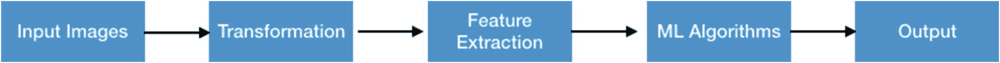

图 4-2

计算机视觉中的图像处理流水线

以下是对这一计算机视觉流水线的简要描述:

1.  视觉流水线从图像摄取开始。图像被捕获、数字化并存储在计算机磁盘上。在视频的情况下，图像的数字帧被摄取并存储在磁盘上，从那里它们被读取和分析。在某些情况下，视频帧从摄像机实时摄取到计算机中。

2.  摄取图像后，它们会经历不同的转换阶段。该转换也称为*预处理*，是标准化图像所必需的。确保用于特定目的的所有图像具有相同的大小、形状和颜色模式是很重要的。常用的变换有调整图像大小、颜色处理、平移、旋转和裁剪。其他有助于特征提取的高级变换包括图像二值化、阈值处理、梯度和边缘检测。关于这些技术的回顾，请参见第 [3](03.html) 章。

3.  特征提取是视觉流水线的核心组件。在机器学习中，我们输入一组特征来预测结果或类别。没有一个好的特征集，我们就不可能有一个好的机器学习结果。您将在下一节“特征提取”中了解更多关于特征提取的信息，但现在让我们记住，一个好的特征集对于任何机器学习系统都是重要的。

4.  然后是机器学习算法。机器学习有两个阶段。在第一阶段，我们将大量数据集输入数学算法进行学习。这种学习算法的结果被称为*训练模型*或简称为*模型*。在第二阶段，我们向训练好的模型提供数据集，以预测结果或类别。这个阶段被称为*预测*阶段。我将在第 [5](05.html) 章描述一些最流行和高效的计算机视觉机器学习模型。我将在那一章中介绍 Keras 和 TensorFlow，我们将通过一些代码示例来训练模型并使用这些模型进行预测。

5.  视觉流水线的最后一个组成部分是输出，这是您希望视觉系统实现的最终目标。

## 特征抽出

在机器学习中，*特征*是被观察的对象或事件的单个可测量属性。在计算机视觉中，特征是关于图像的区别信息。特征提取是机器学习中的一个重要步骤。事实上，机器学习的一切都围绕着特征。因此，对于高质量的机器学习结果来说，识别和提取有区别的独立特征是至关重要的。

给定一幅车轮图像，考虑尝试确定该图像是摩托车还是汽车。在这种情况下，轮子不是显著特征。我们需要更多的特征，比如门、屋顶等。此外，从单个摩托车或汽车提取的特征不足以用于实际的机器学习用途。我们需要借助重复出现的事件或特征来建立模式，因为在现实世界中，一个对象可能不会以呈现特征的方式呈现。因此，可重复性是一个好特性的重要特征。

在车轮的例子中，我们只有一个特征，但是在实际操作中，可能有大量的特征，例如颜色、轮廓、边缘、拐角、角度、光强度等等。你提取的特征越多，你的模型就越好。

机器学习模型和为训练模型提供的特征一样好。问题是，如何提取一组好的特征？没有适合所有情况的解决方案，但这里有一些实用的方法，可以帮助您完成特征提取任务。以下是一些方法的非穷尽列表:

*   特征必须是可区分的或可识别的。

*   特征必须避免混淆重叠的特征。

*   特征必须避免很少出现的特征。

*   不同条件和视角下的特征应该是一致的。

*   特征应该是可以直接识别的，也可以通过一些处理技术来识别。

*   你应该收集大量的样本来建立模式。

### 如何表示特征

从图像中提取的特征被表示为一个向量，称为*特征向量*。我们用一个例子来理解这个。为了简单起见，让我们考虑一个灰度图像。该图像的特征是像素值。我们知道，灰度图像中的像素被组织为二维矩阵，每个像素的值在 0 到 255 之间。如果这些像素值是我们的特征，我们将这些值表示为一维(1D)行矩阵(这是一个向量或 1D 数组)。图 [4-3](#Fig3) 显示了这种情况的图示。

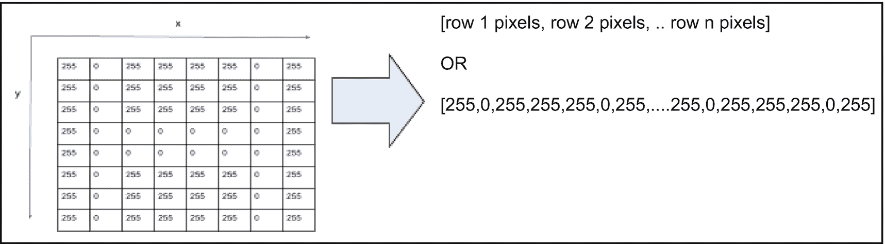

图 4-3

特征的矢量表示

对于大多数机器学习算法，我们需要提取特征，并将其提供给模型训练所考虑的算法。一些深度学习算法，如卷积神经网络(CNN)，会自动提取特征，然后训练模型。第 [5](05.html) 章提供了关于深度学习算法以及如何训练计算机视觉模型的细节。以下部分讨论了从图像中提取特征的各种方法。我们将使用 Python 和 OpenCV 编写代码来完成特征提取的例子。

### 颜色直方图

*直方图*是图像中像素强度的分布。通常直方图以图形(或图表)的形式显现。该图的 *x* 轴代表像素值(或值的范围)，而 *y* 轴代表特定值或值的范围的像素的频率(或计数)。图形的峰值显示像素数量最多的颜色。

我们已经知道一个像素的值可以在 0 到 255 之间。这意味着直方图在 *x* 轴上将有 256 个值，而 *y* 轴将有这些值的像素数。在 *x* 轴上有很多数字。出于最实际的目的，我们将这些像素值分成“箱”例如，我们可以将*x*-值分成 8 个面元，其中每个面元将具有 32 像素的颜色。我们对每个面元内的像素数量求和，以计算出 *y* 值。

那么，我们为什么关心直方图呢？直方图给出了图像中颜色、对比度和亮度分布的概念。灰度图像只有一个颜色通道，但 RGB 方案中的彩色图像有三个通道。当我们绘制彩色图像的直方图时，我们通常绘制三个直方图，每个通道一个，以更好地了解每个颜色通道的强度分布。直方图可以用作机器学习算法的特征。直方图还有一个有趣的用途，那就是增强图像的质量。使用直方图增强图像的技术称为*直方图均衡化*。在本章的后面你会学到更多关于直方图均衡化的知识。

#### 如何计算直方图

我们将使用 Python 和 OpenCV 来计算直方图，并且我们将使用 Matplotlib 包中的`pyplot`来绘制直方图。(还记得 Matplotlib 吗？我们在第 1 章中安装并设置了它。)

OpenCV 提供了一个易于使用的函数来计算直方图。下面是对`calcHist()`功能的描述:

```py
calcHist(images, channels, mask, histSize, ranges, accumulate)

```

该函数采用以下参数:

*   这是图像像素的 NumPy 数组。如果只有一个图像，只需将 NumPy 变量放在一对方括号中，例如`[image]`。

*   `channels`:这是我们要计算直方图的频道索引数组。对于灰度图像，该值为[0]，对于 RGB 彩色图像，该值为[0，1，2]。

*   这是一个可选参数。如果不提供蒙版，将为图像中的所有像素计算直方图。如果您提供一个遮罩，将只为被遮罩的像素计算直方图。还记得第三章里的面具吗？

*   这是箱子的数量。如果我们将该值作为[64，64，64]传递，这意味着每个通道将有 64 个面元。对于不同的频道，仓的大小可以不同。

*   `ranges`:这是像素值的范围，对于灰度和 RGB 彩色图像，通常为[0，255]。这个值在其他配色方案中可能会有所不同，但是现在，让我们只坚持使用 RGB。

*   `accumulate`:这是累计标志。如果设置了该值，直方图在分配时不会在开始时被清除。此功能使您能够从几组数组计算单个直方图，或者及时更新直方图。默认值为`None`。

#### 灰度直方图

让我们写一些代码来学习如何计算灰度图像的直方图，并将其可视化为图形(参见清单 [4-1](#PC2) )。注意，我们从 Matplotlib 包中导入了`pyplot`。这是我们将用来绘制显示直方图的图形的库。

```py
Filename: Listing_4_1.py
1    import cv2
2    import numpy as np
3    from matplotlib import pyplot as plot
4
5    # Read an image and convert it to grayscale
6    image = cv2.imread("images/nature.jpg")
7    image = cv2.cvtColor(image, cv2.COLOR_BGR2GRAY)
8    cv2.imshow("Original Image", image)
9
10   # calculate histogram
11   hist = cv2.calcHist([image], [0], None, [256], [0,255])
12
13   # Plot histogram graph
14   plot.figure()
15   plot.title("Grayscale Histogram")
16   plot.xlabel("Bins")
17   plot.ylabel("Number of Pixels")
18   plot.plot(hist)
19   plot.show()
20   cv2.waitKey(0)

Listing 4-1Histogram of a Grayscale Image

```

清单 [4-1](#PC2) 的第 11 行计算我们的灰度图像的直方图。注意，image 变量被包在一对大括号中，因为`cv2.calcHist()`函数接受 NumPy 数组的数组。即使我们只有一个图像，我们仍然需要将它包装在一个数组中。

第二个参数[0]表示我们想要计算第零个颜色通道的直方图。因为我们只有一个通道，所以我们在数组中只传递一个索引值:[0]。

第三个参数`None`，意味着我们不想提供任何屏蔽。换句话说，我们计算所有像素的直方图。

[256]是 bin 信息。这表明我们需要 256 个面元，意味着每个像素一个面元。除非我们想要对图像像素分布进行细粒度的分析，否则这可能没有用。出于大多数实际目的，您希望通过较小的纸盒尺寸，如[32]或[64]等。

最后一个参数[0，255]告诉函数存在 0 到 255 之间的像素值。

`hist`变量保存计算输出。如果你打印这个变量，你会看到一堆数字，可能不容易解释。为了便于解释，我们以图表的形式绘制直方图。

第 14 行配置空白图。第 15 行为我们的图指定了一个名称。第 16 和 17 行分别设置了 *x* 轴和 *y* 轴标签。第 18 行实际绘制了图表。最后，第 19 行在屏幕上显示了漂亮的情节。图 [4-4](#Fig4) 显示原始图像，图 [4-5](#Fig5) 显示输出。

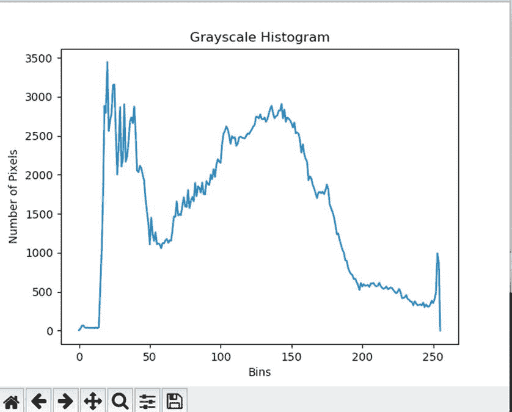

图 4-5

图 [4-4](#Fig4) 中灰度图像的直方图

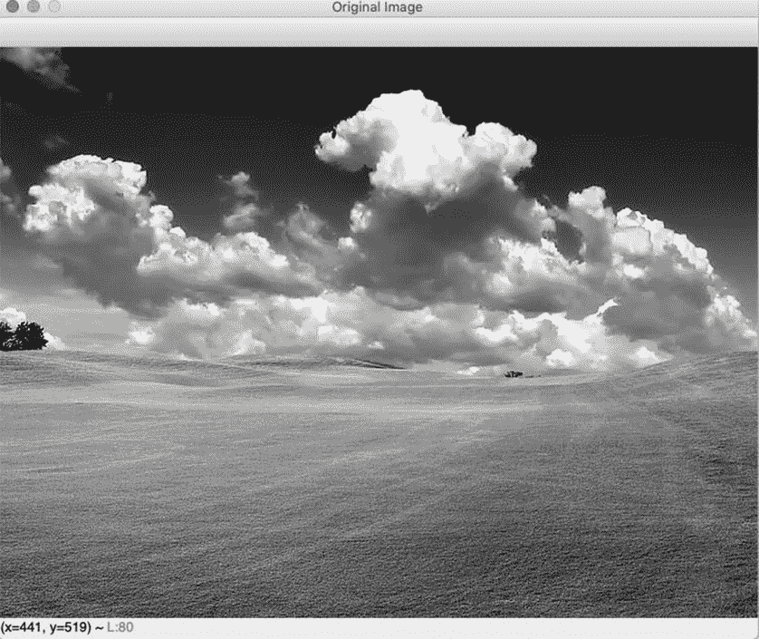

图 4-4

原始灰度图像

那么，你在这个直方图中看到了什么？最大像素数(3，450)的颜色值为 20，接近黑色。大多数像素在 100 和 150 的颜色范围内。

这里有一个练习:用 32 个面元绘制一幅图像的直方图。尝试解释输出图。

#### RGB 颜色直方图

让我们回顾一下清单 [4-2](#PC3) 中的程序，并理解如何绘制基于 RGB 的彩色图像的所有三个通道的直方图。在 RGB 方案中，彩色图像有三个通道。值得注意的是，OpenCV 在 BGR 序列中保持颜色信息，而不是在 RGB 序列中。

在清单 [4-2](#PC3) 中，第 6 行是我们通常的图像读取行，在这里我们从磁盘读取彩色图像。

你会注意到我们在 BGR 序列中创建了一个颜色元组来保存我们所有的通道颜色(第 10 行)。

为什么我们在第 12 行有一个`for`循环？`cv2.calcHist()`函数的第二个参数接受值为 0、1 或 2 的数组。如果我们传递值[0]，我们实际上是指示`calcHist()`函数计算第 0 个索引中颜色通道的直方图，也就是蓝色通道。类似地，值[1]指示`calcHist()`函数计算红色通道的直方图，值[2]表示计算绿色通道的直方图。`for`循环的第一次迭代首先是计算和绘制蓝色的直方图，第二次迭代是绿色的，最后一次迭代是绿色通道的。

请再次注意，我们已经将[32]作为第四个参数传递给了我们的`calcHist()`函数。这是为了让该函数知道，我们想要为每个通道计算 32 个仓的直方图。

最后一个参数[0，256]给出了颜色范围。

在第 15 行的`for`循环中，`plot()`函数将直方图作为第一个参数，将可选颜色作为第二个参数。

```py
Filename: Listing_4_2.py
1    import cv2
2    import numpy as np
3    from matplotlib import pyplot as plot
4
5    # Read a color image
6    image = cv2.imread("images/nature.jpg")
7
8    cv2.imshow("Original Color Image", image)
9    #Remember OpenCV stores color in BGR sequence instead of RBG.
10   colors = ("blue", "green", "red")
11   # calculate histogram
12   for i, color in enumerate(colors):
13      hist = cv2.calcHist([image], [i], None, [32], [0,256])
14      # Plot histogram graph
15      plot.plot(hist, color=color)
16
17   plot.title("RGB Color Histogram")
18   plot.xlabel("Bins")
19   plot.ylabel("Number of Pixels")
20   plot.show()
21   cv2.waitKey(0)

Listing 4-2Histogram of Three Channels of RGB Color Image

```

图 [4-6](#Fig6) 和图 [4-7](#Fig7) 显示了列表 [4-2](#PC3) 的输出。

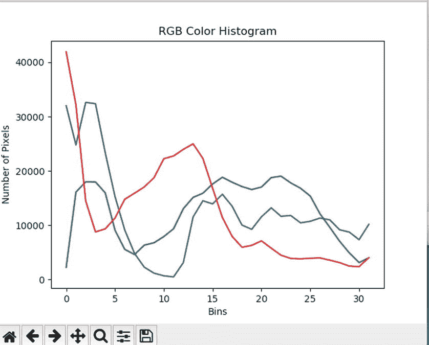

图 4-7

图 [4-6](#Fig6) 中图像的三个颜色通道的直方图

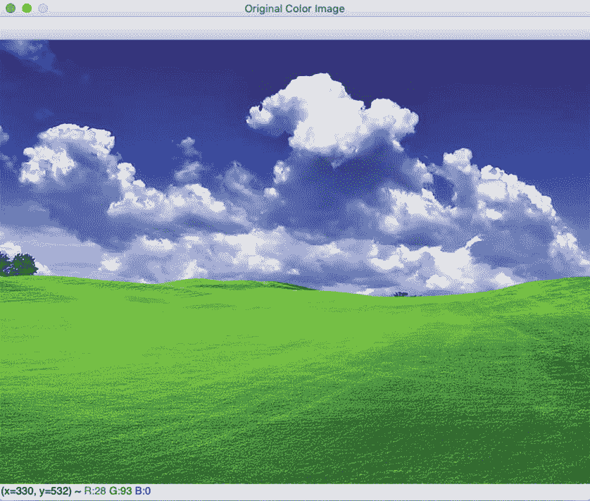

图 4-6

原始彩色图像

在图 [4-7](#Fig7) 中，*x*-轴最多只有 32 个值，因为我们只为每个通道使用了 32 个箱。

这里有一个练习:创建一个蒙版图像的直方图。

**提示**创建一个掩码 NumPy 数组，并将该数组作为第三个参数传递给`cv2.calcHist()`函数。阅读第 3 章来刷新你关于如何创建一个面具的记忆。

### 直方图均衡器

现在我们对直方图有了很好的理解，让我们用这个概念来增强图像的质量。直方图均衡化是一种调整图像对比度的图像处理技术。这是一种重新分配像素强度的方法，使填充不足的像素强度等于填充过度的像素强度，如图 [4-8](#Fig8) 所示。

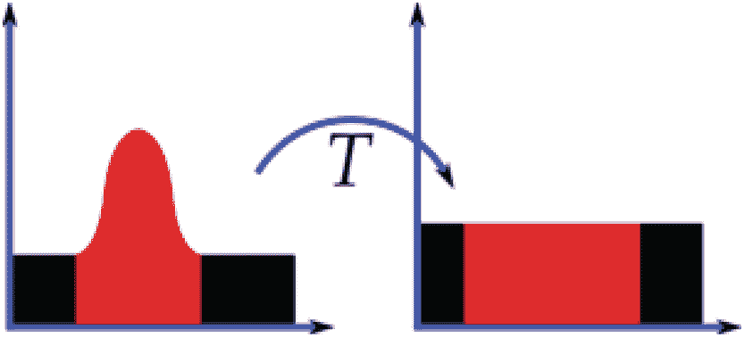

图 4-8

直方图均衡化(来源:维基百科)

让我们写一些代码，看看这个直方图均衡化的作用。清单 [4-3](#PC4) 中有很多代码，但是如果你看看这个清单的顶部，从第 1 行到第 19 行，你会注意到这些行与清单 [4-1](#PC2) 中的那些是一样的。这里我们只是计算和绘制灰度图像的直方图。

在第 21 行，我们使用 OpenCV 的`cv2.equalizeHist()`函数，该函数获取原始图像并调整其像素强度以增强其对比度。

第 22 到 33 行计算并显示增强(均衡)图像的直方图。

图 [4-9](#Fig9) 至 [4-12](#Fig12) 显示了列表 [4-3](#PC4) 的输出以及原始图像和均衡图像的直方图对比。

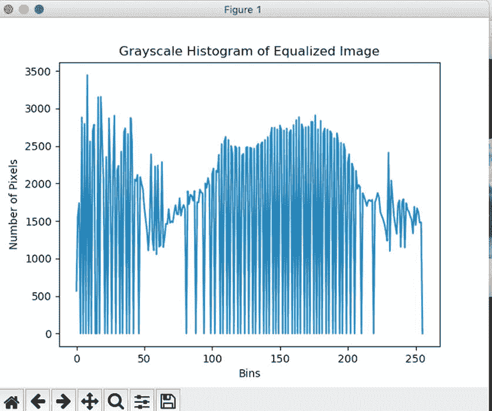

图 4-12

图 [4-11](#Fig11) 均衡图像直方图

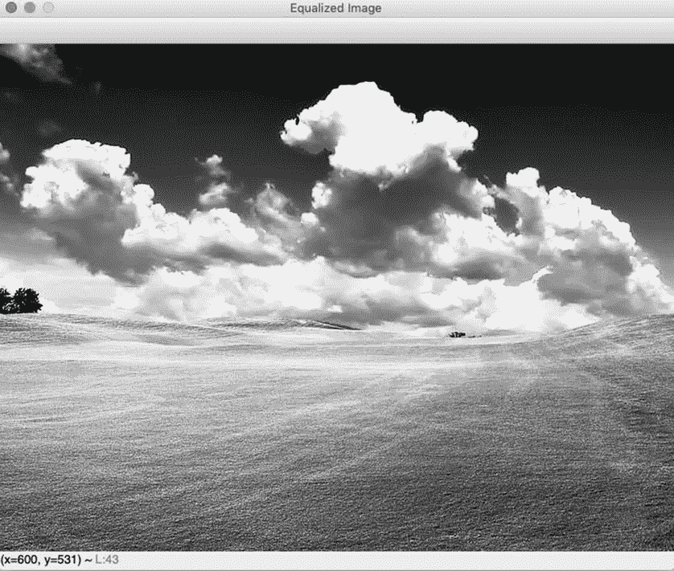

图 4-11

对比度增强的均衡图像

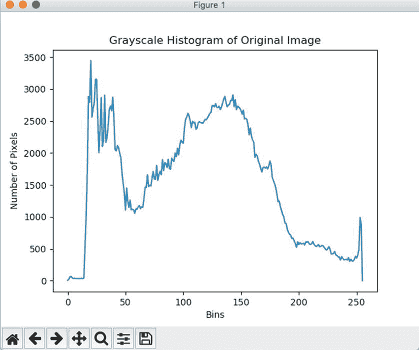

图 4-10

图 [4-9](#Fig9) 中图像的直方图


图 4-9

原始灰度图像

```py
Filename: Listing_4_3.py
1    import cv2
2    import numpy as np
3    from matplotlib import pyplot as plot
4
5    # Read an image and convert it into grayscale
6    image = cv2.imread("images/nature.jpg")
7    image = cv2.cvtColor(image, cv2.COLOR_BGR2GRAY)
8    cv2.imshow("Original Image", image)
9
10   # calculate histogram of the original image
11   hist = cv2.calcHist([image], [0], None, [256], [0,255])
12
13   # Plot histogram graph
14   #plot.figure()
15   plot.title("Grayscale Histogram of Original Image")
16   plot.xlabel("Bins")
17   plot.ylabel("Number of Pixels")
18   plot.plot(hist)
19   plot.show()
20
21   equalizedImage = cv2.equalizeHist(image)
22   cv2.imshow("Equalized Image", equalizedImage)
23
24   # calculate histogram of the original image
25   histEqualized = cv2.calcHist([equalizedImage], [0], None, [256], [0,255])
26
27   # Plot histogram graph
28   #plot.figure()
29   plot.title("Grayscale Histogram of Equalized Image")
30   plot.xlabel("Bins")
31   plot.ylabel("Number of Pixels")
32   plot.plot(histEqualized)
33   plot.show()
34   cv2.waitKey(0)

Listing 4-3Histogram Equalization

```

### [军]GroundLaunchedCruiseMissile

灰度共生矩阵(GLCM)是给定偏移量内同时出现的像素值的分布。偏移量是相邻像素的位置(距离和方向)。顾名思义，GLCM 总是针对灰度图像进行计算。

GLCM 计算像素值 *i* 与像素值*j*水平、垂直或对角共存的次数

对于 GLCM 计算，我们指定偏移距离 *d* 和角度θ(theta)。角度θ(theta)可以是 0(水平)、90(垂直)、45(右上斜)或 135(左上斜)，如图 [4-13](#Fig13) 所示。

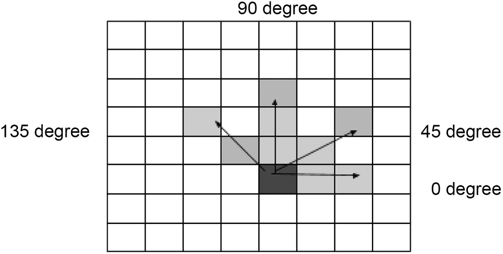

图 4-13

相邻像素位置的图示(距离和角度)

GLCM 的重要性在于它提供了图像上空间关系的信息。这与直方图不同，因为直方图不提供关于图像大小、像素位置或它们之间关系的任何信息。

虽然 GLCM 是如此重要的矩阵，但我们并不直接将其用作机器学习的特征向量。我们使用 GLCM 计算关于图像的某些关键统计，并且这些统计被用作任何机器学习训练的特征。在本节中，我们将了解这些统计数据以及如何计算它们。

尽管 OpenCV 在内部使用 GLCM，但它并不直接公开任何函数来计算它。为了计算 GLCM，我们将使用另一个 Python 库:skimage 的`feature`包。

下面是我们将用来计算 GLCM 的函数的描述:

```py
greycomatrix(image, distances, angles, levels, symmetric,normed)

```

`greycomatrix()`函数采用以下参数:

*   这是灰度图像的 NumPy 表示。记住，图像必须是灰度的。

*   `distances`:这是像素对距离偏移的列表。

*   `angles`:这是一对像素之间的角度列表。确保角度是弧度而不是度。

*   `levels`:这是一个可选参数，用于具有 16 位像素值的图像。在大多数情况下，我们使用 8 位图像像素，其值范围从 0 到 255。对于 8 位图像，该参数的最大值是 256。

*   `symmetric`:可选参数，取布尔值。值`True`意味着输出矩阵将是对称的。默认是`False`。

*   `normed`:这也是一个可选参数，采用布尔值。布尔型`True`表示每个输出矩阵通过除以给定偏移的累计同现总数来归一化。默认是`False`。

`greycomatrix()`函数返回一个 4D n 数组。这是灰度共生直方图。输出值`P[i,j,d,theta]`表示灰度级 *j* 在距离灰度级*j*距离 *d* 和角度*θ*处出现多少次。如果参数 normed 为`False`(这是默认值)，则输出为类型`uint32`(32 位无符号整数)；否则，它就是`float64`(64 位浮点)。

清单 [4-4](#PC6) 向您展示了如何使用 skimage 库计算特征统计量来计算 GLCM。

```py
Filename: Listing_4_4.py
1    import cv2
2    import skimage.feature as sk
3    import numpy as np
4
5    #Read an image from the disk and convert it into grayscale
6    image = cv2.imread("images/nature.jpg")
7    image = cv2.cvtColor(image, cv2.COLOR_BGR2GRAY)
8
9    #Calculate GLCM of the grayscale image
10   glcm = sk.greycomatrix(image,[2],[0, np.pi/2])
11   print(glcm)

Listing 4-4GLCM Calculation Using the greycomatrix() Function

```

第 10 行通过传递 image NumPy 变量和距离[2]，使用`greycomatrix()`计算 GLCM。第三个参数以弧度为单位。`np.pi/2`是 90 度角的弧度。最后一行，即第 11 行，简单地打印了 4D ndarray。

如前所述，GLCM 不直接用作特征，但我们使用它来计算一些有用的统计数据，这给了我们关于图像纹理的想法。下表列出了我们可以得出的统计数据:

<colgroup><col class="tcol1 align-left"> <col class="tcol2 align-left"></colgroup> 
| 

统计的

 | 

描述

 |
| --- | --- |
| 对比 | 测量 GLCM 中的局部变化。 |
| 相互关系 | 测量指定像素对出现的联合概率。 |
| 活力 | 提供 GLCM 中元素的平方和。也称为均匀性或角二阶矩。 |
| 同种 | 测量 GLCM 中元素分布与 GLCM 对角线的接近程度。 |

在这里，我们为您提供一些用于计算之前统计数据的高级公式。这些公式的正式数学处理超出了本书的范围；然而，我们鼓励你探索这些统计数据的数学基础。

*   对比度= 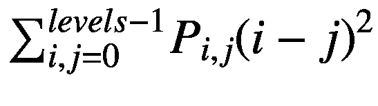

*   相异度= 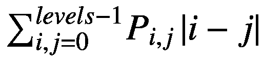

*   同质性= 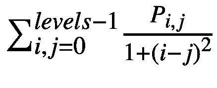

*   ASM = 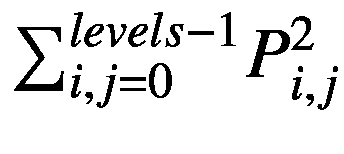

*   能量= 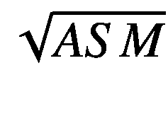

*   相关性= ![$$ \sum \limits_{i,j=0}^{levels-1}{P}_{i,j}\left[\frac{\left(i-{\mu}_i\right)\;\left(j-{\mu}_j\right)}{\sqrt{\left({\sigma}_i^2\right)\;\left({\sigma}_j^2\right)}}\right] $$](img/493065_1_En_4_Chapter_TeX_IEq6.png)

其中， *P* 是要计算指定属性的 GLCM 直方图。值 *P* [ *i* ， *j* ， *d* ，*θ*是灰度级 *j* 在距离 *d* 处和与灰度级 *i* 成角度*θ*处出现的次数。

我们将使用 skimage 包中的`greycoprops()`来计算 GLCM 中的这些统计数据。该函数的定义如下:

```py
greycoprops(P, prop="contrast")

```

第一个参数是 GLCM 直方图(参见清单 [4-4](#PC6) ，第 10 行)。

第二个参数是我们要计算的属性。我们可以为这个参数传递以下任何属性:`contrast`、`dissimilarity`、`homogeneity`、`energy`、`correlation`和`ASM.`

如果没有传递第二个参数，它将默认为`contrast`。

清单 [4-5](#PC8) 展示了如何计算这些统计数据。

```py
Filename: Listing_4_5.py
1    import cv2
2    import skimage.feature as sk
3    import numpy as np
4
5    #Read an image from the disk and convert it into grayscale
6    image = cv2.imread("images/nature.jpg")
7    image = cv2.cvtColor(image, cv2.COLOR_BGR2GRAY)
8
9    #Calculate GLCM of the grayscale image
10   glcm = sk.greycomatrix(image,[2],[0, np.pi/2])
11
12   #Calculate Contrast
13   contrast = sk.greycoprops(glcm)
14   print("Contrast:",contrast)
15
16   #Calculate 'dissimilarity'
17   dissimilarity = sk.greycoprops(glcm, prop='dissimilarity')
18   print("Dissimilarity: ", dissimilarity)
19
20   #Calculate 'homogeneity'
21   homogeneity = sk.greycoprops(glcm, prop='homogeneity')
22   print("Homogeneity: ", homogeneity)
23
24   #Calculate 'ASM'
25   ASM = sk.greycoprops(glcm, prop='ASM')
26   print("ASM: ", ASM)
27
28   #Calculate 'energy'
29   energy = sk.greycoprops(glcm, prop='energy')
30   print("Energy: ", energy)
31
32   #Calculate 'correlation'
33   correlation = sk.greycoprops(glcm, prop='correlation')
34   print("Correlation: ", correlation)

Listing 4-5Calculation of Image Statistics from the GLCM

```

清单 [4-5](#PC8) 展示了如何使用`greycoprops()`函数并将不同的参数传递给`prop`来计算各自的统计数据。图 [4-14](#Fig14) 显示了列表 [4-5](#PC8) 的输出。

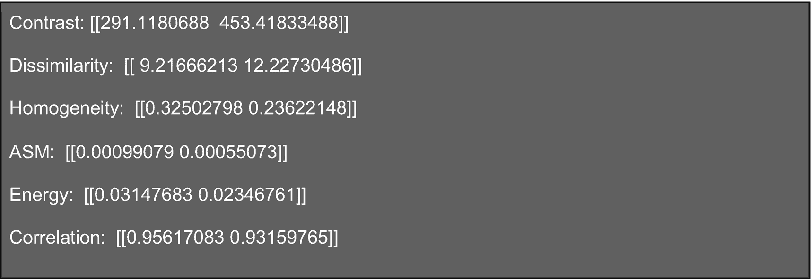

图 4-14

基于 GLCM 的各种统计输出

### 猪

方向梯度直方图是计算机视觉和机器学习中用于目标检测的重要特征描述符。猪描述图像中对象的结构形状和外观。HOG 算法计算图像局部的梯度方向的出现。

HOG 算法分五个阶段工作，如下所述。

阶段 1:全局图像标准化:这是一个可选阶段，只需要减少照明效果的影响。在此阶段，通过以下方法之一对图像进行全局标准化:

*   *伽玛(幂律)压缩*:应用 log(p)改变每个像素值 *p* 。这样会过度压缩像素，不建议这样做。

*   *平方根归一化*:每个像素值 *p* 变为[？][?][?] *p* (像素值的平方根)。这种方法对像素的压缩小于伽玛压缩，被认为是首选的归一化技术。

*   *方差归一化*:对于大多数机器学习工作，我使用这种技术，与其他两种方法相比，得到了更好的结果。在这个方法中，我们首先计算像素值的平均值(𝜇)和标准差(***【σ***)。然后，根据以下公式归一化每个像素值 *p* :

*   *TP*=(*p*-*)/*

 ***阶段 2:计算 x 和 y 上的梯度图像:第二阶段计算一阶图像梯度，以捕捉轮廓、轮廓和一些纹理信息。如果你需要捕捉棒状特征，比如人类的四肢，你还需要包含二阶图像导数。清单 3-19 和 3-20(在第 [3](03.html) 章)展示了如何计算 X 和 Y 方向的梯度。如果需要的话，请继续阅读第三章[的“渐变和边缘检测”一节。假设 X 方向上的梯度是 G <sub>x</sub> 并且 Y 方向上的梯度是 G <sub>y</sub> ，使用下面的公式计算梯度幅度:](03.html)

[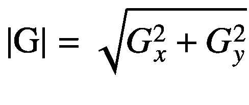](03.html)

最后，使用以下公式计算梯度方向:

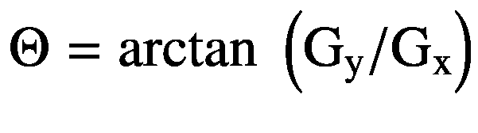

一旦计算出梯度和方向的值，就可以计算直方图。

阶段 3:计算梯度直方图:图像被分成小的空间区域，称为*单元*。使用前面的|G|和θ公式，我们在每个单元的所有像素上累积梯度或边缘方向的局部 1D 直方图。每个方向直方图将梯度角度范围分成固定数量的预定仓。单元中像素的梯度幅度被用于投票到方向直方图中。投票的权重仅仅是给定像素处的梯度幅度|G|。

阶段 4:跨块标准化:将少量单元组合在一起形成一个正方形块。整个图像现在被分成块(由一组单元组成)。块的形成通常通过在几个块之间共享单元来完成。因此，细胞以不同的标准化在最终的输出载体中出现几次。然后对这些局部块进行归一化。这是通过累积局部块内的局部直方图“能量”的度量来执行的。这些标准化的块描述符就是 HOG。图 [4-15](#Fig15) 显示了区块形成。

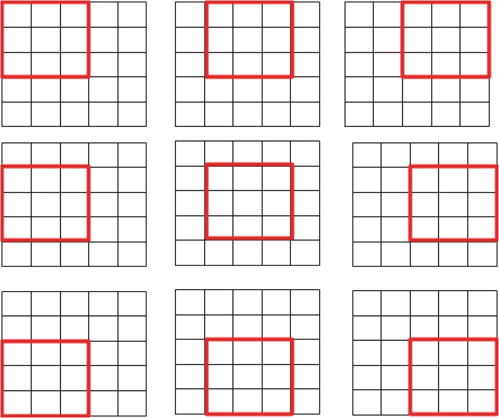

图 4-15

通过细胞分组形成细胞块(3×3 细胞块)

阶段 5:展平成一个特征向量:在所有的块都被归一化之后，我们将得到的直方图连接起来以构建我们最终的特征向量。

如果所有这些关于 HOG 的细节看起来让人不知所措，不要担心。我们不需要自己编写代码来实现这些；有几个库提供了简单计算 HOG 的函数。

我们将使用 scikit-image 库来计算图像的 HOG。scikit-image 库的包`skimage`中的子包`feature`提供了一种计算 HOG 的方便方法。下面是函数签名:

```py
out, hog_image = hog(image, orientations=9, pixels_per_cell=(8, 8), cells_per_block=(3, 3), block_norm='L2-Hys', visualize=False, transform_sqrt=False, feature_vector=True, multichannel=None)

```

参数描述如下:

`image`:这是输入图像的 NumPy 表示。

`orientation`:定位仓数量默认为 9 个。

`pixels_per_cell`:这是作为一个元组的每个单元格的像素数；对于 8×8 像元大小，它默认为(8，8)。

`cells_per_block`:这是每个块的单元数，为一个元组；默认为(3，3)，是针对 3×3 的单元格，而不是像素。

`block_norm`:这是块标准化方法，作为一个字符串，具有以下值之一:L1，L1-sqrt，L2，L2-Hys。这些规范化字符串解释如下:

L1:使用 L1-诺姆标准化使用此公式:

L1-诺姆= 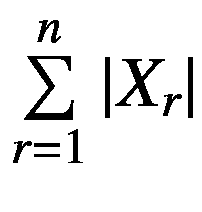

L1-sqrt:L1 标准化值的平方根。它使用这个公式:

L1-sqrt = 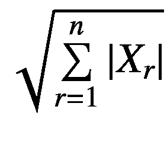

L2:使用 L2-诺姆标准化使用此公式:

L2-诺姆= 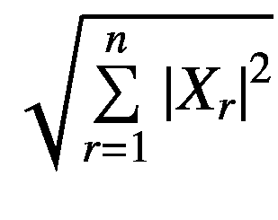

L2-海斯:这是参数`block_norm`的默认规范化。通过首先进行 L2 归一化，将结果限制在最大值 0.2，然后重新计算 L2 归一化来计算 L2-海斯。

`visualize`:如果设置为`True`，该功能还会返回猪的图像。其默认值设置为`False`。

`Transform_sqrt`:如果设置为`True`，该功能将在处理前应用幂律压缩对图像进行归一化处理。

`feature_vector`:该参数的默认值设置为`True`，指示函数将输出数据作为特征向量返回。

`multichannel`:将该参数的值设置为`True`，表示输入图像包含多通道。图像的尺寸一般表示为高×宽×通道。如果此参数的值为`True`，则最后一个维度(通道)被解释为颜色通道，否则被解释为空间通道。

这个`hog()`函数返回什么？

`out`:该函数返回一个包含`(n_blocks_row, n_blocks_col, n_cells_row, n_cells_col, n_orient)`的 ndarray。这是图像的 HOG 描述符。如果参数`feature_vector`为`True`，则返回一个 1D(展平)数组。

`hog_image`:如果参数`visualize`设置为`True`，该函数也返回猪图像的可视化。

清单 [4-6](#PC10) 展示了如何使用 skimage 包计算 HOG。

```py
Filename: Listing_4_6.py
1    import cv2
2    import numpy as np
3    from skimage import feature as sk
4
5    #Load an image from the disk
6    image = cv2.imread("images/obama.jpg")
7    #Resize the image.
8    image = cv2.resize(image,(int(image.shape[0]/5),int(image.shape[1]/5)))
9
10   # HOG calculation
11   (HOG, hogImage) = sk.hog(image, orientations=9, pixels_per_cell=(8, 8),
12       cells_per_block=(2, 2), visualize=True, transform_sqrt=True, block_norm="L2-Hys", feature_vector=True)
13
14   print("Image Dimension",image.shape)
15   print("Feature Vector Dimension:", HOG.shape)
16
17   #showing the original and HOG images
18   cv2.imshow("Original image", image)
19   cv2.imshow("HOG Image", hogImage)
20   cv2.waitKey(0)

Listing 4-6HOG Calculation

```

理解猪很重要。我们将在第 [6](06.html) 、 [7](07.html) 和 [8](08.html) 章中应用猪的概念来建造一些真实而有趣的东西。尽管我们花了一些时间来理解这个概念，但是 HOG 的计算只用一行代码就完成了(第 11 行，清单 [4-6](#PC10) )。我们使用了 skimage 包的`feature`子包中的`hog()`函数。传递给`hog()`函数的参数在前面已经解释过了。

我们如何知道我们传递的是`hog()`函数中参数的正确值？嗯，真的没有既定的规则。根据经验，我们应该从所有默认参数开始，并在分析结果时对它们进行调整。

值得一提的是，`hog()`函数生成了一个非常高维度的直方图。带有`pixel_per_cell=(4,4)`和`cells_per_block=(2,2)`的 32×32 的图像将产生 1764 维的结果。类似地，128×128 像素的图像将产生 34，596 维的输出。因此，注意参数并适当调整图像大小以减少输出尺寸是非常重要的。这将对内存、存储需求和网络传输时间产生巨大影响。

图 [4-16](#Fig16) 到 [4-18](#Fig18) 显示了列表 [4-6](#PC10) 的输出。

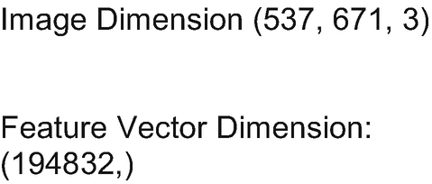

图 4-18

print()语句的维度输出

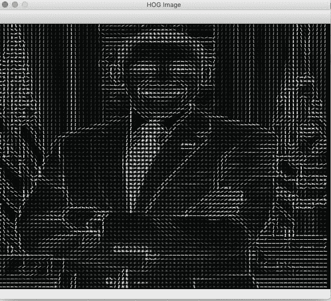

图 4-17

猪形象

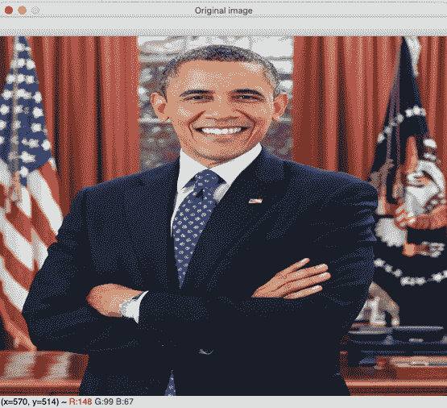

图 4-16

调整图像大小

### 垂直线间的距离

局部二值模式是一种用于图像纹理分类的特征描述符。LBP 特征提取的工作方式如下:

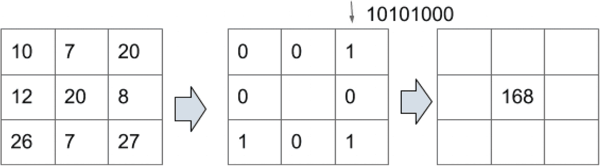

图 4-19

LBP 像素值计算

1.  对于图像中的每个像素，比较周围像素的像素值。如果周围像素的值小于中心像素，则标记为 0；否则 1。在图 [4-19](#Fig19) 中，中心像素的值为 20，周围有 8 个邻居。图 [4-19](#Fig19) 的中间部分显示了根据像素值是小于还是大于中心像素(本例中为 20)将像素值转换为 0 或 1。

2.  从邻居的任何一个像素开始，向任何方向移动，我们将 0 和 1 的序列组合成一个 8 位二进制数。在下面的例子中，我们从右上角开始，顺时针移动，将数字组合成 10101000 个二进制数。这个二进制数转换成十进制得到中心像素的像素值，如图 [4-19](#Fig19) 所示。

3.  对于图像中的每个像素，我们重复前面的步骤来获得基于邻居像素的像素值。确保所有像素的起始位置和方向保持一致。

4.  当所有像素都完成后，我们将像素值排列在一个 LBP 数组中。

5.  最后，我们计算 LBP 阵列的直方图。这个直方图被作为 LBP 特征向量。

这种计算 LBP 特征向量的方法允许我们捕捉图像纹理的更精细的细节。但是对于大多数机器学习分类问题，细粒度特征可能不会给出期望的结果，特别是当输入图像具有不同尺度的纹理时。

为了克服这个问题，我们有一个 LBP 的增强版本，如下所述。

LBP 的增强版本允许可变的邻域大小。现在，我们有两个额外的参数可以使用。

*   代替固定的正方形邻域，我们可以定义圆形对称邻域中的点数 *p* 。

*   圆的半径， *r* ，允许我们定义不同的邻域大小。

图 [4-20](#Fig20) 显示了绿点的点数和半径变化的虚线圆。半径越小，捕捉的纹理越精细。增加半径使我们能够对不同尺度的纹理进行分类。

我们现在准备学习如何实现 LBP。我们将再次使用 scikit-image(特别是来自`skimage`包的`feature`子包)。以下是我们将用于 LBP 计算的函数签名:

```py
local_binary_pattern(image, P, R, method="default")

```

参数解释如下:

`image`:灰度图像的 NumPy 表示。

`P`:沿着围绕计算 LBP 的点的圆的邻近点的数量。这是图 [4-20](#Fig20) 中绿点的数量。

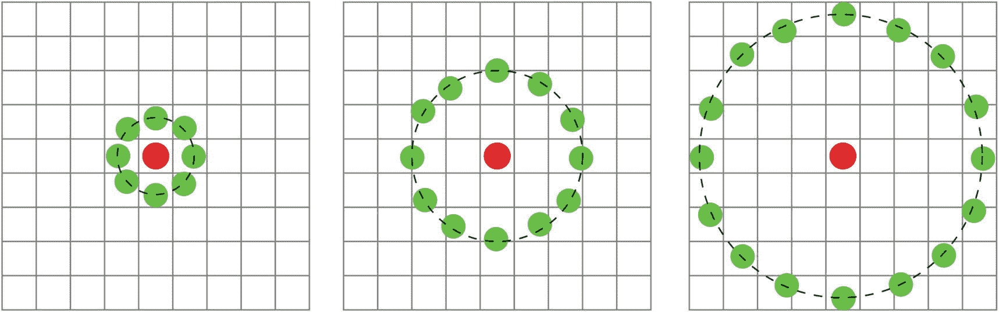

图 4-20

基于邻域大小和点数的 LBP 计算

`R`:浮点数，定义圆的半径。

`method`:该参数取以下任意一个字符串值:`default`、`ror`、`uniform`或`var`。这些方法值的含义解释如下:

*   `default`:指示函数根据灰度计算原始 LBP，不考虑旋转不变量。旋转不变二进制描述符的描述超出了本书的范围。要了解这方面的更多信息，请查看 [`http://ivg.au.tsinghua.edu.cn/~jfeng/pubs/Xuetal_TIP14_Descriptor.pdf`](http://ivg.au.tsinghua.edu.cn/%257Ejfeng/pubs/Xuetal_TIP14_Descriptor.pdf) 的论文“OSRI:旋转不变的二元描述符”。

*   `ror`:该方法指示函数使用旋转不变的二进制描述符。

*   `uniform`:这使用了改进的旋转不变性，具有均匀的模式和角度空间的更精细的量化，是灰度和旋转不变的。如果在二进制数字序列中至多有两个 0-1 到 1-0 的转换，则认为二进制模式是一致的。例如，00100101 是一个统一的模式，因为它有两个转换(显示为红色和蓝色)。类似地，00010001 也是均匀模式，因为它有一个 0-1 到 1-0 的转换。另一方面，01010100 不是一个统一的模式。在 LBP 直方图的计算中，直方图对于每个均匀模式具有单独的仓，并且所有非均匀模式被分配到单个仓。使用统一的模式，单个细胞的特征向量的长度从 256 减少到 59。

*   `nri_uniform`:非旋转不变均匀模式变体，仅灰度不变。

*   `var`:局部图像纹理对比度的旋转不变方差度量，具有旋转不变性，但不具有灰度不变性。

函数`local_binary_pattern()`的输出是表示 LBP 图像的 n 数组。

我们已经介绍了足够的背景知识，可以开始实施 LBP 并看到它的实际应用。清单 [4-7](#PC12) 演示了`local_binary_pattern()`函数的用法。

它首先从磁盘加载图像，调整其大小，并将其转换为灰度。

第 12 行计算原始图像的直方图。第 14 行到第 16 行绘制了原始图像直方图。

```py
Filename: Listing_4_7.py
1    import cv2
2    import numpy as np
3    from skimage import feature as sk
4    from matplotlib import pyplot as plt
5
6    #Load an image from the disk, resize and convert to grayscale
7    image = cv2.imread("images/obama.jpg")
8    image = cv2.resize(image, (int(image.shape[0]/5), int(image.shape[1]/5)))
9    image = cv2.cvtColor(image, cv2.COLOR_BGR2GRAY)
10
11   # calculate Histogram of original image and plot it
12   originalHist = cv2.calcHist(image, [0], None, [256], [0,256])
13
14   plt.figure()
15   plt.title("Histogram of Original Image")
16   plt.plot(originalHist, color='r')
17
18   # Calculate LBP image and histogram over the LBP, then plot the histogram
19   radius = 3
20   points = 3*8
21   # LBP calculation
22   lbp = sk.local_binary_pattern(image, points, radius, method='default')
23   lbpHist, _ = np.histogram(lbp, density=True, bins=256, range=(0, 256))
24
25   plt.figure()
26   plt.title("Histogram of LBP Image")
27   plt.plot(lbpHist, color='g')
28   plt.show()
29
30   #showing the original and LBP images
31   cv2.imshow("Original image", image)
32   cv2.imshow("LBP Image", lbp)
33   cv2.waitKey(0)

Listing 4-7LBP Image and Histogram Calculation and Comparison with Original Image

```

LBP 图像的计算在第 22 行执行。注意，我们使用默认方法计算 LBP，半径为 3，点数为 24。第 22 行使用了`skimage`包的`feature`子包中的`local_binary_pattern()`函数。

第 23 行计算了 LBP 图像的直方图。为什么我们使用了 NumPy 的直方图函数？如果您尝试对 LBP 图像使用`cv2.calcHist()`函数，您将会收到一条错误消息，提示“-210 不支持的格式或格式组合。”这是因为`local_binary_pattern()`的输出格式不同，OpenCV 的`calcHist()`函数不支持。出于这个原因，我们使用 NumPy 的`histogram()`功能。

图 [4-21](#Fig21) 为原图。我们来看看清单 [4-7](#PC12) 的输出。图 [4-22](#Fig22) 是从输入图像计算出的 LBP 图像(图 [4-21](#Fig21) )。请注意它是如何巧妙地捕捉到原始图像的纹理的。比较图 [4-23](#Fig23) 和图 [4-24](#Fig24) 分别从原始图像和 LBP 图像绘制的直方图。

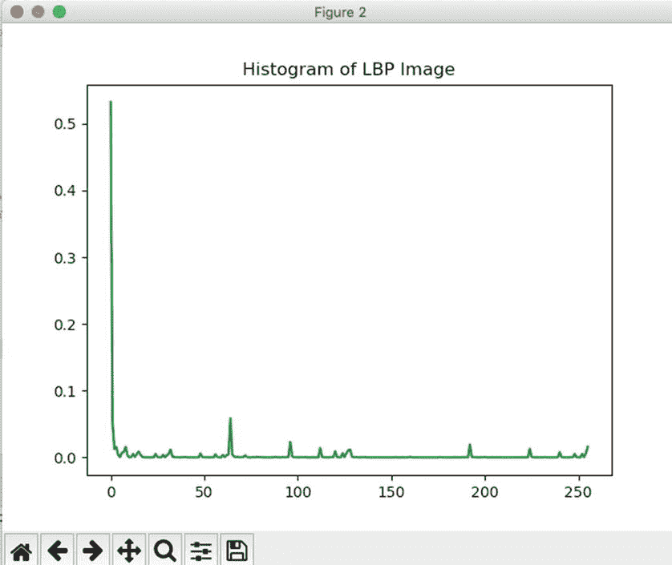

图 4-24

LBP 图像的直方图

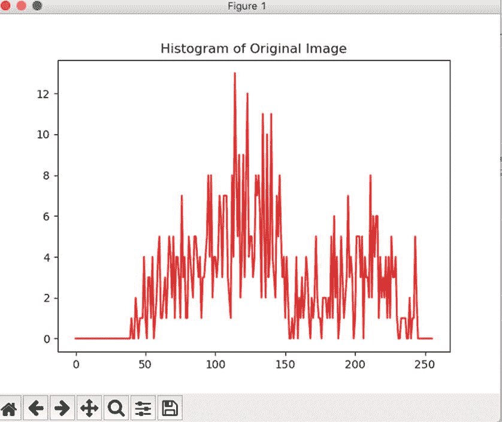

图 4-23

原始图像的直方图

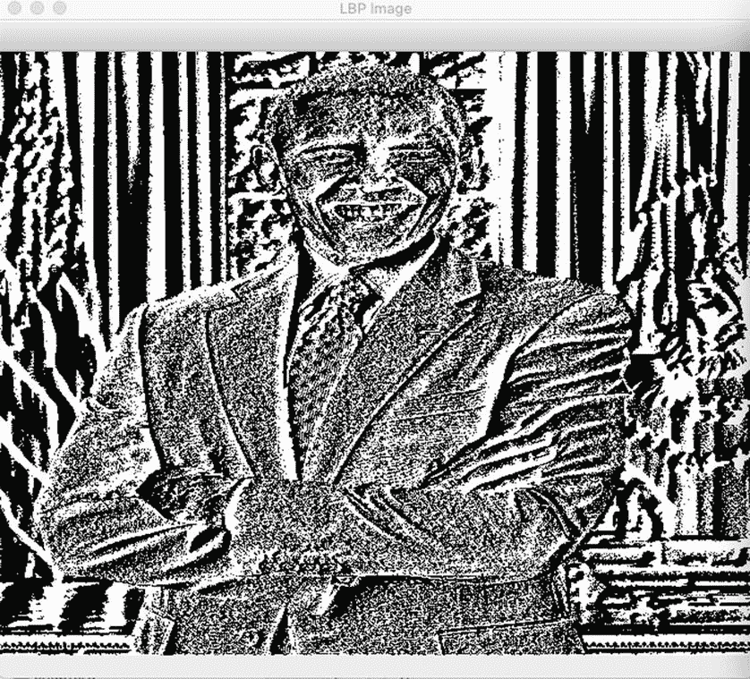

图 4-22

LBP 图像

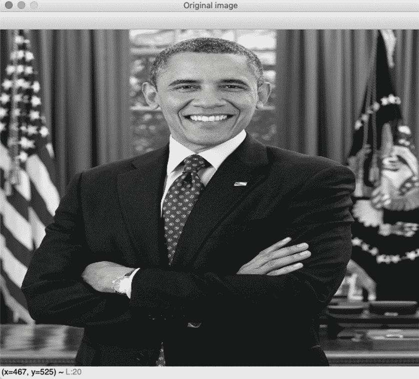

图 4-21

原始灰度图像

请注意，有时 LBP 与 HOG 一起使用，以提高对象检测的准确性。

在本节中，我们的重点是学习不同的技术来执行特征提取。我们重点学习了这些特征提取技术的概念，这将在下一章学习机器学习和神经网络时有所帮助。我们将在第 [6](06.html) 到 [9](09.html) 章开发真实世界的用例时利用这些概念。

本章的下一节是关于特征选择策略。

## 特征选择

在机器学习中，*特征选择*是选择与模型训练相关且有用的变量或属性的过程。这是一个消除不必要或不相关的特征并选择对模型学习有重要贡献的特征子集的过程。了解特征选择的原因如下:

*   降低模型的复杂性并使其更易于解释

*   为了减少机器学习训练时间

*   通过输入正确的变量集来提高模型的准确性

*   为了减少过度拟合

那么，特征选择和特征提取有什么不同呢？特征提取是创建特征的过程，而特征选择是利用特征子集或去除不必要特征的过程。特征提取和选择统称为*特征工程*。

统计证明，存在一个最佳特征数量，超过这个数量，模型性能开始下降。问题是，我们如何知道最佳数量是多少，以及我们如何决定使用哪些功能，不使用哪些功能？本节试图回答这个问题。

有许多特征选择技术。我们现在将探索用于机器学习的一些常见特征选择技术。

### 过滤方法

您有一个特征集，并且您想要选择一个子集来提供给您的机器学习算法。换句话说，您希望在机器学习被触发之前已经选择了特征。过滤是一个允许您进行预处理以选择特征子集的过程。在此过程中，您将确定特征和目标变量之间的相关性，并根据统计分数确定它们之间的关系。注意，过滤过程独立于任何机器学习算法。仅基于特征变量和目标变量之间的关系来选择(或拒绝)特征。有几种统计方法可以帮助我们根据目标变量对特征进行评分。

下表提供了选择方法以确定特征-目标关系的实用指南:

<colgroup><col class="tcol1 align-left"> <col class="tcol2 align-left"> <col class="tcol3 align-left"></colgroup> 
| 

特征变量类型

 | 

目标变量类型

 | 

统计方法名称

 |
| --- | --- | --- |
| 连续的 | 连续的 | 皮尔逊相关 |
| 连续的 | 绝对的 | 线性判别分析(LDA) |
| 绝对的 | 绝对的 | 卡方检验 |
| 绝对的 | 连续的 | 方差分析 |

对这些统计方法的描述超出了本书的范围。关于这些古老的方法，有各种各样的书籍和在线资源。

### 包装方法

在包装方法中，您使用特征的子集并训练模型。评估模型，并根据结果添加或移除特征并重新训练模型。重复这个过程，直到你得到一个精度可以接受的模型。这更像是一种试错法来寻找正确的功能子集。另外，这在计算上是很昂贵的，因为你必须实际构建多个模型(并且很可能扔掉所有你不满意的)。

有几种方法实际用于在包装方法下执行特征选择，如下所示:

*   *正向选择*:从一个特征开始，建立并评估模型。迭代地，不断添加能够最好地改进模型的特性。

*   *逆向淘汰*:从所有特征入手，建立并评估模型。通过消除特征进行迭代，直到获得最佳模型。重复此操作，直到在特征移除上没有观察到改进。

*   *递归特征消除*:在递归特征消除过程中，我们重复创建模型，并在每次迭代中留出性能最好或最差的特征。这些特征或者按照它们的系数或者按照特征的重要性排序，最不重要的特征被排除。递归地，我们用剩余的特性创建新的模型，直到所有的特性都用尽。

### 嵌入式方法

在嵌入式方法中，特征选择由机器学习算法在模型被训练时完成。用于回归算法的 LASSO 和 RIDGE 正则化方法就是此类算法的示例，其中评估了对模型精度有贡献的最合适的特征。

Lasso 回归使用 L1 正则化，并添加一个相当于系数大小绝对值的惩罚。

岭回归使用 L2 正则化，并添加一个相当于系数大小平方的惩罚。

由于模型本身评估特征的重要性，这是特征选择的最便宜的方法之一。

这本书是关于如何构建基于机器学习和深度学习的计算机视觉应用。虽然特征提取和选择是任何机器学习算法的重要部分，这本书只涵盖了关于它的介绍性信息。这是一个很大的主题，值得为这个主题写一本单独的书。

## 模特培训

让我们回顾一下图 [4-2](#Fig2) 中的图像处理流程。到目前为止，我们已经学习了如何摄取图像并进行预处理以提高图像质量。这种预处理使我们能够将输入图像转换成适合流水线中的下一个步骤的格式:特征提取和选择。在本章的前一节，我们探讨了特征工程的各种技术。我希望你已经掌握了目前为止提出的概念，并且你已经准备好学习应用于计算机视觉的机器学习。

### 如何进行机器学习

假设您已经从大量图像中提取并选择了特征。顺便问一下，什么是大数字？嗯，这个问题没有幻数可以回答。该数字应该是我们试图建模的实际场景的真实(或者至少接近真实)表示。记住，好的特性集的特征之一是可重复性。虽然没有很好的方法来得出一个“大”的数字，但是经验法则是“越多越好”才能得到一个好的模型结果。

这些特征集被馈送给数学算法以确定某些模式(我们将在后面更多地讨论这些算法)。算法的输出被称为一个*模型*，创建这个模型的过程被称为*训练模型*。换句话说，计算机使用一种算法从输入特征集中学习模式。用于训练模型的特征集被称为*训练集*。见图 [4-25](#Fig25) 。

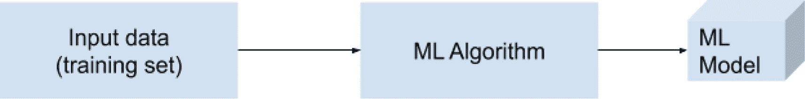

图 4-25

ML 模型训练图解

概括地说，有两种类型的训练集，因此也有两种类型的机器学习:监督学习和非监督学习。这些将在下面描述。

### 监督学习

假设你有一个 8×8 的图像，所有 64 个像素的值就是你的特征。此外，假设您有几个这样的图像，并且已经从中提取了像素值来构成一个特征集。一幅图像的所有 64 个特征被排列成一个数组(或向量)。特征集将具有与训练集中的图像数量一样多的行，每行代表一个不同的图像。现在，使用该数据集，您希望训练一个模型，该模型可以将输入图像分类到某个类别。例如，您希望根据图像中包含的是一只狗还是一只猫来对图像进行分类(现在让我们保持简单)。

进一步假设这些训练图像已经被标记，这意味着它们已经被识别并被标记为哪个图像包含狗，哪个图像包含猫。这意味着我们已经为每张图片确定了正确的类别。

图 [4-26](#Fig26) 显示了一个带标签的训练集的样本。图 [4-26](#Fig26) 的第 1 列是唯一标识图像的图像 ID。第 2 列到第 65 列显示了所有 64 列的像素值(因为在本例中我们的图像尺寸是 8×8)。这些像素值一起形成了我们的特征向量(X)。最后一列是标签列(y ),狗的值为 0，猫的值为 1(标签必须是数字才能输入机器学习)。这些标签也被称为*目标变量*或*因变量*。

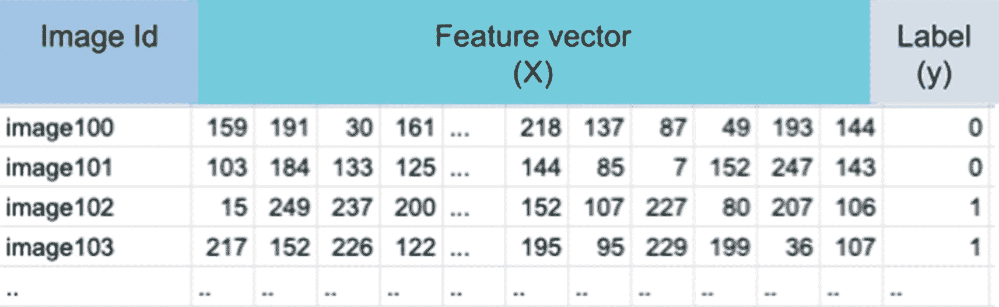

图 4-26

带有标注特征向量的数据集示例

当我们通过将包含特征向量和相关标签的数据集馈送给学习算法来训练机器学习模型时，它被称为*监督学习*。

监督学习算法(见图 [4-27](#Fig27) )通过优化一个以特征向量作为输入并生成标签作为输出的函数来学习。在下一章你将会学到更多关于各种优化函数的知识。

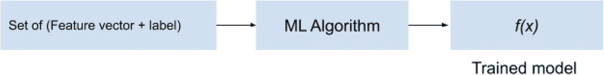

图 4-27

监督学习图解

有几种监督学习算法，如支持向量机(SVM)、线性回归、逻辑回归、决策树、随机森林、人工神经网络(ANN)和卷积神经网络(CNN)。

这本书是关于应用深度学习或神经网络(ANN 和 CNN)来训练计算机视觉的模型。在下一章中，你将学习关于这些深度学习算法的细节，以及如何为计算机视觉训练模型。

### 无监督学习

在前面的例子中，每个特征向量都有一个相关联的标签。这种标记数据集的学习目标是找到特征向量和标记之间的关系。如果没有与特征向量相关联的标签会怎样？换句话说，您对模型的输入只有特征向量，没有输出或标签，并且您希望您的机器学习算法从该输入数据集进行学习。你将从只有特征向量的数据集训练的模型被称为*无监督学习*。

无监督学习算法(见图 [4-28](#Fig28) )将仅包含特征向量的数据集作为输入，并确定数据中的结构或模式，如数据的分组或聚类。这意味着算法从没有任何标记数据的训练集中学习，并在数据中找到共性。

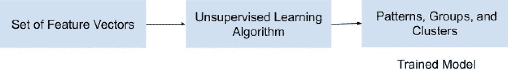

图 4-28

无监督学习

无监督学习用于对数据集进行聚类或分组。无监督学习的另一个应用是为你的监督学习算法创建标签。

一些常用的无监督算法是 K 均值聚类、自动编码器、深度信念网和 hebbian 学习。

这本书只涵盖计算机视觉中使用的监督学习。

## 模型部署

那么，在你创建了一个经过训练的机器学习模型之后，会发生什么呢？

在回答这个问题之前，让我们先了解一下我们用一个训练好的模型做什么。

在监督学习的情况下，经过训练的模型为我们提供了一个函数，该函数将一个特征集作为输入，并给我们一个输出。输出通常被称为*预测*。换句话说，模型根据输入数据预测结果。这种预测可以是连续的值或类。

类似地，在无监督学习的情况下，经过训练的模型采用一个特征集，并作为输入特征所属的组或聚类给出输出。分组或聚类可进一步用于创建监督学习的标签。

现在，为了回答我们的第一个问题，我们部署了一个经过训练的模型，以便我们可以预测或分类外部业务应用可能提供的图像(或输入数据集)。基于业务用例，这些预测/分类用于各种分析和决策制定。

输入图像可能由一些外部应用生成。这些图像以与在用于模型训练的特征工程期间处理图像相同的方式被摄取和处理。从摄取的图像中提取特征，并传递给模型函数以获得预测或分类。

虽然模型开发是一个迭代的过程，但是一旦模型给出了可接受的准确性，我们通常会对模型进行版本化，并在生产中部署它。在实践中，直到准确度开始下降，或者直到用新数据集重新训练有望提高准确度，才改变模型或者用新数据重新训练模型。

然而，一个模型被期望比重新训练模型更频繁地使用。在某些情况下，每秒可能需要预测或分类数百或数千个输入图像。在其他情况下，我们可能需要在一天内或以一定的频率批量分类数百万张图像。因此，我们需要以这样一种方式部署我们的模型，即它们可以根据输入量和处理负载进行伸缩。

拥有正确的部署架构对于我们能够在生产中有效地利用模型是至关重要的。让我们探索在生产中为模型服务的不同方式。

*   *嵌入式模型*:模型工件被用作消费应用代码中的依赖项。它是与调用模型函数作为内部库函数的应用一起构建和部署的。对于边缘计算设备的嵌入式应用(如物联网)，这是一种很好的方法，但不适合数据量大且处理需要扩展的企业应用。此外，在这种情况下，部署新版本的模型更加困难；您可能需要重新构建整个应用代码并再次部署。

*   *作为独立服务部署的模型*:在这种方法中，模型被包装在服务中。服务是独立部署的，并与消费应用相分离。这允许我们在不影响其他应用的情况下更新和重新部署模型。消费应用通过远程调用进行服务调用，这可能会带来一些延迟。

*   作为 RESTful web 服务部署的模型:这类似于前面描述的方法。在这种情况下，使用 TCP/IP 协议通过 RESTful API 调用来调用模型。这种方法提供了可伸缩性和负载平衡，但是网络延迟可能是一个问题。

*   *为分布式处理部署的模型*:这是一个高度可伸缩的模型部署。在这种方法中，输入图像(数据集)存储在一个集群的所有节点都可以访问的分布式存储中。模型部署在所有集群节点中。所有参与节点从分布式存储中获取输入数据，对其进行处理，并将预测结果存储到分布式存储中供应用使用。分布式存储的一些例子是 Hadoop 分布式文件系统(HDFS)、亚马逊 S3、谷歌云存储和 Azure Blob 存储。

您将在第 [10](10.html) 章中了解如何在云上扩展模型开发和部署。

## 摘要

这一章，连同之前的所有章节，为使用人工神经网络开发计算机视觉应用奠定了坚实的基础。在这一章中，我们探讨了图像处理流水线、其组件以及它们在构建基于机器学习的计算机视觉系统中的作用。您学习了各种特征提取和选择技术。我们还在高层次上探索了不同的机器学习算法、模型训练和部署。

下一章第 [5 章](05.html)是本书的中心主题。在那一章中，我们将讨论各种机器学习模型，并实现应用于计算机视觉的 ANN、CNN、RNN 和 YOLO 模型。我们将使用 Keras 深度学习库编写 Python 代码，并在 TensorFlow 上执行。

这可能是一个完美的时间去回顾和回顾在所有以前的章节中提出的概念。如果您已经完成了所有的代码示例，那么您的开发环境很可能已经为下一章做好了准备。如果没有，返回第 [1](01.html) 章，安装所有必备软件，并准备好您的开发计算机。我们要做一些严肃的工作，学习一些真正有趣的东西。如果你们都准备好了，我们走吧！***