# 六、目标检测中的深度学习

在前一章中，我们发现了如何使用标准多层感知器(MLP)和卷积神经网络(CNN)对图像进行分类。在分类任务中，我们预测整个图像的类别，而不关心图像中的对象类型。在本章中，我们将检测图像中的对象及其位置。

本章的学习目标如下:

*   我们将探索一些用于对象检测的流行深度学习算法。

*   我们将在 GPU 上使用 TensorFlow 训练我们自己的对象检测模型。

*   我们将使用经过训练的模型来预测图像中的对象。

本章介绍的概念将在接下来的三章中用于开发真实世界的计算机视觉应用。

## 目标检测

对象检测涉及两组不同的活动:定位对象和分类对象。在图像中定位对象被称为*定位*，它通常通过在对象周围绘制边界框来执行。在深度学习算法变得流行之前，对象定位是通过标记图像中包含对象的每个像素来执行的。例如，使用边缘检测、绘制轮廓和猪等技术进行对象检测(重温第 [3](03.html) 和 [4](04.html) 章)。这些技术计算量大、速度慢且不准确。

与非深度学习算法相比，使用深度学习技术的对象检测已被证明更快且更准确。学习过程通常是计算密集型的，但是实际检测是快速的，并且适合于实时检测对象。例如，基于深度学习的对象检测被用于以下情况:

*   无人驾驶汽车

*   机场安检

*   视频监控

*   工业生产中的缺陷检测

*   工业质量保证

*   面部识别

用于对象检测的深度学习算法已经随着时间的推移而发展。在这一章中，我们将学习两种不同的用于目标检测的卷积神经网络:两步卷积和单步卷积。一个*基于区域的卷积神经网络* (R-CNN)是两步算法。*你只看一次*(YOLO)*单镜头检测* (SSD)都是单步算法进行目标检测的例子。

在我们深入研究对象检测算法之前，我们将定义一个重要的度量，称为并集上的*交集，它广泛用于对象检测器中。*

## 并集上的交集

交集/并集(IoU)，也称为 Jaccard 指数，是目标检测算法中最常用的评估指标之一。它用于测量两个任意形状的同一性。

在对象检测中，我们通过在对象周围绘制边界框进行标记来创建训练集。训练集中的这些边界框也被称为*基本事实*。在模型学习期间，对象检测算法预测边界框，并将它们与真实情况情况进行比较。IoU 用于评估预测边界框与真实情况重叠的紧密程度。

使用图 [6-1](#Fig1) 所示的公式计算预测边界框 A 和地面真值框 B 之间的 IoU。

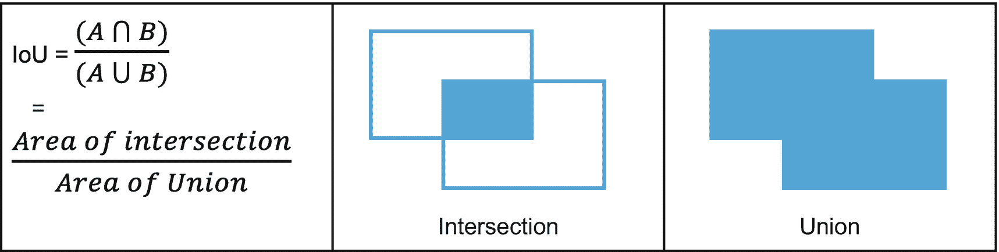

图 6-1

借据

当我们给图像加标签时，我们通常在图像中的对象周围画出矩形框。物体周围的这个矩形区域就是地面真相。在图 [6-2](#Fig2) 中，地面实况由绿色矩形框显示。

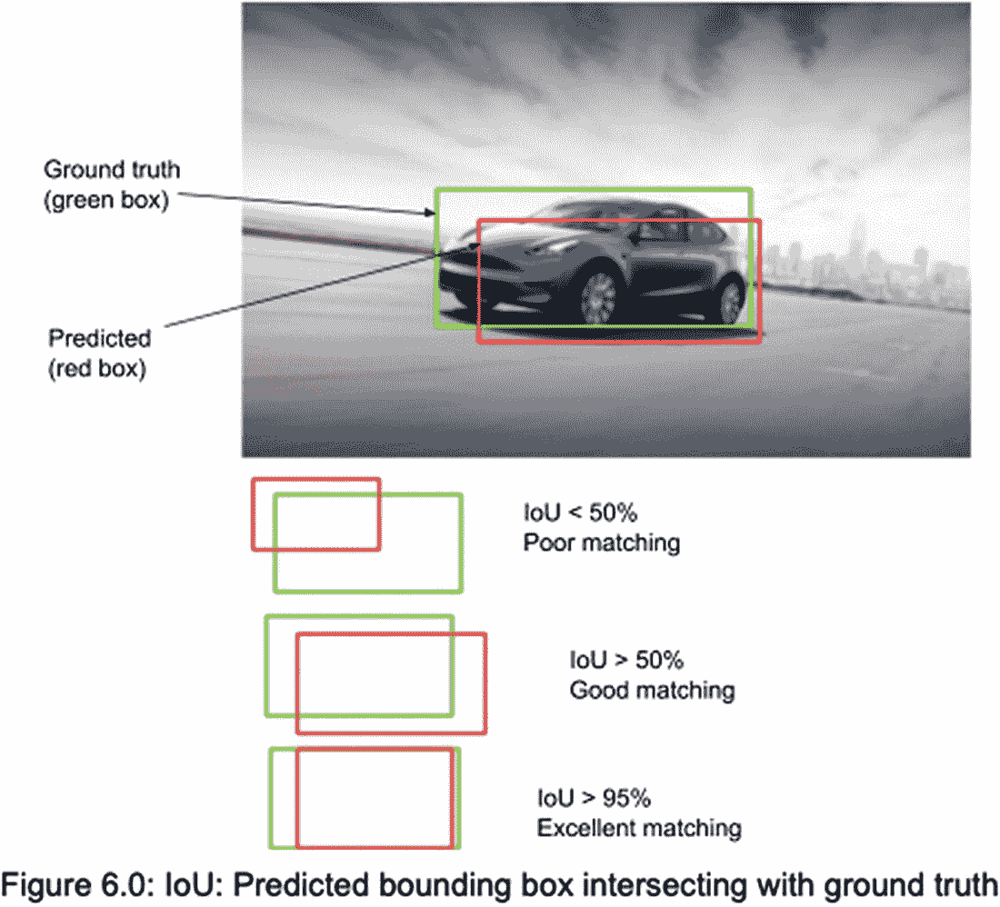

图 6-2

IoU，与地面真值相交的预测边界框

当算法学习时，它会预测对象周围的边界框。在图 [6-2](#Fig2) 中，红色矩形区域是预测的边界框。

学习算法计算基本事实和预测边界框之间的 IoU。如果预测值和实际值之间的 IoU 小于 50 %,则认为预测值和实际值不匹配。如果 IoU 在 50%到 95%之间，则认为匹配良好。大于 95%的借据被认为是极好的匹配。

目标检测算法的学习目标是优化 IoU。

现在让我们来探索用于对象检测的各种深度学习算法。我们还将回顾它们的优势和劣势，以及它们之间的比较。

## 基于区域的卷积神经网络

R-CNN 是第一个使用大型卷积神经网络来检测图像中对象的成功模型。Ross Girshick 等人在他们 2014 年题为“精确对象检测和语义分割的丰富特征层次”( [`https://arxiv.org/pdf/1311.2524.pdf`](https://arxiv.org/pdf/1311.2524.pdf) )的论文中描述了该检测方法。图 [6-3](#Fig3) 展示了 R-CNN 方法。

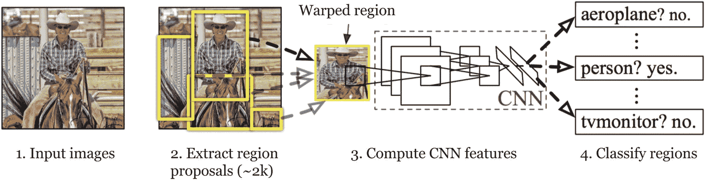

图 6-3

R-CNN 模型(图片来源:Girshick 等人)

R-CNN 由以下三个模块组成:

*   *区域提议*:R-CNN 算法首先在图像中找到可能包含物体的区域。这些地区被称为*地区提案*。它们被称为*建议*，因为这些区域可能包含也可能不包含对象，并且学习函数的目标是消除那些不包含对象的区域。这些区域建议是对象周围的边界框(如图 [6-3](#Fig3) ，图 2 所示)。

    Girshick 等人提出的 R-CNN 系统对于找到区域提议的算法是不可知的。这意味着你可以使用任何算法，比如 HOG，来寻找这些区域。他们使用了一种被称为选择性搜索的算法。选择性搜索算法通过不同大小的网格查看图像。对于每个网格大小，该算法试图通过比较纹理、颜色或像素值来识别对象，从而将相邻像素分组在一起。使用这种方法，可以创建区域方案。总之，该算法创建了一组潜在目标对象的边界框。

*   *特征提取*:从图像中裁剪出区域建议并调整大小。这些裁剪后的图像然后被传送到标准的 CNN 以提取特征(图 [6-3](#Fig3) ，图 3)。根据原始论文，使用 AlexNet 深度学习 CNN 进行特征提取。从每个区域中，提取 4096 维特征向量。

*   *分类器*:使用标准的分类算法对提取的特征进行分类，如线性 SVM 模型(图 [6-3](#Fig3) 的图 4)。

R-CNN 是第一个成功的基于深度学习的对象检测系统，但它在性能方面遇到了严重的问题。其时间性能问题是由于以下原因:

*   每个区域提议被传递给 CNN 进行特征提取。这可能相当于每幅图像大约 2000 遍。

*   需要训练三个不同的模型:用于特征提取的 CNN，用于预测图像类别的分类器模型，以及用于收紧边界框的回归模型。训练是计算密集型的，并且增加了计算时间。

*   需要预测每个区域提案。因为地区的数量，CNN 的预测会很慢。

## 快速 R-CNN

为了克服 R-CNN 的局限性，来自微软的 Ross Girshick 在 2015 年发表了一篇题为“快速 R-CNN”的论文，提出了一个单一的模型来学习并直接输出区域和分类( [`https://arxiv.org/pdf/1504.08083.pdf`](https://arxiv.org/pdf/1504.08083.pdf) )。

快速 R-CNN 也使用一种算法，例如边缘框，来生成区域提议。与裁剪和调整区域提议的 R-CNN 不同，快速 R-CNN 处理整个图像。快速 R-CNN 不是对每个区域进行分类，而是将对应于每个区域提议的 CNN 特征汇集在一起。

图 [6-4](#Fig4) 展示了快速 R-CNN 架构。它将整个图像作为输入，并生成一组区域建议。深度 CNN 的最后一层有一个特殊的层，叫做*感兴趣区域* (ROI)池层。ROI 汇集层从特定于给定输入候选区域的特征图中提取固定长度的特征向量。

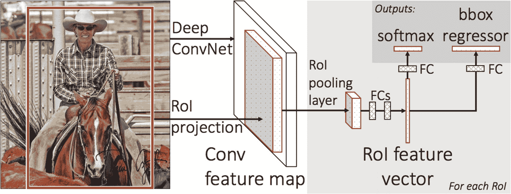

图 6-4

快速 R-CNN 架构(图片来源:Ross Girshick)

来自 ROI 池的每个 ROI 特征向量被馈送到全连接 MLP，该全连接生成两组输出-一组用于对象类，另一组用于边界框。softmax 激活函数预测对象类，线性回归器生成对应于预测类的边界框。对 ROI 池中的每个感兴趣区域重复该过程。

正如原始论文所述，Ross Girshick 将 VGG-16 的快速 R-CNN 应用于微软 COCO 数据集，以建立初步基线。COCO 数据集( [`http://cocodataset.org/`](http://cocodataset.org/) )是大规模的对象检测、分割和字幕数据集，可在公共领域免费获得。快速 R-CNN 训练集由 80，000 幅图像组成，训练迭代了 240，000 个时期。模型质量评估如下:

*   PASCAL 对象数据集的平均精度(mAP):35.9%

*   COCO 数据集的平均精度(AP)为 19.7%

与 R-CNN 相比，快速 R-CNN 在训练和预测方面要快得多。然而，对于每个输入图像，它仍然需要一组候选区域提议，并且单独的模型预测这些区域。

## 更快的 R-CNN

微软研究院的任等人在 2016 年发表了一篇题为“更快的 R-CNN:利用区域提议网络实现实时对象检测”( [`https://arxiv.org/pdf/1506.01497.pdf`](https://arxiv.org/pdf/1506.01497.pdf) )的论文。本文从训练速度和检测精度的角度描述了快速 R-CNN 的改进版本。除了区域提议方法之外，更快的 R-CNN 在架构上类似于快速 R-CNN。

更快的 R-CNN 架构由区域提议网络(RPN)组成，该网络与检测网络共享完整图像卷积特性，从而实现几乎无成本的区域提议。

RPN 是一个完全卷积的网络。它同时预测图像每个位置的对象边界和对象性得分。RPN 接受端到端的培训，以生成高质量的区域建议书。这些区域提议被快速 R-CNN 用于检测。如图 [6-5](#Fig5) 所示。

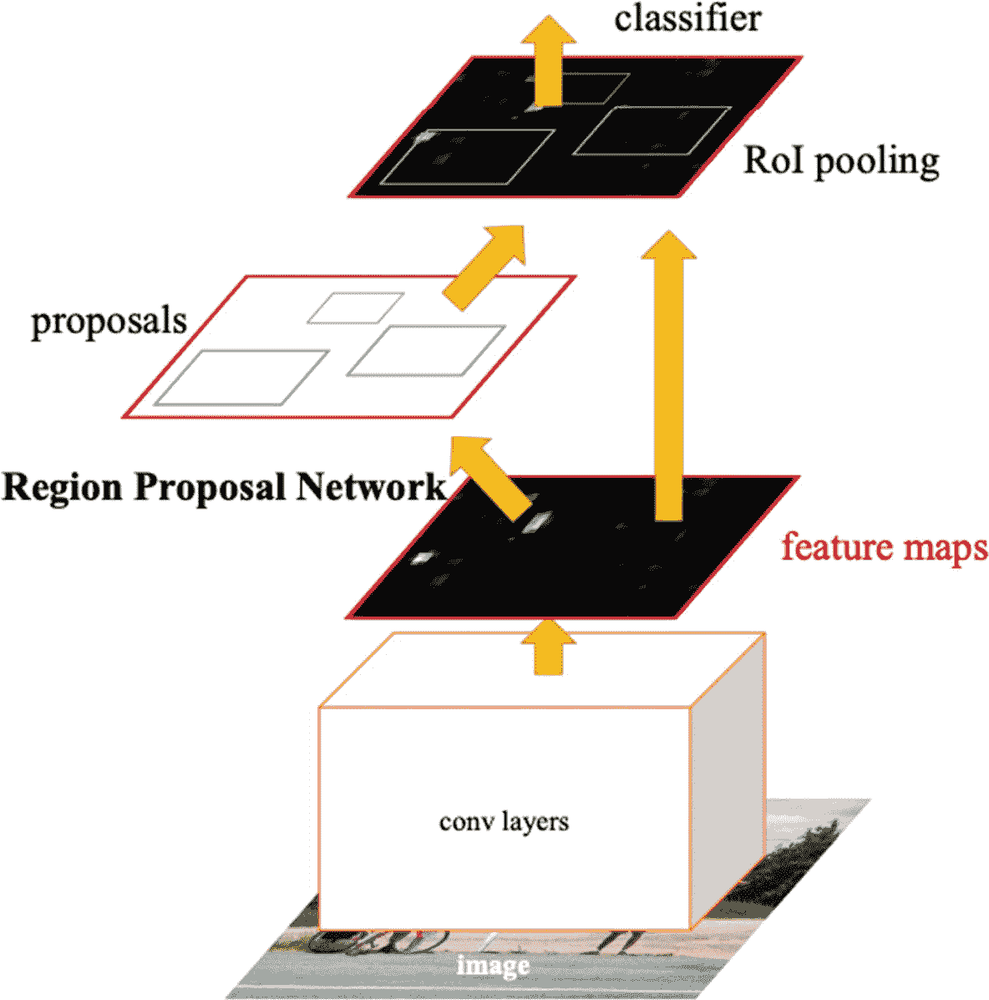

图 6-5

更快的 R-CNN 与 RPN，一个更快的目标检测的统一网络(图片来源:邵青任等)

更快的 R-CNN 由两部分组成:RPN 和快速 R-CNN。

### 区域提案网络

RPN 是一种深度 CNN，它接受图像输入，并生成作为一组矩形对象提议的输出。每个矩形提议都有一个“反对”分数。

图 [6-6](#Fig6) 显示了 RPN 如何生成区域建议。我们取最后共享的卷积层生成的卷积特征图，滑动一个小网络。这个小网络将输入卷积特征图的一个 *n* × *n* 空间窗口作为输入。每个滑动窗口被映射到较低维度的特征，例如 AlexNet 的 256 维特征或 VGG-16 的 5126 维特征。

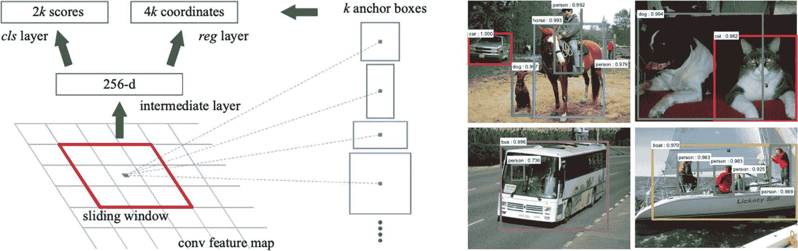

图 6-6

使用滑动窗口和锚点的区域检测(图片来源:任等)

此要素被提供给两个完全连接的同级图层-用于预测边界框的盒回归图层和用于预测对象类的盒分类图层。

在每个滑动窗口位置预测多个区域提议。假设在每个窗口位置的最大提议数是 k，边界框坐标的总数将是 4k，对象类的数目将是 2k(一个是对象的概率，另一个不是对象的概率)。每个窗口的这些区域框被称为*锚点*。

### 快速 R-CNN

更快的 R-CNN 的第二部分是检测网络。这部分和快速 R-CNN(如前所述)完全一样。快速 R-CNN 从 RPN 获取输入来检测图像中的对象。

## 屏蔽 R-CNN

掩码 R-CNN 扩展了更快的 R-CNN。更快的 R-CNN 由于其检测速度而被广泛用于对象检测任务。我们已经看到，对于给定的图像，更快的 R-CNN 预测图像中每个对象的类别标签和边界框坐标。遮罩 R-CNN 增加了一个额外的分支，用于预测对象遮罩以及对象类别和边界框坐标(查看第 [3](03.html) 章中的遮罩概念)。

以下是 R-CNN 与其前身更快的 R-CNN 的不同之处:

*   更快的 R-CNN 有两个输出:类别标签和边界框坐标。

*   遮罩 R-CNN 有三个输出:类别标签、边界框坐标和对象遮罩。

Ross Girshick 等人在他们 2017 年题为“Mask R-CNN”([`https://arxiv.org/pdf/1703.06870.pdf`](https://arxiv.org/pdf/1703.06870.pdf))的论文中解释了 Mask R-CNN。在掩模 R-CNN 中，每个像素被分类到一组固定的类别中，而不区分对象实例。它在神经网络的输出层和输入层之间引入了一个叫做*像素到像素对齐*的概念。每个像素的类别决定了 ROI 中的遮罩。

图 [6-7](#Fig7) 说明了 Mask R-CNN 网络架构。

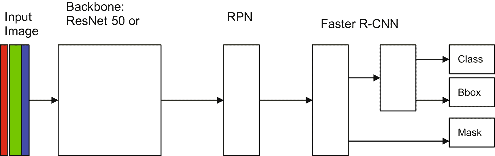

图 6-7

屏蔽 R-CNN。快速 R-CNN 中的附加掩码预测分支

如图 [6-7](#Fig7) 所示，网络由三个模块组成——主干、RPN 和输出头。

### 毅力

主干是标准的深度神经网络。原始论文描述了使用 ResNet-50 和 ResNet-101。主干的主要作用是特征提取。

除了 ResNet，特征金字塔网络(FPN)用于提取图像的更精细的特征细节。

FPN 由 CNN 大小递减的层组成，在这种情况下，每个前层具有较少数量的神经元。

如图 [6-8](#Fig8) 所示，每一个更高的层将特征传递给更低的层，并且在每一层进行预测。较高图层的尺寸较小，这意味着要素尺寸将小于之前的图层。这种方法以不同的比例捕捉图像的特征，从而允许您检测图像中较小的对象。

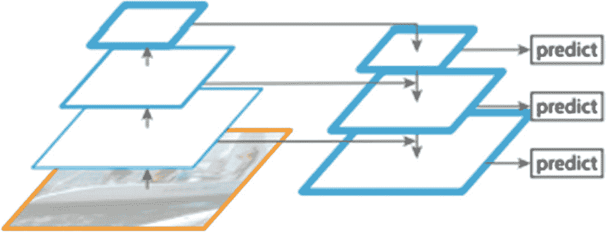

图 6-8

FPN(图像来源:Tsung-Yi Lin 等)

FPN 是主干网的附加部分，通常独立于 ResNet 或其他主干网执行。FPN 不仅可以添加到掩模 R-CNN，还可以添加到快速 R-CNN，以便能够检测不同大小的对象。

### RPN

如前所述，RPN 模块用于生成区域建议书。屏蔽 R-CNN 情况下的 RPN 架构与更快 R-CNN 情况下的相同。

### 输出头

如图 [6-8](#Fig8) 所示，最后一个模块由更快的 R-CNN 和一个额外的输出分支组成。因此，该模块总共产生三个输出。输出——对象类和边界框坐标——与快速 R-CNN 的情况相同。第三个输出是对象遮罩，它是定义对象轮廓的像素列表。

### 面具的意义是什么？

遮罩 R-CNN(类似于更快的 R-CNN)生成对象类和边界框。这两者的结合有助于我们在图像中定位物体。从网络输出的掩模用于对象分割。这种对象分割广泛用于光学字符识别(OCR)中，以从文档中提取文本。R-CNN 使用屏蔽的另一个例子是在机场安检中，旅客的行李通过屏蔽进行扫描和可视化。图 [6-9](#Fig9) 显示了屏蔽 R-CNN 的典型显示。

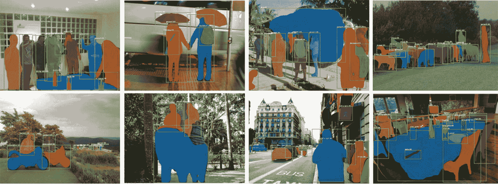

图 6-9

显示带有边框和遮罩的图像(图像来源:Ross Girshick 等人)

### 人体姿态估计中的掩模 R-CNN

面罩 R-CNN 的一个有趣的用途是估计人的姿势。该网络可被扩展为将关键点的位置建模为一键掩码。关键点被定义为图像上感兴趣的点。对于人类，这些关键点代表主要关节，如肘、肩或膝。选择关键点，使得它们不会随着旋转、移动、收缩、平移和扭曲而改变。掩模 R-CNN 被训练来预测 *K* 个掩模，每个掩模对应于 *K* 个关键点类型(例如，左肩、右肘)。见图 [6-10](#Fig10) 。

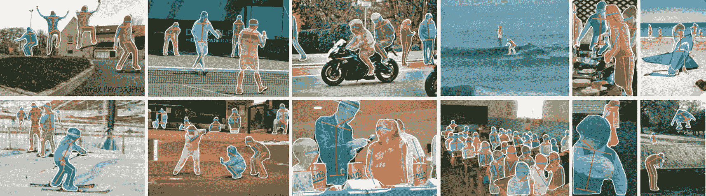

图 6-10

使用关键点预测显示人体姿态估计(图片来源:Ross Girshick 等人)

为了训练网络来估计人体姿态，训练图像用实例对象的 *K* 个关键点来标记。对于每个关键点，训练目标是一个一键 *m* × *m* 二进制掩码，其中只有一个像素被标记为前景。

根据原始论文，作者使用了一种变体的雷斯网-FPN 架构作为特征提取主干。头部结构(或输出模块)类似于常规面罩 R-CNN。关键点头部由八个 3×3 512-D 卷积层的堆叠组成，其后是去卷积层和 2×双线性放大。这产生了 56×56 的输出分辨率。据估计，关键点级定位精度需要相对高分辨率的输出(与掩模相比)。

## 单次多盒检测

R-CNN 及其变体是两级检测器。他们有两个专用网络:一个网络生成区域建议来预测边界框，另一个网络预测对象类。这些两级检测器相当精确，但是它们的计算成本很高。这意味着这些检测器不适合实时检测流视频中的对象。

单次对象检测器在网络的单次前向传递中预测边界框和对象类别。

单次多盒检测(SSD)是由刘威等人在 2016 年发表的题为“SSD:单次多盒检测器”( [`https://arxiv.org/pdf/1512.02325.pdf`](https://arxiv.org/pdf/1512.02325.pdf) )的论文中解释的。首先我们将回顾 SSD 的工作原理，在本章的后面，我们将使用 TensorFlow 训练一个自定义 SSD 模型。

### 固态硬盘网络架构

SSD 神经网络由两部分组成:基网络和预测网络。

*   *基网络*:基网络是深度卷积网络，在任何分类层之前被截断。例如，删除 ResNet 或 VGG 的全连接层，为 SSD 创建基础网络。基本网络用于从输入图像中提取特征。

*   *检测网络*:在基础网络上附加一些额外的卷积层，这些卷积层实际上会做包围盒和对象类的预测。检测网络具有以下特征。

#### 用于检测的多尺度特征图

连接到基础网络末端的卷积层的设计方式是这些层的大小逐渐减小。这让我们可以预测多种尺度下的物体。如图 [6-11](#Fig11) 所示。

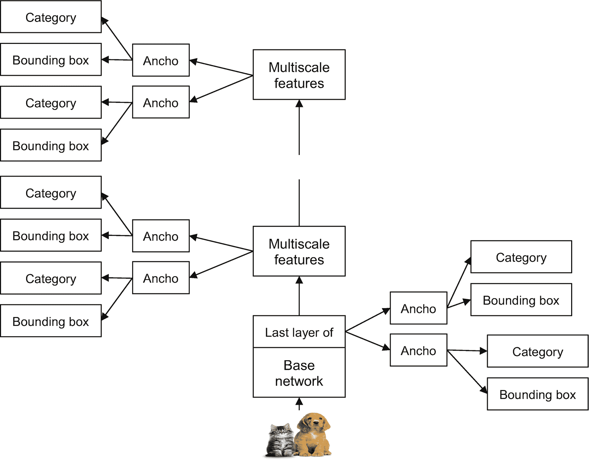

图 6-11

尺寸递减的卷积层，用于预测对象类别和比例范围内的边界框

如图 [6-11](#Fig11) 所示，每个检测层和可选的基础网络的最后一层预测边界框和对象类别类别的四个坐标的偏移。如何预测边界框和对象？通过锚箱。我们先来了解一下锚箱的概念。

##### 用于检测的锚盒和卷积预测器

锚点是在特征图的每个卷积点设置的一个或多个矩形形状。在图 [6-12](#Fig12) 中，有五个矩形锚点(显示为红色轮廓)设置在一个点(显示为蓝色)。

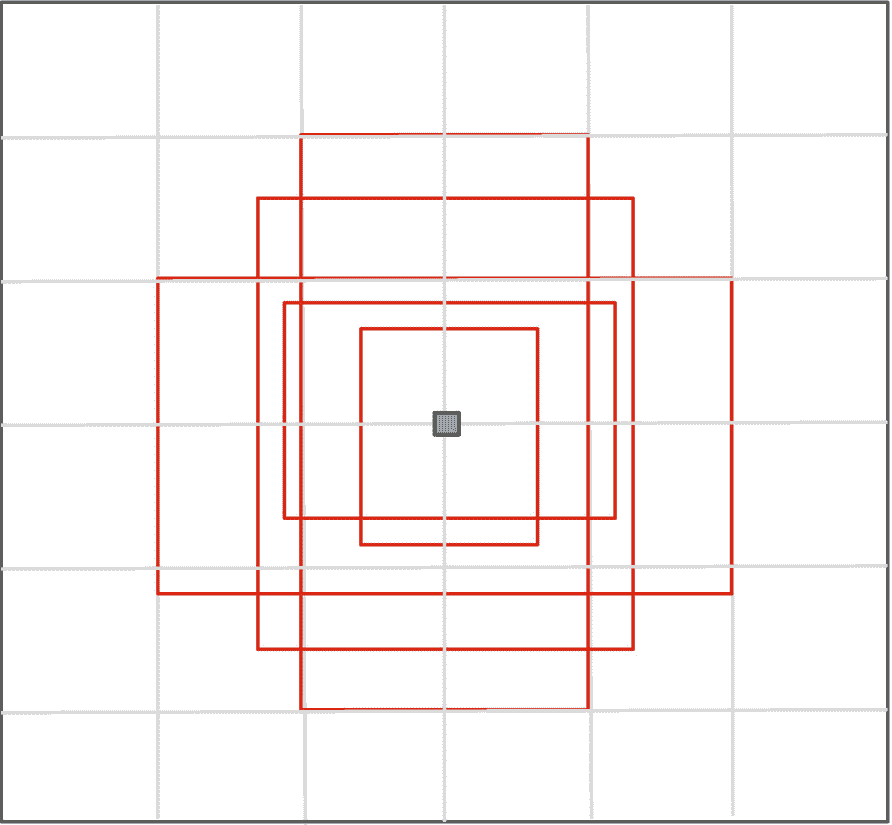

图 6-12

锚箱

在 SSD 中，通常在每个点选择五个锚盒。这些锚中的每一个都作为一个探测器。这意味着，在特征图的每个位置通常有五个检测器，每个检测器检测五个不同的对象(或者没有对象)。这些探测器的不同尺寸允许它们探测不同尺寸的物体。较小的探测器将探测较小的物体，而较大的探测器能够探测较大的物体。

在特征图上的每个卷积点(在图 [6-12](#Fig12) 中以蓝色显示)，算法预测边界框相对于锚框的偏移。它还预测类分数，这些分数指示每个框中类实例的存在。

#### 默认框和纵横比

值得注意的是，这些锚点是预先选择为常量的。在 SSD 中，一组固定的“默认锚点”被映射到每个卷积点。

假设每个位置有 *K* 个箱子；我们计算 *C* 类的分数和相对于默认框的四个偏移坐标。这将导致在每个卷积点周围总共有( *C* +4)× *K* 个滤波器。假设特征尺寸为 *m* × *n* ，输出张量尺寸将为(*C*+4)×*K*×*m*×*n*。

这些默认锚点应用于每个检测卷积层(如图 [6-11](#Fig11) 所示)。这些卷积层的大小逐渐减小，使我们能够生成不同分辨率的多个特征图。

图 [6-13](#Fig13) 显示了整体网络架构。

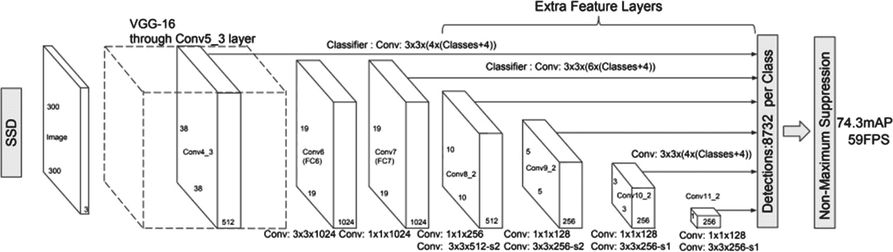

图 6-13

具有用于检测的附加卷积层的截断的骨干网(图像来源:刘等人，[https://arxiv . org/pdf/1512 . 02325 . pdf](https://arxiv.org/pdf/1512.02325.pdf)

### 培养

在下一节中，我们将探索 SSD 模型如何通过优化损失函数来学习，以及它遵循的对象匹配策略。

#### 匹配策略

在训练期间，该算法确定哪些默认框对应于地面实况，然后相应地训练网络。为了将默认框与地面实况相匹配，它使用 IoU 来确定重叠。这种基于 IoU 的重叠也被称为 Jaccard 重叠。0.5 的 IoU 阈值被视为确定默认框是否与任何地面实况重叠。使用 IoU 的这种重叠在每一层执行，允许网络大规模学习。SSD 从作为预测的默认框开始，并试图回归到更接近真实情况边界框。图 [6-14](#Fig14) 说明了默认框的重叠和选择的概念。


图 6-14

默认框与基础真值框的匹配

#### 培训目标

SSD 的学习目标是优化损失函数，该损失函数是所有匹配默认框的定位损失(loc)和置信度损失(conf)的加权和。

#### 为默认框选择比例和纵横比

SSD 网络的检测层的尺寸不断减小，这使得它能够学习不同的对象比例。随着训练的进行，特征图的尺寸减小。算法如何确定每层默认框的大小？

对于每个图层，该算法使用以下公式计算比例:

***S***<sub>***k***</sub>***= S***<sub>***min***</sub>***+{(S***<sub>***max***</sub>***—S***<sub>***min***</sub>

其中 *m* 为特征图的大小，*S*<sub>T5】min</sub>= 0.2 为最低层，*S*<sub>*max*</sub>= 0.9 为最高层。中间的所有其他层间距相等。回想一下，SSD 中使用了五个默认框。这些默认框是为不同的长宽比设置的:*a*<sub>*r*</sub>∈{ 1，2，3，，1/3}。使用以下公式计算每个默认框的宽度和高度:

宽度=**<sub>***【k】***</sub>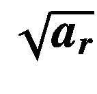**

 **高度=******/******

 ****对于长宽比为 1 的情况，另一个框的比例***【S’***<sub>***k***</sub>=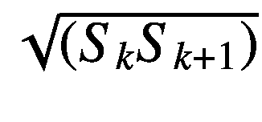进行计算。这意味着确定了每个要素地图的六个默认框。默认框的中心使用此公式设置: *** ( (i+0.5)/ |fk|，(j+0.5)/ |fk| ) *** ，其中 *|fk|* 为第 k 个正方形特征图的大小，I，j ∈ [0，|fk|)。

通过组合来自许多特征地图的所有位置的具有不同比例和纵横比的所有默认框的预测，生成了一组不同的预测。这涵盖了各种输入对象的大小和形状。

在下一节中，您将了解到 YOLO 使用 K-means 聚类来动态选择锚盒。此外，在 YOLO，这些锚被称为*先验*或*边界框先验*。

#### 硬负开采

在每个图层和每个要素地图上，都会创建许多默认框。在与地面实况(其中 IoU ≥ 0.5)匹配后，这些默认框中的大多数不会与地面实况重叠。这些不重叠的默认框(IoU < 0.5) are called *负框*)和那些与地面实况匹配的是正框。在大多数情况下，负面的数量远远高于正面的数量。这导致了等级不平衡，这将扭曲预测。为了平衡这些类，对负盒进行分类，取最上面的可能的负盒，并丢弃其余的，以使负∶正比率最多为 3∶1。已经发现，这个比率导致更快的优化。

#### 日期增加

SDD 对各种输入对象大小和形状都是鲁棒的。为了增强鲁棒性，每个训练图像都通过以下选项之一进行采样:

*   使用整个原始图像。

*   对一个贴片进行采样，使最小 IoU 为 0.1、0.3、0.5、0.7 或 0.9。

*   随机抽取一个补丁。

每个样品的特征如下:

*   每个采样的小块的大小是原始图像大小的[0.1，1]。

*   纵横比介于和 2 之间。

*   如果地面真值框的中心在采样面片中，则保留地面真值框的重叠部分。

在这些采样步骤之后，除了应用一些光度扭曲之外，每个采样的面片被调整到固定的大小，并且以 0.5 的概率水平翻转。

#### 非最大抑制

在推断时，在 SSD 的向前传递期间生成大量的盒子。处理所有这些边界框将是计算密集型和耗时的。因此，重要的是去掉那些包围盒，它们包含对象的置信度低，并且具有低 IoU。只有具有最大 IoU 和置信度的顶部 *N* 边界框被选择，而非最大值的框被丢弃或抑制。这消除了重复，并确保网络只保留最有可能的预测。

### SSD 结果

SSD 是一种快速、强大且准确的型号。凭借 VGG-16 基础架构，SSD 在准确性和速度方面都优于其最先进的对象检测器。在 PASCAL VOC 和 COCO 数据集上，SSD-512 模型(使用 512×512 输入图像的最高分辨率网络)比最先进的更快 R-CNN 至少快三倍，而且更准确。SSD-300 型号以每秒 59 帧的速度在流视频中更准确地执行实时对象检测，这比第一版 YOLO 更快。在第 [7](07.html) 章中，你将学习如何使用固态硬盘检测视频中的物体。

## YOLO

YOLO 是一种快速、实时、多目标检测算法。YOLO 由一个单一的卷积神经网络组成，该网络同时预测边界框和其中对象的类别概率。YOLO 在完整的图像上训练，并且建立网络来解决回归问题以检测对象。因此，YOLO 不需要复杂的处理流水线，这使得它非常快。

一个基本网络在 Titan X GPU 上每秒运行 45 帧。速度更快的 GPU 版本速度更高，可以达到每秒 150 帧。这使得 YOLO 适合于以小于 25 毫秒的延迟实时检测流视频中的对象。此外，YOLO 的平均精度(mAP)是其他实时系统的两倍多。

YOLO 是由约瑟夫·雷德蒙(Joseph Redmon)、桑托什·迪夫瓦拉(Santosh Divvala)、罗斯·吉斯克(Ross Girshick)和阿里·法尔哈迪(Ali Davis)于 2016 年在他们题为“你只看一次:统一的实时目标检测”( [`https://arxiv.org/pdf/1506.02640.pdf`](https://arxiv.org/pdf/1506.02640.pdf) )的论文中创建的。

检测过程如图 [6-15](#Fig15) 所示，并在原图中描述如下:

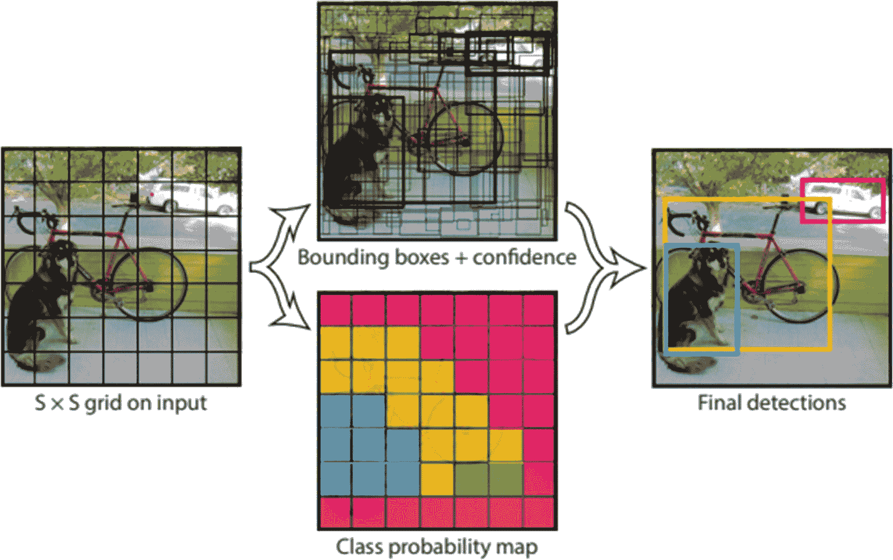

图 6-15

YOLO 物体探测图解(图片来源:Joseph Redmon 等人)

1.  输入图像被分成 S×S 个网格。

2.  如果对象的中心落在网格内，则该网格负责检测该对象。

3.  每个网格单元预测 *B* 个边界框和这些边界框的置信度得分。

4.  使用以下公式计算置信度得分:

    ***置信度得分=客观概率 x 预测框与真实情况之间的 IOU。**T3】*

    如果边界框不包含任何对象，置信度得分为零。

5.  对于每个边界框，网络做出五个预测:x、y、w、h 和置信度，其中
    *   (x，y)坐标表示相对于网格单元边界的盒子中心。

    *   w 和 h 是相对于整个图像的宽度和高度。

    *   置信度预测表示预测框和任何基本事实框之间的 IOU。

6.  同时，网络为每个网格单元预测以包含对象的网格单元为条件的类别条件概率 *C* 。不管预测了多少个边界框 B，每个网格单元只预测了一个条件概率。

7.  为了获得每个盒子的特定于类别的置信度得分，应用以下公式:

    ***类置信度得分= Pr(Classi|Object) x Pr(Object) x 预测与真实情况之间的 IOU。**T3】*

    其中`Pr(Classi|Object)`表示给定网格单元内对象的类的概率。

8.  这些预测被编码为一个***S×S×(B×5+C)***张量。

YOLO 的发明人使用以下设置进行评估:

*   数据集:PASCAL 可视对象类， [`http://host.robots.ox.ac.uk/pascal/VOC/`](http://host.robots.ox.ac.uk/pascal/VOC/) (PASCAL VOC)

*   S = 7

*   B = 2

*   C = 20，因为 PASCAL VOC 有 20 个对象类

最终的预测产生了一个 7 × 7 × (2 × 5 + 20) = 7 × 7 × 30 的张量。

### YOLO 网络设计

YOLO 网络体系结构的灵感来自于用于图像分类的 GoogLeNet。用于 YOLO 的稍加修改的 GoogLeNet 包括 24 个卷积层，最大池继之以两个完全连接的层。请注意图 [6-16](#Fig16) 中完整网络中最后一层产生的输出张量或维度 7×7×30。

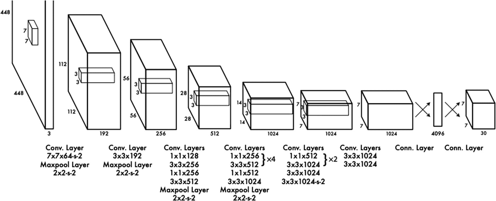

图 6-16

YOLO 神经网络架构。(图片来源:约瑟夫·雷德蒙等人)

## YOLO 的局限性

虽然 YOLO 是最快的对象检测算法之一，但它有一些限制。

*   它与成群出现的小物体斗争，比如成群的鸟。

*   它只能预测单元网格内的一类对象。

*   它不能很好地预测对象是否具有在训练集中没有看到的不寻常的纵横比。

*   它的准确性低于一些最先进的算法，如更快的 R-CNN。

### YOLO9000 或 YOLOv2

YOLOv2 是 YOLO 的改进型。与 YOLO 相比，它提高了检测精度和速度。它被训练来检测超过 9000 个物体类别；所以给它取了 YOLO9000 这个名字。约瑟夫·雷德蒙和阿里·法尔哈迪( [`https://arxiv.org/pdf/1612.08242.pdf`](https://arxiv.org/pdf/1612.08242.pdf) )在 2016 年 12 月发表的题为“YOLO9000:更好、更快、更强”的论文中描述了这种改进和检测算法。

YOLOv2 旨在克服 YOLO 的一些限制，特别是精确度和召回水平。此外，它能够检测到具有看不见的纵横比的对象。

以下是 YOLOv2 中为实现更好、更快、更强的结果而进行的改进:

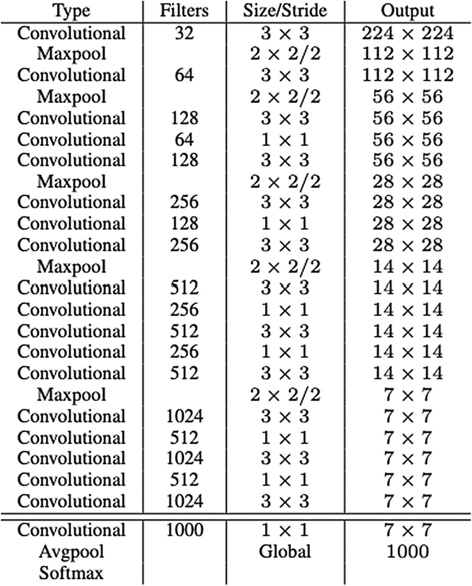

图 6-17

Darknet-19(资料来源:Joseph Redmon 等人， [https:// arxiv。页:1。08242 号房。pdf](https://arxiv.org/pdf/1612.08242.pdf)

*   *联合分类和检测* : YOLOv2 可以从包含分类和检测标签的数据集中学习。在训练期间，当网络看到被标记用于检测的图像时，它执行完整的 YOLOv2 损失函数优化。并且，当它看到分类的图像时，它使用网络的分类部分反向传播损失。YOLOv2 的数据集是通过合并 COCO 和 ImageNet 的数据集创建的。与普通 YOLO 相比，能够从分类和检测数据集学习的网络建立了更强的模型。

*   *批量归一化* : YOLOv2 增加了 YOLO 所有卷积层的批量归一化。回想一下，批处理规范化有助于正则化模型。通过使用批量标准化，YOLOv2 显示了超过 2%的地图改进。

*   *高分辨率分类器* : YOLOv2 经过微调，可以从更高分辨率的输入图像中学习。在 448×448 分辨率下，网络输出提高了 4 个百分点。

*   *与锚盒卷积* : YOLOv2 去掉了全连接层，使用了全卷积层。它还引入了锚盒来预测包围盒。虽然精确度略有下降，但通过使用锚盒，YOLOv2 能够在每张图像上检测到 1，000 多个物体，而 YOLO 只有 98 个。

*   *维度聚类*:锚框的大小通过使用 VOC 2017 训练集的 K-means 聚类来确定。k=5 时，平均 IOU/模型复杂度达到最佳平衡。借据平均为 61.0%。

*   *细粒度特征* : YOLOv2 使用一个传递层，通过将相邻特征堆叠到不同的通道而不是空间位置来连接更高分辨率的特征。这种方法只带来了 1%的性能提升。

*   *多尺度训练* : YOLOv2 能够检测不同大小图像中的物体。YOLOv2 不是固定输入图像的大小，而是每隔几次迭代就动态地改变网络。例如，每 10 批网络随机选择一个新的图像维度。这意味着同一网络可以预测不同分辨率的检测。在低分辨率下，YOLOv2 作为一种廉价且相当精确的探测器运行。

    288×288 YOLOv2 网络运行速度超过 90 FPS，mAP 几乎与快速 R-CNN 一样好。这使得它非常适合较小的 GPU、高帧速率视频或多个视频流。在高分辨率下，YOLOv2 是一种最先进的检测器，在 VOC 2007 上的 mAP 为 78.6，同时仍以高于实时速度的速度运行。

*   *DarkNet 而不是 GoogLeNet* : YOLOv2 使用了一种叫做 DarkNet-19 的卷积神经网络。这个网络有 19 个卷积层和 5 个最大池层。Darknet-19 处理一幅图像只需要 55.8 亿次运算，而 VGG 需要 306.7 亿次，YOLO 需要 85.2 亿次。然而，它在 ImageNet 上实现了 72.9%的前一名准确率和 91.2%的前五名准确率。图 [6-17](#Fig17) 显示了 Darknet-19 网络架构。

下表总结了 YOLOv2 的改进及其对准确性和速度的影响(与普通 YOLO 相比):

<colgroup><col class="tcol1 align-left"> <col class="tcol2 align-left"> <col class="tcol3 align-left"></colgroup> 
|   | 

修改

 | 

效果

 |
| --- | --- | --- |
| 较好的 | 批量标准化 | 2%的地图改进 |
|   | 高分辨率分类器 | 4%的地图改进 |
|   | 与锚盒卷积 | 每幅图像能够检测超过 1000 个物体 |
|   | 维度群集 | 地图改善了 4.8% |
|   | 精细特征 | 1%的地图改进 |
|   | 多尺度训练 | 1.1%的地图改进 |
| 更快的 | 暗网-19 | 计算减少 33 %,地图改善 0.4% |
|   | 卷积预测层 | 0.3%的地图改进 |
| 更强壮的 | 联合分类和检测 | 能够探测超过 9000 个物体 |

### 约洛夫 3 号

YOLO 的最新版本是 YOLOv3，它对 YOLOv2 进行了一些改进。约瑟夫·雷德蒙(Joseph Redmon)和阿里·法尔哈迪( [`https://arxiv.org/pdf/1804.02767.pdf`](https://arxiv.org/pdf/1804.02767.pdf) )在 2018 年 4 月发表的题为“YOLOv3:一种增量改进”的论文中描述了 YOLOv3。

YOLOv3 的特性和改进如下:

*   *边界框预测*:在检测边界框时，YOLOv3 与 YOLOv2 相比没有变化。YOLOv3 在训练期间使用误差损失平方和。它还使用逻辑回归预测每个边界框的客观性分数。如果边界框先验比任何其他边界框先验更多地重叠真实情况对象，则对象性得分被取为 1。仅为每个真实情况对象分配一个边界框先验。如果边界框先验不是最佳的，但是与真实情况对象重叠超过某个阈值，则预测被忽略。YOLOv3 的发明人使用 0.5 的阈值。系统只为每个真实情况对象分配一个边界框。

*   *对象类别预测*:网络预测一个边界框内对象的多个类别。softmax 激活函数不适用于预测多标签类。因此，YOLOv3 使用回归分类器，而不是 softmax。

*   *跨尺度预测* : YOLOv3 预测三种不同尺度的边界框。它仍然使用 K 均值聚类来确定包围盒先验。它有九个聚类和三个任意选择的尺度，然后它在尺度之间均匀地划分聚类。

例如，在 COCO 数据集上，九个聚类如下:(10×13)、(16×30)、(33×23)、(30×61)、(62×45)、(59×119)、(116×90)、(156×198)、(373×326)。

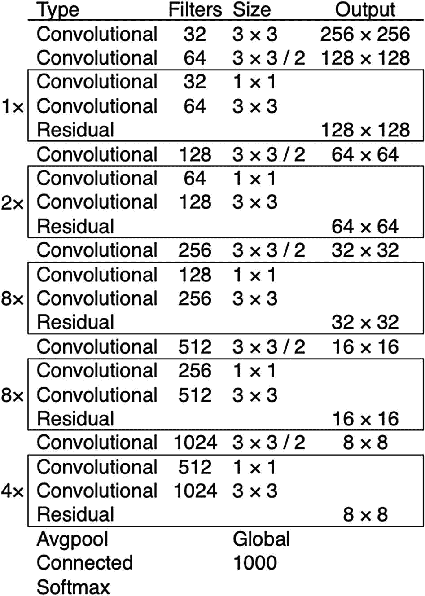

图 6-18

YOLOv3 中使用的 Darknet-53(来源:[https://arxiv . org/pdf/1804 . 02767 . pdf](https://arxiv.org/pdf/1804.02767.pdf))

*   *训练*:与 YOLOv2 相比，YOLOv3 的训练方法没有变化。使用多尺度数据、批量归一化以及混合分类和检测标签，在完整图像上执行训练。

*   *特征提取器*:yolo v3 作为特征提取骨干，使用的是 Darknet-19 的改进版本。这个网络被命名为暗网-53。它有 53 个卷积层。图 [6-18](#Fig18) 显示了 Darknet-53 网络架构。

以下是 YOLOv3 的测试结果:

*   对于整个地图，YOLOv3 的性能显著下降，因为网络更宽(53 层，而 YOLOv2 为 19 层)。

*   YOLOv3 使用 608×608 分辨率的图像在 51 毫秒的推理时间内获得了 33.0%的 mAP，而 retina net-101–50–500 在 73 毫秒的推理时间内仅获得了 32.5%的 mAP。

*   YOLOv3 的精度水平与固态硬盘相当，检测时间快 3 倍。

## 目标检测算法的比较

在本节中，我们探讨了三种不同的对象检测算法类:R-CNN 及其变体，SSD 和 YOLO。这些算法在两个流行的数据集上进行训练——VOC 和 COCO——并针对速度和准确性进行了基准测试。本节提供的比较可用作指南，以确定一种算法相对于另一种算法在构建目标检测系统中的适用性和适用性。性能指标和基准测试结果主要来自于 2019 年 4 月发表的论文“深度学习的对象检测:综述”，该论文由钟、、寿、吴新东撰写( [`https://arxiv.org/pdf/1807.05511.pdf`](https://arxiv.org/pdf/1807.05511.pdf) )。

### 建筑比较

表 [6-1](#Tab1) 提供了目标检测算法在它们使用的神经网络架构方面的比较。

表 6-1

目标检测器的神经网络结构比较

<colgroup><col class="tcol1 align-left"> <col class="tcol2 align-left"> <col class="tcol3 align-left"> <col class="tcol4 align-left"> <col class="tcol5 align-left"></colgroup> 
| 

物体探测器

 | 

区域提案

 | 

激活功能

 | 

损失函数

 | 

Softmax 层

 |
| --- | --- | --- | --- | --- |
| 流程图 | 选择性搜索 | 签名于 | 铰链损失(分类)，包围盒回归 | 是 |
| 快速 R-CNN | 选择性搜索 | 签名于 | 类日志丢失+包围盒回归 | 是 |
| 更快的 R-CNN | RPN | 签名于 | 类日志丢失+包围盒回归 | 是 |
| 美国有线电视新闻网 | RPN | 签名于 | 类别日志损失+包围盒回归+语义 sigmoid 损失 | 是 |
| （同 solid-statedisk）固态（磁）盘 | 没有人 | 签名于 | 类和-平方误差损失+包围盒回归 | 不 |
| YOLO | 没有人 | 签名于 | 类别和-平方误差损失+包围盒回归+对象置信度+背景置信度 | 是 |
| 约洛夫 2 号 | 没有人 | 签名于 | 类别和-平方误差损失+包围盒回归+对象置信度+背景置信度 | 是 |
| 约洛夫 3 号 | 没有人 | 签名于 | 类别和-平方误差损失+包围盒回归+对象置信度+背景置信度 | 逻辑分类器 |

### 性能比较

表 [6-2](#Tab2) 提供了在 Microsoft COCO 数据集上训练的对象检测算法的性能比较。培训是在英特尔 i7-6700K 单核 CPU 和 Nvidia Titan X GPU 上进行的。

表 6-2

目标检测模型的性能比较

<colgroup><col class="tcol1 align-left"> <col class="tcol2 align-left"> <col class="tcol3 align-left"> <col class="tcol4 align-left"> <col class="tcol5 align-left"> <col class="tcol6 align-left"></colgroup> 
| 

物体探测器

 | 

接受培训

 | 

地图

 | 

测试速度(秒/图像)

 | 

每秒帧数(FPS)

 | 

适合实时视频？

 |
| --- | --- | --- | --- | --- | --- |
| 流程图 | 可可 2007 | 66.0% | Thirty-two point eight four | Zero point zero three | 不 |
| 快速 R-CNN | 可可 2007 和 2012 | 66.9% | One point seven two | Zero point six | 不 |
| 更快的 R-CNN (VGG-16) | 可可 2007 和 2012 | 73.2% | Zero point one one | Nine point one | 不 |
| 更快的 R-CNN (RestNet-101) | 可可 2007 和 2012 | 83.8% | Two point two four | Zero point four | 不 |
| 固态硬盘 300 | 可可 2007 和 2012 | 74.3% | Zero point zero two | Forty-six | 是 |
| 固态硬盘 512 | 可可 2007 和 2012 | 76.8% | Zero point zero five | Nineteen | 是 |
| YOLO | 可可 2007 和 2012 | 73.4% | Zero point zero two | Forty-six | 是 |
| 约洛夫 2 号 | 可可 2007 和 2012 | 78.6% | Zero point zero three | Forty | 是 |
| 约洛夫 3，608x608 | 可可 2007 和 2012 | 76.0% | Zero point zero two nine | Thirty-four | 是 |
| 约洛夫 3 416×416 | 可可 2007 和 2012 | 75.9% | Zero point zero five one | Nineteen | 是 |

## 基于 TensorFlow 的训练目标检测模型

我们现在准备编写代码来构建和训练我们自己的对象检测模型。我们将使用 TensorFlow API 并用 Python 编写代码。对象检测模型是计算密集型的，需要大量的内存和强大的处理器。大多数通用膝上型电脑或计算机可能无法处理构建和训练对象检测模型所需的计算。例如，具有 32GB RAM 和八核 CPU 的 MacBook Air 无法运行涉及约 7000 张图像的检测模型。谢天谢地，谷歌免费提供了有限的基于 GPU 的计算。事实证明，这些模型在 GPU 上的运行速度比在 CPU 上快很多倍。因此，学习如何在 GPU 上训练模型非常重要。出于演示和学习的目的，我们将使用免费版本的 Google GPU。让我们首先确定我们的学习目标是什么，以及我们希望如何实现它。

*   *目标*:学习如何使用 Keras 和 TensorFlow 训练目标检测模型。

*   *数据集*:牛津-IIIT Pet 数据集，在`robots.ox.ac.uk/~vgg/data/pets/`免费提供。该数据集由 37 类宠物组成，每类大约有 200 张图片。这些图像在比例、姿态和光照方面有很大的差异。它们已经用边界框进行了注释和标注。

*   *执行环境*:我们将使用 Google Colaboratory ( [`colab.research.google.com`](http://colab.research.google.com) )，简称 Colab。我们将利用 Colab 免费提供的 GPU 硬件加速器。Google Colab 是一个免费的 Jupyter 笔记本环境，不需要设置，完全在云中运行。Jupyter notebook 是一个基于 web 的开源应用，用于编写和执行 Python 程序。要了解如何使用 Jupyter 笔记本的更多信息，请访问 [`https://jupyter.org`](https://jupyter.org) `.`文档可在 [`https://jupyter-notebook.readthedocs.io/en/stable/`](https://jupyter-notebook.readthedocs.io/en/stable/) `.`获得。我们将在编写代码的过程中学习 Colab 笔记本。

*   *重要提示*:在写这本书的时候，TensorFlow 第 2 版还不支持对象检测的自定义模型的训练。因此，我们将使用 TensorFlow 版本来训练模型。TensorFlow 团队和开源社区正在努力迁移版本 1 代码，以支持版本 2 中自定义对象检测模型的训练。因此，我们这里的一些步骤将来可能会改变。这本书的 GitHub 位置将有版本 2 的更新步骤。

我们会在 Google Colab 上用 TensorFlow 1 对检测模型进行训练，模型训练好之后，再用 TensorFlow 2 下载使用。我们也将学习如何去做。

### 带 GPU 的 Google Colab 上的 TensorFlow

Google Colab 免费提供了一款用于机器学习教育和培训的 Jupyter 笔记本。它提供了大约 13GB 的内存，130GB 的磁盘和一个 Nvidia GPU，可连续使用 12 小时。如果会话过期或超过了 12 小时的限制，您可以重新创建运行时。当您执行代码时，它是在一个为您的私人帐户创建的虚拟机上执行的。会话到期后，虚拟机将终止，虚拟磁盘中保存的所有数据都将丢失。然而，Colab 提供了一种将 Google Drive 目录挂载到 Colab 虚拟磁盘的方法。您的数据将存储在您的 Google Drive 上，您可以在创建 Google Colab 会话时检索这些数据。让我们从 Google Colab 开始，并设置我们将用于执行 TensorFlow 代码的运行时环境。

#### 访问 Google Colab

您必须拥有 Google(或 Gmail)帐户才能访问 Google Colab。如果您还没有帐户，您需要先在 [`https://accounts.google.com`](https://accounts.google.com) `.`注册一个帐户

使用您的网络浏览器，在 [`http://colab.research.google.com`](http://colab.research.google.com) `.`访问 Google Colab 网址如果您已经使用您的 Google 帐户登录，您将可以访问 Colab；否则，您需要登录您的帐户才能访问它。

#### 连接到宿主运行时

点击位于屏幕右上角用户和设置图标下方的连接按钮，然后点击“连接到托管运行时”(图 [6-19](#Fig19) )。至此，您的 Colab 会话创建完毕。


图 6-19

连接到宿主运行时

#### 选择 GPU 硬件加速器

点击编辑，然后点击“笔记本设置”(图 [6-20](#Fig20) ，打开一个模态窗口。选择 GPU 作为硬件加速器。确保为运行时类型选择了 Python 3。点击保存按钮(图 [6-21](#Fig21) )。

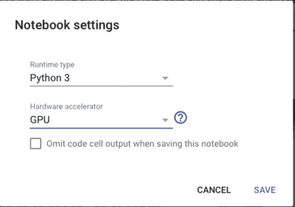

图 6-21

选择 GPU 作为加速器

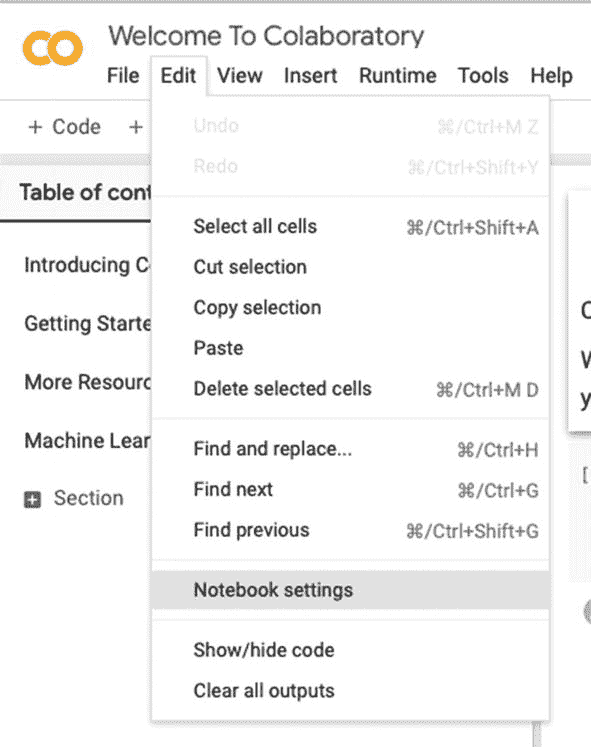

图 6-20

访问笔记本设置

#### 创建 Colab 项目

单击文件，然后单击“新建 Python 3 笔记本”您的新笔记本将在新的浏览器选项卡中打开。给这个笔记本起个有意义的名字，比如目标检测模型训练。默认情况下，此笔记本保存在您的 Google Drive 中。

#### 为 TensorFlow 和模型训练设置运行时环境

单击+代码将代码单元格插入笔记本。注意在笔记本的主要区域中有一个空单元格的代码块。您可以在这个单元格中编写任何 Python 代码，并通过单击执行图标来执行它。

Google Colab 是一个交互式编程环境，不提供对底层操作系统的直接访问。您可以使用`%%shell`调用 shell，它在调用它的单个代码单元块中保持活动状态。您可以根据需要从任意数量的代码块中调用 shell。

要设置我们的环境，我们将遵循以下步骤:

1.  安装执行 TensorFlow 代码和训练模型所需的必要库。清单 [6-1](#PC1) 显示了安装所需库的命令。

```py
Filename: Listing_6_1
1    %%shell
2    %tensorflow_version 1.x
3    sudo apt-get install protobuf-compiler python-pil python-lxml python-tk
4    pip install --user Cython
5    pip install --user contextlib2
6    pip install --user pillow
7    pip install --user lxml
8    pip install --user matplotlib

Listing 6-1Installing the Necessary Libraries and Packages

```

第 1 行在它所属的代码块的上下文中调用 shell。这允许在这个块中运行任何 shell 命令。

第 2 行告诉笔记本我们想用 TensorFlow 版本 1。 *x* 而不是最新的版本 2，这是 Google Colab 上机器学习的默认执行引擎。如果您在使用 TensorFlow 2 时遇到任何与 Colab 实例有关的问题，请使用以下命令安装 tensor flow 1.15:pip install tensor flow = = 1.15。

第 3 行使用操作系统命令安装 Protobuf 编译器和一些其他软件。Protobuf 用于编译 TensorFlow 源代码。第 4 行到第 8 行安装 Python 库。

1.  从 GitHub 资源库下载 TensorFlow“模型”项目，并在您的工作环境中构建和安装它。清单 [6-2](#PC2) 展示了如何做到这一点。

```py
1    %%shell
2    mkdir computer_vision
3    cd computer_vision
4    git clone https://github.com/ansarisam/models.git
5    #git clone https://github.com/tensorflow/models.git
6    cd models/research
7
8    protoc object_detection/protos/*.proto --python_out=.
9
10   export PYTHONPATH=$PYTHONPATH:/content/computer_vision/models/research
11   export PYTHONPATH=$PYTHONPATH:/content/computer_vision/models/research/slim
12
13
14   python setup.py build
15   python setup.py install

Listing 6-2Downloading the TensorFlow Models Project, Building It, and Setting It Up

```

第 1 行调用 shell。

第 2 行创建了一个名为`computer_vision`的新目录。这是我们想要组织所有代码和数据的目录。第 3 行将当前工作目录更改为我们刚刚创建的新目录。

第 4 行克隆了一个 GitHub 存储库，并下载了 TensorFlow models 项目的源代码。这个库是从官方 TensorFlow 模型库中派生出来的。第 5 行列出了官方存储库以供参考。

`models`存储库包含许多在 TensorFlow 中实现的模型。在它下载了源代码之后，您将会在`models`目录中看到两个子目录——`official`和`research`。“官方”目录包含 TensorFlow 官方支持的所有模型，这些模型是在您安装 TensorFlow 时安装的。`research`目录包含大量由研究人员创建和维护的模型，还没有得到官方支持。我们感兴趣的对象检测模型在`research`目录中，还不是正式版本的一部分。

第 6 行将工作目录更改为`modes/research`目录。

第 8 行使用 Protobuf 编译器构建了与对象检测相关的源代码。

第 10 行和第 11 行将环境变量`PYTHONPATH`设置为`research`和`research/slim`目录。

第 14 行使用`setup.py`执行构建命令，这是 Python `script`目录中提供的一个脚本。类似地，第 15 行在我们的工作环境中安装了对象检测模型。

要测试您的代码，请逐个执行每个单元块，或者通过单击 Runtime 并从 Colab 的顶部菜单上下文中选择“Run all”来执行所有单元块。如果一切顺利，你的 TensorFlow 版本 1。 *x* 环境准备好训练目标检测模型。

#### 下载牛津-IIIT 宠物数据集

让我们在笔记本中插入另一个代码单元。我们将从官方网站下载带注释和标签的 pet 数据集到我们 Colab 工作区的一个目录中。清单 [6-3](#PC3) 包含下载 pet 数据集和注释的代码。

```py
1    %%shell
2    cd computer_vision
3    mkdir petdata
4    cd petdata
5    wget http://www.robots.ox.ac.uk/~vgg/data/pets/data/images.tar.gz
6    wget http://www.robots.ox.ac.uk/~vgg/data/pets/data/annotations.tar.gz
7    tar -xvf annotations.tar.gz
8    tar -xvf images.tar.gz

Listing 6-3Downloading and Uncompressing the Images and Annotations of the Pet Dataset

```

第 1 行调用 shell。如果我们想使用任何 shell 命令，我们需要在每个单元块中这样做。

第 2 行将我们的工作目录更改为`computer_vision`目录。

第 3 行在`computer_vision`目录中创建了另一个名为`petdata`的目录。我们将在`petdata`目录下下载宠物数据集。

第 4 行将工作目录更改为`petdata`目录。

第 5 行下载宠物图片，第 6 行下载注释。

第 7 行和第 8 行解压缩下载的图像和注释文件。

如果您执行这个代码块，您将看到在`petdata`目录中下载的图像和注释。图像将存储在`images`子目录中，注释将存储在`petdata`目录下的`annotations`子目录中。

#### 生成 TensorFlow TFRecord 文件

TFRecord 是一种存储二进制记录序列的简单格式。TFRecord 中的数据被序列化并存储在较小的块中(例如，100MB 到 200MB)，这使得它们能够更高效地跨网络传输和串行读取。你将在第 [9](09.html) 章中了解更多关于 TFRecord、其格式以及如何将图像和相关注释转换成 TFRecord 文件格式的信息。现在，我们将使用从 GitHub 下载的 TensorFlow 源代码的`research`目录中提供的 Python 脚本。脚本位于路径`research/object_detection/dataset_tools/create_pet_tf_record.py.`

对象检测算法将 TFRecord 文件作为神经网络的输入。TensorFlow 提供了一个 Python 脚本来将 Oxford pet 图像注释文件转换为一组 TFRecord 文件。清单 [6-4](#PC4) 将训练集和测试集转换成 TFRecords。

```py
1    %%shell
2    cd computer_vision
3    cd models/research
4
5    python object_detection/dataset_tools/create_pet_tf_record.py \
6       --label_map_path=object_detection/data/pet_label_map.pbtxt \
7       --data_dir=/content/computer_vision/petdata \
8       --output_dir=/content/computer_vision/petdata/

Listing 6-4Converting Image Annotation Files to TFRecord Files

```

第 2 行和第 3 行将工作目录更改为`research`目录。

第 5 行到第 8 行运行 Python 脚本，`create_pet_tf_record.py,`,它采用以下参数:

*   `label_map_path`:这个文件有一个 ID(从 1 开始)和对应的类名的映射。对于 pet 数据集，映射文件已经存在于`object_detection/data/pet_label_map.pbtxt`文件中。你将在第 9 章中学习如何生成这个映射文件。但是现在，让我们只使用已经可用的。这是一个 JSON 格式的文件。映射文件的几个示例条目如下所示:

    ```py
    item {
      id: 1
      name: 'Abyssinian'
    }

    item {
      id: 2
      name: 'american_bulldog'
    }
    ...

    ```

*   `data_dir`:这是`images`和`annotations`子目录的父目录。

*   `output_dir`:这是存储 TFRecord 文件的目标目录。您可以给出任何现有的目录名。图像和注释转换后，TFRecord 文件将保存在此目录中。

在这个代码块执行之后，它在`output_directory`中创建一组`*.record`文件。脚本`create_pet_tf_record.py`创建了训练集和评估集。

*   *训练集*:输出目录现在应该包含 10 个训练文件和 10 个评估文件。根据您的输入大小，`*.record`文件的数量可能会有所不同。训练集的`*.record`文件命名为`pet_faces_train.record-?????-of-00010.`，正则表达式`?????`从`00001`到`00010`依次取值。

*   *评估或测试集*:评估数据集命名为`pet_faces_eval.record-?????-of-00010.`

#### 下载用于迁移学习的预训练模型

从头开始训练一个最先进的对象检测模型需要几天时间，即使使用 GPU 也是如此。为了加快训练速度，我们将下载在不同数据集(如 COCO)上训练的现有模型，并重用它的一些参数(包括权重)来初始化我们的新模型。重用来自预训练模型的权重和参数来训练新模型被称为*迁移学习*。我们将在本节描述迁移学习过程。

在 COCO 和其他数据集上训练的对象检测模型的集合位于“TensorFlow 检测模型动物园”( [`https://github.com/tensorflow/models/blob/master/research/object_detection/g3doc/detection_model_zoo.md`](https://github.com/tensorflow/models/blob/master/research/object_detection/g3doc/detection_model_zoo.md) )。

以下是 COCO 训练过的模特名单:

<colgroup><col class="tcol1 align-left"> <col class="tcol2 align-left"> <col class="tcol3 align-left"> <col class="tcol4 align-left"></colgroup> 
| 

型号名称

 | 

速度(毫秒)

 | 

COCO 地图[^1]

 | 

输出

 |
| --- | --- | --- | --- |
| `ssd_mobilenet_v1_coco` | Thirty | Twenty-one | 盒子 |
| `ssd_mobilenet_v1_0.75_depth_coco ☆` | Twenty-six | Eighteen | 盒子 |
| `ssd_mobilenet_v1_quantized_coco ☆` | Twenty-nine | Eighteen | 盒子 |
| `ssd_mobilenet_v1_0.75_depth_quantized_coco ☆` | Twenty-nine | Sixteen | 盒子 |
| `ssd_mobilenet_v1_ppn_coco ☆` | Twenty-six | Twenty | 盒子 |
| `ssd_mobilenet_v1_fpn_coco ☆` | fifty-six | Thirty-two | 盒子 |
| `ssd_resnet_50_fpn_coco ☆` | Seventy-six | Thirty-five | 盒子 |
| `ssd_mobilenet_v2_coco` | Thirty-one | Twenty-two | 盒子 |
| `ssd_mobilenet_v2_quantized_coco` | Twenty-nine | Twenty-two | 盒子 |
| `ssdlite_mobilenet_v2_coco` | Twenty-seven | Twenty-two | 盒子 |
| `ssd_inception_v2_coco` | forty-two | Twenty-four | 盒子 |
| `faster_rcnn_inception_v2_coco` | Fifty-eight | Twenty-eight | 盒子 |
| `faster_rcnn_resnet50_coco` | eighty-nine | Thirty | 盒子 |
| `faster_rcnn_resnet50_lowproposals_coco` | Sixty-four |   | 盒子 |
| `rfcn_resnet101_coco` | Ninety-two | Thirty | 盒子 |
| `faster_rcnn_resnet101_coco` | One hundred and six | Thirty-two | 盒子 |
| `faster_rcnn_resnet101_lowproposals_coco` | Eighty-two |   | 盒子 |
| `faster_rcnn_inception_resnet_v2_atrous_coco` | Six hundred and twenty | Thirty-seven | 盒子 |
| `faster_rcnn_inception_resnet_v2_atrous_lowproposals_coco` | Two hundred and forty-one |   | 盒子 |
| `faster_rcnn_nas` | One thousand eight hundred and thirty-three | Forty-three | 盒子 |
| `faster_rcnn_nas_lowproposals_coco` | Five hundred and forty |   | 盒子 |
| `mask_rcnn_inception_resnet_v2_atrous_coco` | Seven hundred and seventy-one | Thirty-six | 面具 |
| `mask_rcnn_inception_v2_coco` | Seventy-nine | Twenty-five | 面具 |
| `mask_rcnn_resnet101_atrous_coco` | Four hundred and seventy | Thirty-three | 面具 |
| `mask_rcnn_resnet50_atrous_coco` | Three hundred and forty-three | Twenty-nine | 面具 |

对于我们的培训，我们将从 [`http://download.tensorflow.org/models/object_detection/ssd_inception_v2_coco_2018_01_28.tar.gz`](http://download.tensorflow.org/models/object_detection/ssd_inception_v2_coco_2018_01_28.tar.gz) 下载`ssd_inception_v2_coco`模型。您可以下载任何经过训练的模型，并按照剩余的步骤来训练您自己的模型。清单 [6-5](#PC6) 中的命令集下载 SSD inception 模型。

```py
1    %%shell
2    cd computer_vision
3    mkdir pre-trained-model
4    cd pre-trained-model
5    wget http://download.tensorflow.org/models/object_detection/ssd_inception_v2_coco_2018_01_28.tar.gz
6    tar -xvf ssd_inception_v2_coco_2018_01_28.tar.gz

Listing 6-5Downloading a Pre-trained SSD Inception Object Detection Model

```

我们在`computer_vision`目录中创建了一个名为`pre-trained-model`的新目录，并将工作目录更改为新目录(第 2、3 和 4 行)。

第 5 行使用`wget`命令下载`ssd_inception-v2_coco`模型作为压缩文件。

第 6 行将下载的文件解压缩到一个目录中，`ssd_inception_v2_coco_2018_01_28.`

在 Google Colab 窗口中，展开左侧面板并检查文件选项卡。您应该会看到类似于图 [6-22](#Fig22) 所示的目录结构。

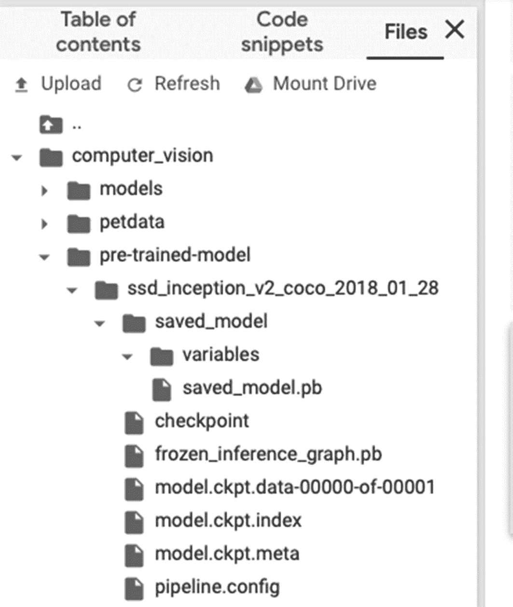

图 6-22

预训练模型目录结构

#### 配置对象检测流水线

我们需要向 TensorFlow 对象检测 API 提供一个配置文件来训练我们的模型。这个配置文件被称为*训练流水线*，它有一个定义良好的模式。训练流水线的模式可在目录`research`中的位置`object_detection/protos/pipeline.proto`获得。

JSON 格式的培训流水线大致分为五个部分，如下所示:

*   这定义了我们想要训练的模型的类型。

*   `train_config`:定义模型参数的设置。

*   `eval_config`:这决定了将报告哪组指标进行评估。

*   `train_input_config`:定义模型应该用什么数据集进行训练。

*   `eval_input_config`:定义模型将在哪个数据集上进行评估。

```py
model: {
        (... Add model config here...)
}

train_config : {
        (... Add train_config here...)
}

train_input_reader: {
        (... Add train_input configuration here...)
}

eval_config: {
        (... Add eval_configuration here...)
}

eval_input_reader: {
        (... Add eval_input configuration here...)
}

```

在图 [6-22](#Fig22) 中，注意模型目录中的文件`pipeline.config`，`ssd_inception_v2_coco_2018_01_28.`从 Colab 下载`pipeline.config`文件(右击并下载)，将其保存在本地计算机中，并对其进行编辑以配置模型的流水线。以下是我们将用于模型培训的已编辑文件的示例:

```py
model {
  ssd {
    num_classes: 37
    image_resizer {
      fixed_shape_resizer {
        height: 300
        width: 300
      }
    }
    feature_extractor {
      type: "ssd_inception_v2"
      depth_multiplier: 1.0
      min_depth: 16
      conv_hyperparams {
        regularizer {
          l2_regularizer {
            weight: 3.99999989895e-05
          }
        }
        initializer {
          truncated_normal_initializer {
            mean: 0.0
            stddev: 0.0299999993294
          }
        }
        activation: RELU_6
        batch_norm {
          decay: 0.999700009823
          center: true
          scale: true
          epsilon: 0.0010000000475
          train: true
        }
      }
        override_base_feature_extractor_hyperparams: true
    }
    box_coder {
      faster_rcnn_box_coder {
        y_scale: 10.0
        x_scale: 10.0
        height_scale: 5.0
        width_scale: 5.0
      }
    }
    matcher {
      argmax_matcher {
        matched_threshold: 0.5
        unmatched_threshold: 0.5
        ignore_thresholds: false
        negatives_lower_than_unmatched: true
        force_match_for_each_row: true
      }
    }
    similarity_calculator {
      iou_similarity {
      }
    }
    box_predictor {
      convolutional_box_predictor {
        conv_hyperparams {
          regularizer {
            l2_regularizer {
              weight: 3.99999989895e-05
            }
          }
          initializer {
            truncated_normal_initializer {
              mean: 0.0
              stddev: 0.0299999993294
            }
          }
          activation: RELU_6
        }
        min_depth: 0
        max_depth: 0
        num_layers_before_predictor: 0
        use_dropout: false
        dropout_keep_probability: 0.800000011921
        kernel_size: 3
        box_code_size: 4
        apply_sigmoid_to_scores: false
      }
    }
    anchor_generator {
      ssd_anchor_generator {
        num_layers: 6
        min_scale: 0.20000000298
        max_scale: 0.949999988079
        aspect_ratios: 1.0
        aspect_ratios: 2.0
        aspect_ratios: 0.5
        aspect_ratios: 3.0

        aspect_ratios: 0.333299994469
        reduce_boxes_in_lowest_layer: true
      }
    }
    post_processing {
      batch_non_max_suppression {
        score_threshold: 0.300000011921
        iou_threshold: 0.600000023842
        max_detections_per_class: 100
        max_total_detections: 100
      }
      score_converter: SIGMOID
    }
    normalize_loss_by_num_matches: true
    loss {
      localization_loss {
        weighted_smooth_l1 {
        }
      }
      classification_loss {
        weighted_sigmoid {
        }
      }
      hard_example_miner {
        num_hard_examples: 3000
        iou_threshold: 0.990000009537
        loss_type: CLASSIFICATION
        max_negatives_per_positive: 3
        min_negatives_per_image: 0
      }
      classification_weight: 1.0
      localization_weight: 1.0
    }
  }
}
train_config {
  batch_size: 24
  data_augmentation_options {
    random_horizontal_flip {
    }
  }
  data_augmentation_options {
    ssd_random_crop {
    }
  }
  optimizer {
    rms_prop_optimizer {
      learning_rate {
        exponential_decay_learning_rate {
          initial_learning_rate: 0.00400000018999
          decay_steps: 800720
          decay_factor: 0.949999988079
        }
      }
      momentum_optimizer_value: 0.899999976158
      decay: 0.899999976158
      epsilon: 1.0
    }
  }
  fine_tune_checkpoint: "PATH_TO_BE_CONFIGURED/model.ckpt"
  from_detection_checkpoint: true
  num_steps: 100000
}
train_input_reader {
  label_map_path: "PATH_TO_BE_CONFIGURED/mscoco_label_map.pbtxt"
  tf_record_input_reader {
    input_path: "PATH_TO_BE_CONFIGURED/mscoco_train.record"
  }

}
eval_config {
  num_examples: 8000
  max_evals: 10
  use_moving_averages: false
}
eval_input_reader {
  label_map_path: "PATH_TO_BE_CONFIGURED/mscoco_label_map.pbtxt"
  shuffle: false
  num_readers: 1
  tf_record_input_reader {
    input_path: "PATH_TO_BE_CONFIGURED/mscoco_val.record"
  }
}

```

由于`pipeline.config`文件是在训练我们下载用于迁移学习的模型时保存的，因此除了那些使用粗体突出显示的部分之外，我们将保留大多数部分。以下是我们应该根据 Colab 环境中的设置进行更改的参数:

*   37，代表我们数据集中的 37 类宠物。

*   `fine_tune_checkpoint` : `/content/computer_vision/pre-trained-model/ssd_inception_v2_coco_2018_01_28/model.ckpt`，这是我们存储预训练模型检查点的路径。注意在图 [6-22](#Fig22) 中，模型检查点的文件名是`model.ckpt.data-00000-of-00001`，但是在`fine_tune_checkpoint`配置中，我们只提供到`model.ckpt`(你不能包括检查点文件的全名)。要获取此检查点文件的路径，请在 Colab 文件浏览器中，右键单击文件名，然后单击“复制路径”

*   `num_steps:` 100000，这是算法应该执行的步骤数。您可能需要调整这个数字，以获得理想的精度水平。

*   `Train_input_reader` → `label_map_path` : `/content/computer_vision/models/research/object_detection/data/pet_label_map.pbtxt`，是包含 ID 和类名映射的文件的路径。对于 pet 数据集，这可以在研究目录中找到。

*   `Train_input_reader` → `input_path` : `/content/computer_vision/petdata/pet_faces_train.record-?????-of-00010`，这是训练数据集 TFRecord 文件的路径。注意，我们在训练集路径中使用了一个正则表达式(`?????`)。这对于包含所有培训 TFRecord 文件非常重要。

*   `Eval_input_reader` → `label_map_path` : `/content/computer_vision/models/research/object_detection/data/pet_label_map.pbtxt`，与训练标签图相同。

*   `Eval_input_reader` → `input_path` : `/content/computer_vision/petdata/pet_faces_eval.record-?????-of-00010`，这是评估数据集 TFRecord 文件的路径。注意，我们在评估集路径中使用了一个正则表达式(`?????`)。这对于包含所有评估 TFRecord 文件非常重要。

需要注意的是，`pipeline.config`将参数`override_base_feature_extractor_hyperparams`设置为`true.`

编辑完`pipeline.config`文件后，需要上传到 Colab。您可以将它上传到任何目录位置，但在这种情况下，我们将它上传到下载它的原始位置。我们将首先删除旧的`pipeline.config`文件，然后上传更新的文件。

要从 Colab 目录位置删除旧的`pipeline.config`文件，右键单击它，然后单击 delete。要从本地计算机上传更新的`pipeline.config`文件，右键单击 Colab 目录(`ssd_inception_v2_coco_2018_01_28`)，单击上传，从您的计算机浏览并上传文件。

#### 执行模型训练

我们准备好开始训练了。列表 [6-6](#PC9) 触发训练执行。

```py
1    %%shell
2    export PYTHONPATH=$PYTHONPATH:/content/computer_vision/models/research
3    export PYTHONPATH=$PYTHONPATH:/content/computer_vision/models/research/slim
4    cd computer_vision/models/research/
5    PIPELINE_CONFIG_PATH=/content/computer_vision/pre-trained-model/ssd_inception_v2_coco_2018_01_28/pipeline.config
6    MODEL_DIR=/content/computer_vision/pet_detection_model/
7    NUM_TRAIN_STEPS=1000
8    SAMPLE_1_OF_N_EVAL_EXAMPLES=1
9    python object_detection/model_main.py \
10      --pipeline_config_path=${PIPELINE_CONFIG_PATH} \
11      --model_dir=${MODEL_DIR} \
12      --num_train_steps=${NUM_TRAIN_STEPS} \
13      --sample_1_of_n_eval_examples=$SAMPLE_1_OF_N_EVAL_EXAMPLES \
14      --alsologtostderr

Listing 6-6Executing the Model Training

```

TensorFlow 提供了一个 Python 脚本`model_main.py`，用来触发模型训练。这个脚本位于目录`models/research/object_detection`中。该脚本采用以下参数:

*   `pipeline_config_path`:这是`pipeline.config`文件的路径。

*   这是你训练好的模型将被保存的目录。

*   这是我们希望我们的网络训练的步数。这将覆盖`pipeline.config`文件中的`num_steps`参数。

*   `sample_1_of_n_eval_examples`:这决定了模型应该使用多少个样本中的一个进行评估。

执行 Colab 中前面的代码块，等待模型从您的图像集中学习。当模型学习时，您将会在 Colab 控制台中看到迭代损失。如果一切顺利，您将在`model_dir`目录中保存一个经过训练的对象检测模型。

#### 导出 TensorFlow 图

在模型被成功训练之后，模型连同检查点被保存在`model_dir,`中，在我们的例子中是`pet_detection_model`。该目录包含培训期间生成的所有检查点。这些检查点必须转换成最终模型。为了在预测对象和边界框时使用这个模型，我们需要导出这个模型。以下是步骤。

首先，我们需要确定要导出的候选检查点。这可能是我们通过查看文件名中的序列号可以识别的最后一个检查点。检查点通常由以下三个文件组成(暂时忽略目录中的其余文件):

*   `model.ckpt-${CHECKPOINT_NUMBER}.data-00000-of-00001`

*   `model.ckpt-${CHECKPOINT_NUMBER}.index`

*   `model.ckpt-${CHECKPOINT_NUMBER}.meta`

取具有最大`${CHECKPOINT_NUMBER}`值的检查点。我们的模型运行了 10，000 步，因此我们的最大检查点文件应该如下所示:

*   `model.ckpt-10000.data-00000-of-00001`

*   `model.ckpt-10000.index`

*   `Model.ckpt-10000.meta`

清单 [6-7](#PC10) 将我们的目标检测训练模型导出到用户定义的目录中。

```py
1    %%shell
2    export PYTHONPATH=$PYTHONPATH:/content/computer_vision/models/research
3    export PYTHONPATH=$PYTHONPATH:/content/computer_vision/models/research/slim
4    cd computer_vision/models/research
5
6    python object_detection/export_inference_graph.py \
7       --input_type image_tensor \
8       --pipeline_config_path /content/computer_vision/pre-trained-model/ssd_inception_v2_coco_2018_01_28/pipeline.config \
9       --trained_checkpoint_prefix /content/computer_vision/pet_detection_model/model.ckpt-100 \
10      --output_directory /content/computer_vision/pet_detection_model/final_model

Listing 6-7Exporting the TensorFlow Graph

```

第 6 到 10 行通过调用位于目录`models/research/object_detection`中的脚本`export_inference_graph.py`来导出 TensorFlow 图。该脚本采用以下参数:


图 6-23

在 final_model 目录中导出的模型

*   `input_type`:对于我们的型号来说，会是`image_tensor`。

*   `pipeline_config_path`:这与我们之前使用的`pipeline.config`文件路径相同。

*   `trained_checkpoint_prefix`:这是我们之前确定的候选检查点的路径(`model.ckpt-ckpt-10000`)。不要在检查点前缀中使用`.index`或`.meta`或任何东西。

*   `output_directory`:这是保存导出图形的目录。图 [6-23](#Fig23) 显示了执行导出脚本后的输出目录结构。

#### 下载对象检测模型

Google Colab 不允许你下载目录。您可以下载文件，但不能下载目录。当然，您可以从`final_model`目录中一个接一个地下载每个文件，但是这样效率不高。但是，我们将学习如何将您完全训练好的模型保存到您的私人 Google Drive 中。

Google Colab 将终止您的虚拟机，并在连续使用 12 小时后或您的会话到期后删除您的所有数据。这意味着如果您不下载它，您将会丢失您的模型。您可以直接将您的模型和任何数据保存到 Google Drive。如果你的模型要运行几个小时，在开始训练过程之前，你最好把所有的数据和模型保存在 Google Drive 中。

以下是实现这一点的步骤。

要安装 Google Drive，请在左侧面板中单击“文件”,然后单击“安装驱动器”。一些新代码被插入到笔记本区域。点击代码块中的图标执行代码。

单击授权链接以生成授权码。您可能需要再次登录您的 Google 帐户。复制授权码并将其粘贴到笔记本中，然后按回车键。见图 [6-24](#Fig24) 。安装驱动器后，您会在左侧面板的文件选项卡上看到一个目录列表(如图 [6-25](#Fig25) )。请注意，图 [6-25](#Fig25) 中的示例 Google Drive 有一个名为`computervision`的目录，该目录已经在驱动器中创建。随意创建你想要的任何目录。

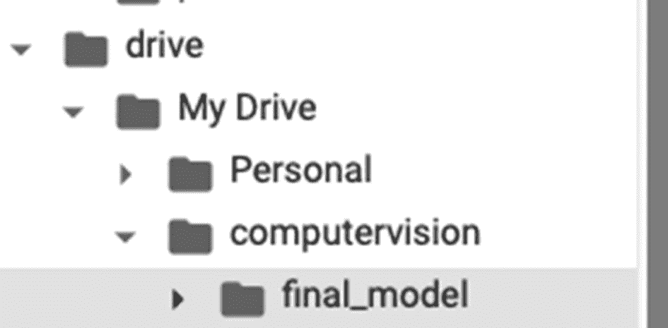

图 6-25

Google dDive 目录结构

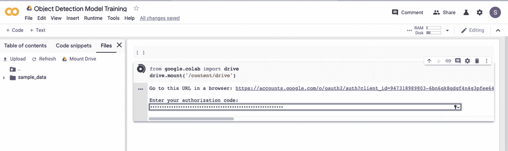

图 6-24

Google Drive 安装

将`final_model`目录移动到 Google Drive 目录。

要将经过训练的对象检测模型保存到 Google Drive 目录，只需将`final_directory`从 Colab 目录拖到 Google Drive 目录。

您还必须将以下检查点文件复制到 Google Drive:

*   `model.ckpt-10000.data-00000-of-00001`

*   `Model.ckpt-10000.index`

*   `Model.ckpt-10000.meta`

要从 Google Drive 下载模型，请登录到您的 Google Drive，并将训练好的模型下载到您的本地计算机。您应该下载整个`final_model`目录。

#### 在 TensorBoard 中可视化训练结果

要查看训练统计和模型结果，使用 Colab 中清单 [6-8](#PC11) 中的代码启动 TensorBoard 仪表板。`--logdir`是我们保存模型检查点的目录。

```py
1    %load_ext tensorboard
2    %tensorboard --logdir /content/computer_vision/pet_detection_model

Listing 6-8Launching the TensorBoard Dashboard to See the Training Results

```

第 1 行加载 TensorBoard 笔记本扩展。这将显示嵌入在 Colab 屏幕中的 TensorBoard 仪表板。

图 [6-26](#Fig26) 显示了显示图像页面的 TensorBoard 仪表盘。

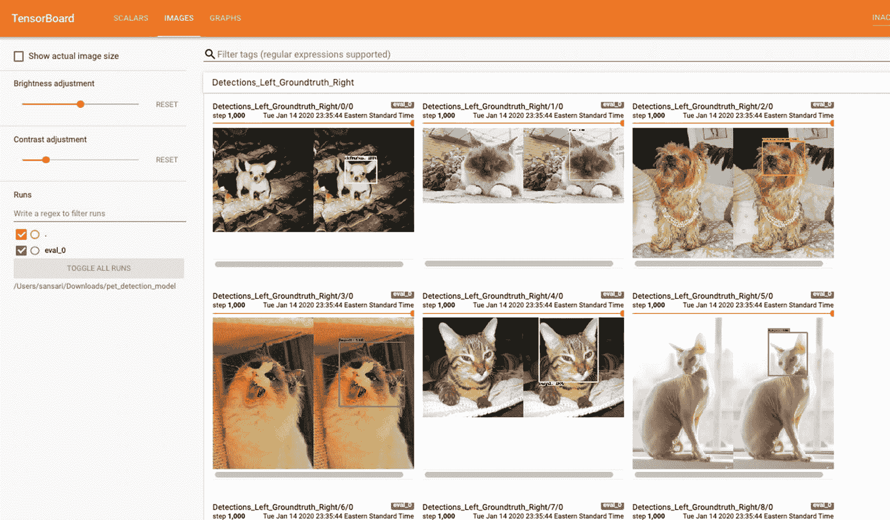

图 6-26

TensorBoard 仪表板中的模型训练结果

或者，如果您想在您的本地计算机上而不是在 Colab 上离线评估模型，您可以下载我们保存模型检查点的整个`pet_detection_model`目录。我们将训练模型导出到的目录`final_model`不包含完整的模型统计数据和训练结果。因此，你必须下载整个`pet_detection_model`目录。

在您的计算机终端(或命令提示符)中，通过将路径传递到`pet_detection_model`目录来启动 TensorBoard。确保你在虚拟环境中(如第 [1 章](01.html)所述)。以下是命令:

```py
(cv) username$ tensorboard --logdir ~/Downloads/pet_detection_model

```

成功执行前一个命令后，打开您的网络浏览器并转到`http://localhost:6006`查看 TensorBoard 仪表盘。点击顶部菜单中的图像选项卡，查看图像上带有边框的评估输出，如图 [6-26](#Fig26) 所示。

## 使用训练模型检测对象

正如我们之前所了解的，模型训练不是一项频繁的活动，当我们有一个相当好的模型(高精度或 mAP)时，只要模型给出准确的预测，我们就可能不需要重新训练模型。此外，模型训练是计算密集型的，即使在 GPU 上训练一个好的模型也需要几个小时或几天。有时，在云上训练计算机视觉模型并使用 GPU 是可取和经济的。当模型准备就绪时，将其下载到您的本地计算机或应用服务器中使用，它们将使用该模型来检测图像中的对象。

在本节中，我们将解释如何使用我们在 Google Colab 上训练的模型在您的本地计算机中开发对象检测预测器。我们将使用 PyCharm，这是我们在本书中一直使用的 IDE。当然，您可以使用 Colab 来开发对象检测预测器，但是从生产部署的角度来看，这并不理想。

虽然在 TensorFlow 版本 2 中还不支持对象检测模型训练，但是我们在这里将要编写的检测代码可以在 TensorFlow 2 上工作。

我们将遵循这个高级计划来开发我们的预测器:

1.  从 GitHub 资源库下载并安装 TensorFlow `models`项目。

2.  编写 Python 代码，该代码将利用导出的 TensorFlow 图(导出的模型)来预测新图像中未包含在训练集或测试集中的对象。

### 安装 TensorFlow 的模型项目

TensorFlow `models`项目的安装过程和我们在 Google Colab 上做的一样。不同之处可能在于 Protobuf 的安装，因为它是依赖于平台的软件。在我们开始之前，确保您的 PyCharm IDE 配置为使用我们在第 [1](01.html) 章中创建的虚拟环境。我们将在 PyCharm 的终端窗口中执行命令。如果您选择使用操作系统的 shell 来执行命令，请确保您已经为 shell 会话激活了虚拟环境。(参见第 [1 章](01.html)复习 virtualenv。)下面是安装和配置`models`项目的完整步骤:

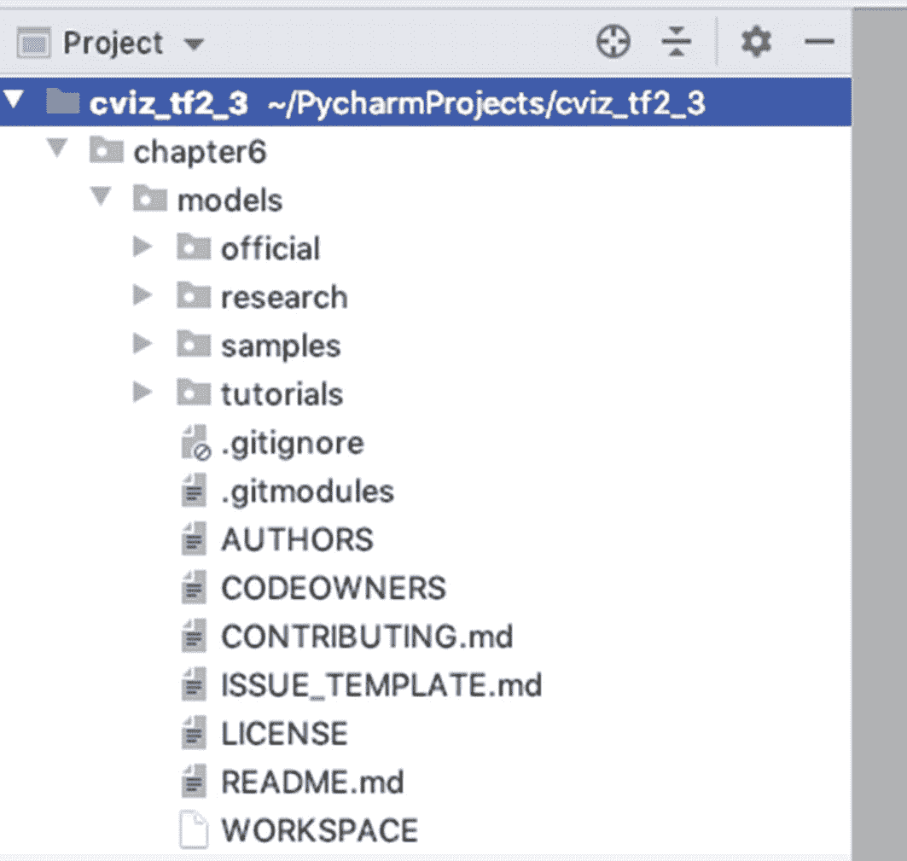

图 6-27

由 TensorFlow 模型项目组成的示例目录结构

表 6-3

安装依赖项的命令

<colgroup><col class="tcol1 align-left"> <col class="tcol2 align-left"></colgroup> 
| `pip install --user Cython``pip install --user contextlib2``pip install --user pillow``pip install --user lxml` |

1.  首先，让我们安装一些构建和安装`models`项目所需的必要库。在终端或命令提示符下执行表 [6-3](#Tab3) 中所示的命令(从 virtualenv 中)。

2.  安装谷歌的 Protobuf 编译器。安装过程取决于您使用的操作系统。遵循您的操作系统的以下说明:记住您安装 Protobuf 的目录位置，因为在构建 TensorFlow 代码时，您需要提供到`bin/protoc`的完整路径。
    1.  关于 Ubuntu: `sudo apt-get install protobuf-compiler`

    2.  在其他 Linux 操作系统上:

        ```py
        wget -O protobuf.ziphttps://github.com/google/protobuf/releases/download/v3.0.0/protoc-3.0.0-linux-x86_64.zip
        unzip protobuf.zip

        ```

        Remember the directory location you have installed Protobuf in, as you will need to provide the full path to
    1.  在 Mac OS 上:`brew install protobuf`

3.  使用以下代码从 GitHub 克隆 TensorFlow `models`项目:

    `git clone https://github.com/ansarisam/models.git`

    您也可以通过 [`https://github.com/tensorflow/models.git`](https://github.com/tensorflow/models.git) 从 TensorFlow 官方资源库下载模型。

    如图 [6-27](#Fig27) 所示，我们已经将 TensorFlow `models`项目下载到了名为`chapter6`的目录下。

4.  Compile the `models` project using the Protobuf compiler. Run the following set of commands from the `models/research` directory:

    ```py
    $ cd models/research
    $ protoc object_detection/protos/*.proto --python_out=.

    ```

    如果您手动安装了 Protobuf 并将其解压缩到一个目录中，请在前面的命令中提供到`bin/protoc`的完整路径。

5.  设置以下环境变量。标准做法是在`~/.bash_profile`中设置这些环境变量。以下是操作说明:
    1.  打开命令提示符或终端，键入`vi ~/.bash_profile`。您可以使用任何其他编辑器(如 nano)来编辑`.bash_profile`文件。

    2.  在`.bash_profile`的末尾增加以下三行。确保路径与您计算机中的目录路径匹配。

        ```py
        export PYTHONPATH=$PYTHONPATH:~/cviz_tf2_3/chapter6/models/research/object_detection

        export PYTHONPATH=$PYTHONPATH:~/cviz_tf2_3/chapter6/models/research

        export PYTHONPATH=$PYTHONPATH:~/cviz_tf2_3/chapter6/models/research/slim

        ```

    3.  添加前一行后保存文件`~/.bash_profile`。

    4.  关闭终端，然后重新启动以使更改生效。您需要关闭 PyCharm IDE 来更新 IDE 中的环境变量。要测试设置，请在 PyCharm 终端窗口中键入命令`echo $PYTHONPATH`。它应该打印出我们刚刚设置的路径。

6.  构建并安装我们刚刚使用 Protobuf 构建的`research`项目。从`models/research`目录执行以下命令:

    ```py
    python setup.py build
    python setup.py install

    ```

如果该命令成功运行，它应该在最后显示如下内容:

`Finished processing dependencies for object-detection==0.1`

我们已经做好了环境准备，准备编写代码来检测图像中的对象。我们将使用从 Colab 下载的导出模型。如果您还没有这样做，现在是时候从 Google Colab 或 Drive 下载最终模型了(如果您将模型保存在 Google Drive 中)。

### 目标检测代码

现在，我们已经准备好了编码环境和 TensorFlow `models`项目的 GitHub 检验，并且所有必要的设置都已完成，我们准备编写代码来检测图像中的对象并在它们周围绘制边界框。为了使代码简单易懂，我们将其分为以下几个部分:

*   *配置和初始化*:在这段代码中，我们初始化模型路径、图像输入和输出目录。清单 [6-9](#PC17) 显示了代码的第一部分，包括库导入和路径设置。

```py
Filename: Listing_6_9.py
1    import os
2    import pathlib
3    import random
4    import numpy as np
5    import tensorflow as tf
6    import cv2
7    # Import the object detection module.
8    from object_detection.utils import ops as utils_ops
9    from object_detection.utils import label_map_util
10
11   # to make gfile compatible with v2
12   tf.gfile = tf.io.gfile
13
14   model_path = "ssd_model/final_model"
15   labels_path = "models/research/object_detection/data/pet_label_map.pbtxt"
16   image_dir = "images"
17   image_file_pattern = "*.jpg"
18   output_path="output_dir"
19
20   PATH_TO_IMAGES_DIR = pathlib.Path(image_dir)
21   IMAGE_PATHS = sorted(list(PATH_TO_IMAGES_DIR.glob(image_file_pattern)))
22
23   # List of the strings that is used to add the correct label for each box.
24   category_index = label_map_util.create_category_index_from_labelmap(labels_path, use_display_name=True)
25   class_num =len(category_index)

Listing 6-9Imports and Path Initialization Part of the Object Detection Code

```

1 至 6 号线是我们通常的进口货。第 8 行和第 9 行从 TensorFlow `models`项目的`research`模块导入对象检测 API。确保`PYTHONPATH`环境变量设置正确(如前所述)。

第 12 行在 TensorFlow2 兼容模式下初始化`gfile`。`gfile`在 TensorFlow 中提供 I/O 功能。

第 14 行初始化我们的对象检测训练模型所在的目录路径。

第 15 行初始化映射文件路径。我们设置了相同的 JSON 格式的文件，其中包含我们在培训中使用的类 ID 和类名映射。

第 16 行是输入目录路径，包含需要检测对象的图像。

第 17 行定义了输入图像路径中文件名的模式。如果您想从目录中加载所有文件，请使用`*.*`。

第 18 行是输出目录路径，检测到的对象周围带有边框的图像将保存在该路径中。

第 20 行和第 21 行用于创建 iterable path 对象，我们将遍历这些对象来逐个读取图像，并检测每个图像中的对象。

第 24 行使用标签映射文件创建一个类别或类索引。

第 25 行将类的数量分配给了`class_num`变量。

除了前面的初始化之外，我们还初始化了一个颜色表，我们将在绘制边界框时使用它。清单 [6-10](#PC18) 显示了代码。

*   通过加载定型模型来创建模型对象。清单 [6-11](#PC19) 显示了将模型路径作为输入的函数`load_model()`。第 40 行从目录中加载保存的模型，并创建一个由该函数返回的模型对象。我们将使用这个模型对象来预测对象和边界框。

```py
27   def get_color_table(class_num, seed=0):
28      random.seed(seed)
29      color_table = {}
30      for i in range(class_num):
31          color_table[i] = [random.randint(0, 255) for _ in range(3)]
32      return color_table
33
34   colortable = get_color_table(class_num)
35

Listing 6-10Creating a Color Table Based on the Number of Object Classes

```

*   运行预测并以可用的形式构建输出。我们已经编写了一个名为`run_inference_for_single_image()`的函数，它有两个参数:模型对象和图像数量。这个函数返回一个 Python 字典。输出字典包含以下密钥对:

    `detection_boxes`，这是一个由边界框的四个角组成的 2D 数组。

    `detection_scores`，这是与每个边界框相关联的分数的 1D 阵列。

    `detection_classes`，其是与每个边界框相关联的对象类索引的整数表示的 1D 阵列。

    `num_detections`，表示预测对象类别的数量的标量。

    清单 [6-12](#PC20) 显示了函数`run_inference_for_single_image()`的实现。

    让我们一行一行地检查代码清单。

    TensorFlow 模型对象采用一批图像张量来预测对象类及其周围的边界框。第 48 行将图像 NumPy 转换成张量。因为我们一次处理一幅图像，而模型对象需要一批图像，所以我们需要将图像张量转换成一批图像。第 50 行就是这么做的。当使用一次时,`tf.newaxis`表达式用于将现有数组的维数增加 1。因此，1D 阵列将成为 2D 阵列。2D 阵列将变成三维阵列。诸如此类。

```py
36   # # Model preparation and loading the model from the disk
37   def load_model(model_path):
38
39      model_dir = pathlib.Path(model_path) / "saved_model"
40      model = tf.saved_model.load(str(model_dir))
41      model = model.signatures['serving_default']
42      return model
43

Listing 6-11Loading the Model from a Directory

```

```py
44   # Predict objects and bounding boxes and format the result

45   def run_inference_for_single_image(model, image):
46
47      # The input needs to be a tensor, convert it using `tf.convert_to_tensor`.
48      input_tensor = tf.convert_to_tensor(image)
49      # The model expects a batch of images, so add an axis with `tf.newaxis`.
50      input_tensor = input_tensor[tf.newaxis, ...]
51
52      # Run prediction from the model
53      output_dict = model(input_tensor)
54
55      # Input to model is a tensor, so the output is also a tensor
56      # Convert to numpy arrays, and take index [0] to remove the batch dimension.
57      # We're only interested in the first num_detections.
58      num_detections = int(output_dict.pop('num_detections'))
59      output_dict = {key: value[0, :num_detections].numpy()
60                     for key, value in output_dict.items()}
61      output_dict['num_detections'] = num_detections
62
63      # detection_classes should be ints.
64      output_dict['detection_classes'] = output_dict['detection_classes'].astype(np.int64)
65
66      # Handle models with masks:
67      if 'detection_masks' in output_dict:
68          # Reframe the the bbox mask to the image size.
69          detection_masks_reframed = utils_ops.reframe_box_masks_to_image_masks(
70              output_dict['detection_masks'], output_dict['detection_boxes'],
71              image.shape[0], image.shape[1])
72          detection_masks_reframed = tf.cast(detection_masks_reframed > 0.5,
73                                             tf.uint8)
74          output_dict['detection_masks_reframed'] = detection_masks_reframed.numpy()
75
76      return output_dict

Listing 6-12Predicting Objects and Bounding Boxes and Organizing the Output

```

第 53 行是进行实际对象检测的行。函数`model(input_tensor)`预测对象类别、边界框和相关分数。`model(input_tensor)`函数返回一个字典，我们将以一种可用的形式对其进行格式化，以便它只包含与输入图像相对应的输出。

由于模型获取一批图像，因此该函数返回该批图像的输出。因为我们只有一个图像，所以我们对这个输出字典的第一个结果感兴趣(通过第 0 个<sup>个</sup>索引访问)。第 59 行提取第一个输出并重新分配`output_dict`变量。

第 61 行在字典中存储了一些检测，这样我们在处理结果时就可以方便地使用这个数字。

当需要预测屏蔽时，第 66 到 74 行仅适用于屏蔽 R-CNN。对于所有其他预测，这些线可以省略。

第 76 行返回输出字典，它由检测到的边界框的坐标、对象类、分数和检测数量组成。在屏蔽 R-CNN 的情况下，它还包括对象屏蔽。

接下来，我们将检查如何使用`output_dict`在图像中检测到的物体周围绘制边界框。

*   我们现在将编写代码来推断输出，在检测到的对象周围绘制边界框，并存储结果。清单 [6-13](#PC21) 中的函数`infer_object()`用于推断函数`run_inference_for_single_image()`返回的`output_dict`。这个名为`infer_object()`的函数在图像中每个检测到的对象周围绘制边界框。它还用类名和分数标记对象，最后将结果保存到输出目录位置。清单 [6-13](#PC21) 是代码的逐行解释。

```py
79   def infer_object(model, image_path):
80      # Read the image using openCV and create an image numpy
81      # The final output image with boxes and labels on it.
82      imagename = os.path.basename(image_path)
83
84      image_np = cv2.imread(os.path.abspath(image_path))
85      # Actual detection.
86      output_dict = run_inference_for_single_image(model, image_np)
87
88      # Visualization of the results of a detection.
89      for i in range(output_dict['detection_classes'].size):
90
91          box = output_dict['detection_boxes'][i]
92          classes = output_dict['detection_classes'][i]
93          scores = output_dict['detection_scores'][i]
94
95          if scores > 0.5:
96              h = image_np.shape[0]
97              w = image_np.shape[1]
98              classname = category_index[classes]['name']
99              classid =category_index[classes]['id']
100             #Draw bounding boxes
101             cv2.rectangle(image_np, (int(box[1] * w), int(box[0] * h)), (int(box[3] * w), int(box[2] * h)), colortable[classid], 2)
102
103             #Write the class name on top of the bounding box
104             font = cv2.FONT_HERSHEY_COMPLEX_SMALL
105             size = cv2.getTextSize(str(classname) + ":" + str(scores), font, 0.75, 1)[0][0]
106
107             cv2.rectangle(image_np,(int(box[1] * w), int(box[0] * h-20)), ((int(box[1] * w)+size+5), int(box[0] * h)), colortable[classid],-1)
108             cv2.putText(image_np, str(classname) + ":" + str(scores),
109                     (int(box[1] * w), int(box[0] * h)-5), font, 0.75, (0,0,0), 1, 1)
110         else:
111             break
112     # Save the result image with bounding boxes and class labels in file system
113     cv2.imwrite(output_path+"/"+imagename, image_np)

Listing 6-13Drawing Bounding Boxes Around Detected Objects in Input Images

```

第 79 行定义了接受两个参数的函数`infer_object()`:模型对象和输入图像的路径。

第 82 行只是获取第 110 行中使用的图像的文件名，并将结果图像以相同的名称存储到输出目录中。

第 84 行使用 OpenCV 读取图像，并将其转换为 NumPy 数组。

第 85 行调用函数`run_inference_for_single_image()`，向其传递模型对象和图像 NumPy。回想一下，函数`run_inference_for_single_image()`返回一个包含检测到的对象和边界框的字典。

输出字典可能包含多个对象和边界框。我们需要遍历这些对象，并在这些对象周围绘制边界框，这些对象的得分超过了阈值。在前面的代码示例中，第 13 行循环遍历每个检测到的对象类。输出字典中的分数按降序排序。因此，当分数小于阈值时，退出循环。

第 91 到 93 行简单地提取了三个重要的输出数组——边界框坐标、在这个边界框中检测到的对象类以及相关的预测分数——并将它们分配给相应的变量。

在第 91 行，变量`box`是一个包含边界框四个角的数组，如下所述:

*   `box[0]`是 y 坐标，box[0]是矩形边界框左上角的 x 坐标。

*   `box[1]`和`box[2]`是边界框右下角的 y 和 x 坐标。

第 95 行检查分数是否大于阈值。在本例中，我们使用了阈值 0.5，但是您也可以使用适合您特定应用的值。仅当分数大于阈值时，才会在图像上绘制边界框；否则，将退出`for`循环。

回想一下，在将图像输入到模型中进行训练之前，会调整图像的大小。根据我们在培训中使用的`pipeline.config`中的高度和宽度设置来调整图像的大小。因此，预测的边界框也根据尺寸调整后的图像进行缩放。因此，我们需要根据用于检测的输入图像的原始大小来重新缩放边界框。将方框坐标乘以图像的高度和宽度，缩放图像大小的坐标。

第 101 行使用 OpenCV 的`rectangle()`函数绘制矩形边界框(查看章节 [2](02.html) 中的`rectangle()`函数)。注意，我们使用了`colortable`来动态地为不同的类获取不同的颜色。

第 105 行将预测的类名和相应的分数写在边界框的正上方。如果你愿意，你可以改变第 104 行的字体样式。在我们的例子中，文本的字体颜色和边界框的边框是相同的。您可以通过使用不同的值调用`colortable`函数来使用不同的颜色。例如，向类索引添加一个常数，并调用颜色表来表示文本颜色。

正如我们前面提到的，分数是按照最高分在数组顶部排序的。阈值之后的第一种情况的得分将打破循环，以避免不必要的处理。

第 113 行将结果图像保存到输出目录中，检测到的对象周围有边界框。

现在我们已经定义了所有正确的设置和函数，我们需要调用它们来触发检测过程。清单 [6-14](#PC22) 向您展示了如何触发检测。

```py
116  # Obtain the model object
117  detection_model = load_model(model_path)
118
119  # For each image, call the prediction
120  for image_path in IMAGE_PATHS:
121     infer_object(detection_model, image_path)

Listing 6-14Function Calls to Trigger the Detection Process

```

在清单 [6-14](#PC22) 中，第 117 行通过将路径传递给训练好的模型来调用`load_model()`函数。该函数返回将在后续调用中使用的模型对象。

第 120 行遍历每个图像文件，并为每个图像调用`infer_object()`。为每幅图像调用函数`infer_object()`,将检测到的物体周围带有边界框的最终输出保存在输出目录中。

让我们把所有这些放在一起，看看完整的对象检测源代码。清单 [6-15](#PC23) 是完整的工作代码。

```py
Filename: Listing_6_15.py
1    import os
2    import pathlib
3    import random
4    import numpy as np
5    import tensorflow as tf
6    import cv2
7    # Import the object detection module.
8    from object_detection.utils import ops as utils_ops
9    from object_detection.utils import label_map_util
10
11   # to make gfile compatible with v2
12   tf.gfile = tf.io.gfile
13
14   model_path = "ssd_model/final_model"
15   labels_path = "models/research/object_detection/data/pet_label_map.pbtxt"
16   image_dir = "images"
17   image_file_pattern = "*.jpg"
18   output_path="output_dir"
19
20   PATH_TO_IMAGES_DIR = pathlib.Path(image_dir)
21   IMAGE_PATHS = sorted(list(PATH_TO_IMAGES_DIR.glob(image_file_pattern)))
22
23   # List of the strings that are used to add the correct label for each box.
24   category_index = label_map_util.create_category_index_from_labelmap(labels_path, use_display_name=True)
25   class_num =len(category_index)
26
27   def get_color_table(class_num, seed=0):
28      random.seed(seed)
29      color_table = {}
30      for i in range(class_num):
31          color_table[i] = [random.randint(0, 255) for _ in range(3)]
32      return color_table
33
34   colortable = get_color_table(class_num)

35
36   # # Model preparation and loading the model from the disk
37   def load_model(model_path):
38
39      model_dir = pathlib.Path(model_path) / "saved_model"
40      model = tf.saved_model.load(str(model_dir))
41      model = model.signatures['serving_default']
42      return model
43
44   # Predict objects and bounding boxes and format the result
45   def run_inference_for_single_image(model, image):
46
47      # The input needs to be a tensor, convert it using `tf.convert_to_tensor`.
48      input_tensor = tf.convert_to_tensor(image)
49      # The model expects a batch of images, so add an axis with `tf.newaxis`.
50      input_tensor = input_tensor[tf.newaxis, ...]
51
52      # Run prediction from the model
53      output_dict = model(input_tensor)
54
55      # Input to model is a tensor, so the output is also a tensor
56      # Convert to numpy arrays, and take index [0] to remove the batch dimension.
57      # We're only interested in the first num_detections.
58      num_detections = int(output_dict.pop('num_detections'))
59      output_dict = {key: value[0, :num_detections].numpy()
60                     for key, value in output_dict.items()}
61      output_dict['num_detections'] = num_detections
62
63      # detection_classes should be ints.
64      output_dict['detection_classes'] = output_dict['detection_classes'].astype(np.int64)
65
66      # Handle models with masks:
67      if 'detection_masks' in output_dict:
68          # Reframe the the bbox mask to the image size.
69          detection_masks_reframed = utils_ops.reframe_box_masks_to_image_masks(
70              output_dict['detection_masks'], output_dict['detection_boxes'],
71              image.shape[0], image.shape[1])
72          detection_masks_reframed = tf.cast(detection_masks_reframed > 0.5,
73                                             tf.uint8)
74          output_dict['detection_masks_reframed'] = detection_masks_reframed.numpy()
75
76      return output_dict
77
78
79   def infer_object(model, image_path):
80      # Read the image using openCV and create an image numpy
81      # The final output image with boxes and labels on it.
82      imagename = os.path.basename(image_path)
83
84      image_np = cv2.imread(os.path.abspath(image_path))
85      # Actual detection.
86      output_dict = run_inference_for_single_image(model, image_np)
87
88      # Visualization of the results of a detection.
89      for i in range(output_dict['detection_classes'].size):
90
91          box = output_dict['detection_boxes'][i]
92          classes = output_dict['detection_classes'][i]
93          scores = output_dict['detection_scores'][i]
94
95          if scores > 0.5:
96              h = image_np.shape[0]
97              w = image_np.shape[1]
98              classname = category_index[classes]['name']
99              classid =category_index[classes]['id']
100             #Draw bounding boxes
101             cv2.rectangle(image_np, (int(box[1] * w), int(box[0] * h)), (int(box[3] * w), int(box[2] * h)), colortable[classid], 2)
102
103             #Write the class name on top of the bounding box
104             font = cv2.FONT_HERSHEY_COMPLEX_SMALL
105             size = cv2.getTextSize(str(classname) + ":" + str(scores), font, 0.75, 1)[0][0]
106
107             cv2.rectangle(image_np,(int(box[1] * w), int(box[0] * h-20)), ((int(box[1] * w)+size+5), int(box[0] * h)), colortable[classid],-1)
108             cv2.putText(image_np, str(classname) + ":" + str(scores),
109                     (int(box[1] * w), int(box[0] * h)-5), font, 0.75, (0,0,0), 1, 1)
110         else:
111             break
112     # Save the result image with bounding boxes and class labels in file system
113     cv2.imwrite(output_path+"/"+imagename, image_np)
114     # cv2.imshow(imagename, image_np)
115
116  # Obtain the model object
117  detection_model = load_model(model_path)
118
119  # For each image, call the prediction
120  for image_path in IMAGE_PATHS:
121     infer_object(detection_model, image_path)

Listing 6-15Fully Working Code for Object Detection Using a Pretrained Model

```

图 [6-28](#Fig28) 显示了一些样本输出，其中检测到的对象包含在边界框内。

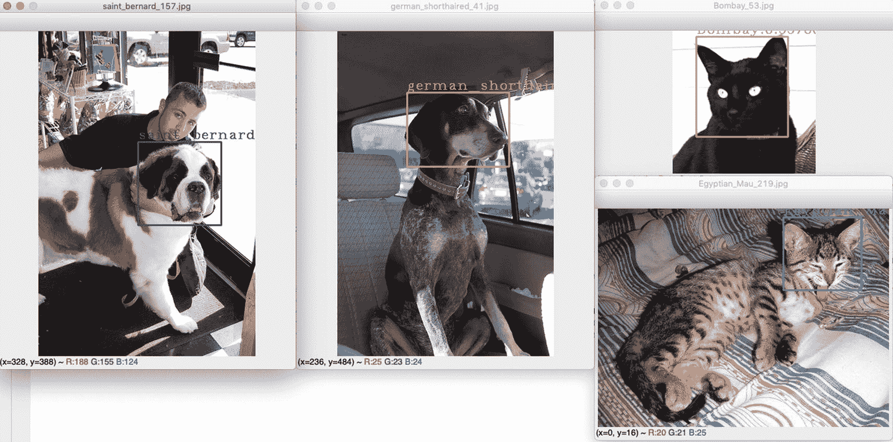

图 6-28

带有检测到的动物面孔和周围方框的输出图像示例

## 为对象检测训练 YOLOv3 模型

YOLOv3 是我们在本章中研究的所有对象检测算法中最年轻的。它还没有进入 TensorFlow 对象检测 API。YOLOv3 的作者约瑟夫·雷德蒙和阿里·法尔哈迪已经公开了他们的 API。他们还提供了基于 COCO 数据集的训练模型的权重。如本章 YOLOv3 一节所述，YOLOv3 使用 Darknet-53 架构来训练模型。

我们将使用官方 API 和预训练模型的权重，从我们在之前的 SSD 模型中使用的同一牛津-IIIT Pet 数据集来执行 YOLOv3 模型的迁移学习。我们将在 Google Colab 上运行培训，并使用 GPU 硬件加速器。

在我们开始之前，请登录您的 Google Colab 帐户并创建一个新项目。如果您遵循 SSD 培训流程，对您来说应该很容易。否则，请查看前面部分的 Google Colab 部分。我们开始吧！

### 安装 Darknet 框架

Darknet 是一个用 C 和 CUDA 编写的开源神经网络框架，可以在 CPU 和 GPU 上运行。首先，克隆 Darknet GitHub 存储库，然后构建源代码。清单 [6-16](#PC24) 展示了如何在 Google Colab 笔记本中做到这一点。

```py
1    %%shell
2    git clone https://github.com/ansarisam/darknet.git
3    # Official repository
4    #git clone https://github.com/pjreddie/darknet.git

Listing 6-16Cloning a Darknet Repository

```

第 2 行从我们的 GitHub 资源库中签出了 Darknet 项目，该项目是从官方的 Darknet 资源库派生出来的。如果您更愿意从官方存储库中下载它，取消对第 4 行和第 2 行的注释。

在存储库被克隆之后，展开文件浏览器，导航到`darknet`目录，并将`Makefile`下载到您的本地计算机。编辑`Makefile`(粗体字突出显示)，更改`GPU=1`和`OPENCV=1`，如下图所示:

*   **GPU=1**

*   库丁烷=0

*   **OPENCV=1**

*   OPENMP=0

*   调试=0

确保没有对`Makefile,`进行其他更改，否则您可能会在构建暗网代码时遇到麻烦。

完成前面的更改后，将`Makefile`上传到 Colab 的`darknet`目录。

现在我们已经准备好构建 Darknet 框架了。清单 [6-17](#PC25) 显示了构建命令。

```py
1    %%shell
2    cd darknet/
3    make

Listing 6-17Running the make Command to Build Darknet

```

构建过程成功完成后，运行清单 [6-18](#PC26) 中的命令来测试您的安装。如果安装成功，应该会打印出`usage: ./darknet <function>`。

```py
1    %%shell
2    cd darknet
3    ./darknet

Listing 6-18Testing the Darknet Installation

```

### 下载预先训练的卷积权重

清单 [6-19](#PC27) 下载在 Darknet-53 框架上训练的 COCO 数据集的预训练权重。

```py
1    %%shell
2    mkdir pretrained
3    cd pretrained
4    wget https://pjreddie.com/media/files/darknet53.conv.74

Listing 6-19Downloading Pre-trained Darknet-53 Weights

```

### 下载带注释的牛津-IIIT Pet 数据集

清单 [6-20](#PC28) 下载带有图像和注释的 pet 数据集。这已经在前面与 SSD 培训相关的章节中解释过了。

```py
1    %%shell
2    mkdir petdata
3    cd petdata
4    wget http://www.robots.ox.ac.uk/~vgg/data/pets/data/images.tar.gz
5    wget http://www.robots.ox.ac.uk/~vgg/data/pets/data/annotations.tar.gz
6    tar -xvf images.tar.gz
7    tar -xvf annotations.tar.gz

Listing 6-20Downloading the Pet Dataset Images and Annotations

```

Note

`images`目录包含几个扩展名为`.mat`的文件，这会导致训练中断。清单 [6-21](#PC29) 删除这些`.mat`文件。

```py
1    %%shell
2    cd /content/petdata/images
3    rm *.mat

Listing 6-21Deleting the Invalid File Extension .mat

```

### 准备数据集

YOLOv3 训练 API 期望数据集具有特定的格式和目录结构。我们下载的 pet 数据有两个子目录:`images`和`annotations.``images`目录包含所有我们将用于训练和测试的标记图像。`annotations`目录包含 XML 格式的注释文件，每个图像一个 XML 文件。

YOLOv3 需要以下文件:

*   `train.txt`:该文件包含图像的绝对路径——每行一个图像路径——将用于训练。

*   `test.txt`:该文件包含图像的绝对路径——每行一个图像路径——将用于测试。

*   `class.data`:该文件包含对象类的名称列表——每行一个名称。

*   `labels`:该目录与`train.txt`和`test.txt`在同一个位置。这个`labels`目录包含注释文件，每个图像一个文件。该目录中的文件名必须与图像文件名相同，只是扩展名为`.txt`。例如，如果图像文件名为`Abyssinian_1.jpg`，则`labels`目录中的注释文件名必须为`Abyssinian_1.txt`。每个注释文本文件必须在一行中包含注释的边界框和对象类，格式如下:

```py
<object-class> <x_center> <y_center> <width> <height>

```

在哪里

`<object-class>`是对象的整数类索引，从 0 到(`num_class-1`)。

`<x_center>`和`<y_center>`是浮点值，表示边界框相对于图像高度和宽度的中心。

`<width> <height>`是相对于图像高度和宽度的边界框的宽度和高度。

请注意，该文件中的条目由空格分隔，而不是由逗号或任何其他分隔符分隔。

注释文本文件的条目示例如下(确保字段由空格分隔，而不是逗号或任何其他分隔符。):

***10 0.63 0.285000000000003 0.285000000000003 0.215***

清单 [6-22](#PC31) 将 pet 数据注释转换成 YOLOv3 要求的格式。这是标准的 Python 代码，不需要任何解释。

```py
1    import os
2    import glob
3    import pandas as pd
4    import xml.etree.ElementTree as ET
5
6
7    def xml_to_csv(path, img_path, label_path):
8       if not os.path.exists(label_path):
9           os.makedirs(label_path)
10
11      class_list = []
12      for xml_file in glob.glob(path + '/*.xml'):
13          xml_list = []
14          tree = ET.parse(xml_file)
15          root = tree.getroot()
16          for member in root.findall('object'):
17              imagename = str(root.find('filename').text)
18              print("image", imagename)
19              index = int(imagename.rfind("_"))
20              print("index: ", index)
21              classname = imagename[0:index]
22
23              class_index = 0
24              if (class_list.count(classname) > 0):
25                  class_index = class_list.index(classname)
26
27              else

:
28                  class_list.append(classname)
29                  class_index = class_list.index(classname)
30
31              print("width: ", root.find("size").find("width").text)
32              print("height: ", root.find("size").find("height").text)
33              print("minx: ", member[4][0].text)
34              print("ymin:", member[4][1].text)
35              print("maxx: ", member[4][2].text)
36              print("maxy: ", member[4][3].text)
37              w = float(root.find("size").find("width").text)
38              h = float(root.find("size").find("height").text)
39              dw = 1.0 / w
40              dh = 1.0 / h
41              x = (float(member[4][0].text) + float(member[4][2].text)) / 2.0 - 1
42              y = (float(member[4][1].text) + float(member[4][3].text)) / 2.0 - 1
43              w = float(member[4][2].text) - float(member[4][0].text)
44              h = float(member[4][3].text) - float(member[4][1].text)
45              x = x * dw
46              w = w * dw
47              y = y * dh
48              h = h * dh
49
50              value = (class_index,
51                       x,
52                       y,
53                       y,
54                       h
55                       )
56              print("The line value is: ", value)
57              print("csv file name: ", os.path.join(label_path, imagename.rsplit('.', 1)[0] + '.txt'))
58              xml_list.append(value)
59              df = pd.DataFrame(xml_list)
60              df.to_csv(os.path.join(label_path, imagename.rsplit('.', 1)[0] + '.txt'), index=None, header=False, sep=' ')
61
62      class_df = pd.DataFrame(class_list)
63      return class_df
64
65
66   def create_training_and_test(image_dir, label_dir):
67      file_list = []
68      for img in glob.glob(image_dir + "/*"):
69          print(os.path.abspath(img))
70
71          imagefile = os.path.basename(img)
72
73          textfile = imagefile.rsplit('.', 1)[0] + '.txt'
74
75          if not os.path.isfile(label_dir + "/" + textfile):
76              print("delete image file ", img)
77              os.remove(img)
78              continue
79          file_list.append(os.path.abspath(img))
80
81      file_df = pd.DataFrame(file_list)
82      train = file_df.sample(frac=0.7, random_state=10)
83      test = file_df.drop(train.index)
84      train.to_csv("petdata/train.txt", index=None, header=False)
85      test.to_csv("petdata/test.txt", index=None, header=False)
86
87
88   def main():
89      img_dir = "petdata/images"
90      label_dir = "petdata/labels"
91
92      xml_path = os.path.join(os.getcwd(), 'petdata/annotations/xmls')
93      img_path = os.path.join(os.getcwd(), img_dir)
94      label_path = os.path.join(os.getcwd(), label_dir)
95
96      class_df = xml_to_csv(xml_path, img_path, label_path)
97      class_df.to_csv('petdata/class.data', index=None, header=False, delimiter=r"\s+")
98      create_training_and_test(img_dir, label_path)
99      print('Successfully converted xml to csv.')
100
101
102  main()

Listing 6-22Converting Image Annotations from XML to TXT

```

### 配置培训输入

我们需要一个包含训练集和测试集路径信息的配置文件。配置文件的格式如下:

```py
classes= 37
train  = /content/petdata/train.txt
valid  = /content/petdata/test.txt
names = /content/petdata/class.data
backup = /content/yolov3_model

```

其中，`classes`变量获取我们的训练图像的对象类的数量(在我们的例子中是 37 个宠物类)，`train`和`valid`变量获取我们之前创建的训练和验证列表的路径，`names`获取包含类名的文件的路径，`backup`变量指向将保存已训练的 YOLO 模型的目录路径。请确保该目录存在，否则执行将引发异常。

保存该文本文件，并以扩展名`.cfg`命名。在我们的例子中，我们将这个文件保存为`pet_input.cfg`。然后，我们将把这个文件上传到目录路径`/content/darknet/cfg`中的 Colab。

### 配置暗网神经网络

从 Colab 下载来自`/content/darknet/cfg/yolov3-voc.cfg`的示例网络配置文件，并将其保存在您的本地计算机中。您可以将该文件重命名为与您的数据集相关的名称。例如，在本练习中，我们将其重命名为`yolov3-pet.cfg`。

我们将编辑该文件以匹配我们的数据。我们将要编辑的文件中最重要的部分是`yolo`层。

在配置文件中搜索段`[yolo]`。应该有三层`yolo`。我们将编辑对象类的数量，在我们的例子中是 37。在这三个地方，我们都将班级人数改为 37 人。此外，我们将在所有三个地方的`yolo`层之前更改卷积层中的`filters`值。`yolo`层之前的卷积层中的`filters`的值由以下公式确定:

***过滤器=数量/3 *(数量 _ 类别+5)***

***滤镜= (9/3) * (37 + 5) = 126***

关于`[yolo]`部分之前的`[yolo]`部分和`[convolutional]`部分的示例，请参见以下代码:

```py
....
[convolutional]
size=1
stride=1
pad=1
filters=126
activation=linear

[yolo]
mask = 0,1,2
anchors = 10,13, 16,30, 33,23, 30,61, 62,45, 59,119, 116,90, 156,198, 373,326
classes=37
num=9
jitter=.3
ignore_thresh = .5
truth_thresh = 1
random=1
...

```

确保在配置文件中的三个地方更改了`classes`和`filters`的值。

我们将编辑的其他参数如下:

*   `width=416`，输入图像的宽度。所有图像都将调整到这个宽度。

*   `height=416`，输入图像的高度。所有图像都将调整到这个高度。

*   `batch=64`，表示我们希望权重更新的频率。

*   `subdivisions=16`，表示如果 GPU 没有足够大的内存来加载与批处理大小相等的数据示例，将在内存中加载多少个示例。如果您在执行培训时看到“内存不足”异常，请调整这个数字并逐渐减小它，直到您看不到内存错误。

*   `max_batches=74000`，表示训练应该运行多少批次。如果设置过高，训练可能需要很长时间才能完成。如果太低，网络学习不够。实际上，已经确定`max_batch`的大小应该是类数量的 2000 倍。在我们的例子中，我们有 37 个类，所以`max_batch`值应该是 2000×37 = 74000。如果只有一个类，将`max_batches`的值设置为最小值 4000。

保存配置文件，然后上传到`cfg`目录路径:`/content/darknet/cfg.`

### 训练 YOLOv3 模型

使用清单 [6-23](#PC34) 中的命令执行 YOLOv3 训练。

```py
1    %%shell
2    cd darknet/
3    ./darknet detector train cfg/pet_input.cfg cfg/yolov3-pet.cfg /content/pretrained/darknet53.conv.74

Listing 6-23Training the YOLOv3 Model

```

如清单 [6-23](#PC34) 所示，训练的参数是到`pet_input.cfg`、`yolov3-pet.cfg`的路径，以及预训练的暗网模型。

如果一切顺利，您将在配置中指定的目录路径中拥有一个经过训练的模型，其中`backup`被设置为`/content/yolov3_model.`。当网络正在学习时，它会将中间权重作为检查点保存在`backup`目录中。

在训练过程中观察控制台输出。你会注意到三条重要的线显示了三个区域的平均 IOU，82、94 和 106(如图 [6-29](#Fig29) 所示)。

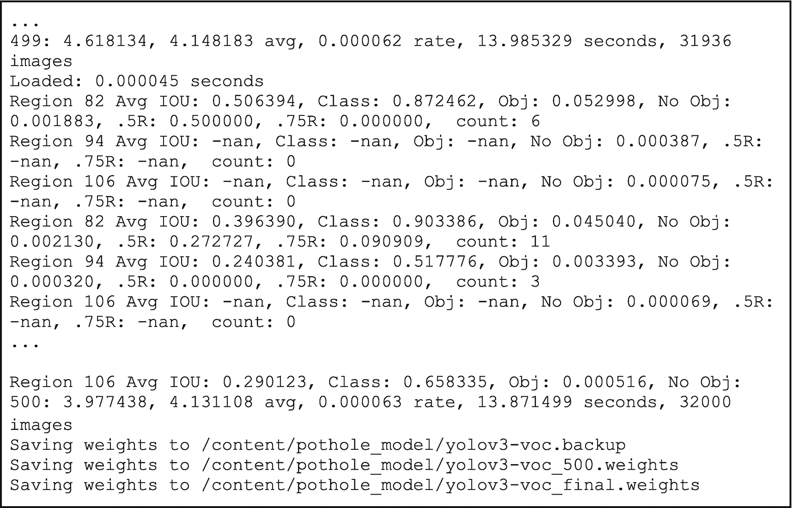

图 6-29

YOLOv3 培训期间的控制台输出示例(输出仅显示 500 次迭代，这对于真实模型来说通常是不够的)

这三个区域意味着暗网框架中的 YOLO 层 82、层 94 和层 106。你也可能观察到部分地区的 IOU 为`-nan`，这是完全正常的。经过几次迭代后，区域 IOU 将开始显示数字。

注意到图 [6-29](#Fig29) 中样本输出的第一个数字是 499，这表明完成了 499 个批次的训练，批次水平损失为 4.618134，总平均损失为 4.148183，学习率为 0.000062，完成该批次花费了 13.985329 秒。这将让您了解完成培训需要多长时间。损失值给出了学习进行得有多好的想法。

请注意最后三行，它们是在培训完全结束时打印出来的。它显示了保存检查点、中间重量和最终重量的位置。

您应该将包含最终模型的整个目录复制到您的私有 Google Drive，这样您就可以在您的应用中使用经过训练的模型。

训练进行时，控制台会打印大量信息，显示在 web 浏览器中。过一会儿，web 浏览器变得没有响应。清除控制台输出可能是一个好主意，以防止浏览器被杀死。要清除日志输出，请单击位于笔记本单元块左上角的执行按钮正下方的 X 按钮。在训练运行时，您会看到三个点，悬停时，它会变成一个 X 按钮。

### 培训应该持续多长时间

一般来说，每个类的训练应该至少运行 2，000 次迭代，但是总共不少于 4，000 次迭代。在我们的 pet 数据集的例子中，我们有 37 个类。这意味着我们应该将`max_batches`设置为 74000。

在训练过程中观察输出，并注意每次迭代后的损失。如果损失稳定下来，并且在几个批次中没有变化，我们应该考虑停止训练。理想情况下，损失应该接近于零。然而，出于最实际的目的，我们的目标应该是将损耗稳定在 0.05 以下。

### 最终模型

网络完成学习后，最终的 YOLOv3 模型将保存在目录`/content/yolov3_model.`中，模型文件的名称为`yolov3-pet_final.weights`。

下载此模型或将其保存到您的私人 Google Drive 文件夹中，因为当会话到期时，Google Colab 会删除您的所有文件。我们将在图像和视频中的实时对象检测中使用该模型。

## 使用训练的 YOLOv3 模型检测对象

我们将编写一些 Python 代码，并在本地计算机中执行对象检测，就像我们在 SSD 中所做的那样。我们将使用从 Google Colab 下载的训练模型(参见“最终模型”部分)。

让我们从在 PyCharm 中设置我们的开发环境开始。

### 将 Darknet 安装到本地计算机

使用以下步骤在本地计算机上安装并构建 Darknet 框架:

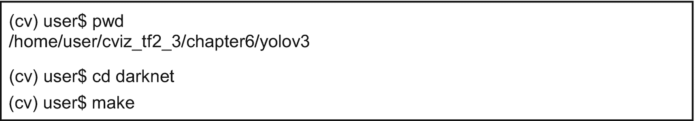

图 6-31

使用 make 命令生成源代码

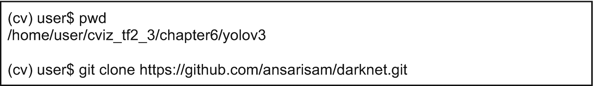

图 6-30。命令来显示目录结构并克隆 GitHub 存储库

1.  打开命令提示符、shell 终端或 PyCharm 的终端，并`cd`到您想要安装 Darknet 框架的目录。确保你处于我们在第 [1 章](01.html)中创建的同一虚拟环境中。

2.  克隆 GitHub 库， [`https://github.com/ansarisam/darknet.git`](https://github.com/ansarisam/darknet.git) `.`这个库是从原来的 darknet 库中派生出来的， [`https://github.com/pjreddie/darknet`](https://github.com/pjreddie/darknet) `.`我们在 C 代码中做了一些修改(在`src/image.c`中)来生成输出中的边界框。此外，我们还提供了一个 Python 脚本`yolov3_detector.py`，用于预测对象和边界框，然后将输出保存为 JSON。见图 [6-30](#Fig30)

3.  源代码克隆完成后，编辑位于`darknet`目录下的`Makefile`。如果你使用的是 GPU，设置`GPU=1`并保存文件。如果您正在使用 CPU，请不要对此`Makefile`进行任何更改。

4.  使用`make`命令构建 C 源代码。只需从`darknet`目录中键入命令，如图 [6-31](#Fig31) 所示。

    如果一切都运行成功，那么您就已经为对象检测准备好了 PyCharm 环境。

5.  通过从`darknet`目录键入命令`./darknet`来测试安装。该命令应该打印出类似于`usage.: ./darknet <function>`的输出。

### 用于对象检测的 Python 代码

清单 [6-24](#PC35) 提供了 Python 代码来检测图像中的对象。

```py
1    import os
2    import subprocess
3    import pandas as pd
4    image_path="test_images/dog.jpg"
5    yolov3_weights_path="backup/yolov3.weights"
6    cfg_path="cfg/yolov3.cfg"
7    output_path="output_path"
8    image_name = os.path.basename(image_path)
9    process = subprocess.Popen(['./darknet', 'detect', cfg_path, yolov3_weights_path, image_path],
10                       stdout=subprocess.PIPE,
11                       stderr=subprocess.PIPE)
12   stdout, stderr = process.communicate()
13
14   std_string = stdout.decode("utf-8")
15   std_string = std_string.split(image_path)[1]
16   count = 0
17   outputList = []
18   rowDict = {}
19   for line in std_string.splitlines():
20
21      if count > 0:
22          if count%2 > 0:
23              obj_score = line.split(":")
24              obj = obj_score[0]
25              score = obj_score[1]
26              rowDict["object"] = obj
27              rowDict["score"] = score
28          else:
29              bbox = line.split(",")
30              rowDict["bbox"] = bbox
31              outputList.append(rowDict)
32              rowDict = {}
33      count = count +1
34   rowDict["image"] = image_path
35   rowDict["predictions"] = outputList
36
37   df = pd.DataFrame(rowDict)
38   df.to_json(output_path+"/"+image_name.replace(".jpg", ".json").replace(".png", ".json"),orient='records')

Listing 6-24Object Detection with Results Stored as JSON to Output Location

```

1 至 3 号线是我们通常的进口货。

第 4 行设置需要检测对象的图像位置的路径。

第 5 行设置了训练模型的权重的路径(从 Colab 下载)。

第 6 行设置了我们用于训练的暗网神经网络配置。

第 7 行是输出位置，其中包含检测到的对象、相关分数和封闭边界框的最终结果以 JSON 格式保存。

第 9 行到第 12 行执行一个 shell 命令，并将输出和错误传递给`stdout`和`stderr`变量。我们使用的`subprocess`包产生了新的进程，连接到它们的输入/输出/错误流水线，并获得它们的返回代码。子流程返回的输出和错误以字节为单位。因此，我们在第 13 行将输出字节转换成 UTF-8 编码的字符串。

在幕后，该子进程执行以下 shell 命令:

```py
./darknet detect <cfg_path> <yolov3_model_weights_path> <image_path>

```

您可以从终端的`darknet`目录中直接执行这个命令。该命令将在控制台上打印大量信息，如网络配置、检测到的对象、检测分数和边界框。

第 15 到 35 行将输出解析成结构化的 JSON 格式。最终输出包含图像路径、对象类的预测列表、边界框的坐标以及相关的分数。边界框坐标的格式为`[left, top, right, bottom]`。

第 37 行使用 Pandas 创建一个数据帧，第 38 行将数据帧以 JSON 格式保存到输出位置。

图 [6-32](#Fig32) 显示了通过从图 [6-33](#Fig33) 所示的图像中预测对象而创建的 JSON 格式的样本输出。

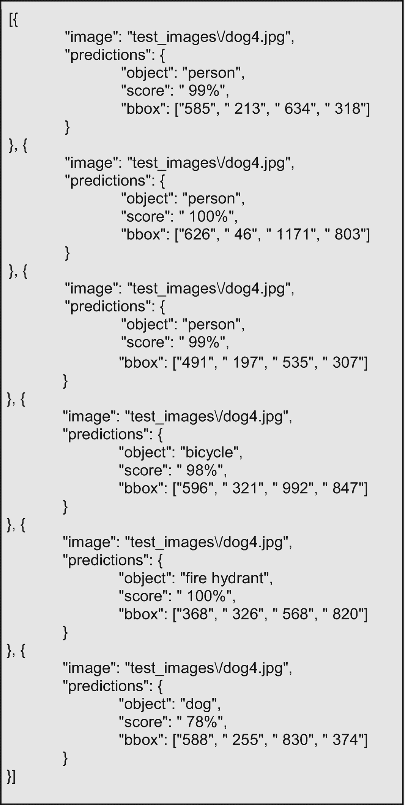

图 6-33

YOLOv3 预测器的 JSON 输出

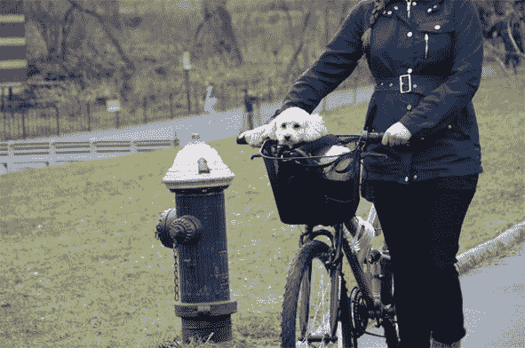

图 6-32

包含要从 YOLOv3 模型中检测的对象的原始图像

## 摘要

在本章中，我们学习了不同的目标检测算法，以及它们在检测速度和准确性方面的相互比较。我们训练了两个检测模型，SSD 和 YOLOv3，并从头到尾经历了从摄取数据到保存预测输出的过程。

我们还学习了如何使用 Google Colab 在云上训练检测模型，并使用 GPU 的力量。

在这一章中，我们主要关注于检测图像中的物体，并没有涉及视频的例子。检测视频中的对象的过程类似于图像中的检测，因为视频只是图像的帧。第 7 章专门讨论这个话题。然后我们将把本章提出的概念应用到第 [9](09.html) 和 [10](10.html) 章，利用深度学习开发计算机视觉的真实世界用例。******