# 八、实际例子：人脸识别

人脸识别是在图像或视频中检测和识别人脸的计算机视觉问题。面部识别的第一步是在输入图像中检测和定位面部的位置。这是一个典型的对象检测任务，就像我们在前面的章节中了解到的那样。检测到面部后，从面部的各个关键点创建特征集，也称为*面部足迹*或*面部嵌入*。一张人脸有 80 个节点或区分标志，用于创建特征集(USPTO 专利号 US7634662B2， [`https://patents.google.com/patent/US7634662B2/`](https://patents.google.com/patent/US7634662B2/) )。然后将嵌入的人脸与数据库进行比较，以确定人脸的身份。

面部识别在现实世界中有许多应用，例如:

*   作为进入高安全区域的密码

*   在机场海关和边境保护方面

*   在识别遗传疾病方面

*   作为预测个人年龄和性别的一种方式(例如，用于控制基于年龄的访问，如酒精购买)

*   在执法中(例如，警察通过扫描数百万张照片来发现潜在的犯罪嫌疑人和证人)。

*   在组织数字相册(例如，社交媒体上的照片)时

在这一章中，我们将探索由谷歌工程师开发的流行的人脸识别算法 FaceNet。我们将学习如何训练基于 FaceNet 的神经网络来开发人脸识别模型。最后，我们将编写代码来开发一个全功能的人脸识别系统，该系统可以从视频流中实时检测人脸。

## FaceNet(网面)

FaceNet 是由三位谷歌工程师 Florian Schroff、Dmitry Kalenichenko 和 James Philbin 发明的。他们于 2015 年在一篇题为“FaceNet:人脸识别和聚类的统一嵌入”( [`https://arxiv.org/pdf/1503.03832.pdf`](https://arxiv.org/pdf/1503.03832.pdf) )的论文中发表了他们的工作。

FaceNet 是一个统一的系统，提供以下功能:

*   人脸验证(这是同一个人吗？)

*   认可(这个人是谁？)

*   聚类(有相似的脸吗？)

FaceNet 是一种深度神经网络，具有以下功能:

*   从输入图像中计算 128D 紧凑特征向量，称为*面部嵌入*。回想一下第 4 章[中的内容，特征向量包含描述物体重要特征的信息。128D 特征向量是 128 个实数值的列表，表示试图量化面部的输出。](04.html)

*   通过优化三重损失函数来学习。我们将在本章后面探讨损失函数。

### FaceNet 神经网络体系结构

图 [8-1](#Fig1) 显示了 FaceNet 架构。

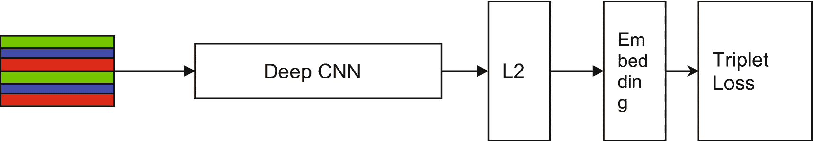

图 8-1

FaceNet 神经网络体系结构

以下部分描述了 FaceNet 网络的组件。

#### 输入图像

训练集由从图像中裁剪的面部缩略图组成。除了平移和缩放之外，不需要对面裁剪进行其他对齐。

#### 深度 CNN

使用具有反向传播的 SGD 和 AdaGrad 优化器，使用深度卷积神经网络来训练 FaceNet。初始学习率取为 0.05，并随着迭代减少以最终确定模型。培训是在基于 CPU 的集群上进行的，时间为 1，000 到 2，000 小时。

FaceNet 论文描述了具有不同权衡的深度卷积神经网络的两种不同架构。第一个架构的灵感来自泽勒和弗格斯，第二个架构来自谷歌。这两种体系结构主要在两个方面不同:参数的数量和每秒浮点运算次数(FLOPS)。FLOPS 是衡量需要浮点计算的计算机性能的标准。

泽勒和弗格斯 CNN 架构由 22 层组成，在 1.4 亿个参数上训练，每幅图像 16 亿次浮点运算。这种 CNN 架构称为 NN1，其输入大小为 220×220。

表 [8-1](#Tab1) 显示了 FaceNet 中使用的基于泽勒和弗格斯的网络配置。

表 8-1

深度 CNN 基于泽勒和弗格斯网络架构(来源:施罗夫等人， [`https://arxiv.org/pdf/1503.03832.pdf`](https://arxiv.org/pdf/1503.03832.pdf) )

<colgroup><col class="tcol1 align-center"> <col class="tcol2 align-center"></colgroup> 
| - 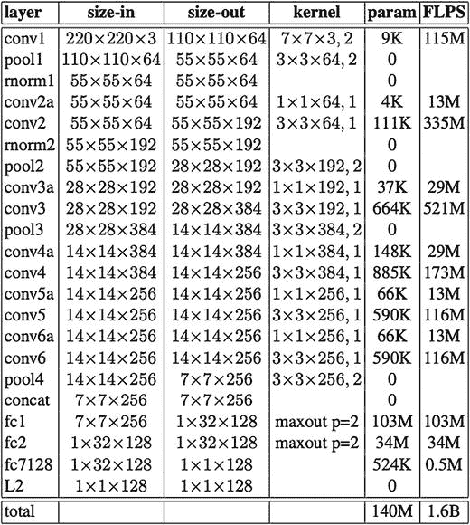 |

第二种类型的网络是基于 GoogLeNet 的初始模型。该模型的参数减少了 20 倍(约 660 万至 750 万)，FLOPS 减少了 5 倍(约 5 亿至 16 亿)。

基于输入的大小，有一些初始模型的变体。这里对它们进行了简要描述:

*   这是一个初始模型，拍摄尺寸为 224×224 的图像，并以每幅图像 16 亿次浮点运算对 750 万个参数进行训练。

表 [8-2](#Tab2) 显示了 FaceNet 中使用的 NN2 初始模型。

表 8-2

基于 GoogLeNet 的 Inception 模型架构(来源:Schroff 等人， [`https://arxiv.org/pdf/1503.03832.pdf`](https://arxiv.org/pdf/1503.03832.pdf) )

<colgroup><col class="tcol1 align-center"> <col class="tcol2 align-center"></colgroup> 
| - 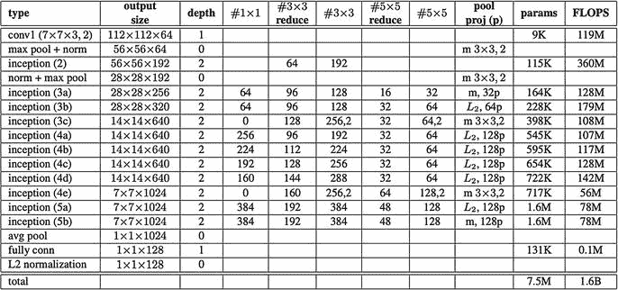 |

*   *NN3* :与 NN2 相比，它在架构上完全相同，只是它使用 160×160 的输入尺寸，导致网络尺寸更小。

*   *NN4* :该网络具有 96×96 的输入大小，导致参数大幅减少，每个图像仅需要 2.85 亿次浮点运算(相比之下，NN1 和 NN2 需要 16 亿次浮点运算)。由于 NN4 的尺寸更小，FLOPS 要求的 CPU 时间更少，因此适合移动设备。

*   NNS1 :由于其尺寸较小，这也被称为“迷你”初始。它具有 165×165 的输入大小和 2600 万个参数，每个图像只需要 2.2 亿次浮点运算。

*   NNS2 :这被称为“微小的”开始。它的输入大小为 140×116，有 430 万个参数，需要 2000 万个触发器。

NN4、NNS1 和 NNS2 适用于移动设备，因为其参数数量较少，要求每个映像的 CPU FLOPS 较低。

值得一提的是，FLOPS 越大，模型精度越高。一般来说，FLOPS 越低的网络运行速度越快，消耗的内存越少，但精度也越低。

图 [8-2](#Fig2) 显示了不同类型 CNN 架构的 FLOPS 与精度的关系图。

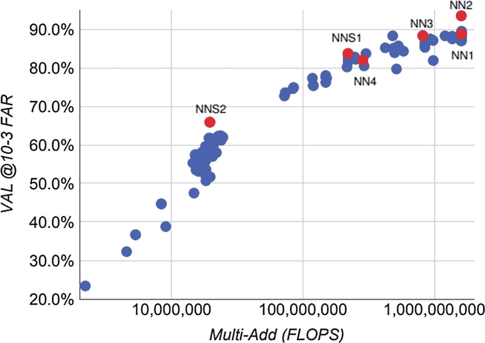

图 8-2

FLOPS 与准确性(来源:FaceNet，[https://arxiv . org/pdf/1503 . 03832 . pdf](https://arxiv.org/pdf/1503.03832.pdf))

#### 人脸嵌入

从深度 CNN 的 L2 归一化层生成大小为 1×1×128 的人脸嵌入(如图 [8-1](#Fig1) 和表 [8-1](#Tab1) 和 [8-2](#Tab2) )。

在计算嵌入之后，通过计算嵌入之间的欧几里德距离并基于以下找到相似的面部来执行面部验证(或找到相似的面部):

*   同一个人的脸之间的距离较小

*   不同人的脸有更大的距离

通过标准的 K-最近邻(K-NN)分类来执行人脸识别。

使用像 K-means 或凝聚聚类技术这样的算法来完成聚类。

#### 三重损失函数

FaceNet 中使用的损失函数被称为*三重损失函数*。

相同人脸的嵌入称为*正*，不同人脸的嵌入称为*负*。被分析的人脸被称为*主播*。为了计算损失，形成由锚、正和负嵌入组成的三元组，并分析它们的欧几里德距离。FaceNet 的学习目标是最小化锚和正面之间的距离，最大化锚和负面之间的距离。

图 [8-3](#Fig3) 说明了三重损失函数和学习过程。

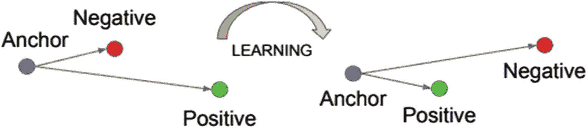

图 8-3

三重损失最小化了锚和具有相同身份的正片之间的距离，并且最大化了锚和不同身份的负片之间的距离。(来源:FaceNet，[https://arxiv . org/pdf/1503 . 03832 . pdf](https://arxiv.org/pdf/1503.03832.pdf)。)

每一张人脸图像都是一个特征向量，代表一个 d 维欧氏超球面，用函数| |*f(x)| |*<sub>T3】2</sub>*= 1*来表示。

假设人脸图像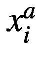(主播)比不同人的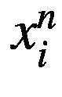(硬负)人脸更接近同一个人的人脸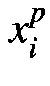(硬正)。此外，假设在训练集中有 N 个三元组。三重损失函数由下式表示:

![$$ {\sum}_i^N\left[\ {\left\Vert\ f\left({x}_i^a\right)-f\left({x}_i^p\right)\ \right\Vert}_2^2-{\left\Vert f\left({x}_i^a\right)-f\left({x}_i^n\right)\ \right\Vert}_2^2+\alpha\ \right] $$](img/493065_1_En_8_Chapter_TeX_IEq4.png)其中 *α* 是正嵌入和负嵌入之间的距离余量。

如果我们考虑三元组的每一种可能的组合，将会有很多三元组，而前面的函数可能需要很长时间才能收敛。此外，并不是每个三元组都有助于模型学习。因此，我们需要一种方法来选择正确的三元组，以便我们的模型训练是有效的，并且精度是最佳的。

#### 三联体选择

理想情况下，我们应该以这样的方式选择三元组: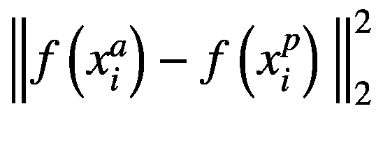最小，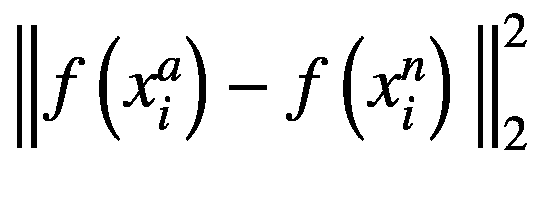最大。但是计算所有数据集的最小值和最大值可能是不可行的。因此，我们需要一种有效计算最小和最大距离的方法。这可以离线完成，然后馈送给算法，或者使用一些算法在线确定。

在在线方法中，我们将嵌入分成小批量。每个小批量包含一小组阳性和一些随机选择的阴性。FaceNet 的发明人使用了由 40 个阳性和随机选择的阴性嵌入组成的小批量。计算每个小批量的最小和最大距离，以创建三元组。

在接下来的部分中，我们将学习如何基于 FaceNet 训练我们自己的模型，并构建一个实时人脸识别系统。

## 训练人脸识别模型

FaceNet 最流行的 TensorFlow 实现之一是由大卫·桑德伯格实现的。这是一个开源版本，可以在 GitHub[`https://github.com/davidsandberg/facenet`](https://github.com/davidsandberg/facenet)的 MIT 许可下免费获得。我们已经分叉了原始的 GitHub 库，并提交了一个稍微修改的版本到我们位于 [`https://github.com/ansarisam/facenet`](https://github.com/ansarisam/facenet) 的 GitHub 库。我们没有修改核心神经网络和三重损失函数的实现。我们修改过的 FaceNet 版本来自大卫·桑德伯格的知识库，使用 OpenCV 来读取和操作图像。我们还升级了 TensorFlow 的部分库函数。FaceNet 的这个实现需要 TensorFlow 版本 1。并且目前不能在版本 2 上运行。

在下面的例子中，我们将使用 Google Colab 来训练我们的人脸检测模型。值得注意的是，人脸检测模型是计算密集型的，可能需要几天时间来学习，即使在 GPU 上也是如此。因此，Colab 不是训练长期运行模型的理想平台，因为在 Colab 会话到期后，您将丢失所有数据和设置。您应该考虑使用基于云的 GPU 环境来训练生产质量的人脸识别模型。第 [10](10.html) 章将向您展示如何在云上扩展您的模型训练。现在，出于学习的目的，让我们使用 Colab。

在开始之前，创建一个新的 Colab 项目，并给它起一个有意义的名字，比如 FaceNet Training。

### 从 GitHub 查看 FaceNet

查看 FaceNet 的 TensorFlow 实现的源代码。在 Colab 中，通过单击+Code 图标添加一个代码单元格。编写命令来克隆 GitHub 库，如清单 [8-1](#PC1) 所示。单击执行按钮运行命令。成功执行后，您应该在 Colab 文件浏览器面板中看到目录`facenet`。

```py
1    %%shell
2    git clone https://github.com/ansarisam/facenet.git

Listing 8-1Cloning the GitHub Repository of TensorFlow Implementation of FaceNet

```

### 资料组

我们将使用 VGGFace2 数据集来训练我们的人脸识别模型。VGGFace2 是用于人脸识别的大规模图像数据集，由视觉几何组 [`https://www.robots.ox.ac.uk/~vgg/data/vgg_face2/`](https://www.robots.ox.ac.uk/%257Evgg/data/vgg_face2/) 提供。

VGGFace2 数据集由 9000 多人的 330 万张人脸组成(简称为*身份*)。数据样本中每个身份有 362 张图片(平均)。该数据集在 2018 年由 Q. Cao，L. Shen，W. Xie，O. M. Parkhi 和 A. Zisserman 发表的论文 [`http://www.robots.ox.ac.uk/~vgg/publications/2018/Cao18/cao18.pdf`](http://www.robots.ox.ac.uk/%257Evgg/publications/2018/Cao18/cao18.pdf) 中进行了描述。

训练集的大小为 35GB，测试集的大小为 1.9GB。数据集以压缩文件的形式提供。面部图像被组织在子目录中。每个子目录的名称是格式为`n< classID >`的身份类 ID。图 [8-4](#Fig4) 显示了包含训练图像的样本目录结构。

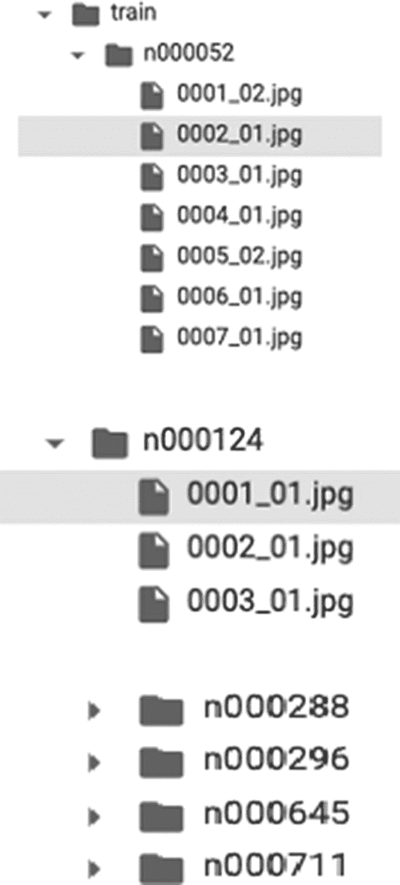

图 8-4

包含图像的子目录

提供了 CSV 格式的单独元数据文件。该元数据文件的文件头如下:

> ***身份 ID、姓名、样本号、训练/测试标志、性别***

下面是一个简短的描述:

*   `Identity ID`映射到子目录名称。

*   `name`是包含人脸图像的人的名字。

*   `sample number`代表子目录中图片的数量。

*   `train/test flag`表示身份是在训练集还是测试集中。训练集由标志 1 表示，测试集为 0。

*   `gender`是人的性别。

需要注意的是，这个数据集的大小太大，不适合 Google Colab 或 Google Drive 的免费版本。

如果整个数据集不适合 Colab 的免费版本，您可以使用数据的一个子集(可能是几百个身份)来学习。

当然，如果你想建立一个自定义的人脸识别模型，你可以使用你自己的图像。你需要做的就是将同一个人的图像保存在一个目录中，每个人都有自己的目录，并将目录结构匹配成如图 [8-4](#Fig4) 所示。确保您的目录名和图像文件名没有任何空格。

### 正在下载 VGGFace2 数据

要下载图像，您需要在 [`http://zeus.robots.ox.ac.uk/vgg_face2/signup/`](http://zeus.robots.ox.ac.uk/vgg_face2/signup/) 注册。注册完成后，直接从 [`http://www.robots.ox.ac.uk/~vgg/data/vgg_face2/`](http://www.robots.ox.ac.uk/%257Evgg/data/vgg_face2/) 登录下载数据，将压缩后的训练和测试文件保存到您的本地驱动器，然后上传到 Colab。

如果您喜欢直接在 Colab 中下载图像，您可以使用清单 [8-2](#PC2) 中的代码。使用正确的 URL 运行程序，下载训练集和测试集。

```py
1    import sys
2    import getpass
3    import requests
4
5    VGG_FACE_URL = "http://zeus.robots.ox.ac.uk/vgg_face2/login/"
6    IMAGE_URL = "http://zeus.robots.ox.ac.uk/vgg_face2/get_file?fname=vggface2_train.tar.gz"
7    TEST_IMAGE_URL="http://zeus.robots.ox.ac.uk/vgg_face2/get_file?fname=vggface2_test.tar.gz"
8
9    print('Please enter your VGG Face 2 credentials:')
10   user_string = input('    User: ')
11   password_string = getpass.getpass(prompt='    Password: ')
12
13   credential = {
14      'username': user_string,
15      'password': password_string
16   }
17
18   session = requests.session()
19   r = session.get(VGG_FACE_URL)
20
21   if 'csrftoken' in session.cookies:
22      csrftoken = session.cookies['csrftoken']
23   elif 'csrf' in session.cookies:
24      csrftoken = session.cookies['csrf']
25   else:
26      raise ValueError("Unable to locate CSRF token.")
27
28   credential['csrfmiddlewaretoken'] = csrftoken
29
30   r = session.post(VGG_FACE_URL, data=credential)
31
32   imagefiles = IMAGE_URL.split('=')[-1]

33
34   with open(imagefiles, "wb") as files:
35      print(f"Downloading the file: `{imagefiles}`")
36      r = session.get(IMAGE_URL, data=credential, stream=True)
37      bytes_written = 0
38      for data in r.iter_content(chunk_size=400096):
39          files.write(data)
40          bytes_written += len(data)
41          MegaBytes = bytes_written / (1024 * 1024)
42          sys.stdout.write(f"\r{MegaBytes:0.2f} MiB downloaded...")
43          sys.stdout.flush()
44
45   print("\n Images are successfully downloaded. Exiting the process.")

Listing 8-2Python Code to Download VGGFace2 Images (Source: https://github.com/MistLiao/jgitlib/blob/master/download.py)

```

下载完训练集和测试集后，按照图 [8-4](#Fig4) 所示的结构解压缩得到训练和测试目录及其子目录。要解压缩，您可以执行清单 [8-3](#PC3) 中的命令。

```py
1    %%shell
2    tar xvzf vggface2_train.tar.gz
3    tar xvzf vggface2_test.tar.gz

Listing 8-3Commands to Uncompress Files

```

### 数据准备

FaceNet 的训练集应该只是脸部的图像。因此，如果需要的话，我们需要裁剪图像来提取人脸，对齐它们，并调整它们的大小。我们将使用一种称为*多任务级联卷积网络* (MTCNNs)的算法，该算法已被证明在保持实时性能的同时优于许多人脸检测基准。

我们从 GitHub 存储库中克隆的 FaceNet 源代码有一个 MTCNN 的 TensorFlow 实现。这个模型的实现超出了本书的范围。我们将使用`align`模块中可用的 Python 程序`align_dataset_mtcnn.py`来获取在训练和测试集中检测到的所有人脸的边界框。该程序将保留目录结构，并将裁剪后的图像保存在相同的目录层次中，如图 [8-4](#Fig4) 所示。

清单 [8-4](#PC4) 显示了执行面裁剪和对齐的脚本。

```py
1    %%shell
2    %tensorflow_version 1.x
3    export PYTHONPATH=$PYTHONPATH:/content/facenet
4    export PYTHONPATH=$PYTHONPATH:/content/facenet/src
5    for N in {1..10}; do \
6    python facenet/src/align/align_dataset_mtcnn.py \
7    /content/train \
8    /content/train_aligned \
9    --image_size 182 \
10   --margin 44 \
11   --random_order \
12   --gpu_memory_fraction 0.10 \
13   & done

Listing 8-4Code for Face Detection Using MTCNN, Cropping and Alignment

```

在清单 [8-4](#PC4) 中，第 1 行激活 shell，第 2 行将 TensorFlow 版本设置为 1。 *x* 让 Colab 知道我们不想使用版本 2，这是 Colab 中的默认版本。

第 3 行和第 4 行将环境变量`PYTHONPATH`设置为`facenet`和`facenet/src`目录。如果您使用的是虚拟机或物理机，并且可以直接访问操作系统，那么您应该考虑在`~/.bash_profile`文件中设置环境变量。

为了加速面部检测和对齐过程，我们创建了十个并行过程(第 5 行)，对于每个过程，我们使用 10%的 GPU 内存(第 12 行)。如果数据集较小，并且希望在单个进程中处理 MTCNN，只需删除第 5、12 和 13 行。

第 6 行调用文件`align_dataset_mtcnn.py`并传递以下参数:

*   第一个参数`/content/train`是训练图像所在的目录路径。

*   第二个参数`/content/train_aligned`是存储对齐图像的目录路径。

*   第三个参数`--image_size`，是裁剪图像的大小。我们将其设置为 182×182 像素。

*   参数`--margin`设置为 44，在裁剪图像的所有四边创建一个边距。

*   下一个参数`--random_order`，如果存在，将通过并行处理以随机顺序选择图像。

*   最后一个参数`--gpu_memory_fraction`用于告诉算法每个并行进程使用 GPU 内存的多少部分。

在前面的脚本中，裁剪后的图像大小为 182×182 像素。Inception-ResNet-v1 的输入只有 160×160。这为随机作物提供了额外的利润。附加页边空白 44 的使用用于向模型添加任何上下文信息。额外的 44 页边空白应该根据您的具体情况进行调整，并且应该评估裁剪性能。

执行前面的脚本开始裁剪和对齐过程。请注意，这是一个计算密集型过程，可能需要几个小时才能完成。

对测试图像重复前面的过程。

### 模特培训

清单 [8-5](#PC5) 用于训练具有三重损失函数的面网模型。

```py
%tensorflow_version 1.x
!export PYTHONPATH=$PYTHONPATH:/content/facenet/src
!python facenet/src/train_tripletloss.py \
--logs_base_dir logs/facenet/ \
--models_base_dir /content/drive/'My Drive'/chapter8/facenet_model/ \
--data_dir /content/drive/'My Drive'/chapter8/train_aligned/ \
--image_size 160 \
--model_def models.inception_resnet_v1 \
--optimizer ADAGRAD \
--learning_rate 0.01 \
--weight_decay 1e-4 \
--max_nrof_epochs 10 \
--epoch_size 200

Listing 8-5Script to Train the FaceNet Model with the Triplet Loss Function

```

如前所述，FaceNet 的当前实现运行在 TensorFlow 版本 1 上。 *x* 与 TensorFlow 2 不兼容(1 号线设置版本 1。 *x* 。

第 2 行是将`PYTHONPATH`环境变量设置到`facenet/src`目录。

第 3 行使用三元组损失函数执行 FaceNet 训练。可以为训练设置许多参数，但我们将在此仅列出重要的参数。有关参数及其解释的详细列表，请查看位于`facenet/src`目录中的`train_tripletloss.py`的源代码。

为模型定型传递了以下参数:

*   `--logs_base_dir`:这是保存训练日志的目录。我们将 TensorBoard 连接到此目录，以使用 TensorBoard 仪表板评估模型。

*   `--model_base_dir`:这是存储模型检查点的基本目录。注意，我们已经提供了路径`/content/drive/'My Drive'/chapter8/facenet_model/`来存储 Google Drive 的模型检查点。这是为了将模型检查点永久保存到 Google Drive，避免因为 Colab 的会话终止而丢失模型。如果 Colab 会话终止，我们可以从它停止的地方重新启动模型。请注意，由于名称中有空格，所以我的驱动器用单引号括起来。

*   `--data_dir`:这是用于训练的对齐图像的基础目录。

*   `--image_size`:训练用的输入图像将根据该参数调整大小。Inception-ResNet-v1 采用 160×160 像素的输入图像尺寸。

*   `--model_def`:这是型号的名称。在这个例子中，我们使用了`inception_resnet_v1`。

*   `--optimizer`:这是要使用的优化算法。您可以使用任何优化器`ADAGRAD`、`ADADELTA`、`ADAM`、`RMSPROP`和`MOM`，默认为`ADAGRAD`。

*   `--learning_rate`:我们设定学习率为 0.01。根据需要进行调整。

*   这可以防止重量变得太大。

*   `--max_nrof_epochs`:训练应该运行的最大时期数。

*   `--epoch_size`:这是每个时期的批次数。

单击 Colab 中的 Run 按钮执行培训。根据您的训练规模和训练参数，完成模型可能需要几个小时甚至几天。

在模型被成功训练之后，检查点被保存在目录`--model_base_dir`中，这是我们之前在清单 [8-5](#PC5) ，第 5 行中配置的。

### 估价

当模型运行时，每个时期和每个批次的损失将打印到控制台。这应该能让你了解模型是如何学习的。理想情况下，损耗应该减少，并且应该稳定在非常低的值，接近于零。图 [8-5](#Fig5) 显示了训练进行过程中的样本输出。

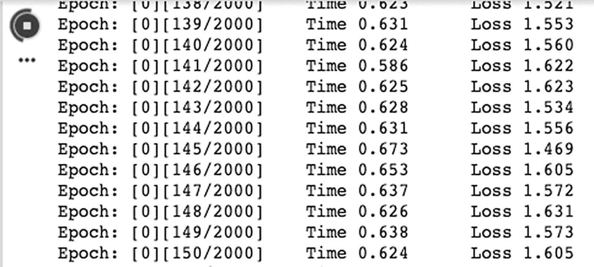

图 8-5

训练过程中的 Colab 控制台输出。它显示了每批每时期的损失

您还可以使用 TensorBoard 评估模型性能。使用清单 [8-6](#PC6) 中的命令启动 TensorBoard 仪表板。

```py
1 %tensorflow_version 2.x
2 %load_ext tensorboard
3 %tensorboard --logdir /content/logs/facenet

Listing 8-6Launching TensorBoard by Pointing to the logs Directory

```

## 开发实时人脸识别系统

人脸识别系统需要三个重要的条件。

*   人脸检测模型

*   分类模型

*   图像或视频源

### 人脸检测模型

在上一节中，我们学习了如何训练人脸检测模型。我们可以使用我们构建的模型，也可以使用符合我们要求的预训练模型。表 [8-3](#Tab3) 列出了公开免费提供的预训练模型。

表 8-3

大卫·桑德伯格提供的人脸识别预训练模型

<colgroup><col class="tcol1 align-left"> <col class="tcol2 align-left"> <col class="tcol3 align-left"></colgroup> 
| 

型号名称

 | 

训练数据集

 | 

下载位置

 |
| --- | --- | --- |
| `20180408-102900` | CASIA-WebFace | [T2`https://drive.google.com/open?id=1R77HmFADxe87GmoLwzfgMu_HY0IhcyBz`](https://drive.google.com/open%253Fid%253D1R77HmFADxe87GmoLwzfgMu_HY0IhcyBz) |
| `20180402-114759` | VGGFace2 | [T2`https://drive.google.com/open?id=1EXPBSXwTaqrSC0OhUdXNmKSh9qJUQ55-`](https://drive.google.com/open%253Fid%253D1EXPBSXwTaqrSC0OhUdXNmKSh9qJUQ55-) |

这些模型可在以下位置免费下载。

针对在 [`http://vis-www.cs.umass.edu/lfw/`](http://vis-www.cs.umass.edu/lfw/) 可用的野生(LFW)数据集中的标记人脸来评估模型。表 [8-4](#Tab4) 显示了模型架构和精度。

表 8-4

在 CASIA-WebFace 和 VGGFace2 数据集上训练的 FaceNet 模型的准确性评估结果(由大卫·桑德伯格提供的信息)

<colgroup><col class="tcol1 align-left"> <col class="tcol2 align-left"> <col class="tcol3 align-left"> <col class="tcol4 align-left"></colgroup> 
| 

型号名称

 | 

LFW 准确度

 | 

训练数据集

 | 

体系结构

 |
| --- | --- | --- | --- |
| `20180408-102900` | 0.9905 | CASIA-WebFace | Inception ResNet v1 |
| `20180402-114759` | 0.9965 | VGGFace2 | Inception ResNet v1 |

对于我们的示例，我们将使用 VGGFace2 模型。

### 人脸识别分类器

我们将建立一个模型来识别人脸(这个人是谁)。我们将训练模型来识别乔治·w·布什、巴拉克·奥巴马和唐纳德·特朗普这三位最近的美国总统。

为了简单起见，我们将下载三位总统的一些图片，并将它们组织在子目录中，看起来如图 [8-6](#Fig6) 所示。

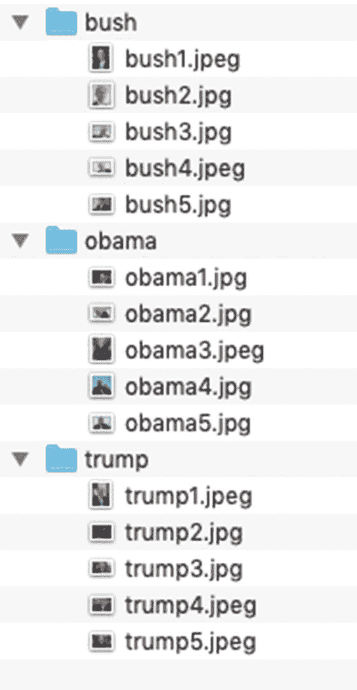

图 8-6

输入图像目录结构

我们将在我们的个人电脑/笔记本电脑上开发人脸检测器。在我们训练分类器之前，我们需要克隆 FaceNet GitHub 存储库。执行以下命令:

> ***git 克隆*** [`https://github.com/ansarisam/facenet.git`](https://github.com/ansarisam/facenet.git)

克隆 FaceNet 源代码后，将`PYTHONPATH`设置为`facenet/src`，并将其添加到环境变量中。

*   **汇出 python path = $ python path:/home/user/facenet/src**

`src`目录的路径必须是您电脑中的实际目录路径。

#### 面部对齐

在本节中，我们将执行图像的面部对齐。我们将使用与上一节相同的 MTCNN 模型。由于我们有一个小的图像集，我们将使用一个单一的过程来对齐这些脸。清单 [8-7](#PC7) 显示了面部对齐的脚本。

```py
1    python facenet/src/align/align_dataset_mtcnn.py \
2    ~/presidents/ \
3   ~/presidents_aligned \
4    --image_size 182 \
5    --margin 44

Listing 8-7Script for Face Alignment Using MTCNN

```

Note

在基于 Mac 的计算机上，图像目录可能有一个名为`.DS_Store`的隐藏文件。确保从包含输入图像的所有子目录中删除该文件。另外，确保子目录只包含图像，不包含其他文件。

执行前面的脚本来裁剪和对齐面。图 [8-7](#Fig7) 显示了一些样本输出。

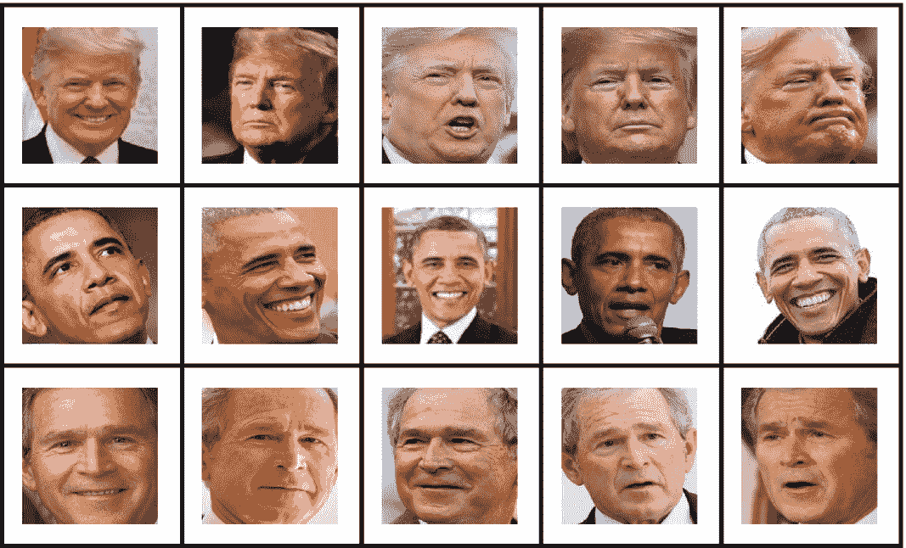

图 8-7

三位美国总统修剪整齐的脸

#### 分类器训练

有了这个最小的设置，我们就可以训练分类器了。清单 [8-8](#PC8) 显示了启动分类器训练的脚本。

```py
1    python facenet/src/classifier.py TRAIN \
2    ~/presidents_aligned \
3    ~/20180402-114759/20180402-114759.pb \
4    ~/presidents_aligned/face_classifier.pkl \
5    --batch_size 1000 \
6    --min_nrof_images_per_class 40 \
7    --nrof_train_images_per_class 35 \
8    --use_split_dataset

Listing 8-8Script to Launch the Face Classifier Training

```

在清单 [8-8](#PC8) 中，第 1 行调用`classifier.py`并传递参数`TRAIN`，表示我们要训练一个分类器。该 Python 脚本的其他参数如下:

*   包含对齐的面部图像的输入基本目录(第 2 行)。

*   我们自己构建的或者从上一节提供的 Google Drive 链接下载的预训练人脸检测模型的路径(第 3 行)。如果您已经训练了自己的保存检查点的模型，请提供包含检查点的目录的路径。在清单 [8-8](#PC8) 中，我们提供了冻结模型的路径(`*.pb`)。

*   第 4 行是我们的分类器模型将被保存的路径。注意，这是一个扩展名为`.pkl`的 Pickle 文件。Pickle 是一个 Python 序列化和反序列化模块。

分类器模型成功执行后，训练好的分类器存储在清单 [8-8](#PC8) 第 4 行提供的文件中。

#### 视频流中的人脸识别

在清单 [7-1](07.html#PC1) 中，我们使用 OpenCV 的便利函数`cv2.VideoCapture()`从计算机的内置摄像头或 USB 或 IP 摄像头读取视频帧。`VideoCapture()`函数的参数 0 通常用于从内置摄像机中读取帧。在这一节中，我们将讨论如何使用 YouTube 作为我们的视频源。

为了阅读 YouTube 视频，我们将使用一个名为`pafy`的 Python 库，内部使用了`youtube_dl`库。在您的开发环境中使用 PIP 安装这些库。只需执行清单 [8-9](#PC9) 中的命令来安装`pafy`。

```py
pip install pafy
pip install youtube_dl

Listing 8-9Commands to Install YouTube-Related Libraries

```

我们为这个练习克隆的 FaceNet 存储库在`contributed`模块中提供了源代码`real_time_face_recognition.py`，用于识别视频中的人脸。清单 [8-10](#PC10) 展示了如何使用 Python API 从视频中检测和识别人脸。

```py
1   python real_time_face_recognition.py \
2   --source youtube \
3   --url https://www.youtube.com/watch?v=ZYkxVbYxy-c \
4   --facenet_model_checkpoint ~/20180402-114759/20180402-114759.pb \
5   --classfier_model ~/presidents_aligned/face_classifier.pkl

Listing 8-10Script to Call Real-Time Face Recognition API

```

在清单 [8-10](#PC10) 中，第 1 行调用`real_time_face_recognition.py`并传递以下参数:

*   第 2 行设置参数`--source`的值，在本例中是`youtube`。如果您跳过此参数，它将默认为计算机的内置摄像头。您可以显式地传递参数`webcam`来从内置相机读取帧。

*   第 3 行是传递 YouTube 视频 URL。在摄像机源的情况下，不需要这个参数。

*   第 4 行提供了到预训练的 FaceNet 模型的路径。您可以提供检查点目录或冻结的`*.pb`模型的路径。

*   第 5 行提供了我们在上一节中训练的分类器模型的文件路径，例如用于识别三位美国总统的脸的分类器模型。

当您执行清单 [8-10](#PC10) 时，它将读取 YouTube 视频帧并显示带有边框的已识别人脸。图 [8-8](#Fig8) 显示了一个样本识别。

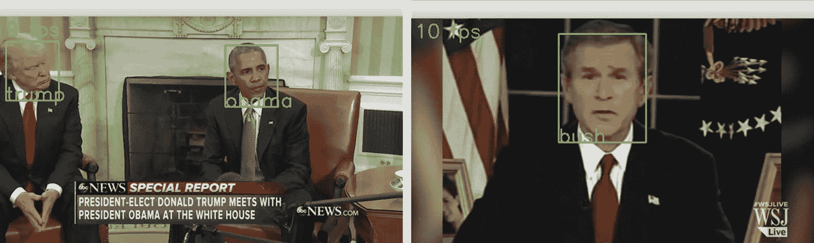

图 8-8

从人脸识别视频中截取的示例截图。视频的输入源是 YouTube

## 摘要

人脸检测是一个有趣的计算机视觉问题，涉及检测分类人脸嵌入，以识别图像中的人是谁。在这一章中，我们探讨了 FaceNet，一种基于 ResNet 的流行的人脸识别算法。我们学习了使用 MTCNN 算法来裁剪图像的面部部分的技术。我们还训练了自己的分类器，并通过一个例子对三位美国总统的面部进行了分类。最后，我们从 YouTube 上获取视频流，并实现了一个实时人脸识别系统。