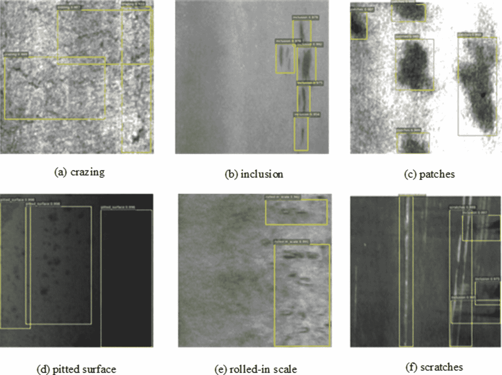
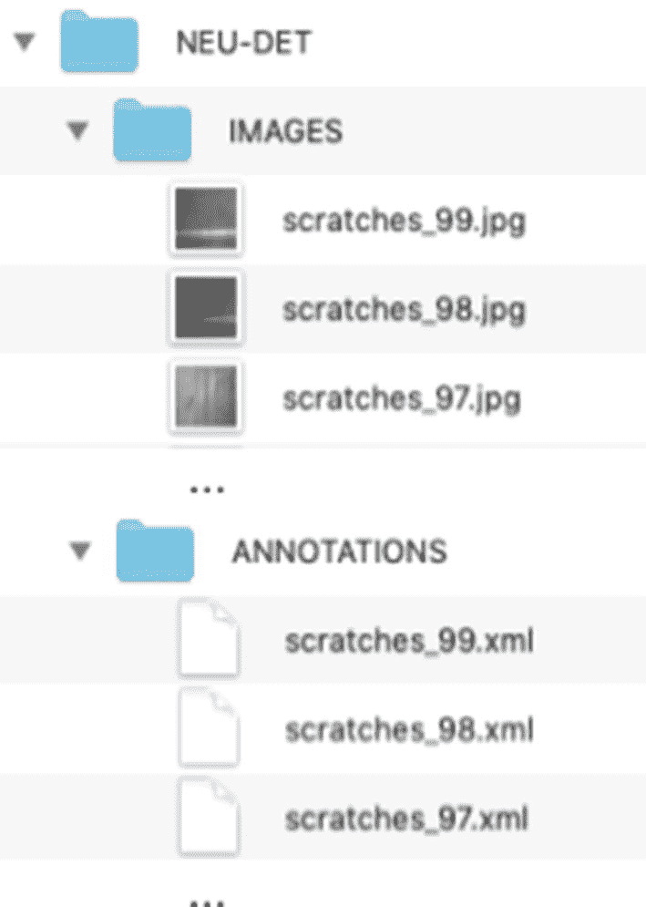
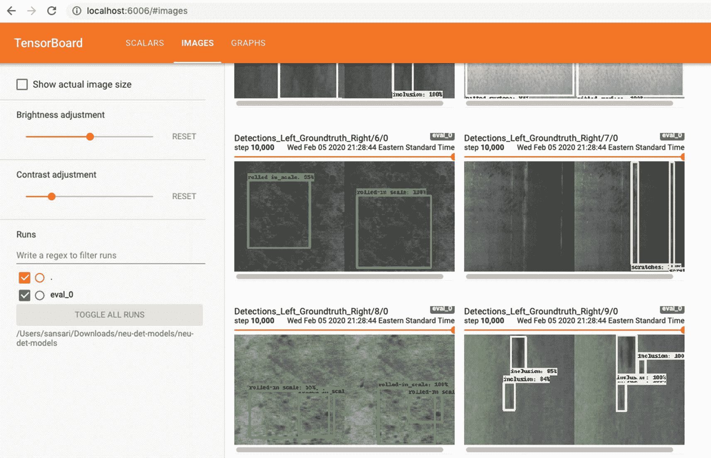
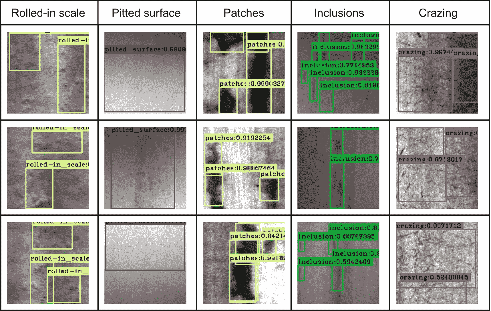
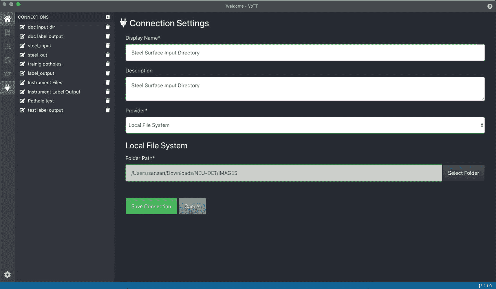
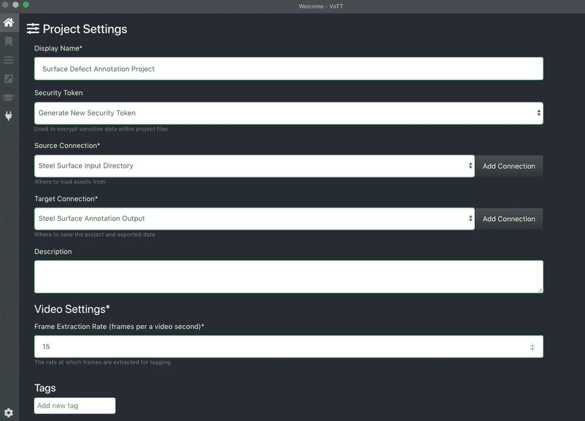
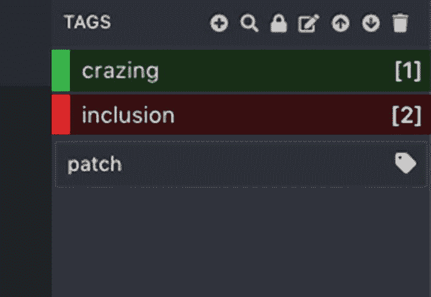
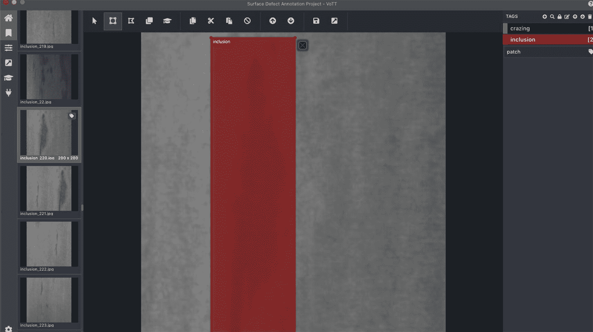
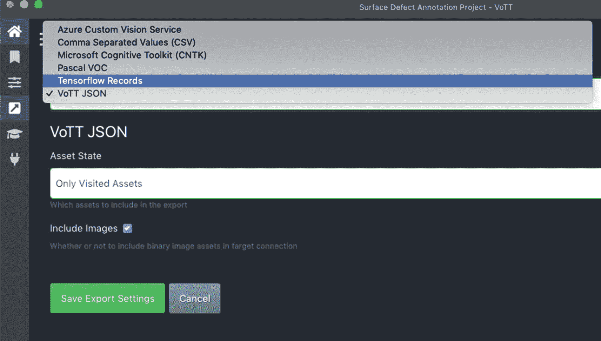

# 9.工业应用:工业制造中的实时缺陷检测

计算机视觉在工业制造中有许多应用。一个这样的应用是用于质量控制和保证的视觉检查的自动化。

大多数制造公司培训他们的人员手动执行目视检查，这是一个手动的检查过程，可能是主观的，导致准确性取决于个别检查员的经验和意见。还应该注意到，这个过程是劳动密集型的。

如果出现机器校准问题、环境设置或设备故障，整批产品都可能出现故障。在这种情况下，事后的人工检查可能会被证明是昂贵的，因为产品可能已经生产出来，并且整批(可能数百或数千)有缺陷的产品可能需要被丢弃。

总之，手动检查过程缓慢、不准确且成本高昂。

基于计算机视觉的视觉检测系统可以通过分析视频帧流来实时检测表面缺陷。当检测到一个缺陷或一系列缺陷时，系统可以实时发送警报，以便停止生产，避免任何损失。

在这一章中，我们将开发一个基于深度学习的计算机视觉系统来检测表面缺陷，如补丁，划痕，坑洼表面和银纹。

我们将使用包含热轧钢带标记图像的数据集。我们将首先转换数据集，训练 SSD 模型，并利用该模型来构建缺陷检测器。我们还将学习如何为任何对象检测任务标记我们自己的图像。

## 实时表面缺陷检测系统

在本节中，我们将首先检查用于训练和测试表面缺陷检测模型的数据集。我们将把图像和注释转换成 TFRecord 文件，并在 Google Colab 上训练一个 SSD 模型。我们将应用第 [6](06.html) 章中介绍的物体检测概念。

### 资料组

我们将利用东北大学(NEU)的 K. Song 和 Y. Yan 提供的数据集。该数据集由六种类型的热轧钢带表面缺陷组成。这些缺陷标记如下:

*   轧制氧化皮(RS)，通常在轧制过程中将氧化皮轧制成金属时出现。

*   补片(Pa)，可以是不规则的曲面补片。

*   银纹(Cr)，即表面上的网状裂纹。

*   麻面(PS)由许多小的浅孔组成。

*   夹杂物(In)，它是嵌入钢内部的复合材料

*   划痕(Sc)

图 [9-1](#Fig1) 显示了带有这六种缺陷的钢表面的标记图像。



图 9-1

具有六种不同类型缺陷的表面的标记图像样本。东北大学。edu。cn/云燕/ NEU_ 表面 _ 缺陷 _ 数据库。html

数据集包括 1800 幅灰度图像，每种缺陷类别有 300 个样本。

该数据集可在 [`https://drive.google.com/file/d/1qrdZlaDi272eA79b0uCwwqPrm2Q_WI3k/view`](https://drive.google.com/file/d/1qrdZlaDi272eA79b0uCwwqPrm2Q_WI3k/view) 免费下载，用于教育和研究目的。从这个链接下载数据集并解压缩。未压缩的数据集组织在如图 [9-2](#Fig2) 所示的目录结构中。图像在子目录`IMAGES`中。`ANNOTATIONS`子目录包含边界框注释的 XML 文件和 PASCAL VOC 注释格式的缺陷类。



图 9-2

NEU-DET 数据集目录结构

### Google Colab 笔记本电脑

首先在 Google Colab 上创建一个新的笔记本，并给它起一个名字(例如，表面缺陷检测 1.0 版)。

由于 NEU 数据集位于 Google Drive 上，我们可以直接将其复制到我们的私有 Google Drive 上。在 Colab 上，我们将挂载私有的 Google Drive，解压缩数据集，并设置开发环境(清单 [9-1](#PC1) )。请回顾第 [6](06.html) 章以刷新您对实施的理解。

```py
1    # Code block 1: Mount Google Drive
2    from google.colab import drive
3    drive.mount('/content/drive')
4
5    # Code block 2: uncompress NEU data
6    %%shell
7    ls /content/drive/'My Drive'/NEU-DET.zip
8    unzip /content/drive/'My Drive'/NEU-DET.zip
9
10   # Code block 3: Clone github repository of Tensorflow model project
11   !git clone https://github.com/ansarisam/models.git
12
13   # Code block 4: Install Google protobuf compiler and other dependencies
14   !sudo apt-get install protobuf-compiler python-pil python-lxml python-tk
15
16   # Code block 4: Install dependencies
17   %%shell
18   cd models/research
19   pwd
20   protoc object_detection/protos/*.proto --python_out=.
21   pip install --user Cython
22   pip install --user contextlib2
23   pip install --user pillow
24   pip install --user lxml
25   pip install --user jupyter
26   pip install --user matplotlib
27
28   # Code block 5: Build models project

29   %%shell
30   export PYTHONPATH=$PYTHONPATH:/content/models/research:/content/models/research/slim
31   cd /content/models/research
32   python setup.py build
33   python setup.py install

Listing 9-1Mounting Google Drive, Downloading, Building, and Installing TensorFlow Models

```

### 数据转换

我们将把 NEU 数据集转换成 TFRecord 格式(查看第 [6](06.html) 章的 SSD 模型训练部分)。清单 [9-2](#PC2) 是基于 TensorFlow 的代码，用于将图像和注释转换成 TFRecord。

```py
File name: generic_xml_to_tf_record.py
1    from __future__ import absolute_import
2    from __future__ import division
3    from __future__ import print_function
4
5    import hashlib
6    import io
7    import logging
8    import os
9
10   from lxml import etree
11   import PIL.Image
12   import tensorflow as tf
13
14   from object_detection.utils import dataset_util
15   from object_detection.utils import label_map_util
16   import random
17
18   flags = tf.app.flags
19   flags.DEFINE_string('data_dir', '', 'Root directory to raw PASCAL VOC dataset.')
20
21   flags.DEFINE_string('annotations_dir', 'annotations',
22                     '(Relative) path to annotations directory.')
23   flags.DEFINE_string('image_dir', 'images',
24                     '(Relative) path to images directory.')
25
26   flags.DEFINE_string('output_path', '', 'Path to output TFRecord')
27   flags.DEFINE_string('label_map_path', 'data/pascal_label_map.pbtxt',
28                     'Path to label map proto')
29   flags.DEFINE_boolean('ignore_difficult_instances', False, 'Whether to ignore '
30                      'difficult instances')
31   FLAGS = flags.FLAGS
32
33   # This function generates a list of images for training and validation.
34   def create_trainval_list(data_dir):
35     trainval_filename = os.path.abspath(os.path.join(data_dir,"trainval.txt"))
36     trainval = open(os.path.abspath(trainval_filename), "w")
37     files = os.listdir(os.path.join(data_dir, FLAGS.image_dir))
38     for f in files:
39         absfile =os.path.abspath(os.path.join(data_dir, FLAGS.image_dir, f))
40         trainval.write(absfile+"\n")
41         print(absfile)
42     trainval.close()
43
44
45   def dict_to_tf_example(data,
46                        dataset_directory,
47                        label_map_dict,
48                        ignore_difficult_instances=False,
49                        image_subdirectory=FLAGS.image_dir):
50   """Convert XML derived dict to tf.Example proto.
51
52   Notice that this function normalizes the bounding box coordinates provided
53   by the raw data.
54
55   Args:
56     data: dict holding PASCAL XML fields for a single image
57     dataset_directory: Path to root directory holding PASCAL dataset
58     label_map_dict: A map from string label names to integers ids.
59     ignore_difficult_instances: Whether to skip difficult instances in the
60       dataset  (default: False).
61     image_subdirectory: String specifying subdirectory within the
62       PASCAL dataset directory holding the actual image data.
63
64   Returns:
65     example: The converted tf.Example.
66
67   Raises:
68     ValueError: if the image pointed to by data['filename'] is not a valid JPEG
69   """
70   filename = data['filename']
71
72   if filename.find(".jpg") < 0:
73       filename = filename+".jpg"
74   img_path = os.path.join("",image_subdirectory, filename)
75   full_path = os.path.join(dataset_directory, img_path)
76
77   with tf.gfile.GFile(full_path, 'rb') as fid:
78     encoded_jpg = fid.read()
79   encoded_jpg_io = io.BytesIO(encoded_jpg)
80   image = PIL.Image.open(encoded_jpg_io)
81   if image.format != 'JPEG':
82     raise ValueError('Image format not JPEG')
83   key = hashlib.sha256(encoded_jpg).hexdigest()
84
85   width = int(data['size']['width'])
86   height = int(data['size']['height'])
87
88   xmin = []
89   ymin = []
90   xmax = []
91   ymax = []
92   classes = []
93   classes_text = []
94   truncated = []
95   poses = []
96   difficult_obj = []
97   if 'object' in data:
98     for obj in data['object']:
99       difficult = bool(int(obj['difficult']))
100      if ignore_difficult_instances and difficult:
101        continue
102
103      difficult_obj.append(int(difficult))
104
105      xmin.append(float(obj['bndbox']['xmin']) / width)
106      ymin.append(float(obj['bndbox']['ymin']) / height)
107      xmax.append(float(obj['bndbox']['xmax']) / width)
108      ymax.append(float(obj['bndbox']['ymax']) / height)
109      classes_text.append(obj['name'].encode('utf8'))
110      classes.append(label_map_dict[obj['name']])
111      truncated.append(int(obj['truncated']))
112      poses.append(obj['pose'].encode('utf8'))
113
114  example = tf.train.Example(features=tf.train.Features(feature={
115      'img/height': dataset_util.int64_feature(height),
116      'img/width': dataset_util.int64_feature(width),
117      'img/filename': dataset_util.bytes_feature(
118          data['filename'].encode('utf8')),
119      'img/source_id': dataset_util.bytes_feature(
120          data['filename'].encode('utf8')),
121      'img/sha256': dataset_util.bytes_feature(key.encode('utf8')),
122      'img/encoded': dataset_util.bytes_feature(encoded_jpg),
123      'img/format': dataset_util.bytes_feature('jpeg'.encode('utf8')),
124      'img/xmin': dataset_util.float_list_feature(xmin),
125      'img/xmax': dataset_util.float_list_feature(xmax),
126      'img/ymin': dataset_util.float_list_feature(ymin),
127      'img/ymax': dataset_util.float_list_feature(ymax),
128      'img/text': dataset_util.bytes_list_feature(classes_text),
129      'img/label': dataset_util.int64_list_feature(classes),
130      'img/difficult': dataset_util.int64_list_feature(difficult_obj),
131      'img/truncated': dataset_util.int64_list_feature(truncated),
132      'img/view': dataset_util.bytes_list_feature(poses),
133  }))
134  return example
135
136  def create_tf(examples_list, annotations_dir, label_map_dict, dataset_type):
137    writer = None
138    if not os.path.exists(FLAGS.output_path+"/"+dataset_type):
139        os.mkdir(FLAGS.output_path+"/"+dataset_type)
140
141    j = 0
142    for idx, example in enumerate(examples_list):
143
144        if idx % 100 == 0:
145            logging.info('On image %d of %d', idx, len(examples_list))
146            print((FLAGS.output_path + "/tf_training_" + str(j) + ".record"))
147            writer = tf.python_io.TFRecordWriter(FLAGS.output_path + "/"+dataset_type+"/tf_training_" + str(j) + ".record")
148            j = j + 1
149
150        path = os.path.join(annotations_dir, os.path.basename(example).replace(".jpg", '.xml'))
151
152        with tf.gfile.GFile(path, 'r') as fid:
153            xml_str = fid.read()
154        xml = etree.fromstring(xml_str)
155        data = dataset_util.recursive_parse_xml_to_dict(xml)['annotation']
156
157        tf_example = dict_to_tf_example(data, FLAGS.data_dir, label_map_dict,
158                                    FLAGS.ignore_difficult_instances)
159        writer.write(tf_example.SerializeToString())
160
161  def main(_):
162
163    data_dir = FLAGS.data_dir
164    create_trainval_list(data_dir)
165
166    label_map_dict = label_map_util.get_label_map_dict(FLAGS.label_map_path)
167
168    examples_path = os.path.join(data_dir,'trainval.txt')
169    annotations_dir = os.path.join(data_dir, FLAGS.annotations_dir)
170    examples_list = dataset_util.read_examples_list(examples_path)
171
172    random.seed(42)
173    random.shuffle(examples_list)
174    num_examples = len(examples_list)
175    num_train = int(0.7 * num_examples)
176    train_examples = examples_list[:num_train]
177    val_examples = examples_list[num_train:]
178
179    create_tf(train_examples, annotations_dir, label_map_dict, "train")
180    create_tf(val_examples, annotations_dir, label_map_dict, "val")
181
182  if __name__ == '__main__':
183    tf.app.run()
184

Listing 9-2Transforming Images and Annotations in PASCAL VOC Format into TFRecord

```

清单 [9-2](#PC2) 执行以下操作:

1.  首先，调用函数`create_trainval_list()`创建一个文本文件，其中包含来自`IMAGES`子目录的所有图像的绝对路径列表。

2.  将图像路径列表拆分为 70:30 的比例，以便为训练集和验证集生成单独的图像列表。

3.  对于训练集中的每个图像，使用函数`dict_to_tf_example()`创建一个 TFRecord。TFRecord 包含图像的字节、边界框、带注释的类名和其他几个关于图像的元数据。TFRecord 被序列化并写入文件。创建多个 TFRecord 文件，文件数量取决于图像总数和每个 TFRecord 文件中包含的图像数量。

4.  类似地，为每个验证图像创建 TFRecords 并序列化到文件中。

5.  训练集和验证集保存在`output`目录下的两个独立的子目录中——分别是`train`和`val`。

如果您克隆清单 [9-1](#PC1) 中提到的 GitHub 库，Python 文件`generic_xml_to_tf_record.py`已经包含在内了。但是如果您克隆官方 TensorFlow 模型的存储库，那么您需要将清单 [9-2](#PC2) 中的代码保存到`generic_xml_to_tf_record.py`中，并将其上传到您的 Colab 环境中(例如，上传到`/content`目录中)。

我们需要一个映射文件来映射类索引和类名。该文件包含 JSON 内容，通常具有扩展名`.pbtxt`。我们有六个缺陷类，我们可以手动编写标签映射文件，如下所示:

```py
File name: steel_label_map.pbtxt
item {
  id: 1
  name: 'rolled-in_scale'
}

item {
  id: 2
  name: 'patches'
}

item {
  id: 3
  name: 'crazing'
}

item {
  id: 4
  name: 'pitted_surface'
}

item {
  id: 5
  name: 'inclusion'
}

item {
  id: 6
  name: 'scratches'
}

```

将`steel_label_map.pbtxt`文件上传到您的 Colab 环境中的`/content`目录(或者您想要的任何其他目录，只要您在清单 [9-3](#PC4) 中提供正确的路径)。

清单 [9-3](#PC4) 中的脚本通过提供以下参数来执行`generic_xml_to_tf_record.py`:

*   `--label_map_path`:到`steel_label_map.pbtxt`的路径。

*   `--data_dir`:图像和注释目录所在的根目录。

*   `--output_path`:保存生成的 TFRecord 文件的路径。请确保该目录存在。如果没有，请在执行该脚本之前创建该目录。

*   `--annotations_dir`:标注 XML 文件所在的子目录名。

*   `--image_dir`:图像所在的子目录名。

```py
1    %%shell
2    %tensorflow_version 1.x
3
4    python /content/generic_xml_to_tf_record.py \
5       --label_map_path=/content/steel_label_map.pbtxt \
6       --data_dir=/content/NEU-DET \
7       --output_path=/content/NEU-DET/out \
8       --annotations_dir=ANNOTATIONS \
9       --image_dir=IMAGES

Listing 9-3Executing generic_xml_to_tf_record.py That Creates TFRecord Files

```

运行清单 [9-3](#PC4) 中的脚本，在输出目录中创建 TFRecord 文件。您将看到两个子目录——`train`和`val`——保存用于训练和验证的 TFRecords。

请注意，输出目录必须存在。否则，在执行清单 [9-3](#PC4) 中的代码之前创建一个。

### 培训 SSD 模型

我们现在已经准备好了 TFRecord 格式的正确输入集来训练我们的 SSD 模型。培训步骤与我们在第 [6](06.html) 章中遵循的步骤完全相同。首先，根据我们之前创建的训练和验证集，下载一个预训练的 SSD 模型进行迁移学习。

清单 [9-4](#PC5) 显示了我们在第 [6](06.html) 章中使用的相同代码(清单 6-5)。

```py
1    %%shell
2    %tensorflow_version 1.x
3    mkdir pre-trained-model
4    cd pre-trained-model
5    wget http://download.tensorflow.org/models/object_detection/ssd_inception_v2_coco_2018_01_28.tar.gz
6    tar -xvf ssd_inception_v2_coco_2018_01_28.tar.gz

Listing 9-4Downloading a Pre-trained Object Detection Model

```

我们现在将编辑`pipeline.config`文件，如第 [6](06.html) 章“配置对象检测管道”一节所述。清单 [9-5](#PC6) 显示了根据当前配置编辑的`pipeline.config`文件的各个部分。

```py
model {
  ssd {
    num_classes: 6
    image_resizer {
      fixed_shape_resizer {
        height: 300
        width: 300
      }
    }
   ......
        batch_norm {
          decay: 0.999700009823
          center: true
          scale: true
          epsilon: 0.0010000000475
          train: true
        }
      }
            override_base_feature_extractor_hyperparams: true
    }
    .....
    matcher {
      argmax_matcher {
        matched_threshold: 0.5
        unmatched_threshold: 0.5
        ignore_thresholds: false
        negatives_lower_than_unmatched: true
        force_match_for_each_row: true
      }
    }
   ......

  fine_tune_checkpoint: "/content/pre-trained-model/ssd_inception_v2_coco_2018_01_28/model.ckpt"
  from_detection_checkpoint: true
  num_steps: 100000

}
train_input_reader {
  label_map_path: "/content/steel_label_map.pbtxt"
  tf_record_input_reader {
    input_path: "/content/NEU-DET/out/train/*.record"
  }
}
eval_config {
  num_examples: 8000
  max_evals: 10
  use_moving_averages: false
}
eval_input_reader {
  label_map_path: "/content/steel_label_map.pbtxt"
  shuffle: false
  num_readers: 1
  tf_record_input_reader {
    input_path: "/content/NEU-DET/out/val/*.record"
  }
}

Listing 9-5Section of pipeline.config That Must to Be Edited to Point to the Appropriate Directory Structure

```

如清单 [9-5](#PC6) 所示，我们必须编辑清单 [9-5](#PC6) 中用黄色突出显示的部分。

```py
num_classes: 6
fine_tune_checkpoint: path to pre-trained model checkpoint
label_map_path: path to .pbtxt file
input_path: path to the training TFRecord files.
label_map_path: path to the .pbtxt file
input_path: path to the validation TFRecord files.

```

编辑`pipeline.config`文件并上传到 Colab 环境。

使用清单 [9-6](#PC8) 中所示的脚本执行模型训练。回顾第 [6](06.html) 章中的清单 6-6 来更新概念。

```py
1    %%shell
2    %tensorflow_version 1.x
3    export PYTHONPATH=$PYTHONPATH:/content/models/research:/content/models/research/slim
4    cd models/research/
5    PIPELINE_CONFIG_PATH=/content/pre-trained-model/ssd_inception_v2_coco_2018_01_28/steel_defect_pipeline.config
6    MODEL_DIR=/content/neu-det-models/
7    NUM_TRAIN_STEPS=10000
8    SAMPLE_1_OF_N_EVAL_EXAMPLES=1
9    python object_detection/model_main.py \
10      --pipeline_config_path=${PIPELINE_CONFIG_PATH} \
11      --model_dir=${MODEL_DIR} \
12      --num_train_steps=${NUM_TRAIN_STEPS} \
13      --sample_1_of_n_eval_examples=$SAMPLE_1_OF_N_EVAL_EXAMPLES \
14      --alsologtostderr

Listing 9-6Executing the Model Training

```

当模型学习时，日志被打印在 Colab 控制台上。记下每个时期的损失，并根据需要调整模型的超参数。

### 导出模型

训练成功完成后，检查点保存在清单 [9-6](#PC8) 第 6 行指定的目录中。

为了利用该模型进行实时检测，我们需要导出张量流图。查看第 [6](06.html) 章的“导出张量流图”部分，了解详细信息。

清单 [9-7](#PC9) 展示了如何导出我们刚刚训练的 SSD 模型。

```py
1    %%shell
2    %tensorflow_version 1.x
3    export PYTHONPATH=$PYTHONPATH:/content/models/research
4    export PYTHONPATH=$PYTHONPATH:/content/models/research/slim
5    cd /content/models/research
6
7    python object_detection/export_inference_graph.py \
8       --input_type image_tensor \
9       --pipeline_config_path /content/pre-trained-model/ssd_inception_v2_coco_2018_01_28/steel_defect_pipeline.config \
10      --trained_checkpoint_prefix /content/neu-det-models/model.ckpt-10000 \
11      --output_directory /content/NEU-DET/final_model

Listing 9-7Exporting the Model to the TensorFlow Graph

```

导出模型后，应该保存到 Google Drive。从 Google Drive 下载最终模型到你的本地电脑。我们可以使用这个模型从视频帧中实时检测表面缺陷。回顾第 [7](07.html) 章中介绍的概念。

### 模型评估

启动 TensorBoard 仪表板以评估模型质量。清单 [9-8](#PC10) 展示了如何启动 TensorBoard 仪表板。

```py
1    %tensorflow_version 2.x
2    %load_ext tensorboard
3    %tensorboard --logdir /drive/'My Drive'/NEU-DET-models/

Listing 9-8Launching the TensorBoard Dashboard

```

图 [9-3](#Fig3) 显示了 TensorBoard 的样本训练输出。



图 9-3

表面缺陷检测模型训练的张量板输出显示

### 预报

如果您已经按照第 [6](06.html) 章“使用训练模型检测物体”一节所述设置了工作环境，那么您应该已经具备了预测图像中表面缺陷所需的一切。只需更改清单 6-15 中的变量，并执行清单 [9-9](#PC11) 中所示的 Python 代码。

```py
model_path = "/Users/sansari/Downloads/neu-det-models/final_model"

labels_path = "/Users/sansari/Downloads/steel_label_map.pbtxt"

image_dir = "/Users/sansari/Downloads/NEU-DET/test/IMAGES"

image_file_pattern = "*.jpg"

output_path="/Users/sansari/Downloads/surface_defects_out"

Listing 9-9Variable Initialization Portion of Code from Listing 6-15

```

图 [9-4](#Fig4) 显示了不同类别缺陷预测的一些样本输出。



图 9-4

具有包围盒的缺陷表面的样本预测输出

### 实时缺陷检测器

遵循第 [7](07.html) 章中提供的说明，部署检测系统，该系统将从摄像机读取视频图像并实时检测表面缺陷。如果有多台摄像机连接到同一个设备，请为函数`cv2.VideoCapture(x)`中的参数`x`使用适当的值。默认情况下，`x=0`从电脑的内置摄像头读取视频。`x=1`、`x=2`等的值。，将读取连接到计算机端口的视频。对于基于 IP 的摄像机，`x`的值应该是 IP 地址。

## 图像注释

在前面的所有例子中，我们使用了已经被标注和标记的图像。在本节中，我们将探讨如何为对象检测或人脸识别的图像添加注释。

有几个用于图像标注的开源和商业工具。我们将探索微软视觉对象标记工具(VoTT)，这是一个用于图像和视频资产的开源注释和标记工具。VoTT 的源代码可以在 [`https://github.com/microsoft/VoTT`](https://github.com/microsoft/VoTT) 获得。

### 安装 VoTT

vott 需要 node.js 和 npm

要安装 NodeJS，请从官方网站 [`https://nodejs.org/en/download/`](https://nodejs.org/en/download/) 下载您的操作系统的可执行二进制文件。比如下载安装 Windows Installer ( `.msi`)在 Windows OS 上安装 NodeJS，下载安装 macOS Installer ( `.pkg`)在 Mac 上安装，或者选择 Linux 二进制(x64)用于 Linux。

NPM 安装了 NodeJS。要检查您的计算机上是否安装了 NodeJS 和 NPM，请在您的终端窗口中执行以下命令:

```py
node -v
npm -v

```

不同操作系统的 VoTT 安装程序在 GitHub ( [`https://github.com/Microsoft/VoTT/releases`](https://github.com/Microsoft/VoTT/releases) )维护。为您的操作系统下载安装程序。在撰写本书时，最新的 VoTT 版本是 2.1.1，可以从以下位置下载:

*   *视窗* : [`https://github.com/microsoft/VoTT/releases/download/v2.1.0/vott-2.1.0-win32.exe`](https://github.com/microsoft/VoTT/releases/download/v2.1.0/vott-2.1.0-win32.exe)

*   *Mac* : [`https://github.com/microsoft/VoTT/releases/download/v2.1.0/vott-2.1.0-darwin.dmg`](https://github.com/microsoft/VoTT/releases/download/v2.1.0/vott-2.1.0-darwin.dmg)

*   *Linux* : [`https://github.com/microsoft/VoTT/releases/download/v2.1.0/vott-2.1.0-linux.snap`](https://github.com/microsoft/VoTT/releases/download/v2.1.0/vott-2.1.0-linux.snap)

通过运行下载的可执行文件在您的计算机上安装 VoTT。

要从源运行 VoTT，请在终端上执行以下命令:

```py
git clone https://github.com/Microsoft/VoTT.git
 cd VoTT
 npm ci
 npm start

```

用`npm start`命令运行 VoTT 将启动电子版和浏览器版。两个版本的主要区别在于浏览器版本不能访问本地文件系统，而电子版本可以。

由于我们的图像在本地文件系统中，我们将探索 VoTT 的电子版本。

当您启动 VoTT 用户界面时，您将看到主屏幕，可以创建一个新项目，打开一个本地项目，或者打开一个云项目。

要注释图像，我们将按照下一节中的步骤进行。

### 创建连接

我们将创建两个连接:一个用于输入，另一个用于输出。

输入连接到存储未标记图像的目录。

输出连接是存储注释的地方。

目前，VoTT 支持连接到以下设备:

*   Azure Blob 存储

*   必应图片搜索

*   本地文件系统

我们将创建一个到本地文件系统的连接。要创建新连接，请单击左侧导航栏中的新建连接图标，以启动连接屏幕。单击左上角面板中与标签“连接”对应的加号图标。参见图 [9-5](#Fig5) 。



图 9-5

创建新连接

为提供者字段选择本地文件系统。单击选择文件夹打开本地文件系统目录结构。选择包含需要标记的输入图像的目录。单击保存连接按钮。

类似地，创建另一个连接来存储输出。

### 创建新项目

图像注释和标记的任务在一个项目下管理。要创建项目，请单击主页图标，然后单击新建项目以打开项目设置页面。参见图 [9-6](#Fig6) 。



图 9-6

“项目设置”页来创建新项目

“项目设置”页面上的两个重要字段是源连接和目标连接。为输入和输出目录选择我们在上一步中创建的适当连接。单击保存项目按钮。

### 创建类别标签

保存项目设置后，屏幕切换到主标签页面。要创建类别标签，请单击位于右侧面板右上角的标签标签对应的(+)图标(如图 [9-7](#Fig7) 所示)。创建所有的类别标签，如网纹、补丁、包含等。



图 9-7

创建分类标签

### 给图像贴标签

从左侧面板中选择一个图像缩略图，该图像将在主标记区域中打开。在图像的缺陷区域周围绘制矩形或多边形，并选择适当的标签来注释图像。参见图 [9-8](#Fig8) 。



图 9-8

在缺陷区域周围绘制矩形并选择类别标签来注释图像

同样，逐个注释所有图像。

### 出口标签

VoTT 支持以下导出格式:

*   Azure 自定义视觉服务

*   微软认知工具包(CNTK)

*   张量流(帕斯卡 VOC 和 TFRecords)

*   通用 JSON 模式

*   逗号分隔值(CSV)

我们将配置设置，以 TensorFlow TFRecord 文件格式导出我们的注释。

要进行配置，请单击左侧导航栏中的导出图标。导出图标看起来像一个向上倾斜的箭头。将打开“导出设置”页面。对于提供者字段，选择 TensorFlow 记录并点击保存导出设置按钮(图 [9-9](#Fig9) )。



图 9-9

导出设置页面

返回到项目页面(单击标记编辑器图标)。点击顶部工具栏中的图标，将注释导出到 TensorFlow 记录文件。

检查本地文件系统的输出文件夹。您会注意到，在输出目录中已经创建了一个名为包含`TFRecords-export`的目录。

导出到 TFRecord 格式还会生成一个包含类和索引映射的`tf_label_map.pbtxt`文件。

有关图像标签的最新信息和说明，请访问由微软维护的 VoTT 项目的官方 GitHub 页面: [`https://github.com/microsoft/VoTT`](https://github.com/microsoft/VoTT) 。

## 摘要

在这一章中，我们开发了一个表面缺陷检测系统。我们在具有六类缺陷的热轧钢带的已标记图像集上训练 SSD 模型。我们使用训练好的模型来预测图像和视频中的表面缺陷。我们还探索了一个名为 VoTT 的图像注释工具，它可以帮助注释图像并将标签导出为 TFRecord 格式。