# 一、计算机视觉导论

本章将重点讨论什么是计算机视觉，我们为什么需要它，该技术的发展，它的不同应用，以及它如何用于增强现实。

## 什么是计算机视觉？

视觉是分析和解释感兴趣的场景和物体的能力。人类视觉已经被研究了数百年，以了解视觉过程是如何工作的。人类视觉过程是理解起来最复杂的过程之一。事实上，直到今天，视觉科学家还没有找到视觉过程如何工作的完整答案。然而，视觉科学家关于人类视觉过程如何开始的发现，以及除此之外的一些发现，激发了计算机科学家开发我们今天所知的计算机视觉。视觉研究人员和科学家描述，视觉过程始于眼睛处理光信号，并将它们转换为场景和图像，供大脑视觉皮层分析和解释。20 世纪 50 年代视觉研究的突破发现，视觉过程始于检测图像的简单结构和边缘，随着视觉信息变得更加复杂，这有助于建立更详细的解释。突破性的视觉研究激发了计算机科学家开发预处理计算机视觉算法，我们今天使用它来启动每个计算机视觉任务。与今天的典型计算机相比，人脑的计算速度明显低于计算机的计算速度，然而人脑执行视觉任务的速度比任何计算机都快得多，也明显好得多。因此，研究人员开发计算机视觉算法的灵感一直来自于视觉在自然界的进化。

计算机视觉是研究和开发使计算机能够处理、分析和解释数字图像的技术的领域。今天，计算机视觉应用可以在多个行业中找到，例如工业机器人、医学成像、监控等等。所有这些应用都有一个主要任务，那就是处理、分析和解释数字图像的内容，以执行与行业需求相关的任务，这在本书的其余部分将被称为视觉任务。视觉任务是需要处理、分析或解释数字图像和视频内容的任何类型的任务。作为参考，视频是一系列数字图像，通常由每秒 30–60 幅数字图像组成，也称为帧。

计算机经常显示数字图像。当一幅数字图像作为输入输入给计算机时，计算机将其作为二维像素阵列读取；也可以定义为二维矩阵。一个图像矩阵由 *M* 列和 *N* 行组成。以像素为单位的图像大小可以通过求 *M 列*和 *N 行* ( *M* × *N* )的乘积来确定，其中 *M* 是图像的宽度， *N* 是图像的高度。像素位置通过其在矩阵中的 *x* 和 *y* 坐标( *x，y* 来识别。计算机图形和数字图像中的坐标系与典型的笛卡尔坐标系略有不同；数字图像中的原点(0，0)从图像的左上角开始。因此 *x* 从左到右递增， *y* 从上到下递增(见图 [1-1](#Fig1) )。

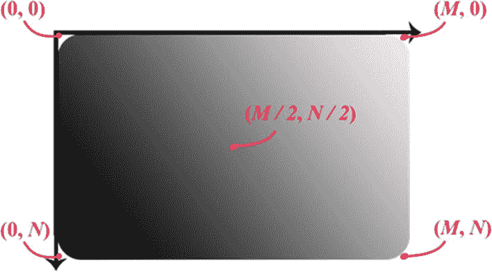

图 1-1

数字图像坐标系

在灰度数字图像中，像素值可以用各种格式表示；然而，最常用的格式是 8 位(1 字节)无符号整数，范围从 0 到 255，其中 0 为黑色，255 为白色。0 到 255 之间的任何值定义不同的灰度(见图 [1-2](#Fig2) )。

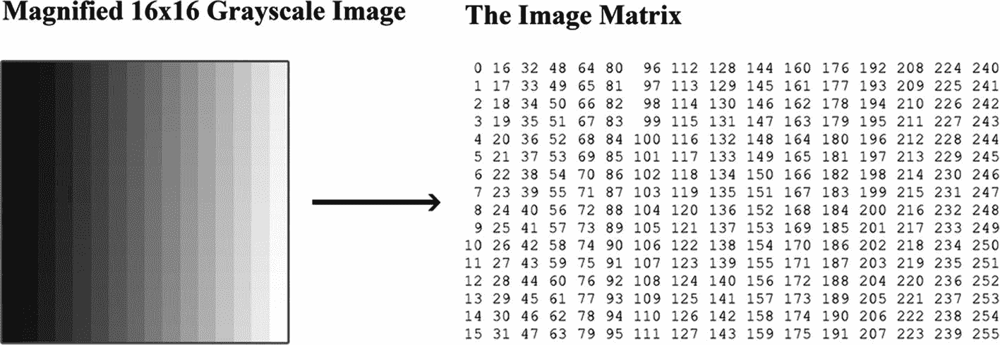

图 1-2

转换为矩阵的灰度图像

图 [1-2](#Fig2) 展示了一幅 16 × 16 的灰度图像，该图像被转换成以 8 位无符号整数表示的像素值。

在彩色数字图像中，像素值必须用三种颜色指定，即红色、绿色和蓝色，这三种颜色代表 RGB 颜色空间。因此，像素值被表示为三个数字的向量，其中每个数字的范围从 0 到 255。随着数字的增加，每种颜色的*亮度*增加，也称为*颜色强度*。例如，如果给定的像素值是(255，255，255)，这意味着红色、绿色和蓝色强度(或亮度)被设置为它们的最高值，这定义了一个*白色*像素(参见图 [1-3](#Fig3) )。

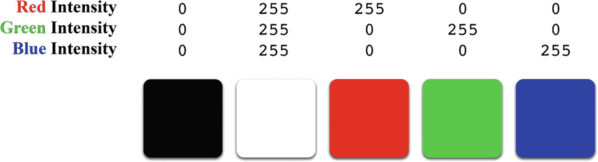

图 1-3

RGB 颜色空间和颜色强度示例

在图 [1-3](#Fig3) 中，你可以看到颜色强度如何影响最终的颜色。颜色强度越高，产生的颜色越亮。

虽然呈现数字图像似乎是一项计算机友好的任务，但计算机视觉需要更复杂的处理来解释、分析或操纵数字图像的内容。计算机视觉由两个核心应用组成:**操纵数字图像**和**处理数字图像**以执行视觉任务。处理数字图像包括图像增强、恢复、重建和压缩。图像增强和恢复通常用于改善失真图像的质量。图像重建利用来自不同角度的一组二维图像来重建三维图像。然而，一些使用深度学习的实现试图从单个二维图像重建三维图像。图像压缩用于将图像转换为更有效的表示形式，以最大限度地减少存储空间的使用。另一方面，处理数字图像可以使用一些图像处理技术来执行匹配、描述或识别图像内容的视觉任务。匹配和描述图像内容的过程主要依赖于将图像分割成更小的部分，并将分割部分与其他模板图像进行比较，并测量分割部分与模板图像之间的关系(参见图 [1-4](#Fig4) )。

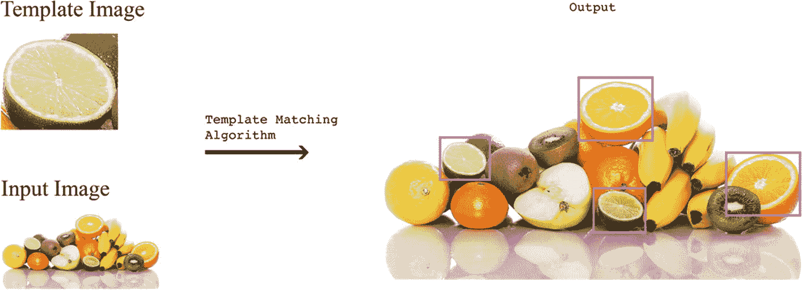

图像学分:racol _ studio/free pik。图 1-4

模板匹配抽象示例

图 [1-4](#Fig4) 展示了一个模板匹配算法的样本结果。

## 计算机视觉工作原理概述

为了让计算机执行视觉任务，例如人脸检测，它需要执行几个较小的任务才能达到目标任务。例如，为了执行视觉任务，计算机通常必须执行各种数字图像预处理技术，例如灰度处理、边缘增强和检测、噪声去除、图像恢复、插值和图像分割。图像预处理是每项视觉任务的第一步，它对视觉任务的成功与否起着至关重要的作用。预处理的目的是提取给定图像中有价值的部分，并去除不想要的失真。有价值的部分有助于开发给定图像中像素、形状和表面的有用描述。正如我们前面提到的，像素值由 1 字节的整数(当它在灰度图像中时)或表示 RGB 颜色空间的整数向量(当它在彩色图像中时)定义；并且每个像素值具有代表颜色亮度的不同强度等级。给定图像中强度的变化提供了关于图像中形状和表面结构的线索。

在预处理阶段，我们试图在不知道图像内容的情况下，使用诸如噪声去除、边缘增强和图像分割等技术来提取这些信息。噪声去除是平滑图像以减少和消除不想要的噪声/失真的过程。然而，有时噪声去除技术最终会模糊图像；在这种情况下，边缘增强技术就派上了用场。边缘增强通过增加两个区域边界之间的强度等级差异来帮助提高图像边缘的清晰度(见图 [1-5](#Fig5) )。

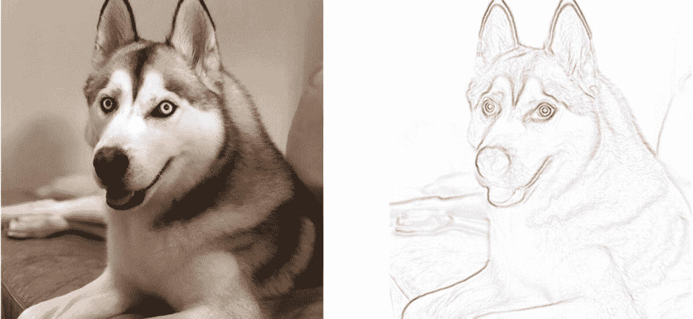

图 1-5

边缘增强/检测示例

左边的图像是原始图像。右边的图像是应用边缘增强技术后的结果图像。您可能已经注意到，右边的图像似乎“勾勒出”了狗的边缘，这可以用于各种视觉任务，如图像分类。

图像分割是将图像分成称为片段的较小部分的过程。分段用于分别处理图像的各个部分，因为在许多情况下，图像具有不止一个有助于识别图像内容的独特对象或特征。图像分割被认为是预处理和处理图像之间的中间步骤，用于目标检测或分割分类(见图 [1-6](#Fig6) )。

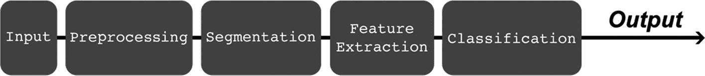

图 1-6

抽象计算机视觉管道

对数字图像进行预处理后，处理步骤就开始了，在许多情况下，它可能涉及诸如特征提取、纹理分析和模式识别等技术。根据每个视觉任务，你会选择更相关的技术来执行任务。例如，要执行图像分类任务，您可以使用特征提取技术来提取给定图像片段中的独特特征。在图像分割过程中提取图像的片段。一旦从图像片段中提取了独特的特征，它们就被用于找到与预定义的或标记的图像片段相匹配的独特模式；带标签的图像片段是在人工监督下手动定义的一段图像(图 [1-7](#Fig7) )。

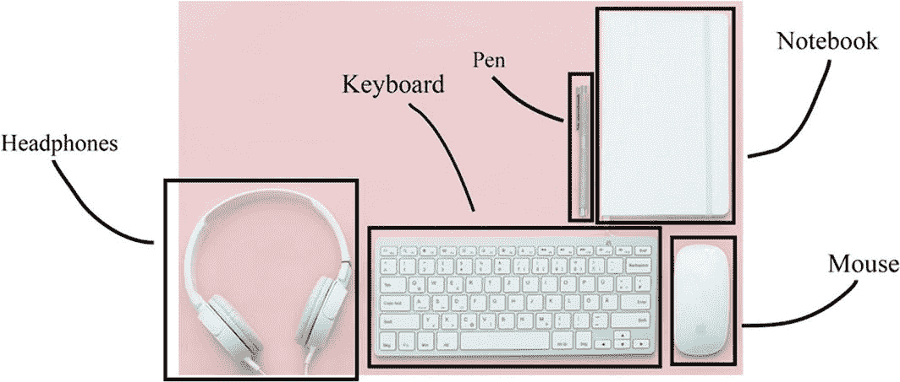

图 1-7

带标签的图像片段示例

找到与标记片段的精确匹配的过程称为特征匹配；寻找独特模式的过程被称为模式识别。图 [1-6](#Fig6) 展示了一个抽象的计算机视觉管道，以及当计算机执行视觉任务时，给定图像通常要经历的过程。关于不同的图像处理技术的进一步细节将在整本书中被覆盖。

## 为什么我们需要计算机视觉？

自从全球数十亿用户可以访问互联网以来，许多人已经能够捕获、制作和发布富媒体内容，如图像、视频和动画图像(也称为 gif)。用户生成的内容定义了我们今天所知道的互联网，每天发布的富媒体内容的数量正在快速增加。今天，仅 YouTube 出版商就贡献了每分钟 300 小时的视频；也就是每周 300 万小时的视频。没有人能以这种速度观看这么多视频。YouTube 和许多允许用户在其平台上生成内容的类似公司面临的挑战是，对数十亿用户生成的图像和视频进行索引、分类和归类，以向观众提供他们会观看的最相关的内容。典型的软件无法正确处理所有这些内容的分类；大多数现有的方法依赖于发布者的文本输入，例如视频标题、描述、关键词等。然而，在许多情况下，发布者的文本输入可能是不相关的；并且它们的内容可能包含不应该向特定年龄组显示的不适当或暴力的场景，或者许多观众想要选择不观看这样的内容。唯一能够实现大规模图像和视频索引、分类和归类的技术是计算机视觉。YouTube 等公司需要计算机视觉来索引和分类大量的富媒体内容。除了对图像和视频进行分类，计算机视觉还可以用于

*   向有视觉障碍的用户和客户提供图像和视频的视觉描述。

*   过滤不适合特定年龄组的内容。

*   警告观众图像或视频中包含的场景和内容的类型。

*   检测被篡改的图像和视频，这些图像和视频可能会对被篡改内容中的查看者或人员造成伤害。

除了计算机视觉可以解决的与互联网相关的问题，各行各业还有许多其他问题需要计算机视觉技术来解决。现在，您可以发现计算机视觉技术集成在我们日常交互的许多事物中，如收银系统、监控系统、生物扫描仪、医疗设备、交通工具等。

*   收银系统集成了计算机视觉技术，以实现自助结账亭。

*   监控系统使用图像和视频增强算法来检测和分析监控图像和视频的内容。

*   生物扫描仪使用边缘检测和增强技术来收集和分析生物信息(即指纹、面部特征、眼睛特征...等等)。

*   医疗设备利用各种计算机视觉技术，如图像重建和恢复，从医疗设备和扫描仪中检索有用的信息。

这份清单可以列出好几页，展示计算机视觉的所有不同应用。事实上，在过去的十年中，对计算机视觉技术的需求一直在增长。顶级公司正在他们的产品中采用这项技术，新公司也开始提供基于计算机视觉的产品。计算机视觉技术的影响是无限的，在接下来的几年里，它将被世界上更多的行业和组织所采用。你可能已经看到了计算机视觉应用未来的最初迭代，例如自动驾驶汽车、自主制造和通过增强现实的教育。

2019 年，公司对增强现实、虚拟现实、计算机视觉工程师的需求增长了 1500% (State of Software Engineers，Hired.com)。计算机视觉将在接下来的几年里对社会产生巨大影响，并需要更多的技术贡献者，这本书将通过让软件工程师和对计算机视觉感兴趣的人成为这一革命性技术发展的一部分来实现。

## 计算机视觉的演变

1959 年，一位神经生理学研究者对猫的视觉系统进行了几次实验。实验将电极放置在猫大脑的主要视觉皮层，研究人员在向猫呈现各种图像时观察视觉皮层的神经反应(图 [1-8](#Fig8) )。

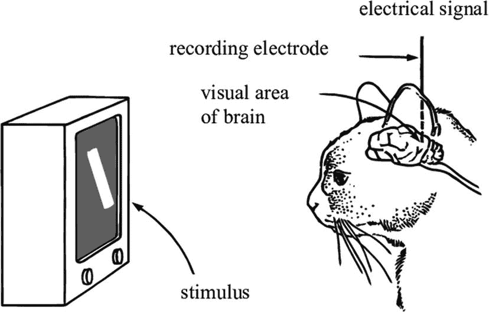

图 1-8

胡贝尔和威塞尔的实验

随着实验的进行，研究人员注意到当看到新图像时，猫的神经反应出现了一种模式。研究得出结论，在视觉皮层中有简单和复杂的神经元。视觉过程从检测图像的简单结构和边缘开始，以帮助建立更详细的解释。随着视觉信息变得更加复杂，视觉皮层依赖于复杂的神经元来解释图像的剩余细节。这项研究后来成为计算机视觉领域最有影响力的研究之一。它启发计算机视觉研究人员实现了今天所谓的图像预处理。

1966 年 7 月，麻省理工学院人工智能实验室的教授西蒙·派珀特发起了“夏季视觉项目”该项目被分配给麻省理工学院的本科生，以开发模式识别技术，试图使机器能够看到。这个项目是一个非常乐观的计划，在一个夏天开发我们今天所知道的计算机视觉。在 20 世纪 60 年代，有各种各样的尝试来开发计算机视觉系统；然而，研究人员最终意识到，这样一个项目需要几年，如果不是几十年，才能实现。50 年后的今天，计算机视觉仍处于研发阶段。

自 20 世纪 60 年代以来，计算机视觉已经发展成为我们今天在许多应用中看到的技术。计算机视觉领域的一项开创性研究是在 20 世纪 70 年代，当时的研究重点是对象识别。物体识别的最初迭代是抽象和简单的，以证明物体识别的概念。该实现使用简单对象(如圆柱体和立方体)的线条连接来标识它们。在接下来的几十年里，研究人员和工程师开发了传统计算机视觉的核心技术，包括两个主要阶段:

1.  图像预处理

2.  图像处理

图像预处理阶段集中于增强图像颜色和边缘，以帮助检测给定图像中的简单结构。处理阶段使用经预处理的图像来执行以下处理技术中的一种或多种:

*   图像压缩

*   图像增强

*   图像恢复和重建

*   模式匹配和识别

尽管传统的图像处理技术(如前面列出的那些技术)自开发以来已经使用了几十年，但仍有一些问题是这些技术无法单独解决的，例如在非常不寻常或意想不到的环境中识别对象，如手写单词、数字和从不寻常角度捕捉的对象图像(图 [1-9](#Fig9) )。

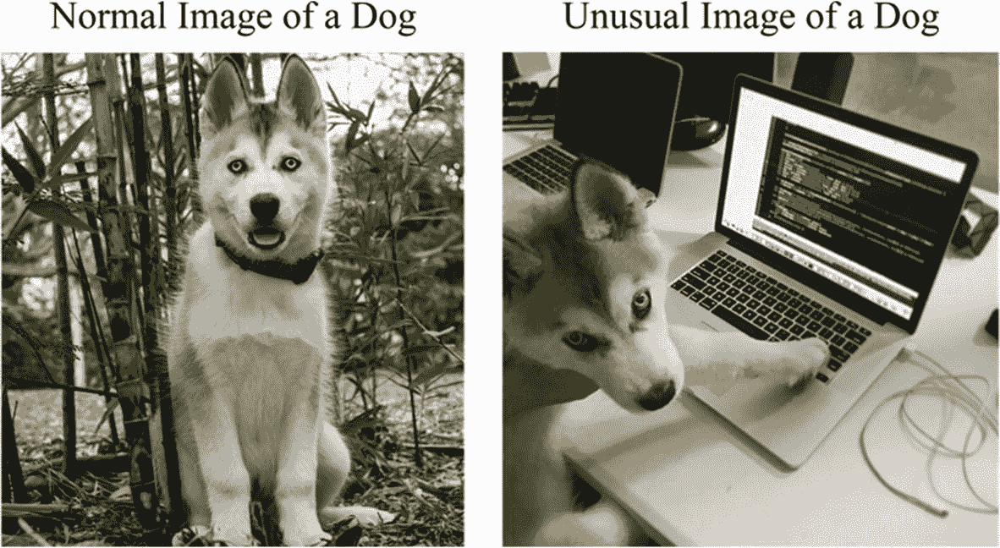

图 1-9

物体的正常与异常图像

因此，在 20 世纪 80 年代，各种开创性的研究发表了。这项研究建议使用简单和复杂“神经元”的人工网络，可以识别某些模式。这种人工网络今天被称为人工神经网络(ANN)。神经网络是一种计算模型，旨在识别给定的一组标记数据(在这种情况下为标记图像)中的模式。网络使用给定的图像来识别模式并预测每个图像的结果。一旦网络预测了图像的结果，它就将其预测与分配给该图像的标签进行比较。比较阶段使网络能够从其初始过程中的错误中“学习”,然后多次执行相同的过程，直到网络提供更准确的结果。神经网络通常需要大量的标记数据来提供非常好的结果。因此，在早期，由于缺乏数据，神经网络没有发挥其全部潜力。

在 21 世纪初，一群计算机视觉研究人员启动了一个名为 ImageNet 的大规模图像数据集，该数据集包含数百万张图像和超过 20，000 个类别。ImageNet 的灵感来自于计算机视觉领域对更多数据的需求。它使最先进的神经网络模型的开发成为可能，对今天看到的高级计算机视觉应用产生了巨大影响。神经网络及其变体被认为是深度学习领域的一部分，深度学习是机器学习的一个子集。因此，当神经网络用于执行视觉任务时，我将把它称为基于深度学习的计算机视觉。

## 传统与基于深度学习的计算机视觉

自从计算机视觉领域出现以来，传统的计算机视觉就一直存在。传统的计算机视觉技术已经使用了几十年来有效地执行视觉任务。传统技术帮助开发了许多今天常用的算法，如尺度不变特征变换(SIFT)和加速鲁棒特征(SURF)。像 SIFT 和 SURF 这样的算法由于其高效的性能和准确的结果，已经成为开发当今增强现实技术的基础部分。然而，在某些情况下，由于缺乏准确性，传统的计算机视觉技术并不是最佳选择。在这些情况下，最好的选择通常是使用基于深度学习的技术。深度学习以多种方式用于执行复杂的视觉任务，如图像分类。在图像分类方面，基于深度学习的方法通常优于传统方法。图像分类是将图像内容分类到不同类别的过程。例如，最流行的图像分类问题之一是对猫和狗的图像进行分类。当一个软件呈现一只猫的图像时，它应该以很高的准确度将其归类为一只猫。在深度学习之前，这个任务几乎不可能完成；然而，深度学习推动了计算机视觉可能实现的极限，并成功地使计算机能够以高准确度区分猫和狗。如果没有速度极快的计算机和数百万张猫狗图像的数据集，这是不可能的。你可能想知道为什么深度学习需要快速的计算机和大量的数据。嗯，答案就在深度学习是什么以及它如何真正工作的背后。深度学习是机器学习的一个子集，主要建立在人工神经网络(ann)上，人工神经网络是一种受人脑运作方式启发的计算模型。与人脑类似，人工神经网络由几个计算“神经元”组成。神经网络中的人工神经元执行简单的计算操作，与网络中其他连接的神经元进行通信以做出决定。每个神经元与另一个神经元的连接都有一定的强度。神经元之间连接的强度称为权重(见图 [1-10](#Fig10) )。

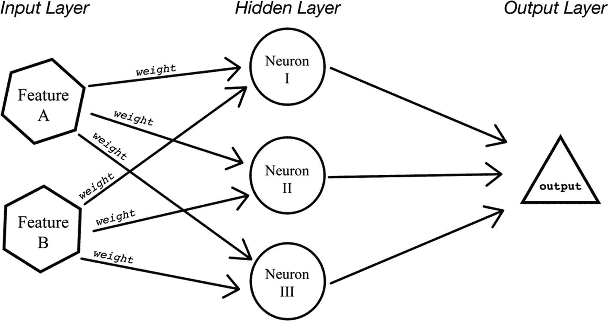

图 1-10

前馈人工神经网络模型

图 [1-10](#Fig10) 展示了一个由三层组成的简单神经网络——(1)输入层，(2)隐藏层，(3)输出层:

1.  输入图层由多个输入组成，其中每个输入代表给定数据集的一个唯一要素。

2.  隐含层是一组神经元，根据权值以一定的方式进行计算和处理。

3.  输出层是神经网络中的最后一层，它接收来自前一个隐藏层的最终结果。

一组神经元代表一个神经网络隐层，典型的深度学习算法由多个神经网络隐层组成。人工神经网络包括两个阶段，学习阶段和执行阶段。在学习阶段，神经网络利用带标签的数据集来“学习”数据及其描述(也称为标签)之间的相关性。在我们的例子中，带标签的数据集由一组图像组成，每个图像都有内容描述。当给神经网络一个带标签的图像时，它会尝试处理隐藏层中的图像，并将标签的预测作为输出返回。一旦输出被返回，神经网络通过使用各种称为目标函数的函数将其与原始标签进行比较来对其结果进行“分级”。如果等级没有超过某个阈值，它将通过调整神经网络中神经元之间连接的权重来从中“学习”。神经网络通过向自身提供相同的输入来继续学习，并且网络的权重随着学习而调整。这个过程重复多次，直到神经网络的“等级”超过所需的阈值。“学习”和调整权重的过程称为误差反向传播，也称为反向传播。概括来说，这里是一个典型的人工神经网络“学习”新事物所经历的步骤的简单有序列表:

1.  接收带标签的输入

2.  尝试预测输入的标签

3.  将预测标签作为输出返回

4.  将预测标签与实际标签进行比较

5.  给结果打分

6.  调整神经元之间的连接强度，也称为权重

7.  重复该过程，直到最终等级超过阈值

## 增强现实中的计算机视觉

增强现实(AR)是一种通过摄像头实时反馈来增强或显示物理世界中的数字对象的技术。为了在物理世界中显示数字对象，我们需要实时理解和检测物理世界中的对象。在某些情况下，对象可以是特定的模板。在其他情况下，它可以是水平表面，如桌子和地板，也可以是垂直表面，如墙壁和门。为了能够检测物体和表面，我们需要使用计算机视觉技术来显示物理世界中的数字对象。有三种主要类型的增强现实:基于标记的、无标记的和地理位置增强现实。基于标记的 AR 需要特定的预定义模板来显示数字对象。例如，一本书或一本杂志中的一页可以有一个特殊的图标，因此当相机检测到该图标时，它会显示一个映射在该图标或页面上的数字对象(图 [1-11](#Fig11) )。

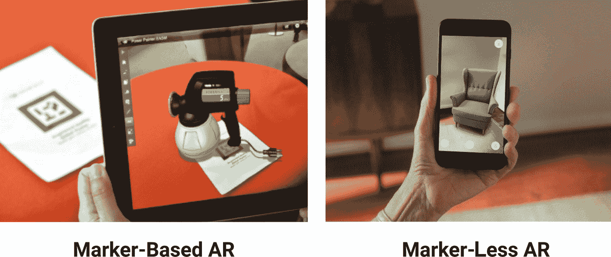

图 1-11

基于标记与无标记的 AR

与基于标记的 AR 不同，无标记 AR 不需要任何特殊的预定义模板来显示数字对象。相反，它可以使用各种计算机视觉技术将数字对象放置在任何水平或垂直表面上。在许多情况下，地理定位 AR 依赖于基于标记或无标记的 AR，并集成了位置传感器技术，以根据视觉和位置数据显示物理世界中的数字对象。

今天的增强现实主要是通过移动设备，更具体地说是智能手机来实现的。尽管已经有各种尝试通过开发定制硬件和设备来整合沉浸式 AR 体验，如微软的 HoloLens、Magic Leap 眼镜和谷歌眼镜，但消费者适应使用新的和不熟悉的硬件还为时过早。因此，智能手机是向消费者介绍 AR 的完美工具。在移动 AR 的早期，使用二维码或模板图像等标记是增强物理世界中数字对象的主要方式。为了实现这一点，需要模式识别和姿态估计等技术。模式识别是一种技术，它依赖于描述在给定图像中查找和分析的特征的预定义数据集。姿态估计使用检测到的图案基于摄像机角度模拟三维姿态(见图[1-12](#Fig12))；这项技术用于根据摄像机的视角从各个角度观察三维物体。

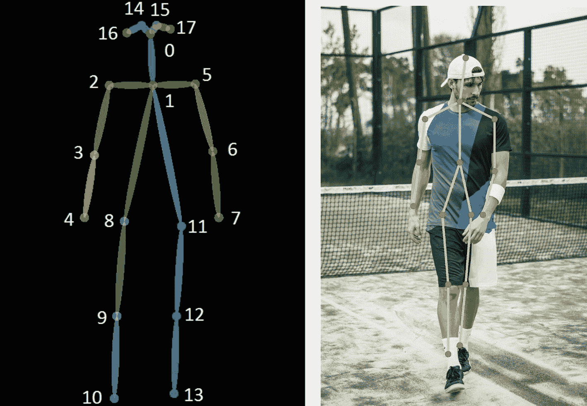

图 1-12

身体姿态估计

基于标记的增强现实允许任何拥有智能手机的用户互动和使用这项技术；然而，对于日常使用来说，具有物理标记的要求是不可扩展的，也是不实际的。因此，无标记增强现实因其易用性和可及性而更具潜力。在无标记 AR 发展的早期，需要双摄像头来重建物理世界。

## 摘要

在这一章中，我们阅读了计算机视觉的历史。灰度和彩色图像进行了比较。我们还研究了为什么我们需要计算机视觉及其评估。我们还看到了前馈人工神经网络的简化架构。最后，我们看了增强现实。

总之，计算机视觉是人工智能(AI)的一个领域，它使计算机和系统能够从数字图像、视频和其他视觉输入中获取有意义的信息，并根据这些信息采取行动或提出建议。如果人工智能使计算机能够思考，那么计算机视觉使它们能够看到、观察和理解。

计算机视觉的工作原理与人类视觉非常相似，只是人类领先一步。人类视觉的优势在于，它可以训练如何区分物体，它们有多远，它们是否在移动，以及图像中是否有问题。

在下一章，我们将看看增强现实和不同类型的增强现实。