# 四、计算机视觉应用

本章将着重于各种计算机视觉应用，技术的演变，以及如何建立一个 C++视觉应用。

## 概观

在计算机视觉中，模拟人眼使计算机能够像人类一样处理和识别视频和照片中的事物，从风景到物体、运动等等。直到最近，计算机视觉还只是在小范围内运作。今天，深度学习已经赋予了我们在日常使用的许多软件中看到的高级计算机视觉。事实上，深度学习最受欢迎的一个分支是计算机视觉；因此，深度学习对于实现和执行复杂的计算机视觉操作起着至关重要的作用。

如果让你描述图 [4-1](#Fig1) 中的物体/事物，你可能会提到在这幅图中有“果汁、篮子、男孩、女孩、男人、女人、草等”然后，如果你被要求描述图片中发生的事情，你的答案很可能是“这是一个享受野餐的家庭”，不费吹灰之力。这是大多数六七岁以上的孩子都能完成的两个非常基本的任务。然而，在上下文中，这是一个非常复杂的过程。人类的视觉是我们视力中极其复杂的有机组成部分。我们的概念模型，我们抽象解释的概念，以及我们的机密事件，在我们生活中与宇宙的数十亿和数万亿次相遇中也被考虑在内。

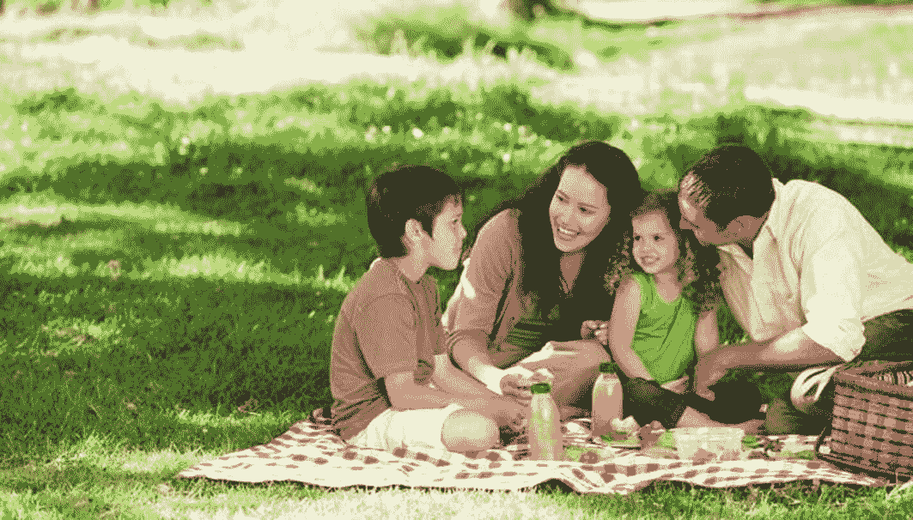

图 4-1

彩色图像(RGB 图像)

数码相机呈现的图像的分辨率具有远超过人类视觉系统的细节。以非常高的精度，颜色的变化也可以观察和量化。但是从这些图片的内容中找出意义是计算机几十年来一直面临的挑战。

作为人类，我们很容易体验到我们周围世界的三维性质。与此同时，计算机视觉研究人员开发了数学方法来恢复摄影中物体的三维结构和外观。

## 计算机视觉的应用

计算机视觉在它处理的问题上有其相关性。这是数字世界最重要的发展之一。计算机视觉帮助车辆自动驾驶并感知周围环境。摄像机记录汽车的不同角度，并将信息输入计算机视觉软件，然后通过处理图像找到道路界限和交通灯，并实时检测与其他汽车、行人和物体的距离。在高速公路和街道上，自动驾驶汽车将导航，避免撞到障碍物，并将旅行者安全带到目的地。

计算机视觉的一个共同特征是人脸识别。我们通过计算机视觉技术将人们的面部照片与他们的身份进行匹配。在图像中，计算机视觉算法检测面部特征，并将这些特征与数据库中的面部轮廓进行比较。为了验证其所有者的身份，消费设备使用面部识别。为了标记用户，社交媒体应用使用面部识别。

在计算机视觉中，帮助平板电脑、智能眼镜和智能手机等计算机系统在现实世界图片中覆盖虚拟对象的技术在增强和混合现实中发挥着重要作用。AR 设备使用计算机视觉来识别现实世界中的对象，以在设备的显示器上定位虚拟对象。例如，AR 系统可以使用计算机视觉算法来检测对检测深度和测量以及定位非常重要的平面。

Google Photos 等在线照片库使用计算机的眼睛来检测照片，并根据主题类型自动对照片进行分类。比起为你的照片和解释加上标签，你会节省很多时间。该技术还允许用户通过键入他们想要的内容形式来扫描视频时间，而不是手动观看完整长度的视频。计算机视觉在健康科学的发展中也起到了至关重要的作用。计算机视觉算法可以帮助医疗自动化任务，包括识别皮肤图像中的癌性肿块。

其他更复杂的应用出现在计算机视觉中。例如，想象一个智能家庭监控摄像头，它不断地将您的家庭视频发送到云，并允许您在远程级别显示图像。你可以建立一个具有计算机视觉的云框架，以便当任何可疑的事情发生时，房子里发生火灾时，立即向你发出警报。这将节省你大量的时间，确保你可以用警惕的眼睛看到你的房子。美国军方现在正在用计算机视觉处理摄像机和无人机记录的视频内容。

如果您在此示例中更进一步，您会注意到保护程序仅存储视觉算法异常标记的视频。这将允许我们最小化存储在云中的内容的大小，因为您的大多数安全相机照片在几乎所有情况下都是无害的，不需要检查。

在有一些计算机视觉可以实现的深度学习活动之前，开发人员和人类操作员需要大量的主动性和手动编码。例如，如果你想识别一张脸，你必须采取以下步骤:

1.  通过建立数据库，将各个主体的图像按照一定的格式收集起来。为图像添加注释，并为每张图片输入多个数据项，例如距眼睛的距离、鼻梁宽度、上唇距鼻子的距离，以及数百个定义每个人具体特征的进一步测量值。

2.  捕捉图像。如果您正在使用图片或视频内容，您将必须捕获新文件。然后必须重新检查测量过程，以标记图片中的关键点。你还必须拍摄图像的角度。

该程序最终将与数据库中的匹配，并比较在新图像中找到的测量值，如果它们符合任何跟踪配置文件。事实上，这项工作是手工进行的，很少使用自动化，误差幅度仍然很高。

机器学习是解决计算机视觉问题的另一种方法。在具有机器学习功能的视觉应用中，开发人员不再需要为每个法规手动编写代码。取而代之的是，对“特征”的编程包括可以检测这种图像模式的较小的应用。该算法随后用于检测趋势、识别独特特征并使用统计学习算法(如线性回归、决策树和逻辑回归)检测对象。

深度学习提供了一种全新的学习机器的方式。深度学习依赖于神经网络，它可以克服任何可以用例子说明的问题。神经网络包含特定类别数据的多种表示形式，可以从这些示例中提取常见模式，并将其转换为有助于识别潜在数据项的数学方程。

构建深度学习程序只涉及选择一个预先构建的算法，或者创建一个具有预期检测的个人面部样本的算法。神经网络可以在没有附加功能和测量指令的情况下用适当的例子识别人脸。

深度学习是计算机视觉的一种非常强大的方法。在某些情况下，成功的深度学习算法的开发在于选择大量的指定训练数据和限制，例如神经网络形式、网络的神经层数以及训练网络的次数。深度学习和机器学习都比以前的形式更容易和更快地实现。

随着硬件和云计算基础设施的可用性和进步，深度学习被用于当前大多数机器视觉系统，如自动驾驶汽车、面部识别和癌症识别。

### 读取、写入和显示图像

使用像照片和文本这样的数字，计算机可以看到和处理一切。图片的读写对于任何计算机视觉项目都很重要。有了 OpenCV 库，这项工作就简单多了。

矩阵中的整数决定了该特定位置的像素强度。在上图中，我们在右侧显示灰度图片及其像素值强度等价物(图 [4-2](#Fig2) )，在该示例中只有一个属性，即给定像素位置的黑色强度。OpenCV 中的 imread 函数读取 BRG 的图像。当实现 imread 函数时，我们可以选择以不同的形式读取给定的图像:彩色、灰度或不变。下面的列表演示了需要传递给函数的实际值:

1.  Cv2。IMREAD_COLOR

2.  Cv2。IMREAD _ 灰度

3.  Cv2.IMREAD_UNCHANGED

    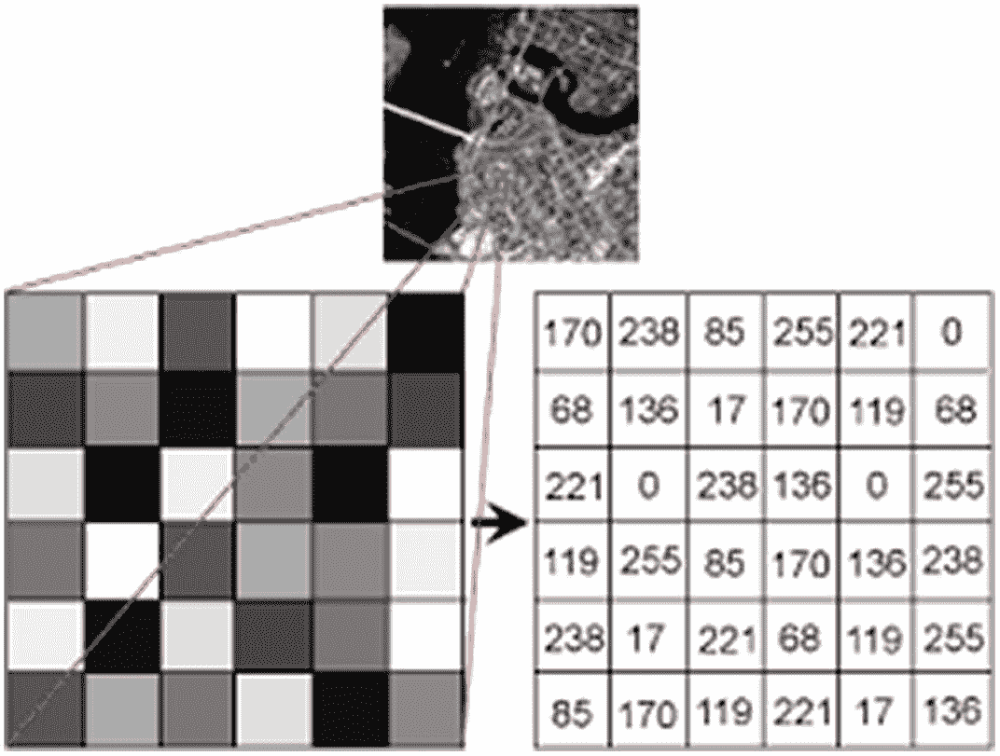

    图 4-2

    2D 连续图像中行和列的分割

### 更改色彩空间

从某种意义上说，表达颜色的协议是一个颜色空间，这使得它们可以方便地再现。灰度图像对于单个像素具有一个像素值，然而彩色图像对于单个像素具有三个值，即通常称为 RGB 的红色(R)、绿色(G)和蓝色(B)。

在大多数情况下，计算机视觉使用 RGB 格式来处理图像。今天，OpenCV 库读取图像时的默认格式是 RGB，但是它以 BGR 存储图像数据，这与 RGB 相似，只是像素描述的顺序不同。因此，当使用 OpenCV 读取图片时，您必须将图像色域从 BGR 转换为 RGB(图 [4-3](#Fig3) )。

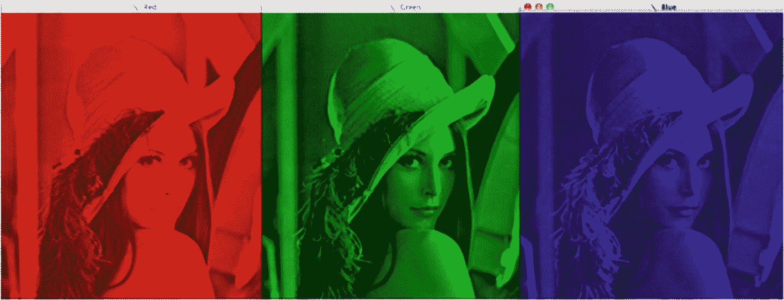

图 4-3

图像的 RGB 分量

### 调整图像大小

对于机器学习任务，训练模型具有固定的输入大小。这同样适用于计算机视觉模型。训练我们的模型时，我们应该有相同大小的图像。OpenCV 提供了方便的方法来放大和缩小图像。当我们需要将图像转换为深度学习算法的输入形式以进行训练时，这些方法很有帮助(图 [4-4](#Fig4) )。

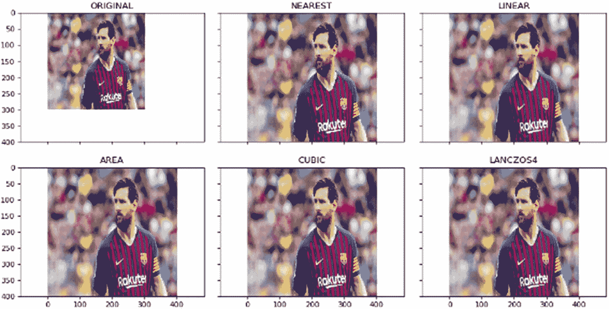

图 4-4

图像的不同分辨率/比例

### 旋转图像

数据增强方法是最常用的方法之一，旋转是图像/数据增强中一种易于引入的技术(图 [4-5](#Fig5) )。使用这种技术，我们将能够为我们的深度学习训练模型建立更多的例子。数据扩充使用可用的数据样本，并使用旋转和平移来构建它们的新副本。

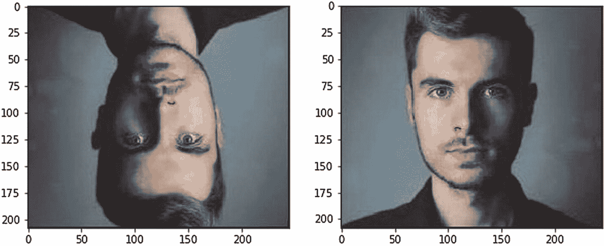

图 4-5

图像旋转

### 逐位运算

“与”、“或”、“异或”和“非”是位运算。当我们想要从输入图像中移除我们想要的区域时，这些操作非常有用，并与遮罩一起使用(图 [4-6](#Fig6) )。

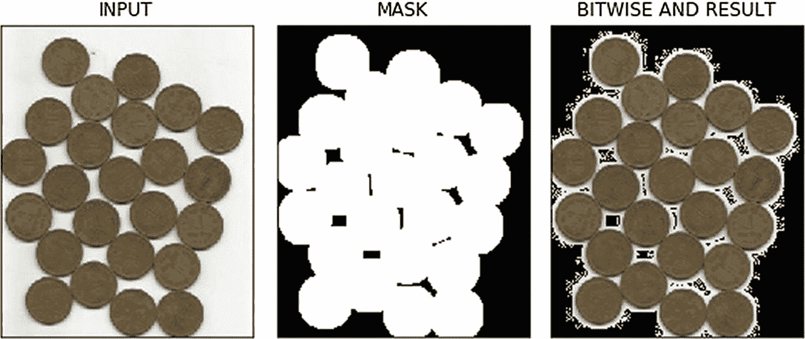

图 4-6

位运算

我们可以使用分水岭算法来测量图像中的分割掩模，并在我们使用按位“与”运算来消除图像的背景并获取我们需要的区域之后，看到我们提供的图像。

### 检测边缘

边缘是非常有用的图像特征，可用于各种目的，例如图像识别和物体定位。图片中对象的边缘特征也可以通过深度研究模型来确定。它们也用于锐化图像(图 [4-7](#Fig7) )。

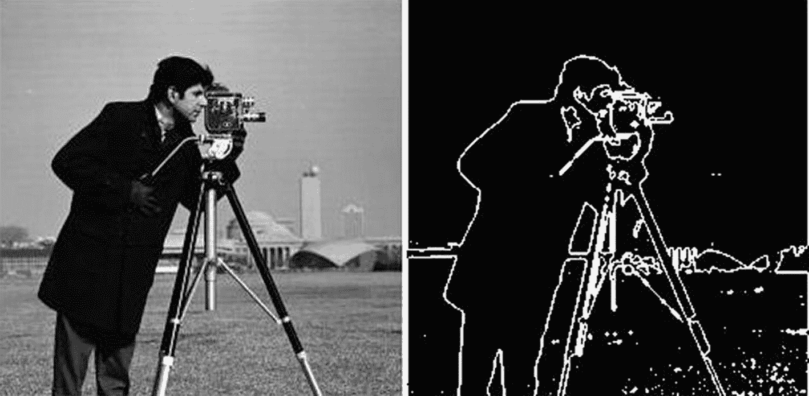

图 4-7

图像的锐化

### 滤像

为了模糊图像，我们使用高斯滤波器，它根据相邻像素与被考虑像素的距离赋予相邻像素不同的权重(图 [4-8](#Fig8) )。

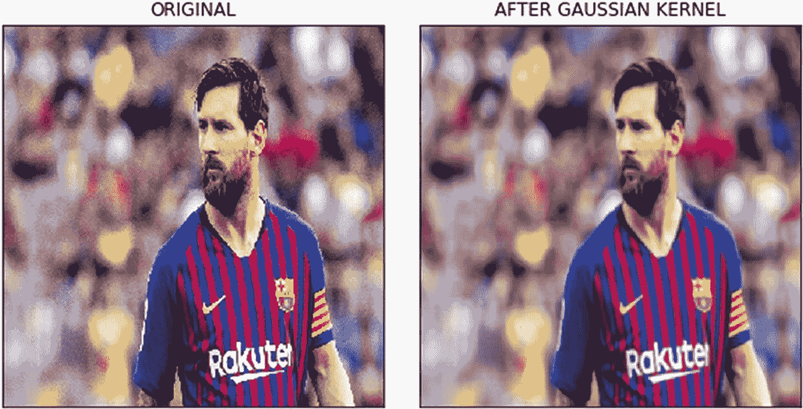

图 4-8

原始图像和高斯核后的图像

为了应用高斯滤波器，核被用于图像滤波。使用核来确定图像的给定部分中的点积。当计算新的像素值时，像素内的核的中心重叠。附近的像素值乘以必要的内核值。与内核中心一致的值被分配给像素。

### 检测面部

OpenCV 支持基于 Haar 级联的对象识别。哈尔级联是基于机器学习框架的分类器，它测量各种特征，如边缘、线条等。机器通过视网膜检测人脸(图 [4-9](#Fig9) )。

图 4-9

用于人脸检测的包围盒

## 计算机视觉算法

用于分类或识别照片的技术通常以一组用于预测特定类别的数据点来表示。图像标注是一个分类子问题，将整张图片标注为一个类别。使用图像标记技术，人类用一组类别手动标记整个图像。一旦我们有了一组带有标记图像的数据，我们可以应用匹配算法来比较新的未标记的用户输入图像与我们拥有的数据集。一旦找到匹配或相似的标记图像，我们返回适当的类别集。

你可以将一张特定的图片分成无数的组。考虑一个手动过程，在该过程中，图像被匹配，相同的图像按照相似的特征被分类，但是没有预先理解你在寻找什么。显然，这是一项艰巨的任务。为了更清楚，假设有成千上万的图像。为了有效地做到这一点，显然需要一个自动化系统。

许多对图像进行分类的任务需要对物体进行摄影。CIFAR-10 和 CIFAR-100 是两种常见的数据集，图片分别被分类为 10 组和 100 组。这些数据集符合行业标准，可用于公共领域。

### 深度学习中的图像分类

深度摄影识别的架构通常包含卷积层，成为卷积的神经网络(CNN)。对于 CNN 来说，在网络上有图像和细节被分成网络类别是很常见的。CNN 以一个输入“扫描器”开始，并不是所有的训练数据都被同时解析。例如，您可能不希望 10，000 个节点的图层处理 100 × 100 像素的图像。相反，您可以创建一个 10 × 10 的输入图层，接受第一个 10 × 10 的图像像素。输入下一个 10 × 10 像素，在输入传输之前将扫描仪向右移动 1 个像素。这种技术使这个过程更有效率。

### 目标检测

对象检测是一种机器视觉过程，它在图片或视频中找到并区分对象。对象的识别特别是在检测到的对象周围绘制边界框，以定位它们在给定场景中的位置(或者观察它们如何绕过它)。物体识别通常与图像识别相混淆，所以在我们继续之前，解释一下它们之间的区别是很重要的。图像识别，也称为图像分类，为图像指定一个名称。“狗”这个标志是用一只狗的图片来表示的。“狗”这个标记仍然适用于两只狗的图片。另一方面，目标识别会在每只狗周围绘制一个边界框，并将该框命名为“狗”其根据模型预测指定给定对象在哪里以及应该添加什么标记/标题。这样，目标检测提供的不仅仅是关于图像的识别/分类信息(图 [4-10](#Fig10) )。

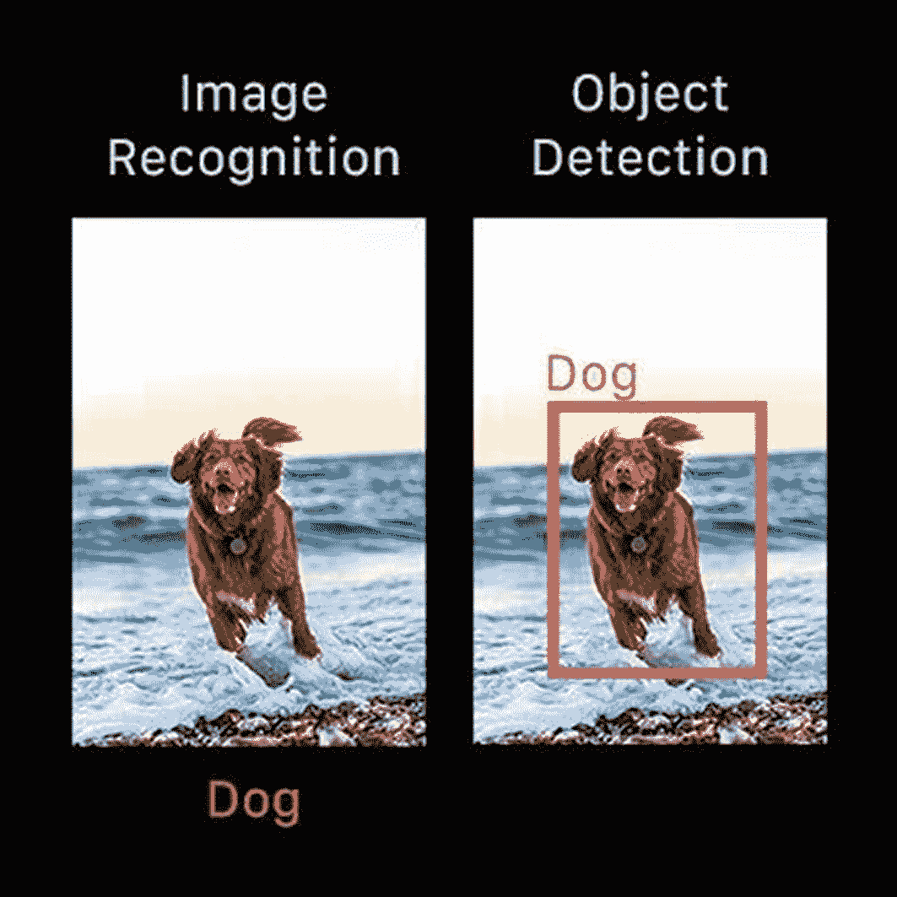

图 4-10

物体识别/检测

### 对象检测类型

目标识别通常可以分为机器学习方法和深度学习方法。

使用传统的基于机器学习的方法来分析图像的各种属性，例如颜色直方图或边界，计算机视觉技术被用于识别可能属于对象的像素类别。这些特征然后被集成到预测实体的位置和名称的回归模型中。然而，深度学习方法基于卷积神经网络(CNN ),用于识别必须单独提取的伪像。

由于深度学习方法已经成为对象识别的现代方法，这些是我们为了实现的目的将关注的技术。

### 目标检测的重要性

物体识别与其他相关的计算机视觉技术密不可分，如模式识别和图像分割，帮助我们识别和感知图像或视频场景。

然而，还是有潜在的差异。图像检测只为检测到的对象创建一个类别标签，而图像分割提供了对场景的组件的像素级描述。对象识别通过拥有识别图像或视频中的对象的独特能力而与这些其他实践相分离。然后，这允许你计算这些物体，并用识别某些主要区别的独特能力来映射它们；我们可以看到它是如何以多种方式整合的:

*   统计观众人数

*   汽车自动驾驶

*   监控录像

*   掩模的检测

### 异常检测

这显然不是一个完整的列表，但它包括了物体识别影响我们未来的一些主要问题。

### 目标跟踪

在任何给定的场景中，这适用于跟踪一个或多个移动物体(图 [4-11](#Fig11) )。这在历史上是在原始对象被观察到跟踪真实世界的遭遇之后实现的。这是优步和特斯拉等公司将推出的自动驾驶汽车中非常重要的一部分。可以将对象检测分为两类:*生成型*和*偏向型*。生成方法将描述可见特征，并在寻找对象时最小化重建错误。

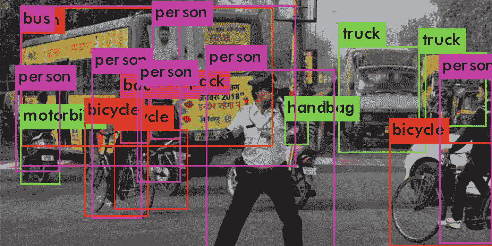

图 4-11

对象检测包围盒

鉴别过程更加有效和准确。它可以用来区分问题和含义，是监控的首选方式。它与通过检测跟踪的名称相符合。

### 语义分割

将图像中属于同一对象类别的部分聚集在一起的方法称为语义分离或图像分割。图像的每个像素都有一种像素预览，因为它是按类别分类的。Cityscapes、PASCAL VOC 和 ADE20K 是这项任务的标准。平均 IoU 和像素精度指标通常用于测试模型。平均 IoU 用于测试模型。更准确地说，语义图像分割的目的是将图像的每个像素中描述的内容标记为相应的类别。这种方法被广泛称为密集预测，因为我们对图像中的每个像素进行预测。

需要记住的重要一点是，同一个类的实例是不分开的；我们只考虑每个像素的类型。换句话说，如果在输入图像的同一组中有两个对象，分割图不会自动将它们区分为单独的对象。存在一种不同类型的模型，称为示例分割模型，其区分同一类别的不同对象。

对于许多活动，细分模型是有帮助的。

### 自动驾驶的车辆

为了让自动驾驶汽车安全地进入我们目前的高速公路，我们需要为汽车配备必要的感知能力，以考虑周围的环境。

### 医学诊断图片

机器将改善放射科医生进行的研究，显著减少进行诊断测试所需的时间(图 [4-12](#Fig12) )。

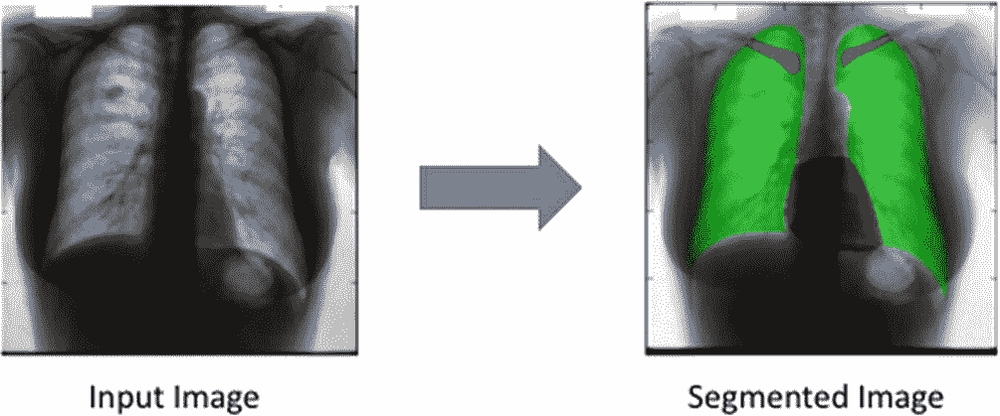

图 4-12

样本分割图像

### 实例分割

对于图像中的每个识别对象，实例分割区分对象的每个实例。

实例的分割给每个图像像素分配一个标记。它用于计算给定图像中项目的数量，以执行图像分割等任务。

### 要求

这里，对象检测的目的是识别特定的对象，并为每个实体实例放置一个边界框。

每个示例都是分段的。目标是定义一组固定类别中的每个像素，而不区分对象实例。

Mask R-CNN 是一种深度学习技术，它通过更专注于实例分割来扩展 R-CNN。

R-CNN 和更快的 R-CNN 有什么新的地方？

掩模 R-CNN 具有另一个分支，用于预测每个感兴趣的场或区域(ROI)中的像素到像素的分割。

R-CNN 不同步输入网络像素以获得更高的速度。R-CNN 更快地产生两个输出:

*   类别符号

*   每个申请者的偏移边界框

屏蔽 R-CNN 的三个输出是

*   类别符号

*   每个申请者的偏移边界框

*   遮罩对象

用于分组和边界回归的屏蔽 R-CNN 和更快的 R-CNN 分支在这里找到。

为了删除图像特征，我们可以使用 ResNet 101 深度学习架构。

两者都使用网络区域建议来建立兴趣域(RPN)。

### 图像重建工作

想象一下，你有一张旧快照，随着时间的推移，碎片已经开始侵蚀。这是一张非常有价值的照片，所以你想找回它。那就是图片的还原。为了得到模型必须学会恢复和增强的图像的损坏副本，数据集通常会包含现有的图片。在 IBM 和 Pinterest 等企业的引领下，这两个领域都在大力投资计算机视觉研究。重要的是要记住，鉴于计算机视觉的所有优势，因为它因其黑盒决策而臭名昭著，所以仍然存在安全问题。这就是人们对计算机持怀疑态度的地方，这些计算机使用信息来预测他们的一举一动，并对他们的信用风险、健康状况和许多其他人类选择做出决定。然而，随着人工智能和安全需求的快速增长，我们应该希望解决某些问题，以补救我们的隐私问题。

## 实施视觉应用

### a)人脸检测/识别

这里的程序利用 OpenCV 库来检测 web cam feed 中的人脸，甚至是本地保存的视频剪辑。这里的代码实时识别或监控人脸。它借助预训练的 XML 分类器来实现这一点。面部特征已经被编程到该程序中使用的分类器中。为了检测各种对象，可以利用分类技术。

要运行程序，您需要执行以下操作:

1.  在本地计算机上，必须配置 OpenCV。

2.  在程序运行之前，必须定义分类器 XML 文件的路径。OpenCV 位置“OpenCV/data/haarcascades”包含这些 XML 文件。

3.  捕获时，使用“0”作为值。要运行网络摄像头流，请键入 open (0)。

4.  提供用于人脸检测的视频文件的路径，例如*(capture . open(" path to video "))*。

#### 履行

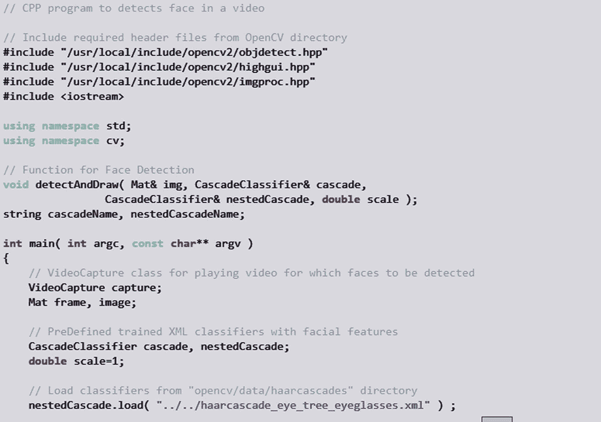

在这部分代码中，您需要包含 OpenCV 目录中所需的头文件并加载分类器。

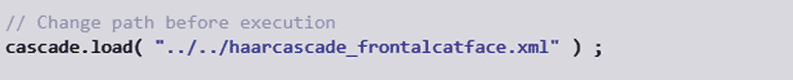

之后，在执行之前更改“cascade.load”中的路径。

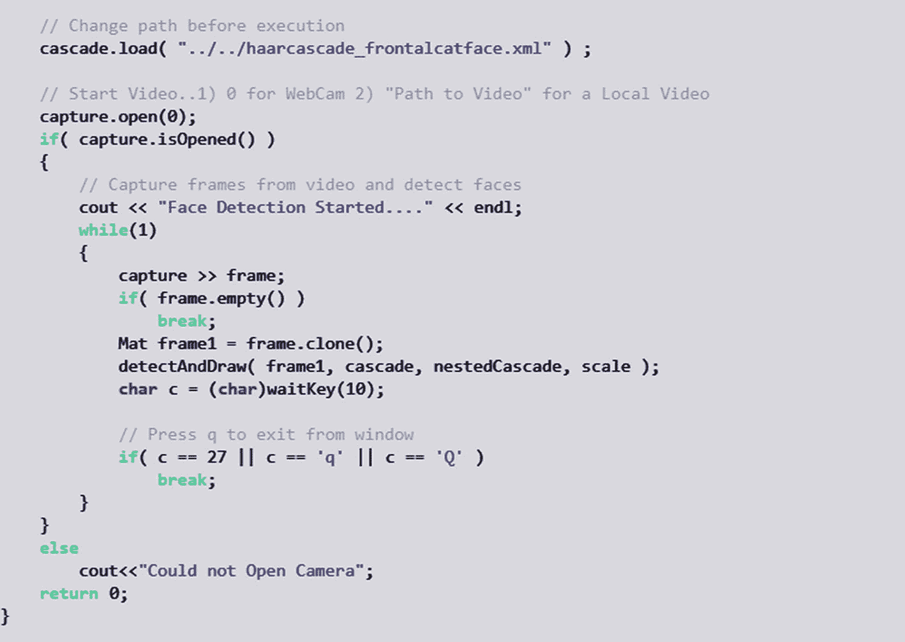

使用 0 启动网络摄像头流。之后，将开始人脸检测。

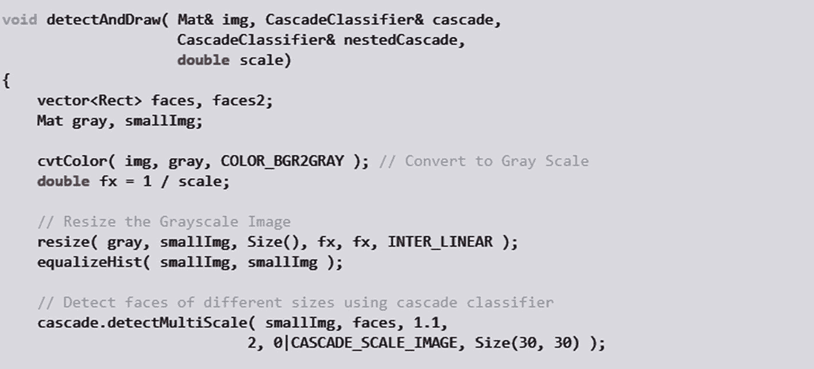

这部分代码使用级联分类器检测不同大小的人脸。

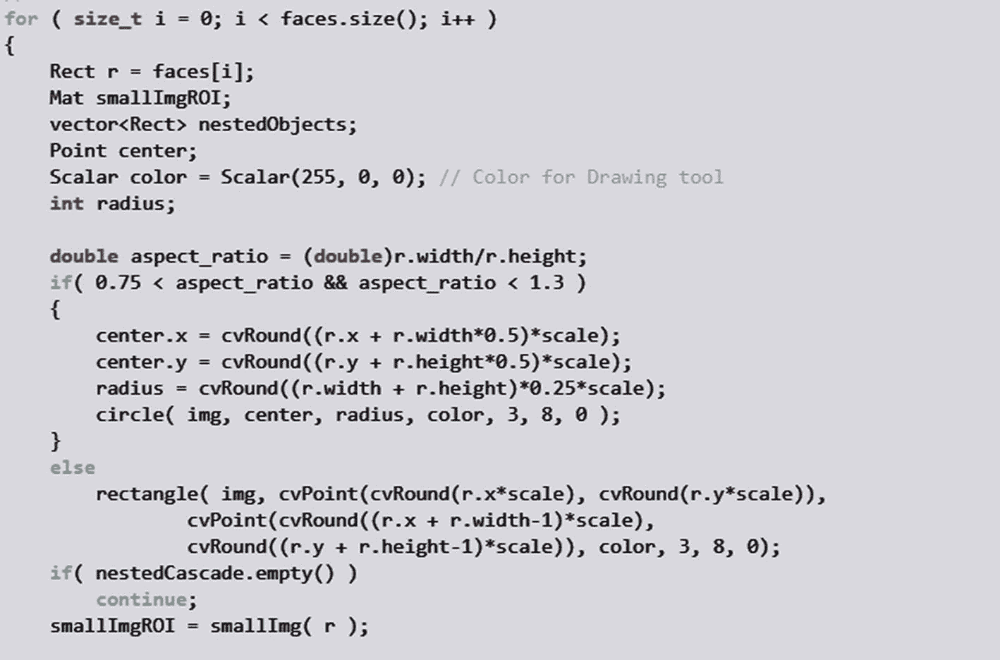

这段代码通过检测形状在脸部周围画一个圆，并使用标量颜色作为绘图工具。

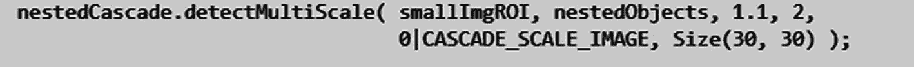

这将从输入图像中检测眼睛。

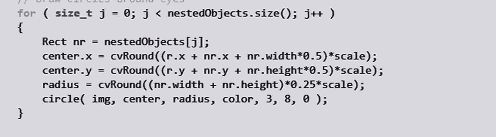

这里的循环将在眼睛周围画一个圆。

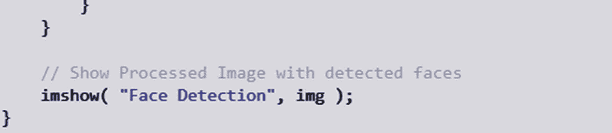

如果检测到人脸，函数 *imshow* 将处理图像，如下图所示:

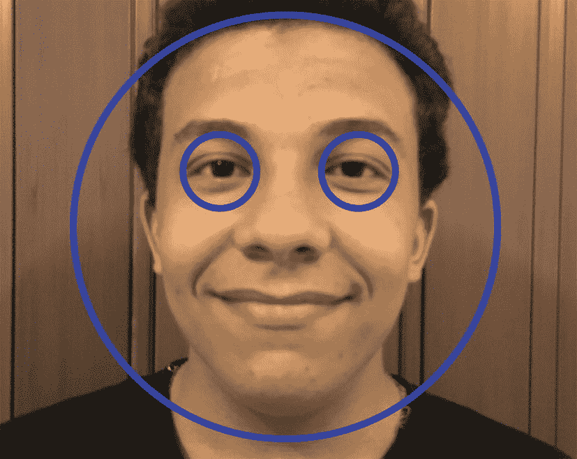

### b)身体检测/跟踪

跟踪是在视频中逐帧查找对象的过程。虽然这个意思看起来很直接，但在计算机视觉和机器学习中，跟踪确实是一个非常广泛的概念，它包括概念上相关但技术上不同的概念。例如，对象跟踪包含许多以下不同但相互关联的概念:

厚光流:这种算法有助于计算视频帧中每个像素内的运动矢量。

稀疏光流:卡纳德-卢卡斯-托马西(KLT)特征跟踪是这些算法中的一种，从图片中的一些特征点跟踪位置。

卡尔曼滤波:一种常见的信号处理算法是利用先验运动知识来预测运动物体的位置。导弹的制导是这个算法的第一个实现！“引导阿波罗 11 号登月舱降落到月球的机载计算机有一个卡尔曼滤波器，”根据这篇文章。

Meanshift 和 Camshift:使用这些算法可以找到密度函数的最大值。他们也在追踪过程中被雇佣。

单一物体追踪器:第一帧用一个矩形标记，以显示我们想要在这类追踪器中追踪的物体的位置。然后使用跟踪算法在后续帧中跟踪对象。在现实应用中，这种跟踪器通常与目标检测器结合使用。

寻找多种对象跟踪算法:当使用快速对象检测器时，最好从每一帧中检测几个对象，并使用跟踪算法来判断每一帧中的矩形是否与下一帧中的矩形相关。

检测与跟踪:如果你使用过 OpenCV 人脸检测，你会发现它是如何实时操作的，或者可以立即在每一帧中发现一张人脸。在初始位置跟踪有什么大不了的？让我们来看看为什么你需要跟踪一个片段中的物体，而不仅仅是重复检测。

跟踪比检测更快:跟踪算法通常比检测算法更快。解释很简单。在跟踪一个在前一帧中已经被观察到的对象时，我们有很多关于该对象存在的信息。我们现在了解了前一帧的位置，以及移动的位置和速度。因此，在即将到来的帧中，我们将利用所有这些知识来估计物体在即将到来的帧中的位置，或者在预测的位置上进行微小的搜索，以精确地放置物体。一个有效的跟踪算法可以使用它所知道的关于一个物体的所有知识，而一个检测算法总是从一个划痕开始。结果，当构建这种有效的方法时，对象检测算法通常每第 n 帧运行一次，跟踪算法用于 n-1 帧(n 减 1，其中 n 是视频中帧的总数)。在第一帧中检测到该对象后，您可以跟踪该对象。虽然当我们有额外的数据(例如，一大组图像或视频)时，跟踪具有优势，但如果物体在较长时间内在障碍物下移动或移动太快，跟踪算法无法保持它，它仍可能被丢弃和错过。对于跟踪算法来说，获得 bug 也是正常的，因为跟踪对象的边界框会逐渐远离这个 bug。检测算法经常被用来解决跟踪算法的这些问题。其对象的一个巨大例子是用于训练检测算法。因此，他们非常了解对象的特定类。另一方面，跟踪算法对于我们一直在跟踪的一个类的特定例子是最了解的。

当检测停顿时，跟踪将有所帮助:当在一个片段中使用面部检测器，但有一个物体遮挡了一个人的面部时，它很可能会失败。一个强大的跟踪算法，可以处理一定程度的变形。

通过跟踪来保存身份:对象检测产生一系列包含对象的矩形作为输出。另一方面，该项目没有标识。例如，检测红点的检测器可以发出矩形，表示在一帧中检测到的每个点，如这里的剪辑所示。这将在第一帧中产生一系列新的矩形。可以用在第一帧内的整个阵列中位于索引 10 处以及在第二帧中位于索引 17 处的矩形来描绘特定点。当在单个帧上利用检测时，我们没有指示哪个矩形指的是哪个项目。

#### OpenCV 跟踪 API

OpenCV 4 包含了一个跟踪 API，它为单个对象跟踪算法提供了各种各样的配置。BOOSTING、MIL、KCF、TLD、MEDIANFLOW、GOTURN、MOSSE 和 CSRT 是 OpenCV 4.2 中包含的八个跟踪器。在本节中，我们将进一步阐述每种配置的差异和优缺点。

**待考虑**:OpenCV 3.2 中只实现了以下六个跟踪器:BOOSTING、MIL、TLD、MEDIANFLOW、MOSSE、GOTURN。OpenCV 3.1 中实现了以下五个跟踪器:BOOSTING、MIL、KCF、TLD 和 MEDIANFLOW。BOOSTING、MIL、TLD 和 MEDIANFLOW 是 OpenCV 3.0 中实现的仅有的四个跟踪器。

**更新**:OpenCV 3.3 中的追踪 API 有所改进。当实现跟踪器时，建议在调用适当的 API 配置之前进行 OpenCV 版本检查。让我们看看实现跟踪算法时的设置和用法。为了开始实现追踪器，我们首先在一个数组中表示追踪器选项，以允许我们简单地在追踪器形式之间切换——BOOSTING、MIL、KCF、TLD、MEDIANFLOW、GOTURN、MOSSE 或 CSRT——如以下带注释的代码所示:

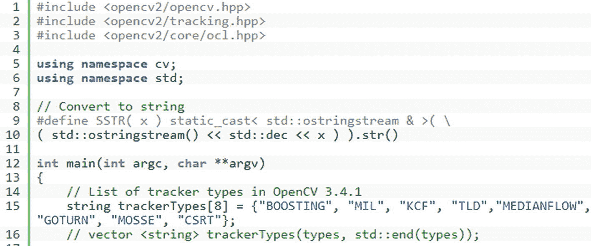

在代码的开始，必须包含 OpenCV 和跟踪库，并在 OpenCV 3.4.1 中添加一个跟踪器类型列表。

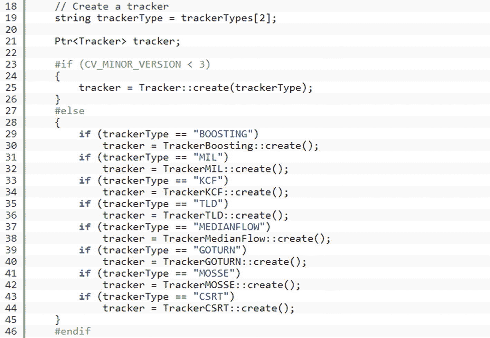

在此部分中，已经创建了一个跟踪器，将使用之前添加的所有跟踪器类型。

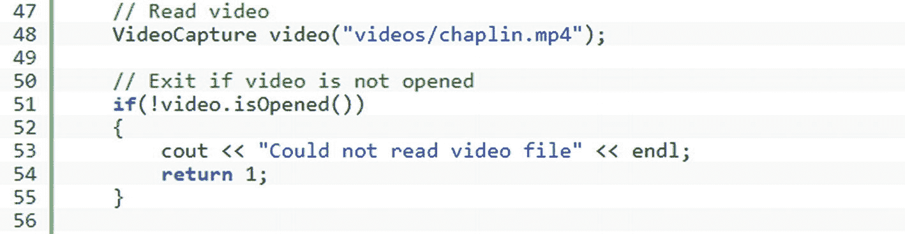

在这部分代码中，视频被读取，您必须在 VideoCapture 中指定视频文件的路径。

视频帧将在 while 循环中读取。然后，将创建一个边界框，然后根据跟踪器类型，它将在视频帧上显示适当的结果。

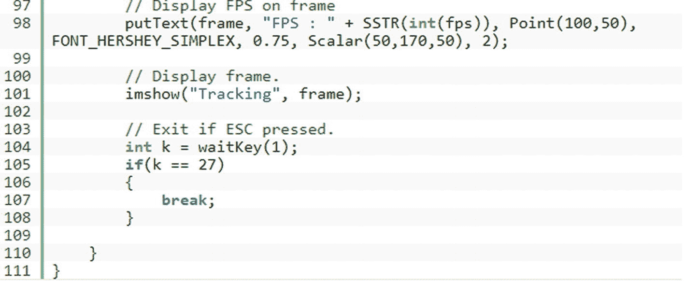

最后，在跟踪完成并创建边界框后，该帧显示在屏幕上。函数 *imshow* 处理在用户界面中显示完全渲染的帧。if 语句处理按下退出键取消跟踪的情况。

在这一部分中，我们将介绍几种不同的跟踪算法。目的是获得每一个追踪者的真实知识，而不是一片高深的理论知识。

首先，我将介绍一些基本的跟踪概念。我们的跟踪目标是在精确跟踪(或几乎所有)先前帧中的对象之后，在整个当前帧中定位该对象。运动模型似乎只是一种很好的方式来说明你知道物体在后续帧中的位置和速度(速度+运动方向)。我们可以根据当前的运动模型来估计新的位置，除非我们不能检测或分析对象；因此，必须相对熟悉目标是什么，以便实时检测它的位置。您可以创建描述对象外观的外观模型。为了更准确地预测对象的位置，可以利用该外观模型在运动模型的预测位置的微小邻域内进行搜索。正面(对象)和负面(上下文)实例被馈送到分类器来训练它。让我们来看看不同的跟踪算法是如何解决在线训练问题的。

#### 助推追踪器

该追踪器基于 AdaBoost 的在线版本，AdaBoost 是基于 Haar cascade 的人脸检测器的内部算法。在运行时，该分类器必须针对对象的正实例和负实例进行调整。对新帧中前一位置附近的每个像素运行分类器，并记录分类器的分数。对象的新位置是得分最高的位置。结果，我们现在又有了一个分类器的正面例子。因为接收到更多的帧，所以用新的信息修改分类器。

优点:它的算法已经有十多年的历史了，仍然在工作，但我想不出更好的目的来做这件事，因为还有其他专业的追踪器(MIL，KCF)，它们按照类似的原理工作。

缺点:跟踪方面的输出一般。每当跟踪不起作用时，它并不总是能理解。

##### 一千个追踪器

它类似于助推追踪器。主要区别在于，它不是只找到对象的当前位置作为正面例子，而是在当前位置周围的一个小社区中搜索许多可能的正面例子。在 MIL 中你不指定正反例；相反，您可以指定阳性和阴性“包装”积极袋的一系列照片并不完全由积极的例子组成。而是只要一张乐观包里的图就一定是很好的说明！在我们的示例中，正口袋包含基于对象当前位置的补丁以及来自其周围小社区的补丁。

优点:成绩优秀。它不会比增强跟踪器漂移得更多，所以当部分模糊时，它的表现令人钦佩。这可能是更好的跟踪器，除非你使用 OpenCV 3.0。但是，如果您使用的是更高版本，KCF 是一个不错的选择。

缺点:跟踪的误差没有准确记录。完全闭塞后，不愈合。

#### 内核化相关滤波器(KCF)

前两个追踪器中讨论的思想在内核化校正过滤器追踪器中得到扩展。这种追踪器结合了 MIL 追踪器的多个阳性样本，包括广泛的相互作用区域。这项并行研究定义了一些有趣的几何参数，这个跟踪器使用这些参数来使跟踪更快、更精确。

优点:在准确性和速度以及报告跟踪失败方面，它优于 BOOSTING 和 MIL。如果您使用 OpenCV 3.1 或更高版本，我建议在大多数应用中使用这种方法。

缺点:完全梗阻后，不恢复。

##### 媒体流跟踪器

探测器从内部计算一段时间内物体向前和向后轨迹之间的差异。它可以准确地检测跟踪误差，并通过减少前向/后向误差在剪辑序列中选取准确的轨迹。在我的实验中，我发现这种追踪器在运动很小且可预测时有效。该跟踪器可以检测跟踪失败的时间，并相应地停止，但是即使跟踪失败，其他跟踪器也会继续运行。

优点:出色的监控故障报告。如果一个运动是可预测的，并且没有收缩，这种技术非常有效。

缺点:运动很多的时候会失速。

##### GOTURN 跟踪器

它是整个跟踪器类中唯一使用卷积神经网络(CNN)的跟踪算法。我们知道 OpenCV 的文档“对预期的修改、光照变化和缺陷是可靠的”。

**待考虑:**GOTURN 使用的是 Caffe 模型，这是一个基于 CNN 的追踪器。

##### 摩西跟踪者

MOSSE 代表最小输出误差平方和。当用单个帧初始化时，自适应相关用于对象跟踪，产生平衡的关联滤波。光照、长度、姿势和非刚性变形的变化不会影响 MOSSE 追踪器。

误差平方的最大平均比率通常用于识别变形，允许跟踪器停止和重新启动，只要对象出现，跟踪器就离开。它确实使用简单，可靠，而且比其他复杂的追踪器要快得多。然而，在准确性方面，它落后于基于深度学习的追踪器。

##### CSRT 跟踪器

在具有信道和空间可靠性的判别相关滤波器(DCF-CSR)中使用空间可靠性映射，以通过用于跟踪的框架将滤波器辅助改变到指定位置的部分。它只利用了两个标准特性(猪和颜色名称)。它还具有较低的帧速率(25 fps)，但具有更好的对象跟踪可靠性。

### c)图像到文本的分析

#### 使用 C++ OCR 库，将图像转换为文本

OCR(光学字符识别)技术允许您将图像或扫描文档中的文本解释和翻译成人类可理解的文本。从优惠券上读取代码、创建可格式化的文本、自助商店、将印刷信息转换成数字版本等等，只是 OCR 的几个应用。市场上似乎有各种各样的 OCR 软件和库，但 OCR 测试的准确性至关重要。在这一节中，我将向您展示如何使用 C++来构建我们自己的 OCR 软件并将图像转换为文本。

#### 使用 C++将图像页面转换成文本

让我们从一个场景开始，在这个场景中，图片包括几行文本。如果您有一本每页有大量文本行的扫描书，可能就是这种情况。在这种情况下，将图像转换为文本的步骤如下。

在字符串变量中，存储图像的方向。

创建一个缓冲区来保存 OCR 结果。

aspose::ocr::page(const char * image path，wchar t *buffer，size t buffer size)函数用于执行 OCR。

结果可以打印或保存到文件中。

下面的程序示例演示了如何使用 C++进行 OCR 并将图像转换为文本:

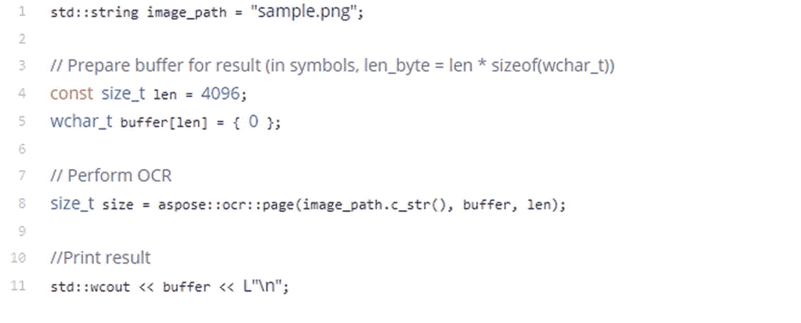

#### 使用 C++，对图像执行单行 OCR

在前面的例子中，我们转换了一个有多行文本的图像。当图片只有单行文本时，例如标题或标语，可能就是这种情况。在这种情况下，执行 OCR 的步骤如下:

*   要设置图像的方向，请使用一个字符串变量。

*   要保存 OCR 数据，请创建缓冲区。

*   aspose::ocr::line(const char * image path，wchar t *buffer，size t buffer size)函数用于执行 OCR。

*   OCR 结果可以保存或打印。

下面的代码示例演示了如何使用 C++对带有一小段文本的图片实现 OCR:

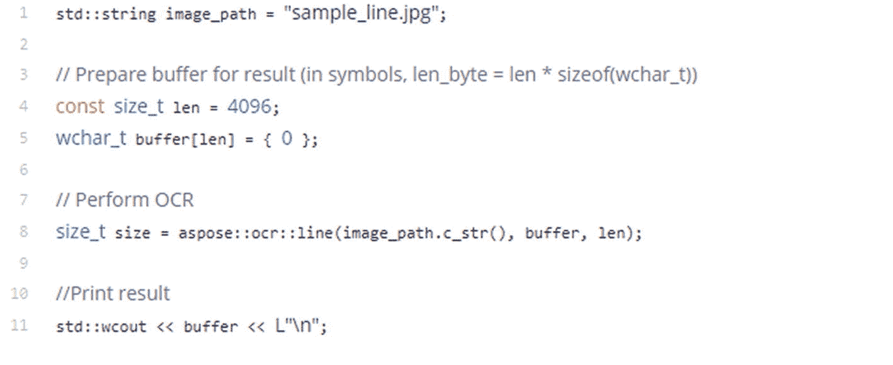

#### 在 C++中，将图像的特定区域转换为文本

您还可以配置 API，将 OCR 限制在图像的特定区域。在整个场景中，您可以通过在图像上绘制一个矩形来访问所需的区域。从图像的特定区域提取文本的步骤如下:

*   在变量中，存储图像的方向。

*   制作一个缓冲区来保存 OCR 结果。

*   aspose::ocr::page rect(const char * image path，wchar t *buffer，size t buffer size，int x，int y，int w，int h)函数用于执行 OCR。

*   应该打印 OCR 结果。

下面的 C++代码示例演示如何将图像的特定区域转换为文本:

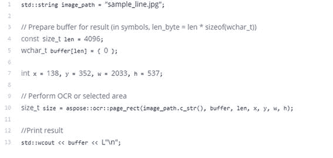