# 四、VGGNet 和 AlexNet 网络

> *一旦我们接受了自己的极限，我们就会超越它们。*—阿尔伯特·爱因斯坦
> 
> T5】

在某一点之后，即使是极其复杂的解决方案也不再改进。然后我们应该改进解决方案的设计。我们回到绘图板，集思广益，提高能力。有了更多可用的选项，我们可以迭代和测试多个解决方案。然后根据手头的业务问题，选择并实施最佳解决方案。我们在深度学习架构中遵循同样的原则。我们致力于网络架构，并对其进行改进，使其更加健壮、准确和高效。神经网络体系结构的选择是基于对各种体系结构进行的测试。

在上一章中，我们从 LeNet 深度学习架构开始。我们浏览了网络架构，并使用它开发了用例。在本章中，我们将讨论 VGG 和 AlexNet 神经网络架构，并开发一个复杂的多类分类功能。我们还将比较这两种架构的性能。与此同时，我们将讨论如何在训练深度学习模型时使用检查点。在生成混淆矩阵时，我们面临一个常见的错误；我们会明白错误的原因以及如何纠正它。

我们将在本章中讨论以下主题:

1.  AlexNet 架构

2.  VGG16 体系结构

3.  VGG16 和 VGG19 的区别

4.  使用 AlexNet 的 CIFAR-10 案例研究

5.  使用 VGG16 的 CIFAR-10 案例研究

欢迎来到第四章，祝一切顺利！

## 4.1 技术要求

本章的代码和数据集上传到本书的 GitHub 链接 [`https://github.com/Apress/computer-vision-using-deep-learning/tree/main/Chapter4`](https://github.com/Apress/computer-vision-using-deep-learning/tree/main/Chapter4) 。我们将使用朱庇特笔记本。对于这一章，CPU 足以执行代码，但如果需要，您可以使用谷歌合作实验室。如果你不能自己设置 Google Colab，你可以参考这本书的参考资料。

让我们在下一部分继续深入学习架构。

## 4.2 AlexNet 和 VGG 神经网络

AlexNet 于 2012 年推出，立即成为每个人的最爱，用于图像和对象分类。它还赢得了 ImageNet 大规模视觉识别挑战赛(ILSVRC)。随后，VGG 在 2014 年应运而生，其准确性被证明优于 AlexNet。这并不意味着 AlexNet 不是一个有效的网络，它只是意味着 VGG 有更好的准确性。

现在让我们详细了解这两种架构。我们从 AlexNet 作为第一个架构开始。

## 4.3 什么是 AlexNet 神经网络？

AlexNet 是由 Alex Krizhevsky、Ilya Sutskever 和 Geoffrey E. Hinton 提出的。论文原文可在 [`https://papers.nips.cc/paper/4824-imagenet-classification-with-deep-convolutional-neural-networks.pdf`](https://papers.nips.cc/paper/4824-imagenet-classification-with-deep-convolutional-neural-networks.pdf) 访问。

AlexNet 架构看起来如图 [4-1](#Fig1) 所示。这是来自上述论文的原始图像。


图 4-1

完整的 AlexNet 架构(图片取自 [`https://papers.nips.cc/paper/4824-imagenet- classification-with-deep-convolutional-neural-networks.pdf`](https://papers.nips.cc/paper/2012/file/c399862d3b9d6b76c8436e924a68c45b-Paper.pdf) )

我们现在可以更详细地探索各个层。表 [4-1](#Tab1) 给出了网络所有层的描述。

表 4-1

网络的每一层和相应的输入参数、信道大小、步幅和激活函数

<colgroup><col class="tcol1 align-center"> <col class="tcol2 align-center"></colgroup> 
| -  |

如我们所见，第一层是大小为 227x227x3 的输入图像。它通过 96 个特征映射的第一卷积层，步幅为 4，滤波器大小为 11×11，激活函数为 ReLU。输出图像的尺寸为 55x55x96。

接下来是最大池层，过滤器大小为 3×3，跨距为 2，输出图像尺寸为 27×27×96。您可以以这种方式继续分析每一层。必须完全理解每一层及其各自的功能。

AlexNet 拥有 6000 万个参数和 65 万个神经元。我们可以观察到，总共有八层。前五层用于执行卷积运算。最后三层是完全连接的一层。在卷积层中，少数具有以下层作为最大池层。在 AlexNet 中使用 ReLU 非线性，与 tanh 和 sigmoid 激活相比，它显示了改进的训练性能和更快的网络训练。发明人使用数据增加和丢弃层来对抗网络中的过拟合。

现在让我们理解 VGG 架构，然后我们将使用 AlexNet 和 VGG 开发用例。

## 4.4 什么是 VGG 神经网络？

VGGNet 是由牛津大学的卡伦·西蒙扬和安德鲁·齐泽曼提出的 CNN 架构。VGG 是视觉几何组。您可以在 [`https://arxiv.org/pdf/1409.1556.pdf`](https://arxiv.org/pdf/1409.1556.pdf) 访问原文。

它于 2014 年推出，在 ImageNet 大规模视觉识别挑战赛(ILSVRC)中表现出色。它是最受欢迎的深度学习架构之一，因为它简单(我们将在下面的章节中研究)。通常，人们批评网络的规模，因为它需要更多的计算能力和更多的时间。但是该网络是一个非常健壮的解决方案，并且被称为计算机视觉解决方案的标准解决方案之一。

VGG 神经网络模型有两种形式: *VGG16* 和 *VGG19* 。让我们详细研究一下 VGG16，然后我们将考察 VGG19 与 VGG16 有何不同。

## 4.5 VGG16 体系结构

VGG 是一个容易理解的网络，原因如下:

1.  它在整个网络中仅使用 3×3 卷积和 2×2 池。

2.  卷积层使用非常小的内核大小(3x3)。

3.  有 1x1 卷积来线性变换输入。

4.  跨距为 1 个像素，有助于保持空间分辨率。

5.  ReLU 用于所有隐藏层。

6.  有三个完全连接的层，前两层有 4096 个通道，最后一层有 1000 个通道。最后，我们有一个 softmax 层。

在图 [4-2](#Fig2) 中，我们可以看到各自的配置以及每一层的描述。

 

图 4-2

VGG 简单网络

请注意，它在整个网络中仅使用 3x3 conv 层和 2x2 池层。左边的图取自前面引用的原始论文。随着层的增加，配置的深度从左(A)到右(E)增加。conv 层参数表示为“conv(感受野大小)–(通道数量)”为了简洁起见，没有显示 ReLU 激活功能。

Note

不使用 LRN(局部反应标准化),因为尽管训练时间增加，但准确性没有明显提高。

VGG16 是一个相当受欢迎的网络。由于其简单性，它可以作为衡量许多复杂图像分类问题的性能的基准。VGG19 比 VGG16 稍微复杂一些。接下来将研究两者之间的差异。

## 4.6 vgg 16 和 VGG19 的区别

表 4-2 列出了 VGG16 和 VGG19 之间的主要区别。一般 VGG16 用的最多，也比较普及。这是因为在一般的商业世界中，我们不会对一个问题进行八到十类以上的分类。此外，没有获得真正有代表性和平衡的数据。因此，在实践中，VGG16 是最常用的。

表 4-2

VGG16 和 VGG19 的主要区别

<colgroup><col class="tcol1 align-center"> <col class="tcol2 align-center"></colgroup> 
| - 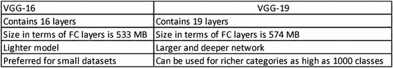 |

我们现在将使用 AlexNet 和 VGG16 在 CIFAR-10 数据集上开发用例。CIFAR-10 是一个开源数据集。

## 4.7 使用 AlexNet 和 VGG 开发解决方案

我们将使用 CIFAR 数据集通过 AlexNet 和 VGGNet 创建解决方案。可以在 www.cs.toronto.edu/~kriz/cifar.html.访问 CIFAR 数据集

根据数据集来源:

> *CIFAR-10 数据集由 10 类 60000 张 32x32 彩色图像组成，每类 6000 张。有 50000 个训练图像和 10000 个测试图像。数据集分为五个训练批次和一个测试批次，每个批次有 10000 幅图像。测试批次包含从每个类别中随机选择的 1000 个图像。训练批次以随机顺序包含剩余的图像，但是一些训练批次可能包含来自一个类别的比来自另一个类别的更多的图像。在它们之间，训练批次正好包含来自每个类的 5000 个图像。这些类是完全互斥的。汽车和卡车之间没有重叠。“汽车”包括轿车、SUV 等。而“卡车”只包括大卡车。两者都不包括皮卡车。*

CIFAR-10 数据集如图 [4-3](#Fig3) 所示。

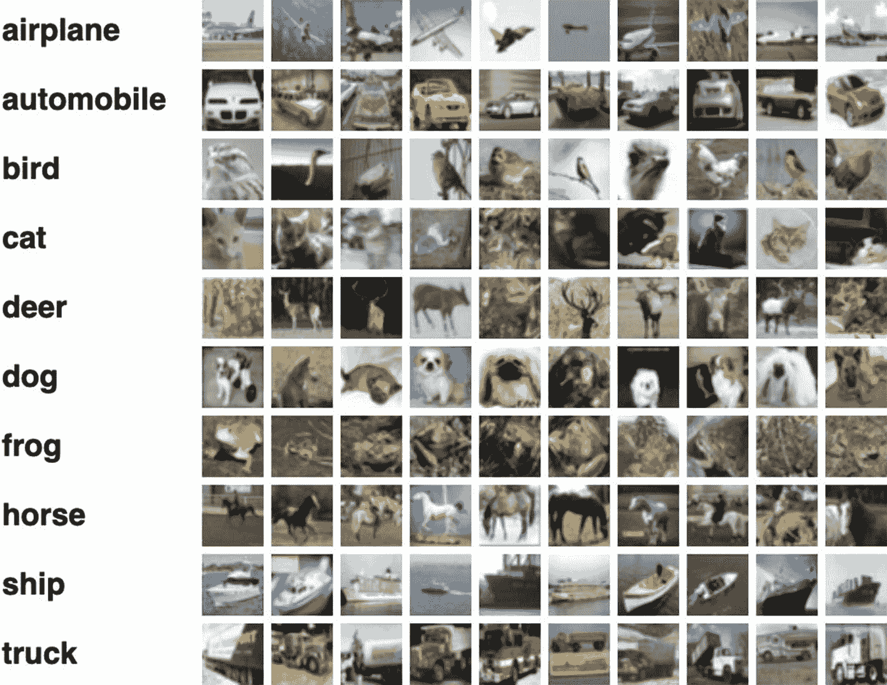

图 4-3

CIFAR-10 数据集中的类以及每个类的一些示例。CIFAR-10 数据集是用于测试神经网络功效的流行数据集之一

CIFAR-100 数据集与 CIFAR-10 非常相似，只是它有 100 个类，每个类包含 600 幅图像。每个类有 500 个训练图像和 100 个测试图像。CIFAR-100 中的 100 个类被分成 20 个超类。每个图像都有一个“精细”标签(它所属的类)和一个“粗糙”标签(它所属的超类)。

图 [4-4](#Fig4) 提供了 CIFAR-100 中的等级列表。每个超类都有子类。例如，苹果、蘑菇、橙子、梨等等是子类，它们的超类是水果和蔬菜。

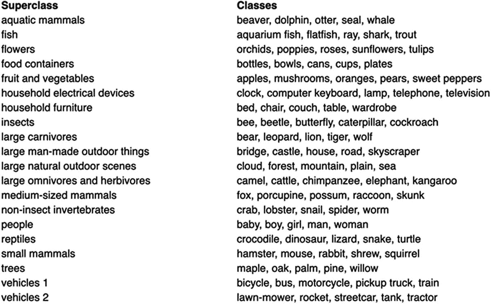

图 4-4

CIFAR-100 数据集中所有超类和类的列表

是时候使用 AlexNet 和 VGG16 开发用例了。

## 4.8 使用 AlexNet 在 CIFAR-10 上工作

让我们使用 AlexNet 在 CIFAR-10 上开发一个分类解决方案。

1.  在这里导入所有必要的库，并加载 CIFAR-10 数据集。

    ```py
    import keras
    from keras.datasets import cifar10
    from keras import backend as K
    from keras.layers import Input, Conv2D, GlobalAveragePooling2D, Dense, BatchNormalization, Activation, MaxPooling2D
    from keras.models import Model
    from keras.layers import concatenate,Dropout,Flatten

    ```

2.  这里，我们导入 ModelCheckpoint，它将用于创建检查点，以保存基于验证准确性的最佳模型。配置完设置后，我们将详细研究检查点。

    ```py
    from keras import optimizers,regularizers
    from keras.preprocessing.image import ImageDataGenerator
    from keras.initializers import he_normal
    from keras.callbacks import LearningRateScheduler, TensorBoard, ModelCheckpoint

    ```

3.  接下来，我们用 cifar.load_data()步骤加载 CIFAR-10 数据。(x_train，y_train)，(x_test，y_test) = cifar10.load_data()

4.  Now, preprocess the images by getting the mean and standard deviation and then standardizing them.

    ```py
    mean = np.mean(x_train,axis=(0,1,2,3))
    std = np.std(x_train, axis=(0, 1, 2, 3))
    x_train = (x_train-mean)/(std+1e-7)
    x_test = (x_test-mean)/(std+1e-7)

    ```

    **注意**实验在有和没有步骤 4 的情况下执行代码，以检查已处理和未处理图像之间的性能差异。

5.  现在，让我们创建我们的训练和测试目标变量数据。这一步类似于我们在前一章中开发的解决方案。

    ```py
    y_train = keras.utils.to_categorical(y_train, num_classes)
    y_test = keras.utils.to_categorical(y_test, num_classes)

    ```

    Let us have a look at the dataset.

    ```py
    fig = plt.figure(figsize=(18, 8))
    columns = 5
    rows = 5
    for i in range(1, columns*rows + 1):
       fig.add_subplot(rows, columns, i)
       plt.imshow(X_train[i], interpolation="lanczos")

    ```

    Figure [4-5](#Fig5) shows some of the images from our dataset. Look at the different classes of images we have. Also, examine the resolution and aspect ratio of the images.

    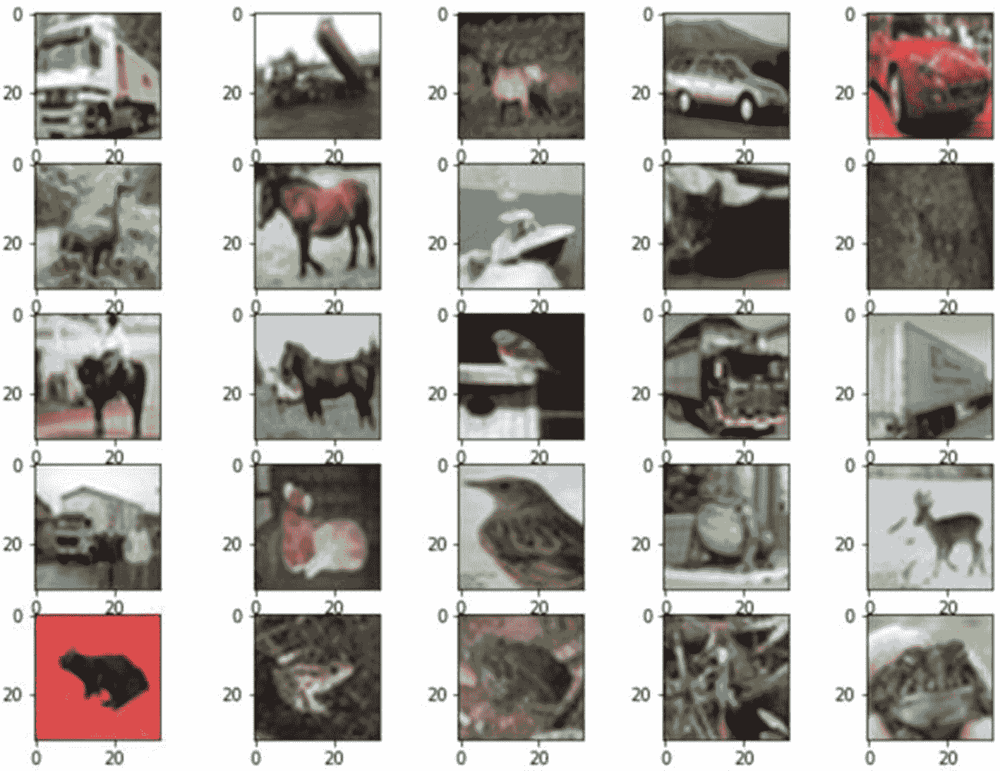

    图 4-5

    此处显示了数据集中的一些示例图像

6.  现在让我们创建 AlexNet 架构。这里，我们将尝试一种不同的方法。我们将定义一个函数来创建网络。在创建 AlexNet 时，我们从网络中定义了参数的卷积层开始。第一层的内核大小为 11×11，96 个通道，跨距为 4×4。网络紧随其后。

    ```py
    def alexnet(img_input,classes=10):
        xnet = Conv2D(96,(11,11),strides=(4,4),padding='same',activation='relu',kernel_initializer='uniform')(img_input)
        xnet = MaxPooling2D(pool_size=(3,3),strides=(2,2),padding='same',data_format=DATA_ FORMAT)(xnet)
        xnet = Conv2D(256,(5,5),strides=(1,1),padding='same', activation="relu",kernel_initializer='uniform')(xnet)
        xnet = MaxPooling2D(pool_size=(3,3),strides=(2,2),padding='same',data_format=DATA_ FORMAT)(xnet)
        xnet = Conv2D(384,(3,3),strides=(1,1),padding='same', activation="relu",kernel_initializer='uniform')(xnet)
        xnet = Conv2D(384,(3,3),strides=(1,1),padding='same', activation="relu",kernel_initializer='uniform')(xnet)
        xnet = Conv2D(256,(3,3),strides=(1,1),padding='same', activation="relu",kernel_initializer='uniform')(xnet)
        xnet = MaxPooling2D(pool_size=(3,3),strides=(2,2),padding='same',data_format=DATA_ FORMAT)(xnet)
        xnet = Flatten()(xnet)
        xnet = Dense(4096,activation='relu')(xnet)
        xnet = Dropout(0.25)(xnet)
        xnet = Dense(4096,activation='relu')(xnet)
        xnet = Dropout(0.25)(xnet)
        out_model = Dense(classes, activation="softmax")(xnet)
        return out_model

    ```

    前面函数的输出将是网络。

7.  现在让我们输入 32x32x3 形状的图像。然后，使用 AlexNet 函数得到想要的模型。

    ```py
    img_input=Input(shape=(32,32,3))
    output = alexnet(img_input)
    model=Model(img_input,output)

    ```

8.  然后，我们生成模型的摘要。

    ```py
    model.summary()

    ```

    这是总结。我们有所有的层、各自的输出形状和参数数量(图 [4-6](#Fig6) )。


图 4-6

AlexNet 模型综述。它有 2100 万个参数需要训练

模型摘要表明我们有 2100 万个参数来训练这个 AlexNet 模型。

1.  我们现在需要编译模型，优化器是用来编译基于 Keras 的模型的参数之一。我们在这里使用随机梯度下降(SGD ),学习率为 0.01，动量为 0.8。随意用不同的学习率和动量值迭代。SGD 包括对动量、学习率衰减和内斯特罗夫动量的支持。你必须意识到什么是学习率，我们在前面的章节中已经讨论过了。动量是在相关方向上加速 SGD 并抑制振荡的参数。最后一个参数内斯特罗夫表示是否应用内斯特罗夫动量。

```py
sgd = optimizers.SGD(lr=.01, momentum=0.8, nesterov=True) model.compile(loss='categorical_crossentropy', optimizer=sgd, metrics=['accuracy'])

```

Note

我们在这里使用了 SGD。对 Adam、RMSProp、Adagrad 和 Adadelta 进行实验，比较训练时间和各自的表现。

1.  接下来，我们设置检查点。我们这样做是为了只有当验证准确性提高时，最后保存的模型才会被替换。

    **想知道什么是检查点吗？**

    While we develop our model, the validation accuracy decreases often in the next epoch, and hence we would like to use the accuracy in the earlier epoch. For example, if in the fifth epoch we get 74% accuracy which decreases to 73% in the sixth epoch, we would like to use the fifth epoch and not the sixth. Using checkpoint, we can save the model only when the accuracy has increased and not with each subsequent epoch. If we do not have a checkpoint, we will get only the final model in the final epoch. And it might not be the best performing model. Hence, it is advised to use checkpoints.

    ```py
    filepath="weights.best.hdf5"
    checkpoint = ModelCheckpoint(filepath, monitor="val_acc", verbose=1, save_best_only=True, mode="max")
    callbacks_list = [checkpoint]
    epochs = 50

    ```

2.  现在，让我们使用 ImageDataGenerator 进行数据扩充。它通过实时数据扩充生成批量张量图像数据。数据将(分批)循环。

    ```py
    datagen = ImageDataGenerator(horizontal_flip=True, width_shift_range=0.115, height_shift_range=0.115, fill_mode="constant",cval=0.)
    datagen.fit(x_train)

    ```

3.  开始训练网络。注意，我们已经将回调设置为 callbacks_list，这是我们为模型检查点描述的。

    ```py
    model.fit_generator(datagen.flow(x_train, y_train,batch_size=batch_size), steps_per_epoch=iterations,
    epochs=epochs,
    callbacks=callbacks_list,
    validation_data=(x_test, y_test))

    ```

训练网络后，您将获得以下输出。为了简洁起见，我们只显示了最后的时代。

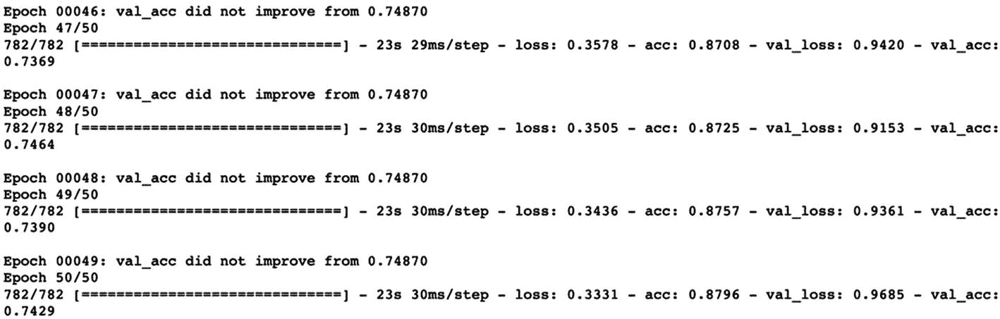

注意，在 50 个时期之后，我们获得了 74.29%的验证准确度。还要注意，如果精度没有提高，模型不会改变最佳精度 74.80%。

1.  现在让我们来衡量一下我们的表现。首先，我们衡量我们的准确性；随之而来的将是损失。代码和图形类似于前一章中生成的代码和图形。

    ```py
    import matplotlib.pyplot as plt
    f, ax = plt.subplots()
    ax.plot([None] + model.history.history['acc'], 'o-') ax.plot([None] + model.history.history['val_acc'], 'x-') ax.legend(['Train acc', 'Validation acc'], loc = 0)
    ax.set_title('Training/Validation acc per Epoch')
    ax.set_xlabel('Epoch')
    ax.set_ylabel('acc')

    ```

下面是输出(图 [4-7](#Fig7) )。

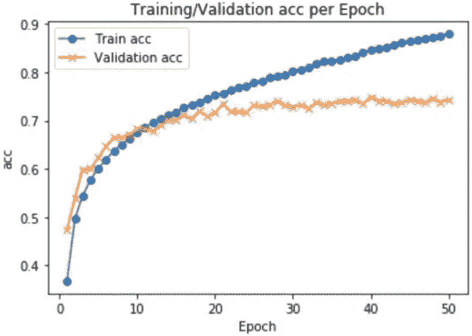

图 4-7

我们正在绘制训练数据集与验证数据集的准确性对比图

1.  现在，让我们来衡量损失。

```py
import matplotlib.pyplot as plt
f, ax = plt.subplots()
ax.plot([None] + model.history.history['loss'], 'o-') ax.plot([None] + model.history.history['val_loss'], 'x-')
ax.legend(['Train loss', 'Validation loss'], loc = 0) ax.set_title('Training/Validation loss per Epoch') ax.set_xlabel('Epoch')
ax.set_ylabel('acc')

```

下面是输出(图 [4-8](#Fig8) )。


图 4-8

此处显示了培训和验证损失

1.  我们现在将使用该模型进行预测，并使用 predict 函数为我们的预测生成混淆矩阵。

1.  当您尝试使用以下函数生成混淆矩阵时，会收到以下错误:

    ```py
    from sklearn.metrics import confusion_matrix import numpy as np
    confusion_matrix(y_test, np.argmax(predictions,axis=1))

    ```

```py
predictions = model.predict(x_test)

```


我们得到这个错误是因为混淆矩阵要求预测值和图像标签都是一位数，而不是一次性编码的向量。我们的 test_values 必须在这里进行转换，它应该会为我们解决错误。

Note

打印预测值和 y_test[1]值以检查差异。

1.  让我们将标签转换为一位数 1，然后我们将生成混淆矩阵。

    ```py
    rounded_labels=np.argmax(y_test, axis=1) rounded_labels[1]
    cm = confusion_matrix(rounded_labels, np.argmax(predictions,axis=1))
    cm

    ```

您将得到下面的混淆矩阵作为最后一条语句的输出。作为一个十类问题，它将生成所有相应十类的值。

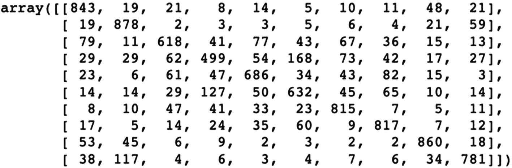

1.  现在定义混淆矩阵函数并生成混淆矩阵:

    ```py
    def plot_confusion_matrix(cm):
       cm = [row/sum(row) for row in cm]
       fig = plt.figure(figsize=(10, 10))
       ax = fig.add_subplot(111)
       cax = ax.matshow(cm, cmap=plt.cm.Oranges) fig.colorbar(cax)
       plt.title('Confusion Matrix') plt.xlabel('Predicted Class IDs')    plt.ylabel('True Class IDs')
       plt.show()

       plot_confusion_matrix(cm)

    ```

前面代码的输出如图 [4-9](#Fig9) 所示。

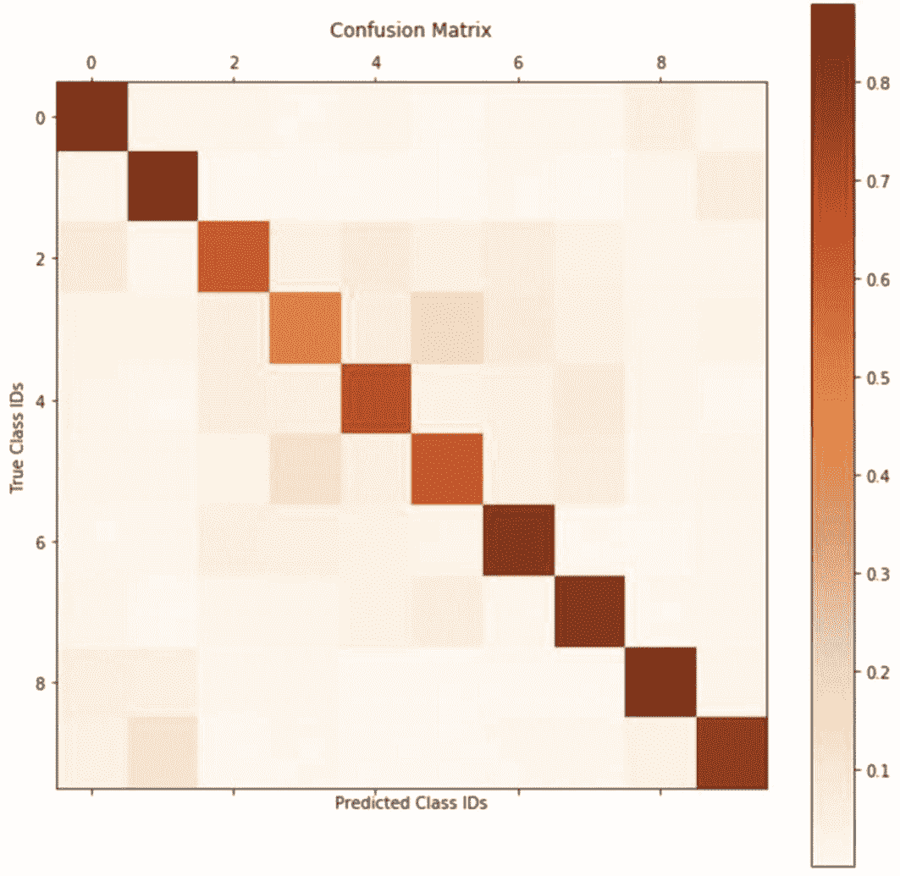

图 4-9

此处显示了问题的混淆矩阵。该网络对一些课程做出了很好的预测。建议通过调整超参数来测试网络

从混淆矩阵可以清楚地看出，网络对某些类别做出了正确的预测。建议您调整超参数，并检查哪些类会因网络变化而受到影响。

在这个用例中，我们使用 AlexNet 在 CIFAR-10 数据集上工作，我们获得了 74.80%的验证准确率。接下来让我们训练我们的 VGG 网络并测量它的性能。

## 4.9 利用 VGG 研究 CIFAR-10

我们现在将使用 VGG 网络在 CIFAR-10 上开发一个分类解决方案。

由于这里的大多数步骤与上一节中的步骤相似，所以我们不会解释所有的代码片段，但是只要与前面的讨论有差异，我们都会详细说明。

1.  导入库。

    ```py
    import keras
    from keras.datasets import cifar10
    from keras.preprocessing.image import ImageDataGenerator
    from keras.models import Sequential
    from keras.callbacks import ModelCheckpoint
    from keras.layers import Dense, Dropout, Activation, Flatten from keras.layers import Conv2D, MaxPooling2D, BatchNormalization
    from keras import optimizers
    import numpy as np
    from keras.layers.core import Lambda
    from keras import backend as K
    from keras import regularizers
    import matplotlib.pyplot as plt
    import warnings warnings.filterwarnings("ignore")

    ```

2.  设置你的超参数。

    ```py
    number_classes = 10
    wght_decay = 0.00005
    x_shape = [32,32,3]
    batch_size = 64
    maxepoches = 30
    learning_rate = 0.1
    learning_decay = 1e-6
    learning_drop = 20

    ```

3.  加载数据并生成一些图像。

    ```py
    (x_train, y_train), (x_test, y_test) = cifar10.load_data()
    x_train = x_train.astype('float32')
    x_test = x_test.astype('float32')
    fig = plt.figure(figsize=(18, 8))
    columns = 5
    rows = 5
    for i in range(1, columns*rows + 1):
       fig.add_subplot(rows, columns, i)
       plt.imshow(x_train[i], interpolation="lanczos")

    ```

4.  标准化图像数据。

    ```py
    mean = np.mean(x_train,axis=(0,1,2,3))
    std = np.std(x_train, axis=(0, 1, 2, 3))
    x_train = (x_train-mean)/(std+1e-7)
    x_test = (x_test-mean)/(std+1e-7)
    y_train = keras.utils.to_categorical(y_train, number_classes)
    y_test = keras.utils.to_categorical(y_test, number_classes)

    ```

5.  立即创建您的 VGG16 模型。

    ```py
    model = Sequential()
    model.add(Conv2D(64, (3, 3), padding="same",
    input_shape=x_shape,kernel_regularizer=regularizers.l2(wght_decay))) model.add(Activation('relu'))
    model.add(BatchNormalization())
    model.add(Dropout(0.3))
    model.add(Conv2D(64, (3, 3), padding="same",kernel_regularizer=regularizers.l2(wght_decay)))
    model.add(Activation('relu'))
    model.add(BatchNormalization())
    model.add(MaxPooling2D(pool_size=(2, 2)))
    model.add(Conv2D(128, (3, 3), padding="same",kernel_regularizer=regularizers.l2(wght_decay)))
    model.add(Activation('relu'))
    model.add(BatchNormalization())
    model.add(Dropout(0.4))
    model.add(Conv2D(128, (3, 3), padding="same",kernel_regularizer=regularizers.l2(wght_decay)))
    model.add(Activation('relu'))
    model.add(BatchNormalization())
    model.add(MaxPooling2D(pool_size=(2, 2)))
    model.add(Conv2D(256, (3, 3), padding="same",kernel_regularizer=regularizers.l2(wght_decay))) model.add(Activation('relu'))
    model.add(BatchNormalization())
    model.add(Dropout(0.4))
    model.add(Conv2D(256, (3, 3), padding="same",kernel_regularizer=regularizers.l2(wght_decay))) model.add(Activation('relu'))
    model.add(BatchNormalization())
    model.add(Dropout(0.4))
    model.add(Conv2D(256, (3, 3), padding="same",kernel_regularizer=regularizers.l2(wght_decay))) model.add(Activation('relu'))
    model.add(BatchNormalization())
    model.add(MaxPooling2D(pool_size=(2, 2)))
    model.add(Conv2D(512, (3, 3), padding="same",kernel_regularizer=regularizers.l2(wght_decay))) model.add(Activation('relu'))
    model.add(BatchNormalization())
    model.add(Dropout(0.4))
    model.add(Conv2D(512, (3, 3), padding="same",kernel_regularizer=regularizers.l2(wght_decay))) model.add(Activation('relu'))
    model.add(BatchNormalization())
    model.add(Dropout(0.4))
    model.add(Conv2D(512, (3, 3), padding="same",kernel_regularizer=regularizers.l2(wght_decay))) model.add(Activation('relu'))
    model.add(BatchNormalization())
    model.add(MaxPooling2D(pool_size=(2, 2)))
    model.add(Conv2D(512, (3, 3), padding="same",kernel_regularizer=regularizers.l2(wght_decay)))
    model.add(Activation('relu'))
    model.add(BatchNormalization())
    model.add(Dropout(0.4))
    model.add(Conv2D(512, (3, 3), padding="same",kernel_regularizer=regularizers.l2(wght_decay)))
    model.add(Activation('relu'))
    model.add(BatchNormalization())
    model.add(Dropout(0.4))
    model.add(Conv2D(512, (3, 3), padding="same",kernel_regularizer=regularizers.l2(wght_decay))) model.add(Activation('relu'))
    model.add(BatchNormalization())
    model.add(MaxPooling2D(pool_size=(2, 2))) model.add(Dropout(0.5))
    model.add(Flatten()) model.add(Dense(512,kernel_regularizer=regularizers.l2(wght_decay))) model.add(Activation('relu'))
    model.add(BatchNormalization())
    model.add(Dropout(0.5)) model.add(Dense(number_classes)) model.add(Activation('softmax'))

    ```

6.  生成模型摘要。

1.  从图像增强步骤到拟合 VGG 网络，步骤与上一节中的 AlexNet 示例完全相同。

    ```py
    image_augm = ImageDataGenerator( featurewise_center=False, samplewise_center=False, featurewise_std_normalization=False, samplewise_std_normalization=False, zca_whitening=False, rotation_range=12, width_shift_range=0.2, height_shift_range=0.1, horizontal_flip=True, vertical_flip=False)
    image_augm.fit(x_train)
    sgd = optimizers.SGD(lr=learning_rate, decay=learning_decay, momentum=0.9, nesterov=True)
    model.compile(loss='categorical_crossentropy', optimizer=sgd,metrics=['accuracy'])
    filepath="weights.best.hdf5"
    checkpoint = ModelCheckpoint(filepath, monitor="val_acc", verbose=1,
    save_best_only=True, mode="max")
    callbacks_list = [checkpoint]
    trained_model = model.fit_generator(image_augm.flow(x_train, y_train, batch_size=batch_size), steps_per_epoch=x_train.shape[0]//batch_size,
    epochs=maxepoches,
    validation_data=(x_test, y_test),callbacks=callbacks_list,verbose=1)

    ```

```py
model.summary()

```

当你训练你的模型时，你将得到这个输出。我们只展示最后的时代。

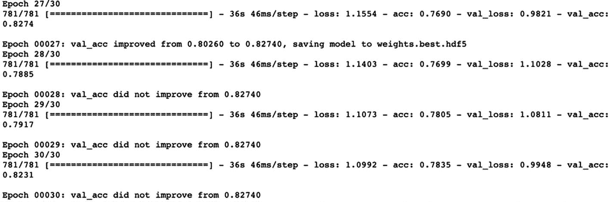

最佳验证准确率为 82.74%。

1.  画出精确度量，最后画出混淆矩阵。代码和 AlexNet 用的一模一样。

这是精度图(图 [4-10](#Fig10) )。


图 4-10

VGG 网络的训练和验证准确度图

这里是损失图(图 [4-11](#Fig11) )。

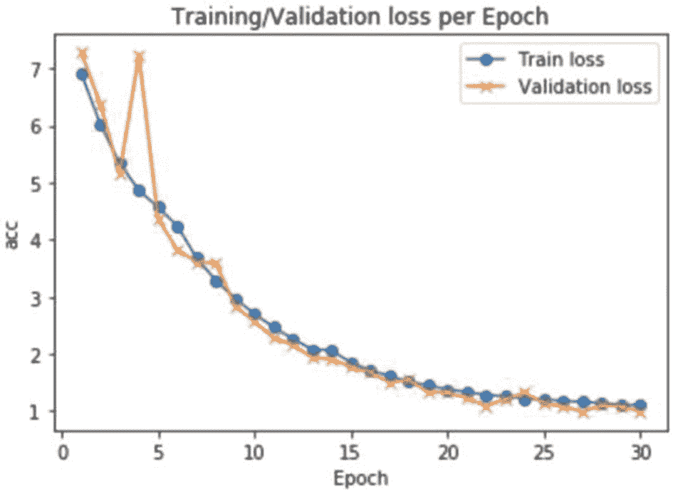

图 4-11

VGG 网络的训练和验证损失图

这是混淆矩阵:


下面是混淆矩阵图(图 [4-12](#Fig12) )。

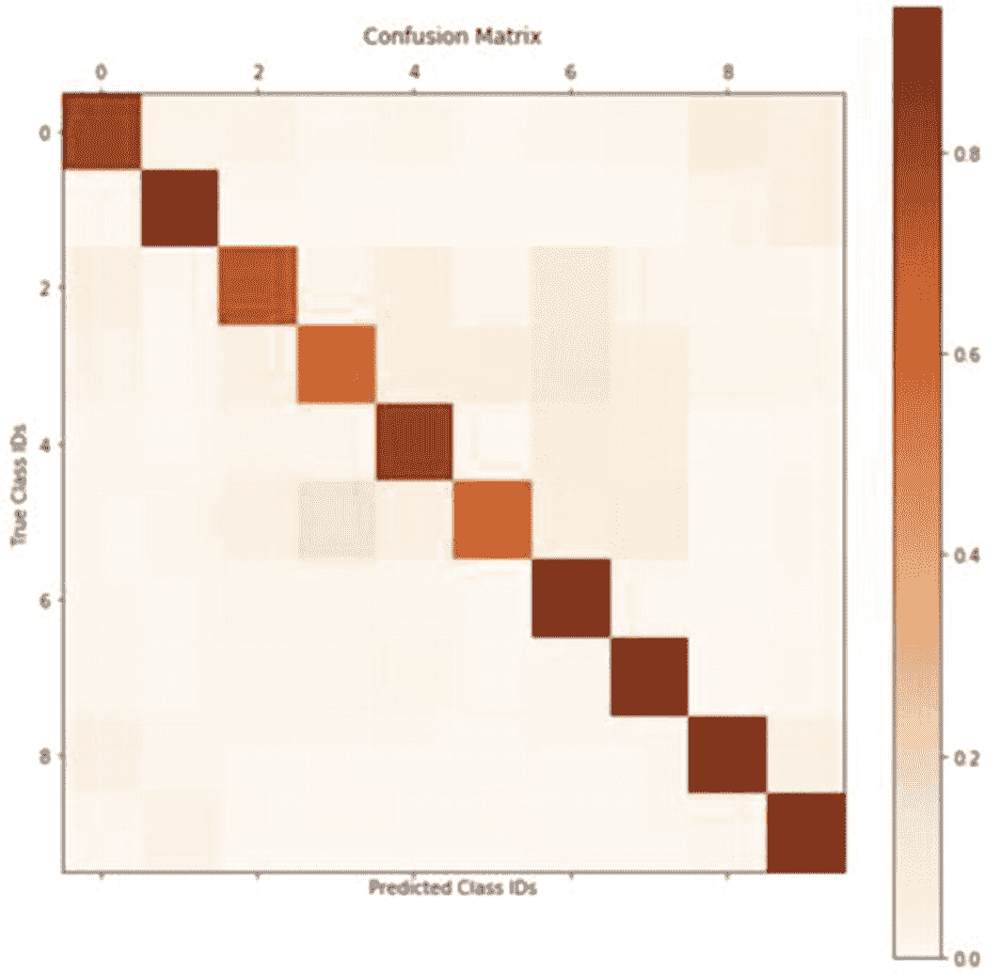

图 4-12

为 VGG 图生成的混淆矩阵

请注意，验证损失**比训练准确度**小。我们通常期望训练精度高于测试精度，但是这里我们看到了相反的情况。其原因如下:

1.  当我们使用 Keras 生成深度学习解决方案时，有两种模式，即训练和测试。在测试阶段，辍学或 L1/L2 体重调整被关闭。

2.  我们计算每批训练数据的平均损失以获得训练损失，而为了计算测试损失，使用模型并在时期结束时进行；因此，测试损失较低。

3.  此外，随着时间的推移，我们通过训练不断地改变模型，因此最初批次中计算的损失大多高于最终批次。

一般来说，你会发现测试精度低于训练精度。如果测试精度远低于训练精度，我们称之为*过拟合*，我们已经在第 [1](1.html) 章中讨论过。我们将在本书后面的章节中再次详细探讨这个概念。

我们现在将比较这两种模型的性能。

## 4.10 比较 AlexNet 和 VGG

如果我们对比 AlexNet 和 VGGNet 的性能，我们会发现

1.  VGG 的验证准确率高于 AlexNet(分别为 82.74%和 74.80%)。

2.  混淆矩阵显示，与 AlexNet 相比，VGG 预测了更高数量的正确类别。

但这并不意味着我们可以概括 VGG 的表现总是比 AlexNet 更好。根据数据集和手头的业务问题，我们测试这两个网络。

注意，对于我们讨论的例子，AlexNet 被训练了 50 个时期，相比之下，VGGNet 被训练了 30 个时期。试着训练相同的历元数，分析差异。

在决定挑选网络时，我们比较了这两种体系结构。我们比较了所需的训练时间、数据集要求、历元方向的移动以及最终的精度 KPI。然后我们得出结论。

这两种架构在深度学习社区中都经常被引用和推崇。

## 4.11 使用 CIFAR-100

建议您对 CIFAR-100 数据集使用类似的代码。代码中有一些变化，如下所示。

导入库时，不要导入 cifar10，而是导入 cifar100。

```py
from keras.datasets import cifar100

```

类似地，加载 CIFAR-100 的数据集。

```py
(x_train, y_train), (x_test, y_test) = cifar100.load_data()

```

班级人数是 100 人而不是 10 人。凡是提到班级人数的地方，都改成 100。然后拟合模型，分析结果。

至此，我们已经使用数据集完成了 Python 代码的实现。我们现在可以进行本章的总结了。

## 4.12 摘要

在本章中，我们介绍了 AlexNet 和 VGGNet，并使用 CIFAR 数据集创建了解决方案。

这两个网络通常用于测试任何基于计算机视觉的解决方案。它们易于理解，实施起来也很快。

AlexNet 和 VGG 在论文和文献中被多次引用。它们也广泛应用于许多实际解决方案中。在实际实施过程中，数据集的质量将决定网络的预测能力。因此，如果您使用网络在自定义数据集上实现，则需要对图像的收集进行尽职调查。

需要注意的重要一点是，数据集应该代表真实世界的业务场景。如果数据集没有捕获真实世界的业务场景，解决方案将无法解决业务问题。而且大量的时间和资源都花在了获取数据集上。我们将在本书的最后一章中再次讨论这些概念——在这一章中，我们将详细讨论这些需求。

现在，让我们转向下一个架构，开发更多实际的用例。让我们继续这段旅程吧！

你现在应该能回答练习中的问题了！

Review Exercises

1.  AlexNet 和 VGG16 有什么区别？

2.  解释检查点的意义。

3.  使用上一章中使用的德国交通标志数据集，并对其拟合 VGG16 和 VGG19。比较两个模型的精确度。

4.  了解 VGG16 和 AlexNet 的行业实现。

5.  从 [`https://data.mendeley.com/datasets/4drtyfjtfy/1`](https://data.mendeley.com/datasets/4drtyfjtfy/1) 下载用于影像分类的多类天气数据集。开发 AlexNet 和 VGG 网络并比较其准确性。

6.  从 [`https://data.mendeley.com/datasets/5y9wdsg2zt/2`](https://data.mendeley.com/datasets/5y9wdsg2zt/2) 获取用于分类的混凝土裂缝图像数据集，并开发 VGG16 和 VGG19 解决方案。

### 进一步阅读

1.  AlexNet 原创论文在 [`https://papers.nips.cc/paper/4824-imagenet- classification-with-deep-convolutional-neural-networks.pdf`](https://papers.nips.cc/paper/2012/file/c399862d3b9d6b76c8436e924a68c45b-Paper.pdf) 。

2.  VGG16 原纸在 [`https://arxiv.org/pdf/1409.1556.pdf`](https://arxiv.org/pdf/1409.1556.pdf) 。

3.  关于 CIFAR-10 的论文可在 [`https://paperswithcode.com/sota/image-classification-on-cifar-10`](https://paperswithcode.com/sota/image-classification-on-cifar-10) 查阅。

4.  关于 CIFAR-100 的论文可在 [`https://paperswithcode.com/sota/image-classification-on-cifar-100`](https://paperswithcode.com/sota/image-classification-on-cifar-100) 查阅。