# 五、使用深度学习的对象检测

> *仅仅因为某样东西没有按照你的计划去做，并不意味着它是无用的。*—托马斯·爱迪生
> 
> T5】

为了解决一个特定的问题，我们会尝试多种解决方案，很多时候经过几次迭代，我们会找到最佳解决方案。机器学习和深度学习没什么区别。在发现阶段，进行改进和不断修改，以提高先前版本算法的性能。在最后一个阶段观察到的弱点、计算的缓慢、分类的不正确——都为更好的解决方案铺平了道路。

在上两章中，我们了解并创建了将图像分类为二进制或多类的解决方案。但是大多数图像中只有一个物体。我们没有识别出图像中物体的位置。我们只是简单地说物体是否出现在图像中。

在这一章中，我们将识别任何图像中的对象。同时，它的位置也将通过在其周围创建一个边界框来确定。这比我们迄今为止开发的图像分类解决方案领先了一步。

有相当多的对象检测架构，如 R-CNN、快速 R-CNN、更快 R-CNN、SSD(单次多盒检测器)和 YOLO(你只看一次)。

我们将在本章中研究这些网络架构，并为其创建 Python 解决方案。

我们将在本章中讨论以下主题:

1.  对象检测和用例

2.  R-CNN、快速 R-CNN 和更快 R-CNN 架构

3.  单发多盒探测器

4.  你只看一次(YOLO)

5.  算法的 Python 实现

欢迎来到第五章，祝一切顺利！

## 5.1 技术要求

本章的代码和数据集上传到本书的 GitHub 链接 [`https://github.com/Apress/computer-vision-using-deep-learning/tree/main/Chapter5`](https://github.com/Apress/computer-vision-using-deep-learning/tree/main/Chapter5) 。一如既往，本章我们将使用 Python Jupyter 笔记本。对于这一章，可能需要一个 GPU 来执行代码，您可以使用 Google Colaboratory。设置 Google Colab 的说明。与本书最后一章相同。

让我们在下一部分继续深入学习架构。

## 5.2 物体检测

对象检测是机器学习和深度学习领域中被引用和认可最多的解决方案之一。这是一个相当新颖的解决方案，解决起来非常有趣。对象检测的用例相当多。因此，组织和研究人员正在花费大量的时间和资源来发现这种能力。顾名思义，目标检测是一种在图像或视频中定位目标的计算机视觉技术。该检测也可以在实况流视频中进行。当我们人类看图片时，我们可以快速识别图像中的对象及其各自的位置。我们可以快速分类它是苹果还是汽车还是人。我们也可以从任何角度确定。原因是我们的大脑被训练成能够识别各种物体。即使一个物体的尺寸变得越来越小或越来越大，我们也能够定位和探测它们。

目标是使用机器学习和深度学习来复制这种决策智能。我们将研究对象检测、定位和分类的概念，并开发 Python 代码。

但是在研究对象检测的基础知识之前，我们应该首先研究对象分类、对象定位和对象检测之间的区别。它们是对象检测的构建概念。现在，我们将在下一节研究这三个组成部分的区别。

### 5.2.1 物体分类、物体定位和物体检测

请看图 [5-1](#Fig1) 中吸尘器的图片。在前面的章节中，我们开发了图像分类解决方案，将这些图像分类为“真空吸尘器”或“非真空吸尘器”因此，我们可以很容易地将第一张图片标记为真空吸尘器。

另一方面，定位是指在图像中找到对象的位置。因此，当我们进行图像定位时，这意味着该算法具有双重职责:对图像进行分类，并在其周围绘制一个边界框，如第二幅图像所示。在图 [5-1](#Fig1) 的第一张图中，我们有一个真空吸尘器，在第二张图中，我们已经对它进行了定位。特小号


图 5-1

物体检测意味着物体的识别和定位。在第一张图中，我们可以分类它是否是吸尘器，而在第二张图中，我们在它周围画一个方框，这是图像的定位

xs

为了扩展解决方案，我们可以在同一幅图像中有多个对象，甚至在同一幅图像中有多个不同类别的对象，我们必须识别所有这些对象。并在它们周围绘制边界框。一个例子可以是被训练来检测汽车的解决方案。在繁忙的道路上，会有许多汽车，因此解决方案应该能够检测到每一辆汽车，并在它们周围绘制边界框。

物体检测无疑是一个奇妙的解决方案。我们现在将在下一节讨论主要的对象检测用例。

### 5.2.2 物体检测的使用案例

深度学习已经扩展了跨领域和跨组织的许多能力。物体检测是一个关键的问题，也是一个非常强大的解决方案，它在我们的商业和个人世界中产生了巨大的影响。对象检测的主要用例有

1.  物体检测是自动驾驶技术背后的关键智能。它允许用户检测汽车，行人，背景，摩托车，等等，以提高道路安全。

2.  我们可以检测人们手中的物体，该解决方案可用于安全和监控目的。监控系统可以变得更加智能和精确。人群控制系统可以变得更加复杂，反应时间将会缩短。

3.  一种解决方案可以用于检测购物篮中的对象，并且它可以被零售商用于自动交易。这将加快整个过程，减少人工干预。

4.  物体检测也用于测试机械系统和生产线。我们可以检测产品上可能污染产品质量的物体。

5.  在医学界，通过分析身体部位的图像来识别疾病将有助于更快地治疗疾病。

没有预见到这种用途的领域非常少。这是一个被高度研究的领域，每天都有新的进展。全球各地的组织和研究人员正在这一领域掀起巨大的波澜，并创造出突破性的解决方案。

我们已经研究了对象检测的主要用例。现在让我们来看一些物体检测的方法。

## 5.3 物体检测方法

我们可以使用机器学习和深度学习来执行对象检测。我们将在本书中讨论深度学习方法，但对于好奇的读者，这里有几个解决方案:

1.  使用简单属性(如对象的形状、大小和颜色)进行图像分割。

2.  我们可以使用聚合通道功能(ACF ),它是通道功能的变体。ACF 不计算不同位置或比例的矩形和。相反，它直接以像素值的形式提取特征。

3.  Viola-Jones 算法可以用于人脸检测。建议的论文在本章末尾。

还有其他解决方案，如 RANSAC(随机样本一致性)、基于 Haar 特征的级联分类器、使用 HOG 特征的 SVM 分类器等等，可以用于对象检测。在本书中，我们将重点放在深度学习方法上。

以下深度学习架构通常用于对象检测:

1.  R-CNN:有 CNN 特色的地区。它将地区提案与 CNN 结合起来。

2.  快速 R-CNN:一种基于快速区域的卷积神经网络。

3.  更快的 R-CNN:基于区域提议算法的目标检测网络，以假设目标位置。

4.  屏蔽 R-CNN:这个网络通过在每个感兴趣的区域上增加分段屏蔽的预测来扩展更快的 R-CNN。

5.  YOLO:你只能看一次建筑。它提出了一个单一的神经网络来预测边界框和分类概率的图像在一个单一的评估。

6.  SSD:单次多盒探测器。它提出了一种使用单一深度神经网络来预测图像中的对象的模型。

现在，我们将在下一节中检查深度学习框架。有一些基本概念需要研究，它们构成了目标检测技术的基础。我们也会研究他们。在深度学习框架的讨论之后，我们将创建 Python 解决方案。

## 5.4 用于对象检测的深度学习框架

我们现在将从基于深度学习的对象检测算法和架构开始。它们由一些组件和概念组成。在深入研究架构之前，让我们先认识一下物体检测的几个重要组成部分。其中最关键的是

*   用于目标检测的滑动窗口方法

*   包围盒方法

*   并集上的交集

*   非最大抑制

*   锚盒概念

在下一节中，我们将从滑动窗口方法开始。

### 5.4.1 用于对象检测的滑动窗口方法

当我们想要检测对象时，一个非常简单的方法可以是:为什么不将图像划分为区域或特定区域，然后对它们中的每一个进行分类。这种物体检测的方法是*滑动窗口*。顾名思义，它是一个可以在整个图像中滑动的矩形框。该框具有固定的长度和宽度，可以在整个图像上移动一大步。

请看图 [5-2](#Fig2) 中真空吸尘器的图像。我们在图像的每个部分使用滑动窗口。红色方框在吸尘器的整个图像上滑动。从左到右，然后垂直，我们可以观察到图像的不同部分正在成为观察点。因为窗口是滑动的，所以它被称为滑动窗口方法。

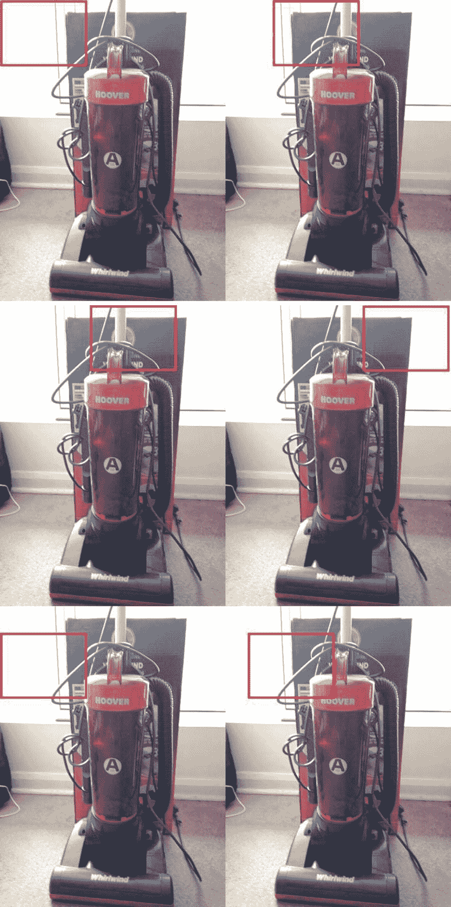

图 5-2

滑动窗口方法检测并识别目标。请注意滑动框是如何在整个图像中移动的；该过程能够检测到，但实际上是一个耗时的过程，并且计算量也很大

然后，对于这些被裁剪的区域中的每一个，我们可以分类该区域是否包含我们感兴趣的对象。然后我们增加滑动窗口的大小，继续这个过程。

滑动窗口已经被证明是可行的，但是它是一种计算量非常大的技术，并且由于我们要对图像中的所有区域进行分类，所以实现起来会很慢。此外，为了定位对象，我们需要一个小窗口大小和小步幅。但这仍然是一个简单的理解方法。

下一种方法是包围盒方法。

## 5.5 包围盒方法

我们讨论了滑动窗口方法。它输出不太精确的边界框，因为它依赖于窗口的大小。因此，我们有另一种方法，其中我们将整个图像分成网格(x 乘 x)，然后为每个网格定义我们的目标标签。我们可以在图 [5-3](#Fig3) 中显示一个边框。


图 5-3

边界框可以生成边界框的 x 坐标、y 坐标、高度和宽度以及类别概率分数

边界框可以给我们以下细节:

*   Pc:网格单元中有对象的概率(0:无对象，1:有对象)。

*   Bx:如果 Pc 为 1，则为包围盒的 x 坐标。

*   By:如果 Pc 为 1，则为边界框的 y 坐标。

*   Bh:如果 Pc 是 1，就是包围盒的高度。

*   Bw:如果 Pc 为 1，则为边界框的宽度。

*   C1:它是物体属于第一类的概率。

*   C2:这是物体属于第二类的概率。

Note

类别的数量取决于手头的问题是二元分类还是多标分类。

如果一个对象位于多个网格上，那么包含该对象中点的网格负责检测该对象。

Info

通常建议使用 19x19 的网格。此外，一个对象的中点位于两个独立的网格中的可能性更小。

到目前为止，我们正在研究确定对象的方法；下一个主题是测量并的交集检测的性能。

## 5.6 联合交集(IoU)

我们已经研究了一些用于物体检测的方法。在随后的章节中，我们也将研究深度学习架构。但是，我们仍然需要确定我们在物体探测中预测的准确性。交集超过并集是一个测试，以确定我们的预测有多接近实际真相。

用等式 5-1 表示，如图 [5-4](#Fig4) 所示。

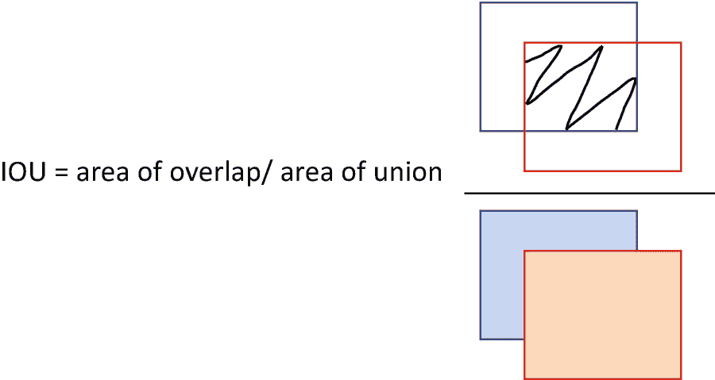

图 5-4

并集上的交集被用来衡量检测的性能。分子是公共面积，而分母是两个面积的完全并集。借据的价值越高越好

IoU =重叠区域/合并的整个区域(等式 5-1)

因此，如果交集比并集的值高，就意味着重叠更好。因此，预测更准确、更好。在图 [5-5](#Fig5) 中的示例中对其进行了描述，以便形象化。

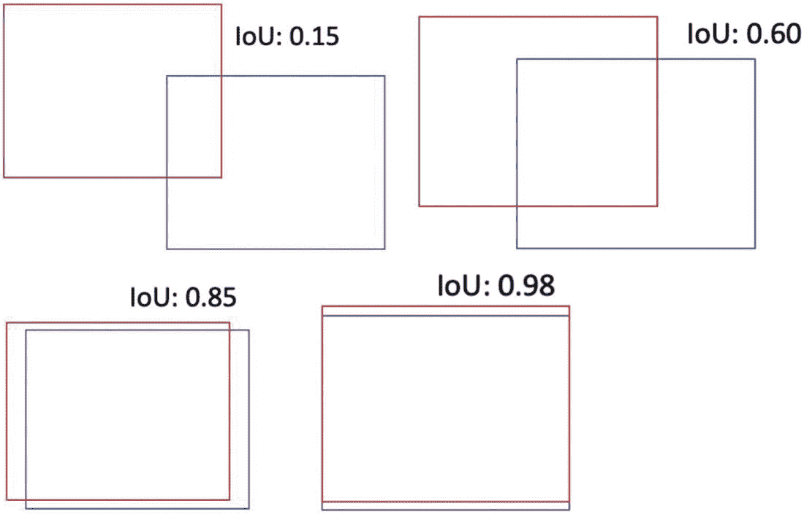

图 5-5

重叠模块不同位置的 IoU 值。如果该值更接近 1.0，则意味着与值 0.15 相比，检测更准确

正如我们在图 [5-5](#Fig5) 中看到的，对于 0.15 的 IoU，与 0.85 或 0.90 相比，两个方框之间的重叠非常少。这意味着 0.85 IoU 的解决方案优于 0.15 IoU 的解决方案。因此，可以直接比较检测解决方案。

交集/并集允许我们测量和比较各种解决方案的性能。这也让我们更容易区分有用的边界框和不太重要的边界框。并集上的交是一个有着广泛用途的重要概念。使用它，我们可以比较和对比所有可能解决方案的可接受性，并从中选择最佳方案。

我们现在将研究非最大值抑制技术，这对于过滤重要的边界框是有用的。

## 5.7 非最大抑制

当我们试图检测图像中的一个对象时，我们可以将一个对象放在多个网格中。可以用图 [5-6](#Fig6) 来表示。显然，概率最高的网格将是该物体的最终预测。

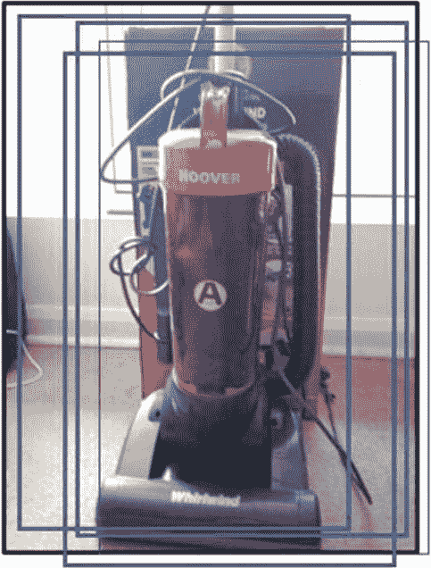

图 5-6

一个对象可以跨越多个网格，并且无论哪一个给出最佳结果，都是最终用于检测目的的所选网格

整个过程按以下步骤完成:

1.  得到所有网格各自的概率。

2.  设置概率阈值和 IoU 阈值。

3.  丢弃低于该阈值的那些。

4.  选择概率最大的方框。

5.  计算剩余盒子的借据。

6.  丢弃低于 IoU 阈值的那些。

使用非最大值抑制，我们删除了大多数低于某一阈值水平的边界框。

Info

一般情况下，该值保持在 0.5。建议您使用不同的值进行迭代来分析差异。

因此，该算法保留了重要的和有意义的噪声，而去除了较大的噪声。我们现在将着手研究锚盒，这是物体检测过程中的另一个重要因素。

## 5.8 锚箱

我们希望在深度学习中检测对象，我们需要一种快速准确的方法来获得对象的位置和大小。锚盒是一个有助于检测对象的概念。

锚定框用于捕捉我们希望检测的对象的缩放比例和纵横比。它们具有预定义的大小(高度和宽度),并且基于我们想要检测的对象的大小来确定大小。我们在图 [5-7](#Fig7) 中展示了锚盒。

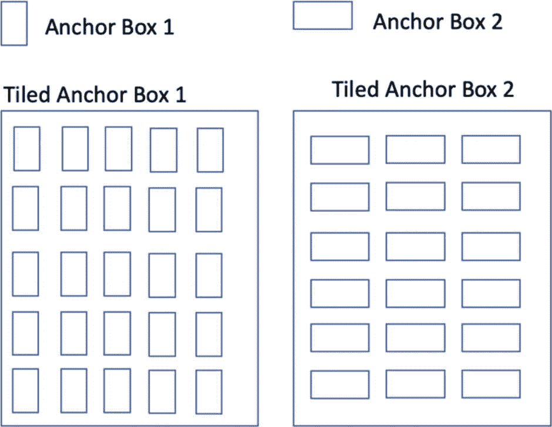

图 5-7

锚定框用于捕捉缩放比例和纵横比。我们可以平铺锚盒，神经网络将输出一组独特的预测

在对象检测过程中，每个锚框平铺在图像上，神经网络为每个锚框输出一组唯一的预测。输出由每个锚定框的概率得分、IoU、背景和偏移组成。基于所做的预测，可以进一步改进锚盒。

我们可以有多种尺寸的锚盒来检测不同尺寸的物体。使用锚盒，我们可以探测不同尺度的物体。甚至到了可以使用锚定框来检测多个或重叠对象的程度。这无疑是对滑动窗口的巨大改进，因为我们现在可以在一次拍摄中处理整个图像，从而使更快的实时物体检测成为可能。要注意的是，网络不预测边界框。网络预测平铺锚定框的概率得分和改进。

现在，我们已经研究了关键部件；现在我们从深度学习架构开始。

## 5.9 深度学习架构

深度学习有助于物体检测。我们可以在图像、视频甚至实时视频流中检测感兴趣的对象。在本章的后面，我们将创建一个实时视频流解决方案。

我们之前已经看到滑动窗口方法存在一些问题。对象在图像中可以有不同的位置，并且可以有不同的纵横比或大小。物体可能覆盖整个区域；另一方面，在某些地方，它将只覆盖一小部分。图像中可能存在不止一个对象。物体可以是各种角度或尺寸。或者一个对象可以位于多个网格中。此外，一些用例需要实时预测。这导致具有非常大量的区域，并因此具有巨大的计算能力。这也需要相当长的时间。在这种情况下，传统的图像分析和检测方法没有多大帮助。因此，我们需要基于深度学习的解决方案来解决和开发鲁棒的对象检测解决方案。

基于深度学习的解决方案使我们能够更好地训练，从而获得更好的结果。我们现在正在讨论架构。

让我们从 R-CNN 作为第一个架构开始吧！

### 5.9.1 基于区域的 CNN (R-CNN)

我们知道拥有大量区域是一项挑战。Ross Girshick 等人提出了 R-CNN 来解决选择大量区域的问题。R-CNN 是基于区域的 CNN 架构。该解决方案建议使用选择性搜索并从图像中仅提取 2000 个区域，而不是对大量区域进行分类。它们被称为“地区提案”

R-CNN 的架构如图 [5-8](#Fig8) 所示。


图 5-8

R-CNN 的流程。这里，我们从输入图像中提取区域建议，计算 CNN 特征，然后对区域进行分类。图片来源: [`https://arxiv.org/pdf/1311.2524.pdf`](https://arxiv.org/pdf/1311.2524.pdf) 并经研究者许可在此发表

参照图 [5-8](#Fig8) 所示的过程，现在让我们详细了解整个过程:

1.  第一步是输入图像，如图 [5-8](#Fig8) 中的步骤 1 所示。

2.  然后得到我们感兴趣的区域，如图 [5-8](#Fig8) 中步骤 2 所示。这些是 2000 年提议的区域。使用以下步骤检测它们:
    1.  我们为图像创建初始分割。

    2.  然后，我们为图像生成各种候选区域。

    3.  我们迭代地将相似的区域组合成更大的区域。贪婪搜索方法被用于它。

    4.  最后，我们使用生成的区域来输出最终的区域建议。

3.  然后在下一步中，我们根据 CNN 中的实现重塑所有的 2000 个区域。

4.  然后，我们通过 CNN 遍历每个区域，以获得每个区域的特征。

5.  所提取的特征现在通过支持向量机来对所提议的区域中对象的存在进行分类。

6.  然后，我们使用包围盒回归来预测物体的包围盒。这意味着我们正在对图像进行最终预测。如上一步所示，我们正在预测图像是飞机、人还是电视显示器。

R-CNN 使用前面的过程来检测图像中的对象。这无疑是一个创新的架构，它提出了一个感兴趣的区域作为检测对象的有效概念。

但是 R-CNN 也有一些挑战，它们是

1.  R-CNN 实现了三种算法(CNN 用于提取特征，SVM 用于对象分类，边界框回归用于获得边界框)。这使得 R-CNN 解决方案的训练速度相当慢。

2.  它使用 CNN 为每个图像区域提取特征。区域数是 2000。这意味着，如果我们有 1000 张图像，要提取的特征数量是 1000 乘以 2000，这又会使速度变慢。

3.  由于这些原因，对图像进行预测需要 40-50 秒，因此这对大型数据集来说是个问题。

4.  还有，选择性搜索算法是固定的，不能做太多改进。

由于 R-CNN 不是很快，并且对于大型数据集来说很难实现，相同的作者提出了快速 R-CNN 来克服这些问题。让我们了解下一节建议的改进！

## 5.10 快速 R-CNN

在 R-CNN 中，由于我们为一幅图像提取 2000 个区域提议，因此训练或测试图像在计算上是一个挑战。为了解决这个问题，Ross Girshick 等人提出，不是对每个图像执行 CNN 2000 次，而是对一个图像只运行一次，并得到所有感兴趣的区域。

网络的架构如图 [5-9](#Fig9) 所示。


图 5-9

快速 R-CNN 中的过程。我们获取感兴趣区域，然后通过应用感兴趣区域合并图层来重塑所有输入。然后由 FC 层对它们进行评估，最后由 softmax 进行分类。图片来源: [`https://arxiv.org/pdf/1504.08083.pdf`](https://arxiv.org/pdf/1504.08083.pdf) 并经研究者许可在此发表

除了几处变化之外，该方法与其前身相似:

1.  该图像是如图 [5-9](#Fig9) 所示的输入。

2.  图像被传递到卷积网络，卷积网络返回相应的感兴趣区域。

3.  在下一步中，我们应用利息池区域图层。它导致按照卷积的输入对所有区域进行整形。因此，它通过应用 ROI 池层使所有感兴趣区域的大小相同。

4.  现在，这些区域中的每一个都被传递给完全连接的网络。

5.  最后由 softmax 层完成分类。并行地，使用边界框回归器来识别边界框的坐标。

快速 R-CNN 比 R-CNN 有几个优点:

1.  快速 R-CNN 不需要每次向 CNN 馈送 2000 个区域提议，因此它比 R-CNN 更快。

2.  它对每幅图像只使用一次卷积运算，而不是 R-CNN 中使用的三次(提取特征、分类和生成边界框)。因此不需要存储特征映射，从而节省了磁盘空间。

3.  通常，softmax 图层比 SVM 具有更好的精度，并且执行时间更快。

快速的 R-CNN 大大减少了训练时间，并且被证明更加准确。但是由于使用选择性搜索作为获得感兴趣区域的建议方法，性能仍然不够快。因此，对于大型数据集，预测速度不够快。这就是为什么我们有更快的 R-CNN，这是我们接下来要讨论的。

## 5.11 更快的 R-CNN

为了克服 R-CNN 和快速 R-CNN 的慢，邵青·兰等人提出了更快的 R-CNN。更快的 R-CNN 背后的直觉是取代缓慢且耗时的选择性搜索。更快的 R-CNN 使用区域提议网络或 RPN。论文可在 [`https://papers.nips.cc/paper/2015/file/14bfa6bb14875e45bba028a21ed38046-Paper.pdf`](https://papers.nips.cc/paper/2015/file/14bfa6bb14875e45bba028a21ed38046-Paper.pdf) 访问

更快的 R-CNN 的架构如图 [5-10](#Fig10) 所示。

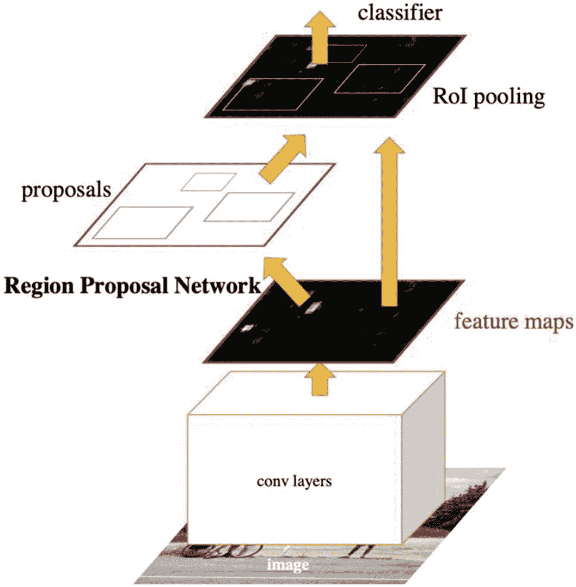

图 5-10

更快的 R-CNN 是对以前版本的改进。它由两个模块组成——一个是深度卷积网络，另一个是快速 R-CNN 检测器

引用原文 [`https://papers.nips.cc/paper/2015/file/14bfa6bb14875e45bba028a21ed38046-Paper.pdf:`](https://papers.nips.cc/paper/2015/file/14bfa6bb14875e45bba028a21ed38046-Paper.pdf)

> *我们的物体探测系统，叫做更快的 R-CNN，由两个模块组成。第一个模块是提出区域的深度全卷积网络，第二个模块是使用所提出区域的快速 R-CNN 检测器。整个系统是一个单一的、统一的目标检测网络。*

让我们深入了解一下架构。更快的 R-CNN 的工作方式如下:

1.  我们获取一个输入图像，并使其通过 CNN，如图 [5-10](#Fig10) 所示。

2.  From the feature maps received, we apply Region Proposal Networks (RPNs). The way an RPN works can be understood by referring to Figure [5-11](#Fig11).

    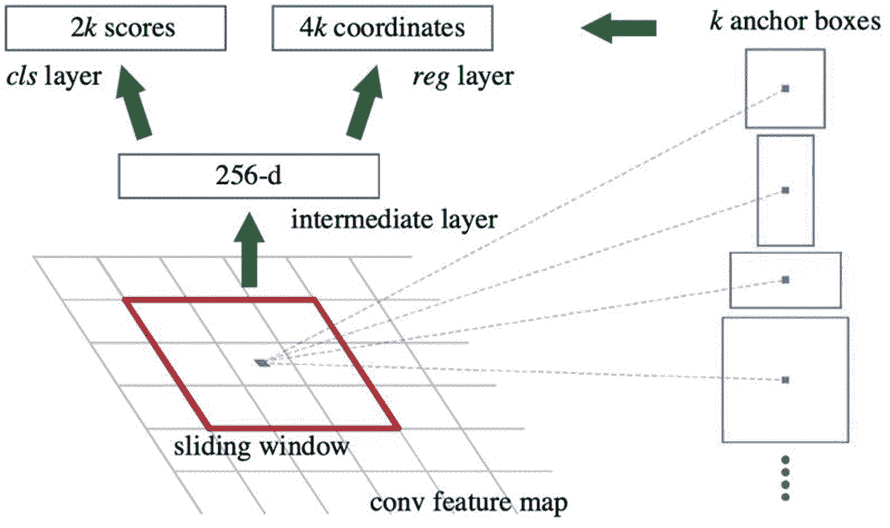

    图 5-11

    区域建议网络用于更快的 R-CNN。图像取自原始文件

    The substeps followed are
    1.  RPN 采用上一步生成的特征地图。

    2.  RPN 应用滑动窗口并生成 k 个锚盒。我们已经在上一节讨论了锚盒。

    3.  生成的锚盒具有不同的形状和大小。

    4.  RPN 还将预测锚点是否是对象。

    5.  它还会给出边界框回归量来调整锚点。

    6.  要注意的是，RPN 没有建议对象的类别。

    7.  我们将获得目标提案和相应的目标得分。

3.  应用投资回报池，使所有提案的规模相同。

4.  最后，我们用 softmax 和线性回归将它们输入到完全连接的层中。

5.  我们将接收预测的对象分类和各自的边界框。

快速 R-CNN 能够结合智能并使用深度卷积完全连接层和使用建议区域的快速 R-CNN。整个解决方案是用于对象检测的单一且统一的解决方案。

虽然相对于 R-CNN 和快速 R-CNN，更快的 R-CNN 在性能上确实有所改进，但是该算法仍然不能同时分析图像的所有部分。相反，图像的每个部分都是按顺序分析的。因此，需要在单个图像上进行大量的传递来识别所有的对象。此外，由于许多系统按顺序工作，一个系统的性能取决于前面步骤的性能。

在下一节中，我们将继续讨论最著名的算法之一——YOLO 或你只看一次。

## 5.12 你只看一次(YOLO)

你只看一次或 YOLO 是实时对象检测的目标。我们之前讨论的算法使用区域来定位图像中的对象。这些算法着眼于图像的一部分，而不是完整的图像，而在 YOLO，一个单一的 CNN 预测边界框和各自的类别概率。YOLO 于 2016 年由约瑟夫·雷德蒙、桑托什·迪夫瓦拉、罗斯·吉斯克和阿里·法尔哈迪提出。实际论文可在 [`https://arxiv.org/pdf/1506.02640v5.pdf`](https://arxiv.org/pdf/1506.02640v5.pdf) 访问。

引用实际论文中的话，“我们将对象检测重新定义为一个单一的回归问题，直接从图像像素到边界框坐标和类别概率。”

如图 [5-12](#Fig12) 所示，YOLO 将一幅图像划分为一个网格状的单元(用 S 表示)。每个单元预测边界框(由 B 表示)。然后，YOLO 对每个边界框进行处理，并生成一个关于该框形状好坏的置信度得分。还预测了对象的分类概率。最后，选择具有上述类别概率分数的边界框，并且使用它们来定位该图像内的对象。


图 5-12

YOLO 过程很简单；图片摘自原纸 [`https://arxiv.org/pdf/1506.02640v5.pdf`](https://arxiv.org/pdf/1506.02640v5.pdf)

### 5 . 12 . 1 YOLO 的显著特征

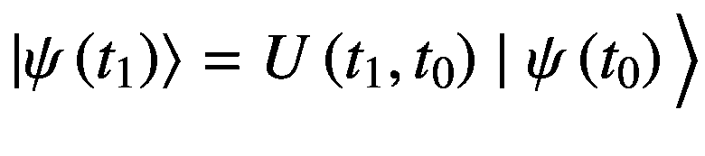

(方程式 5-2)

1.  YOLO 把输入图像分成一个 SxS 网格。要注意的是，每个网格只负责预测一个对象。如果对象的中心落在网格单元中，则该网格单元负责检测该对象。

2.  对于每个网格单元，它预测边界框(B)。每个边界框都有五个属性——x 坐标、y 坐标、宽度、高度和置信度。换句话说，它有(x，y，w，h)和一个分数。这个置信度得分是盒子里有一个物体的置信度。它也反映了边界框的准确性。

3.  宽度 w 和高度 h 被标准化为图像的宽度和高度。x 和 y 坐标表示相对于网格单元边界的中心。

4.  置信度定义为概率(目标)乘以 IoU。如果没有对象，置信度为零。否则，置信度等于预测框和实际情况之间的 IoU。

5.  每个网格单元预测 C 个条件类概率–Pr(class I | Object)。这些概率取决于包含对象的网格单元。我们只预测每个网格单元的一组类别概率，而不考虑盒子 b 的数量。

6.  在测试时，我们将条件类概率和单个类预测相乘。它给出了每个盒子的特定类别的置信度得分。它可以用等式 5-2 来表示:

我们现在将研究如何计算 YOLO 的损失函数。在我们能够详细研究整个架构之前，获得损失函数计算函数是很重要的。

### YOLO 的损失函数

我们在上一节已经看到，YOLO 为每个单元格预测了多个边界框。我们选择具有最大 IoU 的包围盒。为了计算损耗，YOLO 优化了模型中输出的平方和误差，因为平方和误差易于优化。

损失函数如等式 5-3 所示，包括定位损失、置信度损失和分类损失。我们首先表示完整的损失函数，然后详细描述各项。

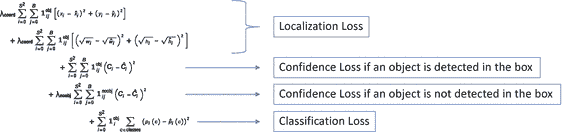(方程式 5-3)

在等式 5-3 中，我们有定位损失、置信度损失和分类损失，其中 1 <sup>obj</sup> <sub>i</sub> 表示对象是否出现在单元 *i* 中，1<sup>obj</sup>T8】ij 表示单元 *i* 中的 *j* 第<sup>个</sup>边界框预测器“负责”该预测。

让我们来描述一下前面等式中的各项。在这里，我们有

1.  局部化损失是为了测量预测边界框的误差。它测量它们的位置和尺寸误差。在上式中，前两项代表定位损耗。1<sup>obj</sup>T2 I 如果单元格 I 中的第 j <sup>个</sup>边界框负责检测物体，则为 1，否则为 0。λ <sub>coord</sub> 负责边界框坐标损失的权重增加。λ <sub>坐标</sub>的默认值为 5。

2.  置信度损失是在盒子中检测到物体时的损失。这是所示等式中的第二个损失项。在前一学期，我们有


1.  下一项是如果没有检测到物体的置信度损失。在前一学期，我们有

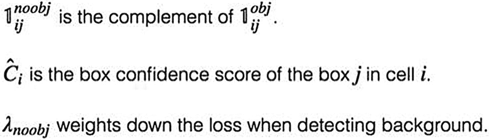

1.  最后一项是分类损失。如果对象确实被检测到，那么对于每个单元，它是每个类的类概率的平方误差。

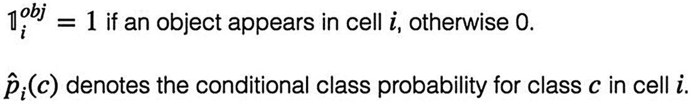

最终损失是所有这些部分的总和。作为任何深度学习解决方案的目标，目标将是最小化该损失值。

现在我们已经理解了 YOLO 和损失函数的属性；我们现在将着手研究 YOLO 的实际建筑。

### YOLO 建筑

网络设计如图 [5-13](#Fig13) 所示，取自 [`https://arxiv.org/pdf/1506.02640v5.pdf`](https://arxiv.org/pdf/1506.02640v5.pdf) 的实际纸张。


图 5-13

完整的 YOLO 建筑；图片取自 [`https://arxiv.org/pdf/1506.02640v5.pdf`](https://arxiv.org/pdf/1506.02640v5.pdf) 的原纸

在论文中，作者提到该网络受到了谷歌网的启发。该网络有 24 个卷积层，后面是 2 个全连接层。YOLO 没有使用 GoogLeNet 使用的 Inception 模块，而是使用 1x1 缩减层，然后是 3x3 卷积层。YOLO 可能会发现同一物体的复制品。为此，实施了非最大抑制。这将删除重复的较低置信度得分。

在图 [5-14](#Fig14) 中，我们有一个 13x13 网格的图形。总共有 169 个网格，其中每个网格预测 5 个边界框。因此，总共有 169*5 = 845 个边界框。当我们应用 30%或更多的阈值时，我们得到 3 个边界框，如图 [5-14](#Fig14) 所示。


图 5-14

YOLO 过程将该区域划分成 SxS 网格。每个网格预测五个包围盒，基于阈值设置(这里是 30%)，我们得到最终的三个包围盒；图像取自原始文件

所以，YOLO 只看了图像一次，但看的方式很巧妙。这是一种非常快速的实时处理算法。引用原文:

1.  YOLO 简单得令人耳目一新。

2.  YOLO 速度极快。因为我们把检测框架作为一个回归问题，所以我们不需要复杂的流水线。我们只是在测试时对新图像运行我们的神经网络来预测检测。我们的基础网络在 Titan X GPU 上以每秒 45 帧的速度运行，没有批处理，快速版本的运行速度超过 150 fps。这意味着我们可以实时处理流视频，延迟不到 25 毫秒。此外，YOLO 的平均精度是其他实时系统的两倍多。

3.  YOLO 在做预测时会对图像进行全局推理。与基于滑动窗口和区域提议的技术不同，YOLO 在训练和测试期间看到整个图像，因此它隐式地编码了关于类及其外观的上下文信息。

4.  YOLO 学习物体的概括表示。当在自然图像上训练和在艺术品上测试时，YOLO 远远超过 DPM 和 R-CNN 等顶级检测方法。由于 YOLO 是高度概括的，当应用于新的领域或意想不到的输入时，它不太可能崩溃。

YOLO 也面临一些挑战。它遭受高定位误差。此外，由于每个网格单元只能预测两个盒子，并且只能输出一个类，因此 YOLO 只能预测有限数量的附近物体。它也有召回率低的问题。因此在 YOLOv2 和 YOLOv3 的下一个版本中，这些问题都得到了解决。有兴趣的读者可以在 [`https://pjreddie.com/darknet/yolo/`](https://pjreddie.com/darknet/yolo/) 官网获取深入的知识。

YOLO 是最广泛使用的对象检测解决方案之一。它的独特之处在于简单快捷。我们将在下一部分研究的下一个深度学习架构是单次多盒检测器或 SSD。

## 5.13 单次多盒探测器(SSD)

到目前为止，我们已经在上一节讨论了 R-CNN、快速 R-CNN、更快 R-CNN 和 YOLO。为了克服网络在实时对象检测中工作的缓慢性，C. Szegedy 等人在 2016 年 11 月提出了 SSD(单次多盒检测器)网络。论文可在 [`https://arxiv.org/pdf/1512.02325.pdf`](https://arxiv.org/pdf/1512.02325.pdf) 访问。

固态硬盘使用我们在前面章节讨论过的 VGG16 架构，但做了一些修改。通过使用 SSD，只需要一次拍摄就可以检测到一个对象中的多个图像。它因此被称为*单次*拍摄，因为它利用*单次*向前传递来进行物体定位和分类。基于区域提案网络(RPN)的解决方案，如 R-CNN、Fast R-CNN，需要两次拍摄，第一次拍摄获取区域提案，第二次拍摄检测每个提案的对象。因此 SSD 被证明比基于 RPN 的方法快得多。Szegedy 等人称之为*多盒*，探测器这个词的意义显而易见。让我们深入探讨多盒检测机的概念。

参见图 [5-15](#Fig15) 。我们可以说，在应用和通过一系列卷积之后，我们获得了尺寸为 m×n 和 p 通道的特征层。

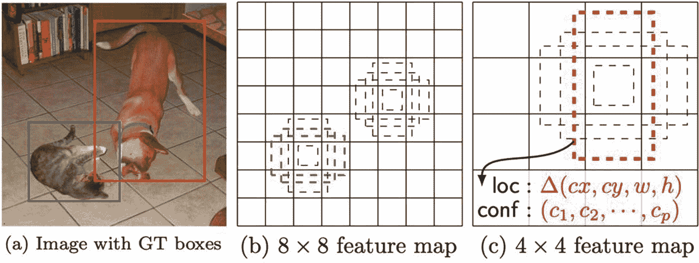

图 5-15

SSD 工艺如图。我们有一个与地面真相(燃气轮机)的原始图像。8×8 卷积完成。我们得到不同大小和位置的包围盒；图像取自原始文件

对于每个位置，我们将得到 k 个边界框，它们可能具有不同的大小和纵横比。并且对于这 k 个边界框中的每一个，我们计算 c 类分数和相对于原始默认边界框的四个偏移，以最终接收(c+4)个 kmn 输出。

SSD 实现平滑 L1 范数来计算位置损失。它可能没有 L1 那么精确，但仍然相当精确。

更多关于多框方法的信息可以在 [`https://arxiv.org/abs/1412.1441`](https://arxiv.org/abs/1412.1441) 阅读。

完整的网络如图 [5-16](#Fig16) 所示，作为与 YOLO 的对比。经作者许可，图片取自同一篇论文。


图 5-16

此处显示了 YOLO 和固态硬盘的对比。图片取自 [`https://arxiv.org/pdf/1512.02325.pdf`](https://arxiv.org/pdf/1512.02325.pdf) 的原纸

在 SSD 中，不同层的特征图正在通过 3×3 卷积层来提高精度。如果我们分析前面的结构，我们可以观察到，对于对象检测的第一层(conv4_3)，它具有 38×38 的空间维度，这在尺寸上是相当大的缩减，导致预测较小尺寸的对象的准确度较低。对于同一个 conv4_3，我们可以使用前面讨论的公式来计算输出。对于 conv4_3，输出将是 38x38x4x(c+4 ),其中 c 是要预测的类的数量。

SSD 使用两个损失函数来计算损失——置信度损失(L <sub>conf</sub> )和本地化损失(L <sub>loc</sub> )。L <sub>conf</sub> 是进行类预测的损失，而 L <sub>loc</sub> 是地面真实值和预测框之间的不匹配。前面提到的论文中给出了这两种损耗的数学公式，它们的推导超出了本书的范围。

固态硬盘还遵循其他一些重要流程:

1.  通过翻转、裁剪和颜色失真来增加数据以提高准确性。每个训练示例都是随机抽样的，如下所示:
    1.  利用原始图像。

    2.  对 IoU 为 0.1、0.3、0.5、0.7 或 0.9 的贴片进行采样。

    3.  随机抽取一个补丁。

    4.  采样的面片具有 0.5 和 2 之间的纵横比，并且每个采样的面片的大小是原始大小的[0.1，1]。

然后，将每个采样图像调整到固定大小，并水平翻转。照片失真也用于图像增强。

1.  SSD 实现非最大值抑制来移除重复的预测。我们已经在本章开始时讨论了非最大抑制。

2.  SSD 产生的预测数量比实际的对象数量多。我们负面的比正面的多，造成阶层失衡。引用实际的论文:“我们没有使用所有的负面例子，而是使用每个默认框的最高置信损失对它们进行排序，并选择顶部的例子，这样负面和正面的比例最多为 3:1。我们发现这导致了更快的优化和更稳定的训练。”

基于上述架构，我们可以总结出关于 SSD 的几点:

1.  检测小型物体可能是一项挑战。为了解决这个问题，我们可以提高图像分辨率。

2.  精度与速度成反比；如果我们希望提高速度，我们可以增加边界框的数量。

3.  SSD 比 R-CNN 具有更高的分类误差，但是定位误差较小。

4.  它很好地利用较小的卷积滤波器来预测检测的类别和多尺度特征图。这有助于提高准确性。

5.  引用原始论文:“SSD 的核心是使用应用于特征地图的小卷积过滤器来预测一组固定的默认边界框的类别分数和框偏移。”

SSD 的精度可以进一步提高。它混淆了具有相似类别的对象。而且是基于 VGG16 构建的，消耗了大量的训练时间。但是 SSD 是一个很棒的解决方案，可以很容易地用于端到端培训。它速度很快，可以实时运行，性能优于更快的 R-CNN。

由此，我们总结出用于对象检测的深度学习架构。我们已经讨论了主要的算法，在接下来的章节中，我们将开发实际的 Python 代码来实现这个解决方案。但在此之前，我们将考察迁移学习的概念。这是一个创新的解决方案，允许我们建立在由专家训练的最先进的算法之上。迁移学习是我们讨论的下一个话题。

## 5.14 迁移学习

顾名思义，迁移学习就是分享知识或将学习成果转移给他人。在深度学习的世界中，研究人员和组织创新并创建了新的神经网络架构。他们使用多代码强大处理器的最先进功能，并在精心策划和选择的大型数据集上训练算法。

对我们来说，创造这样的智能就像是重新发明轮子。因此，通过迁移学习，我们可以利用那些经过数百万个数据点训练的网络。这使我们能够使用研究人员产生的智能，并在真实世界的数据集上实现相同的功能。这个过程被称为*迁移学习*。

在迁移学习中，我们使用一个预先训练好的模型来达到我们的目的。预训练模型具有来自原始模型的最终权重。使用预训练模型的基本思想是，网络的初始层检测基本特征，随着我们深入，这些特征开始成形。基本特征提取可以用于任何类型的图像。所以，如果一个模型被训练来区分手机，它就可以用来区分汽车。

我们可以在图 [5-17](#Fig17) 中展示这个过程。在这里，网络的第一层被冻结，将用于提取边、线等低级要素。最后一层可以根据业务问题进行定制。


图 5-17

迁移学习利用预先训练好的网络。第一层负责提取低级特征并被冻结。最后一层是为手头的问题定制的

迁移学习使得学习比传统的机器学习更快，并且需要更少的训练数据。我们将在第 [8](8.html) 章中讨论预训练模型的更多细节。

迁移学习是通过利用在不同环境下开发的解决方案来解决现实世界的业务问题。我们将在下一节和本书的后续章节中使用迁移学习。在前面的章节中，我们可以利用迁移学习来使用这些网络。

理论已经讲得够多了，是时候开发我们的目标检测解决方案了。该打代码了！

## 5.15 Python 实现

我们将使用 YOLO 实现实时对象检测。必须下载预先训练的重量。代码、权重、标签和预期输出可以从本章开头给出的 GitHub 资源库链接下载。

步骤 1:导入所有需要的库。

```py
import cv2
from imutils.video import VideoStream
import os
import numpy as np

```

步骤 2:从本地路径加载配置。我们正在加载权重、配置和标签。我们也在设置检测的设置。

```py
localPath_labels = "coco.names"
localPath_weights = "yolov3.weights"
localPath_config = "yolov3.cfg"
labels = open(localPath_labels).read().strip().split("\n")
scaling = 0.005
confidence_threshold = 0.5
nms_threshold = 0.005  # Non Maxima Supression Threshold Vlue
model = cv2.dnn.readNetFromDarknet(localPath_config, localPath_weights)

```

第三步:现在我们从这一步的视频开始。然后，我们通过从对象模型访问来配置未连接的层。

```py
cap = VideoStream(src=0).start()
layers_name = model.getLayerNames()
output_layer = [layers_name[i[0] - 1] for i in model.getUnconnectedOutLayers()]

```

Note

建议您研究模型的组件并打印出来，以便更好地理解。

步骤 4:现在我们准备执行对象的检测。此步骤是解决方案的核心步骤。它检测对象和边界框，并在框的顶部添加文本。

我们从 while 循环开始。然后我们在读框架。下一步，设置框架的宽度和高度。然后我们将循环遍历每一帧。如果置信度高于我们之前设置的置信度阈值，则对象将被检测到。

然后，我们进行标记，并且在检测到的边界框上的框中显示对象的相应置信度得分。输出如图 [5-18](#Fig18) 所示。

```py
while True:
    frame = cap.read()
    (h, w) = frame.shape[:2]
    blob = cv2.dnn.blobFromImage(frame, 1 / 255.0, (416, 416), swapRB=True, crop=False)
    model.setInput(blob)
    nnoutputs = model.forward(output_layer)
    confidence_scores = []
    box_dimensions = []
    class_ids = []

    for output in nnoutputs:
        for detection in output:
            scores = detection[5:]
            class_id = np.argmax(scores)
            confidence = scores[class_id]
            if confidence > 0.5 :
                box = detection[0:4] * np.array([w, h, w, h])
                (center_x, center_y, width, height) = box.astype("int")
                x = int(center_x - (width / 2))
                y = int(center_y - (height / 2))
                box_dimensions.append([x, y, int(width), int(height)])
                confidence_scores.append(float(confidence))
                class_ids.append(class_id)
    ind = cv2.dnn.NMSBoxes(box_dimensions, confidence_scores, confidence_threshold, nms_threshold)
    for i in ind:
        i = i[0]
        (x, y, w, h) = (box_dimensions[i][0], box_dimensions[i][1],box_dimensions[i][2], box_dimensions[i][3])
        cv2.rectangle(frame,(x, y), (x + w, y + h), (0, 255, 255), 2)
        label = "{}: {:.4f}".format(labels[class_ids[i]], confidence_scores[i])
        cv2.putText(frame, label, (x, y - 5), cv2.FONT_HERSHEY_SIMPLEX, 0.5, (255,0,255), 2)
    cv2.imshow("Yolo", frame)
    if cv2.waitKey(1) & 0xFF == ord("q"):
        break
cv2.destroyAllWindows()
cap.stop()

```

输出如图 [5-18](#Fig18) 所示。我们能够以 99.79%的准确率实时检测手机。


图 5-18

这里显示了实时对象检测。我们能够以 99.79%的准确率检测手机

在这个解决方案中，可以识别真实世界的对象。并且围绕该对象以及名称和置信度得分创建边界框。

该解决方案可用于多种使用情形。相同的代码可以为数据集定制，也可以用于检测图像和视频中的对象。

我们现在可以进行本章的总结了。

## 5.16 摘要

对象检测是一个非常强大的解决方案。它被应用在许多领域和操作中，几乎所有的行业都可以从目标检测中受益。它可以用于光学字符识别、自动驾驶、跟踪物体和人、人群监视、安全机制等等。这种计算机视觉技术正在真正改变实时能力的面貌。

在本章中，我们讨论了对象检测架构——R-CNN、快速 R-CNN、更快 R-CNN、YOLO 和固态硬盘。所有的网络都是基于深度学习的，在设计和架构上都很新颖。然而，有些表现优于其他人。并且通常在速度和准确性之间有一个折衷。所以基于手头的业务问题，我们必须谨慎选择网络。

我们在本章中还讨论了迁移学习。迁移学习是一种新颖的解决方案，它使用已经在数百万幅图像上训练过的预训练网络。迁移学习允许我们通过使用强大的处理器来使用研究人员和作者产生的智能。这是一个工具，使每个人都能够使用这些真正的深度网络，并根据需要定制它们。我们使用迁移学习来使用预先训练的 YOLO 来实时检测对象。我们将在其他章节中继续使用迁移学习方法。

对象检测可能存在于许多实际解决方案中，但输入数据集决定了解决方案的最终精度。因此，如果您使用网络来实现自定义数据集，请在数据收集阶段做好准备。数据将决定和定义你的成功！

现在，在下一章，我们将致力于另一个令人兴奋的话题——人脸检测和识别。让我们继续这段旅程吧！

你现在应该能回答练习中的问题了！

Review Exercises

建议您解决以下问题:

1.  锚箱和非 max 压制是什么概念？

2.  边界框对物体检测有多重要？

3.  R-CNN、快速 R-CNN、更快速 R-CNN 有何不同，有何改进？

4.  迁移学习如何提高神经网络解？

5.  从 [`www.kaggle.com/c/open-images-2019-object-detection`](http://www.kaggle.com/c/open-images-2019-object-detection) 下载 Open Images 2019 数据集，并使用它创建一个使用 YOLO 的解决方案。

6.  从 [`https://public.roboflow.com/object-detection/chess-full`](https://public.roboflow.com/object-detection/chess-full) 下载象棋数据集，并使用它根据本章中使用的网络来定位棋子。

7.  从 [`https://public.roboflow.com/object-detection/raccoon`](https://public.roboflow.com/object-detection/raccoon) 获取浣熊数据集，并使用它来创建对象检测解决方案。

8.  从 [`https://cocodataset.org/#home`](https://cocodataset.org/%2523home) 获取 COCO 数据集，并使用它来比较使用不同网络的性能。

9.  从 [`https://public.roboflow.com/object-detection/vehicles-openimages`](https://public.roboflow.com/object-detection/vehicles-openimages) 下载 Vehicles-OpenImages 数据集，并创建目标检测解决方案。

### 进一步阅读

1.  探索论文《基于深度学习的物体检测》: [`https://ieeexplore.ieee.org/document/8110383`](https://ieeexplore.ieee.org/document/8110383) 。

2.  探索论文《MobileNets:用于移动视觉应用的高效卷积神经网络》: [`https://arxiv.org/pdf/1704.04861v1.pdf`](https://arxiv.org/pdf/1704.04861v1.pdf) 。

3.  探索论文《MobileNetV2:反向残差与线性瓶颈》: [`https://arxiv.org/pdf/1801.04381v4.pdf`](https://arxiv.org/pdf/1801.04381v4.pdf) 。

4.  探索论文《寻找 MobileNetV3》:[`https://arxiv.org/pdf/1905.02244v5.pdf`](https://arxiv.org/pdf/1905.02244v5.pdf)。