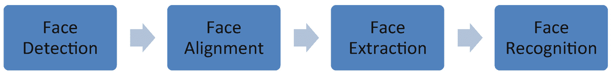
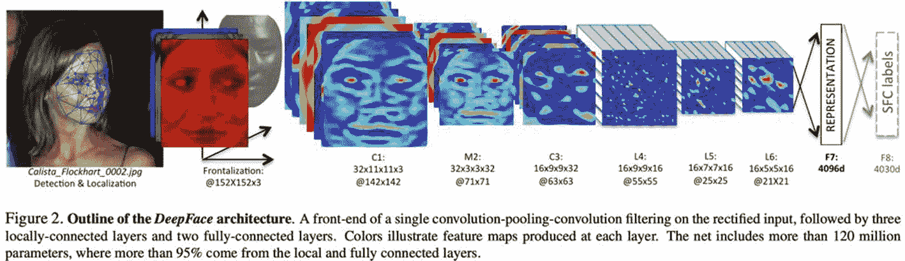
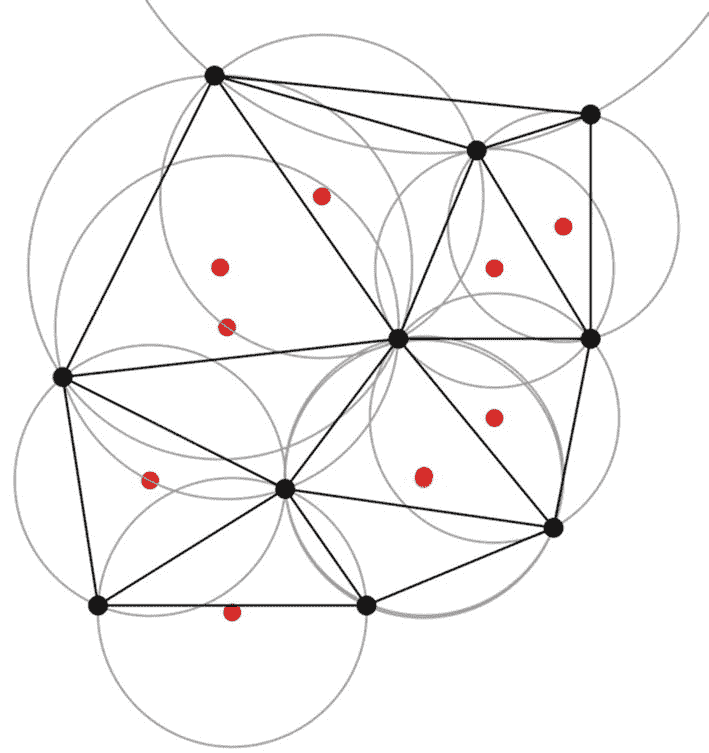
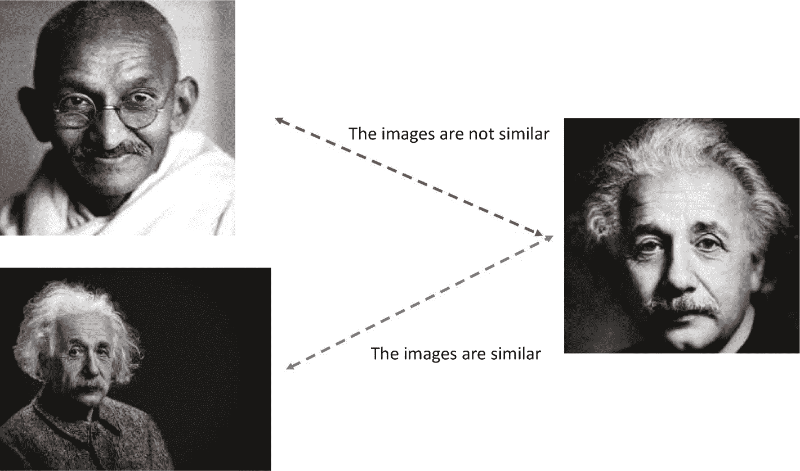
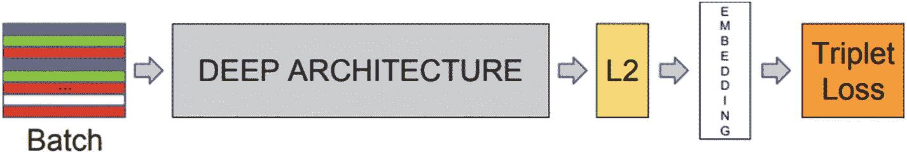
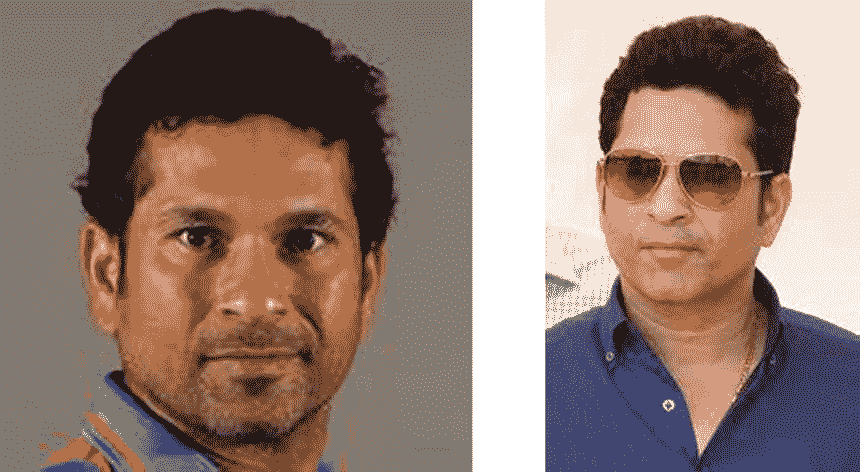

# 六、人脸识别和手势识别

> *谁能正确地看到人脸:摄影师、镜子还是画家？*—毕加索
> 
> T5】

这一章延续了巴勃罗·毕加索的思想。我们人类对自己的脸和他人的脸、我们的微笑、我们的情绪、我们做出的不同姿势以及我们的不同表情很感兴趣。我们的手机和相机捕捉到了这一切。当我们认出一个朋友时，我们认出了这张脸——它的形状、眼睛、面部特征。有趣的是，即使我们从侧面看同一张脸，我们也能认出它。

令人惊讶的是，我们人类能够察觉到这张脸，即使我们长时间看着它。我们创造了一张脸的属性的心理位置，我们能够很容易地回忆起它。同时，我们用手做出的手势很容易被识别。深度学习能够帮助重建这种能力。人脸识别的使用非常具有创新性——它可以跨安全、监控、自动化和客户体验等领域使用——使用案例很多。这个领域正在进行大量的研究。

本章试图将同样的魔法传授给算法。

在本章中，我们将学习以下主题:

1.  人脸识别

2.  人脸识别过程

3.  深层建筑

4.  FaceNet 架构

5.  人脸识别的 Python 实现

6.  使用 OpenCV 进行手势识别

所以，我们继续讨论吧！

## 6.1 技术工具包

本章的代码和数据集上传到本书的 GitHub 链接 [`https://github.com/Apress/computer-vision-using-deep-learning/tree/main/Chapter6`](https://github.com/Apress/computer-vision-using-deep-learning/tree/main/Chapter6) 。对于这一章，GPU 足以执行代码，你可以使用谷歌合作实验室。我们将使用 Python Jupyter 笔记本。

让我们在下一部分继续深入学习架构。

## 6.2 人脸识别

人脸识别并不是什么新鲜事。我们生来就有辨别和识别面孔的能力。对我们来说，这是一项微不足道的任务。我们可以在任何背景下认出我们认识的人，不同的灯光，头发的颜色，带帽子或太阳镜，等等。即使一个人变老了或者长了胡子，我们也能认出他们。太神奇了！

现在，我们试图训练深度学习算法来实现同样的壮举。对我们来说如此琐碎和不费力的任务对机器来说并不容易。在图 [6-1](#Fig1) 中，我们有一张脸，然后我们检测一张脸，然后识别一张脸。


图 6-1

我们最初有一张脸。在第二张图片中，检测到一张脸，最后我们能够识别出一张有特定名字的脸

回想一下，在上一章中，我们学习了对象检测。我们可以将人脸识别视为对象检测的特例。我们不是在发现汽车和猫，而是在识别人。但问题更简单；我们只有要检测的对象类别——“面部”但是人脸检测不是最终状态。我们还得给这张脸起个名字，这可不是小事。而且，脸可以是任何角度；一张脸可以有不同的背景。所以，这不是一件容易的事。此外，我们可能会在照片或视频中发现面孔。深度学习算法可以帮助我们开发这样的能力。基于深度学习的算法可以利用计算能力、高级数学基础和数百万个数据点或人脸来训练更好的人脸识别模型。

在我们深入研究人脸识别的概念和实现之前，我们将探索这项功能的各种用例。

### 6.2.1 人脸识别的应用

人脸识别是一项非常激动人心的技术，可以跨领域和跨过程应用。一些主要用途是

1.  安全管理:人脸识别解决方案适用于在线和离线安全系统。安全服务、警察部门和秘密服务利用基于机器学习的面部识别技术来追踪反社会元素。护照验证可以更快地进行，并且更加可靠。许多国家都有罪犯照片数据库，作为追踪罪犯的起点。这项技术确实节省了大量的时间和精力，并使研究人员能够将精力集中在其他领域。

2.  身份验证是使用人脸识别技术的另一个重要领域。身份验证最著名的例子之一就是智能手机。Face ID 用于 iphone 和手机解锁。在线渠道和社交媒体正在使用人脸识别来检查试图访问帐户的人的身份。

3.  零售商使用它来了解历史记录不太好的个人何时进入了商店。当商店扒手、罪犯或诈骗犯进入商店时，他们会构成威胁。零售商可以识别它们，并立即采取措施防止任何犯罪。

4.  如果企业知道顾客的年龄、性别和面部表情，营销就会变得更加敏锐。可以安装巨型屏幕(事实上已经这样做了)来识别目标观众。

5.  当分析消费者-产品交互时，消费者体验得到改善。人们触摸或尝试产品时的表情捕捉到了真实世界的互动。这些数据是产品团队对产品特性进行必要修改的金矿。同时，运营和店内团队可以让整体购物体验更加愉悦和有趣。

6.  进入办公室、机场、大楼、仓库和停车场可以自动化，无需人工干预。安全摄像头拍下照片，并与数据库进行比较，以确保真实性。

前面讨论的用例只是人脸识别功能的许多应用中的一部分。因此解决方案大致为人脸*认证*或人脸*验证*或人脸*识别*。许多组织和国家正在创建庞大的员工/个人数据库，并投资进一步提高技能。

我们现在将着手研究面部识别的过程。它可以分为一步一步的过程，我们将在下一节讨论。

### 6.2.2 人脸识别过程

我们点击手机和相机中的图片。这些照片拍摄于各种场合——结婚、毕业、旅行、度假、会议等等。当我们在社交媒体上上传图片时，它会自动检测人脸，并识别出这个人是谁。一种算法在后台工作，并发挥神奇的作用。该算法不仅能够检测到人脸，还能从背景中的所有其他人脸中为其命名。我们在这一节研究类似的过程。

大致来说，我们可以围绕人脸识别进行这四个步骤，如图 [6-2](#Fig2) 所示。



图 6-2

人脸检测的流程——从检测到识别。我们检测人脸，进行比对，提取特征，最后识别人脸

1.  人脸检测简单来说就是定位一张照片中是否有一张或多张人脸。我们将围绕它创建一个边界框。回想一下在第 [1](1.html) 章中，我们使用 OpenCV 做了同样的事情。如图 [6-1](#Fig1) 所示，我们在照片中检测到了人脸的存在。

2.  一旦我们检测到面部，我们*归一化*面部的属性，如大小和几何形状。这样做是为了与我们的面部数据库相匹配。我们还减少了光照、头部运动等的影响。

3.  接下来，我们*从面部提取*特征。一些有区别的特征是眼睛、眉毛、鼻孔、嘴角等等。

4.  然后我们执行人脸识别。这意味着我们把这张脸和数据库里现有的匹配起来。我们可能会执行以下两项中的一项:
    1.  用已知的身份验证给定的人脸。简单来说，我们想知道“这是 X 先生吗？”。这是一对一的关系。

    2.  或者我们可能想知道“这个人是谁？，“而在这样的情况下我们会有一对多的关系。

因此，这个问题看起来像一个监督学习分类问题。

在第一章中，我们使用 OpenCV 创建了一个人脸检测解决方案。在那里，我们简单地识别是否存在人脸。人脸识别就是给那张脸起一个名字。需要注意的是，如果没有具体的人脸检测，人脸识别的尝试将是徒劳的。毕竟，首先我们应该知道一张脸是否存在，然后只有我们才能给这张脸命名。换句话说，首先要进行检测，然后指定一个名称。如果照片中有不止一个人，我们将为照片中检测到的所有人指定名字。

这就是人脸识别的整个过程。我们现在将研究用于实现相同功能的深度学习解决方案。

#### 人脸识别的 6.2.2.1 深度学习模式

深度学习也让人脸识别感受到它的存在。回想一下，人脸识别类似于任何其他图像分类解决方案。但是人脸和特征属性使得人脸识别和检测变得非常特殊。

我们也可以使用标准的卷积神经网络进行人脸识别。网络各层的行为和处理数据的方式与任何其他图像分析问题类似。

有太多的解决方案可用，但最著名的是作为深度学习算法的 DeepFace、VGGFace、DeepID 和 FaceNet。我们将在本章中深入研究 DeepFace 和 FaceNet，并使用它们创建 Python 解决方案。

我们现在将检查 DeepFace 架构。

### 6.2.3 脸书的 DeepFace 解决方案

DeepFace 是由脸书人工智能研究所(FAIR)的研究人员在 2014 年提出的。实际论文可在 [`www.cs.toronto.edu/~ranzato/publications/taigman_cvpr14.pdf`](http://www.cs.toronto.edu/%257Eranzato/publications/taigman_cvpr14.pdf) 访问。

图 [6-3](#Fig3) 显示了 DeepFace 的实际架构，摘自之前提到的同一篇论文。



图 6-3

这里展示了 DeepFace 架构。该图摘自 [`https://www.cs.toronto.edu/~ranzato/publications/taigman_cvpr14.pdf`](https://www.cs.toronto.edu/%257Eranzato/publications/taigman_cvpr14.pdf) 的原始论文

在前面显示的体系结构中，我们可以分析网络的各个层和流程。DeepFace 期望输入图像是 152x152 的 *3D 对齐的* RGB 图像。我们现在将详细探讨 3D 对齐的概念。

对准的目的是从输入图像生成正面。完整的过程如图 [6-4](#Fig4) 所示，取自同一张纸。

在第一步中，我们使用六个基准点来检测人脸。这六个基准点是两只眼睛、鼻尖和嘴唇上的三个点。在图 [6-4](#Fig4) 中，在步骤(a)中描述。该步骤检测图像中的面部。


图 6-4

DeepFace 中使用的人脸对齐过程。图像取自原始文件。我们应该注意人脸是如何逐步分析的

在第二步中，如步骤(b)所示，我们从原始图像中裁剪并生成 2D 人脸。我们应该注意到，在这一步中，人脸是如何从原始图像中裁剪出来的。

在接下来的步骤中，三角形被添加到轮廓上以避免不连续。我们在 2D 对齐的作物上应用 67 个基准点及其相应的 Delaunay 三角测量。使用 2D 到 3D 生成器生成 3D 模型，并绘制 67 个点。它还允许我们对齐平面外旋转。步骤(e)示出了相对于装配的 2D-3D 相机的可见性，并且在步骤(f)中，我们可以观察由 3D 模型引起的 67 个基准点，这些基准点用于引导分段仿射包裹。

我们现在将简要讨论 Delaunay 三角剖分。对于平面上给定的离散点集“P ”,在三角剖分 DT 中，没有一个点在 Delaunay 三角剖分中任何三角形的外接圆内。因此，它最大化了三角测量中所有三角形的最小角度。我们在图 [6-5](#Fig5) 中展示了这一现象。



图 6-5

Delaunay 三角法。影像来源:[https://common。维基媒体。页:1。PHP？PHP？curid= 18929097](https://commons.wikimedia.org/w/index.php%253Fcurid%253D18929097)

最后，我们做最后的临街作物。这是实现三维临街化目标的最后一步。

3D 临街化步骤完成后，图像就可以用于网络中的后续步骤。152x152 大小的图像是输入图像，它被馈送到下一层。

下一层是卷积层(C1 ),有 32 个大小为 11x11x3 的过滤器，后面是跨度为 2 的 3x3 最大池层。然后下一层是另一个卷积，16 个滤镜，大小 9x9x16。


图 6-6

这里显示了完整的 DeepFace 架构。图片来自原始论文。我们可以观察到，在正面化完成后，下一步是卷积过程

然后我们有三个局部相连的层。我们将简要讨论局部连接的层，因为它们与完全连接的层有些不同。

局部连接的层与完全连接的层的行为不同。对于完全连接的层，第一层的每个神经元都连接到下一层。对于本地连接的图层，我们在不同的要素地图中有不同类型的过滤器。例如，当我们分类图像是否是人脸时，我们可以只在图像的底部搜索嘴。因此，如果我们知道一个特征应该被限制在一个小空间内，并且没有必要在整个图像中搜索该特征，那么局部连接的层是很方便的。

在 DeepFace 中，我们有局部连接的层，因此我们可以改进模型，因为我们可以基于不同类型的特征地图来区分面部区域。

倒数第二层是一个完全连接的层，用于面表示。最后一层是 softmax 全连接层，用于分类。

参数总数为 1.2 亿。断开被用作一种正则化技术，但仅用于最终完全连接的图层。我们还归一化 0 和 1 之间的特征，并进行 L2 归一化。该网络在训练期间生成相当稀疏的特征映射，主要是因为 ReLU 已经被用作激活函数。

验证是在 LFW(标记为野生人脸)数据集和 SFC 数据集上进行的。LFW 包含了 5700 多位名人的 13000 多张网络图片。SFC 是脸书自己的数据集，有大约 440 万张 4030 人的图像，每个人有 800 到 1200 张面部图像。两个数据集的 ROC 曲线如图 [6-7](#Fig7) 所示。


图 6-7

取自 [`https://www.cs.toronto.edu/~ranzato/publications/taigman_cvpr14.pdf`](https://www.cs.toronto.edu/%257Eranzato/publications/taigman_cvpr14.pdf) 原始论文的 LFW 数据集和 YTF 数据集的 ROC 曲线

DeepFace 是一种新颖的人脸识别模式。它在 LFW 数据集上的准确率超过 99.5%。它能够解决背景中的姿势、表情或光线强度问题。3D 对齐是一种非常独特的方法，可进一步提高精确度。该架构在 LFW 和 YouTube 人脸数据集(YTF)上表现非常好。

我们现在已经讨论完了 DeepFace 架构。我们现在将讨论称为 FaceNet 的下一个架构。

### 6.2.4 用于人脸识别的 FaceNet

在上一节中，我们学习了 DeepFace。现在我们正在研究第二种架构，叫做 FaceNet。它是由谷歌研究人员弗洛里安·施罗夫、德米特里·卡列尼琴科和詹姆斯·菲尔宾在 2015 年提出的。原论文为“FaceNet:人脸识别和聚类的统一嵌入”，可在 [`https://arxiv.org/abs/1503.03832`](https://arxiv.org/abs/1503.03832) 访问。

FaceNet 不推荐一套全新的算法或复杂的数学计算来执行面部识别任务。这个概念相当简单。

所有的人脸图像首先被表示在欧几里得空间中。然后我们通过计算各自的距离来计算人脸之间的相似度。考虑一下，如果我们有一个图像，X 先生的图像 <sub>1</sub> ，那么 X 先生的所有图像或面部将更接近于图像 <sub>1</sub> 而不是 y 先生的图像 <sub>2</sub> ，概念如图 [6-8](#Fig8) 所示。



图 6-8

爱因斯坦的图像将彼此相似，因此它们之间的距离将更小，而甘地的图像将在远处

前面的概念更容易理解。我们现在将详细了解该架构。如图 [6-9](#Fig9) 所示，我们可以检查完整的架构。图像取自原始文件本身。



图 6-9

FaceNet 架构。图片取自 [`https://arxiv.org/abs/1503.03832`](https://arxiv.org/abs/1503.03832) 的原纸

网络从图像的批量输入层开始。然后是深度 CNN 架构。该网络利用类似 ZFNet 或 Inception network 的架构。我们将在本书的下一章讨论盗梦空间网络。

FaceNet 实现 1x1 卷积来减少参数的数量。1x1 将在下一章中再次详细讨论。这些深度学习模型的输出是图像的嵌入。对输出执行 L2 归一化。这些嵌入是非常有用的补充。FaceNet 从面部图像中理解各自的映射，然后创建嵌入。

一旦嵌入成功完成，我们就可以简单地继续进行，并且在新创建的嵌入作为特征向量的帮助下，我们可以使用任何标准的机器学习技术。嵌入的使用是 FaceNet 和其他方法之间的主要区别，因为其他解决方案通常实现面部验证的定制层。

然后，创建的嵌入被馈送以计算损耗。如前所述，图像在欧几里得空间中表示。损失函数旨在使相似图像的两个图像嵌入之间的平方距离较小，而不同图像之间的平方距离较大。换句话说，各个嵌入之间的平方距离将决定人脸之间的相似性。

FaceNet 中实现了一个重要的概念—*三重态丢失*函数。

三重态损耗如图 [6-10](#Fig10) 所示；图像取自原始文件本身。


图 6-10

在 FaceNet 中使用的三重损失。图片取自 [`https://arxiv.org/abs/1503.03832`](https://arxiv.org/abs/1503.03832) 的原纸

三重态损耗基于我们在 FaceNet 讨论开始时在图 [6-8](#Fig8) 中讨论的概念。直觉是，我们希望同一个人 X 先生的图像彼此更接近。让我们称那个图像 <sub>1</sub> 为锚图像。X 先生的所有其他形象称为正面形象。Y 先生的图像被称为负像。

因此，根据三重损失，我们希望锚图像和正图像的嵌入之间的距离小于锚图像和负图像的嵌入之间的距离。

我们就想实现方程 6-1:


(方程 6-1)

在哪里

主播形象是 x<sub>I</sub>T2 a。

正象是 x<sub>I</sub>T2】p。

负像是 x<sub>I</sub>T2】n，所以基本上 x <sub>i</sub> 就是一个像。

⍺是正负对之间的一个边界。这是我们设置的阈值，它表示相应图像对之间的差异。

t 是训练集中所有可能三元组的集合，基数为 n。

数学上，三重态损耗可以表示为等式 6-2。这是我们希望尽量减少的损失。

![$$ \sum \limits_i^N{\left[{\left\Vert f\left({x}_i^a\right)-f\left({x}_i^p\right)\right\Vert}_2^2-{\left\Vert f\left({x}_i^a\right)-f\left({x}_i^n\right)\right\Vert}_2^2+\alpha \right]}_{+}.(2) $$](img/496201_1_En_6_Chapter_TeX_Equ2.png)

(方程式 6-2)

在前面的等式中，图像的嵌入由 f(x)表示，使得 x ∈ℝ.它将图像 x 嵌入到 d 维欧氏空间中。f(x <sub>i</sub> )是以大小为 128 的向量的形式嵌入的图像。

解决方案取决于图像对的选择。可能存在网络能够通过的图像对。换句话说，他们会满足损失的条件。这些图像对可能不会给学习增加太多，也可能导致收敛缓慢。

为了更好的结果和更快的收敛，我们应该选择不符合方程 6-1 中条件的三元组。

数学上，对于锚图像 x <sub>i</sub> <sup>a</sup> ，我们想要选择正图像 x<sub>I</sub>T6】p 使得相似性最大，并且选择负图像 x<sub>I</sub>T10】n 使得相似性最小。换句话说，我们希望有 arg max<sub>xip</sub>| | f(x<sub>I</sub>a)–f(x<sub>I</sub>T20】p)|<sub>2</sub><sup>2</sup>这意味着给定一个锚图像 x<sub>I</sub>a 我们希望有一个正图像 x<sub>I</sub>T32

同样，对于给定的锚图像 x <sub>i</sub> <sup>a</sup> ，我们希望得到一个负图像 x <sub>i</sub> <sup>n</sup> 使得距离最小，表示为 arg min<sub>Xin</sub>| | f(x<sub>I</sub><sup>a</sup>)-f(x<sub>I</sub><sup>n</sup>)|<sub>2</sub><sup>2</sup>

现在，做出这个选择并不是一件容易的事情。在训练期间，确保根据之前在小批量中给出的最大和最小函数选择阳性和阴性。使用带有 Adagrad 的 SGD(随机梯度下降)进行训练。已经使用的两个网络如下所示(ZF 网络和 Inception)。ZF 网络中有 1.4 亿个参数，初始阶段有 750 万个参数。


使用前 100 帧，该模型表现非常好，准确率为 95.12%，标准误差为 0.39。

在 LFW 数据集上，引用论文中的话:

我们的模型有两种评估模式:1 .固定中心作物的 LFW 提供。2.在提供的 LFW 缩略图上运行专有的人脸检测器(类似于 Picasa [3])。如果未能对齐面部(两幅图像都会出现这种情况)，则使用 LFW 对齐。

*当使用(1)中描述的固定中心裁剪时，我们实现了 98.87%±0.15 的分类准确度，并且当使用额外的面部对齐时，我们实现了破纪录的 99.63%±0.09 的平均值标准误差(2)。*

FaceNet 是一种新颖的解决方案，因为它直接学习嵌入到欧几里德空间中用于人脸验证。该模型足够健壮，不受姿势、光照、遮挡或人脸年龄的影响。

我们现在将看看使用 Python 实现 FaceNet。

### 6.2.5 使用 FaceNet 的 Python 实现

本节中的代码是不言自明的。我们使用预训练的面网模型及其权重，并计算欧几里德距离来测量两张脸之间的相似性。我们使用的是 Sefik Ilkin Serengil 从 [`https://drive.google.com/file/d/1971Xk5RwedbudGgTIrGAL4F7Aifu7id1/view`](https://drive.google.com/file/d/1971Xk5RwedbudGgTIrGAL4F7Aifu7id1/view) 公开发布的 facenet_weights。模型从 Tensorflow 转换到 Keras。基本型号可在 [`https://github.com/davidsandberg/facenet`](https://github.com/davidsandberg/facenet) 找到。

步骤 1:加载库。

```py
from keras.models import model_from_json
from inception_resnet_v1 import *
import numpy as np

from keras.models import Sequential
from keras.models import load_model
from keras.models import model_from_json
from keras.layers.core import Dense, Activation
from keras.utils import np_utils

from keras.preprocessing.image import load_img, save_img, img_to_array
from keras.applications.imagenet_utils import preprocess_input

import matplotlib.pyplot as plt
from keras.preprocessing import image

```

步骤 2:现在加载模型。

```py
face_model = InceptionResNetV1()
face_model.load_weights('facenet_weights.h5')

```

步骤 3:我们现在将定义三个函数——标准化数据集、计算欧几里德距离和预处理数据集。

```py
def normalize(x):
    return x / np.sqrt(np.sum(np.multiply(x, x)))

def getEuclideanDistance(source, validate):
    euclidean_dist = source - validate
    euclidean_dist = np.sum(np.multiply(euclidean_dist, euclidean_dist))
    euclidean_dist = np.sqrt(euclidean_dist)
    return euclidean_dist

def preprocess_data(image_path):
    image = load_img(image_path, target_size=(160, 160))
    image = img_to_array(image)
    image = np.expand_dims(image, axis=0)
    image = preprocess_input(image)
    return image

```

第四步:现在我们将计算两幅图像的相似度。

在这里，我们拍摄了这两张著名板球明星的照片——Sachin Tendulkar。这两张图片取自互联网。

```py
img1_representation = normalize(face_model.predict(preprocess_data('image_1.jpeg'))[0,:])
img2_representation = normalize(face_model.predict(preprocess_data('image_2.jpeg'))[0,:])

euclidean_distance = getEuclideanDistance(img1_representation, img2_representation)

```



欧几里德距离相似度是 0.70。我们还可以实现余弦相似性来测试两幅图像之间的相似性。

在下一节中，我们将使用 OpenCV 实现一个手势识别解决方案。

### 6.2.6 手势识别的 Python 解决方案

手势识别是帮助人类与系统对话的最具创新性的解决方案之一。手势识别意味着系统可以捕捉手势或面部手势，并且系统可以采取相应的动作。它由检测、跟踪和识别等关键部件组成。

1.  在检测中，提取视觉部分，如手或手指或身体部分。视觉部分应该在摄像机的视野范围内。

2.  然后我们追踪视觉部分。它确保逐帧捕捉和分析数据。

3.  最后，我们识别一个或一组手势。基于我们已经完成的算法设置、使用的训练数据，系统将能够识别已经做出的手势的类型。

手势识别是一种颇具开创性的解决方案，可用于自动化、医疗设备、增强现实、虚拟现实、游戏等领域。用例很多，目前在这个领域正在进行大量的研究。

在本书中，我们将使用 OpenCV 实现一个手指计数解决方案。解决方案视频可在 [`www.linkedin.com/posts/vaibhavverdhan_counting-number-of-fingers-activity-6409176532576722944-Ln-R/`](http://www.linkedin.com/posts/vaibhavverdhan_counting-number-of-fingers-activity-6409176532576722944-Ln-R/) 访问。

步骤 1:在这里导入所有的库。

```py
#  import all the necessary libraries
import cv2
import imutils
import numpy as np
from sklearn.metrics import pairwise

# global variables
bg = None

```

步骤 2:我们现在将编写一个函数来查找背景上的移动平均值。

```py
#--------------------------------------------------------------
def run_avg(image, accumWeight):
    global bg
    # initialize the background
    if bg is None:
        bg = image.copy().astype("float")
        return

    # compute weighted average, accumulate it and update the background
    cv2.accumulateWeighted(image, bg, accumWeight)

```

第三步:在这一步中，分割功能开始分割图像中的手部区域。

```py
def segment(image, threshold=25):
    global bg
    # find the absolute difference between background and current frame
    diff = cv2.absdiff(bg.astype("uint8"), image)

    # threshold the diff image so that we get the foreground
    thresholded = cv2.threshold(diff, threshold, 255, cv2.THRESH_BINARY)[1]

    # get the contours in the thresholded image
    (_, cnts, _) = cv2.findContours(thresholded.copy(), cv2.RETR_EXTERNAL, cv2.CHAIN_APPROX_SIMPLE)

    # return None, if no contours detected
    if len(cnts) == 0:
        return
    else:
        # based on contour area, get the maximum contour which is the hand
        segmented = max(cnts, key=cv2.contourArea)
        return (thresholded, segmented)

```

第四步:这个代码用于计算手指的数量。

```py
from sklearn.metrics import pairwise
def count(thresholded, segmented):
     # find the convex hull of the segmented hand region
     chull = cv2.convexHull(segmented)

     # find the most extreme points in the convex hull
     extreme_top    = tuple(chull[chull[:, :, 1].argmin()][0])
     extreme_bottom = tuple(chull[chull[:, :, 1].argmax()][0])
     extreme_left   = tuple(chull[chull[:, :, 0].argmin()][0])
     extreme_right  = tuple(chull[chull[:, :, 0].argmax()][0])

     # find the center of the palm
     cX = int((extreme_left[0] + extreme_right[0]) / 2)
     cY = int((extreme_top[1] + extreme_bottom[1]) / 2)

     # find the maximum euclidean distance between the center of the palm
     # and the most extreme points of the convex hull
     distance = pairwise.euclidean_distances([(cX, cY)], Y=[extreme_left, extreme_right, extreme_top, extreme_bottom])[0]
     maximum_distance = distance[distance.argmax()]

     # calculate the radius of the circle with 80% of the max euclidean distance obtained
     radius = int(0.8 * maximum_distance)

     # find the circumference of the circle
     circumference = (2 * np.pi * radius)

     # take out the circular region of interest which has
     # the palm and the fingers
     circular_roi = np.zeros(thresholded.shape[:2], dtype="uint8")

     # draw the circular ROI
     cv2.circle(circular_roi, (cX, cY), radius, 255, 1)

     # take bit-wise AND between thresholded hand using the circular ROI as the mask
     # which gives the cuts obtained using mask on the thresholded hand image
     circular_roi = cv2.bitwise_and(thresholded, thresholded, mask=circular_roi)

     # compute the contours in the circular ROI
     (_, cnts, _) = cv2.findContours(circular_roi.copy(), cv2.RETR_EXTERNAL, cv2.CHAIN_APPROX_NONE)

     # initalize the finger count
     count = 0

     # loop through the contours found
     for c in cnts:
          # compute the bounding box of the contour
          (x, y, w, h) = cv2.boundingRect(c)

          # increment the count of fingers only if -
          # 1\. The contour region is not the wrist (bottom area)
          # 2\. The number of points along the contour does not exceed
          #     20% of the circumference of the circular ROI
          if ((cY + (cY * 0.20)) > (y + h)) and ((circumference * 0.20) > c.shape[0]):
               count += 1

     return count

```

第五步:主要功能如下:

```py
#--------------------------------------------------------------
# Main function
#--------------------------------------------------------------
if __name__ == "__main__":
    # initialize accumulated weight
    accumWeight = 0.5

    # get the reference to the webcam
    camera = cv2.VideoCapture(0)

    # region of interest (ROI) coordinates
    top, right, bottom, left = 20, 450, 325, 690

    # initialize num of frames
    num_frames = 0

    # calibration indicator
    calibrated = False

    # keep looping, until interrupted
    while(True):
        # get the current frame
        (grabbed, frame) = camera.read()

        # resize the frame
        frame = imutils.resize(frame, width=700)

        # flip the frame so that it is not the mirror view
        frame = cv2.flip(frame, 1)

        # clone the frame
        clone = frame.copy()

        # get the height and width of the frame
        (height, width) = frame.shape[:2]

        # get the ROI
        roi = frame[top:bottom, right:left]

        # convert the roi to grayscale and blur it
        gray = cv2.cvtColor(roi, cv2.COLOR_BGR2GRAY)
        gray = cv2.GaussianBlur(gray, (7, 7), 0)

        # to get the background, keep looking till a threshold is reached
        # so that our weighted average model gets calibrated
        if num_frames < 30:
            run_avg(gray, accumWeight)
            if num_frames == 1:
                 print ("Calibration is in progress...")
            elif num_frames == 29:
                print ("Calibration is successful...")
        else:
            # segment the hand region
            hand = segment(gray)

            # check whether hand region is segmented
            if hand is not None:
                # if yes, unpack the thresholded image and
                # segmented region
                (thresholded, segmented) = hand

                # draw the segmented region and display the frame
                cv2.drawContours(clone, [segmented + (right, top)], -1, (0, 0, 255))

                # count the number of fingers
                fingers = count(thresholded, segmented)

                cv2.putText(clone, str(fingers), (70, 45), cv2.FONT_HERSHEY_SIMPLEX, 1, (0,0,255), 2)

                # show the thresholded image
                cv2.imshow("Thesholded", thresholded)

        # draw the segmented hand
        cv2.rectangle(clone, (left, top), (right, bottom), (0,255,0), 2)

        # increment the number of frames
        num_frames += 1

        # display the frame with segmented hand
        cv2.imshow("Video Feed", clone)

        # observe the keypress by the user
        keypress = cv2.waitKey(1) & 0xFF

        # if the user pressed "q", then stop looping
        if keypress == ord("q"):
            break

```

第六步:现在释放内存。

```py
# free up memory
camera.release()
cv2.destroyAllWindows()

```

该代码的输出将是一个现场视频-一些截图如下所示。


据此，我们利用深度学习和 OpenCV 创建了人脸识别和手势识别技术。我们现在开始对本章进行总结。

## 6.3 总结

人脸检测和识别是一个有趣的领域。面部属性相当独特。对人类来说很容易的能力很难教给机器。我们已经在本章中详细讨论了检测人脸的许多用途。它们在许多领域都有应用，并且非常容易理解。深度学习正在帮助我们实现它。路还很长，我们要在这段旅程中提高很多。有了更好的机器和复杂的算法，进步总是有可能的。

同时，捕获的面部数据集必须是干净的、有代表性的和完整的。如果图像中有大量的背景噪声，或者图像模糊或者有任何其他缺陷，那么训练网络将会非常困难。

面部和手势识别还可以有其他扩展。年龄检测、性别检测和情绪检测是一些已经在组织和研究机构中进行和开发的技术。

在这一章中，我们研究了人脸识别方法和深度学习架构。在本章中，我们研究了 DeepFace 和 FaceNet，并使用预先训练好的网络创建了一个 Python 解决方案。我们还使用 OpenCV 创建了一个手势识别解决方案。

下一章涉及计算机视觉的另一个有趣领域——视频分析。在下一章中，我们还将研究 ResNet 和初始网络这两种最新的算法。所以，敬请期待！

你现在可以开始提问了。

Review Exercises

1.  人脸识别系统中的各种过程是什么？

2.  面部对齐是什么概念？

3.  三重态损失是什么概念？

4.  手势识别的各种用例有哪些？

5.  从 [`www.kaggle.com/kpvisionlab/tufts-face-database`](http://www.kaggle.com/kpvisionlab/tufts-face-database) 下载塔夫茨数据集，并通过对其进行处理来开发人脸识别系统。

6.  从 [`https://research.google/tools/datasets/google-facial-expression/`](https://research.google/tools/datasets/google-facial-expression/) 下载谷歌面部表情对比数据集，开发一个分析面部表情的系统。

7.  从 [`http://vis-www.cs.umass.edu/lfw/`](http://vis-www.cs.umass.edu/lfw/) 下载野生数据集中的标记人脸，使用 FaceNet 和 DeepFace 创建人脸验证解决方案。

8.  从 [`www.kaggle.com/selfishgene/youtube-faces-with-facial-keypoints`](http://www.kaggle.com/selfishgene/youtube-faces-with-facial-keypoints) 下载带有面部关键点的 YouTube 人脸数据集，并使用它来识别无约束视频中的人脸。如果需要，视频分析的概念可以在下一章学习。

### 进一步阅读

1.  在 [`https://arxiv.org/pdf/1812.00408v3.pdf`](https://arxiv.org/pdf/1812.00408v3.pdf) 浏览论文《大规模多模态人脸反欺骗数据集及基准》。

2.  浏览 [`https://arxiv.org/pdf/1904.09658.pdf`](https://arxiv.org/pdf/1904.09658.pdf) 的论文《概率人脸嵌入》。

3.  在 [`https://arxiv.org/pdf/1710.08092v2.pdf`](https://arxiv.org/pdf/1710.08092v2.pdf) 浏览论文《VGGFace2:跨姿势跨年龄人脸识别数据集》。

4.  在 [`https://arxiv.org/pdf/1807.11649v1.pdf`](https://arxiv.org/pdf/1807.11649v1.pdf) 浏览论文《人脸识别的魔鬼就在噪音中》。