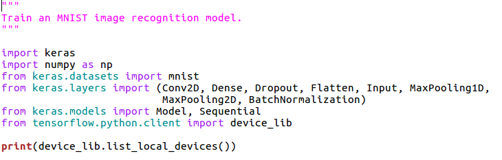
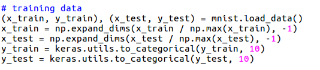
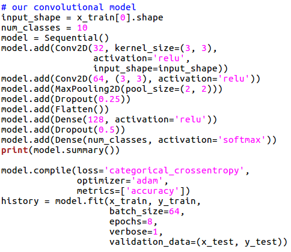
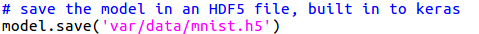
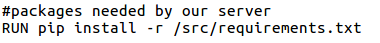
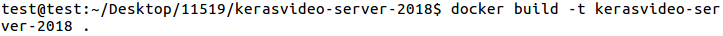
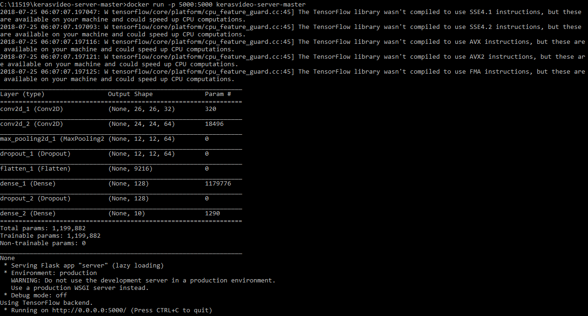
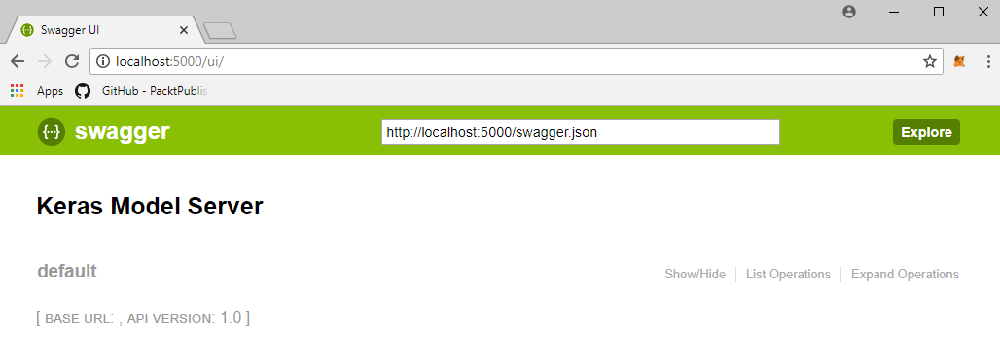

# 五、图像分类服务器

在这一章中，我们将采用我们所学过的机器学习模型，并将它们转化为用于图像分类的 REST 服务器。

在本章中，我们将讨论以下主题:

*   用 OpenAPI 或 Swagger 定义 REST API
*   创建 Docker 容器以创建可重复的构建环境
*   使用我们的 API 进行预测，并通过 HTTP 发布图像


# REST API 定义

让我们从定义 REST API 开始。这由四个活动组成:用 git 从 GitHub 获取项目源代码；安装必要的软件包并检查运行我们的服务器所需的软件包；在 YAML 编辑和创建 OpenAPI 或 Swagger 定义文件；然后最后处理代码中的后期图像，REST API 将实际的图像文件转换为张量。

首先，我们需要克隆我们已经提供的存储库，以便拥有 REST 服务。我在 HTTPS 得到这个，用命令行克隆它:

```py
$ git clone https://github.com/wballard/kerasvideo-server/tree/2018.git
```

你可以把它放在任何你喜欢的目录里。之后，我们将能够在本节的剩余部分以及本书的剩余章节中使用这些源代码:


Kerasvideo-server-2018 中的文件

使用我本地安装的 Python，我实际上是在这里使用`pip`来安装这个服务的需求:

```py
$ pip install -r requirements.txt
```

将它们安装到我们正在使用的 Python 中将允许我们以调试模式在本地运行服务。然而，如果您只是要检查源代码并运行和构建 Docker 容器(我们稍后会讲到)，则没有必要执行这一步。

让我们打开我们的`models.yaml`文件:


Models.yaml 文件

这个 YAML 文件是一个 Swagger API 定义，也称为 OpenAPI。在这个文件中，API 是以声明方式定义的；我们指定端点、配置、参数、返回代码和作为运行时文档的附加注释。在文件的开头，我们指定它是 Swagger 2.0，这是当今最常用的 OpenAPI 版本。然后，紧接着，我们有一个信息块，它实际上只是描述我们的 API 的名称，并作为版本号和标题；这只是关于我们的 API 的描述性元数据。大部分配置与路径有关。从前面的截图可以看出，我们有`/mnist/classify`。这实际上是我们主要的 API 端点和定义。我们指定它需要一个 post 我们有摘要描述和操作 ID。操作 ID ( `mnist.post_image`)是当我们实际启动它时绑定到框架中的代码的东西。如果您仔细观察，您会发现它消耗了多部分/表单数据，这意味着我们实际上将向这个 API 端点发布一个文件，就像您上传一个带有 HTML 表单的文件一样。最后，这将返回 JSON，结果代码为 200。关于这个定义有趣的事情是，我们几乎完成了我们的服务器。通过用 YAML 声明 API，然后我们用很少的代码将它结合起来，使用连接框架来提供 REST API。

我们来看看吧！我们将打开我们的`server.py`:


server.py 文件

这是我们将用来为我们刚刚作为 REST 服务器创建的 YAML 配置提供服务的实际代码。如你所见，很简单。我们指定一个端口，使用该名称和端口创建一个连接应用，并使用`models.yaml`添加一个 API。这可能是您创建过的最简单的 web 服务器或 REST 服务器，因为连接框架使用我们刚刚创建的 YAML 定义来动态创建 REST 端点，然后映射到最后一段实际服务的代码。

现在让我们来看看:


mnist.py 文件

这最后一段代码是我们的 MNIST 模块。如果你记得 YAML，我们有`mnist.post_image`，这意味着模块 MNIST，和功能`post_image`。你可以在前面的`mnist.py`文件中看到，我们正在导入几段代码，即`PIL`，这是我们将用来处理图像的图像库。从这里，我们将对`MNIST_MODEL`号进行预加载。这是包含经过训练的机器学习模型的模块级变量；我们将在下一节中研究这个模型。现在，这个`post_image`方法的工作是获取一个文件，这是一个通过 HTML 多部分形式发布的文件，将它作为字节(在这里您可以看到我们有`file.read`)，并使用`Image.open`将它转换成一个图像:


使用枕头命令

这实际上是将上传文件的字节流转化为内存中的图像对象。因为我们已经在 28 x 28 的标准尺寸图像上训练了`MNIST_MODEL`，所以我们必须调整图像的大小(以防你发布的图像比我们习惯的要大)，然后将其灰度化(同样，以防你发布的是彩色图像)。因此，我们在这里对数据进行标准化，以符合`MNIST_MODEL`的预期。有了这些，我们将调整它的大小。我们将使用我们所学的关于创建样本和批次的知识来调整该图像的大小。因此，第一个维度是 1，这是样本(同样，在这个样本中只有一个图像，我们张贴)；28 x 28 是尺寸；然后我们有 1，这是通道的数量(这里，它只是灰度)。我们得到这组数据并预测它。这将返回一个数字数组，这些数字是从 0 到 9 的独热编码。我们还必须反转一键编码，这就是`argmax`的作用。如果您还记得，它是一批 1，所以我们用返回数组的元素挑选出 0 来匹配我们的输入，然后使用`argmax`来找到我们被分类为哪一个数字(同样，反转一位热编码)。最后，我们将它作为一小段 JSON 代码返回。

JSON 编码器不理解 NumPy 整数类型，所以我们只是快速转换成 Python 整数。

既然我们已经了解了如何使用连接来创建 REST 服务并将其与 Keras 模型挂钩，那么让我们来看看如何将它转换成 Docker 容器，这样我们就可以拥有一个可重新创建、可部署的运行时环境。


# 码头集装箱中的训练模型

在上一节中，我们看了如何创建一个 REST 服务器来对图像进行分类。在这一节中，我们将研究如何准备一个 Docker 容器来为服务器创建一个合理的运行时环境。当我们研究这个问题时，我们会问这样一个问题:*为什么要用 Docker 来打包我们的机器学习模型？*然后，我们将实际调查模型训练，然后将训练好的模型保存在 Docker 容器中使用，随后是我们的服务器 Dockerfile，它会将所有这些打包在一起。最后，我们将为 REST 服务的可重用运行时构建 Docker 容器。

那么，为什么是 Docker？从根本上说，它使你的训练模型可移植。与您创建的大多数程序不同，它们大多是带有单独数据库的代码，机器学习模型通常会有一个相对较大的文件集，这些文件是存储的学习网络。这些文件通常太大，无法签入 GitHub 或通过其他方便的方式部署。虽然有些人会将它们发布在 S3 或其他文件共享解决方案上，但在我看来，将 REST 服务的运行时代码与经过训练的模型打包在一起，提供了一种创建可移植运行时环境的好方法，您可以跨多个不同的云提供商使用该环境，包括 Amazon、Microsoft 和 Kubernetes。

现在，让我们看看我们的`train_mnist` Python 源文件。这是一个只需从命令行运行的脚本。它将训练一个 Keras 模型，以便预测 MNIST 数字。这与我们在前面几节中所做的非常相似，正如您在下面的屏幕截图中所看到的，我们为 Keras 模型导入了所有必要的层，然后打印出我们本地设备的外观:



train_minst 文件

然后，我们加载训练和测试数据，就像我们在前面几节中所做的那样，我们从 Keras 预先打包的 MNIST 数字和模型中提取这些数据。最后，我们将其转换为分类数据(同样，使用一键编码)以预测数字:



培训用数据

为了打包到这里，我们将要训练的模型是一个相对简单的卷积模型，类似于我们在前几章中探索的模型:



卷积模型

我们使用 sequential 将一个`input_shape`减少到十个类，并使用两个卷积序列来构建特性。我们将使用 max pooling 来减少这种情况，dropout 来防止过度拟合，然后用 128 层激活将其展平到最终输出，这样我们就可以再进行一次 dropout。最后，我们将使用 softmax 执行密集编码。请记住，softmax 是我们将最终分数转换为每个类别的一组概率的方法。

然后，我们会用一个以前没用过的东西，就是`model.save`:



将模型保存在 HDF5 文件中

实际上，我们将在完成学习算法的拟合后保存整个预训练模型，以获得一个`.h5`文件，它实际上是一组矩阵定义、我们学习到的实际值以及整个网络的形状，以便我们可以加载并重用我们的训练网络。关于这个训练脚本，我们将在 Docker 文件中使用它，这样我们就可以创建一个 Docker 容器，并在 Docker 映像中存储预先训练和保存的模型。

这里，我们来看一下 Docker 文件:


Docker 文件

这就是我们要利用我们的培训脚本并打包一个可重用容器的地方。我们从之前准备 docker 文件时使用的同一个 NVIDIA 映像开始，我们将安装几个包，这些包对于 Python Miniconda 的完全支持是必要的。但是这里最大的不同是，我们没有使用 Anaconda，它是一个包含许多包的完整发行版，而是使用 Miniconda，它是一个精简的、高度可移植的 Python 发行版，我们只在它上面安装必要的包。现在我们已经安装了 Miniconda，我们将创建一个用户来运行这个 Keras，然后将我们签出源代码的当前目录复制到 Docker 容器上的 SRC 目录中，这将作为我们的构建路径点。然后，我们将`pip install`需求，这将引入 TensorFlow 和 Keras 连接，以及用于保存模型的`h5` Python 库:



我们的服务器需要的包

这里是不同的部分:我们实际上将训练我们的模型作为 Docker 构建文件的一部分，这将创建一个模型，训练它，并保存它。但是，它将把它保存到 Docker 容器中，这样当我们构建 Docker 容器映像时，或者当我们分发它或在其他地方使用它时，这个经过训练的文件将随之而来。最后，我们使用`run`命令来运行 REST 服务，这将利用存储在 Docker 映像中的经过训练的模型文件:


运行我们的休息服务

现在，我们将构建我们的容器；我们使用了`docker build`命令，并再次使用`-t`在`kerasvideo-server`中标记它。`.`表示我们正在运行当前目录中的 Dockerfile:



docker 构建命令

在我的系统上，这需要相当长的时间。用 CPU 训练它大约需要 30 分钟才能完成。这将根据您计算机的性能或您是否启用了 GPU 支持而有所不同。最后，我们将拥有一个准备运行的 Docker 容器，这样我们就可以将它用作我们的 REST 服务器环境:


码头集装箱

现在我们已经构建了一个 Docker 容器，上面有一个经过训练的模型和一个 REST 服务，我们将运行这个服务来进行预测。


# 做预测

在前一节中，我们设置了 Docker 容器，现在，在这一节中，我们将使用 Docker 容器运行 REST 服务器并进行预测。我们将运行我们刚刚创建的 Docker 容器，然后查看连接的内置用户界面来测试我们的 REST 服务。最后，我们将通过 REST 服务发布一张图片，这样我们就可以看到预测结果。我们还将看到如何使用 curl 调用您的服务，这是一个可以发布文件的命令行程序。

现在，我们将启动我们的 Docker 容器。我们将把本地端口`5000`映射到容器端口`5000`，这是 REST 服务中的默认端口。然后，我们将启动服务。`kerasvideo-server`容器是我们刚刚创建的容器，这个容器需要一秒钟启动并导入 TensorFlow。然后，我们将加载模型，并通过端口`5000`上的本地 IP 地址为其提供服务:



模型的加载

因此，我们在浏览器中打开 localhost `5000/ui`,我们得到一个由记录了 Swagger API 的连接自动生成的用户界面:



用户界面

您可以看到我们已经创建的端点(`mnist/classify`)，您只需单击并展开它，就可以查看我们的实施说明、描述、参数、响应类型和我们的文件上传:


探索默认选项

然后，我们将继续抓取我存储在磁盘上的一个`sample`数字，我们将把它发布到我们的 API 中进行试用！左下角的按钮。这将实际上为我们运行我们的 API。这显示了我们将在这里使用的来自命令行的等效的`curl`命令，以及请求 URL。下面是我们从响应主体返回的答案，它正确地将这个数字归类为一个`0`:


最终输出(回复正文)

现在，让我们从命令行尝试一下。从命令行来看，这是一个相对简单的操作。实际上，我们将在 UNIX 命令提示符下使用`curl`,使用`-F`提交表单数据。我们有`file=`，这里是`@`变量名的诀窍，所以它是`@var/data/sample.png`，这是我们的样本图像。然后，我们将它传递给 URL，这是我们的服务，我们将看到它正确分类:

```py
$ curl -F file=@var/data/sample.png http://localhost:5000/mnist/classify
```

curl 命令的使用

现在，你必须记住,`file=`是匹配我们在 API 定义 YAML 中为 Swagger 创建的参数名，多部分表单数据是我们发布和上传图像的方式。因此，有了这种基本的技术，你可以使用`curl`，或者你可以使用其他的客户端库，比如说，从 web 浏览器，来将你的机器学习服务集成到你的应用的其余部分。


# 摘要

我们实际上使用了一个 Swagger API 定义来创建一个 REST API 模型，然后声明性地生成 Python 框架，以便我们为该 API 提供服务。我们只需要输入很少的代码就可以让它运行起来。然后，我们创建了一个 Docker 容器，它不仅捕获我们的运行代码(即我们的服务)，还捕获我们预先训练的机器学习模型，然后形成一个包，以便我们能够部署和使用我们的容器。最后，我们使用这个容器来提供服务和进行预测。