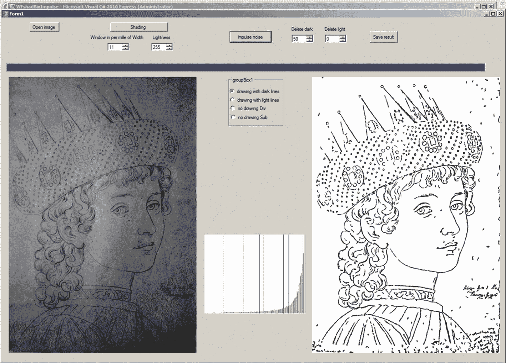

# 5.项目`WFshadBinImpulse`

我们还开发了项目`WFshadBinImpulse`，其中结合了阴影校正、阈值处理和脉冲噪声抑制等程序。这种组合对于处理旧图纸照片的图像特别有用(参见图 [2-8](02.html#Fig8) )。本项目的形式如图 [5-1](#Fig1) 所示。

图 5-1

项目的形式`WFshadBinImpulse`

点击打开图像，用对话框`OpenFileDialog`启动项目的常规部分。项目的这一部分还定义了七个类别的图像`CImage` — `OrigIm`、`SigmaIm`、`GrayIm`、`MeanIm`、`ShadIm`、`BinIm`和`ImpulseIm`。

用户应该通过选择四个选项中的一个来指定图像的种类:用深色线条绘制，或用浅色线条绘制，无绘制 Div，或无绘制 Sub。参数`Window in per mille of Width`、`Lightness`、`Threshold`的初始值以及抑制脉冲噪声的参数将根据这些选项的选择自动设置。用户可以通过相应的`numericUpDown`工具修正这些值。`Window`将被指定为原始图像宽度的一部分，单位为千分之一，如前所述。以图像宽度的千分之一而不是直接以像素来指定是必要的，因为窗口的最佳宽度取决于图像的大小，但是用户通常不知道图像有多大。

在用户指定了图像类型后，他或她应该单击底纹。对于阴影校正，通过前面描述的方法`FastAverageM`计算图像的局部平均亮度。然后通过第 [4](04.html) 章中描述的`CorrectShading`方法计算图像`SubIm`和`DivIm`。阴影校正后的图像显示在右侧的图片框中。用户可以校正参数的建议值，以获得可能的最佳校正图像。

`CorrectShading`方法还绘制阴影校正图像的直方图。用户可以通过单击直方图来指定阈值。阈值图像会立即显示。

用于抑制脉冲噪声的方法的参数的建议值也被自动设置。然而，用户应该测试这些参数的一些值。

如果图像是一幅图画，用户应在`pictureBox1`(原始图像)中围绕图像中不应消除小斑点(如人的眼睛)的部分绘制小矩形。用户应该用鼠标点击矩形的左上角和右下角。矩形以蓝色显示。在脉冲噪声抑制运行后，可以重新定义这些矩形。最多可以画六个矩形。称为`maxNumber`的矩形的加倍最大数量在`Form1`的开头定义。

如果用户对阴影校正和阈值处理的结果感到满意，那么他或她可以通过点击脉冲噪声来开始抑制脉冲噪声，该脉冲噪声在阈值图像中被视为小的黑色和白色斑点。如果用户对获得的结果不满意，他或她可以通过相应的`numericUpDown`工具尝试更改删除暗和删除亮的值。这些值指定了应该删除的斑点中的最大像素数。

如果用户对最终结果满意，那么他或她可以保存结果。需要点击保存结果，选择正确的目录，用扩展名`.bmp`或`.jpg`指定结果图像的文件名。