# 六、边缘检测

在已知的边缘检测方法中，简单的梯度滤波器包含某种图像平滑。索贝尔滤波器是一个常见的例子。它由两个权重矩阵定义，如图 [6-1](#Fig1) 所示。

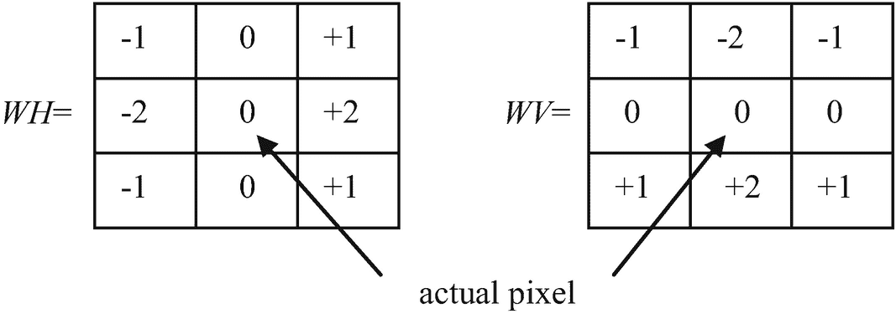

图 6-1

Sobel 滤波器的权重

该滤波器计算实际像素的滑动 3 × 3 邻域中的灰度值与图 [6-1](#Fig1) 所示的相应权重 *WH* 和 *WV* 的乘积的两个和 *SH* 和 *SV* ，并返回绝对值| *SH* | + | *SV* |。该值大于给定阈值的像素属于边缘。由于边缘太厚，结果一般不令人满意。

其他已知的边缘检测方法是拉普拉斯 Kimmel (2003)和 Canny (1986)滤波器的零交叉。下面我将把这些方法与我们新的相当简单有效的方法进行比较。

## 拉普拉斯算子

一种有效的边缘检测方法是拉普拉斯的零交叉。拉普拉斯算子在数学上被定义为二阶偏导数的和:

Lap( *F* ( *x* 、*和*)=<sup>**(*x*，【t】**</sup>

 *因为数字图像是不可微的，所以有必要用有限差分来代替导数。

**定义 1:** 表达式 *D* <sub>1</sub> ( *x* ，δ*x，F*)=*F*(*x*+δ*x*)-*F*(*x*)称为 F ( *x* )的*第一差就*

**定义二:**表达式*D*<sub>T5】n</sub>(*x*，δ*x，F*)=*D*<sub>1</sub>(*x*，δ*x*，*D*<sub>*n*-1</sub>(*x*相对于 *x* 和 *y* 的第二偏差值等于

*d*<sub><sub>(*x*， *x，f*=*(*x*-【t】*</sub></sub>

 **d*<sub><sub>(*y*， *y，f*=*(*，**</sub></sub>

 ***并且δ*x =*δ*y*= 1 的有限拉普拉斯算子等于

<sup>2</sup>*【f】*(*x*、*和*=*f*(*x*–1

 *可以用图 [6-2](#Fig2) 所示的滤波器在数字图像中进行计算。

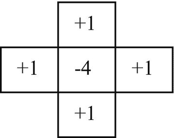

图 6-2

用于计算有限拉普拉斯算子的滤波器

将该滤波器应用于具有灰度值 *F* ( *x* ， *y* )的数字图像产生以下值:

<sup>2</sup>*【f】*(*x*、*和*=*f*(*x*–1

 *等式 6.1 可以改写如下:

<sup>2</sup>*【f】*(*x*、*和*=*f*(*x*–1 **和*+*f*(*x*、*y*+1)-5*(*x*、**

 **= 5 *M* ( *x* ， *y* ) - 5 *F* ( *x* ，*y*)= 5(*M*(*x*，*y*)-*F*(*x*，*y*)(6.2)

其中 *M* ( *x* ， *y* )为坐标为( *x* ， *y* )的像素邻域内五个像素的 *F* ( *x* ， *y* )的平均值。也可以通过从 *P* 邻域的局部均值中减去 *P* 的灰度值，计算出像素 *P* = ( *x* ， *y* )中的有限拉普拉斯算子。当使用更大的邻域时，最好使用快速平均滤波器(第 [2](02.html) 章)。

## 过零方法

过零方法基于检测拉普拉斯变换符号的位置。考虑图 [6-3](#Fig3) 所示的一行数字灰度图像的横截面。

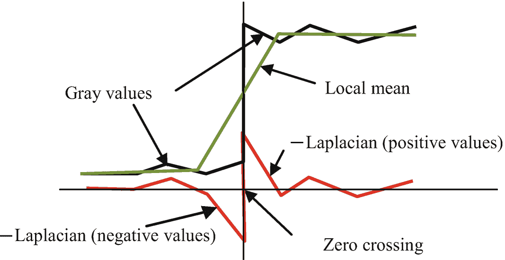

图 6-3

一行数字图像的横截面

拉普拉斯算子在边的一侧有正值，在另一侧有负值。与远离边缘的位置上的拉普拉斯值相比，边缘附近的拉普拉斯绝对值较大。使用拉普拉斯的负值更实际——即值( *F* ( *x* ，*y*)——平均值)而不是值(平均值——*F*(*x*，*y*)——因为这些值在更大的灰度值下更大。

拉普拉斯变换其符号的位置被称为*零交叉*。这些位置中的一些对应于边缘的位置。零交叉总是位于两个像素之间。因此，边缘位置的这些指示总是非常微弱。

## 拉普拉斯曲线的过零点是闭曲线吗？

在一些图像处理的教科书中提出的拉普拉斯算子的一个优点是，拉普拉斯算子产生的边缘总是封闭的直线。然而，只有当我们设定拉普拉斯值的阈值时，这才是正确的；例如，如果我们用 1 代替拉普拉斯的正值，用 0 代替负值。然而，在这样的图像中具有值 1 的像素组的边界是闭合曲线的事实是二进制图像的优点，而不是拉普拉斯的优点。这些边缘如图 [6-4b](#Fig4) 所示。用等于 0 的阈值二值化的拉普拉斯图像中的大多数边缘是不相关的。

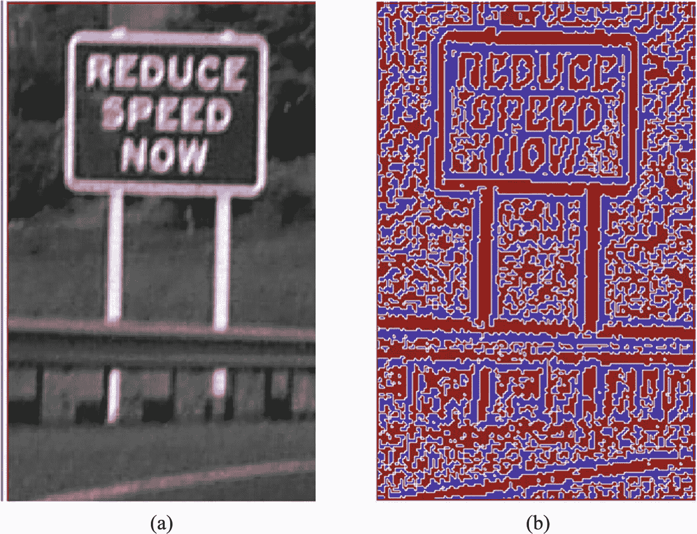

图 6-4

(a)原始图像，以及(b)用阈值 0 二值化的拉普拉斯算子；边缘显示为白线

如你所见，图 [6-4b](#Fig4) 中的绝大多数白线完全没有意义，不能作为边缘。这些就是所谓的无关过零点。

图 [6-5](#Fig5) 显示了拉普拉斯不相关零交叉的解释。黑线显示原始图像的灰度值。绿线代表灰度值的局部均值，红线是拉普拉斯算子。红色箭头表示不相关的过零事件。在这些位置的拉普拉斯值很小，而在相关交叉点的拉普拉斯绝对值很大。

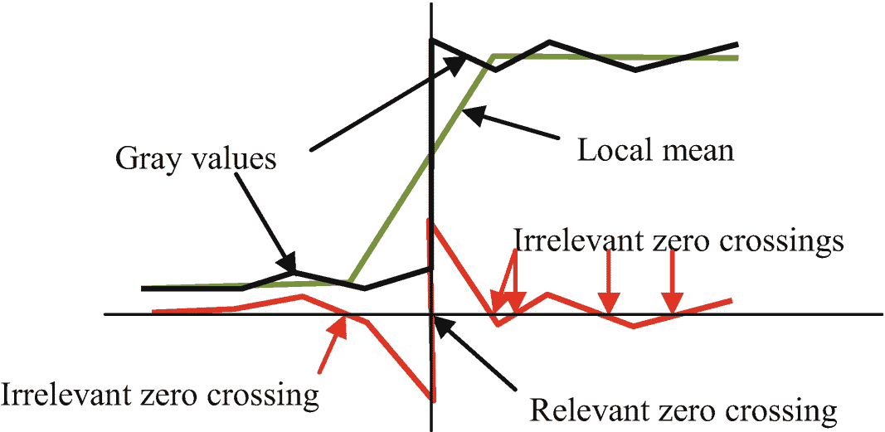

图 6-5

拉普拉斯算子的不相关过零点(红色箭头)

我们将在下一节解释如何消除不相关的过零事件。

## 如何消除不相关的交叉

不相关的交叉可以通过两个阈值与相关的交叉区分开:只有从大于正阈值的拉普拉斯值到小于负阈值的拉普拉斯值的转变才应该被识别为相关的边缘。大多数不相关的边缘会消失，但一些相关的边缘会因图像中的噪声而中断。应对图像进行滤波以降低噪声，例如使用最简单的均值滤波器(第[章第 2](02.html) 节)。图像应该被过滤两次:用一个小的和一个大的滑动窗口。这两个滤波图像之间的差异可以被认为是拉普拉斯算子的良好近似。

考虑图 [6-6b](#Fig6) ，图中一行的灰度值显示为一条蓝线。拉普拉斯值显示为绿线。黑线是 x 轴；红线显示用于区分相关和不相关过零事件的阈值。如果零交叉位于两个这样的像素之间，其中一个像素的拉普拉斯值大于正阈值，而另一个像素的拉普拉斯值小于负阈值，则零交叉是相关的。

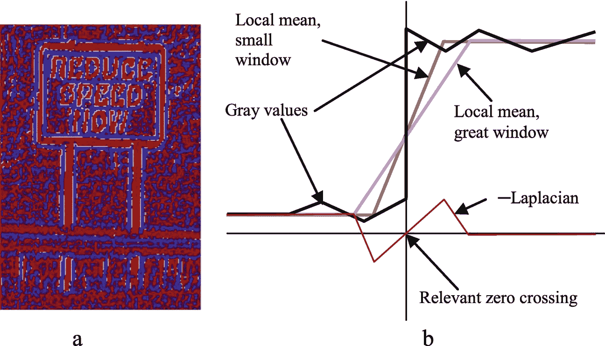

图 6-6

(a)用两个阈值(白线)找到的边缘，以及(b)解释

图 [6-7](#Fig7) 解释了如何消除不相关的过零事件。

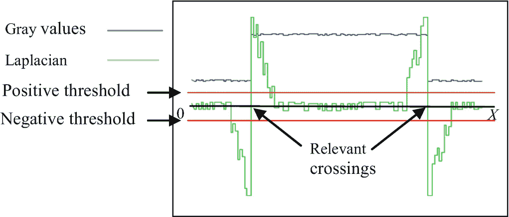

图 6-7

拉普拉斯值的一个例子

## 使用拉普拉斯算子之前的降噪

使用均值滤波器降噪时，边缘会变得模糊。结果，拉普拉斯的正值和负值之间的差异变小；拉普拉斯值逐渐变化。这使得很难区分相关和不相关的过零事件。我们建议使用 sigma 滤波器(第[章第 2](02.html) 节)，而不是使用小窗口求平均值。那么边缘保持陡峭；拉普拉斯算子的绝对量变得更大。

图 [6-8a](#Fig8) 中的黑线显示了通过小窗口平均过滤的灰度值。在图 [6-8b](#Fig8) 中，黑线代表用西格玛滤波器过滤的灰度值。对于两者，绿线代表具有较大窗口的局部平均值，红线显示拉普拉斯值。

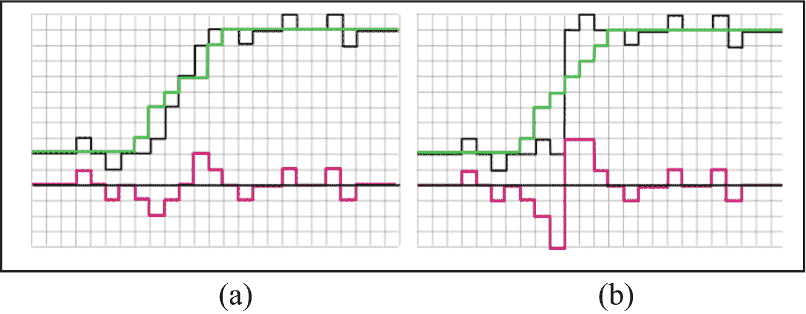

图 6-8

使用(a)平均和(b) sigma 滤波器滤波后的灰度和拉普拉斯值

## 数字化和极值滤波过程中的模糊

在图像的数字化过程中，即使是理想的边缘也会变得有些模糊。其原因是，投影到一组光敏元件(例如，CCD、电荷耦合器件、各种设备中使用的电子光传感器，包括数码相机)的图像中的亮区和暗区之间的边界偶尔会落在元件的中心附近，如图 [6-9](#Fig9) 所示。

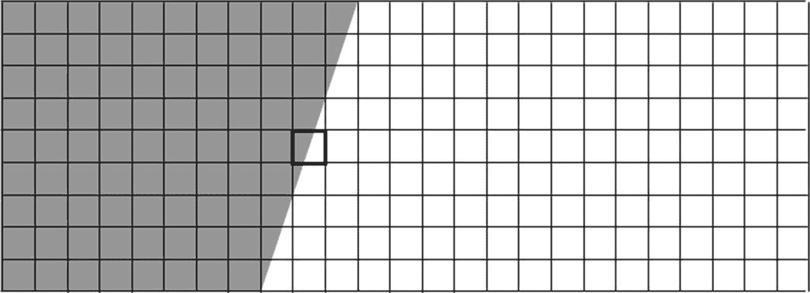

图 6-9

CCD 矩阵由一个暗区和一个亮区照明

这个元素获得一个光量，我们称之为*中间值，*位于适合亮区和暗区的值之间。相应的像素位于边缘的中间，并且拉普拉斯算子获得小的值或者甚至零值。检测到的边缘出现间隙，如图 [6-10](#Fig10) 所示。

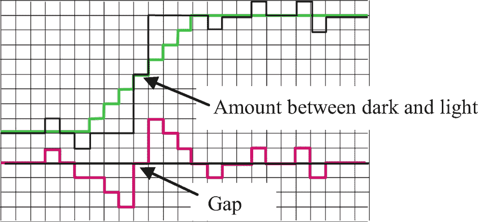

图 6-10

灰度值(黑线)、局部平均值(绿线)和拉普拉斯算子(红线)

我们建议使用极值过滤器来避免中间值导致的拉普拉斯间隙。这个应用于灰度图像的滤波器在一个小的滑动窗口中计算最大和最小灰度值。它还计算中心像素的灰度值与最大值和最小值之间的差异，并决定这两个值中的哪一个更接近中心值。更接近的值被分配给输出图像中的中心像素。边缘变得清晰，拉普拉斯间隙消失。这里是灰度图像的极端过滤器的源代码。

```py
int CImage::ExtremVar(CImage &Inp, int hWind)
{ N_Bits=8; width=Inp.width; height=Inp.height;
  Grid=new unsigned char[width*height];
  int hist[256];
  for (int y=0; y<height; y++) // ================================
  { int gv, y1, yStart=__max(y-hWind,0), yEnd=__min(y+hWind,height-1);
     for (int x=0; x<width; x++) //============================
    { if (x==0) //-------------------------------------------------------
      { for (gv=0; gv<256; gv++) hist[gv]=0;
         for (y1=yStart; y1<=yEnd; y1++)
         for (int xx=0; xx<=hWind; xx++)
                                  hist[Inp.Grid[xx+y1*width]]++;
      }
      else
      { int x1=x+hWind, x2=x-hWind-1;
         if (x1<width)for (y1=yStart; y1<=yEnd; y1++)
             hist[Inp.Grid[x1+y1*width]]++;
         if (x2>=0)
          for (y1=yStart; y1<=yEnd; y1++)
          { hist[Inp.Grid[x2+y1*width]]--;
             if (deb && hist[Inp.Grid[x2+y1*width]]<0) return -1;
          }
      } //---------------- end if (x==0) ---------------------------------
      int gMin=0, gMax=255;
      for (gv=gMin; gv<=gMax; gv++)
        if (hist[gv]>0) { gMin=gv; break; }
      for (gv=gMax; gv>=0; gv--)
        if (hist[gv]>0) { gMax=gv; break; }
      if (Inp.Grid[x+width*y]-gMin<gMax-Inp.Grid[x+width*y])
         Grid[x+width*y]=gMin;
      else Grid[x+width*y]=gMax;
    } //=============== end for (int x... ================
  } //================ end for (int y... =================
  return 1;
} //******************* end ExtremVar *********************

```

这里是彩色和灰度图像的通用极端方法的源代码。

```py
public int ExtremLightUni(CImage Inp, int hWind,Form1 fm1)
/* The extreme filter for color or grayscale images with variable hWind. The filter finds in the (2*hWind+1)-neighborhood of the actual pixel (x,y) the color "Color1" with minimum and the color "Color2" with the maximum lightness. "Color1" is assigned to the output pixel if its lightness is closer to the lightness of the central pixel than the lightness of "Color2". --*/
{
 byte[] CenterColor = new byte[3], Color = new byte[3], Color1 =
  new byte[3], Color2 = new byte[3];
  int c, k, nbyte = 3, x;
  if (Inp.N_Bits == 8) nbyte = 1;
  for (int y = 0; y < height; y++) // ====================================
  {
    if (y % jump == jump - 1) fm1.progressBar1.PerformStep();
    for (x = 0; x < width; x++) //======================================
    {
      for (c = 0; c < nbyte; c++) Color2[c] = Color1[c] = Color[c] =
                                 CenterColor[c] = Inp.Grid[c + nbyte * (x + y * width)];
      int MinLight = 1000, MaxLight = 0;
      for (k = -hWind; k <= hWind; k++) //==============================
      {
        if (y + k >= 0 && y + k < height)
          for (int i = -hWind; i <= hWind; i++) //==========================
          {
            if (x + i >= 0 && x + i < width) // && (i > 0 || k > 0))
            {
              for (c = 0; c < nbyte; c++)
                           Color[c] = Inp.Grid[c + nbyte * (x + i + (y + k) * width)];
              int light;
              if (nbyte == 3) light= MaxC(Color[2], Color[1], Color[0]);
              else light = Color[0];
              if (light < MinLight)
              {
                MinLight = light;
                for (c = 0; c < nbyte; c++) Color1[c] = Color[c];
              }
              if (light > MaxLight)
              {
                MaxLight = light;
                for (c = 0; c < nbyte; c++) Color2[c] = Color[c];
              }
            }
          } //=============== end for (int i... =======================
      } //=================== end for (int k... ======================
      int CenterLight = MaxC(CenterColor[2], CenterColor[1], CenterColor[0]);
      int dist1 = 0, dist2 = 0;
      dist1 = CenterLight - MinLight;
      dist2 = MaxLight - CenterLight;
      if (dist1 < dist2)
        for (c = 0; c < nbyte; c++)  Grid[c + 3 * x + y * width * 3] = Color1[c]; // Min

      else
        for (c = 0; c < nbyte; c++)  Grid[c + 3 * x + y * width * 3] = Color2[c]; // Max

    } //================== end for (int x... ==========================
  } //==================== end for (int y... ==========================
  //fm1.progressBar1.Visible = false;
  return 1;
} //********************** end ExtremLightUni ***************************

```

考虑在使用 sigma 滤波器和极值滤波器之后通过拉普拉斯过零方法(阈值= 10)检测的边缘的例子。图 [6-11](#Fig11) 显示了原始图像的灰度值(图 [6-11a](#Fig11) )以及用滤波器对图像进行连续步骤处理后的图像:用西格玛滤波器(图 [6-11b](#Fig11) )、用极值滤波器(图 [6-11c](#Fig11) )和带边缘的拉普拉斯算子(图 [6-11d](#Fig11) )处理后的图像。拉普拉斯正值显示为红色，负值显示为蓝色，过零点显示为白色线条。

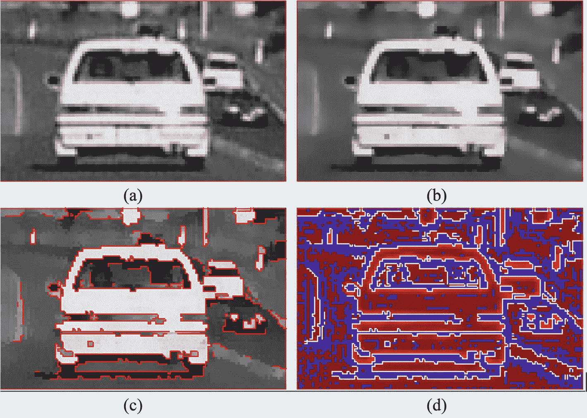

图 6-11

具有拉普拉斯零交叉的边缘检测的例子:(a)原始图像，(b) sigma 滤波的，(c)极端滤波的，以及(d)具有边缘的拉普拉斯算子(白线)

如你所见，边缘检测相当成功。然而，在下一节中解释了边缘中的一些间隙。

## 拉普拉斯零交叉法的基本误差

拉普拉斯算子具有一个基本性质，即它的过零点序列在三个或四个序列相交的点的邻域中一定有间隙。图 [6-12](#Fig12) 提供了一个例子。图 [6-12](#Fig12) 显示了人工图像(a)、通过过零方法检测到的边缘(b)、理想边缘(c)以及拉普拉斯符号的值(d)。红色像素是拉普拉斯值为正值的像素，蓝色像素是负值的像素。过零点在图 [6-12d](#Fig12) 中显示为白线。

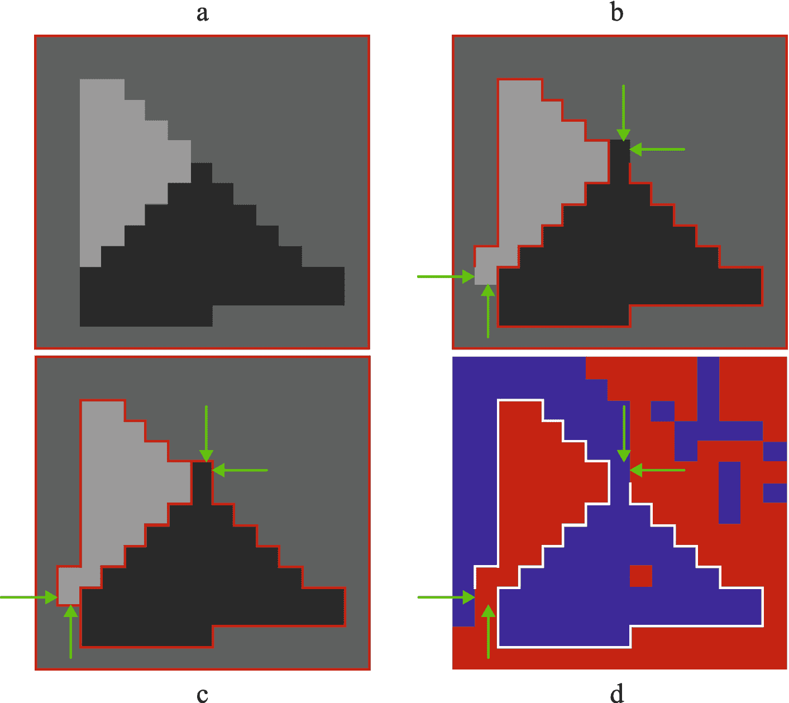

图 6-12

(a)带有噪声的人工图像，σ= 5；(b)在 sigma 和极端滤波之后图像上的过零点；理想的边缘；以及(d)拉普拉斯算子上的过零点(红色是正值)

注意图 [6-12](#Fig12) 中由绿色箭头标记的基本误差导致的边缘缺失。这些被认为是基本误差，因为不可能消除它们。出现这些误差是因为拉普拉斯算子是局部平均值和实际灰度值之间的差。零交叉位于拉普拉斯算子的正值像素和负值像素之间。这些像素中的一个像素的灰度值大于局部平均值，而另一个像素的灰度值小于局部平均值。然而，如果在滑动窗口中有两个以上不同的灰度值，则局部平均值只能位于两个灰度值之间。第三灰度值不能有零交叉。因此，边缘有一个间隙。由于这些间隙，通过拉普拉斯零交叉产生的边缘不包含分叉。

这些错误非常重要，因为边通常用于生成表示具有恒定颜色的区域边界的多边形。缺少分叉会使这些多边形不完整，因为它们没有正确描述区域的边界。*********