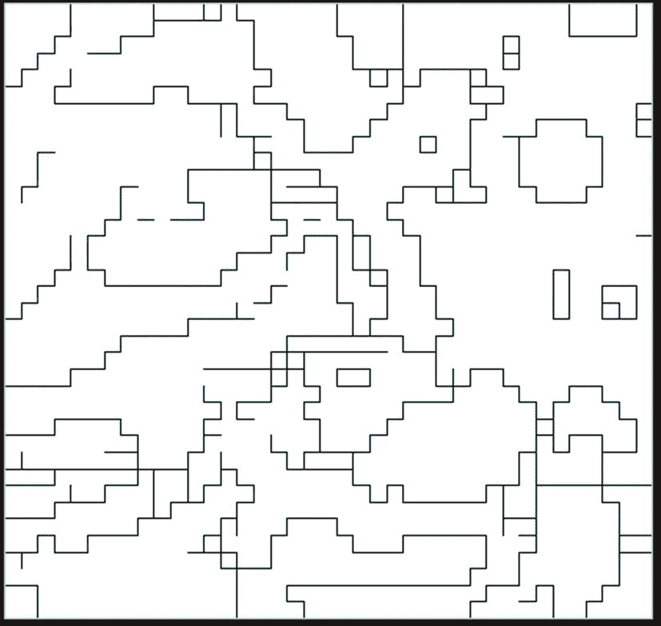
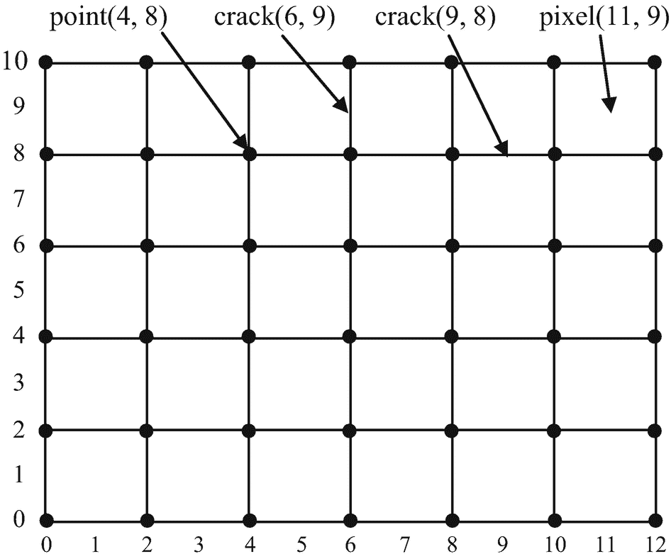
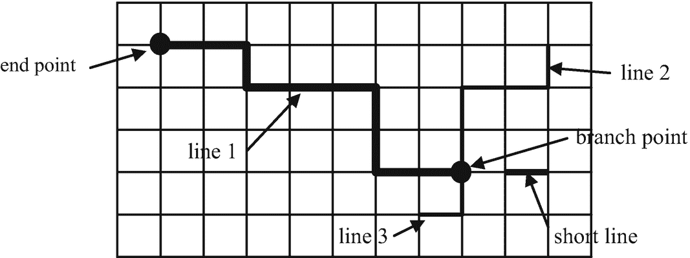
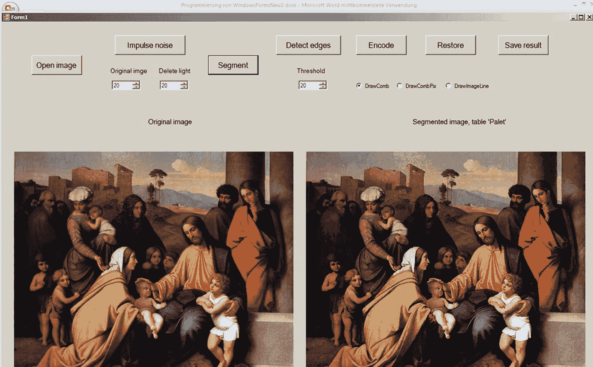
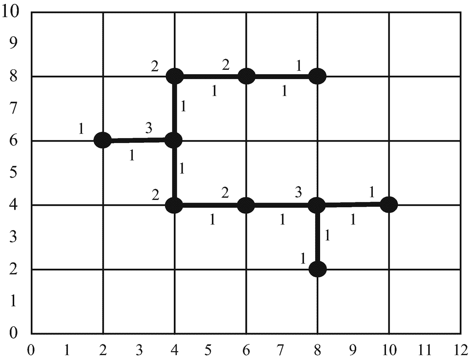

# 八、一种新的图像压缩方法

提出了一种新的基于边缘检测的图像压缩方法。这个想法是基于这样的假设，即图像中的重要信息位于靠近边缘的像素中。所有其他像素仅包含颜色的均匀分布，这可以通过用有限差分法数值求解偏微分方程来重建。这里我们用上一章描述的方法进行边缘检测。我们将边缘表示为 ACC，如第 [7](07.html) 章所述。这种表示具有优势，因为边缘的元素是由两个相邻像素的颜色差异定义的。因此，边缘的元素既不属于这两个像素，而是属于位于这两个像素之间的空间元素。这种空间元素在数字图像中不存在；但是，它存在于 ACC 中。这是被称为裂缝的一维单元，而像素是二维单元。裂缝的两端是称为点的零维单元。当把像素看成小方块时，裂缝就是这些方块的边；点是他们的角，是裂缝的终点。

这些边缘构成了一个细线网络，这些细线是一系列裂纹和点，其中每条线段要么是一条闭合曲线，要么是一个序列，其起点和终点要么是三条或四条线段相交的分支点(图 [8-1](#Fig1) )。



图 8-1

边缘的例子

这种结构可以用所谓的小区列表来描述。单元格列表的概念基于将图像表示为 ACC(参考 Kovalevsky (1989，2008))。

## 使用单元复合体对边界进行编码

将数字图像视为 ACC 通过对子集的边界进行编码带来了优势:表示为一系列裂缝和点的边界变成了具有零面积的细曲线；区域的边界和它的补集的边界是相同的。数字曲线尤其是数字直线的定义和处理变得更加简单和清晰。从图像的经济编码和精确重建的角度来看，最重要的优点是能够使用极其简单和快速的算法来填充裂纹边界的内部，这种算法在将边界表示为像素组时无法应用。

第 [7](07.html) 章简要总结了对本演示重要的拓扑概念。更多细节和拓扑基础请参考 Kovalevsky (2008)。

我们经常需要欧几里得坐标来讨论模拟图像的数字化问题。为了保持在细胞复合体的框架中，我们建议将欧几里得坐标视为具有相对较大分母的有理数。这对应于任何计算机模型，因为计算机中的浮点变量是具有大分母的有理数。为了对细胞复合体中的边缘进行编码，我们使用大小为(2 *宽度+ 1)*(2 *高度+1)的图像，其中宽度*高度是原始图像的大小。我们称该图像为组合坐标中的图像或`CombIm`，因为该图像中被视为坐标的列数和行数指定了所有维度的细胞的位置`(`零、一和二)。与通常只包含像素的图像相比，在该图像中找到不同尺寸的细胞和跟踪边缘更加方便。组合坐标中像素的两个坐标都是奇数；一个裂纹有一个奇数和一个偶数坐标；一个点有两个偶数坐标。对比图 [8-2](#Fig2) 。



图 8-2

零维、一维和二维细胞的组合坐标

边由一系列裂纹和点组成。边缘不包含像素。边缘的裂缝位于不同颜色的两个像素之间。入射到边缘裂缝的两个像素的颜色具有大于预定阈值的差异。

图像的边缘集合由线组成，线是裂缝和点的连接序列。一条线可以关闭；在这种情况下，它不包含端点和分支点。闭合线的每一点都与两条裂纹相关。一条非闭合线的起点和终点与一条、三条或四条裂纹相关，但不与两条裂纹相关。一条线的每个内点恰好与两条裂纹相关(图 [8-3](#Fig3) )。



图 8-3

线条(粗体线段)、分支点和短线的示例

要完整地描述一幅图像的边缘，只需要一列线条。为了重建图像，知道与每条线的裂缝相关的像素的颜色就足够了。然而，这些颜色沿着一条线的一边几乎是不变的。如果位于一条线一侧的像素组中的颜色有很大变化，那么也会有垂直于该线的边缘裂纹；但是，没有这样的裂缝。因为线条一侧的颜色变化缓慢，所以将线条每一侧的颜色分别保存在线条开头和结尾的一个像素中就足够了。线的一侧的所有其他颜色可以通过在线的开始和结束处的这些颜色之间的插值来计算。

为了执行这种插值，需要知道线的所有元素的准确位置，这可以通过起点的坐标和线的所有裂纹的方向序列来指定。定向线的裂缝(即指定哪个点是起点)可以有四个方向之一:方向 0 向右，方向 1 向下，方向 2 向左，方向 3 向上。这样，可以非常节省地对图像的边缘线和相邻的颜色进行编码。图像边界的颜色对于重建也是必要的。只知道矩形图像四边的颜色就足够了。边界处的所有其他颜色都可以通过插值来计算。在该插值期间，也可以考虑与边界像素序列交叉的边缘裂缝处的颜色。

在对线侧的颜色和边界处的颜色进行插值之后，在线之间的区域中仍然存在大量像素，这些区域在所有插值之后仍然是空的。这些像素中的颜色可以通过沿着图像的行和列的线性插值来近似计算。这种插值必须从边界或线处的颜色开始，并且可以沿着一行继续，直到已经出现的颜色出现。可以沿着列进行类似的插值。然后每个像素获得两种颜色:一种来自沿行的插值，另一种来自沿列的插值。这两种颜色是平均的。经过这些插值后，颜色的分布不是很均匀。通过拉普拉斯偏微分方程的数字解进行平滑，可以使其更加均匀。经过这种平滑处理后，重建图像看起来与原始图像非常相似。

## 项目描述`WFcompressPal`

运行项目的形式如图 [8-4](#Fig4) 所示。



图 8-4

运行项目的形式`WFcompressPal`

当用户点击打开图像时，他或她可以选择一个图像，该图像将作为原始图像`OrigBmp`打开并显示在左侧图片框中。在项目的这个区块中定义了八个工作图像。必须将`OrigBmp`转换成工作图像`OrigIm`。软件`WindowsForms`建议通过`GetPixels`的方法访问位图的像素，这个方法相当慢。我们开发了一个更快的方法`BitmapToImage`，它使用了类`Bitmap`的方法`LockBits`来处理彩色图像。然而，如果原始图像是每像素 8 比特的图像，则意味着打开的图像是索引图像。方法`LockBits`不应该用于每像素 8 位的索引位图，因为这些位图包含一个调色板，像素值总是由调色板值定义。因此，`LockBits`方法对于 8 位索引位图来说太慢了。对于这样的位图，我们使用标准方法`GetPixel`。除了`EdgeIm`和`MaskIm`之外的所有工作图像将被定义为 24 位图像。图像`EdgeIm`和`MaskIm`始终是 8 位图像。

现在，用户可以决定是否抑制脉冲噪声。当原始图像不包含脉冲噪声时，该过程也是有用的，因为去除亮度不同于周围像素亮度的小斑点使得图像更加均匀，并且人类感知的图像质量保持不变。使图像更加均匀会提高压缩率。

如果用户决定使用脉冲噪声抑制，他或她可以改变要去除的斑点的最大尺寸，而带有删除暗和删除亮标签的工具的值。只需将“删除暗”和“删除亮”的值设置为零，就可以跳过此过程。用户可以点击脉冲噪声。第 [2](02.html) 章描述了抑制脉冲噪声的方法。

现在有必要对图像进行分割。当用户点击 Segment 时，脉冲噪声被抑制的图像将被 sigma 滤波器抑制高斯噪声(第 [2](02.html) 章)和极值滤波器增加相邻像素之间的色差(第 [6](06.html) 章)处理。极值过滤器的处理结果保存在图像`ExtremIm`中。然后，在彩色图像的情况下，将计算代表被处理图像的颜色的 256 种颜色的调色板`Palet`,并且创建具有该调色板的索引图像`Pal`。图像`SegmentIm`是通过将索引图像`Pal`转换成真彩色图像而获得的真彩色图像。它显示在右边的图片框中。

调色板的计算通过`MakePalette`方法进行。这个方法创建了一个包含 256 种颜色的数组`Palette`，并提供了颜色编号，称为`indices`。`Palette`的颜色近似代表原始图像中出现的所有颜色。

方法`MakePalette`首先在空间中指定一个三维立方体，其坐标轴对应于红色、绿色和蓝色通道。立方体有大小

[最小[c]，最大[c]]，c = 0，1，2

其中`Min[c]`是图像中出现的颜色通道`c`的最小值，`Max[c]`是最大值。因此，这个三维颜色立方体包含了图像中出现的所有颜色。颜色的立方体细分为 10×10×10 = 1000 个小立方体。颜色立方体中小立方体的位置由三个坐标`iComp[c], c = 0, 1, 2`指定。每个数字`iComp[c]`可以取 0 到 9 的值。根据预定值`MaxComp[3]={9, 9, 9}`，通过将像素颜色的三个通道值(红色、绿色和蓝色)除以值`Div[c]`，为图像的每个像素计算三个数字`iComp[c], c = 0, 1, 2`。三个数字`iComp[c]`指定了值`index`，该值可以在 0 到 999 之间。`index`指定像素颜色所属的小立方体的位置。`index`的值为:

![$$ index=\sum \limits_{c=0}^2 iComp\left[c\right]\bullet Weight\left[c\right]; $$](img/474294_1_En_8_Chapter_TeX_Equa.png)

并且在方法`MakePalette`中计算取决于`MaxComp`的值`Weight[c]`。方法`MakePalette`为每个小立方体计算颜色位于该小立方体中的原始图像的像素数。

非空小立方体的数量指定了调色板中颜色的数量。我们希望这个数字在 200 到 255 之间。如果低于 200，则`MaxComp[1]`(绿色通道)的值增加。因此，小立方体的数量增加，并且活动调色板元素的数量也随之增加。如果提到的数字超过最大值 255(我们为索引 0 保留调色板的一个值为(0，0，0))，则`MaxComp[1]`减少。因此，活动小立方体的数量获得 200 和 255 之间的值。在小图像的情况下，这种控制过程不起作用。当`MaxComp[1]`大于 20 时中断，在这种情况下，活动调色板元素的数量可能超出所需的间隔。

方法`MakePalette`为每个非空的小立方体计算属于该立方体的所有颜色的平均值。还计算颜色的标准偏差(这部分代码在下面的文本版本中被省略)。感兴趣的标准偏差只是给出计算的调色板如何精确地表示原始图像的颜色的概念。

平均值用作调色板的值。对非空的小立方体进行计数，计数值是调色板中使用的颜色(或颜色号)的新索引数。调色板保存为数组。`MakePalette`创建调色板图像`Pal`。颜色索引从图像`Pal`复制到图像`Comb`的像素中。这里是`MakePalette`的源代码。

```py
public int MakePalette(CImage Img, int[] Palet, Form1 fm1)
// Produces a palette of 256 elements optimally representing colors of the image "Img"
{
  bool deb = false;
  int MaxN = 1000, ResIndex = 10000;
  int[] Sum = new int[3 * MaxN];
  int[] nPix = new int[MaxN]; // "nPix[Index]" is number of pixels with index
  double[] Mean = new double[3 * MaxN];
  int[] Sum0 = new int[3 * ResIndex];
  int[] nPix0 = new int[ResIndex];
  int c, i, jump, nIndex, n, MaxIndex;
  int[] iChan = new int[3], Div = new int[3], Weight = new int[3];
  int[] NumbInterv = { 11, 12, 9 };

  // Computing minimum and maximum of the color channels:
  int[] Min = { 256, 256, 256 }, Max = { 0, 0, 0 };
  fm1.progressBar1.Visible = true;
  fm1.progressBar1.Step = 1;
  if (Img.width * Img.height > 300) jump = Img.width * Img.height / 20;
  else jump = 3;
  for (i = 0; i < Img.width * Img.height; i++) //=======================
  {

    if (i % jump == jump - 1) fm1.progressBar1.PerformStep();
    for (c = 0; c < 3; c++)
    {
      if (Img.Grid[3 * i + c] < Min[c]) Min[c] = Img.Grid[3 * i + c];
      if (Img.Grid[3 * i + c] > Max[c]) Max[c] = Img.Grid[3 * i + c];
    }
  } //=============================== end for (i... =============

  int nIndexMin = 228, nIndexMax = 255;
  nIndex = 0;
  // Changing NumbInterv[] to get nIndex between nIndexMin and nIndexMax:
  do //===================================================
  {
    Weight[0] = 1;
    Weight[1] = NumbInterv[0] + 1;
    Weight[2] = NumbInterv[0] + Weight[1] * NumbInterv[1] + 1;
    for (i = 0; i < ResIndex; i++) Sum0[i] = 0;
    for (i = 0; i < 3 * MaxN; i++) //==================
    {
      Sum[i] = 0;
      Mean[i] = 0.0;
      nPix[i / 3] = 0;
    } //================== end for (i ... ===========
    for (c = 0; c < 3; c++)
    {
      Div[c] = (int)(0.5 + (double)(Max[c] - Min[c]) / (double)NumbInterv[c]);
      if (Div[c] == 0) Div[c] = 1;
      if ((Max[c] - Min[c]) / Div[c] > NumbInterv[c]) NumbInterv[c]++;
    }
    MaxIndex = Weight[0] * NumbInterv[0] + Weight[1] * NumbInterv[1] +
                                                 Weight[2] * NumbInterv[2];
    int maxIndex = 0;
    if (MaxIndex >= ResIndex)
   { MessageBox.Show("MakePalette, Overflow: MaxIndex=" +
      MaxIndex + " > ResIndex=" + ResIndex + "; return -1.");
      return -1;
    }
    for (i = 0; i < ResIndex; i++) nPix0[i] = 0;

    int Index = 0;
    for (i = 0; i < Img.width * Img.height; i++) //=======================
    {
      Index = 0;
      for (c = 0; c < 3; c++)
      {
        iChan[c] = (Img.Grid[3 * i + c] - Min[c]) / Div[c];
        Index += Weight[c] * iChan[c];
      }
      if (Index > maxIndex) maxIndex = Index;

      if (Index > ResIndex - 1)
      {
        MessageBox.Show("MP, Overflow: Index=" + Index + " too great; return -1.");
        return -1;
      }
      for (c = 0; c < 3; c++) Sum0[3 * Index + c] += Img.Grid[3 * i + c];
      nPix0[Index]++;
    } //================ end for (i = 0; ... ============================
    nIndex = 0;
    for (i = 0; i <= MaxIndex; i++) if (nPix0[i] > 0) nIndex++;
    int minInd = 0, maxInd = 0;
    if (nIndex < nIndexMin)
    {
      if (NumbInterv[0] <= NumbInterv[1] && NumbInterv[0] <= NumbInterv[2])
                  minInd = 0;
      else
        if (NumbInterv[1] <= NumbInterv[0] && NumbInterv[1] <= NumbInterv[2])
             minInd = 1;
        else
          if (NumbInterv[2] <= NumbInterv[0] && NumbInterv[2] <= NumbInterv[1])
            minInd = 2;
      NumbInterv[minInd]++;
    }
    if (nIndex > nIndexMax)
    {
      if (NumbInterv[0] >= NumbInterv[1] && NumbInterv[0] >= NumbInterv[2])
                        maxInd = 0;
      else
        if (NumbInterv[1] >= NumbInterv[0] && NumbInterv[1] >= NumbInterv[2])
                   maxInd = 1;
        else
          if (NumbInterv[2] >= NumbInterv[0] && NumbInterv[2] >= NumbInterv[1])
                   maxInd = 2;
      NumbInterv[maxInd]--;
    }

    if (nIndex >= nIndexMin && nIndex <= nIndexMax || NumbInterv[1] > 20)
    {
      if (deb)
      MessageBox.Show("MakePalette: nIndex=" + nIndex + " is OK. break.");
     break;
    }
  } while (nIndex > nIndexMax || nIndex < nIndexMin); //===================

  int[] NewIndex = new int[MaxIndex];
  if (MaxIndex > 300) jump = MaxIndex / 20;
  else jump = 3;
  for (i = n = 0; i < MaxIndex; i++) //===================================
  {
    if (i % jump == jump - 1) fm1.progressBar1.PerformStep();
    if (nPix0[i] > 0) //---------------------------------------------------
    {
      n++;
      if (n > MaxN - 1)
      {
        MessageBox.Show("MP: Overflow in Sum; n=" + n + "< MaxN=" + MaxN);.
        return -1;
      }
      NewIndex[i] = n;
      nPix[n] = nPix0[i];
      for (c = 0; c < 3; c++)
      {
        Sum[3 * n + c] = Sum0[3 * i + c];
        if (nPix[n] > 0) Mean[3 * n + c] = (double)(Sum[3 * n + c]) / (double)(nPix[n]);
        else Mean[3 * n + c] = 0;
      }

    } //-------------------------- end if (nPix0... -----------------------
  } //======================  end for (i... ===========================
  int MaxNewIndex = n;
  if (Img.width * Img.height > 300) jump = Img.width * Img.height / 20;
  else jump = 3;
  // Putting NewIndex into "this.Grid":
  for (i = 0; i < Img.width * Img.height; i++) //==========================
  {
    if (i % jump == jump - 1) fm1.progressBar1.PerformStep();
    int Index = 0;
    for (c = 0; c < 3; c++)
    {
      iChan[c] = (Img.Grid[3 * i + c] - Min[c]) / Div[c];
      Index += Weight[c] * iChan[c];
    }
    if (Index >= MaxIndex) Index = MaxIndex - 1;
    Grid[i] = (byte)NewIndex[Index];
    if (Grid[i] == 0) Grid[i] = (byte)MaxNewIndex;
  } //=============== end for (i=0; ... ===============================

  // Calculating "Palet" and "this.Palette":
  byte R = 0, G = 0, B = 0;
  jump = MaxNewIndex / 20;
  for (n = 0; n <= MaxNewIndex; n++)
  {
    if (n % jump == jump -1) fm1.progressBar1.PerformStep();
    if (n > 0)
    {
      if (Mean[3 * n + 2] < 255.0) R = (byte)Mean[3 * n + 2];
      if (Mean[3 * n + 1] < 255.0) G = (byte)Mean[3 * n + 1];
      if (Mean[3 * n + 0] < 255.0) B = (byte)Mean[3 * n + 0];
      Palet[n] = RGB(R, G, B);
    }
    else
    {
      Palet[n] = 0;
    }

  }
  return 1;
} //******************* end MakePalette ********************************

```

现在可以执行边缘检测。用户可以选择用于边缘检测的阈值，该阈值指定两个相邻像素的颜色之间的最小差值，在该值处，这些像素之间的裂纹将被标记为属于边缘。用户可以在标签阈值下的工具`numericUpDown`的小窗口中输入一个新值，或者点击该设置右侧的两个小箭头之一来增加或减少该值。用户应该考虑，在较高的阈值下，将产生较少量的边缘元素。这导致更高的压缩率，但也降低了恢复图像的质量。

设计用于检测边缘的项目部分使用组合坐标(参见第 [7](07.html) 章)和更大的尺寸(2 *宽度+ 1)*(2 *高度+1)定义了每像素一个字节的图像`CombIm`。这是必要的，因为在标准尺寸的图像中表示裂缝和点是困难的。图像`CombIm`将包含代表检测到的边缘的细胞复合体。在第 [7](07.html) 章中可以找到对细胞复合体的描述。方法`LabelCellsSign`测试图像的每对相邻像素`ExtremIm`。如果像素的色差大于阈值，则这些像素之间的裂缝用`1`标记。这意味着对应于该裂纹的图像元素`CombIm`获得值`1`。同时，裂纹端点的标记将增加，从而获得与该点相关的裂纹数量相等的标记。点的标签示例如图 [8-5](#Fig5) 所示。



图 8-5

维和一维单元格的标签

如前所述，调色板索引从由`MakePalette`产生的图像`Pal`复制到图像`Comb`的像素中。在灰度图像的情况下，灰度值是从`Image3`复制的，通过`ExtremVar`方法进行处理。

现在可以开始零件`Encode`了。当用户点击编码时，使用图像`CombIm`作为参数来启动方法`SearchLin`。该方法查看`CombIm`的所有点，并为相应字节的最低有效位中标记为 1、3 或 4 的每个点调用方法`ComponLin`。这些是边缘线的端点或分支点。由 SearchLin 调用的方法`ComponLin`跟踪和编码连接组件的所有行。追踪过程中遇到的所有点的标签将被删除。

在`SearchLin`处理完标签为 1、3 或 4 的所有点后，它寻找标签为 2 的未删除点。这些点属于没有端点和分支点的组件。这样的组件是一条闭合曲线。

这里是`SearchLin`的代码。

```py
public int SearchLin(ref CImage Comb, Form1 fm1)
{ int Lab, rv, x, y;
  for (x=0; x<MaxByte; x++) Byte[x]=0;
  if (Step[0].Y < 0)  x = Step[0].Y;
  fm1.progressBar1.Value = 0;
  int y1 = Comb.nLoop * CNY / Comb.denomProg;
  for (y=0; y<CNY; y+=2)
  {
    if ((y % y1) == 0) fm1.progressBar1.PerformStep();
    for (x=0; x<CNX; x+=2)
    { Lab=Comb.Grid[x+CNX*y] & 3;
      if (Lab==1 || Lab==3)
      { rv=ComponLin(Comb.Grid, x, y);
        if (rv<0)
        { MessageBox.Show("SearchLin, Alarm! ComponLin returned " + rv);
          return -1;
        }
      }
    }
  }

  // Starting the search for loops:
  for (y=0; y<CNY; y+=2)
  for (x=0; x<CNX; x+=2)
  { Lab=Comb.Grid[x+CNX*y] & 3;
    if (Lab==2)
    {  rv=ComponLin(Comb.Grid, x, y);
      if (rv<0)
      { MessageBox.Show("SearchLin, Alarm! ComponLin returned " + rv);
        return -1;
      }
    }
  }

  nByte++;
  return nByte;
} //********************* end SearchLin ********************************

```

方法`ComponLin`跟踪并编码每个完整组件；即边的连接部分。这种方法被设计用于追踪连通图，因为边的连通分量是具有点的顶点和具有线的边的连通图。众所周知，遍历或搜索树或图数据结构可以通过广度优先算法完成，该算法使用称为*队列*T3】的先进先出数据结构。

`ComponLin`将组件的起点放入队列。当从队列中获得一个点时，它测试与该点相关的所有四个裂纹。如果这些裂纹中的一条终止于一个端点或一个分支点，那么它被认为是一条由单个裂纹组成的短线。它将立即被编码到数据结构`CListLines`中，其中`ComponLin`是一个方法。

如果裂纹在标记为 2 的点处结束，则方法`TraceLin`开始。该方法跟踪一条长线，保存该线两侧的颜色索引或灰度值，并保存该线所有裂缝的方向。当`TraceLin`返回且处理后的图像是彩色图像时，则启动方法`FraqInds`，该方法计算该行的两半中最频繁的索引，并将它们分配给该行的存储代码。在灰度图像的情况下，启动`AverageGrays`,计算线的两半的平均灰度值。然后将平均灰度值分配给该行的代码。

下面是方法`TraceLin`和`ComponLin`的代码:

```py
public int TraceLin(byte[] CGrid, int X, int Y, ref iVect2 Pterm, ref int dir)
/* This method traces a line in the image "Comb" with combinatorial coordinates, where the cracks and points of the edges are labeled: bits 0, 1 and 2 of a point contain the label 1 to 4 of the point. The label indicates the number of incident edge cracks. Labeled bit 6 indicates that the point already has been put into the queue; labeled bit 7 indicates that the point should not be used any more. The crack has only one label 1 in bit 0\. This method traces the edge from one end or branch point to another while changing the parameter "dir". ----------*/
{ bool atSt_P=false, BP=false, END=false;
   int rv = 0;
   iVect2  Crack, P=new iVect2(0,0), PixelP, PixelN, StartPO;
   int iShift=-1, iCrack=0, Lab;
   P.X=X; P.Y=Y;
   StartPO=P;
   if (nLine2==0) nByte=0;
   else nByte=Line2[nLine2-1].EndByte+1;

   int[] Shift={0,2,4,6};
   while(true) //================================================
   { Crack=P+Step[dir];
      P=Crack+Step[dir];
      Lab=CGrid[P.X+CNX*P.Y]&3;
      switch(Lab)
      { case 1: END=true; BP=false; rv=1; break;
         case 2: BP=END=false; break;
         case 3: BP=true; END=false; rv=3; break;
      }
      PixelP=Crack+Norm[dir];
      PixelN=Crack-Norm[dir];
      IndPos[iCrack]=CGrid[PixelP.X+CNX*PixelP.Y];
      IndNeg[iCrack]=CGrid[PixelN.X+CNX*PixelN.Y];

      if (Lab==2) CGrid[P.X+CNX*P.Y]=0;
      iShift++;
      iCrack++;
      if (iShift==4)
      { iShift=0;
         if (nByte<MaxByte-1) nByte++;
        else
         { return -1;
         }
      }

    Byte[nByte] |= (byte)(dir << Shift[iShift]);

    if (P.X == StartPO.X && P.Y == StartPO.Y) atSt_P = true;
    else atSt_P = false;
      if (atSt_P)
      { Pterm=P;
         rv=2;
         break;
      }

    if (!BP && !END) //------------------------------------------
      { Crack=P+Step[(dir+1)%4];
         if (CGrid[Crack.X+CNX*Crack.Y]==1)
         {   dir=(dir+1)%4;
         }
         else
         {   Crack=P+Step[(dir+3)%4];
            if (CGrid[Crack.X+CNX*Crack.Y]==1)
            { dir=(dir+3)%4;
            }
         }
      }
      else
      { Pterm=P;
         break;
      } //----------------- end if (!BP && !END) --------------------
   } //=========== end while =====================================
   Line2[nLine2].EndByte=nByte;
   Line2[nLine2].nCrack=(ushort)iCrack;

   return rv;
} //*************** end TraceLin ****************************************

public int ComponLin(byte[] CGrid, int X, int Y)
/* Encodes in "CListLines" the lines of the edge component with the point (X, Y) being a branch or an end point. Puts the starting point 'Pinp' into the queue and starts the 'while' loop. It tests each labeled crack incident with the point 'P' fetched from the queue. If the next point of the crack is a branch or an end point, then a short line is saved. Otherwise the method "TraceLin" is called. "TraceLin" traces a long line, saves the color indices at the sides of the line and ends at the point 'Pterm' with the direction 'DirT'. Then the method "FreqInds" assigns the most frequent from the saved color indices to the line. If the point 'Pterm' is a branch point then it is put to the queue. "ComponLin" returns when the queue is empty.   ---------------*/
{ int dir, dirT;
   int   LabNext, rv;
   iVect2 Crack, P, Pinp, PixelN, PixelP, Pnext, Pterm=new iVect2(0, 0);
   Pinp=new iVect2(X,Y); // comb. coord.

   pQ.Put(Pinp);
   while(pQ.Empty()==false) //======================================
   { P=pQ.Get();
      for (dir=0; dir<4; dir++) //======================================
      {   Crack=P+Step[dir];
         if (Crack.X<0 || Crack.X>CNX-1 || Crack.Y<0 || Crack.Y>CNY-1 ) continue;
         if (CGrid[Crack.X+CNX*Crack.Y]==1) //----------------------------
         { PixelP=Crack+Norm[dir]; PixelN=Crack-Norm[dir];
            Pnext=Crack+Step[dir];
            LabNext=CGrid[Pnext.X+CNX*Pnext.Y] & 3; //Ind0
            if (LabNext==1 || LabNext==3)
           {
              Line1[nLine1].x = (ushort)(P.X / 2); Line1[nLine1].y = (ushort)(P.Y / 2);
               Line1[nLine1].Ind0=CGrid[PixelN.X+CNX*PixelN.Y];
               Line1[nLine1].Ind1=CGrid[PixelP.X+CNX*PixelP.Y];
               if (nLine1>MaxLine1-1)
              {

                MessageBox.Show("ComponLin: Overflow in Line1; return -1");
                return -1;
              }
            }
            if (LabNext==3) pQ.Put(Pnext);
            if (LabNext==2) //--------------------------------------------
            { Line2[nLine2].x=(ushort)(P.X/2);
               Line2[nLine2].y=(ushort)(P.Y/2); //transf. to standard coordinates
               dirT=dir;
               rv=TraceLin(CGrid, P.X, P.Y, ref Pterm, ref dirT);
               if (nBits3==24) FreqInds(nLine2);
               else AverageGray(nLine2);
               if (rv<0)
               {
                  return -1;
               }
               if (nLine2>MaxLine2-1)
               { return -1;
               }
               else   nLine2++;
               if ((CGrid[Pterm.X+CNX*Pterm.Y] & 64)==0) // '64'= label for visited;
               {
                  if (rv==3) //------------------------------------------
                  { CGrid[Pterm.X+CNX*Pterm.Y] |=64;
                     pQ.Put(Pterm);
                  }
               } //-------- end if  ((CGrid[Pterm.X... --------------------
            } // ---------- end if (LabNest==2) ---------------------------
            if ((CGrid[P.X+CNX*P.Y]&3)==1) break;
         } //--------------- end if (CGrid[Crack.X ...==1) ----------------
      } //========== end for (dir ... ===================================
      CGrid[P.X+CNX*P.Y]=0;
   } //============ end while ======================================
   return 1;

} //*************** end ComponLin *************************************

```

当`SearchLin`返回并且所有行的代码都保存在`CListLines`类的对象`List`中时，创建`CListCode`类的对象`LiCod`。这个类是`CListLines`类的简短版本。它只包含重建图像所需的信息。方法`Transform`将必要的信息从`List`复制到`LiCod`，并将数据转换成包含在数组`ByteNew`中的字节序列。为了避免使用方法`Serialize`在磁盘上保存代码，这个转换是必要的，因为`Serialize`产生的磁盘文件有时比系统方法`Write`产生的文件长十倍。方法`Serialize`因此会破坏压缩，因此我们不使用它。

下面是`Transform`的代码。

```py
public int Transform(int nx, int ny, int nbits, int[] Palet, CImage Comb, CListLines L, Form1 fm1)
// Transforms the provisional list "L" to an object of the class "CListCode".
{ int i, ib, il, nCode=0;
  width=nx; height=ny; nBits=nbits;
  nCode+=3*4;
  nLine1=L.nLine1; nLine2=L.nLine2; nByte=L.nByte;
  nCode+=3*4;
  nCodeAfterLine2 = nCode;
  Palette=new int[256];
  for ( i=0; i<256; i++) Palette[i]=Palet[i]; nCode+=256*4;
  Corner[0]=Comb.Grid[1+(2*width+1)*1]; // this is a gray value or a palette index
  Corner[1]=Comb.Grid[2*width-1+(2*width+1)*1];
  Corner[2]=Comb.Grid[2*width-1+(2*width+1)*(2*height-1)];
  Corner[3]=Comb.Grid[1+(2*width+1)*(2*height-1)];
  nCode+=4;
  int il1=Comb.nLoop*nLine1/Comb.denomProg;

  for (il = 0; il < nLine1; il++)
  {
    Line1[il] = L.Line1[il];
    if (((il + 1) % il1) == 0) fm1.progressBar1.PerformStep();
  }

  nCode += nLine1*6; // "6" is the sizeof(CCrack);

  int il2 = Comb.nLoop * nLine2 / Comb.denomProg;

  for (il = 0; il < nLine2; il++)
  { Line2[il]=L.Line2[il];
    if (((il + 1) % il2) == 0) fm1.progressBar1.PerformStep();
  }
  nCode += nLine2 * 14; // sizeof(CLine);

  int il3 = Comb.nLoop * nByte / Comb.denomProg;
  for (ib = 0; ib < nByte; ib++)
  { Byte[ib]=L.Byte[ib];
    if (((ib + 1) % il3) == 0) fm1.progressBar1.PerformStep();
  }
  nCode += nByte;

  // The following code is necessary to avoid "Serialize":
  ByteNew = new byte[nCode+4];
  for (int ik = 0; ik < nCode + 4; ik++) ByteNew[ik] = 0;
  int j = 0;
  ByteNew[j] = (byte)(nCode & 255); j++;
  ByteNew[j] = (byte)((nCode >> 8) & 255); j++;
  ByteNew[j] = (byte)((nCode >> 16) & 255); j++;
  ByteNew[j] = (byte)((nCode >> 24) & 255); j++;

  ByteNew[j] = (byte)(nx & 255); j++;
  ByteNew[j] = (byte)((nx >> 8) & 255); j++;
  ByteNew[j] = (byte)((nx >> 16) & 255); j++;
  ByteNew[j] = (byte)((nx >> 24) & 255); j++;

  ByteNew[j] = (byte)(ny & 255); j++;
  ByteNew[j] = (byte)((ny >> 8) & 255); j++;
  ByteNew[j] = (byte)((ny >> 16) & 255); j++;
  ByteNew[j] = (byte)((ny >> 24) & 255); j++;

  ByteNew[j] = (byte)(nbits & 255); j++;
  ByteNew[j] = (byte)((nbits >> 8) & 255); j++;
  ByteNew[j] = (byte)((nbits >> 16) & 255); j++;
  ByteNew[j] = (byte)((nbits >> 24) & 255); j++;

  ByteNew[j] = (byte)(nLine1 & 255); j++;
  ByteNew[j] = (byte)((nLine1 >> 8) & 255); j++;
  ByteNew[j] = (byte)((nLine1 >> 16) & 255); j++;
  ByteNew[j] = (byte)((nLine1 >> 24) & 255); j++;

  ByteNew[j] = (byte)(nLine2 & 255); j++;
  ByteNew[j] = (byte)((nLine2 >> 8) & 255); j++;
  ByteNew[j] = (byte)((nLine2 >> 16) & 255); j++;
  ByteNew[j] = (byte)((nLine2 >> 24) & 255); j++;

  ByteNew[j] = (byte)(nByte & 255); j++;
  ByteNew[j] = (byte)((nByte >> 8) & 255); j++;
  ByteNew[j] = (byte)((nByte >> 16) & 255); j++;
  ByteNew[j] = (byte)((nByte >> 24) & 255); j++;

  for (int ii = 0; ii < 256; ii++)
  {
    ByteNew[j] = (byte)(Palet[ii] & 255); j++;
    ByteNew[j] = (byte)((Palet[ii] >> 8) & 255); j++;
    ByteNew[j] = (byte)((Palet[ii] >> 16) & 255); j++;
    ByteNew[j] = (byte)((Palet[ii] >> 24) & 255); j++;
  }

  for (int i1 = 0; i1 < 4; i1++) ByteNew[j+i1] = Corner[i1];
  j+=4;

  for (int i2 = 0; i2 < nLine1; i2++)
  {
    ByteNew[j] = (byte)(L.Line1[i2].x & 255); j++;
    ByteNew[j] = (byte)((L.Line1[i2].x >> 8) & 255); j++;
    ByteNew[j] = (byte)(L.Line1[i2].y & 255); j++;
    ByteNew[j] = (byte)((L.Line1[i2].y >> 8) & 255); j++;
    ByteNew[j] = L.Line1[i2].Ind0; j++;
    ByteNew[j] = L.Line1[i2].Ind1; j++;
  }

  for (int i3 = 0; i3 < nLine2; i3++)
  {
    ByteNew[j] = (byte)(L.Line2[i3].EndByte & 255); j++;
    ByteNew[j] = (byte)((L.Line2[i3].EndByte >> 8) & 255); j++;
    ByteNew[j] = (byte)((L.Line2[i3].EndByte >> 16) & 255); j++;
    ByteNew[j] = (byte)((L.Line2[i3].EndByte >> 248) & 255); j++;
    ByteNew[j] = (byte)(L.Line2[i3].x & 255); j++;
    ByteNew[j] = (byte)((L.Line2[i3].x >> 8) & 255); j++;
    ByteNew[j] = (byte)(L.Line2[i3].y & 255); j++;
    ByteNew[j] = (byte)((L.Line2[i3].y >> 8) & 255); j++;
    ByteNew[j] = (byte)(L.Line2[i3].nCrack & 255); j++;
    ByteNew[j] = (byte)((L.Line2[i3].nCrack >> 8) & 255); j++;
    ByteNew[j] = L.Line2[i3].Ind0; j++;
    ByteNew[j] = L.Line2[i3].Ind1; j++;
    ByteNew[j] = L.Line2[i3].Ind2; j++;
    ByteNew[j] = L.Line2[i3].Ind3; j++;
  }

  for (int i4 = 0; i4 < nByte; i4++) ByteNew[j + i4] = L.Byte[i4];
  j += nByte;

  return nCode;
} //************************** end Transform ******************************

```

当方法`Transform`返回时，显示消息“图像已编码”,并显示代码长度和压缩率的值。

项目`WFcompressPal`还包含一个通过单击 Restore 调用的部分，这是从代码重建图像所必需的。这是必需的，因为用户必须看到重建图像的质量是否足够。否则，用户可以指定较低的阈值来获得更精细的边缘。这自然会导致压缩率变小。项目的这一部分与下一节描述的项目`WFrestoreLin`的相应部分相同。

单击 Save code 调用方法`WriteCode`，该方法将数组`ByteNew`和代码写入扩展名为`*.dat`的文件中。

如果用户没有按正确的顺序点击按钮，他或她会得到一个警告和正确顺序的指示。

## 项目`WFrestoreLin`

这个项目用于从保存的代码中重建图像，并将图像存储在磁盘上。该项目从读取一个选择的扩展名为`*.dat`的文件开始。系统方法`Read`首先读取代码的长度，这使得分配字节数组`ByteNew`成为可能，然后将代码读入数组`ByteNew`。类`CListCode`的构造器将`ByteNew`的字节转换成类`CListCode`的对象`LiCod`。该对象包含要重建的图像的参数；数组`Line1`、`Line2`和`Byte`的长度；调色板；图像四个角的调色板索引；这些数组。

当用户点击恢复时，用`LiCod` : `RestoreIm`中包含的参数定义两幅图像进行重建，`MaskIm`作为辅助图像。两幅图像的所有像素都被设置为零。然后方法`Restore`重建显示在`pictureBox1`中的图像。在项目`WFcompressPal`中也使用这种方法来重建编码图像，以便用户可以评估重建图像的质量。

方法`Restore`首先将图像角的索引或颜色放入相应的像素。如果要重建的图像是彩色图像，则`Restore`通过调色板将读取的索引转换成颜色。

对应于获得颜色或灰度级的像素`Image`的图像像素`Mask`总是被设置为`LabMask=250`。(选择这个高值是为了能够在调试时显示`Mask`的内容。)

然后`Restore`读取具有短线代码的数组`Line1`并将颜色或灰度值放入短线的单个裂缝两侧的像素中。如果一条线只有一条裂纹，那么这条线就是短线。其他的都是长线。`Restore`然后读取带有长行代码的数组`Line2`，并将颜色或灰度值放入每一长行开头和结尾的像素中。`Restore`下一步沿着长线的边执行颜色或灰度值的插值来完成它的工作。

这里是`Restore`的代码。

```py
public int Restore(ref CImage Image, ref CImage Mask, Form1 fm1)
{ int dir, nbyte, x, y;
  byte LabMask=250;
  if (nBits==24) nbyte=3;
  else nbyte=1;

  fm1.progressBar1.Value = 0;
  fm1.progressBar1.Visible = true;
  int denomProg = fm1.progressBar1.Maximum / fm1.progressBar1.Step;
  int Sum = nLine1 + nLine2;
  int i1 = Sum / denomProg;
  for (int i = 0; i < width * height * (nBits / 8); i++) Image.Grid[i] = 0;

  for (int i=0; i<width*height; i++) Mask.Grid[i]=0;

  if (nBits==24)
  { for (int c=0; c<nbyte; c++)
    { Image.Grid[c]=(byte)((Palette[Corner[0]]>>8*(2-c)) & 0XFF); // left below
       Image.Grid[nbyte*(width-1)+c]=
                               (byte)((Palette[Corner[1]]>>8*(2-c)) & 0XFF); // right below
      Image.Grid[nbyte*width*height-nbyte+c]=
                                 (byte)((Palette[Corner[2]]>>8*(2-c)) & 0XFF); // right on top
      Image.Grid[nbyte*width*(height-1)+c]=
                                (byte)((Palette[Corner[3]]>>8*(2-c)) & 0XFF); // left on top
    }
  }
  else
  { Image.Grid[0]=Corner[0];
    Image.Grid[width-1]=Corner[1];
    Image.Grid[width*height-1]=Corner[2];
    Image.Grid[0+width*(height-1)]=Corner[3];
  }
  Mask.Grid[0]=Mask.Grid[width-1]=Mask.Grid[width*height-1]=
                                       Mask.Grid[width*(height-1)]=LabMask;
  // Short lines:
  fm1.progressBar1.Value = 0;
  for (int il = 0; il < nLine1; il++) //===================================
  {
    if ((il % i1) == 0) fm1.progressBar1.PerformStep();
    dir=((Line1[il].x>>14) & 2) | (Line1[il].y>>15);
    x=Line1[il].x & 0X7FFF;      y=Line1[il].y & 0X7FFF;
    if (nBits==24)
    { switch(dir)
      { case 0:
         if (y > 0)
        {
          for (int c = 0; c < nbyte; c++)
          {
            int Index = Line1[il].Ind1;
            byte col = (byte)(Palette[Index] >> 8 * c);
            Image.Grid[nbyte * (x + width * y) + 2 - c] = col;
            Image.Grid[nbyte * (x + width * (y - 1)) + 2 - c] =
                                              (byte)((Palette[Line1[il].Ind0] >> 8 * c) & 0XFF);
          }
          Mask.Grid[x + width * y] = Mask.Grid[x + width * (y - 1)] = LabMask;
        }
        break;

        case 1:
         for (int c = 0; c < nbyte; c++)
         { Image.Grid[nbyte*(x+width*y)+2-c]=(byte)((Palette[Line1[il].Ind0]>>8*c) & 0XFF);
              Image.Grid[nbyte*(x-1+width*y)+2-c]=(byte)((Palette[Line1[il].Ind1]>>8*c) & 0XFF);
         }
         Mask.Grid[x+width*y]=Mask.Grid[x-1+width*y]=LabMask;
         break;

     case 2:
     for (int c = 0; c < nbyte; c++)
     { Image.Grid[nbyte*(x-1+width*y)+2-c]=(byte)((Palette[Line1[il].Ind0]>>8*c) & 0XFF);
        Image.Grid[nbyte*(x-1+width*(y-1))+2-c]=(byte)((Palette[Line1[il].Ind1]>>8*c) & 0XFF);
      }
      Mask.Grid[x-1+width*y]=Mask.Grid[x-1+width*(y-1)]=LabMask;
      break;

     case 3:
     for (int c = 0; c < nbyte; c++)
     { Image.Grid[nbyte*(x+width*(y-1))+2-c]=(byte)((Palette[Line1[il].Ind1]>>8*c) & 0XFF);
        Image.Grid[nbyte*(x-1+width*(y-1))+2-c]=(byte)((Palette[Line1[il].Ind0]>>8*c) & 0XFF);
      }
      Mask.Grid[x+width*(y-1)]=Mask.Grid[x-1+width*(y-1)]=LabMask;
      break;
     } //:::::::::::::::::::::: end switch ::::::::::::::::::::::::::::::::
    }
    else
    { switch(dir)
      {  case 0: Image.Grid[x+width*y]=Line1[il].Ind1;
                Image.Grid[x+width*(y-1)]=Line1[il].Ind0;
                Mask.Grid[x+width*y]=Mask.Grid[x+width*(y-1)]=LabMask;
                break;
         case 1: Image.Grid[x+width*y]=Line1[il].Ind0;
                Image.Grid[x-1+width*y]=Line1[il].Ind1;
                Mask.Grid[x+width*y]=Mask.Grid[x-1+width*y]=LabMask;
                break;
         case 2: Image.Grid[x-1+width*y]=Line1[il].Ind0;
                Image.Grid[x-1+width*(y-1)]=Line1[il].Ind1;
                Mask.Grid[x-1+width*y]=Mask.Grid[x-1+width*(y-1)]=LabMask;
                break;
         case 3: Image.Grid[x+width*(y-1)]=Line1[il].Ind1;
                Image.Grid[x-1+width*(y-1)]=Line1[il].Ind0;
                Mask.Grid[x+width*(y-1)]=Mask.Grid[x-1+width*(y-1)]=LabMask;
                break;
      } //:::::::::::::::::::::: end switch :::::::::::::::::::::::::::::::
     } //------------------- end if (nBits==24) ---------------------------
   } //============ end for (il < nLine1 …============================

  int first, last;
  int[] Shift = new int[]{0,2,4,6};
  for (int il=0; il<nLine2; il++) //======================================
  {
    if ((il % i1) == 0) fm1.progressBar1.PerformStep();
    if (il==0) first=0;
    else first=Line2[il-1].EndByte+1;

    last=Line2[il].EndByte;
    x=Line2[il].x;
    y=Line2[il].y;
    int iByte=first, iShift=0;
    iVect2 P = new iVect2(), PixelP = new iVect2(), PixelN = new iVect2(); // comb. coordinates
    byte[] ColN = new byte[3], ColP = new byte[3];
    byte[] ColStartN = new byte[3], ColStartP = new byte[3],
                                        ColLastN = new byte[3], ColLastP = new byte[3]; // Colors
    for (int c=0; c<3; c++)
            ColN[c]=ColP[c]=ColStartN[c]=ColStartP[c]=ColLastN[c]=ColLastP[c]=0;

    if (nBits==24)
    { for (int c=0; c<nbyte; c++)
       { ColStartN[2-c]=(byte)((Palette[Line2[il].Ind0]>>8*c) & 255);
          ColStartP[2-c]=(byte)((Palette[Line2[il].Ind1]>>8*c) & 255);
          ColLastN[2-c]= (byte)((Palette[Line2[il].Ind2]>>8*c) & 255);
          ColLastP[2-c]= (byte)((Palette[Line2[il].Ind3]>>8*c) & 255);
        }
    }
    else
    { ColStartN[0]=Line2[il].Ind0;
       ColStartP[0]=Line2[il].Ind1;
       ColLastN[0]=Line2[il].Ind2;
       ColLastP[0]=Line2[il].Ind3;
    }

    P.X=Line2[il].x; P.Y=Line2[il].y;

    int nCrack=Line2[il].nCrack;
    int xx, yy;    // Interpolation:
    for (int iC=0; iC<nCrack; iC++) //=====================================
    { dir=(Byte[iByte] & (3<<Shift[iShift]))>>Shift[iShift];
      switch(dir) // Standard coordinates
      { case 0: PixelP=P; PixelN=P+Step[3];  break;
         case 1: PixelP=P+Step[2]; PixelN=P;  break;
         case 2: PixelP=P+Step[2]+Step[3]; PixelN=P+Step[2];  break;
         case 3: PixelP=P+Step[3]; PixelN=P+Step[2]+Step[3]; break;
      }
      if (PixelP.Y<0 || PixelN.Y<0 || PixelP.Y>height-1 || PixelN.Y>height-1)
      { MessageBox.Show("Restore: Bad 'PixelP' or 'PixelN'. 'Byte' is bad. iByte=" +
        iByte + "; dir=" + dir + "; Byte=" + Byte[iByte]);
      }
      for (int c=0; c<nbyte; c++) //====================================
      { ColN[c]=(byte)((ColLastN[c]*iC+ColStartN[c]*(nCrack-iC-1))/(nCrack-1));
        ColP[c]=(byte)((ColLastP[c]*iC+ColStartP[c]*(nCrack-iC-1))/(nCrack-1));
      } //=============== end for (c... ===============================
      // Assigning colors to intermediate pixels of a line:
      xx=PixelP.X; yy=PixelP.Y;
      if (xx+width*yy>width*height-1 || xx+width*yy<0)
      {
        MessageBox.Show("Restore: Bad 'xx,yy'="+(xx+width*yy)+"; 'Byte' is bad.");
      }

      if (xx+width*yy<width*height && xx+width*yy>=0)
      { for (int c=0; c<nbyte; c++) Image.Grid[c+nbyte*xx+nbyte*width*yy]=ColP[c];
         Mask.Grid[xx+width*yy]=LabMask;
      }

      xx=PixelN.X; yy=PixelN.Y;
      if (xx + width * yy > width * height - 1 || xx + width * yy < 0) return -1;

      if (xx+width*yy<width*height && xx+width*yy>=0)
      { for (int c=0; c<nbyte; c++) Image.Grid[c+nbyte*xx+nbyte*width*yy]=ColN[c];
         Mask.Grid[xx+width*yy]=LabMask;
      }
      P=P+Step[dir];

      iShift++;
      if (iShift==4)
      { iShift=0;
         iByte++;
      }
    } //=============== end for (iC... ==============================
  } //================ end for (il < nLine2 ===========================
  Mask.Grid[0]=Mask.Grid[width-1]=Mask.Grid[width*height-1]=
                                                  Mask.Grid[width*(height-1)]=LabMask;
  return 1;

} //******************* end Restore ***********************************

```

下一个方法`Image.Smooth( )`，属于类`CImage`，作为图像`RestoreIm`的方法开始。它从平滑图像的边界开始。该方法设计用于处理彩色或灰度图像。如果`Image`是彩色图像，变量`nbyte`被设置为等于 3，或者如果是灰度图像，变量`nbyte`被设置为 1。因此，在第一种情况下，处理三个颜色通道，而在第二种情况下，仅处理一个灰度值。

该方法将颜色或灰度值内插在角和最终存在的跨越边界的线的裂缝之间。这在该方法的四个独立部分中完成，因为四个边界具有完全不同的坐标。

`Smooth`然后开始平滑图像`Mask`的零像素区域。它首先对行进行平滑。它跟踪图像的一行，并测试图像中成对的后续像素`Mask`。如果实际像素( *x，y* )为零，前一个像素非零，那么`xbeg`的值被设置为`x - 1`，变量`ColorBeg`被设置为`Image`的像素( *x* - 1， *y* )的颜色(或灰度值)。如果实际像素和先前像素都为零，则计算通过的像素。如果实际像素( *x，y* )非零，并且前一个像素为零，则已经找到以零开始和结束的行的一段。变量`ColorEnd`被设置为`Image`的像素( *x* 、 *y* )的颜色(或灰度值)，所有通过的零像素被填充以`ColorBeg`和`ColorEnd`之间的插值颜色(或灰度值)。

然后沿着柱执行类似的过程。在这种情况下获得的插值值与沿行平滑期间保存在`Image`像素中的值进行平均。

经过这两次插值，恢复的图像已经看起来不错了。它只显示一些比周围环境稍亮或稍暗的垂直和水平线条。方法`Smooth`通过平滑图像`Mask`具有零值的区域来移除这些线。为此，它实现了拉普拉斯偏微分方程的数字解。它使用在 Press，(1990)中描述为同时过度弛豫(SOR)的方法。这种方法不是最快的，但是非常简单，很容易编程。

这里是`Smooth`的代码。

```py
public int Smooth(ref CImage Mask, Form1 fm1)
/* Calculates the average colors between "gvbeg" and "gvend" and saves them in the image "this". This is a digital automation with the states S=1 at Mask>0 and S=2 at Mask==0, but S is not used. The variable "mpre" has the value of "Mask" in the previous pixel. --*/
{
  int c, cnt, LabMask = 250, msk, mpre, x, xx, xbeg, xend, ybeg, yend, y, yy;
  int[] Col = new int[3], ColBeg = new int[3], ColEnd = new int[3];
  int nbyte;
  if (N_Bits == 24) nbyte = 3;
  else nbyte = 1;

  // Smoothing the borders:
  // Border at y=0:
  y = 0; cnt = 0; xbeg = 0; mpre = 200;
  for (c = 0; c < nbyte; c++) ColBeg[c] = Grid[c];
  for (x = 0; x < width; x++) //======================================
  {
    msk = Mask.Grid[x + width * y];
    if (mpre > 0 && msk == 0) //----------------------------------------
    {
      cnt = 1; xbeg = x - 1;
      for (c = 0; c < nbyte; c++) ColBeg[c] = Grid[nbyte * (x - 1 + width * y) + c];
    }
    if (mpre == 0 && msk == 0) //----------------------------------------
    {
      cnt++;
    }
    if (mpre == 0 && msk > 0) //----------------------------------------
    {

      cnt++; xend = x;
      for (c = 0; c < nbyte; c++) ColEnd[c] = Grid[nbyte * (x + width * y) + c];
      for (xx = xbeg + 1; xx < xend; xx++) //============================
      {
        for (c = 0; c < nbyte; c++)  Grid[nbyte * (xx + width * y) + c] =
                               (byte)((ColBeg[c] * (xend - xx) + ColEnd[c] * (xx - xbeg)) / cnt);
        Mask.Grid[xx + width * y] = (byte)LabMask;
      } //============== end for (xx... ==============================
    }
    mpre = msk;
  } //=============== end for (x=0; ... ==============================

  // Border at y=height-1:
  y = height - 1; cnt = 0; xbeg = 0; mpre = 200;
  for (c = 0; c < nbyte; c++) ColBeg[c] = Grid[nbyte * width * y + c];
  for (x = 0; x < width; x++) //=======================================
  {
    msk = Mask.Grid[x + width * y];
    if (mpre > 0 && msk == 0) //----------------------------------------
    {
      cnt = 1; xbeg = x - 1;
      for (c = 0; c < nbyte; c++) ColBeg[c] = Grid[nbyte * (x - 1 + width * y) + c];
    }
    if (mpre == 0 && msk == 0) //----------------------------------------
    {
      cnt++;
    }
    if (mpre == 0 && msk > 0) //----------------------------------------
    {

      cnt++; xend = x;
      for (c = 0; c < nbyte; c++) ColEnd[c] = Grid[nbyte * (x + width * y) + c];
      for (xx = xbeg + 1; xx < xend; xx++)
      {
        for (c = 0; c < nbyte; c++)  Grid[nbyte * (xx + width * y) + c] =
                            (byte)((ColBeg[c] * (xend - xx) + ColEnd[c] * (xx - xbeg)) / cnt);
        Mask.Grid[xx + width * y] = (byte)LabMask;
      }
    }
    mpre = msk;
  } //=============== end for (x=0; ... ===============================

  // Border at x=0
  x = 0; cnt = 0; ybeg = 0; mpre = 200;
  for (c = 0; c < nbyte; c++) ColBeg[c] = Grid[nbyte * (x + width * 0) + c];
  for (y = 0; y < height; y++) //======================================
  {
    msk = Mask.Grid[x + width * y];
    if (mpre > 0 && msk == 0) //-------------------------------------------
    {
      cnt = 1; ybeg = y - 1;
      for (c = 0; c < nbyte; c++) ColBeg[c] = Grid[nbyte * (x + width * (y - 1)) + c];
    }
    if (mpre == 0 && msk == 0) //----------------------------------------
    {
      cnt++;
    }
    if (mpre == 0 && msk > 0) //----------------------------------------
    {

      cnt++; yend = y;
      for (c = 0; c < nbyte; c++) ColEnd[c] = Grid[nbyte * (x + width * y) + c];
      for (yy = ybeg + 1; yy < yend; yy++)
      {
        for (c = 0; c < nbyte; c++)
        {
          Col[c] = (ColBeg[c] * (yend - yy) + ColEnd[c] * (yy - ybeg)) / cnt;
          Grid[nbyte * (x + width * yy) + c] = (byte)Col[c];
        }
        Mask.Grid[x + width * yy] = (byte)LabMask;
      }
    }
    mpre = msk;
  } //=============== end for (y=0; ... ==============================

  // Border at x=width-1
  x = width - 1; cnt = 0; ybeg = 0; mpre = 200;
  for (c = 0; c < nbyte; c++) ColBeg[c] = Grid[nbyte * (x + width * 0) + c];
  for (y = 0; y < height; y++) //=======================================
  {
    msk = Mask.Grid[x + width * y];
    if (mpre > 0 && msk == 0) //----------------------------------------
    {
      cnt = 1; ybeg = y - 1;
      for (c = 0; c < nbyte; c++) ColBeg[c] = Grid[nbyte * (x + width * (y - 1)) + c];
    }
    if (mpre == 0 && msk == 0) //----------------------------------------
    {

      cnt++;
    }
    if (mpre == 0 && msk > 0) //----------------------------------------
    {
      cnt++; yend = y;
      for (c = 0; c < nbyte; c++) ColEnd[c] = Grid[nbyte * (x + width * y) + c];
      for (yy = ybeg + 1; yy < yend; yy++)
      {
        for (c = 0; c < nbyte; c++)
        {
          Col[c] = (ColBeg[c] * (yend - yy) + ColEnd[c] * (yy - ybeg)) / cnt;
          Grid[nbyte * (x + width * yy) + c] = (byte)Col[c];
        }
        Mask.Grid[x + width * yy] = (byte)LabMask;
      }
    }
    mpre = msk;
  } //=============== end for (y=0; ... ==============================

  // End smoothing border; Smooth on "x":
  fm1.progressBar1.Visible = true;
  fm1.progressBar1.Value = 0;
  int Sum = height + width + 50 * 10;
  int denomProg = fm1.progressBar1.Maximum / fm1.progressBar1.Step;
  int i1 = Sum / denomProg;
  for (y = 0; y < height; y++) //=======================================
  {
    if ((y % i1) == 0) fm1.progressBar1.PerformStep();
    cnt = 0; xbeg = 0; mpre = 200;
    for (c = 0; c < nbyte; c++) ColBeg[c] = Grid[nbyte * width * y + c];
    for (x = 0; x < width; x++) //======================================
    {
      msk = Mask.Grid[x + width * y];
      if (mpre > 0 && msk == 0) //----------------------------------------
      {
        cnt = 1; xbeg = x - 1;
        for (c = 0; c < nbyte; c++) ColBeg[c] = Grid[nbyte * (x - 1 + width * y) + c];
      }
      if (mpre == 0 && msk == 0) //----------------------------------------
      {

        cnt++;
      }
      if (mpre == 0 && msk > 0) //----------------------------------------
      {
        cnt++; xend = x;
        for (c = 0; c < nbyte; c++) ColEnd[c] = Grid[nbyte * (x + width * y) + c];
        for (xx = xbeg + 1; xx < xend; xx++)
        {
          for (c = 0; c < nbyte; c++)  Grid[nbyte * (xx + width * y) + c] =
                         (byte)((ColBeg[c] * (xend - xx) + ColEnd[c] * (xx - xbeg)) / cnt);
        }
      }
      mpre = msk;
    } //=============== end for (x=0; ... =============================
  } //================ end for (y=0; ... ==============================

  // Smooth on "y":
  for (x = 0; x < width; x++) //========================================
  {
    if ((x % i1) == 0) fm1.progressBar1.PerformStep();
    cnt = 0; ybeg = 0; mpre = 200;
    for (c = 0; c < nbyte; c++) ColBeg[c] = Grid[nbyte * (x + width * 0) + c];
    for (y = 0; y < height; y++) //======================================
    {

      msk = Mask.Grid[x + width * y];
      if (mpre > 0 && msk == 0) //----------------------------------------
      {
        cnt = 1; ybeg = y - 1;
        for (c = 0; c < nbyte; c++) ColBeg[c] = Grid[nbyte * (x + width * (y - 1)) + c];
      }
      if (mpre == 0 && msk == 0) //----------------------------------------
      {
        cnt++;
      }
      if (mpre == 0 && msk > 0) //-----------------------------------------
      {
        cnt++; yend = y; for (c = 0; c < nbyte; c++) ColEnd[c] = Grid[nbyte * (x + width * y) + c];
        for (yy = ybeg + 1; yy < yend; yy++)
        {
          for (c = 0; c < nbyte; c++)
          { Col[c]= (Grid[nbyte*(x+width*yy)+c]+(ColBeg[c]*(yend-yy) +
                                           ColEnd[c]*(yy-ybeg))/cnt)/2;
            Grid[nbyte * (x + width * yy) + c] = (byte)Col[c];
          }
        }
      }
      mpre = msk;
    } //=============== end for (y=0; ... =============================
  } //================= end for (x=0; ... =============================

  // Solving the Laplace's equation:
  int i;
  double fgv, omega = 1.4 / 4.0, dMaxLap = 0.0, dTH = 1.0;
  double[] dGrid = new double[width * height * nbyte];
  double[] Lap = new double[3];
  for (i = 0; i < width * height * nbyte; i++) dGrid[i] = (double)Grid[i];

  fm1.progressBar1.Visible = false;
  fm1.progressBar1.Value = 0;
  fm1.progressBar1.Visible = true;

  int it1=10;
  for (int iter = 0; iter < 50; iter++) //================================
  { // Smooth Math.Abs((x-y))%2==0
    if ((iter % it1) == 0) fm1.progressBar1.PerformStep();
    for (y = 1; y < height - 1; y++)
      for (x = 1; x < width - 1; x++)
      {
        if (Mask.Grid[x + width * y] == 0 && Math.Abs((x - y)) % 2 == 0)
          for (c = 0; c < nbyte; c++)
          {
            Lap[c] = 0.0;
            Lap[c] += dGrid[nbyte * (x + width * (y - 1)) + c];
            Lap[c] += dGrid[nbyte * (x - 1 + width * y) + c];
            Lap[c] += dGrid[nbyte * (x + 1 + width * y) + c];
            Lap[c] += dGrid[nbyte * (x + width * (y + 1)) + c];
            Lap[c] -= 4.0 * dGrid[nbyte * (x + width * y) + c];
            fgv = dGrid[nbyte * (x + width * y) + c] + omega * Lap[c];
            if (fgv > 255.0) fgv = 255.0;
            if (fgv < 0.0) fgv = 0;
            dGrid[nbyte * (x + width * y) + c] = fgv;
          }
      }
    // Smooth at Math.Abs((x-y))%2==1
    for (y = 1; y < height - 1; y++)
      for (x = 1; x < width - 1; x++)
      {
        if (Mask.Grid[x + width * y] == 0 && Math.Abs((x - y)) % 2 == 1)
          for (c = 0; c < nbyte; c++)
          {
            Lap[c] = 0.0;
            Lap[c] += dGrid[nbyte * (x + width * (y - 1)) + c];
            Lap[c] += dGrid[nbyte * (x - 1 + width * y) + c];
            Lap[c] += dGrid[nbyte * (x + 1 + width * y) + c];
            Lap[c] += dGrid[nbyte * (x + width * (y + 1)) + c];
            Lap[c] -= 4.0 * dGrid[nbyte * (x + width * y) + c];
            fgv = dGrid[nbyte * (x + width * y) + c] + omega * Lap[c];
            if (fgv > 255.0) fgv = 255.0;
            if (fgv < 0.0) fgv = 0;
            dGrid[nbyte * (x + width * y) + c] = fgv; //(int)(fgv);
          }
      }

    dMaxLap = 0.0; // Calculating MaxLap:
    for (y = 1; y < height - 1; y++)
      for (x = 1; x < width - 1; x++) //===================================
      {
        if (Mask.Grid[x + width * y] == 0) //------------------------------
        {
          for (c = 0; c < nbyte; c++) //==============================
          {
            Lap[c] = 0.0;
            Lap[c] += dGrid[nbyte * (x + width * (y - 1)) + c];
            Lap[c] += dGrid[nbyte * (x - 1 + width * y) + c];
            Lap[c] += dGrid[nbyte * (x + 1 + width * y) + c];
            Lap[c] += dGrid[nbyte * (x + width * (y + 1)) + c];
            Lap[c] -= 4.0 * dGrid[nbyte * (x + width * y) + c];
            if (Math.Abs(Lap[c]) > dMaxLap) dMaxLap = Math.Abs(Lap[c]);
          } //================= end for (c=0; =====================
        } //------------------------------ end if (Mask... ---------------
      } //================== end for (x=1; ... ==========================
    int ii;
    for (ii = 0; ii < width * height * nbyte; ii++) Grid[ii] = (byte)dGrid[ii];

    if (dMaxLap < dTH)  break;
  } //==================== end for (iter... ============================

  return 0;
} //********************** end Smooth **********************************

```