# 十三、交通中自行车的识别

由于所提出的圆识别方法的良好特性，我有了使用该方法来识别自行车车轮的想法，自行车车轮是理想的圆。然而，如果自行车的位置使其框架平面与观察方向成锐角，那么车轮看起来就像椭圆形而不是圆形。因此，我们也需要一种识别椭圆的方法。不幸的是，我们还没有成功地将我们的圆识别方法推广到椭圆上(见第 [12](12.html) 章)。我们已经尝试使用众所周知的共轭梯度法，但是我们的实验表明，这种方法并不可靠:当要拟合椭圆的点不在椭圆附近时，这种方法有时会失败。

因为椭圆仅由少数几个参数定义，即五个参数，所以可以使用下一节所述的经典最小二乘法。

## 椭圆识别的数学基础

轴平行于笛卡尔坐标系的坐标轴且中心位于原点的椭圆具有众所周知的等式

x<sup>2</sup>/a<sup>2</sup>+y<sup>2</sup>/b<sup>2</sup>= 1。

然而，我们需要考虑移动和倾斜椭圆的一般情况。我们使用圆锥曲线的一般方程:

*ax*<sup><sup><sup>*+bxy+cy**<sup>*+dx+ey+f【注*</sup>*</sup></sup></sup>

我们的目标是找到一个椭圆的参数，对于该参数，一组给定点到该椭圆的距离的平方和是最小的。因此，我们的目标函数是

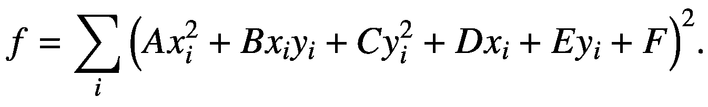

(13.1)

括号中的表达式与椭圆上的点( *x* <sub>*i*</sub> ， *y* <sub>i</sub> )的距离近似成正比。它包含六个未知系数 *A* 、 *B* 、 *C* 、 *D* 、 *E、*和 *F* 。然而，众所周知，椭圆由五个参数唯一定义。因此，我们将方程 13.1 的所有项除以 *A* ，并将新系数表示如下:

*B/A =*2*k*T4】1

*C/A = k*T2】2

*D/A =*2*k*T4】3

*E/A =*2*k*T4】4

*F/A = k*T2】5

转换后的目标函数是

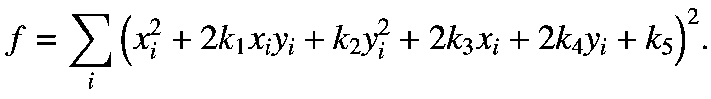

(13.1a)

*f* 对*k*T4】1 的偏导数为

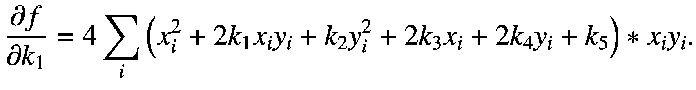

将括号中的所有项乘以*x*<sub>T3】IT5】**y*<sub>*I*</sub>后，我们得到</sub>

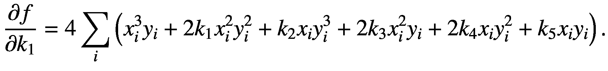

我们将它除以 4，并用 *S* ( *m* ， *n* 表示每个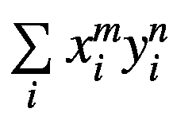，得到

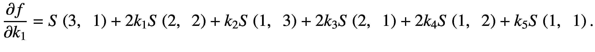

通过将它设置为零，我们获得了未知数*k*<sub>1</sub>*k*<sub>2</sub>*k*<sub>3</sub>*k*<sub>4</sub>和 *k* <sub>5</sub> 的五个方程中的第一个。

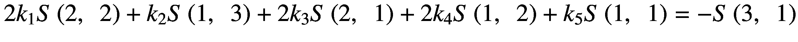

以类似的方式，我们得到其他四个方程:

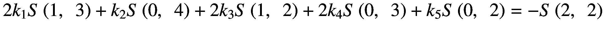

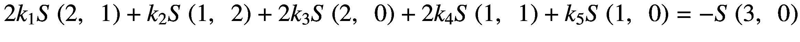

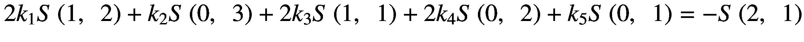

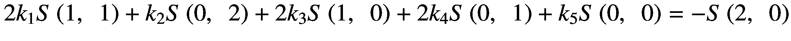

该方程组通过使用方法`Gauss_K`在方法`GetEllipseNew`中实现的众所周知的高斯方法求解。总和*S*(*x*<sup>*m*</sup>， *y* <sup>*n*</sup> )通过`MakeSums2`方法计算。

以下是`GetEllipseNew`的源代码。

```py
public int GetEllipseNew(Point[] Vert, int iv1, int nPoints1, int iv2, int nPoints2,
ref double Delta, ref double f, ref double a, ref double b, ref double c, ref double d)
{
  bool deb = false;

  double[,] A = new double[5, 5];
  double[,] B = new double[5, 1];
  int nSum = 15;
  double[] Sum = new double[nSum];
  MakeSums2(Vert, iv1, nPoints1, iv2, nPoints2, Sum);
  A[0, 0] = 2.0 * Sum[12];
  A[0, 1] = Sum[11];
  A[0, 2] = 2.0 * Sum[8];
  A[0, 3] = 2.0 * Sum[7];
  A[0, 4] = Sum[4];
  A[1, 0] = 2.0 * Sum[11];
  A[1, 1] = Sum[10];
  A[1, 2] = 2.0 * Sum[7];
  A[1, 3] = 2.0 * Sum[6];
  A[1, 4] = Sum[3];
  A[2, 0] = 2.0 * Sum[8];
  A[2, 1] = Sum[7];
  A[2, 2] = 2.0 * Sum[5];
  A[2, 3] = 2.0 * Sum[4];
  A[2, 4] = Sum[2];

  A[3, 0] = 2.0 * Sum[7];
  A[3, 1] = Sum[6];
  A[3, 2] = 2.0 * Sum[4];
  A[3, 3] = 2.0 * Sum[3];
  A[3, 4] = Sum[1];

  A[4, 0] = 2.0 * Sum[4];
  A[4, 1] = Sum[3];
  A[4, 2] = 2.0 * Sum[2];
  A[4, 3] = 2.0 * Sum[1];
  A[4, 4] = Sum[0];

  B[0, 0] = -Sum[13];
  B[1, 0] = -Sum[12];
  B[2, 0] = -Sum[9];
  B[3, 0] = -Sum[8];
  B[4, 0] = -Sum[5];

  Gauss_K(A, 5, B, 1);

  f = -0.5 * Math.Atan2(2.0 * B[0, 0], 1.0 - B[1, 0]);
  c = (B[0, 0] * B[3, 0] - B[1, 0] * B[2, 0]) / (B[1, 0] - B[0, 0] * B[0, 0]);
  d = (B[0, 0] * B[2, 0] - B[3, 0]) / (B[1, 0] - B[0, 0] * B[0, 0]);
  Delta = B[1, 0] - B[0, 0] * B[0, 0];
  double BigDelta = B[1, 0] * B[4, 0] + B[0, 0] * B[3, 0] * B[2, 0] +
       B[0, 0] * B[3, 0] * B[2, 0] - B[2, 0] * B[1, 0] * B[2, 0] - B[3, 0] * B[3, 0] - B[4, 0] * B[0, 0] * B[0, 0];
  double S = 1.0 + B[1, 0];
  double a2, b2;

  double aprim = (1.0 + B[1, 0] + Math.Sqrt((1.0 - B[1, 0]) * (1.0 - B[1, 0]) + 4.0 * B[0, 0] * B[0, 0])) * 0.5;
  double cprim = (1.0 + B[1, 0] - Math.Sqrt((1.0 - B[1, 0]) * (1.0 - B[1, 0]) + 4.0 * B[0, 0] * B[0, 0])) * 0.5;
  a2 = -BigDelta / aprim / Delta;
  b2 = -BigDelta / cprim / Delta;
  a = Math.Sqrt(a2);
  b = Math.Sqrt(b2);
  if (Delta > 0.0)  return 1;

  return -1;

} //***************** end GetEllipseNew *********************************

```

## 项目`WFellipseBike`

本项目的形式如图 [13-1](#Fig1) 所示。

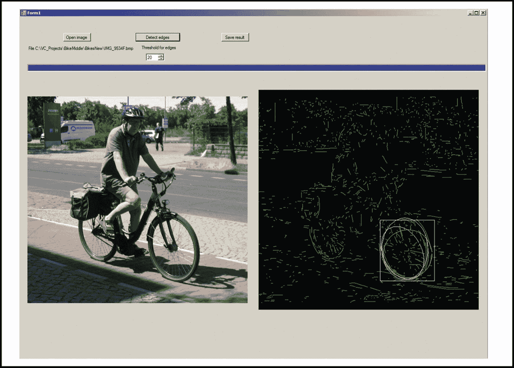

图 13-1

项目的形式`WFellipseBike`

用户单击打开图像，然后选择文件夹和图像。图像出现在左边的图片框中。然后用户单击检测边缘。有一个数字上下工具，用于选择边缘检测的阈值。但是，预选值 20 适用于所有图像，不应更改。程序自动运行。它使用第 [12](12.html) 章中描述的方法进行边缘检测和边缘的多边形近似。然后使用方法`MakeArcsTwo`将多边形细分成圆弧。该方法与第 12 章[中描述的`MakeArcs3`方法略有不同。](12.html)

然后调用方法`FindEllipsesMode`来寻找自行车车轮的椭圆。该方法使用根据点数排序的圆弧。排序是通过方法`SortingArcs`将排序后的弧的索引写入数组`SortArcs`来执行的。点数最多的圆弧停留在`SortArcs[0]`。因此，圆弧可以按照点数递减的顺序来取。

椭圆的识别不像圆那么简单:如果圆弧转移到方法`GetEllipseNew`寻找包含该圆弧的椭圆包含的点少于十个，有时会计算出椭圆的假参数。因此，我们开发了其他方法来解决这个问题。方法`QualityOfEllipseNew`计算位于椭圆附近的圆弧的点数，如图 [13-2](#Fig2) 所示。

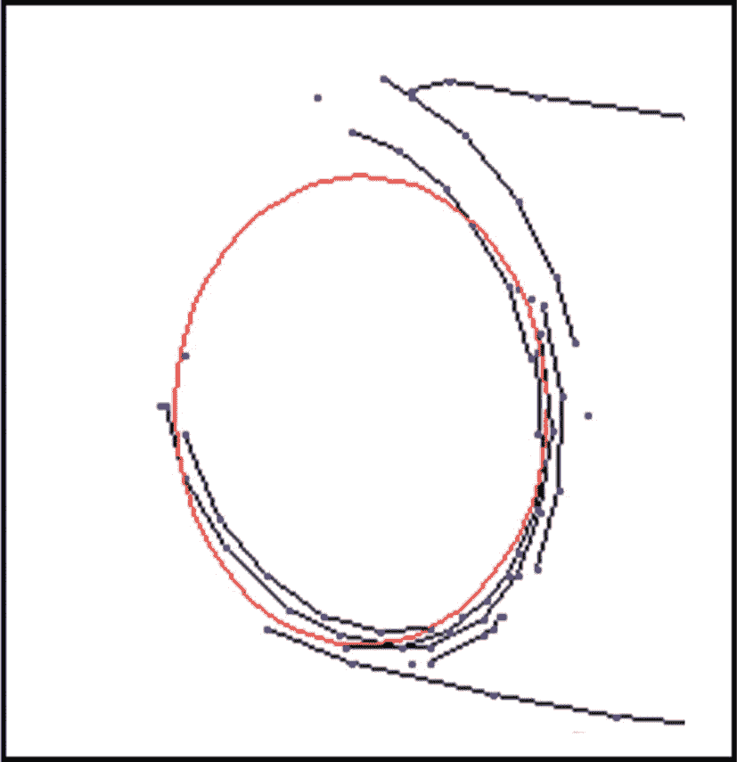

图 13-2

带有已识别椭圆的自行车图像片段

在图 [13-2](#Fig2) 中，黑线是圆弧，蓝点是圆弧包含的多边形顶点，红线是识别出的椭圆。椭圆的质量估计为椭圆周围试管中蓝色点的数量`Sum`。这个数字与值`maxPoints`进行比较，该值是作为参数传递给方法`GetEllipseNew`的弧`ia`中的点数乘以 2π并除以弧的角度。因此`maxPoint`是封闭曲线中最大可能的点数。如果值`Sum`大于`0.5*maxNumber`，则认为椭圆是好的。这里是`QualityOfEllipseNew`的代码。

```py
public int QualityOfEllipseNew(int ia, Ellipse Ellipse, int[] SortArcs, Form1 fm1)
// Returns the sum of the numbers of points of arcs near the ellipse.
{
  bool deb = false, Disp = false; //true; //
  int Dif, goodDartIa, locDart, i, iv, ivm, ive, ja, Sum = 0, x, y, xm, ym, xe, ye;
  double angleDart, a = Ellipse.a, b = Ellipse.b, c = Ellipse.c, d = Ellipse.d;
  double maxPoints = elArc[ia].nPoints * 6.28 / elArc[ia].Angle;
  int ivStart, ivMid, ivEnd, xMain, yMain;
  ivStart = elArc[ia].Start;
  ivMid = ivStart + elArc[ia].nPoints / 2;
  ivEnd = ivStart + elArc[ia].nPoints - 1;
  x = Vert[ivStart].X;
  y = Vert[ivStart].Y;
  double AngleStart = Math.Atan2(y - d, x - c);
  xe = Vert[ivEnd].X;
  ye = Vert[ivEnd].Y;

  double AngleEnd = Math.Atan2(ye - d, xe - c);
  xMain = Vert[ivMid].X;
  yMain = Vert[ivMid].Y;
  double AngleMid = Math.Atan2(yMain - d, xMain - c);
  double minAngle = Math.Min(AngleStart, AngleEnd);
  double maxAngle = Math.Max(AngleStart, AngleEnd), help;
  bool Plus2PI = false;
  if (minAngle < 0.0 && maxAngle > 0.0 && !(AngleMid >= minAngle &&
                                                      AngleMid < maxAngle))
  {
    Plus2PI = true;
    help = maxAngle;
    maxAngle = minAngle + 2 * Math.PI;
    minAngle = help;

  }
  angleDart = 57.3 * Math.Atan2(yMain - elArc[ia].My, xMain - elArc[ia].Mx) + 15.0;
  if (angleDart < 0.0) angleDart += 360.0;
  goodDartIa = 6 + (int)angleDart / 30;
  if (goodDartIa > 11) goodDartIa -= 12;
  double AngleJa, Fx, Fxe;
  for (i = 0; i < nArcs; i++) //=============================
  {
    ja = SortArcs[i];
    if (ja == ia || elArc[ja].nPoints < 5) continue;
    iv = elArc[ja].Start;
    ivm = iv + elArc[ja].nPoints / 2;
    ive = iv + elArc[ja].nPoints - 1;
    x = Vert[iv].X;
    y = Vert[iv].Y;
    xm = Vert[ivm].X;
    ym = Vert[ivm].Y;
    xe = Vert[ive].X;
    ye = Vert[ive].Y;
    Fx = (x - c) * (x - c) / a / a + (y - d) * (y - d) / b / b;
    Fxe = (xe - c) * (xe - c) / a / a + (ye - d) * (ye - d) / b / b;
    if (Fx < 0.6 || Fx > 1.67 || Fxe < 0.6 || Fxe > 1.67) continue;

    angleDart = 57.3 * Math.Atan2((ym - d) * a * a, (xm - c) * b * b);
    if (angleDart < 0.0) angleDart += 360.0;
    locDart = (int)angleDart / 30;
    if (locDart > 11) locDart -= 12;

    Dif = Math.Abs(elArc[ja].Dart - locDart);
    if (Dif > 6) Dif = 12 - Dif;
    if (Disp) DrawOneLongArc(ja, fm1);
    if (Dif < 2)
    {
      if (Disp) DrawOneLongArc(ja, fm1);
      for (iv = elArc[ja].Start; iv < elArc[ja].Start + elArc[ja].nPoints; iv++)
      {
        x = Vert[iv].X;
        y = Vert[iv].Y;
        AngleJa = Math.Atan2(y - d, x - c);
        if (AngleJa < 0.0 && Plus2PI) AngleJa += 6.28;
        if (!(AngleJa > minAngle && AngleJa < maxAngle)) Sum += elArc[ja].nPoints;
      }
    }

  } //================== end for (i = 0; ... ===========================
  return Sum;
} //********************* end QualityOfEllipseNew ************************

```

如果椭圆不好，则调用方法`HelpArcNew`。该方法获取圆弧`ia`作为参数，并找到位于圆弧`ia`的曲率圆内的不同圆弧`ja`。如果圆弧`ja`方向正确且不太靠近圆弧`ia`，则与圆弧`ia`形成一对。对每一对圆弧(`ia, ja`)计算一个椭圆并评估其质量。具有最佳质量的椭圆作为结果返回。这里是`HelpArcNew`的代码。

```py
public int HelpArcNew(int ia, int[] SortArcs, ref Ellipse Ellipse, int SumStart, Form1 fm1)
{
  bool disp = false;
  int Dif, i, ivMid, ivm, ja, xMain, yMain, xm, ym;

  ivMid = elArc[ia].Start + elArc[ia].nPoints / 2;
  xMain = Vert[ivMid].X;
  yMain = Vert[ivMid].Y;
  double angleDart, a = Ellipse.a, b = Ellipse.b, c = Ellipse.c, d = Ellipse.d;
  int goodDartIa;
  angleDart = 57.3 * Math.Atan2(yMain - elArc[ia].My, xMain - elArc[ia].Mx) + 15.0;
  if (angleDart < 0.0) angleDart += 360.0;
  goodDartIa = 6 + (int)angleDart / 30;
  if (goodDartIa > 11) goodDartIa -= 12;

  double R = elArc[ia].R, Mx = elArc[ia].Mx, My = elArc[ia].My;
  CBox Box = new CBox();
  Box.minX = (int)(Mx - R) - 10;
  if (c - a < Box.minX) Box.minX -= 20;

  Box.maxX = (int)(Mx + R) + 10;

  if (c + a > Box.maxX) Box.maxX += 20;

  Box.minY = (int)(My - R) - 10;
  if (d - b < Box.minY) Box.minY -= 20;

  Box.maxY = (int)(My + R) + 10;
  if (d + b > Box.maxY) Box.maxY += 20;

  DrawRectangleSmart(Box, fm1);
  int Dist2 = 0, minDist2 = (int)(1.5 * elArc[ia].R * elArc[ia].R);
  int[] jBest = new int[100];
  int nBest = 0;
  for (i = 0; i < nArcs; i++) //===================================
  {
    ja = SortArcs[i];
    if (!ArcInBox(ja, Box)) continue;
    if (elArc[ja].nPoints < 4) continue;
    if (disp) DrawOneLongArc(ja, fm1);
    Dif = Math.Abs(elArc[ja].Dart - goodDartIa);
    if (Dif > 6) Dif = 12 - Dif;
    if (Dif > 3) continue;
    ivm = elArc[ja].Start + elArc[ja].nPoints / 2;
    xm = Vert[ivm].X;
    ym = Vert[ivm].Y;

    Dist2 = (xm - xMain) * (xm - xMain) + (ym - yMain) * (ym - yMain);
    if (Dist2 > minDist2)
    {
      jBest[nBest] = ja;
      nBest++;
    }
    if (nBest >= 5) break;
  } //================= end for (i = 0; =============================

  double Delta = 0.0, F = 0.0;
  Ellipse Ellipse1 = new Ellipse();
  int jbestOpt = -1, maxSum = SumStart, Sum = 0;
  for (i = 0; i < nBest; i++) //=========================================
  {
    if (disp) DrawRedArc(jBest[i], fm1);
    GetEllipseNew(Vert, elArc[ia].Start, elArc[ia].nPoints, elArc[jBest[i]].Start,
           elArc[jBest[i]].nPoints, ref Delta, ref Ellipse1.f,
                                        ref Ellipse1.a, ref Ellipse1.b, ref Ellipse1.c, ref Ellipse1.d);
    Sum = QualityOfEllipseNew(ia, Ellipse1, SortArcs, fm1);
    if (disp) DrawEllipse(Ellipse1, fm1);

    if (!(Ellipse1.a > 5.0 && Ellipse1.b > 5.0) ||
                                         Ellipse1.d - Ellipse1.b < fm1.height * 2 / 5) Sum = 0;
    else
    {
      if (Sum > maxSum)
      {
        if (disp) DrawEllipse(Ellipse1, fm1);
        if (disp) DrawRedArc(jBest[i], fm1);
        maxSum = Sum;
        jbestOpt = jBest[i];
        Ellipse = Ellipse1;
      }
    }
  } //================== end for (i ... i < nBest; ======================
  DrawRedArc(jbestOpt, fm1);
  Pen pen = new Pen(Color.Red);
  DrawEllipsePen(Ellipse, pen, fm1);
  return jbestOpt;

} //******************** end HelpArcNew *******************************

```

自行车的后轮有时会被骑自行车的人的腿遮住，因此无法检测到椭圆。如果已经识别出前轮的高质量椭圆，则将该椭圆的副本分配给后轮。为了正确完成这一分配，必须计算后轮圆弧`ia1`中点`MP`处的切线。前轮的椭圆上有一个点`P`，与圆弧`ia1`的方向相切且方向相同。放置前轮椭圆的副本，使点`P`位于点`MP`上。然后，用方法`HelpArcNew`指定椭圆副本的参数。在调用`HelpArcNew`之前和之后，使用方法`CminusCel`检查两个椭圆的相对位置，尤其是它们彼此之间的距离。所有这些程序都在方法`FindEllipsesMode`中执行。下面是这个方法的代码。

```py
public int FindEllipsesMode(CImage SigmaIm, Ellipse[] ListEllipse, ref int nEllipse, Form1 fm1)
{
    int[] SortArcs = new int[nArcs];
  int maxNP = 0, k = SortingArcs(SortArcs, ref maxNP);

  int i, ia, ia1, i0, i1;
  nEllipse = 0;
  double a = 0.0, b = 0.0, c = 0.0, d = 0.0; //, fret = 0.0;
  int[,] List = new int[20, 1200];
  int[] nArcList = new int[20];
  SCircle[] Circle = new SCircle[20];
  for (i = 0; i < 20; i++)
  {
    Circle[i] = new SCircle();

    Circle[i].goodCirc = true;
  }
  Ellipse[] smalList = new Ellipse[20];
  for (i = 0; i < 20; i++) smalList[i] = new Ellipse();
  int Sum1 = 0;
  double AnglePerPoint = 0.0, maxPoints = 0.0;
  fm1.progressBar1.Visible = true;
  fm1.progressBar1.Step = 1;
  int jump, Len = nArcs, nStep = 20;
  if (Len > 2 * nStep) jump = Len / nStep;
  else
    jump = 2;
  double Delta = 0.0, f = 0.0, F = 0.0;

  Ellipse Ellipse1 = new Ellipse();
  Ellipse Ellipse2 = new Ellipse();
  int[] Pattern = new int[100000];
  double aa = 0.0, bb = 0.0, cc = 0.0, dd = 0.0;
  for (i0 = 0; i0 < nArcs; i0++)  //======================================
  {
    if ((i0 % jump) == jump - 1) fm1.progressBar1.PerformStep();
    ia = SortArcs[i0];
    DrawRedArc(ia, fm1);
    if (elArc[ia].nPoints <= 5) break;

    GetEllipseNew(Vert, elArc[ia].Start, elArc[ia].nPoints, 0, 0, ref Delta, ref f,
                                               ref a, ref b, ref c, ref d);
    DrawEllipse(f, a, b, c, d, fm1);
    if (b < 20.0 || a < 6.0 || d + b > fm1.height || d - 4 * b < 0.0) continue;
    int jbestOpt = -1;
    Ellipse1.a = a;
    Ellipse1.b = b;
    Ellipse1.c = c;
    Ellipse1.d = d;

    Point P1 = new Point(0, 0);
    Point P2 = new Point(0, 0);
    if (a > 5.0 && b > 5.0)
    {
      Sum1 = QualityOfEllipseNew(ia, Ellipse1, SortArcs, fm1);
      AnglePerPoint = elArc[ia].Angle / elArc[ia].nPoints;
      maxPoints = 2 * Math.PI / AnglePerPoint;
      if (b > fm1.height / 4 || elArc[ia].nPoints < 10) Sum1 = 0;
      Pen pen = new Pen(Color.Red);
      if (elArc[ia].nPoints < 10 || d + b > fm1.height * 2 / 5)
      {
        jbestOpt = HelpArcNew(ia, SortArcs, ref Ellipse1, Sum1, fm1);
        DrawEllipse(Ellipse1, fm1);
      }
    }

    for (i1 = i0 + 1; i1 < nArcs; i1++) //=================================
    {
      ia1 = SortArcs[i1];
      if (!Position(ia1, Ellipse1, fm1)) continue;
      if (elArc[ia1].nPoints <= 5)
      {
        MessageBox.Show("Finishing the search for ia1");
        break;
      }

      CBox BoxP1 = new CBox();
      CBox BoxP2 = new CBox();
      int iv = elArc[ia].Start, x = Vert[iv].X, y = Vert[iv].Y;
      int iv1 = elArc[ia1].Start, x1 = Vert[iv1].X, y1 = Vert[iv1].Y;
      GetEllipseNew(Vert, elArc[ia1].Start, elArc[ia1].nPoints, 0, 0, ref Delta, ref f,
                                               ref a, ref b, ref c, ref d);
      DrawEllipse(f, a, b, c, d, fm1);
      if (!(a > 5.0 && b > 5.0)) continue;
      DrawRedArc(ia1, fm1);
      double K2 = DrawTangent(ia1, ref P2, fm1);

      P1 = PointWithTangent(Ellipse1, K2, elArc[ia1].Dart, fm1);
      if (P1.X == 0 && P1.Y == 0) continue;
      Ellipse2 = Ellipse1;
      Ellipse2.c = P2.X + Ellipse1.c - P1.X;
      Ellipse2.d = P2.Y + Ellipse1.d - P1.Y;
      DrawEllipse(Ellipse2, fm1);
      if (d + b > fm1.height || d - b < fm1.height * 2 / 5) continue;

      jbestOpt = -1;
      if (Ellipse2.a > 5.0 && Ellipse2.b > 5.0)
      {
        Sum1 = QualityOfEllipseNew(ia1, Ellipse2, SortArcs, fm1);
        AnglePerPoint = elArc[ia1].Angle / elArc[ia1].nPoints;
        maxPoints = 2 * Math.PI / AnglePerPoint;
        Pen pen = new Pen(Color.Red);
        if ((elArc[ia1].nPoints < 10 || d + b > fm1.height * 2 / 5) &&
                                        CminusCel(Ellipse1, Ellipse2, fm1))
        {
          jbestOpt = HelpArcNew(ia1, SortArcs, ref Ellipse2, Sum1, fm1);
          DrawEllipse(Ellipse2, fm1);
        }
      }

      bool CMINC = CminusCel(Ellipse1, Ellipse2, fm1);
      if (!CMINC) continue;
      ListEllipse[nEllipse] = Ellipse1;
      nEllipse++;
      ListEllipse[nEllipse] = Ellipse2;
      nEllipse++;
      if (nEllipse >= 2)
      {
        fm1.progressBar1.Step = fm1.progressBar1.Maximum - Len / (100 / 6) -
                                                    fm1.progressBar1.Value;
        fm1.progressBar1.PerformStep();
        return 1;
      }
    } //============== end for (i1 = 0; ... ============================
  } //=============== end for (i0 = 0; ... =============================
  MessageBox.Show("FindEllipsesMode: no bike recognized");
  return -1;

} //****************** end FindEllipseMode ******************************

```

车轮的识别是自行车识别中最重要的部分。当车轮的两个椭圆都被识别时，方法`RecoFrame`被调用。它能识别自行车的行驶方向。这种方法包含几种不同类型的框架的简单模型。每种车架出现两次:一次是自行车前轮的前叉在左边，另一次是前叉在右边。这些模型被一个接一个地测试。每个模型都经过变换，使得轮轴的位置与椭圆的中心相匹配。在框架的每个直线段周围形成一个狭窄的矩形。然后，经过处理的图像中的所有多边形都被通过，并且适合矩形的多边形边的长度被求和。具有最大总和的模型获胜。这样，自行车的运动方向就被识别出来了。图 [13-3](#Fig3) 中显示了框架的模型示例。

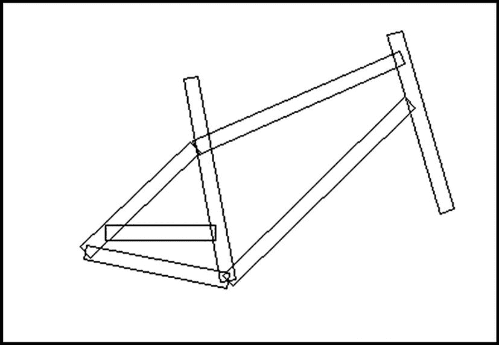

图 13-3

框架模型的示例

## 识别方向的另一种方法

刚刚描述的方法在框架平面与观察方向成锐角时有效，例如图 [13-1](#Fig1) 。此外，框架的某些部分经常被骑车人的腿遮挡。因此，我们开发了另一种方法黑斑，返回自行车运动的方向:0 为右，2 为左。该方法在每个车轮内制作一个框，计算亮度直方图，并对这些框中几乎水平的多边形边的长度求和，并决定自行车的绘制方向。通过比较低于阈值的直方图值的总和，即框中暗像素的数量加上两个框中的 6 *总和，来做出决定。较大的值表示后轮，也表示绘制方向:如果后轮在右手边，则自行车向左移动。

当识别出车轮的椭圆和运动方向时，车轮的椭圆和车架的型号会显示在右侧的图片框中。显示屏中间的消息框显示消息“识别到向左行驶的自行车”如果用户单击保存结果，将在磁盘上保存一个文本文件，其上下文对应于以下示例:

“向左的自行车有椭圆形的轮子。

第一:a = 113b = 173c = 864d = 796。

第二:a = 114b = 173c = 469d = 790。"

记法如下:a 是椭圆的水平半轴，b 是其垂直半轴，c 是车轮中心的 x 坐标，d 是其 y 坐标。

我们测试了大约 100 张显示自行车在城市街道上行驶的照片。除了大约 2000 × 1500 像素的大图像和大约 150 像素长的小自行车(图 [13-4](#Fig4) )之外，自行车在所有照片中都被识别出来。

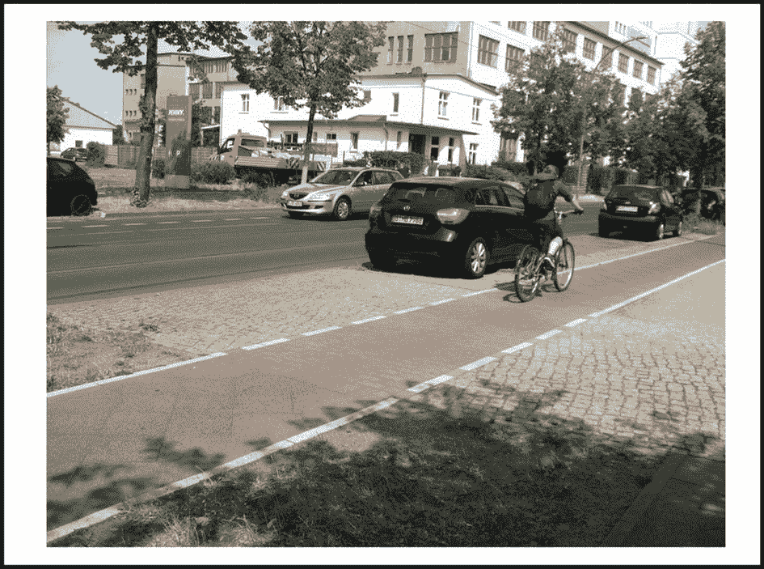

图 13-4

带有未识别自行车的图像示例

图 [13-5](#Fig5) 提供了一些已识别自行车的图像示例。

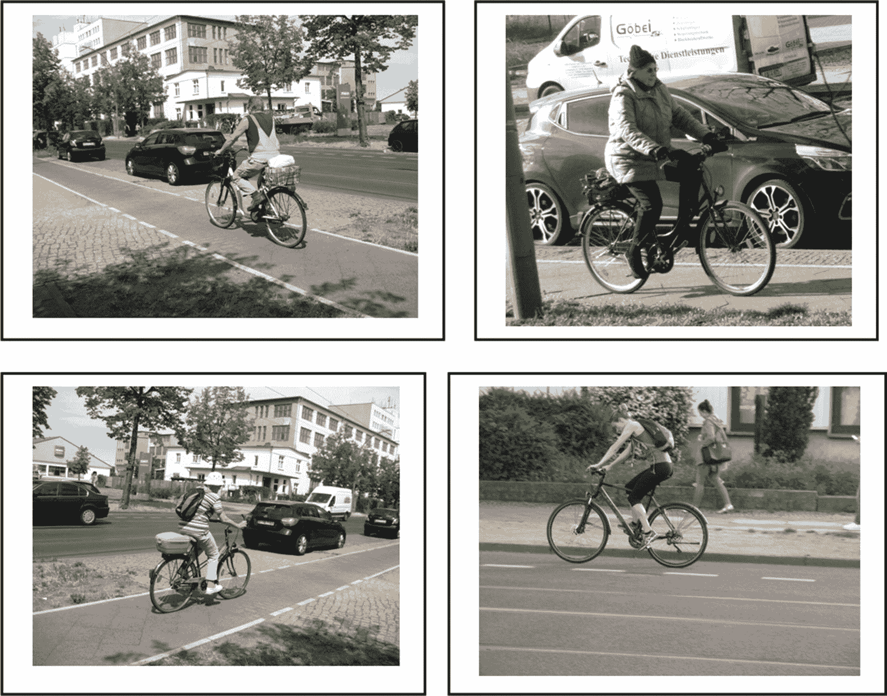

图 13-5

识别自行车的图像示例