# 一、人工神经网络基础

一个**人工神经网络** ( **安**)是一个监督学习算法，它是由人脑功能的方式松散地启发而来的。类似于人类大脑中神经元的连接和激活方式，神经网络接受输入并通过一个函数传递它，导致某些后续神经元被激活，从而产生输出。

有几种标准的人工神经网络结构。通用近似定理说，我们总是可以找到一个足够大的神经网络架构，它具有正确的权重集，可以准确地预测任何给定输入的任何输出。这意味着，对于给定的数据集/任务，我们可以创建一个架构，并不断调整其权重，直到人工神经网络预测出我们希望它预测的内容。调整权重直到发生这种情况称为训练神经网络。在大型数据集和定制架构上的成功训练是人工神经网络在解决各种相关任务中获得突出地位的原因。

计算机视觉中的一个突出任务是识别图像中存在的对象的类别。ImageNet 是一项旨在识别图像中存在的对象类别的竞赛。历年来分类错误率的降低情况如下:

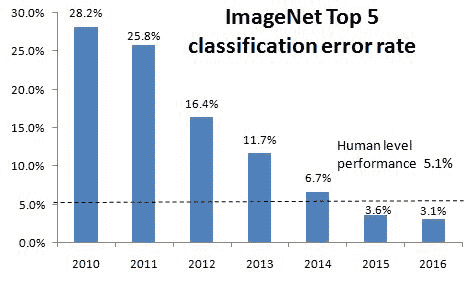

2012 年，一个神经网络(AlexNet)被用于竞赛的获胜解决方案。从上图中可以看出，通过利用神经网络，从 2011 年到 2012 年，错误有了相当大的减少。从那时起，随着时间的推移，随着更深更复杂的神经网络的出现，分类错误不断减少，并击败了人类水平的表现。这给了我们一个坚实的动力去学习和实现神经网络来完成我们的定制任务，只要适用。

在本章中，我们将在一个简单的数据集上创建一个非常简单的架构，并主要关注人工神经网络的各种构建模块(前馈、反向传播、学习速率)如何帮助调整权重，以便网络学习从给定的输入预测预期的输出。我们将首先从数学上了解什么是神经网络，然后从头开始构建一个神经网络，以便有一个坚实的基础。然后，我们将了解负责训练神经网络的每个组件，并对它们进行编码。总体而言，我们将涵盖以下主题:

*   人工智能和传统机器学习的比较
*   了解人工神经网络构建块
*   实现前馈传播
*   实现反向传播
*   将前馈传播和反向传播放在一起
*   了解学习速度的影响
*   总结神经网络的训练过程

# 人工智能和传统机器学习的比较

传统上，系统是通过使用程序员编写的复杂算法来实现智能化的。

例如，假设您对识别照片中是否包含狗感兴趣。在传统的**机器学习** ( **ML** )设置中，ML 从业者或主题专家首先识别需要从图像中提取的特征。然后，他们提取这些特征，并通过一个精心编写的算法来解读给定的特征，以判断图像是否是一只狗。下图说明了同样的想法:

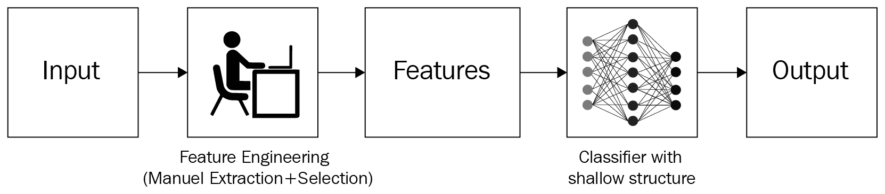

取以下样本:


根据前面的图像，一个简单的规则可能是，如果一个图像包含三个排成三角形的黑色圆圈，它可以被归类为一只狗。然而，这条规则对这个欺骗性的松饼特写无效:


当然，这个规则也不适用于除了狗的脸部特写以外的任何图像。因此，自然地，我们需要为多种类型的精确分类创建的手动规则的数量可能是指数级的，尤其是当图像变得更加复杂时。因此，传统方法在非常受限的环境中工作得很好(比如，拍摄护照照片，其中所有维度都被限制在毫米以内)，而在无约束的环境中工作得很差，在无约束的环境中，每个图像变化很大。

我们可以将同样的思路扩展到任何领域，比如文本或结构化数据。在过去，如果有人对编程解决现实世界的任务感兴趣，他们就有必要了解关于输入数据的一切，并编写尽可能多的规则来覆盖每个场景。这是乏味的，并且不能保证所有新的场景都遵循所述规则。

然而，通过利用人工神经网络，我们可以一步完成。

神经网络提供了将特征提取(手动调整)相结合的独特优势，并在单次操作中使用这些特征进行分类/回归，几乎不需要手动特征工程。这两个子任务都只需要标签化的数据(比如哪些图片是狗，哪些图片不是狗)和神经网络架构。它不需要人类想出规则来分类图像，这消除了传统技术强加给程序员的大部分负担。

请注意，主要要求是我们为需要解决方案的任务提供大量的示例。例如，在前面的例子中，我们需要向模型提供很多很多的*狗*和*非狗*的图片，以便它学习特征。如何利用神经网络完成分类任务的高级视图如下:

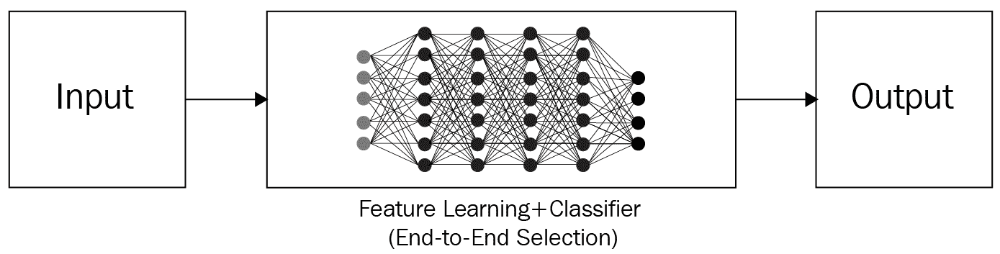

现在，我们已经对神经网络性能优于传统计算机视觉方法的根本原因有了一个非常高层次的概述，让我们在本章的各个部分更深入地了解神经网络是如何工作的。

# **了解人工神经网络构建模块**

人工神经网络是张量(权重)和数学运算的集合，以松散地复制人脑功能的方式排列。它可以被看作是一个数学函数，接受一个或多个张量作为输入，并预测一个或多个张量作为输出。将这些输入连接到输出的操作安排被称为神经网络的架构——我们可以根据手头的任务进行定制，即根据问题是否包含结构化(表格)或非结构化(图像、文本、音频)数据(即输入和输出张量的列表)。

人工神经网络由以下部分组成:

*   **输入层**:这些层以自变量为输入。
*   **隐藏(中间)层**:这些层连接输入和输出层，同时在输入数据之上执行转换。此外，隐藏层包含**节点**(下图中的单位/圆)，以将其输入值修改为更高/更低维度的值。通过使用修改中间层节点值的各种激活函数来实现实现更复杂表示的功能。
*   **输出层**:包含输入变量预期产生的值。

考虑到这一点，神经网络的典型结构如下:


输出层中的**节点**(上图中的圆圈)的数量取决于手头的任务以及我们试图预测的是连续变量还是分类变量。如果输出是连续变量，则输出有一个节点。如果输出是具有 *m* 个可能类别的分类，则在输出层中将有 *m* 个节点。让我们放大其中一个节点/神经元，看看发生了什么。神经元按如下方式转换其输入:

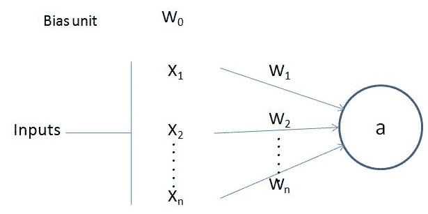

在上图中，*x*[1T5， *x* [*2*] ，...、 *x* [*n*] 为输入变量， *w* [*0*] 为偏差项(类似于我们在线性/逻辑回归中有偏差的方式)。]

注意，*w*[1T5， *w* [*2*] ，...， *w* [*n*] 是赋予每个输入变量的权重， *w [0]* 是偏差项。输出值 *a* 计算如下:]


如您所见，它是*权重和输入*对的乘积之和，后跟一个附加函数 *f* (偏差项+乘积之和)。函数 *f* 是激活函数，用于在乘积的总和上应用非线性。关于激活函数的更多细节将在下一节前馈传播中提供。此外，通过具有一个以上的隐藏层，堆叠大量的神经元，可以实现更高的非线性。

在高层次上，神经网络是节点的集合，其中每个节点都具有可调整的浮点值，并且这些节点以图形的形式互连，以网络架构所规定的格式返回输出。网络由三个主要部分组成:输入层、隐藏层和输出层。请注意，您可以拥有更高数量(n)的个隐藏层，术语*深度*学习指的是更大数量的隐藏层。通常，当神经网络必须理解一些复杂的东西(如图像识别)时，需要更多的隐藏层。

了解了神经网络的架构后，在下一节中，我们将了解前馈传播，它有助于估计网络架构的误差(损失)量。

# **实现前馈传播**

为了建立对前馈传播如何工作的强有力的基础理解，我们将通过一个训练神经网络的玩具示例，其中神经网络的输入是(1，1)并且对应的(预期的)输出是 0。这里，我们将基于这一单个输入-输出对找到神经网络的最佳权重。但是，您应该注意到，在现实中，将会有成千上万的数据点用于训练人工神经网络。

本例中的神经网络架构包含一个隐藏层，其中有三个节点，如下所示:

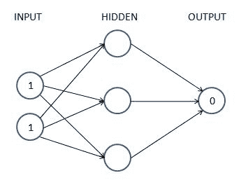

上图中的每个箭头恰好包含一个可调整的浮点值( **weight** )。我们需要找到 9 个(第一个隐层 6 个，第二个隐层 3 个)浮点，这样当输入为(1，1)时，输出尽可能接近(0)。这就是我们所说的训练神经网络。为了简单起见，我们还没有引入偏差值——底层逻辑保持不变。

在随后的章节中，我们将了解前面网络的以下内容:

*   计算隐藏层值
*   执行非线性激活
*   估计输出图层值
*   计算对应于期望值的损失值

## **计算隐藏层单元值**

我们现在将为所有连接分配权重。第一步，我们在所有连接中随机分配权重。通常，神经网络在训练开始前用随机权重初始化。同样，为了简单起见，在介绍主题时，我们将**而不是**在学习前馈传播和反向传播时包括偏差值。但是我们将从头开始实现前馈传播和反向传播。

让我们从在 0 和 1 之间随机初始化的初始权重开始，但是注意，神经网络的训练过程之后的最终权重不需要在一组特定的值之间。下图(左半部分)提供了网络中权重和值的正式表示，右半部分提供了网络中随机初始化的权重。

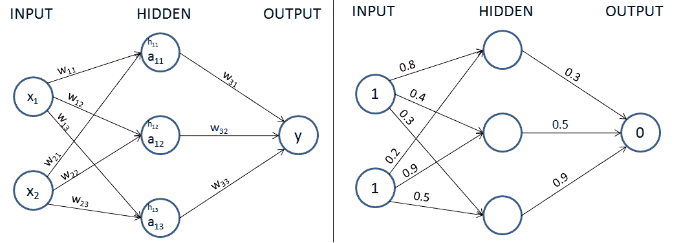

在下一步中，我们将输入与权重相乘，以计算隐藏层中隐藏单元的值。

激活前隐藏层的单位值如下获得:


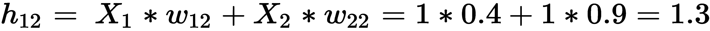

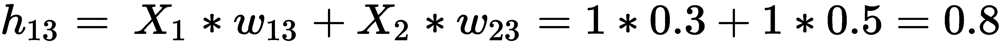

此处计算的隐藏层的单位值(激活前)也显示在下图中:


现在，我们将通过非线性激活传递隐藏层值。请注意，如果我们不在隐藏层中应用非线性激活函数，则无论存在多少隐藏层，神经网络都将成为从输入到输出的巨大线性连接。

## **应用激活功能**

激活函数有助于对输入和输出之间的复杂关系进行建模。

一些常用的激活函数计算如下(其中 *x* 为输入):

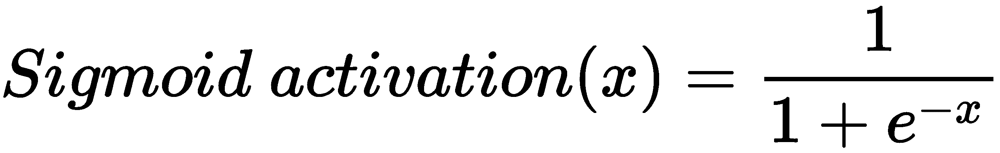

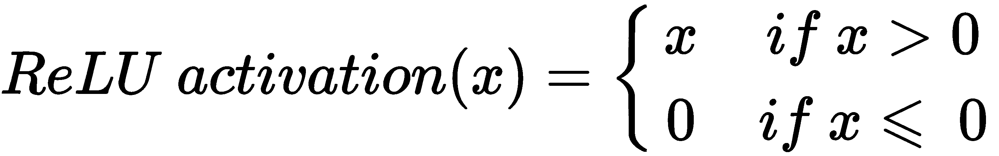

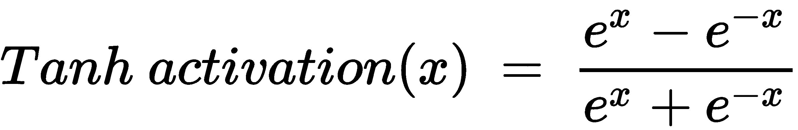

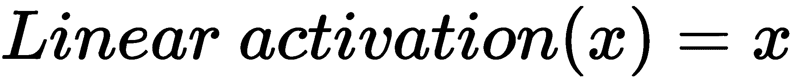

各种输入值的每个先前激活的可视化如下:

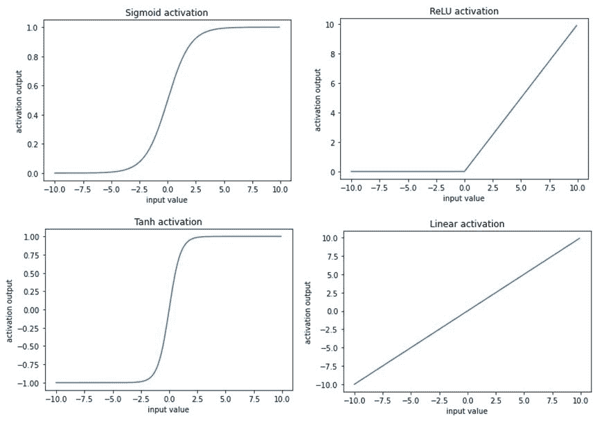

对于我们的示例，让我们使用 sigmoid(逻辑)函数进行激活。

通过将 sigmoid(逻辑)激活 *S(x)* 应用于三个隐藏层*和*，我们在 sigmoid 激活后得到以下值:

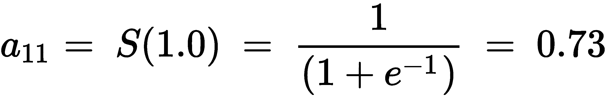

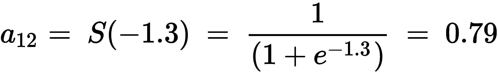


现在我们已经获得了激活后的隐藏层值，在下一节中，我们将获得输出层值。

## **计算输出层值**

到目前为止，我们已经计算了应用 sigmoid 激活后的最终隐藏层值。使用激活后的隐藏层值和权重值(在第一次迭代中随机初始化)，我们将计算网络的输出值:

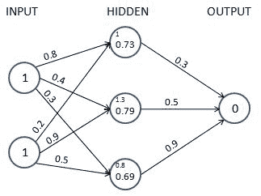

我们执行隐藏层值和权重值的乘积之和来计算输出值。另一个提醒:我们排除了需要在每个单元(节点)添加的偏置项，只是为了简化我们对前馈传播和反向传播的工作细节的理解，并将在编码前馈传播和反向传播时包括它:


因为我们从一组随机的权重开始，所以输出节点的值与目标非常不同。这种情况下，差的是 *1.235* (记住，目标是 0)。在下一节中，我们将学习如何计算网络当前状态下的损耗值。

## **计算损失值**

损失值(也称为成本函数)是我们在神经网络中优化的值。为了理解损失值是如何计算的，我们来看两种情况:

*   分类变量预测
*   连续变量预测

### **连续变量预测时计算损失**

通常，当变量是连续的时，损失值被计算为实际值和预测值之差的平方的平均值，也就是说，我们试图通过改变与神经网络相关联的权重值来最小化均方误差。均方误差值计算如下:

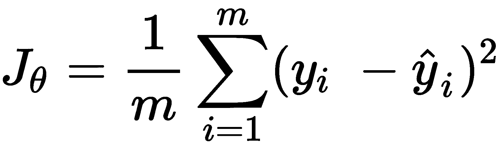

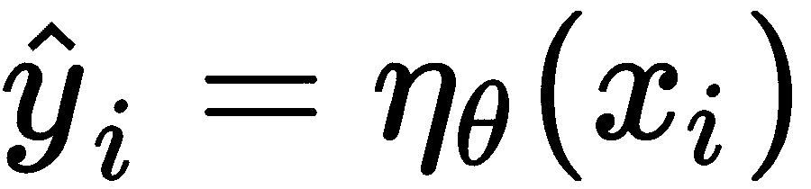

在上式中，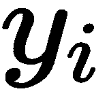是实际输出。是神经网络(其权重以的形式存储)计算出的预测，其输入为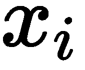， *m* 为数据集中的行数。

关键是，对于每一组独特的权重，神经网络会预测不同的损失，我们需要找到损失为零的黄金权重组(或者，在现实情况下，尽可能接近零)。

在我们的例子中，让我们假设我们预测的结果是连续的。在这种情况下，损失函数值是均方误差，计算方法如下:


现在我们已经了解了如何计算连续变量的损失值，在下一节中，我们将了解如何计算分类变量的损失值。

### **在分类变量预测期间计算损失**

当要预测的变量是离散的(即变量中只有几个类别)时，我们通常使用分类交叉熵损失函数。当要预测的变量中有两个不同的值时，损失函数是二元交叉熵。

二进制交叉熵的计算如下:

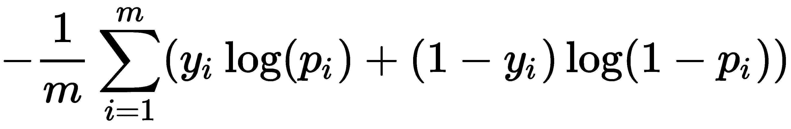

*y* 是输出的实际值， *p* 是输出的预测值， *m* 是数据点的总数。

分类交叉熵的计算如下:

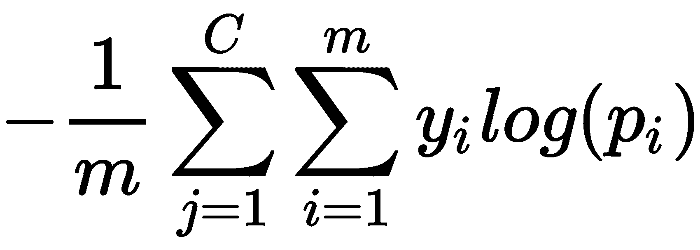

*y* 为输出的实际值， *p* 为输出的预测值， *m* 为数据点总数， *C* 为总类数。

可视化交叉熵损失的一个简单方法是查看预测矩阵本身。假设你在一个图像识别问题中预测五个类别——狗、猫、鼠、牛和母鸡。神经网络在激活 softmax 的最后一层必须有五个神经元(在下一节中有更多关于 softmax 的内容)。因此，它将被迫预测每个类别、每个数据点的概率。假设有五幅图像，预测概率如下所示(每行中突出显示的单元格对应于目标类):

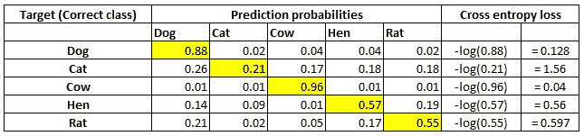

请注意，每一行的总和为 1。第一行，当目标为**狗**，预测概率为 **0.88** 时，对应的损失为 **0.128** (是 **0.88** 的对数的负数)。类似地，计算其他损失。如您所见，当正确类别的概率较高时，损失值较小。如你所知，概率范围在 0 和 1 之间。因此，最小可能损失可以是 0(当概率为 1 时)，最大损失可以是无穷大(当概率为 0 时)。

数据集中的最终损失是所有行中所有单个损失的平均值。

现在我们已经对计算均方误差损失和交叉熵损失有了坚实的理解，让我们回到我们的玩具例子。假设我们的输出是一个连续变量，我们将在后面的部分学习如何使用反向传播来最小化损失值。我们将更新权重值(之前随机初始化的)以最小化损失()。但是，在此之前，让我们首先使用 NumPy 数组在 Python 中编写前馈传播代码，以巩固我们对其工作细节的理解。

## 代码中的前馈传播

编码前馈传播的高级策略如下:

1.  在每个神经元上执行和积。
2.  计算激活。
3.  在每个神经元上重复前两步，直到输出层。
4.  通过比较预测值和实际输出值来计算损耗。

这将是一个函数，它将输入数据、当前神经网络权重和输出数据作为函数的输入，并返回当前网络状态的丢失。

计算所有数据点的均方误差损失值的前馈函数如下:

The following code is available as `Feed_forward_propagation.ipynb` in the `Chapter01` folder of this book's GitHub repository - [https://tinyurl.com/mcvp-packt](https://tinyurl.com/mcvp-packt)

我们强烈建议您通过点击每个笔记本中的**在 Colab 中打开**按钮来执行代码笔记本。屏幕截图示例如下:


一旦你点击 Colab 中的**打开(在前面的截图中突出显示)，你将能够毫不费力地执行所有代码，并且应该能够复制本书中显示的结果。**

有了执行代码的方法，让我们继续编写前馈传播代码:

1.  将输入变量值(`inputs`)、`weights`(如果是第一次迭代，则随机初始化)和提供的数据集中的实际`outputs`作为`feed_forward`函数的参数:

```py
import numpy as np
def feed_forward(inputs, outputs, weights):        
```

为了让这个练习更真实一点，我们将偏差与每个节点关联起来。因此，权重数组将不仅包含连接不同节点的权重，还包含与隐藏/输出层中的节点相关联的偏差。

2.  通过执行`inputs`的矩阵乘法(`np.dot`)和将输入层连接到隐藏层的权重值(`weights[0]`)计算隐藏层值，并添加与隐藏层节点相关的偏差项(`weights[1]`):

```py
    pre_hidden = np.dot(inputs,weights[0])+ weights[1]
```

3.  将 sigmoid 激活函数应用于上一步获得的隐藏层值之上-`pre_hidden`:

```py
    hidden = 1/(1+np.exp(-pre_hidden))
```

4.  通过执行隐藏层激活值(`hidden`)和将隐藏层连接到输出层的权重(`weights[2]`)的矩阵乘法(`np.dot`)，以及将输出与输出层中的节点相关联的偏差求和来计算输出层值-`weights[3]`:

```py
    pred_out = np.dot(hidden, weights[2]) + weights[3]
```

5.  计算整个数据集的均方误差值，并返回均方误差:

```py
    mean_squared_error = np.mean(np.square(pred_out \
                                           - outputs)) 
    return mean_squared_error
```

现在，当我们正向通过网络时，我们可以得到均方误差值。

在我们学习反向传播之前，让我们通过在 NumPy 中实现激活函数和损失值计算来了解我们之前构建的前馈网络的一些组成部分，以便我们对它们的工作原理有一个详细的了解。

### 代码中的激活函数

当我们在前面的代码中对隐藏层值应用 sigmoid 激活时，让我们检查一下其他常用的激活函数:

*   **Tanh**:Tanh 激活值(隐藏层单位值)计算如下:

```py
def tanh(x): 
    return (np.exp(x)-np.exp(-x))/(np.exp(x)+np.exp(-x))
```

*   **ReLU** :一个值(隐含层单位值)的**整流线性单位** ( **ReLU** )计算如下:

```py
def relu(x):       
    return np.where(x>0,x,0)
```

*   **线性**:值的线性激活就是值本身。这表现为:

```py
def linear(x):       
    return x
```

*   **Softmax** :与其他激活不同，Softmax 是在值数组的顶部执行的。这通常是为了确定一个输入属于给定场景中的 *m* 个可能输出类别之一的概率。假设我们试图将一个数字的图像分为 10 类(数字从 0 到 9)。在这种情况下，有 10 个输出值，其中每个输出值应该表示输入图像属于 10 个类别之一的概率。

Softmax 激活用于为输出中的每个类提供一个概率值，计算方法如下:

```py
def softmax(x):       
    return np.exp(x)/np.sum(np.exp(x))
```

注意，在输入`x`–`np.exp`之上的两个操作将使所有的值为正，并且所有这些指数被`np.sum(np.exp(x))`除将迫使所有的值在 0 和 1 之间。这个范围与事件发生的概率相一致。这就是我们所说的返回一个概率向量。

现在我们已经了解了各种激活函数，接下来，我们将了解不同的损失函数。

### 代码中的损失函数

通过更新权重值，损失值(在神经网络训练过程中被最小化)被最小化。定义合适的损失函数是建立一个工作可靠的神经网络模型的关键。构建神经网络时通常使用的损失函数如下:

*   **均方误差**:均方误差是输出的实际值和预测值之间的平方差。我们取误差的平方，因为误差可以是正的或负的(当预测值大于实际值时，反之亦然)。平方确保正负误差不会相互抵消。我们计算平方误差的**平均值**，以便当数据集大小不同时，两个不同数据集的误差具有可比性。

预测输出值数组(`p`)和实际输出值数组(`y`)之间的均方误差计算如下:

```py
def mse(p, y):   
    return np.mean(np.square(p - y))
```

当试图预测本质上连续的值时，通常使用均方误差。

*   **平均绝对误差:**平均绝对误差的工作方式与均方误差非常相似。平均绝对误差通过对所有数据点的实际值和预测值之间的绝对差取平均值，确保正负误差不会相互抵消。

预测输出值数组(`p`)和实际输出值数组(`y`)之间的平均绝对误差实现如下:

```py
def mae(p, y):       
    return np.mean(np.abs(p-y))
```

与均方误差类似，平均绝对误差通常用于连续变量。此外，一般而言，当要预测的输出具有小于 1 的值时，优选地将平均绝对误差作为损失函数，因为当预期输出小于 1 时，均方误差将显著降低损失的幅度(1 和-1 之间的数的平方是更小的数)。

*   **二元交叉熵**:交叉熵是两种不同分布之间差异的度量:实际的和预测的。二进制交叉熵应用于二进制输出数据，不同于我们讨论的前两个损失函数(在连续变量预测期间应用)。

预测值数组(`p`)和实际值数组(`y`)之间的二进制交叉熵实现如下:

```py
def binary_cross_entropy(p, y):      
    return -np.mean(np.sum((y*np.log(p)+(1-y)*np.log(1-p))))
```

注意，当预测值远离实际值时，二进制交叉熵损失具有高值，当预测值和实际值接近时，具有低值。

*   **分类交叉熵**:预测值数组(`p`)和实际值数组(`y`)之间的分类交叉熵实现如下:

```py
def categorical_cross_entropy(p, y):         
    return -np.mean(np.sum(y*np.log(p)))
```

到目前为止，我们已经了解了前馈传播，以及构成前馈传播的各种组件，如权重初始化、与节点相关的偏差、激活和损失函数。在下一节中，我们将学习反向传播，这是一种调整权重的技术，使权重的损失尽可能小。

# **实现反向传播**

在前馈传播中，我们将输入层连接到隐藏层，然后隐藏层连接到输出层。在第一次迭代中，我们随机初始化权重，然后计算这些权重值导致的损失。在反向传播中，我们采用相反的方法。我们从前馈传播中获得的损失值开始，并以尽可能最小化损失值的方式更新网络的权重。

当我们执行以下步骤时，损失值会降低:

1.  少量改变神经网络中的每个权重——一次一个。
2.  当重量值发生变化()时，测量损失的变化(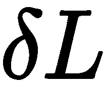)。
3.  通过更新权重(其中 *k* 为正值，是一个被称为**学习率**的超参数)。

请注意，对特定权重的更新与通过少量更改而减少的损失量成比例。直观地说，如果改变一个权重可以大幅度减少损失，那么我们可以大幅度更新权重。但是，如果通过改变权重减少的损失很小，那么我们只对其进行少量更新。

如果前面的步骤在整个数据集上执行 *n* 次(其中我们已经完成了前馈传播和反向传播)，它基本上导致了对*n*时期的训练。

由于典型的神经网络包含数千/数百万(如果不是数十亿)个权重，因此改变每个权重的值，并检查损失是增加还是减少并不是最佳的。前面列表中的核心步骤是当重量改变时“损失变化”的测量。你可能学过微积分，测量这个和计算重量损失的梯度是一样的。在下一节，关于反向传播的链式法则，会有更多关于利用微积分的偏导数来计算重量损失的梯度。

在本节中，我们将从头开始实现梯度下降，一次更新一个权重，每次更新一个小的量，如本节开始时所详述的。然而，在实现反向传播之前，让我们了解神经网络的一个额外的细节:学习速率。

直观上，学习率有助于建立对算法的信任。例如，当决定权重更新的幅度时，我们可能不会一次改变很大的权重值，而是更慢地更新它。

这导致在我们的模型中获得稳定性；我们将在*了解学习率的影响*一节中了解学习率如何帮助稳定性。

我们更新权重以减少误差的整个过程被称为**梯度下降**。

**随机梯度下降**是在前面的场景中误差最小化的方式。如前所述，**梯度**代表差异(当权重值少量更新时损失值的差异)，而**下降**表示减少。**随机**代表随机样本的选择，基于此做出决策。

除了随机梯度下降，许多其他类似的优化器有助于最小化损失值；不同的优化器将在下一章讨论。

在接下来的两节中，我们将学习用 Python 从头开始编写反向传播的直觉代码，还将简要讨论反向传播如何使用链规则工作。

## 代码中的梯度下降

梯度下降在 Python 中实现如下:

The following code is available as `Gradient_descent.ipynb` in the `Chapter01` folder of this book's GitHub repository - [https://tinyurl.com/mcvp-packt](https://tinyurl.com/mcvp-packt)

1.  定义前馈网络并计算均方误差损失值，如我们在代码中的*前馈传播部分所做的:*

```py
from copy import deepcopy
import numpy as np
def feed_forward(inputs, outputs, weights): 
    pre_hidden = np.dot(inputs,weights[0])+ weights[1]
    hidden = 1/(1+np.exp(-pre_hidden))
    pred_out = np.dot(hidden, weights[2]) + weights[3]
    mean_squared_error = np.mean(np.square(pred_out \
                                           - outputs)) 
    return mean_squared_error
```

2.  将每个权重和偏移值增加一个非常小的量(0.0001)，并为每个权重和偏移更新一次计算一个总的平方误差损失值。

*   在下面的代码中，我们创建了一个名为`update_weights`的函数，它执行梯度下降过程来更新权重。该函数的输入是网络的输入变量—`inputs`、预期的`outputs`、`weights`(在训练模型开始时随机初始化)，以及模型的学习速率—`lr`(在后面的部分中详细介绍学习速率):

```py
def update_weights(inputs, outputs, weights, lr):
```

*   确保你的重量清单。由于权重将在后面的步骤中被操作，`deepcopy`确保我们可以在不干扰实际权重的情况下使用权重的多个副本。我们将创建原始权重集的三个副本，它们作为输入传递给函数——`original_weights`、`temp_weights`和`updated_weights`:

```py
original_weights = deepcopy(weights)
temp_weights = deepcopy(weights)
updated_weights = deepcopy(weights)           
```

*   通过`feed_forward`函数传递`inputs`、`outputs`和`original_weights`，用原来的一组权重计算损失值(`original_loss`):

```py
original_loss = feed_forward(inputs, outputs, \
                                 original_weights)
```

*   我们将遍历网络的所有层:

```py
for i, layer in enumerate(original_weights):
```

*   我们的神经网络中共有四个参数列表——两个用于将输入连接到隐藏层的权重和偏差参数列表，另外两个用于将隐藏层连接到输出层的权重和偏差参数列表。现在，我们遍历所有单个参数，因为每个列表都有不同的形状，所以我们利用`np.ndenumerate`遍历给定列表中的每个参数:

```py
for index, weight in np.ndenumerate(layer):
```

*   现在我们将原始的一组权重存储在`temp_weights`中。我们选择存在于第 i ^层中的索引权重，并将其增加一个小值。最后，我们用神经网络的新的一组权重计算新的损失:

```py
temp_weights = deepcopy(weights)
temp_weights[i][index] += 0.0001
_loss_plus = feed_forward(inputs, outputs, \
                            temp_weights)
```

在上述代码的第一行中，我们将`temp_weights`重置为原始权重集，因为在每次迭代中，当参数在给定时段内少量更新时，我们会更新不同的参数来计算损失。

*   我们计算由于重量变化引起的梯度(损失值的变化):

```py
grad = (_loss_plus - original_loss)/(0.0001)
```

这个以非常小的量更新一个参数然后计算梯度的过程相当于微分的过程。

*   最后，我们更新出现在相应的第 i ^层和`updated_weights`层`index`中的参数。更新的权重值将与梯度值成比例地减少。此外，我们引入了一种通过使用学习率来慢慢建立信任的机制，而不是完全减少一个等于梯度值的值—`lr`(在*了解学习率的影响*部分中有更多关于学习率的信息):

```py
updated_weights[i][index] -= grad*lr
```

*   一旦所有层的参数值和层内的指数被更新，我们返回更新的权重值-`updated_weights`:

```py
return updated_weights, original_loss
```

神经网络中的另一个参数是在计算损失值时考虑的**批量**。

在前面的场景中，我们考虑了所有数据点来计算损失(均方误差)值。然而，在实践中，当我们有数千个(在某些情况下，数百万个)数据点时，在计算损失值时，更多数据点的增量贡献将遵循收益递减规律，因此我们将使用与我们拥有的数据点总数相比小得多的批量。我们将一次使用一个**批次**来应用梯度下降(在前馈传播之后),直到我们在训练的一个时期内用尽**中的所有数据点。**

构建模型时考虑的典型批量大小在 32 到 1，024 之间。

在本节中，我们学习了当权重值发生少量变化时，根据损失值的变化来更新权重值。在下一节中，我们将了解如何更新权重，而不需要一次计算一个梯度。

## 使用链式法则实现反向传播

到目前为止，我们已经通过少量更新权重，然后计算原始场景(当权重不变时)中的前馈损失和更新权重后的前馈损失之间的差异，计算了关于权重的损失梯度。以这种方式更新权重值的一个缺点是，当网络很大时，需要大量的计算来计算损失值(实际上，计算要进行两次——一次是权重值不变，另一次是权重值少量更新)。这导致更多的计算，因此需要更多的资源和时间。在本节中，我们将了解如何利用链式法则，该法则不要求我们手动计算损失值来得出与重量值相关的损失梯度。

在第一次迭代中(我们随机初始化权重)，输出的预测值是 1.235。

为了得到理论公式，让我们将权重和隐藏层值以及隐藏层激活分别表示为 *w* 、 *h、*和 *a* ，如下所示:

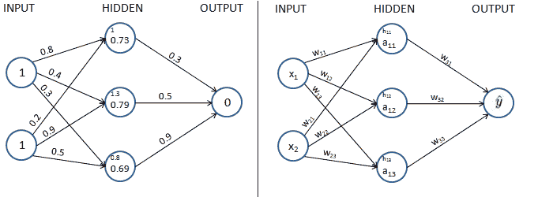

请注意，在前面的图表中，我们已经将左图中的每个组件值归纳到右图中。

为了便于理解，在本节中，我们将了解如何使用链式法则来计算仅关于 w [11] 的损失值的梯度。同样的学习可以扩展到神经网络的所有权重和偏差。我们鼓励您练习并将链式法则计算应用于其余的权重和偏差值。

本书 GitHub 资源库的`Chapter01`文件夹中的`chain_rule.ipynb`笔记本包含了使用链式法则计算网络中所有参数的权重和偏差变化的梯度的方法。

此外，为了便于学习，我们将只处理一个数据点，其中输入为{1，1}，预期输出为{0}。

假设我们正在用 w [11] 计算损耗值的梯度，让我们通过下图了解计算梯度时要包括的所有中间元件(不将输出连接到 w [11] 的元件在下图中显示为灰色):

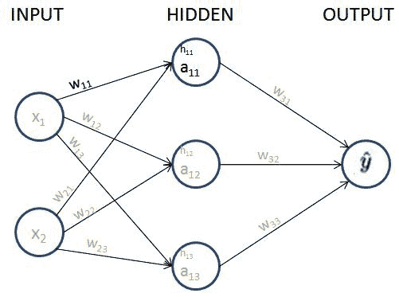

从上图中，我们可以看到 w [11] 通过突出显示的路径—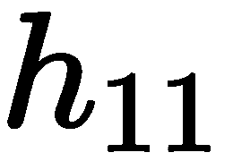、和贡献了损失值。

接下来，我们来阐述一下、、是如何分别获得的。

网络的损耗值表示如下:


预测输出值计算如下:

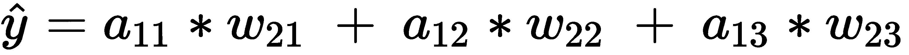

隐藏层激活值(sigmoid 激活)计算如下:

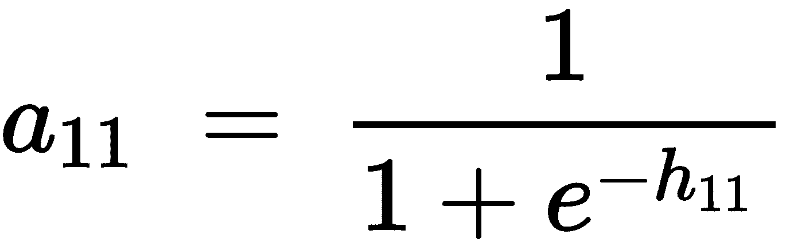

隐藏层值计算如下:


既然我们已经制定了所有的方程，让我们计算损失值( *C* )的变化相对于重量的变化的影响如下:

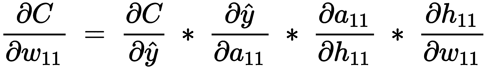

这被称为**链式法则**。本质上，我们正在执行一个微分链，以获取我们感兴趣的微分。

请注意，在前面的等式中，我们已经建立了一系列偏微分方程，现在我们能够对四个分量中的每一个单独进行偏微分，并最终计算损失值相对于重量值的导数。

上述等式中的各个偏导数计算如下:

*   损失值相对于预测输出值的偏导数如下:


*   预测输出值相对于隐藏层激活值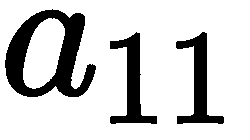的偏导数如下:


*   隐藏层激活值相对于激活前隐藏层值的偏导数如下:

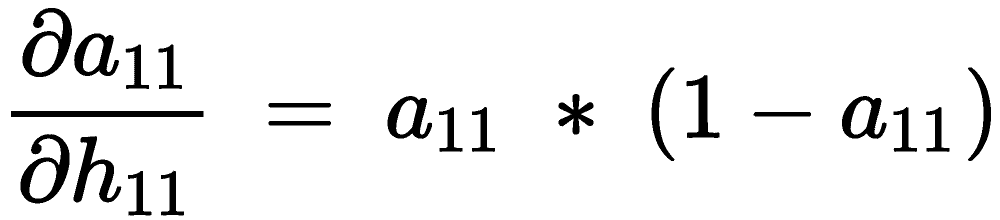

注意，前面的等式来自于 sigmoid 函数的导数是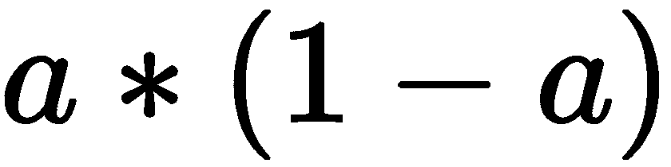的事实。

*   激活前的隐藏层值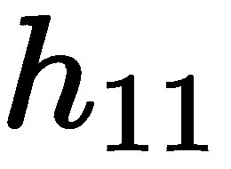相对于权重值的偏导数如下:

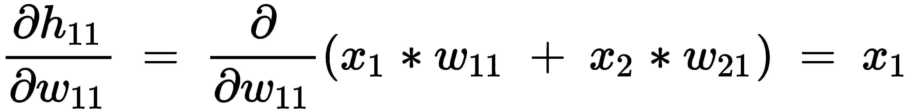

这样，损失值相对于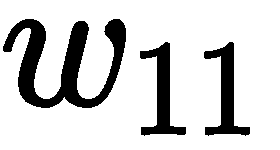的梯度通过将每个偏微分项替换为之前步骤中计算的相应值来计算，如下所示:

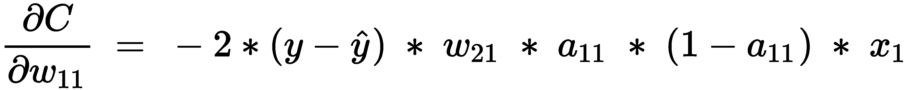

从前面的公式中，我们可以看到，我们现在能够计算重量值的微小变化(损失相对于重量的梯度)对损失值的影响，而无需通过再次计算前馈传播来强行进行。

接下来，我们将继续更新权重值，如下所示:


这两种方法的工作版本，1)使用链式法则识别梯度，然后更新权重，以及 2)通过了解权重值的微小变化对损失值的影响来更新权重值，从而使更新后的权重值具有相同的值，在本书的 GitHub 资源库-【https://tinyurl.com/mcvp-packt】T2 的`Chapter01`文件夹中的笔记本`Chain_rule.ipynb`中提供

在梯度下降中，我们顺序执行权重更新过程(一次一个权重)。通过利用链式法则，我们了解到有一种替代方法可以计算重量的少量变化对损失值的影响，但是有机会进行并行计算。

Because we are updating parameters across all layers, the whole process of updating parameters can be parallelized. Further, given that in a realistic scenario, there can exist millions of parameters across layers, performing the calculation for each parameter on a different core of GPU results in the time taken to update weights is a much faster exercise than looping through each weight, one at a time.

现在，我们已经从直觉的角度和利用链式法则对反向传播有了一个坚实的了解，在下一节中，我们将了解前馈和反向传播如何协同工作以达到最佳权重值。

# **将前馈传播和反向传播放在一起**

在本节中，我们将构建一个简单的神经网络，它具有一个隐藏层，将输入连接到我们在代码部分的*前馈传播中处理的相同玩具数据集的输出，并且还利用我们在上一节中定义的`update_weights`函数来执行反向传播，以获得最佳权重和偏差值。*

我们将模型定义如下:

1.  输入连接到具有三个单元/节点的隐藏层。
2.  隐藏层连接到输出，输出层中有一个单元。

The following code is available as `Back_propagation.ipynb` in the `Chapter01` folder of this book's GitHub repository - [https://tinyurl.com/mcvp-packt](https://tinyurl.com/mcvp-packt)

我们将创建如下网络:

1.  导入相关包并定义数据集:

```py
from copy import deepcopy
import numpy as np 
x = np.array([[1,1]])
y = np.array([[0]])
```

2.  随机初始化权重和偏差值。

隐藏层中有三个单元，每个输入节点连接到每个隐藏层单元。因此，总共有六个权重值和三个偏置值-一个偏置和两个权重(两个权重来自两个输入节点)对应于每个隐藏单元。此外，最后一层有一个单元连接到隐藏层的三个单元。因此，总共三个权重和一个偏差决定了输出层的值。随机初始化的权重如下:

```py
W = [
    np.array([[-0.0053, 0.3793], 
              [-0.5820, -0.5204],
              [-0.2723, 0.1896]], dtype=np.float32).T, 
    np.array([-0.0140, 0.5607, -0.0628], dtype=np.float32), 
    np.array([[ 0.1528,-0.1745,-0.1135]],dtype=np.float32).T, 
    np.array([-0.5516], dtype=np.float32)
]
```

在前面的代码中，第一个参数数组对应于将输入层连接到隐藏层的 2 x 3 权重矩阵。第二个参数数组表示与隐藏层的每个节点相关联的偏差值。第三个参数数组对应于将隐藏层连接到输出层的 3 x 1 权重矩阵，最后一个参数数组表示与输出层相关联的偏差。

3.  运行神经网络通过 100 个前馈传播和反向传播时期——其功能已经在前面章节中学习并定义为`feed_forward`和`update_weights`功能。

*   定义`feed_forward`功能:

```py
def feed_forward(inputs, outputs, weights): 
    pre_hidden = np.dot(inputs,weights[0])+ weights[1]
    hidden = 1/(1+np.exp(-pre_hidden))
    pred_out = np.dot(hidden, weights[2]) + weights[3]
    mean_squared_error = np.mean(np.square(pred_out \
                                           - outputs)) 
    return mean_squared_error
```

*   定义`update_weights`功能:

```py
def update_weights(inputs, outputs, weights, lr):
    original_weights = deepcopy(weights)
    temp_weights = deepcopy(weights)
    updated_weights = deepcopy(weights) 
    original_loss = feed_forward(inputs, outputs, \
                                 original_weights)
    for i, layer in enumerate(original_weights):
        for index, weight in np.ndenumerate(layer):
            temp_weights = deepcopy(weights)
            temp_weights[i][index] += 0.0001
            _loss_plus = feed_forward(inputs, outputs, \
                                      temp_weights)
            grad = (_loss_plus - original_loss)/(0.0001)
            updated_weights[i][index] -= grad*lr
    return updated_weights, original_loss
```

*   在 100 个时期内更新权重，并获取损失值和更新后的权重值:

```py
losses = []
for epoch in range(100):
    W, loss = update_weights(x,y,W,0.01)
    losses.append(loss)
```

4.  绘制损失值:

```py
import matplotlib.pyplot as plt
%matplotlib inline
plt.plot(losses)
plt.title('Loss over increasing number of epochs')
plt.xlabel('Epochs')
plt.ylabel('Loss value')
```

上述代码生成了以下图形:

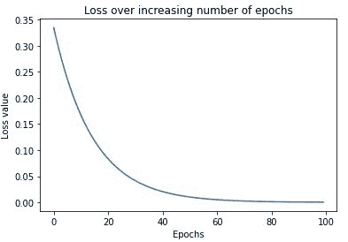

你可以看到，损失开始在 0.33 左右，稳步下降到 0.0001 左右。这表明权重是根据输入-输出数据调整的，当给定一个输入时，我们可以期望它预测我们在损失函数中与之比较的输出。输出权重如下:

```py
[array([[ 0.01424004, -0.5907864 , -0.27549535],
        [ 0.39883757, -0.52918637, 0.18640439]], dtype=float32),
 array([ 0.00554004, 0.5519136 , -0.06599568], dtype=float32),
 array([[ 0.3475135 ],
        [-0.05529078],
        [ 0.03760847]], dtype=float32),
 array([-0.22443289], dtype=float32)]
```

GitHub 笔记本(`Auto_gradient_of_tensors.ipynb`)中演示了相同代码相同权重的 PyTorch 版本。理解下一章 PyTorch 的核心概念后，再来看这一节。自己验证一下，不管网络是用 NumPy 还是 PyTorch 写的，输入和输出确实是一样的。使用 NumPy 数组从零开始构建一个网络，虽然不是最优的，但在这一章中会帮助你对神经网络的工作细节有一个坚实的基础。

5.  一旦我们有了更新的权重，通过将输入传递到网络来对输入进行预测，并计算输出值:

```py
pre_hidden = np.dot(x,W[0]) + W[1]
hidden = 1/(1+np.exp(-pre_hidden))
pred_out = np.dot(hidden, W[2]) + W[3]
# -0.017
```

前面代码的输出是`-0.017`的值，这个值非常接近预期的输出 0。随着我们训练更多的纪元，`pred_out`值变得更加接近 0。

到目前为止，我们已经了解了前馈传播和反向传播。我们在这里定义的`update_weights`函数的关键部分是学习率——我们将在下一节中学习。

# 了解学习速度的影响

为了理解学习率如何影响模型的训练，让我们考虑一个非常简单的情况，其中我们尝试拟合以下方程(注意，以下方程不同于我们迄今为止一直在处理的玩具数据集):


注意， *y* 是输出， *x* 是输入。有了一组输入值和预期输出值，我们将尝试用不同的学习率来拟合方程，以了解学习率的影响。

The following code is available as `Learning_rate.ipynb` in the `Chapter01` folder of this book's GitHub repository - [https://tinyurl.com/mcvp-packt](https://tinyurl.com/mcvp-packt)

1.  我们指定输入和输出数据集如下:

```py
x = [[1],[2],[3],[4]]
y = [[3],[6],[9],[12]]
```

2.  定义`feed_forward`功能。此外，在这种情况下，我们将修改网络，使我们没有隐藏层，架构如下:

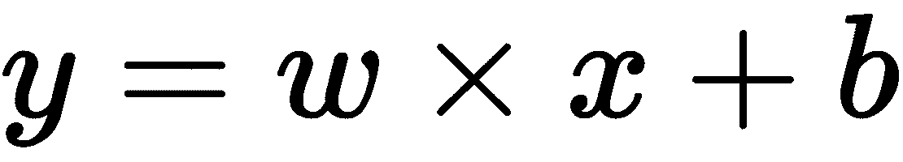

注意，在前面的函数中，我们正在估计参数 *w* 和 *b* :

```py
from copy import deepcopy
import numpy as np
def feed_forward(inputs, outputs, weights):
    pred_out = np.dot(inputs,weights[0])+ weights[1]
    mean_squared_error = np.mean(np.square(pred_out \
                                           - outputs))
    return mean_squared_error
```

3.  定义`update_weights`函数，就像我们在代码部分的*梯度下降中定义的那样:*

```py
def update_weights(inputs, outputs, weights, lr):
    original_weights = deepcopy(weights)
    org_loss = feed_forward(inputs, outputs,original_weights)
    updated_weights = deepcopy(weights)
    for i, layer in enumerate(original_weights):
        for index, weight in np.ndenumerate(layer):
            temp_weights = deepcopy(weights)
            temp_weights[i][index] += 0.0001
            _loss_plus = feed_forward(inputs, outputs, \
                                      temp_weights)
            grad = (_loss_plus - org_loss)/(0.0001)
            updated_weights[i][index] -= grad*lr
    return updated_weights
```

4.  将权重和偏差值初始化为随机值:

```py
W = [np.array([[0]], dtype=np.float32), 
     np.array([[0]], dtype=np.float32)]
```

注意，权重和偏移值被随机初始化为值 0。此外，输入权重值的形状是 1×1，因为输入中每个数据点的形状是 1×1，偏移值的形状是 1×1(因为输出中只有一个节点，每个输出有一个值)。

5.  让我们利用学习率为 0.01 的`update_weights`函数，循环 1，000 次迭代，并检查权重值(`W`)在增加的时期内如何变化:

```py
weight_value = []
for epx in range(1000):
    W = update_weights(x,y,W,0.01)
    weight_value.append(W[0][0][0])
```

注意，在前面的代码中，我们使用 0.01 的学习率，并重复`update_weights`函数在每个时期结束时获取修改后的权重。此外，在每个时期，我们给出最近更新的权重作为输入，以在下一个时期获取更新的权重。

6.  在每个时期结束时绘制权重参数的值:

```py
import matplotlib.pyplot as plt
%matplotlib inline
epochs = range(1, 1001)
plt.plot(epochs,weight_value)
plt.title('Weight value over increasing \
epochs when learning rate is 0.01')
plt.xlabel('Epochs')
plt.ylabel('Weight value')
```

前面的代码会导致权重值在增加的时期内发生变化，如下所示:


请注意，在前面的输出中，权重值逐渐向右增加，然后在最佳值~3 处饱和。

为了理解学习率的值对达到最佳权重值的影响，让我们理解当学习率为 0.1 和学习率为 1 时，权重值如何随着时期的增加而变化。

当我们在步骤 5 中修改相应的学习率值并执行步骤 6 时，会获得以下图表(生成以下图表的代码与我们之前学习的代码相同，只是学习率值有所变化，可在 GitHub 中的相关笔记本中找到):

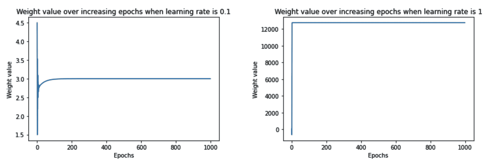

请注意，当学习率非常小(0.01)时，权重值缓慢地(经过更多的时期)向最佳值移动。然而，在稍高的学习率(0.1)下，权重值最初振荡，然后迅速饱和(在更少的时期内)到最优值。最后，当学习率很高(1)时，权重值达到非常高的值，并且不能达到最佳值。

当学习率较低时，权重值没有大幅增加的原因是，我们将权重更新限制为等于*梯度*学习率*的量，这实质上导致当学习率较低时，权重更新量较小。然而，当学习速率较高时，权重更新较高，之后损失的变化(当权重被更新一个小值时)很小，以至于权重不能达到最优值。

为了更深入地理解梯度值、学习率和权重值之间的相互作用，让我们只运行`update_weights`函数 10 个时期。此外，我们将打印以下值，以了解它们如何随着时代的增加而变化:

*   每个时期开始时的权重值
*   重量更新前的损失
*   重量少量更新时的损失
*   梯度值

我们修改`update_weights`函数来打印前面的值，如下所示:

```py
def update_weights(inputs, outputs, weights, lr):
    original_weights = deepcopy(weights)
    org_loss = feed_forward(inputs, outputs, original_weights)
    updated_weights = deepcopy(weights)
    for i, layer in enumerate(original_weights):
        for index, weight in np.ndenumerate(layer):
            temp_weights = deepcopy(weights)
            temp_weights[i][index] += 0.0001
            _loss_plus = feed_forward(inputs, outputs, \
                                      temp_weights)
            grad = (_loss_plus - org_loss)/(0.0001)
            updated_weights[i][index] -= grad*lr
            if(i % 2 == 0):
 print('weight value:', \
 np.round(original_weights[i][index],2), \
 'original loss:', np.round(org_loss,2), \
 'loss_plus:', np.round(_loss_plus,2), \
 'gradient:', np.round(grad,2), \
 'updated_weights:', \
 np.round(updated_weights[i][index],2))
    return updated_weights
```

在前面的代码中以粗体突出显示的行是我们修改前一节中的`update_weights`函数的地方，在这里，首先，我们通过检查(`i % 2 == 0`)是否与偏差值相对应来检查我们当前是否正在处理权重参数，然后我们打印原始权重值(`original_weights[i][index]`)、损失(`org_loss`)、更新的损失值(`_loss_plus`)、梯度(`grad`)和结果更新的权重值(`updated_weights`)。

现在让我们来了解一下，在我们考虑的三种不同的学习速率中，前面的值是如何随着时间的增加而变化的:

*   **0.01**的学习率:我们将使用以下代码检查这些值:

```py
W = [np.array([[0]], dtype=np.float32), 
     np.array([[0]], dtype=np.float32)]
weight_value = []
for epx in range(10):
    W = update_weights(x,y,W,0.01)
    weight_value.append(W[0][0][0])
print(W)
import matplotlib.pyplot as plt
%matplotlib inline
epochs = range(1, 11)
plt.plot(epochs,weight_value)
plt.title('Weight value over increasing \
epochs when learning rate is 0.01')
plt.xlabel('Epochs')
plt.ylabel('Weight value')
```

上述代码会产生以下输出:


注意，当学习率为 0.01 时，损失值缓慢下降，并且权重值也朝着最佳值缓慢更新。现在让我们来了解一下当学习率为 0.1 时，上述情况是如何变化的。

*   **0.1 的学习率:**代码与学习率为 0.01 的场景中的代码保持相同，但是，在该场景中，学习率参数将为 0.1。使用更改的学习率参数值运行相同代码的输出如下:

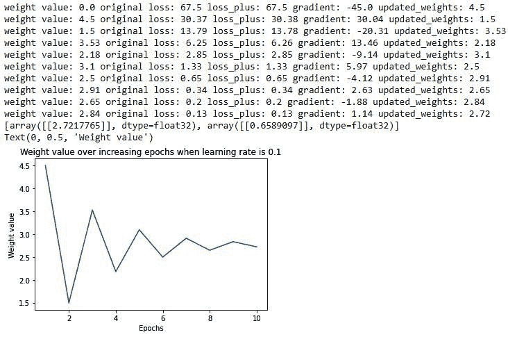

让我们对比一下 0.01 和 0.1 的学习率场景，两者之间的主要区别如下:

*当学习率为 0.01 时，与 0.1 的学习率相比，权重更新得更慢(当学习率为 0.01 时，从第一时段中的 0 到 0.45，当学习率为 0.1 时，到 4.5)。更新较慢的原因是学习速率较低，因为权重是通过梯度乘以学习速率来更新的。*

除了权重更新幅度之外，我们还应该注意权重更新的方向:

当权重值小于最优值时，梯度为负，当权重值大于最优值时，梯度为正。这种现象有助于在正确的方向上更新权重值。

最后，我们将学习率 1:

*   **1**的学习率:代码保持与 0.01 的学习率场景中的代码相同，但是，在该场景中，学习率参数将为 1。使用更改后的学习率参数运行相同代码的输出如下:

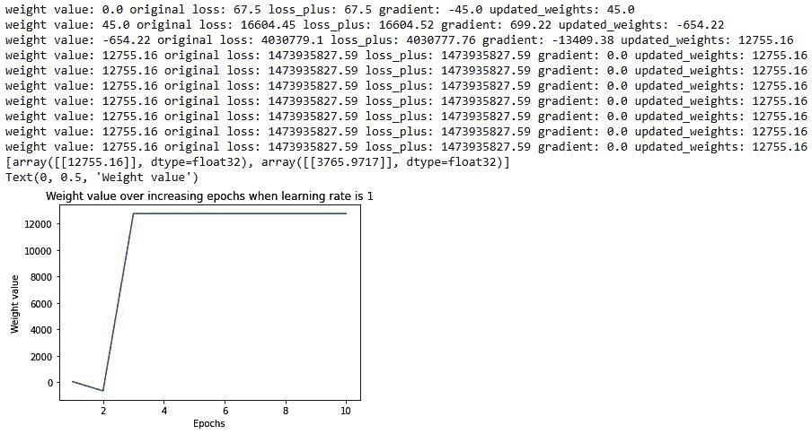

从前面的图中，我们可以看到权重已经偏离到非常高的值(如在第一个时期结束时，权重值为 45，在后面的时期中进一步偏离到非常大的值)。除此之外，权重值移动到非常大的量，因此权重值的小变化几乎不会导致梯度的变化，因此权重停留在该高值。

一般来说，学习率低比较好。这样，模型能够缓慢学习，但会将权重调整到最佳值。典型的学习率参数值范围在 0.0001 和 0.01 之间。

现在，我们已经了解了神经网络的构建模块——前馈传播、反向传播和学习速率，在下一节中，我们将总结如何将这三者结合起来训练神经网络的高级概述。

# **总结神经网络的训练过程**

训练神经网络是通过以给定的学习速率重复前向传播和反向传播这两个关键步骤来得出神经网络架构的最佳权重的过程。

在前向传播中，我们将一组权重应用于输入数据，使其通过定义的隐藏层，对隐藏层的输出执行定义的非线性激活，然后通过将隐藏层节点值乘以另一组权重来估计输出值，从而将隐藏层连接到输出层。然后，我们最终计算对应于给定权重集的总损失。对于第一次前向传播，权重值被随机初始化。

在反向传播中，我们通过在减少总损失的方向上调整权重来减少损失值(误差)。此外，权重更新的幅度是梯度乘以学习速率。

前馈传播和反向传播的过程重复进行，直到我们实现尽可能小的损失。这意味着，在训练结束时，神经网络已经调整了它的权重，以便它预测我们希望它预测的输出。在前面的玩具示例中，经过训练后，当 *{1，1}* 被输入时，更新后的网络将预测 0 值作为输出，因为它被训练以实现该值。

# 摘要

在本章中，在我们了解人工神经网络的架构和各种组件之前，我们了解了对单个网络的需求，该网络可以在单个镜头中执行特征提取和分类。接下来，我们学习了如何在实现前馈传播之前连接网络的各层，以计算与网络当前权重相对应的损耗值。接下来，我们实现了反向传播，以了解优化权重来最小化损失值的方法。此外，我们还了解了学习速率如何在实现网络的最佳权重方面发挥作用。此外，我们实现了网络的所有组件——前馈传播、激活函数、损失函数、链式法则和梯度下降，以从头开始更新 NumPy 中的权重，从而为我们在接下来的章节中构建打下坚实的基础。

既然我们已经了解了神经网络的工作原理，我们将在下一章使用 PyTorch 实现一个神经网络，并在第三章深入研究神经网络中可以调整的各种其他组件(超参数)。

# 问题

1.  神经网络中的各层是什么？
2.  前馈传播的输出是什么？
3.  连续因变量的损失函数与二元因变量以及分类因变量的损失函数有何不同？
4.  什么是随机梯度下降？
5.  反向传播练习做什么？
6.  在反向传播期间，跨层的所有权重的权重更新是如何发生的？
7.  在训练神经网络的每个时期内，神经网络的哪些功能发生？
8.  为什么在 GPU 上训练网络比在 CPU 上训练更快？
9.  学习率如何影响神经网络的训练？
10.  学习率参数的典型值是多少？