# 五、用于图像分类的迁移学习

在前一章中，我们了解到，随着训练数据集中可用图像数量的增加，模型的分类精度不断提高，达到了包含 8，000 幅图像的训练数据集在验证数据集上比包含 1，000 幅图像的训练数据集具有更高精度的程度。然而，为了训练一个模型，我们并不总是能够选择成百上千的图像，以及它们相应类别的基本事实。这就是迁移学习的用处。

迁移学习是一种技术，其中我们将通用数据集上的模型学习转移到感兴趣的特定数据集。通常，用于执行迁移学习的预训练模型是在数百万幅图像(这些图像是通用的，不是我们感兴趣的数据集)上训练的，这些预训练模型现在被微调到我们感兴趣的数据集。

在本章中，我们将学习两种不同的迁移学习架构——VGG 架构的变体和 ResNet 架构的变体。

除了了解这些架构，我们还将了解它们在两种不同用例中的应用，年龄和性别分类，我们将了解如何同时优化交叉熵和平均绝对误差损失，以及面部关键点检测，我们将了解如何利用神经网络在单个预测中生成多个(136 个，而不是 1 个预测)连续输出。最后，我们将了解一个新的库，它有助于在剩余的章节中大大降低代码的复杂性。

总之，本章涵盖了以下主题:

*   介绍迁移学习
*   了解 VGG16 和 ResNet 架构
*   实现面部关键点检测
*   多任务学习:实现年龄估计和性别分类
*   torch_snippets 库简介

# 介绍迁移学习

迁移学习是一种利用从一项任务中获得的知识来解决另一项类似任务的技术。

想象一下，一个模型在跨越数千种对象(不仅仅是猫和狗)的数百万张图像上进行训练。模型的各种过滤器(内核)将针对图像中的各种形状、颜色和纹理而激活。这些过滤器现在可以重复使用，以学习一组新图像的特征。在学习特征之后，它们可以连接到最终分类层之前的隐藏层，以便对新数据进行定制。

ImageNet([http://www.image-net.org/](http://www.image-net.org/))是一项竞赛，旨在将大约 1400 万张图片分为 1000 个不同的类别。它在数据集中有各种类，包括印度象、狮子鱼、硬盘、发胶和吉普。

我们将在本章中讨论的深度神经网络架构已经在 ImageNet 数据集上进行了训练。此外，考虑到要在 ImageNet 中分类的对象的种类和数量，模型非常深入，以便捕捉尽可能多的信息。

让我们通过一个假设的场景来理解迁移学习的重要性:

考虑这样一种情况，我们正在处理道路的图像，试图根据它们包含的对象对它们进行分类。从零开始构建模型可能会导致次优结果，因为图像的数量可能不足以学习数据集中的各种变化(正如我们在之前的使用案例中所看到的，在 8，000 张图像上的训练比在 2，000 张图像上的训练产生了更高的验证数据集准确性)。在这种情况下，在 ImageNet 上训练的预训练模型就派上了用场。在对大型 ImageNet 数据集进行训练的过程中，它可能已经了解了许多与交通相关的类，如汽车、道路、树木和人类。因此，利用已经训练的模型将导致更快和更准确的训练，因为模型已经知道通用形状，现在必须使它们适合特定图像。有了直觉，现在让我们理解迁移学习的高级流程如下:

1.  标准化输入图像，通过在预训练模型的训练期间使用的**相同平均值和标准偏差**进行标准化。
2.  获取预训练模型的架构。获取此架构的权重，这是在大型数据集上训练的结果。
3.  丢弃预训练模型的最后几层。
4.  将截断的预训练模型连接到新初始化的层(或多个层),其中权重被随机初始化。确保最后一层的输出具有与我们想要预测的类/输出一样多的神经元
5.  确保预训练模型的权重是不可训练的(换句话说，在反向传播期间被冻结/不被更新)，但是新初始化的层的权重和将其连接到输出层的权重是可训练的:

*   我们不训练预训练模型的权重，因为我们假设这些权重对于该任务已经很好地学习了，因此利用了从大型模型的学习。总之，我们只学习小数据集的新初始化的层。

6.  在增加的时期内更新可训练参数以适合模型。

既然我们对如何实现迁移学习有了一个概念，那么让我们来理解各种架构，它们是如何构建的，以及在后续部分中我们将迁移学习应用于猫和狗的用例时的结果。首先，我们将详细介绍来自 **VGG** 的各种架构。

# 了解 VGG16 架构

**VGG** 代表**视觉** **几何** **群**，是基于牛津大学的，16 代表模型中的层数。VGG16 模型在 ImageNet 竞赛中被训练用于分类对象，并在 2014 年获得亚军架构。我们之所以研究这种架构，而不是获胜的架构(GoogleNet ),是因为它的简单性，以及通过在其他几个任务中使用它，它在 vision 社区中被更广泛地接受。让我们了解 VGG16 的架构，以及如何在 PyTorch 中访问和表示 VGG16 预训练模型。

The code for this section is available as `VGG_architecture.ipynb` in the `Chapter05` folder of this book's GitHub repository - [https://tinyurl.com/mcvp-packt](https://tinyurl.com/mcvp-packt)

1.  安装所需的软件包:

```py
import torchvision
import torch.nn as nn
import torch
import torch.nn.functional as F
from torchvision import transforms,models,datasets
!pip install torch_summary
from torchsummary import summary
device = 'cuda' if torch.cuda.is_available() else 'cpu'
```

`torchvision`包中的`models`模块托管 PyTorch 中可用的各种预训练模型。

2.  加载 VGG16 型号并在设备中注册型号:

```py
model = models.vgg16(pretrained=True).to(device)
```

在前面的代码中，我们在`models`类中调用了`vgg16`方法。此外，通过提及`pretrained = True`，我们指定加载 ImageNet 竞赛中用于图像分类的权重，然后我们将模型注册到设备。

3.  获取模型的概要:

```py
summary(model, torch.zeros(1,3,224,224));
```

上述代码的输出如下:

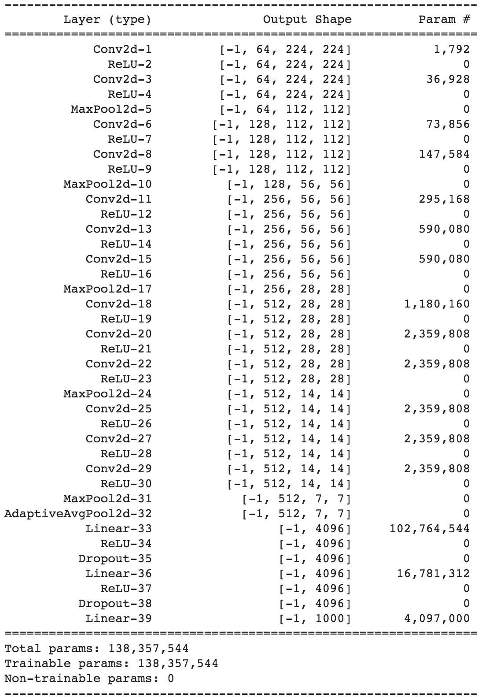

在前面的总结中，我们提到的 16 个层分组如下:

`{1,2},{3,4,5},{6,7},{8,9,10},{11,12},{13,14},{15,16,17},{18,19},{20,21},{22,23,24},{25,26},{27,28},{29,30,31,32},{33,34,35},{36,37,38],{39}`

同样的总结也可以这样设想:

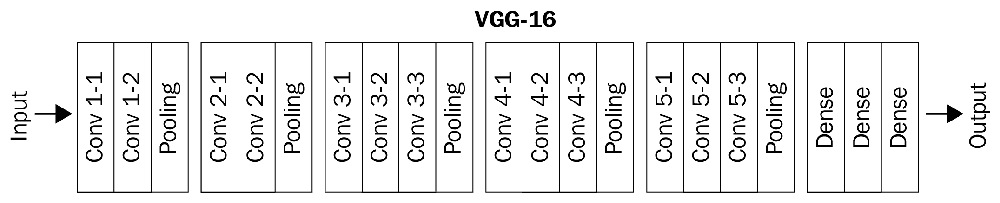

请注意，该网络中有约 1.38 亿个参数(其中约 1.22 亿个是网络末端的线性层，即 102+16+400 万个参数)，该网络包括 13 个卷积和/或池层以及 3 个线性层，滤波器数量不断增加。

理解 VGG16 模型组件的另一种方法是简单地将其打印如下:

```py
model
```

这会产生以下输出:


注意，模型中有三个主要的子模块— `features`、`avgpool`和`classifier`。通常，我们会冻结`features`和`avgpool`模块。删除`classifier`模块(或仅底部的几层)并在其位置创建一个新模块，该模块将预测对应于我们数据集的所需类数量(而不是现有的 1000 个)。

现在，让我们通过在以下代码中使用猫与狗数据集(考虑每个类中只有 500 张图像用于训练),来了解 VGG16 模型在实践中是如何使用的:

The following code is available as `Implementing_VGG16_for_image_classification.ipynb` in the `Chapter05` folder of this book's GitHub repository - [https://tinyurl.com/mcvp-packt](https://tinyurl.com/mcvp-packt) Be sure to copy the URL from the notebook in GitHub to avoid any issue while reproducing the results

1.  安装所需的软件包:

```py
import torch
import torchvision
import torch.nn as nn
import torch.nn.functional as F
from torchvision import transforms,models,datasets
import matplotlib.pyplot as plt
from PIL import Image
from torch import optim
device = 'cuda' if torch.cuda.is_available() else 'cpu'
import cv2, glob, numpy as np, pandas as pd
from glob import glob
import torchvision.transforms as transforms
from torch.utils.data import DataLoader, Dataset
```

2.  下载数据集并指定培训和测试目录:

*   下载数据集。假设我们在 Google Colab 上工作，我们执行以下步骤，其中我们提供认证密钥并将其放在 Kaggle 可以使用该密钥认证我们并下载数据集的位置:

```py
!pip install -q kaggle
from google.colab import files
files.upload()
!mkdir -p ~/.kaggle
!cp kaggle.json ~/.kaggle/
!ls ~/.kaggle
!chmod 600 /root/.kaggle/kaggle.json
```

*   下载数据集并解压缩:

```py
!kaggle datasets download -d tongpython/cat-and-dog
!unzip cat-and-dog.zip
```

*   指定训练和测试图像文件夹:

```py
train_data_dir = 'training_set/training_set'
test_data_dir = 'test_set/test_set'
```

3.  提供为猫狗数据集返回输入-输出对的类，就像我们在[第 4 章](c184fff6-28cc-4e13-830b-3b2a21736f75.xhtml)、*介绍卷积神经网络*中所做的一样。请注意，在这种情况下，我们只从每个文件夹中获取前 500 张图像:

```py
class CatsDogs(Dataset):
    def __init__(self, folder):
        cats = glob(folder+'/cats/*.jpg')
        dogs = glob(folder+'/dogs/*.jpg')
        self.fpaths = cats[:500] + dogs[:500]
 self.normalize = transforms.Normalize(mean=[0.485, 
 0.456, 0.406],std=[0.229, 0.224, 0.225])
        from random import shuffle, seed; seed(10); 
        shuffle(self.fpaths)
        self.targets =[fpath.split('/')[-1].startswith('dog') \
                        for fpath in self.fpaths] 
    def __len__(self): return len(self.fpaths)
    def __getitem__(self, ix):
        f = self.fpaths[ix]
        target = self.targets[ix]
        im = (cv2.imread(f)[:,:,::-1])
        im = cv2.resize(im, (224,224))
        im = torch.tensor(im/255)
        im = im.permute(2,0,1)
        im = self.normalize(im) 
        return im.float().to(device), 
            torch.tensor([target]).float().to(device)
```

本节中的`cats_dogs`类和第 4 章中的`normalize`类的主要区别是我们使用`transforms`模块中的`Normalize`函数来应用的`normalize`函数。

在利用预训练模型时，必须调整图像的大小、置换图像，然后归一化图像(根据预训练模型的情况而定)，其中图像首先在 3 个通道上被缩放到 0 和 1 之间的值，然后在 RGB 通道上被归一化到平均值[0.485，0.456，0.406]和标准偏差[0.229，0.224，0.225]。

4.  获取图像及其标签:

```py
data = CatsDogs(train_data_dir)
```

现在让我们检查一个样本图像及其对应的类:

```py
im, label = data[200]
plt.imshow(im.permute(1,2,0).cpu())
print(label)
```

上述代码会产生以下输出:

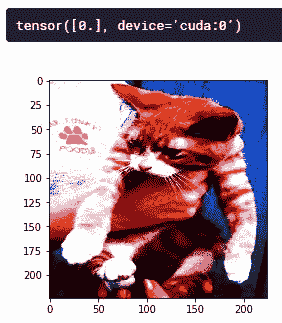

5.  定义模型。下载预训练的 VGG16 重量，然后冻结`features`模块，并使用`avgpool`和`classifier`模块进行训练:

*   首先，我们从`models`类下载预训练的 VGG16 模型:

```py
def get_model():
    model = models.vgg16(pretrained=True)
```

*   指定我们要冻结先前下载的模型中的所有参数:

```py
    for param in model.parameters():
        param.requires_grad = False
```

在前面的代码中，我们通过指定`param.requires_grad = False`来冻结反向传播期间的参数更新。

*   替换`avgpool`模块以返回大小为 1 x 1 而不是 7 x 7 的特征图，换句话说，输出现在将是`batch_size x 512 x 1 x 1`:

```py
    model.avgpool = nn.AdaptiveAvgPool2d(output_size=(1,1))
```

We have seen `nn.MaxPool2d`, where we are picking the maximum value from every section of a feature map. There is a counterpart to this layer called `nn.AvgPool2d`, which returns the average of a section instead of the maximum. In both these layers, we fix the kernel size. The layer above, `nn.AdaptiveAvgPool2d`, is yet another pooling layer with a twist. We specify the output feature map size instead. The layer automatically computes the kernel size so that the specified feature map size is returned. For example, if the input feature map size dimensions were `batch_size x 512 x k x k`, then the pooling kernel size is going to be `k x k`. The major advantage with this layer is that whatever the input size, the output from this layer is always fixed and, hence, the neural network can accept images of any height and width.

*   定义模型的`classifier`模块，其中我们首先展平`avgpool`模块的输出，将 512 个单元连接到 128 个单元，并在连接到输出层之前执行激活:

```py
    model.classifier = nn.Sequential(nn.Flatten(),
                                    nn.Linear(512, 128),
                                    nn.ReLU(),
                                    nn.Dropout(0.2),
                                    nn.Linear(128, 1),
                                    nn.Sigmoid())
```

*   定义损失函数(`loss_fn`)，`optimizer`，并随定义的模型一起返回:

```py
    loss_fn = nn.BCELoss()
    optimizer = torch.optim.Adam(model.parameters(),lr= 1e-3)
    return model.to(device), loss_fn, optimizer
```

注意，在前面的代码中，我们首先冻结了预训练模型的所有参数，然后覆盖了`avgpool`和`classifier`模块。现在，剩下的代码看起来将和我们在上一章看到的相似。

该模型的摘要如下:

```py
!pip install torch_summary
from torchsummary import summary
model, criterion, optimizer = get_model()
summary(model, torch.zeros(1,3,224,224))
```

上述代码会产生以下输出:

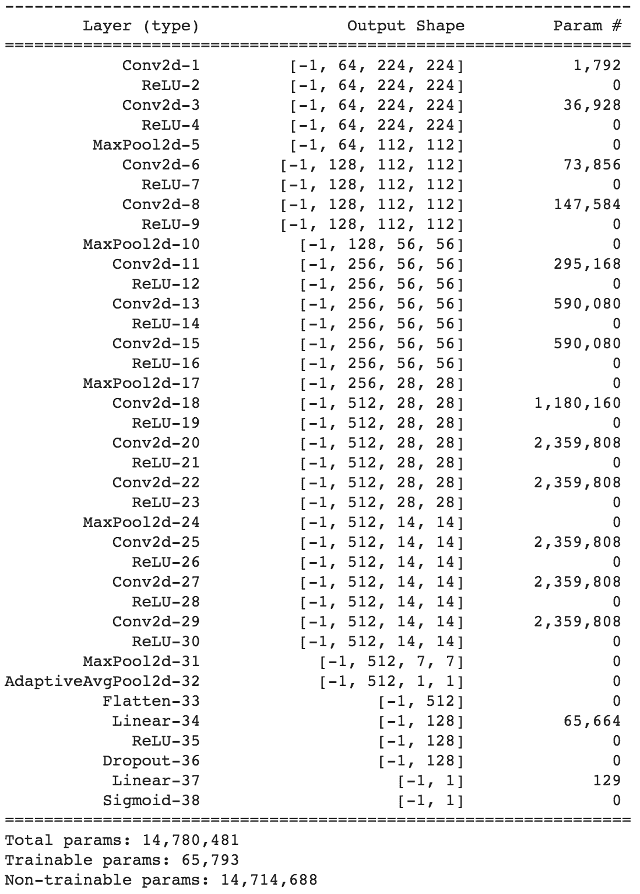

请注意，可训练参数的数量仅为 1470 万个中的 65793 个，因为我们已经冻结了`features`模块，并覆盖了`avgpool`和`classifier`模块。现在，只有`classifier`模块将学习重量。

6.  定义一个函数来批量训练、计算精度并获取数据，就像我们在`Chapter 4`、*介绍卷积神经网络*中所做的那样:

*   对一批数据进行训练:

```py
def train_batch(x, y, model, opt, loss_fn):
    model.train()
    prediction = model(x)
    batch_loss = loss_fn(prediction, y)
    batch_loss.backward()
    optimizer.step()
    optimizer.zero_grad()
    return batch_loss.item()
```

*   定义一个函数来计算一批数据的准确性:

```py
@torch.no_grad()
def accuracy(x, y, model):
    model.eval()
    prediction = model(x)
    is_correct = (prediction > 0.5) == y
    return is_correct.cpu().numpy().tolist()
```

*   定义一个函数来获取数据加载器:

```py
def get_data():
    train = CatsDogs(train_data_dir)
    trn_dl = DataLoader(train, batch_size=32, shuffle=True, \
                            drop_last = True)
    val = CatsDogs(test_data_dir)
    val_dl = DataLoader(val, batch_size=32, shuffle=True, \
                            drop_last = True)
    return trn_dl, val_dl
```

*   初始化`get_data`和`get_model`功能:

```py
trn_dl, val_dl = get_data()
model, loss_fn, optimizer = get_model()
```

7.  在不断增加的时期内训练模型，就像我们在[第 4 章](c184fff6-28cc-4e13-830b-3b2a21736f75.xhtml)、*介绍卷积神经网络*中所做的那样:

```py
train_losses, train_accuracies = [], []
val_accuracies = []
for epoch in range(5):
    print(f" epoch {epoch + 1}/5")
    train_epoch_losses, train_epoch_accuracies = [], []
    val_epoch_accuracies = []

    for ix, batch in enumerate(iter(trn_dl)):
        x, y = batch
        batch_loss = train_batch(x, y, model, optimizer, \
                                        loss_fn)
        train_epoch_losses.append(batch_loss) 
    train_epoch_loss = np.array(train_epoch_losses).mean()

    for ix, batch in enumerate(iter(trn_dl)):
        x, y = batch
        is_correct = accuracy(x, y, model)
        train_epoch_accuracies.extend(is_correct)
    train_epoch_accuracy = np.mean(train_epoch_accuracies)

    for ix, batch in enumerate(iter(val_dl)):
        x, y = batch
        val_is_correct = accuracy(x, y, model)
        val_epoch_accuracies.extend(val_is_correct)
    val_epoch_accuracy = np.mean(val_epoch_accuracies)

    train_losses.append(train_epoch_loss)
    train_accuracies.append(train_epoch_accuracy)
    val_accuracies.append(val_epoch_accuracy)
```

8.  绘制递增时期的训练和测试精度值:

```py
epochs = np.arange(5)+1
import matplotlib.ticker as mtick
import matplotlib.pyplot as plt
import matplotlib.ticker as mticker
%matplotlib inline
plt.plot(epochs, train_accuracies, 'bo', 
         label='Training accuracy')
plt.plot(epochs, val_accuracies, 'r', 
         label='Validation accuracy')
plt.gca().xaxis.set_major_locator(mticker.MultipleLocator(1))
plt.title('Training and validation accuracy \
with VGG16 \nand 1K training data points')
plt.xlabel('Epochs')
plt.ylabel('Accuracy')
plt.ylim(0.95,1)
plt.gca().set_yticklabels(['{:.0f}%'.format(x*100) \
                           for x in plt.gca().get_yticks()]) 
plt.legend()
plt.grid('off')
plt.show()
```

这会产生以下输出:

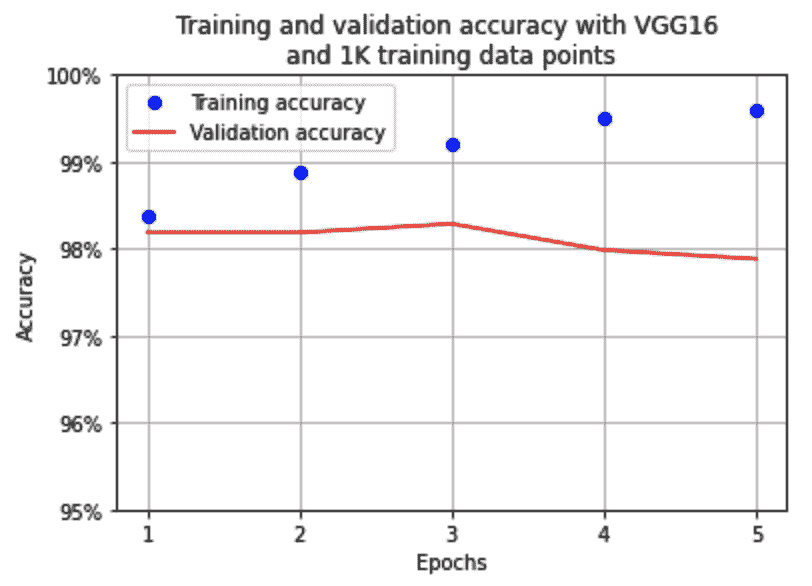

请注意，我们能够在第一个时期内获得 98%的准确度，即使是在 1000 幅图像的小数据集上(每类 500 幅图像)。

除了 VGG16，还有 VGG11 和 VGG19 预训练架构，其工作方式与 VGG16 类似，但层数不同。VGG19 比 VGG16 有更多的参数，因为它有更多的层数

当我们使用 VGG11 和 VGG19 代替 VGG16 预训练模型时，训练和验证精度如下:


注意，虽然基于 VGG19 的模型比基于 VGG16 的模型具有稍好的准确性，在验证数据上具有 98%的准确性，但是基于 VGG11 的模型具有稍低的准确性，为 97%。

从 VGG16 到 VGG19，我们增加了层数，一般来说，神经网络越深，精度越好。

然而，如果仅仅增加层数是个窍门，那么我们可以继续向模型添加更多的层(同时注意避免过度拟合),以在 ImageNet 上获得更准确的结果，然后针对感兴趣的数据集对其进行微调。不幸的是，事实证明并非如此。

这并不容易，原因有很多。随着我们深入了解架构，以下任何一种情况都有可能发生:

*   我们必须学习更多的特征。
*   消失梯度出现。
*   在更深的层有太多的信息修改。

ResNet 的出现是为了解决识别何时不学习的特定场景，我们将在下一节中了解这一点。

# 了解 ResNet 架构

在建立太深的网络的同时，有两个问题。在前向传播中，网络的最后几层几乎没有关于原始图像是什么的信息。在反向传播中，由于渐变消失(换句话说，它们几乎为零)，靠近输入的前几个层几乎不会得到任何渐变更新。为了解决这两个问题，残差网络(ResNet)使用类似高速公路的连接，将原始信息从前面的几层传输到后面的几层。理论上，由于这个高速公路网络，即使是最后一层也将具有原始图像的全部信息。并且由于跳跃层，反向梯度将几乎不加修改地自由流向初始层。

残差网络中的术语**残差**是模型期望从上一层学习到的需要传递到下一层的附加信息。

典型的残差块如下所示:

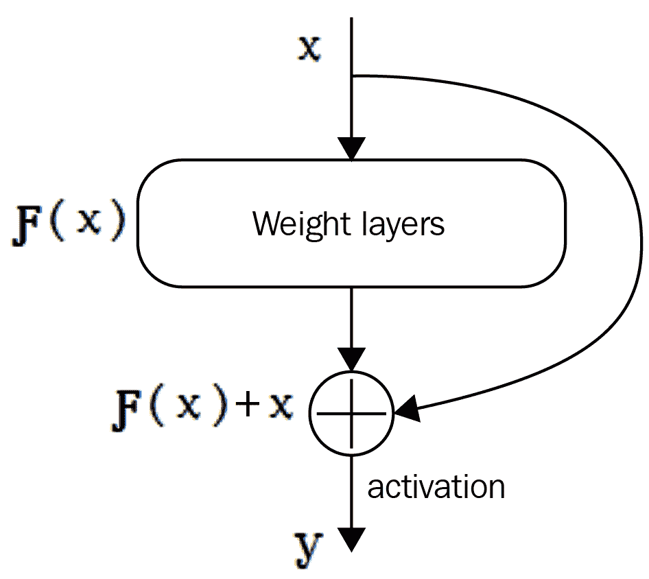

如您所见，到目前为止，我们一直对提取 F(x)值感兴趣，其中 x 是来自前一层的值，在残差网络的情况下，我们不仅提取通过权重层后的值，即 F(x)，还将 F(x)与原始值 x 相加。

到目前为止，我们一直在使用执行线性或卷积变换`F(x)`以及一些非线性激活的标准层。这两种操作在某种意义上都破坏了输入信息。我们第一次看到一个层，它不仅转换输入，而且通过将输入直接添加到转换中来保存输入。这样，在某些情况下，该层在记住输入是什么方面负担很小，并且可以专注于学习任务的正确转换。

让我们通过代码构建一个残差块来更详细地了解残差层:

The code for this section is available as `Implementing_ResNet18_for_image_classification.ipynb` in the `Chapter05` folder of this book's GitHub repository - [https://tinyurl.com/mcvp-packt](https://tinyurl.com/mcvp-packt)

1.  用`__init__`方法中的卷积运算(上图中的权重层)定义一个类:

```py
class ResLayer(nn.Module):
     def __init__(self,ni,no,kernel_size,stride=1):
        super(ResLayer, self).__init__()
        padding = kernel_size - 2
        self.conv = nn.Sequential(
                        nn.Conv2d(ni, no, kernel_size, stride, 
                                  padding=padding),
                        nn.ReLU()
                    )
```

```py

注意，在前面的代码中，我们将`padding`定义为通过卷积时输出的维数，如果我们将两者相加，输入的维数应该保持不变。

2.  定义`forward`方法:

```
     def forward(self, x):
         x = self.conv(x) + x
         return x
```py

在前面的代码中，我们得到的输出是通过卷积运算得到的输入和原始输入之和。

现在我们已经了解了残差块的工作原理，让我们来了解一下残差块是如何在预训练的基于残差块的网络 ResNet18 中连接的:


如您所见，该架构有 18 层，因此被称为 ResNet18 架构。此外，请注意跳过连接是如何通过网络进行的。它不是在每个卷积层进行，而是在每两层之后进行。

现在我们已经了解了 ResNet 架构的组成，让我们基于 ResNet18 架构构建一个模型来对狗和猫进行分类，就像我们在上一节中使用 VGG16 所做的那样。

为了构建一个分类器，直到 VGG16 部分的*步骤 3* 的代码保持不变，因为它处理导入包、获取数据和检查它们。因此，我们将从了解预训练 ResNet18 模型的组成开始:

The code for this section is available as `Resnet_block_architecture.ipynb` in the `Chapter05` folder of the GitHub repository. Given that a majority of the code is similar to the code in the VGG section, we have only provided the additional code for brevity. For the full code, you are encouraged to check the notebook in GitHub.

1.  加载预训练的 ResNet18 模型，并检查加载模型中的模块:

```
model = models.resnet18(pretrained=True).to(device)
model
```py

ResNet18 模型的结构包含以下组件:

*   盘旋

*   批量标准化

*   热卢

*   最大池化

*   四层 ResNet 块

*   平均池(avgpool)

*   全连接层(fc)

正如我们在 VGG16 中所做的，我们将冻结所有不同的模块，但在下一步中更新`avgpool`和`fc`模块中的参数。

2.  定义模型架构、损失函数和优化器:

```
def get_model():
    model = models.resnet18(pretrained=True)
    for param in model.parameters():
        param.requires_grad = False
    model.avgpool = nn.AdaptiveAvgPool2d(output_size=(1,1))
    model.fc = nn.Sequential(nn.Flatten(),
    nn.Linear(512, 128),
    nn.ReLU(),
    nn.Dropout(0.2),
    nn.Linear(128, 1),
    nn.Sigmoid())
    loss_fn = nn.BCELoss()
    optimizer = torch.optim.Adam(model.parameters(),lr= 1e-3)
    return model.to(device), loss_fn, optimizer
```py

在前面的模型中，`fc`模块的输入形状是 512，因为`avgpool`的输出具有批处理大小 x 512 x 1 x 1 的形状。

现在我们已经定义了模型，让我们根据 VGG 部分执行*步骤 5* 和 *6* 。在训练模型(其中，对于以下每个图表，模型是 ResNet18、ResNet34、ResNet50、ResNet101 和 ResNet152)之后，训练和验证精度在增加的时期内的变化如下:

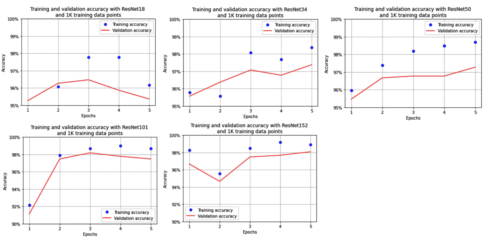

我们看到，当只对 1，000 幅图像进行训练时，模型的准确性在 97%和 98%之间变化，其中准确性随着 ResNet 中层数的增加而增加。

除了 VGG 和 ResNet，其他一些著名的预训练模型是 Inception，MobileNet，DenseNet 和 SqueezeNet。

现在，我们已经了解了如何利用预训练模型来预测二进制类，在接下来的部分中，我们将了解如何利用预训练模型来解决涉及以下内容的真实用例:

*   **多元回归**:给定图像作为输入的多个值的预测——面部关键点检测

*   **多任务学习**:预测单次拍摄中的多个项目——年龄估计和性别分类

实现面部关键点检测

到目前为止，我们已经了解了二元(猫对狗)或多标签(fashionMNIST)的预测类。现在让我们来学习一个回归问题，在这个过程中，我们预测的不是一个而是几个连续输出。想象一个场景，要求你预测一张人脸图像上的关键点，例如，眼睛、鼻子和下巴的位置。在这种情况下，我们需要采用一种新的策略来建立一个模型来检测关键点。

在我们深入探讨之前，让我们通过下面的图片来了解我们想要达到的目的:

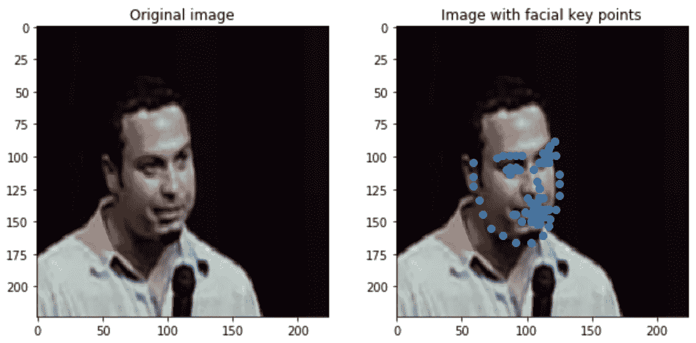

正如您在前面的图像中所看到的，面部关键点表示包含面部的图像上各种关键点的标记。

要解决这个问题，我们必须先解决几个问题:

*   图像可以是不同的形状:

*   这保证了在调整图像时调整关键点位置，以使它们都达到标准图像尺寸。

*   面部关键点类似于散点图上的点，但这次是基于某种模式分散的:

*   这意味着，如果将图像的大小调整为 224 x 224 x 3 的形状，这些值可以是 0 到 224 之间的任何值。

*   根据图像的大小归一化因变量(面部关键点的位置):

*   如果我们考虑它们相对于图像尺寸的位置，关键点值总是在 0 和 1 之间。

*   假设因变量的值总是在 0 和 1 之间，我们可以在最后使用一个 sigmoid 层来获取 0 和 1 之间的值。

让我们制定解决这个用例的流程:

1.  导入相关的包。

2.  导入数据。

3.  定义准备数据集的类:

*   确保对输入图像进行适当的预处理，以执行迁移学习。

*   确保关键点的位置以这样的方式被处理，即我们获取它们相对于被处理图像的相对位置。

4.  定义模型、损失函数和优化器:

*   损失函数是平均绝对误差，因为输出是 0 和 1 之间的连续值。

5.  在不断增加的时期内训练模型。

现在让我们实现前面的步骤:

The code for this section is available as `Facial_keypoints_detection.ipynb` in the `Chapter05` folder of this book's GitHub repository - [https://tinyurl.com/mcvp-packt](https://tinyurl.com/mcvp-packt) Be sure to copy the URL from the notebook in GitHub to avoid any issue while reproducing the results

1.  导入相关包和数据集:

```
import torchvision
import torch.nn as nn
import torch
import torch.nn.functional as F
from torchvision import transforms, models, datasets
from torchsummary import summary
import numpy as np, pandas as pd, os, glob, cv2
from torch.utils.data import TensorDataset,DataLoader,Dataset
from copy import deepcopy
from mpl_toolkits.mplot3d import Axes3D
import matplotlib.pyplot as plt
%matplotlib inline
from sklearn import cluster
device = 'cuda' if torch.cuda.is_available() else 'cpu'
```py

2.  下载并导入相关数据。您可以下载包含图像及其相应面部关键点的相关数据:

```
!git clone https://github.com/udacity/P1_Facial_Keypoints.git
!cd P1_Facial_Keypoints
root_dir = 'P1_Facial_Keypoints/data/training/'
all_img_paths = glob.glob(os.path.join(root_dir, '*.jpg'))
data = pd.read_csv(\
    'P1_Facial_Keypoints/data/training_frames_keypoints.csv')
```py

导入数据集的示例如下:

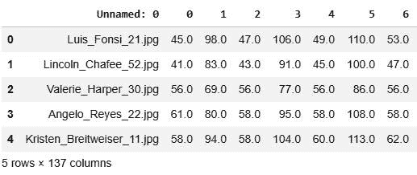

在前面的输出中，第 1 列表示图像的名称，偶数列表示对应于面部 68 个关键点中每一个的*x*-轴值，其余奇数列(除了第一列)表示对应于 68 个关键点中每一个的*y*-轴值。

3.  定义为数据加载器提供输入和输出数据点的`FacesData`类:

```
class FacesData(Dataset):
```py

*   现在让我们定义`__init__`方法，它将文件的数据帧(`df`)作为输入:

```
    def __init__(self, df):
        super(FacesData).__init__()
        self.df = df
```py

*   定义图像预处理的均值和标准差，以便预训练的 VGG16 模型可以使用这些图像:

```
        self.normalize = transforms.Normalize(
                                mean=[0.485, 0.456, 0.406], 
                                std=[0.229, 0.224, 0.225])
```py

*   现在，定义`__len__` 方法:

```
    def __len__(self): return len(self.df)
```py

接下来，我们定义`__getitem__`方法，在这里，我们获取对应于给定索引的图像，对其进行缩放，获取对应于给定索引的关键点值，对关键点进行归一化，以便我们将关键点的位置作为图像大小的比例，并对图像进行预处理。

*   定义`__getitem__`方法，获取给定索引对应的图像路径(`ix`):

```
    def __getitem__(self, ix):
        img_path = 'P1_Facial_Keypoints/data/training/' + \ 
                                        self.df.iloc[ix,0]
```py

*   缩放图像:

```
        img = cv2.imread(img_path)/255.
```py

*   将预期输出值(关键点)归一化为原始图像大小的一部分:

```
        kp = deepcopy(self.df.iloc[ix,1:].tolist())
        kp_x = (np.array(kp[0::2])/img.shape[1]).tolist()
        kp_y = (np.array(kp[1::2])/img.shape[0]).tolist()
```py

在前面的代码中，我们确保关键点按原始图像大小的比例提供。这样做是为了当我们调整原始图像的大小时，关键点的位置不会改变，因为关键点是作为原始图像的一部分提供的。此外，通过将关键点作为原始图像的一部分，我们可以得到介于 0 和 1 之间的输出值。

*   对图像进行预处理后，返回关键点(`kp2`)和图像(`img`):

```
        kp2 = kp_x + kp_y
        kp2 = torch.tensor(kp2) 
        img = self.preprocess_input(img)
        return img, kp2
```py

*   定义预处理图像的功能(`preprocess_input`):

```
    def preprocess_input(self, img):
        img = cv2.resize(img, (224,224))
        img = torch.tensor(img).permute(2,0,1)
        img = self.normalize(img).float()
        return img.to(device)
```py

*   定义一个函数来加载图像，当我们想要可视化一个测试图像和测试图像的预测关键点时，这个函数会很有用:

```
    def load_img(self, ix):
        img_path = 'P1_Facial_Keypoints/data/training/' + \
                                        self.df.iloc[ix,0]
        img = cv2.imread(img_path)
        img = cv2.cvtColor(img, cv2.COLOR_BGR2RGB)/255.
        img = cv2.resize(img, (224,224))
        return img
```py

4.  现在，让我们创建一个训练和测试数据分割，并建立训练和测试数据集和数据加载器:

```
from sklearn.model_selection import train_test_split

train, test = train_test_split(data, test_size=0.2, \
                                random_state=101)
train_dataset = FacesData(train.reset_index(drop=True))
test_dataset = FacesData(test.reset_index(drop=True))

train_loader = DataLoader(train_dataset, batch_size=32)
test_loader = DataLoader(test_dataset, batch_size=32)
```py

在前面的代码中，我们在输入数据框中按人名分割了训练和测试数据集，并提取了它们对应的对象。

5.  现在让我们定义一个模型，我们将利用它来识别图像中的关键点:

*   加载预训练的 VGG16 模型:

```
def get_model():
    model = models.vgg16(pretrained=True)
```py

*   确保预训练模型的参数首先被冻结:

```
    for param in model.parameters():
        param.requires_grad = False
```py

覆盖并解冻模型最后两层的参数:

```
    model.avgpool = nn.Sequential( nn.Conv2d(512,512,3),
                                      nn.MaxPool2d(2),
                                      nn.Flatten())
    model.classifier = nn.Sequential(
                                      nn.Linear(2048, 512),
                                      nn.ReLU(),
                                      nn.Dropout(0.5),
                                      nn.Linear(512, 136),
                                      nn.Sigmoid()
                                    )
```py

请注意，`classifier`模块中模型的最后一层是一个 sigmoid 函数，它返回一个介于 0 和 1 之间的值，并且预期输出将始终介于 0 和 1 之间，因为关键点位置是原始图像尺寸的一部分:

*   定义损失函数和优化器，并将它们与模型一起返回:

```
    criterion = nn.L1Loss()
    optimizer = torch.optim.Adam(model.parameters(), lr=1e-4)
    return model.to(device), criterion, optimizer
```py

注意，损失函数是`L1Loss`，换句话说，我们正在对面部关键点的位置(将被预测为图像的宽度和高度的百分比)的预测执行平均绝对误差减少。

6.  获取模型、损失函数和相应的优化器:

```
model, criterion, optimizer = get_model()
```py

7.  定义函数来训练一批数据点，并在测试数据集上进行验证:

*   正如我们前面所做的那样，训练一个批处理需要获取通过模型传递输入的输出，计算损失值，并执行反向传播以更新权重:

```
def train_batch(img, kps, model, optimizer, criterion):
    model.train()
    optimizer.zero_grad()
    _kps = model(img.to(device))
    loss = criterion(_kps, kps.to(device))
    loss.backward()
    optimizer.step()
    return loss
```py

*   构建一个返回测试数据损失和预测关键点的函数:

```
def validate_batch(img, kps, model, criterion):
    model.eval()
    with torch.no_grad(): 
        _kps = model(img.to(device))
    loss = criterion(_kps, kps.to(device))
    return _kps, loss
```py

8.  在训练数据加载器的基础上训练模型，并在测试数据上测试它，就像我们在前面几节中所做的那样:

```
train_loss, test_loss = [], []
n_epochs = 50

for epoch in range(n_epochs):
    print(f" epoch {epoch+ 1} : 50")
    epoch_train_loss, epoch_test_loss = 0, 0
    for ix, (img,kps) in enumerate(train_loader):
        loss = train_batch(img, kps, model, optimizer, \
                                criterion)
        epoch_train_loss += loss.item() 
    epoch_train_loss /= (ix+1)

    for ix,(img,kps) in enumerate(test_loader):
        ps, loss = validate_batch(img, kps, model, criterion)
        epoch_test_loss += loss.item() 
    epoch_test_loss /= (ix+1)

    train_loss.append(epoch_train_loss)
    test_loss.append(epoch_test_loss)
```py

9.绘制递增时期的训练和测试损失图:

```
epochs = np.arange(50)+1
import matplotlib.ticker as mtick
import matplotlib.pyplot as plt
import matplotlib.ticker as mticker
%matplotlib inline
plt.plot(epochs, train_loss, 'bo', label='Training loss')
plt.plot(epochs, test_loss, 'r', label='Test loss')
plt.title('Training and Test loss over increasing epochs')
plt.xlabel('Epochs')
plt.ylabel('Loss')
plt.legend()
plt.grid('off')
plt.show()
```py

上述代码会产生以下输出:


10.  在随机测试图像的索引上测试我们的模型，比如说 0。注意，在下面的代码中，我们利用了之前创建的`FacesData`类中的`load_img`方法:

```
ix = 0
plt.figure(figsize=(10,10))
plt.subplot(221)
plt.title('Original image')
im = test_dataset.load_img(ix)
plt.imshow(im)
plt.grid(False)
plt.subplot(222)
plt.title('Image with facial keypoints')
x, _ = test_dataset[ix]
plt.imshow(im)
kp = model(x[None]).flatten().detach().cpu()
plt.scatter(kp[:68]*224, kp[68:]*224, c='r')
plt.grid(False)
plt.show()
```py

上述代码会产生以下输出:


从前面的图像中，我们可以看到，在给定图像作为输入的情况下，该模型能够相当准确地识别面部关键点。

在这一部分，我们已经从头开始建立了面部关键点检测器模型。然而，存在为 2D 和 3D 点检测构建的预训练模型。在下一节中，我们将了解如何利用人脸对齐库来获取人脸的 2D 和 3D 关键点。

2D 和三维人脸关键点检测

在本节中，我们将利用一个预训练的模型，它可以在几行代码中检测出人脸中存在的 2D 和 3D 关键点。

以下代码在本书的 GitHub 知识库的`Chapter05`文件夹中以`2D_and_3D facial_keypoints.ipynb`的形式提供-【https://tinyurl.com/mcvp-packt】请务必从 GitHub 中的笔记本上复制 URL，以避免在复制结果时出现任何问题

为了解决这个问题，我们将利用`face-alignment`库:

1.  安装所需的软件包:

```
!pip install -qU face-alignment
import face_alignment, cv2
```py

2.  导入图像:

```
!wget https://www.dropbox.com/s/2s7xjto7rb6q7dc/Hema.JPG
```py

3.  定义面对齐方法，其中我们指定是要获取 2D 还是 3D 中的关键点界标:

```
fa = face_alignment.FaceAlignment(\
                    face_alignment.LandmarksType._2D, \
                    flip_input=False, device='cpu')
```py

4.  读取输入图像并将其提供给`get_landmarks`方法:

```
input = cv2.imread('Hema.JPG')
preds = fa.get_landmarks(input)[0]
print(preds.shape)
# (68,2)
```py

在前面几行代码中，我们利用`fa`类中的`get_landmarks`方法来获取与面部关键点对应的 68 个 *x* 和 *y* 坐标。

5.  用检测到的关键点绘制图像:

```
import matplotlib.pyplot as plt
%matplotlib inline
fig,ax = plt.subplots(figsize=(5,5))
plt.imshow(cv2.cvtColor(cv2.imread('Hema.JPG'), \
                        cv2.COLOR_BGR2RGB))
ax.scatter(preds[:,0], preds[:,1], marker='+', c='r')
plt.show()
```py

上述代码会产生以下输出:


注意 60 个可能的面部关键点周围的+符号散点图。

以类似的方式，如下获得面部关键点的 3D 投影:

```
fa = face_alignment.FaceAlignment(
                        face_alignment.LandmarksType._3D, 
                        flip_input=False, device='cpu')
input = cv2.imread('Hema.JPG')
preds = fa.get_landmarks(input)[0]
import pandas as pd
df = pd.DataFrame(preds)
df.columns = ['x','y','z']
import plotly.express as px
fig = px.scatter_3d(df, x = 'x', y = 'y', z = 'z')
fig.show()
```py

请注意，与 2D 关键点场景中使用的代码相比，唯一的变化是我们将 2D 指定为 3D

上述代码会产生以下输出:


通过利用`face_alignment`库的代码，我们看到我们能够利用预先训练的面部关键点检测模型在新图像上进行高精度预测。

到目前为止，在不同的使用案例中，我们学到了以下内容:

*   **猫对狗**:预测二元分类

*   时尚达人:在 10 个可能的类别中预测一个标签

*   **面部关键点**:预测给定图像的 0 到 1 之间的多个值

在下一节中，我们将了解如何使用单个网络在单个镜头中预测二进制类和回归值。

多任务学习-实现年龄估计和性别分类

多任务学习是一个研究分支，其中单个/几个输入用于预测几个不同但最终相关的输出。例如，在自动驾驶汽车中，模型需要识别障碍物，规划路线，提供适量的油门/刹车和转向，等等。它需要通过考虑同一组输入(来自几个传感器)在瞬间完成所有这些工作

从我们迄今为止已经解决的各种用例来看，我们可以训练神经网络，估计给定图像的人的年龄，或者预测给定图像的人的性别，每次单独完成一项任务。然而，我们还没有看到这样一个场景，在这个场景中，我们可以从一张照片中预测年龄和性别。在单个镜头中预测两个不同的属性是很重要的，因为相同的图像用于两个预测(这将在我们在第 7 章、*目标检测基础*中执行目标检测时得到进一步的理解)。

在本节中，我们将了解如何在一次向前传递中预测两种属性，连续预测和分类预测。

我们采取的策略如下:

1.  导入相关的包。

2.  获取包含人物图像、性别和年龄信息的数据集。

3.  通过执行适当的预处理来创建训练和测试数据集。

4.  建立一个适用于以下情况的模型:

*   除了最后一部分，模型的所有层都与我们到目前为止构建的模型相似。

*   在最后一部分，创建从前一层分支出来的两个单独的层，其中一层对应于年龄估计，另一层对应于性别分类。

*   确保对输出的每个分支使用不同的损失函数，因为年龄是连续值(需要 mse 或 mae 损失计算),而性别是分类值(需要交叉熵损失计算)。

*   对年龄估计损失和性别分类损失进行加权求和。

*   通过执行优化权重值的反向传播来最小化总体损失。

5.  在新图像上训练模型和预测。

有了前面的策略，让我们编写用例:

The code for this section is available as `Age_and_gender_prediction.ipynb` in the `Chapter05` folder of this book's GitHub repository - [https://tinyurl.com/mcvp-packt](https://tinyurl.com/mcvp-packt) The code contains URLs to download data from. We strongly recommend you to execute the notebook on GitHub.

1.  导入相关包:

```
import torch
import numpy as np, cv2, pandas as pd, glob, time
import matplotlib.pyplot as plt
%matplotlib inline
import torch.nn as nn
from torch import optim
import torch.nn.functional as F
from torch.utils.data import Dataset, DataLoader
import torchvision
from torchvision import transforms, models, datasets
device = 'cuda' if torch.cuda.is_available() else 'cpu'
```py

2.  获取数据集:

```
from pydrive.auth import GoogleAuth
from pydrive.drive import GoogleDrive
from google.colab import auth
from oauth2client.client import GoogleCredentials

auth.authenticate_user()
gauth = GoogleAuth()
gauth.credentials=GoogleCredentials.get_application_default()
drive = GoogleDrive(gauth)

def getFile_from_drive( file_id, name ):
    downloaded = drive.CreateFile({'id': file_id})
    downloaded.GetContentFile(name)

getFile_from_drive('1Z1RqRo0_JiavaZw2yzZG6WETdZQ8qX86', 
                   'fairface-img-margin025-trainval.zip')
getFile_from_drive('1k5vvyREmHDW5TSM9QgB04Bvc8C8_7dl-', 
                   'fairface-label-train.csv')
getFile_from_drive('1_rtz1M1zhvS0d5vVoXUamnohB6cJ02iJ', 
                   'fairface-label-val.csv')

!unzip -qq fairface-img-margin025-trainval.zip
```py

3.  我们下载的数据集可以通过以下方式加载和构建:

```
trn_df = pd.read_csv('fairface-label-train.csv')
val_df = pd.read_csv('fairface-label-val.csv')
trn_df.head()
```py

上述代码会产生以下输出:

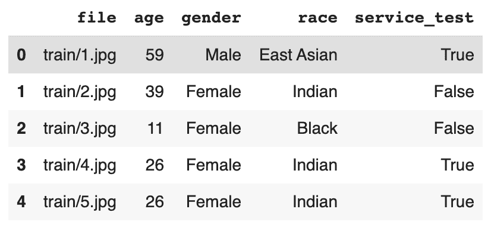

4.  构建`GenderAgeClass`类，将文件名作为输入，并返回相应的图像、性别和年龄。我们缩放年龄，因为它是一个连续的数字，正如我们在[第 3 章](067f7e89-9e76-4179-879d-c125f8968d25.xhtml)、*使用 PyTorch* 构建深度神经网络中看到的，最好缩放数据以避免消失梯度，然后在后处理期间重新缩放:

*   在`__init__`方法中提供图像的文件路径(`fpaths`):

```
IMAGE_SIZE = 224
class GenderAgeClass(Dataset):
    def __init__(self, df, tfms=None):
        self.df = df
        self.normalize = transforms.Normalize(
                                mean=[0.485, 0.456, 0.406], 
                                std=[0.229, 0.224, 0.225])
```py

*   将`__len__`方法定义为返回输入中图像数量的方法:

```
    def __len__(self): return len(self.df)
```py

*   定义在给定位置获取图像信息的`__getitem__`方法，`ix`:

```
    def __getitem__(self, ix):
        f = self.df.iloc[ix].squeeze()
        file = f.file
        gen = f.gender == 'Female'
        age = f.age
        im = cv2.imread(file)
        im = cv2.cvtColor(im, cv2.COLOR_BGR2RGB)
        return im, age, gen
```py

*   编写一个预处理图像的函数，包括调整图像大小、排列通道以及对缩放后的图像执行标准化:

```
    def preprocess_image(self, im):
        im = cv2.resize(im, (IMAGE_SIZE, IMAGE_SIZE))
        im = torch.tensor(im).permute(2,0,1)
        im = self.normalize(im/255.)
        return im[None]
```py

*   创建`collate_fn`方法，该方法获取一批数据，其中数据点经过如下预处理:

*   使用`process_image`方法处理每个图像。

*   将年龄缩放 80(数据集中存在的最大年龄值)，以便所有值都在 0 和 1 之间。

*   将性别转换为浮点值。

*   图像、年龄和性别都被转换成 torch 对象并返回:

```
    def collate_fn(self, batch):
        'preprocess images, ages and genders'
        ims, ages, genders = [], [], []
        for im, age, gender in batch:
            im = self.preprocess_image(im)
            ims.append(im)

            ages.append(float(int(age)/80))
            genders.append(float(gender))

        ages, genders = [torch.tensor(x).to(device).float() \
                            for x in [ages, genders]]
        ims = torch.cat(ims).to(device)

        return ims, ages, genders
```py

5.  我们现在定义训练和验证数据集和数据加载器:

*   创建数据集:

```
trn = GenderAgeClass(trn_df)
val = GenderAgeClass(val_df)
```py

*   指定数据加载器:

```
device = 'cuda' if torch.cuda.is_available() else 'cpu'
train_loader = DataLoader(trn, batch_size=32, shuffle=True, \
                    drop_last=True,collate_fn=trn.collate_fn)
test_loader = DataLoader(val, batch_size=32, 
                         collate_fn=val.collate_fn)
a,b,c, = next(iter(train_loader))
print(a.shape, b.shape, c.shape)
```py

6.  定义模型、损失函数和优化器:

*   首先，在函数中，我们加载预训练的 VGG16 模型:

```
def get_model():
    model = models.vgg16(pretrained = True)
```py

*   接下来，冻结加载的模型(通过指定`param.requires_grad = False`):

```
    for param in model.parameters():
        param.requires_grad = False
```py

*   用我们自己的图层覆盖`avgpool`图层:

```
    model.avgpool = nn.Sequential(
                        nn.Conv2d(512,512, kernel_size=3),
                        nn.MaxPool2d(2),
                        nn.ReLU(),
                        nn.Flatten()
                    )
```py

现在关键的部分来了。我们通过创建两个输出分支来偏离我们迄今为止所学的内容。这按如下方式执行:

*   用下面的`__init__`方法建立一个名为`ageGenderClassifier`的神经网络`class`:

```
    class ageGenderClassifier(nn.Module):
        def __init__(self):
            super(ageGenderClassifier, self).__init__()
```py

*   定义`intermediate`层的计算:

```
            self.intermediate = nn.Sequential(
                                    nn.Linear(2048,512),
                                    nn.ReLU(),
                                    nn.Dropout(0.4),
                                    nn.Linear(512,128),
                                    nn.ReLU(),
                                    nn.Dropout(0.4),
                                    nn.Linear(128,64),
                                    nn.ReLU(),
                                )
```py

*   定义`age_classifier`和`gender_classifier`:

```
            self.age_classifier = nn.Sequential(
                                        nn.Linear(64, 1),
                                        nn.Sigmoid()
                                    )
            self.gender_classifier = nn.Sequential(
                                        nn.Linear(64, 1),
                                        nn.Sigmoid()
                                    )
```py

请注意，在前面的代码中，最后的层有一个 sigmoid 激活，因为年龄输出将是一个 0 到 1 之间的值(因为它被缩放了 80)，而性别有一个 sigmoid，因为输出是 *0* 或 *1* 。

*   将堆叠层的`forward`路径方法定义为先`intermediate`，后`age_classifier`，再`gender_classifier`:

```
        def forward(self, x):
            x = self.intermediate(x)
            age = self.age_classifier(x)
            gender = self.gender_classifier(x)
            return gender, age
```py

*   用我们之前定义的类覆盖`classifier`模块:

```
    model.classifier = ageGenderClassifier()
```py

*   定义性别(二元交叉熵损失)和年龄(L1 损失)预测的损失函数。定义优化器并返回模型、损失函数和优化器，如下所示:

```
    gender_criterion = nn.BCELoss()
    age_criterion = nn.L1Loss()
    loss_functions = gender_criterion, age_criterion
    optimizer = torch.optim.Adam(model.parameters(),lr= 1e-4)
    return model.to(device), loss_functions, optimizer
```py

*   调用`get_model`函数来初始化变量中的值:

```
model, criterion, optimizer = get_model()
```py

7.  定义函数对一批数据进行训练，并对一批数据集进行验证。

`train_batch`方法将图像、性别、年龄、型号、优化器和损失函数的实际值作为输入来计算总损失，如下所示:

*   使用适当的输入参数定义`train_batch`方法:

```
def train_batch(data, model, optimizer, criteria):
```py

*   指定我们正在训练模型，将优化器重置为`zero_grad`，并计算年龄和性别的预测值:

```
    model.train()
    ims, age, gender = data
    optimizer.zero_grad()
    pred_gender, pred_age = model(ims) 
```py

*   在计算对应于年龄估计和性别分类的损失之前，获取年龄和性别的损失函数:

```
    gender_criterion, age_criterion = criteria
    gender_loss = gender_criterion(pred_gender.squeeze(), \
                                    gender)
    age_loss = age_criterion(pred_age.squeeze(), age)
```py

*   通过对`gender_loss`和`age_loss`求和来计算总损失，并通过优化模型的可训练权重来执行反向传播以减少总损失，并返回总损失；

```
    total_loss = gender_loss + age_loss
    total_loss.backward()
    optimizer.step()
    return total_loss
```py

`validate_batch`方法将图像、模型和损失函数以及年龄和性别的实际值作为输入，计算年龄和性别的预测值以及损失值，如下所示:

*   用合适的输入参数定义`vaidate_batch`函数:

```
def validate_batch(data, model, criteria):
```py

*   指定我们要评估模型，因此在通过模型传递图像来预测年龄和性别值之前，不需要进行梯度计算:

```
    model.eval()
    with torch.no_grad():
        pred_gender, pred_age = model(img)
```py

*   计算对应于年龄和性别预测的损失值(`gender_loss`和`age_loss`)。我们压缩预测(其形状为(批处理大小，1)，以便将其重新调整为与原始值相同的形状(其形状为批处理大小):

```
    gender_criterion, age_criterion = criteria
    gender_loss = gender_criterion(pred_gender.squeeze(), \
                                        gender)
    age_loss = age_criterion(pred_age.squeeze(), age)
```py

*   计算总损失、最终预测性别类别(`pred_gender`)，并返回预测性别、年龄和总损失:

```
    total_loss = gender_loss + age_loss
    pred_gender = (pred_gender > 0.5).squeeze()
    gender_acc = (pred_gender == gender).float().sum()
    age_mae = torch.abs(age - pred_age).float().sum()
    return total_loss, gender_acc, age_mae
```py

8.  在五个时期内训练模型:

*   定义占位符以存储训练和测试损失值，并指定时期数:

```
import time
model, criteria, optimizer = get_model()
val_gender_accuracies = []
val_age_maes = []
train_losses = []
val_losses = []

n_epochs = 5
best_test_loss = 1000
start = time.time()
```py

*   循环通过不同的时期，并在每个时期开始时重新初始化训练和测试损失值:

```
for epoch in range(n_epochs):
    epoch_train_loss, epoch_test_loss = 0, 0
    val_age_mae, val_gender_acc, ctr = 0, 0, 0
    _n = len(train_loader)
```py

*   循环训练数据加载器(`train_loader`)并训练模型:

```
    for ix, data in enumerate(train_loader):
        loss = train_batch(data, model, optimizer, criteria)
        epoch_train_loss += loss.item()
```py

*   循环通过测试数据加载器，并计算性别准确度和平均年龄:

```
    for ix, data in enumerate(test_loader):
        loss, gender_acc, age_mae = validate_batch(data, \
                                            model, criteria)
        epoch_test_loss += loss.item()
        val_age_mae += age_mae
        val_gender_acc += gender_acc
        ctr += len(data[0])
```py

*   计算年龄预测和性别分类的总体准确度:

```
    val_age_mae /= ctr
    val_gender_acc /= ctr
    epoch_train_loss /= len(train_loader)
    epoch_test_loss /= len(test_loader)
```py

*   记录每个时期的指标:

```
    elapsed = time.time()-start
    best_test_loss = min(best_test_loss, epoch_test_loss)
    print('{}/{} ({:.2f}s - {:.2f}s remaining)'.format(\
                    epoch+1, n_epochs, time.time()-start, \
                    (n_epochs-epoch)*(elapsed/(epoch+1))))
    info = f'''Epoch: {epoch+1:03d}
                \tTrain Loss: {epoch_train_loss:.3f}
                \tTest:\{epoch_test_loss:.3f}
                \tBest Test Loss: {best_test_loss:.4f}'''
    info += f'\nGender Accuracy: 
                {val_gender_acc*100:.2f}%\tAge MAE: \
                                    {val_age_mae:.2f}\n'
    print(info)
```py

*   存储每个历元中测试数据集的年龄和性别准确度:

```
    val_gender_accuracies.append(val_gender_acc)
    val_age_maes.append(val_age_mae)
```py

9.  绘制年龄估计和性别预测在不同时期的准确度图:

```
epochs = np.arange(1,(n_epochs+1))
fig,ax = plt.subplots(1,2,figsize=(10,5))
ax = ax.flat
ax[0].plot(epochs, val_gender_accuracies, 'bo')
ax[1].plot(epochs, val_age_maes, 'r')
ax[0].set_xlabel('Epochs')  ; ax[1].set_xlabel('Epochs')
ax[0].set_ylabel('Accuracy'); ax[1].set_ylabel('MAE')
ax[0].set_title('Validation Gender Accuracy')
ax[0].set_title('Validation Age Mean-Absolute-Error')
plt.show()
```py

上述代码会产生以下输出:

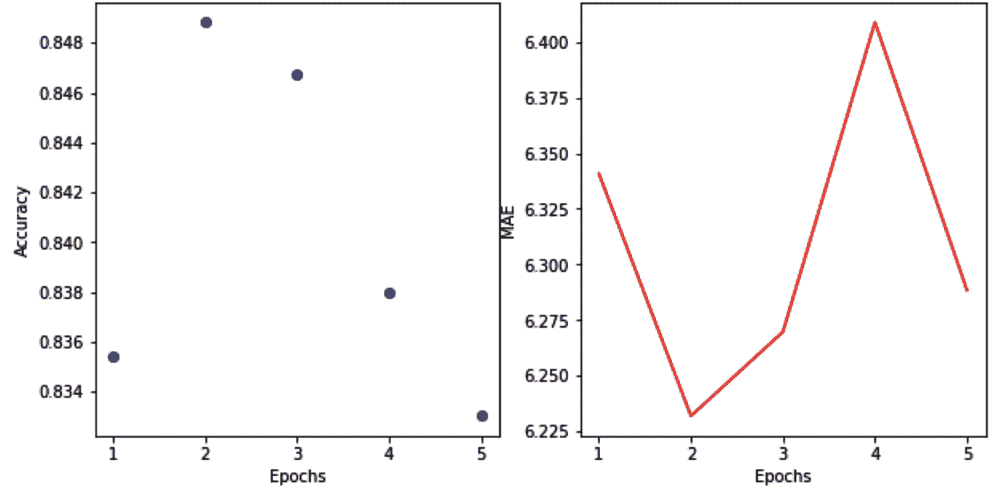

我们在年龄预测方面有 6 年的误差，在性别预测方面大约有 84%的准确率。

10.  在随机测试图像上预测年龄和性别:

*   获取图像:

```
!wget https://www.dropbox.com/s/6kzr8l68e9kpjkf/5_9.JPG
```py

*   加载图像并通过我们之前创建的`trn`对象中的`preprocess_image`方法传递它:

```
im = cv2.imread('/content/5_9.JPG')
im = trn.preprocess_image(im).to(device)
```py

*   将图像传递给训练好的模型:

```
gender, age = model(im)
pred_gender = gender.to('cpu').detach().numpy()
pred_age = age.to('cpu').detach().numpy()
```py

*   绘制图像并打印原始值和预测值:

```
im = cv2.imread('/content/5_9.JPG')
im = cv2.cvtColor(im, cv2.COLOR_BGR2RGB)
plt.imshow(im)
print('predicted gender:',np.where(pred_gender[0][0]<0.5, \
                                   'Male','Female'),
      '; Predicted age', int(pred_age[0][0]*80))
```py

上述代码会产生以下输出:

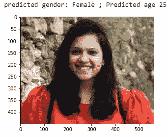

通过以上内容，我们可以看到我们能够一次性预测年龄和性别。然而，我们需要注意的是，这是非常不稳定的，并且年龄值随着图像的不同方向以及光照条件而显著变化。在这种情况下，数据增强就派上了用场。

到目前为止，我们已经了解了迁移学习、预培训架构，以及如何在两种不同的用例中利用它们。您还会注意到，代码稍微长了一点，我们手动导入大量的包，创建空列表来记录指标，并不断读取/显示图像以进行调试。在下一节中，我们将了解作者为避免这种冗长代码而构建的库。

# torch_snippets 库简介

正如您可能已经注意到的，我们在几乎所有的部分都使用相同的函数。一遍又一遍地写同样的函数是浪费我们的时间。为了方便起见，这本书的作者写了一个名为`torch_snippets`的 Python 库，这样我们的代码看起来就简单明了了了。

诸如读取图像、显示图像以及整个训练循环的实用程序是相当重复的。我们希望通过将相同的函数封装在代码中(最好是一个函数调用)来避免反复编写相同的函数。例如，要读取一幅彩色图像，我们不需要每次都先写`cv2.imread(...)`再写`cv2.cvtColor(...)`。相反，我们可以简单地称之为`read(...)`。同样，对于`plt.imshow(...)`，有许多麻烦，包括图像的大小应该是最佳的，通道维度应该是最后的(记住 PyTorch 首先拥有它们)。这些将总是由单个函数`show`来处理。类似于`read`和`show`，我们将在整本书中使用超过 20 个方便的函数和类。从现在开始，我们将使用`torch_snippets`，以便更加专注于实际的深度学习，而不会分心。让我们深入一点，通过用这个库来训练`age-and-gender`来理解突出的函数，这样我们可以学习使用这些函数并获得最大的好处。

这一部分的代码可以在本书的 GitHub 资源库【https://tinyurl.com/mcvp-packt[的`Chapter05`文件夹中找到`age_gender_torch_snipets.ipynb`。为了保持简洁，我们在本节中只提供了额外的代码。关于完整代码，我们鼓励您参考 GitHub 中的笔记本。](https://tinyurl.com/mcvp-packt)

1.  安装并加载库:

```
!pip install torch_snippets
from torch_snippets import *
```py

从一开始，这个库就允许我们加载所有重要的 torch 模块和实用程序，比如 NumPy、pandas、Matplotlib、Glob、Os 等等。

2.  如前一节所述，下载数据并创建数据集。创建一个数据集类`GenderAgeClass`，进行一些更改，这些更改在下面的代码中以粗体显示:

```
class GenderAgeClass(Dataset):
    ...
    def __getitem__(self, ix):
        ...
        age = f.age
        im = read(file, 1)
        return im, age, gen

    def preprocess_image(self, im):
        im = resize(im, IMAGE_SIZE)
        im = torch.tensor(im).permute(2,0,1)
        ...
```py

在前面的代码块中，代码行`im = read(file, 1)`将`cv2.imread`和`cv2.COLOR_BGR2RGB`包装成一个函数调用。“1”代表“读取为彩色图像”，如果没有给出，默认情况下将加载黑白图像。还有一个`resize`函数包装了`cv2.resize`。接下来，我们来看看`show`函数。

3.  指定训练和验证数据集并查看样本图像:

```
trn = GenderAgeClass(trn_df)
val = GenderAgeClass(val_df)
train_loader = DataLoader(trn, batch_size=32, shuffle=True, \
                  drop_last=True, collate_fn=trn.collate_fn)
test_loader = DataLoader(val, batch_size=32, \
                         collate_fn=val.collate_fn)

im, gen, age = trn[0]
show(im, title=f'Gender: {gen}\nAge: {age}', sz=5)
```py

因为我们在整本书中处理图像，所以将`import matplotlib.pyplot as plt`和`plt.imshow`包装成一个函数是有意义的。打电话给`show(<2D/3D-Tensor>)`会做到这一点。与 Matplotlib 不同，它可以绘制 GPU 上存在的 torch 数组，而不管图像是否包含作为第一维或最后一维的通道。关键字`title`将为图像绘制一个标题，关键字`sz`(size 的简称)将根据传递的整数值绘制一个更大/更小的图像(如果没有传递，`sz`将根据图像分辨率选择一个合理的默认值)。在目标检测章节中，我们也将使用相同的函数来显示边界框。查看`help(show)`了解更多参数。让我们在这里创建一些数据集，并检查第一批图像及其目标。

4.  创建数据加载器并检查张量。检查张量的数据类型、最小值、平均值、最大值和形状是如此常见的活动，以至于它被包装成一个函数。它可以接受任意数量的张量输入:

```
train_loader = DataLoader(trn, batch_size=32, shuffle=True, \
                drop_last=True, collate_fn=trn.collate_fn)
test_loader = DataLoader(val, batch_size=32, \
                         collate_fn=val.collate_fn)

ims, gens, ages = next(iter(train_loader))
inspect(ims, gens, ages)
```py

`inspect`输出将如下所示:

```
============================================================
Tensor Shape: torch.Size([32, 3, 224, 224]) Min: -2.118 Max: 2.640 Mean: 0.133 dtype: torch.float32
============================================================
Tensor Shape: torch.Size([32]) Min: 0.000 Max: 1.000 Mean: 0.594 dtype: torch.float32 
============================================================
Tensor Shape: torch.Size([32]) Min: 0.087 Max: 0.925 Mean: 0.400 dtype: torch.float32 
============================================================
```py

5.  照常创建`model`、`optimizer`、`loss_functions`、`train_batch`和`validate_batch`。由于每个深度学习实验都是独特的，因此这一步没有任何包装器函数。

在本节中，我们将利用我们在上一节中定义的`get_model`、`train_batch`和`validate_batch`函数。为了简洁起见，我们在本节中不提供代码。但是，所有相关代码都可以在 GitHub 中的相应笔记本中找到。

6.  最后，我们需要加载所有组件并开始训练。记录递增时期的指标。

这是一个高度重复的循环，只需要很少的改变。我们将总是循环经过固定数量的时期，首先经过训练数据加载器，然后经过验证数据加载器。每次都使用`train_batch`或`validate_batch`来调用每一批，每次都必须创建空的度量列表，并在训练/验证之后跟踪它们。在一个时期结束时，您必须打印所有这些指标的平均值，并重复该任务。这也有助于你知道每个历元/批次将训练多长时间(以秒为单位)。最后，在培训结束时，通常使用`matplotlib`绘制相同的指标。所有这些都被打包成一个名为`Report`的工具。它是一个 Python 类，有不同的方法需要理解。下面代码中加粗的部分突出了`Report`的功能:

```
model, criterion, optimizer = get_model()
n_epochs = 5
log = Report(n_epochs)
for epoch in range(n_epochs):
    N = len(train_loader)
    for ix, data in enumerate(train_loader):
        total_loss,gender_loss,age_loss = train_batch(data, \
                                  model, optimizer, criterion)
        log.record(epoch+(ix+1)/N, trn_loss=total_loss, \
                                                end='\r')

    N = len(test_loader)
    for ix, data in enumerate(test_loader):
        total_loss,gender_acc,age_mae = validate_batch(data, \
                                             model, criterion)
        gender_acc /= len(data[0])
        age_mae /= len(data[0])
        log.record(epoch+(ix+1)/N, val_loss=total_loss, \
                   val_gender_acc=gender_acc, \
                   val_age_mae=age_mae, end='\r')
    log.report_avgs(epoch+1)
log.plot_epochs()
```py

`Report`类是用唯一的参数，即要训练的时期数来实例化的，并且是在训练开始之前实例化的。

在每一个训练/验证步骤中，我们可以用一个位置参数调用`Report.record`方法，这个位置参数就是我们正在进行的训练/验证的位置(就批号而言)(通常是`( epoch_number + (1+batch number)/(total_N_batches) )`)。在位置参数之后，我们传递一堆我们可以自由选择的关键字参数。如果需要记录的是培训损失，关键字参数可以是`trn_loss`。在前面，我们记录了四个指标，`trn_loss`、`val_loss`、`val_gender_acc`和`val_age_mae`，而没有创建一个空列表。

它不仅记录，而且还会在输出中打印相同的损失。使用`'\r'`作为结束参数是一种特殊的方式，表示在下一次记录一组新的损失时替换该行。此外，`Report`将自动计算训练和验证的剩余时间，并打印出来。

当调用`Report.report_avgs`函数时，`Report`将记住何时记录指标并打印该时期的所有平均指标。这将是一个永久的印记。

最后，相同的平均指标在函数调用`Report.plot_epochs`中被绘制成折线图，不需要格式化(您也可以使用`Report.plot`来绘制整个训练的每一批指标，但是这可能看起来很混乱)。如果需要，同一个函数可以有选择地绘制度量标准。举个例子，在前面的例子中，如果您只对绘制`trn_loss`和`val_loss`度量感兴趣，这可以通过调用`log.plot_epochs(['trn_loss, 'val_loss'])`甚至简单的`log.plot_epochs('_loss')`来完成。它将搜索与所有指标匹配的字符串，并找出我们需要的指标。

训练完成后，前面代码片段的输出应该如下所示:

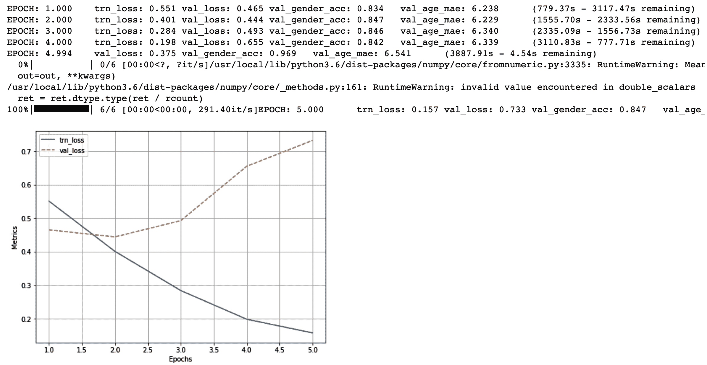

请注意，对于年龄和性别值，输出具有相应的训练和验证数据集损失和准确性值，即使我们没有初始化任何空列表来在训练和验证数据集中记录这些指标(我们在前面的小节中进行了初始化)

7.  加载样本图像并实现预测:

```
!wget -q https://www.dropbox.com/s/6kzr8l68e9kpjkf/5_9.JPG
IM = read('/content/5_9.JPG', 1)
im = trn.preprocess_image(IM).to(device)

gender, age = model(im)
pred_gender = gender.to('cpu').detach().numpy()
pred_age = age.to('cpu').detach().numpy()

info = f'predicted gender: {np.where(pred_gender[0][0]<0.5, \
"Male","Female")}\n Predicted age {int(pred_age[0][0]*80)}'
show(IM, title=info, sz=10)
```py

总而言之，这里有一些重要的函数(以及它们所包含的函数),我们将在本书的其余部分中用到它们:

*   `from torch_snippets import *`

*   全球(`glob.glob`)

*   选择`(np.random.choice)`

*   阅读(`cv2.imread`)

*   显示(`plt.imshow`)

*   支线剧情(`plt.subplots`–显示图像列表)

*   检查(`tensor.min`、`tensor.mean`、`tensor.max`、`tensor.shape`、`tensor.dtype`——几个张量的统计)

*   报告(在培训时跟踪所有指标，并在培训后绘制它们)

您可以通过运行`torch_snippets; print(dir(torch_snippets))`来查看完整的函数列表。对于每个功能，你可以使用`help(function)`或简单的`??function`在 Jupyter 笔记本上打印它的帮助。随着对利用`torch_snippets`的理解，您应该能够大大简化代码。从下一章开始，你会注意到这一点。

# 摘要

在这一章中，我们已经了解了迁移学习如何帮助实现高精度，即使数据点数量较少。我们还了解了受欢迎的预培训模型，VGG 和雷斯内特。此外，当我们尝试预测不同的场景时，我们知道如何构建模型，例如面部关键点的位置和组合损失值，同时训练模型来预测年龄和性别，其中年龄属于特定数据类型，而性别属于不同的数据类型。

有了通过迁移学习进行图像分类的基础，在下一章中，我们将了解训练图像分类模型的一些实际方面。我们将学习如何解释一个模型，还将学习如何训练一个模型以达到高精度的技巧，最后，学习一个从业者在实现一个训练好的模型时需要避免的陷阱。

# 问题

1.  VGG 和 ResNet 预培训架构的培训内容是什么？

2.  为什么 VGG11 的精度不如 VGG16？

3.  VGG11 中的数字 11 代表什么？

4.  什么是剩余网络中的*剩余*？

5.  残余网络的优势是什么？

6.  有哪些各种流行的预训模型？

7.  在迁移学习过程中，为什么要使用与预训练模型训练过程中使用的相同的均值和标准差来归一化图像？

8.  为什么我们要冻结模型中的某些参数？

9.  我们如何知道预训练模型中存在的各种模块？

10.  我们如何训练一个能同时预测分类值和数值的模型？

11.  如果我们执行与我们在年龄和性别估计一节中所写的代码相同的代码，为什么年龄和性别预测代码可能不总是对您感兴趣的图像起作用？

12.  我们如何进一步提高我们在面部关键点预测部分中提到的面部关键点识别模型的准确性？

```