# 九、图像分割

在前一章中，我们学习了如何检测图像中出现的对象，以及与检测到的对象相对应的类。在这一章中，我们将更进一步，不仅在对象周围画一个边界框，而且识别包含对象的确切像素。除此之外，到本章结束时，我们将能够挑出属于同一个类的实例/对象。

在本章中，我们将通过研究 U-Net 和 Mask R-CNN 架构来了解语义分段和实例分段。具体来说，我们将涵盖以下主题:

*   探索 U-Net 架构
*   用 U-Net 实现语义切分
*   探索掩模 R-CNN 架构
*   使用掩模 R-CNN 实现实例分割

我们试图通过图像分割([https://arxiv.org/pdf/1405.0312.pdf](https://arxiv.org/pdf/1405.0312.pdf))实现的简洁图像如下:

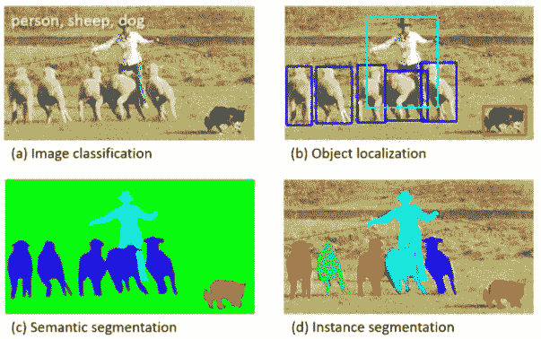

我们开始吧！

# 探索 U-Net 架构

想象一下这样一个场景，给你一张图像，要求你预测哪个像素对应哪个对象。到目前为止，当我们预测对象的类别和对应于该对象的边界框时，我们通过网络传递图像，然后通过主干架构(如 VGG 或 ResNet)传递图像，在某一层平坦化输出，并在预测类别和边界框偏移之前连接附加的密集层。但是，在图像分割的情况下，输出形状与输入图像的形状相同，展平卷积的输出然后重建图像可能会导致信息丢失。此外，在图像分割的情况下，原始图像中存在的轮廓和形状在输出图像中不会变化，因此，当我们执行分割时，我们迄今为止处理的网络(展平最后一层并连接附加的密集层)并不是最佳的。

在本节中，我们将了解如何执行图像分割。

在执行分段时，我们需要记住以下两个方面:

*   原始图像中对象的形状和结构在分段输出中保持不变。
*   利用完全卷积架构(而不是我们展平某一层的结构)会有所帮助，因为我们使用一个图像作为输入，另一个图像作为输出。

U-Net 架构帮助我们实现了这一目标。U-Net 的典型表示如下(输入图像是 3×96×128 的形状，而图像中存在的类的数量是 21；这意味着输出包含 21 个通道):


前述架构因其“ **U** ”状的形状而被称为 **U 网架构**。

在上图的左半部分，我们可以看到图像通过卷积层，正如我们在前面章节中看到的那样，图像尺寸不断减小，而通道数量不断增加。然而，在右半部分，我们可以看到我们正在放大缩小的图像，回到原始的高度和宽度，但是通道的数量与类的数量一样多。

此外，在向上扩展的同时，我们还使用**跳过连接**来利用来自左半部分中相应层的信息，以便我们可以保留原始图像中的结构/对象。

这样，U-Net 架构学习保留原始图像的结构(和对象的形状),同时利用卷积的特征来预测对应于每个像素的类别。

一般来说，输出中的通道数量与我们想要预测的类别数量一样多。

## 执行升级

在 U-Net 架构中，使用`nn.ConvTranspose2d`方法执行向上扩展，该方法将输入通道的数量、输出通道的数量、内核大小和步幅作为输入参数。`ConvTranspose2d`的计算示例如下:

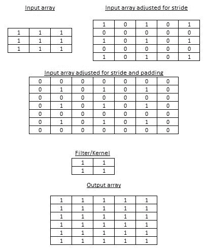

在前面的例子中，我们采用了一个形状为 3 x 3 的输入数组(**输入数组**)，应用了一个步长为 2 的输入数组，其中我们分配输入值以适应步长(**输入数组针对步长**进行了调整)，用零填充数组(**输入数组针对步长和填充**进行了调整)，并用一个过滤器(**过滤器/内核**)对填充后的输入进行卷积以获取输出数组。

通过利用填充和步幅的组合，我们将形状为 3 x 3 的输入升级为形状为 6 x 6 的数组。虽然前面的示例仅用于说明目的，但是最佳滤波器值学习(因为滤波器权重和偏差在模型训练过程中被优化)以尽可能多地重建原始图像。

`nn.ConvTranspose2d`中的超参数如下:

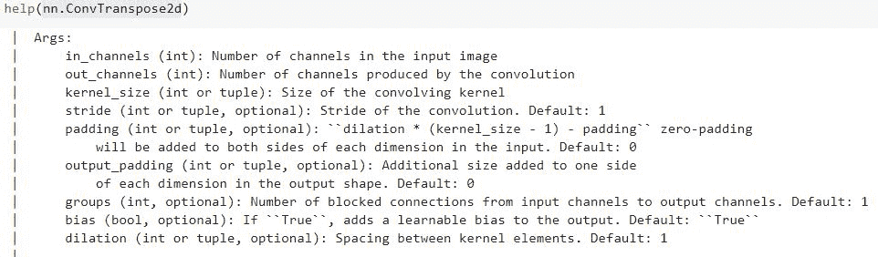

为了理解`nn.ConvTranspose2d`如何帮助提升一个数组，让我们看一下下面的代码:

1.  导入相关包:

```py
import torch
import torch.nn as nn
```

2.  用`nn.ConvTranspose2d`方法初始化网络`m`:

```py
m = nn.ConvTranspose2d(1, 1, kernel_size=(2,2), 
                       stride=2, padding = 0)
```

在前面的代码中，我们指定输入通道的值是`1`，输出通道的值是`1`，内核的大小是`(2,2)`，步幅是`2`，填充是`0`。

在内部，填充被计算为膨胀* (kernel_size - 1) -填充。

因此 1*(2-1)-0 = 1，其中我们向输入数组的两个维度添加零填充 1。

3.  初始化一个输入数组，并通过模型传递它:

```py
input = torch.ones(1, 1, 3, 3)
output = m(input)
output.shape
```

前面的代码产生了一个形状`1x1x6x6`，如前面提供的示例图像所示。

既然我们已经了解了 U-Net 架构是如何工作的，以及`nn.ConvTranspose2d`是如何帮助提升图像的，那么让我们来实现它，这样我们就可以预测道路场景图像中出现的不同对象。

# 用 U-Net 实现语义切分

在这一节中，我们将利用 U-Net 架构来预测对应于图像中所有像素的类。这种输入-输出组合的一个例子如下:

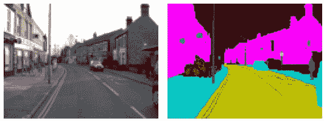

请注意，在前面的图片中，属于同一类别的对象(在左侧图像-输入图像中)具有相同的像素值(在右侧图像-输出图像中)，这就是为什么我们要**分割**彼此**语义**相似的像素。这也称为语义分割。

现在，让我们学习如何编码语义分段:

以下代码在本书的 GitHub 知识库的`Chapter09`文件夹中以`Semantic_Segmentation_with_U_Net.ipynb`的形式提供-【https://tinyurl.com/mcvp-packt 代码包含下载数据的 URL，长度适中。

1.  让我们首先下载必要的数据集，安装必要的包，然后导入它们。完成后，我们可以定义设备:

```py
import os
if not os.path.exists('dataset1'):
    !wget -q \
     https://www.dropbox.com/s/0pigmmmynbf9xwq/dataset1.zip
    !unzip -q dataset1.zip
    !rm dataset1.zip
    !pip install -q torch_snippets pytorch_model_summary

from torch_snippets import *
from torchvision import transforms
from sklearn.model_selection import train_test_split
device = 'cuda' if torch.cuda.is_available() else 'cpu'
```

2.  定义将用于转换图像的函数(`tfms`):

```py
tfms = transforms.Compose([
            transforms.ToTensor(),
            transforms.Normalize([0.485, 0.456, 0.406], 
                                 [0.229, 0.224, 0.225]) 
        ])
```

3.  定义数据集类(`SegData`):

*   在`__init__`方法中指定包含图像的文件夹:

```py
class SegData(Dataset):
    def __init__(self, split):
        self.items=stems(f'dataset1/images_prepped_{split}')
        self.split = split
```

*   定义`__len__`方法:

```py
    def __len__(self):
        return len(self.items)
```

*   定义`__getitem__`方法:

```py
    def __getitem__(self, ix):
        image = read(f'dataset1/images_prepped_{self.split}/\
{self.items[ix]}.png', 1)
        image = cv2.resize(image, (224,224))
        mask=read(f'dataset1/annotations_prepped_{self.split}\
/{self.items[ix]}.png')
        mask = cv2.resize(mask, (224,224))
        return image, mask
```

在`__getitem__` 方法中，我们调整了输入(`image`)和输出(`mask`)图像的大小，使它们具有相同的形状。请注意，屏蔽图像包含范围在`[0,11]`之间的整数。这表明有 12 个不同的类别。

*   定义一个用于选择随机图像索引的函数(`choose`)(主要用于调试目的):

```py
    def choose(self): return self[randint(len(self))]
```

*   定义对一批图像进行预处理的`collate_fn`方法:

```py
    def collate_fn(self, batch):
        ims, masks = list(zip(*batch))
        ims = torch.cat([tfms(im.copy()/255.)[None] \
                         for im in ims]).float().to(device)
        ce_masks = torch.cat([torch.Tensor(mask[None]) for \
                            mask in masks]).long().to(device)
        return ims, ce_masks
```

在前面的代码中，我们对所有的输入图像进行预处理，以便在我们转换缩放后的图像后，它们有一个通道(以便每个图像可以在以后通过 CNN 传送)。注意`ce_masks`是一个长整数张量，类似于交叉熵目标。

4.  定义训练和验证数据集，以及数据加载器:

```py
trn_ds = SegData('train')
val_ds = SegData('test')
trn_dl = DataLoader(trn_ds, batch_size=4, shuffle=True, \
                    collate_fn=trn_ds.collate_fn)
val_dl = DataLoader(val_ds, batch_size=1, shuffle=True, \
                    collate_fn=val_ds.collate_fn)
```

5.  定义神经网络模型:

*   定义卷积块(`conv`):

```py
def conv(in_channels, out_channels):
    return nn.Sequential(
        nn.Conv2d(in_channels,out_channels,kernel_size=3, \
                    stride=1, padding=1),
        nn.BatchNorm2d(out_channels),
        nn.ReLU(inplace=True)
    )
```

在前面的`conv`定义中，我们依次执行`Conv2d`操作、`BatchNorm2d`操作和`ReLU`操作。

*   定义`up_conv`块:

```py
def up_conv(in_channels, out_channels):
    return nn.Sequential(
        nn.ConvTranspose2d(in_channels, out_channels, \
                           kernel_size=2, stride=2),
        nn.ReLU(inplace=True)
    )
```

确保我们放大图像。这不同于`Conv2d`操作，在这里我们缩小图像的尺寸。它将具有`in_channels`个通道的图像作为输入通道，并产生具有`out_channels`个输出通道的图像。

*   定义网络类(`UNet`):

```py
from torchvision.models import vgg16_bn
class UNet(nn.Module):
    def __init__(self, pretrained=True, out_channels=12):
        super().__init__()

        self.encoder = \
                vgg16_bn(pretrained=pretrained).features
        self.block1 = nn.Sequential(*self.encoder[:6])
        self.block2 = nn.Sequential(*self.encoder[6:13])
        self.block3 = nn.Sequential(*self.encoder[13:20])
        self.block4 = nn.Sequential(*self.encoder[20:27])
        self.block5 = nn.Sequential(*self.encoder[27:34])

        self.bottleneck = nn.Sequential(*self.encoder[34:])
        self.conv_bottleneck = conv(512, 1024)

        self.up_conv6 = up_conv(1024, 512)
        self.conv6 = conv(512 + 512, 512)
        self.up_conv7 = up_conv(512, 256)
        self.conv7 = conv(256 + 512, 256)
        self.up_conv8 = up_conv(256, 128)
        self.conv8 = conv(128 + 256, 128)
        self.up_conv9 = up_conv(128, 64)
        self.conv9 = conv(64 + 128, 64)
        self.up_conv10 = up_conv(64, 32)
        self.conv10 = conv(32 + 64, 32)
        self.conv11 = nn.Conv2d(32, out_channels, \
                                kernel_size=1)
```

在前面的`__init__`方法中，我们定义了将在`forward`方法中使用的所有层。

*   定义`forward`方法:

```py
    def forward(self, x):
        block1 = self.block1(x)
        block2 = self.block2(block1)
        block3 = self.block3(block2)
        block4 = self.block4(block3)
        block5 = self.block5(block4)

        bottleneck = self.bottleneck(block5)
        x = self.conv_bottleneck(bottleneck)

        x = self.up_conv6(x)
        x = torch.cat([x, block5], dim=1)
        x = self.conv6(x)

        x = self.up_conv7(x)
        x = torch.cat([x, block4], dim=1)
        x = self.conv7(x)

        x = self.up_conv8(x)
        x = torch.cat([x, block3], dim=1)
        x = self.conv8(x)

        x = self.up_conv9(x)
        x = torch.cat([x, block2], dim=1)
        x = self.conv9(x)

        x = self.up_conv10(x)
        x = torch.cat([x, block1], dim=1)
        x = self.conv10(x)

        x = self.conv11(x)

        return x
```

在前面的代码中，我们通过在适当的张量对上使用`torch.cat`,在向下缩放和向上缩放卷积特征之间建立 U 型连接。

*   定义一个函数(`UNetLoss`)来计算我们的损失和准确度值:

```py
ce = nn.CrossEntropyLoss()
def UnetLoss(preds, targets):
    ce_loss = ce(preds, targets)
    acc = (torch.max(preds, 1)[1] == targets).float().mean()
    return ce_loss, acc
```

*   定义一个函数，该函数将在批处理(`train_batch`)上进行训练，并在验证数据集(`validate_batch`)上计算指标:

```py
def train_batch(model, data, optimizer, criterion):
    model.train()
    ims, ce_masks = data
    _masks = model(ims)
    optimizer.zero_grad()
    loss, acc = criterion(_masks, ce_masks)
    loss.backward()
    optimizer.step()
    return loss.item(), acc.item()

@torch.no_grad()
def validate_batch(model, data, criterion):
    model.eval()
    ims, masks = data
    _masks = model(ims)
    loss, acc = criterion(_masks, masks)
    return loss.item(), acc.item()
```

*   定义模型、优化器、损失函数和历元数:

```py
model = UNet().to(device)
criterion = UnetLoss
optimizer = optim.Adam(model.parameters(), lr=1e-3)
n_epochs = 20
```

6.  在不断增加的时期内训练模型:

```py
log = Report(n_epochs)
for ex in range(n_epochs):
    N = len(trn_dl)
    for bx, data in enumerate(trn_dl):
        loss, acc = train_batch(model, data, optimizer, \
                                criterion)
        log.record(ex+(bx+1)/N,trn_loss=loss,trn_acc=acc, \
                                 end='\r')

    N = len(val_dl)
    for bx, data in enumerate(val_dl):
        loss, acc = validate_batch(model, data, criterion)
        log.record(ex+(bx+1)/N,val_loss=loss,val_acc=acc, \
                                 end='\r')

    log.report_avgs(ex+1)
```

7.  绘制递增时期的训练值、验证损失值和准确度值:

```py
log.plot_epochs(['trn_loss','val_loss'])
```

上述代码生成以下输出:


8.  计算新图像的预测输出:

*   获取新图像的模型预测:

```py
im, mask = next(iter(val_dl))
_mask = model(im)
```

*   获取概率最高的频道:

```py
_, _mask = torch.max(_mask, dim=1)
```

*   显示原始图像和预测图像:

```py
subplots([im[0].permute(1,2,0).detach().cpu()[:,:,0], \
          mask.permute(1,2,0).detach().cpu()[:,:,0], \
          _mask.permute(1,2,0).detach().cpu()[:,:,0]],nc=3, \
          titles=['Original image','Original mask', \
          'Predicted mask'])
```

上述代码生成以下输出:


从上图中，我们可以看到，我们可以使用 U-Net 架构成功地生成一个分段掩码。但是，同一类的所有实例将具有相同的预测像素值。如果我们想在图像中分离出`Person`类的实例呢？在下一节中，我们将学习 Mask R-CNN 架构，它有助于生成实例级掩码，以便我们可以区分实例(甚至是同一类的实例)。

# 探索掩模 R-CNN 架构

Mask R-CNN 架构有助于识别/突出显示图像中给定类别的对象的实例。当图像中存在多个相同类型的对象时，这尤其方便。此外，术语 **Mask** 表示 Mask R-CNN 在像素级完成的分割。

Mask R-CNN 架构是更快的 R-CNN 网络的扩展，我们在前一章已经了解过。但是，对 Mask R-CNN 架构进行了一些修改，如下所示:

*   RoI Pooling 层已被 RoI Align 层所取代。
*   除了已经预测最终层中的对象类别和边界框校正的头部之外，还包括了用于预测对象遮罩的遮罩头部。
*   一个**全卷积网络** ( **FCN** )被用于掩码预测。

在我们了解每个组件如何工作之前，让我们快速浏览一下 Mask R-CNN 中发生的事件(图片来源:[https://arxiv.org/pdf/1703.06870.pdf](https://arxiv.org/pdf/1703.06870.pdf)):

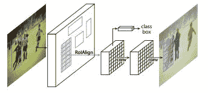

在上图中，请注意，我们从一个层获取类和边界框信息，从另一个层获取遮罩信息。

Mask R-CNN 架构的工作细节如下:


在我们实现 Mask R-CNN 架构之前，我们需要了解它的组件。我们将从 RoI 对齐开始。

## ROI align(ROI 对齐)

通过更快的 R-CNN，我们了解了投资回报率池。RoI 合并的一个缺点是，当我们执行 RoI 合并操作时，我们可能会丢失某些信息。这是因为在汇集之前，我们可能会在图像的所有区域中均匀地呈现内容。

让我们看一下上一章提供的例子:

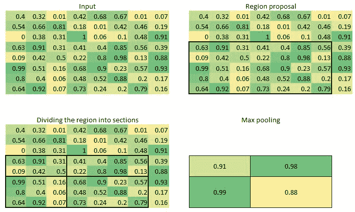

在上图中，区域建议的形状是 5 x 7，我们必须将其转换为 2 x 2 的形状。当将其转换为 2 x 2 形状时(一种称为量化的现象)，该区域的一部分与该区域的其他部分相比具有较少的表示。这导致信息丢失，因为该区域的某些部分比其他部分具有更大的权重。RoI Align 帮助解决了这种情况。

为了理解 RoI Align 的工作原理，我们来看一个简单的例子。这里，我们尝试将以下区域(用虚线表示)转换为 2 x 2 形状:

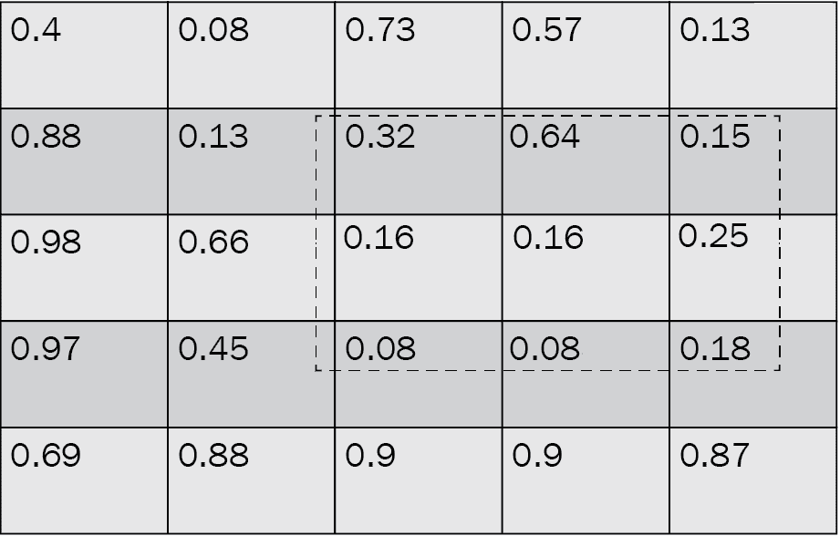

请注意，该区域(虚线中)并非均匀分布在特征地图中的所有像元上。

我们必须执行以下步骤，以在 2 x 2 形状中获得该区域的合理表示:

1.  首先，将该区域分成相等的 2 x 2 形状:

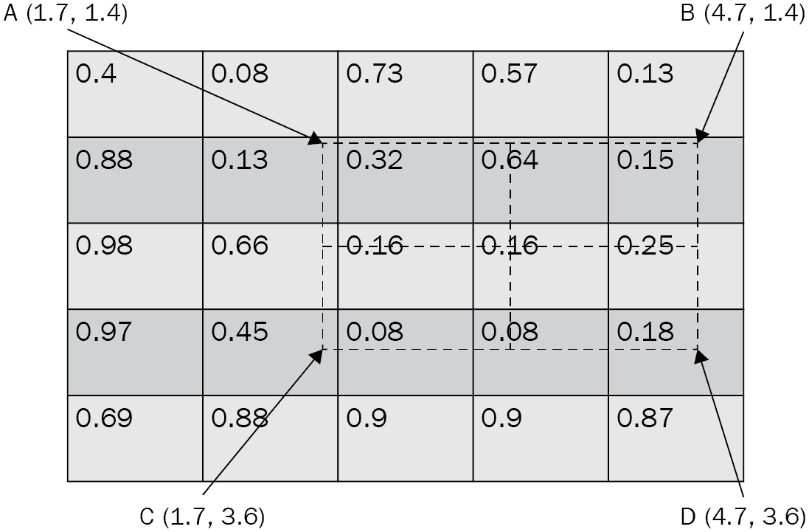

2.  在每个 2 x 2 单元格内定义四个等距点:

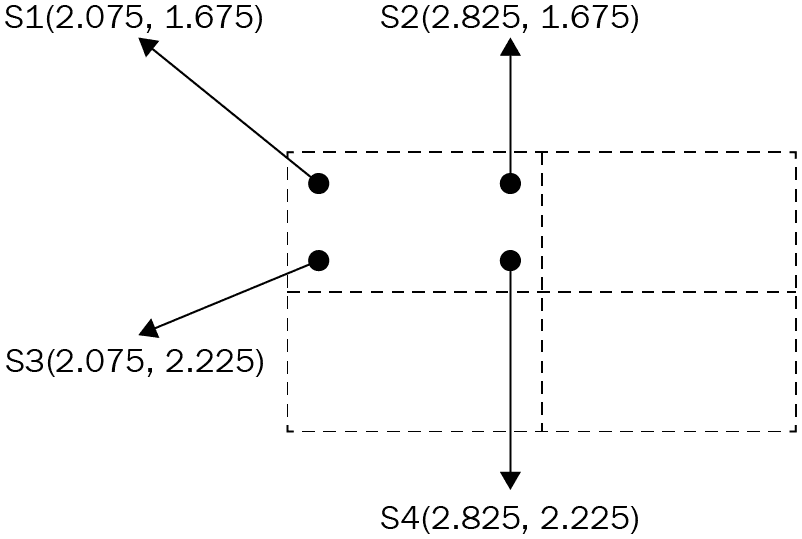

请注意，在上图中，两个连续点之间的距离是 0.75。

3.  根据每个点到最近已知值的距离计算每个点的加权平均值:

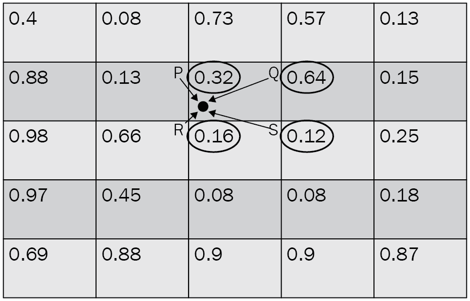

4.  对像元中的所有四个点重复上述插值步骤:

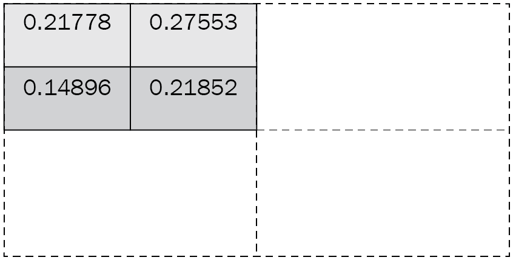

5.  在一个单元格内的所有四个点上执行平均汇集:

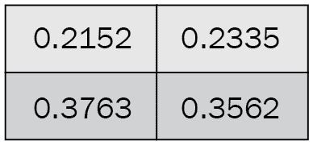

通过实现上述步骤，我们在执行 RoI 对齐时不会丢失信息；也就是说，当我们把所有的区域放在同一个形状里面。

## 面具头

使用 RoI Align，我们可以更准确地表示从区域提案网络中获得的区域提案。现在，我们想要获得分割(掩模)输出，给定标准形状的 RoI 对准输出，用于每个区域提议。

通常，在目标检测的情况下，我们将通过展平层传递 RoI Align，以便预测对象的类别和边界框偏移。然而，在图像分割的情况下，我们预测包含对象的边界框内的像素。因此，我们现在有了第三个输出(除了类和边界框偏移之外)，这是感兴趣区域内的预测掩膜。

这里，我们预测的是蒙版，它是覆盖在原始图像上的图像。假设我们预测的是一幅图像，我们将把它连接到另一个卷积层以获得另一个类似图像的结构(宽度 x 高度),而不是展平 RoI Align 的输出。让我们通过下图来了解这一现象:


在上图中，我们使用**特征金字塔网络**(**)获得了 7 x 7 x 2048 形状的输出，该网络现在有两个分支:**

 ***   第一个分支返回对象的类和边界框，后展平 FPN 输出。
*   第二个分支在 FPN 输出的顶部执行卷积，以获得掩码。

对应于 14×14 输出的基本事实是区域提议的尺寸调整后的图像。如果数据集中有 80 个唯一类，则区域建议的基本事实是 80 x 14 x 14 的形状。80 x 14 x 14 像素中的每一个都是 1 或 0，这表示该像素是否包含对象。因此，我们在预测像素类别的同时执行二进制交叉熵损失最小化。

在模型训练之后，我们能够检测区域，获得类，获得边界框偏移，并获得对应于每个区域的遮罩。当进行推断时，我们首先检测图像中存在的对象，并进行边界框校正。然后，我们将偏移区域传递给掩模头，以预测该区域中不同像素对应的掩模。

现在我们已经了解了 Mask R-CNN 架构的工作原理，让我们对其进行编码，以便我们可以检测图像中的人物实例。

# 使用掩模 R-CNN 实现实例分割

为了帮助我们理解如何编码屏蔽 R-CNN 用于实例分割，我们将利用屏蔽图像中存在的人的数据集。我们将使用的数据集是从 ADE20K 数据集的子集创建的，该数据集可在[https://groups.csail.mit.edu/vision/datasets/ADE20K/](https://groups.csail.mit.edu/vision/datasets/ADE20K/)获得。我们将只使用那些有人类面具的图像。

我们将采取的策略如下:

1.  获取数据集，然后从中创建数据集和数据加载器。
2.  以 PyTorch 官方实现 Mask R-CNN 所需的格式创建一个地面真相。
3.  下载预先训练好的更快的 R-CNN 模型，给它贴上一个口罩 R-CNN 头。
4.  使用 PyTorch 代码片段训练模型，该代码片段已被标准化用于训练 Mask R-CNN。
5.  通过首先执行非最大值抑制，然后识别与图像中的人相对应的边界框和遮罩，对图像进行推断。

让我们编写前面的策略:

以下代码在本书的 GitHub 知识库的`Chapter09`文件夹中以`Instance_Segmentation.ipynb`的形式提供-【https://tinyurl.com/mcvp-packt 代码包含下载数据的 URL，长度适中。我们强烈建议您在 GitHub 中执行 notebook 以重现结果，同时理解执行的步骤和对文本中各种代码组件的解释。

1.  从 GitHub 导入相关的数据集和训练工具:

```py
!wget --quiet \
 http://sceneparsing.csail.mit.edu/data/ChallengeData2017/images.tar
!wget --quiet \ http://sceneparsing.csail.mit.edu/data/ChallengeData2017/annotations_instance.tar
!tar -xf images.tar
!tar -xf annotations_instance.tar
!rm images.tar annotations_instance.tar
!pip install -qU torch_snippets
!wget --quiet \ https://raw.githubusercontent.com/pytorch/vision/master/references/detection/engine.py
!wget --quiet \ https://raw.githubusercontent.com/pytorch/vision/master/references/detection/utils.py
!wget --quiet \ https://raw.githubusercontent.com/pytorch/vision/master/references/detection/transforms.py
!wget --quiet \ https://raw.githubusercontent.com/pytorch/vision/master/references/detection/coco_eval.py
!wget --quiet \ https://raw.githubusercontent.com/pytorch/vision/master/references/detection/coco_utils.py
!pip install -q -U \
    'git+https://github.com/cocodataset/cocoapi.git#subdirectory=PythonAPI'
```

2.  导入所有必需的包并定义`device`:

```py
from torch_snippets import *

import torchvision
from torchvision.models.detection.faster_rcnn import FastRCNNPredictor
from torchvision.models.detection.mask_rcnn import MaskRCNNPredictor

from engine import train_one_epoch, evaluate
import utils
import transforms as T
device = 'cuda' if torch.cuda.is_available() else 'cpu'
```

3.  获取包含人物面具的图像，如下所示:

*   遍历`images`和`annotations_instance`文件夹以获取文件名:

```py
all_images = Glob('img/training')
all_annots = Glob('annotations_instance/training')
```

*   检查原始图像和人物实例的面具表示:

```py
f = 'ADE_train_00014301'

im = read(find(f, all_images), 1)
an = read(find(f, all_annots), 1).transpose(2,0,1)
r,g,b = an
nzs = np.nonzero(r==4) # 4 stands for person
instances = np.unique(g[nzs])
masks = np.zeros((len(instances), *r.shape))
for ix,_id in enumerate(instances):
    masks[ix] = g==_id

subplots([im, *masks], sz=20)
```

上述代码生成以下输出:


从前面的图像中，我们可以看到已经为每个人生成了一个单独的遮罩。这里有四个`Person`类的实例。

在这个特定的数据集中，地面实况实例注释以这样一种方式提供，即 RGB 中的红色通道对应于对象的类别，而绿色通道对应于实例编号(如果图像中有多个相同类别的对象，如我们这里的示例)。此外，`Person`类的编码值为 4。

*   遍历注释并存储至少包含一个人的文件:

```py
annots = []
for ann in Tqdm(all_annots):
    _ann = read(ann, 1).transpose(2,0,1)
    r,g,b = _ann
    if 4 not in np.unique(r): continue
    annots.append(ann)
```

*   将文件分为培训和验证文件:

```py
from sklearn.model_selection import train_test_split
_annots = stems(annots)
trn_items,val_items=train_test_split(_annots,random_state=2)
```

4.  定义转换方法:

```py
def get_transform(train):
    transforms = []
    transforms.append(T.ToTensor())
    if train:
        transforms.append(T.RandomHorizontalFlip(0.5))
    return T.Compose(transforms)
```

5.  创建数据集类(`MasksDataset`)，如下所示:

*   定义`__init__`方法，该方法将图像名称(`items`)、转换方法(`transforms`)和要考虑的文件数量(`N`)作为输入:

```py
class MasksDataset(Dataset):
    def __init__(self, items, transforms, N):
        self.items = items
        self.transforms = transforms
        self.N = N
```

*   定义一个方法(`get_mask`)，该方法将获取一些与图像中出现的实例相同的遮罩:

```py
    def get_mask(self, path):
        an = read(path, 1).transpose(2,0,1)
        r,g,b = an
        nzs = np.nonzero(r==4)
        instances = np.unique(g[nzs])
        masks = np.zeros((len(instances), *r.shape))
        for ix,_id in enumerate(instances):
            masks[ix] = g==_id
        return masks
```

*   获取要返回的图像和相应的目标值。每个人(实例)被视为不同的对象类；也就是说，每个实例是一个不同的类。注意，类似于训练更快的 R-CNN 模型，目标作为张量的字典返回。让我们定义一下`__getitem__`方法:

```py
    def __getitem__(self, ix):
        _id = self.items[ix]
        img_path = f'img/training/{_id}.jpg'
        mask_path=f'annotations_instance/training/{_id}.png'
        masks = self.get_mask(mask_path)
        obj_ids = np.arange(1, len(masks)+1)
        img = Image.open(img_path).convert("RGB")
        num_objs = len(obj_ids)
```

*   除了遮罩本身，遮罩 R-CNN 还需要边界框信息。但是，这很容易准备，如下面的代码所示:

```py
        boxes = []
        for i in range(num_objs):
            obj_pixels = np.where(masks[i])
            xmin = np.min(obj_pixels[1])
            xmax = np.max(obj_pixels[1])
            ymin = np.min(obj_pixels[0])
            ymax = np.max(obj_pixels[0])
            if (((xmax-xmin)<=10) | (ymax-ymin)<=10):
                xmax = xmin+10
                ymax = ymin+10
            boxes.append([xmin, ymin, xmax, ymax])
```

在前面的代码中，我们通过在边界框的 x 和 y 坐标的最小值上增加 10 个像素来调整存在可疑事实的场景(`Person`类的高度或宽度小于 10 个像素)。

*   将所有目标值转换为张量对象:

```py
        boxes = torch.as_tensor(boxes, dtype=torch.float32)
        labels = torch.ones((num_objs,), dtype=torch.int64)
        masks = torch.as_tensor(masks, dtype=torch.uint8)
        area = (boxes[:, 3] - boxes[:, 1]) *\
                    (boxes[:, 2] - boxes[:, 0])
        iscrowd = torch.zeros((num_objs,), dtype=torch.int64)
        image_id = torch.tensor([ix])
```

*   将目标值存储在字典中:

```py
        target = {}
        target["boxes"] = boxes
        target["labels"] = labels
        target["masks"] = masks
        target["image_id"] = image_id
        target["area"] = area
        target["iscrowd"] = iscrowd
```

*   指定转换方法并返回图像；也就是，`target`:

```py
        if self.transforms is not None:
            img, target = self.transforms(img, target)
        return img, target
```

*   指定`__len__`方法:

```py
    def __len__(self):
        return self.N
```

*   定义将选择随机图像的函数:

```py
    def choose(self):
        return self[randint(len(self))]
```

*   检查输入输出组合:

```py
x = MasksDataset(trn_items, get_transform(train=True), N=100)
im,targ = x[0]
inspect(im,targ)
subplots([im, *targ['masks']], sz=10)
```

以下是上述代码运行时产生的一些输出示例:


从前面的输出中，我们可以看到面具的形状是 2 x 512 x 683，表明图像中有两个人。

注意，在`__getitem__`方法中，我们在一个图像中有和图像中存在的对象(实例)一样多的遮罩和边界框。此外，因为我们只有两个类(`Background`类和`Person`类)，所以我们将`Person`类指定为 1。

到这一步结束时，我们在输出字典中有了相当多的信息；即对象类别、边界框、遮罩、遮罩区域以及遮罩是否对应于群组。所有这些信息都可以在`target`字典中找到。对于我们将要使用的训练函数，将数据标准化为`torchvision.models.detection.maskrcnn_resnet50_fpn`类要求的格式是很重要的。

6.  接下来，我们需要定义实例分割模型(`get_model_instance_segmentation`)。我们将使用预训练的模型，其中仅头部被重新初始化以预测两个类别(背景和人)。首先，我们需要初始化一个预先训练好的模型，替换掉`box_predictor`和`mask_predictor`头，这样就可以从头开始学习了:

```py
def get_model_instance_segmentation(num_classes):
    # load an instance segmentation model pre-trained on 
    # COCO
    model = torchvision.models.detection\
                       .maskrcnn_resnet50_fpn(pretrained=True)

    # get number of input features for the classifier
    in_features = model.roi_heads\
                       .box_predictor.cls_score.in_features
    # replace the pre-trained head with a new one
    model.roi_heads.box_predictor = FastRCNNPredictor(\
                                    in_features,num_classes)
    in_features_mask = model.roi_heads\
                       .mask_predictor.conv5_mask.in_channels
    hidden_layer = 256
    # and replace the mask predictor with a new one
    model.roi_heads.mask_predictor = MaskRCNNPredictor(\
                                      in_features_mask,\
                                   hidden_layer, num_classes)
    return model
```

`FastRCNNPredictor`期望两个输入—`in_features`(输入通道数)和`num_classes`(类别数)。根据要预测的类的数量，计算出边界框预测的数量，这是类数量的四倍。

`MaskRCNNPredictor`期望三个输入—`in_features_mask`(输入通道数)、`hidden_layer`(输出通道数)、和`num_classes`(要预测的类数)。

可以通过指定以下内容来获取已定义模型的详细信息:

```py
model = get_model_instance_segmentation(2).to(device)
model
```

模型的下半部分(即没有主干)如下所示:

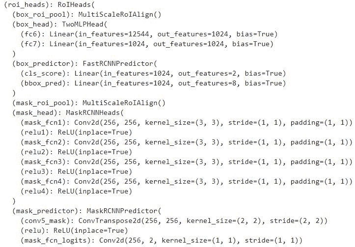

请注意，更快的 R-CNN 网络(我们在上一章中训练过)和屏蔽 R-CNN 模型之间的主要区别在于`roi_heads`模块，它本身包含多个子模块。让我们看看他们执行什么任务:

*   `roi_heads`:对齐从 FPN 网络获取的输入，并创建两个张量。
*   `box_predictor`:使用我们获得的输出来预测每个 RoI 的类别和边界框偏移。
*   `mask_roi_pool` : RoI 随后整理来自 FPN 网络的输出。

*   `mask_head`:将先前获得的校准输出转换成可用于预测掩模的特征图。
*   `mask_predictor`:获取`mask_head`的输出，并预测最终掩码。

7.  获取与训练和验证图像对应的数据集和数据加载器:

```py
dataset = MasksDataset(trn_items, get_transform(train=True), \
                                                    N=3000)
dataset_test = MasksDataset(val_items, \
                           get_transform(train=False), N=800)

# define training and validation data loaders
data_loader=torch.utils.data.DataLoader(dataset,batch_size=2, \
                                shuffle=True, num_workers=0, \
                                 collate_fn=utils.collate_fn)

data_loader_test = torch.utils.data.DataLoader(dataset_test, \
                                batch_size=1, shuffle=False, \
                   num_workers=0,collate_fn=utils.collate_fn)
```

8.  定义模型、参数和优化标准:

```py
num_classes = 2
model = get_model_instance_segmentation(\
                        num_classes).to(device)
params = [p for p in model.parameters() if p.requires_grad]
optimizer = torch.optim.SGD(params, lr=0.005, \
                            momentum=0.9,weight_decay=0.0005)
# and a learning rate scheduler
lr_scheduler = torch.optim.lr_scheduler.StepLR(optimizer, \
                                                step_size=3, \
                                                gamma=0.1)
```

定义的预训练模型架构将图像和`targets`字典作为输入，以减少损失。通过运行以下命令，可以看到从模型接收到的输出示例:

```py
# The following code is for illustration purpose only
model.eval()
pred = model(dataset[0][0][None].to(device))
inspect(pred[0])
```

上述代码会产生以下输出:

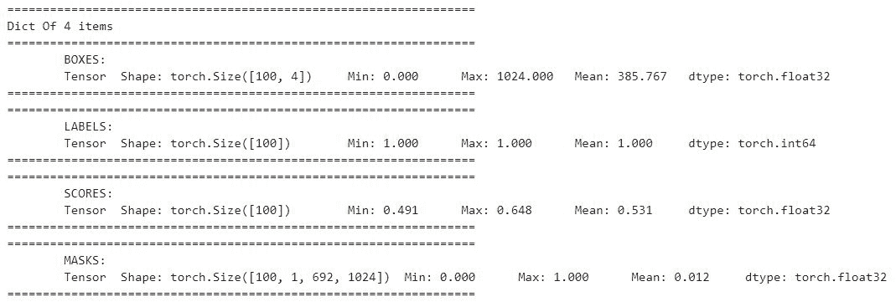

在这里，我们可以看到一个具有边界框(`BOXES`)的字典，对应于边界框的类(`LABELS`)，对应于类预测的置信度得分(`SCORES`，以及我们的掩码实例的位置(`MASKS`)。如您所见，该模型被硬编码为返回 100 个预测，这是合理的，因为我们不应该期望在一个典型的图像中有超过 100 个对象。

要获取已检测到的实例数量，我们将使用以下代码:

```py
# The following code is for illustration purpose only
pred[0]['masks'].shape
# torch.Size([100, 1, 536, 559])
```

前面的代码为一个图像(以及对应于该图像的尺寸)获取最多 100 个遮罩实例(其中这些实例对应于非背景类)。对于这 100 个实例，它还将返回相应的类标签、边界框和该类的 100 个相应的置信度值。

9.  在不断增加的时期内训练模型:

```py
num_epochs = 5

trn_history = []
for epoch in range(num_epochs):
    # train for one epoch, printing every 10 iterations
    res = train_one_epoch(model, optimizer, data_loader, \
                          device, epoch, print_freq=10)
    trn_history.append(res)
    # update the learning rate
    lr_scheduler.step()
    # evaluate on the test dataset
    res = evaluate(model, data_loader_test, device=device)
```

通过这样做，我们现在可以将我们的遮罩覆盖在图像中的人物上。我们可以按如下方式记录我们在不断增加的时期内的训练损失变化:

```py
import matplotlib.pyplot as plt
plt.title('Training Loss')
losses =[np.mean(list(trn_history[i].meters['loss'].deque)) \
            for i in range(len(trn_history))]
plt.plot(losses)
```

上述代码会产生以下输出:

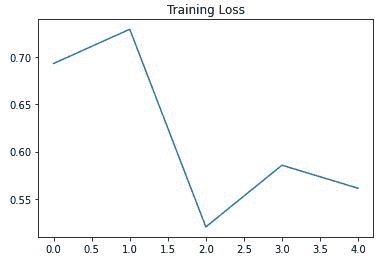

10.  在测试图像上预测:

```py
model.eval()
im = dataset_test[0][0]
show(im)
with torch.no_grad():
    prediction = model([im.to(device)])
    for i in range(len(prediction[0]['masks'])):
        plt.imshow(Image.fromarray(prediction[0]['masks']\
                      [i, 0].mul(255).byte().cpu().numpy()))
        plt.title('Class: '+str(prediction[0]['labels']\
                   [i].cpu().numpy())+' Score:'+str(\
                  prediction[0]['scores'][i].cpu().numpy()))
        plt.show()
```

上述代码会产生以下输出:


从前面的图像中，我们可以看到我们可以成功地识别图像中的四个人。此外，该模型预测图像中的多个其他片段(我们在前面的输出中没有显示)，尽管这是低置信度的。

既然模型可以很好地检测实例，那么让我们对提供的数据集中不存在的自定义图像运行预测。

11.  对自己的新形象进行预测:

```py
!wget https://www.dropbox.com/s/e92sui3a4ktvb4j/Hema18.JPG
img = Image.open('Hema18.JPG').convert("RGB")
from torchvision import transforms
pil_to_tensor = transforms.ToTensor()(img).unsqueeze_(0)
Image.fromarray(pil_to_tensor[0].mul(255)\
                        .permute(1, 2, 0).byte().numpy())
```

输入图像如下:


*   获取输入图像的预测:

```py
model.eval()
with torch.no_grad():
    prediction = model([pil_to_tensor[0].to(device)])
    for i in range(len(prediction[0]['masks'])):
        plt.imshow(Image.fromarray(prediction[0]['masks']\
                        [i, 0].mul(255).byte().cpu().numpy()))
        plt.title('Class: '+str(prediction[0]\
                              ['labels'][i].cpu().numpy())+'\
        Score:'+str(prediction[0]['scores'][i].cpu().numpy()))
        plt.show()
```

上述代码会产生以下输出:

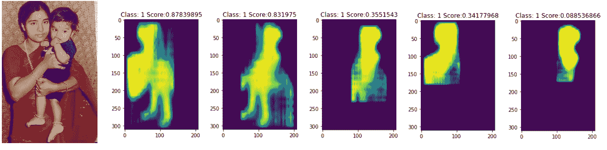

请注意，在前面的图像中，经过训练的模型不如在测试图像中工作得好。这可能是由于以下原因:

*   人们在训练时可能不会靠得这么近。
*   该模型可能没有在感兴趣的类别占据图像的大部分的许多图像上被训练。
*   我们用来训练模型的数据集中的图像与预测的图像具有不同的数据分布。

但是，即使已经检测到重复的掩码，在这些区域(从第三个掩码开始)中具有较低的类分数是预测中可能存在重复的良好指示。

到目前为止，我们已经学习了如何分割`Person`类的多个实例。在下一节中，我们将了解我们在这一节中构建的代码中需要调整的内容，以分割图像中多类对象的多个实例。

## 预测多个类的多个实例

在上一节中，我们学习了如何分割`Person`类。在这一节中，我们将学习如何通过使用我们在上一节中构建的相同模型，一次性地对 person 和 table 实例进行分段。让我们开始吧:

鉴于大部分代码与前一节中的代码相同，我们将只在这一节中解释额外的代码。在执行代码时，我们鼓励你浏览一下`predicting_multiple_instances_of_multiple_classes.ipynb`笔记本，它可以在本书的 GitHub 库的`Chapter09`文件夹中找到

1.  获取包含感兴趣类别的图像—`Person`(类别 ID 4)和`Table`(类别 ID 6):

```py
classes_list = [4,6]
annots = []
for ann in Tqdm(all_annots):
    _ann = read(ann, 1).transpose(2,0,1)
    r,g,b = _ann
    if np.array([num in np.unique(r) for num in \
                classes_list]).sum()==0: continue
    annots.append(ann)
from sklearn.model_selection import train_test_split
_annots = stems(annots)
trn_items, val_items = train_test_split(_annots, \
                                     random_state=2)
```

在前面的代码中，我们获取了包含至少一个感兴趣的类(`classes_list`)的图像。

2.  修改`get_mask`方法，使其返回两个掩码，以及对应于`MasksDataset`类中每个掩码的类:

```py
    def get_mask(self,path):
        an = read(path, 1).transpose(2,0,1)
        r,g,b = an
        cls = list(set(np.unique(r)).intersection({4,6}))
        masks = []
        labels = []
        for _cls in cls:
            nzs = np.nonzero(r==_cls)
            instances = np.unique(g[nzs])
            for ix,_id in enumerate(instances):
                masks.append(g==_id)
                labels.append(classes_list.index(_cls)+1)
        return np.array(masks), np.array(labels)
```

在前面的代码中，我们获取图像中存在的感兴趣的类，并将它们存储在`cls`中。接下来，我们遍历每个已识别的类(`cls`)，并将红色通道值对应于类(`cls`)的位置存储在`nzs`中。接下来，我们获取这些位置的实例 id(`instances`)。此外，在返回`masks`和`labels`的 NumPy 数组之前，我们将`instances`附加到`masks`以及对应于`labels`中实例的类。

3.  修改`__getitem__`方法中的`labels`对象，使其包含从`get_mask`方法获得的标签，而不是用`torch.ones`填充。下面代码中的粗体部分是对上一节中的`__getitem__`方法进行修改的地方:

```py
    def __getitem__(self, ix):
        _id = self.items[ix]
        img_path = f'img/training/{_id}.jpg'
        mask_path = f'annotations_instance/training/{_id}.png'
        masks, labels = self.get_mask(mask_path)
        #print(labels)
        obj_ids = np.arange(1, len(masks)+1)
        img = Image.open(img_path).convert("RGB")
        num_objs = len(obj_ids)
        boxes = []
        for i in range(num_objs):
            obj_pixels = np.where(masks[i])
            xmin = np.min(obj_pixels[1])
            xmax = np.max(obj_pixels[1])
            ymin = np.min(obj_pixels[0])
            ymax = np.max(obj_pixels[0])
            if (((xmax-xmin)<=10) | (ymax-ymin)<=10):
                xmax = xmin+10
                ymax = ymin+10
            boxes.append([xmin, ymin, xmax, ymax])
        boxes = torch.as_tensor(boxes, dtype=torch.float32)
        labels = torch.as_tensor(labels, dtype=torch.int64)
        masks = torch.as_tensor(masks, dtype=torch.uint8)
        area = (boxes[:, 3] - boxes[:, 1]) * 
                    (boxes[:, 2] - boxes[:, 0])
        iscrowd = torch.zeros((num_objs,), dtype=torch.int64)
        image_id = torch.tensor([ix])
        target = {}
        target["boxes"] = boxes
        target["labels"] = labels
        target["masks"] = masks
        target["image_id"] = image_id
        target["area"] = area
        target["iscrowd"] = iscrowd
        if self.transforms is not None:
            img, target = self.transforms(img, target)
        return img, target
    def __len__(self):
        return self.N
    def choose(self):
        return self[randint(len(self))]
```

4.  在定义`model`时，指定您有三个类而不是两个:

```py
num_classes = 3
model=get_model_instance_segmentation(num_classes).to(device)
```

在训练模型时，正如我们在上一节中所做的，我们将看到训练损失在增加的时期内的变化如下:


此外，包含人和桌子的样本图像的预测片段如下:

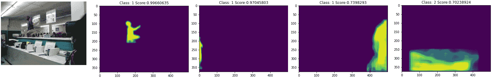

从上图中，我们可以看到，我们能够使用相同的模型预测这两个类别。作为练习，我们鼓励您增加类的数量和纪元的数量，看看您会得到什么结果。

# 摘要

在本章中，我们学习了如何利用 U-Net 和 Mask R-CNN 在图像上执行分割。我们了解了 U-Net 架构如何使用卷积对图像执行缩小和放大，以保留图像的结构，同时仍然能够预测图像中对象周围的遮罩。然后，我们使用道路场景检测练习巩固了我们对此的理解，在该练习中，我们将图像分割成多个类别。接下来，我们学习了 RoI Align，它有助于确保围绕图像量化的 RoI 汇集问题得到解决。在那之后，我们了解了 Mask R-CNN 是如何工作的，这样我们就可以训练模型来预测图像中的人的实例，以及图像中的人和桌子的实例。

现在，我们已经很好地理解了各种目标检测技术和图像分割技术，在下一章中，我们将学习利用我们到目前为止所学技术的应用程序，以便我们可以扩展我们将要预测的类的数量。此外，我们还将了解 Detectron2 框架，它在我们构建更快的 R-CNN 和 Mask R-CNN 模型时降低了代码复杂性。

# 问题

1.  向上扩展对 U-Net 架构有何帮助？
2.  U-Net 中为什么需要全卷积网络？
3.  在 Mask-RCNN 中，RoI Align 如何改进 RoI pooling？
4.  U-Net 和 Mask-RCNN 在分割方面的主要区别是什么？
5.  什么是实例分段？**