# 十、目标检测和分割应用

在之前的章节中，我们学习了各种目标检测技术，例如 R-CNN 系列算法、YOLO、SSD 以及 U-Net 和 Mask R-CNN 图像分割算法。在这一章中，我们将把我们的学习向前推进一步——我们将在更真实的场景中工作，并了解为解决检测和分割问题而更优化的框架/架构。我们将首先利用 Detectron2 框架来训练和检测图像中存在的自定义对象。我们还将使用预先训练的模型来预测图像中出现的人的姿势。此外，我们将学习如何计算图像中人群的人数，然后学习如何利用分割技术来执行图像着色。最后，我们将了解 YOLO 的修改版本，通过使用从激光雷达传感器获得的点云来预测对象周围的 3D 边界框。

本章结束时，您将了解到以下内容:

*   多对象实例分割
*   人体姿态检测
*   人群计数
*   图像彩色化
*   基于点云的三维目标检测

# 多对象实例分割

在前几章中，我们学习了各种目标检测算法。在本节中，我们将了解 Detectron2 平台([https://ai . Facebook . com/blog/-detectron 2-a-py torch-based-modular-object-detection-library-/](https://ai.facebook.com/blog/-detectron2-a-pytorch-based-modular-object-detection-library-/))，然后使用 Google Open Images 数据集实现它。Detectron2 是由脸书团队构建的平台。Detectron2 包括最先进的目标检测算法的高质量实现，包括 Mask R-CNN 模型系列的 DensePose。最初的 Detectron 框架是用 Caffe2 编写的，而 Detectron2 框架是用 PyTorch 编写的。

Detectron2 支持一系列与目标检测相关的任务。像最初的 Detectron 一样，它支持使用盒子和实例分割遮罩进行目标检测，以及人体姿势预测。除此之外，Detectron2 增加了对语义分段和全景分段的支持(一项结合了语义和实例分段的任务)。通过利用 Detectron2，我们能够在几行代码中构建目标检测、分割和姿态估计。

在本节中，我们将了解以下内容:

1.  从`open-images`存储库中获取数据
2.  将数据转换成 Detectron2 接受的 COCO 格式
3.  为实例分割训练模型
4.  对新图像进行推理

让我们在接下来的几节中逐一讨论这些问题。

## **获取和准备数据**

我们将在谷歌在 https://storage.googleapis.com/openimg/web/index.html 提供的开放图像数据集中(包含数百万张图像及其注释)处理这些图像。

在这部分代码中，我们将学习如何只获取所需的图像，而不是整个数据集。请注意，这一步是必需的，因为数据集大小会阻止可能没有大量资源的典型用户构建模型:

以下代码在本书的 GitHub 知识库的`Chapter10`文件夹中以`Multi_object_segmentation.ipynb`的形式提供-【https://tinyurl.com/mcvp-packt 代码包含下载数据的 URL，长度适中。我们强烈建议您在 GitHub 中执行 notebook 以重现结果，同时理解执行的步骤和对文本中各种代码组件的解释。

1.  安装所需的软件包:

```py
!pip install -qU openimages torch_snippets
```

2.  下载所需的注释文件:

```py
from torch_snippets import *
!wget -O train-annotations-object-segmentation.csv -q https://storage.googleapis.com/openimg/v5/train-annotations-object-segmentation.csv
!wget -O classes.csv -q \
 https://raw.githubusercontent.com/openimg/dataset/master/dict.csv 
```

3.  指定我们希望模型预测的类(您可以访问 Open Images 网站查看所有类的列表):

```py
required_classes = 'person,dog,bird,car,elephant,football,\
jug,laptop,Mushroom,Pizza,Rocket,Shirt,Traffic sign,\
Watermelon,Zebra'
required_classes = [c.lower() for c in \
                        required_classes.lower().split(',')]

classes = pd.read_csv('classes.csv', header=None)
classes.columns = ['class','class_name']
classes = classes[classes['class_name'].map(lambda x: x \
                                        in required_classes)]
```

4.  获取对应于`required_classes`的图像 id 和遮罩:

```py
from torch_snippets import *
df = pd.read_csv('train-annotations-object-segmentation.csv')

data = pd.merge(df, classes, left_on='LabelName', 
                right_on='class')

subset_data = data.groupby('class_name').agg( \
                        {'ImageID': lambda x: list(x)[:500]})
subset_data = flatten(subset_data.ImageID.tolist())
subset_data = data[data['ImageID'].map(lambda x: x \
                                       in subset_data)]
subset_masks = subset_data['MaskPath'].tolist()
```

考虑到大量的数据，我们在`subset_data`中每个类只获取 500 张图片。这取决于你是否为每个类获取一个更小或更大的文件集和唯一类列表(`required_classes`)。

到目前为止，我们只有对应于一个图像的`ImageId`和`MaskPath`值。在接下来的步骤中，我们将继续从`open-images`下载实际的图像和蒙版。

5.  现在我们有了要下载的掩码数据子集，让我们开始下载。Open Images 有 16 个用于训练遮罩的 ZIP 文件。每个 ZIP 文件只有几个来自`subset_masks`的掩码，所以在将所需的掩码移到一个单独的文件夹后，我们将删除其余的。这个*下载* - > *移动* - > *删除*动作会保持内存占用相对较小。我们必须为 16 个文件中的每个文件运行一次该步骤:

```py
!mkdir -p masks
for c in Tqdm('0123456789abcdef'):
    !wget -q \
     https://storage.googleapis.com/openimg/v5/train-masks/train-masks-{c}.zip
    !unzip -q train-masks-{c}.zip -d tmp_masks
    !rm train-masks-{c}.zip
    tmp_masks = Glob('tmp_masks', silent=True)
    items = [(m,fname(m)) for m in tmp_masks]
    items = [(i,j) for (i,j) in items if j in subset_masks]
    for i,j in items:
        os.rename(i, f'masks/{j}')
    !rm -rf tmp_masks
```

6.  下载`ImageId`对应的图片:

```py
masks = Glob('masks')
masks = [fname(mask) for mask in masks]

subset_data = subset_data[subset_data['MaskPath'].map(lambda \
                                              x: x in masks)]
subset_imageIds = subset_data['ImageID'].tolist()

from openimages.download import _download_images_by_id
!mkdir images
_download_images_by_id(subset_imageIds, 'train', './img/')
```

7.  压缩所有图像、遮罩和基本事实并保存它们——以防您的会话崩溃，保存和检索文件对以后的培训很有帮助。创建 ZIP 文件后，请确保将文件保存在您的驱动器中或下载该文件。文件大小最终约为 2.5 GB:

```py
import zipfile
files = Glob('images') + Glob('masks') + \
['train-annotations-object-segmentation.csv', 'classes.csv']
with zipfile.ZipFile('data.zip','w') as zipme:
    for file in Tqdm(files):
        zipme.write(file, compress_type=zipfile.ZIP_DEFLATED)
```

最后，将数据移动到一个目录中:

```py
!mkdir -p train/
!mv images train/myData2020
!mv masks train/annotations
```

鉴于目标检测代码中有如此多的移动组件，作为一种标准化的方式，Detectron 接受一种严格的数据格式进行训练。虽然可以编写数据集定义并将其提供给 Detectron，但以 COCO 格式保存整个训练数据更容易(也更有利)。这样，你可以利用其他的训练算法，比如**detectron transformers**(**DETR**)，而不需要改变任何数据。首先，我们将从定义类的类别开始。

8.  在 COCO 格式中定义所需的类别:

```py
!pip install \
 git+git://github.com/waspinator/pycococreator.git@0.2.0
import datetime

INFO = {
    "description": "MyData2020",
    "url": "None",
    "version": "1.0",
    "year": 2020,
    "contributor": "sizhky",
    "date_created": datetime.datetime.utcnow().isoformat(' ')
}

LICENSES = [
    {
        "id": 1,
        "name": "MIT"
    }
]

CATEGORIES = [{'id': id+1, 'name': name.replace('/',''), \
               'supercategory': 'none'} \
              for id,(_,(name, clss_name)) in \
              enumerate(classes.iterrows())]
```

在前面的代码中，在`CATEGORIES`的定义中，我们创建了一个名为`supercategory`的新键。为了理解`supercategory`，让我们看一个例子:`Man`和`Woman`类属于`Person`超类别。在我们的例子中，假设我们对超级类别不感兴趣，我们将把它指定为`none`。

*   导入相关的包并创建一个空字典，其中包含保存 COCO JSON 文件所需的键:

```py
!pip install pycocotools
from pycococreatortools import pycococreatortools
from os import listdir
from os.path import isfile, join
from PIL import Image

coco_output = {
    "info": INFO,
    "licenses": LICENSES,
    "categories": CATEGORIES,
    "images": [],
    "annotations": []
}
```

*   在适当的位置设置几个包含图像位置和注释文件位置信息的变量:

```py
ROOT_DIR = "train"
IMAGE_DIR, ANNOTATION_DIR = 'train/myData2020/', \
                            'train/annotations/'
image_files = [f for f in listdir(IMAGE_DIR) if \
               isfile(join(IMAGE_DIR, f))]
annotation_files = [f for f in listdir(ANNOTATION_DIR) if \
                    isfile(join(ANNOTATION_DIR, f))]
```

*   遍历每个图像文件名，并在`coco_output`字典中填充`images`键:

```py
image_id = 1
# go through each image
for image_filename in Tqdm(image_files):
    image = Image.open(IMAGE_DIR + '/' + image_filename)
    image_info = pycococreatortools\
                    .create_image_info(image_id, \
                os.path.basename(image_filename), image.size)
    coco_output["images"].append(image_info)
    image_id = image_id + 1
```

9.  遍历每个分段注释，并在`coco_output`字典中填充`annotations`键:

```py
segmentation_id = 1
for annotation_filename in Tqdm(annotation_files):
    image_id = [f for f in coco_output['images'] if \
                stem(f['file_name']) == \
                annotation_filename.split('_')[0]][0]['id']
    class_id = [x['id'] for x in CATEGORIES \
                if x['name'] in annotation_filename][0]
    category_info = {'id': class_id, \
                    'is_crowd': 'crowd' in image_filename}
    binary_mask = np.asarray(Image.open(f'{ANNOTATION_DIR}/\
{annotation_filename}').convert('1')).astype(np.uint8)

    annotation_info = pycococreatortools\
                    .create_annotation_info( \
                    segmentation_id, image_id, category_info, 
                    binary_mask, image.size, tolerance=2)

    if annotation_info is not None:
        coco_output["annotations"].append(annotation_info)
        segmentation_id = segmentation_id + 1
```

10.  将`coco_output`保存在一个 JSON 文件中:

```py
coco_output['categories'] = [{'id': id+1, 'name':clss_name, \
                              'supercategory': 'none'} for \
                             id,(_,(name, clss_name)) in \
                             enumerate(classes.iterrows())]

import json
with open('images.json', 'w') as output_json_file:
    json.dump(coco_output, output_json_file)
```

这样，我们就有了 COCO 格式的文件，可以很容易地使用 Detectron2 框架来训练我们的模型。

## **训练模型进行实例分割** 

使用 Detectron2 进行培训可以通过几个步骤完成:

1.  安装所需的 Detectron2 软件包。在安装正确的软件包之前，您应该检查您的 CUDA 和 PyTorch 版本。截至撰写本书时，Colab 包含 PyTorch 1.7 和 CUDA 10.1，因此我们将使用相应的文件:

```py
!pip install detectron2 -f https://dl.fbaipublicfiles.com/detectron2/wheels/cu101/torch1.7/index.html
!pip install pyyaml==5.1 pycocotools>=2.0.1
```

在进行下一步之前，重新启动 Colab。

2.  导入相关的`detectron2`包:

```py
from detectron2 import model_zoo
from detectron2.engine import DefaultPredictor
from detectron2.config import get_cfg
from detectron2.utils.visualizer import Visualizer
from detectron2.data import MetadataCatalog, DatasetCatalog
from detectron2.engine import DefaultTrainer
```

*   假设我们已经重启了 Colab，让我们重新获取所需的类:

```py
from torch_snippets import *
required_classes= 'person,dog,bird,car,elephant,football,jug,\
laptop,Mushroom,Pizza,Rocket,Shirt,Traffic sign,\
Watermelon,Zebra'
required_classes = [c.lower() for c in \
                    required_classes.lower().split(',')]

classes = pd.read_csv('classes.csv', header=None)
classes.columns = ['class','class_name']
classes = classes[classes['class_name'].map(lambda \
                                x: x in required_classes)]
```

3.  使用`register_coco_instances`注册创建的数据集:

```py
from detectron2.data.datasets import register_coco_instances
register_coco_instances("dataset_train", {}, \
                        "images.json", "train/myData2020")
```

4.  定义`cfg`配置文件中的所有参数。

Configuration ( `cfg`)是一个特殊的 Detectron 对象，它保存了用于训练模型的所有相关信息:

```py
cfg = get_cfg()
cfg.merge_from_file(model_zoo.get_config_file("COCO-\ InstanceSegmentation/mask_rcnn_R_50_FPN_3x.yaml"))
cfg.DATASETS.TRAIN = ("dataset_train",)
cfg.DATASETS.TEST = ()
cfg.DATALOADER.NUM_WORKERS = 2
cfg.MODEL.WEIGHTS = model_zoo.get_checkpoint_url("COCO-\ InstanceSegmentation/mask_rcnn_R_50_FPN_3x.yaml") # pretrained 
# weights
cfg.SOLVER.IMS_PER_BATCH = 2
cfg.SOLVER.BASE_LR = 0.00025 # pick a good LR
cfg.SOLVER.MAX_ITER = 5000 # instead of epochs, we train on 
# 5000 batches
cfg.MODEL.ROI_HEADS.BATCH_SIZE_PER_IMAGE = 512
cfg.MODEL.ROI_HEADS.NUM_CLASSES = len(classes) 
```

正如您在前面的代码中看到的，您可以设置训练模型所需的所有主要超参数。`merge_from_file`正在从一个预先存在的配置文件中导入所有核心参数，该配置文件用于以`FPN`为骨干的`mask_rccnn`的预训练。这还将包含关于预训练实验的附加信息，例如优化器和损失函数。为了我们的目的，在`cfg`中设置的超参数是不言自明的。

5.  训练模型:

```py
os.makedirs(cfg.OUTPUT_DIR, exist_ok=True)
trainer = DefaultTrainer(cfg) 
trainer.resume_or_load(resume=False)
trainer.train()
```

使用前面的代码行，我们可以训练一个模型来预测类、边界框以及属于自定义数据集中已定义类的对象的分段。

*   将模型保存在文件夹中:

```py
!cp output/model_final.pth output/trained_model.pth
```

至此，我们已经训练好了模型。在下一节中，我们将对一个新图像进行推理。

## **对新图像进行推断**

为了对新图像执行推断，我们加载路径，设置概率阈值，并通过`DefaultPredictor`方法传递它，如下所示:

1.  用训练好的模型加载权重。使用相同的`cfg`并加载模型权重，如以下代码所示:

```py
cfg.MODEL.WEIGHTS = os.path.join(cfg.OUTPUT_DIR, \
                                 "trained_model.pth")
```

2.  为对象属于某个类别的概率设置阈值:

```py
cfg.MODEL.ROI_HEADS.SCORE_THRESH_TEST = 0.25
```

3.  定义`predictor`方法:

```py
predictor = DefaultPredictor(cfg)
```

4.  对感兴趣的图像执行分割并将其可视化:

在下面的代码中，我们随机绘制了 30 幅训练图像(注意，我们还没有创建验证数据；我们将此作为练习留给您)，但是您也可以加载自己的图像路径来代替`choose(files)`:

```py
from detectron2.utils.visualizer import ColorMode
files = Glob('train/myData2020')
for _ in range(30):
    im = cv2.imread(choose(files))
    outputs = predictor(im)
    v = Visualizer(im[:, :, ::-1], scale=0.5, \
                    metadata=MetadataCatalog.get(\
                              "dataset_train"), \
                    instance_mode=ColorMode.IMAGE_BW 
# remove the colors of unsegmented pixels. 
# This option is only available for segmentation models
    )

    out = v.draw_instance_predictions(\
                         outputs["instances"].to("cpu"))
    show(out.get_image())
```

`Visualizer`是 Detectron2 绘制对象实例的方式。鉴于预测(出现在`outputs`变量中)仅仅是一个张量字典，`Visualizer`将它们转换成像素信息并绘制在图像上。

让我们看看每个输入的含义:

*   我们想要可视化的图像。
*   `scale`:打印时图像的大小。在这里，我们要求它将图像缩小到 50%。
*   `metadata`:我们需要数据集的类级信息，主要是索引到类的映射，这样当我们发送原始张量作为要绘制的输入时，类会将它们解码成实际的人类可读的类。
*   我们要求模型只突出显示分割的像素。

最后，一旦创建了类(在我们的例子中，它是`v`)，我们可以要求它绘制来自模型的实例预测并显示图像。

上述代码给出了以下输出:


从前面的输出中，您可以看到我们能够相当准确地识别对应于大象的像素。

现在我们已经了解了如何利用 detector 2 来识别图像中与类别相对应的像素，在下一节中，我们将了解如何利用 detector 2 来执行图像中人物的姿势检测。

# 人体姿态检测

在上一节中，我们学习了如何检测多个对象并对其进行分割。在本节中，我们将学习如何检测图像中的多人，以及如何使用 Detectron2 检测图像中人物的各个身体部位的关键点。在多种用例中，检测关键点非常方便。例如在体育分析和安全领域。

在本练习中，我们将利用配置文件中提供的预训练关键点模型:

下面的代码在 GitHub 知识库的`Chapter10`文件夹中以`Human_pose_detection.ipynb`的形式提供-【https://tinyurl.com/mcvp-packt 代码包含了下载数据的 URL。我们强烈建议您在 GitHub 中执行 notebook 以重现结果，同时理解执行的步骤和对文本中各种代码组件的解释。

1.  安装上一节所示的所有要求:

```py
!pip install detectron2 -f \
  https://dl.fbaipublicfiles.com/detectron2/wheels/cu101/torch1.7/index.html
!pip install torch_snippets
!pip install pyyaml==5.1 pycocotools>=2.0.1

from torch_snippets import *
import detectron2
from detectron2.utils.logger import setup_logger
setup_logger()

from detectron2 import model_zoo
from detectron2.engine import DefaultPredictor
from detectron2.config import get_cfg
from detectron2.utils.visualizer import Visualizer
from detectron2.data import MetadataCatalog, DatasetCatalog
```

2.  获取配置文件并加载 Detectron2 中预先训练的关键点检测模型:

```py
cfg = get_cfg() # get a fresh new config
cfg.merge_from_file(model_zoo.get_config_file("COCO-\ Keypoints/keypoint_rcnn_R_50_FPN_3x.yaml"))
```

3.  指定配置参数:

```py
cfg.MODEL.ROI_HEADS.SCORE_THRESH_TEST = 0.5 # set threshold 
# for this model
cfg.MODEL.WEIGHTS = model_zoo.get_checkpoint_url("COCO-\ Keypoints/keypoint_rcnn_R_50_FPN_3x.yaml")
predictor = DefaultPredictor(cfg)
```

4.  加载我们想要预测的图像:

```py
from torch_snippets import read, resize
!wget -q https://i.imgur.com/ldzGSHk.jpg -O image.png
im = read('image.png',1)
im = resize(im, 0.5) # resize image to half its dimensions
```

5.  预测图像并绘制关键点:

```py
outputs = predictor(im)
v = Visualizer(im[:,:,::-1], \
               MetadataCatalog.get(cfg.DATASETS.TRAIN[0]), \
               scale=1.2)
out = v.draw_instance_predictions(\
                outputs["instances"].to("cpu"))
import matplotlib.pyplot as plt
%matplotlib inline
plt.imshow(out.get_image())
```

前面的代码给出如下输出:


从前面的输出中，我们可以看到该模型能够准确地识别与图像中的人相对应的各种关键点。

在本节中，我们学习了如何使用 Detectron2 平台执行关键点检测。在下一节中，我们将从头开始学习实现一个修改的 VGG 架构，以估计图像中存在的人数。

# 人群计数

想象一个场景，给你一张人群的照片，要求你估计照片中的人数。在这种情况下，人群计数模型就派上了用场。在我们继续构建一个模型来执行人群计数之前，让我们先了解可用的数据和模型架构。

为了训练预测图像中人数的模型，我们必须首先加载图像。图像应该构成图像中出现的所有人的头部中心的位置。输入图像的样本和图像中各个人物的头部中心位置如下(来源:上海科技数据集([https://github.com/desenzhou/ShanghaiTechDataset](https://github.com/desenzhou/ShanghaiTechDataset))):

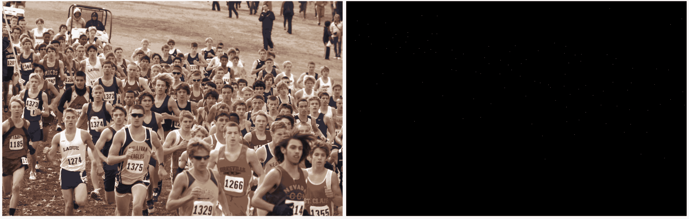

在前面的示例中，表示地面实况的图像(右边的图像–图像中出现的人的头部中心)非常稀疏。正好有 *N* 个白色像素，其中 *N* 是图像中的人数。让我们放大到图像的左上角，再次看到相同的地图:


在下一步中，我们将地面实况稀疏图像转换为密度图，该密度图表示图像中该区域的人数:

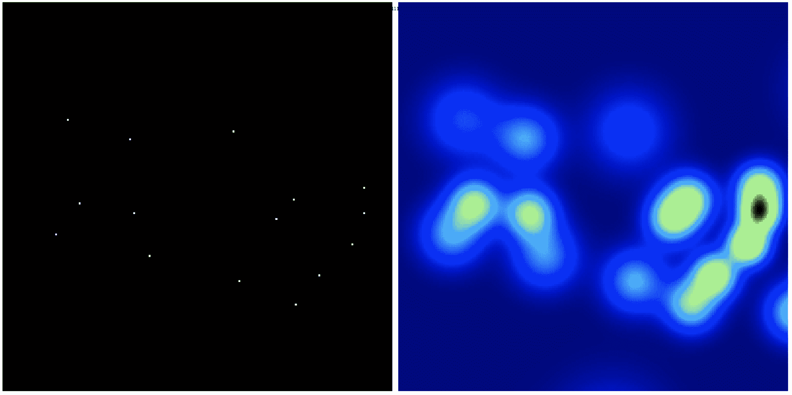

同一作物的最终输入输出对看起来像这样:

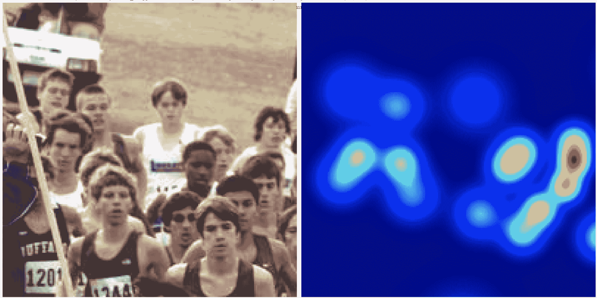

整个图像看起来也是如此:

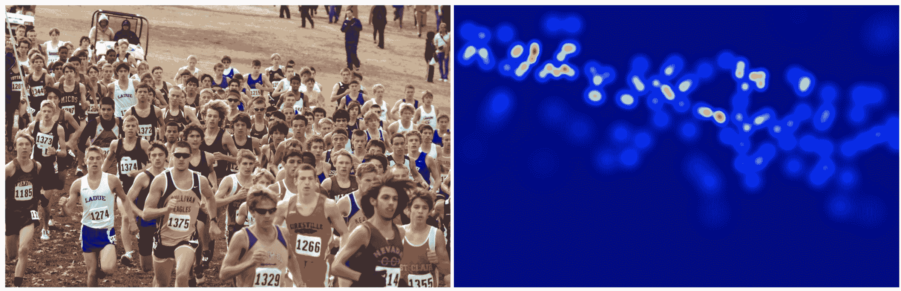

请注意，在前面的图像中，当两个人彼此靠近时，像素强度较高。然而，当一个人远离休息时，对应于该人的像素密度更均匀地散开，导致对应于远离休息的人的像素密度更低。本质上，热图是以这样一种方式生成的，即像素值的总和等于图像中出现的人数。

现在，我们已经能够接受输入图像和图像中人的头部中心的位置(图像被处理以获取地面实况输出热图)，我们将利用标题为 *CSRNet:用于理解高度拥堵场景的扩展卷积神经网络*的论文中详细描述的架构来预测图像中出现的人数。

模型架构([https://arxiv.org/pdf/1802.10062.pdf](https://arxiv.org/pdf/1802.10062.pdf))如下:


在模型架构的上述结构中，我们在首先将图像通过标准的 VGG-16 主干网之后，再将它通过四个额外的卷积层。该输出通过四种配置之一，并最终通过 1 x 1 x 1 卷积层。我们将使用 A 配置，因为它是最小的。

接下来，我们对输出图像执行**均方误差** ( **MSE** )损失最小化，以达到最佳权重值，同时使用 MAE 跟踪实际人群计数。

该架构的另一个细节是，作者使用了**扩展卷积**而不是普通卷积。

典型的扩张卷积如下(图像来源:[https://arxiv.org/pdf/1802.10062.pdf](https://arxiv.org/pdf/1802.10062.pdf)):


在前面的内容中，左边的图表代表了我们目前为止一直在做的一个典型的内核。第二个和第三个图表示扩展的内核，在各个像素之间有一个间隙。这样，内核就有了更大的感受野。一个大的感受野可以派上用场，因为我们需要了解一个给定的人附近的人数，以便估计对应于这个人的像素密度。我们使用一个膨胀的核(有九个参数)而不是普通的核(有 49 个参数，相当于三个核的膨胀率)来用更少的参数获取更多的信息。

了解了如何构建模型之后，让我们继续编写模型代码来执行下一节中的人群计数。(对于那些希望了解工作细节的人，我们建议你浏览这里的文件:[https://arxiv.org/pdf/1802.10062.pdf](https://arxiv.org/pdf/1802.10062.pdf)。我们将在下一节中培训的模型是受本文的启发。)

## 编码人群计数

我们将采用以下策略进行人群计数:

1.  导入相关的包和数据集。
2.  我们将要处理的数据集 ShanghaiTech 数据集——已经将人脸中心转换为基于高斯过滤器密度的分布，因此我们无需再次执行。使用网络映射输入图像和输出高斯密度图。

3.  定义一个函数来执行扩张卷积。
4.  定义网络模型，并对批量数据进行训练，以最小化 MSE。

让我们将我们的策略编码如下:

以下代码在本书的 GitHub 知识库的`Chapter 10`文件夹中以`crowd_counting.ipynb`的形式提供-【https://tinyurl.com/mcvp-packt 代码包含下载数据的 URL，长度适中。我们强烈建议您在 GitHub 中执行 notebook 以重现结果，同时理解执行的步骤和对文本中各种代码组件的解释。

1.  导入包并下载数据集:

```py
%%time
import os
if not os.path.exists('CSRNet-pytorch/'):
    !pip install -U scipy torch_snippets torch_summary
    !git clone https://github.com/sizhky/CSRNet-pytorch.git
    from google.colab import files
    files.upload() # upload kaggle.json
    !mkdir -p ~/.kaggle
    !mv kaggle.json ~/.kaggle/
    !ls ~/.kaggle
    !chmod 600 /root/.kaggle/kaggle.json
    print('downloading data...')
    !kaggle datasets download -d \
        tthien/shanghaitech-with-people-density-map/
    print('unzipping data...')
    !unzip -qq shanghaitech-with-people-density-map.zip

%cd CSRNet-pytorch
!ln -s ../shanghaitech_with_people_density_map
from torch_snippets import *
import h5py
from scipy import io
```

*   提供图像(`image_folder`)、地面实况(`gt_folder`)和热图文件夹(`heatmap_folder`)的位置:

```py
part_A = Glob('shanghaitech_with_people_density_map/\
ShanghaiTech/part_A/train_data/');

image_folder = 'shanghaitech_with_people_density_map/\
ShanghaiTech/part_A/train_data/img/'
heatmap_folder = 'shanghaitech_with_people_density_map/\
ShanghaiTech/part_A/train_data/ground-truth-h5/'
gt_folder = 'shanghaitech_with_people_density_map/\
ShanghaiTech/part_A/train_data/ground-truth/'
```

2.  定义训练和验证数据集以及数据加载器:

```py
device = 'cuda' if torch.cuda.is_available() else 'cpu'
tfm = T.Compose([
    T.ToTensor()
])

class Crowds(Dataset):
    def __init__(self, stems):
        self.stems = stems

    def __len__(self):
        return len(self.stems)

    def __getitem__(self, ix):
        _stem = self.stems[ix]
        image_path = f'{image_folder}/{_stem}.jpg'
        heatmap_path = f'{heatmap_folder}/{_stem}.h5'
        gt_path = f'{gt_folder}/GT_{_stem}.mat'

        pts = io.loadmat(gt_path)
        pts = len(pts['image_info'][0,0][0,0][0])

        image = read(image_path, 1)
        with h5py.File(heatmap_path, 'r') as hf:
            gt = hf['density'][:]
        gt = resize(gt, 1/8)*64
        return image.copy(), gt.copy(), pts

    def collate_fn(self, batch):
        ims, gts, pts = list(zip(*batch))
        ims = torch.cat([tfm(im)[None] for im in \
                            ims]).to(device)
        gts = torch.cat([tfm(gt)[None] for gt in \
                            gts]).to(device)
        return ims, gts, torch.tensor(pts).to(device)

    def choose(self):
        return self[randint(len(self))]

from sklearn.model_selection import train_test_split
trn_stems, val_stems = train_test_split(\
            stems(Glob(image_folder)), random_state=10)

trn_ds = Crowds(trn_stems)
val_ds = Crowds(val_stems)

trn_dl = DataLoader(trn_ds, batch_size=1, shuffle=True, \
                    collate_fn=trn_ds.collate_fn)
val_dl = DataLoader(val_ds, batch_size=1, shuffle=True, \
                    collate_fn=val_ds.collate_fn)
```

请注意，到目前为止，我们编写的典型数据集类的唯一附加内容是前面代码中以粗体显示的代码行。我们正在调整地面真实的大小，因为我们网络的输出将被缩小到原始大小的 1/8 ^(th) ，因此我们将地图乘以 64，以便图像像素的总和将被缩放回原始的人群计数。

3.  定义网络架构:

*   定义启用扩展卷积的函数(`make_layers`):

```py
import torch.nn as nn
import torch
from torchvision import models
from utils import save_net,load_net

def make_layers(cfg, in_channels = 3, batch_norm=False, 
                dilation = False):
    if dilation:
        d_rate = 2
    else:
        d_rate = 1
    layers = []
    for v in cfg:
        if v == 'M':
            layers += [nn.MaxPool2d(kernel_size=2, stride=2)]
        else:
            conv2d = nn.Conv2d(in_channels,v,kernel_size=3,\
                               padding=d_rate, dilation=d_rate)
            if batch_norm:
                layers += [conv2d, nn.BatchNorm2d(v), \
                           nn.ReLU(inplace=True)]
            else:
                layers += [conv2d, nn.ReLU(inplace=True)]
            in_channels = v
    return nn.Sequential(*layers)
```

*   定义网络架构-`CSRNet`:

```py
class CSRNet(nn.Module):
    def __init__(self, load_weights=False):
        super(CSRNet, self).__init__()
        self.seen = 0
        self.frontend_feat = [64, 64, 'M', 128, 128, 'M',256,
                                256, 256, 'M', 512, 512, 512]
        self.backend_feat = [512, 512, 512, 256, 128, 64]
        self.frontend = make_layers(self.frontend_feat)
        self.backend = make_layers(self.backend_feat,
                          in_channels = 512,dilation = True)
        self.output_layer = nn.Conv2d(64, 1, kernel_size=1)
        if not load_weights:
            mod = models.vgg16(pretrained = True)
            self._initialize_weights()
            items = list(self.frontend.state_dict().items())
            _items = list(mod.state_dict().items())
            for i in range(len(self.frontend.state_dict()\
                               .items())):
                items[i][1].data[:] = _items[i][1].data[:]
    def forward(self,x):
        x = self.frontend(x)
        x = self.backend(x)
        x = self.output_layer(x)
        return x
    def _initialize_weights(self):
        for m in self.modules():
            if isinstance(m, nn.Conv2d):
                nn.init.normal_(m.weight, std=0.01)
                if m.bias is not None:
                    nn.init.constant_(m.bias, 0)
            elif isinstance(m, nn.BatchNorm2d):
                nn.init.constant_(m.weight, 1)
                nn.init.constant_(m.bias, 0)
```

4.  定义对一批数据进行训练和验证的函数:

```py
def train_batch(model, data, optimizer, criterion):
    model.train()
    optimizer.zero_grad()
    ims, gts, pts = data
    _gts = model(ims)
    loss = criterion(_gts, gts)
    loss.backward()
    optimizer.step()
    pts_loss = nn.L1Loss()(_gts.sum(), gts.sum())
    return loss.item(), pts_loss.item()

@torch.no_grad()
def validate_batch(model, data, criterion):
    model.eval()
    ims, gts, pts = data
    _gts = model(ims)
    loss = criterion(_gts, gts)
    pts_loss = nn.L1Loss()(_gts.sum(), gts.sum())
    return loss.item(), pts_loss.item()
```

5.  在不断增加的时期内训练模型:

```py
model = CSRNet().to(device)
criterion = nn.MSELoss()
optimizer = optim.Adam(model.parameters(), lr=1e-6)
n_epochs = 20

log = Report(n_epochs)
for ex in range(n_epochs):
    N = len(trn_dl)
    for bx, data in enumerate(trn_dl):
        loss,pts_loss=train_batch(model, data, optimizer, \
                                        criterion)
        log.record(ex+(bx+1)/N, trn_loss=loss, 
                           trn_pts_loss=pts_loss, end='\r')

    N = len(val_dl)
    for bx, data in enumerate(val_dl):
        loss, pts_loss = validate_batch(model, data, \
                                        criterion)
        log.record(ex+(bx+1)/N, val_loss=loss, 
                    val_pts_loss=pts_loss, end='\r')

    log.report_avgs(ex+1)
    if ex == 10: optimizer = optim.Adam(model.parameters(), \
                                        lr=1e-7)
```

前面的代码导致了训练和验证损失的变化(这里，损失是群体计数的 MAE)，如下所示:

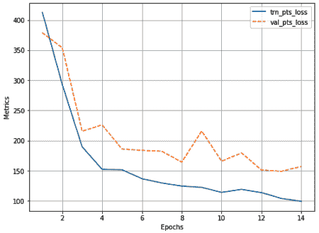

从前面的图中，我们可以看到我们的预测误差了大约 150 人。我们可以从以下两个方面改进该模型:

*   通过对原始图像的裁剪使用数据扩充和训练
*   通过使用更大的网络(我们使用 A 配置，而 B、C 和 D 更大)。

6.  对新图像进行推断:

*   获取测试图像并使其正常化:

```py
from matplotlib import cm as c
from torchvision import datasets, transforms
from PIL import Image
transform=transforms.Compose([
                 transforms.ToTensor(),transforms.Normalize(\
                          mean=[0.485, 0.456, 0.406],\
                          std=[0.229, 0.224, 0.225]),\
                  ])

test_folder = 'shanghaitech_with_people_density_map/\
ShanghaiTech/part_A/test_data/'
imgs = Glob(f'{test_folder}/images')
f = choose(imgs)
print(f)
img = transform(Image.open(f).convert('RGB')).to(device)
```

*   将图像传递给训练好的模型:

```py
output = model(img[None])
print("Predicted Count : ", int(output.detach().cpu()\
                                      .sum().numpy()))
temp = np.asarray(output.detach().cpu()\
                    .reshape(output.detach().cpu()\
                    .shape[2],output.detach()\
                    .cpu().shape[3]))
plt.imshow(temp,cmap = c.jet)
plt.show()
```

上述代码会生成输入图像(左图)的热图(右图):

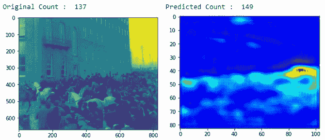

从前面的输出中，我们可以看到该模型相当准确地预测了热图，并且预测的人数接近实际值。

在下一节中，我们将利用 U-Net 架构来给图像着色。

# 图像彩色化

想象一个场景，给你一堆黑白图像，要求你把它们变成彩色图像。你会怎么解决这个问题？解决这个问题的一种方法是使用伪监督管道，我们获取原始图像，将其转换为黑白图像，并将它们视为输入输出对。我们将通过利用 CIFAR-10 数据集对图像执行彩色化来演示这一点。

当我们编码图像彩色化网络时，我们将采用的策略如下:

1.  获取训练数据集中的原始彩色图像，并将其转换为灰度，以获取输入(灰度)和输出(原始彩色图像)组合。
2.  标准化输入和输出。
3.  构建一个 U-Net 架构。
4.  在不断增加的时期内训练模型。

有了前面的策略，让我们继续编写模型代码，如下所示:

下面的代码可以在本书的 GitHub 库【https://tinyurl.com/mcvp-packt[的`Chapter 10`文件夹中找到`Image colorization.ipynb`](https://tinyurl.com/mcvp-packt)

1.  安装所需的软件包并导入它们:

```py
!pip install torch_snippets
from torch_snippets import *
device = 'cuda' if torch.cuda.is_available() else 'cpu'
```

2.  下载数据集并定义训练和验证数据集以及数据加载器:

*   下载数据集:

```py
from torchvision import datasets
import torch
data_folder = '~/cifar10/cifar/' 
datasets.CIFAR10(data_folder, download=True)
```

*   定义训练和验证数据集以及数据加载器:

```py
class Colorize(torchvision.datasets.CIFAR10):
    def __init__(self, root, train):
        super().__init__(root, train)

    def __getitem__(self, ix):
        im, _ = super().__getitem__(ix)
        bw = im.convert('L').convert('RGB')
        bw, im = np.array(bw)/255., np.array(im)/255.
        bw, im = [torch.tensor(i).permute(2,0,1)\
                  .to(device).float() for i in [bw,im]]
        return bw, im

trn_ds = Colorize('~/cifar10/cifar/', train=True)
val_ds = Colorize('~/cifar10/cifar/', train=False)

trn_dl = DataLoader(trn_ds, batch_size=256, shuffle=True)
val_dl = DataLoader(val_ds, batch_size=256, shuffle=False)
```

输入和输出图像的示例如下:

```py
a,b = trn_ds[0]
subplots([a,b], nc=2)
```

上述代码会产生以下输出:

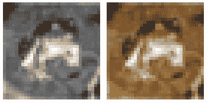

请注意，CIFAR-10 图像的形状为 32 x 32。

3.  定义网络架构:

```py
class Identity(nn.Module):
    def __init__(self):
        super().__init__()
    def forward(self, x):
        return x

class DownConv(nn.Module):
    def __init__(self, ni, no, maxpool=True):
        super().__init__()
        self.model = nn.Sequential(
            nn.MaxPool2d(2) if maxpool else Identity(),
            nn.Conv2d(ni, no, 3, padding=1),
            nn.BatchNorm2d(no),
            nn.LeakyReLU(0.2, inplace=True),
            nn.Conv2d(no, no, 3, padding=1),
            nn.BatchNorm2d(no),
            nn.LeakyReLU(0.2, inplace=True),
        )
    def forward(self, x):
        return self.model(x)

class UpConv(nn.Module):
    def __init__(self, ni, no, maxpool=True):
        super().__init__()
        self.convtranspose = nn.ConvTranspose2d(ni, no, \
                                                2, stride=2)
        self.convlayers = nn.Sequential(
            nn.Conv2d(no+no, no, 3, padding=1),
            nn.BatchNorm2d(no),
            nn.LeakyReLU(0.2, inplace=True),
            nn.Conv2d(no, no, 3, padding=1),
            nn.BatchNorm2d(no),
            nn.LeakyReLU(0.2, inplace=True),
        )

    def forward(self, x, y):
        x = self.convtranspose(x)
        x = torch.cat([x,y], axis=1)
        x = self.convlayers(x)
        return x

class UNet(nn.Module):
    def __init__(self):
        super().__init__()
        self.d1 = DownConv( 3, 64, maxpool=False)
        self.d2 = DownConv( 64, 128)
        self.d3 = DownConv( 128, 256)
        self.d4 = DownConv( 256, 512)
        self.d5 = DownConv( 512, 1024)
        self.u5 = UpConv (1024, 512)
        self.u4 = UpConv ( 512, 256)
        self.u3 = UpConv ( 256, 128)
        self.u2 = UpConv ( 128, 64)
        self.u1 = nn.Conv2d(64, 3, kernel_size=1, stride=1)

    def forward(self, x):
        x0 = self.d1( x) # 32
        x1 = self.d2(x0) # 16
        x2 = self.d3(x1) # 8
        x3 = self.d4(x2) # 4
        x4 = self.d5(x3) # 2
        X4 = self.u5(x4, x3)# 4
        X3 = self.u4(X4, x2)# 8
        X2 = self.u3(X3, x1)# 16
        X1 = self.u2(X2, x0)# 32
        X0 = self.u1(X1) # 3
        return X0
```

4.  定义模型、优化器和损失函数:

```py
def get_model():
    model = UNet().to(device)
    optimizer = optim.Adam(model.parameters(), lr=1e-3)
    loss_fn = nn.MSELoss()
    return model, optimizer, loss_fn
```

5.  定义对一批数据进行训练和验证的函数:

```py
def train_batch(model, data, optimizer, criterion):
    model.train()
    x, y = data
    _y = model(x)
    optimizer.zero_grad()
    loss = criterion(_y, y)
    loss.backward()
    optimizer.step()
    return loss.item()

@torch.no_grad()
def validate_batch(model, data, criterion):
    model.eval()
    x, y = data
    _y = model(x)
    loss = criterion(_y, y)
    return loss.item()
```

6.  在不断增加的时期内训练模型:

```py
model, optimizer, criterion = get_model()
exp_lr_scheduler = optim.lr_scheduler.StepLR(optimizer, \
                                    step_size=10, gamma=0.1)

_val_dl = DataLoader(val_ds, batch_size=1, shuffle=True)

n_epochs = 100
log = Report(n_epochs)
for ex in range(n_epochs):
    N = len(trn_dl)
    for bx, data in enumerate(trn_dl):
        loss = train_batch(model, data, optimizer, criterion)
        log.record(ex+(bx+1)/N, trn_loss=loss, end='\r')
        if (bx+1)%50 == 0:
            for _ in range(5):
                a,b = next(iter(_val_dl))
                _b = model(a)
                subplots([a[0], b[0], _b[0]], nc=3, \
                          figsize=(5,5))

    N = len(val_dl)
    for bx, data in enumerate(val_dl):
        loss = validate_batch(model, data, criterion)
        log.record(ex+(bx+1)/N, val_loss=loss, end='\r')

    exp_lr_scheduler.step()
    if (ex+1) % 5 == 0: log.report_avgs(ex+1)

    for _ in range(5):
        a,b = next(iter(_val_dl))
        _b = model(a)
        subplots([a[0], b[0], _b[0]], nc=3, figsize=(5,5))

log.plot_epochs()
```

上述代码生成如下输出:


从前面的输出中，我们可以看到该模型能够很好地为灰度图像着色。

到目前为止，我们已经了解了如何利用 Detectron2 进行分割和关键点检测、人群计数中的膨胀卷积以及图像着色中的 U-Net。在下一部分，我们将了解如何利用 YOLO 进行 3D 目标检测。

# 基于点云的三维目标检测

到目前为止，我们已经学习了如何使用具有锚定框核心基本概念的算法来预测 2D 图像上的边界矩形。我们现在将学习如何将相同的概念扩展到预测物体周围的 3D 边界框。

在自动驾驶汽车中，如果不了解环境，行人/障碍物检测和路线规划等任务就无法完成。预测 3D 对象的位置及其方向成为一项重要的任务。障碍物周围的 2D 边界框不仅重要，而且知道障碍物与对象的距离、高度、宽度和方向对于在 3D 世界中安全导航也至关重要。

在本节中，我们将了解如何使用 YOLO 来预测现实数据集上汽车和行人的 3D 方向和位置。

下载数据、训练和测试集的说明都在这个 GitHub repo 中给出:[https://GitHub . com/sizhky/Complex-yolov 4-py torch/blob/master/readme . MD # training-instructions](https://github.com/sizhky/Complex-YOLOv4-Pytorch/blob/master/README.md#training-instructions)。鉴于很少有公开可用的 3D 数据集，我们选择了最常用的数据集来做这个练习，您仍然需要注册下载。我们也在前面的链接中提供了注册说明。

## 理论

收集实时 3D 数据的一个众所周知的传感器是**激光雷达** ( **光探测和测距**)。它是一个安装在旋转装置上的激光器，每秒钟发射数百次激光束。另一个传感器接收来自周围物体的激光反射，并计算激光在遇到障碍物之前已经行进了多远。在汽车的所有方向上这样做将产生反映环境本身的距离的 3D 点云。在我们将要学习的数据集中，我们已经从称为`velodyne`的特定硬件获得了 3D 点云。让我们了解如何为 3D 目标检测编码输入和输出。

### 输入编码

我们的原始输入将是以`.bin`文件的形式呈现给我们的 3D 点云。每一个都可以使用`np.fromfile(<filepath>)`作为 NumPy 数组加载，下面是样本文件的数据外观(按照 GitHub repo 指令下载并移动原始文件后，这些文件位于`dataset/.../training/velodyne`目录中):

```py
files = Glob('training/velodyne')
F = choose(files)
pts = np.fromfile(F, dtype=np.float32).reshape(-1, 4)
pts
```

上述代码给出了以下输出:


这可以想象如下:

```py
# take the points and remove faraway points
x,y,z = np.clip(pts[:,0], 0, 50), 
        np.clip(pts[:,1], -25, 25), 
        np.clip(pts[:,2],-3, 1.27)

fig = go.Figure(data=[go.Scatter3d(\
        x=x, y=y, z=z, mode='markers',
        marker=dict(
            size=2,
            color=z, # set color to a list of desired values
            colorscale='Viridis', # choose a colorscale
            opacity=0.8
        )
    )])

fig.update_layout(margin=dict(l=0, r=0, b=0, t=0))
fig.show()
```

上述代码会产生以下输出:


通过执行以下步骤，我们可以将这些信息转换成鸟瞰图。

1.  将 3D 点云投影到 *XY* 平面(地面)上，分割成一个网格，每个网格单元的分辨率为 8 cm ² 。
2.  对于每个单元格，计算以下内容，并将它们与指定的通道相关联:

*   红色通道:网格中最高点的高度
*   绿色通道:网格中最高点的亮度
*   蓝色通道:网格中的点数除以 64(这是一个归一化因子)

例如，重建的云的俯视图可能如下所示:


可以清楚地看到图像中的“阴影”，表示有障碍物。

这就是我们如何从激光雷达点云数据创建图像。

我们将 3D 点云作为原始输入，并获得鸟瞰图像作为输出。这是创建图像所必需的预处理步骤，该图像将作为 YOLO 模型的输入。

### 输出编码

现在我们已经将鸟瞰图像(3D 点云的)作为模型的输入，模型需要预测以下真实世界的特征:

*   图像中出现的对象(**类**)是什么
*   物体在东西轴( **x** )上离汽车有多远(以米为单位)
*   物体在南北轴( **y** )上离汽车有多远(以米为单位)
*   物体的方位(**)**是什么****
*****   物体有多大(物体的**长度**和**宽度**，单位为米)****

 ****可以预测(鸟瞰图像的)像素坐标系中的边界框。但是它没有任何现实意义，因为预测仍然在像素空间中(在鸟瞰图中)。在这种情况下，我们需要将这些像素坐标(鸟瞰图的)边界框预测转换为以米为单位的真实坐标。为了避免后处理过程中的额外步骤，我们直接预测真实值。

此外，在现实场景中，对象可以朝向任何方向。如果我们只计算长度和宽度，将不足以描述紧密包围盒。这种情况的一个例子如下:

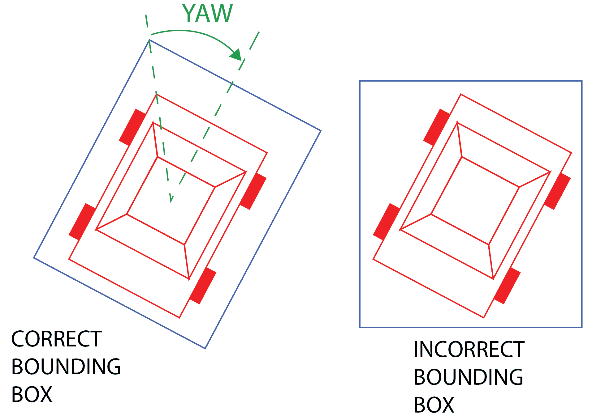

为了得到物体的紧密包围盒，我们还需要障碍物朝向哪个方向的信息，因此我们还需要额外的偏航参数。从形式上来说，它是具有南北轴的物体所做的定向。

首先，考虑到汽车的 dashcam(以及激光雷达)视图的宽度大于高度，YOLO 模型使用了 32 x 64 单元的锚定网格(宽度大于高度)。该模型对任务使用了两个损失。第一个是正常的 YOLO 损失(它负责预测我们在[第 8 章](028d9c3a-56be-4695-9c2e-250d8329ca84.xhtml)、*高级物体探测*中了解到的 *x* 、 *y* 、 *l* 和 *w* 类)，另一个损失称为欧拉损失，它专门预测偏航。形式上，从模型输出预测最终边界框的方程组如下:

b[x]=σ(**t[x]T5)+c[x
b[y]=σ(**t[y]**)+c[y] b[w]= p[w]e^(**t**[**w**])]**

 **这里，*b[x]T3、*b[y]T7、*b[w]T11、 *b [l]* 、 *b [φ]* 分别是障碍物的 *x* 和 *z* 坐标值、宽度、长度和偏航。
*t [x]* ， *t [y]* ， *t [w]* ， *t [l]* ， *t [Im]* ，*t*[*Re*]是预测的六个回归值
*c [x]* 和 *c [y]* 是 32×64 矩阵中网格单元的中心位置，而 *p [w]* 和 *p [l]* 是通过取汽车和行人的平均宽度和长度选择的预定义先验。此外，在实现中有五个先验(锚盒)。***

同一类的每个对象的高度被假定为一个固定的数字。

参考这里给出的插图，它以图片的形式展示了这一点(图片来源:[https://arxiv.org/pdf/1803.06199.pdf](https://arxiv.org/pdf/1803.06199.pdf)):


总损失计算如下:

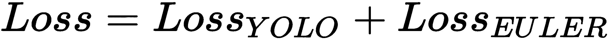

你已经从上一章知道了*损失 [YOLO]* (使用*t[x]T7、 *t* *[y]* 、 *t* *[w]* 、 *t* [*l*] 作为目标)。另外，请注意以下事项:*

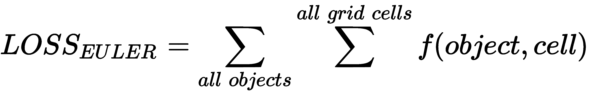

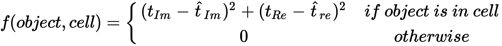

现在我们已经了解了 3D 目标检测的基本原理如何与 2D 目标检测的基本原理保持相同(但是有更多的参数要预测)以及该任务的输入输出对，让我们利用现有的 GitHub repo 来训练我们的模型。

关于 3D 目标检测的更多细节，请参考在 https://arxiv.org/pdf/1803.06199.pdf[的论文*复合体-YOLO* 。](https://arxiv.org/pdf/1803.06199.pdf)

## 训练用于 3D 目标检测的 YOLO 模型

由于标准化的代码，编码工作在很大程度上远离了用户。很像 Detectron2，我们可以通过确保数据在正确的位置以正确的格式来训练和测试算法。一旦确保了这一点，我们就可以用最少的代码行来训练和测试代码。

我们需要首先克隆`Complex-YOLOv4-Pytorch`存储库:

```py
$ git clone https://github.com/sizhky/Complex-YOLOv4-Pytorch
```

按照`README.md`文件中的说明下载数据集并将其移动到正确的位置。

The instructions for downloading the data, training, and testing sets are all given in this GitHub repo: [https://github.com/sizhky/Complex-YOLOv4-Pytorch/blob/master/README.md#training-instructions](https://github.com/sizhky/Complex-YOLOv4-Pytorch/blob/master/README.md#training-instructions).

Given that there are very few openly available 3D datasets, we have chosen the most-used dataset for this exercise, which you still need to register for download. We also give the instructions for registration in the preceding link.

### 数据格式

在这个练习中，我们可以使用任何带有地面实况的 3D 点云数据。有关如何下载和移动数据的更多说明，请参考 GitHub repo 上的`README`文件。数据需要以下列格式存储在根目录中:


三个对我们来说是新的文件夹是`velodyne`、`calib`和`label_2`:

*   `velodyne`包含一个`.bin`文件列表，这些文件对存在于`image_2`文件夹中的相应图像的 3D 点云信息进行编码。

*   `calib`包含每个点云对应的校准文件。通过使用`calib`文件夹中每个文件中的 3 x 4 投影矩阵，可以将激光雷达点云坐标系中的 3D 坐标投影到相机坐标系上，即图像上。实际上，激光雷达传感器捕捉的点与相机捕捉的点略有偏差。这种偏移是由于两个传感器彼此相隔几英寸安装。了解正确的偏移量将有助于我们正确地将边界框和 3D 点投影到来自相机的图像上。
*   `label_2`包含每幅图像的基本事实(每行一个基本事实),以 15 个值的形式，如下表所述:

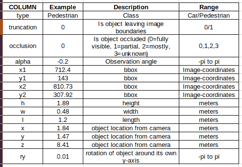

请注意，我们的目标列是这里看到的类型(class)、 *w* 、 *l* 、 *x* 、 *z* 和 *ry* (偏航)。我们将忽略该任务的其余值。

### 数据检查

我们可以通过运行以下命令来验证数据是否正确下载:

```py
$ cd Complex-YOLOv4-Pytorch/src/data_process
$ python kitti_dataloader.py --output-width 600
```

前面的代码显示了多个图像，一次一个图像。下面就是这样一个例子(图片来源:[https://arxiv.org/pdf/1803.06199.pdf](https://arxiv.org/pdf/1803.06199.pdf)):

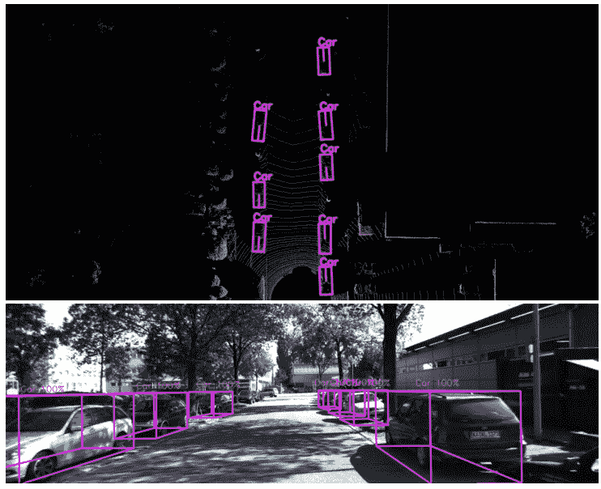

既然我们已经能够下载并查看一些图像，在下一节中，我们将学习如何训练模型来预测 3D 边界框。

### 培养

训练代码封装在单个 Python 文件中，可以按如下方式调用:

```py
$ cd Complex-YOLOv4-Pytorch/src
$ python train.py --gpu_idx 0 --batch_size 2 --num_workers 4 \
                  --num_epochs 5
```

默认的历元数是 300，但是从第五个历元开始，结果是相当合理的。在 GTX 1070 GPU 上，每个历元需要 30 到 45 分钟。如果无法一次性完成训练，您可以使用`--resume_path`恢复训练。代码每五个时期保存一个新的检查点。

### 测试

就像在*数据检查*部分一样，可以用下面的代码测试训练好的模型:

```py
$ cd Complex-YOLOv4-Pytorch/src
$ python test.py --gpu_idx 0 --pretrained_path ../checkpoints/complexer_yolo/Model_complexer_yolo_epoch_5.pth --cfgfile ./config/cfg/complex_yolov4.cfg --show_image 
```

代码的主要输入是检查点路径和模型配置路径。给出它们并运行代码后，弹出如下输出(图片来源:[https://arxiv.org/pdf/1803.06199.pdf](https://arxiv.org/pdf/1803.06199.pdf)):

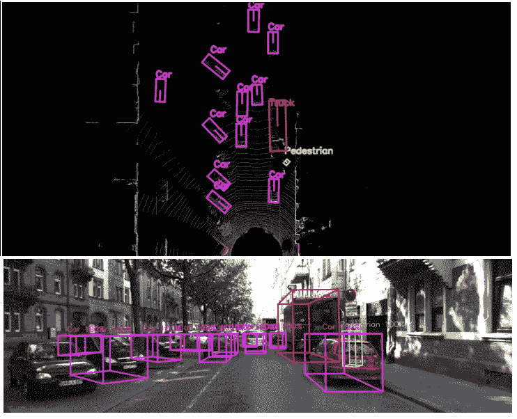

由于模型的简单性，我们可以使用普通 GPU 在实时场景中使用它，每秒钟可以获得大约 15-20 次预测。

# 摘要

在这一章中，我们学习了处理对象定位和分割的各种实际方面。具体来说，我们了解了如何利用 Detectron2 平台来执行图像分割和检测以及关键点检测。此外，当我们从开放图像数据集中获取图像时，我们还了解了处理大型数据集所涉及的一些复杂性。接下来，我们致力于利用 VGG 和 U-Net 架构分别进行人群计数和图像着色。最后，我们了解了使用点云图像进行三维目标检测的理论和实现步骤。正如您从所有这些示例中看到的，底层基础与前面章节中描述的相同，只是在网络的输入/输出方面进行了修改，以适应手头的任务。

在下一章中，我们将转换话题，学习图像编码，这有助于识别相似的图像以及生成新的图像。******