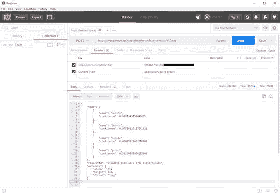
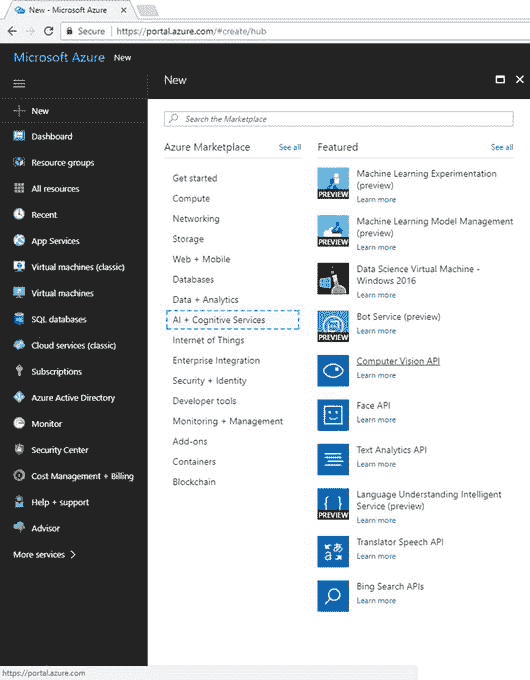
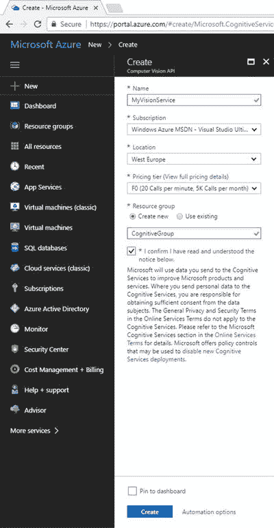
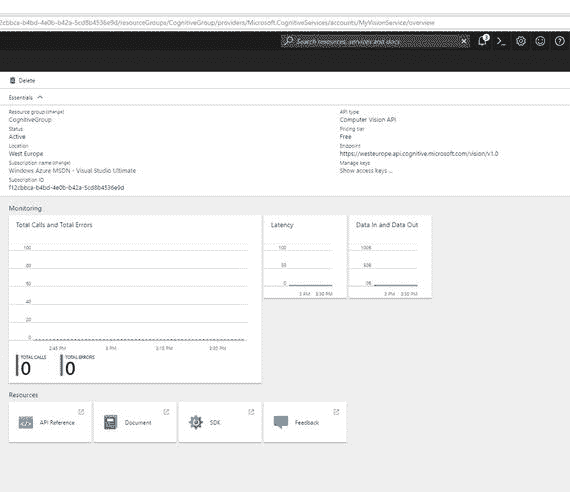
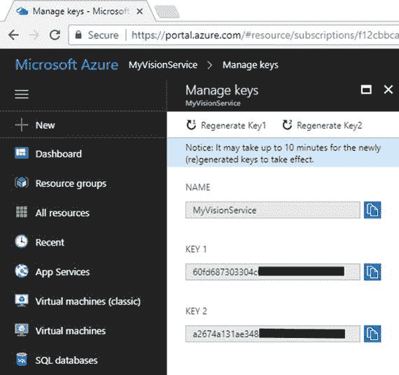

# 二、计算机视觉 API 入门

想象一下，你想开发一些应用来帮助残疾人理解他们周围的事情，并代表他们阅读报纸。

现在想象一下，你想开发一些应用，帮助孩子们从图片中了解世界，确保成人内容被排除在外。然后，假设你想开发一些应用，通过提供描述图像的自然语言句子来帮助人们学习外语。最后，假设您在一个警察部门工作，想要构建一个自定义解决方案来帮助您的部门基于图像识别罪犯。

这些只是人工智能如何帮助解决许多问题的几个例子，但它们足以让你理解计算机视觉 API 的目的。结合其他认知服务 API，你有无限的机会。本章首先描述了计算机视觉 API 的工作原理，然后描述了如何配置您的 Azure 订阅并公开一个可由任何应用使用的计算机视觉 API 端点。

## 了解计算机视觉 API

和其他认知服务一样，计算机视觉 API 也有自己的门户；可以在 [`http://azure.microsoft.com/en-us/services/cognitive-services/computer-vision/`](http://azure.microsoft.com/en-us/services/cognitive-services/computer-vision/) 到达。在这里你可以找到文档和例子的快捷方式，但是我想把重点放在 [`http://bit.ly/2sBtryy`](http://bit.ly/2sBtryy) 可用的 API 参考上。当您打开此页面时，您将看到可以对图像执行的可用操作列表。

从技术上讲，使用 Computer Vision API，您可以通过上传图像或指向现有的图像 URL 并根据您想要对图像执行的分析类型发送 GET 和 POST HTTP 请求来调用 RESTful 服务。

计算机视觉服务将返回一个包含分析结果的 JSON 响应。服务 URL 因您最近的地区而异，需要一个有效的 Azure 订阅来激活您将在 HTTP 请求中使用的密钥。您将在下一部分配置您的 Azure 订阅；现在，请关注您可以对图像及其相应的 HTTP 请求执行的可用分析类型，如表 [2-1](#Tab1) 中所述。

表 2-1。

Available Analysis Types with the Computer Vision API

<colgroup><col> <col> <col> <col></colgroup> 
| 类型 | 描述 | HTTP 动词 | 端点 |
| --- | --- | --- | --- |
| 分析图像 | 分析图像的成人和种族内容、人脸检测、标签和主色 | 邮政 | `https://[location].api.cognitive.microsoft.com/vision/v1.0/analyze[?visualFeatures][&details][&language]` |
| 描述图像 | 用人类可读的语言和完整的句子生成图像描述 | 邮政 | `https://[location].api.cognitive.microsoft.com/vision/v1.0/describe[?maxCandidates]` |
| 获取缩略图 | 从指定的图像生成缩略图 | 邮政 | `https://[location].api.cognitive.microsoft.com/vision/v1.0/generateThumbnail[?width][&height][&smartCropping` |
| 列出特定领域的模型 | 获取当前支持的特定于域的模型的列表，如名人和地标识别器 | 得到 | `https://[location].api.cognitive.microsoft.com/vision/v1.0/models` |
| 光学字符识别 | 对图像执行光学字符识别，并将检测到的文本存储为机器可用的字符 | 邮政 | `https://[location].api.cognitive.microsoft.com/vision/v1.0/ocr[?language][&detectOrientation ]` |
| 识别特定领域的内容 | 分析图片以检索特定领域的内容，如名人或地标 | 邮政 | `https://[location].api.cognitive.microsoft.com/vision/v1.0/models/{model}/analyze` |
| 识别手写文本 | 执行手写文本识别 | 邮政 | `https://[location].api.cognitive.microsoft.com/vision/v1.0/recognizeText[?handwriting` `]` |
| 标签图像 | 生成与指定图像内容相关的单词列表 | 邮政 | `https://[location].api.cognitive.microsoft.com/vision/v1.0/tag` |

在 [2-1](#Tab1) 中列出的每个操作都作为一个特定的端点被调用。每次您想要调用计算机视觉服务时，您都需要将 URL 中的[ `location].api.cognitive.microsoft.com`文字替换为以下文字之一，具体取决于最近的 Azure 区域:

*   `westus.api.cognitive.microsoft.com`美国西部地区
*   `westus2.api.cognitive.microsoft.com`针对美国西部 2 个地区
*   `eastus.api.cognitive.microsoft.com`针对美国东部地区
*   `eastus2.api.cognitive.microsoft.com`针对美国东部 2 个地区
*   `westcentralus.api.cognitive.microsoft.com`美国中西部地区
*   `southcentralus.api.cognitive.microsoft.com`美国中南部地区
*   `westeurope.api.cognitive.microsoft.com`西欧地区
*   `northeurope.api.cognitive.microsoft.com`针对北欧地区
*   `southeastasia.api.cognitive.microsoft.com`针对东南亚地区
*   `eastasia.api.cognitive.microsoft.com`针对东亚地区
*   `australiaeast.api.cognitive.microsoft.com`澳大利亚东部地区
*   `brazilsouth.api.cognitive.microsoft.com`巴西南部地区

如果地区数量增加或重组，可用 URL 的列表将来可能会有所不同。你可以查看 Azure regions ( [`http://azure.microsoft.com/en-us/regions/`](http://azure.microsoft.com/en-us/regions/) )的完整列表，但请记住，并非所有微软产品在所有地区都可用，认知服务也是如此。

### 执行 HTTP 请求

一般来说，要使用 [2-1](#Tab1) 中列出的操作之一来分析图像，您需要向相关端点发送一个 HTTP 请求。例如，假设您想要生成一个与图像内容相关的标签列表。您将使用以下端点(用 Azure 区域的域名替换`[location]`):

`https://[location].api.cognitive.microsoft.com/vision/v1.0/tag`

每个请求将包含以下标题:

*   `Content-Type`，可选字符串，描述发送给 API 的主体的媒体类型，如`application/JSON`或`application/octet-stream`
*   `Ocp-Apim-Subscription-Key`，包含有效订阅密钥的强制字符串，提供对 API 的访问，您将通过 Azure 门户获得

请求体通常与 POST 请求一起传递，可以是原始图像二进制文件，也可以是通过 JSON 语法提供的图像 URL。例如，如果您想要传递现有图像的 URL，您的请求主体将如下所示:

```py
{"url":"http://onewebsite.com/image1.jpg"}

```

此正文的 MIME 类型是`application/JSON`。在现实世界的开发中，您将使用允许通过网络进行数据交换的类，如 C#和 Java 中的`HttpClient`,或 web 调试应用(如 Postman)来发送您的请求，因此您将无需担心如何手动创建头和请求体。例如，你可以用 Postman 发送一个请求，并期待一个 JSON 响应，如图 [2-1](#Fig1) 所示，其中你还可以看到在哪里以及如何提供内容类型和订阅密钥(出于隐私原因，后者被部分混淆)。



图 2-1。

Sending an HTTP request to the Computer Vision API with Postman

在这个特殊的例子中，您将得到一个 JSON 响应，其中包含一个标记数组，每个标记都有一个名称和置信度百分比。您还可以获得额外的信息，比如请求的惟一标识符和图像大小。计算机视觉 API 提供的其他操作可以以类似的方式调用，更改端点并提供所需的参数。

无论您是使用像 Postman 这样的调试工具，还是使用您喜欢的编程语言中的专用类，您都需要提供前面描述的信息。在下一章中，你将看到如何用`HttpClient`类执行 C#中所有可用的操作，以及如何用代码解析 JSON 响应。在此期间，您可以尝试计算机视觉 API 门户中包含的 API 测试控制台(在 [`http://bit.ly/2sBtryy`](http://bit.ly/2sBtryy) 可用)。为此，在左侧选择一个操作，然后单击“打开 API 测试控制台”框附近代表您的 Azure 区域的按钮。此时，将会出现一系列文本框，您将会看到如何填写这些文本框并向服务创建 POST 请求的指导。如果操作成功，您将能够看到 JSON 响应，如果操作失败，您将看到一条错误消息。

### 处理 HTTP 响应

像任何其他 RESTful 服务一样，Computer Vision 返回一个 HTTP 代码和一个描述，允许您了解操作是否成功以及原因。表 [2-2](#Tab2) 总结了使用计算机视觉时最常见的 HTTP 状态代码。

表 2-2。

Computer Vision Status Codes

<colgroup><col> <col></colgroup> 
| HTTP 状态代码 | 描述 |
| --- | --- |
| 200(成功) | 请求的操作成功完成，分析结果作为 JSON 返回。 |
| 400(错误请求) | 请求的操作失败，出现以下一个不言自明的错误:`InvalidImageUrl`、`InvalidImageFormat`、`InvalidImageSize`、`NotSupportedImage`。 |
| 415(不支持的媒体类型) | 请求的操作失败，因为提供的`Content-Type`标题与图像内容不匹配。 |
| 500(内部服务器错误) | 请求的操作失败，出现以下一个不言自明的错误:`FailedToProcess`、`Timeout`、`InternalServerError`。 |
| 401(未经授权) | 无法执行请求的操作，因为提供了无效的订阅密钥。 |

值得一提的是，如果您提供的图像不满足这些最低要求，您可能会收到错误 400(错误请求):

*   图像必须是 PNG、JPG、BMP 或 GIF。
*   图像必须大于 50 × 50。
*   文件大小必须小于 4Mb。

因此，作为最佳实践，请确保您的应用在请求计算机视觉分析操作之前检查图像是否满足最低要求。

## 配置您的 Azure 订阅

在尝试计算机视觉 API 之前，您需要在 Microsoft Azure 管理门户中激活订阅密钥。假设您已经拥有一个有效的 Azure 订阅，您可以通过 [`http://portal.azure.com`](http://portal.azure.com/) 登录门户。

登录后，点击新建，然后点击 AI +认知服务(见图 [2-2](#Fig2) )，最后点击计算机视觉 API。



图 2-2。

Creating a new Computer Vision API subscription

此时，您需要为新的 Computer Vision API 服务指定名称、位置、定价层和资源组。您可以输入自己选择的名称，或者像当前示例中一样输入 MyVisionService，如图 [2-3](#Fig3) 所示。请注意，作为位置，您需要选择离您最近的 Azure 区域。对于定价层，我建议您使用免费的 F0 计划(单击“查看完整定价详情”了解更多信息)。对于资源组，您可以创建一个新组或选择一个现有组。在当前示例中，为了方便起见，我创建了一个新的资源组。如果你是 Azure 的新手，值得一提的是，顾名思义，资源组是一组云资源，可以包括服务、应用、移动后端、SQL 数据库、AI 服务等等。您基本上使用资源组来组织您的云资源。



图 2-3。

Supplying information for the new Computer Vision API

单击“创建”时，将提供服务。在图 [2-4](#Fig4) 中，您可以看到一个名为“显示访问密钥”的快捷方式，您需要单击它来生成订阅密钥，这是访问计算机视觉 API 所必需的。



图 2-4。

The service details and the “Show access keys” shortcut

当您点按“显示访问密钥”时，您将看到两个自动生成的密钥。您将能够在您的 HTTP 请求中交替使用它们，并且您可以使用工具栏中的重新生成 Key1 和重新生成 Key2 按钮来重新生成这些密钥(参见图 [2-5](#Fig5) )。



图 2-5。

Displaying access keys

您可以将这些密钥复制到剪贴板，供以后重复使用。显然，这些包括敏感信息，所以你应该始终保持他们的安全。使用计算机视觉 API 不需要任何其他配置，因为您将简单地调用服务 URL，传递订阅密钥。

## 摘要

计算机视觉 API 允许您对图像执行许多分析操作。为了实现这一点，您调用一个端点，该端点的 URL 根据您想要使用的 Azure 区域而变化。一般来说，创建一个 HTTP 请求，其头部包含订阅密钥和内容类型，而主体包含要分析的图像，可以是 URL 或二进制数据。

无论您请求的操作是什么，如果操作成功，您都会收到一个包含分析结果的 JSON 响应。如果失败，服务将返回适当的 HTTP 状态代码和描述。调用计算机视觉 API 所需的订阅密钥可以在 Azure 管理门户中生成，在那里您可以获得两个密钥，您可以将其复制到剪贴板或随时重新生成。在下一章中，您将开始用 C#对 Computer Vision API 服务执行真正的 HTTP 请求，执行所有可用的分析操作，并学习如何解析和解释 JSON 结果。