# 五、基于 ASP.NET MVC 核心的 Web 应用中的计算机视觉

正如你在第 [4](4.html) 章中看到的，将人工智能引入移动应用非常有趣，原因有很多，不仅是从你作为开发人员所拥有的机会的角度来看，还因为你让用户能够用他们口袋里的设备做更多的事情。

然而，像在其他开发场景中一样，您永远不应该忘记在办公室工作站或家庭办公室中使用 PC 工作的人。例如，想象一下医疗保健行业的人工智能如何帮助医生识别患者的症状或情绪，并生成适当的报告。这可以通过移动设备来完成，但医生可能会在办公桌前的电脑上工作，环境可能是一个私有的内部网，带有可以连接到网络摄像头的自定义 web 应用。

因为认知服务可以由任何平台上的任何应用使用，所以它们也可以在 ASP.NET web 应用中使用。我说的 ASP.NET，是指场上的 ASP.NET MVC。NET 框架，ASP.NET MVC 核心上。NET 核心和 Web API 服务。NET 框架和。网芯。在本章中，我将演示如何在 Windows、macOS 和 Ubuntu 上的 ASP.NET MVC 核心应用中使用计算机视觉 API。请记住，同样的概念也适用于 ASP.NET。NET 框架。本章的重点不是解释 ASP.NET MVC 核心，所以你可以看看官方文档( [`http://docs.microsoft.com/en-us/aspnet/core`](http://docs.microsoft.com/en-us/aspnet/core) )了解更多细节。

Note

本章假设您已经使用 Visual Studio 2017、Visual Studio for Mac 或 Visual Studio 代码配置了开发环境，具体取决于您的操作系统。查看第 [3](3.html) 章，了解关于配置开发环境的更多信息。

## 创建 ASP.NET MVC 核心应用

ASP.NET MVC 核心是一个轻量级的、开源的、跨平台的框架，它允许你使用 C#和。NET 核心运行时。如果你有 ASP.NET MVC 的经验。NET 框架，你会熟悉它的。净核心对应方。本章的目的是解释如何创建一个将图像文件上传到计算机视觉 API 的 web 应用，并在网页上显示分析结果。

我先解释一下如何在第 [3](3.html) 章介绍的三个操作系统上生成一个新的 ASP.NET MVC 核心应用；然后我将解释可以用来发送图像进行分析、解析和显示响应的 C#代码。

### 使用 Visual Studio 2017 创建 Web 应用

在 Visual Studio 2017 中，选择文件➤新➤项目。在“新建项目”对话框中，找到。网芯类。然后选择 ASP.NET 核心 Web 应用模板，如图 [5-1](#Fig1) 所示。调用新项目 WebComputerVision，然后单击确定。

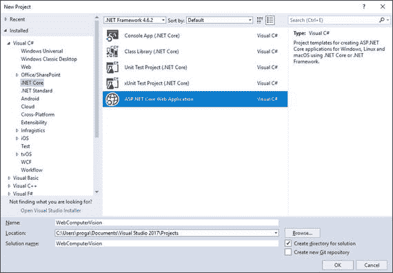

图 5-1。

The project template for an ASP.NET Core web application

在下一个对话框中，将要求您指定想要创建哪种应用。选择 Web 应用(模型-视图-控制器)模板(见图 [5-2](#Fig2) )然后点击确定。

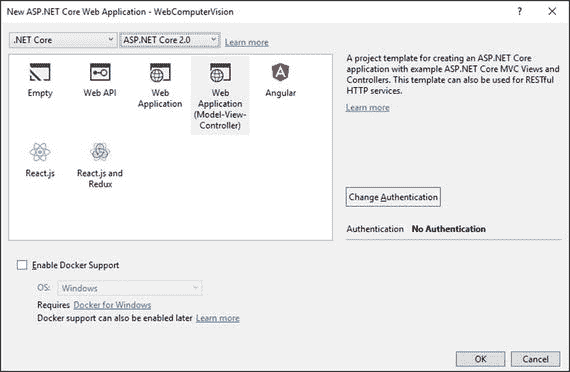

图 5-2。

Creating an MVC project Note

注意如何配置身份验证机制，以及如何支持将应用打包到 Docker 容器中。关于身份验证，您可以选择个人身份验证(用户名和密码)、Office 365 身份验证、intranets 的 Windows 身份验证和匿名身份验证(默认)。这是一个不错的选择，因为 Visual Studio 将生成必要的基础结构来支持身份验证。

创建项目后，下一步是添加一个新的网页，该网页将用于显示上传图像和显示分析结果所需的控件。为了简单起见，这个页面可以添加到`Views\Home`文件夹中。因此，在解决方案资源管理器中右击该文件夹，然后选择“添加➤新项”。在添加新项对话框中，选择 MVC 视图页面项，如图 [5-3](#Fig3) 所示。

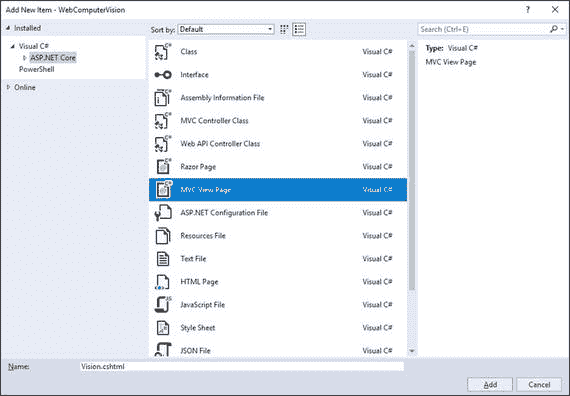

图 5-3。

Adding an MVC page

确保页面名称为`Vision.cshtml`，然后点击添加。为了避免额外的复杂性，在这种情况下，不需要添加专用的控制器类；将使用`HomeController`类。这将在后面演示。现在，让我们继续通过安装 Newtonsoft 来配置项目。Json NuGet 包。正如你在第 3 章[中所做的，在解决方案浏览器中右击项目名称，然后选择管理 NuGet 包。当 NuGet 窗口出现时，搜索 Newtonsoft。Json 包，然后单击 Install。这个包将用于反序列化和解析由计算机视觉服务返回的 JSON 响应。](3.html)

### 用 Visual Studio for Mac 创建 Web 应用

在 Visual Studio for Mac 中，选择文件➤新解决方案。在“新建项目”对话框中，在下找到 ASP.NET 核心 Web App 项目模板。NET Core ➤ App，如图 [5-4](#Fig4) 所示。准备就绪后，单击下一步。

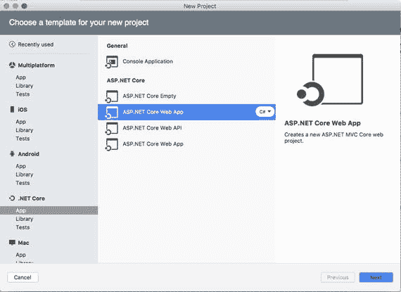

图 5-4。

Creating a new ASP.NET MVC Core project in Visual Studio for Mac Note

如果看到两个 ASP.NET 核心 Web App 模板，选择列表中的第一个，如图 [5-4](#Fig4) 所示。第二个项目模板基于 Razor 视图生成一个 web 项目，但是我在本书中并没有讨论 Razor。

如果您有多个版本的。NET Core，您将被要求选择运行时版本。选择。NET Core 2.0，然后单击下一步。最后会要求你提供项目名称，如图 [5-5](#Fig5) 所示，所以进入 WebComputerVision，点击创建。

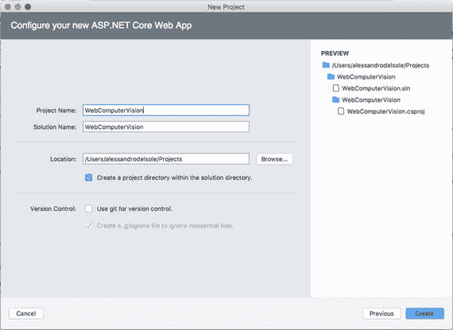

图 5-5。

Providing a project name

对于 Windows 上的 Visual Studio 2017，您需要添加一个新的网页，该网页将显示上传图像和显示分析结果所需的用户控件。为此，右键单击解决方案面板中的`Views\Home`文件夹，然后选择添加➤新文件。在新建文件对话框中，选择 MVC 视图页面模板，输入 Vision 作为页面名称，如图 [5-6](#Fig6) 所示；然后单击新建。

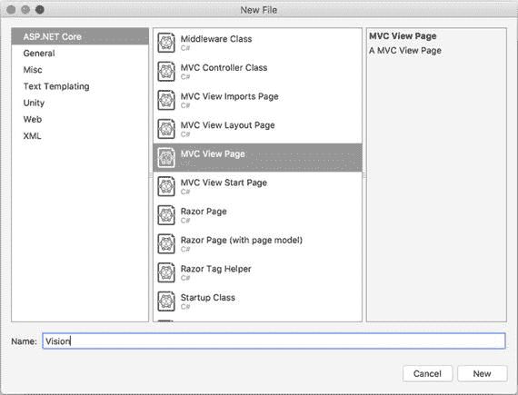

图 5-6。

Adding a new MVC page

最后一步是从 NuGet 安装一个可以用来解析和反序列化 JSON 内容的库。正如您在第 [3](3.html) 章中所做的，在解决方案面板中右键单击项目名称，然后选择添加➤添加 NuGet 包。当 NuGet 对话框出现时，搜索 Json.NET 包，然后点击添加包(参见图 [5-7](#Fig7) )。

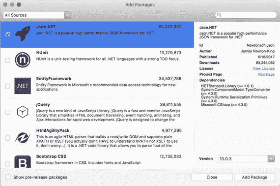

图 5-7。

Installing the Json.NET package Note

记得 Json.NET 和牛顿软件公司。Json 是一回事，但是 Visual Studio 2017 显示的是包 ID (Newtonsoft。Json)和 Visual Studio for Mac 显示包名。

现在项目已经配置好了，所以您可以继续使用 Visual Studio 代码在 Ubuntu 上创建一个 ASP.NET MVC 核心应用。

### 使用 Visual Studio 代码创建 Web 应用

正如你在第三章中学到的，你可以创造。NET 应用及其更流行的发行版，使用 C#和 Visual Studio 代码。但是，后者没有创建新项目的内置选项，所以您必须使用`dotnet`命令行工具。这将在 Ubuntu 上演示。请遵循以下步骤:

1.  使用 Files 程序，打开`Home`文件夹并新建一个名为`WebComputerVision`的子文件夹。
2.  输入新文件夹，右键单击，然后选择在终端中打开。
3.  当终端的实例启动时，键入以下命令行，这将搭建一个新的空 ASP.NET MVC 项目，该项目具有您在 Visual Studio 2017 和 Visual Studio for Mac 中看到的相同结构:

    ```py
    > dotnet new mvc

    ```

4.  使用以下命令行在 Visual Studio 代码中打开新项目:

    ```py
    > code.

    ```

当 Visual Studio 代码启动，新项目打开时，接受提示生成所需资产；然后在浏览器栏中，找到`Views\Home`文件夹。右键单击，选择新建文件，将新文件重命名为`Vision.cshtml`。该文件表示一个新的网页，该网页将用于显示将图像文件上传到计算机视觉 API 和分析结果所需的控件。

下一步是添加 Newtonsoft。Json NuGet 包到项目中。您可能还记得第 3 章[中的](3.html)，为了完成这个任务，您需要在浏览器栏中选择`.csproj`项目文件，然后添加一个`PackageReference`元素，如下所示:

```py
<ItemGroup>
  <PackageReference Include="Microsoft.AspNetCore.All" Version="2.0.0" />
  <PackageReference Include="Newtonsoft.Json" Version="10.0.3" />

</ItemGroup>

```

现在单击“文件”“➤”“全部保存”,这样 Visual Studio 代码将能够恢复所有包并刷新引用。此时，您已经在所有三个主要平台上配置了一个 ASP.NET MVC 核心项目，并且您可以开始在您选择的编辑器中编写代码。

## 实现控制器

在 MVC 应用中，URL 被映射到控制器，控制器是处理传入请求、处理用户输入和执行应用逻辑的 C#类。当您使用。这个项目包含一个名为`HomeController`的控制器类，在`HomeController.cs`文件中定义。该类公开了当用户单击用户界面中的超链接时调用的方法(技术上的操作),因此这些方法通过 HTML 标记映射到页面的内容，您将在下一节中看到。

对于当前示例，有必要在控制器内部实现一个方法(动作),该方法将被映射到之前添加到项目中的`Vision.cshtml`页面。尽管这是现实应用中的常见做法，但在这种特殊情况下，为了简单起见，没有必要创建单独的控制器，因此可以根据我们的目的扩展`HomeController`类。目前，`HomeController`控制器包含四种动作方法:`Index`，映射到`Index.cshtml`页面；`About`，映射到`About.cshtml`页面；`Contact`，映射到`Contact.cshtml`页面；和`Error`，映射到一般错误页面。名为`Vision`的新动作将被添加到控制器中。该操作的代码很简单，如下所示:

```py
public IActionResult Vision()
{
    ViewData["Message"] = "Picture analysis";

    return View();
}

```

这个方法返回到同名的页面，给动态对象`ViewData`分配一个将在页面中显示的字符串。然后，您需要实现真正的操作，该操作将负责向计算机视觉服务发送 HTTP 请求，包括图像文件。在计算机视觉、面部和情感 API 的情况下，图像文件必须作为一个`Stream`对象读取，它必须序列化为 base-64 字符串，然后包装成一个字节数组。因此，在实现该操作之前，您需要一些代码来读取图像文件并将其序列化为一个字节数组。这是通过以下代码完成的:

```py
private string BytesToSrcString(byte[] bytes) => "data:img/jpg;base64," + Convert.ToBase64String(bytes);

// IFormFile represents a file that can be sent
// with HTTP requests
private string FileToImgSrcString(IFormFile file)
{
    byte[] fileBytes;
    using (var stream = file.OpenReadStream())
    {

        using (var memoryStream = new MemoryStream())
        {
            stream.CopyTo(memoryStream);
            fileBytes = memoryStream.ToArray();
        }
    }
    return BytesToSrcString(fileBytes);
}

```

既然您已经有了将图像文件作为流读取并将其序列化为字节数组的方法，那么您可以如下实现`Vision`动作(参见代码中的注释):

```py
private const string apiKey = "YOUR-KEY-GOES-HERE";

[HttpPost]
[ValidateAntiForgeryToken]
public async Task<IActionResult> Vision(IFormFile file)
{
    //put the original file in the view data
    ViewData["originalImage"] = FileToImgSrcString(file);
    string result = null;

    using (var httpClient = new HttpClient())
    {
        // Request parameters (Replace [location] with the domain name of your Azure region)
        string baseUri = "https://[location].api.cognitive.microsoft.com/vision/v1.0/describe";

        //set up HttpClient
        httpClient.BaseAddress = new Uri(baseUri);
        httpClient.DefaultRequestHeaders.Add("Ocp-Apim-Subscription-Key", apiKey);

        //set up data object
        HttpContent content = new StreamContent(file.OpenReadStream());
        content.Headers.ContentType = new MediaTypeWithQualityHeaderValue("application/octet-stream");

        //make request
        var response = await httpClient.PostAsync(baseUri, content);

        // get the string for the JSON response
        string jsonResponse = await response.Content.ReadAsStringAsync();

        // You can replace the following code with customized or
        // more precise JSON deserialization
        var jresult = JObject.Parse(jsonResponse);
        result = jresult["description"]["captions"][0]["text"].ToString();
    }

    ViewData["result"] = result;
    return View();
}

```

这里的代码调用允许描述图像的端点，但是当然您可以使用不同的端点。另外，注意这里的代码是如何使用你在第三章[中使用的`JObject`类的反序列化技术的。当然，根据您调用的端点和您期望的响应，您可以实现不同的反序列化技术。在这个特殊的例子中，服务返回的第一个自然语言描述被检索并返回到调用者页面，这是您之前添加的`Vision.cshtml`页面，将在下一节中设计。](3.html)

## 设计视图

用于选择和上传图像文件以及显示分析结果的`Vision.cshtml`页面的用户界面非常简单。一个`Form`对象包含用于显示一些文本的`Label`控件，一个`Input`控件允许用户选择一个文件，另一个`Input`控件启动上传操作；此外，一个`Img`控件用于显示选择的图像，另一个`Label`用于显示调用计算机视觉服务的结果。页面的完整标记如下所示:

```py
@{
    ViewData["Title"] = "Vision";
}
<h2>@ViewData["Title"].</h2>
<h3>@ViewData["Message"]</h3>

<div class="row">
    <div class="col-md-12">
        <form asp-action="Vision" enctype="multipart/form-data">
            <div class="form-horizontal">
                <div class="form-group">
                    <label for="file">Image</label>
                    <input type="file" name="file" id="file" class="form-control">
                    <p class="help-block">Images must be up to 4 megabytes and greater than 50x50</p>
                </div>
                <div class="form-group">
                    <input type="submit" value="Upload" class="btn btn-primary" />
                </div>
            </div>
        </form>
    </div>
</div>

<div class="row">

    <div class="col-md-12">
        <h4>Original Image</h4>
        
    </div>
</div>

<div class="row">
    <div class="col-md-12">
        <h4>Result</h4>
        <label>@ViewData["result"]</label>
    </div>
</div>

```

注意页面如何通过使用`ViewData`对象从相关动作接收数据(在 ASP.NET MVC 中，`@`符号允许您在标记中包含 C#代码)。设计好页面后，您必须将它添加到应用可用的页面列表中。为此，打开位于`Views\Shared`下的`_Layout.cshtml`文件，并在对可用页面进行分组的代码块中添加下面以粗体突出显示的行:

```py
<div class="navbar-collapse collapse">
    <ul class="nav navbar-nav">
        <li><a asp-area="" asp-controller="Home" asp-action="Index">Home</a></li>
        <li><a asp-area="" asp-controller="Home" asp-action="About">About</a></li>
        <li><a asp-area="" asp-controller="Home" asp-action="Contact">Contact</a></li>
        <li><a asp-area="" asp-controller="Home" asp-action="Vision">Vision</a></li>

    </ul>
</div>

```

注意`asp-controller`是如何指定关联的控制器类的(省略了`Controller`的字面意思)以及`asp-action`是如何允许你在控制器中指定与页面关联的动作的。现在页面已经准备好了，您可以测试应用了。

## 测试应用

不管您使用的是什么开发环境和操作系统，您都可以使用您已经知道的调试工具来启动应用。比如，你可以在 Visual Studio 2017 中按 F5，在 Visual Studio for Mac 中按 Command+Enter，或者在 Visual Studio 代码中点击调试窗格中的“开始调试”按钮。

要知道，对于本地调试，ASP.NET MVC 核心使用一个名为 Kestrel ( [`http://docs.microsoft.com/en-us/aspnet/core/fundamentals/servers/kestrel`](http://docs.microsoft.com/en-us/aspnet/core/fundamentals/servers/kestrel) )的 web 服务器。Kestrel 是一个开源的跨平台开发服务器，可用于在调试时托管 web 应用，Visual Studio for Mac 和 Visual Studio 代码都会在您开始调试时自动使用 Kestrel。Windows 上的 Visual Studio 2017 不仅限于使用 Kestrel，还允许选择 IIS Express 作为主机。为了跨平台的一致性，对于这个例子，请确保选择 Kestrel 作为 Visual Studio 2017 中的开发服务器。为此，展开开始按钮的菜单并选择您的项目名称，如图 [5-8](#Fig8) 所示。

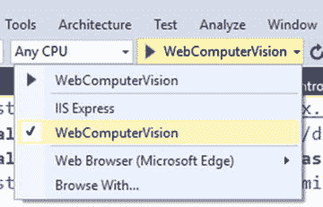

图 5-8。

In Visual Studio 2017, selecting the project name enables the Kestrel debugger.

当应用以调试模式启动时。NET 核心执行环境还在控制台应用中启动 Kestrel 服务。默认情况下，Kestrel 使用`http://localhost:5000`地址。但是，Visual Studio 2017 允许您在项目属性中更改端口。当应用在你的浏览器中启动时，它将如图 [5-9](#Fig9) 所示。

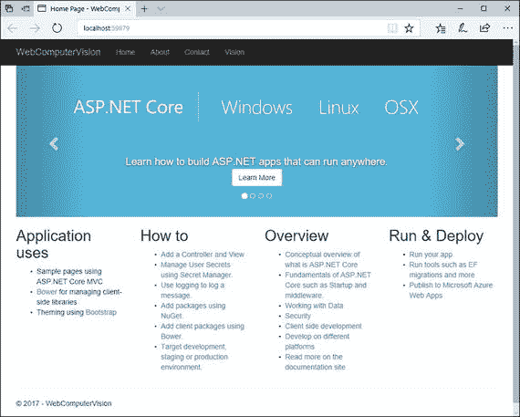

图 5-9。

The sample application running

如您所见，右上角有一个名为 Vision 的超链接。如果您点击此超链接，将出现愿景页面，看起来如图 [5-10](#Fig10) 所示。

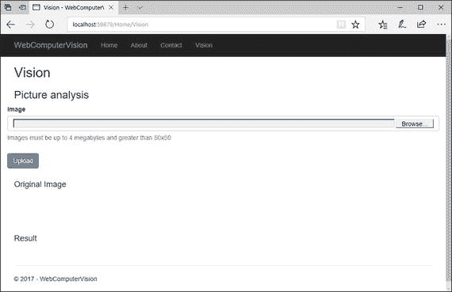

图 5-10。

The user interface designed to select and upload an image file

在这里，您可以单击浏览按钮，选择一个图像文件，准备好后，单击上传按钮。如果所选图像有效，计算机视觉 API 将返回一个描述，该描述将与所选图像一起显示在页面中，如图 [5-11](#Fig11) 所示。

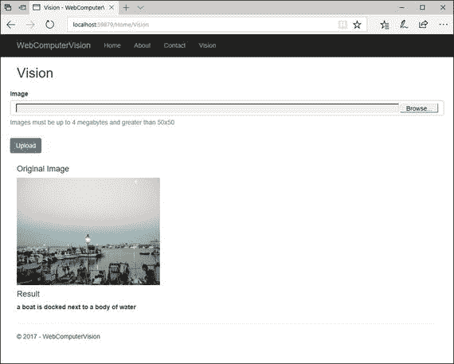

图 5-11。

The result of the analysis returned by the Computer Vision API and displayed in the web page

现在让我们通过使用 OCR 而不是图像描述来看看应用的行为。首先，在`HomeController.cs`文件中，用下面的声明更改`baseUri`变量:

```py
string baseUri = "https://[location].api.cognitive.microsoft.com/vision/v1.0/ocr";

```

其中`[location]`必须替换为您的 Azure 区域的域名。然后，替换以下行:

```py
result = jresult["description"]["captions"][0]["text"].ToString();

```

使用下面的循环来解析区域、行和单词(参见第[章第 3](3.html) 节来回顾 OCR 响应):

```py
foreach(var region in jresult["regions"])
{
    foreach(var line in region["lines"])
    {
        foreach(var word in line["words"])
        {
            result = result + " " + word["text"].ToString();
        }
    }
}

```

如果您现在重新启动应用并选择一个包含文本的图像，您将看到如果操作成功，页面如何正确显示 OCR 识别的结果。图 [5-12](#Fig12) 显示了一个例子。

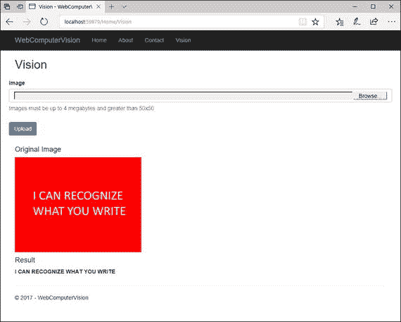

图 5-12。

The result of optical character recognition on an image

相反，最后一个例子是基于特定领域的模型，特别是基于地标识别。在 C#代码中，用以下内容替换`baseUri`变量的值:

```py
string baseUri = "https://[location].api.cognitive.microsoft.com/vision/v1.0/models/landmarks/analyze";

```

按照惯例，`[location]`必须替换为您的 Azure 地区的名称。

Note

在前面的章节中，您看到了如何执行一个 HTTP GET 请求来检索您可以与前面的端点一起使用的特定于域的模型的列表。显然，如果您预先知道域模型的确切名称，就像在当前的例子中一样，您可以避免 GET 请求。

现在，将解析 JSON 响应的方式更改如下:

```py
result = jresult["result"]["landmarks"][0]["name"].ToString();

```

其中，JSON 响应包含一个名为`result`的数组，数组的数量与图片中检测到的地标一样多；每个的`name`属性返回地标名称。如果您现在重启应用并尝试上传带有地标的图像，您将看到计算机视觉服务将如何检测到正确的信息，如图 [5-13](#Fig13) 所示。

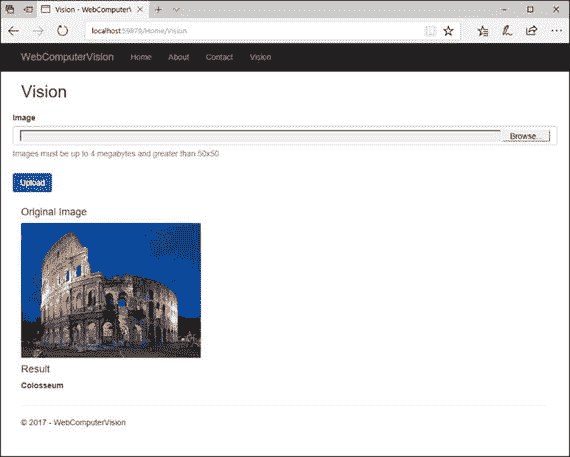

图 5-13。

Landmarks recognition

计算机视觉 API 可以真正增强企业和消费者世界的 web 应用，其强大的图像分析算法可以帮助您创建下一代应用。此外，随着。NET Core，所有这些功能也可用于 macOS 和 Linux 系统。

## 摘要

在本章中，您看到了如何在用 ASP.NET MVC 核心构建的 web 应用中利用计算机视觉 API 的强大功能。一开始，您看到了如何使用 Visual Studio 2017、Visual Studio for Mac 和 Visual Studio 代码在三个不同的系统上创建相同的示例项目。

然后，您看到了如何在控制器中实现一个动作，从磁盘中读取一个图像文件，并将其发送到计算机视觉服务以描述其内容。接下来，您看到了如何设计一个包含选择和上传图像以及显示分析结果的控件的 web 页面。最后，您看到了如何在本地测试应用，展示了利用人工智能的 web 应用有多么强大。