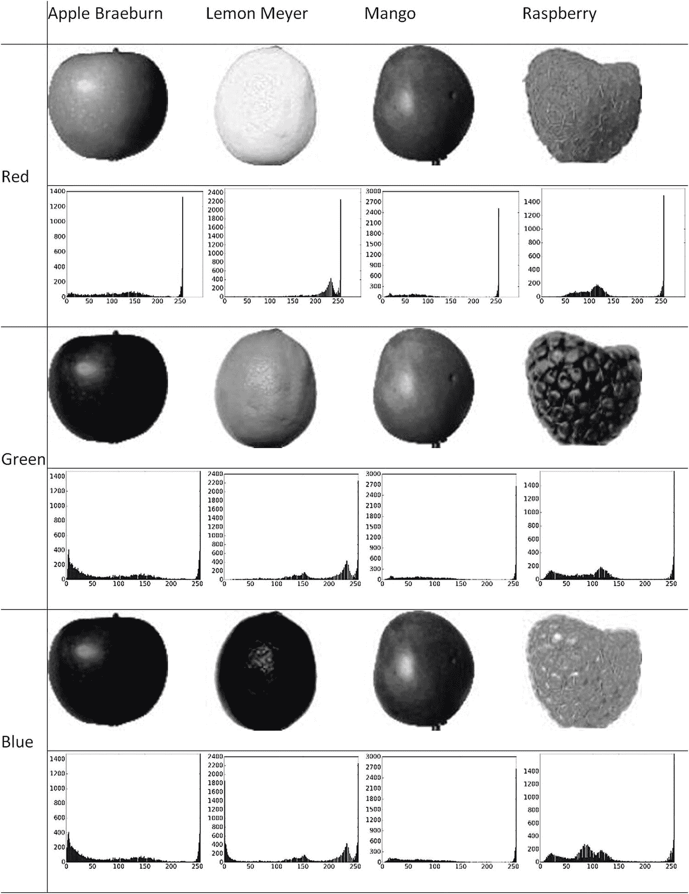
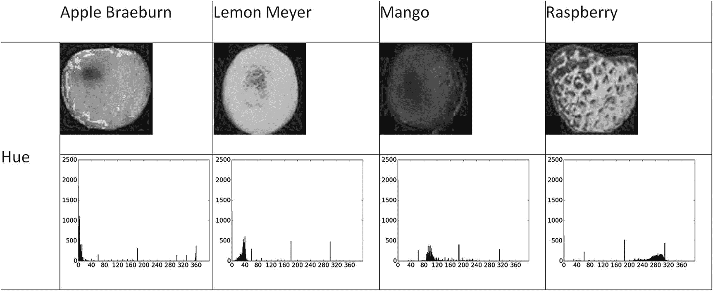
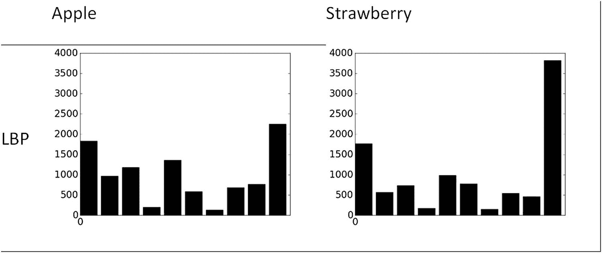
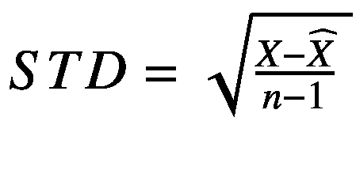
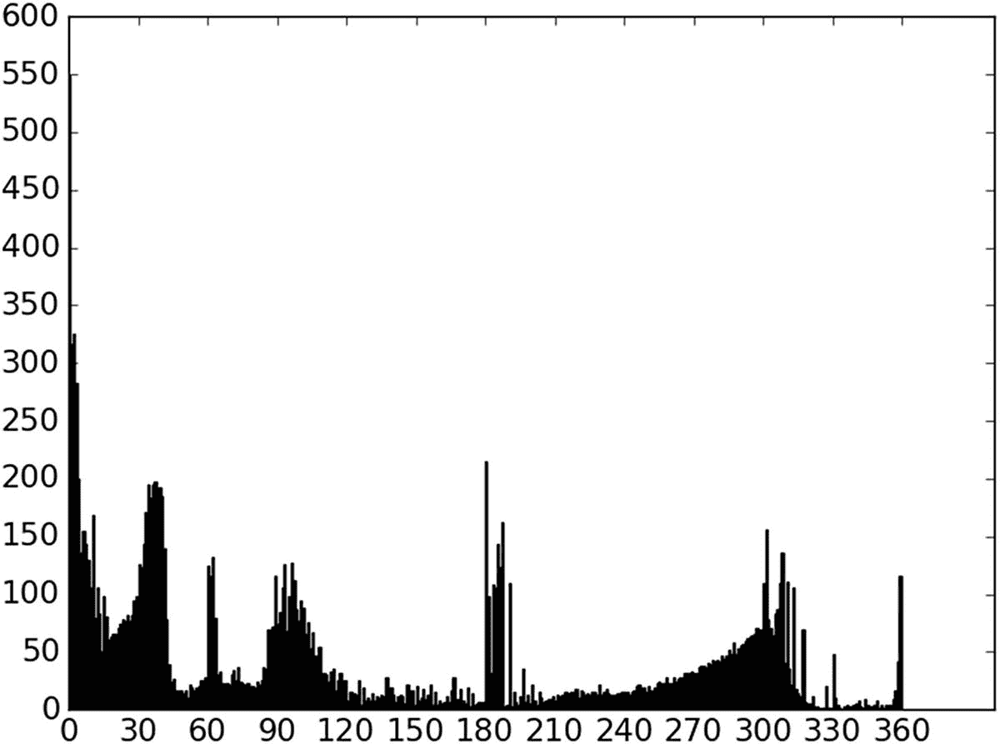
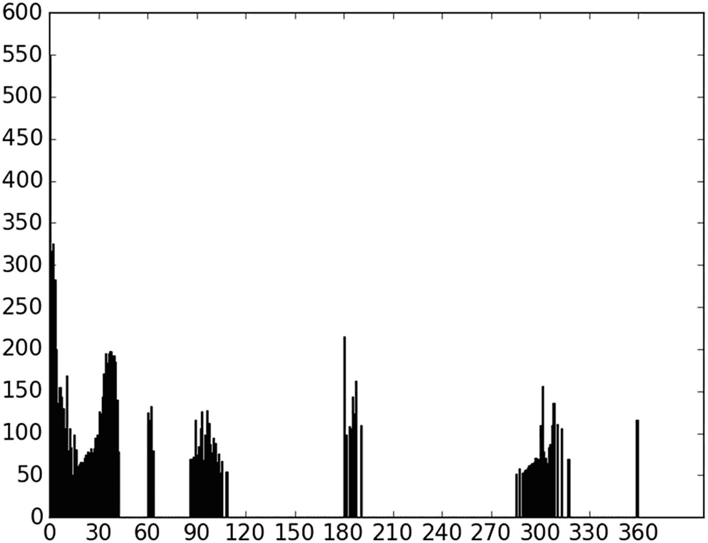
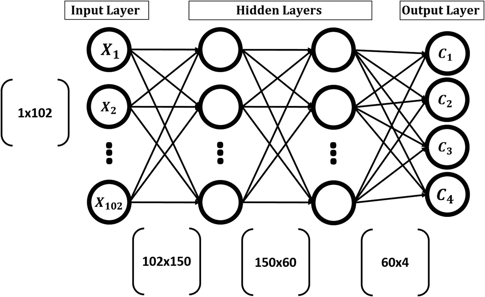
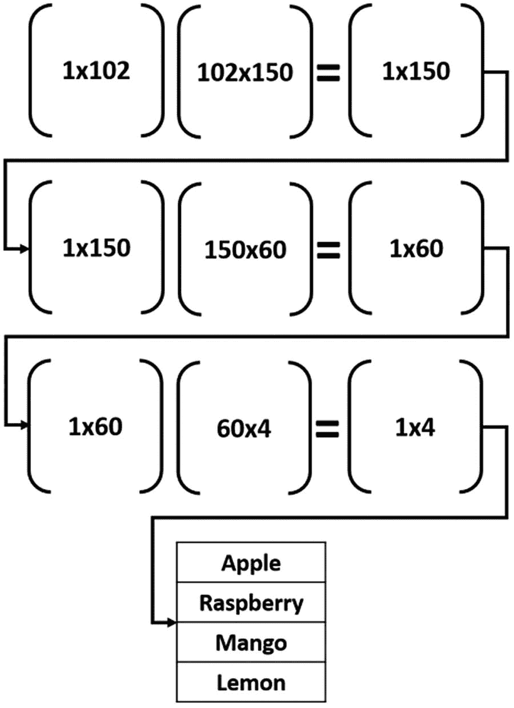
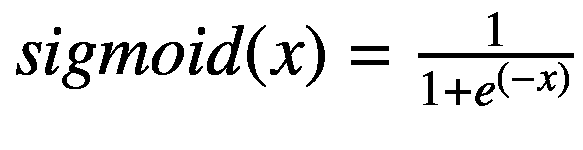
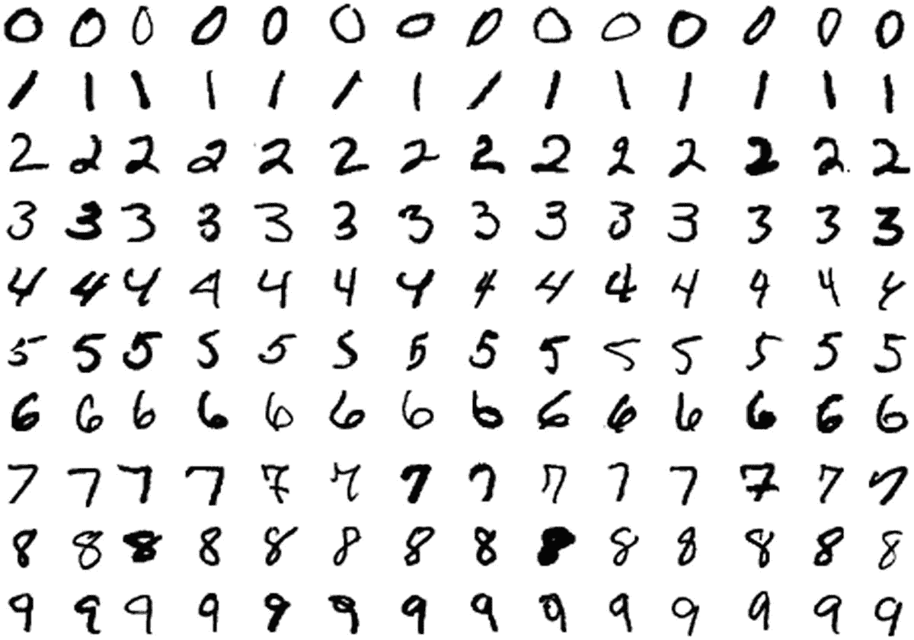

# 三、将具有工程特征的人工神经网络用于识别

一个成功的 ML 应用的三个支柱是数据、特性和模型。他们应该互相应付。使用区分数据中存在的不同情况的最相关的特征。代表性特征对于构建精确的 ML 应用至关重要。它们应该足够精确，以便在不同条件下工作良好，例如缩放和旋转的变化。这些特性应该能够很好地与所选的 ML 模型一起工作。您不应该使用不必要的功能，因为这会增加模型的复杂性。特征选择和简化技术用于找到最小的特征集以建立精确的模型。

本章探讨了第 [2](2.html) 章中介绍的功能类别，以找到适用于 Fruits 360 数据集的手工设计功能集。应用特征缩减来最小化特征向量长度，并且仅使用最相关的特征。实现人工神经网络以将图像特征映射到它们的输出标签。在本章结束时，我们将认识到手动寻找复杂问题的特征是多么复杂，即使在同一个类中，样本之间也有多种变化。

## 水果 360 数据集特征挖掘

Fruits 360 数据集用于寻找一组合适的特征来训练人工神经网络，以实现高分类性能。这是一个高质量的图像数据集，收集自 60 种水果，包括苹果、番石榴、鳄梨、香蕉、樱桃、枣、猕猴桃、桃子等。平均而言，每个水果有大约 491 个训练图像和 162 个测试图像，总共有 28，736 个用于训练，9，673 个用于测试。每幅图像的大小为 100×100 像素。使用所有图像大小相同的数据集可以省去调整图像大小的预处理步骤。

### 特征挖掘

为了在开始时使事情变得简单，只选择了四类:Braeburn 苹果，梅尔柠檬，芒果和覆盆子。基于第 [2](2.html) 章中提出的特征类别(颜色、纹理和边缘)，我们需要找到最合适的特征集来区分这些类别。

基于我们对这四种水果的了解，我们知道它们有不同的颜色。苹果是红色的，柠檬是橙色的，芒果是绿色的，覆盆子是洋红色的。因此，我们首先想到的是颜色类别。

我们可以从使用每个像素作为人工神经网络的输入开始。每个图像大小为 100×100 像素。因为图像是彩色的，所以基于 RGB 颜色空间有三个现有的通道:红色、绿色和蓝色。因此，人工神经网络的总输入数为 100×100×3=30，000。基于这些输入，将创建一个人工神经网络。

此外，这些输入将使人工神经网络变得庞大，具有大量的参数。该网络将有 30，000 个输入和 4 个输出。假设单个隐层有 1 万个神经元，那么网络的参数总数是 30000×10000+10000×4，也就是 3 亿多个参数。优化这样一个网络是复杂的。我们应该找到一种方法来减少输入特征的数量，以便减少参数的数量。

一种方法是使用单个通道，而不是使用所有三个 RGB 通道。所选通道应该能够捕捉所用类别之间的颜色变化。图 [3-1](#Fig1) 中提供了每幅图像的三个通道及其直方图。直方图比看图像更容易帮助我们可视化亮度值。



图 3-1

红色、绿色和蓝色通道，以及来自所使用的水果 360 数据集的四个类别的单个样本的直方图

清单 [3-1](#PC1) 中提供了用于读取图像以及创建和可视化直方图的 Python 代码。

```py
import numpy
import skimage.io
import matplotlib.pyplot

raspberry = skimage.io.imread(fname="raspberry.jpg", as_grey=False)
apple = skimage.io.imread(fname="apple.jpg", as_grey=False)
mango = skimage.io.imread(fname="mango.jpg", as_grey=False)
lemon = skimage.io.imread(fname="lemon.jpg", as_grey=False)

fruits_data = [apple, raspberry, mango, lemon]
fruits = ["apple", "raspberry", "mango", "lemon"]
idx = 0
for fruit_data in fruits_data:
    fruit = fruits[idx]
    for ch_num in range(3):
        hist = numpy.histogram(a=fruit_data[:, :, ch_num], bins=256)
        matplotlib.pyplot.bar(left=numpy.arange(256), height=hist[0])
        matplotlib.pyplot.savefig(fruit+"-histogram-channel-"+str(ch_num)+".jpg", bbox_inches="tight")
        matplotlib.pyplot.close("all")
    idx = idx + 1

Listing 3-1RGB Channel Histogram

```

似乎很难找到最好的渠道来使用。根据任何通道的直方图，在图像的某些区域存在重叠。在这种情况下，区分不同图像的唯一度量是强度值。例如，Braeburn apple 和 Meyer lemon 根据蓝色通道直方图具有所有箱的值，但是它们的值不同。苹果和最右边的柠檬相比价值很小。根据光照的变化，强度值会发生变化，我们可能会遇到苹果和柠檬在直方图中的值彼此接近的情况。我们应该在不同的类别之间增加一个界限。即使只有很小的变化，在做决定时也不会有任何含糊。

我们可以从使用的四种水果具有不同的颜色这一事实中受益。将照明通道与颜色通道分离的颜色空间是一个很好的选择。图 [3-2](#Fig2) 显示了之前使用的四个样本的 HSV 色彩空间的色调通道及其直方图。



图 3-2

来自 HSV 颜色空间的色调通道及其直方图

用于返回所有样本的色调通道直方图的 Python 代码在清单 [3-2](#PC2) 中。

```py
import numpy
import skimage.io, skimage.color
import matplotlib.pyplot

raspberry = skimage.io.imread(fname="raspberry.jpg", as_grey=False)
apple = skimage.io.imread(fname="apple.jpg", as_grey=False)
mango = skimage.io.imread(fname="mango.jpg", as_grey=False)
lemon = skimage.io.imread(fname="lemon.jpg", as_grey=False)

apple_hsv = skimage.color.rgb2hsv(rgb=apple)
mango_hsv = skimage.color.rgb2hsv(rgb=mango)
raspberry_hsv = skimage.color.rgb2hsv(rgb=raspberry)
lemon_hsv = skimage.color.rgb2hsv(rgb=lemon)

fruits = ["apple", "raspberry", "mango", "lemon"]
hsv_fruits_data = [apple_hsv, raspberry_hsv, mango_hsv, lemon_hsv]
idx = 0
for hsv_fruit_data in hsv_fruits_data:
    fruit = fruits[idx]
    hist = numpy.histogram(a=hsv_fruit_data[:, :, 0], bins=360)
    matplotlib.pyplot.bar(left=numpy.arange(360), height=hist[0])
    matplotlib.pyplot.savefig(fruit+"-hue-histogram.jpg", bbox_inches="tight")
    matplotlib.pyplot.close("all")
    idx = idx + 1

Listing 3-2
Hue Channel Histograms

```

使用色调通道的 360 格直方图，似乎每种不同类型的水果都在直方图内投票选择特定的格。与使用任何 RGB 通道相比，不同类别之间几乎没有重叠。例如，苹果直方图中最高的条从 0 到 10，而芒果直方图的条从 90 到 110。每个类别之间的余量使得更容易减少分类中的模糊性，从而提高预测精度。

基于前面对选取的四类进行的简单实验，色调通道直方图可以正确的对数据进行分类。在这种情况下，功能的数量只有 360，而不是 30，000。这非常有助于减少人工神经网络参数的数量。

一个 360 个元素的特征向量相对于前一个很小，但是我们也可以最小化它。然而，特征向量中的一些元素可能没有足够的代表性来区分不同的类别。它们可能会降低分类模型的准确性。因此，最好删除它们以保留最好的功能集。

这不是结局。如果我们要添加更多的类，那么色调通道直方图是否足以进行准确的分类？让我们看看在使用额外的两种水果(草莓和柑橘)后事情是如何运作的。

根据我们对这两种水果的了解，草莓是红色的，类似于苹果，而柑橘是橙色的，类似于梅尔柠檬。图 [3-3](#Fig3) 显示了从这些类别中选择的样本的色调通道及其直方图。


图 3-3

来自新的两个类的样本与以前使用的样本有一些相似之处

草莓和苹果的直方图是相似的，因为它们共享从 1 到 10 的相同区间。此外，柑橘直方图和柠檬直方图相似。如何区分颜色相同的不同类别？答案是寻找另一种类型的特征。

颜色相似的水果可能有不同的质地。使用纹理描述符，如 GLCM 或 LBP，我们可以捕捉这些差异。重复前面的过程，直到选择出能够尽可能提高分类精度的最佳特征集。

LBP 产生一个大小等于输入图像大小的矩阵。为了避免增加特征向量长度，基于 LBP 矩阵创建了一个 10-bin 直方图，如图 [3-4](#Fig4) 所示。bin 值似乎存在差异。



图 3-4

苹果和草莓的 LBP 直方图

清单 [3-3](#PC3) 列出了生成 LBP 直方图的 Python 代码。

```py
import numpy
import skimage.io, skimage.color, skimage.feature
import matplotlib.pyplot

apple = skimage.io.imread(fname="apple.jpg", as_grey=True)
strawberry = skimage.io.imread(fname="strawberry.jpg", as_grey=True)

fig, ax = matplotlib.pyplot.subplots(nrows=1, ncols=2)
apple_lbp = skimage.feature.local_binary_pattern(image=apple, P=7, R=1)
hist1 = numpy.histogram(a=apple_lbp, bins=10)
ax[0].bar(left=numpy.arange(10), height=hist1[0])

strawberry_lbp = skimage.feature.local_binary_pattern(image=strawberry, P=7, R=1)
hist = numpy.histogram(a=strawberry_lbp, bins=10)
ax[1].bar(left=numpy.arange(10), height=hist[0])

Listing 3-3LBP Histogram

```

数据科学家必须寻找最佳类型的区分特征，当由于重叠类的数量而导致复杂性增加时，这并不容易实现。即使使用简单的高质量 Fruits 360 数据集，也存在区分不同类别的挑战。使用像 ImageNet 这样的数据集，有数千个类，同一类中的样本之间存在差异，要找到最佳特征是一项需要手动完成的复杂任务。对于有大量数据的情况，自动方法是优选的。

### 特征约简

这一部分将基于前四个结果处理由色调通道直方图组成的特征向量。查看图 [3-2](#Fig2) 中的直方图，很明显有太多几乎为零值的面元。这意味着它们没有被任何类使用。最好移除这些元素，因为这有助于减少特征向量长度。

根据第 [2](2.html) 章中介绍的特征减少技术，当很难知道要删除什么元素时，使用包装和嵌入类别。例如，一些元素可能在一些类中表现良好，但在其他类中表现很差。因此，我们必须删除它们。包装器和嵌入式方法依赖于用多个特征集训练的模型，以便知道哪些元素有助于提高分类准确度。在我们的例子中，我们不需要使用它们。原因是有些元素在所有的类中都是不好的，因此很明显我们应该删除什么。因此，过滤方法是一个很好的选择。

反过来，STD 也是过滤元素的好选择。好的元素是那些 STD 值高的元素。一个 sigh STD 值意味着该元素对于不同的类是有区别的。具有低 STD 值的元素在所有不同的类中具有几乎相同的值。这意味着它无法区分不同的类别。

根据等式 3-1 计算给定元素的 STD。

(方程式 3-1)

其中 *X* 是给定样本的元素值， *X* ̂是数据集中所有样本的元素平均值， *n* 是样本数。

在决定删除哪个元素之前，我们必须从数据集中的所有样本中提取特征向量。清单 [3-4](#PC4) 从使用的四种水果的每个样本中提取特征向量。

```py
import numpy
import skimage.io, skimage.color, skimage.feature
import os
import pickle

fruits = ["apple", "raspberry", "mango", "lemon"]
#492+490+490+490=1,962
dataset_features = numpy.zeros(shape=(1962, 360))
outputs = numpy.zeros(shape=(1962))

idx = 0
class_label = 0
for fruit_dir in fruits:
    curr_dir = os.path.join(os.path.sep,'train', fruit_dir)
    all_imgs = os.listdir(os.getcwd()+curr_dir)
    for img_file in all_imgs:
        fruit_data = skimage.io.imread(fname=os.getcwd()+curr_dir+img_file, as_grey=False)
        fruit_data_hsv = skimage.color.rgb2hsv(rgb=fruit_data)
        hist = numpy.histogram(a=fruit_data_hsv[:, :, 0], bins=360)
        dataset_features[idx, :] = hist[0]
        outputs[idx] = class_label
        idx = idx + 1
    class_label = class_label + 1

with open("dataset_features.pkl", "wb") as f:
    pickle.dump("dataset_features.pkl", f)

with open("outputs.pkl", "wb") as f:
    pickle.dump(outputs, f)

Listing 3-4Feature Vector Extraction from All Samples

```

名为“dataset_features”的数组包含所有要素。它的大小为 1，962×360，其中 360 是直方图仓的数量，1，962 是样本的数量(492 个苹果+ 490 个其他三种水果)。类别标签保存在“输出”数组中，其中苹果的标签为 0，覆盆子的标签为 1，芒果的标签为 2，柠檬的标签为 3。代码结束时，将保存要素和输出标签，以便以后重用。

这段代码假设有四个文件夹，根据每个水果来命名。它遍历这些文件夹，读取所有图像，计算直方图，并将其返回到“dataset_features”变量中。之后，我们准备计算 STD。所有特征的标准偏差根据下面这条线计算:

```py
features_STDs = numpy.std(a=dataset_features, axis=0)

```

这返回长度为 360 的向量，其中给定位置的元素引用该位置的特征向量的元素的 STD。360 种性传播疾病的分布如图 [3-5](#Fig5) 所示。



图 3-5

跨所有样本的特征向量的所有元素的 STDs 分布

基于这种分布，STD 的最小值、最大值和平均值分别为 0.53、549.13 和 44.22。应移除具有较小 STD 值的要素，因为它们无法区分不同的类。我们必须选择一个阈值，将特征分为坏的(低于阈值)和好的(高于阈值)。

### 使用人工神经网络过滤

选择阈值的一种方法是反复试验。尝试不同的阈值。通过每个阈值返回的缩减的特征向量，训练分类模型并注意准确性。使用最大化精度的简化特征向量。

清单 [3-5](#PC6) 给出了使用 scikit-learn 库创建和训练 ANN 的 Python 代码，该库具有一组通过使用阈值生成的特征。

```py
import sklearn.neural_network
import numpy
import pickle

with open("dataset_features.pkl", "rb") as f:
    dataset_features = pickle.load(f)

with open("outputs.pkl", "rb") as f:
    outputs = pickle.load(f)

threshold = 50
features_STDs = numpy.std(a=dataset_features, axis=0)
dataset_features2 = dataset_features[:, features_STDs>threshold]
ANN = sklearn.neural_network.MLPClassifier(hidden_layer_sizes=[150, 60],
                                           activation="relu",
                                           solver="sgd",
                                           learning_rate="adaptive",
                                           max_iter=300,
                                           shuffle=True)

ANN.fit(X=dataset_features2, y=outputs)
predictions = ANN.predict(X=dataset_features2)
num_flase_predictions = numpy.where(predictions != outputs)[0]

Listing 3-5Building ANN Using scikit-learn Trained with STD Thresholded Features

```

加载要素和输出，以便计算它们的 STD 并根据预定义的阈值过滤要素。一个多层感知器分类器由两个隐层构成，其中第一个隐层有 150 个神经元，第二个隐层有 60 个神经元。该分类器的一些特性被指定:激活函数被设置为校正线性单元(ReLU)函数，随机梯度下降(GD)是学习算法，学习率由学习者自动选择，有 300 个最大迭代来训练网络，最后网络被设置为真，以便在每次迭代中选择不同的训练样本。

阈值为 50 时，其余特征的分布如图 [3-6](#Fig6) 所示。所有低质量的元素都被去除，从而使用最佳的元素集。这减少了用于训练网络的数据量；因此，训练速度更快。它还防止坏的特征元素降低精度。当使用特征向量中的所有元素时，有 490 个错误预测。在阈值化之后，特征元素使用 STD 阈值 50，错误预测的数量下降到零。



图 3-6

移除 STD 低于 50 的元素后的 STD 分布

分类错误的减少不是唯一的好处；人工神经网络参数也有所减少。在只使用了 STD 大于 50 的特性元素之后，剩余的元素数量只有 102。根据清单 [3-5](#PC6) 中的 ANN 结构，与使用长度为 360 的完整特征向量时的 54，000 个参数相比，输入层和第一隐藏层中的参数数量将为 102×150= 15，300。减少了 38，700 个参数。

## 人工神经网络实现

本节用 Python 实现了一个 ANN。人工神经网络根据每层(输入、隐藏和输出)中神经元的数量来接受网络结构，然后它通过多次迭代来训练网络。为了熟悉实施步骤，图 [3-7](#Fig7) 将人工神经网络结构可视化。有一个输入层有 102 个输入，两个隐藏层有 150 和 60 个神经元，一个输出层有 4 个输出(每个水果类一个)。



图 3-7

要实现的人工神经网络的体系结构

任一层的输入向量乘以(矩阵乘法)连接到下一层的权重矩阵，以产生输出向量。输出向量再次乘以连接其层和下一层的权重矩阵。该过程一直持续到到达输出层。矩阵乘法的总结如图 [3-8](#Fig8) 所示。



图 3-8

输入和权重之间的矩阵乘法

大小为 1×102 的输入向量将乘以大小为 102×150 的第一个隐藏层的权重矩阵。这就是矩阵乘法。因此，输出大小为 1×150。然后，该输出被用作第二个隐藏层的输入，在第二个隐藏层中，该输出被乘以大小为 150×60 的权重矩阵。结果大小为 1×60。最后，输出乘以第二个隐藏层和大小为 60×4 的输出层之间的权重。结果的最终大小为 1×4。结果向量中的每个元素都引用一个输出类。根据具有最高分数的类来标记输入样本。

实现这种乘法的 Python 代码在清单 [3-6](#PC7) 中。

```py
import numpy
import pickle

def sigmoid(inpt):
    return 1.0/(1+numpy.exp(-1*inpt))

f = open("dataset_features.pkl", "rb")
data_inputs2 = pickle.load(f)
f.close()

features_STDs = numpy.std(a=data_inputs2, axis=0)
data_inputs = data_inputs2[:, features_STDs>50]

f = open("outputs.pkl", "rb")
data_outputs = pickle.load(f)
f.close()

HL1_neurons = 150
input_HL1_weights = numpy.random.uniform(low=-0.1, high=0.1,
                                         size=(data_inputs.shape[1], HL1_neurons))
HL2_neurons = 60
HL1_HL2_weights = numpy.random.uniform(low=-0.1, high=0.1,
                                         size=(HL1_neurons, HL2_neurons))
output_neurons = 4
HL2_output_weights = numpy.random.uniform(low=-0.1, high=0.1,
                                          size=(HL2_neurons, output_neurons))

H1_outputs = numpy.matmul(a=data_inputs[0, :], b=input_HL1_weights)
H1_outputs = sigmoid(H1_outputs)
H2_outputs = numpy.matmul(a=H1_outputs, b=HL1_HL2_weights)
H2_outputs = sigmoid(H2_outputs)
out_outputs = numpy.matmul(a=H2_outputs, b=HL2_output_weights)

predicted_label = numpy.where(out_outputs == numpy.max(out_outputs))[0][0]
print("Predicted class : ", predicted_label)

Listing 3-6ANN Matrix Multiplications

```

在读取之前保存的要素及其输出标注并使用等于 50 的标准差阈值过滤要素后，定义图层的权重矩阵。它们被随机赋予从-0.1 到 0.1 的值。例如，变量“input_HL1_weights”保存输入层和第一个隐藏层之间的权重矩阵。该矩阵的大小根据特征元素的数量和隐藏层中神经元的数量来定义。

创建权重矩阵后，下一步是应用矩阵乘法。例如，变量“H1 输出”保存将给定样本的特征向量乘以输入层和第一隐藏层之间的权重矩阵的输出。

通常，激活函数被应用于每个隐藏层的输出，以在输入和输出之间创建非线性关系。例如，矩阵乘法的输出被应用于等式 3-2 中的 sigmoid 激活函数。

(方程式 3-2)

生成输出层输出后，进行预测。预测的类标签被保存到“预测 _ 标签”变量中。

对每个输入样本重复这些步骤。适用于所有样本的完整代码在清单 [3-7](#PC8) 中。

```py
import numpy
import pickle

def sigmoid(inpt):
    return 1.0/(1+numpy.exp(-1*inpt))

def relu(inpt):
    result = inpt
    result[inpt<0] = 0
    return result

def update_weights(weights, learning_rate):
    new_weights = weights - learning_rate*weights
    return new_weights

def train_network(num_iterations, weights, data_inputs, data_outputs, learning_rate, activation="relu"):
    for iteration in range(num_iterations):
        print("Itreation ", iteration)
        for sample_idx in range(data_inputs.shape[0]):
            r1 = data_inputs[sample_idx, :]
            for idx in range(len(weights)-1):
                curr_weights = weights[idx]
                r1 = numpy.matmul(a=r1, b=curr_weights)
                if activation == "relu":
                    r1 = relu(r1)
                elif activation == "sigmoid":
                    r1 = sigmoid(r1)
            curr_weights = weights[-1]
            r1 = numpy.matmul(a=r1, b=curr_weights)
            predicted_label = numpy.where(r1 == numpy.max(r1))[0][0]
            desired_label = data_outputs[sample_idx]
            if predicted_label != desired_label:
                weights = update_weights(weights,
                                         learning_rate=0.001)
    return weights

def predict_outputs(weights, data_inputs, activation="relu"):
    predictions = numpy.zeros(shape=(data_inputs.shape[0]))
    for sample_idx in range(data_inputs.shape[0]):
        r1 = data_inputs[sample_idx, :]
        for curr_weights in weights:
            r1 = numpy.matmul(a=r1, b=curr_weights)
            if activation == "relu":
                r1 = relu(r1)
            elif activation == "sigmoid":
                r1 = sigmoid(r1)
        predicted_label = numpy.where(r1 == numpy.max(r1))[0][0]
        predictions[sample_idx] = predicted_label
    return predictions

f = open("dataset_features.pkl", "rb")
data_inputs2 = pickle.load(f)
f.close()
features_STDs = numpy.std(a=data_inputs2, axis=0)
data_inputs = data_inputs2[:, features_STDs>50]

f = open("outputs.pkl", "rb")
data_outputs = pickle.load(f)
f.close()

HL1_neurons = 150
input_HL1_weights = numpy.random.uniform(low=-0.1, high=0.1,
                                         size=(data_inputs.shape[1], HL1_neurons))
HL2_neurons = 60
HL1_HL2_weights = numpy.random.uniform(low=-0.1, high=0.1,
                                         size=(HL1_neurons, HL2_neurons))
output_neurons = 4
HL2_output_weights = numpy.random.uniform(low=-0.1, high=0.1,
                                          size=(HL2_neurons, output_neurons))

weights = numpy.array([input_HL1_weights,
                       HL1_HL2_weights,
                       HL2_output_weights])

weights = train_network(num_iterations=2,
                        weights=weights,
                        data_inputs=data_inputs,
                        data_outputs=data_outputs,
                        learning_rate=0.01,
                        activation="relu")

predictions = predict_outputs(weights, data_inputs)
num_flase = numpy.where(predictions != data_outputs)[0]
print("num_flase ", num_flase.size)

Listing 3-7Complete Code for ANN

```

“权重”变量包含整个网络的所有权重。基于每个权重矩阵的大小，网络结构被动态地指定。例如，如果“input_HL1_weights”变量的大小是 102×80，那么我们可以推断第一个隐藏层有 80 个神经元。

“train_network”是核心功能，因为它通过循环所有样本来训练网络。对于每个样品，应用清单 [3-6](#PC7) 中讨论的步骤。它接受训练迭代次数、特征、输出标签、权重、学习率和激活函数。激活功能有两个选项:ReLU 或 sigmoid。ReLU 是一个阈值函数，只要它大于零，就返回相同的输入。否则，它返回零。

如果网络对给定的样本做出了错误的预测，则使用“更新权重”函数来更新权重。不使用优化算法来更新权重；它们只是根据学习率进行更新。准确率不超过 45%。下一章将讨论如何使用 GA 优化技术来完成这项任务，这将提高分类的准确性。

在指定次数的训练迭代之后，根据训练数据测试网络，以查看网络是否在训练样本上工作良好。如果基于训练数据的准确度是可接受的，那么我们可以基于新的看不见的数据来测试模型。

## 工程功能限制

Fruits 360 数据集图像是在一个受限的环境中捕获的，其中包含每个水果的许多可用细节。这使得挖掘数据以找到最佳特性变得更加容易。不幸的是，现实世界的应用并不那么容易。同一类中的样本之间存在许多差异，例如不同的视角、透视变形、光照变化、遮挡等等。为这些数据创建特征向量是一项复杂的任务。

图 [3-9](#Fig9) 给出了来自 MNIST(改进的国家标准与技术研究所)数据集的一些手写数字识别样本。它由 70，000 个样本组成。图像是二进制的，因此颜色特征类别不适用。再看另一个特性，似乎没有一个特性能够适用于整个数据集。因此，我们必须使用多个特征来覆盖数据集中存在的所有变化。这肯定会产生一个巨大的特征向量。



图 3-9

来自 CIFAR10(加拿大高级研究所)数据集的样本

假设我们能够找到一个好的特征，还有另一个问题。单层人工神经网络导致 12.0%的错误率。因此，我们可以增加人工神经网络的深度。不幸的是，深度人工神经网络架构使用的大特征向量计算起来非常麻烦，但这是处理复杂问题的方法。

另一种方法是避免手动特征挖掘方法。开始寻找一个自动的特征挖掘，在最大化准确性方面搜索最佳的特征集。

## 工程特征的终结

工程特性不是遗留的，仍然可以解决一些问题。当处理一些复杂的数据集时，这不是一个好的选择。

每个数据科学家都会使用计算器进行数学计算。在移动电话的发明和发展之后，智能手机出现了，它具有不同的应用来执行以前在计算器上完成的操作。这里有一个问题:一项新技术(智能手机)的出现是否意味着以前的技术(计算器)被摧毁，不再被使用？

计算器只用于数学运算，但智能手机不是。智能手机有许多计算器没有的功能。许多功能的可用性而不是有限的功能是一个缺点吗？在某些情况下，工具中的功能越少，其性能就越好；而且，功能越多，开销越大。使用计算器进行运算很简单，但使用智能手机进行同样的运算会产生开销。

电话可能会响起来一个来电，打断你正在做的事情。它可能连接到互联网，因此也可能会发出电子邮件的嘟嘟声。这可能会让你不去做手术。因此，使用智能手机的人应该关心所有这些影响，以便很好地进行数学运算。与智能手机相比，使用功能有限的计算器具有简单和专注于任务的优势，即使这是一项古老的技术。事实上，最新的并不总是最好的。根据您的需求，旧技术可能比新技术更好，也可能更差。从数据科学的角度来看，情况也是如此。

有不同类型的学习算法和特征用于不同的任务，例如分类和回归。其中一些可以追溯到 1950 年，而另一些是最近的。但也不能说老机型总是比最近的差。我们不能绝对的断定 CNN 等 DL 模型比之前的模型更好。这个看你的需求了。

许多研究人员倾向于盲目使用 DL，因为它是最先进的方法。有些问题很简单，使用 DL 可能会增加更多的复杂性。例如，将 DL 与 100 个图像分成 10 个类一起使用并不是一个好的选择。浅层学习在这种情况下就足够了。如果要创建一个分类器来区分之前使用的四种水果，DL 不是强制性的，之前的手工/工程特征就足够了。

如果在这种情况下使用 CNN，会增加一些开销，使任务变得复杂。需要指定不同的参数，例如层的类型、层数、激活函数、学习速率等。相比之下，使用色调通道直方图足以实现非常高的准确度。这就像用梯子爬到墙头一样。如果你在爬了五级楼梯后到达了墙的顶部，你就不需要再爬一级楼梯了。同样，如果您可以使用手工设计的特征获得最佳结果，则不必使用自动特征学习。