# 5.卷积神经网络

先前讨论的人工神经网络的结构被称为 FC 神经网络(FCNNs)。原因是层 **i** 中的每个神经元都连接到层 **i-1 和 i+1** 中的所有神经元。两个神经元之间的每个连接都有两个参数:权重和偏差。添加更多的层和神经元会增加参数的数量。因此，即使在多个图形处理单元(GPU)和多个中央处理单元(CPU)上的设备上训练这样的网络也是非常耗时的。在处理和存储能力有限的个人电脑上训练这样的网络变得不可能。

在分析图像等多维数据时，CNN(也称为 ConvNets)比 FC 网络更节省时间和内存。但是为什么呢？在图像分析方面，ConvNets 比 FC 网络有什么优势？ConvNet 是如何从 FC 网络派生出来的？CNN 中卷积这个术语从何而来？这些问题将在本章中得到回答。为了更好地理解一切是如何工作的，本章使用 NumPy 库实现了 CNN，完成了在这些网络中构建不同层所需的所有步骤，包括卷积、池化、激活和 FC。最后，将创建一个名为 NumPyCNN 的项目来帮助轻松创建 CNN，然后在附录 a 中学习如何部署它。

## 从安到 CNN

ANN 是 CNN 的基础，增加了一些变化，使其适合分析大量数据。即使在分析非常小的图像(例如，150×150 像素的图像)时，将所有神经元连接在一起也会增加参数的数量。这种情况下的输入层将有 22，500 个神经元。将其连接到另一个有 500 个神经元的隐层，需要的参数个数为 22500×500 = 11250000。现实世界的应用程序可能会处理高维图像，其中最小的维度可能有 1000 个像素或更多。对于大小为 1000×1000 的输入图像和 2000 个神经元的隐藏层，参数的数量等于 20 亿。注意，输入图像是灰色的。

接下来的小节包括以下问题:使用 CNN 而不是 ANN 背后的直觉是什么？我们真的需要传统人工神经网络中使用的所有参数吗？CNN 和 ANN 有什么不同，又是如何从 ANN 衍生出来的？最后，CNN 中使用的卷积这个术语的来源是什么？让我们开始回答这些问题。

### DL 背后的直觉

在第 [1](1.html) 章中，我们处理了特征提取的任务。这是执行图像分析任务的传统方法，包括使用一组代表所解决问题的特征。这可能需要正在研究的领域的专家的帮助，因为一个特征对于给定的问题可能是健壮的，但是对于另一个问题可能是虚弱的。为给定的问题选择最佳特征是一个挑战。从非常多的特征开始，如何将它们减少到最佳最小集合？

当处理少量数据时，我们也许能够找到一组有细微变化的特征。数据中存在的差异越多，就越难找到涵盖所有差异的一组特征。

在传统的分类问题中，目标是找到区分所用类别的最佳特征集。基于 f <sub>1</sub> ()函数计算特征 1 后，图 [5-1](#Fig1) 中给出了每一类的样本。这个函数在第一个类的左边部分做得很好，但是在同一个类的右边部分做得很差。在这一部分中，两个类别之间存在重叠，因此分类精度非常差。即使是最复杂的 ML 模型也无法拟合这一数据。这是因为很多样本的值几乎与 f <sub>1</sub> ()相同。为了提高分类性能，函数 f <sub>1</sub> ()需要做一些修改。

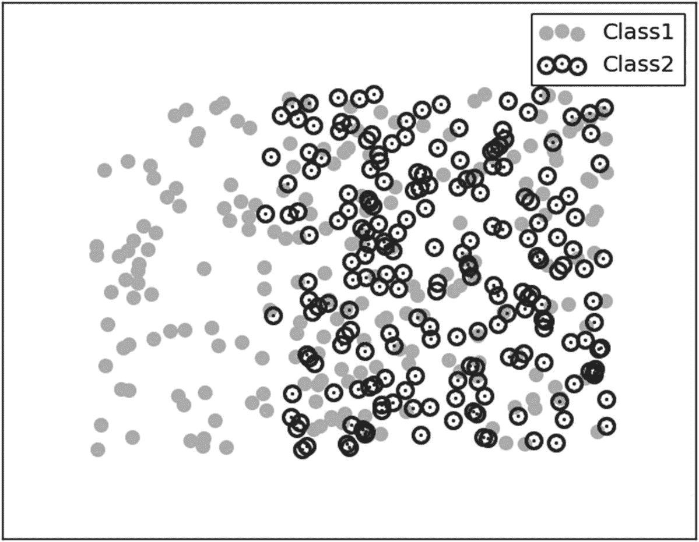

图 5-1

二类数据分布采用***【f】***<sub>**1**</sub>()。类别 1 样本表示为实心圆，类别 2 样本表示为空心圆。

为了解决这个问题，f <sub>1</sub> ()的结果将被用作另一个函数 f <sub>2</sub> ()的输入。因此，对于输入样本 s <sub>1</sub> ，其最终特征将是一连串函数 f<sub>2</sub>(f<sub>1</sub>(s<sub>1</sub>)的结果。数据分布如图 [5-2](#Fig2) 所示。看起来结果比上一次增强了很多。与第一种情况相比，重叠的百分比减少了，因为第二类中的一些样本明显远离第一类。尽管如此，这两个类别之间还是有重叠的。我们的目标是分割数据，使每个样本靠近其类中的样本，同时远离另一类中的样本。

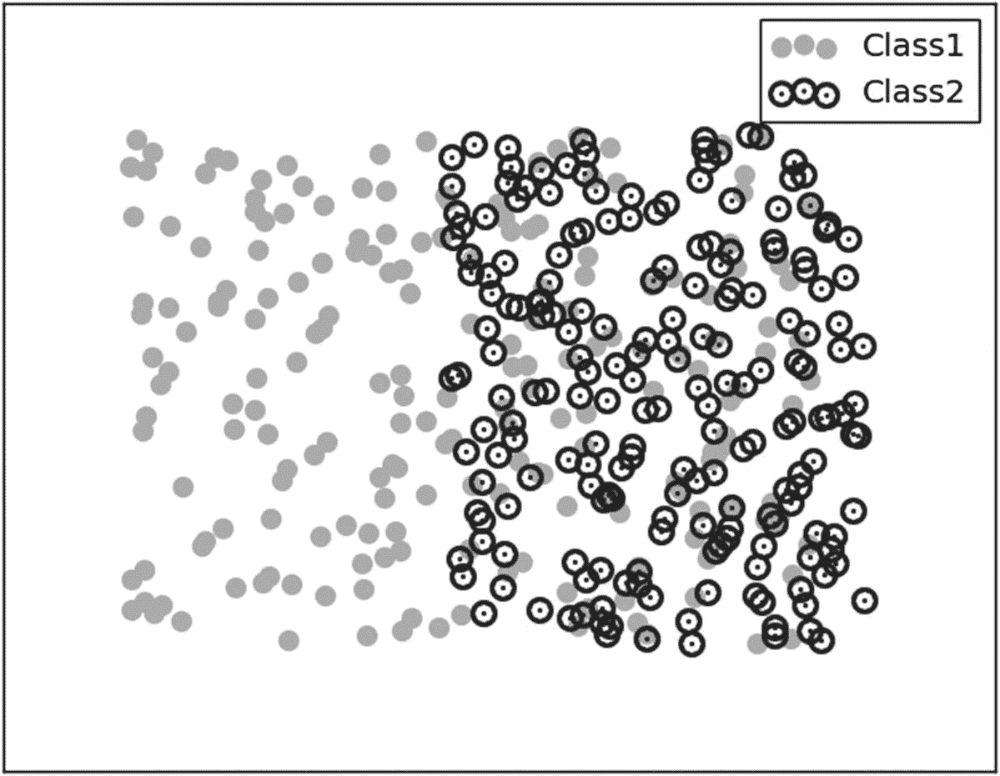

图 5-2

数据分配使用***f***<sub>**2**</sub>(***f***<sub>**1**</sub>())

为了增强分类的结果，我们可以使用 f <sub>2</sub> ()的输出作为另一个函数 f <sub>3</sub> ()的输入，这样函数链就是 f<sub>3</sub>(f<sub>2</sub>(f<sub>1</sub>())。根据图 [5-3](#Fig3) ，结果优于前两种情况。

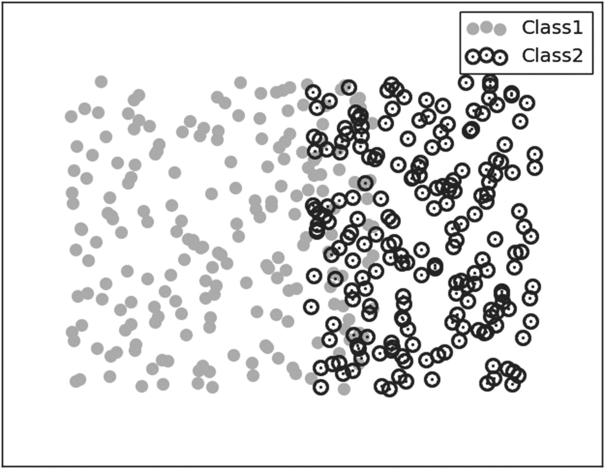

图 5-3

数据分布使用***f***<sub>**3**</sub>(***f***<sub>**2**</sub>(***f***<sub>**1**</sub>())

通过以同样的方式工作并使用第四个函数 **f** <sub>**4**</sub> ()，我们可以找到一个可接受的结果，如图 [5-4](#Fig4) 所示。此时，我们可以构建一个非常简单的线性分类器来分割数据。我们可能会注意到，在构建了一个健壮的特征函数之后，分类变得非常容易。这与图 [5-1](#Fig1) 中的不良特征函数相比，后者需要使用非常复杂的分类器。

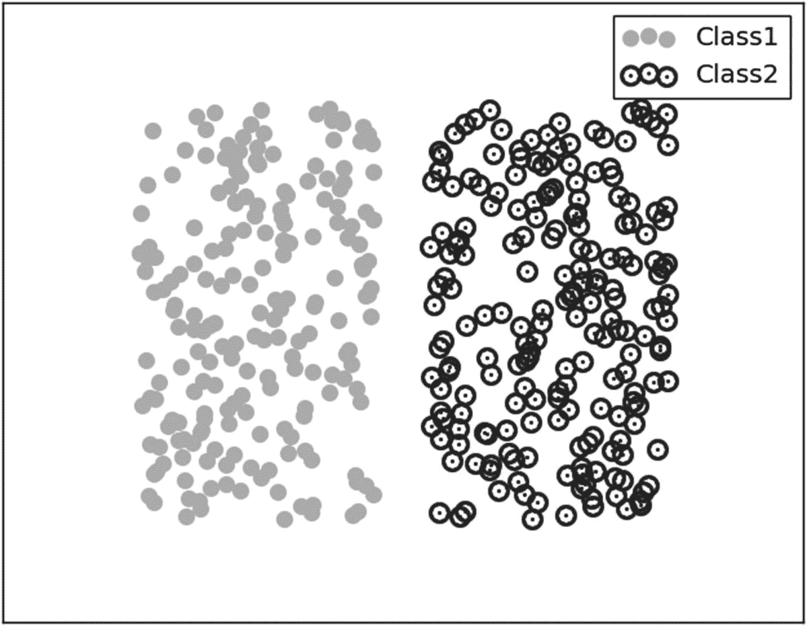

图 5-4

正确分离数据后的线性分类

前面的讨论总结了 DL 模型的目标，即自动特征转换。目标是创建一个特征变换函数，将数据样本从执行 ML 任务复杂的不良状态变换到任务较简单的另一种状态。

CNN 是这本书的重点，它接受纯图像像素，并自己找到对数据进行正确分类的最佳特征集。CNN 中的每一层都将数据从一种状态转换为另一种状态，以提高性能。人工神经网络的美妙之处在于它是一个通用的函数逼近器，可以逼近任何类型的函数。每个函数都有一组参数，即权重和偏差。一个功能(即层)的输出是另一个功能(即层)的输入。扩展 ANN 体系结构，直到分类性能达到最佳。例如，我们可以将之前讨论的每个步骤与一个隐藏层相关联，这样网络将具有如图 [5-5](#Fig5) 所示的架构。这就让大家了解了隐藏层的用处，这对于 ANN 的新手来说是个麻烦。

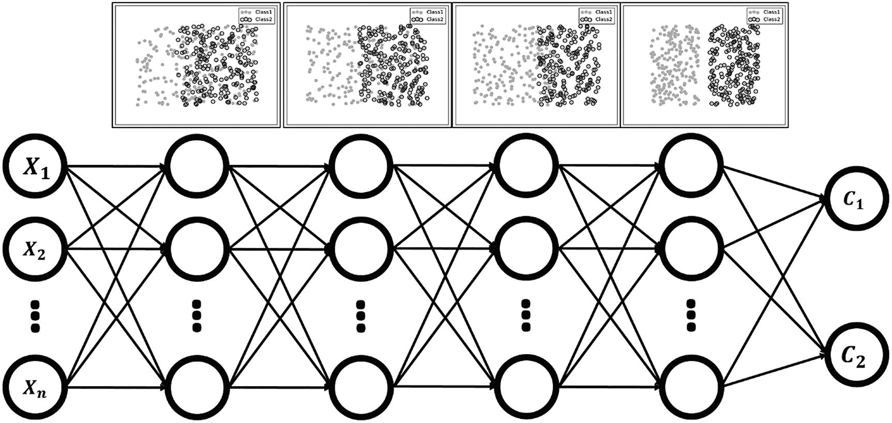

图 5-5

人工神经网络需要通过使用线性分类器来转换用于分类的数据

下一节讨论 CNN 是如何从人工神经网络衍生而来，以及它如何在图像分析中比传统的人工神经网络更有效。

### 卷积求导

图像分析面临许多挑战，例如分类、对象检测、识别、描述等等。例如，如果要创建一个图像分类器，它应该能够以高精度工作，即使存在诸如遮挡、照明变化、视角等变化。以特征工程为主要步骤的传统图像分类流水线不适合在丰富的环境中工作。即使是该领域的专家也无法给出一个或一组能够在不同变化下达到高精度的特征。从这个问题出发，就产生了特征学习的思想。自动学习适合处理图像的功能。这就是为什么人工神经网络是执行图像分析的最稳健的方法之一。基于诸如 GD 的学习算法，ANN 自动学习图像特征。原始图像被应用到人工神经网络，人工神经网络负责生成描述它的特征。

#### 使用 FC 网络的图像分析

让我们看看人工神经网络是如何处理图像的，以及为什么相对于图 [5-6](#Fig6) 中的 3×3 灰度图像，CNN 在时间和内存需求方面是高效的。为了简单起见，给出的例子使用了小的图像尺寸和较低数量的神经元。

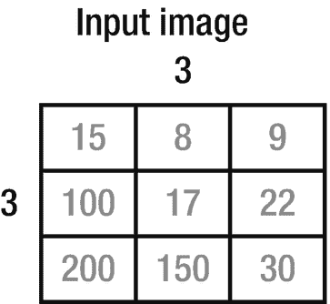

图 5-6

作为 FCNN 输入的微小图像

ANN 输入层的输入是图像像素。每个像素代表一个输入。因为人工神经网络处理的是 1D 向量，而不是 2D 矩阵，所以最好将之前的 2D 图像转换成 1D 向量，如图 [5-7](#Fig7) 所示。

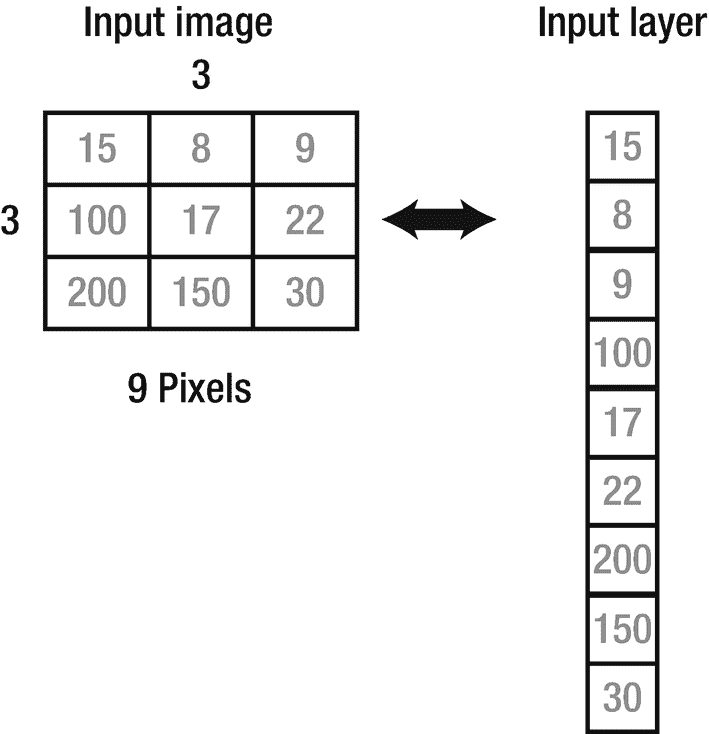

图 5-7

2D 图像到 1D 矢量

每个像素映射到向量中的一个元素。向量中的每个元素代表人工神经网络中的一个神经元。因为图像有 **3×3=9** 个像素，那么输入层会有 9 个神经元。将向量表示为行或列并不重要，但 ANN 通常水平延伸，其每一层都表示为列向量。

准备好人工神经网络的输入后，下一步是添加学习如何将图像像素转换为代表性特征的隐藏层。假设有一个 16 个神经元的单一隐藏层，如图 [5-8](#Fig8) 。

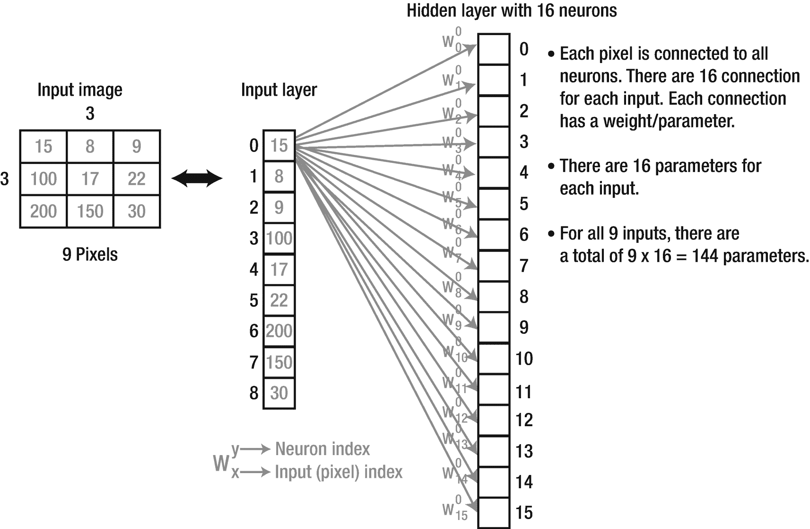

图 5-8

从单个输入神经元到所有隐含层神经元的连接

因为网络是 FC，这意味着层 **i** 中的每个神经元都连接到层 **i-1** 中的所有神经元。因此，隐藏层中的每个神经元都连接到输入层中的所有 9 个像素。换句话说，每个输入像素连接到隐藏层中的 16 个神经元，其中每个连接都有相应的唯一参数。通过将每个像素连接到隐藏层中的所有神经元，对于如图 [5-9](#Fig9) 所示的微型网络，将有 **9×16=144** 个参数或权重。

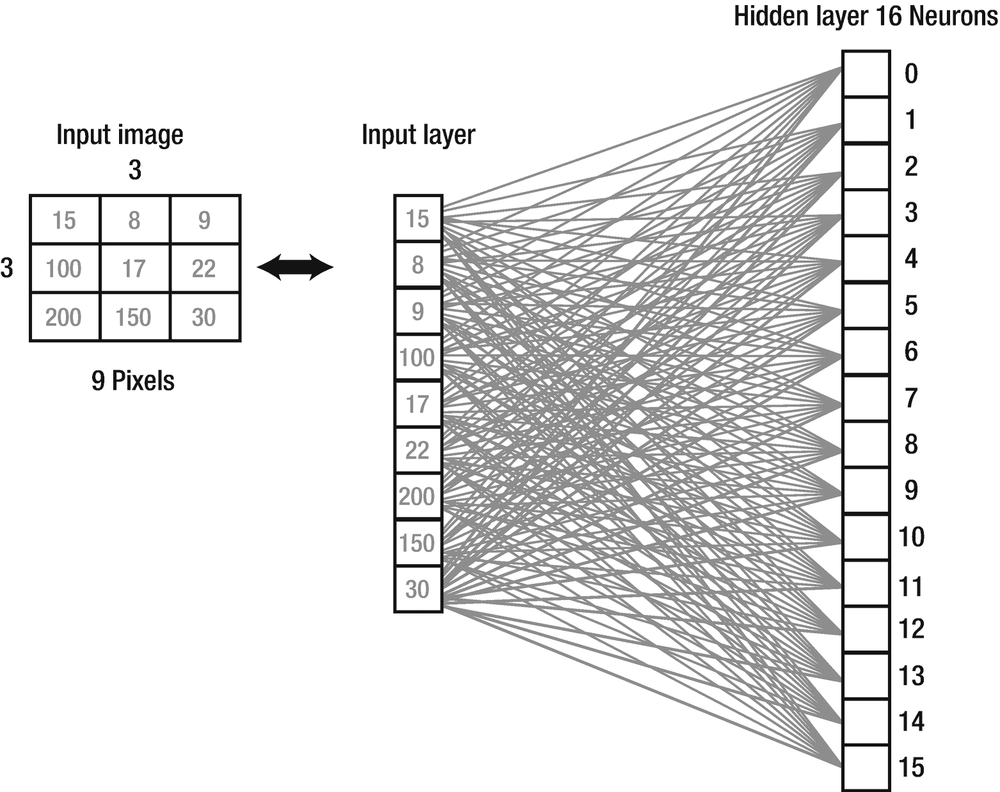

图 5-9

将所有输入神经元连接到所有隐藏层神经元

#### 大量参数

此 FC 网络中的参数数量似乎可以接受。但是随着图像像素和隐藏层数量的增加，这个数字会大大增加。

比如这个网络有两个隐层，分别是 90 和 50 个神经元，那么输入层和第一个隐层之间的参数个数是 **9×90=810** 。两个隐层之间的参数个数为**90×50 = 4500**。该网络的参数总数为**810+4500 = 5310**。对于这样一个网络来说，这是一个很大的数字。另一种情况是尺寸为 32×32(1024 像素)的非常小的图像。如果网络以 500 个神经元的单隐层运行，则总共有**1024 * 500 = 512000 个**参数(权重)。对于只有一个隐藏层处理小图像的网络来说，这是一个巨大的数字。必须有一个减少参数数量的解决方案。这就是 CNN 发挥关键作用的地方。它创建了一个非常大的网络，但参数比 FC 网络少。

#### 神经元分组

即使对于小的网络，使参数数量变得非常大的问题是 FC 网络在连续层中的每两个神经元之间添加一个参数。如图 [5-10](#Fig10) 所示，可以将单个参数赋予一个神经元块或一组神经元，而不是在每两个神经元之间分配单个参数。图 [5-8](#Fig8) 中索引为 0 的像素连接到索引为(0，1，2，3)的前四个神经元，具有四个不同的权重。如果神经元被分成如图 [5-10](#Fig10) 所示的四个一组，那么同一组中的所有神经元将被分配一个参数。

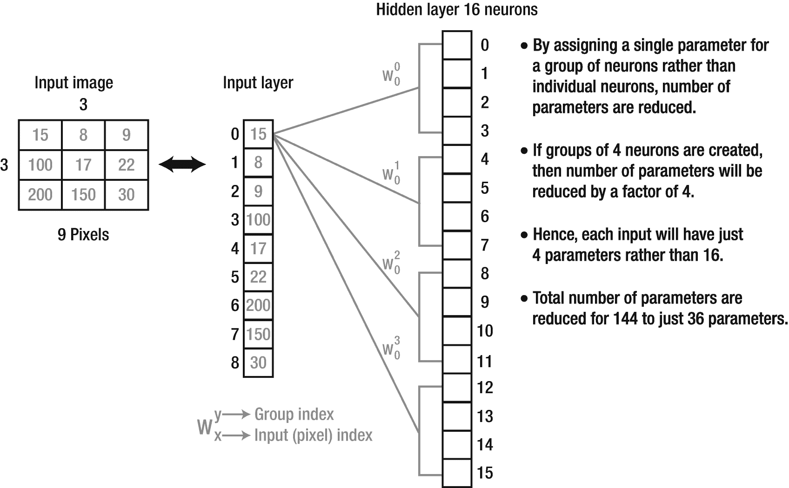

图 5-10

将每四个隐藏神经元分组以使用相同的权重

因此，图 [5-10](#Fig10) 中索引为 0 的像素将与图 [5-11](#Fig11) 中权重相同的前四个神经元相连。相同的参数被分配给每四个连续的神经元。结果，参数的数量减少了四分之一。每个输入神经元将有 **16/4=4** 个参数。整个网络将有 **144/4=36** 个参数。参数减少了 75%。这没问题，但是仍然可以减少更多的参数。

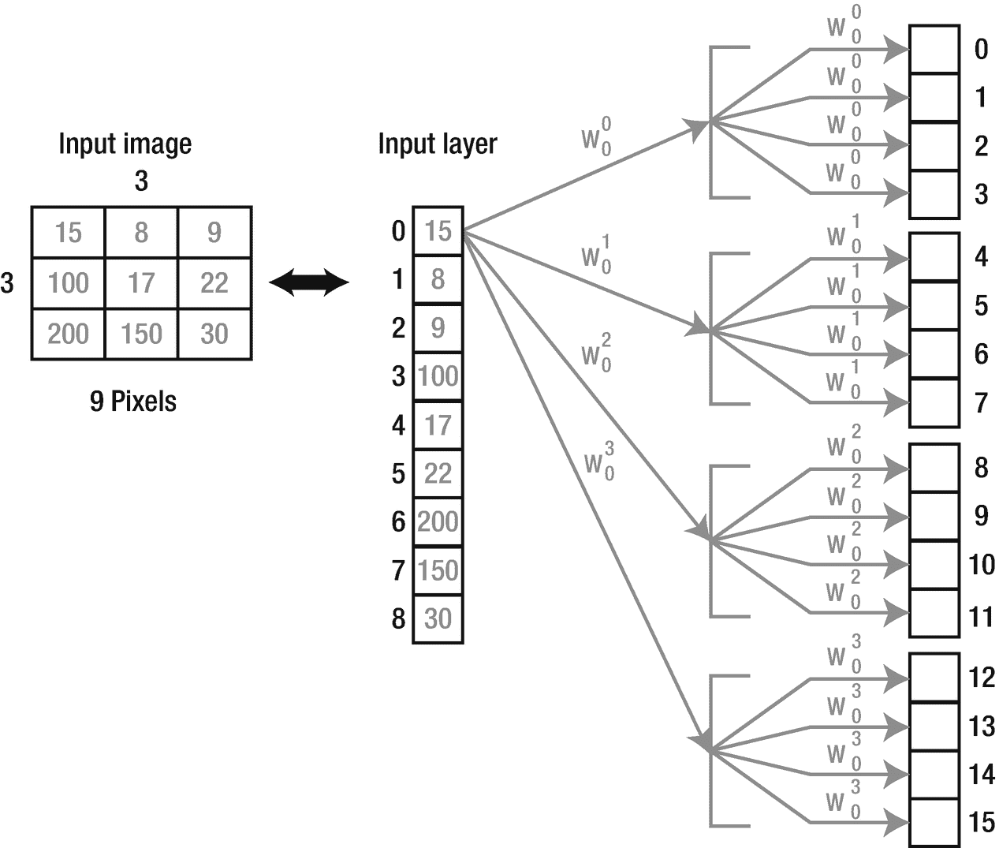

图 5-11

同一组中的所有神经元使用相同的权重

因为有四组神经元，这意味着这一层有四个过滤器。因此，该图层的输出将具有等于 3 的第三维，这意味着将返回三个过滤后的图像。CNN 的目标是找到使每个输入图像与其类别标签相关联的这种滤波器的最佳值。

图 [5-12](#Fig12) 显示了从每个像素到每组第一个神经元的独特连接。也就是说，所有缺失的连接都只是现有连接的副本。假设每个像素到每个组的每个神经元都有一个连接，如图 [5-9](#Fig9) ，因为网络还是 FC。

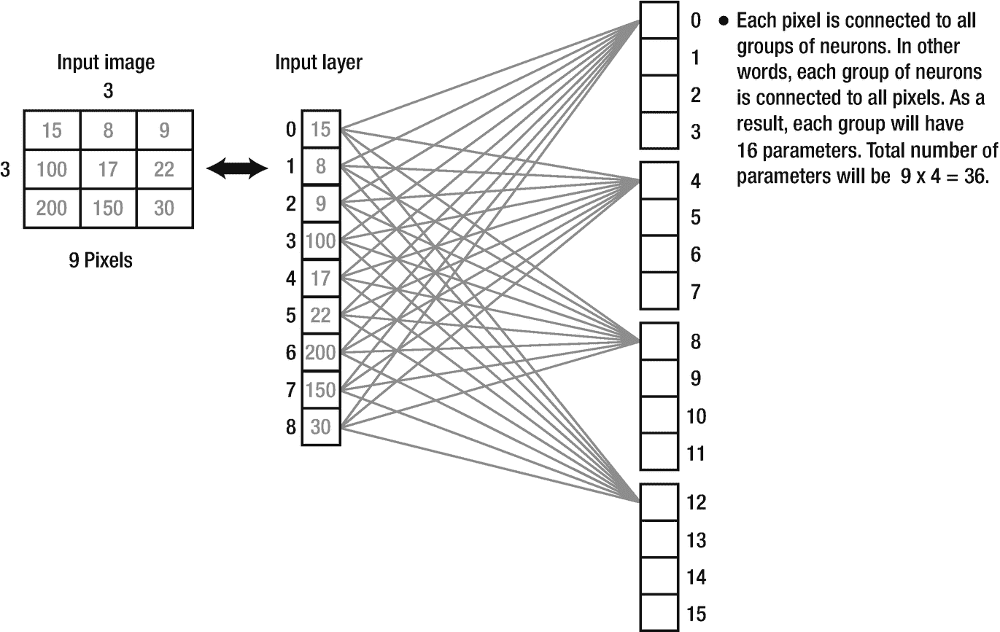

图 5-12

隐藏神经元分组后，输入层和隐藏层之间的唯一连接更少

为了简单起见，除了所有像素与第一组中的第一个神经元之间的连接之外，所有连接都被省略，如图 [5-13](#Fig13) 所示。似乎每个组仍然连接到所有 9 个像素，因此它将有 9 个参数。可以减少这个神经元连接到的像素的数量。

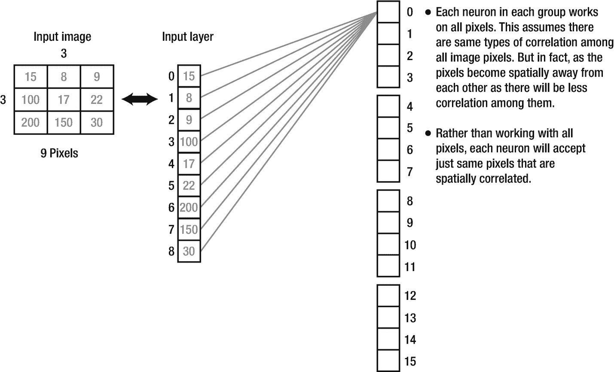

图 5-13

输入层中所有神经元与隐藏层中第一组神经元之间的连接

#### 像素空间相关性

当前配置使每个神经元接受所有像素。如果有一个函数 f(x1，x2，x3，x4)接受四个输入，这意味着将基于所有这四个输入做出决策。如果只有两个输入的函数给出的结果与使用所有四个输入的结果相同，那么我们不必使用所有这四个输入。给出所需结果的两个输入就足够了。这与前面的情况类似。每个神经元接受所有 9 个像素作为输入。如果使用更少的像素会返回相同或更好的结果，那么我们应该通过它。

通常，在图像分析中，每个像素与其周围的像素(即邻居)高度相关。两个像素之间的距离越大，它们就越不相关。例如，在图 [5-14](#Fig14) 所示的摄影师图像中，人脸内部的像素与其周围的人脸像素相关。但它与远处像素(如天空或地面)的相关性较小。


图 5-14

摄影师图像

基于这一假设，前面示例中的每个神经元将只接受彼此空间相关的像素，因为对所有像素进行处理是合理的。如图 [5-15](#Fig15) 所示，可以只选择 4 个空间相关的像素，而不是将所有 9 个像素作为输入应用于每个神经元。图像中位于(0，0)处的列向量中索引为 0 的第一个像素将作为输入应用于具有其 3 个最大空间相关像素的第一个神经元。基于输入图像，与该像素在空间上最相关的 3 个像素是索引为(0，1)、(1，0)和(1，1)的像素。因此，神经元将只接受 4 个像素，而不是 9 个。因为同一组中的所有神经元共享相同的参数，所以每组中的 4 个神经元将只有 4 个参数，而不是 9 个。因此，参数总数将为 4×4=16。与图 [5-9](#Fig9) 中的 FC 网络相比，减少了 144–16 = 128 个参数(即减少了 88.89%)。

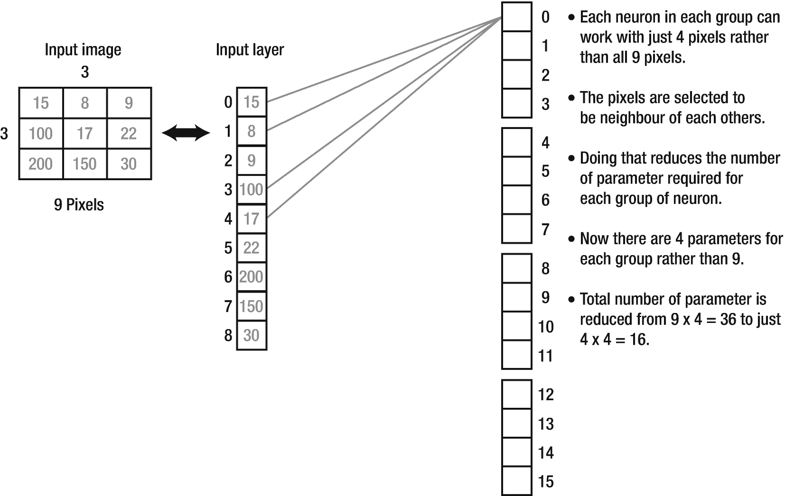

图 5-15

将第一组相关像素连接到第一组

#### CNN 中的卷积

至此，为什么 CNN 比 FC 网络更节省时间和内存的问题得到了解答。使用较少的参数允许增加具有大量层和神经元的深度 CNN，这在 FC 网络中是不可能的。接下来是得到 CNN 中卷积的思想。

现在只有四个权重分配给同一块中的所有神经元。这四个权重将如何覆盖所有 9 个像素？让我们看看这是如何工作的。

图 [5-16](#Fig16) 显示了图 [5-15](#Fig15) 中之前的网络，但在连接中添加了权重标签。在神经元内部，4 个输入像素中的每一个都乘以其相应的权重。该方程如图 [5-16](#Fig16) 所示。如图 [5-16](#Fig16) 所示，将四个像素和权重可视化为矩阵会更好。先前的结果将通过逐个元素地将权重矩阵乘以当前的 4 个像素的集合来实现。实际上，卷积掩模的尺寸应该是奇数，例如 3×3。为了便于演示，本例中使用了一个 2×2 的遮罩。

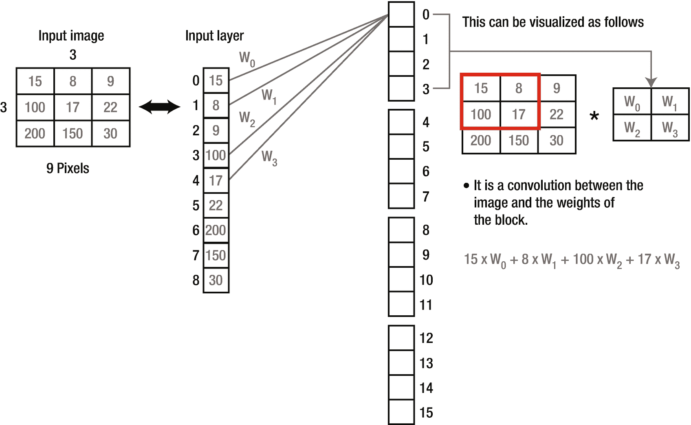

图 5-16

添加每个连接的权重并将它们可视化为矩阵

移动到索引为 1 的下一个神经元，它将与索引为 0 的神经元所使用的具有相同权重的另一组空间相关像素一起工作。此外，指数为 2 和 3 的神经元将与其他两组空间相关的像素一起工作。如图 [5-17](#Fig17) 所示。似乎组中的第一个神经元从左上角的像素开始，并选择其周围的多个像素。该组中的最后一个神经元处理右下角的像素及其周围的像素。调节中间神经元以选择中间像素。这种行为等同于组的权重集和图像之间的卷积。这就是为什么 CNN 有卷积这个术语。

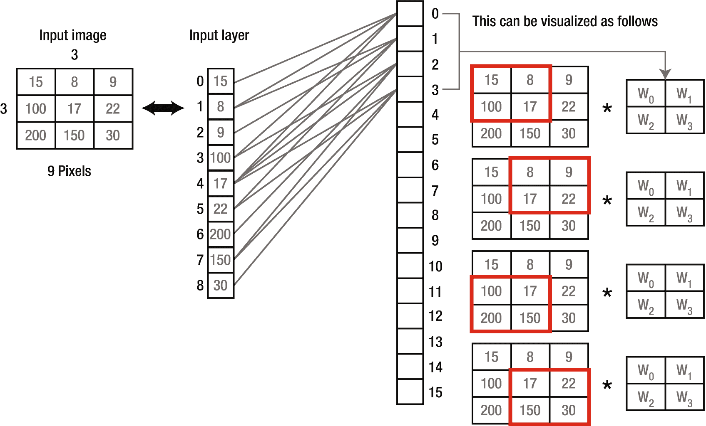

图 5-17

将每组相关像素及其权重高亮显示为矩阵

同样的程序也适用于其余的神经元群。每组的第一个神经元从左上角及其周围的像素开始。每组的最后一个神经元处理右下角及其周围的像素。中间神经元作用于中间像素。

在理解了 CNN 是如何从 ANN 导出之后，我们可以举一个例子，该例子在输入图像和滤波器(即一组权重)之间执行卷积，并产生其结果。

### 设计 CNN

在我们将要使用 CNN 设计的例子中，有三种形状:矩形、三角形和圆形。每一个都用一个 4×4 的矩阵来表示，如图 [5-18](#Fig18) 所示，其中 1 代表白色，0 代表黑色。目标是构建一个 CNN，当有矩形时返回 1，否则返回 0。我们如何做到这一点？

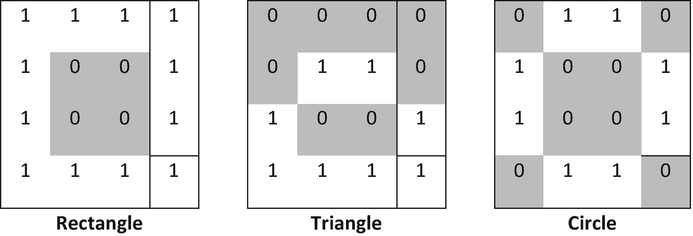

图 5-18

用 4×4 矩阵表示的矩形、三角形和圆形。像素 1 是白色，像素 0 是黑色。

开始设计 CNN 时，第一步是确定层数和每层中的滤波器数量。通常，CNN 不仅仅只有一个卷积(简称 conv)层，但是我们将只使用这一层。这样的问题可以自测一下。

首先，卷积层研究我们正在寻找的形状结构的构建块。所以，你要问自己的第一个问题是，与三角形和圆形相比，矩形有什么特别之处。矩形有四条边，两条垂直边和两条水平边。我们可以从这些信息中受益。但是还要注意，矩形中存在的属性不应该存在于其他形状中。其他形状已经具有不同的属性。其他两个形状都没有两条水平边和两条垂直边。这太棒了。

接下来的问题是如何让卷积层识别出边缘的存在。请记住，CNN 首先识别形状的单个元素，然后将这些元素连接在一起。因此，我们不是寻找四条边，也不是寻找两条平行的垂直边和两条平行的水平边，而是识别任何垂直或水平边。所以，问题变得更具体了。我们如何识别垂直或水平边缘？这可以简单地用渐变来完成。

第一层将有一个寻找水平边缘的过滤器和另一个寻找垂直边缘的过滤器。这些滤波器在图 [5-19](#Fig19) 中显示为 3×3 矩阵。因此，我们知道有多少过滤器使用在第一 conv 层，也知道这些过滤器是什么。选择 3×3 的大小用于滤波器，因为这是水平和垂直边缘的结构清晰的良好大小。

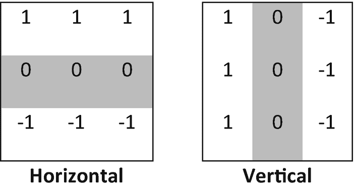

图 5-19

用于识别大小为 3×3 的水平和垂直边缘的过滤器

在对图 [5-19](#Fig19) 中的矩阵应用这些过滤器后，conv 层将能够识别图 [5-20](#Fig20) 中的垂直边缘和图 [5-21](#Fig21) 中的水平边缘。该层能够识别矩形中的水平和垂直边缘。它还识别三角形底部的水平边缘。但是圆里没有边。目前，CNN 有两个候选矩形，它们是至少有一条边的形状。尽管确信第三个形状不可能是矩形，CNN 必须将它传播到其他层，直到在最后一层做出决定。因为在第一 conv 层中使用了两个滤波器，所以产生了两个输出，每个滤波器一个输出。

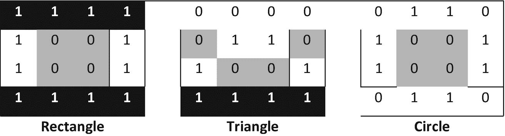

图 5-21

黑色的可识别水平边缘

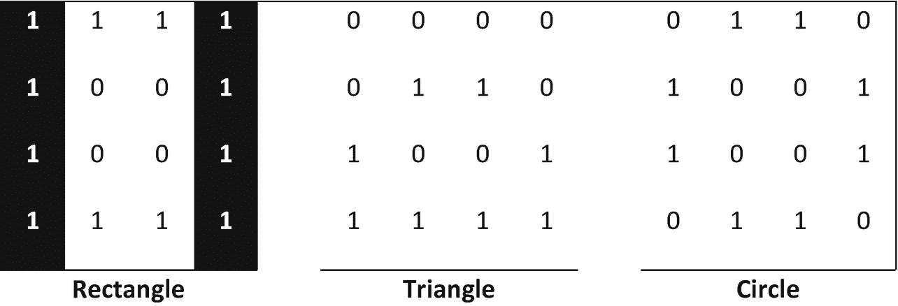

图 5-20

黑色的可识别垂直边缘

下一个卷积层将接受第一个卷积层的结果，并基于它继续。让我们重复第一层问的同样的问题。要使用的过滤器数量是多少，它们的结构是什么？基于矩形结构，我们发现每条水平边都与一条垂直边相连。因为有两条水平边，这需要使用图 [5-22](#Fig22) 中尺寸为 3×3 的两个过滤器。

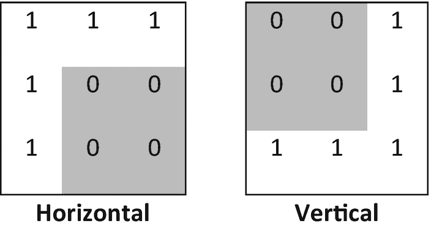

图 5-22

用于识别大小为 3×3 的水平和垂直连接边的过滤器

将这些过滤器应用于 conv 层 1 的结果后，第二个 conv 层中使用的过滤器的结果分别如图 [5-23](#Fig23) 和图 [5-24](#Fig24) 所示。对于矩形，过滤器能够找到两条所需的边并将它们连接在一起。在三角形中，只有一条水平边，没有垂直边与之相连。因此，三角形没有正输出。

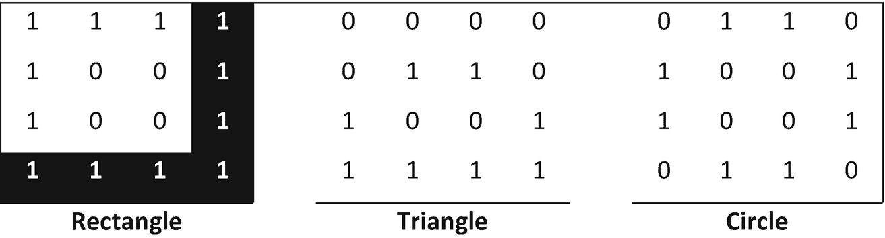

图 5-24

黑色第二层中第二个滤镜的结果

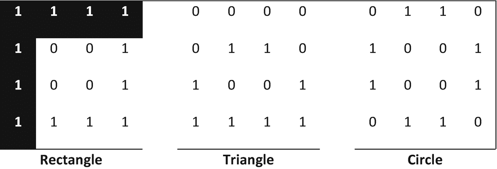

图 5-23

黑色第二层中第一个滤镜的效果

从目前的结果来看，我们还没有识别出那个矩形，但是到目前为止我们已经做得很好了。我们将各个边缘连接到更有意义的结构上。现在，识别完整形状只需一步，即连接图 [5-23](#Fig23) 和 [5-24](#Fig24) 中识别出的边。结果如图 [5-25](#Fig25) 所示。这太棒了。

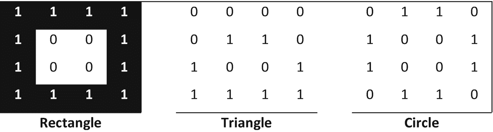

图 5-25

通过第二 conv 层连接已识别形状的结果

但是我们是手动完成的，不是自动完成的。我们通过告诉 CNN 使用过滤器来引导它。但在常规问题中却不是这样。CNN 会自己找到过滤器。我们只是试图通过使用正确的过滤器来简化事情。记住，这些过滤器和不同层之间的连接权重是由 CNN 自动调整的。因此，找到正确的过滤器意味着找到正确的权重。这将我们现在学到的东西与我们以前得到的东西联系起来。

### 参数缩减的池化操作

卷积运算只是找到蒙版和与滤镜大小相同的图像部分之间的点积。如果滤波器匹配图像的一部分，那么 SOP 将会很高。假设应用卷积运算的输出如图 [5-26](#Fig26) 所示。

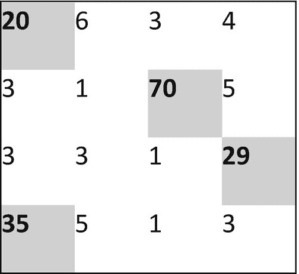

图 5-26

卷积运算的结果

阴影区域是图像部分和所使用的滤波器之间高度匹配的区域。请注意，这里有两条信息:

1.  高分的存在意味着图像中存在感兴趣区域(ROI)。

2.  高分的位置告诉图像中在过滤器和图像部分之间出现匹配的位置。

但是我们对这两条信息都感兴趣吗？答案是否定的。我们只是对第二部分感兴趣。这是因为 CNN 的唯一目标是告诉目标物体是否存在于图像中。我们对本地化不感兴趣。

因此，如果我们不关心确切的位置，我们可以避免存储这样的空间信息。例如，我们可以说 ROI 存在于图像中，但是避免存储它的确切位置。如果我们这样做，先前的矩阵大小将会减小，如图 [5-27](#Fig27) 所示。

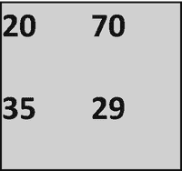

图 5-27

卷积运算的结果

我们可以去掉额外的信息，因为它对我们来说并不重要。我们只是保留了匹配发生的信息。这是通过保持卷积输出矩阵的最大值来实现的。找到高分告诉我们有匹配。

但是我们如何减少矩阵的大小呢？例如，这是通过保持每个 2×2 区域的最大值来实现的。这种操作称为最大池化。

通过应用最大池操作，在计算时间和内存需求方面有一个非常重要的改进。它不是在内存中保存一个 4×4 大小的矩阵，而是缩小到一半大小(2×2)。这通过只保留 4 个值而不是 16 个值来节省内存。此外，由于最大池化操作的输出将是另一个卷积操作的输入，因此减少了时间。这个卷积运算将在大小为 2×2 而不是 4×4 的矩阵上工作。

最后，应用最大池操作通过移除在 CNN 中对我们不重要的虚假特征(这是匹配发生的确切位置)来帮助我们减少计算时间和存储器需求。这个操作使得 CNN 平移不变性。

### 卷积运算示例

本小节举例说明了如何对图 [5-28](#Fig28) 所示的 2D 图像中 8×8 的样本进行卷积运算。卷积中将使用单个滤波器，即图 [5-19](#Fig19) 中的水平梯度检测器。卷积的应用方式是将滤波器置于每个像素的中心，将滤波器中的每个元素乘以图像中相应的像素，返回新图像中这些乘积的总和。

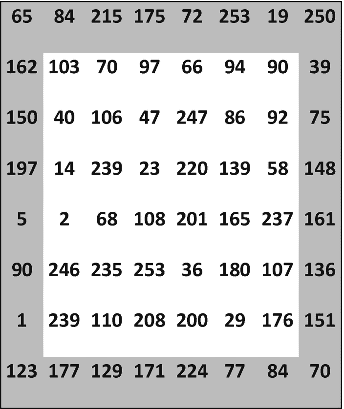

图 5-28

要应用卷积运算的大小为 8×8 的图像样本

因为过滤器的大小是 3×3，并且它的每个元素都乘以图像中的一个元素，所以在将过滤器居中在任何像素上之后，必须有一个元素对应于过滤器中的每个元素。很明显，这不适用于图像的边界(即除了顶行和底行之外的最左边和最右边的列)，如图 [5-28](#Fig28) 中的灰色标记。在这种情况下有两种解决方案。第一种是通过用零填充额外的行和列来继续处理像素，或者换句话说，如果过滤器没有相应的图像像素，则将任何元素乘以零。这将产生与原始图像大小相等的输出图像。

在这种情况下，根据等式 5-1 计算在顶部和底部边界填充所需的行数。根据等式 5-2 计算左侧和右侧的填充列数。对于过滤器大小为 3×3 的示例，需要填充两行和两列。

*填充* <sub>*行*</sub> = *楼层* ( *过滤* <sub>*行*</sub> /2)(等式 5-1)

*填充* <sub>*列*</sub> = *楼层* ( *过滤* <sub>*列*</sub> /2)(等式 5-2)

在大多数情况下，筛选器中的行数和列数是奇数。这有助于定位将要插入 SOP 的中心像素。

第二个解决方案是避免使用图像边框。在这种情况下，结果图像的大小将小于原始图像的大小。输出图像中的行数和列数分别根据等式 5.3 和 5.4 计算。对于大小为 8×8 的输入图像，结果图像的大小为 6×6。

*new size*<sub>*rows*</sub>=*OldSize*<sub>*rows*</sub>2*XP adding*<sub>*rows*</sub>(方程式 5-3)

*新闻* <sub>*新闻*</sub> = *新闻*<sub>*新闻*新闻*新闻<sub>新闻*新闻*</sub>新闻*新闻<sub>新闻*新闻*</sub>新闻**</sub>新闻*新闻】新闻*新闻*新闻新闻新闻*新闻*新闻*新闻】********

假设没有使用填充，那么要处理的第一个像素是位于第二行第二列的值为 103 的像素。将滤波器置于该像素的中心，并将每个元素乘以其对应的像素，SOP 如下:

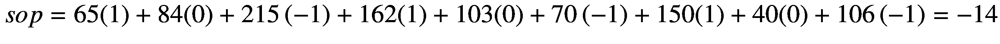

该结果被插入到位于左上行和左上列的像素处的新图像中。计算一个像素的输出后，下一步是移动滤镜以获得另一个像素。所需的移动次数称为步幅。步长为 1 时，过滤器一次移动一列/一行。在当前步骤中，它会将过滤器向右移动一列，并将过滤器置于第二行第三列中值为 70 的像素的中心。跨距 2 一次将滤波器移动两列/行，因此当前像素将是 97。

使用步长 1，我们将从第 2 列到第 7 列开始继续计算第一行中所有像素的 SOP，每次计算 SOP。此后，滤波器向下移动一行，因此当前像素将位于第三行第二列。图 [5-29](#Fig29) 显示了没有填充和使用步长为 1 的最终结果。

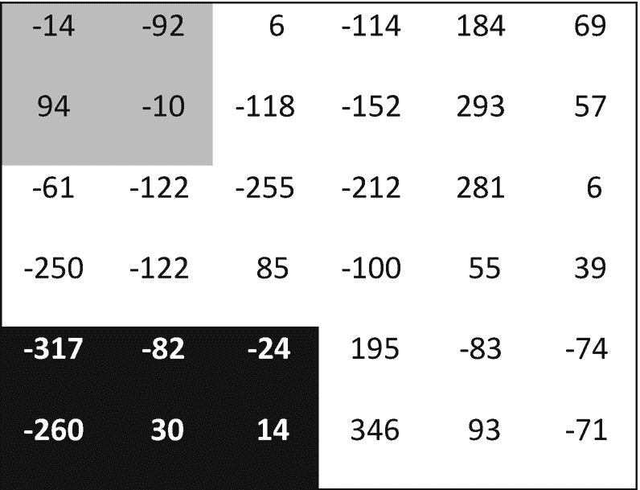

图 5-29

8×8 大小的图像和 3×3 过滤器之间的卷积输出

### 最大池操作示例

假设有一个 conv 层产生了图 [5-29](#Fig29) 中的先前结果，并且该层与一个最大池层相连，让我们来计算其输出。

最大池层选择一组像素，通过仅保留它们的最大值来汇总成单个像素。如果使用尺寸为 2×2 的掩模，它将从图 [5-29](#Fig29) 中用灰色标记的左上角 4 个像素开始。它们的最大值是 94，也就是输出。与卷积类似，最大池将移动蒙版以在另外 4 个像素上工作，因此它需要一个步长。池层的跨距值至少等于 2。原因是跨距为 1 将复制没有输出的值，这是没有帮助的。在图 [5-29](#Fig29) 中突出显示的黑色像素中，前两列的最大合并操作结果将是 30。使用步长 1 并将掩码向右移动一列，对以黑色突出显示的最后两列执行此操作的结果也是 30。结果，值 30 出现了两次。多次返回同一个值有帮助吗？第一次返回的值 30 意味着卷积滤波器和等于 30 的图像之间存在匹配。所以，我们得到了那个信息。没有必要再重复了。步幅为 1 的工作将使用更多的参数来返回我们不感兴趣的重复结果。因此，步幅为 2 会有所帮助。

对图 [5-29](#Fig29) 中的卷积结果应用最大汇集运算的结果如图 [5-30](#Fig30) 所示。

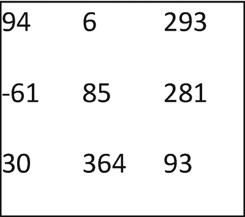

图 5-30

使用大小为 2×2 的掩码的最大池输出

## 从头开始使用 NumPy 构建 CNN

CNN 是分析图像等多维信号的最先进技术。已经有不同的库实现了 CNN，比如 TensorFlow (TF)和 Keras。这些库将开发人员从一些细节中隔离出来，只给出一个抽象的应用程序接口(API ),使生活变得更容易，并避免实现中的复杂性。但实际上，这些细节可能会有所不同。有时，数据科学家必须仔细检查这些细节以提高性能。这种情况下的解决方案是自己构建模型的每一部分。这提供了对网络的最高级别的控制。

建议实现这样的模型，以便更好地理解它们。有些想法看起来很清楚，但实际上可能不是这样，直到编程。在了解 CNN 的工作原理后，这样做就很容易了。本节展示了如何使用 NumPy 从头开始实现 CNN。因此，让我们实现它，并将其输出与 TF 进行比较，以验证实现。

在本节中，仅使用 NumPy 库创建了一个 CNN。创建了三层:卷积(简称 conv)、ReLU 和最大/平均池。涉及的主要步骤如下:

1.  读取输入图像。

2.  准备过滤器。

3.  Conv 层:卷积每个滤波器与输入图像。

4.  ReLU 图层:在要素地图上应用 ReLU 激活功能(conv 图层的输出)。

5.  最大池层:在 ReLU 层的输出上应用池操作。

6.  堆叠 conv、ReLU 和 max 池层。

### 读取输入图像

清单 [5-1](#PC1) 从 skimage Python 库中读取一个已经存在的图像，并将其转换成灰色。

```py
import skimage.data
# Reading the image
img = skimage.data.chelsea()
# Converting the image into gray.
img = skimage.color.rgb2gray(img)

Listing 5-1Reading an Image

```

这个例子使用了 skimage Python 库中已经存在的图像。使用`skimage.data.chelsea()`调用图像。注意，这个调用隐式地读取了 skimage 库安装目录中名为“chelsea.png”的图像文件。也可以通过将其路径传递给`skimage.data.imread(fname)`来读取图像。例如，如果库位于“Lib\site-packages\skimage\data”中，那么我们可以这样阅读它:

```py
img = skimage.data.chelsea("\AhmedGad\Anaconda3\Lib\site-packages\skimage\data\chelsea.png")

```

读取图像是第一步，因为接下来的步骤取决于输入尺寸。转换成灰色后的图像如图 [5-31](#Fig31) 所示。

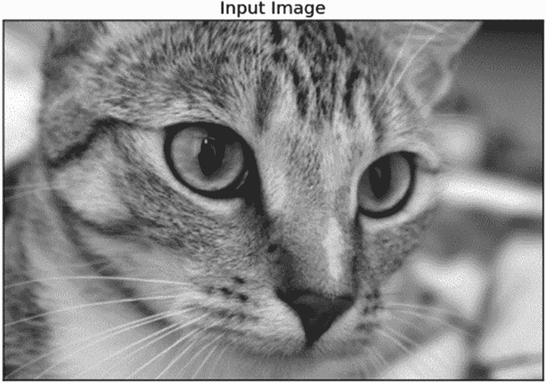

图 5-31

使用 skimage.data.chelsea()读取原始灰度图像

### 准备过滤器

下面一行为第一个 conv 层准备滤波器组(简称 **l1** ):

```py
l1_filter = numpy.zeros((2,3,3))

```

根据过滤器的数量和每个过滤器的大小创建零数组。创建两个大小为 **3×3** 的过滤器；这就是为什么零数组的大小为(**2**=数量 _ 过滤器，**3**=数量 _ 行 _ 过滤器，**3**=数量 _ 列 _ 过滤器)。滤波器的大小被选择为没有深度的 2D 阵列，因为输入图像是灰色的并且没有深度(即 2D)。如果图像是具有三个通道的 RGB，则滤镜大小必须为(3，3，**3**=深度)。

滤波器组的大小由前面的零数组指定，而不是由滤波器的实际值指定。可以覆盖以下值来检测垂直和水平边缘。

```py
l1_filter[0, :, :] = numpy.array([[[-1, 0, 1],
                                   [-1, 0, 1],
                                   [-1, 0, 1]]])
l1_filter[1, :, :] = numpy.array([[[1,   1,  1],
                                   [0,   0,  0],
                                   [-1, -1, -1]]])

```

### Conv 层

准备好滤波器后，下一步是用它们对输入图像进行卷积。下一行使用名为 **conv** 的函数将图像与滤波器组进行卷积:

```py
l1_feature_map = conv(img, l1_filter)

```

这个函数只接受两个参数，图像和滤波器组，如清单 [5-2](#PC6) 所示。

```py
def conv(img, conv_filter):
    if len(img.shape) > 2 or len(conv_filter.shape) > 3: # Check if number of image channels matches the filter depth.
        if img.shape[-1] != conv_filter.shape[-1]:
            print("Error: Number of channels in both image and filter must match.")
            sys.exit()
    if conv_filter.shape[1] != conv_filter.shape[2]:
        print('Error: Filter must be a square matrix, i.e., number of rows and columns must match.')
        sys.exit()
    if conv_filter.shape[1]%2==0: # Check if filter dimensions are odd.
        print('Error: Filter must have an odd size, i.e., number of rows and columns must be odd.')
        sys.exit()

    # An empty feature map to hold the output of convolving the filter(s) with the image.
    feature_maps = numpy.zeros((img.shape[0]-conv_filter.shape[1]+1,
                                img.shape[1]-conv_filter.shape[1]+1,
                                conv_filter.shape[0]))

    # Convolving the image by the filter(s).
    for filter_num in range(conv_filter.shape[0]):
        print("Filter ", filter_num + 1)
        curr_filter = conv_filter[filter_num, :] # getting a filter from the bank.

        # Checking if there are multiple channels for the single filter.
        # If so, then each channel will convolve the image.
        # The result of all convolutions is summed to return a single feature map.

        if len(curr_filter.shape) > 2:
            conv_map = conv_(img[:, :, 0], curr_filter[:, :, 0]) # Array holding the sum of all feature maps.
            for ch_num in range(1, curr_filter.shape[-1]): # Convolving each channel with the image and summing the results.
                conv_map = conv_map + conv_(img[:, :, ch_num],
                                  curr_filter[:, :, ch_num])
        else: # There is just a single channel in the filter.
            conv_map = conv_(img, curr_filter)
        feature_maps[:, :, filter_num] = conv_map # Holding feature map with the current filter.
    return feature_maps # Returning all feature maps.

Listing 5-2Convolving the Image by a Single Filter

```

该功能首先确保每个滤镜的深度等于图像通道的数量。在下面的代码中，外部的`if`检查通道和过滤器是否有深度。如果深度已经存在，那么内部的`if`检查它们的不相等。如果不匹配，那么脚本将退出。

```py
if len(img.shape) > 2 or len(conv_filter.shape) > 3: # Check if number of image channels matches the filter depth.
        if img.shape[-1] != conv_filter.shape[-1]:
            print("Error: Number of channels in both image and filter must match.")
            sys.exit()

```

此外，过滤器的大小应该是奇数，并且过滤器尺寸应该相等(即，行数和列数是奇数并且相等)。如果阻塞，则根据以下两个**进行检查。如果这些条件不满足，脚本将退出。**

```py
if conv_filter.shape[1] != conv_filter.shape[2]: # Check if filter dimensions are equal.
    print('Error: Filter must be a square matrix, i.e., number of rows and columns must match.')
    sys.exit()
if conv_filter.shape[1]%2==0:
    print('Error: Filter must have an odd size, i.e., number of rows and columns must be odd.')
    sys.exit()

```

不满足上述条件中的任何一个都证明了滤波器深度适合图像，并且卷积准备好被应用。通过滤波器对图像进行卷积，首先初始化一个数组，通过根据以下代码指定其大小来保存卷积的输出(即特征图):

```py
# An empty feature map to hold the output of convolving the filter(s) with the image.
feature_maps = numpy.zeros((img.shape[0]-conv_filter.shape[1]+1,
                            img.shape[1]-conv_filter.shape[1]+1,
                            conv_filter.shape[0]))

```

因为没有跨距或填充，所以特征映射大小将等于(img_rows-filter_rows+1，image_columns-filter_columns+1，num_filters ),如前面的代码所示。注意，组中的每个滤波器都有一个输出特征映射。这就是为什么使用滤波器组中的滤波器数量(**conv _ 滤波器.形状[0]** )来指定大小作为第三个参数。准备好卷积运算的输入和输出后，下一步是根据清单 [5-3](#PC10) 应用它。

```py
    # Convolving the image by the filter(s).
    for filter_num in range(conv_filter.shape[0]):
        print("Filter ", filter_num + 1)
        curr_filter = conv_filter[filter_num, :] # getting a filter from the bank.

        # Checking if there are multiple channels for the single filter.
        # If so, then each channel will convolve the image.
        # The result of all convolutions is summed to return a single feature map.

        if len(curr_filter.shape) > 2:
            conv_map = conv_(img[:, :, 0], curr_filter[:, :, 0]) # Array holding the sum of all feature maps.
            for ch_num in range(1, curr_filter.shape[-1]): # Convolving each channel with the image and summing the results.
                conv_map = conv_map + conv_(img[:, :, ch_num],
                                  curr_filter[:, :, ch_num])
        else: # There is just a single channel in the filter.
            conv_map = conv_(img, curr_filter)
        feature_maps[:, :, filter_num] = conv_map # Holding feature map with the current filter.
    return feature_maps # Returning all feature maps.

Listing 5-3Convolving the Image by Filters

```

外部循环对滤波器组中的每个滤波器进行迭代，并根据以下代码行返回它以进行进一步的步骤:

```py
curr_filter = conv_filter[filter_num, :] # getting a filter from the bank.

```

如果要卷积的图像有多个通道，则滤波器的深度必须等于通道数。在这种情况下，卷积是通过将每个图像通道与其在滤波器中的对应通道进行卷积来完成的。最后，结果的总和将是输出特征图。如果图像只有一个通道，那么卷积将是简单的。确定该行为是在`if-else`块中完成的:

```py
if len(curr_filter.shape) > 2:
     conv_map = conv_(img[:, :, 0], curr_filter[:, :, 0]) # Array holding the sum of all feature map
     for ch_num in range(1, curr_filter.shape[-1]): # Convolving each channel with the image and summing the results.
        conv_map = conv_map + conv_(img[:, :, ch_num],
                                  curr_filter[:, :, ch_num])
else: # There is just a single channel in the filter.
    conv_map = conv_(img, curr_filter)

```

你可能会注意到，卷积是由一个名为 **conv_，**的函数应用的，它不同于 **conv** 函数。函数 **conv** 只接受输入图像和滤波器组，但不应用自己的卷积。它只是将每组输入滤波器对传递给 **conv_** 函数进行卷积。这只是为了使代码更容易研究。清单 [5-4](#PC13) 给出了 **conv_** 函数的实现。

```py
def conv_(img, conv_filter):
    filter_size = conv_filter.shape[1]
    result = numpy.zeros((img.shape))
    #Looping through the image to apply the convolution operation.
    for r in numpy.uint16(numpy.arange(filter_size/2.0,
                          img.shape[0]-filter_size/2.0+1)):
        for c in numpy.uint16(numpy.arange(filter_size/2.0,
                                           img.shape[1]-filter_size/2.0+1)):

            # Getting the current region to get multiplied with the filter.
            # How to loop through the image and get the region based on
            # the image and filer sizes is the most tricky part of convolution.

            curr_region = img[r-numpy.uint16(numpy.floor(filter_size/2.0)):r+numpy.uint16(numpy.ceil(filter_size/2.0)),
                              c-numpy.uint16(numpy.floor(filter_size/2.0)):c+numpy.uint16(numpy.ceil(filter_size/2.0))]
            #Element-wise multiplication between the current region and the filter.
            curr_result = curr_region * conv_filter
            conv_sum = numpy.sum(curr_result) #Summing the result of multiplication.
            result[r, c] = conv_sum #Saving the summation in the convolution layer feature map.

    #Clipping the outliers of the result matrix.
    final_result = result[numpy.uint16(filter_size/2.0):result.shape[0]-numpy.uint16(filter_size/2.0),
                          numpy.uint16(filter_size/2.0):result.shape[1]-numpy.uint16(filter_size/2.0)]
    return final_result

Listing 5-4Convolving the Image by All Filters

```

它对图像进行迭代，并根据以下代码行提取与过滤器大小相等的区域:

```py
curr_region = img[r-numpy.uint16(numpy.floor(filter_size/2.0)):r+numpy.uint16(numpy.ceil(filter_size/2.0)),
                              c-numpy.uint16(numpy.floor(filter_size/2.0)):c+numpy.uint16(numpy.ceil(filter_size/2.0))]

```

然后，它在区域和过滤器之间应用元素级乘法，并对它们求和，以获得作为输出的单个值，如下所示:

```py
#Element-wise multiplication between the current region and the filter.
curr_result = curr_region * conv_filter
conv_sum = numpy.sum(curr_result)
result[r, c] = conv_sum

```

在通过输入对每个滤波器进行卷积之后，特征图由 **conv** 函数返回。图 [5-32](#Fig32) 显示了该 conv 图层返回的特征地图。在本章的最后，清单 [5-9](#PC25) 显示了代码中讨论的所有层的结果。

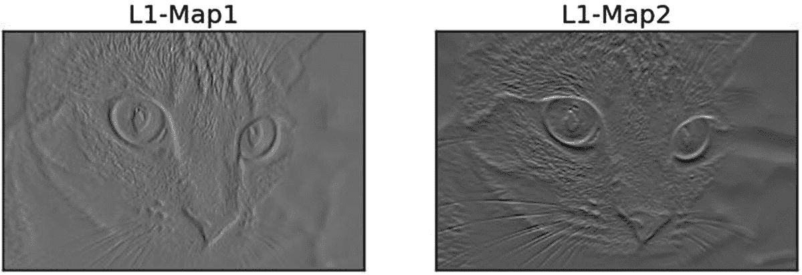

图 5-32

第一个 conv 图层的输出要素地图

这种层的输出将被应用到 ReLU 层。

### 图层继电器

ReLU 图层对 conv 图层返回的每个要素地图应用 ReLU 激活函数。根据以下代码行，使用 **relu** 函数调用它:

```py
l1_feature_map_relu = relu(l1_feature_map)

```

清单 [5-5](#PC17) 中实现了 **relu** 功能。

```py
def relu(feature_map):
    #Preparing the output of the ReLU activation function.
    relu_out = numpy.zeros(feature_map.shape)
    for map_num in range(feature_map.shape[-1]):
        for r in numpy.arange(0,feature_map.shape[0]):
            for c in numpy.arange(0, feature_map.shape[1]):
                relu_out[r, c, map_num] = numpy.max([feature_map[r, c, map_num], 0])
    return relu_out

Listing 5-5ReLU Implementation

```

这很简单。只需遍历特征映射中的每个元素，如果大于 0，则返回特征映射中的原始值。否则，返回 0。ReLU 层的输出如图 [5-33](#Fig33) 所示。

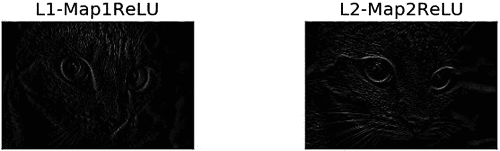

图 5-33

ReLU 层输出应用于第一个 conv 层的输出

ReLU 层的输出被应用到 max pooling 层。

### 最大池层

最大池层接受 ReLU 层的输出，并根据以下代码行应用最大池操作:

```py
l1_feature_map_relu_pool = pooling(l1_feature_map_relu, 2, 2)

```

根据清单 [5-6](#PC19) 使用**池**函数实现。

```py
def pooling(feature_map, size=2, stride=2):
    #Preparing the output of the pooling operation.
    pool_out = numpy.zeros((numpy.uint16((feature_map.shape[0]-size+1)/stride+1), numpy.uint16((feature_map.shape[1]-size+1)/stride+1), feature_map.shape[-1]))
    for map_num in range(feature_map.shape[-1]):
        r2 = 0
        for r in numpy.arange(0,feature_map.shape[0]-size+1, stride):
            c2 = 0
            for c in numpy.arange(0, feature_map.shape[1]-size+1, stride):
                pool_out[r2, c2, map_num] = numpy.max([feature_map[r:r+size,  c:c+size]])
                c2 = c2 + 1
            r2 = r2 +1
    return pool_out

Listing 5-6Max Pooling Implementation

```

该函数接受三个输入:ReLU 层的输出、池遮罩大小和步幅。和前面一样，它只是创建一个空数组来保存层的输出。数组的大小是根据 size 和 stride 参数指定的，如下行所示:

```py
pool_out = numpy.zeros((numpy.uint16((feature_map.shape[0]-size+1)/stride+1),
                        numpy.uint16((feature_map.shape[1]-size+1)/stride+1),
                        feature_map.shape[-1]))

```

然后它根据外部循环逐个通道地循环通过输入通道，外部循环使用循环变量 **map_num** 。对于输入中的每个通道，应用最大池操作。根据所使用的步幅和大小，该区域被剪裁，并且它的最大值根据以下行返回到输出数组中:

```py
pool_out[r2, c2, map_num] = numpy.max(feature_map[r:r+size,  c:c+size])

```

汇集层的输出如图 [5-34](#Fig34) 所示。请注意，池层输出的大小小于其输入，即使它们在图表中看起来相同。

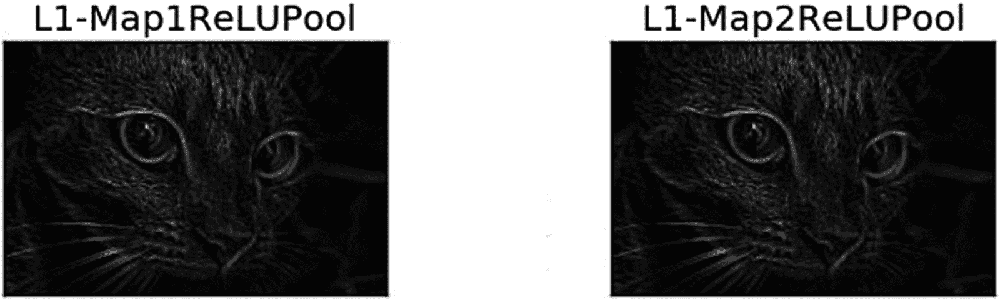

图 5-34

应用于第一个 ReLU 层输出的池层输出

### 堆叠层

至此，具有 conv、ReLU 和 max 池层的 CNN 架构已经完成。除了前面的层之外，可能还有一些其他的层要堆叠，如清单 [5-7](#PC22) 所示。

```py
# Second conv layer
l2_filter = numpy.random.rand(3, 5, 5, l1_feature_map_relu_pool.shape[-1])
print("\n**Working with conv layer 2**")
l2_feature_map = conv(l1_feature_map_relu_pool, l2_filter)
print("\n**ReLU**")
l2_feature_map_relu = relu(l2_feature_map)
print("\n**Pooling**")
l2_feature_map_relu_pool = pooling(l2_feature_map_relu, 2, 2)
print("**End of conv layer 2**\n")

Listing 5-7
Building CNN Architecture

```

之前的 conv 层使用三个滤镜，它们的值是随机生成的。这就是为什么 conv 图层会产生三个要素地图**的原因。这对于连续的 ReLU 和 pooling 层也是一样的。各层的输出如图 [5-35](#Fig35) 所示。**

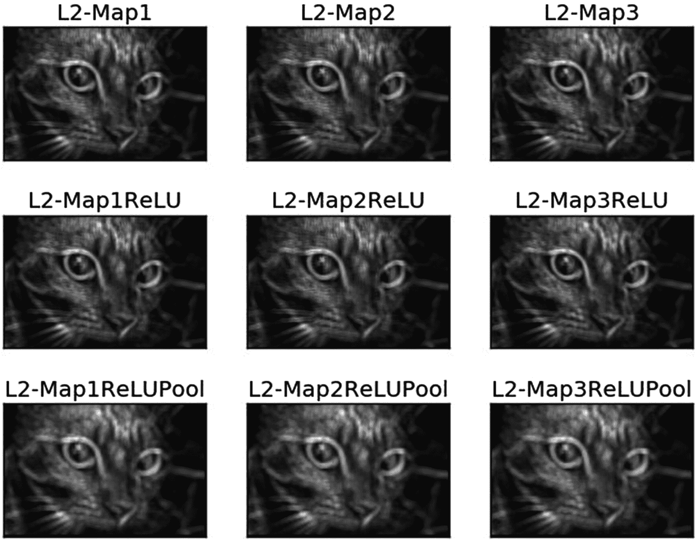

图 5-35

第二 conv-再-混合层的输出

根据清单 [5-8](#PC23) ，通过添加额外的 conv、ReLU 和池层来扩展 CNN 架构。图 [5-36](#Fig36) 显示了这些层的输出。conv 层只接受一个过滤器。这就是为什么只有一个要素地图作为输出。

```py
# Third conv layer
l3_filter = numpy.random.rand(1, 7, 7, l2_feature_map_relu_pool.shape[-1])
print("\n**Working with conv layer 3**")
l3_feature_map = conv(l2_feature_map_relu_pool, l3_filter)
print("\n**ReLU**")
l3_feature_map_relu = relu(l3_feature_map)
print("\n**Pooling**")
l3_feature_map_relu_pool = pooling(l3_feature_map_relu, 2, 2)
print("**End of conv layer 3**\n")

Listing 5-8Continue Building CNN Architecture

```

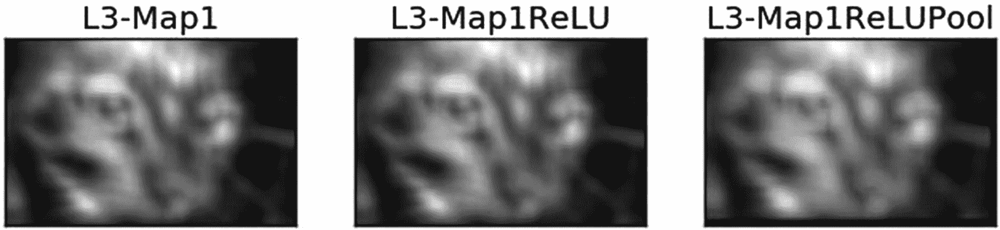

图 5-36

第三 conv-雷鲁联营层的输出

但是要记住，每一层的输出都是下一层的输入。例如，这些行接受以前的输出作为它们的输入。

```py
l2_feature_map = conv(l1_feature_map_relu_pool, l2_filter)
l3_feature_map = conv(l2_feature_map_relu_pool, l3_filter)

```

### 完全码

给出的代码讨论并给出了一个实现 CNN 的例子，并可视化了每一层的结果。代码包含使用 **Matplotlib** 库的每一层输出的可视化。这个项目的完整代码可以在 **GitHub** ( [`https://github.com/ahmedfgad/NumPyCNN`](https://github.com/ahmedfgad/NumPyCNN) )获得。

```py
import skimage.data
import numpy
import matplotlib
import sys

def conv_(img, conv_filter):
    filter_size = conv_filter.shape[1]
    result = numpy.zeros((img.shape))
    #Looping through the image to apply the convolution operation.
    for r in numpy.uint16(numpy.arange(filter_size/2.0,
                          img.shape[0]-filter_size/2.0+1)):
        for c in numpy.uint16(numpy.arange(filter_size/2.0,
                                           img.shape[1]-filter_size/2.0+1)):

            # Getting the current region to get multiplied with the filter.
            # How to loop through the image and get the region based on
            # the image and filer sizes is the most tricky part of convolution.

            curr_region = img[r-numpy.uint16(numpy.floor(filter_size/2.0)):r+numpy.uint16(numpy.ceil(filter_size/2.0)),
                              c-numpy.uint16(numpy.floor(filter_size/2.0)):c+numpy.uint16(numpy.ceil(filter_size/2.0))]
            #Element-wise multiplication between the current region and the filter.
            curr_result = curr_region * conv_filter
            conv_sum = numpy.sum(curr_result) #Summing the result of multiplication.
            result[r, c] = conv_sum #Saving the summation in the convolution layer feature map.

    #Clipping the outliers of the result matrix.
    final_result = result[numpy.uint16(filter_size/2.0):result.shape[0]-numpy.uint16(filter_size/2.0), numpy.uint16(filter_size/2.0):result.shape[1]-numpy.uint16(filter_size/2.0)]
    return final_result
def conv(img, conv_filter):
    if len(img.shape) > 2 or len(conv_filter.shape) > 3:
        if img.shape[-1] != conv_filter.shape[-1]:
            print("Error: Number of channels in both image and filter must match.")
            sys.exit()
    if conv_filter.shape[1] != conv_filter.shape[2]:
        print('Error: Filter must be a square matrix, i.e., number of rows and columns must match.')
        sys.exit()
    if conv_filter.shape[1]%2==0:
        print('Error: Filter must have an odd size, i.e., number of rows and columns must be odd.')
        sys.exit()

    # An empty feature map to hold the output of convolving the filter(s) with the image.
    feature_maps = numpy.zeros((img.shape[0]-conv_filter.shape[1]+1,
                                img.shape[1]-conv_filter.shape[1]+1,
                                conv_filter.shape[0]))

    # Convolving the image by the filter(s).
    for filter_num in range(conv_filter.shape[0]):
        print("Filter ", filter_num + 1)
        curr_filter = conv_filter[filter_num, :] # getting a filter from the bank.

        # Checking if there are multiple channels for the single filter.
        # If so, then each channel will convolve the image.
        # The result of all convolutions is summed to return a single feature map.

        if len(curr_filter.shape) > 2:
            conv_map = conv_(img[:, :, 0], curr_filter[:, :, 0]) # Array holding the sum of all feature maps.
            for ch_num in range(1, curr_filter.shape[-1]): # Convolving each channel with the image and summing the results.
                conv_map = conv_map + conv_(img[:, :, ch_num],
                                  curr_filter[:, :, ch_num])
        else: # There is just a single channel in the filter.
            conv_map = conv_(img, curr_filter)
        feature_maps[:, :, filter_num] = conv_map # Holding feature map with the current filter.
    return feature_maps # Returning all feature maps.

def pooling(feature_map, size=2, stride=2):
    #Preparing the output of the pooling operation.
    pool_out = numpy.zeros((numpy.uint16((feature_map.shape[0]-size+1)/stride+1), numpy.uint16((feature_map.shape[1]-size+1)/stride+1), feature_map.shape[-1]))
    for map_num in range(feature_map.shape[-1]):
        r2 = 0
        for r in numpy.arange(0,feature_map.shape[0]-size+1, stride):
            c2 = 0
            for c in numpy.arange(0, feature_map.shape[1]-size+1, stride):
                pool_out[r2, c2, map_num] = numpy.max([feature_map[r:r+size,  c:c+size]])
                c2 = c2 + 1
            r2 = r2 +1
    return pool_out

def relu(feature_map):
    #Preparing the output of the ReLU activation function.
    relu_out = numpy.zeros(feature_map.shape)
    for map_num in range(feature_map.shape[-1]):
        for r in numpy.arange(0,feature_map.shape[0]):
            for c in numpy.arange(0, feature_map.shape[1]):
                relu_out[r, c, map_num] = numpy.max([feature_map[r, c, map_num], 0])
    return relu_out

# Reading the image
#img = skimage.io.imread("fruits2.png")
img = skimage.data.chelsea()
# Converting the image into gray.
img = skimage.color.rgb2gray(img)

# First conv layer
#l1_filter = numpy.random.rand(2,7,7)*20 # Preparing the filters randomly.
l1_filter = numpy.zeros((2,3,3))
l1_filter[0, :, :] = numpy.array([[[-1, 0, 1],
                                   [-1, 0, 1],
                                   [-1, 0, 1]]])
l1_filter[1, :, :] = numpy.array([[[1,   1,  1],
                                   [0,   0,  0],
                                   [-1, -1, -1]]])

print("\n**Working with conv layer 1**")
l1_feature_map = conv(img, l1_filter)
print("\n**ReLU**")
l1_feature_map_relu = relu(l1_feature_map)
print("\n**Pooling**")
l1_feature_map_relu_pool = pooling(l1_feature_map_relu, 2, 2)
print("**End of conv layer 1**\n")

# Second conv layer
l2_filter = numpy.random.rand(3, 5, 5, l1_feature_map_relu_pool.shape[-1])
print("\n**Working with conv layer 2**")
l2_feature_map = conv(l1_feature_map_relu_pool, l2_filter)
print("\n**ReLU**")
l2_feature_map_relu = relu(l2_feature_map)
print("\n**Pooling**")
l2_feature_map_relu_pool = pooling(l2_feature_map_relu, 2, 2)
print("**End of conv layer 2**\n")

# Third conv layer
l3_filter = numpy.random.rand(1, 7, 7, l2_feature_map_relu_pool.shape[-1])
print("\n**Working with conv layer 3**")
l3_feature_map = conv(l2_feature_map_relu_pool, l3_filter)
print("\n**ReLU**")
l3_feature_map_relu = relu(l3_feature_map)
print("\n**Pooling**")
l3_feature_map_relu_pool = pooling(l3_feature_map_relu, 2, 2)
print("**End of conv layer 3**\n")

# Graphing results
fig0, ax0 = matplotlib.pyplot.subplots(nrows=1, ncols=1)
ax0.imshow(img).set_cmap("gray")
ax0.set_title("Input Image")
ax0.get_xaxis().set_ticks([])
ax0.get_yaxis().set_ticks([])
matplotlib.pyplot.savefig("in_img.png", bbox_inches="tight")
matplotlib.pyplot.close(fig0)

# Layer 1
fig1, ax1 = matplotlib.pyplot.subplots(nrows=3, ncols=2)
ax1[0, 0].imshow(l1_feature_map[:, :, 0]).set_cmap("gray")
ax1[0, 0].get_xaxis().set_ticks([])
ax1[0, 0].get_yaxis().set_ticks([])
ax1[0, 0].set_title("L1-Map1")

ax1[0, 1].imshow(l1_feature_map[:, :, 1]).set_cmap("gray")
ax1[0, 1].get_xaxis().set_ticks([])
ax1[0, 1].get_yaxis().set_ticks([])
ax1[0, 1].set_title("L1-Map2")

ax1[1, 0].imshow(l1_feature_map_relu[:, :, 0]).set_cmap("gray")
ax1[1, 0].get_xaxis().set_ticks([])
ax1[1, 0].get_yaxis().set_ticks([])
ax1[1, 0].set_title("L1-Map1ReLU")

ax1[1, 1].imshow(l1_feature_map_relu[:, :, 1]).set_cmap("gray")
ax1[1, 1].get_xaxis().set_ticks([])
ax1[1, 1].get_yaxis().set_ticks([])
ax1[1, 1].set_title("L1-Map2ReLU")

ax1[2, 0].imshow(l1_feature_map_relu_pool[:, :, 0]).set_cmap("gray")
ax1[2, 0].get_xaxis().set_ticks([])
ax1[2, 0].get_yaxis().set_ticks([])
ax1[2, 0].set_title("L1-Map1ReLUPool")

ax1[2, 1].imshow(l1_feature_map_relu_pool[:, :, 1]).set_cmap("gray")
ax1[2, 0].get_xaxis().set_ticks([])
ax1[2, 0].get_yaxis().set_ticks([])
ax1[2, 1].set_title("L1-Map2ReLUPool")

matplotlib.pyplot.savefig("L1.png", bbox_inches="tight")
matplotlib.pyplot.close(fig1)

# Layer 2
fig2, ax2 = matplotlib.pyplot.subplots(nrows=3, ncols=3)
ax2[0, 0].imshow(l2_feature_map[:, :, 0]).set_cmap("gray")
ax2[0, 0].get_xaxis().set_ticks([])
ax2[0, 0].get_yaxis().set_ticks([])
ax2[0, 0].set_title("L2-Map1")

ax2[0, 1].imshow(l2_feature_map[:, :, 1]).set_cmap("gray")
ax2[0, 1].get_xaxis().set_ticks([])
ax2[0, 1].get_yaxis().set_ticks([])
ax2[0, 1].set_title("L2-Map2")

ax2[0, 2].imshow(l2_feature_map[:, :, 2]).set_cmap("gray")
ax2[0, 2].get_xaxis().set_ticks([])
ax2[0, 2].get_yaxis().set_ticks([])
ax2[0, 2].set_title("L2-Map3")

ax2[1, 0].imshow(l2_feature_map_relu[:, :, 0]).set_cmap("gray")
ax2[1, 0].get_xaxis().set_ticks([])
ax2[1, 0].get_yaxis().set_ticks([])
ax2[1, 0].set_title("L2-Map1ReLU")

ax2[1, 1].imshow(l2_feature_map_relu[:, :, 1]).set_cmap("gray")
ax2[1, 1].get_xaxis().set_ticks([])
ax2[1, 1].get_yaxis().set_ticks([])
ax2[1, 1].set_title("L2-Map2ReLU")

ax2[1, 2].imshow(l2_feature_map_relu[:, :, 2]).set_cmap("gray")
ax2[1, 2].get_xaxis().set_ticks([])
ax2[1, 2].get_yaxis().set_ticks([])
ax2[1, 2].set_title("L2-Map3ReLU")

ax2[2, 0].imshow(l2_feature_map_relu_pool[:, :, 0]).set_cmap("gray")
ax2[2, 0].get_xaxis().set_ticks([])
ax2[2, 0].get_yaxis().set_ticks([])
ax2[2, 0].set_title("L2-Map1ReLUPool")

ax2[2, 1].imshow(l2_feature_map_relu_pool[:, :, 1]).set_cmap("gray")
ax2[2, 1].get_xaxis().set_ticks([])
ax2[2, 1].get_yaxis().set_ticks([])
ax2[2, 1].set_title("L2-Map2ReLUPool")

ax2[2, 2].imshow(l2_feature_map_relu_pool[:, :, 2]).set_cmap("gray")
ax2[2, 2].get_xaxis().set_ticks([])
ax2[2, 2].get_yaxis().set_ticks([])
ax2[2, 2].set_title("L2-Map3ReLUPool")

matplotlib.pyplot.savefig("L2.png", bbox_inches="tight")
matplotlib.pyplot.close(fig2)

# Layer 3
fig3, ax3 = matplotlib.pyplot.subplots(nrows=1, ncols=3)
ax3[0].imshow(l3_feature_map[:, :, 0]).set_cmap("gray")
ax3[0].get_xaxis().set_ticks([])
ax3[0].get_yaxis().set_ticks([])
ax3[0].set_title("L3-Map1")

ax3[1].imshow(l3_feature_map_relu[:, :, 0]).set_cmap("gray")
ax3[1].get_xaxis().set_ticks([])
ax3[1].get_yaxis().set_ticks([])
ax3[1].set_title("L3-Map1ReLU")

ax3[2].imshow(l3_feature_map_relu_pool[:, :, 0]).set_cmap("gray")
ax3[2].get_xaxis().set_ticks([])
ax3[2].get_yaxis().set_ticks([])
ax3[2].set_title("L3-Map1ReLUPool")

Listing 5-9Complete Code for Implementing CNN

```

CNN 中有更多可用的层，很容易将它们添加到前面的层中。例如，可以通过删除最后一层中一定百分比的神经元来实现删除层。FC 层只是将最后一层的结果转换为 1D 向量。

现在这一章已经完成了，希望你对 CNN 有很好的背景知识。