# 二、图像处理导论

在这一章中，我们将研究什么是图像，以及它的相关属性。学完本章后，你应该对以下概念有所了解:

*   形象

*   像素

*   图像分辨率

*   每英寸像素(PPI)和每英寸点数(DPI)

*   位图图像

*   无损压缩和有损压缩

*   不同的图像文件格式

*   不同类型的色彩空间

*   高级图像概念

## 形象

现实生活中的物体(人或任何其他物体)以二维形式的视觉表现被称为*图像*。图像不过是不同色彩空间中像素的集合。图 [2-1](#Fig1) 是普通图像的一个例子。

图 2-1

正常图像

## 像素

你可能会认为一个完整的图像是由小样本组成的集合。这些样本被称为*像素*。它们是任何数字图像中最小的元素。你有没有把图像放大到可以看到小方块的程度？那些是像素。因此，像素是图像的子样本，当它们组合在一起时，给我们完整的图像。图 [2-2](#Fig2) 显示了不同颜色的像素看起来的样子。

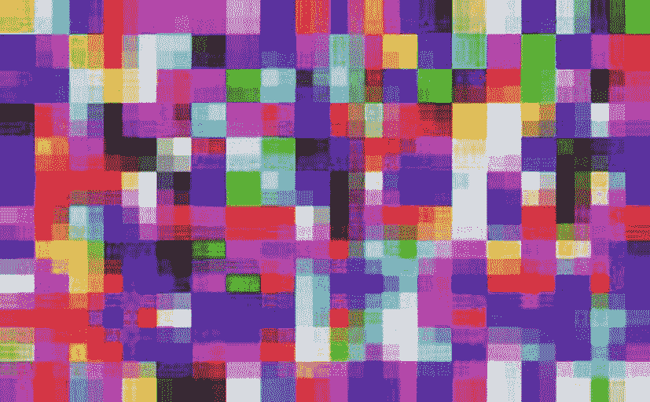

图 2-2

各种颜色的像素(来源: [`www.freeimages.co.uk`](http://www.freeimages.co.uk) )

## 图像分辨率

图像分辨率是图像中的像素数量。像素数量越多，质量越好。例如，图像分辨率描述为 320 × 240、640 × 480、800 × 600、1024 × 768 等。这意味着，例如，有 1024 个像素列和 768 个像素行。像素的总数是通过将这两个数字相乘得到的，得到 786，432 个像素。图 [2-3](#Fig3) 显示了不同图像分辨率的对比图。

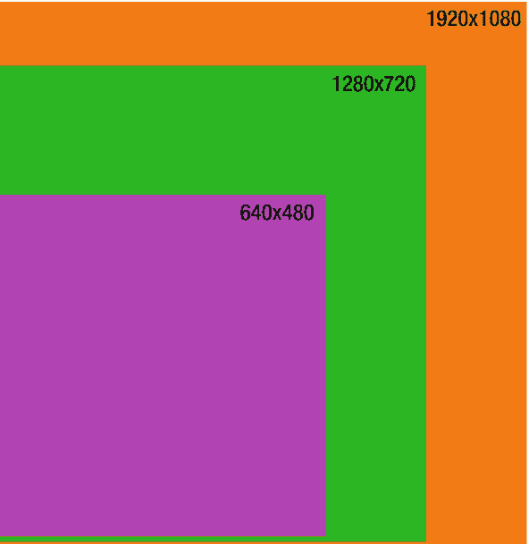

图 2-3

对比图像分辨率(来源: [`www.freeimages.co.uk`](http://www.freeimages.co.uk) )

## PPI 和 DPI

正如本章开头所提到的，PPI 的意思是“每英寸的像素”，而 DPI 的意思是“每英寸的点数”它们是测量图像分辨率的单位。

如果我们考虑一英寸的图像，我们能够看到的像素的平方数由 PPI 表示。另一方面，DPI 与打印相关。当我们打印图像并查看一英寸的印刷品时，使用的墨水点数由 DPI 表示。

如图 [2-4](#Fig4) 所示，PPI 看起来更平滑，而 DPI 看起来更清晰。

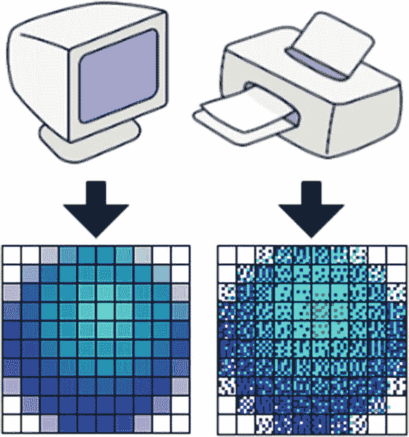

图 2-4

PPI 和 DPI 表示法

## 位图图像

一般来说，当我们看像素值时，它们是一个整数范围。但是，当我们将整数范围转换成字节时，我们就有了位图图像。

一种位图是二进制图像，其中每个像素有两个数字:0 或 1。它们代表黑色或白色，通常用于高效存储图像。图 [2-5](#Fig5) 显示了一幅二进制位图图像。

图 2-5

图 [2-1](#Fig1) 的二进制位图表示

## 无损压缩

当我们想要减小文件(可以是图像)的大小，但不想牺牲质量时，这种压缩称为*无损压缩*。压缩文件可以保存，但是当我们需要它的时候，在解压缩过程中，所有的信息都被恢复，我们得到了实际的图像(图 [2-6](#Fig6) )。第一种类型的压缩优先考虑文件中包含的信息，尤其是在压缩文本时，我们不能丢失哪怕是一条信息。

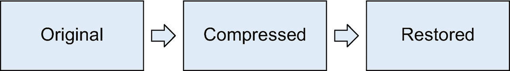

图 2-6

无损压缩过程

## 有损压缩

另一方面，有损压缩可能会丢失一些数据。有损压缩优先考虑节省空间，而不是检索文件的准确性。某些文件，如包含音乐或图像的文件，可以被修剪，但仍不受压缩的影响。可能会有一些损失，但并不令人担忧(图 [2-7](#Fig7) )。

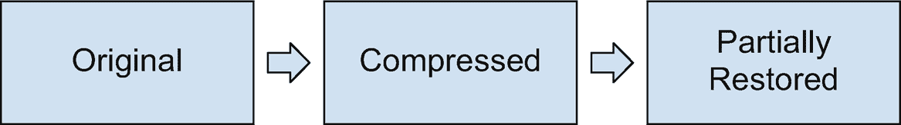

图 2-7

有损压缩过程

## 图像文件格式

以下是一些最广泛使用的图像格式，如表 [2-1](#Tab1) 所述:

表 2-1

不同图像类型的描述和使用

<colgroup><col class="tcol1 align-center"> <col class="tcol2 align-center"> <col class="tcol3 align-center"></colgroup> 
| 

图像格式

 | 

描述

 | 

使用

 |
| --- | --- | --- |
| 联合图像专家组 | 原始图像的有损压缩 | 照片和绘画 |
| JPEG2000 | JPEG 的优化形式；更好的压缩比；无损和有损压缩 | 监督 |
| 争执 | 无损压缩；可以在不丢失信息的情况下存储和检索 | 文档存储 |
| GIF 格式 | 位图图像格式；支持动画；无损压缩 | 游戏和动画 |
| 位图文件的扩展名(Bitmap) | 独立于显示设备；缺乏压缩 | 在 Windows 中 |
| PNG | 无损数据压缩；支持不同的色彩空间 | 互联网上的图像传输 |
| WebP | 无损和有损压缩；尺寸小，但图像质量与 JPEG 相当 | 消息应用中的贴纸 |
| 挽救（saving 的简写） | 用于交互性和动画；以 XML 格式定义的行为和图像；它们可以被搜索、索引和压缩 | 网站开发 |

*   *JPEG* :联合图像专家组

*   JPEG 2000:2000 年开发的新 JPEG 格式

*   *TIFF* :标记图像文件格式

*   *GIF* :图形交换格式

*   *BMP* :位图

*   *PNG* :便携式网络图形

*   *WebP* :谷歌开发的格式

*   *SVG* :可缩放矢量图形

## 色彩空间

特定格式的图像中颜色的组织称为*颜色空间*。颜色的表现方式被称为*颜色模型*。每个图像都使用以下颜色空间之一来有效地呈现图片:

*   *RGB* :红色、绿色、蓝色

*   *XYZ*:x、y、z 维度的颜色

*   *HSV/HSL* :色调、饱和度和值/色调、饱和度和亮度

*   *LAB* :亮度，以及绿-红和蓝-黄颜色分量

*   *LCH* :亮度、色度和色调

*   *YPbPr* :绿色、蓝色和红色线缆

*   YUV :亮度和色度，或颜色

*   *YIQ* :亮度、同相参数、正交

让我们一个一个地看看所有这些颜色模型。

### RGB

使用 RGB 颜色空间，红色、绿色和蓝色以不同的方式混合，以形成不同的颜色组合。我们为什么要用 RGB？因为我们的眼睛有颜色感受器，可以相当有效地感知这三种颜色及其组合。

理论上，我们可以从这三种颜色中形成任何颜色。每种颜色的强度定义在 0 到 255 的范围内。这个范围叫做*色深*。

RGB 色彩空间还有两个分量:

1.  白点色度

2.  伽马连接曲线

图 [2-8](#Fig8) 显示了 RGB 颜色空间的文氏图。

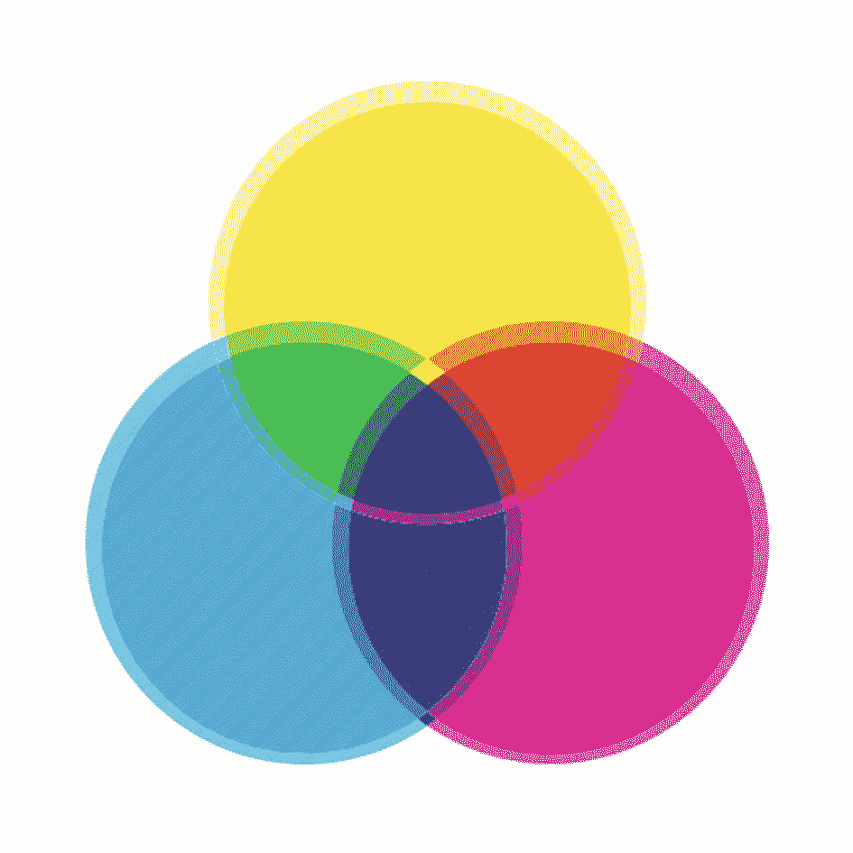

图 2-8

RGB 颜色重叠

### 坐标

RGB 颜色有一个饱和度阈值。他们不能超越我们所能看到的。XYZ 色彩空间帮助我们超越了这个门槛。现在，你可能想知道为什么我们想要超越门槛。嗯，我们人类的眼睛可能无法感知某些颜色，但在数字世界中，你可能需要使用这些颜色。比如 XYZ 可以用来配色；我们可以输入一个颜色代码，然后在不同的应用中复制它，例如打印。利用 XYZ，我们可以对现实世界中存在的所有颜色进行编码。这个色彩空间被称为 *XYZ* ，因为它在三维空间中外推 RGB 颜色:x、y 和 z。图 [2-9](#Fig9) 呈现了图像的 XYZ 表示。

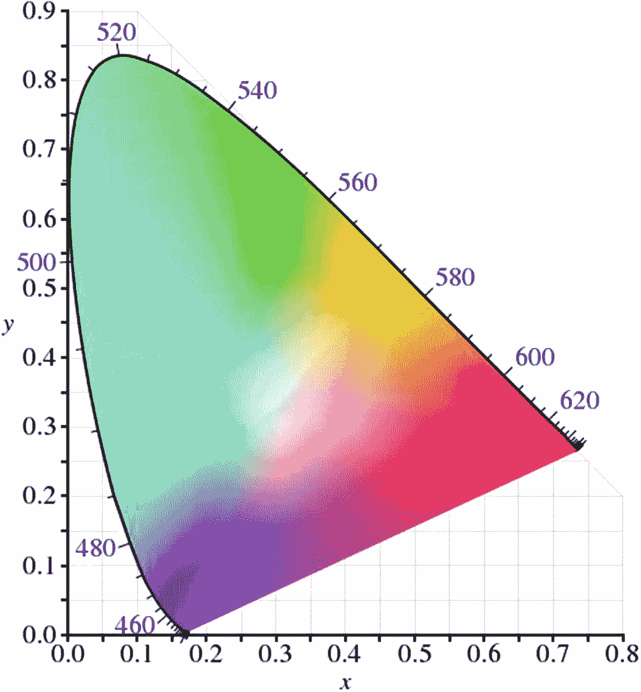

图 2-9

XYZ 颜色空间

### 像素阈值

阈值用于建立条件。比如一个像素强度大于 47，就把它变成黑色或者白色；47 被称为阈值。

### 推断

如果我们根据某个值与以前值的关系来预测或估计它，我们就是在外推。白色像素的邻居可以是白色的(通过假设或推断)。

### HSV/HSL

HSV/HSL 是 RGB 颜色空间的替代表示。它由以下组件组成:

*   顺化(越南城市)

*   浸透

*   价值

*   轻

色调是描述三种颜色的属性:绿色、红色和洋红色。它也可以是两种纯色的混合:红色和黄色，黄色和绿色

饱和度衡量图像的强度。它告诉我们一种颜色离灰色有多远。较低的值意味着颜色接近灰色。

明度是指颜色相对于白色的强度。它告诉我们一种颜色离白色有多远。

价值是强度的另一个衡量标准。它告诉我们一种颜色离黑色有多远。图 [2-10](#Fig10) 显示了图像的 HSV 表示

图 2-10

HSV 颜色空间

### 实验室

LAB 色彩空间有三个组成部分:

1.  亮度

2.  a*，它是绿色和红色分量

3.  b*，即蓝色和黄色分量

我们可以感知的颜色和我们不能感知的颜色都包含在 LAB 颜色空间中。人类能够感知一个点，有固定的坐标，以及到一个点的距离。在一起的一个点和到它的距离有*个柱坐标*。任何没有柱坐标的东西，人类都无法感知。LAB 色彩空间最好的部分是它不依赖于设备；它可以用于印刷、纺织和许多其他应用。LAB 颜色空间是表示颜色的最精确的方法之一。图 [2-11](#Fig11) 显示了图像的实验室表示。

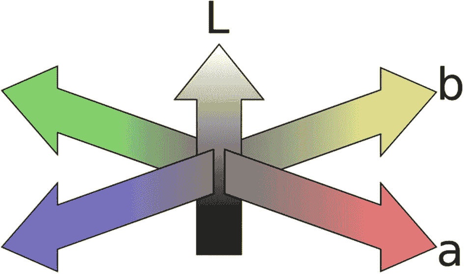

图 2-11

LAB 色彩空间

### 组织郎格罕细胞增生症

LCH 类似于 LAB 颜色空间，但它不使用圆柱坐标，而是使用直角坐标。这使得坐标类似于我们人眼所看到的，即不仅基于其位置坐标，还基于与参考点的距离来描述一个点。因此，它对于人眼感知来说是理想的，因为在这种情况下参考点是我们的眼睛。

### YPbPr

YPbPr 色彩空间用于视频电子设备，如 DVD 播放器。它由以下三个部分组成:

1.  *Y* :绿色线缆

2.  *Pb* :蓝色线缆

3.  *Pr* :红色线缆

这三个分量仅来自 RGB 颜色空间。y 指亮度；Pb 和 Pr 是两种不同的颜色信号。通常，当使用计算机时，数字颜色分量是从 RGB 颜色空间中导出的。然而，当我们谈论电子设备(如 DVD 播放器)时，我们需要使用 RGB 颜色空间的模拟对应物，即 YPbPr。图 [2-12](#Fig12) 显示了标准的 YPbPr 电缆。

图 2-12

YPbPr 电缆

### YUV

YUV 色彩空间有点类似于 YPbPr，因为两者都在视频电子中使用。区别在于 YUV 也支持黑白电视。

*   *Y* :图像中存在的亮度。它的值可以从 0 到 255。

*   *U 和 V* :色度或颜色分量。它的值可以从–128 到+127(对于有符号整数)或从 0 到 255(对于无符号整数)。

如果我们去掉 U 和 V 分量，我们得到一个灰度图像。u 和 V 是颜色矩阵(图 [2-13](#Fig13) )。

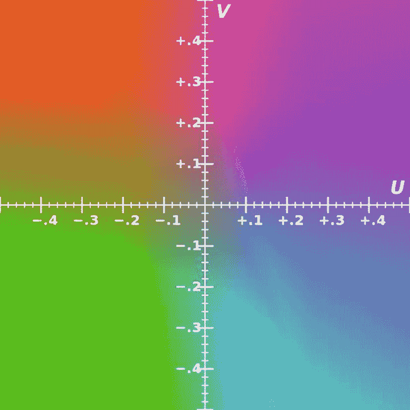

图 2-13

YUV 颜色空间

### YIQ

YIQ 色彩空间(图 [2-14](#Fig14) )用于彩色电视(NTSC 模式:国家电视系统委员会)。它由以下三个部分组成:

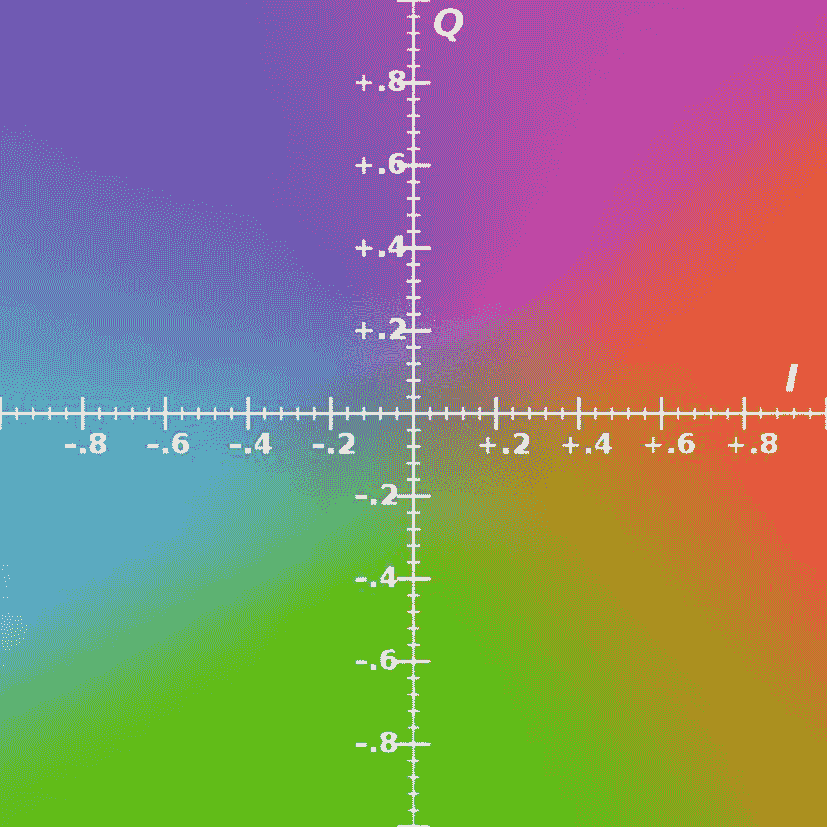

图 2-14

YIQ 颜色空间

1.  *Y* :图像中的亮度

2.  *I* :同相参数

3.  *Q* :代表颜色信息的正交

## 高级图像概念

现在，我们已经研究了一些与颜色相关的基本概念，让我们看看与图像处理相关的术语和概念:

*   贝塞尔曲线

*   椭圆体

*   伽马校正

*   结构相似指数

*   反褶积

*   单应性

*   盘旋

### 贝塞尔曲线

贝塞尔曲线是一条有许多控制点的曲线。控制点是画布上的几个选择点，我们可以用它们来调整曲线。当我们改变控制点的位置时，曲线的形状也会改变，它被用来操纵帧和运动。它还可以用于缩放、选择图像的位置、更改或变换图像的一部分等等。图 [2-15](#Fig15) 显示了一条普通的贝塞尔曲线。

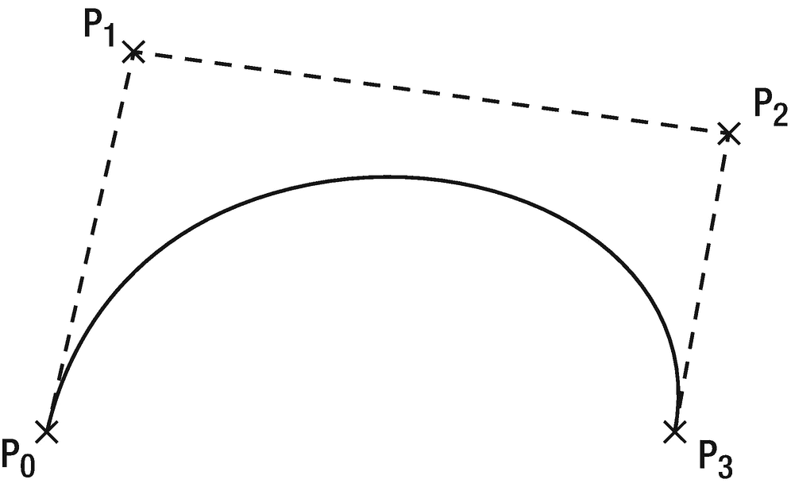

图 2-15

贝塞尔曲线和控制点

### 椭圆体

圆是具有恒定直径或半径的二维图形。球体是一个半径或直径不变的三维圆。但是，如果我们拿一个球体，把它的两面压扁，它就变成了一个椭球体。

椭圆体没有恒定的直径。一边直径较大，称为*长轴*；较小的一侧被称为*短轴*。图 [2-16](#Fig16) 显示了一个球体和两个椭球体。

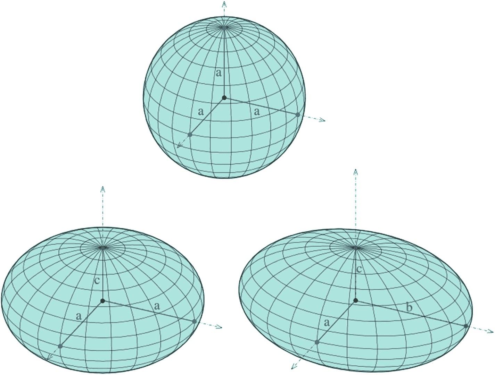

图 2-16

一个球体与两个椭球体的比较

### 伽马校正

伽玛校正用于在屏幕上精确显示图像，控制图像的亮度，并可用于更改红、绿、蓝的比例。

如果有一个像素我们想要以特定的强度显示(例如 x)，而电脑屏幕的 gamma 值为 2.5，那么电脑显示器上的像素强度就变成了 x 2.5 。因为强度总是在 0 到 1 之间测量，所以在这种情况下监视器上的图像变得模糊。

为了消除这个问题，应该对输入值进行伽玛校正。伽马连接完成后，输出几乎与输入相似。例如，如果输入值被提升到 1/2.5 的幂，那么这个过程被称为 2.5 的伽马校正。图 [2-17](#Fig17) 显示了使用不同伽马值的图像。

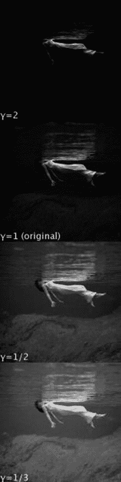

图 2-17

使用不同值对图像进行伽马校正

### 结构相似指数

结构相似性指数，或 SSIM，用于衡量图像的质量。它告诉我们一个图像与另一个图像在结构上有多相似，这意味着我们需要两个图像来执行 SSIM 计算。这里的一个约束是，我们必须知道哪个图像是原始的；否则，该算法无法区分哪个图像比其他图像更好。SSIM 公式是

ssim(x，y)=(2μx【μ】y+c1)×(2σxy+c2)*(μ

其中μ是图像的平均值，σ是图像的标准差，σ 2 是图像的方差。

SSIM(x，y)应该等于 SSIM(y，x)。这就是相似性条件。

### 反褶积

一般来说，去卷积用于校正模糊的图像，这有助于恢复对比度。对于模糊的图像，很难确定像素强度。为了进行这种校正，我们使用所谓的*点扩散函数* (PSF)。我们在图像中选择一个点，使用 PSF，我们可以在三维空间中用光的图案(从该点发出)来表示该点，这有助于使图像更清晰。图 [2-18](#Fig18) 显示了一张去卷积的月球图像。

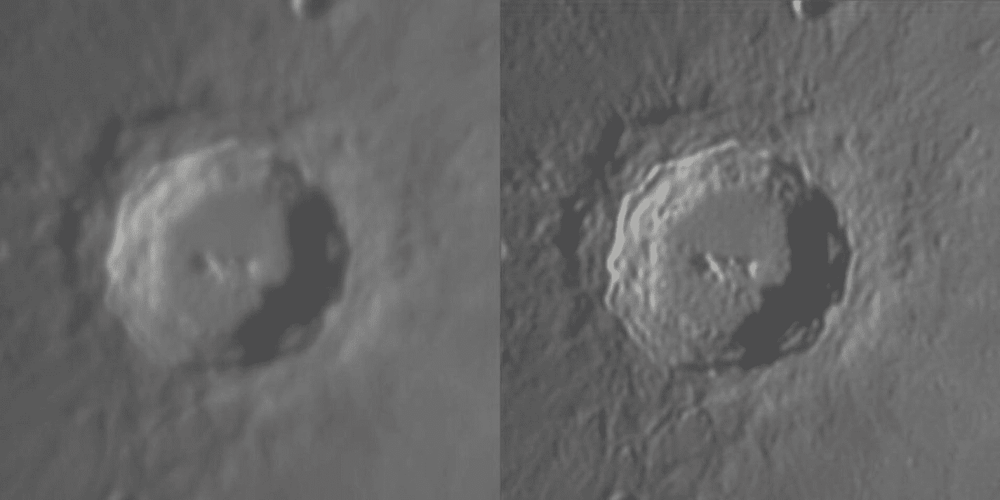

图 2-18

月球图像的去卷积

假设我们在恶劣的天气条件下捕捉一幅图像。由于光线条件异常，图像的对比度可能不理想。我们使用对比度恢复来调整图像对比度，以获得更好的图片。在对比度恢复过程中，分析邻近像素，并且还考虑其他参数，如图像的深度、图像的结构等。然后使用它们去卷积定义图像的最佳对比度。

### 单应性

单应在图像处理中有多种用途:生成马赛克和全景图像、图像拼接、图像配准、图像对齐等等。它用于将图像从一个投影平面转换到另一个投影平面。因此，它可以用来改变图像的平面和视角。除了图像的 x 和 y 坐标(这产生了一个平面的二维图像)，增加了第三维:z。图 [2-19](#Fig19) 显示了应用单应性后的同一点，产生了变化的视角。

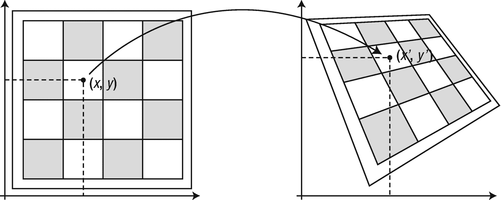

图 2-19

改变图像视角的单应性应用

### **卷积**

卷积是一个简单的过程，在这个过程中，我们将一个矩阵(也称为*内核*或*过滤器*)应用于图像，以便我们可以缩小它，或者添加几个填充层来保持大小不变。卷积也用于从图像中提取特定特征，如形状、边缘等。卷积在图像处理中有很多应用，特别是在卷积神经网络和人脸检测中。我们将在第六章[中详细讨论卷积。](6.html)

接下来，在第 [3](3.html) 章中，我们将研究基本的 Python 概念，并通过编写 Python 脚本来实现本章中讨论的一些概念。