# 4.使用 OpenCV 进行高级图像处理

既然我们已经使用 Scikit 图像库研究了基本的图像处理技术，我们可以继续研究它的更高级的方面。在本章中，我们使用最全面的计算机视觉库之一:OpenCV，并研究以下概念:

*   混合两幅图像

*   更改图像的对比度和亮度

*   向图像添加文本

*   平滑图像

*   改变图像的形状

*   实现图像阈值处理

*   计算梯度以检测边缘

*   执行直方图均衡化

## 混合两幅图像

假设您有两幅图像，并且您想要混合它们，以便两幅图像的特征都可见。我们使用图像配准技术将一个图像混合到第二个图像上，并确定是否有任何变化。让我们看看代码:

```py
#import required packages
import cv2

#Read image 1
img1 = cv2.imread('cat_1.jpg')
#Read image 2
img2 = cv2.imread('cat_2.jpg')

#Define alpha and beta
alpha = 0.30
beta = 0.70

#Blend images
final_image = cv2.addWeighted(img1, alpha, img2, beta, 0.0)

#Show image
io.imshow(final_image)

```

让我们看看这段代码中使用的一些函数:

*   `import cv2`:完整的 OpenCV 库在包 cv2 中。在第 1 章中，我们学习了如何安装 OpenCV。现在我们需要做的就是导入这个包来使用其中存储的类和函数。

*   `cv2.imread()`:类似于`skimage.io.imread()`，我们有`cv2.imread()`，用于从特定目的地读取图像。

*   `cv2.addWeighted()`:此功能融合两幅图像。alpha 和 beta 参数表示两幅图像的透明度。有几个公式有助于确定最终的混合。最后一个参数叫做*伽马*。目前它的值为零。它只是一个标量，添加到公式中，以便更有效地转换图像。一般来说，伽玛为零。

*   `cv2.imshow()`:与`skimage.io.imshow()`类似，`cv2.imshow()`帮助在新窗口显示图像。

*   `cv2.waitKey(): waitKey()`用于显示输出的窗口，直到我们点击关闭或按下退出键。如果我们在`cv2.imshow()`后不包括此功能，图像将不会显示。

*   `cv2.DestroyAllWindows()`:当我们点击关闭或按下退出键后，该功能会销毁所有已经打开并保存在内存中的窗口。

下面的图片是前面代码的输出:

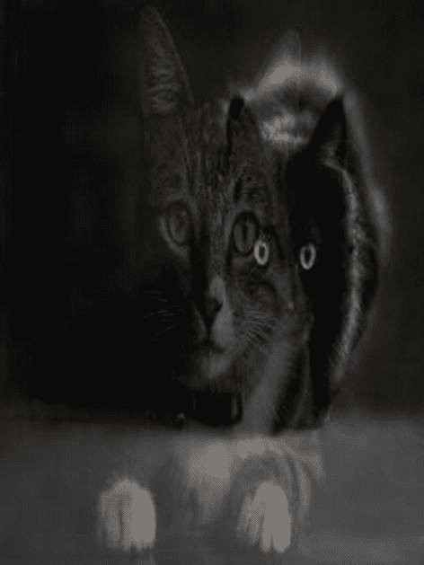

## 改变对比度和亮度

要改变图像的对比度和亮度，我们应该了解这两个术语的含义:

*   *对比度*:对比度是最大和最小像素强度之差。

*   *亮度*:亮度是指一幅图像的明度或暗度。为了使图像更亮，我们给图像中的所有像素加上一个常数。

让我们看看代码和输出，看看对比度和亮度的区别。

```py
#import required packages
import cv2
import numpy as np

#Read image
image = cv2.imread("cat_1.jpg")

#Create a dummy image that stores different contrast and brightness
new_image = np.zeros(image.shape, image.dtype)

#Brightness and contrast parameters
contrast = 3.0
bright = 2

#Change the contrast and brightness
for y in range(image.shape[0]):
    for x in range(image.shape[1]):
        for c in range(image.shape[2]):
            new_image[y,x,c] = np.clip(contrast*image[y,x,c] + bright, 0, 255)

figure(0)
io.imshow(image)
figure(1)
io.imshow(new_image)

```

在这段代码中，我们没有使用任何`cv2`函数来改变亮度或对比度。我们使用 numpy 库和切片概念来改变参数。我们做的第一件事是定义参数。我们给对比度值 3，亮度值 2。第一个`for`循环给出图像宽度，第二个给出图像高度，第三个给出图像通道。因此，第一个循环运行宽度若干次，第二个循环运行高度若干次，最后一个循环运行颜色通道若干次。如果 RGB 图像在那里，那么循环对三个通道运行三次。

`np.clip()`将数值限制在特定范围内。在前面的代码中，范围是 0 到 255，这只是每个通道的像素值。于是，推导出一个公式:

(特定像素值×对比度)+亮度。

使用这个公式，我们可以改变每一个像素值，`np.clip()`确保输出值不会超过 0 到 255。因此，循环遍历每个通道的每个像素，并执行转换。

以下是输出图像:

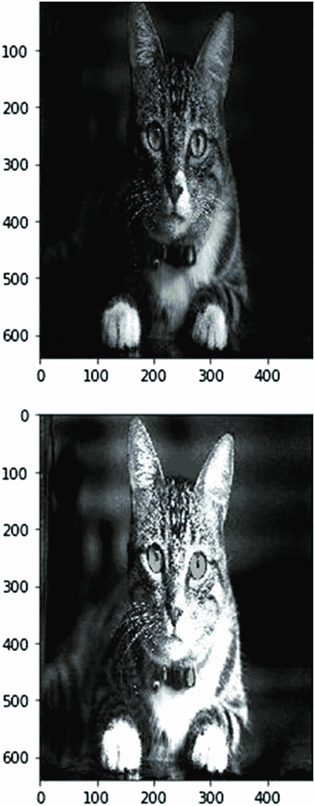

## 向图像添加文本

`cv2.putText()`是`cv2`模块中的一个功能，允许我们给图像添加文本。该函数采用以下参数:

*   图像，您要在其中写入文本

*   您要编写的文本

*   文本在图像上的位置

*   字体类型

*   字体比例

*   文本的颜色

*   文本的厚度

*   使用的线路类型

在下面的代码中可以看到，使用的字体是`FONT_HERSHEY_SIMPLEX`。`cv2`还支持以下字体:

*   `FONT_HERSHEY_SIMPLEX`

*   `FONT_HERSHEY_PLAIN`

*   `FONT_HERSHEY_DUPLEX`

*   `FONT_HERSHEY_COMPLEX`

*   `FONT_HERSHEY_TRIPLEX`

*   `FONT_HERSHEY_COMPLEX_SMALL`

*   `FONT_HERSHEY_SCRIPT_SIMPLEX`

*   `FONT_HERSHEY_SCRIPT_COMPLEX`

*   `FONT_ITALIC`

代码中使用的行类型是`cv2.LINE_AA`。其他受支持的线条类型有

*   `FILLED`:完全填充的线条

*   `LINE_4`:四条连线

*   `LINE_8`:八条连线

*   `LINE_AA`:抗锯齿线

您可以使用所有不同的参数进行实验，并检查结果。让我们看看代码及其输出。

```py
#import required packages
import cv2
import numpy as np

#Read image

image = cv2.imread("cat_1.jpg")

#Define font
font  = cv2.FONT_HERSHEY_SIMPLEX

#Write on the image
cv2.putText(image, "I am a Cat", (230, 50), font, 0.8, (0, 255, 0), 2, cv2.LINE_AA)

io.imshow(image)

```

输出:


## 平滑图像

在这一节中，我们来看看三个用于平滑图像的过滤器。这些过滤器如下:

*   中值滤波器(`cv2.medianBlur`)

*   高斯滤波器(`cv2.GaussianBlur`)

*   双边过滤器(`cv2.bilateralFilter`)

### 中值滤波器

中值滤波器是最基本的图像平滑滤波器之一。这是一种非线性过滤器，通过使用相邻像素找到中值来消除图像中存在的黑白噪声。

为了使用中值滤波器平滑图像，我们查看第一个 3 × 3 矩阵，找到该矩阵的中值，然后通过该中值移除中心值。接下来，我们向右移动一步，重复这个过程，直到所有的像素都被覆盖。最终图像是平滑的图像。如果你想在模糊的同时保留图像的边缘，中值滤波器是你最好的选择。

`cv2.medianBlur`是用于实现中值模糊的函数。它有两个参数:

1.  我们想要平滑的图像

2.  内核大小，应该是奇数。因此，值 9 意味着 9 × 9 矩阵。

### 高斯滤波器

高斯滤波器取决于图像(分布)的标准偏差，并假设平均值为零(我们也可以定义不同于零的平均值)。高斯滤波器不处理边缘。某些统计参数的值定义了保存。它用于基本的图像模糊。它通常通过定义内核来工作。假设我们定义一个 3 × 3 的核。我们将这个内核应用于图像中的每一个像素，并对结果进行平均，从而得到一个模糊的图像。这里有一个例子:

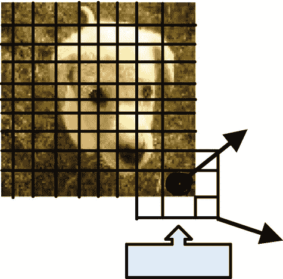

`cv2.GaussianBlur()`是用于应用高斯滤波器的函数。它有三个参数:

1.  需要进行模糊处理的图像

2.  内核的大小(本例中为 3 × 3)

3.  标准偏差

### 双边过滤器

如果我们想平滑图像并保持边缘完整，我们使用双边滤波器。它的实现很简单:我们用相邻像素的平均值替换像素值。这是一种非线性平滑方法，采用相邻像素的加权平均值。“邻居”的定义如下:

*   两个像素值彼此接近

*   两个像素值彼此相似

`cv2.bilateralFilter`有四个参数:

1.  我们想要平滑的图像

2.  像素邻域的直径(定义邻域直径以搜索邻居)

3.  颜色的西格玛值(查找相似的像素)

4.  空间的西格玛值(查找更近的像素)

让我们看一下代码:

```py
#import required packages
import cv2
import numpy as np

#Read images for different blurring purposes
image_Original = cv2.imread("cat_1.jpg")
image_MedianBlur = cv2.imread("cat_1.jpg")
image_GaussianBlur = cv2.imread("cat_1.jpg")
image_BilateralBlur = cv2.imread("cat_1.jpg")

#Blur images

image_MedianBlur=cv2.medianBlur(image_MedianBlur,9)
image_GaussianBlur=cv2.GaussianBlur(image_GaussianBlur,(9,9),10)
image_BilateralBlur=cv2.bilateralFilter(image_BilateralBlur,9,100,75)

#Show images
figure(0)
io.imshow(image_Original)
figure(1)
io.imshow(image_MedianBlur)
figure(2)
io.imshow(image_GaussianBlur)
figure(3)
io.imshow(image_BilateralBlur)

```

输出:

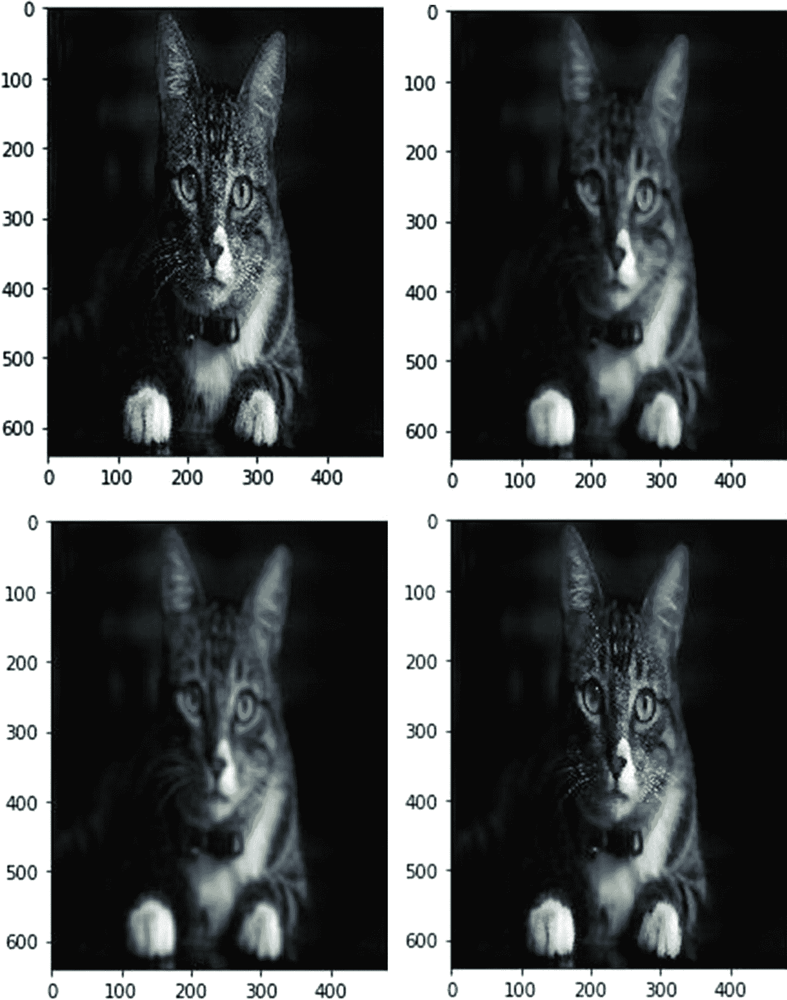

## 改变图像的形状

在这一节中，我们研究腐蚀和膨胀，这是用来改变图像形状的两种操作。膨胀导致像素添加到对象的边界；侵蚀导致像素从边界上消失。

两个侵蚀或扩大一个图像，我们首先定义邻域内核，这可以通过三种方式来完成:

1.  `MORPH_RECT`:制作一个长方形的内核

2.  `MORPH_CROSS`:做十字形的内核

3.  做一个椭圆形的内核

内核查找像素的邻居，这有助于我们腐蚀或放大图像。对于膨胀，最大值生成新的像素值。对于侵蚀，内核中的最小值生成新的像素值。

在图 [4-1](#Fig1) 中，我们应用了一个 3 × 1 矩阵来寻找每行的最小值。对于第一个元素，内核从之前的一个单元格开始。因为左边的新单元格中不存在该值，所以我们将其视为空白。这个概念叫做*填充*。因此，在无、141 和 157 之间检查第一个最小值。因此，141 是最小值，您会看到 141 是右边矩阵中的第一个值。然后，内核向右移动。现在要考虑的单元格是 141、157 和 65。这一次，65 是最小值，所以新矩阵中的第二个值是 65。第三次，内核比较 157，65，无，因为没有第三个单元格。因此，最小值是 65，这成为最后一个值。对每一个单元格都执行这个操作，你就得到如图 [4-1](#Fig1) 所示的新矩阵。

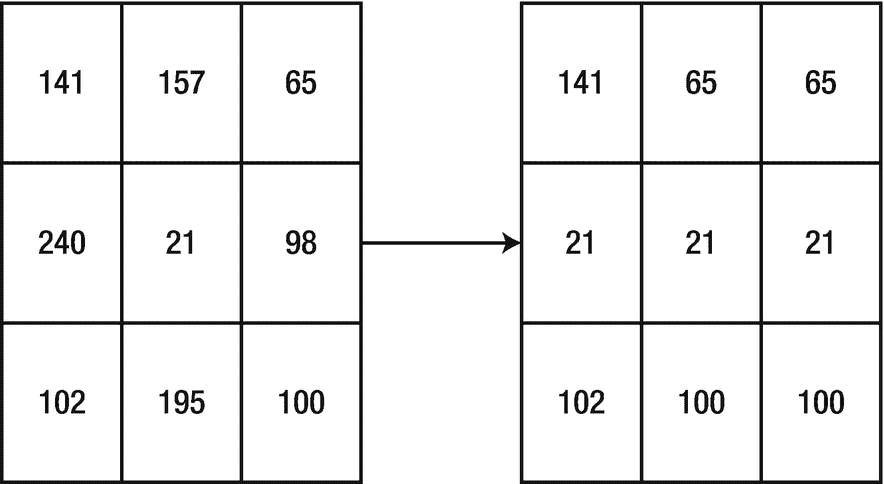

图 4-1

扩张

腐蚀操作与膨胀操作类似，只是我们不是找到最小值，而是找到最大值。图 [4-2](#Fig2) 显示了操作。

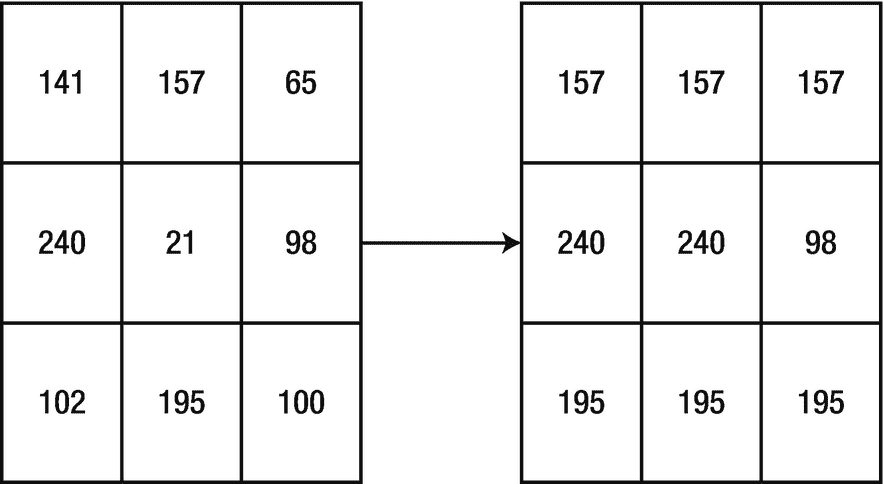

图 4-2

侵蚀

与膨胀一样，内核大小是一个 3 × 1 的矩形。`cv2.getStructuringElement()`是用于定义内核并将其传递给侵蚀或扩张函数的函数。让我们看看它的参数:

*   侵蚀/扩张型

*   内核大小

*   内核应该启动的点

在应用`cv2.getStructuringElement()`并得到最终内核后，我们使用`cv2.erode()`和`cv2.dilate()`来执行具体的操作。让我们看看代码及其输出:

```py
#DILATION CODE

:

#Import package
import cv2

#Read image
image = cv2.imread("cat_1.jpg")

#Define erosion size
s1 = 0
s2 = 10
s3 = 10

#Define erosion type

t1 = cv2.MORPH_RECT
t2 = cv2.MORPH_CROSS
t3 = cv2.MORPH_ELLIPSE

#Define and save the erosion template
tmp1 = cv2.getStructuringElement(t1, (2*s1 + 1, 2*s1+1), (s1, s1))
tmp2= cv2.getStructuringElement(t2, (2*s2 + 1, 2*s2+1), (s2, s2))
tmp3 = cv2.getStructuringElement(t3, (2*s3 + 1, 2*s3+1), (s3, s3))

#Apply the erosion template to the image and save in different variables
final1 = cv2.erode(image, tmp1)
final2 = cv2.erode(image, tmp2)
final3 = cv2.erode(image, tmp3)

#Show all the images with different erosions
figure(0)
io.imshow(final1)
figure(1)
io.imshow(final2)
figure(2)
io.imshow(final3)

#EROSION CODE

:
#Import packages
import cv2

#Read images
image = cv2.imread("cat_1.jpg")

#Define dilation size
d1 = 0
d2 = 10
d3 = 20

#Define dilation type
t1 = cv2.MORPH_RECT
t2 = cv2.MORPH_CROSS
t3 = cv2.MORPH_ELLIPSE

#Store the dilation templates
tmp1 = cv2.getStructuringElement(t1, (2*d1 + 1, 2*d1+1), (d1, d1))
tmp2 = cv2.getStructuringElement(t2, (2*d2 + 1, 2*d2+1), (d2, d2))
tmp3 = cv2.getStructuringElement(t3, (2*d3 + 1, 2*d3+1), (d3, d3))

#Apply dilation to the images
final1 = cv2.dilate(image, tmp1)
final2 = cv2.dilate(image, tmp2)
final3 = cv2.dilate(image, tmp3)

#Show the images
figure(0)
io.imshow(final1)
figure(1)
io.imshow(final2) 

figure(2)
io.imshow(final3)

```

输出:

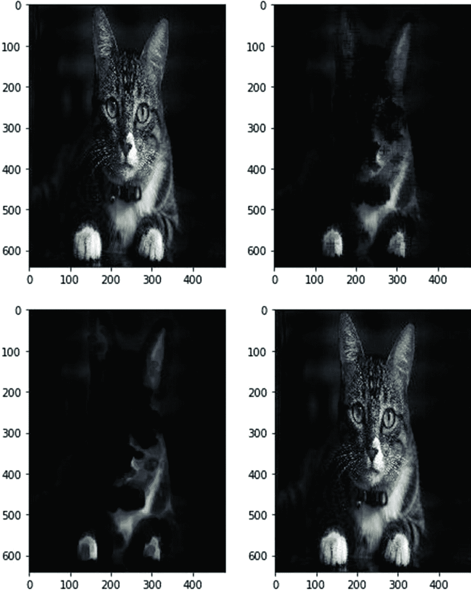

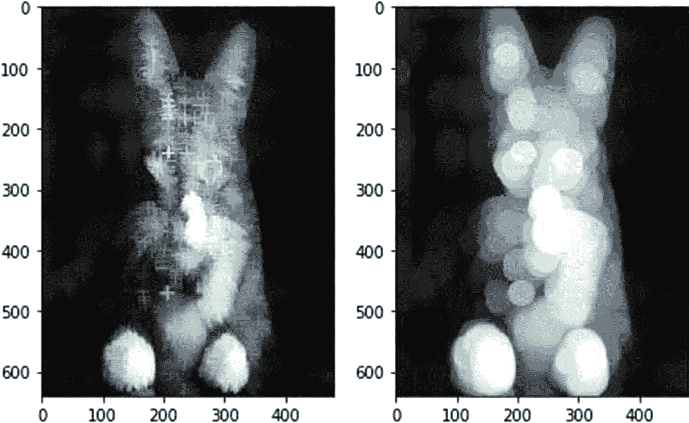

## 实现图像阈值处理

进行图像阈值处理的主要原因是为了分割图像。我们试图通过去除背景和聚焦物体来从图像中去除物体。为此，我们首先将图像转换为灰度，然后转换为二进制格式，这意味着图像只包含黑色或白色。

我们提供一个参考像素值，高于或低于它的所有值都转换为黑色或白色。有五种阈值类型:

1.  *二进制*:如果像素值大于参考像素值(阈值)，则转换为白色(255)；否则，转换为黑色(0)。

2.  *二进制反转*:如果像素值大于参考像素值(阈值)，则转换为黑色(0)；否则，转换为白色(255)。与二进制类型正好相反。

3.  *截断*:如果像素值大于参考像素值(阈值)，则转换为阈值；否则，不要更改该值。

4.  *阈值归零*:如果像素值大于参考像素值(阈值)，则不改变该值；否则转换为黑色(0)。

5.  *阈值到零反转*:如果像素值大于参考像素值(阈值)，则转换为黑色(0)；否则，不要改变。

我们使用`cv2.threshold()`函数进行图像阈值处理，该函数使用以下参数:

*   要转换的图像

*   阈值

*   最大像素值

*   阈值的类型(如前所列)

让我们看看代码及其输出。

```py
#Import packages
import cv2

#Read image
image = cv2.imread("cat_1.jpg")

#Define threshold types
"'
0 - Binary
1 - Binary Inverted
2 - Truncated
3 - Threshold To Zero
4 - Threshold To Zero Inverted
"'

#Apply different thresholds and save in different variables
_, img1 = cv2.threshold(image, 50, 255, 0 )
_, img2 = cv2.threshold(image, 50, 255, 1 )
_, img3 = cv2.threshold(image, 50, 255, 2 )
_, img4 = cv2.threshold(image, 50, 255, 3 )
_, img5 = cv2.threshold(image, 50, 255, 4 )

#Show the different threshold images

figure(0)
io.imshow(img1) #Prints Binary Image
figure(1)
io.imshow(img2) #Prints Binary Inverted Image
figure(2)
io.imshow(img3) #Prints Truncated Image
figure(3)
io.imshow(img4) #Prints Threshold to Zero Image
figure(4)
io.imshow(img5) #Prints Threshold to Zero Inverted Image

```

输出:

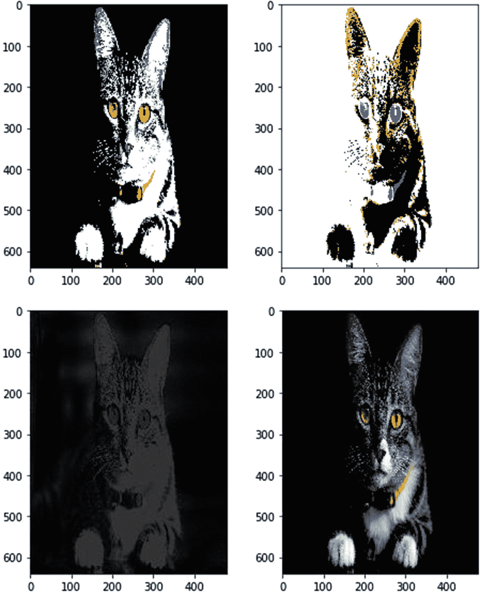

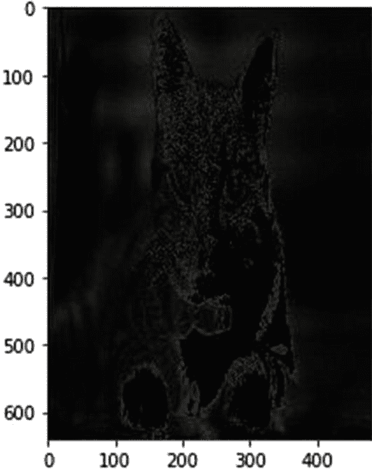

## 计算渐变

在这一节中，我们来看看使用 Sobel 导数的边缘检测。边缘存在于两个方向:垂直方向和水平方向。利用该算法，我们只强调那些具有非常高的空间频率的区域，这些区域可能对应于边缘。空间频率是一个重要区域的详细程度。

在下面的代码中，我们读取图像，应用高斯模糊以去除噪声，然后将图像转换为灰度。我们使用`cv2.cvtColor()`函数将图像转换成灰度。我们也可以使用`skimage`函数来做同样的事情。最后，我们把灰度输出给`cv2.Sobel()`函数。让我们看看 Sobel 函数的参数:

*   输入图像

*   输出图像的深度。图像的深度越大，错过任何边界的可能性就越小。您可以试验下面列出的所有参数，看看它们是否能根据您的要求有效地捕捉边界。深度可以是以下类型:
    *   –1(与原始图像的深度相同)

    *   `cv2.CV_16S`

    *   `cv2.CV_32F`

    *   `cv2.CV_64F`

*   导数 x 的阶(定义寻找水平边缘的导数阶)

*   导数 y 的阶(定义寻找垂直边的导数阶)

*   内核的大小

*   应用于导数的比例因子

*   要作为标量添加到公式中的增量值

*   像素外推的边框类型

`cv2.convertScaleAbs()`函数用于将值转换成一个绝对数字，采用无符号 8 位类型。然后，我们混合 x 和 y 梯度，我们发现找到图像中的整体边缘。

让我们看看代码及其输出。

```py
#Import packages
import cv2

#Read image
src = cv2.imread("cat_1.jpg")

#Apply gaussian blur
cv2.GaussianBlur(src, (3, 3), 0)

#Convert image to grayscale
gray = cv2.cvtColor(src, cv2.COLOR_BGR2GRAY)

#Apply Sobel method to the grayscale image
grad_x = cv2.Sobel(gray, cv2.CV_16S, 1, 0, ksize=3, scale=1, delta=0, borderType=cv2.BORDER_DEFAULT) #Horizontal Sobel Derivation
grad_y = cv2.Sobel(gray, cv2.CV_16S, 0, 1, ksize=3, scale=1, delta=0, borderType=cv2.BORDER_DEFAULT) #Vertical Sobel Derivation
abs_grad_x = cv2.convertScaleAbs(grad_x)
abs_grad_y = cv2.convertScaleAbs(grad_y)
grad = cv2.addWeighted(abs_grad_x, 0.5, abs_grad_y, 0.5, 0) #Apply both

#Show the image

io.imshow(grad)#View the image

```

输出:

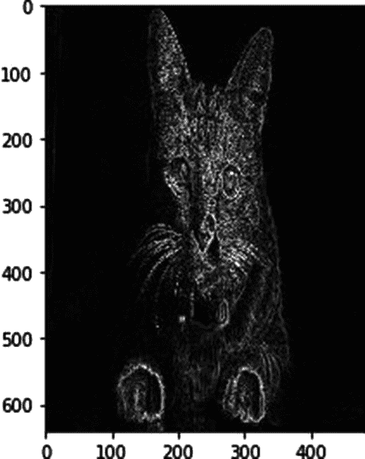

## 执行直方图均衡化

直方图均衡化用于调整图像的对比度。我们首先绘制像素强度分布的直方图，然后修改它。每个图像都有一个累积概率函数。直方图均衡化给出了该函数的线性趋势。我们应该使用灰度图像来执行直方图均衡化。

`cv2.equalizeHist()`功能用于直方图均衡化。让我们看一个例子。

```py
#Import packages
import cv2

#Read image
src = cv2.imread("cat_1.jpg")

#Convert to grayscale
src = cv2.cvtColor(src, cv2.COLOR_BGR2GRAY)

#Apply equalize histogram
src_eqlzd = cv2.equalizeHist(src) #Performs Histogram Equalization

#Show both images
figure(0)
io.imshow(src)
figure(1)
io.imshow(src_eqlzd)
figure(2)
io.imshow(src_eqlzd)

```

输出:

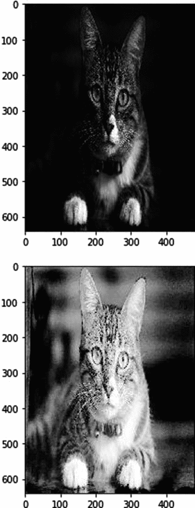

现在我们知道了使用`skimage`的基本图像处理算法，以及使用 OpenCV 的一些高级操作。在下一章中，我们继续前进，应用机器学习算法进行图像处理。