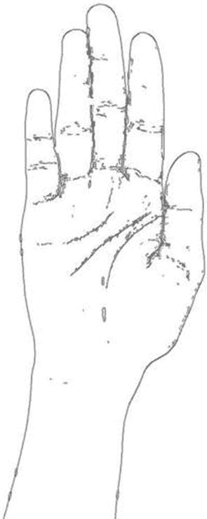
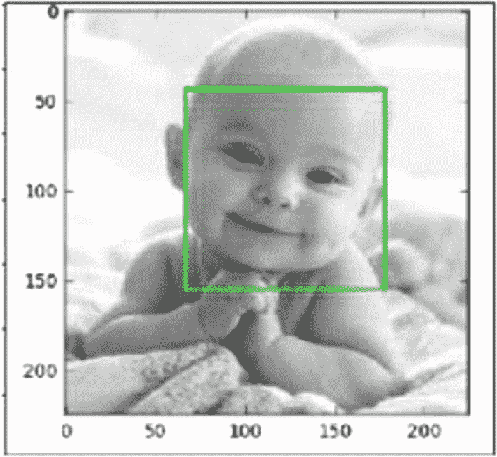
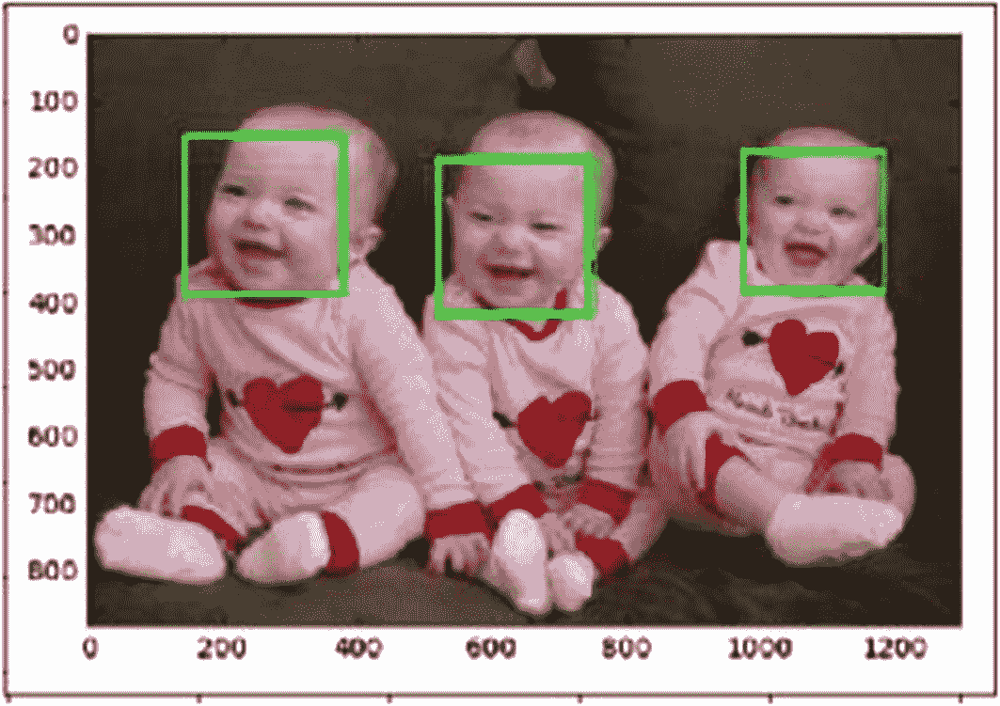
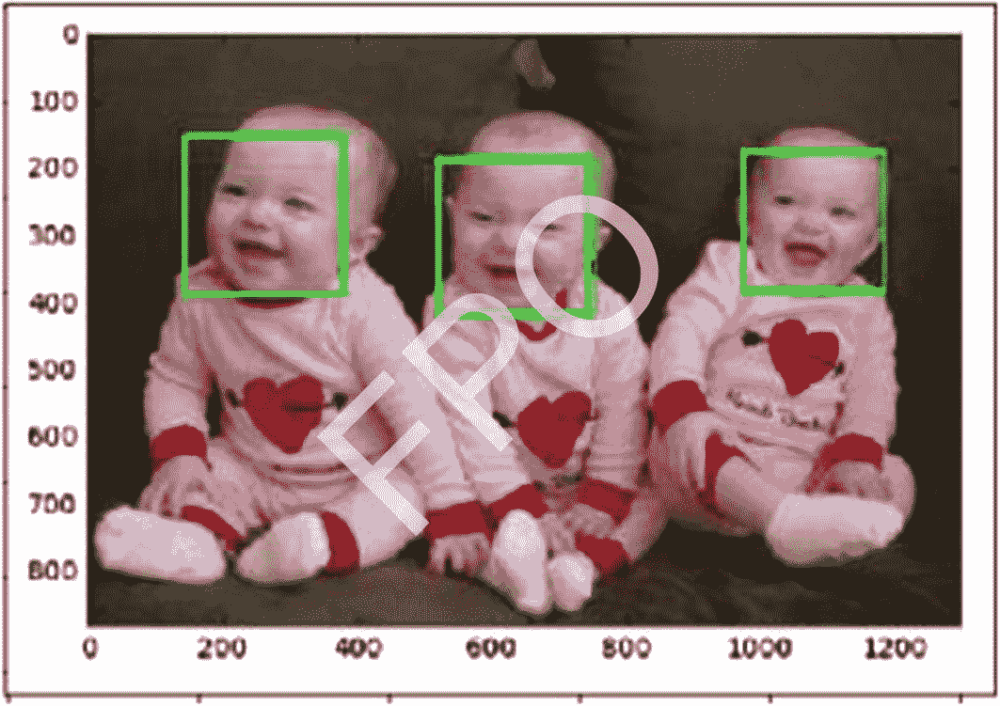
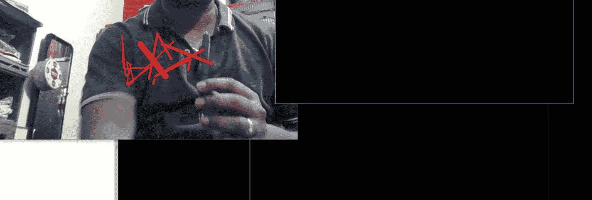
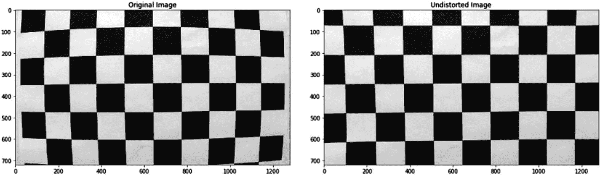
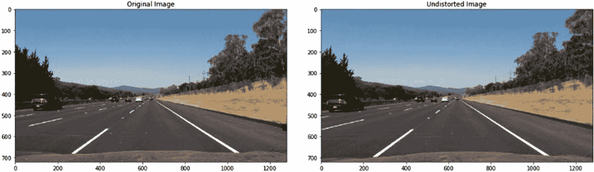
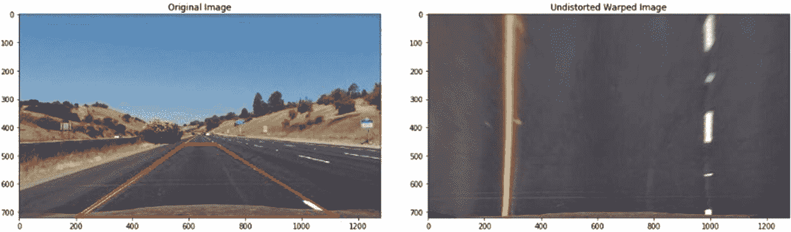
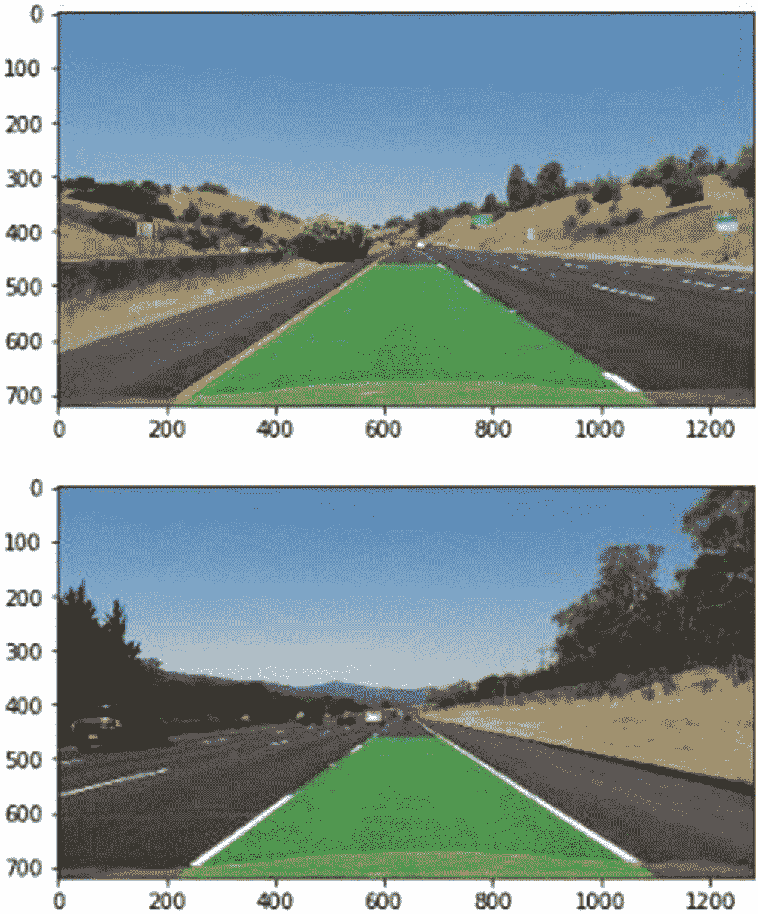

# 6.实时用例

现在，我们已经了解了图像处理的基础和高级概念，是时候看看一些实时用例了。在本章中，我们将了解五种不同的概念证明，它们可以根据您自己的要求进行调整:

1.  寻找掌纹

2.  检测人脸

3.  识别面孔

4.  跟踪运动

5.  检测车道

## 寻找掌纹

我们将使用 Python 和 OpenCV 库来确定我们手掌中的主要掌纹。首先，我们需要阅读原始图像:

```py
import cv2
image = cv2.imread("palm.jpg")
cv2.imshow("palm",image) #to view the palm in python
cv2.waitKey(0)

```

现在我们将图像转换为灰度:

```py
gray = cv2.cvtColor(image,cv2.COLOR_BGR2GRAY)

```

然后利用滤波算法 Canny 边缘检测器找到掌纹。对于不同的图像，我们需要相应地改变参数。

```py
edges = cv2.Canny(gray,40,55,apertureSize = 3)
cv2.imshow("edges in palm",edges)
cv2.waitKey(0)

```

现在我们恢复颜色，使识别的线条变成黑色:

```py
edges = cv2.bitwise_not(edges)

```

输出:



接下来，我们将之前的图像与原始图像混合:

```py
cv2.imwrite("palmlines.jpg", edges)
palmlines = cv2.imread("palmlines.jpg")
img = cv2.addWeighted(palmlines, 0.3, image, 0.7, 0)

```

最终输出:


我们可以改变参数以获得更有效的输出。

## 检测人脸

在本节中，我们将面部识别代码应用于包含一张脸的图像，然后将相同的代码应用于包含多张脸的图像。我们必须做的第一件事是导入重要的库:

```py
import cv2
import matplotlib.pyplot as plt

```

接下来，我们阅读包含一张脸的图像。读取后，我们将其转换为灰度，然后在新窗口中显示:

```py
img1 = cv2.imread("single_face.jpg")
gray_img = cv2.cvtColor(img11, cv2.COLOR_BGR2GRAY)
cv2.imshow("Original_grayscale_image",gray_img)
cv2.waitKey(0)

```

现在我们需要在图像上应用哈尔级联。我们有几个 Haar 级联来检测 OpenCV 项目中已经存储的多种东西。为了方便起见，我在本书的 sharepoint 中附加了所需的级联，以 XML 文件格式存储。以下是级联列表:

*   [T2`haarcascade_eye.xml`](https://github.com/opencv/opencv/blob/master/data/haarcascades/haarcascade_eye.xml)

*   [T2`haarcascade_eye_tree_eyeglasses.xml`](https://github.com/opencv/opencv/blob/master/data/haarcascades/haarcascade_eye_tree_eyeglasses.xml)

*   [T2`haarcascade_frontalcatface.xml`](https://github.com/opencv/opencv/blob/master/data/haarcascades/haarcascade_frontalcatface.xml)

*   [T2`haarcascade_frontalface_alt.xml`](https://github.com/opencv/opencv/blob/master/data/haarcascades/haarcascade_frontalface_alt.xml)

*   [T2`haarcascade_frontalface_alt2.xml`](https://github.com/opencv/opencv/blob/master/data/haarcascades/haarcascade_frontalface_alt2.xml)

*   [T2`haarcascade_frontalface_alt_tree.xml`](https://github.com/opencv/opencv/blob/master/data/haarcascades/haarcascade_frontalface_alt_tree.xml)

*   [T2`haarcascade_frontalface_default.xml`](https://github.com/opencv/opencv/blob/master/data/haarcascades/haarcascade_frontalface_default.xml)

*   [T2`haarcascade_fullbody.xml`](https://github.com/opencv/opencv/blob/master/data/haarcascades/haarcascade_fullbody.xml)

*   [T2`haarcascade_lefteye_2splits.xml`](https://github.com/opencv/opencv/blob/master/data/haarcascades/haarcascade_lefteye_2splits.xml)

*   [T2`haarcascade_lowerbody.xml`](https://github.com/opencv/opencv/blob/master/data/haarcascades/haarcascade_lowerbody.xml)

*   [T2`haarcascade_profileface.xml`](https://github.com/opencv/opencv/blob/master/data/haarcascades/haarcascade_profileface.xml)

*   [T2`haarcascade_righteye_2splits.xml`](https://github.com/opencv/opencv/blob/master/data/haarcascades/haarcascade_righteye_2splits.xml)

*   [T2`haarcascade_smile.xml`](https://github.com/opencv/opencv/blob/master/data/haarcascades/haarcascade_smile.xml)

*   [T2`haarcascade_upperbody.xml`](https://github.com/opencv/opencv/blob/master/data/haarcascades/haarcascade_upperbody.xml)

在我们的例子中，我们将使用`haarcascade_frontalface_alt.xml`:

```py
haar_face_cascade = cv2.CascadeClassifier('haarcascade_frontalface_alt.xml')
faces = haar_face_cascade.detectMultiScale(gray_img, scaleFactor=1.1, minNeighbors=5)
for (x, y, w, h) in faces:
    cv2.rectangle(img1, (x, y), (x+w, y+h), (0, 255, 0), 2)

```

前面的代码将级联算法加载到一个变量中。然后，使用该算法，它试图检测面部，并在检测到的面部上画一个圆。`scaleFactor`用来照顾大小脸。如果你靠近镜头，你看起来脸很大；否则，它会显得更小。`minNeighbors`查看矩形内检测到的人脸，并决定包含什么和拒绝什么。现在，让我们展示检测到的图像:

```py
cv2.imshow("Final_detected_image",cv2.COLOR_BGR2RGB(img1))
cv2.waitKey(0)

```

前面几行代码给出了以下输出:



如果我们使用另一个包含多个面的图像，而不是一个面，代码会给出以下输出:



## 识别面孔

我们已经成功地检测出图像中的人脸，但是我们如何识别哪张脸属于谁呢？为了解决这个问题，我们将使用高级 OpenCV 方法。

第一步是检测人脸。我们在方法`detect_face()`中加入了与上一节完全相同的代码:

```py
def detect_face(img):
    gray = cv2.cvtColor(img, cv2.COLOR_BGR2GRAY)
    face_cascade = cv2.CascadeClassifier('haarcascade_frontalface_alt.xml')
    faces = face_cascade.detectMultiScale(gray, scaleFactor=1.2, minNeighbors=5)
    (x, y, w, h) = faces[0]
    return gray[y:y+w, x:x+h], faces[0]

```

代码返回坐标，而不是在脸部周围画一个矩形。

下一步是提供足够的数据，这样系统就可以知道多张脸属于一个特定的人。下一次，它将能够从新的图像中识别出这个人。

```py
def prepare_training_data(data_folder_path):
    dirs = os.listdir(data_folder_path)
    faces = []
    labels = []
    for dir_name in dirs:
        if not dir_name.startswith("s"):
            continue
        label = int(dir_name.replace("s", ""))
        subject_dir_path = data_folder_path + "/" + dir_name
        subject_images_names = os.listdir(subject_dir_path)
        for image_name in subject_images_names:
            image_path = subject_dir_path + "/" + image_name
            image = cv2.imread(image_path)
            face, rect = detect_face(image)
            if face is not None:
                faces.append(face)
                labels.append(label)
    cv2.waitKey(0)
    cv2.destroyAllWindows()
    return faces, labels

```

前面的代码首先读取特定文件夹中的每张图片，然后尝试检测人脸并将人脸坐标存储在列表`faces[]`和`labels[]`中。在这段代码中，这个人的名字应该是文件夹名，这个人的所有图像都应该保存在文件夹中。上面的函数返回所有的面部坐标和标签，这在以后有助于训练数据。

接下来是训练部分。为此，我们将使用`LBPHFaceRecognizer`函数。让我们将训练函数应用于面部和标签:

```py
face_recognizer = cv2.face.LBPHFaceRecognizer_create()
face_recognizer.train(faces, np.array(labels))

```

这段代码训练模型，查看面部坐标和标签。

接下来我们要做的是预测。假设我们试着识别两张脸。我拍了兰维尔和萨钦·坦杜尔卡尔的照片。该模型已经在这些图像上进行了训练，它将尝试预测新的图像。

```py
subjects = ["", "Sachin Tendulkar", "Ranveer"]
img = "ranveer.jpg"
face, rect = detect_face(img)
label= face_recognizer.predict(face)[0]
label_text = subjects[label]
(x, y, w, h) = rect
cv2.rectangle(img, (x, y), (x+w, y+h), (0, 255, 0), 2)
cv2.putText(img, label_text, (rect[0], rect[1]-5), cv2.FONT_HERSHEY_PLAIN, 1.5, (0, 255, 0), 2)

```

这段代码读取图像，并试图预测图像是否是 Ranveer。让我们看看这段代码的输出。整个代码都在 sharepoint 中。



## 跟踪运动

假设你有一支笔，但你不是在纸上写字，而是在空气中写字，这样东西就会自动写出来。听起来像魔术吗？嗯，使用先进的图像处理方法可以做到这一点。

假设我有一个蓝色笔尖的制笔器。我想让它在空中移动，然后用相机跟踪蓝色笔尖，在屏幕上画出完全相同的动作。让我们看看如何实现这一点。

首先，我们必须只捕捉蓝色笔尖。这意味着所有其他的东西——手、背景等等——都只是噪音。我们必须去除噪声，我们通过腐蚀和膨胀来达到这个目的。让我们看看代码:

```py
mask=cv2.inRange(hsv,Lower_green,Upper_green)
mask = cv2.erode(mask, kernel, iterations=2)
mask=cv2.morphologyEx(mask,cv2.MORPH_OPEN,kernel)
mask = cv2.dilate(mask, kernel, iterations=1)
res=cv2.bitwise_and(img,img,mask=mask)
cnts,heir=cv2.findContours(mask.copy(),cv2.RETR_EXTERNAL,cv2.CHAIN_APPROX_SIMPLE)[-2:]

```

接下来，我们必须定义我们想要的蓝色范围:

```py
Lower_green = np.array([110,50,50])
Upper_green = np.array([130,255,255])

```

现在我们需要跟踪运动。为了做到这一点，我们找到图像的轮廓，然后找到图像的矩，这些矩在以后用来画线。要了解有关图像矩和轮廓的更多信息，请参考附录。

```py
if len(cnts) > 0:
        c = max(cnts, key=cv2.contourArea)
        ((x, y), radius) = cv2.minEnclosingCircle©
        M = cv2.moments©
        center = (int(M["m10"] / M["m00"]), int(M["m01"] / M["m00"]))
        if radius > 5:
            cv2.circle(img, (int(x), int(y)), int(radius),(0, 255, 255), 2)
            cv2.circle(img, center, 5, (0,0,255), -1)
    pts.appendleft(center)
    for i in range(1,len(pts)):
        if pts[i-1]is None or pts[i] is None:
            continue
        thick = int(np.sqrt(len(pts) / float(i + 1)) * 2.5)
        cv2.line(img, pts[i-1],pts[i],(0,0,248),thick)

```

最后，我们的代码准备好了。让我们看看我们的代码是否跟踪笔。

```py
cv2.imshow("Frame", img)
cv2.imshow("mask",mask)
cv2.imshow("res",res)

```

我们得到以下输出:



## 检测车道

我们都知道，自动驾驶汽车是当今汽车行业最大的新闻人物之一。汽车知道什么时候向左转，什么时候停下来，如何阅读交通标志，等等。在本节中，我们将学习汽车如何在高速公路上观察车道并理解其含义，从而定义其边界，换句话说，就是不离开车道。如果你想成为自动驾驶汽车编程专家，有一个 Udacity 的 nanodegree 项目可以参加。

首先，我们需要校准我们的相机。因为整个自动驾驶汽车概念取决于摄像头的精度，我们*必须*校准它。为此，我们在 OpenCV 中使用一个名为`findChessboardCorners(), which (as you might imagine)`的函数来寻找给定棋盘图像的内角。

```py
def convert3D_to_2D(path, x, y):
rwp = np.zeros((y*x, 3), np.float32)
tmp = np.mgrid[0:x, 0:y].T.reshape(-1, 2)
rwp[:,:2] = tmp
rwpoints = []
imgpoints = []
images = glob.glob(path)
for fname in images:
    img = cv2.imread(fname)
    gray = cv2.cvtColor(img, cv2.COLOR_BGR2GRAY)
    corner_found, corners = cv2.findChessboardCorners(gray, (x,y), None)
    if corner_found == True:
        rwpoints.append(rwp)
        imgpoints.append(corners)
        cv2.drawChessboardCorners(img, (x,y), corners, corner_found)
return (rwpoints, imgpoints)

```

Sharepoint 中提供了完整的逐行代码解释。前面的代码读取一个目录中存在的不同棋盘图像，找到它们的内角，并将最终的点保存在两个列表中:`rwpoints`和`imgpoints`。`rwpoints`在三维空间中包含真实的空间点；`imgpoints`点是二维的。该函数返回两个列表。

接下来，我们使用这两个列表来校准相机，然后对图像进行去失真。不失真意味着去除噪声和平滑图像。简单来说，我们说我们把图像从三维转换成二维。让我们看看代码:

```py
def calibrate_camera(test_img_path, rwpoints, imgpoints):
    img = mpimg.imread(test_img_path)
    img_size = (img.shape[1], img.shape[0])
    ret, mtx, dist, rvecs, tvecs = cv2.calibrateCamera(rwpoints, imgpoints, img_size, None, None)
    undst_img = cv2.undistort(img, mtx, dist, None, mtx)
    f, (ax1, ax2) = plt.subplots(1, 2, figsize=(20, 10))
    ax1.set_title("Original Image")
    ax1.imshow(img)
    ax2.set_title("Undistorted Image")
    ax2.imshow(undst_img)
    return (mtx, dist)

```

`calibrateCamera()`功能首先试图通过使用`rwpoints`和`imgpoints`列表来提高相机的效率。它给了我们两个重要的矩阵——`mtx`和`dst`——帮助我们不失真的形象。未失真的输出如下所示:



因为无失真效果很好，所以让我们将同样的方法应用于道路图像:

```py
def undistort_test_img(mtx, dist):
    test_image = mpimg.imread("road.jpg")
    undistorted_img = cv2.undistort(test_image, mtx, dist, None, mtx)
    f, (ax1, ax2) = plt.subplots(1, 2, figsize=(20, 10))
    ax1.set_title("Original Image")
    ax1.imshow(test_image)
    ax2.set_title("Undistorted Image")
    ax2.imshow(undistorted_img)

```

将上面的代码应用于测试图像后，我们得到以下输出:



现在我们有了二维图像(未失真的图像)，我们需要执行透视变换。透视，通俗地说，就是你看一个特定事物的角度和方向。所以两个人看一个特定的东西总是有不同的视角。

在自动驾驶汽车的情况下，摄像头总是看着道路线。这些道路线从来都不是恒定的，因此它们的视角一直在变化。为了确保相机的视角始终保持不变，我们使用了透视变换。

我们需要做的第一件事是在车道上选择四个点，这在透视变换期间引导我们。我们随机选择这些点。我对这些点进行了硬编码，使它们与图像中的精确位置相匹配。

```py
src = np.float32([
         [203, 720],
        [585, 460],
         [695, 460],
         [1127, 720]])
dst = np.float32([
         [270, 720],
        [310, 0],
         [960, 0],
         [1010, 720]])

```

现在我们把这两点给函数`getPerspectiveTransform()`求透视变换矩阵和逆透视变换矩阵:

```py
M = cv2.getPerspectiveTransform(src, dst)
Minv = cv2.getPerspectiveTransform(dst, src)

```

我们使用这些矩阵进行透视变换，然后再返回到我们的原始图像。首先，让我们看看如何进行转换:

```py
test_image = mpimg.imread("road.jpg")
img_size = (test_image.shape[1], test_image.shape[0])
undistorted_img = cv2.undistort(test_image, mtx, dist, None, mtx)
i = draw_polygon(undistorted_img)
warped = cv2.warpPerspective(undistorted_img, M, img_size)
f, (ax1, ax2) = plt.subplots(1, 2, figsize=(20, 10))
ax1.set_title("Original Image")
ax1.imshow(i)
ax2.set_title("Undistorted Warped Image")
ax2.imshow(warped)

```

当我们运行这段代码时，我们得到以下输出:



最后，我们得到了转换后的图像。我们将图像转换为二进制格式，这样相机就能够找到并理解道路线。为此，我们使用 Sobel 变换。这种边缘检测算法有助于我们跟踪道路上的线条。

所以，如前所述，我们不失真并改变图像的视角，然后将其转换为二值图像(黑白的组合)。之后，我们应用进一步的变换。

```py
img = cv2.undistort(test_image, mtx, dist, None, mtx)
color_binary, edges_img = find_edges(img)
img_size = (edges_img.shape[1], edges_img.shape[0])
warped_img = cv2.warpPerspective(edges_img, M, img_size, flags=cv2.INTER_LINEAR)

```

为了找到边缘，我们创建了一个名为`find_edges`的函数，用于检测边缘，并获得包含这些边缘的彩色和二值图像。然后，我们应用`warpPerspective()`函数，使用矩阵`M`对生成的图像进行透视变换。

当我们将前面的代码应用于原始图像时，我们得到以下输出:


最后，我们将创建的图像包装到原始图像上。只有这样，我们才能确定摄像头是否正确检测到了道路。为此，我们使用第二个矩阵:`Minv`。

我们再次使用函数`warpPerspective()`，但是用`Minv`代替`M`:

```py
newwarp = cv2.warpPerspective(color_warp, Minv, (warped_img.shape[1], warped_img.shape[0])

```

`color_warp`用于创建包含代码检测到的道路线的图像，并用颜色填充它们。我们通过使用`Minv`来保留我们最初的视角。Sharepoint 中给出了代码的详细解释。让我们看看输出:



所以，我们已经成功地检测到了道路线。汽车已经探测到它必须行驶的道路和路径。