# 三、CV Bling——OpenCV 内置演示

Abstract

现在你(希望)已经在电脑上安装了 OpenCV，是时候看看 OpenCV 能为你做什么的一些很酷的演示了。运行这些演示也将有助于确认 OpenCV 的正确安装。

现在你(希望)已经在电脑上安装了 OpenCV，是时候看看 OpenCV 能为你做什么的一些很酷的演示了。运行这些演示也将有助于确认 OpenCV 的正确安装。

OpenCV 附带了许多演示。它们以 C、C++和 Python 代码文件的形式存在于`OPENCV_DIR`内的`samples`文件夹中(安装时解压 OpenCV 档案的目录；具体参见[第 2 章](02.html)。如果您在配置您的安装时指定了标志`BUILD_EXAMPLES`为`ON`，那么编译后的可执行文件应该在`OPENCV_DIR/build/bin`中可用。如果您没有这样做，您可以在打开标志的情况下再次运行您的配置和安装，如第 2 章中所述。

让我们看看 OpenCV 提供的一些演示。请注意，您可以通过以下方式运行这些演示

`./<demo_name> [options]`

其中`options`是程序期望的一组命令行参数，通常是文件名。下面显示的演示已经在 OpenCV 附带的图像上运行，可以在`OPENCV_DIR/samples/cpp`中找到。

注意，下面提到的所有命令都是在导航到`OPENCV_DIR/build/bin`后执行的。

## 凸轮换档

Camshift 是一个简单的对象跟踪算法。它使用指定对象的亮度和颜色直方图在另一个图像中查找该对象的实例。OpenCV 演示首先要求您在相机馈送中的目标对象周围画一个框。它从该框的内容中生成所需的直方图，然后继续使用 camshift 算法来跟踪相机馈送中的对象。导航至`OPENCV_DIR/build/bin`运行演示，并执行以下操作

`./cpp-example-camshiftdemo`

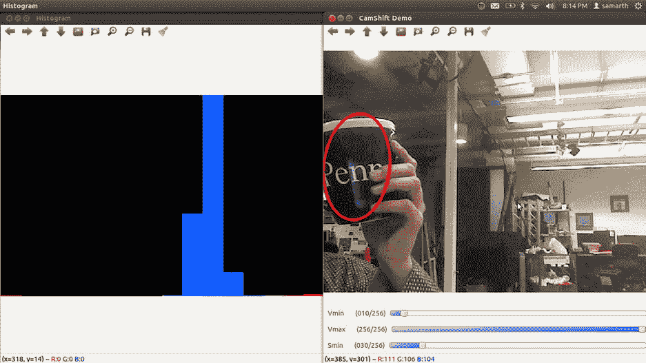

图 3-3。

Camshift object tracking

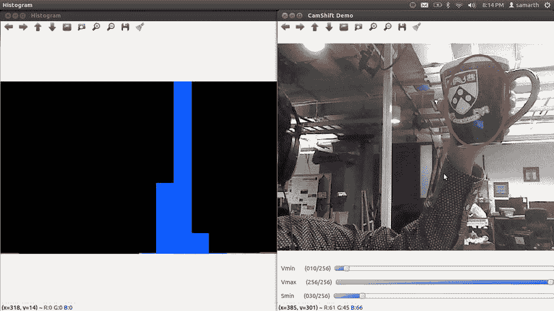

图 3-2。

Camshift object tracking

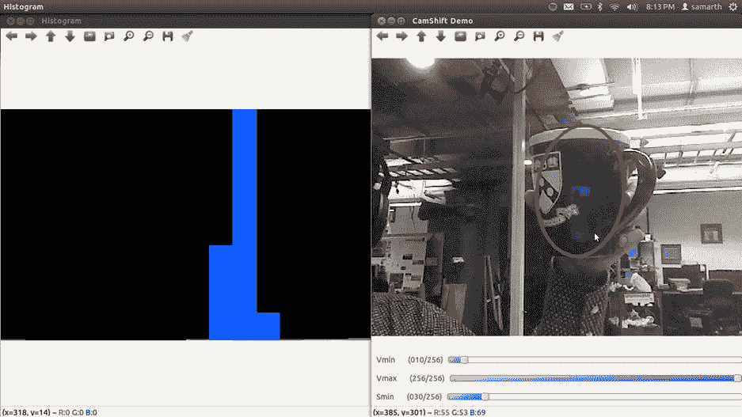

图 3-1。

Camshift object tracking—specifying the object to be tracked

但是，camshift 总是试图找到对象的实例。如果对象不存在，它显示最近的匹配作为检测(见图 [3-4](#Fig4) )。

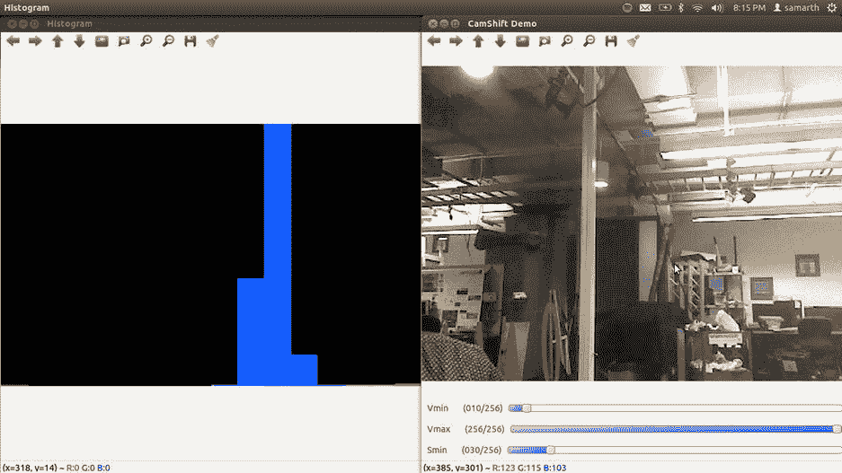

图 3-4。

Camshift giving a false positive

## 立体匹配

`stereo_matching`演示展示了 OpenCV 的立体块匹配和视差计算能力。它将两幅图像(由左右立体摄像机拍摄)作为输入，并产生一幅视差为灰色编码的图像。我将在本书的后面用整整一章来讨论立体视觉，同时，简短地解释一下视差:当你使用两个相机(左和右)看到一个物体时，它在两个图像中的水平位置会略有不同，右帧中的物体相对于左帧的位置差异称为视差。视差可以给出关于对象深度的概念，即，它离相机的距离，因为视差与距离成反比。在输出图像中，视差较大的像素较亮。(回想一下，较高的视差意味着离摄像机的距离较小。)您可以通过以下方式在著名的筑波图片上运行演示

`./cpp-example-stereo_match OPENCV_DIR/samples/cpp/tsukuba_l.png OPENCV_DIR/samples/cpp/tsukuba_r.png`

其中`OPENCV_DIR`是到`OPENCV_DIR`的路径

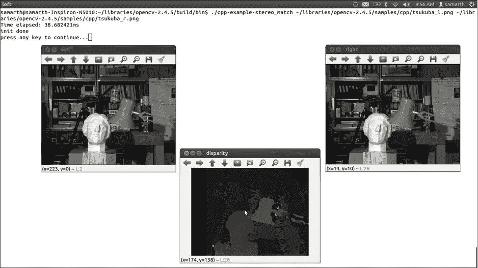

图 3-5。

OpenCV stereo matching

## 视频中单应性估计

`video_homography`演示使用快速角点检测器检测图像中的兴趣点，并匹配关键点处评估的简短描述符。它对“参考”帧和任何其他帧这样做，以估计两个图像之间的单应变换。单应只是将点从一个平面转换到另一个平面的矩阵。在这个演示中，您可以从摄像机画面中选择您的参考帧。演示程序在参考帧和当前帧之间的单应变换方向上画线。你可以运行它

`./cpp-example-video_homography 0`

其中 0 是摄像机的设备 ID。0 通常意味着笔记本电脑的集成网络摄像头。

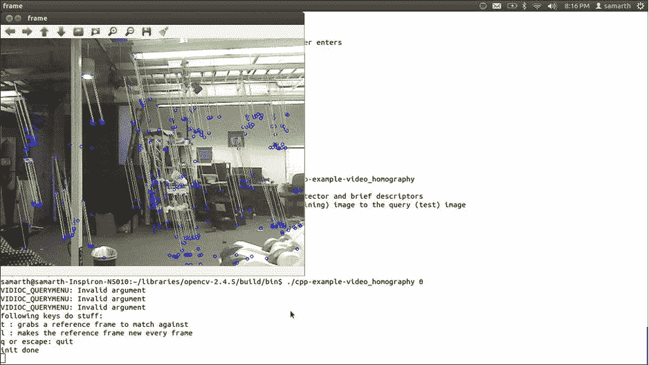

图 3-7。

Estimated homography shown by lines

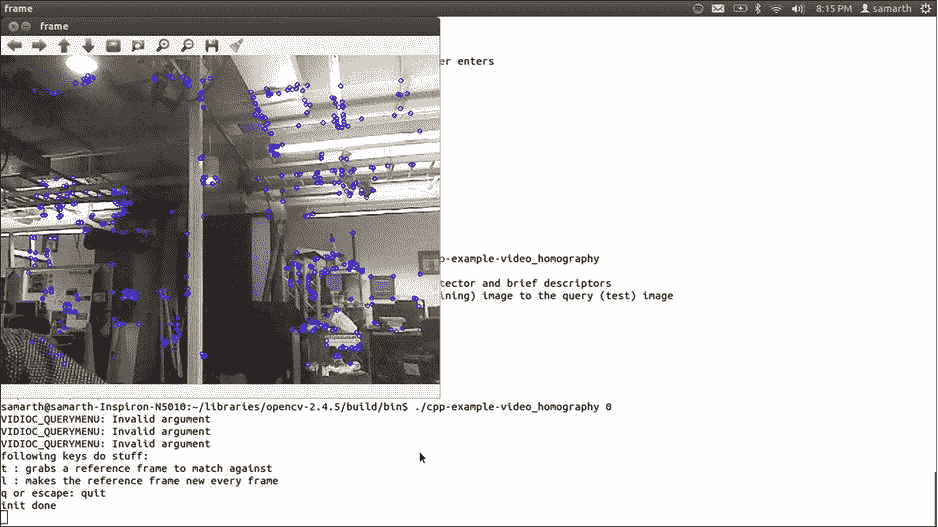

图 3-6。

The reference frame for homography estimation, also showing FAST corners

## 圆和线检测

OpenCV 中的 houghcircles 和 houghlines 演示使用 Hough 变换分别检测给定图像中的圆和线。我将在第 6 章中对霍夫变换有更多的说明。现在，只要知道霍夫变换是一个非常有用的工具，它可以让你检测图像中的规则形状。您可以通过以下方式运行演示

`./cpp-example-houghcircles OPENCV_DIR/samples/cpp/board.jpg`

和

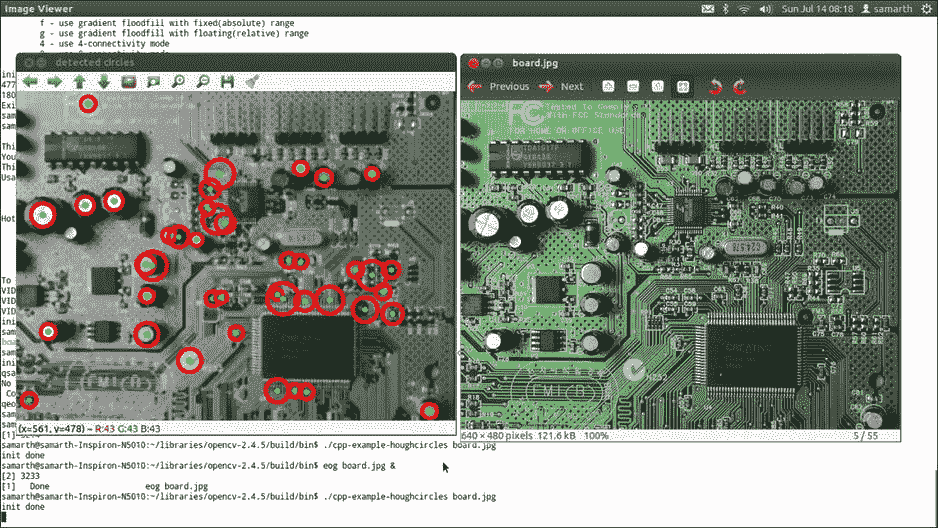

图 3-8。

Circle detection using Hough transform and

`./cpp-example-houghlines OPENCV_DIR/samples/cpp/pic1.png`

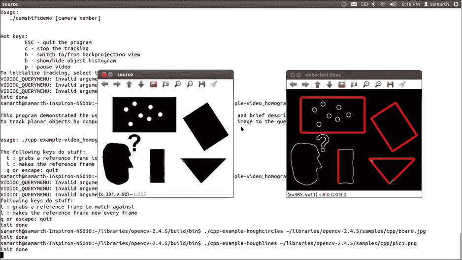

图 3-9。

Line detection using Hough transform

## 图象分割法

`meanshift_segmentation`演示实现了图像分割的 meanshift 算法(区分图像的不同“部分”)。它还允许您设置与算法相关的各种阈值。运行它

`./cpp-example-meanshift_segmentation OPENCV_DIR/samples/cpp/tsukuba_l.png`

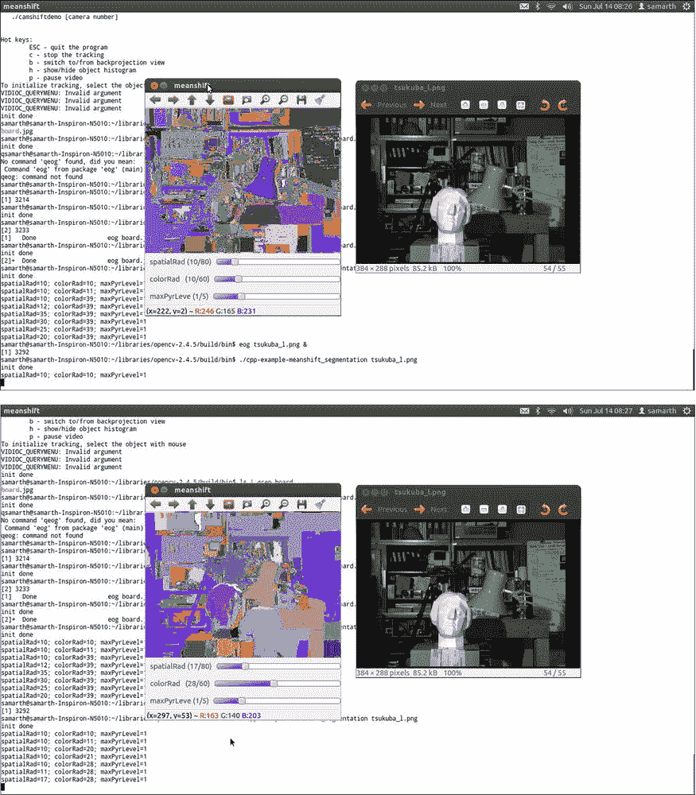

图 3-10。

Image segmentation using the meanshift algorithm

如你所见，图像中的不同区域颜色不同。

## 包围盒和圆形

演示程序找到包围一组点的最小的矩形和圆形。在演示中，点是从图像区域内随机选择的。

`./cpp-example-minarea`

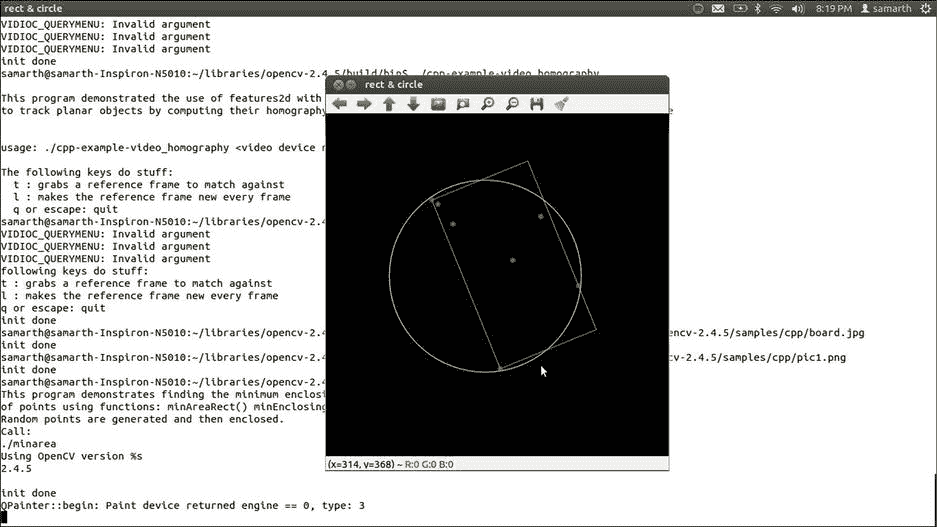

图 3-11。

Bounding box and circle

## 图像修复

图像修复是用周围的像素替换图像中的某些像素。它主要用于修复图像的损坏，如意外的笔触。OpenCV `inpaint`演示允许你通过在图像上做白色标记来破坏图像，然后运行修复算法来修复损坏。

`./cpp-example-inpaint OPENCV_DIR/samples/cpp/fruits.jpg`

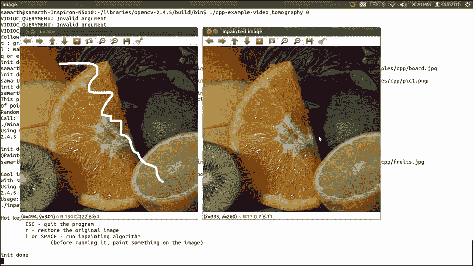

图 3-12。

Image inpainting

## 摘要

本章的目的是让您对 OpenCV 的各种能力有所了解。还有很多其他的演示。请随意尝试，以获得更好的想法。一个特别著名的 OpenCV 演示是使用哈尔级联的人脸检测。主动的读者也可以浏览这些示例的源代码，可以在`OPENCV_DIR/samples/cpp`中找到。本书中的许多未来项目将利用这些样本中的代码片段和思想。