# 七、图像分割和直方图

Abstract

欢迎来到第七章！在上一章讨论了形状和轮廓之后，我想谈谈图像分割这个非常重要的话题，这是当今吸引大量研究的最基本的计算机视觉问题之一。我们将讨论 OpenCV 已经准备好的一些分割算法，以及如何使用其他技术(如形态学操作)来定制自己的分割算法。

欢迎来到第七章！在上一章讨论了形状和轮廓之后，我想谈谈图像分割这个非常重要的话题，这是当今吸引大量研究的最基本的计算机视觉问题之一。我们将讨论 OpenCV 已经准备好的一些分割算法，以及如何使用其他技术(如形态学操作)来定制自己的分割算法。

具体来说，我们将从简单的分割技术开始——阈值分割，然后通过洪水填充、分水岭分割和 grabCut 分割逐步提高复杂度。我们还将在 floodFill 的基础上构建自己的分割算法，来计算照片中的对象。

在本章的最后，我还讨论了图像直方图及其应用，它们是有用的预处理步骤。

## 图象分割法

图像分割可以被定义为在视觉上分离图像的不同部分的过程。事实上，我们已经为基于颜色的对象检测应用做了一些基本的图像分割！在这一章中，你将学到一些技巧，帮助你大幅度提高物体探测器的应用。

现在，由于“视觉上”的不同是一种主观属性，可以随着手头的问题而改变，所以当分割能够为了期望的目的而适当地分割图像时，分割通常也被认为是正确的。例如，让我们考虑同一个图像(图 [7-1](#Fig1) )，我们想要解决两个不同的问题——计数球和提取前景。正如您可能已经意识到的，这两个问题都是正确图像分割的问题。对于球的计数问题，我们需要一个分割算法，将图像分成所有视觉上不同的区域——背景、手和球。相反，对于另一个问题(提取前景的问题)，将手和球视为一个单一区域是可以接受的。

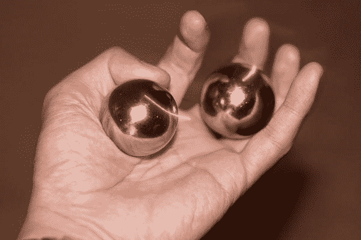

图 7-1。

Image for two segmentation problems: Foreground extraction and counting objects

关于代码和语法，有一点需要注意:我现在将介绍函数并讨论使用它们的策略，不会在语法上花太多时间。这是因为我希望你查阅在线 OpenCV 文档( [`http://docs.opencv.org`](http://docs.opencv.org/) )来了解这些函数。此外，函数的引入之后通常是以一种建设性的方式使用该函数的代码。查看该用法示例将进一步帮助您理解该函数的语法。

### 通过阈值进行简单分割

最简单的分割策略之一是设定颜色值的阈值(这就是我们对基于颜色的对象检测器所做的)。OpenCV 有函数`threshold()`(阈值在一个`Mat`中，当超过阈值和遵循阈值时，有不同的操作选项——查看文档！)、`inRange()`(对`Mat`中的值应用低和高阈值)和`adaptiveThreshold()`(与`threshold()`相同，除了每个像素的阈值取决于其在补丁中的邻居的值，补丁的大小由用户定义)来帮助您设定阈值。到目前为止，我们在像素的 RGB 值中使用了`inRange()`，发现简单的 RGB 值对光照非常敏感。

然而，光照只是影响像素的强度。在 RBG 色彩空间中进行阈值处理的问题是，亮度信息由所有 R、G 和 B 共享(亮度= 30% R + 59% G + 11% B)。相比之下，HSV(色调、饱和度、值)色彩空间只对亮度进行编码，而 H 和 S 只对颜色信息进行编码。h 代表实际的颜色，而 S 代表它的“强度”或纯度。 [`http://www.dig.cs.gc.cuny.edu/manuals/Gimp2/Grokking-the-GIMP-v1.0/node51.html`](http://www.dig.cs.gc.cuny.edu/manuals/Gimp2/Grokking-the-GIMP-v1.0/node51.html) 如果你想在 HSV 色彩空间上多读点，是个好地方。这很棒，因为我们现在可以只对图像中的 H 和 S 通道进行阈值处理，并获得很多光照不变性。因此，清单 7-1 与我们上一个对象检测器代码相同，除了它首先使用`cvtColor()`将帧转换到 HSV 色彩空间，并设置 H 和 S 通道的阈值。图 [7-2](#Fig2) 显示了运行中的代码，但是你应该在不同的光照条件下进行实验，看看你得到了多少不变性。

清单 7-1。使用色调和饱和度阈值的基于颜色的对象检测

`// Program to display a video from attached default camera device and detect colored blobs using H and S thresholding`

`// Remove noise using opening and closing morphological operations`

`// Author: Samarth Manoj Brahmbhatt, University of Pennsylvania`

`#include <opencv2/opencv.hpp>`

`#include <opencv2/highgui/highgui.hpp>`

`#include <opencv2/imgproc/imgproc.hpp>`

`using namespace cv;`

`using namespace std;`

`int hs_slider = 0, low_slider = 30, high_slider = 100;`

`int low_h = 30, low_s = 30, high_h = 100, high_s = 100;`

`void on_hs_trackbar(int, void *) {`

`switch(hs_slider) {`

`case 0:`

`setTrackbarPos("Low threshold", "Segmentation", low_h);`

`setTrackbarPos("High threshold", "Segmentation", high_h);`

`break;`

`case 1:`

`setTrackbarPos("Low threshold", "Segmentation", low_s);`

`setTrackbarPos("High threshold", "Segmentation", high_s);`

`break;`

`}`

`}`

`void on_low_thresh_trackbar(int, void *) {`

`switch(hs_slider) {`

`case 0:`

`low_h = min(high_slider - 1, low_slider);`

`setTrackbarPos("Low threshold", "Segmentation", low_h);`

`break;`

`case 1:`

`low_s = min(high_slider - 1, low_slider);`

`setTrackbarPos("Low threshold", "Segmentation", low_s);`

`break;`

`}`

`}`

`void on_high_thresh_trackbar(int, void *) {`

`switch(hs_slider) {`

`case 0:`

`high_h = max(low_slider + 1, high_slider);`

`setTrackbarPos("High threshold", "Segmentation", high_h);`

`break;`

`case 1:`

`high_s = max(low_slider + 1, high_slider);`

`setTrackbarPos("High threshold", "Segmentation", high_s);`

`break;`

`}`

`}`

`int main()`

`{`

`// Create a VideoCapture object to read from video file`

`// 0 is the ID of the built-in laptop camera, change if you want to use other camera`

`VideoCapture cap(0);`

`//check if the file was opened properly`

`if(!cap.isOpened())`

`{`

`cout << "Capture could not be opened succesfully" << endl;`

`return -1;`

`}`

`namedWindow("Video");`

`namedWindow("Segmentation");`

`createTrackbar("0\. H\n1\. S", "Segmentation", &hs_slider, 1, on_hs_trackbar);`

`createTrackbar("Low threshold", "Segmentation", &low_slider, 255, on_low_thresh_trackbar);`

`createTrackbar("High threshold", "Segmentation", &high_slider, 255, on_high_thresh_trackbar);`

`while(char(waitKey(1)) != 'q' && cap.isOpened())`

`{`

`Mat frame, frame_thresholded, frame_hsv;`

`cap >> frame;`

`cvtColor(frame, frame_hsv, CV_BGR2HSV);`

`// Check if the video is over`

`if(frame.empty())`

`{`

`cout << "Video over" << endl;`

`break;`

`}`

`// extract the Hue and Saturation channels`

`int from_to[] = {0,0, 1,1};`

`Mat hs(frame.size(), CV_8UC2);`

`mixChannels(&frame_hsv, 1, &hs, 1, from_to, 2);`

`// check the image for a specific range of H and S`

`inRange(hs, Scalar(low_h, low_s), Scalar(high_h, high_s), frame_thresholded);`

`// open and close to remove noise`

`Mat str_el = getStructuringElement(MORPH_ELLIPSE, Size(7, 7));`

`morphologyEx(frame_thresholded, frame_thresholded, MORPH_OPEN, str_el);`

`morphologyEx(frame_thresholded, frame_thresholded, MORPH_CLOSE, str_el);`

`imshow("Video", frame);`

`imshow("Segmentation", frame_thresholded);`

`}`

`return 0;`

`}`

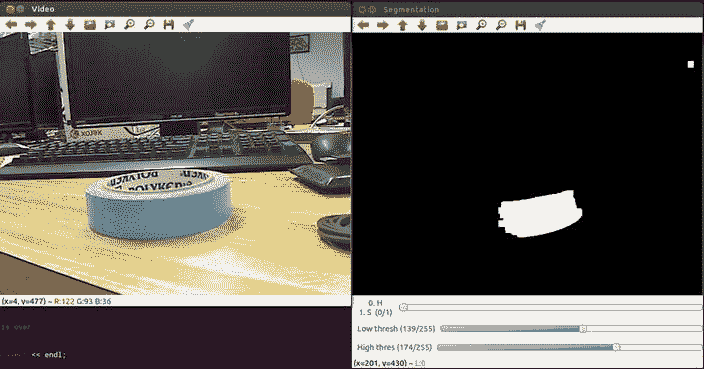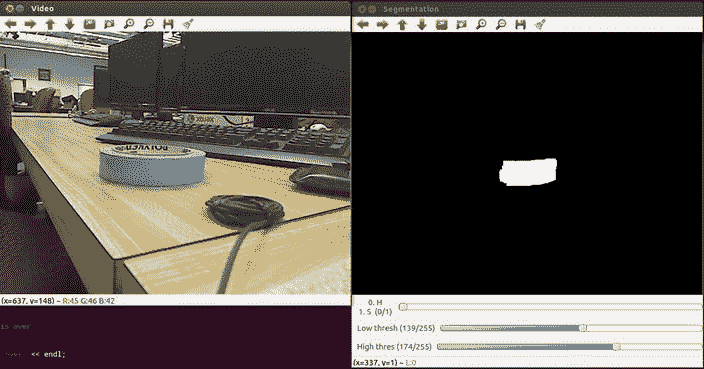T2】

图 7-2。

Object detection by Hue and Saturation range-checking

正如你在图 [7-2](#Fig2) 中看到的，我正试图探测一个蓝色的物体。由于 HSV 色彩空间的固有属性，如果您试图设置红色的范围，您将面临一些困难。色调通常表示为一个从 0 到 360 的圆圈(OpenCV 将这个数字减半以存储在`CV_8U`图像中),周围环绕着红色。这意味着红色的色调范围大约是> 340 和< 20，0 在 360 之后。所以你不能用我们正在使用的滑块处理来指定红色的整个色调范围。这是一个练习，让你弄清楚如何处理你的滑块值来解决这个问题。提示:由于色相减半，任何图像中最大可能的色相是 180。充分利用你拥有的额外空间(255–180 = 75)。

### 洪水泛滥

OpenCV 的`floodFill()`函数确定图像中与种子像素相似并与之相连的像素。在灰度图像的情况下，相似性通常由灰度级定义，而在彩色图像的情况下，由 RGB 值定义。该函数采用种子点的灰度(或 RGB)值周围的灰度(或 RGB)值范围，定义像素是否应被视为与种子像素相似。有两种方法可以确定一个像素是否与另一个像素相连:4-连通和 8-连通，从图 [7-3](#Fig3) 所示的例子中可以明显看出。

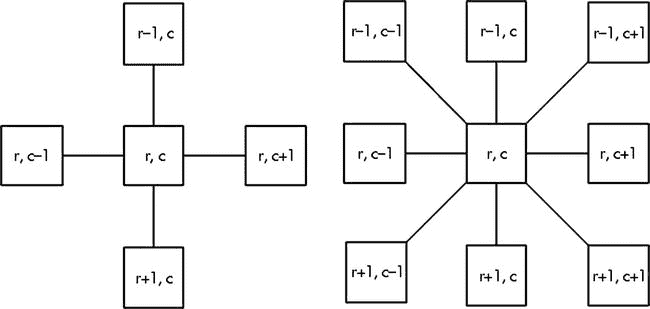

图 7-3。

4-connectivity (left) and 8-connectivity (right)

OpenCV floodFill 演示非常有趣。它允许您单击图像来指定种子点，并使用滑块来指定种子点周围的上限和下限范围，以定义相似性。

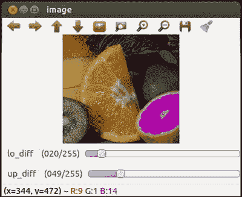

图 7-4。

OpenCV floodFill demo

可以使用以下策略利用`floodFill()`来自动化基于颜色的对象检测器应用:

*   请用户点击该对象
*   通过`floodFill()`获得到该点的相似连接像素
*   将这个像素集合转换为 HSV，并从中决定使用`inRange()`检查的 H 和 S 值的范围

看看清单 7-2，这是我们现在的“智能的”基于颜色的物体探测器应用！

清单 7-2。程序使用洪水填补，使基于颜色的对象探测器“智能”

`// Program to automate the color-based object detector using floodFill`

`// Author: Samarth Manoj Brahmbhatt, University of Pennsylvania`

`#include <opencv2/opencv.hpp>`

`#include <opencv2/highgui/highgui.hpp>`

`#include <opencv2/imgproc/imgproc.hpp>`

`using namespace cv;`

`using namespace std;`

`Mat frame_hsv, frame, mask;`

`int low_diff = 10, high_diff = 10, conn = 4, val = 255, flags = conn + (val << 8) + CV_FLOODFILL_MASK_ONLY;`

`double h_h = 0, l_h = 0, h_s = 0, l_s = 0;`

`bool selected = false;`

`void on_low_diff_trackbar(int, void *) {}`

`void on_high_diff_trackbar(int, void *) {}`

`void on_mouse(int event, int x, int y, int, void *) {`

`if(event != EVENT_LBUTTONDOWN) return;`

`selected = true;`

`//seed point`

`Point p(x, y);`

`// make mask using floodFill`

`mask = Scalar::all(0);`

`floodFill(frame, mask, p, Scalar(255, 255, 255), 0, Scalar(low_diff, low_diff, low_diff), Scalar(high_diff, high_diff, high_diff), flags);`

`// find the H and S range of piexels selected by floodFill`

`Mat channels[3];`

`split(frame_hsv, channels);`

`minMaxLoc(channels[0], &l_h, &h_h, NULL, NULL, mask.rowRange(1, mask.rows-1).colRange(1, mask.cols-1));`

`minMaxLoc(channels[1], &l_s, &h_s, NULL, NULL, mask.rowRange(1, mask.rows-1).colRange(1, mask.cols-1));`

`}`

`int main() {`

`// Create a VideoCapture object to read from video file`

`// 0 is the ID of the built-in laptop camera, change if you want to use other camera`

`VideoCapture cap(0);`

`//check if the file was opened properly`

`if(!cap.isOpened()) {`

`cout << "Capture could not be opened succesfully" << endl;`

`return -1;`

`}`

`namedWindow("Video");`

`namedWindow("Segmentation");`

`createTrackbar("Low Diff", "Segmentation", &low_diff, 50, on_low_diff_trackbar);`

`createTrackbar("High Diff ", "Segmentation", &high_diff, 50, on_high_diff_trackbar);`

`setMouseCallback("Video", on_mouse);`

`while(char(waitKey(1)) != 'q' && cap.isOpened()) {`

`cap >> frame;`

`if(!selected) mask.create(frame.rows+2, frame.cols+2, CV_8UC1);`

`// Check if the video is over`

`if(frame.empty()) {`

`cout << "Video over" << endl;`

`break;`

`}`

`cvtColor(frame, frame_hsv, CV_BGR2HSV);`

`// extract the hue and saturation channels`

`int from_to[] = {0,0, 1,1};`

`Mat hs(frame.size(), CV_8UC2);`

`mixChannels(&frame_hsv, 1, &hs, 1, from_to, 2);`

`// check for the range of H and S obtained from floodFill`

`Mat frame_thresholded;`

`inRange(hs, Scalar(l_h, l_s), Scalar(h_h, h_s), frame_thresholded);`

`// open and close to remove noise`

`Mat str_el = getStructuringElement(MORPH_RECT, Size(5, 5));`

`morphologyEx(frame_thresholded, frame_thresholded, MORPH_OPEN, str_el);`

`morphologyEx(frame_thresholded, frame_thresholded, MORPH_CLOSE, str_el);`

`imshow("Video", frame);`

`imshow("Segmentation", frame_thresholded);`

`}`

`return 0;`

`}`

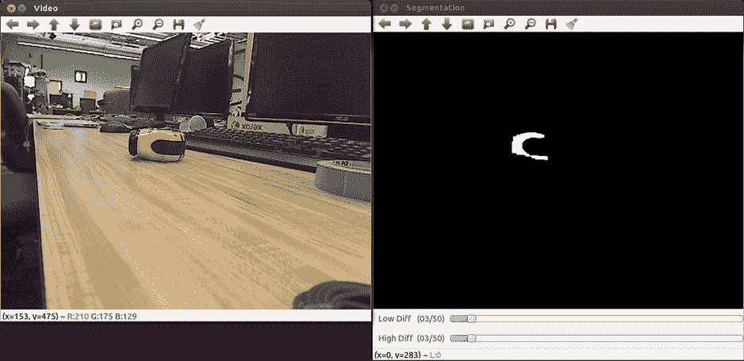 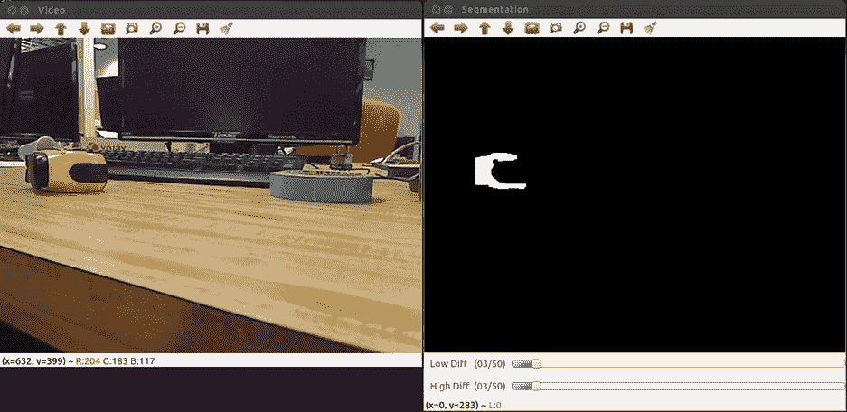

图 7-5。

Using floodFill in the color-based object detector

### 分水岭分割

分水岭算法是分割具有相互接触的对象的图像的好方法，但是边缘对于精确分割来说不够强。考虑这样一个例子:一箱水果的俯视图，以及分割单个水果来计数的问题。如图 [7-6](#Fig6) 所示，在严格阈值下的 Canny 边缘仍然噪声过大。将霍夫圆(对圆的最小半径有限制)拟合到这些边上显然是行不通的，正如您在同一张图中所看到的。

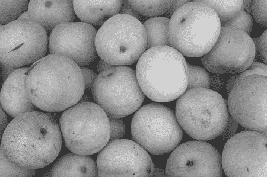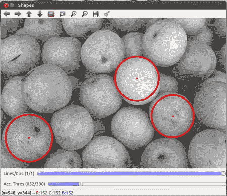T3】

图 7-6。

(clockwise, from top left) original image, Canny edges with a tight threshold and attempts to fit circles to the image at different Hough accumulator thresholds

现在让我们看看分水岭分割如何帮助我们。它是这样工作的:

*   使用一些函数来决定图像中像素的“高度”，例如灰度级
*   重构图像以将所有区域最小值强制到相同的水平。因此“盆地”在极小值周围形成
*   从该深度结构的最低点开始向其注入液体，直到液体到达该结构的最高点。只要两个盆地的液体相遇，就会建造一道“堤坝”或“分水线”来防止它们混合
*   该过程完成后，盆地作为图像的不同区域返回，而分水岭线是区域的边界

OpenCV 函数`watershed()`实现了标记控制的分水岭分割，这让事情变得简单了一些。用户给定某些标记作为算法的输入，该算法首先重建图像以仅在这些标记点处具有局部最小值。该过程的其余部分如前所述继续进行。OpenCV 分水岭演示让用户在图像上标记这些标记(图 [7-7](#Fig7) )。

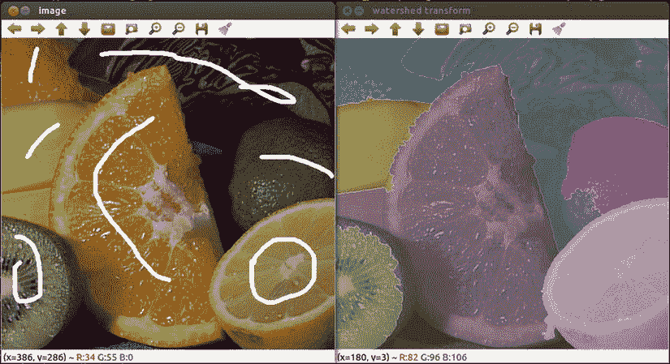

图 7-7。

OpenCV watershed demo—marker-based watershed segmentation

在对象计数器应用中使用分水岭变换的主要挑战是通过代码计算出标记，而不是让人工输入它们。清单 7-3 中使用了下面的策略，它使用了很多你以前学过的形态学运算:

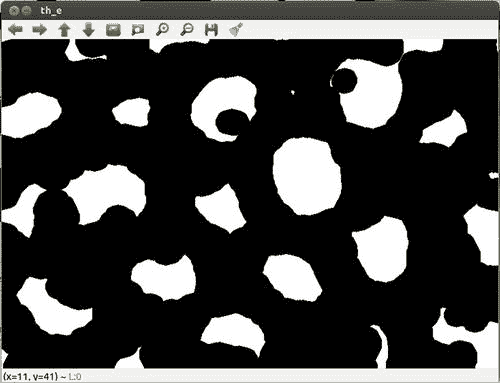

图 7-12。

Eroding the previous image twice completely isolates the objects

*   腐蚀两次以分离掩模中的一些区域(图 [7-12](#Fig12)

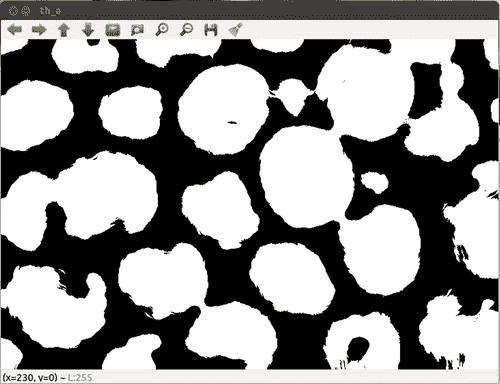

图 7-11。

Adaptively thresholding the previous image (almost) isolates the different objects

*   应用自适应阈值创建一个二进制蒙版，在前景对象区域为 255，否则为 0(图 [7-11](#Fig11) )

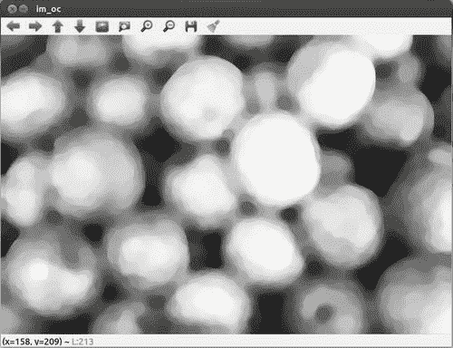

图 7-10。

Opening and closing with a relatively large circular structuring element highlights foreground objects

*   打开和关闭以突出显示前景对象(图 [7-10](#Fig10)

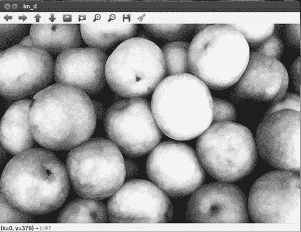

图 7-9。

Dilating the image removes black spots

*   放大图像以去除小黑点(图 [7-9](#Fig9)

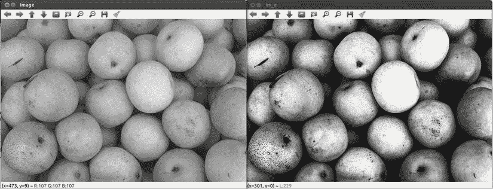

图 7-8。

Histogram equalization improves image contrast

*   均衡图像的灰度直方图以提高对比度，如图 [7-8](#Fig8) 所示。我们将在本章的后面讨论这是如何工作的。现在，只要记住它提高了图像的对比度，可以通过使用`equalizeHist()`来实现

现在，我们可以在`watershed()`功能中将该遮罩中的区域用作标记。但在此之前，这些区域必须用正整数标注。我们通过检测轮廓，然后使用连续增加的整数通过`drawContours()`填充这些轮廓来做到这一点。图 [7-13](#Fig13) 显示了分水岭变换的最终输出。请注意我从 OpenCV 分水岭演示代码中借用的一些小技巧，这些技巧用于给区域着色并透明地显示它们。清单 7-3 显示了实际的程序。

清单 7-3。使用形态学操作和分水岭变换计算对象数量的程序

`// Program to count the number of objects using morphology operations and the watershed transform`

`// Author: Samarth Manoj Brahmbhatt, University of Pennsylvania`

`#include <opencv2/opencv.hpp>`

`#include <opencv2/highgui/highgui.hpp>`

`#include <opencv2/imgproc/imgproc.hpp>`

`using namespace cv;`

`using namespace std;`

`class objectCounter {`

`private:`

`Mat image, gray, markers, output;`

`int count;`

`public:`

`objectCounter(Mat); //constructor`

`void get_markers(); //function to get markers for watershed segmentation`

`int count_objects(); //function to implement watershed segmentation and count catchment basins`

`};`

`objectCounter::objectCounter(Mat _image) {`

`image = _image.clone();`

`cvtColor(image, gray, CV_BGR2GRAY);`

`imshow("image", image);`

`}`

`void objectCounter::get_markers() {`

`// equalize histogram of image to improve contrast`

`Mat im_e; equalizeHist(gray, im_e);`

`//imshow("im_e", im_e);`

`// dilate to remove small black spots`

`Mat strel = getStructuringElement(MORPH_ELLIPSE, Size(9, 9));`

`Mat im_d; dilate(im_e, im_d, strel);`

`//imshow("im_d", im_d);`

`// open and close to highlight objects`

`strel = getStructuringElement(MORPH_ELLIPSE, Size(19, 19));`

`Mat im_oc; morphologyEx(im_d, im_oc, MORPH_OPEN, strel);`

`morphologyEx(im_oc, im_oc, MORPH_CLOSE, strel);`

`//imshow("im_oc", im_oc);`

`// adaptive threshold to create binary image`

`Mat th_a; adaptiveThreshold(im_oc, th_a, 255, ADAPTIVE_THRESH_MEAN_C, THRESH_BINARY, 105, 0);`

`//imshow("th_a", th_a);`

`// erode binary image twice to separate regions`

`Mat th_e; erode(th_a, th_e, strel, Point(-1, -1), 2);`

`//imshow("th_e", th_e);`

`vector<vector<Point> > c, contours;`

`vector<Vec4i> hierarchy;`

`findContours(th_e, c, hierarchy, CV_RETR_CCOMP, CV_CHAIN_APPROX_NONE);`

`// remove very small contours`

`for(int idx = 0; idx >= 0; idx = hierarchy[idx][0])`

`if(contourArea(c[idx]) > 20) contours.push_back(c[idx]);`

`cout << "Extracted " << contours.size() << " contours" << endl;`

`count = contours.size();`

`markers.create(image.rows, image.cols, CV_32SC1);`

`for(int idx = 0; idx < contours.size(); idx++)`

`drawContours(markers, contours, idx, Scalar::all(idx + 1), -1, 8);`

`}`

`int objectCounter::count_objects() {`

`watershed(image, markers);`

`// colors generated randomly to make the output look pretty`

`vector<Vec3b> colorTab;`

`for(int i = 0; i < count; i++) {`

`int b = theRNG().uniform(0, 255);`

`int g = theRNG().uniform(0, 255);`

`int r = theRNG().uniform(0, 255);`

`colorTab.push_back(Vec3b((uchar)b, (uchar)g, (uchar)r));`

`}`

`// watershed output image`

`Mat wshed(markers.size(), CV_8UC3);`

`// paint the watershed output image`

`for(int i = 0; i < markers.rows; i++)`

`for(int j = 0; j < markers.cols; j++) {`

`int index = markers.at<int>(i, j);`

`if(index == -1)`

`wshed.at<Vec3b>(i, j) = Vec3b(255, 255, 255);`

`else if(index <= 0 || index > count)`

`wshed.at<Vec3b>(i, j) = Vec3b(0, 0, 0);`

`else`

`wshed.at<Vec3b>(i, j) = colorTab[index - 1];`

`}`

`// superimpose the watershed image with 50% transparence on the grayscale original image`

`Mat imgGray; cvtColor(gray, imgGray, CV_GRAY2BGR);`

`wshed = wshed*0.5 + imgGray*0.5;`

`imshow("Segmentation", wshed);`

`return count;`

`}`

`int main() {`

`Mat im = imread("fruit.jpg");`

`objectCounter oc(im);`

`oc.get_markers();`

`int count = oc.count_objects();`

`cout << "Counted " << count << " fruits." << endl;`

`while(char(waitKey(1)) != 'q') {}`

`return 0;`

`}`

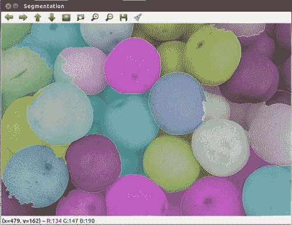

图 7-13。

Segmentation after the watershed transform

### GrabCut 分割

GrabCut 是一种基于图形的分割方法，允许您在感兴趣的对象周围指定一个矩形，然后尝试将对象从图像中分割出来。虽然我将把对该算法的讨论限制在 OpenCV 演示中，但是您可以查看 c .罗泽尔、V. Kolmogorov 和 A. Blake 关于该算法的论文“GrabCut:使用迭代图切割的交互式前景提取”。OpenCV 演示程序允许您运行该算法的多次迭代，每次迭代都会产生更好的结果。请注意，您指定的初始矩形必须尽可能紧密。

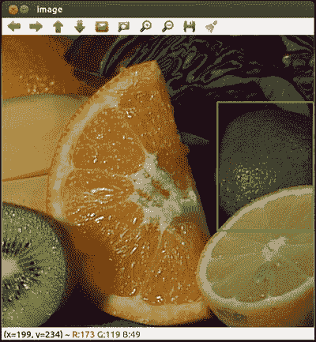 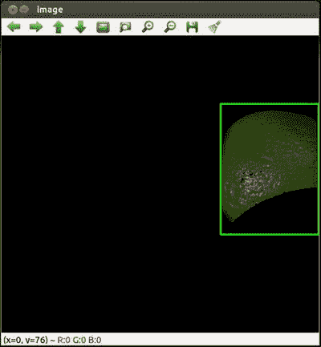

图 7-14。

OpenCV GrabCut demo

## 直方图

直方图是一种简单而强大的表示数据分布的方式。如果你不知道直方图是什么，我建议你去维基百科页面看看。在图像中，最简单的直方图可以由图像所有像素的灰度级(或 R、G 或 B 值)构成。这将使您能够发现图像数据分布的总体趋势。例如，在暗图像中，直方图的大部分峰值位于 0 到 255 范围的较低部分。

### 均衡直方图

直方图最简单的应用是归一化亮度和提高图像的对比度。这是通过首先从直方图中阈值化出非常低的值，然后“拉伸”它，使得直方图占据整个 0 到 255 范围来实现的。一个非常有效的方法是:

*   根据原始图像`src`制作新图像`dst`，如下所示:

*   计算直方图并将其归一化，使直方图中所有元素的总和为 255
*   计算直方图的累积和:

OpenCV 函数`equalizeHist()`实现了这一点。清单 7-4 是一个小程序，它可以向你展示普通图像和直方图均衡化图像的区别。您也可以将`equalizeHist()`应用于 RGB 图像，方法是将它分别应用于所有三个通道。图 [7-15](#Fig15) 展示了直方图均衡化的魔力！

清单 7-4。说明直方图均衡化的程序

`// Program to illustrate histogram equalization in RGB images`

`// Author: Samarth Manoj Brahmbhatt, University of Pennsylvania`

`#include <opencv2/opencv.hpp>`

`#include <opencv2/highgui/highgui.hpp>`

`#include <opencv2/imgproc/imgproc.hpp>`

`using namespace cv;`

`using namespace std;`

`Mat image, image_eq;`

`int choice = 0;`

`void on_trackbar(int, void*) {`

`if(choice == 0) // normal image`

`imshow("Image", image);`

`else // histogram equalized image`

`imshow("Image", image_eq);`

`}`

`int main() {`

`image = imread("scene.jpg");`

`image_eq.create(image.rows, image.cols, CV_8UC3);`

`//separate channels, equalize histograms and them merge them`

`vector<Mat> channels, channels_eq;`

`split(image, channels);`

`for(int i = 0; i < channels.size(); i++) {`

`Mat eq;`

`equalizeHist(channels[i], eq);`

`channels_eq.push_back(eq);`

`}`

`merge(channels_eq, image_eq);`

`namedWindow("Image");`

`createTrackbar("Normal/Eq.", "Image", &choice, 1, on_trackbar);`

`on_trackbar(0, 0);`

`while(char(waitKey(1)) != 'q') {}`

`return 0;`

`}`

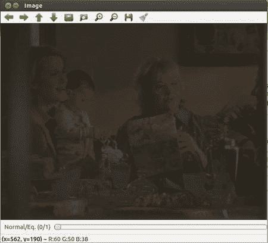 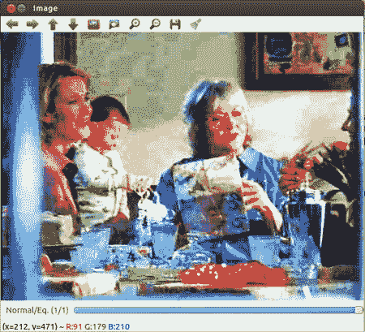

图 7-15。

Histogram equalization

### 直方图反投影

直方图反投影是计算直方图的反向过程。假设你已经有了一个直方图。您可以通过将该图像的每个像素值替换为像素值所在面元的直方图值，将其反投影到另一个图像中。这有效地填充了图像中与直方图分布匹配的高值区域和其余的小值区域。OpenCV 函数`calcHist()`和`calcBackProject()`可以分别用于计算直方图和反投影直方图。为了给你一个使用它们的例子，清单 7-5 是对自动目标检测器的修改:

*   它允许用户点击窗口中的对象
*   它使用`floodFill()`计算相连的相似点
*   计算`floodFill()`所选点的色调和饱和度直方图
*   它将这个直方图反投影到连续的视频帧中

图 [7-16](#Fig16) 显示了背投应用的运行情况。

清单 7-5。说明直方图反投影的程序

`// Program to illustrate histogram backprojection`

`// Author: Samarth Manoj Brahmbhatt, University of Pennsylvania`

`#include <opencv2/opencv.hpp>`

`#include <opencv2/highgui/highgui.hpp>`

`#include <opencv2/imgproc/imgproc.hpp>`

`using namespace cv;`

`using namespace std;`

`Mat frame_hsv, frame, mask;`

`MatND hist; //2D histogram`

`int conn = 4, val = 255, flags = conn + (val << 8) + CV_FLOODFILL_MASK_ONLY;`

`bool selected = false;`

`// hue and saturation histogram ranges`

`float hrange[] = {0, 179}, srange[] = {0, 255};`

`const float *ranges[] = {hrange, srange};`

`void on_mouse(int event, int x, int y, int, void *) {`

`if(event != EVENT_LBUTTONDOWN) return;`

`selected = true;`

`// floodFill`

`Point p(x, y);`

`mask = Scalar::all(0);`

`floodFill(frame, mask, p, Scalar(255, 255, 255), 0, Scalar(10, 10, 10), Scalar(10, 10, 10), flags);`

`Mat _mask = mask.rowRange(1, mask.rows-1).colRange(1, mask.cols-1);`

`// number of bins in the histogram for each channel`

`int histSize[] = {50, 50}, channels[] = {0, 1};`

`// calculate and normalize histogram`

`calcHist(&frame_hsv, 1, channels, _mask, hist, 2, histSize, ranges);`

`normalize(hist, hist, 0, 255, NORM_MINMAX, -1, Mat());`

`}`

`int main() {`

`// Create a VideoCapture object to read from video file`

`// 0 is the ID of the built-in laptop camera, change if you want to use other camera`

`VideoCapture cap(0);`

`//check if the file was opened properly`

`if(!cap.isOpened()) {`

`cout << "Capture could not be opened succesfully" << endl;`

`return -1;`

`}`

`namedWindow("Video");`

`namedWindow("Backprojection");`

`setMouseCallback("Video", on_mouse);`

`while(char(waitKey(1)) != 'q' && cap.isOpened()) {`

`cap >> frame;`

`if(!selected) mask.create(frame.rows+2, frame.cols+2, CV_8UC1);`

`// Check if the video is over`

`if(frame.empty()) {`

`cout << "Video over" << endl;`

`break;`

`}`

`cvtColor(frame, frame_hsv, CV_BGR2HSV);`

`// backproject on the HSV image`

`Mat frame_backprojected = Mat::zeros(frame.size(), CV_8UC1);`

`if(selected) {`

`int channels[] = {0, 1};`

`calcBackProject(&frame_hsv, 1, channels, hist, frame_backprojected, ranges);`

`}`

`imshow("Video", frame);`

`imshow("Backprojection", frame_backprojected);`

`}`

`return 0;`

`}`

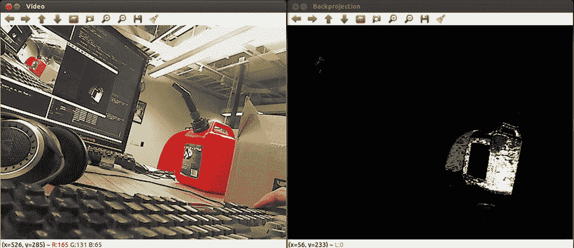 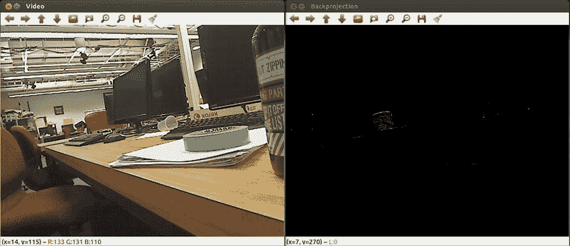

图 7-16。

Histogram backprojection

### Meanshift 和 Camshift

Meanshift 是一种在背投直方图图像中查找对象的算法。它将初始搜索窗口作为输入，然后迭代地移动该搜索窗口，使得该窗口内的反投影的质心位于该窗口的中心。

Camshift 是一种基于直方图反投影的对象跟踪算法，其核心使用 meanshift。它采用 meanshift 输出的检测窗口，并计算出该窗口的最佳大小和旋转来跟踪对象。OpenCV 函数`meanShift()`和`CamShift()`实现了这些算法，你可以在内置演示中看到 camshift 的 OpenCV 实现。

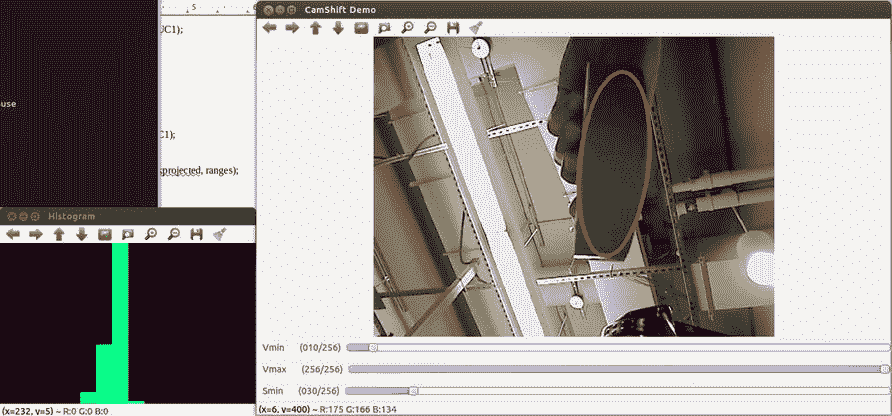 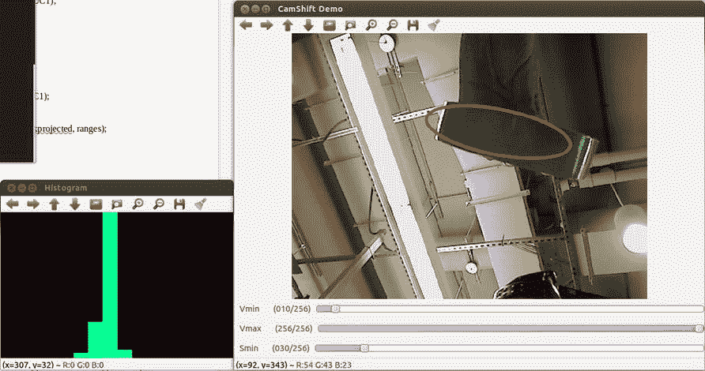

图 7-17。

OpenCV camshift demo

## 摘要

本章将使你了解 OpenCV 提供的分割算法。但是我真正想让你从本章学到的是如何结合你的图像处理知识来构建你自己的分割算法，就像我们对水果计数器应用所做的那样。这是因为，正如我在本章开始时所说的，分段对于不同的问题有不同的定义，它需要你有创造性。直方图均衡化和反投影可能是一些高级算法的重要预处理步骤，所以不要忘记它们！