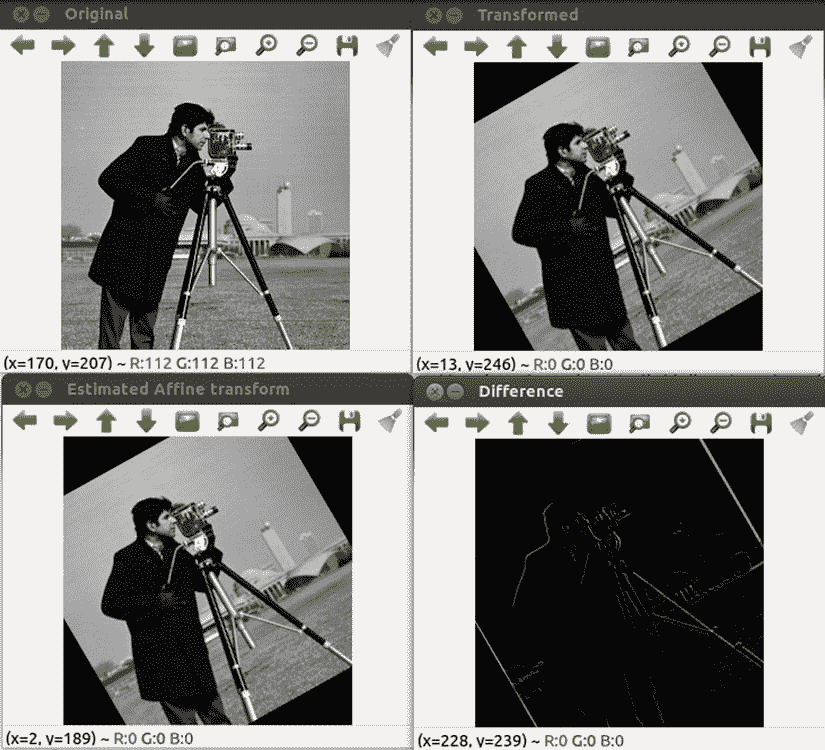
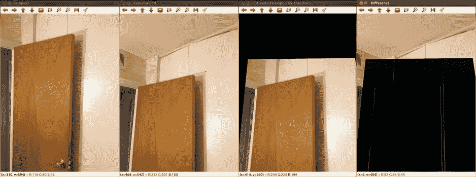
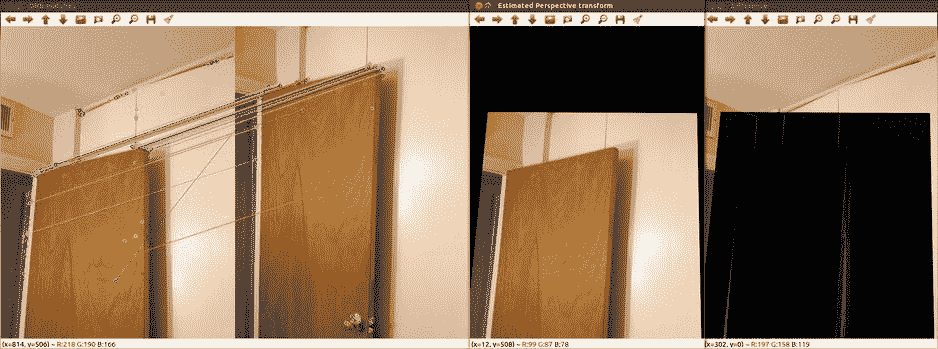
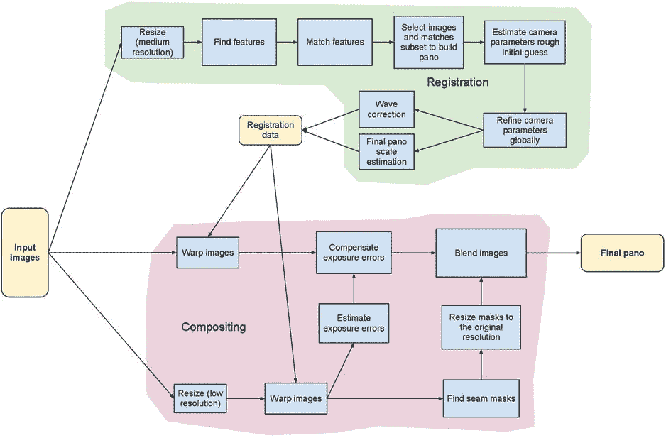
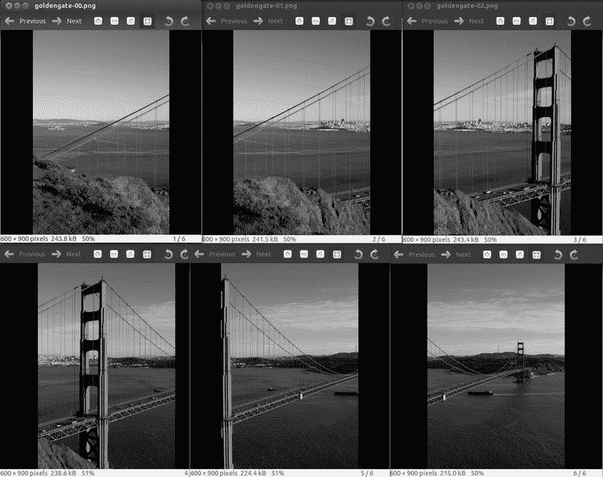
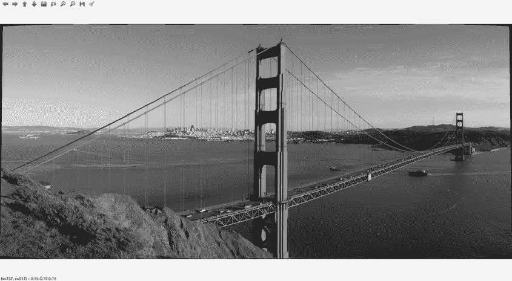
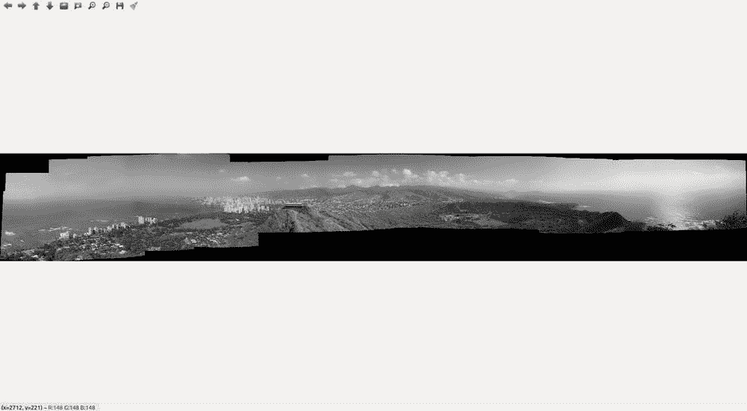
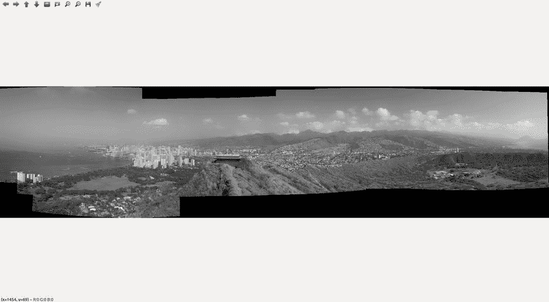

# 九、仿射和透视变换及其在图像全景中的应用

Abstract

在这一章中，你将学习两种重要的几何图像变换——仿射和透视——以及如何在你的代码中用矩阵来表示和使用它们。这将作为下一章的基础知识，下一章涉及立体视觉和大量的 3D 图像几何。

在这一章中，你将学习两种重要的几何图像变换——仿射和透视——以及如何在你的代码中用矩阵来表示和使用它们。这将作为下一章的基础知识，下一章涉及立体视觉和大量的 3D 图像几何。

几何图像变换只是遵循几何规则的图像变换。最简单的几何变换是旋转和缩放图像。还可以有其他更复杂的几何变换。这些变换的另一个特性是它们都是线性的，因此可以表示为矩阵，图像的变换相当于矩阵乘法。可以想象，给定两幅图像(一幅是原始的，另一幅是变换的)，如果两幅图像之间有足够的点对应，就可以恢复变换矩阵。您将学习如何通过使用用户点击的图像之间的点对应来恢复仿射和透视变换。稍后，您还将学习如何通过在关键点匹配描述符来自动完成寻找对应的过程。哦，通过学习如何使用 OpenCV 的优秀拼接模块将一堆图像拼接在一起制作美丽的全景图，你将能够运用所有这些知识！

## 仿射变换

仿射变换是在变换后保持线条“平行性”的任何线性变换。它还保留点作为点、直线作为直线以及点沿直线的距离比。它不保持直线之间的角度。仿射变换包括图像的所有类型的旋转、平移和镜像。现在让我们看看仿射变换是如何用矩阵表示的。

设`(x, y)`是原始图像中某点的坐标，而`(x', y')`是变换后该点在变换图像中的坐标。不同的转换包括:

*   缩放:`x' = a*x, y' = b*y`
*   翻转 X 和 Y 坐标:`x' = -x, y' = -y`
*   绕原点逆时针旋转角度θ: `x' = x*cos(` θ `)—y*sin(` θ `), y' = x*sin(` θ `) + y*cos(` θ `)`

因为所有的几何变换都是线性的，我们可以通过一个 2x2 矩阵`M`的矩阵乘法将`(x', y')`与`(x, y)`联系起来:

`(x', y') = M * (x, y)`

对于上述三种变换，矩阵 M 采用以下形式:

*   缩放:，其中`a`是 X 坐标的缩放因子，而`b`是 Y 坐标的缩放因子
*   翻转 X 和 Y 坐标:
*   围绕原点逆时针旋转角度θ:

除了翻转矩阵，所有仿射变换矩阵的 2×2 部分的行列式必须是+1。

### 应用仿射变换

在 OpenCV 中，很容易构建仿射变换矩阵并将该变换应用于图像。让我们首先看看应用仿射变换的函数，以便我们可以更好地理解 OpenCV 仿射变换矩阵的结构。函数`warpAffine()`获取一幅源图像和一个 2×3 矩阵`M`，并给出一幅变换后的输出图像。假设 M 的形式为:

`warpAffine()`应用以下变换:

手动构造要给`warpAffine()`的矩阵时，一个潜在的错误来源是 OpenCV 将原点放在图像的左上角。这一事实不会影响缩放变换，但会影响翻转和旋转变换。具体来说，为了成功翻转，`warpAffine()`的`M`输入必须为:

OpenCV 函数`getRotationMatrix2D()`给出一个进行旋转的 2×3 仿射变换矩阵。它将旋转角度(从水平轴逆时针测量)和旋转中心作为输入。对于正常旋转，您可能希望旋转的中心位于图像的中心。清单 9-1 展示了如何使用`getRotationMatrix2D()`获得一个旋转矩阵，并使用`warpAffine()`将其应用到一幅图像上。图 [9-1](#Fig1) 显示了原始图像和仿射变换图像。

清单 9-1。程序来说明一个简单的仿射变换

`//Program to illustrate a simple affine transform`

`//Author: Samarth Manoj Brahmbhatt, University of Pennsyalvania`

`#include <opencv2/opencv.hpp>`

`#include <opencv2/stitching/stitcher.hpp>`

`#include <opencv2/stitching/warpers.hpp>`

`#include "Config.h"`

`using namespace std;`

`using namespace cv;`

`int main() {`

`Mat im = imread(DATA_FOLDER_1 + string("/image.jpg")), im_transformed;`

`imshow("Original", im);`

`int rotation_degrees = 30;`

`// Construct Affine rotation matrix`

`Mat M = getRotationMatrix2D(Point(im.cols/2, im.rows/2), rotation_degrees, 1);`

`cout << M << endl;`

`// Apply Affine transform`

`warpAffine(im, im_transformed, M, im.size(), INTER_LINEAR);`

`imshow("Transformed", im_transformed);`

`while(char(waitKey(1)) != 'q') {}`

`return 0;`

`}`

图 9-1。

Applying simple Affine transforms

### 估计仿射变换

有时，您知道一个图像通过仿射(或近似仿射)变换与另一个图像相关，并且您想要获得仿射变换矩阵以用于一些其他计算(例如，估计相机的旋转)。OpenCV 函数`getAffineTransform()`对于这样的应用来说很方便。这个想法是，如果你在两幅图像中有三对对应点，你可以使用简单的数学方法恢复它们之间的仿射变换。这是因为每一对给你两个方程(一个与 X 坐标相关，一个与 Y 坐标相关)。因此，你需要三个这样的对来求解 2×3 仿射变换矩阵的所有六个元素。`getAffineTransform()`通过引入两个各含三个点 2f 的向量来为您解方程——一个是原始点，一个是变换点。在清单 9-2 中，用户被要求点击两幅图像中相应的点。这些点用于恢复仿射变换。为了验证恢复的变换是正确的，还向用户显示原始变换图像和由恢复的仿射变换变换的未变换图像之间的差异。图 [9-2](#Fig2) 显示恢复的仿射变换实际上是正确的(差分图像几乎全是零——黑色)。

清单 9-2。说明仿射变换恢复的程序

`//Program to illustrate affine transform recovery`

`//Author: Samarth Manoj Brahmbhatt, University of Pennsyalvania`

`#include <opencv2/opencv.hpp>`

`#include <opencv2/stitching/stitcher.hpp>`

`#include <opencv2/stitching/warpers.hpp>`

`#include <opencv2/highgui/highgui.hpp>`

`#include "Config.h"`

`using namespace std;`

`using namespace cv;`

`// Mouse callback function`

`void on_mouse(int event, int x, int y, int, void* _p) {`

`Point2f* p = (Point2f *)_p;`

`if (event == CV_EVENT_LBUTTONUP) {`

`p->x = x;`

`p->y = y;`

`}`

`}`

`class affine_transformer {`

`private:`

`Mat im, im_transformed, im_affine_transformed, im_show, im_transformed_show;`

`vector<Point2f> points, points_transformed;`

`Mat M; // Estimated Affine transformation matrix`

`Point2f get_click(string, Mat);`

`public:`

`affine_transformer(); //constructor`

`void estimate_affine();`

`void show_diff();`

`};`

`affine_transformer::affine_transformer() {`

`im = imread(DATA_FOLDER_2 + string("/image.jpg"));`

`im_transformed = imread(DATA_FOLDER_2 + string("/transformed.jpg"));`

`}`

`// Function to get location clicked by user on a specific window`

`Point2f affine_transformer::get_click(string window_name, Mat im) {`

`Point2f p(-1, -1);`

`setMouseCallback(window_name, on_mouse, (void *)&p);`

`while(p.x == -1 && p.y == -1) {`

`imshow(window_name, im);`

`waitKey(20);`

`}`

`return p;`

`}`

`void affine_transformer::estimate_affine() {`

`imshow("Original", im);`

`imshow("Transformed", im_transformed);`

`cout << "To estimate the Affine transform between the original and transformed images you will have to click on 3 matching pairs of points" << endl;`

`im_show = im.clone();`

`im_transformed_show = im_transformed.clone();`

`Point2f p;`

`// Get 3 pairs of matching points from user`

`for(int i = 0; i < 3; i++) {`

`cout << "Click on a distinguished point in the ORIGINAL image" << endl;`

`p = get_click("Original", im_show);`

`cout << p << endl;`

`points.push_back(p);`

`circle(im_show, p, 2, Scalar(0, 0, 255), -1);`

`imshow("Original", im_show);`

`cout << "Click on a distinguished point in the TRANSFORMED image" << endl;`

`p = get_click("Transformed", im_transformed_show);`

`cout << p << endl;`

`points_transformed.push_back(p);`

`circle(im_transformed_show, p, 2, Scalar(0, 0, 255), -1);`

`imshow("Transformed", im_transformed_show);`

`}`

`// Estimate Affine transform`

`M = getAffineTransform(points, points_transformed);`

`cout << "Estimated Affine transform = " << M << endl;`

`// Apply estimates Affine transfrom to check its correctness`

`warpAffine(im, im_affine_transformed, M, im.size());`

`imshow("Estimated Affine transform", im_affine_transformed);`

`}`

`void affine_transformer::show_diff() {`

`imshow("Difference", im_transformed - im_affine_transformed);`

`}`

`int main() {`

`affine_transformer a;`

`a.estimate_affine();`

`cout << "Press 'd' to show difference, 'q' to end" << endl;`

`if(char(waitKey(-1)) == 'd') {`

`a.show_diff();`

`cout << "Press 'q' to end" << endl;`

`if(char(waitKey(-1)) == 'q') return 0;`

`}`

`else`

`return 0;`

`}`

图 9-2。

Affine transform recovery using three pairs of matching points

## 透视变换

透视变换比仿射变换更普遍。它们不一定保持线条的“平行性”。但是因为它们更通用，它们也更实用——日常图像中遇到的几乎所有变换都是透视变换。有没有想过为什么两条铁轨似乎在远处相遇？这是因为你眼睛的图像平面以一种透视方式观察它们，并且透视变换不一定保持平行线平行。如果你从上面看这些铁轨，它们似乎根本不会相交。

给定 3×3 透视变换矩阵`M`，`warpPerspective()`应用以下变换:

注意，透视变换矩阵的左上角 2×2 部分的行列式不必是+1。此外，由于前面显示的变换中的除法，将透视变换矩阵的所有元素乘以一个常数不会对所表示的变换产生任何影响。因此，通常要计算透视变换矩阵，使得 M33 = 1。这给我们留下了 M 中的八个自由数，因此四对对应点足以恢复两幅图像之间的透视变换。OpenCV 函数`findHomography()`会帮你做到这一点。有趣的是，如果您在调用此函数时指定了标志 CV_RANSAC(参见在线文档)，它甚至可以接受四个以上的点，并使用 RANSAC 算法从所有这些点稳健地估计变换。RANSAC 使得变换估计过程不受噪声“错误”对应的影响。清单 9-3 读取两幅图像(通过透视变换关联)，要求用户点击八对点，使用 RANSAC 稳健地估计透视变换，并显示原始和新透视变换图像之间的差异以验证估计的变换。同样，差异图像在相关区域中主要是黑色的，这意味着估计的变换是正确的。

清单 9-3。程序演示了一个简单的透视变换恢复和应用

`//Program to illustrate a simple perspective transform recovery and application`

`//Author: Samarth Manoj Brahmbhatt, University of Pennsyalvania`

`#include <opencv2/opencv.hpp>`

`#include <opencv2/stitching/stitcher.hpp>`

`#include <opencv2/stitching/warpers.hpp>`

`#include <opencv2/highgui/highgui.hpp>`

`#include <opencv2/calib3d/calib3d.hpp>`

`#include "Config.h"`

`using namespace std;`

`using namespace cv;`

`void on_mouse(int event, int x, int y, int, void* _p) {`

`Point2f* p = (Point2f *)_p;`

`if (event == CV_EVENT_LBUTTONUP) {`

`p->x = x;`

`p->y = y;`

`}`

`}`

`class perspective_transformer {`

`private:`

`Mat im, im_transformed, im_perspective_transformed, im_show, im_transformed_show;`

`vector<Point2f> points, points_transformed;`

`Mat M;`

`Point2f get_click(string, Mat);`

`public:`

`perspective_transformer();`

`void estimate_perspective();`

`void show_diff();`

`};`

`perspective_transformer::perspective_transformer() {`

`im = imread(DATA_FOLDER_3 + string("/image.jpg"));`

`im_transformed = imread(DATA_FOLDER_3 + string("/transformed.jpg"));`

`cout << DATA_FOLDER_3 + string("/transformed.jpg") << endl;`

`}`

`Point2f perspective_transformer::get_click(string window_name, Mat im) {`

`Point2f p(-1, -1);`

`setMouseCallback(window_name, on_mouse, (void *)&p);`

`while(p.x == -1 && p.y == -1) {`

`imshow(window_name, im);`

`waitKey(20);`

`}`

`return p;`

`}`

`void perspective_transformer::estimate_perspective() {`

`imshow("Original", im);`

`imshow("Transformed", im_transformed);`

`cout << "To estimate the Perspective transform between the original and transformed images you will have to click on 8 matching pairs of points" << endl;`

`im_show = im.clone();`

`im_transformed_show = im_transformed.clone();`

`Point2f p;`

`for(int i = 0; i < 8; i++) {`

`cout << "POINT " << i << endl;`

`cout << "Click on a distinguished point in the ORIGINAL image" << endl;`

`p = get_click("Original", im_show);`

`cout << p << endl;`

`points.push_back(p);`

`circle(im_show, p, 2, Scalar(0, 0, 255), -1);`

`imshow("Original", im_show);`

`cout << "Click on a distinguished point in the TRANSFORMED image" << endl;`

`p = get_click("Transformed", im_transformed_show);`

`cout << p << endl;`

`points_transformed.push_back(p);`

`circle(im_transformed_show, p, 2, Scalar(0, 0, 255), -1);`

`imshow("Transformed", im_transformed_show);`

`}`

`// Estimate perspective transform`

`M = findHomography(points, points_transformed, CV_RANSAC, 2);`

`cout << "Estimated Perspective transform = " << M << endl;`

`// Apply estimated perspecive trasnform`

`warpPerspective(im, im_perspective_transformed, M, im.size());`

`imshow("Estimated Perspective transform", im_perspective_transformed);`

`}`

`void perspective_transformer::show_diff() {`

`imshow("Difference", im_transformed - im_perspective_transformed);`

`}`

`int main() {`

`perspective_transformer a;`

`a.estimate_perspective();`

`cout << "Press 'd' to show difference, 'q' to end" << endl;`

`if(char(waitKey(-1)) == 'd') {`

`a.show_diff();`

`cout << "Press 'q' to end" << endl;`

`if(char(waitKey(-1)) == 'q') return 0;`

`}`

`else`

`return 0;`

`}`

图 9-3。

Perspective transform recovery by clicking matching points

到目前为止，您一定已经意识到，通过使用高距离阈值匹配两幅图像之间的图像特征，整个配对过程也可以实现自动化。这正是清单 9-4 所做的。它计算 ORB 关键点和描述符(我们在[第 8 章](08.html)中学到了这一点)，匹配它们，并使用匹配来稳健地估计图像之间的透视变换。图 [9-4](#Fig4) 显示了运行中的代码。请注意 RANSAC 如何使变换估计过程对错误的 ORB 特征匹配具有鲁棒性。差异图像几乎是黑色的，这意味着估计的变换是正确的。

清单 9-4。通过匹配 ORB 特征来说明透视变换恢复的程序

`//Program to illustrate perspective transform recovery by matching ORB features`

`//Author: Samarth Manoj Brahmbhatt, University of Pennsyalvania`

`#include <opencv2/opencv.hpp>`

`#include <opencv2/stitching/stitcher.hpp>`

`#include <opencv2/stitching/warpers.hpp>`

`#include <opencv2/highgui/highgui.hpp>`

`#include <opencv2/calib3d/calib3d.hpp>`

`#include "Config.h"`

`using namespace std;`

`using namespace cv;`

`class perspective_transformer {`

`private:`

`Mat im, im_transformed, im_perspective_transformed;`

`vector<Point2f> points, points_transformed;`

`Mat M;`

`public:`

`perspective_transformer();`

`void estimate_perspective();`

`void show_diff();`

`};`

`perspective_transformer::perspective_transformer() {`

`im = imread(DATA_FOLDER_3 + string("/image.jpg"));`

`im_transformed = imread(DATA_FOLDER_3 + string("/transformed.jpg"));`

`}`

`void perspective_transformer::estimate_perspective() {`

`// Match ORB features to point correspondences between the images`

`vector<KeyPoint> kp, t_kp;`

`Mat desc, t_desc, im_g, t_im_g;`

`cvtColor(im, im_g, CV_BGR2GRAY);`

`cvtColor(im_transformed, t_im_g, CV_BGR2GRAY);`

`OrbFeatureDetector featureDetector;`

`OrbDescriptorExtractor featureExtractor;`

`featureDetector.detect(im_g, kp);`

`featureDetector.detect(t_im_g, t_kp);`

`featureExtractor.compute(im_g, kp, desc);`

`featureExtractor.compute(t_im_g, t_kp, t_desc);`

`flann::Index flannIndex(desc, flann::LshIndexParams(12, 20, 2), cvflann::FLANN_DIST_HAMMING);`

`Mat match_idx(t_desc.rows, 2, CV_32SC1), match_dist(t_desc.rows, 2, CV_32FC1);`

`flannIndex.knnSearch(t_desc, match_idx, match_dist, 2, flann::SearchParams());`

`vector<DMatch> good_matches;`

`for(int i = 0; i < match_dist.rows; i++) {`

`if(match_dist.at<float>(i, 0) < 0.6 * match_dist.at<float>(i, 1)) {`

`DMatch dm(i, match_idx.at<int>(i, 0), match_dist.at<float>(i, 0));`

`good_matches.push_back(dm);`

`points.push_back((kp[dm.trainIdx]).pt);`

`points_transformed.push_back((t_kp[dm.queryIdx]).pt);`

`}`

`}`

`Mat im_show;`

`drawMatches(im_transformed, t_kp, im, kp, good_matches, im_show);`

`imshow("ORB matches", im_show);`

`M = findHomography(points, points_transformed, CV_RANSAC, 2);`

`cout << "Estimated Perspective transform = " << M << endl;`

`warpPerspective(im, im_perspective_transformed, M, im.size());`

`imshow("Estimated Perspective transform", im_perspective_transformed);`

`}`

`void perspective_transformer::show_diff() {`

`imshow("Difference", im_transformed - im_perspective_transformed);`

`}`

`int main() {`

`perspective_transformer a;`

`a.estimate_perspective();`

`cout << "Press 'd' to show difference, 'q' to end" << endl;`

`if(char(waitKey(-1)) == 'd') {`

`a.show_diff();`

`cout << "Press 'q' to end" << endl;`

`if(char(waitKey(-1)) == 'q') return 0;`

`}`

`else`

`return 0;`

`}`

图 9-4。

Perspective transform recovery by matching ORB features

## 全景照片

制作全景图是自动恢复透视变换的主要应用之一。先前讨论的技术可以用于估计由旋转/回转(但不是平移)相机捕获的一组图像之间的透视变换。然后，人们可以通过在一个大的空白“画布”图像上“排列”所有这些图像来构建一个全景。根据估计的透视变换完成排列。尽管这是最常用于制作全景图的高级算法，但为了制作无缝的全景图，还需要注意一些小细节:

*   估计的透视变换很可能不完美。因此，如果仅通过估计的变换来在画布上排列图像，则在两幅图像重叠的区域中会观察到小的不连续。因此，在估计成对变换之后，必须进行第二次“全局”估计，这将干扰各个变换，以使所有变换彼此很好地一致
*   必须实施某种形式的接缝混合来消除重叠区域中的不连续性。大多数现代相机都有自动曝光设置。因此，不同的图像可能是在不同的曝光下拍摄的，因此它们可能比全景图中的相邻图像更暗或更亮。曝光的差异必须在所有相邻的图像中被中和

OpenCV `stitching`模块出色地内置了所有这些功能。它使用图 [9-5](#Fig5) 中概述的高级算法将图像拼接成视觉上正确的全景图。

图 9-5。

OpenCV image stitching pipeline, taken from OpenCV online documentation

从制作全景图的角度来看，`stitching`模块使用起来非常简单，只需创建一个`stitching`对象，并传递给它一个包含你想要拼接的图像的`Mat`向量。清单 9-5 显示了用于从图 [9-6](#Fig6) 所示的六幅图像中生成美丽全景图的简单代码。注意，这段代码要求图像出现在名为`DATA_FOLDER_1`的位置，并在`Config.h`头文件中定义。它使用`CMake`将可执行文件链接到 Boost 文件系统库。你可以使用第 8 章的[末尾解释的架构和`CMake`组织来编译代码。](08.html)

清单 9-5。从图像集合创建全景的代码

`//Code to create a panorama from a collection of images`

`//Author: Samarth Manoj Brahmbhatt, University of Pennsyalvania`

`#include <opencv2/opencv.hpp>`

`#include <opencv2/stitching/stitcher.hpp>`

`#include <opencv2/stitching/warpers.hpp>`

`#include "Config.h"`

`#include <boost/filesystem.hpp>`

`using namespace std;`

`using namespace cv;`

`using namespace boost::filesystem;`

`int main() {`

`vector<Mat> images;`

`// Read images`

`for(directory_iterator i(DATA_FOLDER_5), end_iter; i != end_iter; i++) {`

`string im_name = i->path().filename().string();`

`string filename = string(DATA_FOLDER_5) + im_name;`

`Mat im = imread(filename);`

`if(!im.empty())`

`images.push_back(im);`

`}`

`cout << "Read " << images.size() << " images" << endl << "Now making panorama..." << endl;`

`Mat panorama;`

`Stitcher stitcher = Stitcher::createDefault();`

`stitcher.stitch(images, panorama);`

`namedWindow("Panorama", CV_WINDOW_NORMAL);`

`imshow("Panorama", panorama);`

`while(char(waitKey(1)) != 'q') {}`

`return 0;`

`}`

 

图 9-6。

6 images (top) used to generate the Golden Gate panorama (bottom)

全景代码也可以很好地扩展。图 [9-7](#Fig7) 显示了使用相同代码从 23 幅图像生成的全景图。

图 9-7。

Panorama made by stitching 23 images

位于 [`http://docs.opencv.org/modules/stitching/doc/stitching.html`](http://docs.opencv.org/modules/stitching/doc/stitching.html) 的拼接模块的在线文档显示，流水线的不同部分有很多选项。例如，您可以:

*   使用 SURF 或 ORB 作为您选择的图像特征
*   平面、球形或圆柱形作为全景图的形状(排列所有图像的画布的形状)
*   作为寻找需要混合的接缝区域的方法的图切割或 Voronoi 图

清单 9-6 展示了如何使用`stitching`类的各种“setter”函数插入和拔出流水线的不同模块。它将全景的形状从默认的平面更改为圆柱形。图 [9-8](#Fig8) 显示了这样得到的柱面全景图。

清单 9-6。从图像集合中创建具有圆柱形扭曲的全景图的代码

`//Code to create a panorama with cylindrical warping from a collection of images`

`//Author: Samarth Manoj Brahmbhatt, University of Pennsyalvania`

`#include <opencv2/opencv.hpp>`

`#include <opencv2/stitching/stitcher.hpp>`

`#include <opencv2/stitching/warpers.hpp>`

`#include "Config.h"`

`#include <boost/filesystem.hpp>`

`using namespace std;`

`using namespace cv;`

`using namespace boost::filesystem;`

`int main() {`

`vector<Mat> images;`

`for(directory_iterator i(DATA_FOLDER_5), end_iter; i != end_iter; i++) {`

`string im_name = i->path().filename().string();`

`string filename = string(DATA_FOLDER_5) + im_name;`

`Mat im = imread(filename);`

`if(!im.empty())`

`images.push_back(im);`

`}`

`cout << "Read " << images.size() << " images" << endl << "Now making panorama..." << endl;`

`Mat panorama;`

`Stitcher stitcher = Stitcher::createDefault();`

`CylindricalWarper* warper = new CylindricalWarper();`

`stitcher.setWarper(warper);`

`// Estimate perspective transforms between images`

`Stitcher::Status status = stitcher.estimateTransform(images);`

`if (status != Stitcher::OK) {`

`cout << "Can't stitch images, error code = " << int(status) << endl;`

`return -1;`

`}`

`// Make panorama`

`status = stitcher.composePanorama(panorama);`

`if (status != Stitcher::OK) {`

`cout << "Can't stitch images, error code = " << int(status) << endl;`

`return -1;`

`}`

`namedWindow("Panorama", CV_WINDOW_NORMAL);`

`imshow("Panorama", panorama);`

`while(char(waitKey(1)) != 'q') {}`

`return 0;`

`}`

图 9-8。

Cylindrical panorama made from seven images

## 摘要

几何图像变换是处理真实世界的所有计算机视觉程序的重要部分，因为在世界和相机的图像平面之间以及相机的两个位置的图像平面之间总是存在透视变换。他们也很酷，因为他们可以用来制作全景图！在本章中，您学习了如何编写实现透视变换的代码，以及如何恢复两个给定图像之间的变换，这在许多实际的计算机视觉项目中是一项有用的技能。下一章是关于立体视觉的。我们将使用透视变换矩阵的知识来表示立体摄像机的左右摄像机之间的变换，这将是学习如何校准立体摄像机的重要一步。