# 八、应用部署和总结

最后一章将总结目前为止在处理编程环境中使用 OpenCV 时所学到的内容。它还指出了本书中未涉及的其余模块，以及您可以从哪里获得其他资源。此外，本章还提供了生产知识，您可以使用这些知识来部署在 Processing 中开发的应用。本章将涵盖以下主题:

*   在处理中开发库
*   从处理中导出应用
*   在处理中使用系统命令
*   用卡尔曼滤波器优化跟踪
*   其他 OpenCV 模块

## 在处理中开发库

您可能会发现，无论何时在加工中使用 OpenCV，您都必须在每个加工程序或草图中包含`code`文件夹以及`CVImage`类定义。如果你能卸载这个过程，那就更好了。这就是处理库可以提供帮助的地方。在官方处理网站上，您可以在 [`https://processing.org/reference/libraries/`](https://processing.org/reference/libraries/) 找到许多社区贡献的库。这些是由 Processing 批准的第三方贡献。有兴趣的可以参考 [`https://github.com/processing/processing/wiki/Library-Guidelines`](https://github.com/processing/processing/wiki/Library-Guidelines) 关于如何在处理中开发和分发库的指南。在这一节中，我将带您通过一些步骤，用开源软件 Eclipse ( [`http://www.eclipse.org/`](http://www.eclipse.org/) )，一个 Java 软件开发工具，准备一个名为`CVImage`的临时库。

要安装集中式分布式处理库，可以使用处理 IDE 窗口。安装的库位于 Processing 或 Sketchbook 文件夹内的`libraries`文件夹中，具体取决于您使用的操作系统。对于每个库，它通常包含以下子文件夹:

*   `examples`
*   `library`
*   `reference`
*   `src`

最重要的是`library`文件夹，它包含了所有的 Java JAR 文件和构建这个库的本地库(`.dll`、`.dylib`或`.so`文件)。对于`CVImage`示例，您将只创建`library`文件夹，其中包含您放在处理`code`文件夹中的现有组件。您只需要准备一次库。然后它可以在不同的操作系统上使用。以下过程将显示如何使用 macOS 环境准备库。

### 安装 Eclipse 软件

首先你安装开源 Java 开发环境 Eclipse，从 [`http://www.eclipse.org/`](http://www.eclipse.org/) 。在撰写本文时，下载按钮将把您带到 Eclipse Neon 安装程序的下载页面。解压缩文件后，您可以使用 Eclipse 安装程序为 Java 开发人员安装 Eclipse IDE。在开始安装之前，你必须用最新的内容更新安装程序，如图 [8-1](#Fig1) 所示。

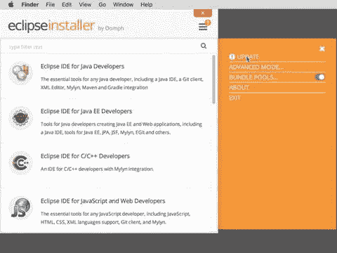

图 8-1。

Updating the Eclipse installer

成功更新后，您可以选择为 Java 开发人员安装 Eclipse IDE，并将安装文件夹位置保留为默认位置(图 [8-2](#Fig2) )。

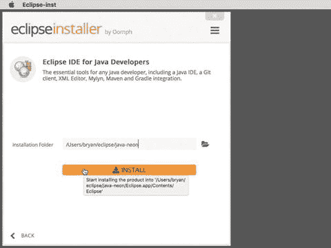

图 8-2。

Installing the Eclipse IDE for Java developers

当您第一次启动 Eclipse IDE 时，它会为您创建默认的工作区。该位置通常在用户的默认个人文件夹或`Documents`文件夹中。

### 准备 OpenCV 和处理库

在`workspace`文件夹中，可以新建一个名为`libs`的文件夹(图 [8-3](#Fig3) )。

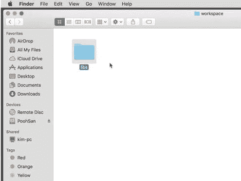

图 8-3。

Creating the libs folder inside the workspace folder

在`libs`文件夹中，您将复制必要的处理和 OpenCV 库。第一个是处理核心库。在 macOS 上，有点复杂。您需要找到处理应用。点击右键，选择显示包内容，如图 [8-4](#Fig4) 所示。

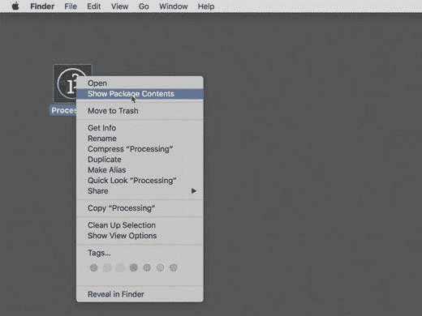

图 8-4。

Searching for the macOS Processing core library

在`Contents`文件夹中，进入`Java`文件夹。找到`core.jar`文件。将其复制到您在上一步中刚刚创建的`libs`文件夹中。同时将之前`code`文件夹的 OpenCV 库内容复制到`libs`文件夹，如图 [8-5](#Fig5) 所示。`core.jar`和`opencv-310.jar`文件对于所有操作系统都是必不可少的。其他三个文件是特定于平台的:`libopencv_java310.dylib` (macOS 64 位)、`libopencv_java310.so` (Linux 64 位)和`opencv_java310.dll` (Windows 64 位)。对于 Linux 和 Windows 操作系统，`core.jar`文件位于`processing-3.2.3/core/library`的处理应用文件夹中。

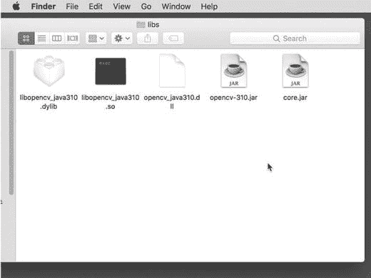

图 8-5。

Content of the libs folder

### 构建 cximage 库

在 Eclipse 中创建新的 Java 项目(图 [8-6](#Fig6) )。

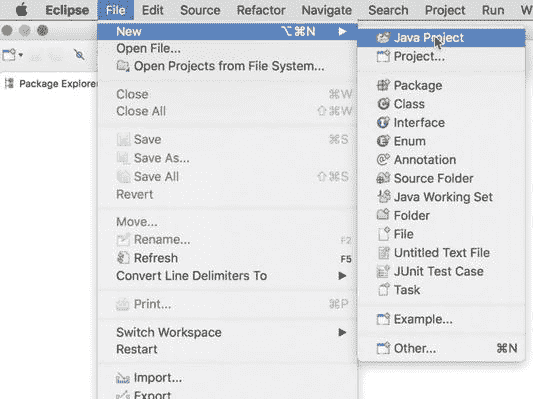

图 8-6。

Creating a Java project in Eclipse

将项目命名为 CVImage(图 [8-7](#Fig7) )。然后单击下一步按钮。

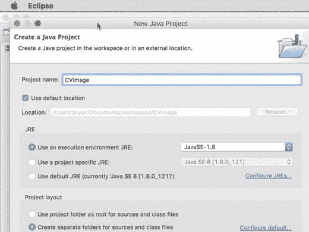

图 8-7。

Naming the project CVImage

在 Java 设置中，添加相应的外部库的 JAR 文件(图 [8-8](#Fig8) )。

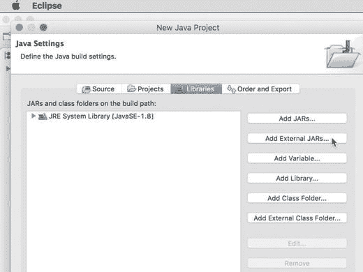

图 8-8。

Adding external library JAR files

从工作区内的`libs`文件夹中选择`core.jar`和`opencv-310.jar`(图 [8-9](#Fig9) )。

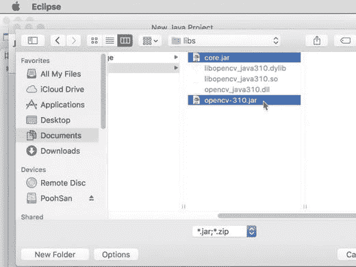

图 8-9。

Choosing the Processing and OpenCV JAR files

在`opencv-310.jar`的库定义中，点击三角形选择本机库位置(图 [8-10](#Fig10) )。然后单击编辑并选择外部文件夹。

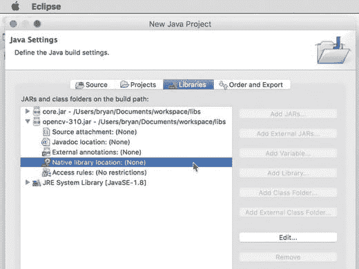

图 8-10。

Specifying the native library location for opencv-310.jar

再次选择`libs`文件夹作为`opencv-310.jar`的本地库位置，因为您已经将所有本地库，包括 macOS、Windows 和 Linux 的本地库放在那里(图 [8-11](#Fig11) )。

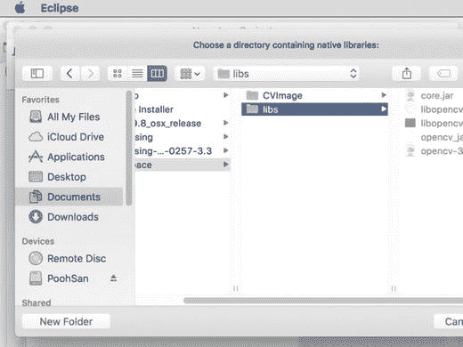

图 8-11。

Choosing libs for the native library location

单击 Finish 确认外部库的所有信息后，您可以将新类添加到项目中。从包资源管理器中，右键单击 CVImage 项目以添加新的包。指定项目的包名`cvimage`(图 [8-12](#Fig12) )。

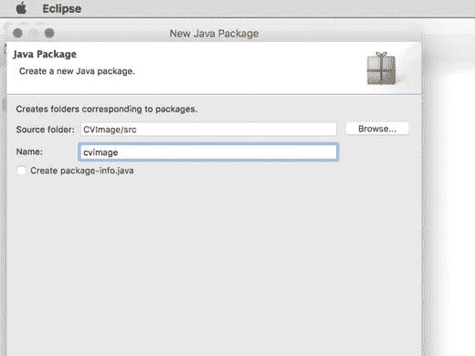

图 8-12。

Specifying the package name

下一条信息是项目的类名`CVImage`(图 [8-13](#Fig13) )。同样，在 Package Explorer 中，右键单击包`cvimage`来添加一个新类。

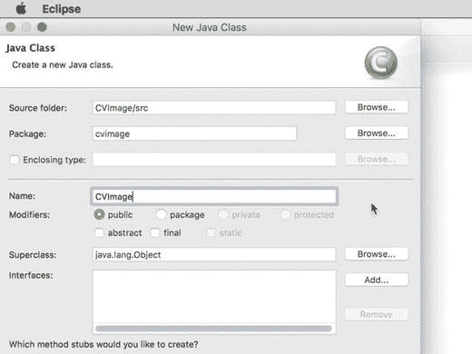

图 8-13。

Specifying the class name of the project

在您填写了 CVImage 项目的所有必要信息之后，Eclipse 将向您显示空文件`CVImage.java`。您可以从本书中使用的任何 Processing sketch 文件夹内的`CVImage.pde`中复制原始的类定义到这个文件中。然而，您需要修改几行代码来适应 Eclipse 环境。完整代码如下:

```py
package cvimage;

import processing.core.*;
import org.opencv.core.*;
import org.opencv.imgproc.*;
import java.nio.ByteBuffer;
import java.util.ArrayList;

public class CVImage extends PImage {
  final private MatOfInt BGRA2ARGB = new MatOfInt(0, 3, 1, 2, 2, 1, 3, 0);
  final private MatOfInt ARGB2BGRA = new MatOfInt(0, 3, 1, 2, 2, 1, 3, 0);
  // cvImg - OpenCV Mat in BGRA format
  // pixCnt - number of bytes in the image
  private Mat cvImg;
  private int pixCnt;

  public

CVImage(int w, int h) {
    super(w, h, ARGB);
    System.loadLibrary(Core.NATIVE_LIBRARY_NAME);
    pixCnt = w*h*4;
    cvImg = new Mat(new Size(w, h), CvType.CV_8UC4, Scalar.all(0));
  }

  public void copyTo() {
    // Copy from the PImage pixels array to the Mat cvImg
    Mat tmp = new Mat(new Size(this.width, this.height), CvType.CV_8UC4, Scalar.all(0));
    ByteBuffer b = ByteBuffer.allocate(pixCnt);
    b.asIntBuffer().put(this.pixels);
    b.rewind();
    tmp.put(0, 0, b.array());
    cvImg = ARGBToBGRA(tmp);
    tmp.release();
  }

  public void copyTo(PImage i) {
    // Copy from an external PImage to here
    if (i.width != this.width || i.height != this.height) {
      System.out.println("Size not identical");
      return;
    }
    PApplet.arrayCopy(i.pixels, this.pixels);
    this.updatePixels();
    copyTo();
  }

  public void copyTo(Mat m) {
    // Copy from an external Mat to both the Mat cvImg and PImage

pixels array
    if (m.rows() != this.height || m.cols() != this.width) {
      System.out.println("Size not identical");
      return;
    }
    Mat out = new Mat(cvImg.size(), cvImg.type(), Scalar.all(0));
    switch (m.channels()) {
    case 1:
      // Greyscale image
      Imgproc.cvtColor(m, cvImg, Imgproc.COLOR_GRAY2BGRA);
      break;
    case 3:
      // 3 channels colour image BGR
      Imgproc.cvtColor(m, cvImg, Imgproc.COLOR_BGR2BGRA);
      break;
    case 4:
      // 4 channels colour image BGRA

      m.copyTo(cvImg);
      break;
    default:
      System.out.println("Invalid number of channels " + m.channels());
      return;
    }
    out = BGRAToARGB(cvImg);
    ByteBuffer b = ByteBuffer.allocate(pixCnt);
    out.get(0, 0, b.array());
    b.rewind();
    b.asIntBuffer().get(this.pixels);
    this.updatePixels();
    out.release();
  }

  private Mat BGRAToARGB(Mat m) {
    Mat tmp = new Mat(m.size(), CvType.CV_8UC4, Scalar.all(0));
    ArrayList<Mat> in = new ArrayList<Mat>();
    ArrayList<Mat> out = new ArrayList<Mat>();
    Core.split(m, in);
    Core.split(tmp, out);
    Core.mixChannels(in, out, BGRA2ARGB);
    Core.merge(out, tmp);
    return tmp;
  }

  private

Mat ARGBToBGRA(Mat m) {
    Mat tmp = new Mat(m.size(), CvType.CV_8UC4, Scalar.all(0));
    ArrayList<Mat> in = new ArrayList<Mat>();
    ArrayList<Mat> out = new ArrayList<Mat>();
    Core.split(m, in);
    Core.split(tmp, out);
    Core.mixChannels(in, out, ARGB2BGRA);
    Core.merge(out, tmp);
    return tmp;
  }

  public

Mat getBGRA() {
    // Get a copy of the Mat cvImg
    Mat mat = cvImg.clone();
    return mat;
  }

  public Mat getBGR() {
    // Get a 3 channels Mat in BGR
    Mat mat = new Mat(cvImg.size(), CvType.CV_8UC3, Scalar.all(0));
    Imgproc.cvtColor(cvImg, mat, Imgproc.COLOR_BGRA2BGR);
    return mat;
  }

  public Mat getGrey() {
    // Get a greyscale copy of the image
    Mat out = new Mat(cvImg.size(), CvType.CV_8UC1, Scalar.all(0));
    Imgproc.cvtColor(cvImg, out, Imgproc.COLOR_BGRA2GRAY);
    return out;
  }
}

```

在第一行中，您添加了`package cvimage`语句来指定该类在这个包中。其他的修改是`println()`函数，它们被改为`System.out.println()`，因为在这种情况下这个类不在处理环境中。在`copyTo(PImage i)`和`copyTo(Mat m)`方法中有三种这样的情况。通过从菜单栏中选择项目➤构建项目来构建项目。构建项目后，您可以将输出导出为 JAR 文件(图 [8-14](#Fig14) )。从包资源管理器中，您可以首先右键单击项目名 CVImage 并选择 Export。

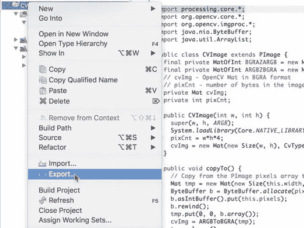

图 8-14。

Exporting the output JAR file

首先，选择导出 Java JAR 文件(图 [8-15](#Fig15) )，然后指定导出到哪里(图 [8-16](#Fig16) )。

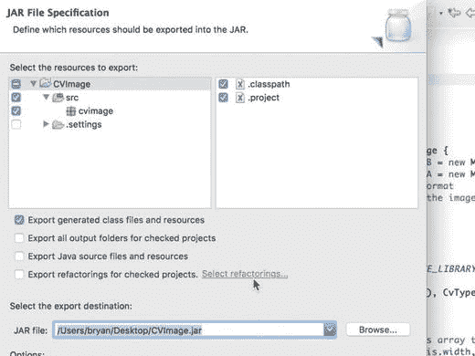

图 8-16。

Selecting the export destination

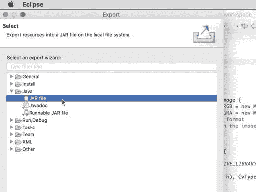

图 8-15。

Choosing to export the Java JAR file

为了准备新的处理库，您需要创建一个名为`CVImage`的文件夹。在这个文件夹中，创建一个名为`library`的子文件夹。在前面段落中显示的导出操作之后，将导出的 JAR 文件`CVImage.jar`复制到`library`文件夹中。在`library`文件夹中，将现有`code`文件夹中的所有文件复制到那里，如图 [8-17](#Fig17) 所示。您也可以决定只为您自己的操作系统复制本地库。

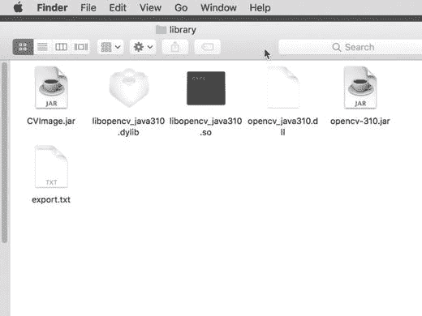

图 8-17。

Packaging the library content

在 library 文件夹中，创建一个名为`export.txt`的新文本文件，内容如下。它将指示处理将哪些文件复制到导出的应用中，这将在下一节中介绍。

```py
name = CVImage

application.macosx=CVImage.jar,opencv-310.jar,libopencv_java310.dylib
application.windows64=CVImage.jar,opencv-310.jar,opencv_java310.dll
application.linux64=CVImage.jar,opencv-310.jar,libopencv_java310.so

```

您还需要将 library 文件夹放在另一个名为`CVImage`的文件夹中。它将是新创建的处理库的主文件夹。您将把`CVImage`文件夹放在本地加工或 Sketchbook 文件夹的`libraries`文件夹中，在那里您保存了所有的加工草图。从现在开始，您不需要在使用 OpenCV 库的处理程序中包含`code`文件夹和`CVImage`类定义。在任何新的加工程序中，你可以使用菜单项草图➤导入库➤ CVImage 将`CVImage`库包含到你的代码中(图 [8-18](#Fig18) )。

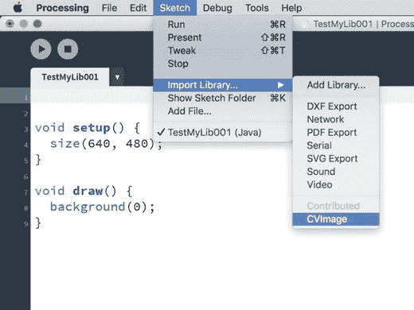

图 8-18。

Inserting the newly created library

这将自动生成以下语句:

```py
import cvimage.*;

```

语句之后，您可以继续使用前面章节中演示的所有代码。

## 从处理中导出应用

到目前为止，您已经在 ide 中执行了处理程序。在生产环境中，最好为您的程序创建一个独立的本机应用。处理 IDE 在菜单项“文件➤导出应用”中提供了此功能。通过浏览这些选项，您可以选择为不同的平台创建应用，比如 Windows、macOS 和 Linux。您可以创建一个全屏应用，也可以创建一个窗口大小在您的`size()`函数中指定的应用。在 macOS 平台上，还可以选择在应用中嵌入 Java 8。在下面的示例`Chapter08_01`中，您可以使用现有的处理程序测试运行导出应用流程，以显示来自网络摄像头的彩色和灰度图像:

```py
// Greyscale image

import processing.video.*;
import org.opencv.core.*;
import org.opencv.imgproc.Imgproc;
import cvimage.*;

Capture cap;
CVImage img;

void setup() {
  size(1280, 480);
  background(0);
  System.loadLibrary(Core.NATIVE_LIBRARY_NAME);
  println(Core.VERSION);
  cap = new Capture(this, width/2, height);
  cap.start();
  img = new CVImage(cap.width, cap.height);
  smooth();
}

void draw() {
  if (!cap.available())
    return;
  background(0);
  cap.read();
  img.copy(cap, 0, 0, cap.width, cap.height,
    0, 0, img.width, img.height);
  img.copyTo();
  Mat grey = img.getGrey();
  img.copyTo(grey);
  image(cap, 0, 0);
  image(img, cap.width, 0);
  grey.release();
}

```

注意程序中`import cvimage.*;`语句的使用。您可以通过在处理 IDE 中选择文件➤导出应用来导出应用。导出应用后，根据您选择的操作系统，处理 IDE 将生成以下应用文件夹:

*   `application.linux64`
*   `application.macosx64`
*   `application.windows64`

因为您只有 64 位版本的库，所以在导出中将不会生成 32 位版本。由于我正在使用 macOS 操作系统进行演示，我可以进入`application.macosx64`文件夹，双击图标`Chapter08_01`来启动应用。图 [8-19](#Fig19) 显示了一个示例显示。

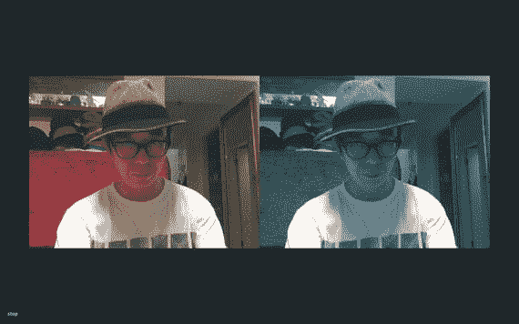

图 8-19。

Full-screen application

请注意，我选择了黑色作为背景色，并放置了一个“停止”按钮。

## 在处理中使用系统命令

在生产环境中，除了构建独立的应用之外，您可能还需要在处理应用中执行系统任务。一个常见的任务是在退出处理应用后关闭计算机。下一个示例`Chapter08_02`将尝试调用系统命令来关闭处理应用中的计算机。这是 macOS 版本的代码。

```py
// Shutdown computer

import java.lang.Process;
import java.lang.Runtime;
import java.io.*;
import java.util.Arrays;

String comm;
String pw;

void

setup() {
  size(640, 480);
  // Shutdown command
  comm = "sudo -S shutdown -h now";
  pw = "password";
}

void draw() {
  background(0);
}

void mousePressed() {
  shutdown();
}

void shutdown() {
  try {
    // Execute the shutdown command.
    Process proc = Runtime.getRuntime().exec(comm);
    BufferedReader buf = new BufferedReader(
      new InputStreamReader(proc.getInputStream()));
    BufferedReader err = new BufferedReader(
      new InputStreamReader(proc.getErrorStream()));
    BufferedWriter out = new BufferedWriter(
      new OutputStreamWriter(proc.getOutputStream()));
    char [] pwc = pw.toCharArray();
    // Send out the sudo password.
    out.write(pwc);
    out.write('\n');
    out.flush();
    // Erase the password.
    Arrays.fill(pwc, '\0');
    pw = "";
    // Print out messages.
    String line;
    println("Output message");
    while ((line = buf.readLine()) != null) {
      println(line);
    }
    println("Error message");
    while ((line = err.readLine()) != null) {
      println(line);
    }
    int rc = proc.exitValue();
    println(rc);
    System.exit(0);
  }
  catch

(IOException e) {
    println(e.getMessage());
    System.exit(-1);
  }
}

```

程序使用 Java 的`Runtime`类来执行 shell 命令。因为它需要`sudo`密码来执行命令，所以您必须将密码放在`String`变量`pw`中。对于 Windows 操作系统，在下面的`Chapter08_03`示例中，可以将代码简化如下:

```py
// Shutdown computer in Windows

.
import java.lang.Process;
import java.lang.Runtime;
import java.io.*;

String comm;

void setup() {
  size(640, 480);
  // Command string
  comm = "shutdown -s -t 0";
}

void draw() {
  background(0);
}

void mousePressed() {
  shutdown();
}

void shutdown() {
  try {
    // Execute the shutdown command.
    Process proc = Runtime.getRuntime().exec(comm);
    BufferedReader buf = new BufferedReader(
      new InputStreamReader(proc.getInputStream()));
    BufferedReader err = new BufferedReader(
      new InputStreamReader(proc.getErrorStream()));
    // Print out the messages.
    String line;
    println("Output message");
    while ((line = buf.readLine()) != null) {
      println(line);
    }
    println("Error message");
    while ((line = err.readLine()) != null) {
      println(line);
    }
    int rc = proc.exitValue();
    println(rc);
    System.exit(0);
  }
  catch

(IOException e) {
    println(e.getMessage());
    System.exit(-1);
  }
}

```

命令字符串是不同的，但是您不需要提供密码来执行命令。对于 Linux，它类似于 macOS 版本，但是同样不需要有`sudo`密码部分。

```py
// Shutdown computer in Linux

.
import java.lang.Process;
import java.lang.Runtime;
import java.io.*;
import java.util.Arrays;

String comm;

void setup() {
  size(640, 480);
  // Command string
  comm = "shutdown -h now";
}

void draw() {
  background(0);
}

void mousePressed() {
  shutdown();
}

void

shutdown() {
  try {
    // Execute the shutdown command.
    Process proc = Runtime.getRuntime().exec(comm);
    BufferedReader buf = new BufferedReader(
      new InputStreamReader(proc.getInputStream()));
    BufferedReader err = new BufferedReader(
      new InputStreamReader(proc.getErrorStream()));
    // Print any messages.
    String line;
    println("Output message");
    while ((line = buf.readLine()) != null) {
      println(line);
    }
    println("Error message");
    while ((line = err.readLine()) != null) {
      println(line);
    }
    int rc = proc.exitValue();
    println(rc);
    System.exit(0);
  }
  catch (IOException e) {
    println(e.getMessage());
    System.exit(-1);
  }
}

```

现在，您可以从处理 IDE 中导出应用。根据操作系统，在适当的应用文件夹内导航，例如`application.linux64`、`application.macosx64`或`application.windows64`。双击应用`Chapter08_02`。请注意，通过单击应用窗口，它将关闭计算机。

## 用卡尔曼滤波器优化跟踪

在前一章中，你看到了一个人脸检测的例子。在示例中，您使用了一个矩形来指示检测到人脸的区域。如果你观察跟踪结果，很容易发现矩形的移动相当锯齿状。在 OpenCV 的`video`模块中，`KalmanFilter`类可以提供平滑跟踪结果的方法。以下练习将提供平滑人脸检测跟踪结果的代码。如果想深入了解卡尔曼滤波器，可以参考 [`https://www.cs.unc.edu/~welch/media/pdf/kalman_intro.pdf`](https://www.cs.unc.edu/%7Ewelch/media/pdf/kalman_intro.pdf) 的文档。从本质上来说，`KalmanFilter`类可以帮助您基于以前的测量来预测数字结果。练习`Chapter08_04`将包括一个单独的类`KFilter`，它封装了 OpenCV 中`KalmanFilter`类的处理。

```py
// Kalman filter
import org.opencv.video.KalmanFilter;

public class KFilter {
  KalmanFilter kf;
  MatOfFloat measurement;
  int numS;
  int numM;

  public KFilter(int s, int m) {
    // Initialize the Kalman filter with
    // number of states and measurements.
    // Our measurements are the x, y location of
    // the face rectangle and its width and height.
    numS = s;
    numM = m;
    kf = new KalmanFilter(numS, numM, 0, CvType.CV_32F);
    float [] tmp = new float[numM];
    for (int i=0; i<tmp.length; i++) {
      tmp[i] = 0;
    }
    measurement = new MatOfFloat(tmp);
  }

  void initFilter(int fps) {
    // Initialize the state transition matrix.
    double dt1 = 1.0/fps;
    Mat tmp = Mat.eye(numS, numS, CvType.CV_32F);
    tmp.put(0, 4, dt1);
    tmp.put(1, 5, dt1);
    tmp.put(2, 6, dt1);
    tmp.put(3, 7, dt1);
    kf.set_transitionMatrix(tmp);

    // Initialize the measurement matrix.
    tmp = kf.get_measurementMatrix();
    for (int i=0; i<numM; i++) {
      tmp.put(i, i, 1);
    }
    kf.set_measurementMatrix(tmp);

    tmp = kf.get_processNoiseCov();
    Core.setIdentity(tmp, Scalar.all(1e-5));
    kf.set_processNoiseCov(tmp);
    tmp = kf.get_measurementNoiseCov();
    Core.setIdentity(tmp, Scalar.all(1e-2));
    kf.set_measurementNoiseCov(tmp);
    tmp = kf.get_errorCovPost();
    Core.setIdentity(tmp, Scalar.all(1));
    kf.set_errorCovPost(tmp);
    tmp.release();
  }

  MatOfFloat updateFilter(float x, float y, float w, float h) {
    // Update the Kalman filter with latest measurements on
    // x, y locations and width, height.
    Mat prediction = kf.predict();
    measurement.fromArray(new float[]{x, y, w, h});
    MatOfFloat estimated = new MatOfFloat(kf.correct(measurement));
    prediction.release();
    // Return the estimated version of the 4 measurements.
    return estimated;
  }
}

```

您将要预测的度量是指示被跟踪的面部的矩形的规格。它有四个数字:矩形的`x`位置、`y`位置、宽度和高度。对于每一帧，你使用`updateFilter()`的方法用面部矩形的最近信息更新卡尔曼滤波器，并获得它的估计值。在下面的主程序中，请注意您是如何仅使用单个面部的信息并绘制面部矩形的估计位置的:

```py
// Face detection

import processing.video.*;
import cvimage.*;
import org.opencv.core.*;
import org.opencv.objdetect.CascadeClassifier;

// Detection image size
final int W = 320, H = 240;
Capture cap;
CVImage img;
CascadeClassifier face;
// Ratio between capture size and
// detection size
float ratio;
KFilter kalman;

void setup() {
  size(640, 480);
  background(0);
  System.loadLibrary(Core.NATIVE_LIBRARY_NAME);
  println(Core.VERSION);
  cap = new Capture(this, width, height);
  cap.start();
  img = new CVImage(W, H);
  // Load the trained face information.
  face = new CascadeClassifier(dataPath("haarcascade_frontalface_default.xml"));
  ratio = float(width)/W;
  kalman = new KFilter(8, 4);
  frameRate(30);
  kalman.initFilter(30);
}

void

draw() {
  if (!cap.available())
    return;
  background(0);
  cap.read();
  img.copy(cap, 0, 0, cap.width, cap.height,
    0, 0, img.width, img.height);
  img.copyTo();
  image(cap, 0, 0);
  Mat grey = img.getGrey();
  // Perform face detction. Detection
  // result is in the faces.
  MatOfRect faces = new MatOfRect();
  face.detectMultiScale(grey, faces);
  Rect [] facesArr = faces.toArray();
  pushStyle();
  fill(255, 255, 0, 100);
  stroke(255);
  // Draw only one single face.
  if (facesArr.length == 1) {
    Rect r = facesArr[0];
    float [] tmp = kalman.updateFilter(r.x, r.y, r.width, r.height).toArray();
    rect(tmp[0]*ratio, tmp[1]*ratio, tmp[2]*ratio, tmp[3]*ratio);
  }
  grey.release();
  faces.release();
  noStroke();
  fill(0);
  text(nf(round(frameRate), 2, 0), 10, 20);
  popStyle();
}

```

主程序类似于你在前一章做的练习。在`draw()`函数中，你只画一个面。在绘制矩形之前，该函数使用矩形信息更新卡尔曼滤波器，并获得实际显示的估计(平滑)版本。当你运行程序的时候，你会注意到面矩形的移动会平滑很多。

## 其他 OpenCV 模块

在本书中，你已经基本使用了 OpenCV 中的`calib3d`、`core`、`features2d`、`imgproc`、`objdetect`、`video`模块。除了这些模块，还有很多其他模块您还没有看到。例如，您使用了图像输入/输出和图形显示的处理功能，但没有使用 OpenCV `imgcodecs`和`highgui`模块。还有，我没有接触过任何与计算摄影(`photo`)和机器学习(`ml`)相关的话题。在 3D 重建中，我只涉及了一个练习。通过使用深度相机，如微软 Kinect，OpenCV 能够使用 OpenNI2 ( [`https://structure.io/openni`](https://structure.io/openni) )以及英特尔实感技术`(` [`www.intel.com/content/www/us/en/architecture-and-technology/realsense-overview.html`](http://www.intel.com/content/www/us/en/architecture-and-technology/realsense-overview.html) )从`videoio`模块获取深度图像。在`opencv_contrib`存储库中，您只需使用`optflow`模块。该库还包含深度神经网络(`dnn`)、通过运动结构进行 3D 重建(`sfm`)、文本识别(`text`)等模块。未来，预计深度学习、3D 视觉以及虚拟和增强现实将是有重大发展的领域。

## 结论

在这一章中，我总结了如何在使用 Processing 的创造性应用开发中使用 OpenCV。有了这种制作技术，艺术家和设计师可以用更专业的方式部署应用。在本书中，您学习了执行图像处理任务的各种方法以及对象/特征检测和跟踪的基础知识，目的是增强人机交互体验。除了提供 OpenCV 的技术演示，书中的练习还暗示了艺术家和设计师可能会发现有帮助的创造性思维过程。有了本章中构建的`CVImage`库，您现在可以使用 OpenCV，而无需处理格式转换和数据迁移的繁琐任务。同时，库并不打算隐藏每一个 OpenCV 函数；请随意探索 OpenCV，以便更好地理解图像处理和计算机视觉的基本概念。