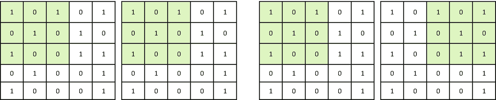
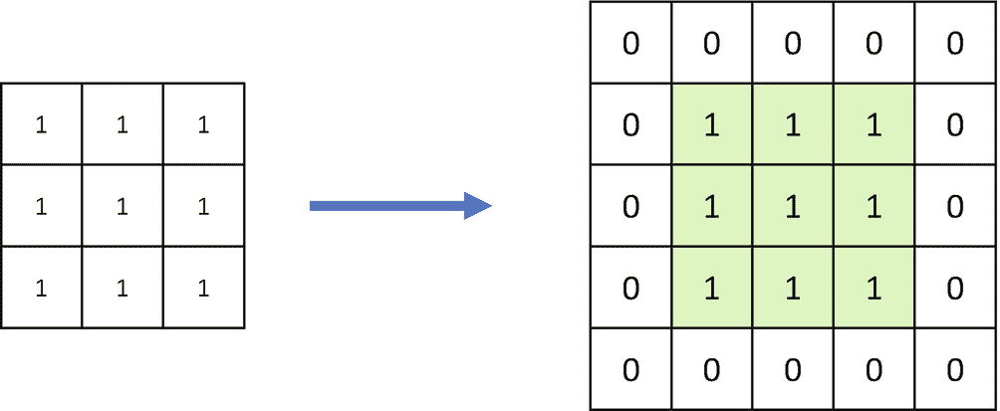
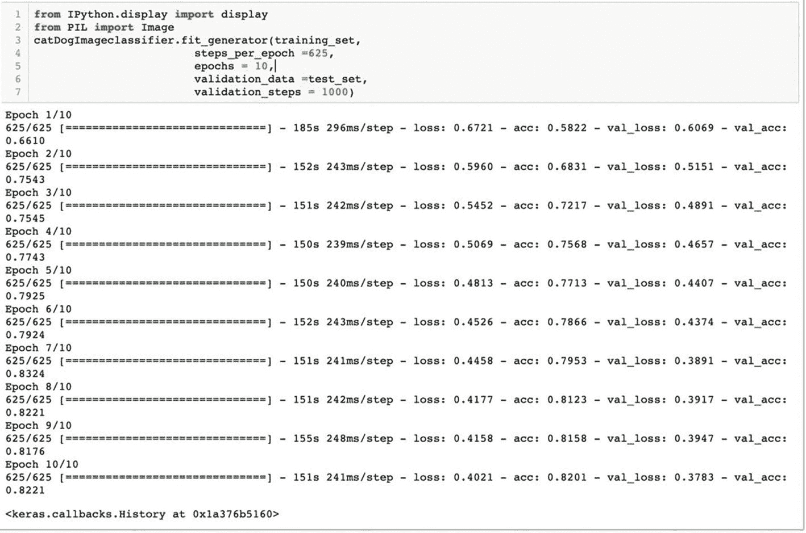

# 2.计算机视觉深度学习的具体细节

> *头脑不是一个需要被填满的容器，而是一团需要被点燃的火。*—普鲁塔克
> 
> T5】

我们人类被赋予了非凡的思维能力。这些力量允许我们区分和辨别，发展新技能，学习新艺术，做出理性的决定。我们的视觉能力没有极限。不管姿势和背景如何，我们都能识别人脸。我们可以区分汽车、狗、桌子、电话等物体，而不管它们的品牌和类型。我们可以识别颜色和形状，并清楚而容易地区分它们。这种力量是周期性和系统性发展的。在我们年轻的时候，我们不断地学习物体的属性，发展我们的知识。这些信息被安全地保存在我们的记忆中。随着时间的推移，这种知识和学习提高。这是一个如此惊人的过程，反复训练我们的眼睛和头脑。经常有人认为，深度学习起源于一种模仿这些非凡能力的机制。在计算机视觉中，深度学习正在帮助我们发现可以用来帮助组织将计算机视觉用于生产目的的能力。深度学习已经发展了很多，仍然有很大的进一步发展空间。

在第一章中，我们从深度学习的基础开始。在第二章中，我们将在这些基础上更深入地理解神经网络的各个层次，并使用 Keras 和 Python 创建一个深度学习解决方案。

我们将在本章中讨论以下主题:

1.  什么是张量，如何使用张量流

2.  揭秘卷积神经网络

3.  卷积神经网络的组件

4.  发展用于图像分类的 CNN 网络

## 2.1 技术要求

本章的代码和数据集上传到本书的 GitHub 链接 [`https://github.com/Apress/computer-vision-using-deep-learning/tree/main/Chapter2`](https://github.com/Apress/computer-vision-using-deep-learning/tree/main/Chapter2) 。我们将使用朱庇特笔记本。对于这一章，CPU 足以执行代码，但如果需要，您可以使用谷歌合作实验室。如果你不能自己设置 Google Colab，你可以参考本书末尾的参考资料。

## 2.2 使用 TensorFlow 和 Keras 的深度学习

现在让我们简单地研究一下张量流和 Keras。它们可以说是最常见的开源库。

*TensorFlow* (TF)是 Google 推出的机器学习平台。 *Keras* 是在其他 DL 工具包如 TF、Theano、CNTK 等之上开发的框架。它内置了对卷积和递归神经网络的支持。

Tip

Keras 是一个 API 驱动的解决方案；大部分繁重的工作已经在喀拉斯完成。它更容易使用，因此推荐给初学者。

TF 中的计算是使用数据流图来完成的，其中数据由边(只不过是张量或多维数据数组)和表示数学运算的节点来表示。那么，张量到底是什么？

## 2.3 什么是张量？

回忆一下高中数学中的标量 T1 和 T2 向量 T3。向量可以被视为有方向的标量。例如，50 公里/小时的速度是一个标量，而北方向的 50 公里/小时是一个矢量。这意味着向量在给定方向上是标量大小。另一方面，一个*张量*会在多个方向上，也就是在多个方向上的标量大小。

根据数学定义，张量是可以在两个代数对象之间提供线性映射的对象。这些对象本身可以是标量或向量，甚至是张量。

张量可以在向量空间图中可视化，如图 [2-1](#Fig1) 所示。


图 2-1

用向量空间图表示的张量。张量是多个方向上的标量大小，用于提供两个代数对象之间的线性映射

正如你在图 [2-1](#Fig1) 中看到的，张量有多个方向的投影。张量可以被认为是一个数学实体，用分量来描述。它们是参照一个基来描述的，如果这个相关的基改变了，张量本身也要改变。一个例子是坐标变化；如果在此基础上进行变换，张量的数值也会改变。TensorFlow 使用这些张量进行复杂的计算。

现在让我们开发一个基本的检查，看看你是否已经正确安装了 TF。我们将两个常数相乘，检查安装是否正确。

Info

如果您想知道如何安装 TensorFlow 和 Keras，请参考第 [1](1.html) 章。

1.  让我们导入 TensorFlow：

1.  初始化两个常数:

```py
import tensorflow as tf

```

1.  将两个常数相乘:

```py
a = tf.constant([1,1,1,1])
b = tf.constant([2,2,2,2])

```

1.  打印最终结果:

```py
product_results = tf.multiply(a, b)

```

```py
print(product_results)

```

如果你能得到结果，恭喜你一切就绪！

现在让我们详细研究一个卷积神经网络。之后，您将准备好创建您的第一个图像分类模型。

很刺激，对吧？

### 2.3.1 什么是卷积神经网络？

当我们人类看到一幅图像或一张脸时，我们能够立即识别它。这是我们拥有的基本技能之一。这个识别过程是大量小过程的融合，是我们视觉系统各种重要组成部分之间的协调。

卷积神经网络或 CNN 能够使用深度学习来复制这种惊人的能力。

考虑一下这个。我们必须创建一个解决方案来区分猫和狗。使它们不同的属性可以是耳朵、胡须、鼻子等等。细胞神经网络有助于提取对图像有意义的图像属性。或者换句话说，CNN 将提取区别猫和狗的特征。CNN 在图像分类、目标检测、目标跟踪、图像字幕、人脸识别等方面非常强大。

让我们深入了解 CNN 的概念。我们将首先研究卷积。

### 2.3.2 什么是卷积？

卷积过程的主要目的是提取对图像分类、对象检测等重要的特征。这些特征将是边缘、曲线、色差、线条等等。一旦该过程被很好地训练，它将在图像中的重要点学习这些属性。然后它可以在图像的任何部分检测到它。

假设你有一张 32x32 的图片。这意味着如果它是彩色图像(记住 RGB)，它可以表示为 32x32x3 像素。现在让我们在这张图片上移动(或*回旋*)一个 5x5 的区域，覆盖整个图片。这个过程叫做*卷积*。从左上角开始，这个区域覆盖了整个图像。你可以参考图 [2-2](#Fig2) 来看看一个 32x32 的图像是如何被一个 5x5 的滤镜旋绕的。


图 2-2

卷积过程:输入层在左边，输出在右边。32x32 的图像被 5x5 大小的滤镜进行了卷积

在整个图像上通过的 5x5 区域被称为*滤波器*，它有时被称为*内核*或*特征检测器*。图 [2-2](#Fig2) 中突出显示的区域被称为过滤器的*感受野*。因此，我们可以说，过滤器只是一个矩阵，其值称为权重。这些权重在模型训练过程中被训练和更新。该过滤器在图像的每个部分上移动。

我们可以通过图 [2-3](#Fig3) 所示完整过程的例子来理解卷积过程。原图 5x5 大小，滤镜 3x3 大小。过滤器在整个图像上移动，并继续产生输出。


图 2-3

卷积是按元素进行乘积和加法的过程。在第一幅图像中，输出为 3，在第二幅图像中，过滤器向右移动了一个位置，输出为 2

在图 [2-3](#Fig3) 中，3x3 滤波器对整个图像进行卷积。过滤器检查它想要检测的特征是否存在。该滤波器执行卷积过程，它是两个度量之间的元素级乘积和总和。如果存在某个特征，滤波器和图像部分的卷积输出将产生一个较高的数值。如果该功能不存在，输出将会很低。因此，该输出值表示过滤器对图像中存在特定特征的置信度。

我们在整个图像上移动这个过滤器，产生一个输出矩阵，称为特征图或激活图。该特征图将具有整个图像上的滤波器的卷积。

假设输入图像的维数是(n，n)，滤波器的维数是(x，x)。

所以，CNN 层之后的输出是 **((n-x+1)，(n-x+1))** 。

因此，在图 [2-3](#Fig3) 的例子中，输出是(5-3+1，5-3+1) = (3，3)。

还有一个叫做*通道*的组件非常有趣。通道是卷积过程中矩阵的深度。该滤镜将应用于输入图像中的每个通道。我们再次在图 [2-4](#Fig4) 中展示了流程的输出。输入图像的大小是 5x5x5，我们有一个 3x3x3 的过滤器。因此，输出变成大小为(3x3)的图像。我们应该注意到，滤波器的通道数应该与输入图像的通道数完全相同。在图 [2-4](#Fig4) 中，为 3。它允许度量之间的逐元素乘法。


图 2-4

滤镜的通道数与输入图像的通道数相同

还有一个我们应该注意的因素。过滤器可以以不同的间隔在输入图像上滑动。它被称为*步幅值*，并且它建议滤波器在每一步应该移动多少。其过程如图 [2-5](#Fig5) 所示。在左边的第一幅图中，我们有一个单一的步幅，而在右边，显示了两个步幅的运动。



图 2-5

Stride 建议过滤器在每一步应该移动多少。该图显示了步幅对卷积的影响。在第一张图中，我们的步幅为 1，而在第二张图中，我们的步幅为 2

你会同意，在卷积过程中，我们会很快丢失周边的像素。正如我们在图 [2-3](#Fig3) 中看到的，一个 5x5 的图像变成了一个 3x3 的图像，这种损失会随着层数的增加而增加。为了解决这个问题，我们有了填充的概念。在填充中，我们给正在处理的图像添加一些像素。例如，我们可以用零填充图像，如图 [2-6](#Fig6) 所示。填充的使用导致卷积神经网络的更好的分析和更好的结果。



图 2-6

零填充已添加到输入图像。卷积由于这个过程减少了像素的数量，填充使我们能够解决这个问题

现在我们已经理解了 CNN 的主要组成部分。让我们结合这些概念，创建一个小流程。如果我们有一个大小为(nxn)的图像，我们应用大小为“f”的过滤器，步长为“s”，填充为“s”，那么该过程的输出将是

((n+2p–f)/s+1)，(n+2p–f)/s+1))(等式 2-1)

我们可以理解如图 [2-7](#Fig7) 所示的过程。我们有一个大小为 37x37 的输入图像和一个大小为 3x3 的滤波器，滤波器数量为 10，跨距为 1，填充为 0。根据等式 2-1，输出将为 35x35x10。


图 2-7

一种卷积过程，其中我们有一个大小为 3x3 的滤波器，步长为 1，填充为 0，滤波器数量为 10

卷积帮助我们提取图像的重要属性。更靠近原点(输入影像)的网络图层学习低级特征，而最终图层学习高级特征。在网络的初始层中，边缘、曲线等特征被提取出来，而更深的层将从这些低级特征(如面、对象等)中了解最终的形状。

但是这个计算看起来很复杂，不是吗？随着网络的深入，这种复杂性将会增加。那么我们该如何应对呢？池层是答案。我们来了解一下。

### 2.3.3 什么是池层？

我们研究的 CNN 层产生了输入的特征图。但是随着网络变得更深，这种计算变得复杂。这是由于随着每一层和每一个神经元，网络中的维数增加。因此网络的整体复杂性增加。

还有一个挑战:任何图像增强都会改变特征图。例如，旋转将改变图像中特征的位置，因此相应的特征图也将改变。

Note

通常，您会面临原始数据不可用的情况。图像增强是为您创建新图像的推荐方法之一，这些新图像可用作训练数据。

特征图中的这种变化可以通过*下采样*来解决。在缩减像素采样中，输入图像的分辨率会降低，而*合并图层*可以帮助我们做到这一点。

在卷积层之后添加一个汇集层。每个特征地图被单独操作，我们得到一组新的汇集的特征地图。此操作过滤器的大小小于要素地图的大小。

通常在卷积层之后应用汇集层。具有 3x3 像素和跨距的池化图层将要素地图的大小缩小了 2 倍，这意味着每个维度减半。例如，如果我们将池图层应用于 8x8 (64 像素)的要素地图，输出将是 4x4 (16 像素)的要素地图。

有两种类型的池层。

**平均池和最大池**。前者计算特征图每个值的平均值，后者得到特征图每个面片的最大值。让我们如图 [2-8](#Fig8) 所示检查它们。


图 2-8

右边的数字是最大汇集，而底部是平均汇集

如图 [2-8](#Fig8) 所示，平均池层计算四个数字的平均值，而最大池层从四个数字中选择最大值。

关于全连接层，还有一个更重要的概念，在准备创建 CNN 模型之前，您应该知道。让我们检查一下，然后你就可以走了。

### 2.3.4 什么是全连接层？

完全连接的层从前一层的输出(高级特征的激活图)获取输入，并输出 n 维向量。这里，n 是不同类的数量。

例如，如果目标是确定图像是否是一匹马，则完全连接的层将在激活图中具有像尾巴、腿等高级特征。完全连接的层如图 [2-9](#Fig9) 所示。


图 2-9

这里描述了一个完全连接的层

完全连接的图层将查看与特定类最接近且具有特定权重的要素。当我们得到权重和前一层之间的乘积时，这样做是为了得到不同类别的正确概率。

现在你已经了解了 CNN 及其组成部分。是时候打代码了。你将创建你的第一个深度学习解决方案来对猫和狗进行分类。祝一切顺利！

## 2.4 使用 CNN 开发 DL 解决方案

我们现在将使用 CNN 创建一个深度学习解决方案。深度学习的“你好世界”通常被称为 MNIST 数据集。它是手写数字的集合，如图 [2-10](#Fig10) 所示。


图 2-10

MNIST 数据集:用于图像识别的“Hello World”

有一篇关于识别 MNIST 图像的著名论文(在该章的末尾给出了描述)。为了避免重复，我们将全部代码上传到 GitHub。建议您检查代码。

我们现在将开始创建图像分类模型！

在第一个深度学习解决方案中，我们希望根据猫和狗的图像来区分它们。数据集在`www.kaggle.com/c/dogs-vs-cats`可用。

下面列出了要遵循的步骤:

1.  首先，让我们构建数据集:
    1.  从 Kaggle 下载数据集。解压缩数据集。

    2.  您会发现两个文件夹:test 和 train。删除测试文件夹，因为我们将创建自己的测试文件夹。

    3.  在 train 和 test 文件夹中，创建两个子文件夹——猫和狗——并将图像放在各自的文件夹中。

    4.  从“火车>猫”文件夹中取一些图片(我取了 2000 张)放到“测试>猫”文件夹中。

    5.  从“火车>狗”文件夹中取一些图片(我取了 2000 张)放到“测试>狗”文件夹中。

    6.  您的数据集已经可以使用了。

2.  现在导入所需的库。我们将从`keras`导入`sequential`、`pooling`、`activation`和`flatten`图层。也导入`numpy`。

    **注意**在本书的参考资料中，我们提供了每一层的描述及其各自的功能。

    ```py
    from keras.models import Sequential
    from keras.layers import Conv2D,Activation,MaxPooling2D,Dense,Flatten,Dropout
    import numpy as np

    ```

3.  初始化一个模型，这里的`catDogImageclassifier`变量:

    ```py
    catDogImageclassifier = Sequential()

    ```

4.  现在，我们将添加层到我们的网络。`Conv2D`将增加一个二维卷积层，它将有 32 个过滤器。3，3 代表过滤器的大小(3 行，3 列)。以下输入图像形状为 64 * 64 * 3–高*宽*RGB。每个数字代表像素强度(0–255)。

    ```py
    catDogImageclassifier.add(Conv2D(32,(3,3),input_shape=(64,64,3)))

    ```

5.  最后一个图层的输出将是一个要素地图。训练数据将对其进行处理，并获得一些特征图。

6.  让我们添加激活功能。我们在这个例子中使用`ReLU`(整流线性单位)。在前一层输出的特征图中，激活函数将所有负像素替换为零。

    **注**从 ReLU 的定义中回忆；它是 max(0，x)。ReLU 允许正值，而将负值替换为 0。一般来说，ReLU 只用于隐藏层。

1.  现在我们添加最大池层，因为我们不希望我们的网络在计算上过于复杂。

    ```py
    catDogImageclassifier.add(MaxPooling2D(pool_size =(2,2)))

    ```

2.  接下来，我们将所有三个卷积块相加。每个块都有一个 Cov2D、ReLU 和 Max 池层。

    ```py
    catDogImageclassifier.add(Conv2D(32,(3,3))) catDogImageclassifier.add(Activation('relu')) catDogImageclassifier.add(MaxPooling2D(pool_size =(2,2))) catDogImageclassifier.add(Conv2D(32,(3,3))) catDogImageclassifier.add(Activation('relu')) catDogImageclassifier.add(MaxPooling2D(pool_size =(2,2))) catDogImageclassifier.add(Conv2D(32,(3,3 catDogImageclassifier.add(Activation('relu')) catDogImageclassifier.add(MaxPooling2D(pool_size =(2,2)))

    ```

3.  现在，让我们展平数据集，该数据集会将汇集的要素地图矩阵转换为一列。

    ```py
    catDogImageclassifier.add(Flatten())

    ```

4.  Add the dense function now followed by the ReLU activation:

    ```py
    catDogImageclassifier.add(Dense(64)) catDogImageclassifier.add(Activation('relu'))

    ```

    你认为我们为什么需要非线性函数，比如 tanh，ReLU 等等？如果只使用线性函数，输出也将是线性的。因此，我们在隐藏层中使用非线性函数。

5.  过度合身是一件讨厌的事。接下来，我们将添加 Dropout 层来克服过度拟合:

    ```py
    catDogImageclassifier.add(Dropout(0.5))

    ```

6.  再添加一个完全连接的层，以获得 n 维类的输出(输出将是一个矢量)。

    ```py
    catDogImageclassifier.add(Dense(1))

    ```

7.  添加 Sigmoid 函数以转换为概率:

    ```py
    catDogImageclassifier.add(Activation('sigmoid'))

    ```

8.  让我们打印一份网络摘要。

    ```py
    catDogImageclassifier.summary()

    ```

```py
catDogImageclassifier.add(Activation('relu'))

```

我们在下图中看到了整个网络:


我们可以看到网络中的参数数量为 36，961。建议您尝试不同的网络结构，并评估其影响。

1.  让我们现在编译网络。我们使用使用梯度下降的优化器`rmsprop`，然后我们添加损失或成本函数。

    ```py
    catDogImageclassifier.compile(optimizer ='rmsprop', loss ='binary_crossentropy',
    metrics =['accuracy'])

    ```

2.  现在我们在这里做数据增强(缩放，比例等。).这也有助于解决过度拟合的问题。我们使用`ImageDataGenerator`函数来做这件事:

    ```py
    from keras.preprocessing.image import ImageDataGenerator
    train_datagen = ImageDataGenerator(rescale =1./255, shear_range =0.25,zoom_range = 0.25, horizontal_flip =True)
    test_datagen = ImageDataGenerator(rescale = 1./255)

    ```

3.  加载训练数据:

    ```py
    training_set = train_datagen.flow_from_directory('/Users/DogsCats/train',target_size=(64,6 4),batch_size= 32,class_mode='binary')

    ```

4.  加载测试数据:

    ```py
    test_set = test_datagen.flow_from_directory('/Users/DogsCats/test', target_size = (64,64),
    batch_size = 32,
    class_mode ='binary')

    ```

5.  让我们现在开始训练。

    ```py
    from IPython.display import display
    from PIL import Image catDogImageclassifier.fit_generator(training_set, steps_per_epoch =625,
    epochs = 10, validation_data =test_set, validation_steps = 1000)

    ```

每个时期的步数是 625，时期数是 10。如果我们有 1000 个图像，批量大小为 10，所需的步骤数将是 100 (1000/10)。

Info

*历元的数量*意味着通过全部训练数据集的完整次数。*批次*是一个批次中训练样本的数量，而*迭代*是完成一个历元所需的批次数量。

根据网络的复杂性、给定的历元数等，编译将需要时间。测试数据集在这里作为`validation_data`传递。

输出如图 [2-11](#Fig11) 所示。



图 2-11

输出 10 个时期的训练结果

从结果中可以看出，在最后一个时期，我们得到了 82.21%的验证准确率。我们还可以看到，在纪元 7 中，我们获得了 83.24%的精度，这比最终精度更好。

然后，我们希望使用在 Epoch 7 中创建的模型，因为它的精度是最好的。我们可以通过在训练和保存版本之间提供检查点来实现。我们将在后续章节中查看创建和保存检查点的过程。

我们已经将最终模型保存为文件。然后，在需要时，可以再次加载该模型。模型将被保存为一个`HDF5`文件，以后可以重复使用。

1.  使用 load_model:

    ```py
    from keras.models import load_model
    catDogImageclassifier = load_model('catdog_cnn_model.h5')

    ```

    加载保存的模型
2.  检查模型如何预测一个看不见的图像。

```py
catDogImageclassifier.save('catdog_cnn_model.h5')

```

这是我们用来做预测的图像(图 [2-12](#Fig12) )。请随意使用不同的图像测试解决方案。


图 2-12

一张狗的图片来测试模型的准确性

在下面的代码块中，我们使用我们训练的模型对前面的图像进行预测。

1.  从文件夹中加载库和图像。您必须在下面的代码片段中更改文件的位置。

    ```py
    import numpy as np
    from keras.preprocessing import image
    an_image =image.load_img('/Users/vaibhavverdhan/Book
    Writing/2.jpg',target_size =(64,64))

    ```

图像现在被转换成一组数字:

```py
an_image =image.img_to_array(an_image)

```

现在让我们扩大图像的维度。它将提高模型的预测能力。它用于扩展数组的形状，并插入一个新的轴，该轴出现在扩展后的数组形状的轴的位置上。

```py
an_image =np.expand_dims(an_image, axis =0)

```

现在是时候调用 predict 方法了。我们将概率阈值设置为 0.5。建议您测试多个阈值，并检查相应的准确性。

```py
verdict = catDogImageclassifier.predict(an_image) if verdict[0][0] >= 0.5:
prediction = 'dog'
else:
prediction = 'cat'

```

1.  让我们打印我们的最终预测。

    ```py
    print(prediction)

    ```

该模型预测图像是一只“狗”

在这个例子中，我们使用 Keras 设计了一个神经网络。我们使用猫和狗的图像来训练图像，并对其进行测试。如果我们能得到每一类的图像，也有可能训练一个多分类器系统。

恭喜你！你刚刚完成了使用深度学习的第二个图像分类用例。使用它来训练您自己的影像数据集。甚至可以创建一个多类分类模型。

现在你可能会想，你将如何使用这个模型进行实时预测。编译后的模型文件(例如,`'catdog_cnn_model.h5')`)将被部署到服务器上以进行预测。我们将在本书的最后一章详细讨论模型部署。

就这样，我们结束了第二章。你现在可以开始总结了。

## 2.5 总结

图像是信息和知识的丰富来源。通过分析图像数据集，我们可以解决很多业务问题。CNN 正在引领人工智能革命，尤其是在图像和视频领域。它们被用于医疗行业、制造业、零售业、BFSI 等等。相当多的研究正在使用 CNN 进行。

基于 CNN 的解决方案非常创新和独特。在设计基于 CNN 的创新解决方案时，有许多挑战需要解决。层数、每层中神经元的数量、要使用的激活函数、损失函数、优化器等的选择并不简单。这取决于业务问题的复杂性、手头的数据集以及可用的计算能力。该解决方案的功效在很大程度上取决于可用的数据集。如果我们有一个明确定义的可衡量、精确和可实现的业务目标，如果我们有一个有代表性的完整数据集，如果我们有足够的计算能力，许多业务问题都可以使用深度学习来解决。

在本书的第一章，我们介绍了计算机视觉和深度学习。在第二章中，我们学习了卷积层、池层和全连接层的概念。您将在整个旅程中使用这些概念。而且你还利用深度学习开发了一个图像分类模型。

从下一章开始，当我们从网络体系结构开始时，难度将会增加。网络体系结构使用我们在前两章中学习过的构建模块。它们是由跨组织和大学的科学家和研究人员开发的，用于解决复杂的问题。我们将研究这些网络并开发 Python 解决方案。所以保持饥饿！

你现在应该能回答练习中的问题了！

Review Questions

建议您解决以下问题:

1.  CNN 中的卷积过程是怎样的，输出是如何计算的？

2.  为什么我们需要隐藏层中的非线性函数？

3.  最大池和平均池的区别是什么？

4.  你说退学是什么意思？

5.  从 [`www.kaggle.com/puneet6060/intel-image-classification`](https://www.kaggle.com/puneet6060/intel-image-classification) 下载世界各地自然场景的图像数据，利用 CNN 开发图像分类模型。

6.  从 [`https://github.com/zalandoresearch/fashion-mnist`](https://github.com/zalandoresearch/fashion-mnist) 下载时尚 MNIST 数据集，开发图像分类模型。

### 进一步阅读

建议您浏览以下文件:

1.  在 [`https://arxiv.org/pdf/1811.08278.pdf`](https://arxiv.org/pdf/1811.08278.pdf) 浏览“在手写数字识别数据集(MNIST)上评估四个神经网络”。

2.  在 [`https://arxiv.org/pdf/1901.06032.pdf`](https://arxiv.org/pdf/1901.06032.pdf) 学习研究论文《深度卷积神经网络近期架构综述》。

3.  在 [`https://arxiv.org/pdf/1609.04112.pdf`](https://arxiv.org/pdf/1609.04112.pdf) 浏览研究论文《用数学模型理解卷积神经网络》。

4.  在 [`http://ais.uni-bonn.de/papers/icann2010_maxpool.pdf`](http://ais.uni-bonn.de/papers/icann2010_maxpool.pdf) 浏览“对象识别卷积架构中的池操作评估”。