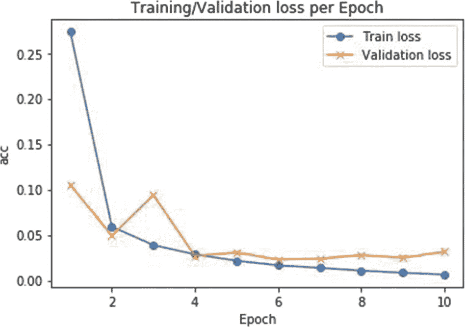
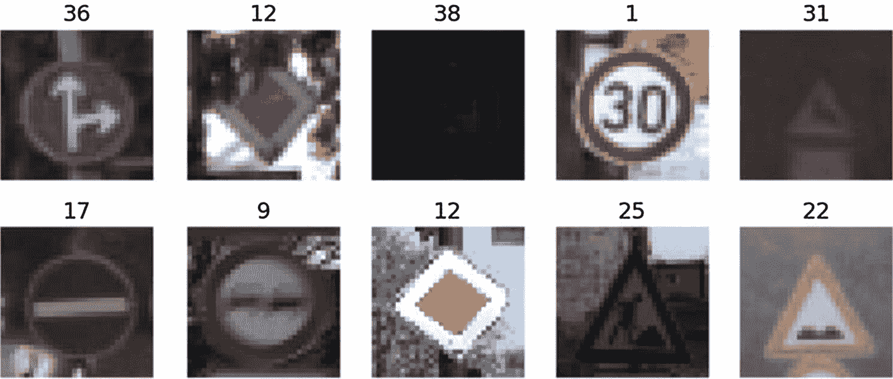
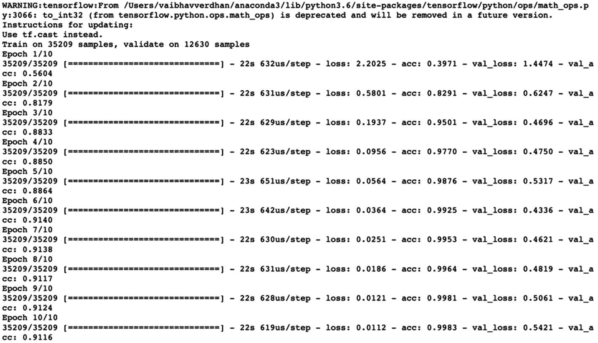
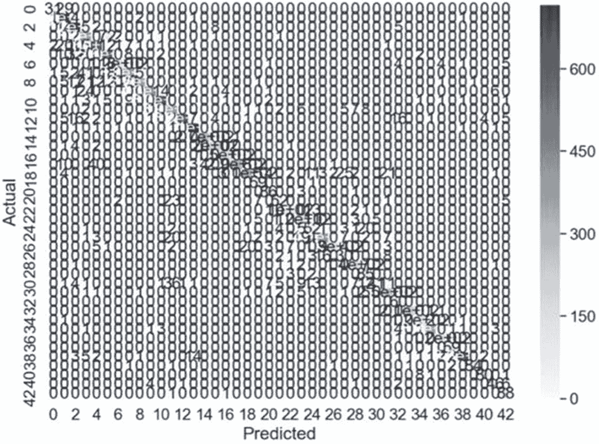
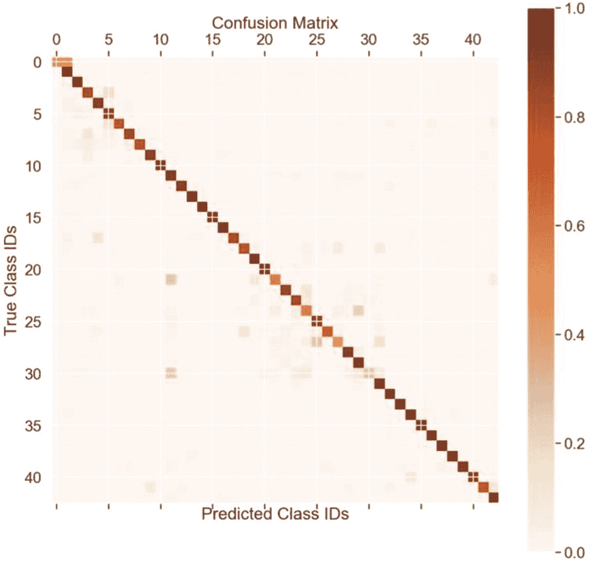

# 三、基于 LeNet 的图像分类

> *千里之行始于足下。*—老子
> 
> T5】

你已经迈出了学习深度学习的非凡一步。深度学习是一个不断发展的领域。从基本的神经网络，我们现在已经发展到复杂的架构，解决大量的商业问题。深度学习驱动的图像处理和计算机视觉能力使我们能够创建更好的癌症检测解决方案，降低污染水平，实施监控系统，并改善消费者体验。有时，业务问题需要定制的方法。我们可能会设计自己的网络，以适应手头的业务问题，并基于我们可用的图像质量。网络设计还将考虑训练和执行网络的可用计算能力。跨组织和大学的研究人员花费了大量时间来收集和管理数据集，清理和分析它们，设计架构，培训和测试它们，并迭代以提高性能。做出开创性的解决方案需要大量的时间和极大的耐心。

在前两章中，我们讨论了神经网络的基础知识，并使用 Keras 和 Python 创建了一个深度学习解决方案。从本章开始，我们将开始讨论复杂的神经网络结构。我们将首先介绍 LeNet 架构。我们将讨论网络设计、各种层次、激活功能等等。然后，我们将开发图像分类用例的模型。

特别是，我们将在本章中讨论以下主题:

1.  LeNet 架构及其变体

2.  LeNet 架构的设计

3.  MNIST 数字分类

4.  德国交通标志分类

5.  摘要

欢迎阅读第三章，祝一切顺利！

## 3.1 技术要求

本章的代码和数据集上传到本书的 GitHub 链接 [`https://github.com/Apress/computer-vision-using-deep-learning/tree/main/Chapter3`](https://github.com/Apress/computer-vision-using-deep-learning/tree/main/Chapter3) 。我们将使用朱庇特笔记本。对于这一章，CPU 足以执行代码，但如果需要，您可以使用谷歌合作实验室。谷歌 Colab 可以参考该书的参考资料。

让我们在下一部分继续深入学习架构。

## 3.2 深度学习架构

当我们讨论深度学习网络时，我们脑海中会立即浮现出几个组件——神经元数量、层数、使用的激活函数、损耗等等。所有这些参数在网络设计及其性能中起着至关重要的作用。当我们提到神经网络中的深度时，它是网络中隐藏层的数量。随着计算能力的提高，网络变得更深，对计算能力的需求也增加了。

Info

虽然您可能认为增加网络的层数会提高精度，但事实并非总是如此。这正是一个叫做 ResNet 的新网络产生的原因。

使用这些基础组件，我们可以设计自己的网络。全球的研究人员和科学家花费了大量的时间和精力来开发不同的神经网络架构。最流行的架构有 *LeNet-5* 、 *AlexNet* 、 *VGGNet* 、 *GoogLeNet* 、 *ResNet* 、 *R-CNN(基于区域的 CNN)* 、*、【你只看一次】、*、 *SqueezeNet* 、 *SegNet* 、 *GAN(生成式对抗网络)这些网络使用不同数量的隐藏层、神经元、激活函数、优化方法等等。根据手头的业务问题，有些架构比其他架构更适合。*

在本章中，我们将详细讨论 LeNet 架构，然后开发一些用例。我们从 LeNet 开始，因为它是更容易理解的框架之一，也是深度学习架构的先驱之一。我们还将检查各种超参数的变化对模型性能的影响。

## 3.3 LeNet 体系结构

正如我们在上一节中讨论的，LeNet 是我们在书中讨论的第一个体系结构。这是较简单的 CNN 架构之一。它之所以具有重要意义，是因为在它被发明之前，字符识别是一个既麻烦又耗时的过程。LeNet 体系结构于 1998 年推出，在美国，当它被用于对银行支票上的手写数字进行分类时，它开始流行起来。

LeNet 架构有几种形式——*LeNet-1*、 *LeNet-4* 和 *LeNet-5* ，这是被引用最多、最著名的一种。他们是由 Yann LeCun 在一段时间内开发的。出于篇幅的考虑，我们正在详细研究 LeNet-5，其余的架构可以使用相同的方法来理解。

在下一节中，我们将从基本的 LeNet-1 架构开始。

## 3.4 LeNet-1 体系结构

LeNet-1 架构很容易理解。让我们看看它的层的尺寸。

*   第一层:28x28 输入图像

*   第二层:四个 24x24 卷积层(5x5 大小)

*   第三层:平均池层(2×2 大小)

*   第四层:八个 12×12 卷积层(5×5 大小)

*   第五层:平均池层(2×2 大小)

最后，我们有输出层。

Info

引入 LeNet 时，研究人员并没有提出最大池化；相反，使用了平均池。建议您同时使用平均池和最大池来测试解决方案。

LeNet-1 架构如图 [3-1](#Fig1) 所示。


图 3-1

LeNet-1 架构是第一个被概念化的 LeNet。我们应该注意第一层是一个卷积层，接着是池，另一个卷积层和一个池层。最后，我们在最后有一个输出层

这里可以看到，我们有输入层、卷积层、池层、卷积层、池层，最后是输出层。根据配置，图像在整个网络中进行转换。我们已经详细解释了所有层的功能和各自的输出，同时我们在随后的部分中讨论 LeNet-5。

## 3.5 LeNet-4 体系结构

LeNet-4 架构比 LeNet-1 略有改进。多了一个完全连接的图层和更多的要素地图。

*   第一层:32x32 输入图像

*   第二层:四个 24x24 卷积层(5x5 大小)

*   第三层:平均池层(2×2 大小)

*   第四层:十六个 12×12 卷积层(5×5 大小)

*   第五层:平均池层(2×2 大小)

输出完全连接到 120 个神经元，这些神经元进一步完全连接到 10 个神经元作为最终输出。

LeNet-4 架构如图 [3-2](#Fig2) 所示。


图 3-2

LeNet-4 是对 LeNet-1 架构的改进。其中引入了一个更完全连接的层

要详细了解所有层的功能，请参考下一节讨论 LeNet-5 的内容。

## 3.6 LeNet-5 体系结构

在所有三种 LeNet 架构中，被引用最多的架构是 LeNet-5，它是解决业务问题时通常使用的架构。

LeNet-5 架构如图 [3-3](#Fig3) 所示。它最初在 Y. LeCun 等人的论文“应用于文档识别的基于梯度的学习”中讨论过。该论文可在 [`http://yann.lecun.com/exdb/publis/pdf/lecun-01a.pdf`](http://yann.lecun.com/exdb/publis/pdf/lecun-01a.pdf) 访问。


图 3-3

LeNet architecture–图片取自 [`http://yann.lecun.com/exdb/publis/pdf/lecun-01a.pdf`](http://yann.lecun.com/exdb/publis/pdf/lecun-01a.pdf)

让我们详细讨论它的各个层，因为它是最常用的架构:

1.  第一层:LeNet-5 的第一层是 32x32 的输入图像层。它是一个灰度图像，通过一个卷积块，该卷积块有六个大小为 5x5 的滤波器。结果尺寸为 28x28x1，32x32x1。这里，1 代表通道；它是 1，因为它是灰度图像。如果是 RGB，应该是三个通道。

2.  第二层:汇集层也称为*子采样层*，其过滤器大小为 2x2，跨距为 2。图像尺寸缩小到 14x14x6。

3.  第三层:这也是一个卷积层，具有 16 个特征图，大小为 5×5，步幅为 1。注意，在该层中，16 个特征地图中只有 10 个连接到前一层的 6 个特征地图。它给了我们几个明显的优势:
    1.  计算成本较低。这是因为连接数量从 240，000 减少到 151，600。

    2.  该层的训练参数总数是 1516，而不是 2400。

    3.  它还打破了体系结构的对称性，因此网络中的学习更好。

4.  第四层:它是一个池层，过滤器大小为 2x2，跨距为 2，输出为 5x5x16。

5.  第五层:它是一个全连接的卷积层，有 120 个特征图，每个图的大小为 1x1。120 个单元中的每一个都连接到前一层中的 400 个节点。

6.  第六层:是全连通层，有 84 个单元。

7.  最后，输出层是一个 softmax 层，每个数字对应十个可能的值。

LeNet-5 架构的总结如表 [3-1](#Tab1) 所示。

表 3-1

整个 LeNet 架构的总结

<colgroup><col class="tcol1 align-center"> <col class="tcol2 align-center"></colgroup> 
| -  |

LeNet 是一个非常容易理解的小型架构。然而，它足够大和成熟，可以产生好的结果。它也可以在 CPU 上执行。同时，用不同的架构测试解决方案，并测试准确性以选择最佳的架构，这将是一个好主意。

我们有一个增强的 LeNet 架构，这将在下面讨论。

## 3.7 增强的 LeNet-4 架构

Boosting 是一种集成技术，通过从上一次迭代中不断改进，将弱学习者组合成强学习者。在 Boosted LeNet-4 中，将体系结构的输出相加，具有最高值的输出是预测类。

增强的 LeNet-4 架构如图 [3-4](#Fig4) 所示。


图 3-4

Boosted LeNet-4 架构结合弱学习者进行改进。最终输出更加准确和健壮

在前面描述的网络体系结构中，我们可以看到弱学习者是如何组合起来形成强预测解决方案的。

LeNet 是少数几个变得流行并用于解决深度学习问题的架构中的第一个。随着更多的进步和研究，我们已经开发了先进的算法，但 LeNet 仍然保持着特殊的地位。

是时候我们使用 LeNet 架构创建第一个解决方案了。

## 3.8 使用 LeNet 创建图像分类模型

现在我们已经理解了 LeNet 架构，是时候用它开发实际的用例了。我们将使用 LeNet 架构开发两个用例。LeNet 是一个简单的架构，所以代码可以在你的 CPU 上编译。我们在激活功能方面对体系结构做了细微的调整，使用最大池功能代替平均池功能等等。

Info

与平均池相比，最大池提取了重要的特征。平均池使图像平滑，因此可能无法识别清晰的特征。

在我们开始编写代码之前，有一个小的设置我们应该知道。张量中通道的位置决定了我们应该如何重塑我们的数据。这可以在以下案例研究的步骤 8 中观察到。

每个图像可以由高度、宽度和通道数或通道数、高度和宽度来表示。如果通道位于输入数组的第一个位置，我们使用 channels_first 条件进行整形。这意味着通道位于张量(n 维数组)的第一个位置。反之亦然，对于 channels_last 也是如此。

## 3.9 使用 LeNet 的 MNIST 分类

此使用案例是我们在上一章中使用的 MNIST 数据集的延续。代码可以在本章开头给出的 GitHub 链接中找到

1.  首先，导入所有需要的库。

    ```py
    import keras
    from keras.optimizers import SGD
    from sklearn.preprocessing import LabelBinarizer from sklearn.model_selection import train_test_split from sklearn.metrics import classification_report from sklearn import datasets
    from keras import backend as K
    import matplotlib.pyplot as plt
    import numpy as np

    ```

2.  接下来，我们导入数据集，然后从 Keras 导入一系列图层。

    ```py
    from keras.datasets import mnist ## Data set is imported here
    from keras.models import Sequential
    from keras.layers.convolutional import Conv2D
    from keras.layers.convolutional import MaxPooling2D
    from keras.layers.core import Activation
    from keras.layers.core import Flatten
    from keras.layers.core import Dense
    from keras import backend as K

    ```

3.  定义超参数。这一步类似于上一章中我们开发 MNIST 和狗/猫分类的那一步。

    ```py
    image_rows, image_cols = 28, 28 batch_size = 256
    num_classes = 10
    epochs = 10

    ```

4.  现在加载数据集。MNIST 是默认情况下添加到库中的数据集。

    ```py
    (x_train, y_train), (x_test, y_test) = mnist.load_data()

    ```

5.  将图像数据转换为浮点型，然后将其规范化。

    ```py
    x_train = x_train.astype('float32') x_test = x_test.astype('float32') x_train /= 255
    x_test /= 255

    ```

6.  让我们打印训练和测试数据集的形状。

    ```py
    print('x_train shape:', x_train.shape) print(x_train.shape[0], 'train samples')
    print(x_test.shape[0], 'test samples')

    ```

7.  在下一个代码块中，我们将变量转换为一键编码。我们使用 Keras 的 to _ categorical 方法。

    ```py
    y_train = keras.utils.to_categorical(y_train, num_classes)
    y_test = keras.utils.to_categorical(y_test, num_classes)

    ```

Tip

我们使用打印语句来分析每个步骤的输出。如果需要，它允许我们在稍后阶段进行调试。

1.  让我们相应地重塑我们的数据。

    ```py
    if K.image_data_format() == 'channels_first':
       x_train = x_train.reshape(x_train.shape[0], 1, image_rows, image_cols)
       x_test = x_test.reshape(x_test.shape[0], 1, image_rows, image_cols)
       input_shape = (1, image_rows, image_cols)
    else:
       x_train = x_train.reshape(x_train.shape[0], image_rows, image_cols, 1)
       x_test = x_test.reshape(x_test.shape[0], image_rows, image_cols, 1)
       input_shape = (image_rows, image_cols, 1)

    ```

    是时候创建我们的模型了！

2.  首先添加一个顺序层，然后是卷积层和最大池层。

    ```py
    model = Sequential()
    model.add(Conv2D(20, (5, 5), padding="same",input_shape=input_shape))
    model.add(Activation("relu")) model.add(MaxPooling2D(pool_size=(2, 2), strides=(2, 2)))

    ```

3.  我们现在将添加多层卷积层、最大池层和数据扁平化层。

    ```py
    model.add(Conv2D(50, (5, 5), padding="same")) model.add(Activation("relu")) model.add(MaxPooling2D(pool_size=(2, 2), strides=(2, 2)))
    model.add(Flatten()) model.add(Dense(500)) model.add(Activation("relu"))

    ```

4.  我们添加一个密集层，然后是 softmax 层。Softmax 用于分类模型。之后，我们编译我们的模型。

    ```py
    model.add(Dense(num_classes)) model.add(Activation("softmax"))
    model.compile(loss=keras.losses.categorical_crossentropy, optimizer=keras.optimizers.Adadelta(), metrics=['accuracy'])

    ```

该模型已准备好接受训练和调整。

1.  我们可以看到每个历元对精确度和损失的影响。我们鼓励您尝试不同变化的超参数，如 epoch 和 batch size。取决于超参数，网络将需要时间来处理。

    ```py
    theLeNetModel = model.fit(x_train, y_train, batch_size=batch_size,
    epochs=epochs,
    verbose=1, validation_data=(x_test, y_test))

    ```

这里，我们可以分析损耗和精度如何随每个历元而变化。


十个历元后，验证准确率为 99.07%。

现在，让我们想象一下结果。

1.  We will be plotting the training and testing accuracy in the next code block.

    ```py
    import matplotlib.pyplot as plt
    f, ax = plt.subplots()
    ax.plot([None] + theLeNetModel.history['acc'], 'o-') ax.plot([None] + theLeNetModel.history['val_acc'], 'x-') ax.legend(['Train acc', 'Validation acc'], loc = 0) ax.set_title('Training/Validation acc per Epoch') ax.set_xlabel('Epoch')
    ax.set_ylabel('acc')

    ```

    In the graph in Figure [3-5](#Fig5), we can see that with each subsequent epoch, the respective accuracy parameters for both training and validation continue to increase. After epoch 7/8, the accuracy stabilizes. We can test this with different values of hyperparameters.

    

    图 3-5

    此处显示了训练和验证准确性。在历元 7/8 之后，精确度已经稳定

2.  Let’s analyze the loss:

    ```py
    import matplotlib.pyplot as plt f,
    ax = plt.subplots()
    ax.plot([None] + theLeNetModel.history['loss'], 'o-') ax.plot([None] + theLeNetModel.history['val_loss'], 'x-') ax.legend(['Train loss', 'Validation loss'], loc = 0) ax.set_title('Training/Validation loss per Epoch') ax.set_xlabel('Epoch')
    ax.set_ylabel('acc')

    ```

    In the graph in Figure [3-6](#Fig6), we can see that with each subsequent epoch, the respective loss measures for both training and validation continue to decrease. After epoch 7/8, the accuracy stabilizes. We can test this with different values of hyperparameters.

    

    图 3-6

    此处显示了培训和验证损失。在 7/8 个周期之后，损失已经稳定，并且没有观察到太多的减少

太好了！现在我们有了一个工作的 LeNet 模型来对图像进行分类。

在本练习中，我们使用 LeNet-5 架构训练了一个图像分类模型。

Info

如果你在计算效率上面临任何挑战，请使用谷歌合作实验室。

## 3.10 使用 LeNet 识别德国交通标志

第二个用例是德国交通标志识别。它可以用于自动驾驶解决方案。

在这个用例中，我们将使用 LeNet-5 架构构建一个深度学习模型。

1.  我们将在整本书中遵循一个相似的过程，首先导入库。

    ```py
    import keras
    from keras.optimizers import SGD
    from sklearn.preprocessing import LabelBinarizer
    from sklearn.model_selection import train_test_split
    from sklearn.metrics import classification_report
    from sklearn import datasets
    from keras import backend as K
    import matplotlib.pyplot as plt
    import numpy as np

    ```

2.  导入 Keras 库以及创建地块所需的所有包。

    ```py
    from keras.models import Sequential
    from keras.layers.convolutional import Conv2D
    from keras.layers.convolutional import MaxPooling2D
    from keras.layers.core import Activation
    from keras.layers.core import Flatten
    from keras.layers.core import Dense
    from keras import backend as K

    ```

3.  然后导入 numpy、matplotlib、os、OpenCV 之类的通用库。

    ```py
    import glob
    import pandas as pd
    import matplotlib
    import matplotlib.pyplot as plt
    import random
    import matplotlib.image as mpimg
    import cv2
    import os
    from sklearn.model_selection import train_test_split
    from sklearn.metrics import confusion_matrix
    from sklearn.utils import shuffle
    import warnings
    from skimage import exposure
    # Load pickled data
    import pickle
    %matplotlib inline matplotlib.style.use('ggplot')
    %config InlineBackend.figure_format = 'retina'

    ```

4.  数据集以 pickle 文件的形式提供，并保存为 train.p 和 test.p 文件。数据集可以在 [`www.kaggle.com/ meowmeowmeowmeowmeow/gtsrb-german-traffic-sign`](http://www.kaggle.com/%2520meowmeowmeowmeowmeow/gtsrb-german-traffic-sign) 从 Kaggle 下载。

    ```py
    training_file = "train.p"
    testing_file = "test.p"

    ```

5.  打开文件并保存训练和测试变量中的数据。

    ```py
    with open(training_file, mode="rb") as f: train = pickle.load(f)
    with open(testing_file, mode="rb") as f: test = pickle.load(f)

    ```

6.  将数据集分为测试和训练。我们在这里采用了 4000 的测试规模，但是您可以自由尝试不同的测试规模。

    ```py
    X, y = train['features'], train['labels']
    x_train, x_valid, y_train, y_valid = train_test_split(X, y, stratify=y,
    test_size=4000, random_state=0)
    x_test,y_test=test['features'],test['labels']

    ```

7.  让我们来看看这里的一些样本图像文件。我们使用了随机函数来选择随机图像；因此，如果您的输出与我们的不同，请不要担心。

    ```py
    figure, axiss = plt.subplots(2,5, figsize=(15, 4))
    figure.subplots_adjust(hspace = .2, wspace=.001)
    axiss = axiss.ravel()
    for i in range(10):
        index = random.randint(0, len(x_train))
        image = x_train[index]
        axiss[i].axis('off')
        axiss[i].imshow(image)
        axiss[i].set_title( y_train[index])

    ```

这里是如图 [3-7](#Fig7) 所示的输出。



图 3-7

此处显示了德国交通标志分类数据集的一些示例

1.  接下来，让我们选择我们的超参数。不同类别的数量为 43。我们已经开始使用十个纪元，但是我们鼓励您使用不同的纪元值来检查性能。批量大小也是如此。

    ```py
    image_rows, image_cols = 32, 32
    batch_size = 256
    num_classes = 43
    epochs = 10

    ```

2.  现在，我们将执行一些探索性的数据分析。这样做是为了查看我们的图像数据集看起来如何，以及直方图中各种类的频率分布是什么。

    ```py
    histogram, the_bins = np.histogram(y_train, bins=num_classes) the_width = 0.7 * (the_bins[1] - the_bins[0])
    center = (the_bins[:-1] + the_bins[1:]) / 2
    plt.bar(center, histogram, align="center", width=the_width) plt.show()

    ```

输出如图 [3-8](#Fig8) 所示。我们可以观察到，类的例子数量是有差异的。一些阶层得到了很好的代表，而一些阶层则没有。在现实世界的解决方案中，我们希望有一个平衡的数据集。我们会在本书的第 8 章[讨论更多。](8.html)


图 3-8

各类别频率分布。有的类例子比较多，有的代表性不多。理想情况下，我们应该为代表性较低的类收集更多的数据

1.  现在，让我们检查一下不同类别之间的分布情况。这是 NumPy 库中的一个常规直方图函数。

    ```py
    train_hist, train_bins = np.histogram(y_train, bins=num_classes)
    test_hist, test_bins = np.histogram(y_test, bins=num_classes)
    train_width = 0.7 * (train_bins[1] - train_ bins[0])
    train_center = (train_bins[:-1] + train_bins[1:]) / 2
    test_width = 0.7 * (test_ bins[1] - test_bins[0])
    test_center = (test_ bins[:-1] + test_bins[1:]) / 2

    ```

2.  现在，绘制直方图；对于训练数据集和测试数据集，颜色分别设置为红色和绿色。

    ```py
    plt.bar(train_center, train_hist, align="center", color="red", width=train_width)
    plt.bar(test_center, test_hist, align="center", color="green", width=test_width)
    plt.show()

    ```

这里是如图 [3-9](#Fig9) 所示的输出。


图 3-9

各种类别的频率分布以及在训练和测试数据集之间的分布。列车显示为红色，而测试显示为绿色

这里我们来分析一下分布；查看前面直方图中训练与测试的比例差异。

1.  将图像数据转换为浮点型，然后将其规范化。

    ```py
    x_train = x_train.astype('float32')
    x_test = x_test.astype('float32')
    x_train /= 255
    x_test /= 255
    print('x_train shape:', x_train.shape)
    print(x_ train.shape[0], 'train samples')
    print(x_test. shape[0], 'test samples')

    ```

因此，我们有 35209 个训练数据点和 12630 个测试数据点。下一步，将类别向量转换为二进制类别矩阵。这与我们开发 MNIST 分类的上一个示例中的步骤类似。

```py
y_train = keras.utils.to_categorical(y_train, num_classes) y_test = keras.utils.to_categorical(y_test, num_classes)

```

下面的代码块与前面开发的 MNIST 分类中描述的代码块相同。这里，channels_first 表示通道位于数组的第一个位置。我们正在根据 channels_first 的位置更改 input_shape。

```py
if K.image_data_format() == 'channels_first':
    input_shape = (1, image_rows, image_cols)
else:
    input_shape = (image_rows, image_cols, 1) 

```

让我们现在开始创建神经网络架构。这些步骤类似于前面的用例。

1.  添加一个顺序层，后跟一个卷积层。

    ```py
    model = Sequential() model.add(Conv2D(16,(3,3),input_shape=(32,32,3)))

    ```

2.  添加池层，然后添加卷积层，依此类推。

    ```py
    model.add(Activation("relu")) model.add(MaxPooling2D(pool_size=(2, 2), strides=(2, 2)))
    model.add(Conv2D(50, (5, 5), padding="same")) model.add(Activation("relu")) model.add(MaxPooling2D(pool_size=(2, 2), strides=(2, 2)))
    model.add(Flatten()) model.add(Dense(500)) model.add(Activation("relu"))
    model.add(Dense(num_classes)) model.add(Activation("softmax"))

    ```

3.  让我们打印模型摘要。

```py
model.summary()

```

这是输出。


1.  模型已准备好进行编译；让我们训练它。

    ```py
    model.compile(loss=keras.losses.categorical_crossentropy, optimizer=keras.optimizers.Adadelta(), metrics=['accuracy'])
    theLeNetModel = model.fit(x_train, y_train, batch_size=batch_size,
    epochs=epochs,
    verbose=1,
    validation_data=(x_test, y_test))

    ```

这是如图 [3-10](#Fig10) 所示的输出。



图 3-10

相对于每个历元的精度和损失移动。我们应该注意到，从第一个历元到最后一个历元，精确度是如何提高的

经过十个历元后，验证准确率为 91.16%。

现在让我们想象一下结果。

1.  我们将首先绘制网络的训练和测试精度。

    ```py
    import matplotlib.pyplot as plt
    f, ax = plt.subplots()
    ax.plot([None] + theLeNetModel.history['acc'], 'o-')
    ax.plot([None] + theLeNetModel. history['val_acc'], 'x-')
    ax.legend(['Train acc', 'Validation acc'], loc = 0)
    ax.set_ title('Training/Validation acc per Epoch')
    ax.set_xlabel('Epoch')
    ax.set_ylabel('acc')

    ```

这是结果图，如图 [3-11](#Fig11) 所示。


图 3-11

此处显示了训练和验证准确性。在历元 5/6 之后，精确度已经稳定

1.  让我们画出训练和测试数据的损失。

    ```py
    import matplotlib.pyplot as plt
    f, ax = plt.subplots()
    ax.plot([None] + theLeNetModel.history['loss'], 'o-')
    ax.plot([None] + theLeNetModel. history['val_loss'], 'x-')
    ax.legend(['Train loss', 'Validation loss'], loc = 0)
    ax.set_ title('Training/Validation loss per Epoch')
    ax.set_xlabel('Epoch')
    ax.set_ylabel('acc')

    ```

由此产生的图可以在图 [3-12](#Fig12) 中看到。


图 3-12

此处显示了培训和验证损失。在 5/6 个周期之后，损失已经稳定，并且没有观察到太多的减少

生成精度和损失函数图来测量模型的性能。这些曲线与 MNIST 分类模型中的曲线相似。

Info

所有模型的性能参数都在 NetModel.model 或 NetModel.model.metrics 中。

在这个例子中，我们还采取了一个额外的步骤，为预测创建混淆矩阵。为此，我们必须首先对测试集进行预测，然后将预测与图像的实际标签进行比较。

1.  使用预测函数进行预测。

1.  现在，让我们创建混淆矩阵。它可以在 scikit-learn 库中找到。

    ```py
    from sklearn.metrics import confusion_matrix import numpy as np
    confusion = confusion_matrix(y_test, np.argmax(predictions,axis=1))

    ```

2.  现在让我们创建一个名为 cm 的变量，它只不过是混淆矩阵。

```py
predictions = theLeNetModel.model.predict(x_test)

```

请随意打印并分析结果。

1.  现在让我们开始混淆矩阵的可视化。Seaborn 是 matplotlib 的另一个库，用于可视化。

    ```py
       import seaborn as sn
    df_cm = pd.DataFrame(cm, columns=np.unique(y_test), index = np.unique(y_test))
    df_cm.index.name = 'Actual'
    df_cm.columns.name = 'Predicted'
    plt.figure(figsize = (10,7))
    sn.set(font_scale=1.4)#for label size
    sn.heatmap(df_cm, cmap="Blues", annot=True,annot_kws={"size": 16})# font size

    ```

```py
cm = confusion_matrix(y_test, np.argmax(predictions,axis=1))

```

输出如下所示。由于维数的原因，混淆矩阵在图 [3-13](#Fig13) 中并不清晰可见，所以在下一个代码块中让它稍微好一点。



图 3-13

图中显示了混淆矩阵，但是由于维数的原因，输出结果不是很清楚，我们将在下图中对此进行改进

1.  这里，我们再次绘制混淆矩阵。请注意，我们已经定义了一个函数 plot_confusion_matrix，它将混淆矩阵作为输入参数。然后，我们使用常规的 matplotlib 库及其函数来绘制混淆矩阵。您也可以将此功能用于其他解决方案。

    ```py
    def plot_confusion_matrix(cm):
    cm = [row/sum(row) for row in cm]
    fig = plt.figure(figsize=(10, 10))
    ax = fig.add_subplot(111)
    cax = ax.matshow(cm, cmap=plt.cm.Oranges) fig.colorbar(cax)
    plt.title('Confusion Matrix') plt.xlabel('Predicted Class IDs') plt.ylabel('True Class IDs')
    plt.show()
       plot_confusion_matrix(cm)

    ```

这里是显示混淆矩阵的图(图 [3-14](#Fig14) )。



图 3-14

为所有类别生成混淆矩阵。有几节课，成绩不是很好。寻找错误分类并分析原因是明智的

我们可以在这里看到，有些课程我们确实取得了很好的成绩。建议您分析结果并使用超参数进行迭代以查看影响。应该对有错误分类的观测值进行分析，找出原因。例如，在数字分类的情况下，算法可能会在 1 和 7 之间混淆。因此，一旦我们测试了模型，我们就应该寻找错误的分类并找出原因。一个潜在的解决方案是从训练数据集中移除混淆的图像。提高图像质量和增加错误分类类别的数量也有助于解决这个问题。

至此，我们完成了两个利用 LeNet 进行图像分类的案例研究。我们即将结束这一章。你现在可以开始总结了。

## 3.11 摘要

神经网络体系结构对于计算机视觉问题来说是非常有趣和强大的解决方案。它们允许我们在非常大的数据集上进行训练，并有助于正确识别图像。这种能力可以用于跨领域的各种各样的问题。同时，必须注意解决方案的质量在很大程度上取决于训练数据集的质量。记住这句名言，垃圾进垃圾出。

在前几章中，我们研究了卷积、最大池、填充等概念，并使用 CNN 开发了解决方案。这一章标志着定制神经网络架构的开始。这些架构的设计各不相同，即层数、激活函数、步距、内核大小等等。更常见的是，我们测试四种不同架构中的三种来比较精度。

在本章中，我们讨论了 LeNet 体系结构，并重点讨论了 LeNet-5。我们开发了两个从数据加载到网络设计和准确性测试的端到端实施用例。

在下一章，我们将研究另一个流行的架构，叫做 VGGNet。

你现在应该能回答练习中的问题了！

Review Exercises

1.  LeNet 的不同版本有什么区别？

2.  如何用历元度量精度分布？

3.  我们在本章中讨论了两个用例。用不同的超参数值迭代相同的解。为上一章完成的用例创建一个损失函数和准确度分布。

4.  取上一章使用的数据集，用 LeNet-5 测试比较结果。

5.  从 [`www.kaggle.com/puneet6060/intel-image-classification/version/2`](http://www.kaggle.com/puneet6060/intel-image-classification/version/2) 下载影像场景分类数据集。对此数据集执行德国交通分类数据集中使用的代码。

6.  从 [`http://chaladze.com/l5/`](http://chaladze.com/l5/) 下载林奈 5 数据集。它包含五类——浆果、鸟、狗、花和其他。使用此数据集创建基于 CNN 的解决方案。

### 进一步阅读

1.  在 [`https://drive.google.com/drive/folders/1-5V1vj88-ANdRQJ5PpcAQkErvG7lqzxs`](https://drive.google.com/drive/folders/1-5V1vj88-ANdRQJ5PpcAQkErvG7lqzxs) 浏览论文“使用体积表示的卷积神经网络用于 3D 物体识别”。

2.  在 [`https://arxiv.org/abs/1603.08631`](https://arxiv.org/abs/1603.08631) 用 CNN 浏览老年痴呆症分类的论文。