# 7.使用深度学习的视频分析

> *一分钟的视频抵得上 180 万字。*—詹姆斯·麦克奎维博士

视频是一种非常强大的媒介。每分钟大约有 300 个小时的视频被上传到 YouTube。创建的视频数量每天都在增加。随着智能手机的出现和硬件的改进，视频质量得到了提高。越来越多的视频被跨领域、跨地域地创建和存储。我们有电影、广告、短片和个人视频。大多数视频包含人脸、物体和物体的一些运动。视频可以在白天或晚上，在不同的照明条件下拍摄。我们有捕捉路上行人移动的摄像机、用于监控生产线上商品和产品的制造摄像机、用于机场监控的安全摄像机，以及停车场的车牌检测和读取系统，等等。

本章增强了我们从图像到视频开发的功能。已经用于分类图像和检测对象的算法被扩展到视频。毕竟，简单来说，视频就是一系列图像。我们将使用 Python 开发视频解决方案，就像我们在前几章所做的那样。

在本章中，我们还将我们的知识扩展到 ResNet 和 Inception 网络架构。这两个网络都是高级网络，也是许多前沿深度学习解决方案最受追捧的网络。随着 ResNet 和 Inception networks 的加入，我们将涵盖我们希望在本书中研究的完整网络。

在本章中，我们将学习以下主题:

1.  ResNet 架构

2.  盗梦架构及其版本

3.  视频分析及其使用案例

4.  Python 实现使用 ResNet，Inception v3 的视频

5.  摘要

祝本章一切顺利！

## 7.1 技术工具包

所需的技术堆栈没有变化，我们继续使用类似的设置。

我们用的是 Python Jupyter 笔记本。本章的代码和数据集已经在 [`https://github.com/Apress/computer-vision-using-deep-learning/tree/main/Chapter7`](https://github.com/Apress/computer-vision-using-deep-learning/tree/main/Chapter7) 签入 git repo。

## 7.2 视频处理

视频对我们来说并不陌生。我们用手机、笔记本电脑、手持相机等录制视频。YouTube 是最大的视频来源之一。广告、电影、体育、社交媒体上传、抖音视频等等每秒钟都在被创造出来。通过分析它们，我们可以发现许多关于行为、互动、时机和事情顺序的洞见。一个非常强大的媒体！

设计视频分析解决方案有多种方法。我们可以将视频视为帧的集合，然后通过将帧视为单独的图像来执行分析。或者我们也可以给它增加一个额外的声音维度。在这本书里，我们只把精力集中在图像上，声音不包括在内。

我们将在下一部分探讨视频分析的各种使用案例。

## 7.3 视频分析的使用案例

视频是知识和信息的丰富来源。我们可以跨领域和业务职能利用基于深度学习的能力。其中一些列举如下:

1.  实时人脸检测可以使用视频分析来完成，使我们能够检测和识别人脸。它有巨大的好处，可以应用于多个领域。我们在上一章已经详细讨论了这个应用。

2.  在灾难管理中，视频分析可以发挥重要作用。考虑一下这个。在类似洪水的情况下，通过分析实际区域的视频，救援队可以确定他们应该关注的区域。这将有助于减少采取行动的时间，从而直接挽救更多的生命。

3.  同样，对于人群管理，视频分析扮演着重要的角色。我们可以确定人口的集中和在这种情况下的突出危险。各个团队可以使用摄像机分析视频或实时视频流。并且可以采取适当的行动来防止任何事故。

4.  通过分析社交媒体视频，营销团队可以改进内容。营销团队甚至可以分析竞争对手的内容，并根据业务需求相应地调整他们的商业计划。

5.  对于对象检测和对象跟踪，视频分析可以快速做出视频中是否存在对象的决定。这可以节省人工。例如，如果我们有一个不同汽车的视频集合，我们希望将它们归类为不同的品牌，手动过程将是打开每个视频，然后做出决定，这既耗时又容易出错。使用基于深度学习的视频分类，整个过程可以自动化。

6.  视频分析有助于检验和质量保证。可以拍摄整个过程的视频，而不是人工检查机器中的每个部件。然后利用深度学习，可以进行质量检查。

这些不是唯一的用例。有许多跨领域和跨部门的应用。借助基于深度学习的解决方案，视频分析真正对商业世界产生了影响。

在我们继续进行视频分析之前，我们将首先研究深度网络面临的一个挑战—*消失梯度*问题。然后我们将考察两个非常强大的深度学习架构——ResNet 和 Inception。在下一节中，我们将从消失梯度问题开始。

## 7.4 消失梯度和爆炸梯度问题

使用反向传播和基于梯度的学习方法来训练神经网络。在训练过程中，我们希望达到重量的最佳值，使损失最小。现在，每个权重在算法的训练过程中不断更新。该更新与每次训练迭代中误差函数相对于当前权重的偏导数成比例。我们已经在第 [2](2.html) 章中研究了这个概念。在图 [7-1](#Fig1) 中，我们展示了在 sigmoid 函数中，我们可能会面临消失梯度的问题，而在 ReLU 或泄漏 ReLU 的情况下，我们不会有消失梯度的问题。

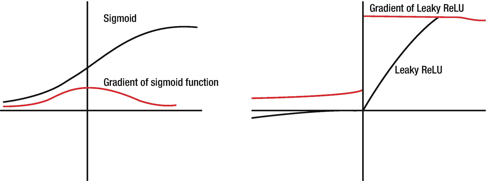

图 7-1

消失梯度是我们在深度神经网络中面临的一个挑战。左图显示，对于 sigmoid 激活函数，我们确实面临着一个大问题，即如何对泄漏 ReLU 进行排序

挑战可能是有时这个更新变得太小，因此权重没有得到更新。这导致很少或者实际上没有网络训练。这被称为消失梯度问题。

现在让我们深入了解一下这个问题。我们再次关注图 [7-2](#Fig2) 中的基本网络架构。

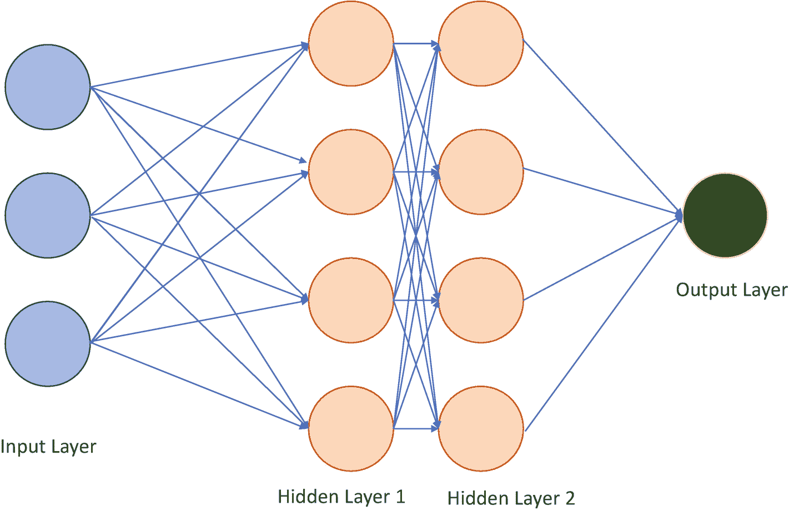

图 7-2

具有输入层、隐藏层和输出层的基本神经架构

我们知道网络中的每个神经元都有一个激活函数和一个偏置项。它接受有限数量的输入权重乘积，向其添加偏差项，然后对其应用激活函数。然后输出被传递到下一个神经元。

我们还知道，在网络中，预期输出和预测值之间的差异是通过计算得出的，这只是一个误差项。我们希望误差项最小化。当我们在各层和神经元之间实现了使误差最小化的权重和偏差的最佳组合时，误差将被最小化。

计算误差时，在误差函数图上应用梯度下降。这种梯度下降是误差函数相对于其中存在的每个独立变量(权重和偏差)的微分。这是反向传播算法的工作——它通过一个称为学习率的常数项来处理这些权重和偏差。这是从最后一层到第一层反向或从右到左完成的。在每次连续迭代中，计算梯度下降并确定变化方向。因此，权重和偏差被更新，直到网络最小化误差，或者，换句话说，直到误差达到如图 [7-3](#Fig3) 所示的*全局最小值*。因此，误差梯度是在网络训练期间计算的方向和幅度。它用于在正确的方向和正确的幅度上更新权重。

Article 25 [Innovation Evaluation Mechanism] Professional backbones with outstanding contributions, especially top-notch young and middle-aged talents, can apply for corresponding professional titles without being restricted by academic qualifications and tenure. The rated personnel who have won the national science and technology award, as well as all kinds of professionals who have made outstanding contributions in promoting the economic construction and social development of eco-cities, can leapfrog to declare their titles.

图 7-3

为了最小化损失，我们希望达到函数的全局最小值。有时，我们可能无法将损失最小化，并且会陷入局部最小值

现在出现了一种情况，如果我们有一个非常深的网络，与网络的最终层相比，初始层对最终输出的影响非常小。或者换句话说，初始层经历很少的训练，并且它们的值经历很少的变化。这是因为反向传播使用从最终层到初始层的链式规则来计算梯度。因此，在 n 层网络中，梯度随着 n 的值呈指数下降，因此初始层将训练得非常慢。或者，在最坏的情况下，他们会停下来训练。

可以有多种迹象来检查消失梯度问题:

1.  检测消失梯度最简单的方法是通过核权重分布。如果权重趋于零或者非常非常接近零，我们可能会遇到一个渐变消失的问题。

2.  与初始层相比，靠近最终层的模型权重将有更多变化。

3.  该模型在训练阶段不会改进或者改进非常缓慢。

4.  有时候，训练会提前结束。这意味着任何进一步的训练都不会改进模型。

消失梯度问题有几个建议的解决方案:

1.  通常，减少网络中的层数可能有助于解决梯度问题。但与此同时，如果层数减少，网络的复杂性就会降低，这也会影响网络的性能。

2.  ReLU 激活函数解决了渐变消失的问题。与 tanh 或 sigmoid 激活函数相比，ReLU 较少受到消失梯度的影响。

3.  剩余网络或 ResNets 也是这个问题的解决方案之一。他们没有通过保存梯度流来解决问题；相反，他们使用多个小型网络的组合或集合。因此，尽管是深层网络，但与浅层网络相比，ResNets 能够实现较小的损耗。

一方面，我们有一个消失梯度问题，而另一方面，我们有一个爆炸梯度问题。

在深层网络中，误差梯度有时会随着累积而变得非常大。因此，网络中的更新将非常大，这使得网络不稳定。有一些爆炸梯度的迹象可以帮助我们检测爆炸梯度:

1.  该模型在训练阶段损失惨重。

2.  在算法的训练过程中，我们可能会因为损失或权重而遇到 NaN。

3.  该模型通常是不稳定的，或者换句话说，在随后的迭代中对 loss 的更新是巨大的，这指示了不稳定的状态。

4.  对于网络中的每一层和神经元，误差梯度总是大于 1。

分解渐变可以使用

1.  我们可以减少网络的层数，或者在训练过程中减少批量。

2.  可以添加 L1 和 L2 权重正则化，这将作为网络损失函数的惩罚。

3.  *渐变裁剪*是可以使用的方法之一。我们可以在训练过程中限制梯度的大小。我们为误差梯度设置一个阈值，如果误差梯度超过阈值，误差梯度被设置为该极限或*削波*。

4.  如果我们正在研究循环神经网络，我们可以使用 LSTM(长短期记忆)。这个概念超出了本书的范围。

消失梯度和爆炸梯度都是会影响网络性能的麻烦事。它们会使网络不稳定，需要使用前面提到的几种方法进行校正。现在我们清楚了消失渐变，我们将在下一节详细研究 ResNet 架构。

## 7.5 ResNet 架构

在前几章中，我们已经学习了很多架构。我们已经将它们用于图像分类、物体检测、人脸识别等等。它们是深度神经网络，为我们带来了良好的结果。但是在非常深的网络中，我们会遇到梯度消失的问题。剩余网络或*剩余网络*通过使用跳过连接来解决这个问题。ResNets 由、何、、任和发明，论文于 2015 年 12 月发表。更多详情请见 [`https://arxiv.org/pdf/1512.03385.pdf`](https://arxiv.org/pdf/1512.03385.pdf) 。

跳跃连接将激活从网络中的一层进行到更深的层，这允许我们训练甚至更深的网络，其可能超过 100 层。现在，我们将在下一节详细讨论 ResNet 和 skip 连接。

### 7.5.1 ResNet 和 skip 连接

当我们谈论神经网络和它们所表现出的神奇性能时，它立即被归因于网络的*深度*。假设网络越深，精度越好。初始层将学习基本功能，更深的层将学习更高级的功能。

但是人们发现，通过增加更多的层数，我们正在增加网络的复杂性。事实上，对于更深的网络(如 56 层深)，损耗大于少于(20)层的网络。

Note

通常，使用 16 到 30 之间的卷积和全连接层的模型为 CNN 提供了最好的结果。

这种损失可以归因于我们前面讨论的消失梯度问题。为了解决渐变消失的问题，引入了残差块，如图 [7-4](#Fig4) 所示。剩余块实现*跳过连接*或身份映射。

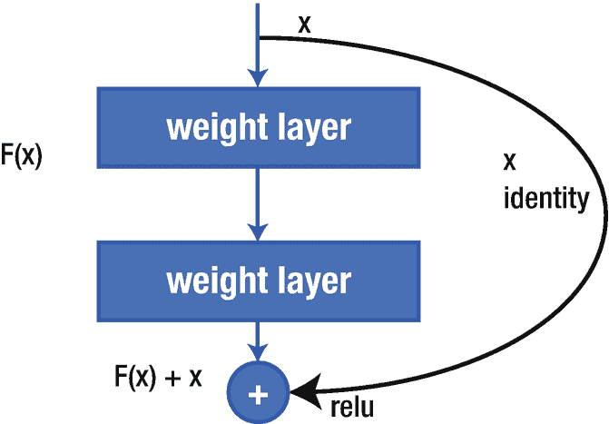

图 7-4

跳过连接是剩余网络的核心。请注意上一层的输出是如何传递到下一层的，从而跳过了中间的一层。它允许训练更深的网络，而没有消失梯度的问题

此标识映射本身没有输入参数；相反，它将前一层的输出添加到下一层。换句话说，它在第二次激活之前充当快捷连接。由于这种捷径，有可能在不降低网络性能的情况下训练甚至更深的网络。这是解决方案的核心，也是它取得巨大成功的原因。

我们现在正在图 [7-5](#Fig5) 中详细检查 ResNet-34 架构。原架构摘自论文链接: [`https://arxiv.org/pdf/1512.03385.pdf`](https://arxiv.org/pdf/1512.03385.pdf) 。

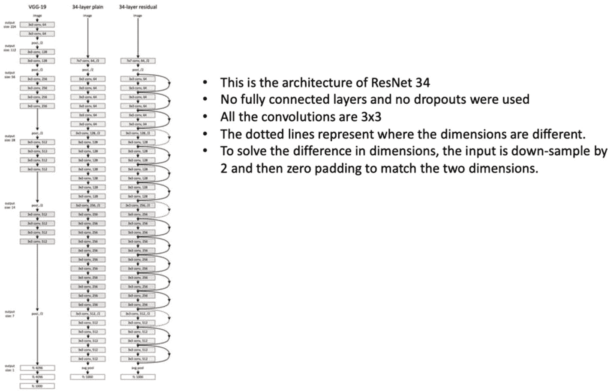

图 7-5

ResNet-34 完整架构–中间是一个没有跳过连接的普通网络，而右边显示的是一个有剩余连接的网络。该架构摘自位于[https://arxiv . org/pdf/1512 . 03385 . pdf](https://arxiv.org/pdf/1512.03385.pdf)的原始论文

让我们更深入地了解一下网络。观察架构中的四个剩余模块，如图 [7-6](#Fig6) 所示。

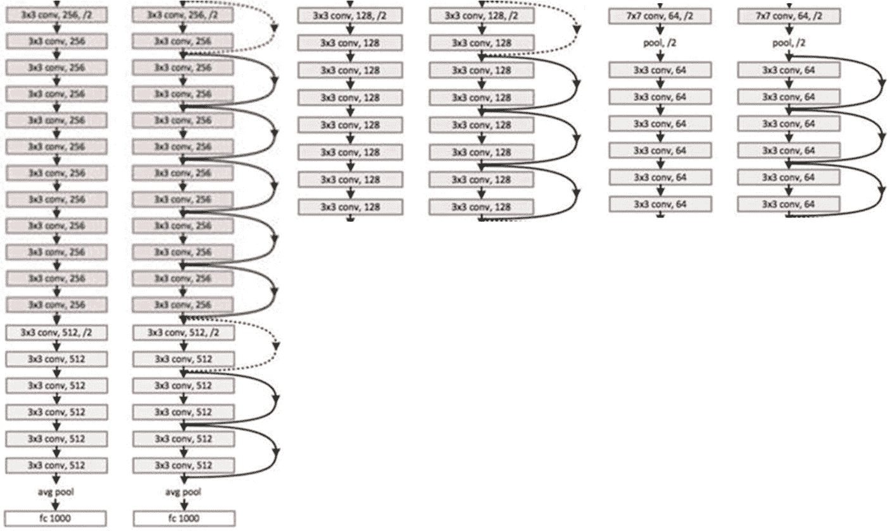

图 7-6

图中示出了四个剩余块。请注意，对于左侧的每个普通网络，我们都有一个使用跳过连接的相应模块。允许跳过连接来训练更深的网络，而不会对网络的准确性产生不利影响。例如，对于第一个数据块，我们有一个 7x7 conv 层和 3x3 conv 层的平面网络。注意使用跳过连接的相应块

我们可以分析，在每个剩余架构中，skip connection 都是从上一层获取输出，并在两个街区之外共享。这是与左边简单架构的核心区别，它提高了 ResNet 的性能。

跳过连接以一种非常有趣的方式扩展了深层网络的能力。发明人在 CIFAR 数据集上测试了具有 100 层和 1000 层的网络。发明人发现，使用残差网络的集合能够在 ImageNet 上实现 3.57%的错误率，并因此在 ILSVRC2015 竞赛中获得第一名。

ResNet 的其他变体也越来越受欢迎，如 ResNetXt、DenseNet 等等。这些变体探索了可以对原始 ResNet 架构进行的更改。例如，ResNetXt 引入了基数作为模型的超参数之一。我们在本章末尾为感兴趣的读者列出了研究论文。

我们现在将了解另一个创新的架构，称为初始网络。

### 初始网络

当涉及到复杂任务时，深度学习是非常棒的。我们已经观察到，使用堆叠卷积层，我们能够训练深度网络。但是它也有一些挑战:

1.  网络变得过于复杂，需要巨大的计算能力。

2.  训练网络时会遇到消失和爆炸梯度问题。

3.  很多时候，在观察训练和测试准确性时，网络会过度拟合，因此对看不见的数据集没有用。

4.  此外，选择最佳内核大小是一个艰难的决定。选择不好的内核大小会导致不合适的结果。

为了解决面临的挑战，研究人员想，为什么我们不能去*宽*而不是去*深*。从技术上讲，让多种尺寸的过滤器在同一水平上运行。因此 Szegedy 等人提出了*初始模块*。完整论文可在此处查阅: [`https://arxiv.org/pdf/1409.4842v1.pdf`](https://arxiv.org/pdf/1409.4842v1.pdf) 。

图 [7-7](#Fig7) 代表了在同一篇论文中出现的两个版本的初始模块。

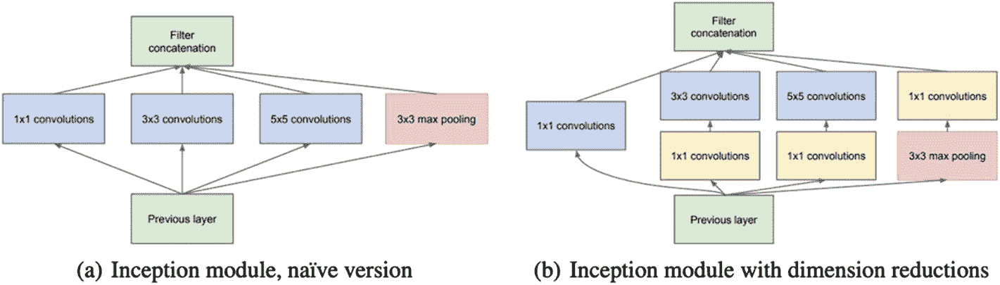

图 7-7

在左边，我们有初始模块的天真版本。在原始版本中，我们有 1x1、3x3 和 5x5 卷积。为了减少计算量，研究人员添加了一个 1x1 的 conv 层来降维。图片取自[https://arxiv . org/pdf/1409 . 4842 v1 . pdf](https://arxiv.org/pdf/1409.4842v1.pdf)

在第一个版本中，一个天真的版本，完成了三个不同大小的卷积 1x1，3x3 和 5x5。此外，还建议了 3x3 的最大池。所有相应的输出然后被堆叠并馈送到下一个初始模块。

但随着计算成本的增加，研究人员增加了额外的 1x1 卷积层进行降维。这限制了输入通道的数量，并且 1x1 的计算开销比 3x3 或 5x5 低。一个显著的特征是 1x1 卷积在最大池层之后。

使用第二个版本的维度缩减，创建了一个完整的网络，称为 *GoogLeNet* 。研究人员选择这个名字是为了向开创 LeNet-5 架构的 Yann LeCuns 致敬。

在我们深入研究 GoogLeNet 架构之前，有必要讨论一下 1x1 卷积的唯一性。

#### 7.5.2.1 1x1 卷积

在深度网络中，特征地图的数量随着网络的深度而增加。因此，如果输入图像有三个通道，并且必须应用 5x5 滤镜，则 5x5 滤镜将应用于 5x5x3 的块中。此外，如果输入是来自深度为 64 的另一个卷积层的特征地图块，则将在 5x5x64 块中应用 5x5 过滤器。这变成了一个计算上具有挑战性的任务。1x1 滤波器有助于解决这一难题。

1x1 卷积也被称为*网络中的网络*。理解和实现起来非常简单。它具有输入中每个通道的单一特征或权重。类似于任何其他过滤器，输出也是一个单一的数字。它可在网络中的任何地方使用，不需要任何填充，并且生成的要素地图的宽度和高度与输入完全相同。

如果 1x1 卷积中的通道数与输入图像中的通道数相同，则输出也必然包含相同数量的 1x1 滤波器。在这里，1x1 充当非线性函数。如图 [7-8](#Fig8) 所示。

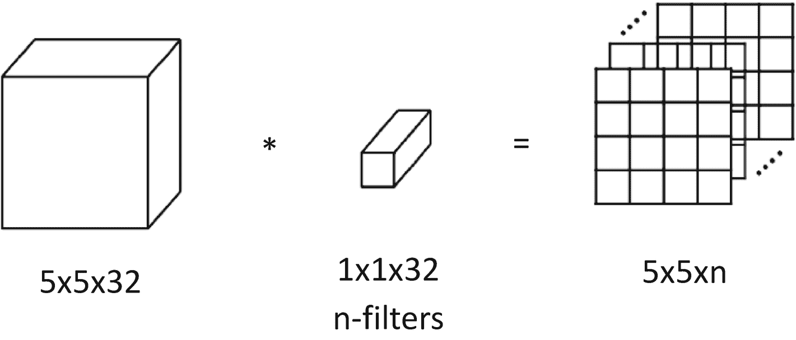

图 7-8

1x1 卷积层用于缩减信道数量。这里，输入中的通道数和 1x1 块中的通道数相同。因此，输出的通道数量与 1x1 滤波器的数量相同

因此，当我们想要减少通道数量或执行任何特征变换时，1x1 卷积非常有用。这导致计算成本的降低。1x1 用于许多深度学习架构，如 ResNet 和 Inception。我们现在将继续与盗梦空间网络的讨论。

### 谷歌网络架构

我们在上一节讨论了创建 GoogLeNet 的动机。完整的 GoogLeNet 架构如图 [7-9](#Fig9) 所示。蓝色方块代表卷积，红色代表池化，黄色代表 softmax，绿色代表其他。

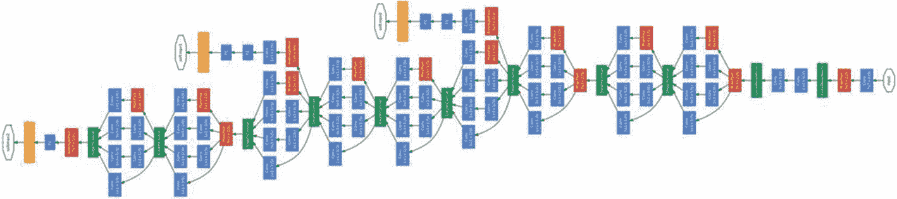

图 7-9

完整的 GoogLeNet 架构。这里，蓝色表示卷积，红色模块是池模块，而黄色是 softmax 模块。稍后我们将放大其中一个部分。图片取自[https://arxiv . org/pdf/1409 . 4842 v1 . pdf](https://arxiv.org/pdf/1409.4842v1.pdf)

网络有几个重要的属性:

1.  初始网络由初始模块的级联块组成。

2.  有九个线性堆叠的初始模块。

3.  在不同的位置有三个 softmax 分支(图 [7-9](#Fig9) 中的黄色部分)。在这三个分类器中，两个位于网络的中间部分，作为辅助分类器。它们确保中间特征有利于网络学习并给出正则化效果。

4.  两个 softmax 计算辅助损耗。净损失是辅助损失和真实损失的加权损失。辅助损失在训练期间是有用的，并且不被考虑用于最终分类。

5.  它有 27 层(22 层+ 5 个池层)。

6.  网络中有接近 500 万个参数。

我们现在放大网络中的一个裁剪版本，以便更好地检查网络(图 [7-10](#Fig10) )。请注意 softmax 分类器(显示在黄色块中)是如何添加的，以解决渐变消失和过度拟合的问题。最终损耗是辅助损耗和网络真实损耗的加权损耗。


图 7-10

《盗梦空间》网络部分的放大版本。请注意 softmax 分类器是如何添加的(显示为黄色)

Inception v1 被证明是一个很好的解决方案，它在 ILSVRC2014 中获得了第一名，并拥有 6.67%的前 5 名错误率。

但是研究人员并没有就此止步。他们通过提出 Inception v2 和 Inception v3 进一步改进了解决方案，我们接下来将讨论这两个版本。

### 7 . 5 . 4 Inception v2 的改进

《盗梦空间》第二版和第三版在下面的文章中讨论过: [`https://arxiv.org/pdf/1512.00567v3.pdf`](https://arxiv.org/pdf/1512.00567v3.pdf) 。动机是提高准确性，降低模型的复杂性，从而降低计算成本。

在 Inception v2 中，有以下改进:

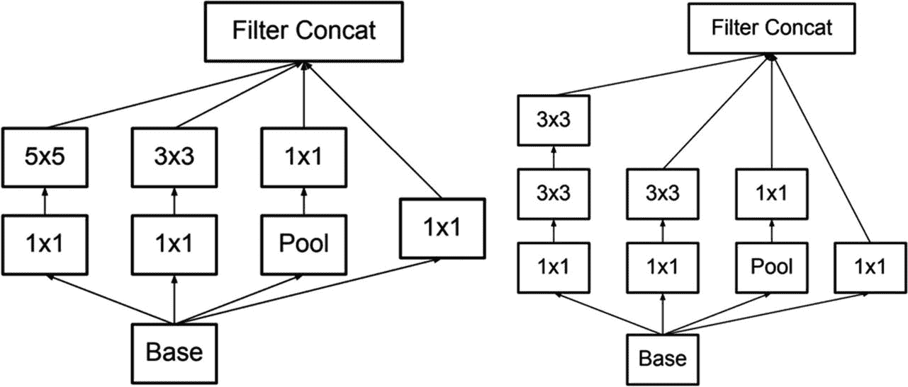

图 7-11

将 5×5 卷积因式分解成两个 3×3 的块，提高了计算速度和解决方案的整体精度。图片取自[https://arxiv . org/pdf/1512 . 00567 v3 . pdf](https://arxiv.org/pdf/1512.00567v3.pdf)

1.  5x5 卷积被分解为两个 3x3 卷积。这样做是为了提高计算速度，从而增强性能。如图 [7-11](#Fig11) 所示。在左边的图中，我们有原始的 Inception 模块，右边的是修改后的 Inception 模块。


图 7-12

请注意 nxn conv 如何表示为 1xn 和 nx1。比如我们设 n=5，那么 5x5 就变成了 1x5 和 5x1。图片取自[https://arxiv . org/pdf/1512 . 00567 v3 . pdf](https://arxiv.org/pdf/1512.00567v3.pdf)

1.  第二项改进是对卷积进行因式分解，从而将 nxn 大小的滤波器改为 1xn 和 nx1 的组合，如图 [7-12](#Fig12) 所示。比如 5x5 改为先执行 1x5，再执行 5x1。这进一步提高了计算效率。

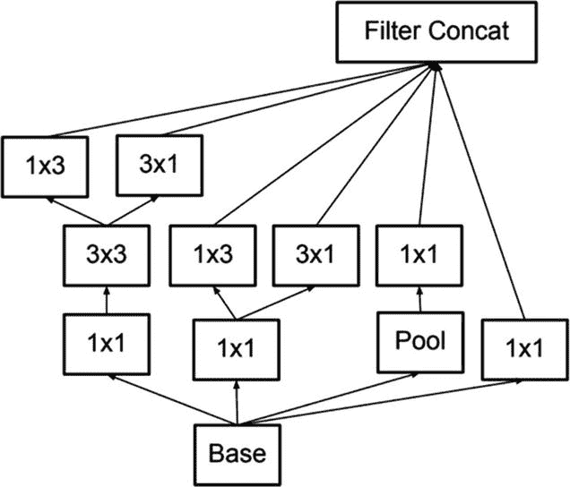

图 7-13

模型被做得更宽而不是更深。随着深度的增加，维度急剧减少，这是一种信息损失。图片取自[https://arxiv . org/pdf/1512 . 00567 v3 . pdf](https://arxiv.org/pdf/1512.00567v3.pdf)

1.  随着深度的增加，尺寸减小，因此可能会丢失信息。因此，建议将滤波器组做得更宽，而不是更深，如图 [7-13](#Fig13) 所示。

研究人员引用了:

虽然我们的网络有 42 层，但我们的计算成本只比 GoogLeNet 高 2.5 倍，而且仍然比 VGGNet 高效得多。

向前看，在 Inception v3 中，除了前面的改进之外，重要的增加是标签平滑的使用，这是一种解决过度拟合的正则化技术。数学证明超出了本书的范围。此外，RMSProp 被用作优化器，并且辅助分类器的全连接层被批量归一化。它在四个模型的集合上实现了 3.58%的 top-5 误差，这几乎是原始 GoogLeNet 模型的一半。

在 Inception v4 和 Inception-ResNet 的形式上有了进一步的改进。它的性能优于以前的版本，3x exception-ResNet(v2)和 1xInceptionv4 的组合导致了 3.08%的 top-5 错误。

至此，我们已经完成了关于初始网络的讨论。

当涉及到真正深度的神经网络时，Inception 和 ResNet 都是使用最广泛的网络之一。使用迁移学习，它们可以用来产生奇妙的结果，并被证明是计算机视觉问题的真正福音。

我们现在将继续研究本章开始时提出的视频分析问题。

## 7.6 视频分析

视频分析从处理视频开始。正如我们可以通过我们的眼睛看到并使用我们的记忆和大脑处理视频内容一样，计算机也可以通过摄像头看到。而要理解那个视频的内容，深度学习正在提供必要的支持。

视频是丰富的信息来源，但同时也同样复杂。在图像分类中，我们获取输入图像，使用 CNN 对其进行处理以提取特征，然后基于特征对图像进行分类。在视频分类的情况下，我们首先从视频中提取帧，然后对帧进行分类。所以，视频处理不是一项任务；相反，它是子任务的集合。OpenCV 是最流行的视频分析库之一。我们将使用基于深度学习的视频分析解决方案。

使用深度学习进行视频分类的步骤是

1.  我们首先从视频中获取帧，并将它们分成训练集和验证集。

2.  然后，我们根据训练数据训练网络，并优化精确度。

3.  我们将在验证数据集上进行验证，以获得最终模型。

4.  对于看不到的新视频，我们会先从视频中抓取帧，然后进行同样的分类。

正如我们所见，这些步骤与任何图像分类解决方案都非常相似。额外的步骤是针对新视频——我们首先抓取一帧，然后对其进行分类。

在下一节中，我们将使用 Inception v3 和 ResNet 创建一个视频分类解决方案。

## 7.7 使用 ResNet 和 Inception v3 的 Python 解决方案

现在，我们将为视频分析创建一个 Python 解决方案。为此，我们将在体育数据集上训练一个网络，并使用它来预测视频文件。

您可以从 [`https://github.com/jurjsorinliviu/Sports-Type-Classifier`](https://github.com/jurjsorinliviu/Sports-Type-Classifier) 下载数据集。该数据集包含多种运动类型的图像。我们将为板球、曲棍球和象棋建立一个分类器。数据集和代码在[https://GitHub . com/a press/computer-vision-using-deep-learning/tree/main/chapter 7](https://github.com/Apress/computer-vision-using-deep-learning/tree/main/Chapter7)上传到 GitHub repo。

板球、曲棍球和象棋图像的一些例子如下所示。


步骤 1:加载所有需要的库。

```py
import matplotlib

from tensorflow.keras.preprocessing.image import ImageDataGenerator
from tensorflow.keras.optimizers import SGD
from sklearn.preprocessing import LabelBinarizer
from tensorflow.keras import optimizers
from sklearn.model_selection import train_test_split
from sklearn.metrics import classification_report
from tensorflow.keras.layers import AveragePooling2D
from tensorflow.keras.applications import InceptionV3
from tensorflow.keras.layers import Dropout
from tensorflow.keras.layers import Flatten
from tensorflow.keras.layers import Dense
from tensorflow.keras.layers import Input
from tensorflow.keras.models import Model
from imutils import paths
import matplotlib.pyplot as plt
import numpy as np
import cv2
import os

```

第二步:为我们感兴趣的运动设置标签。

```py
game_labels = set(["cricket", "hockey", "chess"])

```

步骤 3:设置其他变量的值，如位置、路径等。我们还将启动两个列表——complete _ data 和 complete _ label——它们将在稍后阶段用于保存值。

```py
location = "/Users/vaibhavverdhan/BackupOfOfficeMac/Book/Restart/Apress/Chapter7/Sports-Type-Classifier-master/data"
data_path = list(paths.list_images(location))
complete_data = []
complete_labels = []

```

步骤 4:现在加载运动数据集，并读取它们对应的标签。输入大小是 299x299，因为我们首先训练一个 Inception v3。对于 ResNet，大小为 224x224。

```py
for data in data_path:
    # extract the class label from the filename
    class_label = data.split("/")[-2]
    if class_label not in game_labels:
        #print("Not used class lable",class_label)
        continue
    #print("Used class lable",class_label)
    image = cv2.imread(data)
    image = cv2.cvtColor(image, cv2.COLOR_BGR2RGB)
    image = cv2.resize(image, (299, 299))

    complete_data.append(image)
    complete_labels.append(class_label)

```

步骤 5:将标签转换成 numpy 数组。

```py
complete_data = np.array(complete_data)
complete_labels = np.array(complete_labels)

```

步骤 6:现在标签的一键编码完成了。

```py
label_binarizer = LabelBinarizer()
complete_labels = label_binarizer.fit_transform(complete_labels)

```

第七步:将数据分为 80%的训练数据和 20%的测试数据。

```py
(x_train, x_test, y_train, y_test) = train_test_split(complete_data, complete_labels,
    test_size=0.20, stratify=complete_labels, random_state=5)

```

步骤 8:我们现在将为训练数据初始化数据扩充对象。

```py
training_augumentation = ImageDataGenerator(
    rotation_range=25,
    zoom_range=0.12,
    width_shift_range=0.4,
    height_shift_range=0.4,
    shear_range=0.10,
    horizontal_flip=True,
    fill_mode="nearest")

```

步骤 9:我们现在正在初始化测试数据扩充对象。接下来，我们定义每个对象的 ImageNet 平均差值。

```py
validation_augumentation = ImageDataGenerator()

mean = np.array([122.6, 115.5, 105.9], dtype="float32")
training_augumentation.mean = mean
validation_augumentation.mean = mean

```

步骤 10:现在加载初始网络。这个模型将作为基础模型。

```py
inceptionModel = InceptionV3(weights="imagenet", include_top=False,
    input_tensor=Input(shape=(299, 299, 3)))

```

第 11 步:我们现在将制作模型的头部，它将被放置在基础模型的顶部。

```py
outModel = inceptionModel.output
outModel = AveragePooling2D(pool_size=(5, 5))(outModel)
outModel = Flatten(name="flatten")(outModel)
outModel = Dense(512, activation="relu")(outModel)
outModel = Dropout(0.6)(outModel)
outModel = Dense(len(label_binarizer.classes_), activation="softmax")(outModel)

```

步骤 12:我们得到最终的模型，并使基础模型层成为不可训练的。

```py
final_model = Model(inputs=inceptionModel.input, outputs=outModel)
for layer in inceptionModel.layers:
    layer.trainable = False

```

步骤 13:我们已经在最后几章中详细学习了剩余的步骤，这些步骤是关于设置超参数和拟合模型的。

```py
num_epochs = 5
learning_rate = 0.1
learning_decay = 1e-6
learning_drop = 20
batch_size = 32
sgd = optimizers.SGD(lr=learning_rate, decay=learning_decay, momentum=0.9, nesterov=True)
final_model.compile(loss='categorical_crossentropy', optimizer=sgd,metrics=['accuracy'])
model_fit = final_model.fit(
    x=training_augumentation.flow(x_train, y_train, batch_size=batch_size),
    steps_per_epoch=len(x_train) // batch_size,
    validation_data=validation_augumentation.flow(x_test, y_test),
    validation_steps=len(x_test) // batch_size,
    epochs=num_epochs)

```


步骤 14:我们得到训练/测试的准确度和损失。

```py
import matplotlib.pyplot as plt
f, ax = plt.subplots()
ax.plot([None] + model_fit.history['acc'], 'o-')
ax.plot([None] + model_fit.history['val_acc'], 'x-')
ax.legend(['Train acc', 'Validation acc'], loc = 0)
ax.set_title('Training/Validation acc per Epoch')
ax.set_xlabel('Epoch')
ax.set_ylabel('acc')

import matplotlib.pyplot as plt
f, ax = plt.subplots()
ax.plot([None] + model_fit.history['loss'], 'o-')
ax.plot([None] + model_fit.history['val_loss'], 'x-')
ax.legend(['Train loss', 'Validation loss'], loc = 0)
ax.set_title('Training/Validation loss per Epoch')
ax.set_xlabel('Epoch')
ax.set_ylabel('Loss')

predictions = model_fit.model.predict(testX)
from sklearn.metrics import confusion_matrix
import numpy as np
rounded_labels=np.argmax(testY, axis=1)
rounded_labels[1]
cm = confusion_matrix(rounded_labels, np.argmax(predictions,axis=1))
def plot_confusion_matrix(cm):
    cm = [row/sum(row)   for row in cm]
    fig = plt.figure(figsize=(10, 10))
    ax = fig.add_subplot(111)
    cax = ax.matshow(cm, cmap=plt.cm.Oranges)
    fig.colorbar(cax)
    plt.title('Confusion Matrix')
    plt.xlabel('Predicted Class IDs')
    plt.ylabel('True Class IDs')
    plt.show()
plot_confusion_matrix(cm)

```


我们可以分析出网络对于预测来说不够好。

步骤 15:我们现在将实现 ResNet。输入大小更改为 224x224，一切保持不变。我们也在改变体育课。

```py
game_labels = set(["cricket", "swimming", "wrestling"])

```

步骤 16:完整的代码在 GitHub 链接中。我们在这里提供输出。

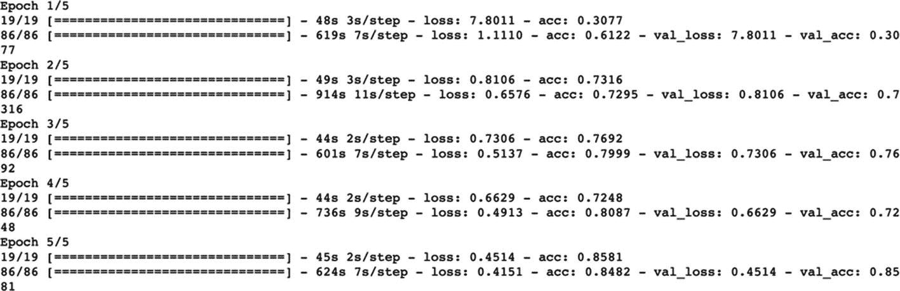

该算法产生了 85.81%的良好验证准确度。


该模型被保存，然后我们使用它对一个样本图像进行预测，以检查它是否能够预测。

```py
model_fit.model.save("sport_classification_model.h5")

```

步骤 17:我们已经在前面的章节中介绍了这些步骤。

```py
file = open("sport_classification", "wb")
file.write(pickle.dumps(label_binarizer))
file.close()
modelToBeUsed = load_model("sport_classification_model.h5")
labels = pickle.loads(open("sport_classification", "rb").read())
import numpy as np
from keras.preprocessing import image
an_image =image.load_img('/Users/vaibhavverdhan/BackupOfOfficeMac/Book/Restart/Apress/Chapter7/Sports-Type-Classifier-master/data/cricket/00000000.jpg',target_size =(224,224))# Load the image
# The image is now getting converted to array of numbers
an_image =image.img_to_array(an_image)
#Let us now expand it's dimensions. It will improve the prediction power
an_image =np.expand_dims(an_image, axis =0)
# call the predict method here
verdict = modelToBeUsed.predict(an_image)
i = np.argmax(verdict)
label = labels.classes_[i]

```

步骤 18:我们现在将使用这个模型从一个运动的视频中预测类别。我们拍了一段板球录像。GitHub 上也有同样的视频。

步骤 19:捕捉对象中的视频。

```py
video = cv2.VideoCapture(path_video)

```

步骤 20:我们将迭代视频的所有帧。为此，我们将设置一个指标 isVideoGrabbed 为 1。当视频结束时，isVideoGrabbed 将变为零，然后我们可以从循环中断开。

我们在 while 循环中循环。当一个帧被抓取时，它是一个图像，因此被转换成必要的大小，并馈入模型进行预测。

```py
isVideoGrabbed = 1
while isVideoGrabbed:
    (isVideoGrabbed, video_frame) = video.read()

    if not isVideoGrabbed:
        print("done")
        break

    video_frame = cv2.cvtColor(video_frame, cv2.COLOR_BGR2RGB)
    video_frame = cv2.resize(video_frame, (224, 224)).astype("float32")
    video_frame -= mean
    prediction_game = modelToBeUsed.predict(np.expand_dims(video_frame, axis=0))[0]
    i = np.argmax(verdict)
    game = labels.classes_[i]
    #print(game)

```

步骤 21:因此，我们可以逐帧生成整个视频的预测。通过这种方式，我们可以使用神经网络来查看视频，并预测视频中正在进行的运动。

Note

预测有时会有一些模糊之处。我们可以通过采用对帧进行的所有预测的模式来改进最终预测。

这就结束了我们使用 ResNet 和 Inception v3 网络的 Python 解决方案。正如我们所观察到的，使用迁移学习，利用这些非常深的神经网络的能力并不是一个很大的挑战。但是创建一个优化的解决方案仍然是一项艰巨的工作。在前面的例子中，我们可以分析 ResNet 和 Inception v3 网络各自精度之间的差异。这取决于数据集和可用图像的数量。

至此，我们完成了 Python 解决方案的实现。我们现在可以进入总结部分。

## 7.8 摘要

视频是连续的图像帧，也是娱乐的重要来源。随着技术领域的进步，更小更轻的相机，智能手机中相机的集成，以及社交媒体的渗透，大量的视频正在被创建。深度学习架构提供了很大的灵活性来分析它们并产生见解。但是，与图像相比，视频分析的探索仍然较少。视频是声音和图像的结合。这一领域仍有很大的发展空间。深度学习架构正在推动边界的发展。

深度学习架构越来越深入。而且有一个误区，认为网络越深，性能越好。随着深度的增加，复杂程度也会增加。维度减少，这是信息的损失。网络可能会开始超载。因此，当前需要新颖和创新的解决方案。有时，不同的想法会提供更可靠的解决方案。

本章考察了两个重要的网络——ResNet 和 Inception。这两个网络都非常创新，并增强了功能。我们研究了这些网络的结构和创新性质。这些网络因其卓越的性能而被广泛使用。

在本章中，我们还学习了视频分析和视频处理的概念。我们使用 ResNet 和 Inception v3 网络创建了一个 Python 解决方案。通过使用预先训练的权重来使用迁移学习。

在下一章，也是本书的最后一章，我们将讨论开发深度学习解决方案的整个过程。它还分析了我们面临的问题、解决方案以及遵循的最佳实践。相当重要的一个！

你现在可以进入练习部分。

Review Exercises

Q1。跳过连接的目的是什么？它们有什么用处？

Q2。渐变消失的问题是什么，怎么整改？

Q3。Inception v1 和 Inception v3 网络有什么改进？

Q4。使用 VGG 和 AlexNet 来解决我们在本章中解决的运动分类问题，并比较网络之间的性能。

Q5。从 [`www.tensorflow.org/datasets/catalog/ucf101`](https://www.tensorflow.org/datasets/catalog/ucf101) 获取视频数据集。数据集有 101 个不同的类；使用它来执行分类。

Q6。从 [`www.ino.ca/en/technologies/video-analytics-dataset/`](https://www.ino.ca/en/technologies/video-analytics-dataset/) 获取 INO 传感器数据集。它同时具有彩色和热图像。使用 ResNet 开发分类算法。

### 进一步阅读

1.  浏览以下链接中的论文:
    1.  【密集连接的卷积网络】: [`https://ieeexplore.ieee.org/document/8099726`](https://ieeexplore.ieee.org/document/8099726)

    2.  “用于大规模图像识别的极深度卷积网络”: [`https://arxiv.org/abs/1409.1556`](https://arxiv.org/abs/1409.1556)

    3.  《深层剩余网络中的身份映射》: [`https://arxiv.org/abs/1603.05027`](https://arxiv.org/abs/1603.05027)

    4.  “辍学:防止神经网络过拟合的简单方法”: [`https://jmlr.org/papers/volume15/srivastava14a/srivastava14a.pdf`](https://jmlr.org/papers/volume15/srivastava14a/srivastava14a.pdf)