# 一、机器学习工具包

在本章中，我们将探讨以下主题:

*   安装 Docker
*   构建机器学习 Docker 文件
*   在您的主机和 Docker 容器之间来回共享数据
*   构建一个 REST 服务，它使用在 Docker 容器中运行的机器学习基础设施


# 安装 Docker

我们需要下载 Docker 来安装它，在这一节中，您将看到我们如何在 Windows 上安装 Docker，并使用一个适合在 Linux 上安装的脚本。

让我们安装来自 https://www.docker.com/的 Docker。完成这项工作的最快方法是直接看菜单。在这里，我们将选择下载 Windows 版本。点击它，这将把你带到 Docker 商店，在那里你可以为你的平台下载特定的安装程序，如下面的截图所示:

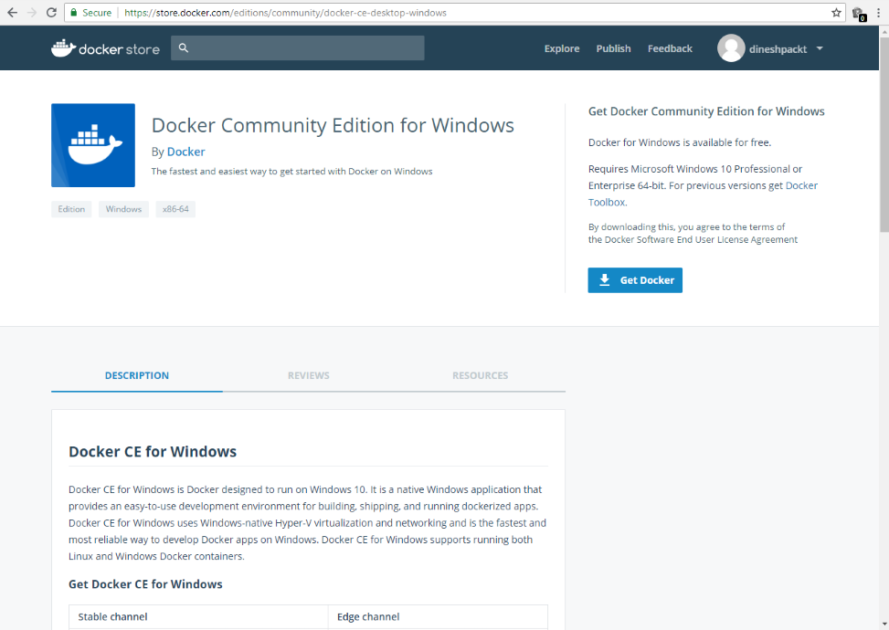

坞站安装程序窗口

这里所有的平台都有。我们只需下载 Windows 版的 MSI。它下载相对较快，一旦它在你的电脑上，你只需点击 MSI 安装程序，它将迅速继续。

在 Ubuntu 上安装最好使用脚本。因此，我提供了一个示例安装脚本(`install-docker.sh`)，它将更新您的本地包管理器，指向官方的 Docker 发行库，然后简单地使用应用来完成安装。

在 Linux 上安装 Docker 非常简单:只需运行我提供的`install-docker` shell 脚本。这些软件包将会更新、下载，然后安装。当你到达它的末尾时，你只需要输入`docker --help`来确保所有的东西都被安装了:

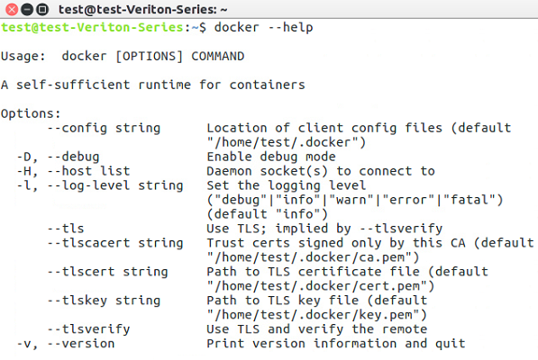

输出—docker - help 命令

现在，对于 GPU 支持，这将使你的 Keras 和 TensorFlow 模型运行得更快，有一个名为`nvidia-docker`的特殊版本，它将 Ubuntu 上的设备暴露给你的 Docker 容器，以允许 GPU 加速。这也有一个安装脚本(`install-nvidia-docker.sh`)。现在，假设你有一个真正的 NVIDIA 显卡，你可以用 NVIDIA Docker 代替 Docker。

这里，我们正在运行一个使用 NVIDIA SMI 的测试命令，它实际上是一个状态程序，向您显示您计算机上的 GPU 状态:


gps 状态

你可以看到，我们的泰坦 X 完全暴露在 Docker 下。安装 Docker 是一个相对简单的操作。

在下一节中，我们将看看如何创作一个 Docker 文件来建立一个完整的机器学习环境。


# 机器学习 Docker 文件

现在，让我们开始准备机器学习 Docker 文件。在本节中，我们将了解克隆源文件、Docker 所需的基本映像、安装额外的必需包、公开一个卷以便您可以共享您的工作，以及公开端口以便您可以看到 Jupyter 笔记本，这是我们将用来探索机器学习的工具。

现在，您需要获得这些部分附带的源代码。前往[https://github.com/wballard/kerasvideo/tree/2018](https://github.com/wballard/kerasvideo/tree/2018)，在那里您可以快速克隆存储库。在这里，我们只是使用 GitHub for Windows 作为一种相对快速的方法来克隆这个库，但是您可以以任何您喜欢的方式使用 Git。你把这些文件放在什么目录下并不重要；我们只是把它们下载到本地工作目录中。然后，我们将使用这个位置作为开始构建实际 Docker 容器的地方。

在克隆存储库中，查看 Docker 文件:


Docker 文件代码

这是我们将用来创造我们的环境。我们从具有 CUDA 和 cuDNN 驱动程序的基础 NVIDIA 映像开始，这将在未来支持 GPU。现在，在下一节中，我们将更新容器上的包管理器，以确保我们有更新的`git`和`wget`图形包，以便我们能够在笔记本上绘制图表:

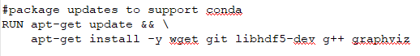

Docker 文件代码

现在，我们将安装 Anaconda Python。我们从互联网上下载它，然后作为一个 shell 脚本运行，这将把 Python 放在机器上。完事之后我们会收拾干净的。

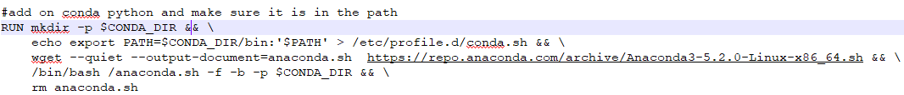

Docker 文件代码

Anaconda 是一个用于机器学习和数据科学任务的方便的 Python 发行版，因为它附带了预构建的数学库，特别是 Pandas、NumPy、SciPy 和 scikit-learn，它们是用优化的**英特尔数学内核库**构建的。这是因为，即使您没有 GPU，使用 Anaconda 通常也可以获得更好的性能。它还具有安装的优势，不是作为一个根或者全局地安装在你的系统下，而是安装在你的主目录中。因此，您可以将它添加到现有的系统中，而不用担心破坏可能依赖 Python 的系统组件，比如说，在用户的`bin`中或者您的全局包管理器安装了什么。

现在，我们将在名为 Keras 的容器上设置一个用户:


Docker 文件代码

当我们运行笔记本电脑时，它们将以此用户身份运行，因此您将随时知道谁拥有这些文件。创建一个特定的用户来设置你的容器并不是绝对必要的，但是保证你有一个一致的设置是很方便的。随着您对 Docker 更多地使用这些技术，您可能会探索不同的基本映像，在这些映像上设置的用户目录可能与您预期的不完全一样。例如，您可能使用不同的 shell 或有不同的主目录路径。设置你自己的允许这是一致的。

现在，我们实际上将在我们的环境中安装`conda`:


Docker 文件代码

这将是我们在这里使用的 Python，我们将在它上面安装 TensorFlow 和 Keras，以便有一个完整的环境。你会注意到这里我们同时使用了`conda`和`pip`。因此，`conda`是 Anaconda Python 附带的包管理器，但是您也可以通过使用普通的`pip`命令添加不作为`conda`预打包映像提供的包。因此，在这种方式下，您可以随时混合搭配并获得您需要的包。

在最后几节中，我们将设置一个所谓的`VOLUME`:


Docker 文件代码

这将允许访问您机器上的本地硬盘驱动器，这样当您编辑和处理文件时，它们不会在容器中丢失。然后，我们将公开一个端口，IPython 笔记本将通过该端口共享。因此，容器将提供端口`8888`，在容器上运行 IPython 笔记本，然后您将能够从您的 PC 上直接访问它。

请记住，这些设置是从容器的角度来看的:当我们说`VOLUME src`时，我们实际上说的是在容器上，创建一个`/src`，它准备好从您的主机接收一定数量的数据，这将在稍后实际运行容器时完成。然后，我们说`USER keras`:这是我们之前创建的用户。之后，我们说`WORKDIR`，它说当我们最终运行我们的命令时，使用`/src`目录作为当前工作目录，也就是`jupyter notebook`。这设置了一切，所以我们有一些合理的默认值。我们正在以我们期望的用户身份运行，并且我们将在我们期望的目录中运行命令，该命令是从我们的 Docker 容器的网络端口上公开的。

现在我们已经准备好了 Docker 文件，让我们看看一些安全设置以及如何与容器共享数据。


# 共享数据

在这一节中，我们将看看 Docker 容器和桌面之间的数据共享。我们将介绍一些必要的安全设置以允许访问。然后，我们将运行自检，以确保我们的安全设置是正确的，最后，我们将运行实际的 Docker 文件。

现在，假设你已经安装并运行了 Docker，你需要从设置中可爱的小鲸鱼进入 Docker 设置...菜单。所以，到任务栏的右下角，右击鲸鱼，选择设置...：

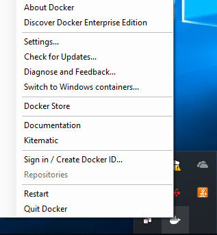

Docker 设置

为了让我们的`VOLUME`正常工作，我们需要进行一些安全设置，以便我们的 Docker 容器可以查看我们的本地硬盘。我已经从 whale 弹出了这个设置，我们将选择并复制稍后将使用的测试命令，然后单击 Apply:

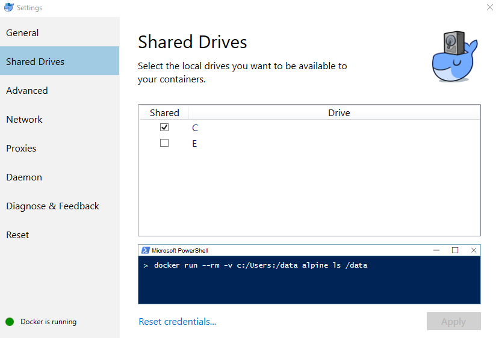

Docker 设置窗口

现在，这将弹出一个新窗口，要求输入密码，以便我们允许 Docker 将共享驱动器映射回我们的 PC，这样我们的 PC 硬盘就可以从容器中看到了。这个共享位置是我们将要工作和编辑文件的地方，这样我们就可以保存我们的工作。

现在我们有了从对话框中复制的命令，我们将继续并将其粘贴到命令提示符中，或者您可以在我们要运行测试容器的位置键入它，只是为了确保我们的 Docker 安装可以实际看到本地硬盘驱动器:

```py
C:\11519>docker run --rm -v c:/Users:/data alpine ls /data
```

因此，您可以看到，使用`-v`开关，我们说看到`c:/Users:`，它实际上在我们的本地 PC 上，然后看到`/data`，它实际上在容器上，这是卷和`alpine`测试机。你可以看到它正在下载`alpine`测试容器，然后运行`ls`命令，我们可以访问:

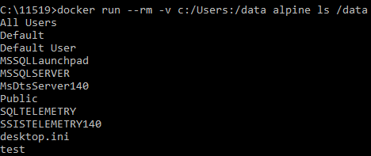

输出— ls 命令

请注意，如果您运行在 Linux 上，您将不必执行这些步骤；您只需用`sudo`运行 Docker 命令，这取决于您实际共享的文件系统。在这里，我们运行`docker`和`nvidia-docker`来确保我们可以访问我们的主目录:


运行 docker 和 nvidia-docker

请记住，`nvidia-docker`是 Docker 的一个专门版本，带有插件，有一个漂亮方便的包装器，允许您的 Linux 安装上的本地 GPU 设备从 Docker 容器中可见。如果你打算使用 GPU 支持，你需要记得用`nvidia-docker`来运行它。

现在，我们实际上要用`docker build`命令构建我们的容器。我们将使用`-t`来给它命名为`keras`，然后继续运行下面的命令:

```py
C:\11519>docker build -t keras .
```

这实际上会运行得相对较快，因为我实际上以前在这台计算机上构建过它，并且缓存了许多文件:


输出—docker 构建

但是要知道，第一次运行它可能需要 30 分钟。

方便的是，在 Linux 上构建的命令与在 Windows 上用 Docker 构建的命令完全相同。然而，如果您在 Linux 主机上使用 GPU 支持，您可以选择使用`nvidia-docker`进行构建。那么，`docker build`是做什么的呢？它获取 Docker 文件并执行它，下载包，创建文件系统，运行命令，然后保存对虚拟文件系统的所有更改，以便以后可以重用。每次运行 Docker 容器时，它都从运行构建时的状态开始。这样，每次跑步都是一致的。

现在我们已经运行了 Docker 容器，我们将继续下一部分，在这里我们将使用 Jupyter Notebook 设置并运行 REST 服务。


# 机器学习休息服务

既然我们已经构建了 Docker 文件并且可读，我们将在容器中运行 REST 服务。在这一节中，我们将看一看运行 Docker 和正确的命令行参数，从我们的 REST 服务公开的 URL，然后最后我们将验证 Keras 是否完全安装和运行。

现在来看看回报:我们实际上将使用 docker run 命令运行我们的容器。这里有几个开关我们要经过。`-p`将告诉我们容器上的端口`8888`是我们 PC 上的端口`8888`，并且`-v`命令(实际上我们将挂载我们的本地工作目录，这是我们从 GitHub 克隆源代码的地方)将被挂载到容器上的卷中:

```py
C:\11519>docker run -p 8888:8888 -v C:/11519/:/src keras
```

按下 *Enter* ，您会突然看到一个令牌，我们将使用它来测试通过我们的 web 浏览器登录到 IPython 容器:

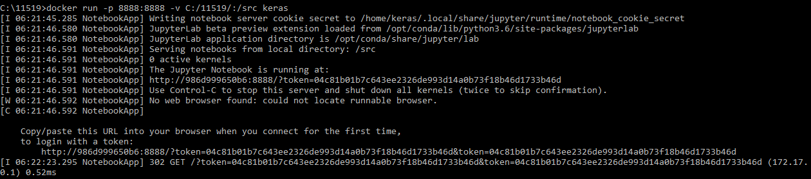

输出—docker 运行

请注意，此令牌在每次实例运行时都是唯一的，并且会因您的 PC 而异。

现在，如果您在基于 Linux 的机器上有一个 GPU，那么在`gpu`文件夹中有一个单独的 Docker 文件，您可以用它来构建 Docker 容器，以便获得加速的 GPU 支持。因此，正如您在这里看到的，我们正在构建 Docker 容器，并将其命名为`keras-gpu`:

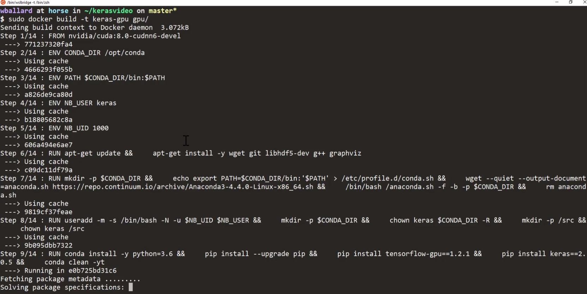

建筑码头集装箱

构建容器需要一点时间。输出中确实没有什么重要的东西值得注意；您只需要确保容器最终被成功构建:

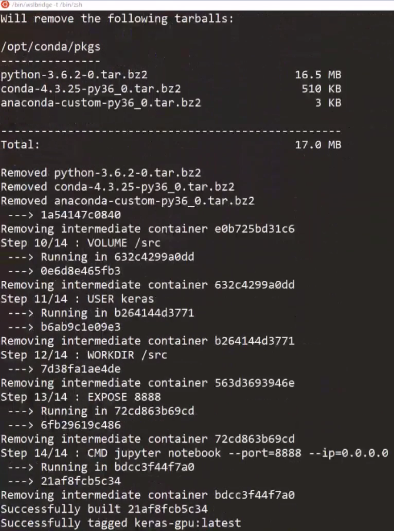

建筑码头集装箱

现在，随着容器的构建，我们将继续运行它。我们将使用`nvidia-docker`运行它，这将 GPU 设备暴露给 Docker 容器:

```py
sudo nvidia-docker run -p 8888:8888 -v ~/kerasvideo/:/src keras-gpu
```

除此之外，命令行开关与我们实际运行直接 Keras 容器时使用的开关相同，只是它们是`nvidia-docker`和`keras-gpu`。现在，一旦容器启动并运行，您将获得一个 URL，然后将这个 URL 粘贴到您的浏览器中，以访问由容器提供服务的 IPython 笔记本:

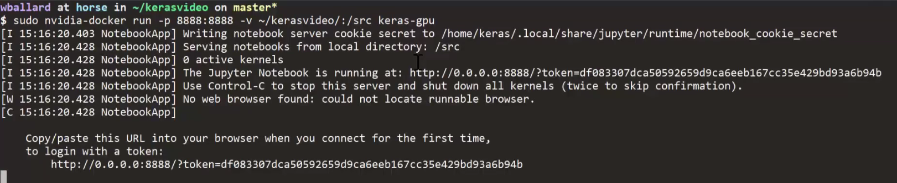

输出—docker 在 Ubuntu 系统上运行

现在，我们将快速制作一个新的 IPython 笔记本。当它启动时，我们将`import keras`，确保它加载，这需要一秒钟才能出现:


Loading Keras

然后，我们将使用以下使用 TensorFlow 的代码来检测 GPU 支持:

```py
from tensorflow.python.client import device_lib
print(device_lib.list_local_devices())
```

因此，我们将运行前面的代码来查看库和设备:

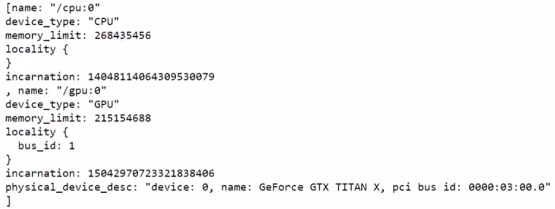

检测库和设备

现在，我们可以看到我们有`GPU`。

翻到我们的网络浏览器，粘贴网址，然后:


浏览器窗口(lacalhost)

哎呀！达不到是因为`0.0.0.0`不是真正的计算机；我们将它切换到`localhost`，点击*，输入*，果然我们有了一个 IPython 笔记本:


IPython 笔记本

我们将继续创建一个新的 Python 3 笔记本，并通过查看是否可以导入`keras`库来对其进行快速测试，以确保一切正常。

看起来我们都准备好了。我们的 TensorFlow 后端已经准备就绪！

这就是我们将在本书中运行的环境:一个准备就绪的 Docker 容器，您只需启动它，运行它，然后使用托管在其中的 Keras 和 IPython 笔记本，这样您每次都可以拥有一个简单、可重复的环境。


# 摘要

在这一章中，我们看了如何安装 Docker，包括从[https://www.docker.com/](https://www.docker.com/)那里获得它，建立一个机器学习 Docker 文件，与你的主机共享数据，最后，运行一个 REST 服务来提供我们将在本书中使用的环境。

在下一章中，我们将深入研究并开始查看实际数据。然后，我们将从了解如何获取图像数据并为其在机器学习模型中的使用做准备开始。