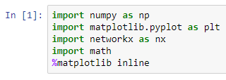
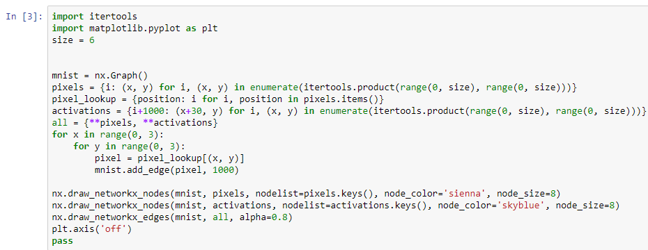
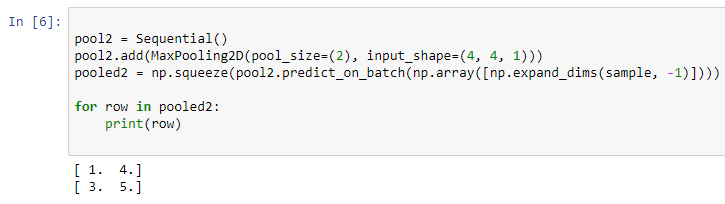
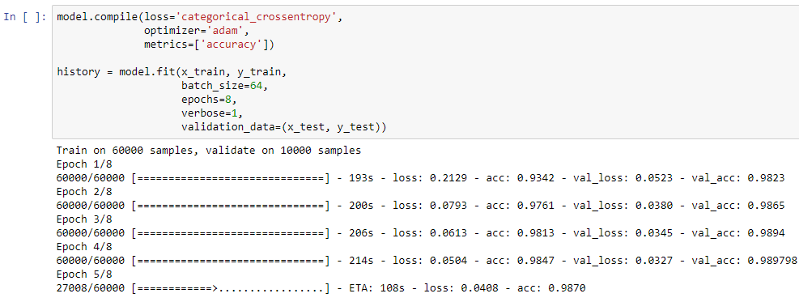
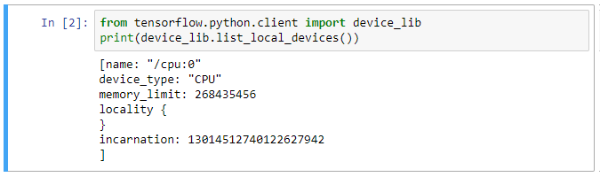
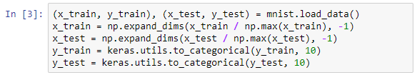

# 四、卷积神经网络

在前一章中，我们学习了所有关于密集神经网络的知识。

在这一章中，我们将继续讨论一种更新的技术:卷积神经网络。这是一种可以用来处理各种图像的方法，你会发现，正如我们向你展示它是如何工作的，它实际上比经典的神经网络更加准确和有效。

在本节中，我们将学习所有关于卷积的知识，以及如何将它们应用于图像，然后我们将学习另一种称为池化的操作。有了这两种新技术，我们将建立一个实际的卷积神经网络，并用我们的 MNIST 数字对其进行训练，这将表明它更加准确。最后，我们要建立一个真正的深度网络。深度学习背后的想法是，你将这些层结合起来，形成更大的网络，我们将向你展示这是如何进行的。

# 回旋

在这一节中，我们将学习卷积。我们将看到卷积网络的结构，然后我们将它应用到二维空间，就像我们将它用于图像一样。最后，我们将讨论卷积网络的优势，以及为什么您会选择使用它。

好吧，让我们开始吧！首先，我们将导入`networkx`包和`matplotlib`，就像我们对经典神经网络所做的那样:

导入包

这里的代码类似于我们在上一章学到的，但是有一个小的变化:

从输入连接到激活

你会注意到，我们从输入连接到激活，而不是将每个输入连接到每个激活，我们有一个窗口。在这种情况下，我们使用三个窗口，然后该窗口产生一组更稀疏的连接。正如您在实际图像中看到的，稀疏的连接集意味着不是每个输入都连接到每个激活；取而代之的是一个滑动窗口:

推拉窗

如果你看左下方的点，你会发现它实际上是一个，两个，三个向上，向下连接到下一列的第一个激活，然后类似地一个，两个，三个向上，向下连接到第二列的第二个点。在这里，我们将只设想网络的一部分。我们有一个 6×6 的像素网格连接到一个 6×6 的激活网格；所以我们要分 3 步走上`x`和`y`。这意味着这是一个 3 x 3 的子图案。从输出图中绘制的弧线可以看出，左下方的 3 x 3 网格实际上连接到了右侧激活的一个像素:

可视化网络的一部分

上述代码的输出如下:

输出-可视化网络的一部分

这与密集神经网络非常不同，因为它将多个输入连接到单个输出，而不是每个输入连接到每个输出。使用它，您可以看到在一个更大的图像中，这个补丁是如何滑过图像编码区域进入输出变量的。这对于我们现在将要讨论的图像处理有特殊的好处。

那么，我们为什么要这样做呢？地区。卷积神经网络对图像区域进行编码，就像你用眼睛看图像一样。这具有重要的计算优势，因为它通过计算将图像的`x`和`y`区域组合在一起，创建了数据的紧凑表示；处理卷积神经网络的效率要高得多，因为需要计算的连接更少。现在，卷积神经网络不仅更准确，而且总体上运行更快。

# 联营

现在，在这一部分，我们将继续讨论池化。我们将学习一维池操作。二维池操作，例如您将在图像上使用的操作；最后，我们将讨论图像通道以及如何在这些数据中使用它们。

好的，从顶部开始，我们这次将导入`keras`和一些额外的层，特别是`MaxPooling1D`和`MaxPooling2D`，我们将导入卷积 2D 层，我们稍后会用到它。所以，如果你看一下代码，我们正在做的是建立一个矩阵，这个矩阵只有一些值。你可以把它想象成一个几乎全是 1 的方阵，但是我在这里加入了一些更高的值；有`2`、`3`、`4`和`5`。最大池要做的是提取最高值。所以，我们要用一点小技巧。迄今为止，我们已经使用 Keras 来学习机器学习模型，但事实证明，您也可以直接运行这些层，并做一点数学计算:

导入包

因此，正如您已经知道的，您可以看到弹出到屏幕中的值；`2`、`3`、`4`、`5`；这些实际上是前缘上单个维度的最大值:

最大汇集操作单一矩阵

您可以在前面的屏幕截图中看到，组合在一起的顺序模型只有 max pooling 操作，我们直接将 NumPy 数组插入到预测的批处理中。我们基本上跳过了这里的培训步骤，只是将模型作为数学引擎来运行。但是这让您对 max pooling 操作的作用有所了解:它提取维度中的最大值。

我还想指出`np.squeeze`。这是做什么的？嗯，`squeeze`剔除只有一个潜在值的维度。因此，请记住，Keras 几乎总是成批工作。这里，我们的批处理只有一个批处理条目:这个矩阵在前面的屏幕截图中。因此，压缩消除了批量维度，这样我们就有了一个漂亮的平面数组作为输出。

为了向上移动到二维，我们将使用池大小为`2`的`MaxPooling2D`操作符。这意味着我们将使用一个 2 x 2 平方的池来提取最大值。从截图上的值可以看到——`1`、`4`、`3`和`5`——如果你回头看输入矩阵，你会看到左上角的`1`是输入左上角区域的最大值，而`4`是右上角区域的最大值:

最大池操作矩阵

你得到了基本的想法！它实际上通过引入最大值，将 4 x 4 变成了 2 x 2。好的，如果这只是二维，为什么我们会有三维呢？`4`、`4`和`1`。答案是像素有颜色；它们可以是红色、绿色或蓝色；在这种情况下，最终通道尺寸为 3。在我们处理的黑白图像中，你只是在那个维度上有一个 1。因此，当我们汇集资源时，我们实际上是在特定的渠道中汇集资源。在这种情况下，我们将黑白像素放在一起。

你可以看到这里有一个额外的调用，是带有`-1`的`np.expand_dims`。这样做的是，它采用我们的一个完美的正方形数组(输入为 4 x 4)，并在末尾添加一个额外的维度来编码通道形状，使其符合`MaxPooling2D`。然后，我们再次用`np.squeeze`在输出上撤销，这减少了所有的一维轴并丢弃它们，因此我们在输出上得到一个漂亮的方阵。

好吧，那我们为什么要进行联营呢？嗯，它提取强信号。池化操作的作用是减小图像的大小，并聚焦于最强的值。这有效地允许机器学习者帮助识别图像中最重要的像素和区域。

# 构建卷积神经网络

在本节中，我们将构建一个完整的卷积神经网络。我们将覆盖 MNIST 数字并转换该数据，让通道构建多层卷积神经网络，最后，运行并训练我们的卷积神经网络，看看它与经典密集网络相比如何。

好吧！让我们加载我们的 MNIST 数字，如下图所示:

正在加载 MNIST 数字

您可以看到，我们正在执行与密集神经网络类似的操作，只是我们正在对数据进行基本转换。这里，我们使用 NumPy 的`expand_dims`调用(再次传递`-1`，意为最后一个维度)来扩展我们的图像张量，从 28 x 28 像素的 MNIST 图像扩展到实际上有一个额外的维度，对颜色进行编码。在这种情况下，它是一个黑白图像，所以它是一个灰度像素；这些信息现在可以用于 Keras 中的卷积层。

好了，让我们开始添加我们的层。我们要做的第一件事是将一个内核大小为 3 x 3 的卷积 2D 层放在一起。这将在图像上滑动一个 3 x 3 像素矩阵，将其卷积为较少数量的输出，然后将其传递给第二个卷积 2D 层，也是一个 3 x 3 矩阵。从某种意义上说，这有助于建立一个形象金字塔。它将图像中的数据缩小并集中到更小的维度上，然后我们将它传递到最大池中，这将进一步缩小它。

现在，它开始看起来像我们以前的密集神经网络。为了避免过度拟合，我们进行了一次剔除；我们把它展平，去掉所有独立的维度，所以现在，只剩下一个维度；然后我们让它通过一个密集的神经网络，最后把它送给我们的朋友 softmax，正如你们所记得的，soft max 会把我们的数字从 0 到 9 分类，从 0 到 9 的单个书面数字。这就产生了我们的最终输出:

表演辍学

好的，这在总体结构上类似于一个密集的网络，除了我们添加了一组进行卷积的预处理层。

好吧，让我们试一试！

输出-预处理图层集

正如我之前提到的，机器学习肯定涉及到人类的等待，因为我们将运行和训练多个层次。但是您可以看到，我们运行的实际训练代码(模型编译和模型拟合)与我们之前使用密集神经网络时完全相同。这是 Keras 的好处之一:使其运行的管道代码大致保持不变，然后您可以更改架构，放入不同的层，放入不同数量的激活，或放入不同的激活函数，以便您可以试验不同的网络形状，这些形状可能更好地处理您的数据集。事实上，您可以在本笔记本中试验该层。例如，您可以将激活从 32 和 64 更改为 64 和 128，或者在最终 softmax 输出之前添加另一个密集层。

现在，在您的系统上运行此培训可能会很耗时。在我的机器上，完成整套训练大约需要 10 分钟。但是你马上会注意到，我们的精确度提高了很多。如果你回想一下上一节，我们的密集神经网络达到了大约 96%的准确率。我们的网络接近 99%，所以，通过增加卷积，我们已经成功地建立了一个更准确的分类神经网络。

# 深度神经网络

现在，我们将使用卷积创建一个实际的深度神经网络。

在这一节中，我们将介绍如何检查以确保我们正在 GPU 上运行，这是一个重要的性能技巧。然后，我们将加载我们的图像数据，然后我们将建立一个多块深度神经网络，它比我们以前创建的任何东西都要深得多。最后，我们将这个深度神经网络的结果与上一节中的浅卷积神经网络进行比较。

在顶部，我们正在导入必要的 Python 包:

导入包

这与我们对标准卷积神经网络所做的相同。关于制作深度神经网络的不同之处在于，我们只是将更多地使用相同的层。在下一个块中，我们将直接进入`tensorflow`并导入`python`库。我们看到的这个`device_lib`是什么？嗯，`device_lib`实际上让我们列出所有我们可以使用的设备，以便运行我们的神经网络。在这种情况下，我在 nvidia-docker 设置上运行它，并访问 GPU，这将提高性能:

系统状况

如果你没有 GPU，那也没关系！只需知道，在 CPU 设置上运行这些深度神经网络将需要更长的时间(可能长达 20 倍)。这里，我们正在导入 MNIST 数字训练数据，和以前一样:

导入 MNIST 数字训练数据

请记住，我们正在使用`-1`扩展维度(意味着我们正在扩展最后一个维度)来安装通道，并且我们正在根据最大值对该数据进行归一化，以便为学习输出值(`y`值)进行设置。我们再一次把它们转换成绝对的；有十种不同的类别，每一种对应于数字 0 到 9。

好吧！现在，使深度神经网络变深的东西是一系列重复的层。就层数而言，我们说它很深。因此，我们之前构建的网络在最终输出之前有一两层。在最终输出之前，我们这里的网络将有多层排列成块。好的，看第一块:

b 座

这实际上形成了一个链，我们对输入进行卷积，然后对卷积进行卷积，最后应用最大池，以获得最重要的特性。在这个卷积中，我们引入了一个以前没有使用过的新参数:填充。在这种情况下，我们使用`same`值填充它，这意味着我们希望图像的所有边都有相同的填充量。这种填充的实际作用是，当我们向下卷积时，由于我们的 3 x 3 内核大小，图像最终会比输入图像略小，因此填充会在图像边缘放置一圈零，以填充我们相对于卷积缩小的空间。然后，在第二块结束，你可以看到，当我们衰减图像时，我们从 64 次激活切换到 128 次激活:

b 座

本质上，我们将图像缩小到更密集的大小，因此我们将从 28 像素乘 28 像素通过这个 2 x 2 的合并层缩小到 14 像素乘 14 像素，但然后我们将更深入地使用隐藏层的数量来推断新的功能。所以，实际上你可以把图像想象成一种金字塔，我们从基础图像开始，通过卷积拉伸它，通过合并缩小它，然后通过卷积拉伸它，通过合并缩小它，直到我们得到一个比 10 个输出图层稍大的形状。然后，我们进行 softmax 预测，以生成最终结果。最后，在第三个模块中，与第二个模块非常相似，我们提升了多达 256 个隐藏功能:

b 座

这也是在我们使用我们的老朋友，密集神经网络，进行最终输出分类层之前，对图像进行拉伸和缩小。我们有两层密集编码，然后最终进入 10 输出 softmax。

因此，您可以看到，深度神经网络是卷积神经网络一层一层地深度串连在一起的组合，然后使用密集神经网络通过我们在前面章节中了解的 softmax 生成最终输出。让我们试一试吧！

输出-模型摘要

好的，你可以看到模型摘要打印出了所有的层，端到端地链接在一起，有 310 万个参数要学习。这是迄今为止我们创建的最大的网络。

现在，是时候根据我们的样本数据训练这个网络，看看它的预测能力如何。好的，我们现在正在训练这个模型，它进行得相当快:

训练模型

在我的电脑上，用我的 Titan X GPU 完成迭代大约需要 3.5 分钟，这真的是目前用单个 GPU 解决方案完成事情的最快速度。当我们在这里结束训练时，你可以看到我们的精度为 0.993，比我们的平面卷积神经网络好 1/10 或 1%。这看起来不是一个很大的改进，但绝对是一个改进！

所以，我们现在要问:为什么？简单地说，超过 99%的准确率，边际改善是非常非常困难的。为了达到更高的精度水平，需要创建更大的网络，而你必须花时间调整你的超参数。我们在本章中运行的示例运行了八个以上的时期。然而，我们也可以改变学习率，调整参数，执行网格搜索，或者改变特征的数量。我把这个留给你做实验。

# 摘要

好吧！我们已经学习了卷积，它是一种在图像上移动以提取特征的松散连接的方法；我们已经学习了池化，它总结了最重要的特性；我们用这些技术建立了一个卷积神经网络；最后，我们将多层卷积和池结合起来，以生成深度神经网络。

在下一章中，我们将转向更多的应用开发。我们将构建一个图像分类 REST 服务器，它可以接受不同的神经网络模型，并将其作为 API。