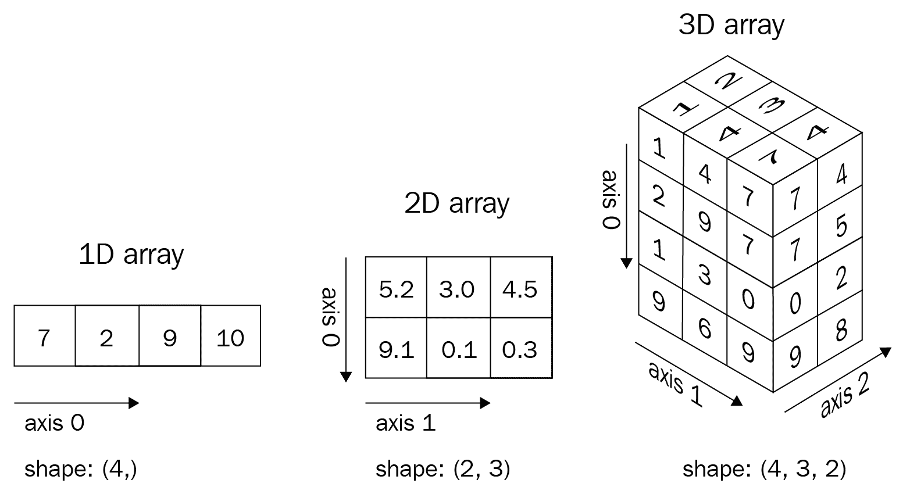
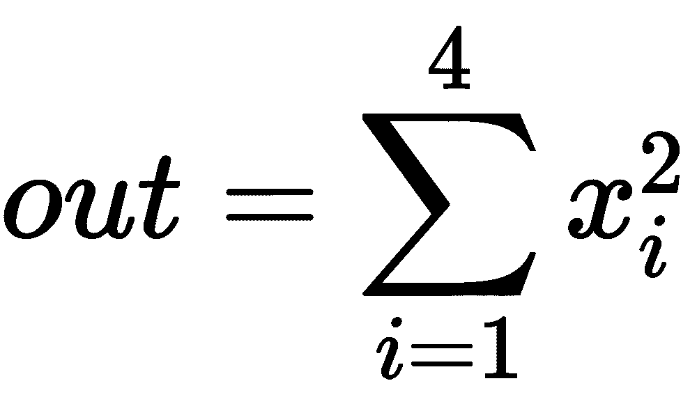
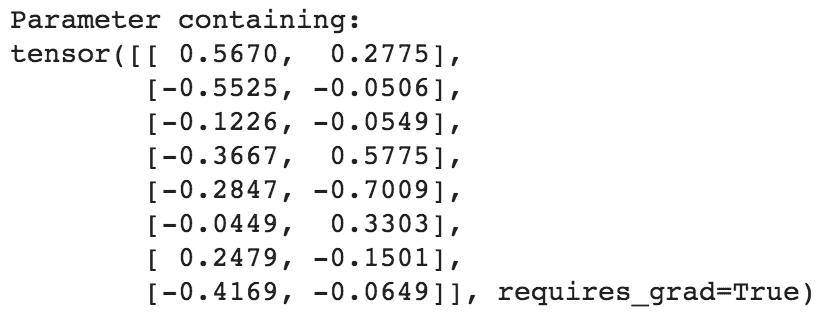
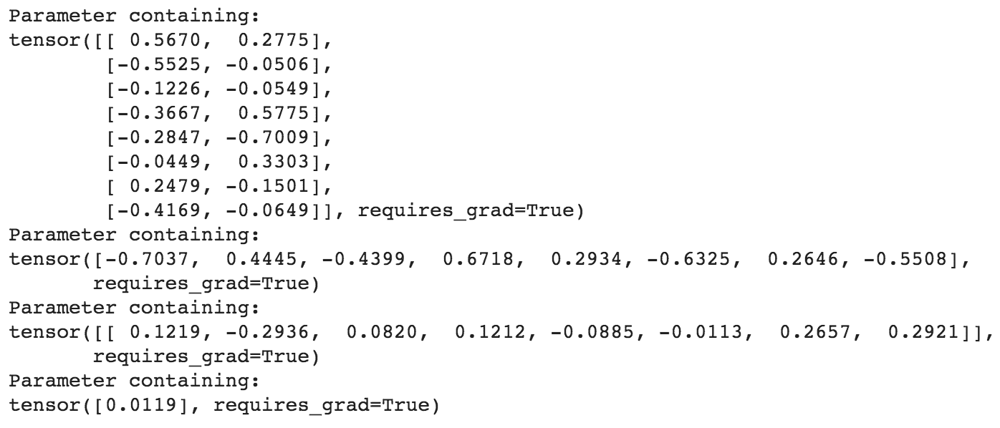
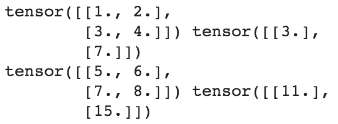
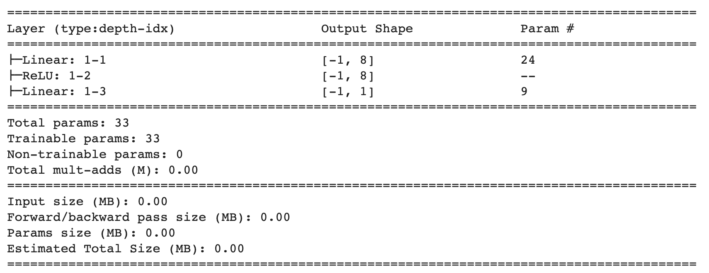
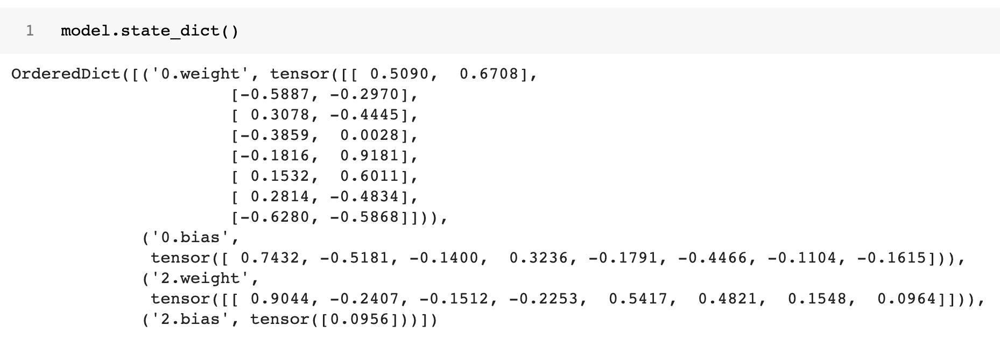

# 二、PyTorch 基础

在前一章中，我们学习了神经网络的基本构建模块，并且用 Python 从头开始实现了正向和反向传播。

在本章中，我们将深入探讨使用 PyTorch 构建神经网络的基础，在后续章节中，当我们了解图像分析中的各种用例时，我们将多次利用 py torch。我们将从 PyTorch 研究的核心数据类型——张量对象开始。然后，我们将深入研究可以在张量对象上执行的各种操作，以及在玩具数据集上构建神经网络模型时如何利用它们(以便我们在从下一章开始逐步查看更现实的数据集之前加强理解)。这将允许我们直观地了解如何使用 PyTorch 构建神经网络模型来映射输入和输出值。最后，我们将学习实现定制损失函数，这样我们就可以基于我们正在解决的用例进行定制。

具体而言，本章将涵盖以下主题:

*   安装 PyTorch
*   PyTorch tensors
*   使用 PyTorch 构建神经网络
*   使用顺序方法建立神经网络
*   保存和加载 PyTorch 模型

# 安装 PyTorch

PyTorch 提供了多种功能来帮助构建神经网络——使用高级方法抽象各种组件，并为我们提供张量对象，利用 GPU 更快地训练神经网络。

在安装 PyTorch 之前，我们首先需要安装 Python，如下:

1.  为了安装 Python，我们将使用[anaconda.com/distribution/](http://anaconda.com/distribution)平台来获取安装程序，该安装程序将为我们自动安装 Python 以及重要的深度学习专用库:


选择最新 Python 版本 3.xx (3.7，截至撰写本书时)的图形安装程序，并让它下载。

2.  使用下载的安装程序进行安装:

在安装过程中选择 Add Anaconda to my PATH 环境变量选项，因为这将使我们在命令提示符/终端中键入`python`时调用 Anaconda 版本的 Python 变得容易。


接下来，我们将安装 PyTorch，这同样简单。

3.  访问[https://pytorch.org/](https://pytorch.org/)网站上的本地快速入门部分，选择您的操作系统(您的 OS)，对于软件包选择 Conda，对于语言选择 Python，对于 CUDA 选择 None。如果你有 CUDA 库，你可以选择合适的版本:


这将提示您在终端中运行一个命令，比如`conda install pytorch torchvision cpuonly -c pytorch`。

4.  在命令提示符/终端中运行命令，让 Anaconda 安装 PyTorch 和必要的依赖项。

如果你拥有一个 NVIDIA 显卡作为硬件组件，强烈建议安装 CUDA 驱动，它可以将深度学习训练加速几个数量级。有关如何安装 CUDA 驱动程序的说明，请参考*附录*。一旦你安装了它们，你可以选择 10.1 作为 CUDA 版本，并使用这个命令来安装 PyTorch。

5.  您可以在命令提示符/终端中执行`python`,然后键入以下命令来验证 PyTorch 确实已安装:

```py
>>> import torch
>>> print(torch.__version__)
# '1.7.0'
```

本书中的所有代码都可以在 Google Colab-[https://colab.research.google.com/](https://colab.research.google.com/)中执行。Python 和 PyTorch 在 Google Colab 中默认可用。我们强烈建议您在 Colab 上执行所有代码——包括免费访问 GPU！感谢谷歌提供如此优秀的资源！

所以，我们已经成功安装了 Python 和 PyTorch。我们现在将在 Python 中执行一些基本的张量运算来帮助你掌握它。

# PyTorch tensors

张量是 PyTorch 的基本数据类型。张量是一种多维矩阵，类似于 NumPy 的 ndarrays:

*   标量可以表示为零维张量。
*   向量可以表示为一维张量。
*   二维矩阵可以表示为二维张量。
*   多维矩阵可以表示为多维张量。

从图像上看，张量如下:



例如，我们可以将彩色图像视为像素值的三维张量，因为彩色图像由`height x width x 3`像素组成——其中三个通道对应于 RGB 通道。类似地，灰度图像可以被认为是二维张量，因为它由`height x width`个像素组成。

在本节结束时，我们将学习张量为什么有用，如何初始化它们，以及在张量上执行各种操作。这将作为我们在下一节研究利用张量构建神经网络模型时的基础。

## 初始化张量

张量在很多方面都很有用。除了用作图像的基本数据结构之外，张量的一个更突出的用途是用于初始化连接神经网络不同层的权重。

在本节中，我们将练习初始化张量对象的不同方法:

下面的代码可以在本书的 GitHub 库【https://tinyurl.com/mcvp-packt[的`Chapter02`文件夹中找到`Initializing_a_tensor.ipynb`](https://tinyurl.com/mcvp-packt)

1.  导入 PyTorch 并通过调用列表上的`torch.tensor`初始化张量:

```py
import torch
x = torch.tensor([[1,2]])
y = torch.tensor([[1],[2]])
```

2.  接下来，访问张量对象的形状和数据类型:

```py
print(x.shape)
# torch.Size([1,2]) # one entity of two items
print(y.shape)
# torch.Size([2,1]) # two entities of one item each

print(x.dtype)
# torch.int64
```

张量中所有元素的数据类型都是相同的。这意味着，如果张量包含不同数据类型的数据(如布尔型、整数型和浮点型)，则整个张量将被强制为最通用的数据类型:

```py
x = torch.tensor([False, 1, 2.0])
print(x)
# tensor([0., 1., 2.])
```

正如您在前面代码的输出中看到的，布尔值`False`和整数`1`被转换为浮点数。

或者，类似于 NumPy，我们可以使用内置函数初始化张量对象。请注意，我们在神经网络的张量和权重之间绘制的相似之处现在暴露出来了——我们正在初始化张量，以便它们代表神经网络的权重初始化。

3.  生成一个张量对象，该对象有三行四列，用零填充:

```py
torch.zeros((3, 4))
```

4.  生成一个张量对象，该对象有三行四列，用 1 填充:

```py
torch.ones((3, 4))
```

5.  生成三行四列介于 0 和 10 之间的值(包括低值，但不包括高值):

```py
torch.randint(low=0, high=10, size=(3,4))
```

6.  用三行四列生成 0 到 1 之间的随机数:

```py
torch.rand(3, 4)
```

7.  生成符合三行四列正态分布的数字:

```py
torch.randn((3,4))

```

8.  最后，我们可以使用`torch.tensor(<numpy-array>)`将 NumPy 数组直接转换成 Torch 张量:

```py
x = np.array([[10,20,30],[2,3,4]])
y = torch.tensor(x)
print(type(x), type(y))
# <class 'numpy.ndarray'> <class 'torch.Tensor'>
```

既然我们已经学习了初始化张量对象，我们将在下一节学习在它们之上执行各种矩阵操作。

## 张量上的运算

与 NumPy 类似，可以对张量对象执行各种基本操作。与神经网络操作类似的是输入与权重的矩阵乘法、偏置项的添加以及在需要时对输入或权重值进行整形。这些操作和附加操作的完成方式如下:

The following code is available as `Operations_on_tensors.ipynb` in the `Chapter02` folder of this book's GitHub repository.

*   可以使用以下代码将`x`中的所有元素乘以`10`:

```py
import torch
x = torch.tensor([[1,2,3,4], [5,6,7,8]]) 
print(x * 10)
# tensor([[10, 20, 30, 40],
#        [50, 60, 70, 80]])
```

*   将`10`添加到`x`中的元素，并将结果张量存储到`y`中，可以使用以下代码执行:

```py
x = torch.tensor([[1,2,3,4], [5,6,7,8]]) 
y = x.add(10)
print(y)
# tensor([[11, 12, 13, 14],
#         [15, 16, 17, 18]])

```

*   可以使用以下代码对张量进行整形:

```py
y = torch.tensor([2, 3, 1, 0]) 
# y.shape == (4)
y = y.view(4,1)                
# y.shape == (4, 1)
```

*   另一种重塑张量的方法是使用`squeeze`方法，我们提供想要移除的轴索引。请注意，这仅适用于我们要删除的轴在该维度中只有一个项目的情况:

```py
x = torch.randn(10,1,10)
z1 = torch.squeeze(x, 1) # similar to np.squeeze()
# The same operation can be directly performed on
# x by calling squeeze and the dimension to squeeze out
z2 = x.squeeze(1)
assert torch.all(z1 == z2) 
# all the elements in both tensors are equal
print('Squeeze:\n', x.shape, z1.shape)
 # Squeeze: torch.Size([10, 1, 10]) torch.Size([10, 10])

```

*   与`squeeze`相反的是`unsqueeze`，这意味着我们给矩阵增加了一个维度，可以使用下面的代码来执行:

```py
x = torch.randn(10,10)
print(x.shape)
# torch.size(10,10)
z1 = x.unsqueeze(0)
print(z1.shape)

# torch.size(1,10,10)

# The same can be achieved using [None] indexing
# Adding None will auto create a fake dim 
# at the specified axis
x = torch.randn(10,10)
z2, z3, z4 = x[None], x[:,None], x[:,:,None]
print(z2.shape, z3.shape, z4.shape)

# torch.Size([1, 10, 10]) 
# torch.Size([10, 1, 10]) 
# torch.Size([10, 10, 1])
```

如图所示，使用`None`进行索引是一种奇特的解列方式，并且在本书中经常用于创建虚假的通道/批次维度。

*   两个不同张量的矩阵乘法可以使用以下代码来执行:

```py
x = torch.tensor([[1,2,3,4], [5,6,7,8]])
print(torch.matmul(x, y))

# tensor([[11],
#         [35]])
```

*   或者，也可以使用`@`运算符来执行矩阵乘法:

```py
print(x@y)

# tensor([[11],
#  [35]]) 
```

*   与 NumPy 中的`concatenate`类似，我们可以使用`cat`方法来执行张量的连接:

```py
import torch
x = torch.randn(10,10,10)
z = torch.cat([x,x], axis=0) # np.concatenate()
print('Cat axis 0:', x.shape, z.shape)
 # Cat axis 0:  torch.Size([10, 10, 10]) 
# torch.Size([20, 10, 10])
z = torch.cat([x,x], axis=1) # np.concatenate()
print('Cat axis 1:', x.shape, z.shape)
 # Cat axis 1: torch.Size([10, 10, 10]) 
# torch.Size([10, 20, 10])
```

*   可以使用以下代码提取张量中的最大值:

```py
x = torch.arange(25).reshape(5,5)
print('Max:', x.shape, x.max()) 

# Max:  torch.Size([5, 5]) tensor(24)
```

*   我们可以提取最大值以及最大值所在的行索引:

```py
x.max(dim=0)
 # torch.return_types.max(values=tensor([20, 21, 22, 23, 24]), 
# indices=tensor([4, 4, 4, 4, 4]))
```

注意，在前面的输出中，我们正在获取维度`0`上的最大值，这是张量的行。因此，所有行的最大值是第 4 个^(索引)中的值，因此`indices`输出也是全 4。此外，`.max`返回最大值和最大值的位置(`argmax`)。

类似地，跨列获取最大值时的输出如下:

```py
m, argm = x.max(dim=1) 
print('Max in axis 1:\n', m, argm) 
 # Max in axis 1: tensor([ 4, 9, 14, 19, 24]) 
# tensor([4, 4, 4, 4, 4])
```

`min`操作与`max`完全相同，但在适用的情况下返回最小值和 arg-minimum。

*   置换张量对象的维度:

```py
x = torch.randn(10,20,30)
z = x.permute(2,0,1) # np.permute()
print('Permute dimensions:', x.shape, z.shape)
# Permute dimensions:  torch.Size([10, 20, 30]) 
# torch.Size([30, 10, 20])
```

请注意，当我们在原始张量上执行置换时，张量的形状会发生变化。

不要改变张量的形状(即使用`tensor.view` on)来交换维度。尽管 Torch 不会抛出错误，但这是错误的，会在训练过程中产生无法预料的结果。如果需要交换尺寸，请始终使用置换。

因为很难涵盖本书中所有可用的操作，所以知道您可以使用与 NumPy 几乎相同的语法在 PyTorch 中执行几乎所有的 NumPy 操作是很重要的。标准的数学运算，如`abs`、`add`、`argsort`、`ceil`、`floor`、`sin`、`cos`、`tan`、`cumsum`、`cumprod`、`diag`、`eig`、`exp`、`log`、`log2`、`log10`、`mean`、`median`、`mode`、`resize`、`round`、`sigmoid`、`softmax`、`square`、`sqrt`、`svd`你可以随时运行`dir(torch.Tensor)`来查看 Torch 张量的所有可能方法，运行`help(torch.Tensor.<method>)`来查看该方法的官方帮助和文档。

接下来，我们将了解如何利用张量在数据之上执行梯度计算，这是在神经网络中执行反向传播的一个关键方面。

## 张量对象的自动渐变

正如我们在前一章中看到的，微分和计算梯度在更新神经网络的权重中起着关键作用。PyTorch 的张量对象带有计算梯度的内置功能。

在本节中，我们将了解如何使用 PyTorch 计算张量对象的梯度:

The following code is available as `Auto_gradient_of_tensors.ipynb` in the `Chapter02` folder of this book's GitHub repository - [https://tinyurl.com/mcvp-packt](https://tinyurl.com/mcvp-packt)

1.  定义一个张量对象，并指定它需要计算梯度:

```py
import torch
x = torch.tensor([[2., -1.], [1., 1.]], requires_grad=True)
print(x)
```

在前面的代码中，`requires_grad`参数指定要为张量对象计算渐变。

2.  接下来，定义计算输出的方法，在本例中，输出是所有输入的平方和:



这在代码中用下面一行表示:

```py
out = x.pow(2).sum()
```

我们知道前一个函数的梯度是 *2*x* 。让我们使用 PyTorch 提供的内置函数来验证这一点。

3.  可以通过对值调用`backward()`方法来计算值的梯度。在我们的例子中，我们计算梯度–对于`x`(输入)的微小变化`out`(输出)的变化–如下:

```py
out.backward()
```

4.  我们现在可以获得`out`相对于`x`的梯度，如下所示:

```py
x.grad
```

这会产生以下输出:


请注意，之前获得的梯度与直观的梯度值相匹配(是 *x* 值的两倍)。

As an exercise, try recreating the scenario in `Chain rule.ipynb` in [Chapter 1](4c6e8ac2-af49-4255-bb7f-e04ed7333f11.xhtml), *Artificial Neural Network Fundamentals*, with PyTorch. Compute the gradients after making a forward pass and make a single update. Verify that the updated weights match what we calculated in the notebook.

到目前为止，我们已经了解了如何在张量对象上初始化、操作和计算梯度——它们共同构成了神经网络的基本构件。除了计算自动渐变，初始化和操作数据也可以使用 NumPy 数组。这要求我们理解为什么在构建神经网络时应该使用张量对象而不是 NumPy 数组——这将在下一节中讨论。

## PyTorch 的张量优于 NumPy 的 ndarrays

在前一章中，我们看到，在计算最佳权重值时，我们会对每个权重进行少量调整，并了解其对降低整体损失值的影响。注意，基于一个权重的权重更新的损失计算不影响同一迭代中其他权重的权重更新的损失计算。因此，如果每个权重更新由不同的核心并行进行，而不是顺序更新权重，则可以优化该过程。在这种情况下，GPU 很方便，因为与 CPU(一般情况下，CPU 可能不超过 64 个内核)相比，它由数千个内核组成。

与 NumPy 相比，Torch 张量对象经过优化，可与 GPU 配合使用。为了进一步理解这一点，让我们进行一个小实验，其中我们在一个场景中使用 NumPy 数组执行矩阵乘法操作，在另一个场景中使用 tensor 对象执行矩阵乘法操作，并比较在两个场景中执行矩阵乘法所花费的时间:

The following code is available as `Numpy_Vs_Torch_object_computation_speed_comparison.ipynb` in the `Chapter02` folder of this book's GitHub repository - [https://tinyurl.com/mcvp-packt](https://tinyurl.com/mcvp-packt)

1.  生成两个不同的`torch`对象:

```py
import torch
x = torch.rand(1, 6400)
y = torch.rand(6400, 5000)
```

2.  定义我们将存储在*步骤 1* 中创建的张量对象的设备:

```py
device = 'cuda' if torch.cuda.is_available() else 'cpu'
```

请注意，如果您没有 GPU 设备，该设备将是`cpu`(此外，您不会注意到使用 CPU 时执行时间的巨大差异)。

3.  用设备注册在*步骤 1* 中创建的张量对象。注册张量对象意味着在设备中存储信息:

```py
x, y = x.to(device), y.to(device)
```

4.  对 Torch 对象执行矩阵乘法，并计时，以便我们可以比较在 NumPy 数组上执行矩阵乘法的情况下的速度:

```py
%timeit z=(x@y)
# It takes 0.515 milli seconds on an average to 
# perform matrix multiplication
```

5.  对`cpu`进行相同张量的矩阵乘法:

```py
x, y = x.cpu(), y.cpu()
%timeit z=(x@y)
# It takes 9 milli seconds on an average to 
# perform matrix multiplication
```

6.  执行相同的矩阵乘法，这次是在 NumPy 数组上:

```py
import numpy as np
x = np.random.random((1, 6400))
y = np.random.random((6400, 5000))
%timeit z = np.matmul(x,y)
# It takes 19 milli seconds on an average to 
# perform matrix multiplication
```

您会注意到，在 GPU 上对 Torch 对象执行的矩阵乘法比在 CPU 上对 Torch 对象执行的矩阵乘法快大约 18 倍，比在 NumPy 数组上执行的矩阵乘法快大约 40 倍。总的来说，`matmul`在 CPU 上用 Torch tensors 还是比 NumPy 快。请注意，只有当您有 GPU 设备时，您才会注意到这种加速。如果您正在使用 CPU 设备，您不会注意到速度的显著提高。这就是为什么如果你没有自己的 GPU，我们建议使用谷歌 Colab 笔记本电脑，因为该服务提供免费的 GPU。

现在，我们已经了解了如何在神经网络的各个单独组件/操作中利用张量对象，以及如何使用 GPU 来加速计算，在下一节中，我们将了解如何使用 PyTorch 将所有这些放在一起构建神经网络。

# 使用 PyTorch 构建神经网络

在前一章中，我们学习了如何从头开始构建神经网络，其中神经网络的组件如下:

*   隐藏层的数量
*   隐藏层中的单元数
*   在不同层执行的激活功能
*   我们试图优化的损失函数
*   与神经网络相关联的学习速率
*   用于构建神经网络的批量数据
*   正向和反向传播的次数

然而，对于所有这些，我们使用 Python 中的 NumPy 数组从头开始构建它们。在本节中，我们将学习在玩具数据集上使用 PyTorch 实现所有这些。请注意，在使用 PyTorch 构建神经网络时，我们将利用到目前为止在初始化张量对象、对其执行各种操作以及计算梯度值来更新权重方面的学习。

请注意，在本章中，为了获得执行各种操作的直觉，我们将在玩具数据集上构建一个神经网络。从下一章开始，我们将处理解决更现实的问题和数据集。

为了理解使用 PyTorch 实现神经网络，我们要解决的玩具问题是两个数的简单相加，其中我们按如下方式初始化数据集:

The following code is available as `Building_a_neural_network_using_PyTorch_on_a_toy_dataset.ipynb` in the `Chapter02` folder of this book's GitHub repository - [https://tinyurl.com/mcvp-packt](https://tinyurl.com/mcvp-packt)

1.  定义输入(`x`)和输出(`y`)值:

```py
import torch
x = [[1,2],[3,4],[5,6],[7,8]]
y = [[3],[7],[11],[15]]
```

请注意，在前面的输入和输出变量初始化中，输入和输出是一个列表列表，其中输入列表中的值之和就是输出列表中的值。

2.  将输入列表转换为张量对象:

```py
X = torch.tensor(x).float()
Y = torch.tensor(y).float()
```

请注意，在前面的代码中，我们已经将张量对象转换为浮点对象。将张量对象作为浮点数或长整型是一个很好的实践，因为它们无论如何都会乘以十进制值(权重)。

此外，我们将输入(`X`)和输出(`Y`)数据点注册到设备——`cuda`(如果您有 GPU)和`cpu`(如果您没有 GPU ):

```py
device = 'cuda' if torch.cuda.is_available() else 'cpu'
X = X.to(device)
Y = Y.to(device)
```

3.  定义神经网络架构:

*   `torch.nn`模块包含有助于构建神经网络模型的功能:

```py
import torch.nn as nn
```

*   我们将创建一个类(`MyNeuralNet`)，它可以组成我们的神经网络架构。创建模型架构时，必须从`nn.Module`继承，因为它是所有神经网络模块的基类:

```py
class MyNeuralNet(nn.Module):
```

*   在该类中，我们使用`__init__`方法初始化神经网络的所有组件。我们应该调用`super().__init__()`来确保该类继承`nn.Module`:

```py
def __init__(self):
    super().__init__()
```

使用前面的代码，通过指定`super().__init__()`，我们现在能够利用为`nn.Module`编写的所有预建功能。将在`init`方法中初始化的组件将在`MyNeuralNet`类的不同方法中使用。

*   定义神经网络中的层:

```py
    self.input_to_hidden_layer = nn.Linear(2,8)
    self.hidden_layer_activation = nn.ReLU()
    self.hidden_to_output_layer = nn.Linear(8,1)
```

在前面的代码行中，我们指定了神经网络的所有层——线性层(`self.input_to_hidden_layer`)，然后是 ReLU 激活(`self.hidden_layer_activation`)，最后是线性层(`self.hidden_to_output_layer`)。注意，现在，层数和激活的选择是任意的。我们将在下一章更详细地了解层中单位数量和层激活的影响。

*   此外，让我们通过打印`nn.Linear`方法的输出来理解前面代码中的函数在做什么:

```py
# NOTE - This line of code is not a part of model building, 
# this is used only for illustration of Linear method
print(nn.Linear(2, 7))
Linear(in_features=2, out_features=7, bias=True)
```

在前面的代码中，线性方法将两个值作为输入，输出七个值，并且还有一个与之关联的偏差参数。此外，`nn.ReLU()`调用 ReLU 激活，然后可以在其他方法中使用。

其他一些常用的激活功能如下:

*   乙状结肠的
*   Softmax
*   双曲正切

现在我们已经定义了神经网络的组件，让我们在定义网络的正向传播时将组件连接在一起:

```py
    def forward(self, x):
        x = self.input_to_hidden_layer(x)
        x = self.hidden_layer_activation(x)
        x = self.hidden_to_output_layer(x)
        return x
```

必须使用`forward`作为函数名，因为 PyTorch 已经将该函数保留为执行正向传播的方法。在它的位置上使用任何其他名称都会引发错误。

到目前为止，我们已经构建了模型架构；让我们在下一步检查随机初始化的权重值。

4.  您可以通过执行以下步骤来访问每个组件的初始重量:

*   创建我们之前定义的`MyNeuralNet`类对象的一个实例，并将其注册到`device`:

```py
mynet = MyNeuralNet().to(device)
```

*   可通过指定以下内容来访问各层的权重和偏差:

```py
# NOTE - This line of code is not a part of model building, 
# this is used only for illustration of 
# how to obtain parameters of a given layer
mynet.input_to_hidden_layer.weight
```

上述代码的输出如下:



输出中的值将与前面的不同，因为神经网络每次都用随机值进行初始化。如果您希望它们在执行相同代码的多次迭代中保持不变，那么您需要在创建类对象实例之前使用 Torch 中的`manual_seed`方法将种子指定为`torch.manual_seed(0)`

*   使用以下代码可以获得神经网络的所有参数:

```py
# NOTE - This line of code is not a part of model building, 
# this is used only for illustration of 
# how to obtain parameters of all layers in a model
mynet.parameters()
```

前面的代码返回一个生成器对象。

*   最后，通过遍历生成器获得参数，如下所示:

```py
# NOTE - This line of code is not a part of model building, 
# this is used only for illustration of how to 
# obtain parameters of all layers in a model 
# by looping through the generator object
for par in mynet.parameters():
    print(par)
```

上述代码会产生以下输出:



该模型已将这些张量注册为特殊对象，这些对象是跟踪向前和向后传播所必需的。在`__init__`方法中定义任意一个`nn`层时，会自动创建相应的张量并同时注册。您也可以使用`nn.Parameter(<tensor>)`功能手动注册这些参数。因此，下面的代码相当于我们之前定义的神经网络类。

*   使用`nn.Parameter`功能定义模型的另一种方法如下:

```py
# for illustration only
class MyNeuralNet(nn.Module):
     def __init__(self):
        super().__init__()
 self.input_to_hidden_layer = nn.Parameter(\
 torch.rand(2,8))
        self.hidden_layer_activation = nn.ReLU()
 self.hidden_to_output_layer = nn.Parameter(\
 torch.rand(8,1))

     def forward(self, x):
        x = x @ self.input_to_hidden_layer
        x = self.hidden_layer_activation(x)
        x = x @ self.hidden_to_output_layer
        return x
```

5.  定义我们优化的损失函数。假设我们预测的是连续输出，我们将针对均方误差进行优化:

```py
loss_func = nn.MSELoss()
```

其他突出的损失函数如下:

*   `CrossEntropyLoss`(用于多项分类)
*   `BCELoss`(二值分类的二值交叉熵损失)

*   神经网络的损失值可以通过将输入值传递给`neuralnet`对象，然后计算给定输入的`MSELoss`来计算:

```py
_Y = mynet(X)
loss_value = loss_func(_Y,Y)
print(loss_value)
# tensor(91.5550, grad_fn=<MseLossBackward>)
# Note that loss value can differ in your instance 
# due to a different random weight initialization
```

在前面的代码中，`mynet(X)`计算输入通过神经网络时的输出值。此外，`loss_func`函数计算对应于神经网络预测值(`_Y`)和实际值(`Y`)的`MSELoss`值。

作为惯例，在本书中，我们将使用`**_**<variable>`来关联对应于地面真相`<variable>`的预测。在这个`<variable>`上面是`Y`。

还要注意，在计算损失时，我们*总是*先发送预测，然后发送地面实况。这是 PyTorch 大会。

现在我们已经定义了损失函数，我们将定义试图减少损失值的优化器。优化器的输入将是对应于神经网络的参数(权重和偏差)以及更新权重时的学习率。

对于这种情况，我们将考虑随机梯度下降(更多关于不同的优化器和学习率的影响在下一章)。

6.  从`torch.optim`模块导入`SGD`方法，然后将神经网络对象(`mynet`)和学习率(`lr`)作为参数传递给`SGD`方法:

```py
from torch.optim import SGD
opt = SGD(mynet.parameters(), lr = 0.001)
```

7.  一起执行一个时期内要完成的所有步骤:

*   计算对应于给定输入和输出的损耗值。
*   计算每个参数对应的梯度。
*   基于每个参数的学习速率和梯度更新权重。
*   更新权重后，请确保在下一个时段计算梯度之前，刷新上一步中计算的梯度:

```py
# NOTE - This line of code is not a part of model building, 
# this is used only for illustration of how we perform 
opt.zero_grad() # flush the previous epoch's gradients
loss_value = loss_func(mynet(X),Y) # compute loss
loss_value.backward() # perform back-propagation
opt.step() # update the weights according to the gradients computed
```

*   使用`for`循环，重复上述步骤，重复次数与历元数相同。在下面的例子中，我们对总共 50 个时期执行权重更新过程。此外，我们将每个时期的损失值存储在列表中—`loss_history`:

```py
loss_history = []
for _ in range(50):
    opt.zero_grad()
    loss_value = loss_func(mynet(X),Y)
    loss_value.backward()
    opt.step()
    loss_history.append(loss_value)
```

*   让我们绘制损失随增加的时期的变化(正如我们在上一章中看到的，我们以总损失值随增加的时期减少的方式更新权重):

```py
import matplotlib.pyplot as plt
%matplotlib inline
plt.plot(loss_history)
plt.title('Loss variation over increasing epochs')
plt.xlabel('epochs')
plt.ylabel('loss value')
```

上述代码会产生以下图形:


请注意，正如预期的那样，损失值随着时期的增加而降低。

到目前为止，在本节中，我们已经通过基于输入数据集中提供的所有数据点计算损失来更新神经网络的权重。在下一节中，我们将了解每次权重更新仅使用输入数据点样本的优势。

## 数据集、数据加载器和批处理大小

神经网络中我们还没有考虑的一个超参数是批量大小。批量是指计算损失值或更新权重时考虑的数据点数量。

这种超参数在有数百万个数据点的情况下特别有用，将所有这些数据点用于一次权重更新并不是最佳选择，因为内存无法容纳如此多的信息。此外，样本可以充分代表数据。批量大小有助于获取足够有代表性的多个数据样本，但不一定是全部数据的 100%代表。

在本节中，我们将提出一种方法来指定计算权重梯度时要考虑的批量大小，以更新权重，进而用于计算更新的损失值:

The following code is available as `Specifying_batch_size_while_training_a_model.ipynb` in the `Chapter02` folder of this book's GitHub repository - [https://tinyurl.com/mcvp-packt](https://tinyurl.com/mcvp-packt)

1.  导入有助于加载数据和处理数据集的方法:

```py
from torch.utils.data import Dataset, DataLoader
import torch
import torch.nn as nn
```

2.  导入数据，将数据转换为浮点数，并将它们注册到设备:

*   提供要处理的数据点:

```py
x = [[1,2],[3,4],[5,6],[7,8]]
y = [[3],[7],[11],[15]]
```

*   将数据转换成浮点数:

```py
X = torch.tensor(x).float()
Y = torch.tensor(y).float()
```

*   向设备注册数据——假设我们在 GPU 上工作，我们指定设备为`'cuda'`。如果您在 CPU 上工作，将设备指定为`'cpu'`:

```py
device = 'cuda' if torch.cuda.is_available() else 'cpu'
X = X.to(device)
Y = Y.to(device)
```

3.  实例化数据集的一个类-`MyDataset`:

```py
class MyDataset(Dataset):
```

在`MyDataset`类中，我们存储信息以一次获取一个数据点，以便可以将一批数据点捆绑在一起(使用`DataLoader`)并通过一个前向和一个反向传播发送，以便更新权重:

*   定义一个`__init__`方法，该方法接受输入和输出对，并将它们转换成 Torch 浮动对象:

```py
    def __init__(self,x,y):
        self.x = torch.tensor(x).float()
        self.y = torch.tensor(y).float()
```

*   指定输入数据集的长度(`__len__`):

```py
    def __len__(self):
        return len(self.x)
```

*   最后，`__getitem__`方法用于获取特定的行:

```py
    def __getitem__(self, ix):
        return self.x[ix], self.y[ix]
```

在前面的代码中，`ix`指的是要从数据集中提取的行的索引。

4.  创建已定义类的实例:

```py
ds = MyDataset(X, Y)
```

5.  通过`DataLoader`传递先前定义的数据集实例，以从原始输入和输出张量对象中获取`batch_size`个数据点:

```py
dl = DataLoader(ds, batch_size=2, shuffle=True)
```

此外，在前面的代码中，我们还指定从原始输入数据集(`ds`)中获取两个数据点(通过提及`batch_size=2`)的随机样本(通过提及`shuffle=True`)。

*   为了从`dl`获取批处理，我们循环通过它:

```py
# NOTE - This line of code is not a part of model building, 
# this is used only for illustration of 
# how to print the input and output batches of data
for x,y in dl:
    print(x,y)
```

这会产生以下输出:



注意，前面的代码产生了两组输入输出对，因为原始数据集中总共有四个数据点，而指定的批处理大小是`2`。

6.  现在，我们按照上一节中的定义来定义神经网络类:

```py
class MyNeuralNet(nn.Module):
    def __init__(self):
        super().__init__()
        self.input_to_hidden_layer = nn.Linear(2,8)
        self.hidden_layer_activation = nn.ReLU()
        self.hidden_to_output_layer = nn.Linear(8,1)
    def forward(self, x):
        x = self.input_to_hidden_layer(x)
        x = self.hidden_layer_activation(x)
        x = self.hidden_to_output_layer(x)
        return x
```

7.  接下来，我们还定义了模型对象(`mynet`)、损失函数(`loss_func`)和优化器(`opt`)，如前一节所定义的:

```py
mynet = MyNeuralNet().to(device)
loss_func = nn.MSELoss()
from torch.optim import SGD
opt = SGD(mynet.parameters(), lr = 0.001)
```

8.  最后，循环遍历数据点批次，以最小化损失值，就像我们在上一节的*步骤 6* 中所做的那样:

```py
import time
loss_history = []
start = time.time()
for _ in range(50):
    for data in dl:
        x, y = data
        opt.zero_grad()
        loss_value = loss_func(mynet(x),y)
        loss_value.backward()
        opt.step()
        loss_history.append(loss_value)
end = time.time()
print(end - start)
```

请注意，虽然前面的代码似乎与我们在上一节中经历的代码非常相似，但与上一节中更新权重的次数相比，我们在每个时期执行的权重更新次数是 2 倍，因为本节中的批量大小是`2`，而上一节中的批量大小是`4`(数据点的总数)。

现在我们已经训练了一个模型，在下一节中，我们将学习对一组新的数据点进行预测。

## 预测新的数据点

在上一节中，我们学习了如何在已知数据点上拟合模型。在本节中，我们将学习如何利用前一节中已训练的`mynet`模型中定义的向前方法来预测看不见的数据点。我们将继续上一节中构建的代码:

1.  创建我们想要测试模型的数据点:

```py
val_x = [[10,11]]
```

注意，新数据集(`val_x`)也将是一个列表列表，因为输入数据集是一个列表列表。

2.  将新数据点转换为张量浮点对象，并注册到设备:

```py
val_x = torch.tensor(val_x).float().to(device)
```

3.  将张量对象通过训练好的神经网络-`mynet`-就像它是一个 Python 函数一样。这与通过构建的模型执行正向传播是一样的:

```py
mynet(val_x)
# 20.99
```

前面的代码返回与输入数据点相关联的预测输出值。

到目前为止，我们已经能够训练我们的神经网络来映射输入与输出，其中我们通过执行反向传播来更新权重值，以最小化损失值(使用预定义的损失函数来计算)。

在下一节中，我们将学习如何构建我们自己的自定义损失函数，而不是使用预定义的损失函数。

## 实现自定义损失函数

在某些情况下，我们可能必须实现一个针对我们正在解决的问题定制的损失函数——特别是在涉及目标检测/ **生成性广告网络** ( **GANs** )的复杂用例中。PyTorch 为我们提供了通过编写自己的函数来构建自定义损失函数的功能。

在本节中，我们将实现一个定制的损失函数，它与`nn.Module`中预构建的`MSELoss`函数做相同的工作:

The following code is available as `Implementing_custom_loss_function.ipynb` in the `Chapter02` folder of this book's GitHub repository - [https://tinyurl.com/mcvp-packt](https://tinyurl.com/mcvp-packt)

1.  导入数据，构建数据集和`DataLoader`，并定义神经网络，如前一节所述:

```py
x = [[1,2],[3,4],[5,6],[7,8]]
y = [[3],[7],[11],[15]]
import torch
X = torch.tensor(x).float()
Y = torch.tensor(y).float()
import torch.nn as nn
device = 'cuda' if torch.cuda.is_available() else 'cpu'
X = X.to(device)
Y = Y.to(device) 
import torch.nn as nn
from torch.utils.data import Dataset, DataLoader
class MyDataset(Dataset):
    def __init__(self,x,y):
        self.x = torch.tensor(x).float()
        self.y = torch.tensor(y).float()
    def __len__(self):
        return len(self.x)
    def __getitem__(self, ix):
        return self.x[ix], self.y[ix]
ds = MyDataset(X, Y)
dl = DataLoader(ds, batch_size=2, shuffle=True)
class MyNeuralNet(nn.Module):
    def __init__(self):
        super().__init__()
        self.input_to_hidden_layer = nn.Linear(2,8)
        self.hidden_layer_activation = nn.ReLU()
        self.hidden_to_output_layer = nn.Linear(8,1)
    def forward(self, x):
        x = self.input_to_hidden_layer(x)
        x = self.hidden_layer_activation(x)
        x = self.hidden_to_output_layer(x)
        return x
mynet = MyNeuralNet().to(device)
```

2.  通过将两个张量对象作为输入来定义自定义损失函数，取它们的差，对它们求平方，并返回两者之间的平方差的平均值:

```py
def my_mean_squared_error(_y, y):
    loss = (_y-y)**2
    loss = loss.mean()
    return loss
```

3.  对于上一节中的相同输入和输出组合，`nn.MSELoss`用于获取均方误差损失，如下所示:

```py
loss_func = nn.MSELoss()
loss_value = loss_func(mynet(X),Y)
print(loss_value)
# 92.7534
```

4.  同样，当我们使用在*步骤 2* 中定义的函数时，损失值的输出如下:

```py
my_mean_squared_error(mynet(X),Y)
# 92.7534
```

请注意结果是匹配的。我们使用了内置的`MSELoss`函数，并将其结果与我们构建的自定义函数进行了比较。

我们可以根据我们要解决的问题定义一个自定义函数。

到目前为止，我们已经了解了如何计算最后一层的输出。到目前为止，中间层值一直是一个黑箱。在下一节中，我们将学习获取神经网络的中间层值。

## 获取中间层的值

在某些情况下，获取神经网络的中间层值是有帮助的(当我们在后面的章节中讨论风格迁移和转移学习用例时，会有更多关于这方面的内容)。

PyTorch 提供了以两种方式获取神经网络中间值的功能:

The following code is available as `Fetching_values_of_intermediate_layers.ipynb` in the `Chapter02` folder of this book's GitHub repository - [https://tinyurl.com/mcvp-packt](https://tinyurl.com/mcvp-packt)

*   一种方法是直接调用层，就像它们是函数一样。这可以通过以下方式完成:

```py
input_to_hidden = mynet.input_to_hidden_layer(X)
hidden_activation = mynet.hidden_layer_activation(\
                                        input_to_hidden)
print(hidden_activation)
```

注意，我们必须在调用`hidden_layer_activation`之前调用`input_to_hidden_layer`激活，因为`input_to_hidden_layer`的输出是`hidden_layer_activation`层的输入。

*   另一种方法是通过在`forward`方法中指定我们想要查看的层。

让我们来看看在激活后的隐藏层值，这是我们在本章中一直在做的模型。

虽然下面的所有代码都与我们在上一节中看到的一样，但我们已经确保了`forward`方法不仅返回输出，还返回激活后的隐藏层值(`hidden2`):

```py
class neuralnet(nn.Module):
    def __init__(self):
        super().__init__()
        self.input_to_hidden_layer = nn.Linear(2,8)
        self.hidden_layer_activation = nn.ReLU()
        self.hidden_to_output_layer = nn.Linear(8,1)
    def forward(self, x):
        hidden1 = self.input_to_hidden_layer(x)
        hidden2 = self.hidden_layer_activation(hidden1)
        output = self.hidden_to_output_layer(hidden2)
        return output, hidden2
```

我们现在可以通过指定以下内容来访问隐藏层值:

```py
mynet = neuralnet().to(device)
mynet(X)[1]
```

注意，`mynet`的第 0 ^个索引输出是我们已经定义的——网络上正向传播的最终输出——而第一个索引输出是激活后的隐藏层值。

到目前为止，我们已经了解了如何使用手动构建每一层的神经网络类来实现神经网络。然而，除非我们正在构建一个复杂的网络，否则构建神经网络架构的步骤是简单明了的，其中我们指定层以及层堆叠的顺序。在下一节中，我们将了解定义神经网络架构的一种更简单的方法。

# 使用顺序方法建立神经网络

到目前为止，我们已经通过定义一个类建立了一个神经网络，在这个类中我们定义了各层以及这些层如何相互连接。在本节中，我们将学习一种使用`Sequential`类定义神经网络架构的简化方法。除了用于手动定义神经网络架构的类将被一个用于创建神经网络架构的`Sequential`类所替代之外，我们将执行与前面章节相同的步骤。

让我们为本章中讨论过的相同玩具数据编写网络代码:

The following code is available as `Sequential_method_to_build_a_neural_network.ipynb` in the `Chapter02` folder of this book's GitHub repository - [https://tinyurl.com/mcvp-packt](https://tinyurl.com/mcvp-packt)

1.  定义玩具数据集:

```py
x = [[1,2],[3,4],[5,6],[7,8]]
y = [[3],[7],[11],[15]]
```

2.  导入相关的包并定义我们将要使用的设备:

```py
import torch
import torch.nn as nn
import numpy as np
from torch.utils.data import Dataset, DataLoader
device = 'cuda' if torch.cuda.is_available() else 'cpu'
```

3.  现在，我们定义数据集类(`MyDataset`):

```py
class MyDataset(Dataset):
    def __init__(self, x, y):
        self.x = torch.tensor(x).float().to(device)
        self.y = torch.tensor(y).float().to(device)
    def __getitem__(self, ix):
        return self.x[ix], self.y[ix]
    def __len__(self): 
        return len(self.x)
```

4.  定义数据集(`ds`)和数据加载器(`dl`)对象:

```py
ds = MyDataset(x, y)
dl = DataLoader(ds, batch_size=2, shuffle=True)
```

5.  使用`nn`包中可用的`Sequential`方法定义模型架构:

```py
model = nn.Sequential(
            nn.Linear(2, 8),
            nn.ReLU(),
            nn.Linear(8, 1)
        ).to(device)
```

请注意，在前面的代码中，我们定义了与前面几节中定义的相同的网络架构，但是定义不同。`nn.Linear`接受二维输入，并给出每个数据点的八维输出。此外，`nn.ReLU`在八维输出的顶部执行 ReLU 激活，最后，八维输入使用最后的`nn.Linear`层给出一维输出(在我们的例子中是两个输入相加的输出)。

6.  打印我们在*步骤 5* 中定义的模型摘要:

*   安装并导入使我们能够打印模型摘要的包:

```py
!pip install torch_summary
from torchsummary import summary
```

*   打印模型摘要，包括模型名称和模型的输入尺寸:

```py
summary(model, torch.zeros(1,2))
```

上述代码给出了以下输出:



请注意，第一层的输出形状是(-1，8)，其中-1 表示可以有与批大小一样多的数据点，8 表示对于每个数据点，我们有一个八维输出，结果得到形状批大小 x 8 的输出。对下两层的解释是相似的。

7.  接下来，我们定义损失函数(`loss_func`)和优化器(`opt`)并训练模型，就像我们在上一节中所做的那样。注意，在这种情况下，我们不需要定义模型对象；在这种情况下，类中没有定义网络:

```py
loss_func = nn.MSELoss()
from torch.optim import SGD
opt = SGD(model.parameters(), lr = 0.001)
import time
loss_history = []
start = time.time()
for _ in range(50):
    for ix, iy in dl:
        opt.zero_grad()
        loss_value = loss_func(model(ix),iy)
        loss_value.backward()
        opt.step()
        loss_history.append(loss_value)
end = time.time()
print(end - start)
```

8.  现在我们已经训练了模型，我们可以预测我们现在定义的验证数据集的值:

*   定义验证数据集:

```py
val = [[8,9],[10,11],[1.5,2.5]]
```

*   预测通过模型传递验证列表的输出(注意，期望值是列表列表中每个列表的两个输入的总和)。如 dataset 类中所定义的，在将列表转换为张量对象并将它们注册到设备后，我们首先将列表转换为浮点数:

```py
model(torch.tensor(val).float().to(device))
# tensor([[16.9051], [20.8352], [ 4.0773]], 
# device='cuda:0', grad_fn=<AddmmBackward>)
```

请注意，前面代码的输出(如注释所示)接近预期值(即输入值的总和)。

现在，我们已经了解了如何利用顺序方法来定义和训练模型，在下一节中，我们将了解如何保存和加载模型以进行推理。

# 保存和加载 PyTorch 模型

处理神经网络模型的一个重要方面是在训练后保存和加载模型。想象一个场景，你必须从一个已经训练好的模型中做出推论。您将加载已训练的模型，而不是再次训练它。

下面的代码可以在本书的 GitHub 库【https://tinyurl.com/mcvp-packt[的`Chapter02`文件夹中找到`save_and_load_pytorch_model.ipynb`](https://tinyurl.com/mcvp-packt)

在浏览相关命令之前，以前面的例子为例，让我们了解一下完整定义一个神经网络的所有重要组件。我们需要以下内容:

*   每个张量(参数)的唯一名称(键)
*   连接网络中每个张量的逻辑
*   每个张量的值(权重/偏差值)

第一点在定义的`__init__`阶段处理，第二点在`forward`方法定义阶段处理。默认情况下，张量中的值在`__init__`阶段被随机初始化。但我们想要的是加载一组在训练模型时学习到的*特定的*权重(或值),并将每个值与一个特定的名称相关联。这是您通过调用一个特殊的方法获得的，将在下面的部分中描述。

## 国家声明

`model.state_dict()`命令是理解如何保存和加载 PyTorch 模型的基础。`model.state_dict()`中的字典对应模型对应的参数名(键)和数值(权重和偏差值)。`state`指模型的当前快照(其中快照是每个张量上的值的集合)。

它返回一个键和值的字典(`OrderedDict`):



键是模型层的名称，值对应于这些层的权重。

## 节约

运行`torch.save(model.state_dict(), 'mymodel.pth')`会将这个模型以 Python 序列化格式保存在磁盘上，名为`mymodel.pth`。一个好的做法是在调用`torch.save`之前将模型转移到 CPU，因为这将把张量保存为 CPU 张量，而不是 CUDA 张量。这将有助于将模型加载到任何机器上，无论它是否包含 CUDA 功能。

我们使用以下代码保存模型:

```py
torch.save(model.to('cpu').state_dict(), 'mymodel.pth')
```

现在我们已经了解了保存模型，在下一节中，我们将学习如何加载模型。

## 装货

加载模型需要我们首先用随机权重初始化模型，然后从`state_dict`加载权重:

1.  使用培训时首先使用的命令创建一个空模型:

```py
model = nn.Sequential(
            nn.Linear(2, 8),
            nn.ReLU(),
            nn.Linear(8, 1)
        ).to(device)
```

2.  从磁盘中加载模型并将其解序列化，以创建一个`orderedDict`值:

```py
state_dict = torch.load('mymodel.pth')
```

3.  将`state_dict`加载到`model`上，注册到`device`，并进行预测:

```py
model.load_state_dict(state_dict)
# <All keys matched successfully>
model.to(device)
model(torch.tensor(val).float().to(device))

```

如果所有的权重名称都出现在模型中，那么您将得到一条消息，说明所有的键都匹配。这意味着我们能够在世界上的任何机器上，出于任何目的，从磁盘加载我们的模型。

接下来，我们可以将模型注册到设备，并对新的数据点执行推理，正如我们在上一节中所了解的那样。

# 摘要

在这一章中，我们学习了 PyTorch 张量对象的构建模块以及在它们之上执行各种操作。我们进一步在玩具数据集上构建神经网络，首先构建一个初始化前馈架构的类，通过指定批量大小从数据集中获取数据点，并定义损失函数和优化器，循环多个时期。最后，我们还了解了如何定义自定义损失函数来优化选择指标，以及如何利用顺序方法来简化定义网络架构的过程。

所有前面的步骤构成了构建神经网络的基础，我们将在后续章节中构建的各种用例中多次利用它。

了解了使用 PyTorch 构建神经网络的各种组件后，我们将进入下一章，在这一章中，我们将了解处理影像数据集上神经网络的超参数的各种实际方面。

# 问题

1.  训练时为什么要把整数输入转换成浮点值？
2.  重塑张量物体的各种方法有哪些？
3.  为什么张量对象比 NumPy 数组的计算速度更快？
4.  神经网络类中的 init 神奇函数是由什么构成的？
5.  为什么我们在执行反向传播之前执行零梯度？
6.  数据集类由哪些神奇的函数构成？
7.  我们如何对新的数据点进行预测？
8.  我们如何获取神经网络的中间层值？
9.  顺序方法如何有助于简化神经网络架构的定义？