# 三、使用 PyTorch 构建深度神经网络

在前一章中，我们学习了如何使用 PyTorch 编写神经网络代码。我们还了解了神经网络中存在的各种超参数，例如它的批量大小、学习速率和损失优化器。在这一章中，我们将改变思路，学习如何使用神经网络进行图像分类。本质上，我们将学习如何表示图像和调整神经网络的超参数，以了解它们的影响。

为了不引入太多的复杂性和混乱，我们在前一章中只讨论了神经网络的基本方面。然而，在训练网络时，我们还需要调整更多的输入。通常，这些输入被称为**超参数**。与神经网络中的*参数*(在训练期间学习)相反，这些输入是由构建网络的人提供的超参数。改变每个超参数的不同方面可能会影响训练神经网络的精度或速度。此外，一些额外的技术(如缩放、批处理规范化和正则化)有助于提高神经网络的性能。我们将在本章中学习这些概念。

然而，在此之前，我们将了解图像是如何表示的——只有到那时，我们才会深入研究超参数的细节。在了解超参数的影响时，我们将局限于一个数据集——fashion mnist——以便我们可以比较各种超参数变化的影响。通过该数据集，我们还将了解训练和验证数据，以及拥有两个独立数据集的重要性。最后，我们将了解神经网络过度拟合的概念，然后了解某些超参数如何帮助我们避免过度拟合。

总之，在本章中，我们将讨论以下主题:

*   代表一幅图像
*   为什么要利用神经网络进行图像分析？
*   为影像分类准备数据
*   训练神经网络
*   缩放数据集以提高模型准确性
*   了解改变批量大小的影响
*   了解改变损失优化器的影响
*   理解改变学习速度的影响
*   了解学习率退火的影响
*   构建更深层次的神经网络
*   了解批处理规范化的影响
*   过度拟合的概念

我们开始吧！

# 代表一幅图像

数字图像文件(通常与扩展名“JPEG”或“PNG”相关联)由像素阵列组成。像素是图像的最小组成元素。在灰度图像中，每个像素是一个介于 0 和 255 之间的标量(单个)值–0 是黑色，255 是白色，介于两者之间的任何值都是灰色(像素值越小，像素越暗)。另一方面，彩色图像中的像素是三维向量，对应于红色、绿色和蓝色通道中的标量值。

一幅图像有*个高度 x 宽度 x c* 个像素，其中*高度*是像素的**行**的数量，*宽度*是像素的**列**的数量， *c* 是像素的**通道**的数量。 *c* 对于彩色图像是 3(图像的*红、*和*蓝*强度各一个通道)，对于灰度图像是 1。包含 3 x 3 像素及其相应标量值的灰度图像示例如下所示:

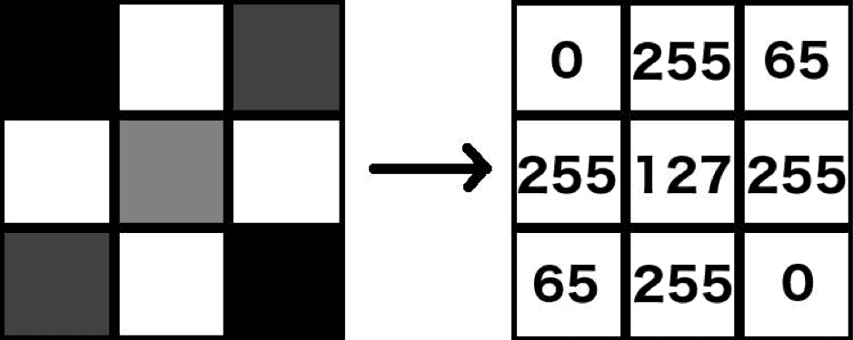

同样，像素值为 0 意味着它是一片漆黑，而 255 意味着它是纯亮度的(也就是说，灰度是纯白，彩色图像的各个通道是纯红/绿/蓝)。

## **将图像转换成结构化数组和标量**

Python 可以将图像转换成结构化数组和标量，如下所示:

The following code is available as `Inspecting_grayscale_images.ipynb` in the `Chapter03` folder of this book's GitHub repository - [https://tinyurl.com/mcvp-packt](https://tinyurl.com/mcvp-packt)

1.  下载示例图像:

```py
!wget https://www.dropbox.com/s/l98leemr7r5stnm/Hemanvi.jpeg

```

2.  导入`cv2`(用于从磁盘读取图像)和`matplotlib`(用于绘制加载的图像)库，并将下载的图像读入 Python 环境:

```py
%matplotlib inline
import cv2, matplotlib.pyplot as plt
img = cv2.imread('Hemanvi.jpeg')

```

在前面的代码行中，我们利用了`cv2.imread`方法来读取图像。这将图像转换为像素值的数组。

3.  我们将在第 50-250 行以及第 40-240 列之间裁剪图像。最后，我们将使用以下代码将图像转换为灰度并绘制它:

```py
# Crop image
img = img[50:250,40:240]
# Convert image to grayscale
img_gray = cv2.cvtColor(img, cv2.COLOR_BGR2GRAY)
# Show image
plt.imshow(img_gray, cmap='gray')
```

前面一系列步骤的输出如下:


您可能已经注意到，前面的图像表示为 200 x 200 的像素数组。现在，让我们减少用于表示图像的像素数量，以便我们可以覆盖图像上的像素值(如果我们要可视化 200 x 200 数组上的像素值，与 25 x 25 数组相比，这将更加困难)。

4.  将图像转换为 25 x 25 的数组，并绘制它:

```py
img_gray_small = cv2.resize(img_gray,(25,25))
plt.imshow(img_gray_small, cmap='gray')

```

这会产生以下输出:


自然地，用更少的像素来表示相同的图像会导致更模糊的输出。

5.  让我们检查像素值。请注意，在以下输出中，由于空间限制，我们仅粘贴了前四行像素值:

```py
print(img_gray_small)

```

这会产生以下输出:

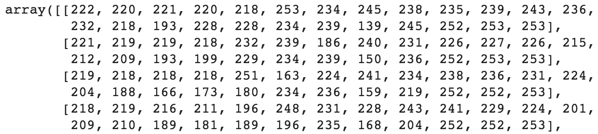

当复制并粘贴到 Excel 中并按像素值进行颜色编码时，同一组像素值将如下所示:


正如我们之前提到的，标量值接近 255 的像素看起来更亮，而接近 0 的像素看起来更暗。

前面的步骤也适用于彩色图像，彩色图像被表示为三维向量。最亮的红色像素表示为(255，0，0)。类似地，三维矢量图像中的纯白像素表示为(255，255，255)。记住这一点，让我们为彩色图像创建一个结构化的像素值数组:

The following code is available as `Inspecting_color_images.ipynb` in the `Chapter03` folder of this book's GitHub repository - [https://tinyurl.com/mcvp-packt](https://tinyurl.com/mcvp-packt)

1.  下载彩色图像:

```py
!wget https://www.dropbox.com/s/l98leemr7r5stnm/Hemanvi.jpeg
```

2.  导入相关包并加载映像:

```py
import cv2, matplotlib.pyplot as plt
%matplotlib inline
img = cv2.imread('Hemanvi.jpeg') 

```

3.  裁剪图像:

```py
img = img[50:250,40:240,:]
img = cv2.cvtColor(img, cv2.COLOR_BGR2RGB) 
```

注意，在前面的代码中，我们使用`cv2.cvtcolor`方法对通道进行了重新排序。我们这样做是因为当我们使用 cv2 导入图像时，通道的顺序是蓝色第一，绿色第二，最后是红色；通常，我们习惯于在 RGB 通道中查看图像，顺序是红色、绿色、然后是蓝色。

4.  绘制获得的图像(注意，如果您正在阅读印刷书籍并且尚未下载彩色图像包，它将以灰度显示):

```py
plt.imshow(img)
print(img.shape)
# (200,200,3)

```

这会产生以下输出:

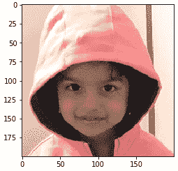

5.  右下角的 3 x 3 像素阵列可以如下获得:

```py
crop = img[-3:,-3:]

```

6.  打印并绘制像素值:

```py
print(crop)
plt.imshow(crop)
```

上述代码会产生以下输出:

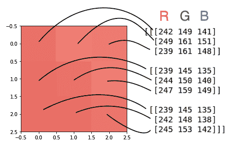

现在，我们可以将每个图像表示为标量数组(对于灰度图像)或数组数组(对于彩色图像)，我们实际上已经将磁盘上的文件转换为结构化的数组格式，现在可以使用多种技术对其进行数学处理。将图像转换为结构化的数字数组(即将图像读入 Python 内存)使我们能够在图像(表示为数字数组)上执行数学运算。我们可以利用这种数据结构来执行各种任务，如分类、检测和分割，所有这些将在后面的章节中详细讨论。

现在我们已经了解了图像是如何表示的，让我们来理解利用神经网络进行图像分类的原因。

# 为什么要利用神经网络进行图像分析？

在传统的计算机视觉中，我们会在使用它们作为输入之前为每个图像创建一些特征。让我们基于下面的样本图像来看一些这样的特征，以便理解我们通过训练神经网络来避免的努力:


请注意，我们不会向您介绍如何获得这些特征，因为这里的目的是帮助您认识到为什么手动创建特征是次优的练习:

*   **直方图特征**:对于一些任务，比如自动亮度或夜视，了解画面中的光照很重要；即亮或暗像素的比例。下图显示了示例图像的直方图。它描述了图像被很好地照亮，因为在 255:


*   **边缘和角点特征**:对于图像分割等任务来说，找到每个人对应的像素集是很重要的，首先提取边缘是有意义的，因为人的边界只是边缘的集合。在诸如图像配准的其他任务中，检测关键标志是至关重要的。这些标志将是图像中所有角的子集。下图显示了我们的示例图像中可以找到的边缘和拐角:

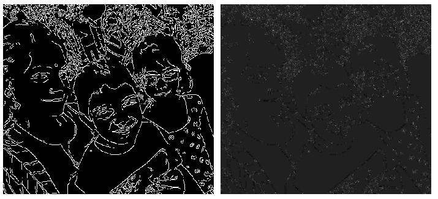

*   **分色功能**:在自动驾驶汽车的交通灯检测等任务中，系统理解交通灯上显示的是什么颜色是很重要的。下图(彩色效果最佳)显示了示例图像中的红色、绿色和蓝色像素:


*   **图像渐变** **特征**:更进一步，理解颜色在像素级别如何变化可能很重要。不同的纹理可以给我们不同的梯度，这意味着它们可以用作纹理检测器。事实上，找到梯度是边缘检测的先决条件。下图显示了示例图像的一部分的整体渐变以及渐变的 y 和 x 分量:


这些仅仅是这些特性中的一小部分。还有很多，很难全部涵盖。创建这些功能的主要缺点是，您需要成为图像和信号分析方面的专家，并且应该完全了解哪些功能最适合解决某个问题。即使两个约束条件都得到满足，也不能保证这样的专家能够找到正确的输入组合，即使他们找到了，也不能保证这样的组合能够在新的、未知的场景中工作。

由于这些缺点，社区在很大程度上转向了基于神经网络的模型。这些模型不仅能自动找到合适的功能，还能学习如何优化组合它们来完成工作。正如我们在第一章中已经了解的，神经网络同时充当特征提取器和分类器。

既然我们已经看了一些历史特征提取技术的例子和它们的缺点，让我们学习如何在图像上训练神经网络。

# 为图像分类准备数据

鉴于我们在本章中涉及多个场景，为了让我们看到一个场景相对于另一个场景的优势，我们将在本章中使用一个数据集——时尚 MNIST 数据集。让我们准备这个数据集:

The following code is available as `Preparing_our_data.ipynb` in the `Chapter03` folder of this book's GitHub repository - [https://tinyurl.com/mcvp-packt](https://tinyurl.com/mcvp-packt)

1.  首先下载数据集并导入相关的包。`torchvision`包包含各种数据集——其中之一是`FashionMNIST`数据集，我们将在本章中讨论它:

```py
from torchvision import datasets
import torch
data_folder = '~/data/FMNIST' # This can be any directory 
# you want to download FMNIST to
fmnist = datasets.FashionMNIST(data_folder, download=True, \
                               train=True)
```

在前面的代码中，我们指定了要存储下载的数据集的文件夹(`data_folder`)。接下来，我们从`datasets.FashionMNIST`获取`fmnist`数据，并将其存储在`data_folder`中。此外，我们通过指定`train = True`来指定我们只想下载训练图像

*   接下来，我们必须将在`fmnist.data`中可用的图像存储为`tr_images`，将在`fmnist.targets`中可用的标签(目标)存储为`tr_targets` :

```py
tr_images = fmnist.data
tr_targets = fmnist.targets

```

2.  检查我们正在处理的张量:

```py
unique_values = tr_targets.unique()
print(f'tr_images & tr_targets:\n\tX -{tr_images.shape}\n\tY \
-{tr_targets.shape}\n\tY-Unique Values : {unique_values}')
print(f'TASK:\n\t{len(unique_values)} class Classification')
print(f'UNIQUE CLASSES:\n\t{fmnist.classes}') 
```

上述代码的输出如下:

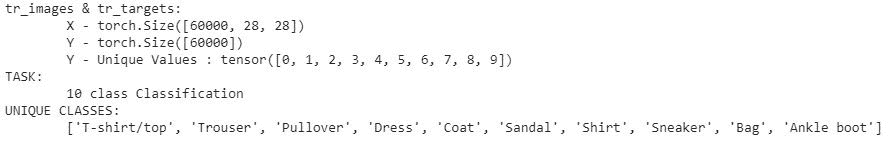

在这里，我们可以看到有 60，000 个图像，每个图像的大小为 28 x 28，所有图像有 10 个可能的类别。注意，`tr_targets`包含了每个类的数值，而`fmnist.classes`给出了对应于`tr_targets`中每个数值的名称。

3.  为所有 10 个可能的类别绘制 10 个图像的随机样本:

*   导入相关的包以绘制图像网格，这样您也可以处理数组:

```py
import matplotlib.pyplot as plt
%matplotlib inline
import numpy as np
```

*   创建一个图，其中我们可以显示一个 10 x 10 的网格，网格的每一行对应一个类，每一列显示一个属于该行的类的示例图像。循环遍历唯一的类别号(`label_class`)，并获取与给定类别号对应的行的索引(`label_x_rows`):

```py
R, C = len(tr_targets.unique()), 10
fig, ax = plt.subplots(R, C, figsize=(10,10))
for label_class, plot_row in enumerate(ax):
    label_x_rows = np.where(tr_targets == label_class)[0]
```

注意，在前面的代码中，我们获取第 0 个^(T4 索引作为`np.where`条件的输出，因为它的长度为 1。它包含目标值(`tr_targets`)等于`label_class`的所有索引的数组。)

*   循环 10 次以填充给定行的列。此外，我们需要从先前获得的对应于给定类别的指数(`label_x_rows`)中选择一个随机值(`ix`)并绘制它们:

```py
    for plot_cell in plot_row:
        plot_cell.grid(False); plot_cell.axis('off')
        ix = np.random.choice(label_x_rows)
        x, y = tr_images[ix], tr_targets[ix]
        plot_cell.imshow(x, cmap='gray')
plt.tight_layout()

```

这会产生以下输出:

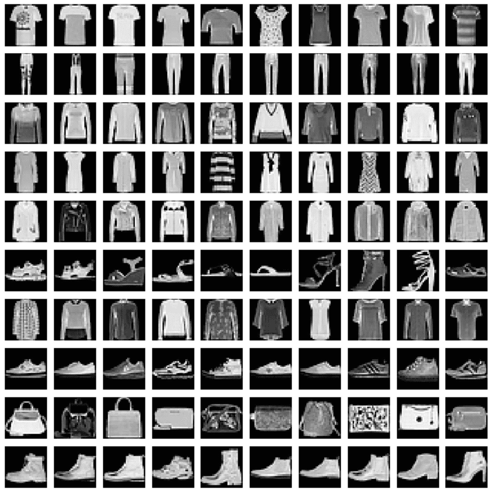

请注意，在前面的图像中，每一行都代表属于同一类的 10 个不同图像的样本。

既然我们已经学习了如何导入数据集，在下一节中，我们将学习如何使用 PyTorch 训练神经网络，以便它接收图像并预测该图像的类别。此外，我们还将了解各种超参数对预测准确性的影响。

# 训练神经网络

为了训练神经网络，我们必须执行以下步骤:

1.  导入相关的包。
2.  构建一个可以一次提取一个数据点的数据的数据集。
3.  从数据集中包装数据加载器。
4.  建立一个模型，然后定义损失函数和优化器。
5.  定义两个函数来分别训练和验证一批数据。
6.  定义一个计算数据准确性的函数。
7.  根据每批数据在不断增加的时期内执行重量更新。

在以下代码行中，我们将执行以下每个步骤:

下面的代码可以在本书的 GitHub 库【https://tinyurl.com/mcvp-packt[的`Chapter03`文件夹中找到`Steps_to_build_a_neural_network_on_FashionMNIST.ipynb`](https://tinyurl.com/mcvp-packt)

1.  导入相关包和 FMNIST 数据集:

```py
from torch.utils.data import Dataset, DataLoader
import torch
import torch.nn as nn
import numpy as np
import matplotlib.pyplot as plt
%matplotlib inline
device = "cuda" if torch.cuda.is_available() else "cpu"
from torchvision import datasets
data_folder = '~/data/FMNIST' # This can be any directory you 
# want to download FMNIST to
fmnist = datasets.FashionMNIST(data_folder, download=True, \
                                                  train=True)
tr_images = fmnist.data
tr_targets = fmnist.targets
```

2.  构建一个获取数据集的类。记住，它是从一个`Dataset`类派生的，需要三个神奇的函数——`__init__`、`__getitem__`和`__len__`—**总是被定义:**

```py
class FMNISTDataset(Dataset):
    def __init__(self, x, y):
        x = x.float()
        x = x.view(-1,28*28)
        self.x, self.y = x, y 
    def __getitem__(self, ix):
        x, y = self.x[ix], self.y[ix] 
        return x.to(device), y.to(device)
    def __len__(self): 
        return len(self.x)
```

注意，在`__init__`方法中，我们将输入转换为浮点数，并将每个图像展平为 28*28 = 784 个数值(其中每个数值对应一个像素值)。我们还在`__len__`方法中指定数据点的数量；这里，是`x`的长度。`__getitem__`方法包含当我们请求第`ix`^(个数据点时应该返回什么的逻辑(`ix`将是一个在`0`和`__len__`之间的整数)。)

3.  创建一个函数，该函数从名为`FMNISTDataset`的数据集生成一个训练数据加载器`trn_dl`。这将针对批量随机采样 32 个数据点:

```py
def get_data(): 
    train = FMNISTDataset(tr_images, tr_targets) 
    trn_dl = DataLoader(train, batch_size=32, shuffle=True)
    return trn_dl
```

在前面的代码行中，我们创建了一个名为`train`的`FMNISTDataset`类的对象，并调用了 DataLoader，以便它随机获取 32 个数据点来返回训练数据加载器；那就是，`trn_dl`。

4.  定义模型，以及损失函数和优化器:

```py
from torch.optim import SGD
def get_model():
    model = nn.Sequential(
                nn.Linear(28 * 28, 1000),
                nn.ReLU(),
                nn.Linear(1000, 10)
            ).to(device)
    loss_fn = nn.CrossEntropyLoss()
    optimizer = SGD(model.parameters(), lr=1e-2)
    return model, loss_fn, optimizer
```

该模型是一个包含 1000 个神经元的隐藏层网络。输出是 10 个神经元层，因为有 10 个可能的类别。此外，我们正在调用`CrossEntropyLoss`函数，因为输出可以属于每个图像的 10 个类中的任何一个。最后，在这个练习中要注意的关键方面是，我们已经将学习率`lr`初始化为值 **0.01** ，而不是默认值 0.001，以查看模型将如何在这个练习中学习。

注意，我们在神经网络中根本没有使用“softmax”。输出的范围是不受约束的，因为值可以具有无限的范围，而交叉熵损失通常期望输出为概率(每行总和应为 1)。这在这个设置中仍然有效，因为`nn.CrossEntropyLoss`实际上希望我们发送原始逻辑(即不受约束的值)。它在内部执行 softmax。

5.  定义将在一批图像上训练数据集的函数:

```py
def train_batch(x, y, model, opt, loss_fn):
    model.train() # <- let's hold on to this until we reach 
    # dropout section
    # call your model like any python function on your batch 
    # of inputs
    prediction = model(x)
    # compute loss
    batch_loss = loss_fn(prediction, y)
    # based on the forward pass in `model(x)` compute all the 
    # gradients of 'model.parameters()'
    batch_loss.backward()
    # apply new-weights = f(old-weights, old-weight-gradients) 
    # where "f" is the optimizer
    optimizer.step()
    # Flush gradients memory for next batch of calculations
 optimizer.zero_grad()
 return batch_loss.item()
```

前面的代码在正向传递中将一批图像传递给模型。它还计算批量损失，然后通过反向传播传递权重并更新它们。最后，它刷新梯度的记忆，使它不影响如何在下一个过程中计算梯度。

现在我们已经完成了，我们可以通过在`batch_loss`上提取`batch_loss.item()`来提取损失值作为一个标量。

6.  构建一个计算给定数据集精确度的函数:

```py
# since there's no need for updating weights, 
# we might as well not compute the gradients.
# Using this '@' decorator on top of functions 
# will disable gradient computation in the entire function
@torch.no_grad() def accuracy(x, y, model):
    model.eval() # <- let's wait till we get to dropout 
    # section
    # get the prediction matrix for a tensor of `x` images
    prediction = model(x)
    # compute if the location of maximum in each row 
    # coincides with ground truth
    max_values, argmaxes = prediction.max(-1)
    is_correct = argmaxes == y
    return is_correct.cpu().numpy().tolist()
```

在前面的代码行中，我们明确提到，我们不需要通过提供`@torch.no_grad()`来计算梯度，也不需要通过模型的前馈输入来计算`prediction`值。

接下来，我们调用`prediction.max(-1)`来标识对应于每一行的 argmax 索引。

此外，我们正在通过`argmaxes == y`将我们的`argmaxes`与实际情况进行比较，以便我们可以检查每一行是否预测正确。最后，我们在将`is_correct`对象列表移动到 CPU 并转换成 numpy 数组后，返回该列表。

7.  使用下列代码行来训练神经网络:

*   初始化模型、损失、优化器和数据加载器:

```py
trn_dl = get_data()
model, loss_fn, optimizer = get_model()
```

*   在每个时期结束时调用包含精度和损失值的列表:

```py
losses, accuracies = [], []
```

*   定义纪元的数量:

```py
for epoch in range(5):
    print(epoch)
```

*   调用列表，该列表将包含与一个时期内的每个批次相对应的准确度和损失值:

```py
    epoch_losses, epoch_accuracies = [], []
```

*   通过迭代数据加载器创建批量训练数据:

```py
    for ix, batch in enumerate(iter(trn_dl)):
        x, y = batch
```

*   使用`train_batch`功能训练批次，并将训练结束时的损失值作为`batch_loss`存储在批次顶部。此外，将各批次的损失值存储在`epoch_losses`列表中:

```py
        batch_loss = train_batch(x, y, model, optimizer, \
                                                    loss_fn)
        epoch_losses.append(batch_loss)
```

*   我们存储一个时期内所有批次的平均损失值:

```py
    epoch_loss = np.array(epoch_losses).mean()
```

*   接下来，我们在所有批次的训练结束时计算预测的准确性:

```py
    for ix, batch in enumerate(iter(trn_dl)):
        x, y = batch
        is_correct = accuracy(x, y, model)
        epoch_accuracies.extend(is_correct)
    epoch_accuracy = np.mean(epoch_accuracies)
```

*   将每个时期结束时的损失和精度值存储在列表中:

```py
    losses.append(epoch_loss)
    accuracies.append(epoch_accuracy)
```

可以使用以下代码来显示训练损失和准确度在增加的时期内的变化:

```py
epochs = np.arange(5)+1
plt.figure(figsize=(20,5))
plt.subplot(121)
plt.title('Loss value over increasing epochs')
plt.plot(epochs, losses, label='Training Loss')
plt.legend()
plt.subplot(122)
plt.title('Accuracy value over increasing epochs')
plt.plot(epochs, accuracies, label='Training Accuracy')
plt.gca().set_yticklabels(['{:.0f}%'.format(x*100) \
                           for x in plt.gca().get_yticks()]) 
plt.legend()
```

上述代码的输出如下:


在五个时期结束时，我们的训练准确度是 12%。注意，随着时间的增加，损失值并没有显著降低。换句话说，无论我们等待多长时间，模型都不太可能提供高精度(比如说，80%以上)。这要求我们理解所使用的各种超参数如何影响我们的神经网络的准确性。

注意，由于我们没有保存`torch.random_seed(0)`，当您执行提供的代码时，结果可能会有所不同。然而，你得到的结果也应该让你得到类似的结论。

现在，您已经对如何训练神经网络有了一个完整的了解，让我们来研究一些我们应该遵循的良好实践，以实现良好的模型性能，以及使用它们背后的原因。这可以通过微调各种超参数来实现，其中一些我们将在接下来的章节中讨论。

# 缩放数据集以提高模型准确性

缩放数据集是确保变量被限制在有限范围内的过程。在本节中，我们将通过将每个输入值除以数据集中的最大可能值，将自变量的值限制在 0 到 1 之间。这是一个值 255，对应于白色像素:

The following code is available as `Scaling_the_dataset.ipynb` in the `Chapter03` folder of this book's GitHub repository - [https://tinyurl.com/mcvp-packt](https://tinyurl.com/mcvp-packt)

1.  获取数据集以及训练图像和目标，就像我们在上一节中所做的那样:

```py
from torchvision import datasets
from torch.utils.data import Dataset, DataLoader
import torch
import torch.nn as nn
device = "cuda" if torch.cuda.is_available() else "cpu"
import numpy as np
data_folder = '~/data/FMNIST' # This can be any directory you 
# want to download FMNIST to
fmnist = datasets.FashionMNIST(data_folder, download=True, \
                                    train=True)
tr_images = fmnist.data
tr_targets = fmnist.targets
```

2.  修改`FMNISTDataset`，获取数据，使输入图像除以 255(像素的最大强度/值):

```py
class FMNISTDataset(Dataset):
    def __init__(self, x, y):
        x = x.float()/255
        x = x.view(-1,28*28)
        self.x, self.y = x, y 
    def __getitem__(self, ix):
        x, y = self.x[ix], self.y[ix] 
        return x.to(device), y.to(device)
    def __len__(self): 
        return len(self.x)
```

请注意，与上一节相比，我们在这里所做的唯一更改是，我们将输入数据除以最大可能像素值–255。

假设像素值的范围在 0 到 255 之间，将它们除以 255 将得到始终在 0 到 1 之间的值。

3.  训练一个模型，就像我们在前面章节的*步骤 4* 、 *5* 、 *6* 和 *7* 中所做的那样:

*   获取数据:

```py
def get_data(): 
    train = FMNISTDataset(tr_images, tr_targets) 
    trn_dl = DataLoader(train, batch_size=32, shuffle=True)
    return trn_dl
```

*   定义模型:

```py
from torch.optim import SGD
def get_model():
    model = nn.Sequential(
                nn.Linear(28 * 28, 1000),
                nn.ReLU(),
                nn.Linear(1000, 10)
            ).to(device)
    loss_fn = nn.CrossEntropyLoss()
    optimizer = SGD(model.parameters(), lr=1e-2)
    return model, loss_fn, optimizer
```

*   定义用于训练和验证一批数据的函数:

```py
def train_batch(x, y, model, opt, loss_fn):
    model.train()
    # call your model like any python function on your batch 
    # of inputs
    prediction = model(x)
    # compute loss
    batch_loss = loss_fn(prediction, y)
    # based on the forward pass in `model(x)` compute all the 
    # gradients of 'model.parameters()'
    batch_loss.backward()
    # apply new-weights = f(old-weights, old-weight-gradients) 
    # where "f" is the optimizer
    optimizer.step()
    # Flush memory for next batch of calculations
 optimizer.zero_grad()
 return batch_loss.item() @torch.no_grad()
def accuracy(x, y, model):
 model.eval()   
    # get the prediction matrix for a tensor of `x` images
 prediction = model(x)
    # compute if the location of maximum in each row 
    # coincides with ground truth
 max_values, argmaxes = prediction.max(-1)
    is_correct = argmaxes == y
    return is_correct.cpu().numpy().tolist()
```

*   在不断增加的时期内训练模型:

```py
trn_dl = get_data()
model, loss_fn, optimizer = get_model()
losses, accuracies = [], []
for epoch in range(5):
    print(epoch)
    epoch_losses, epoch_accuracies = [], []
    for ix, batch in enumerate(iter(trn_dl)):
        x, y = batch
        batch_loss = train_batch(x, y, model, optimizer, 
                                        loss_fn)
        epoch_losses.append(batch_loss)
    epoch_loss = np.array(epoch_losses).mean()
    for ix, batch in enumerate(iter(trn_dl)):
        x, y = batch
        is_correct = accuracy(x, y, model)
        epoch_accuracies.extend(is_correct)
    epoch_accuracy = np.mean(epoch_accuracies)
    losses.append(epoch_loss)
    accuracies.append(epoch_accuracy)
```

训练损失和精度值的变化如下:

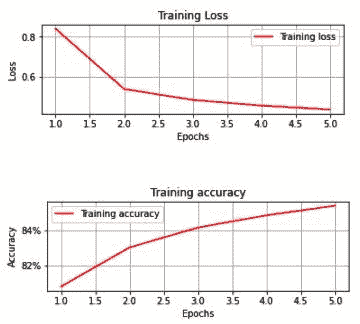

如我们所见，训练损失持续减少，训练准确度持续增加，从而将时期准确度增加到约 85%。

将前面的输出与输入数据未缩放的情况进行对比，在这种情况下，训练损失没有持续减少，并且在五个时期结束时训练数据集的准确性仅为 12%。

让我们深入探讨一下缩放在这里有所帮助的可能原因。

让我们以如何计算 sigmoid 值为例:

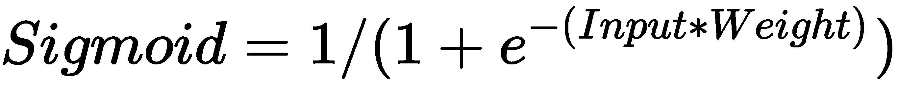

在下表中，我们根据前面的公式计算了 **Sigmoid** 列:

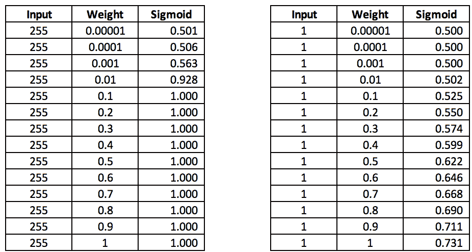

在左侧表格中，我们可以看到，当权重值大于 0.1 时，Sigmoid 值不会随着权重值的增加(变化)而变化。此外，当重量极小时，Sigmoid 值仅变化很小；改变 sigmoid 值的唯一方法是将重量改变到非常非常小的量。

然而，当输入值较小时，右侧表格中的 Sigmoid 值变化很大。

其原因是大负值的指数(由权重值乘以大数值得到)非常接近于 0，而当权重值乘以比例输入时，指数值会发生变化，如右侧表格所示。

现在我们已经知道，除非权重值非常小，否则 Sigmoid 值不会发生显著变化，我们现在将了解如何影响权重值，使其趋向最佳值。

缩放输入数据集以使其包含更小范围的值通常有助于实现更高的模型精度。

接下来，我们将了解任何神经网络的其他主要超参数之一的影响:**批量大小。**

# 了解改变批量大小的影响

在上一节中，训练数据集中每批考虑 32 个数据点。这导致每个时期更大数量的权重更新，因为每个时期有 1，875 个权重更新(60，000/32 几乎等于 1，875，其中 60，000 是训练图像的数量)。

此外，我们没有考虑模型在未知数据集(验证数据集)上的性能。我们将在本节中探讨这一点。

在本节中，我们将比较以下内容:

*   当训练批次大小为 32 时，训练和验证数据的损失值和准确度值。
*   当训练批次大小为 10，000 时，训练和验证数据的损失值和准确度值。

既然我们已经引入了验证数据，那么让我们重新运行在*构建神经网络*部分中提供的代码，使用额外的代码来生成验证数据，以及计算验证数据集的损失和准确度值。

The code for the *Batch size of 32* and *Batch size of 10,000* sections is available as `Varying_batch_size.ipynb` in the `Chapter03` folder of this book's GitHub repository - [https://tinyurl.com/mcvp-packt](https://tinyurl.com/mcvp-packt)

## 32 件的批量

假设我们已经建立了一个在训练期间使用 32 批次大小的模型，我们将详细说明用于处理验证数据集的附加代码。我们将跳过训练模型的细节，因为这已经出现在*构建神经网络*部分。让我们开始吧:

1.  下载并导入训练图像和目标:

```py
from torchvision import datasets
import torch
data_folder = '~/data/FMNIST' # This can be any directory you 
# want to download FMNIST to
fmnist = datasets.FashionMNIST(data_folder, download=True, \
                                                train=True)
tr_images = fmnist.data
tr_targets = fmnist.targets
```

2.  与训练图像类似，我们必须通过指定`train = False`来下载和导入验证数据集，同时在我们的数据集中调用`FashionMNIST`方法:

```py
val_fmnist =datasets.FashionMNIST(data_folder,download=True, \
                                                 train=False)
val_images = val_fmnist.data
val_targets = val_fmnist.targets
```

3.  导入相关包并定义`device`:

```py
import matplotlib.pyplot as plt
%matplotlib inline
import numpy as np
from torch.utils.data import Dataset, DataLoader
import torch
import torch.nn as nn
device = 'cuda' if torch.cuda.is_available() else 'cpu'
```

4.  定义数据集类(`FashionMNIST`)、将用于对一批数据进行训练的函数(`train_batch`)、计算准确度(`accuracy`)，然后定义模型架构、损失函数和优化器(`get_model`)。请注意，用于获取数据的函数将是唯一与我们在前面章节中看到的有所不同的函数(因为我们现在正在处理定型和验证数据集)，因此我们将在下一步中构建它:

```py
class FMNISTDataset(Dataset):
    def __init__(self, x, y):
        x = x.float()/255
        x = x.view(-1,28*28)
        self.x, self.y = x, y 
    def __getitem__(self, ix):
        x, y = self.x[ix], self.y[ix] 
        return x.to(device), y.to(device)
    def __len__(self): 
        return len(self.x)

from torch.optim import SGD, Adam
def get_model():
    model = nn.Sequential(
                nn.Linear(28 * 28, 1000),
                nn.ReLU(),
                nn.Linear(1000, 10)
            ).to(device)

    loss_fn = nn.CrossEntropyLoss()
    optimizer = Adam(model.parameters(), lr=1e-2)
    return model, loss_fn, optimizer

def train_batch(x, y, model, opt, loss_fn):
    model.train()
    prediction = model(x)
    batch_loss = loss_fn(prediction, y)
    batch_loss.backward()
    optimizer.step()
    optimizer.zero_grad()
    return batch_loss.item()

def accuracy(x, y, model):
 model.eval()
    # this is the same as @torch.no_grad 
    # at the top of function, only difference
    # being, grad is not computed in the with scope
 with torch.no_grad():
        prediction = model(x)
    max_values, argmaxes = prediction.max(-1)
    is_correct = argmaxes == y
    return is_correct.cpu().numpy().tolist()
```

5.  定义一个将获取数据的函数；也就是`get_data`。此函数将返回批量大小为 32 的训练数据和批量大小为验证数据长度的验证数据集(我们不会使用验证数据来训练模型；我们将仅使用它来了解模型在看不见的数据上的准确性):

```py
def get_data(): 
    train = FMNISTDataset(tr_images, tr_targets) 
    trn_dl = DataLoader(train, batch_size=32, shuffle=True)
    val = FMNISTDataset(val_images, val_targets) 
    val_dl = DataLoader(val, batch_size=len(val_images), 
                                            shuffle=False)
    return trn_dl, val_dl
```

在前面的代码中，除了我们之前看到的`train`对象之外，我们还创建了一个名为`val`的`FMNISTDataset`类的对象。此外，用于验证的数据加载器(`val_dl`)的批次大小为`len(val_images)`，而`trn_dl`的批次大小为 32。这是因为当我们获取验证数据的准确性和损失度量时，训练数据用于训练模型。在这一节和下一节中，我们试图理解基于模型的训练时间和准确性改变`batch_size`的影响。

6.  定义一个计算验证数据损失的函数；也就是`val_loss`。请注意，我们是单独计算的，因为训练数据的丢失是在训练模型时计算的:

```py
@torch.no_grad()
def val_loss(x, y, model):
    model.eval()
    prediction = model(x)
    val_loss = loss_fn(prediction, y)
    return val_loss.item()
```

如你所见，我们正在应用`torch.no_grad`,因为我们没有训练模型，只是获取预测。此外，我们通过损失函数(`loss_fn`)传递我们的`prediction`，并返回损失值(`val_loss.item()`)。

7.  获取培训和验证数据加载器。此外，初始化模型、损失函数和优化器:

```py
trn_dl, val_dl = get_data()
model, loss_fn, optimizer = get_model()
```

8.  训练模型，如下所示:

*   初始化包含训练和验证准确性以及递增时期的损失值的列表:

```py
train_losses, train_accuracies = [], []
val_losses, val_accuracies = [], []
```

*   遍历五个时期，并初始化包含给定时期内各批训练数据的准确度和损失的列表:

```py
for epoch in range(5):
    print(epoch)
    train_epoch_losses, train_epoch_accuracies = [], []
```

*   循环遍历一批训练数据，计算一个历元内的精度(`train_epoch_accuracy`)和损失值(`train_epoch_loss`):

```py
    for ix, batch in enumerate(iter(trn_dl)):
        x, y = batch
        batch_loss = train_batch(x, y, model, optimizer, \
                                                loss_fn)
        train_epoch_losses.append(batch_loss) 
    train_epoch_loss = np.array(train_epoch_losses).mean()

    for ix, batch in enumerate(iter(trn_dl)):
        x, y = batch
        is_correct = accuracy(x, y, model)
        train_epoch_accuracies.extend(is_correct)
    train_epoch_accuracy = np.mean(train_epoch_accuracies)
```

*   计算一批验证数据内的损失值和准确度(因为验证数据的批量等于验证数据的长度):

```py
    for ix, batch in enumerate(iter(val_dl)):
        x, y = batch
        val_is_correct = accuracy(x, y, model)
        validation_loss = val_loss(x, y, model)
    val_epoch_accuracy = np.mean(val_is_correct)
```

注意，在前面的代码中，验证数据的丢失值是使用`val_loss`函数计算的，并存储在`validation_loss`变量中。此外，所有验证数据点的精度存储在`val_is_correct`列表中，而其平均值存储在`val_epoch_accuracy`变量中。

*   最后，我们将训练和验证数据集的准确度和损失值附加到包含历元级聚合验证和准确度值的列表。我们这样做是为了在下一步中查看纪元级别的改进:

```py
    train_losses.append(train_epoch_loss)
    train_accuracies.append(train_epoch_accuracy)
    val_losses.append(validation_loss)
    val_accuracies.append(val_epoch_accuracy)
```

9.  直观显示训练和验证数据集中准确性和损失值随时间推移的提高情况:

```py
epochs = np.arange(5)+1
import matplotlib.ticker as mtick
import matplotlib.pyplot as plt
import matplotlib.ticker as mticker
%matplotlib inline
plt.subplot(211)
plt.plot(epochs, train_losses, 'bo', label='Training loss')
plt.plot(epochs, val_losses, 'r', label='Validation loss')
plt.gca().xaxis.set_major_locator(mticker.MultipleLocator(1))
plt.title('Training and validation loss \
when batch size is 32')
plt.xlabel('Epochs')
plt.ylabel('Loss')
plt.legend()
plt.grid('off')
plt.show()
plt.subplot(212)
plt.plot(epochs, train_accuracies, 'bo', \
         label='Training accuracy')
plt.plot(epochs, val_accuracies, 'r', \
         label='Validation accuracy')
plt.gca().xaxis.set_major_locator(mticker.MultipleLocator(1))
plt.title('Training and validation accuracy \
when batch size is 32')
plt.xlabel('Epochs')
plt.ylabel('Accuracy')
plt.gca().set_yticklabels(['{:.0f}%'.format(x*100) \
                           for x in plt.gca().get_yticks()]) 
plt.legend()
plt.grid('off')
plt.show()
```

前面的代码给出了以下输出:


如您所见，当批次大小为 32 时，在五个时期结束时，训练和验证准确度约为 85%。接下来，当在`get_data`函数中训练数据加载器时，我们将改变`batch_size`参数，以查看它在五个时期结束时对准确性的影响。

## 10，000 件的批量

在本节中，我们将使用每批 10，000 个数据点，以便我们可以了解改变批量大小会产生什么影响。

请注意，除了*步骤 5* 中的代码之外，32 部分的*批量中提供的代码在这里保持完全相同。这里，我们将在`get_data`函数中为训练和验证数据集指定数据加载器。**我们鼓励您在执行代码时参考本书的 GitHub 资源库中的相应笔记本。***

我们将修改`get_data`,使其在从训练数据集中获取训练数据加载器时具有 10，000 的批处理大小，如下所示:

```py
def get_data(): 
    train = FMNISTDataset(tr_images, tr_targets) 
    trn_dl = DataLoader(train, batch_size=10000, shuffle=True)
    val = FMNISTDataset(val_images, val_targets) 
    val_dl = DataLoader(val, batch_size=len(val_images), \
                                                shuffle=False)
    return trn_dl, val_dl
```

通过仅在*步骤 5* 中进行这种必要的改变，并且在执行所有步骤直到*步骤 9* 之后，当批量大小为 10，000 时，在增加的时期内，训练和验证的准确度和损失的变化如下:


在这里，我们可以看到准确性和损失值没有达到与前一个场景相同的级别，在前一个场景中，批量大小为 32，因为当批量大小为 32 (1875)时，时间权重更新的次数较少。在批量大小为 10，000 的情况下，每个时期有六个权重更新，因为每批有 10，000 个数据点，这意味着总的训练数据大小为 60，000。

到目前为止，我们已经了解了如何缩放数据集，以及改变批量大小对模型训练时间的影响，以实现一定的准确性。在下一节中，我们将了解在同一个数据集上改变丢失优化器的影响。

当您有少量的历元时，较低的批处理大小通常有助于实现最佳的准确性，但是它不应该太低而影响训练时间。

# 了解改变损失优化器的影响

到目前为止，我们一直在优化基于 Adam 优化器的损失。在本节中，我们将执行以下操作:

*   修改优化器，使其成为一个**随机梯度下降** ( **新币**)优化器
*   在数据加载器中提取数据时，恢复为 32 的批处理大小
*   将时期数增加到 10(这样我们就可以在更长的时期内比较 SGD 和 Adam 的性能)

做出这些改变意味着 32 段的*批量中只有一步会改变(因为在 32* 段的*批量中批量已经是 32)；也就是说，我们将修改优化器，使其成为 SGD 优化器。*

让我们修改 32 部分的*批量的*步骤 4* 中的`get_model`函数，以便修改 optimzier，这样我们就可以使用 SGD 优化器，如下所示:*

The following code is available as `Varying_loss_optimizer.ipynb` in the `Chapter03` folder of this book's GitHub repository - [https://tinyurl.com/mcvp-packt](https://tinyurl.com/mcvp-packt) . Note that we are not providing all the steps for brevity and that only the steps where we're making a change from the code we went through in the *Batch size of 32* section will be discussed in the following code. **We encourage you to refer to the respective notebooks in this book's GitHub repository while executing the code.**

1.  修改优化器，以便在`get_model`函数中使用 SGD 优化器，同时确保其他一切保持不变:

```py
from torch.optim import SGD, Adam
def get_model():
    model = nn.Sequential(
                nn.Linear(28 * 28, 1000),
                nn.ReLU(),
                nn.Linear(1000, 10)
            ).to(device)

    loss_fn = nn.CrossEntropyLoss()
    optimizer = SGD(model.parameters(), lr=1e-2)
    return model, loss_fn, optimizer
```

现在，让我们增加*步骤 8* 中的时期数，同时保持所有其他步骤(除了*步骤 4* 和*步骤 8* )与它们在 32 部分的*批量中相同。*

2.  增加我们将用于训练模型的纪元数量:

```py
train_losses, train_accuracies = [], []
val_losses, val_accuracies = [], []
for epoch in range(10):
    train_epoch_losses, train_epoch_accuracies = [], []
    for ix, batch in enumerate(iter(trn_dl)):
        x, y = batch
        batch_loss = train_batch(x, y, model, optimizer, \
                                                loss_fn)
        train_epoch_losses.append(batch_loss) 
    train_epoch_loss = np.array(train_epoch_losses).mean()

    for ix, batch in enumerate(iter(trn_dl)):
        x, y = batch
        is_correct = accuracy(x, y, model)
        train_epoch_accuracies.extend(is_correct)
    train_epoch_accuracy = np.mean(train_epoch_accuracies)

    for ix, batch in enumerate(iter(val_dl)):
        x, y = batch
        val_is_correct = accuracy(x, y, model)
        validation_loss = val_loss(x, y, model)
    val_epoch_accuracy = np.mean(val_is_correct)

    train_losses.append(train_epoch_loss)
    train_accuracies.append(train_epoch_accuracy)
    val_losses.append(validation_loss)
    val_accuracies.append(val_epoch_accuracy)
```

进行这些更改后，一旦我们按顺序执行 32 个部分的*批量中的所有剩余步骤，训练和验证数据集的准确度和损失值在增加的时期内的变化将如下:*


让我们在优化器为 Adam 的情况下，针对不断增加的时期的训练和验证损失以及准确性变化获取相同的输出。这就要求我们将*步骤 4* 中的优化器改为 Adam。

一旦进行了这种改变并且执行了代码，训练和验证数据集的准确度和损失值的变化如下:


如您所见，当我们使用 Adam 优化器时，准确率仍然非常接近 85%。但是，请注意，到目前为止，学习率为 0.01。

在下一节中，我们将了解学习率对验证数据集准确性的影响。

某些优化器比其他优化器更快地达到最佳精度。Adam 通常能更快地达到最佳精度。其他一些著名的优化器包括 Adagrad、Adadelta、AdamW、LBFGS 和 RMSprop。

# 理解改变学习速度的影响

到目前为止，我们在训练模型时一直使用 0.01 的学习率。在第 1 章*人工神经网络基础*中，我们了解到学习速率在获得最佳权重值方面起着关键作用。这里，当学习率小时，权重值逐渐向最佳值移动，而当学习率大时，权重值在非最佳值振荡。我们在第 1 章*人工神经网络基础*中处理了一个玩具数据集，所以我们将在这一部分处理一个现实场景。

为了理解变化的学习率的影响，我们将经历以下场景:

*   规模数据集上的学习率更高(0.1)
*   缩放数据集的学习率较低(0.00001)
*   未缩放数据集的学习率较低(0.001)
*   在非缩放数据集上的学习率更高(0.1)

总之，在本节中，我们将了解各种学习率值对缩放数据集和非缩放数据集的影响。

在本节中，我们将了解学习率对未缩放数据的影响，尽管我们已经确定缩放数据集是有帮助的。我们再次这样做是因为我们想让您直观地了解在模型能够适应数据的情况和模型不能适应数据的情况之间，权重的分布是如何变化的。

现在，让我们了解模型如何在缩放数据集上学习。

## 学习率对规模数据集的影响

在本节中，我们将根据以下内容对比训练和验证数据集的准确性:

*   高学习率
*   中等学习速度
*   学习率低

以下三小节的代码可以在本书的 GitHub 资源库【https://tinyurl.com/mcvp-packt[的`Chapter03`文件夹中的`Varying_learning_rate_on_scaled_data.ipynb`中找到。注意，为了简洁起见，我们没有提供所有的步骤；下面的代码将只讨论与我们在*32*部分中所经历的代码有所不同的步骤。**我们鼓励您在执行代码时参考本书的 GitHub 资源库中相应的笔记本。**](https://tinyurl.com/mcvp-packt)

我们开始吧！

### 高学习率

在本节中，我们将采用以下策略:

*   当我们使用 Adam 优化器时，我们需要执行的步骤将与 32 部分的*批处理大小完全相同。*
*   当我们定义`get_model`函数时，唯一的变化是`optimizer`中的学习率。这里，我们将把学习率(`lr`)的值改为 0.1。

请注意，除了我们将在本节中对`get_model`函数进行的修改之外，所有代码都与 32 节中的*批量相同。*

要修改学习率，我们必须在`optimizer`的定义中进行更改，这可以在`get_model`函数中找到，如下所示:

```py
def get_model():
    model = nn.Sequential(
                nn.Linear(28 * 28, 1000),
                nn.ReLU(),
                nn.Linear(1000, 10)
            ).to(device)

    loss_fn = nn.CrossEntropyLoss()
    optimizer = Adam(model.parameters(), lr=1e-1)
    return model, loss_fn, optimizer
```

注意，在前面的代码中，我们修改了优化器，使其学习率为 0.1 ( `lr=1e-1`)。

一旦我们执行了 GitHub 中提供的所有剩余步骤，对应于训练和验证数据集的准确度和损失值将如下所示:


请注意，验证数据集的准确度约为 25%(与我们在学习率为 0.01 时达到的约 85%的准确度相比)。

在下一节中，我们将了解学习率为中等(0.001)时验证数据集的准确性。

### 中等学习速度

在本节中，我们将通过修改`get_model`函数并从头开始重新训练模型，将优化器的学习率降低到 0.001。

`get_model`功能修改后的代码如下:

```py
def get_model():
    model = nn.Sequential(
                nn.Linear(28 * 28, 1000),
                nn.ReLU(),
                nn.Linear(1000, 10)
            ).to(device)

    loss_fn = nn.CrossEntropyLoss()
    optimizer = Adam(model.parameters(), lr=1e-3)
    return model, loss_fn, optimizer
```

注意，在前面的代码中，由于我们修改了`lr`参数值，学习率已经降低到一个很小的值。

一旦我们执行了 GitHub 中提供的所有剩余步骤，对应于训练和验证数据集的准确度和损失值将如下所示:

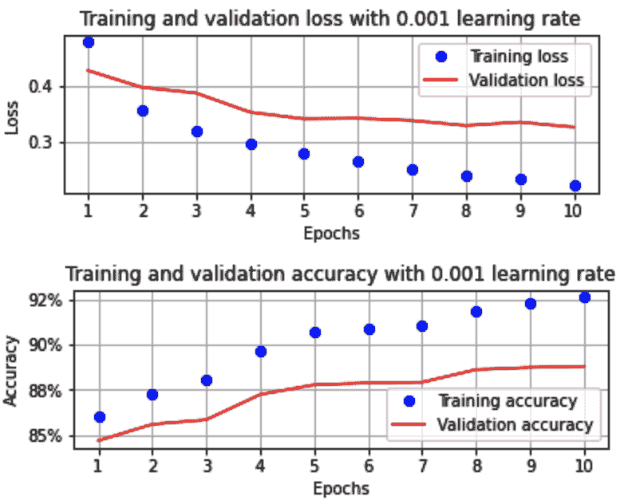

从前面的输出可以看出，当学习率(`or`)从 0.1 降低到 0.001 时，模型训练成功

在下一节中，我们将进一步降低学习率。

### 学习率低

在本节中，我们将通过修改`get_model`函数并从头开始重新训练模型，将优化器的学习率降低到 0.00001。此外，我们将运行模型更长的时期(100)。

我们将为`get_model`函数使用的修改后的代码如下:

```py
def get_model():
    model = nn.Sequential(
                nn.Linear(28 * 28, 1000),
                nn.ReLU(),
                nn.Linear(1000, 10)
            ).to(device)

    loss_fn = nn.CrossEntropyLoss()
    optimizer = Adam(model.parameters(), lr=1e-5)
    return model, loss_fn, optimizer
```

注意，在前面的代码中，由于我们修改了`lr`参数值，学习率已经降低到一个非常小的值。

一旦我们执行了 GitHub 中提供的所有剩余步骤，对应于训练和验证数据集的准确度和损失值将如下所示:

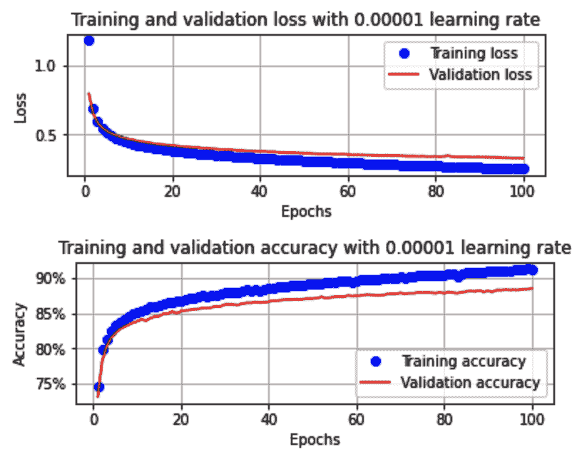

从上图中，我们可以看到，与之前的场景相比，该模型的学习速度要慢得多(中等学习速度)。这里，与学习率为 0.001 时的八个时期相比，需要大约 100 个时期才能达到大约 89%的准确度。

此外，我们还应该注意到，当学习率与之前的场景相比较低时，训练和验证损失之间的差距要小得多(在之前的场景中，在时期 4 的末尾存在类似的差距)。其原因是当学习率低时，权重更新低得多，这意味着训练和验证损失之间的差距不会迅速扩大。

到目前为止，我们已经了解了学习率对训练和验证数据集准确性的影响。在下一节中，我们将了解对于不同的学习率值，权重值的分布如何在各层之间变化。

### 不同学习速率的跨层参数分布

在前面的章节中，我们了解到在高学习率(0.1)的情况下，模型无法被训练(模型训练不足)。然而，我们可以训练模型，以便当学习率为中等(0.001)或低(0.00001)时，它具有相当高的准确性。在这里，我们看到中等学习率能够快速地过度拟合，而低学习率需要更长的时间才能达到与中等学习率模型相当的精度。

在本节中，我们将了解参数分布如何成为模型过拟合和欠拟合的良好指标。

到目前为止，我们的模型中有四个参数组:

*   将输入层连接到隐藏层的层中的权重
*   隐藏层中的偏差
*   将隐藏层连接到输出层的层中的权重
*   输出层中的偏置

让我们使用下面的代码来看看这些参数的分布情况(我们将为每个模型执行下面的代码):

```py
for ix, par in enumerate(model.parameters()):
    if(ix==0):
        plt.hist(par.cpu().detach().numpy().flatten())
        plt.title('Distribution of weights conencting \
                    input to hidden layer')
        plt.show()
    elif(ix ==1):
        plt.hist(par.cpu().detach().numpy().flatten())
        plt.title('Distribution of biases of hidden layer')
        plt.show()
    elif(ix==2):
        plt.hist(par.cpu().detach().numpy().flatten())
        plt.title('Distribution of weights conencting \
                    hidden to output layer')
        plt.show()
    elif(ix ==3):
        plt.hist(par.cpu().detach().numpy().flatten())
        plt.title('Distribution of biases of output layer')
        plt.show()
```

注意`model.parameters`将因我们绘制分布图的型号而异。上述代码在三种学习速率下的输出如下:


在这里，我们可以看到以下内容:

*   当学习率高时，与中等和低学习率相比，参数具有大得多的分布。
*   当参数分布较大时，会出现过度拟合。

到目前为止，我们已经研究了改变学习率对在规模数据集上训练的模型的影响。在下一节中，我们将了解改变学习率对在非缩放数据上训练的模型的影响。

请注意，尽管我们已经确定始终缩放输入值更好，但我们将继续确定在非缩放数据集上训练模型的影响。

## 改变学习率对未缩放数据集的影响

在这一节中，我们将通过在定义数据集的类中不执行除以 255 来恢复对数据集的操作。可以这样做:

The code for this section is available as `Varying_learning_rate_on_non_scaled_data.ipynb` in the `Chapter03` folder of this book's GitHub repository - [https://tinyurl.com/mcvp-packt](https://tinyurl.com/mcvp-packt) . Note that we are not providing all the steps for brevity and that only the steps where there is a change from the code we went through in the *Batch size of 32* section will be discussed in the following code. **We encourage you to refer to the notebooks in this book's GitHub repository while executing the code.**

```py
class FMNISTDataset(Dataset):
    def __init__(self, x, y):
        x = x.float() # Note that the data is not scaled in this 
        # scenario
        x = x.view(-1,28*28)
        self.x, self.y = x, y 
    def __getitem__(self, ix):
        x, y = self.x[ix], self.y[ix] 
        return x.to(device), y.to(device)
    def __len__(self): 
        return len(self.x)
```

注意，在前面代码(`x = x.float()`)中突出显示的部分，我们没有除以 255，这是我们在缩放数据集时执行的。

通过改变跨时期的准确度和损失值来改变学习率的结果如下:


正如我们所看到的，即使数据集是非缩放的，当学习率为 0.1 时，我们也无法训练出准确的模型。此外，当学习率为 0.001 时，精度不如前一部分中的精度高。

最后，当学习率非常小(0.00001)时，模型能够像在前面的部分中一样学习，但是这次过度拟合了训练数据。让我们通过研究跨层的参数分布来理解为什么会发生这种情况，如下所示:

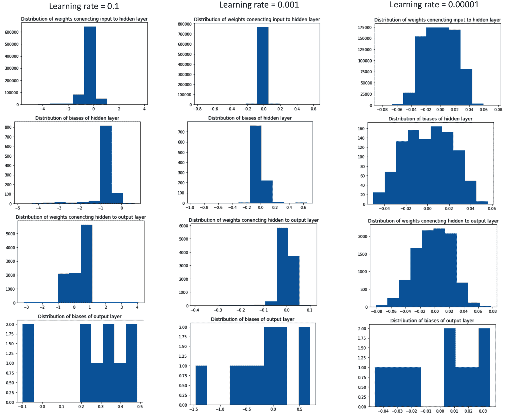

这里，我们可以看到，当模型精度高时(当学习率为 0.00001 时)，与学习率高时相比，权重具有小得多的范围(在这种情况下通常在-0.05 到 0.05 之间)。

因为学习率小，所以权重可以向小值调整。请注意，在非缩放数据集上学习率为 0.00001 的情况等同于在缩放数据集上学习率为 0.001 的情况。这是因为权重现在可以向非常小的值移动(因为梯度*学习率是非常小的值，假设学习率很小)。

既然我们已经确定了高学习率不可能在缩放数据集和非缩放数据集上产生最佳结果，那么在下一节中，我们将了解如何在模型开始过度拟合时自动降低学习率。

通常，0.001 的学习率是有效的。学习率非常低意味着需要很长时间来训练模型，而学习率很高会导致模型变得不稳定。

# 了解学习率退火的影响

到目前为止，我们已经初始化了一个学习率，在训练模型时，它在所有时期都保持不变。然而，最初，将权重快速更新到接近最优的情况是直观的。从那时起，它们应该非常缓慢地更新，因为最初减少的损失量很高，而在以后的时期减少的损失量很低。

这要求在开始时有一个高的学习率，然后随着模型达到接近最优的精度，逐渐降低学习率。这就需要我们了解什么时候必须降低学习率。

我们可以解决这个问题的一个潜在方法是通过持续监控验证损失，如果验证损失没有减少(比如说，在之前的 x 个时期)，那么我们降低学习率。

PyTorch 为我们提供了一些工具，当验证损失在前一个“x”时期没有减少时，我们可以使用这些工具来降低学习率。在这里，我们可以使用`lr_scheduler`方法:

```py
from torch import optim
scheduler = optim.lr_scheduler.ReduceLROnPlateau(optimizer,
                                    factor=0.5,patience=0,
                                    threshold = 0.001, 
                                    verbose=True, 
                                    min_lr = 1e-5, 
                                    threshold_mode = 'abs')
```

在前面的代码中，我们指定，如果某个值在接下来的 *n* 个时期(这里 *n* 是 0)没有提高`threshold`(这里是 0.001)，我们将把`optimizer`的学习率参数减少`factor`0.5。最后，我们指定学习率`min_lr`(假定它以 0.5 的因子减少)不能低于 1e-5，并且`threshold_mode`应该是绝对的，以确保越过最小阈值 0.001。

现在我们已经了解了调度程序，让我们在训练模型时应用它。

与前几节相似，所有代码与 32 节的*批次大小相同，除了此处显示的粗体代码，该代码是为计算验证损失而添加的:*

The code for this section is available as `Learning_rate_annealing.ipynb` in the `Chapter03` folder of this book's GitHub repository - [https://tinyurl.com/mcvp-packt](https://tinyurl.com/mcvp-packt) . Note that we are not providing all the steps for brevity and that only the steps where there is a change from the code we went through in the *Batch size of 32* section will be discussed in the following code. **We encourage you to refer to the notebooks in this book's GitHub repository while executing the code.**

```py
from torch import optim
scheduler = optim.lr_scheduler.ReduceLROnPlateau(optimizer, 
 factor=0.5, patience=0, 
 threshold = 0.001, 
 verbose=True, 
 min_lr = 1e-5, 
 threshold_mode = 'abs')
train_losses, train_accuracies = [], []
val_losses, val_accuracies = [], []
for epoch in range(30):
    #print(epoch)
    train_epoch_losses, train_epoch_accuracies = [], []
    for ix, batch in enumerate(iter(trn_dl)):
        x, y = batch
        batch_loss = train_batch(x, y, model, optimizer, \
                                 loss_fn)
        train_epoch_losses.append(batch_loss) 
    train_epoch_loss = np.array(train_epoch_losses).mean()

    for ix, batch in enumerate(iter(trn_dl)):
        x, y = batch
        is_correct = accuracy(x, y, model)
        train_epoch_accuracies.extend(is_correct)
    train_epoch_accuracy = np.mean(train_epoch_accuracies)

    for ix, batch in enumerate(iter(val_dl)):
        x, y = batch
        val_is_correct = accuracy(x, y, model)
        validation_loss = val_loss(x, y, model)
        scheduler.step(validation_loss)
    val_epoch_accuracy = np.mean(val_is_correct)

    train_losses.append(train_epoch_loss)
    train_accuracies.append(train_epoch_accuracy)
    val_losses.append(validation_loss)
    val_accuracies.append(val_epoch_accuracy)
```

在前面的代码中，我们指定只要*验证损失*在连续的时期内没有减少，就应该激活调度程序。在这些情况下，学习率降低到当前学习率的 0.5 倍。

在我们的模型上执行此操作的输出如下:


让我们了解随着时代的增加，训练和验证数据集的准确性和损失值的变化:

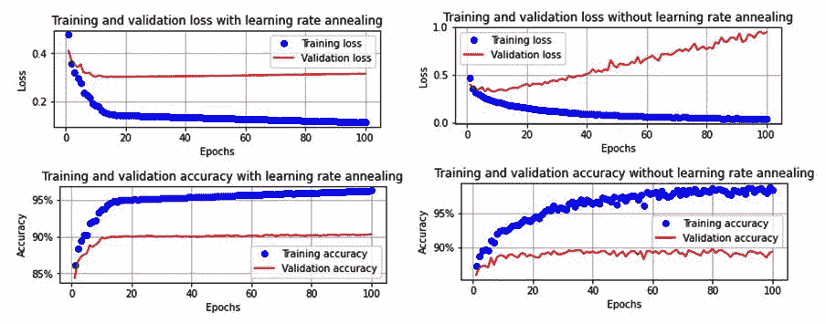

注意，每当验证损失在增加的时期内增加至少 0.001，学习率就减少一半。这发生在 5、8、11、12、13、15 和 16 世纪。

此外，我们没有任何巨大的过度拟合问题，即使我们训练了 100 个纪元的模型。这是因为学习率变得如此之小，以至于权重更新非常小，导致训练和验证精度之间的差距更小(与我们有 100 个时期而没有学习率退火的情况相比，训练精度接近 100%，而验证精度接近 89%)。

到目前为止，我们已经了解了各种超参数对模型准确性的影响。在下一节中，我们将了解神经网络的层数如何影响其准确性。

# 构建更深层次的神经网络

到目前为止，我们的神经网络架构只有一个隐藏层。在本节中，我们将对比有两个隐藏层和没有隐藏层(没有隐藏层是逻辑回归)的模型的性能。

网络中有两层的模型可以按如下方式构建(注意，我们将第二个隐藏层中的单元数设置为 1000)。修改后的`get_model`函数(来自 32 部分的*批量中的代码)，有两个隐藏层，如下所示:*

The following code is available as `Impact_of_building_a_deeper_neural_network.ipynb` in the `Chapter03` folder of this book's GitHub repository - [https://tinyurl.com/mcvp-packt](https://tinyurl.com/mcvp-packt) . Note that we are not providing all the steps for brevity and that only the steps where there is a change from the code we went through in the *Batch size of 32* section will be discussed in the following code. **We encourage you to refer to the notebooks in this book's GitHub repository while executing the code.**

```py
def get_model():
    model = nn.Sequential(
                nn.Linear(28 * 28, 1000),
                nn.ReLU(),
 nn.Linear(1000, 1000),
 nn.ReLU(),
                nn.Linear(1000, 10)
            ).to(device)

    loss_fn = nn.CrossEntropyLoss()
    optimizer = Adam(model.parameters(), lr=1e-3)
    return model, loss_fn, optimizer
```

类似地，`get_model`函数，其中有*没有隐藏层*，如下所示:

```py
def get_model():
    model = nn.Sequential(
                nn.Linear(28 * 28, 10)
            ).to(device)

    loss_fn = nn.CrossEntropyLoss()
    optimizer = Adam(model.parameters(), lr=1e-3)
    return model, loss_fn, optimizer
```

请注意，在前面的函数中，我们将输入直接连接到输出层。

一旦我们像在*批次大小 32* 部分中那样训练模型，训练和验证数据集的准确度和损失将如下:

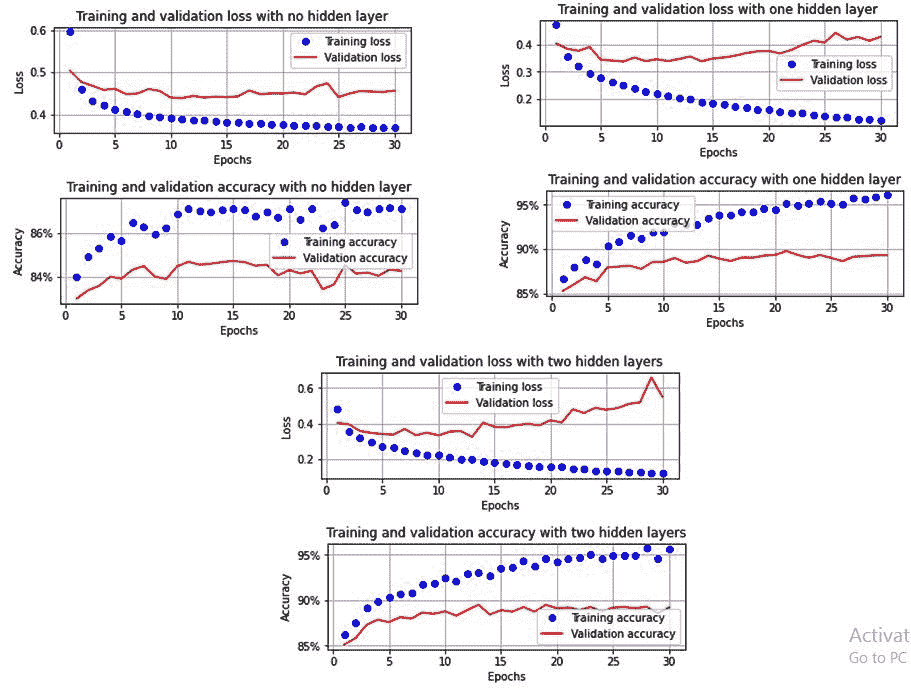

在此，请注意以下几点:

*   当没有隐藏层时，模型不能很好地学习。

*   与一个隐藏层相比，当有两个隐藏层时，模型过度拟合的量更大(与具有一个层的模型相比，具有两个层的模型中的验证损失更高)。

到目前为止，在不同的部分，我们已经看到，当输入数据没有缩放(缩小到一个小范围)时，模型无法很好地训练。由于在获取隐藏层中的节点值时涉及矩阵乘法，非缩放数据(具有较高范围的数据)也可能出现在隐藏层中(特别是当我们有具有多个隐藏层的深度神经网络时)。在下一节中，我们将学习如何在中间层处理这种不可伸缩的数据。

# 了解批处理规范化的影响

之前，我们了解到当输入值较大时，当权重值显著变化时，Sigmoid 输出的变化不会产生太大影响。

现在，让我们考虑相反的场景，其中输入值非常小:


当输入值很小时，Sigmoid 输出会发生轻微变化，从而对权重值产生较大变化。

此外，在*缩放输入数据*部分，我们看到大的输入值对训练精度有负面影响。这表明我们的输入既不能有很小的值，也不能有很大的值。

除了很小或很大的输入值之外，我们还可能会遇到这样的情况:隐藏层中某个节点的值可能会导致很小的数字或很大的数字，从而导致我们之前看到的连接隐藏层和下一层的权重的相同问题。

在这种情况下，批处理规范化可以解决问题，因为它可以对每个节点的值进行规范化，就像我们缩放输入值一样。

通常，一个批处理中的所有输入值按如下方式缩放:

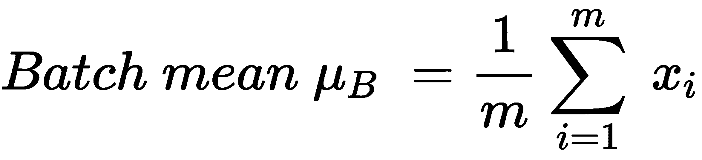


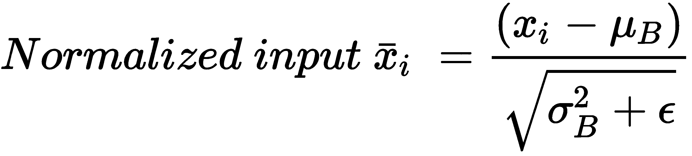

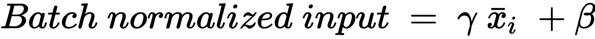

通过从批次平均值中减去每个数据点，然后除以批次方差，我们已经将节点处批次的所有数据点标准化到固定范围。

虽然这被称为硬归一化，但通过引入γ和β参数，我们让网络识别最佳归一化参数。

为了理解批处理规范化过程的作用，我们来看一下训练和验证数据集的损失值和精度值，以及隐藏图层值在以下场景中的分布情况:

*   非常小的输入值，没有批量标准化
*   批量标准化的非常小的输入值

我们开始吧！

## 非常小的输入值，没有批量标准化

到目前为止，当我们必须缩放输入数据时，我们将其缩放到 0 到 1 之间的值。在本节中，我们将进一步将其缩放到 0 到 0.0001 之间的值，以便我们可以了解缩放数据的影响。正如我们在本节开始时看到的，即使权重值变化很大，小输入值也不会改变 Sigmoid 值。

为了缩放输入数据集，使其具有非常低的值，我们将通过将输入值的范围从 0 减小到 0.0001 来更改通常在`FMNISTDataset`类中进行的缩放，如下所示:

The following code is available as `Batch_normalization.ipynb` in the `Chapter03` folder of this book's GitHub repository - [https://tinyurl.com/mcvp-packt](https://tinyurl.com/mcvp-packt) . Note that we are not providing all the steps for brevity and that only the steps where there is a change from the code we went through in the *Batch size of 32* section will be discussed in the following code. **We encourage you to refer to the notebooks in this book's GitHub repository while executing the code.**

```py
class FMNISTDataset(Dataset):
    def __init__(self, x, y):
        x = x.float()/(255*10000) # Done only for us to 
        # understand the impact of Batch normalization
        x = x.view(-1,28*28)
        self.x, self.y = x, y 
    def __getitem__(self, ix):
        x, y = self.x[ix], self.y[ix] 
        return x.to(device), y.to(device)
    def __len__(self): 
        return len(self.x)
```

请注意，在代码的粗体部分(`x = x.float()/(255*10000)`)，我们通过将输入像素值除以 10，000，缩小了输入像素值的范围。

接下来，我们必须重新定义`get_model`函数，这样我们就可以获取模型的预测，以及隐藏层的值。我们可以通过指定神经网络类来实现这一点，如下所示:

```py
def get_model():
    class neuralnet(nn.Module):
        def __init__(self):
            super().__init__()
            self.input_to_hidden_layer = nn.Linear(784,1000)
            self.hidden_layer_activation = nn.ReLU()
            self.hidden_to_output_layer = nn.Linear(1000,10)
        def forward(self, x):
            x = self.input_to_hidden_layer(x)
            x1 = self.hidden_layer_activation(x)
            x2= self.hidden_to_output_layer(x1)
            return x2, x1
    model = neuralnet().to(device)
    loss_fn = nn.CrossEntropyLoss()
    optimizer = Adam(model.parameters(), lr=1e-3)
    return model, loss_fn, optimizer
```

在前面的代码中，我们定义了`neuralnet`类，它返回输出层值(`x2`)和隐藏层的激活值(`x1`)。请注意，网络的架构没有改变。

假设`get_model`函数现在返回两个输出，我们需要修改`train_batch`和`val_loss`函数，通过将输入传递给模型来进行预测。这里，我们将只获取输出层值，而不是隐藏层值。假设输出图层值位于从模型返回的第 0 ^个索引中，我们将修改函数，使其仅获取预测的第 0 ^个索引，如下所示:

```py
def train_batch(x, y, model, opt, loss_fn):
    model.train()
    prediction = model(x)[0]
    batch_loss = loss_fn(prediction, y)
    batch_loss.backward()
    optimizer.step()
    optimizer.zero_grad()
    return batch_loss.item()

def accuracy(x, y, model):
    model.eval()
    with torch.no_grad():
        prediction = model(x)[0]
    max_values, argmaxes = prediction.max(-1)
    is_correct = argmaxes == y
    return is_correct.cpu().numpy().tolist()
```

请注意，在前面代码中的粗体部分，我们已经确保只获取模型输出的第 0 ^个索引(因为第 0 ^个索引包含输出层的值)。

现在，当我们运行*缩放* *数据*部分中提供的其余代码时，我们将看到训练和验证数据集中的准确度和损失值在增加的时期内的变化如下:

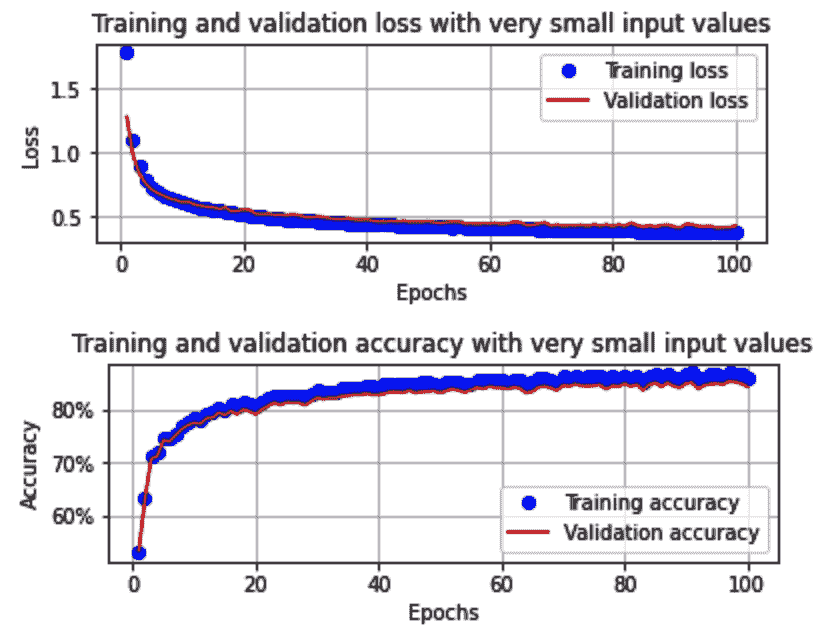

请注意，在前面的场景中，即使在 100 个时期之后，模型也没有训练好(在前面的部分中，模型在 10 个时期内在验证数据集上训练到大约 90%的准确度，而当前模型只有大约 85%的验证准确度)。

让我们通过研究隐藏值的分布以及参数分布，来了解当输入值的范围很小时，模型不能很好地训练的原因:

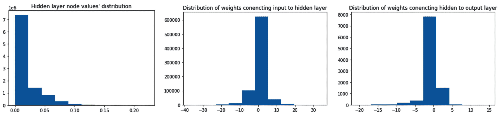

请注意，第一个分布表示隐藏层中的值的分布(我们可以看到这些值的范围非常小)。此外，假设输入层和隐藏层值的范围都很小，则权重必须变化很大(对于将输入连接到隐藏层的权重和将隐藏层连接到输出层的权重)。

既然我们已经了解了当输入值的范围很小时，网络的训练效果并不好，那么我们就来了解批处理规范化是如何帮助增加隐藏层中值的范围的。

## 批量标准化的非常小的输入值

在这一节中，我们将只对上一小节中的代码做一处修改；也就是说，我们将在定义模型架构的同时添加批处理规范化。

修改后的`get_model`功能如下:

```py
def get_model():
    class neuralnet(nn.Module):
        def __init__(self):
            super().__init__()
            self.input_to_hidden_layer = nn.Linear(784,1000)
            self.batch_norm = nn.BatchNorm1d(1000)
            self.hidden_layer_activation = nn.ReLU()
            self.hidden_to_output_layer = nn.Linear(1000,10)
        def forward(self, x):
            x = self.input_to_hidden_layer(x)
            x0 = self.batch_norm(x)
 x1 = self.hidden_layer_activation(x0)
            x2= self.hidden_to_output_layer(x1)
            return x2, x1
    model = neuralnet().to(device)
    loss_fn = nn.CrossEntropyLoss()
    optimizer = Adam(model.parameters(), lr=1e-3)
    return model, loss_fn, optimizer
```

注意，在前面的代码中，我们声明了一个执行批处理规范化(`nn.BatchNorm1d`)的变量(`batch_norm`)。我们执行`nn.BatchNorm1d(1000)`的原因是因为每个图像的输出维度是 1000(即隐藏层的 1 维输出)。

此外，在`forward`方法中，我们在 ReLU 激活之前，通过批量标准化传递隐藏层值的输出。

训练和验证数据集的准确度和损失值在增加的时期内的变化如下:


在这里，我们可以看到模型的训练方式与输入值的范围不是很小时的训练方式非常相似。

让我们了解隐藏层值的分布和权重分布，如前一部分所示:


在这里，我们可以看到，当我们进行批量归一化时，隐藏层值具有较大的分布，而将隐藏层连接到输出层的权重具有较小的分布。模型学习的结果与前几节一样有效。

在训练深度神经网络时，批处理规范化非常有帮助。它帮助我们避免梯度变得如此之小，以至于权重几乎没有更新。

请注意，在前面的场景中，我们比根本没有批处理规范化时更快地获得了高验证准确性。这可能是标准化中间层的结果，从而减少了权重中发生饱和的机会。然而，过度拟合的问题仍有待解决。我们接下来会看这个。

# 过度拟合的概念

到目前为止，我们已经看到训练数据集的准确性通常超过 95%，而验证数据集的准确性大约为 89%。

本质上，这表明该模型不会对看不见的数据集进行太多的归纳，因为它可以从训练数据集中学习。这也表明模型正在学习训练数据集的所有可能的边缘情况；这些不能应用于验证数据集。

在训练数据集上具有高精度而在验证数据集上具有相当低的精度是指过拟合的情况。

用来减少过度拟合影响的一些典型策略如下:

*   拒绝传统社会的人
*   正规化

我们将在接下来的章节中探讨它们的影响。

## 增加辍学的影响

我们已经知道，每当计算`loss.backward()`时，都会发生权重更新。通常，我们在网络中有成千上万的参数和成千上万的数据点来训练我们的模型。这为我们提供了一种可能性，即虽然大多数参数有助于合理地训练模型，但某些参数可以针对训练图像进行微调，导致它们的值仅由训练数据集中的少数图像决定。这反过来导致训练数据具有高精度，但是验证数据集不能概括。

Dropout 是一种随机选择指定激活百分比并将其降至 0 的机制。在下一次迭代中，另一组随机隐藏单元被关闭。这样，神经网络不会针对边缘情况进行优化，因为网络不会有太多的机会来调整权重以记忆边缘情况(假设权重不会在每次迭代中更新)。

请注意，在预测过程中，不需要应用 dropout，因为这种机制只能应用于经过训练的模型。此外，权重将在预测(评估)期间自动缩减，以调整权重的大小(因为所有权重在预测时间期间都存在)。

通常，在训练和验证期间，各层会有不同的表现——就像你在辍学案例中看到的那样。因此，您必须使用两种方法之一提前指定模型的模式——`model.train()`让模型知道它处于训练模式，而`model.eval()`让它知道它处于评估模式。如果我们不这样做，我们可能会得到意想不到的结果。例如，在下图中，请注意模型(包含 dropout)如何在训练模式下对相同的输入给出不同的预测。但是，当同一个模型处于 eval 模式时，它将抑制 dropout 层并返回相同的输出:


定义架构时，`Dropout`在`get_model`函数中指定如下:

The following code is available as `Impact_of_dropout.ipynb` in the `Chapter03` folder of this book's GitHub repository - [https://tinyurl.com/mcvp-packt](https://tinyurl.com/mcvp-packt) . Note that we are not providing all the steps for brevity and that only the steps where there is a change from the code we went through in the *Batch size of 32* section will be discussed in the following code. **We encourage you to refer to the notebooks in this book's GitHub repository while executing the code.**

```py
def get_model():
    model = nn.Sequential(
                nn.Dropout(0.25),
                nn.Linear(28 * 28, 1000),
                nn.ReLU(),
                nn.Dropout(0.25),
                nn.Linear(1000, 10)
            ).to(device)

    loss_fn = nn.CrossEntropyLoss()
    optimizer = Adam(model.parameters(), lr=1e-3)
    return model, loss_fn, optimizer
```

请注意，在前面的代码中，`Dropout`是在线性激活之前指定的。这指定线性激活层中固定百分比的权重不会被更新。

一旦模型训练完成，如 32 个部分的*批量，训练和验证数据集的损失和准确度值将如下:*

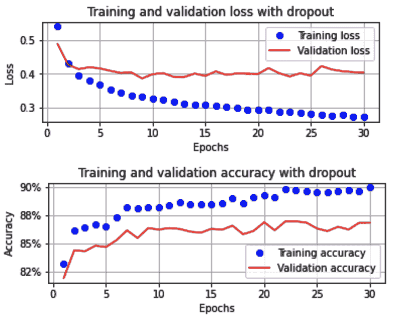

请注意，在前面的方案中，定型数据集和验证数据集的精确度之间的差异没有我们在前面的方案中看到的那么大，因此导致了过度拟合较少的方案。

## 正规化的影响

除了训练精度远高于验证精度之外，过拟合的另一个特征是某些权重值将远高于其他权重值。高权重值可能是模型在训练数据上学习得非常好的症状(本质上，是对它所看到的内容的 rot 学习)。

虽然 dropout 是一种用于使权重值不会频繁更新的机制，但正则化是我们可以用于此目的的另一种机制。

正则化是一种技术，其中我们惩罚具有高权重值的模型。因此，这是一个双重目标函数——最小化训练数据和权重值的损失。在本节中，我们将了解两种类型的正则化:

*   L1 正则化
*   L2 正则化

The following code is available as `Impact_of_regularization.ipynb` in the `Chapter03` folder of this book's GitHub repository - [https://tinyurl.com/mcvp-packt](https://tinyurl.com/mcvp-packt) . Note that we are not providing all the steps for brevity and that only the steps where there is a change from the code we went through in the *Batch size of 32* section will be discussed in the following code. **We encourage you to refer to the notebooks in this book's GitHub repository while executing the code.**

我们开始吧！

### L1 正则化

L1 正则化的计算如下:

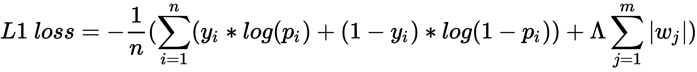

上述公式的第一部分指的是迄今为止我们用于优化的分类交叉熵损失，而第二部分指的是模型权重值的绝对和。

注意，L1 正则化通过将权重的高绝对值合并到损失值计算中，确保其对权重的高绝对值不利。

指我们与正则化(权重最小化)损失相关联的权重。

L1 正则化在训练模型时实现，如下所示:

```py
def train_batch(x, y, model, opt, loss_fn):
    model.train()
    prediction = model(x)
    l1_regularization = 0
    for param in model.parameters():
        l1_regularization += torch.norm(param,1)
    batch_loss = loss_fn(prediction, y)+0.0001*l1_regularization
    batch_loss.backward()
    optimizer.step()
    optimizer.zero_grad()
    return batch_loss.item()
```

在前面的代码中，我们通过初始化`l1_regularization`对所有层的权重和偏差进行了正则化。

`torch.norm(param,1)`提供跨层的权重和偏差值的绝对值。

此外，我们具有与跨层的参数的绝对值之和相关联的非常小的权重(`0.0001`)。

一旦我们执行了剩余的代码，如在 32 个的*批量部分中，训练和验证数据集在增加的时期内的损失和准确度值将如下:*


在这里，我们可以看到，训练和验证数据集的准确性之间的差异没有 L1 正则化时那么高。

### L2 正则化

L2 正则化的计算如下:

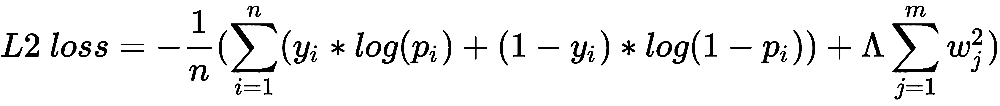

上述公式的第一部分指的是获得的分类交叉熵损失，而第二部分指的是模型的权重值的平方和。

与 L1 正则化类似，我们通过在损失值计算中加入权重的平方和来惩罚高权重值。

指我们与正则化(权重最小化)损失相关联的权重。

L2 正则化在训练模型时实现如下:

```py
def train_batch(x, y, model, opt, loss_fn):
    model.train()
    prediction = model(x)
    l2_regularization = 0
    for param in model.parameters():
        l2_regularization += torch.norm(param,2)
    batch_loss = loss_fn(prediction, y) + 0.01*l2_regularization
    batch_loss.backward()
    optimizer.step()
    optimizer.zero_grad()
    return batch_loss.item()
```

注意，在前面的代码中，正则化参数 (0.01)略高于 L1 正则化，因为权重通常在-1 到 1 之间，并且它们的平方将导致更小的值。将它们乘以一个更小的数，就像我们在 L1 正则化中所做的那样，将导致我们在总损失计算中正则化的权重非常小。

一旦我们执行了剩余的代码，如在 32 个的*批量部分中，训练和验证数据集在增加的时期内的损失和准确度值将如下:*

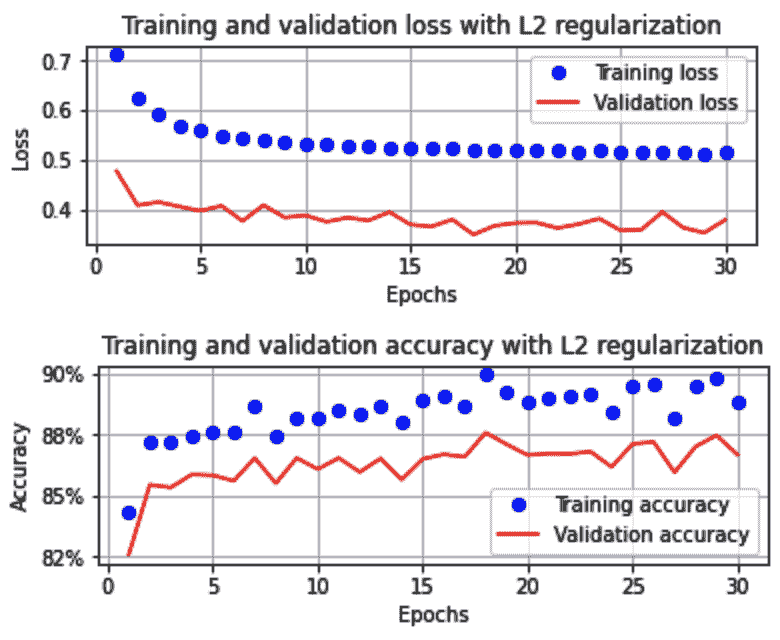

在这里，我们可以看到 L2 正则化也导致了验证和训练数据集的准确性和损失值彼此接近。

最后，让我们比较没有正则化和有 L1/ L2 正则化的权重值，以便我们可以验证我们的理解，即在记忆边缘情况的值时，某些权重变化很大。我们将通过遍历各层的权重分布来实现这一点，如下图所示:

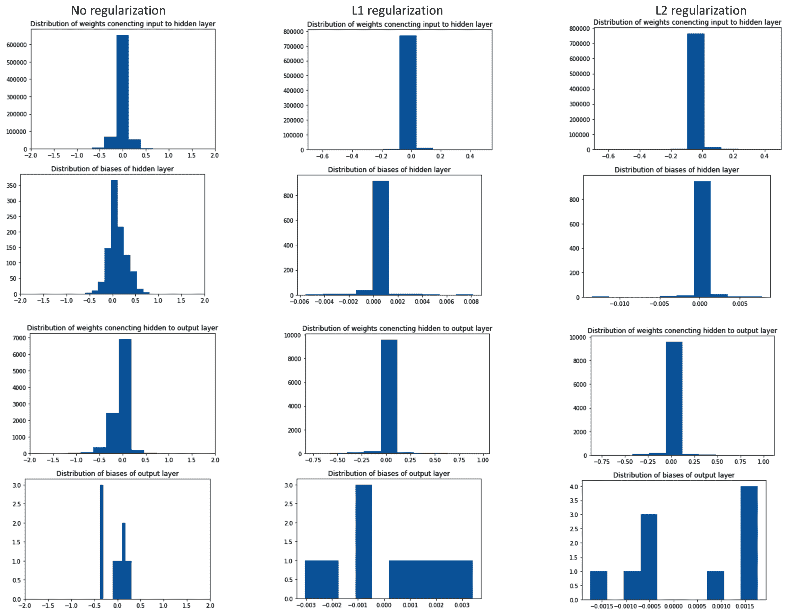

这里，我们可以看到，与不执行正则化相比，当我们执行 L1/ L2 正则化时，参数的分布非常小。这潜在地减少了针对边缘情况更新权重的机会。

# 摘要

本章一开始，我们学习了图像是如何表现的。接下来，我们了解了扩展、学习率的值、我们选择的优化器以及批量大小如何帮助提高训练的准确性和速度。然后，我们了解了批处理规范化如何帮助提高训练速度，并解决隐藏层中非常小或非常大的值的问题。接下来，我们学习了如何安排学习速率来进一步提高准确性。然后，我们开始理解过度拟合的概念，并了解辍学和 L1 和 L2 正则化如何帮助我们避免过度拟合。

现在，我们已经了解了使用深度神经网络进行图像分类，以及帮助训练模型的各种超参数，在下一章中，我们将了解我们在本章中学习的内容如何失败，以及如何使用卷积神经网络解决这一问题。

# 问题

1.  如果输入数据集中的输入值没有缩放，会发生什么情况？
2.  在训练神经网络时，如果背景是白色像素颜色，而内容是黑色像素颜色，会发生什么？
3.  批量大小对模型的训练时间有什么影响，以及它在给定数量的时期内的准确性？
4.  输入值范围对训练结束时的权重分布有什么影响？
5.  批处理规范化如何帮助提高准确性？
6.  我们如何知道一个模型是否过度拟合了训练数据？
7.  正则化如何帮助避免过度拟合？
8.  L1 和 L2 正规化有何不同？
9.  辍学如何有助于减少过度拟合？