# 四、卷积神经网络简介

到目前为止，我们已经了解了如何建立深度神经网络以及调整其各种超参数的影响。在这一章中，我们将了解传统的深度神经网络不起作用的地方。然后，我们将通过使用一个玩具示例来了解**卷积神经网络**(**CNN**)的内部工作方式，然后了解它们的一些主要超参数，包括步长、池和过滤器。接下来，我们将利用 CNN 以及各种数据增强技术来解决传统深度神经网络准确性不高的问题。接下来，我们将了解 CNN 中特征学习过程的结果是什么样的。最后，我们将把我们的学习放在一起解决一个用例:我们将通过声明图像包含一只狗还是一只猫来分类图像。通过这样做，我们将能够理解预测的准确性如何随着可用于训练的数据量而变化。

本章将涵盖以下主题:

*   传统深度神经网络的问题是
*   CNN 的构建模块
*   实现 CNN
*   使用深度细胞神经网络分类图像
*   实现数据扩充
*   可视化特征学习的结果
*   构建用于分类真实世界图像的 CNN

我们开始吧！

# 传统深度神经网络的问题是

在我们深入 CNN 之前，让我们看看使用传统深度神经网络时面临的主要问题。

让我们重新考虑一下我们在第三章、*用 PyTorch* 建立深度神经网络中[在时尚-MNIST 数据集上建立的模型。我们将获取一个随机图像，并预测对应于该图像的类，如下所示:](067f7e89-9e76-4179-879d-c125f8968d25.xhtml)

The code for this section is available as `Issues_with_image_translation.ipynb` in the `Chapter04` folder of this book's GitHub repository - [https://tinyurl.com/mcvp-packt](https://tinyurl.com/mcvp-packt) . Note that the entire code is available in GitHub and that only the additional code corresponding to the issue of image translation will be discussed here for brevity. We strongly encourage you to refer to the notebooks in this book's GitHub repository while executing the code.

1.  从可用的训练图像中提取随机图像:

```py
# Note that you should run the code in 
# Batch size of 32 section in Chapter 3 # before running the following code
import matplotlib.pyplot as plt
%matplotlib inline
# ix = np.random.randint(len(tr_images))
ix = 24300
plt.imshow(tr_images[ix], cmap='gray')
plt.title(fmnist.classes[tr_targets[ix]])
```

上述代码会产生以下输出:


2.  将图像通过**训练过的模型**(继续使用我们在[第三章](067f7e89-9e76-4179-879d-c125f8968d25.xhtml)、*的*批量 32* 部分训练过的模型，用 PyTorch* 构建深度神经网络)。

*   预处理图像，使其经过我们在构建模型时执行的相同预处理步骤:

```py
img = tr_images[ix]/255.
img = img.view(28*28)
img = img.to(device)
```

*   提取与各种类别相关的概率:

```py
np_output = model(img).cpu().detach().numpy()
np.exp(np_output)/np.sum(np.exp(np_output))
```

上述代码会产生以下输出:


从前面的输出中，我们可以看到第 1 个 ^(st) 索引的概率最高，它属于`Trouser`类。

3.  将图像平移(滚动/滑动)多次(一次一个像素)，从向左平移 5 个像素到向右平移 5 个像素，并将预测存储在列表中。

*   创建存储预测的列表:

```py
preds = []
```

*   创建一个循环，将图像从原始位置(位于图像中心)的-5 像素(向左 5 像素)平移(滚动)到+5 像素(向右 5 像素):

```py
for px in range(-5,6):
```

在前面的代码中，我们将 6 指定为上限，尽管我们感兴趣的是平移到+5 像素，因为当(-5，6)是指定的范围时，范围的输出将是从-5 到+5。

*   预处理图像，正如我们在*步骤 2* 中所做的:

```py
    img = tr_images[ix]/255.
    img = img.view(28, 28)
```

*   在`for`循环中将图像滚动一个等于`px`的值:

```py
    img2 = np.roll(img, px, axis=1)
```

在前面的代码中，我们指定了`axis=1`，因为我们希望图像像素水平移动，而不是垂直移动。

*   将滚动图像存储为张量对象，并注册到`device`:

```py
    img3 = torch.Tensor(img2).view(28*28).to(device)
```

*   将`img3`传递给训练好的模型，以预测翻译(滚动)图像的类别，并将其添加到存储各种翻译预测的列表中:

```py
    np_output = model(img3).cpu().detach().numpy()
    preds.append(np.exp(np_output)/np.sum(np.exp(np_output)))
```

4.  可视化所有平移的模型预测(-5 像素到+5 像素):

```py
import seaborn as sns
fig, ax = plt.subplots(1,1, figsize=(12,10))
plt.title('Probability of each class \
for various translations')
sns.heatmap(np.array(preds), annot=True, ax=ax, fmt='.2f', \
            xticklabels=fmnist.classes, \
            yticklabels=[str(i)+str(' pixels') \
                         for i in range(-5,6)], cmap='gray')
```

上述代码会产生以下输出:


图像的内容没有变化，因为我们只将图像向左平移了 5 个像素，向右平移了 5 个像素。然而，当平移超过 2 个像素时，图像的预测类别发生变化。这是因为当模型被训练时，所有训练和测试图像中的内容都在中心。这与前面的场景不同，在前面的场景中，我们使用偏离中心的翻译图像进行测试，从而导致错误预测的类。

既然我们已经了解了传统神经网络失败的场景，我们将了解**CNN**如何帮助解决这个问题。但在此之前，我们将了解 CNN 的组成部分。

# CNN 的构建模块

CNN 是处理图像时最常用的架构。CNN 解决了我们在上一节中看到的深度神经网络的主要限制。除了图像分类之外，它们还有助于目标检测、图像分割、GANs 等等——基本上，在我们使用图像的任何地方。此外，有不同的方法来构建卷积神经网络，并且有多个预训练模型来利用 CNN 执行各种任务。从本章开始，我们将广泛使用 CNN。

在接下来的小节中，我们将了解 CNN 的基本构建模块，如下所示:

*   回旋
*   过滤
*   步幅和衬垫
*   联营

我们开始吧！

## 盘旋

卷积基本上是两个矩阵之间的乘法。正如你在前一章看到的，矩阵乘法是训练神经网络的一个关键因素。(我们在计算隐藏层值时执行矩阵乘法，这是输入值和将输入连接到隐藏层的权重值的矩阵乘法。同样，我们执行矩阵乘法来计算输出图层值。)

为了确保我们对卷积过程有一个坚实的理解，让我们来看看下面的例子。

让我们假设我们有两个矩阵可以用来执行卷积。

这是矩阵 A:


这是矩阵 B:


在执行卷积运算时，您在矩阵 A(较大的矩阵)上滑动矩阵 B(较小的矩阵)。此外，我们正在矩阵 A 和矩阵 B 之间执行元素到元素的乘法，如下所示:

1.  将较大矩阵的{1，2，5，6}乘以较小矩阵的{1，2，3，4}:

*1*1 + 2*2 + 5*3 + 6*4 = 44*

2.  将较大矩阵的{2，3，6，7}乘以较小矩阵的{1，2，3，4}:

*2*1 + 3*2 + 6*3 + 7*4 = 54*

3.  将较大矩阵的{3，4，7，8}乘以较小矩阵的{1，2，3，4}:

*3*1 + 4*2 + 7*3 + 8*4 = 64*

4.  将较大矩阵的{5，6，9，10}乘以较小矩阵的{1，2，3，4}:

*5*1 + 6*2 + 9*3 + 10*4 = 84*

5.  将较大矩阵的{6，7，10，11}乘以较小矩阵的{1，2，3，4}:

*6*1 + 7*2 + 10*3 + 11*4 = 94*

6.  将较大矩阵的{7，8，11，12}乘以较小矩阵的{1，2，3，4}:

*7*1 + 8*2 + 11*3 + 12*4 = 104*

7.  将较大矩阵的{9，10，13，14}乘以较小矩阵的{1，2，3，4}:

*9*1 + 10*2 + 13*3 + 14*4 = 124*

8.  将较大矩阵的{10，11，14，15}乘以较小矩阵的{1，2，3，4}:

*10*1 + 11*2 + 14*3 + 15*4 = 134*

9.  将较大矩阵的{11，12，15，16}乘以较小矩阵的{1，2，3，4}:

*11*1 + 12*2 + 15*3 + 16*4 = 144*

执行上述操作的结果如下:

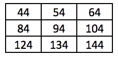

较小的矩阵通常被称为**滤波器**或内核，而较大的矩阵是原始图像。

## 过滤器

过滤器是在开始时随机初始化的权重矩阵。该模型在增加的时期内学习过滤器的最佳权重值。

过滤器的概念带给我们两个不同的方面:

*   过滤器了解什么
*   如何表示过滤器

一般来说，CNN 中的过滤器越多，模型可以了解的图像特征就越多。我们将在本章的*可视化过滤器学习*部分了解各种过滤器学习的内容。现在，我们将确保我们有一个中间的理解，即过滤器了解图像中存在的不同特征。例如，某个过滤器可能会学习猫的耳朵，并在与其卷积的图像部分包含猫的耳朵时提供高激活度(矩阵乘法值)。

在上一节中，我们了解到，当我们将一个大小为 2 x 2 的滤波器与一个大小为 4 x 4 的矩阵进行卷积时，我们得到的输出维度为 3 x 3。

然而，如果 10 个不同的滤波器乘以较大的矩阵(原始图像)，结果是 10 组 3×3 输出矩阵。

在前一种情况下，一个 4 x 4 的图像与 10 个大小为 2 x 2 的滤波器进行卷积，得到 3 x 3 x 10 的输出值。本质上，当图像被多个滤波器卷积时，输出的通道数与图像被卷积的滤波器数相同。

此外，在我们处理有三个通道的彩色图像的情况下，与原始图像卷积的滤波器也将有三个通道，导致每个卷积只有一个标量输出。此外，如果滤波器与中间输出进行卷积，比如形状为 64 x 112 x 112，滤波器将有 64 个通道来获取标量输出。此外，如果有 512 个滤波器与在中间层获得的输出进行卷积，那么与 512 个滤波器进行卷积后的输出在形状上将是 512×111×111。

为了进一步巩固我们对滤波器输出的理解，让我们看一下下图:

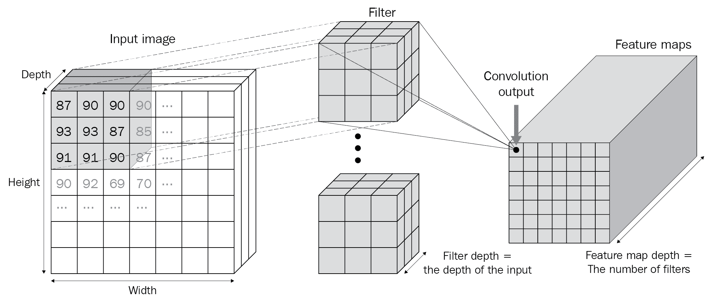

在上图中，我们可以看到输入图像与深度与输入图像相同的滤波器相乘(滤波器与输入图像进行卷积)，卷积输出中的通道数量与滤波器数量相同。

## 步幅和衬垫

在前面的部分中，每个过滤器都在图像中大步前进——一次一列和一行(在图像结束时用尽所有可能的列之后)。这也导致输出尺寸比输入图像尺寸小 1 个像素——在高度和宽度方面都是如此。这会导致部分信息丢失，并可能影响我们将卷积运算的输出添加到原始图像的可能性(这称为残差加法，将在下一章详细讨论)。

在本节中，我们将了解步长和填充如何影响卷积的输出形状。

### **大步走**

让我们利用在*过滤器*部分看到的同一个例子来理解 stride 的影响。此外，我们将在矩阵 a 上以步长 2 跨越矩阵 B。步长为 2 的卷积输出如下:

1.  较大矩阵的{1，2，5，6}乘以较小矩阵的{1，2，3，4}:

*1*1 + 2*2 + 5*3 + 6*4 = 44*

1.  较大矩阵的{3，4，7，8}乘以较小矩阵的{1，2，3，4}:

*3*1 + 4*2 + 7*3 + 8*4 = 64*

7.  较大矩阵的{9，10，13，14}乘以较小矩阵的{1，2，3，4}:

*9*1 + 10*2 + 13*3 + 14*4 = 124*

8.  较大矩阵的{11，12，15，16}乘以较小矩阵的{1，2，3，4}:

*11*1 + 12*2 + 15*3 + 16*4 = 144*

执行上述操作的结果如下:

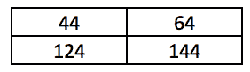

请注意，与跨距为 1 的场景(输出形状为 3 x 3)相比，前面的输出具有更低的维度，因为我们现在的跨距为 2。

### **填充**

在前面的例子中，我们不能将过滤器最左边的元素乘以图像最右边的元素。如果我们要执行这样的矩阵乘法，我们将用零填充图像。这将确保我们可以使用过滤器对图像中的所有元素执行元素到元素的乘法。

让我们通过使用在*卷积*部分中使用的相同示例来理解填充。

一旦我们在矩阵 A 的顶部添加了填充，矩阵 A 的修订版将如下所示:


从前面的矩阵中，我们可以看到，我们已经用零填充了矩阵 A，并且与矩阵 B 的卷积不会导致输出维度小于输入维度。当我们在残差网络上工作时，这个方面很方便，我们必须将卷积的输出添加到原始图像中。

一旦我们完成了这些，我们就可以在卷积运算的输出之上执行激活。为此，我们可以使用在[第 3 章](067f7e89-9e76-4179-879d-c125f8968d25.xhtml)、*用 PyTorch* 构建深度神经网络中看到的任何激活函数。

## 联营

池化将信息聚集在一个小块中。想象一个场景，其中卷积激活的输出如下:

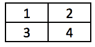

此修补程序的最大池是 4。这里，我们已经考虑了这个元素池中的元素，并在所有存在的元素中取最大值。

同样，让我们了解一下更大矩阵的最大池:


在前面的情况下，如果池化跨度的长度为 2，则最大池化操作的计算如下，其中我们将输入图像除以跨度 2(即，我们将图像分成 2×2 个部分):


对于矩阵的四个子部分，元素池中的最大值如下:


在实践中，不需要总是具有 2 的步幅；这在这里只是用于说明的目的。

其他不同的池是总和池和平均池。然而，在实践中，最大池的使用频率更高。

注意，在执行卷积和汇集操作结束时，原始矩阵的大小从 4 x 4 减小到 2 x 2。在实际情况下，如果原始图像的形状为 200 x 200，而滤镜的形状为 3 x 3，则卷积运算的输出将为 198 x 198。之后，步长为 2 的池操作的输出是 99 X 99。

## 把它们放在一起

到目前为止，我们已经了解了卷积、滤镜和池，以及它们在降低图像维度方面的影响。现在，我们将了解 CNN 的另一个重要组成部分——扁平化层(完全连接层)——然后将我们已经了解的三个部分放在一起。

为了理解展平过程，我们将获取上一节中池层的输出并展平该输出。展平池层的输出如下:

*{6，8，14，16}*

通过这样做，我们将看到展平层可以被视为等同于输入层(我们在第 3 章*的[中使用 PyTorch](067f7e89-9e76-4179-879d-c125f8968d25.xhtml)* 将输入图像展平为 784 维输入)。一旦获得展平层(完全连接层)的值，我们可以通过隐藏层传递它，然后获得预测图像类别的输出。

CNN 的总体流程如下:

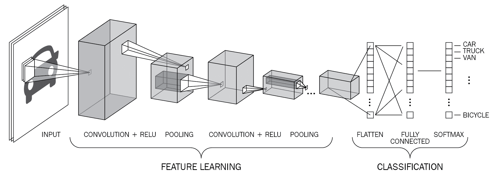

在前面的图像中，我们可以看到 CNN 模型的整体流程，其中我们通过多个过滤器将图像通过卷积，然后合并(在前面的情况中，重复卷积和合并过程两次)，然后平坦化最终合并层的输出。这形成了前面图像的**特征学习**部分。

卷积和汇集的操作构成了特征学习部分，因为过滤器有助于从图像中提取相关特征，而汇集有助于聚合信息，从而减少展平层的节点数量。(如果我们直接展平输入图像(例如，大小为 300 x 300 像素)，我们处理的是 90K 输入值。如果我们在一个隐藏层中有 90K 个输入像素值和 100K 个节点，我们会看到大约 90 亿个参数，这在计算方面是巨大的。)

卷积和池化有助于获取比原始图像更小的展平图层。

最后，分类的最后一部分类似于我们在[第三章](067f7e89-9e76-4179-879d-c125f8968d25.xhtml)、*在 PyTorch* 中构建深度神经网络中分类图像的方式，在这里我们有一个隐藏层，然后获得输出层。

## 卷积和汇集如何帮助图像翻译

当我们执行池化时，我们可以将操作的输出视为一个区域的抽象(一小块)。这种现象会派上用场，尤其是在翻译图像的时候。

想象一个图像向左平移 1 个像素的场景。一旦我们在其上执行卷积、激活和合并，我们将减少图像的维度(由于合并)，这意味着更少数量的像素存储了原始图像的大部分信息。此外，假定汇集存储区域(斑块)的信息，则汇集图像的像素内的信息不会变化，即使原始图像被平移 1 个单位。这是因为该区域的最大值可能会在合并的图像中被捕获。

卷积和汇集 cam 也帮助我们处理**感受野**。为了理解感受野，让我们想象一个场景，其中我们在形状为 100 x 100 的图像上执行两次卷积池操作。两个卷积池操作结束时的输出是 25 x 25 的形状(如果卷积操作是用填充完成的)。25 x 25 输出中的每个单元现在对应于原始图像的一个更大的 4 x 4 部分。因此，由于卷积和池化操作，结果图像中的每个单元对应于原始图像的一个小块。

现在我们已经了解了 CNN 的核心组件，让我们将它们全部应用到一个玩具示例中，以了解它们是如何协同工作的。

# 实现 CNN

CNN 是计算机视觉技术的基础之一，对你来说，深入了解它们是如何工作的非常重要。虽然我们已经知道 CNN 由卷积、汇集、展平以及最终的分类层组成，但在本节中，我们将了解在通过代码向前传递 CNN 的过程中发生的各种操作。

为了更好地理解这一点，首先，我们将使用 PyTorch 在一个玩具示例上构建一个 CNN 架构，然后通过用 Python 从头构建前馈传播来匹配输出。

## 使用 PyTorch 构建基于 CNN 的架构

CNN 架构将不同于我们在上一章中构建的神经网络架构，因为除了典型的普通深度神经网络之外，CNN 还包含以下内容:

*   卷积运算
*   联营业务
*   展平层

在下面的代码中，我们将在玩具数据集上构建一个 CNN 模型，如下所示:

The code for this section is available as `CNN_working_details.ipynb` in the `Chapter04` folder of this book's GitHub repository - [https://tinyurl.com/mcvp-packt](https://tinyurl.com/mcvp-packt)

1.  首先，我们需要导入相关的库:

```py
import torch
from torch import nn
from torch.utils.data import TensorDataset, Dataset, DataLoader
from torch.optim import SGD, Adam
device = 'cuda' if torch.cuda.is_available() else 'cpu'
from torchvision import datasets
import numpy as np
import matplotlib.pyplot as plt
%matplotlib inline
```

2.  然后，我们需要使用以下步骤创建数据集:

```py
X_train = torch.tensor([[[[1,2,3,4],[2,3,4,5], \
                          [5,6,7,8],[1,3,4,5]]], \
                [[[-1,2,3,-4],[2,-3,4,5], \
            [-5,6,-7,8],[-1,-3,-4,-5]]]]).to(device).float()
X_train /= 8
y_train = torch.tensor([0,1]).to(device).float()
```

注意 PyTorch 期望输入的形状为 **N x C x H x W** ，其中 *N* 是图像的数量(批量大小)；*C*是通道的数量， *H* 是高度， *W* 是图像的宽度。

这里，我们通过将输入数据除以最大输入值来缩放输入数据集，使其范围在-1 到+1 之间；也就是 8。

输入数据集的形状为(2，1，4，4 ),因为有两个数据点，每个数据点的形状为 4 x 4，并且有一个通道。

3.  定义模型架构:

```py
def get_model():
    model = nn.Sequential(
                nn.Conv2d(1, 1, kernel_size=3),
                nn.MaxPool2d(2),
                nn.ReLU(),
                nn.Flatten(),
                nn.Linear(1, 1),
                nn.Sigmoid(),
            ).to(device)
    loss_fn = nn.BCELoss()
    optimizer = Adam(model.parameters(), lr=1e-3)
    return model, loss_fn, optimizer
```

请注意，在前面的模型中，我们指定输入中有 1 个通道，并使用`nn.Conv2d`方法从卷积后的输出中提取 1 个通道(即，我们有 1 个大小为 3 x 3 的滤波器)。在此之后，我们使用`nn.MaxPool2d`和 ReLU 激活(使用`nn.Relu()`执行最大池化，然后展平并连接到最终层，每个数据点有一个输出。

此外，注意损失函数是二进制交叉熵损失(`nn.BCELoss()`)，因为输出来自二进制类。我们还指定优化将使用 Adam 优化器完成，学习率为 0.001。

4.  使用`torch_summary`包中可用的`summary`方法总结模型的架构，通过调用`get_model`函数获取我们的`model`、损失函数(`loss_fn`)和`optimizer`:

```py
!pip install torch_summary
from torchsummary import summary
model, loss_fn, optimizer = get_model()
summary(model, X_train);
```

上述代码会产生以下输出:


我们来理解一下每一层包含这么多参数的原因。`Conv2d`类的参数如下:

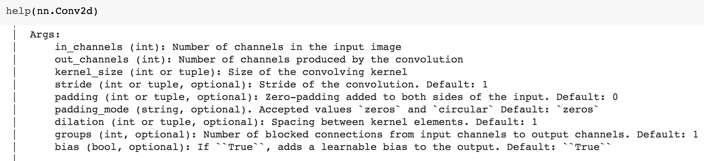

在前面的例子中，我们指定卷积核(`kernel_size`)的大小为 3，`out_channels`的数量为 1(本质上，滤波器的数量为 1)，其中初始(输入)通道的数量为 1。因此，对于每个输入图像，我们在 1 x 4 x 4 的形状上卷积形状为 3 x 3 的滤波器，这导致形状为 1 x 2 x 2 的输出。有 10 个参数，因为我们正在学习 9 个权重参数(3×3)和卷积核的一个偏差。对于 MaxPool2d、ReLU 和 Flatten 层，没有参数，因为这些是在卷积层的输出之上执行的操作。不涉及任何权重或偏见。

*   线性图层有两个参数-一个权重和一个偏差-这意味着总共有 12 个参数(10 个来自卷积运算，两个来自线性图层)。

5.  使用我们在[第 3 章](067f7e89-9e76-4179-879d-c125f8968d25.xhtml)、*使用 PyTorch* 构建深度神经网络中使用的相同模型训练代码来训练模型，其中我们定义了将对批量数据进行训练的函数(`train_batch`)。然后，获取数据加载器，并对超过 2，000 个历元的批数据进行训练(我们只使用 2，000 个，因为这是一个小的玩具数据集)，如下所示:

*   定义将对批量数据进行训练的函数(`train_batch`):

```py
def train_batch(x, y, model, opt, loss_fn):
    model.train()
    prediction = model(x)
    batch_loss = loss_fn(prediction.squeeze(0), y)
    batch_loss.backward()
    optimizer.step()
    optimizer.zero_grad()
    return batch_loss.item()
```

*   通过使用`TensorDataset`方法指定数据集，然后使用`DataLoader`加载数据集，定义训练数据加载器:

```py
trn_dl = DataLoader(TensorDataset(X_train, y_train))
```

注意，假设我们没有大量修改输入数据，我们将不会单独构建一个类，而是直接利用`TensorDataset`方法，它提供了一个对应于输入数据的对象。

*   训练模型超过 2000 个时期:

```py
for epoch in range(2000):
    for ix, batch in enumerate(iter(trn_dl)):
        x, y = batch
        batch_loss = train_batch(x, y, model, optimizer, \
                                 loss_fn)
```

使用前面的代码，我们在玩具数据集上训练了 CNN 模型。

6.  在第一个数据点的顶部执行向前传递:

```py
model(X_train[:1])
```

前面代码的输出是`0.1625`。

请注意，在执行前面的代码时，由于不同的随机权重初始化，您可能会有不同的输出值。但是，您应该能够将输出与下一节中得到的内容进行匹配。

在下一节中，我们将了解 CNN 中的前向传播是如何工作的，以便我们可以在第一个数据点上获得 0.1625 的值。

## 用 Python 向前传播输出

在我们继续之前，请注意本节只是为了帮助您清楚地了解 CNN 是如何工作的。在真实场景中，我们不需要执行以下步骤:

1.  提取已定义架构的卷积和线性层的权重和偏差，如下所示:

*   提取模型的各个层:

```py
list(model.children())
```

这会产生以下输出:


*   从模型的所有层中提取与`weight`属性相关联的层:

```py
(cnn_w, cnn_b), (lin_w, lin_b) = [(layer.weight.data, \
                            layer.bias.data) for layer in \
                            list(model.children()) \
                                  if hasattr(layer,'weight')]
```

在前面的代码中，`hasattr(layer,'weight')`返回一个布尔值，而不管图层是否包含`weight`属性。

请注意，卷积(`Conv2d`)层和最后的`Linear`层是唯一包含参数的层，这就是为什么我们将它们分别保存为`Conv2d`层的`cnn_w`和`cnn_b`以及`Linear`层的`lin_w`和`lin_b`。

`cnn_w`的形状是 1×1×3×3，因为我们已经初始化了一个滤波器，它有一个通道，尺寸为 3×3。`cnn_b`具有 1 的形状，因为它对应于一个过滤器。

2.  为了对输入值执行`cnn_w`卷积运算，我们必须为 sumproduct ( `sumprod`)初始化一个零矩阵，其中高度为*输入高度-滤波器高度+ 1* ，宽度为*宽度-滤波器宽度+ 1* :

```py
h_im, w_im = X_train.shape[2:]
h_conv, w_conv = cnn_w.shape[2:]
sumprod = torch.zeros((h_im - h_conv + 1, w_im - w_conv + 1))
```

3.  现在，让我们通过在第一个输入上卷积滤波器(`cnn_w`)并在将滤波器形状从 1 x 1 x 3 x 3 形状整形为 3 x 3 形状后对滤波器偏置项(`cnn_b`)求和来填充`sumprod`:

```py
for i in range(h_im - h_conv + 1):
    for j in range(w_im - w_conv + 1):
        img_subset = X_train[0, 0, i:(i+3), j:(j+3)]
        model_filter = cnn_w.reshape(3,3)
        val = torch.sum(img_subset*model_filter) + cnn_b
        sumprod[i,j] = val
```

在前面的代码中，`img_subset`存储了我们将与过滤器进行卷积的输入部分，因此我们将遍历可能的列，然后是行。

此外，假设输入的形状为 4 x 4，滤波器的形状为 3 x 3，则输出的形状为 2 x 2。

在这个阶段，`sumprod`的输出如下:

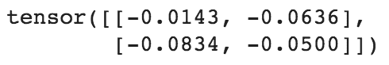

4.  对输出执行 ReLU 操作，然后获取池的最大值(`MaxPooling`)，如下所示:

*   ReLU 是在 Python 中的`sumprod`之上执行的，如下所示:

```py
sumprod.clamp_min_(0)
```

请注意，在前面的代码中，我们将输出箝位到最小值 0(这就是 ReLU 激活的作用):


*   池层的输出可以这样计算:

```py
pooling_layer_output = torch.max(sumprod)
```

上述代码会产生以下输出:


5.  通过线性激活传递前面的输出:

```py
intermediate_output_value = pooling_layer_output*lin_w+lin_b
```

该操作的输出如下:


6.  通过`sigmoid`操作传递输出:

```py
from torch.nn import functional as F # torch library 
# for numpy like functions
print(F.sigmoid(intermediate_output_value))
```

前面的代码给出了以下输出:

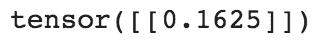

注意，我们执行`sigmoid`而不是`softmax`，因为损失函数是二元交叉熵，而不是像时尚-MNIST 数据集中那样的分类交叉熵。

前面的代码给出了我们使用 PyTorch 前馈方法获得的相同输出，从而加强了我们对 CNN 如何工作的理解。

现在我们已经了解了 CNN 是如何工作的，在下一节中，我们将把它应用到时尚 MNIST 数据集，并看看它在翻译图像上的表现。

# 使用深度细胞神经网络分类图像

到目前为止，我们已经看到传统的神经网络对翻译图像的预测是不正确的。这需要解决，因为在真实世界的场景中，需要应用各种增强，例如平移和旋转，这在训练阶段是看不到的。在本节中，我们将了解当图像转换发生在时尚 MNIST 数据集中的图像上时，CNN 如何解决不正确预测的问题。

时尚-MNIST 数据集的预处理部分与前一章相同，只是当我们对(`.view`)输入数据进行整形时，我们不是将输入数据展平为 28 x 28 = 784 维，而是将每个图像的输入数据整形为(1，28，28)的形状(记住，首先要指定通道，然后是它们的高度和宽度，单位为 PyTorch):

The code for this section is available as `CNN_on_FashionMNIST.ipynb` in the `Chapter04` folder of this book's GitHub repository - [https://tinyurl.com/mcvp-packt](https://tinyurl.com/mcvp-packt) . Note that the entirety of the code is available in GitHub and that only the additional code corresponding to defining the model architecture is provided here for brevity. **We strongly encourage you to refer to the notebooks in this book's GitHub repository while executing the code.**

1.  导入必要的包:

```py
from torchvision import datasets
from torch.utils.data import Dataset, DataLoader
import torch
import torch.nn as nn
device = "cuda" if torch.cuda.is_available() else "cpu"
import numpy as np
import matplotlib.pyplot as plt
%matplotlib inline

data_folder = '~/data/FMNIST' # This can be any directory you 
# want to download FMNIST to
fmnist = datasets.FashionMNIST(data_folder, download=True, \
                                        train=True)
tr_images = fmnist.data
tr_targets = fmnist.targets
```

2.  时尚-MNIST 数据集类定义如下。记住，`Dataset`对象将**总是**需要我们已经定义的`__init__`、`__getitem__`和`__len__`方法:

```py
class FMNISTDataset(Dataset):
    def __init__(self, x, y):
        x = x.float()/255
        x = x.view(-1,1,28,28)
        self.x, self.y = x, y 
    def __getitem__(self, ix):
        x, y = self.x[ix], self.y[ix] 
        return x.to(device), y.to(device)
    def __len__(self): 
        return len(self.x)
```

前面用粗体显示的代码行是我们对每个输入图像进行整形的地方(与我们在上一章中所做的不同),因为我们向 CNN 提供数据，该 CNN 期望每个输入具有批量大小 x 通道 x 高度 x 宽度的形状。

3.  CNN 模型架构定义如下:

```py
from torch.optim import SGD, Adam
def get_model():
    model = nn.Sequential(
                nn.Conv2d(1, 64, kernel_size=3),
                nn.MaxPool2d(2),
                nn.ReLU(),
                nn.Conv2d(64, 128, kernel_size=3),
                nn.MaxPool2d(2),
                nn.ReLU(),
                nn.Flatten(),
                nn.Linear(3200, 256),
                nn.ReLU(),
                nn.Linear(256, 10)
            ).to(device)

    loss_fn = nn.CrossEntropyLoss()
    optimizer = Adam(model.parameters(), lr=1e-3)
    return model, loss_fn, optimizer
```

*   可以使用以下代码创建模型的摘要:

```py
!pip install torch_summary
from torchsummary import summary
model, loss_fn, optimizer = get_model()
summary(model, torch.zeros(1,1,28,28));
```

这会产生以下输出:


为了巩固我们对 CNN 的理解，让我们来理解为什么在前面的输出中参数的数量是这样设置的:

*   **第 1 层**:假设有 64 个内核大小为 3 的过滤器，我们有 64×3×3 的权重和 64×1 的偏差，总共有 640 个参数。
*   **第 4 层**:假设有 128 个内核大小为 3 的过滤器，我们有 128 x 64 x3 x 3 的权重和 128 x 1 的偏差，总共有 73856 个参数。
*   **第 8 层**:假设一个有 3200 个节点的层连接到另一个有 256 个节点的层，我们总共有 3,200 x 256 个权重+ 256 个偏差，总共有 819456 个参数。
*   **第 10 层**:假设一个有 256 个节点的层连接到一个有 10 个节点的层，我们总共有 256 x 10 个权重和 10 个偏差，总共有 2570 个参数。

现在，我们训练模型，就像我们在前一章中训练它一样。完整的代码可以在本书的 GitHub 资源库-[https://tinyurl.com/mcvp-packt](https://tinyurl.com/mcvp-packt)中找到

训练完模型后，您会注意到训练和测试数据集的精度变化和损失如下:


请注意，在前面的场景中，验证数据集的准确性在前五个时期内约为 92%，这已经优于我们在前一章中看到的各种技术的准确性，即使没有额外的正则化。

现在，让我们翻译图像并预测翻译图像的类别:

1.  将图像在-5 像素到+5 像素之间平移，并预测其类别:

```py
preds = []
ix = 24300
for px in range(-5,6):
    img = tr_images[ix]/255.
    img = img.view(28, 28)
    img2 = np.roll(img, px, axis=1)
    plt.imshow(img2)
    plt.show()
    img3 = torch.Tensor(img2).view(-1,1,28,28).to(device)
    np_output = model(img3).cpu().detach().numpy()
    preds.append(np.exp(np_output)/np.sum(np.exp(np_output)))
```

在前面的代码中，我们对图像(`img3`)进行了整形，使其形状为(-1，1，28，28)，这样我们就可以将图像传递给 CNN 模型。

2.  绘制不同翻译类别的概率图:

```py
import seaborn as sns
fig, ax = plt.subplots(1,1, figsize=(12,10))
plt.title('Probability of each class for \
various translations')
sns.heatmap(np.array(preds).reshape(11,10), annot=True, \
            ax=ax, fmt='.2f', xticklabels=fmnist.classes, \
            yticklabels=[str(i)+str(' pixels') \
                         for i in range(-5,6)], cmap='gray')
```

上述代码会产生以下输出:

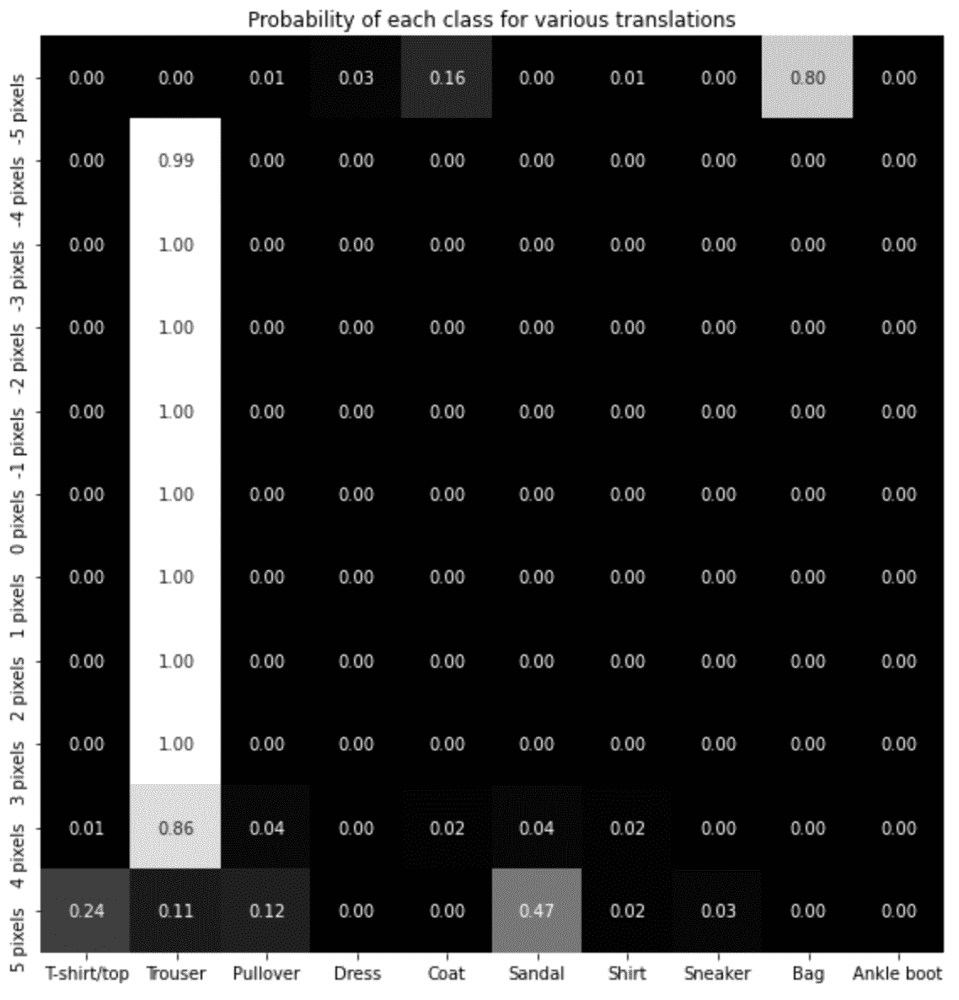

注意，在这种情况下，即使当图像平移 4 个像素时，预测也是正确的，而在我们不使用 CNN 的情况下，当图像平移 4 个像素时，预测是不正确的。此外，当图像平移 5 个像素时,“裤子”的概率大大下降。

正如我们所看到的，虽然 CNN 有助于解决图像翻译的挑战，但它们并没有完全解决手头的问题。在下一节中，我们将学习如何通过利用数据增强和 CNN 来解决这种情况。

# 实现数据扩充

在前面的场景中，我们了解了 CNN 如何帮助预测图像在翻译时的类别。虽然这对于高达 5 个像素的转换很有效，但是超过 5 个像素的转换对于正确的类来说概率很低。在这一节中，我们将学习如何确保我们预测正确的类，即使图像被平移了相当大的量。

为了应对这一挑战，我们将通过将输入图像随机平移 10 个像素(向左和向右)并将它们传递给网络来训练神经网络。这样，相同的图像将在不同的通道中作为不同的图像来处理，因为它在每个通道中具有不同的平移量。

在我们利用增强来提高图像转换时模型的准确性之前，让我们了解一下可以在图像上进行的各种增强。

## 图像增强

到目前为止，我们已经了解了图像转换对模型预测准确性的影响。但是，在现实世界中，我们可能会遇到各种情况，例如:

*   图像会轻微旋转
*   图像被放大/缩小(缩放)
*   图像中存在一定量的噪声
*   图像亮度低
*   图像已经翻转
*   图像已被剪切(图像的一侧更加扭曲)

不考虑上述情况的神经网络不会提供准确的结果，就像在前面的部分中，我们有一个神经网络，它没有对经过大量翻译的图像进行显式训练。

在我们从给定图像创建更多图像的场景中，图像增强非常有用。每个创建的图像可以在旋转、平移、缩放、噪声和亮度方面有所不同。此外，这些参数中的每一个的变化程度也可以变化(例如，在给定迭代中特定图像的平移可以是+10 像素，而在不同的迭代中，它可以是-5 像素)。

`imgaug`包中的`augmenters`类具有执行这些扩充的有用工具。让我们来看看`augmenters`类中的各种工具，用于从给定图像生成增强图像。一些最著名的增强技术如下:

*   仿射变换
*   改变亮度
*   添加噪声

注意 PyTorch 有一个方便的图像增强管道，形式为`torchvision.transforms`。然而，我们仍然选择引入一个不同的库，主要是因为`imgaug`包含了更多种类的选项，同时也是因为向新用户解释增强功能很容易。我们鼓励你将火炬视觉转换作为一个练习来研究，并重新创建所有的功能来加强你的理解。

### 仿射变换

仿射变换涉及图像的平移、旋转、缩放和剪切。它们可以使用`augmenters`类中的`Affine`方法在代码中执行。让我们通过下面的截图来看看`Affine`方法中的参数。这里，我们已经定义了`Affine`方法的所有参数:

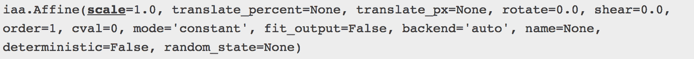

`Affine`方法中的一些重要参数如下:

*   `scale`指定图像的缩放量
*   `translate_percent`以图像高度和宽度的百分比指定平移量
*   `translate_px`将平移量指定为绝对像素数
*   `rotate`指定要在图像上完成的旋转量
*   `shear`指定要在部分图像上完成的旋转量

在我们考虑其他参数之前，让我们先了解一下缩放、平移和旋转在哪里会派上用场。

The code for this section is available as `Image_augmentation.ipynb` in the `Chapter04` folder of this book's GitHub repository - [https://tinyurl.com/mcvp-packt](https://tinyurl.com/mcvp-packt)

从`fashionMNIST`的训练数据集中提取随机图像:

1.  从时尚 MNIST 数据集下载图片:

```py
from torchvision import datasets
import torch
data_folder = '/content/' # This can be any directory 
# you download FMNIST to
fmnist = datasets.FashionMNIST(data_folder, download=True, \
                               train=True)
```

2.  从下载的数据集中获取图像:

```py
tr_images = fmnist.data
tr_targets = fmnist.targets
```

3.  让我们绘制第一幅图像:

```py
import matplotlib.pyplot as plt
%matplotlib inline
plt.imshow(tr_images[0])
```

上述代码的输出如下:


在图像顶部执行缩放:

1.  定义执行缩放的对象:

```py
from imgaug import augmenters as iaa
aug = iaa.Affine(scale=2)
```

2.  指定我们想要使用`augment_image`方法来放大图像，该方法在`aug`对象中可用，并绘制它:

```py
plt.imshow(aug.augment_image(tr_images[0]))
plt.title('Scaled image')
```

上述代码的输出如下:

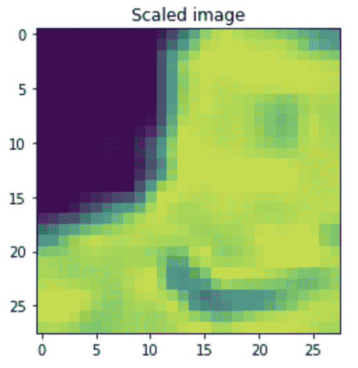

在前面的输出中，图像被放大了很多。由于图像的输出形状没有改变，这导致一些像素从原始图像中被剪切。

现在，让我们来看一个使用`translate_px`参数将图像平移了一定数量像素的场景:

```py
aug = iaa.Affine(translate_px=10)
plt.imshow(aug.augment_image(tr_images[0]))
plt.title('Translated image by 10 pixels')
```

上述代码的输出如下:

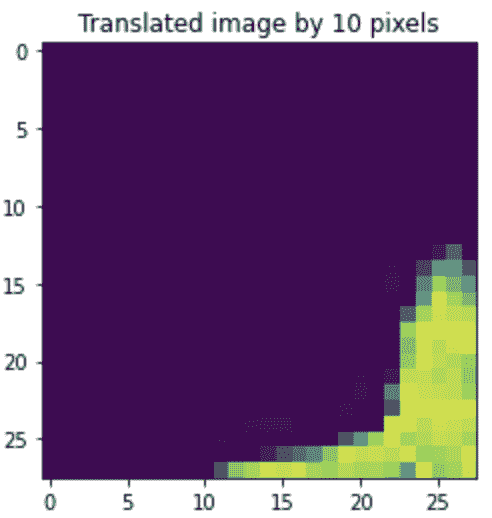

在前面的输出中，x 轴和 y 轴都发生了 10 个像素的平移。

如果我们希望在一个轴上执行更多的平移，而在另一个轴上执行更少的平移，我们必须指定我们希望在每个轴上的平移量:

```py
aug = iaa.Affine(translate_px={'x':10,'y':2})
plt.imshow(aug.augment_image(tr_images[0]))
plt.title('Translation of 10 pixels \nacross columns \
and 2 pixels over rows')
```

这里，我们提供了一个字典，它在`translate_px`参数中说明了 x 轴和 y 轴的平移量。

上述代码的输出如下:


前面的输出显示，与行相比，更多的转换发生在列之间。这也导致图像的某一部分被裁剪。

现在，让我们考虑旋转和剪切对图像增强的影响:


在前面的大多数输出中，我们可以看到某些像素在转换后的图像中被裁剪掉了。现在，让我们看看`Affine`方法中的其余参数如何帮助我们不因裁剪后增强而丢失信息。

`fit_output`是一个参数，可以帮助前面的场景。默认设置为`False`。然而，让我们看看当我们缩放、平移、旋转和剪切图像时，当我们将`fit_output`指定为`True`时，前面的输出是如何变化的:

```py
plt.figure(figsize=(20,20))
plt.subplot(161)
plt.imshow(tr_images[0])
plt.title('Original image')
plt.subplot(162)
aug = iaa.Affine(scale=2, fit_output=True)
plt.imshow(aug.augment_image(tr_images[0]))
plt.title('Scaled image')
plt.subplot(163)
aug = iaa.Affine(translate_px={'x':10,'y':2}, fit_output=True)
plt.imshow(aug.augment_image(tr_images[0]))
plt.title('Translation of 10 pixels across \ncolumns and \
2 pixels over rows')
plt.subplot(164)
aug = iaa.Affine(rotate=30, fit_output=True)
plt.imshow(aug.augment_image(tr_images[0]))
plt.title('Rotation of image \nby 30 degrees')
plt.subplot(165)
aug = iaa.Affine(shear=30, fit_output=True)
plt.imshow(aug.augment_image(tr_images[0]))
plt.title('Shear of image \nby 30 degrees')
```

上述代码的输出如下:

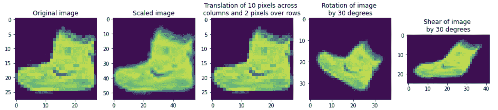

在这里，我们可以看到原始图像没有被裁剪，并且增强图像的大小增加了，以说明增强图像没有被裁剪(在缩放图像的输出中或当图像旋转 30 度时)。此外，我们还可以看到，`fit_output`参数的激活否定了我们在 10 像素图像的翻译中所期望的翻译(这是一个已知的行为，如文档中所解释的)。

请注意，当增强图像的大小增加时(例如，当图像旋转时)，我们需要弄清楚不属于原始图像的新像素应该如何填充。

`cval`参数解决了这个问题。它指定了当`fit_output`为`True`时创建的新像素的像素值。在前面的代码中，`cval`用默认值 0 填充，这导致黑色像素。让我们来了解一下当图像旋转时，将`cval`参数值更改为 255 会如何影响输出:

```py
aug = iaa.Affine(rotate=30, fit_output=True, cval=255)
plt.imshow(aug.augment_image(tr_images[0]))
plt.title('Rotation of image by 30 degrees')
```

上述代码的输出如下:


在前面的图像中，新像素的像素值为 255，对应于白色。

此外，我们可以使用不同的模式来填充新创建的像素值。这些值用于`mode`参数，如下所示:

*   `constant`:具有恒定值的焊盘。
*   `edge`:填充数组的边缘值。
*   `symmetric`:沿阵列边缘镜像的矢量反射的焊盘。
*   `reflect`:沿每个轴的向量的第一个和最后一个值上镜像的向量的映射。
*   `wrap`:沿轴向量环绕的焊盘。

初始值用于填充结尾，而结束值用于填充开头。

当`cval`设置为 0 并且我们改变`mode`参数时，我们收到的输出如下:

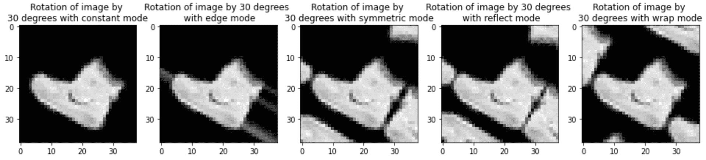

在这里，我们可以看到，对于我们当前基于时尚-MNIST 数据集的场景，使用`constant`模式进行数据扩充更可取。

到目前为止，我们已经指定了平移需要一定数量的像素。类似地，我们已经指定旋转角度应该是特定的度数。然而，在实践中，很难指定图像需要旋转的确切角度。因此，在下面的代码中，我们提供了图像旋转的范围。可以这样做:

```py
plt.figure(figsize=(20,20))
plt.subplot(151)
aug = iaa.Affine(rotate=(-45,45), fit_output=True, cval=0, \
                 mode='constant')
plt.imshow(aug.augment_image(tr_images[0]), cmap='gray')
plt.subplot(152)
aug = iaa.Affine(rotate=(-45,45), fit_output=True, cval=0, \
                 mode='constant')
plt.imshow(aug.augment_image(tr_images[0]), cmap='gray')
plt.subplot(153)
aug = iaa.Affine(rotate=(-45,45), fit_output=True, cval=0, \
                 mode='constant')
plt.imshow(aug.augment_image(tr_images[0]), cmap='gray')
plt.subplot(154)
aug = iaa.Affine(rotate=(-45,45), fit_output=True, cval=0, \
                 mode='constant')
plt.imshow(aug.augment_image(tr_images[0]), cmap='gray')
```

上述代码的输出如下:

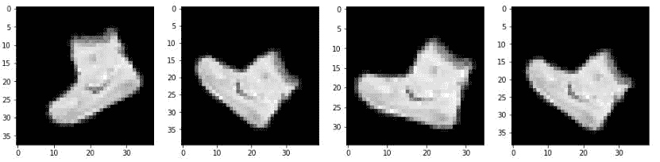

在前面的输出中，相同的图像在不同的迭代中以不同的方式旋转，因为我们根据旋转的上限和下限指定了可能的旋转角度范围。类似地，当我们翻译或分享图像时，我们可以随机化增强。

到目前为止，我们已经用不同的方式看了不同的图像。但是，图像的强度/亮度保持不变。接下来，我们将学习如何增加图像的亮度。

### 改变亮度

想象一个场景，背景和前景之间的差异不像我们到目前为止看到的那样明显。这意味着背景没有像素值 0，前景没有像素值 255。当图像中的照明条件不同时，通常会发生这种情况。

如果在模型定型时背景的像素值始终为 0，前景的像素值始终为 255，但我们预测的图像的背景像素值为 20，前景像素值为 220，则预测很可能不正确。

`Multiply`和`Linearcontrast`是两种不同的增强技术，可以用来解决这种情况。

`Multiply`方法将每个像素值乘以我们指定的值。到目前为止，我们考虑的图像的每个像素值乘以 0.5 的输出如下:

```py
aug = iaa.Multiply(0.5)
plt.imshow(aug.augment_image(tr_images[0]), cmap='gray', \
           vmin = 0, vmax = 255)
plt.title('Pixels multiplied by 0.5')
```

上述代码的输出如下:


`Linearcontrast`根据以下公式调整每个像素值:

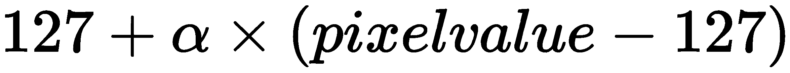

在上式中，当α等于 1 时，像素值保持不变。但是，当α小于 1 时，高像素值减少，低像素值增加。

让我们看看`Linearcontrast`对该图像输出的影响:

```py
aug = iaa.LinearContrast(0.5)
plt.imshow(aug.augment_image(tr_images[0]), cmap='gray', \
           vmin = 0, vmax = 255)
plt.title('Pixel contrast by 0.5')
```

上述代码的输出如下:

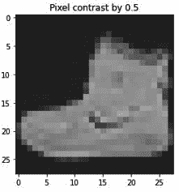

在这里，我们可以看到背景变得更加明亮，而前景像素的强度降低。

接下来，我们将使用`GaussianBlur`方法模糊图像以模拟真实场景(图像可能会因运动而模糊):

```py
aug = iaa.GaussianBlur(sigma=1)
plt.imshow(aug.augment_image(tr_images[0]), cmap='gray', \
           vmin = 0, vmax = 255)
plt.title('Gaussian blurring of image')
```

上述代码的输出如下:

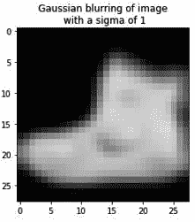

在前面的图像中，我们可以看到图像相当模糊，随着`sigma`值的增加(默认值为 0 表示无模糊)，图像变得更加模糊。

### 添加噪声

在现实世界中，由于糟糕的摄影条件，我们可能会遇到颗粒状图像。`Dropout`和`SaltAndPepper`是两种有助于模拟粒状图像条件的突出方法。让我们来看看用这两种方法放大图像的输出:

```py
plt.figure(figsize=(10,10))
plt.subplot(121)
aug = iaa.Dropout(p=0.2)
plt.imshow(aug.augment_image(tr_images[0]), cmap='gray', \
           vmin = 0, vmax = 255)
plt.title('Random 20% pixel dropout')
plt.subplot(122)
aug = iaa.SaltAndPepper(0.2)
plt.imshow(aug.augment_image(tr_images[0]), cmap='gray', \
           vmin = 0, vmax = 255)
plt.title('Random 20% salt and pepper noise')
```

上述代码的输出如下:

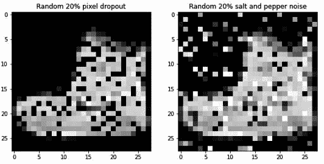

在这里，我们可以看到，`Dropout`方法随机丢弃了一定数量的像素(也就是说，它将它们转换为像素值为 0)，而`SaltAndPepper`方法向我们的图像中随机添加了一些白色和黑色的像素。

### 执行一系列增强操作

到目前为止，我们已经看了各种增强，也进行了表演。然而，在现实世界的场景中，我们必须考虑尽可能多的扩充。在本节中，我们将了解执行扩充的顺序方式。

使用`Sequential`方法，我们可以使用所有必须执行的相关增强来构建增强方法。对于我们的例子，我们将只考虑`rotate`和`Dropout`来增强我们的形象。`Sequential`对象看起来如下:

```py
seq = iaa.Sequential([
      iaa.Dropout(p=0.2),
      iaa.Affine(rotate=(-30,30))], random_order= True)
```

在前面的代码中，我们指定我们对两个增强感兴趣，并且还指定我们将使用`random_order`参数。扩增过程将在两者之间随机进行。

现在，让我们用这些放大图来绘制图像:

```py
plt.imshow(seq.augment_image(tr_images[0]), cmap='gray', \
           vmin = 0, vmax = 255)
plt.title('Image augmented using a \nrandom order \
of the two augmentations')
```

上述代码的输出如下:


从前面的图像中，我们可以看到这两个放大是在原始图像的顶部执行的(您可以看到图像已经旋转，并且应用了 dropout)。

## 对一批图像执行数据扩充以及对 collate_fn 的需求

我们已经看到，在同一幅图像的不同迭代中执行不同的增强是更可取的。

如果我们有一个在`__init__`方法中定义的增强管道，我们将只需要在输入图像集上执行一次增强。这意味着我们在不同的迭代中不会有不同的扩充。

类似地，如果增强是在`__getitem__`方法中——这是理想的，因为我们想要对每幅图像执行不同的增强集——主要的瓶颈是对每幅图像执行一次增强。如果我们对一批图像进行增强，而不是一次对一幅图像进行增强，速度会快得多。让我们通过查看两个场景来详细理解这一点，在这两个场景中，我们将处理 32 幅图像:

*   增加 32 幅图像，一次一幅
*   一次性增加 32 幅图像

为了了解在这两种情况下扩充 32 幅图像所需的时间，让我们利用时尚 MNIST 数据集的训练图像中的前 32 幅图像:

The following code is available as `Time_comparison_of_augmentation_scenario.ipynb` in the `Chapter04` folder of this book's GitHub repository - [https://tinyurl.com/mcvp-packt](https://tinyurl.com/mcvp-packt)

1.  获取训练数据集中的前 32 幅图像:

```py
from torchvision import datasets
import torch
data_folder = '/content/' 
fmnist = datasets.FashionMNIST(data_folder, download=True, \
                                                train=True)
tr_images = fmnist.data
tr_targets = fmnist.targets
```

2.  指定要在图像上执行的增强:

```py
from imgaug import augmenters as iaa
aug = iaa.Sequential([
              iaa.Affine(translate_px={'x':(-10,10)}, 
                                        mode='constant'),
            ])
```

接下来，我们需要理解如何在`Dataset`类中执行增强。有两种可能的方法来扩充数据:

*   一次增加一批图像
*   一次放大一批中的所有图像

让我们来了解一下执行前面两个场景所需的时间:

*   **场景 1:** 扩充 32 幅图像，一次一幅:

使用`augment_image`方法计算一次放大一幅图像所需的时间:

```py
%%time
for i in range(32):
    aug.augment_image(tr_images[i])
```

放大 32 幅图像需要大约 180 毫秒。

*   **场景 2:** 一次性批量扩充 32 张图像:

使用`augment_images`方法计算一次增加 32 张图像所需的时间:

```py
%%time
aug.augment_images(tr_images[:32])
```

对一批图像进行增强需要大约 8 毫秒。

最佳做法是在一批图像的基础上进行扩充，而不是一次扩充一个图像。另外，`augment_images`方法的输出是一个`numpy`数组。

然而，我们一直在做的传统的`Dataset`类在`__getitem__`方法中一次提供一个图像的索引。因此，我们需要学习如何使用一个新的功能——`collate_fn`——使我们能够对一批图像进行操作。

3.  定义`Dataset`类，它将输入图像、它们的类和增强对象作为初始化器:

```py
from torch.utils.data import Dataset, DataLoader
class FMNISTDataset(Dataset):
    def __init__(self, x, y, aug=None):
        self.x, self.y = x, y
        self.aug = aug
    def __getitem__(self, ix):
        x, y = self.x[ix], self.y[ix]
        return x, y
    def __len__(self): return len(self.x)
```

*   定义`collate_fn`，将该批数据作为输入:

```py
    def collate_fn(self, batch):
```

*   将一批图像及其类别分成两个不同的变量:

```py
        ims, classes = list(zip(*batch))
```

*   指定如果提供了增强对象，则必须进行增强。如果我们需要对训练数据而不是验证数据进行扩充，这是很有用的:

```py
        if self.aug: ims=self.aug.augment_images(images=ims)
```

在前面的代码中，我们利用了`augment_images`方法，这样我们就可以处理一批图像。

*   通过将图像形状除以 255，创建图像的张量以及缩放数据:

```py
        ims = torch.tensor(ims)[:,None,:,:].to(device)/255.
        classes = torch.tensor(classes).to(device)
        return ims, classes
```

一般来说，当我们必须执行繁重的计算时，我们利用`collate_fn`方法。这是因为一次对一批图像进行这样的计算比一次对一幅图像进行更快。

4.  从现在开始，为了利用`collate_fn`方法，我们将在创建数据加载器时使用一个新的参数:

*   首先，我们创建了`train`对象:

```py
train = FMNISTDataset(tr_images, tr_targets, aug=aug)
```

*   接下来，我们定义数据加载器，以及对象的`collate_fn`方法，如下所示:

```py
trn_dl = DataLoader(train, batch_size=64, \
                    collate_fn=train.collate_fn,shuffle=True)
```

5.  最后，我们训练模型，就像我们到目前为止一直在训练它一样。通过利用`collate_fn`方法，我们可以更快地训练模型。

现在，我们已经对我们可以使用的一些主要数据增强技术有了坚实的理解，包括像素转换和`collate_fn`，它允许我们增强一批图像，让我们了解如何将它们应用于一批数据以解决图像转换问题。

## 用于图像翻译的数据增强

现在，我们可以用增强的数据来训练模型了。让我们创建一些增强数据并训练模型:

The following code is available as `Data_augmentation_with_CNN.ipynb` in the `Chapter04` folder of this book's GitHub repository - [https://tinyurl.com/mcvp-packt](https://tinyurl.com/mcvp-packt)

1.  导入相关的包和数据集:

```py
from torchvision import datasets
import torch
from torch.utils.data import Dataset, DataLoader
import torch
import torch.nn as nn
import matplotlib.pyplot as plt
%matplotlib inline
import numpy as np

device = 'cuda' if torch.cuda.is_available() else 'cpu'
data_folder = '/content/' # This can be any directory 
# you want to download FMNIST to
fmnist = datasets.FashionMNIST(data_folder, download=True, \
                                        train=True)
tr_images = fmnist.data
tr_targets = fmnist.targets
val_fmnist=datasets.FashionMNIST(data_folder, download=True, \
                                        train=False)
val_images = val_fmnist.data
val_targets = val_fmnist.targets
```

2.  创建一个类，该类可以对随机平移到-10 到+10 像素之间的任何位置(向左或向右)的图像执行数据扩充:

*   定义数据扩充管道:

```py
from imgaug import augmenters as iaa
aug = iaa.Sequential([
              iaa.Affine(translate_px={'x':(-10,10)}, 
                                        mode='constant'),
            ])
```

*   定义`Dataset`类:

```py
class FMNISTDataset(Dataset):
    def __init__(self, x, y, aug=None):
        self.x, self.y = x, y
        self.aug = aug
    def __getitem__(self, ix):
        x, y = self.x[ix], self.y[ix]
        return x, y
    def __len__(self): return len(self.x)
    def collate_fn(self, batch):
        'logic to modify a batch of images'
        ims, classes = list(zip(*batch))
        # transform a batch of images at once
        if self.aug: ims=self.aug.augment_images(images=ims) 
        ims = torch.tensor(ims)[:,None,:,:].to(device)/255.
        classes = torch.tensor(classes).to(device)
        return ims, classes
```

在前面的代码中，我们利用了`collate_fn`方法来指定我们想要对一批图像执行增强。

3.  正如我们在上一节中所做的那样，定义模型架构:

```py
from torch.optim import SGD, Adam
def get_model():
    model = nn.Sequential(
                nn.Conv2d(1, 64, kernel_size=3),
                nn.MaxPool2d(2),
                nn.ReLU(),
                nn.Conv2d(64, 128, kernel_size=3),
                nn.MaxPool2d(2),
                nn.ReLU(),
                nn.Flatten(),
                nn.Linear(3200, 256),
                nn.ReLU(),
                nn.Linear(256, 10)
            ).to(device)

    loss_fn = nn.CrossEntropyLoss()
    optimizer = Adam(model.parameters(), lr=1e-3)
    return model, loss_fn, optimizer
```

4.  定义`train_batch`函数，以便对批量数据进行训练:

```py
def train_batch(x, y, model, opt, loss_fn):
    model.train()
    prediction = model(x)
    batch_loss = loss_fn(prediction, y)
    batch_loss.backward()
    optimizer.step()
    optimizer.zero_grad()
    return batch_loss.item()
```

5.  定义`get_data`函数来获取训练和验证数据加载器:

```py
def get_data(): 
    train = FMNISTDataset(tr_images, tr_targets, aug=aug)
    'notice the collate_fn argument'
    trn_dl = DataLoader(train, batch_size=64, \
                collate_fn=train.collate_fn, shuffle=True)
    val = FMNISTDataset(val_images, val_targets) 
    val_dl = DataLoader(val, batch_size=len(val_images), 
                collate_fn=val.collate_fn, shuffle=True)
    return trn_dl, val_dl
```

6.  指定训练和验证数据加载器，并获取模型对象、损失函数和优化器:

```py
trn_dl, val_dl = get_data()
model, loss_fn, optimizer = get_model()
```

7.  在`5`个时期内训练模型:

```py
for epoch in range(5):
    for ix, batch in enumerate(iter(trn_dl)):
        x, y = batch
        batch_loss = train_batch(x, y, model, optimizer, \
                                            loss_fn)
```

8.  像我们在上一节中所做的那样，在翻译的图像上测试模型:

```py
preds = []
ix = 24300
for px in range(-5,6):
    img = tr_images[ix]/255.
    img = img.view(28, 28)
    img2 = np.roll(img, px, axis=1)
    plt.imshow(img2)
    plt.show()
    img3 = torch.Tensor(img2).view(-1,1,28,28).to(device)
    np_output = model(img3).cpu().detach().numpy()
    preds.append(np.exp(np_output)/np.sum(np.exp(np_output)))
```

现在，让我们绘制不同翻译的预测类的变化:

```py
import seaborn as sns
fig, ax = plt.subplots(1,1, figsize=(12,10))
plt.title('Probability of each class \
for various translations')
sns.heatmap(np.array(preds).reshape(11,10), annot=True, \
            ax=ax, fmt='.2f', xticklabels=fmnist.classes, \
            yticklabels=[str(i)+str(' pixels') \
                         for i in range(-5,6)], cmap='gray')
```

上述代码会产生以下输出:


现在，当我们预测图像的各种翻译时，我们将看到分类预测没有变化，从而确保通过在增强的翻译图像上训练我们的模型来处理图像翻译。

到目前为止，我们已经看到了用增强图像训练的 CNN 模型如何能够很好地预测翻译后的图像。在下一节中，我们将了解过滤器学习什么，这使得预测翻译的图像成为可能。

# 可视化特征学习的结果

到目前为止，我们已经了解了 CNN 如何帮助我们分类图像，即使图像中的对象已经被翻译。我们还了解到，过滤器在学习图像特征方面起着关键作用，这反过来有助于将图像分类到正确的类别中。然而，我们还没有提到过滤器学到了什么使它们变得强大。

在这一节中，我们将了解这些过滤器学到了什么，使 CNN 能够通过对包含 X 和 O 的图像的数据集进行分类来正确地分类图像。我们还将检查完全连接的层(展平层)，以了解它们的激活看起来像什么。让我们来看看过滤器学到了什么:

The code for this section is available as `Visualizing_the_features'_learning.ipynb` in the `Chapter04` folder of this book's GitHub repository - [https://tinyurl.com/mcvp-packt](https://tinyurl.com/mcvp-packt).

1.  下载数据集:

```py
!wget https://www.dropbox.com/s/5jh4hpuk2gcxaaq/all.zip
!unzip all.zip
```

请注意，文件夹中的图像命名如下:

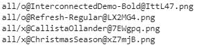

图像的类别可以从图像的名称中获得，其中图像名称的第一个字符指定图像所属的类别。

2.  导入所需的模块:

```py
import torch
from torch import nn
from torch.utils.data import TensorDataset,Dataset,DataLoader
from torch.optim import SGD, Adam
device = 'cuda' if torch.cuda.is_available() else 'cpu'
from torchvision import datasets
import numpy as np, cv2
import matplotlib.pyplot as plt
%matplotlib inline
from glob import glob
from imgaug import augmenters as iaa
```

3.  定义一个获取数据的类。此外，请确保图像的大小已调整为 28 x 28 的形状，批次已用三个通道成形，并且因变量作为数值提取。我们将在下面的代码中一步一步地实现这一点:

*   定义图像增强方法，该方法将图像的大小调整为 28 x 28 的形状:

```py
tfm = iaa.Sequential(iaa.Resize(28))
```

*   定义一个类，它将文件夹路径作为输入，并在`__init__`方法中遍历该路径中的文件:

```py
class XO(Dataset):
    def __init__(self, folder):
        self.files = glob(folder)
```

*   定义`__len__`方法，该方法返回要考虑的文件长度:

```py
    def __len__(self): return len(self.files)
```

*   定义`__getitem__`方法，我们用它来获取一个索引，返回该索引处的文件，读取该文件，然后对图像执行增强。这里我们没有使用`collate_fn`,因为这是一个小数据集，不会显著影响训练时间:

```py
    def __getitem__(self, ix):
        f = self.files[ix]
        im = tfm.augment_image(cv2.imread(f)[:,:,0])
```

*   假设每个图像的形状为 28 x 28，我们现在将在形状的开始处创建一个虚拟通道尺寸；也就是说，在图像的高度和宽度之前:

```py
        im = im[None]
```

*   现在，我们可以根据文件名中的字符 post `'/'`和 previous`'@'`来分配每个图像的类别:

```py
        cl = f.split('/')[-1].split('@')[0] == 'x'
```

*   最后，我们返回图像和相应的类:

```py
        return torch.tensor(1 - im/255).to(device).float(), \
                       torch.tensor([cl]).float().to(device)
```

4.  检查你得到的图像样本。在下面的代码中，我们通过从之前定义的类中获取数据来提取图像及其对应的类:

```py
data = XO('/content/all/*')
```

*   现在，我们可以从获得的数据集中绘制一个图像样本:

```py
R, C = 7,7
fig, ax = plt.subplots(R, C, figsize=(5,5))
for label_class, plot_row in enumerate(ax):
    for plot_cell in plot_row:
        plot_cell.grid(False); plot_cell.axis('off')
        ix = np.random.choice(1000)
        im, label = data[ix]
        print()
        plot_cell.imshow(im[0].cpu(), cmap='gray')
plt.tight_layout()
```

上述代码会产生以下输出:


5.  定义模型架构、损失函数和优化器:

```py
from torch.optim import SGD, Adam
def get_model():
    model = nn.Sequential(
                nn.Conv2d(1, 64, kernel_size=3),
                nn.MaxPool2d(2),
                nn.ReLU(),
                nn.Conv2d(64, 128, kernel_size=3),
                nn.MaxPool2d(2),
                nn.ReLU(),
                nn.Flatten(),
                nn.Linear(3200, 256),
                nn.ReLU(),
                nn.Linear(256, 1),
                nn.Sigmoid()
            ).to(device)

    loss_fn = nn.BCELoss()
    optimizer = Adam(model.parameters(), lr=1e-3)
    return model, loss_fn, optimizer
```

注意，损失函数是二进制交叉熵损失(`nn.BCELoss()`)，因为所提供的输出来自二进制类。可以获得前面模型的总结如下:

```py
!pip install torch_summary
from torchsummary import summary
model, loss_fn, optimizer = get_model()
summary(model, torch.zeros(1,1,28,28));
```

这会产生以下输出:

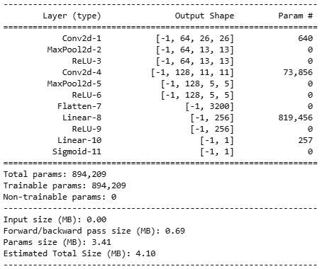

6.  定义一个用于批量训练的函数，该函数将图像及其类别作为输入，并在对给定批量数据执行反向传播后返回其损失值和精度:

```py
def train_batch(x, y, model, opt, loss_fn):
    model.train()
    prediction = model(x)
    is_correct = (prediction > 0.5) == y
    batch_loss = loss_fn(prediction, y)
    batch_loss.backward()
    optimizer.step()
    optimizer.zero_grad()
    return batch_loss.item(), is_correct[0]
```

7.  定义一个`DataLoader`，其中输入是`Dataset`类:

```py
trn_dl = DataLoader(XO('/content/all/*'), batch_size=32, \
                    drop_last=True)
```

8.  初始化模型:

```py
model, loss_fn, optimizer = get_model()
```

9.  在`5`个时期内训练模型:

```py
for epoch in range(5):
    for ix, batch in enumerate(iter(trn_dl)):
        x, y = batch
        batch_loss = train_batch(x, y, model, optimizer, \
                                        loss_fn)
```

10.  获取图像以检查过滤器对图像的了解:

```py
im, c = trn_dl.dataset[2]
plt.imshow(im[0].cpu())
plt.show()
```

这会产生以下输出:


11.  将图像传递给经过训练的模型，并获取第一层的输出。然后，将其存储在`intermediate_output`变量中:

```py
first_layer = nn.Sequential(*list(model.children())[:1])
intermediate_output = first_layer(im[None])[0].detach()
```

12.  绘制 64 个滤波器的输出。`intermediate_output`中的每个通道是每个滤波器卷积的输出:

```py
fig, ax = plt.subplots(8, 8, figsize=(10,10))
for ix, axis in enumerate(ax.flat):
    axis.set_title('Filter: '+str(ix))
    axis.imshow(intermediate_output[ix].cpu())
plt.tight_layout()
plt.show()
```

这会产生以下输出:


在前面的输出中，请注意，某些滤波器(如滤波器 0、4、6 和 7)学习网络中存在的边，而其他滤波器(如滤波器 54)学习反转图像。

13.  传递多个图像并检查第四个滤波器在图像上的输出(我们使用第四个滤波器只是为了说明的目的；如果愿意，您可以选择不同的过滤器):

*   从数据中提取多个图像:

```py
x, y = next(iter(trn_dl))
x2 = x[y==0]
```

*   重塑`x2`的形状，使其具有适合 CNN 模型的输入形状；即批量 x 通道 x 高度 x 宽度:

```py
x2 = x2.view(-1,1,28,28)
```

*   定义一个存储模型直到第一层的变量:

```py
first_layer = nn.Sequential(*list(model.children())[:1])
```

*   提取通过模型传递 O 图像(`x2`)直到第一层(`first_layer`)的输出，如前所述:

```py
first_layer_output = first_layer(x2).detach()
```

14.  绘制通过`first_layer`模型传递多个图像的输出:

```py
n = 4
fig, ax = plt.subplots(n, n, figsize=(10,10))
for ix, axis in enumerate(ax.flat):
    axis.imshow(first_layer_output[ix,4,:,:].cpu())
    axis.set_title(str(ix))
plt.tight_layout()
plt.show()
```

上述代码会产生以下输出:


请注意，给定滤镜(在这种情况下，第一层的第四个滤镜)的行为在图像之间保持一致。

15.  现在，让我们创建另一个模型，该模型提取层，直到第二个卷积层(即，直到前面模型中定义的四个层)，然后提取传递原始 O 图像的输出。然后，我们将绘制第二层中的滤波器与图像输入卷积的输出:

```py
second_layer = nn.Sequential(*list(model.children())[:4])
second_intermediate_output=second_layer(im[None])[0].detach()
```

*   绘制滤波器与相应图像的卷积输出:

```py
fig, ax = plt.subplots(11, 11, figsize=(10,10))
for ix, axis in enumerate(ax.flat):
    axis.imshow(second_intermediate_output[ix].cpu())
    axis.set_title(str(ix))
plt.tight_layout()
plt.show()
```

上述代码会产生以下输出:


现在，让我们使用上图中第 34 个过滤器的输出作为例子。当我们让多个 O 图像通过过滤器 34 时，我们应该看到图像之间的类似激活。让我们测试一下，如下所示:

```py
second_layer = nn.Sequential(*list(model.children())[:4])
second_intermediate_output = second_layer(x2).detach()
fig, ax = plt.subplots(4, 4, figsize=(10,10))
for ix, axis in enumerate(ax.flat):
    axis.imshow(second_intermediate_output[ix,34,:,:].cpu())
    axis.set_title(str(ix))
plt.tight_layout()
plt.show()
```

上述代码会产生以下输出:


注意，即使在这里，不同图像上第 34 个^(滤光器的激活是相似的，因为 O 的左半部分激活了滤光器。)

16.  绘制完全连接层的激活，如下所示:

*   首先，获取更大的图像样本:

```py
custom_dl= DataLoader(XO('/content/all/*'),batch_size=2498, \
                       drop_last=True)
```

*   接下来，仅从数据集中选择 O 图像，然后对它们进行整形，以便它们可以作为输入传递给我们的 CNN 模型:

```py
x, y = next(iter(custom_dl))
x2 = x[y==0]
x2 = x2.view(len(x2),1,28,28)
```

*   提取展平(完全连接)层，将前面的图像传递到模型中，直到它们到达展平层:

```py
flatten_layer = nn.Sequential(*list(model.children())[:7])
flatten_layer_output = flatten_layer(x2).detach()
```

*   绘制展平层:

```py
plt.figure(figsize=(100,10))
plt.imshow(flatten_layer_output.cpu())
```

上述代码产生以下输出:

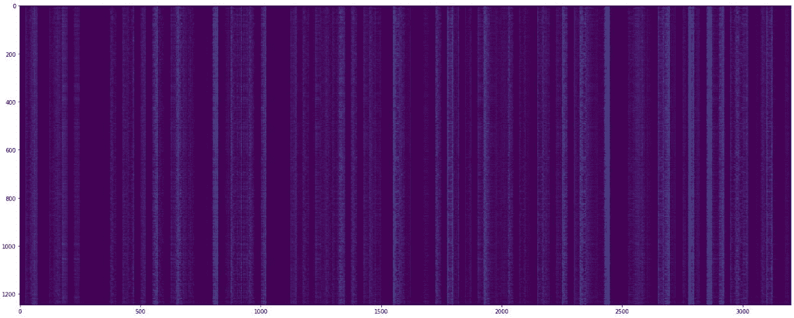

请注意，输出的形状是 1245 x 3200，因为我们的数据集中有 1，245 张 **O** 图像，展平层中的每张图像有 3，200 个维度。

有趣的是，当输入为 **O** 时，全连接层中的某些值会突出显示(这里，我们可以看到白线，其中每个点代表大于零的激活值)。

请注意，该模型已经学会为完全连接的层带来一些结构，即使输入图像——虽然都属于同一类——在风格上有很大不同。

既然我们已经了解了 CNN 是如何工作的，以及过滤器是如何帮助这个过程的，我们将应用这一点，以便我们可以对猫和狗的图像进行分类。

# 构建用于分类真实世界图像的 CNN

到目前为止，我们已经了解了如何在时尚 MNIST 数据集上执行图像分类。在这一节中，我们将在一个更真实的场景中做同样的事情，任务是对包含猫或狗的图像进行分类。我们还将了解当我们改变可用于训练的图像数量时，数据集的准确性如何变化。

我们将在 Kaggle 中使用一个数据集:[https://www.kaggle.com/tongpython/cat-and-dog](https://www.kaggle.com/tongpython/cat-and-dog)。

The code for this section is available as `Cats_Vs_Dogs.ipynb` in the `Chapter04` folder of this book's GitHub repository - [https://tinyurl.com/mcvp-packt](https://tinyurl.com/mcvp-packt) Be sure to copy the URL from the notebook in GitHub to avoid any issue while reproducing the results

1.  导入必要的包:

```py
import torchvision
import torch.nn as nn
import torch
import torch.nn.functional as F
from torchvision import transforms,models,datasets
from PIL import Image
from torch import optim
device = 'cuda' if torch.cuda.is_available() else 'cpu'
import cv2, glob, numpy as np, pandas as pd
import matplotlib.pyplot as plt
%matplotlib inline
from glob import glob
!pip install torch_summary
```

2.  下载数据集，如下所示:

*   这里，我们必须下载在`colab`环境中可用的数据集。然而，首先我们必须上传我们的 Kaggle 认证文件:

```py
!pip install -q kaggle
from google.colab import files
files.upload()
```

这一步你需要上传你的`kaggle.json`文件，可以从你的 Kaggle 账户获得。GitHub 上的相关笔记本中提供了如何获取`kaggle.json`文件的详细信息

*   接下来，指定我们将移动到 Kaggle 文件夹，并将`kaggle.json`文件复制到其中:

```py
!mkdir -p ~/.kaggle
!cp kaggle.json ~/.kaggle/
!ls ~/.kaggle
!chmod 600 /root/.kaggle/kaggle.json
```

*   最后，下载猫狗数据集并解压:

```py
!kaggle datasets download -d tongpython/cat-and-dog
!unzip cat-and-dog.zip
```

3.  提供培训和测试数据集文件夹:

```py
train_data_dir = '/content/training_set/training_set'
test_data_dir = '/content/test_set/test_set'
```

4.  构建一个从前面的文件夹中获取数据的类。然后，根据图像对应的目录，为“狗”图像提供标签 1，为“猫”图像提供标签 0。此外，确保获取的图像已被规范化为 0 到 1 之间的比例，并对其进行置换，以便首先提供通道(因为 PyTorch 模型希望在图像的高度和宽度之前首先指定通道)。

*   定义`__init__`方法，该方法将一个文件夹作为输入，并将与`cats`和`dogs`文件夹中的图像相对应的文件路径(图像路径)存储在单独的对象中，然后将这些文件路径连接成一个列表:

```py
from torch.utils.data import DataLoader, Dataset
class cats_dogs(Dataset):
    def __init__(self, folder):
        cats = glob(folder+'/cats/*.jpg')
        dogs = glob(folder+'/dogs/*.jpg')
        self.fpaths = cats + dogs
```

*   接下来，随机化文件路径，并基于对应于这些文件路径的文件夹创建目标变量:

```py
        from random import shuffle, seed; seed(10); 
        shuffle(self.fpaths)
        self.targets=[fpath.split('/')[-1].startswith('dog') \
                      for fpath in self.fpaths] # dog=1 
```

*   定义对应于`self`类的`__len__`方法:

```py
    def __len__(self): return len(self.fpaths)
```

*   定义`__getitem__`方法，我们用它从文件路径列表中指定一个随机的文件路径，读取图像，并调整所有图像的大小，使它们的大小为 224 x 224。假设我们的 CNN 期望首先为每个图像指定来自通道的输入，我们将`permute`调整大小的图像，以便在我们返回缩放的图像和相应的`target`值之前首先提供通道:

```py
    def __getitem__(self, ix):
        f = self.fpaths[ix]
        target = self.targets[ix]
        im = (cv2.imread(f)[:,:,::-1])
        im = cv2.resize(im, (224,224))
        return torch.tensor(im/255).permute(2,0,1)\
                    .to(device).float(),\
               torch.tensor([target]) \
                    .float().to(device)
```

5.  检查随机图像:

```py
data = cats_dogs(train_data_dir)
im, label = data[200]
```

我们需要把我们最后获得的图像传送到我们的频道。这是因为 matplotlib 希望在提供图像的高度和宽度后，图像具有指定的通道:

```py
plt.imshow(im.permute(1,2,0).cpu())
print(label)
```

这会产生以下输出:


6.  定义模型、损失函数和优化器，如下所示:

*   首先，我们必须定义`conv_layer`函数，在这里我们依次执行卷积、ReLU 激活、批处理规范化和最大池化。这个方法将在最终模型中重用，我们将在下一步中定义它:

```py
def conv_layer(ni,no,kernel_size,stride=1):
    return nn.Sequential(
        nn.Conv2d(ni, no, kernel_size, stride),
        nn.ReLU(),
        nn.BatchNorm2d(no),
        nn.MaxPool2d(2)
    )
```

在前面的代码中，我们将输入通道的数量(`ni`)、输出通道的数量(`no`)、滤波器的`kernel_size`和`stride`作为`conv_layer`函数的输入。

*   定义`get_model`函数，该函数执行多重卷积和池化操作(通过调用`conv_layer`方法)，展平输出，并在连接到输出层之前连接一个隐藏层:

```py
def get_model():
    model = nn.Sequential(
              conv_layer(3, 64, 3),
              conv_layer(64, 512, 3),
              conv_layer(512, 512, 3),
              conv_layer(512, 512, 3),
              conv_layer(512, 512, 3),
              conv_layer(512, 512, 3),
              nn.Flatten(),
              nn.Linear(512, 1),
              nn.Sigmoid(),
            ).to(device)
    loss_fn = nn.BCELoss()
    optimizer = torch.optim.Adam(model.parameters(), lr= 1e-3)
    return model, loss_fn, optimizer
```

你可以在`nn.Sequential`内部链接`nn.Sequential`，深度不限。在前面的代码中，我们使用了`conv_layer`，就好像它是任何其他的`nn.Module`层一样。

*   现在，我们必须调用`get_model`函数来获取模型、损失函数(`loss_fn`)和`optimizer`，然后使用从`torchsummary`包中导入的`summary`方法对模型进行汇总:

```py
from torchsummary import summary
model, loss_fn, optimizer = get_model()
summary(model, torch.zeros(1,3, 224, 224));
```

上述代码会产生以下输出:


7.  创建`get_data`函数，该函数创建一个`cats_dogs`类的对象，并为训练和验证文件夹创建一个`batch_size`为 32 的`DataLoader`:

```py
def get_data(): 
    train = cats_dogs(train_data_dir)
    trn_dl = DataLoader(train, batch_size=32, shuffle=True, \
                            drop_last = True)
    val = cats_dogs(test_data_dir)
    val_dl = DataLoader(val, batch_size=32, shuffle=True, \
                            drop_last = True)
    return trn_dl, val_dl
```

在前面的代码中，我们通过指定`drop_last = True`忽略了最后一批数据。我们这样做是因为最后一批可能与其他批次的尺寸不同。

8.  定义将根据一批数据训练模型的函数，就像我们在前面几节中所做的那样:

```py
def train_batch(x, y, model, opt, loss_fn):
    model.train()
    prediction = model(x)
    batch_loss = loss_fn(prediction, y)
    batch_loss.backward()
    optimizer.step()
    optimizer.zero_grad()
    return batch_loss.item()
```

9.  定义计算准确度和验证损失的函数，就像我们在前面几节中所做的那样:

*   定义`accuracy`功能:

```py
@torch.no_grad()
def accuracy(x, y, model):
    prediction = model(x)
    is_correct = (prediction > 0.5) == y
    return is_correct.cpu().numpy().tolist()
```

请注意，前面用于精度计算的代码不同于时尚-MNIST 分类中的代码，因为当前模型(猫与狗的分类)是为二元分类构建的，而时尚-MNIST 模型是为多类分类构建的。

*   定义验证损失计算函数:

```py
@torch.no_grad()
def val_loss(x, y, model):
    prediction = model(x)
    val_loss = loss_fn(prediction, y)
    return val_loss.item()
```

10.  针对`5`时段训练模型，并在每个时段结束时检查测试数据的准确性，正如我们在前面章节中所做的那样:

*   定义模型并获取所需的数据加载器:

```py
trn_dl, val_dl = get_data()
model, loss_fn, optimizer = get_model()
```

*   在不断增加的时期内训练模型:

```py
train_losses, train_accuracies = [], []
val_losses, val_accuracies = [], []
for epoch in range(5):
    train_epoch_losses, train_epoch_accuracies = [], []
    val_epoch_accuracies = []
    for ix, batch in enumerate(iter(trn_dl)):
        x, y = batch
        batch_loss = train_batch(x, y, model, optimizer, \
                                            loss_fn)
        train_epoch_losses.append(batch_loss) 
    train_epoch_loss = np.array(train_epoch_losses).mean()

    for ix, batch in enumerate(iter(trn_dl)):
        x, y = batch
        is_correct = accuracy(x, y, model)
        train_epoch_accuracies.extend(is_correct)
    train_epoch_accuracy = np.mean(train_epoch_accuracies)

    for ix, batch in enumerate(iter(val_dl)):
        x, y = batch
        val_is_correct = accuracy(x, y, model)
        val_epoch_accuracies.extend(val_is_correct)
    val_epoch_accuracy = np.mean(val_epoch_accuracies)

    train_losses.append(train_epoch_loss)
    train_accuracies.append(train_epoch_accuracy)
    val_accuracies.append(val_epoch_accuracy)
```

11.  绘制训练和验证准确度在增加的时期内的变化:

```py
epochs = np.arange(5)+1
import matplotlib.ticker as mtick
import matplotlib.pyplot as plt
import matplotlib.ticker as mticker
%matplotlib inline
plt.plot(epochs, train_accuracies, 'bo', 
         label='Training accuracy')
plt.plot(epochs, val_accuracies, 'r', 
         label='Validation accuracy')
plt.gca().xaxis.set_major_locator(mticker.MultipleLocator(1))
plt.title('Training and validation accuracy \
with 4K data points used for training')
plt.xlabel('Epochs')
plt.ylabel('Accuracy')
plt.gca().set_yticklabels(['{:.0f}%'.format(x*100) \
                           for x in plt.gca().get_yticks()]) 
plt.legend()
plt.grid('off')
plt.show()
```

上述代码会产生以下输出:


注意，在`5`时期结束时的分类精度约为 86%。

正如我们在上一章中所讨论的，批处理规范化对提高分类准确性有很大的影响——通过在没有批处理规范化的情况下训练模型来验证这一点。此外，如果使用较少的参数，可以在不进行批量标准化的情况下训练模型。您可以通过减少层数、增加步幅、增加池大小或将图像大小调整为低于 224 x 224 的数字来实现这一点。

到目前为止，我们所做的培训是基于大约 8K 个例子，其中 4K 的例子来自`cat`班，其余的来自`dog`班。在下一节中，我们将了解在测试数据集的分类准确性方面，减少训练样本数量对每个类有什么影响。

## 对用于训练的图像数量的影响

我们知道，一般来说，我们使用的训练样本越多，我们的分类准确度就越高。在本节中，我们将通过人为减少可用于训练的图像数量，然后在对测试数据集进行分类时测试模型的准确性，来了解使用不同数量的可用图像对训练准确性有何影响。

The code for this section is available as `Cats_Vs_Dogs.ipynb` in the `Chapter04` folder of this book's GitHub repository - [https://tinyurl.com/mcvp-packt](https://tinyurl.com/mcvp-packt) . Given that the majority of the code that will be provided here is similar to what we have seen in the previous section, in text, we have only provided the modified code for brevity. The respective notebook in this book's GitHub repository will contain the full code.

这里，我们只希望训练数据集中每个类有 500 个数据点。我们可以通过使用`__init__`方法将文件数量限制为每个文件夹中的前 500 个图像路径，并确保其余部分保持与上一节中相同:

```py
    def __init__(self, folder):
        cats = glob(folder+'/cats/*.jpg')
        dogs = glob(folder+'/dogs/*.jpg')
        self.fpaths = cats[:500] + dogs[:500]
        from random import shuffle, seed; seed(10); 
            shuffle(self.fpaths)
        self.targets = [fpath.split('/')[-1].startswith('dog') \
                        for fpath in self.fpaths]
```

在前面的代码中，与我们在上一节中执行的初始化的唯一区别是在`self.paths`中，我们现在将每个文件夹中要考虑的文件路径的数量限制为前 500 个。

现在，一旦我们执行了代码的其余部分，就像我们在上一节中所做的那样，基于测试数据集中的 1，000 张图像(每类 500 张)构建的模型的准确性将如下所示:

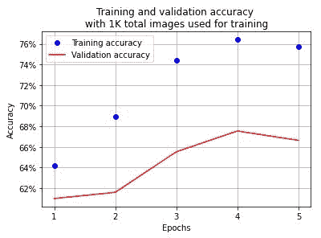

在这里，我们可以看到，因为我们在训练中有更少的图像示例，测试数据集的准确性大大降低；也就是下降到~66%。

现在，让我们通过改变将用于训练模型的可用训练示例的数量，来看看训练数据点的数量如何影响测试数据集的准确性(在这里，我们为每个场景构建一个模型)。

我们将使用用于 500 个数据点训练示例的相同代码，但将改变可用图像的数量(分别为 2K、4K 和 8K 总数据点)。为简洁起见，我们将只查看在不同数量的可用于训练的图像上运行模型的输出。这会产生以下输出:


如您所见，可用的训练数据越多，模型对测试数据的准确性就越高。然而，在我们遇到的每个场景中，我们可能没有足够大的训练数据量。下一章将介绍迁移学习，将通过指导您使用各种技术来解决这个问题，即使是在少量的训练数据上，您也可以使用这些技术来获得高精度。

# 摘要

当与先前看到的已经被翻译的图像非常相似的新图像被输入到模型中时，传统的神经网络就失效了。卷积神经网络在解决这一缺点方面起着关键作用。这是通过 CNN 中的各种机制实现的，包括过滤器、步长和池。最初，我们构建了一个玩具示例来了解 CNN 是如何工作的。然后，我们了解了数据增强如何通过在原始图像上创建翻译增强来帮助提高模型的准确性。之后，我们了解了不同的过滤器在特征学习过程中学习什么，以便我们可以实现 CNN 来分类图像。

最后，我们看到了不同数量的训练数据对测试数据准确性的影响。在这里，我们看到可用的训练数据越多，测试数据的准确性就越好。在下一章中，我们将了解如何利用各种迁移学习技术来提高测试数据集的准确性，即使我们只有少量的训练数据。

# 问题

1.  为什么在使用传统神经网络时，对翻译图像的预测很低？
2.  卷积是怎么做的？
3.  如何确定过滤器中的最佳重量值？
4.  卷积和汇集的结合如何帮助解决图像转换的问题？
5.  更接近输入层的层中的过滤器学习什么？
6.  池有哪些功能有助于构建模型？

7.  为什么我们不能获取一个输入图像，将其展平(就像我们在时尚-MNIST 数据集上所做的那样)，然后为真实世界的图像训练一个模型？
8.  数据增强如何帮助改善图像翻译？
9.  在什么场景下我们利用`collate_fn`进行数据加载？
10.  改变训练数据点的数量对验证数据集的分类准确性有什么影响？