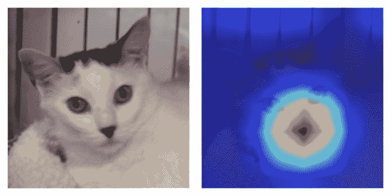
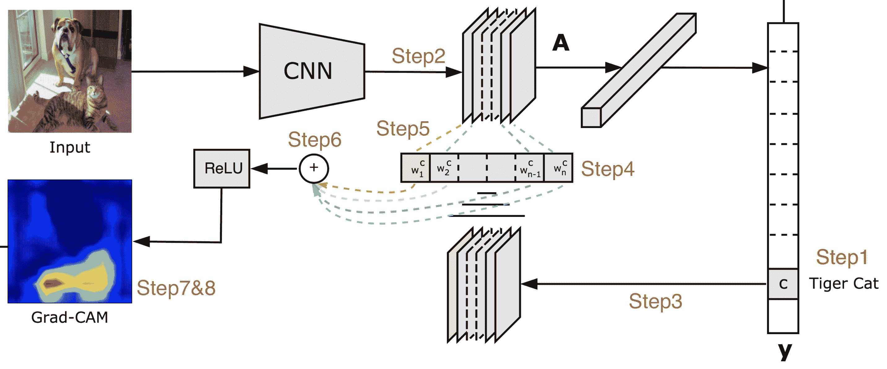
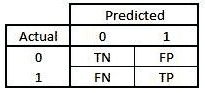

在前面的章节中，我们学习了利用**卷积神经网络**(**CNN**)以及预训练模型来执行图像分类。本章将进一步巩固我们对 CNN 的理解，以及在现实应用中利用它们时需要考虑的各种实际问题。我们将从理解 CNN 使用**班级激活图** ( **CAMs** )预测他们所做班级的原因开始。接下来，我们将了解可以用来提高模型准确性的各种数据扩充。最后，我们将了解模型在现实世界中可能出错的各种情况，并强调在这种情况下应该注意的方面以避免陷阱。

本章将涵盖以下主题:

*   生成凸轮
*   了解批量标准化和数据扩充的影响
*   模型实现过程中需要注意的实际问题

# 生成凸轮

想象一个场景，你已经建立了一个模型，能够做出很好的预测。然而，您向其展示模型的利益相关者想要了解模型预测保持原样的原因。在这种情况下，摄像头就派上了用场。CAM 示例如下，其中输入图像在左侧，用于产生分类预测的像素在右侧突出显示:



让我们来了解一下，一旦模型被训练好了，cam 是如何生成的。特征映射是卷积运算之后的中间激活。通常，这些激活图的形状是`n-channels x height x width`。如果我们取所有这些激活的平均值，它们显示了图像中所有类别的热点。但是如果我们只对某个特定类别(比如说，`cat`)重要的位置感兴趣，我们只需要在`n-channels`中找出那些负责那个类别的特征地图。对于生成这些特征图的卷积层，我们可以计算它相对于`cat`类的梯度。注意，只有那些负责预测`cat`的通道将具有高梯度。这意味着我们可以使用梯度信息给每个`n-channels`赋予权重，并获得一个专用于`cat`的激活图。

现在我们已经了解了如何生成 cam 的高级策略，让我们一步一步地将其付诸实践:

1.  决定要为哪个类计算 CAM，以及要为神经网络中的哪个卷积层计算 CAM。
2.  计算任何卷积层产生的激活–假设随机卷积层的特征形状为 512 x 7 x 7。
3.  根据感兴趣的类别提取该图层的梯度值。输出的渐变形状是 256 x 512 x 3 x 3(这是卷积张量的形状——也就是`in-channels x out-channels x kernel-size x kernel-size`)。
4.  计算每个输出通道内梯度的平均值。输出形状是 512。
5.  计算加权激活图，即 512 个梯度平均值乘以 512 个激活通道。输出形状为 512 x 7 x 7。
6.  计算加权激活图的平均值(跨越 512 个通道),以获取 7 x 7 形状的输出。
7.  调整(放大)加权激活图输出的大小，以获取与输入大小相同的图像。这样做是为了让我们有一个类似于原始图像的激活图。
8.  将加权激活图叠加到输入图像上。

来自论文 *Grad-CAM 的下图:梯度加权类激活映射*(【https://arxiv.org/abs/1610.02391】T2)形象地描述了前面的步骤:



整个过程的关键在于*第五步*。我们考虑该步骤的两个方面:

*   如果某个像素是重要的，那么 CNN 将在这些像素上有大量的激活。
*   如果某个卷积信道对于所需的类别很重要，则该信道的梯度将非常大。

将这两者相乘，我们确实得到了所有像素的重要性图。

前面的策略在代码中实现，以理解 CNN 模型预测图像指示疟疾事件可能性的原因，如下所示:

The following code is available as `Class_activation_maps.ipynb` in the `Chapter06` folder of this book's GitHub repository - [https://tinyurl.com/mcvp-packt](https://tinyurl.com/mcvp-packt) The code contains URLs to download data from and is moderately lengthy. We strongly recommend you to execute the notebook in GitHub to reproduce results while you understand the steps to perform and explanation of various code components in text.

1.  下载数据集并导入相关包:

```py
import os
if not os.path.exists('cell_images'):
    !pip install -U -q torch_snippets
    !wget -q ftp://lhcftp.nlm.nih.gov/Open-Access-Datasets/
     Malaria/cell_images.zip
    !unzip -qq cell_images.zip
    !rm cell_images.zip
from torch_snippets import *
```

2.  指定对应于输出类别的索引:

```py
id2int = {'Parasitized': 0, 'Uninfected': 1}
```

3.  在图像上执行要完成的变换:

```py
from torchvision import transforms as T

trn_tfms = T.Compose([
                T.ToPILImage(),
                T.Resize(128),
                T.CenterCrop(128),
                T.ColorJitter(brightness=(0.95,1.05), 
                              contrast=(0.95,1.05), 
                              saturation=(0.95,1.05), 
                              hue=0.05),
                T.RandomAffine(5, translate=(0.01,0.1)),
                T.ToTensor(),
                T.Normalize(mean=[0.5, 0.5, 0.5], 
                            std=[0.5, 0.5, 0.5]),
            ])
```

在前面的代码中，我们在输入图像的顶部有一个转换管道——这是一个调整图像大小的管道(在这种情况下，它确保其中一个维度的最小大小是`128`),然后从中心裁剪它。此外，我们正在执行随机颜色抖动和仿射变换。接下来，我们使用`.ToTensor`方法缩放图像，使其值介于`0`和`1`之间，最后，我们对图像进行归一化处理。正如在[第 4 章](c184fff6-28cc-4e13-830b-3b2a21736f75.xhtml)、*介绍卷积神经网络*中所讨论的，我们也可以使用`imgaug`库。

*   指定要在验证图像上完成的转换:

```py
val_tfms = T.Compose([
                T.ToPILImage(),
                T.Resize(128),
                T.CenterCrop(128),
                T.ToTensor(),
                T.Normalize(mean=[0.5, 0.5, 0.5], 
                            std=[0.5, 0.5, 0.5]),
            ])
```

4.  定义数据集类-`MalariaImages`:

```py
class MalariaImages(Dataset):

    def __init__(self, files, transform=None):
        self.files = files
        self.transform = transform
        logger.info(len(self))

    def __len__(self):
        return len(self.files)

    def __getitem__(self, ix):
        fpath = self.files[ix]
        clss = fname(parent(fpath))
        img = read(fpath, 1)
        return img, clss

    def choose(self):
        return self[randint(len(self))]

    def collate_fn(self, batch):
        _imgs, classes = list(zip(*batch))
        if self.transform:
            imgs = [self.transform(img)[None] \
                    for img in _imgs]
        classes = [torch.tensor([id2int[clss]]) \
                   for class in classes]
        imgs, classes = [torch.cat(i).to(device) \
                         for i in [imgs, classes]]
        return imgs, classes, _imgs
```

5.  获取训练和验证数据集以及数据加载器:

```py
device = 'cuda' if torch.cuda.is_available() else 'cpu'
all_files = Glob('cell_img/*/*.png')
np.random.seed(10)
np.random.shuffle(all_files)

from sklearn.model_selection import train_test_split
trn_files, val_files = train_test_split(all_files, \
                                        random_state=1)

trn_ds = MalariaImages(trn_files, transform=trn_tfms)
val_ds = MalariaImages(val_files, transform=val_tfms)
trn_dl = DataLoader(trn_ds, 32, shuffle=True, 
                    collate_fn=trn_ds.collate_fn)
val_dl = DataLoader(val_ds, 32, shuffle=False, 
                    collate_fn=val_ds.collate_fn)
```

6.  定义模型-`MalariaClassifier`:

```py
def convBlock(ni, no):
    return nn.Sequential(
        nn.Dropout(0.2),
        nn.Conv2d(ni, no, kernel_size=3, padding=1),
        nn.ReLU(inplace=True),
        nn.BatchNorm2d(no),
        nn.MaxPool2d(2),
    )

class MalariaClassifier(nn.Module):
    def __init__(self):
        super().__init__()
        self.model = nn.Sequential(
            convBlock(3, 64),
            convBlock(64, 64),
            convBlock(64, 128),
            convBlock(128, 256),
            convBlock(256, 512),
            convBlock(512, 64),
            nn.Flatten(),
            nn.Linear(256, 256),
            nn.Dropout(0.2),
            nn.ReLU(inplace=True),
            nn.Linear(256, len(id2int))
        )
        self.loss_fn = nn.CrossEntropyLoss()

    def forward(self, x):
        return self.model(x)

    def compute_metrics(self, preds, targets):
        loss = self.loss_fn(preds, targets)
        acc =(torch.max(preds, 1)[1]==targets).float().mean()
        return loss, acc
```

7.  定义对一批数据进行训练和验证的函数:

```py
def train_batch(model, data, optimizer, criterion):
    model.train()
    ims, labels, _ = data
    _preds = model(ims)
    optimizer.zero_grad()
    loss, acc = criterion(_preds, labels)
    loss.backward()
    optimizer.step()
    return loss.item(), acc.item()

@torch.no_grad()
def validate_batch(model, data, criterion):
    model.eval()
    ims, labels, _ = data
    _preds = model(ims)
    loss, acc = criterion(_preds, labels)
    return loss.item(), acc.item()
```

8.  在不断增加的时期内训练模型:

```py
model = MalariaClassifier().to(device)
criterion = model.compute_metrics
optimizer = optim.Adam(model.parameters(), lr=1e-3)
n_epochs = 2

log = Report(n_epochs)
for ex in range(n_epochs):
    N = len(trn_dl)
    for bx, data in enumerate(trn_dl):
        loss, acc = train_batch(model, data, optimizer, \
                                    criterion)
        log.record(ex+(bx+1)/N,trn_loss=loss,trn_acc=acc, \
                                    end='\r')

    N = len(val_dl)
    for bx, data in enumerate(val_dl):
        loss, acc = validate_batch(model, data, criterion)
        log.record(ex+(bx+1)/N,val_loss=loss,val_acc=acc, \
                                    end='\r')

    log.report_avgs(ex+1)
```

9.  提取模型中第五个`convBlock`的卷积层:

```py
im2fmap = nn.Sequential(*(list(model.model[:5].children())+ \
                        list(model.model[5][:2].children())))
```

在前面的代码行中，我们获取了模型的第四层以及`convBlock`中的前两层，这恰好是`Conv2D`层。

10.  定义`im2gradCAM`函数，该函数获取输入图像并获取与图像激活对应的热图:

```py
def im2gradCAM(x):
    model.eval()
    logits = model(x)
    heatmaps = []
    activations = im2fmap(x)
    print(activations.shape)
    pred = logits.max(-1)[-1]
    # get the model's prediction
    model.zero_grad()
    # compute gradients with respect to 
    # model's most confident logit
    logits[0,pred].backward(retain_graph=True)
    # get the gradients at the required featuremap location
    # and take the avg gradient for every featuremap
    pooled_grads = model.model[-7][1]\
                        .weight.grad.data.mean((0,2,3))
```

```py

    # multiply each activation map with 
    # corresponding gradient average
    for i in range(activations.shape[1]):
        activations[:,i,:,:] *= pooled_grads[i]
    # take the mean of all weighted activation maps
    # (that has been weighted by avg. grad at each fmap)
    heatmap =torch.mean(activations, dim=1)[0].cpu().detach()
    return heatmap, 'Uninfected' if pred.item() \
else 'Parasitized'
```

11.  定义`upsampleHeatmap`函数，将热图上采样为与图像形状相对应的形状:

```py
SZ = 128
def upsampleHeatmap(map, img):
    m,M = map.min(), map.max()
    map = 255 * ((map-m) / (M-m))
    map = np.uint8(map)
    map = cv2.resize(map, (SZ,SZ))
    map = cv2.applyColorMap(255-map, cv2.COLORMAP_JET)
    map = np.uint8(map)
    map = np.uint8(map*0.7 + img*0.3)
    return map
```

在前面的代码行中，我们对图像进行了反规范化，并在图像上覆盖了热图。

12.  对一组图像运行上述功能:

```py
N = 20
_val_dl = DataLoader(val_ds, batch_size=N, shuffle=True, \
                     collate_fn=val_ds.collate_fn)
x,y,z = next(iter(_val_dl))

for i in range(N):
    image = resize(z[i], SZ)
    heatmap, pred = im2gradCAM(x[i:i+1])
    if(pred=='Uninfected'):
        continue
    heatmap = upsampleHeatmap(heatmap, image)
    subplots([image, heatmap], nc=2, figsize=(5,3), \
                suptitle=pred)
```

上述代码的输出如下:


由此我们可以看出，预测是因为以红色突出显示的内容(具有最高的 CAM 值)而保持原样。

现在，我们已经了解了如何使用训练好的模型来生成图像的类别激活热图，我们可以解释是什么使某个分类如此。

在下一节中，让我们了解在构建模型时有助于数据扩充的其他技巧。

# 了解数据扩充和批处理规范化的影响

提高模型准确性的一个聪明方法是利用数据扩充。我们已经在[第 4 章](c184fff6-28cc-4e13-830b-3b2a21736f75.xhtml)、*介绍卷积神经网络*中看到了这一点，在那里我们使用数据增强来提高翻译图像的分类精度。在现实世界中，您会遇到具有不同属性的图像，例如，一些图像可能更亮，一些图像可能在边缘附近包含感兴趣的对象，而一些图像可能比其他图像更抖动。在本节中，我们将了解数据扩充的使用如何有助于提高模型的准确性。此外，我们将了解数据扩充如何实际上成为我们模型的伪正则化。

为了了解数据扩充和批量标准化的影响，我们将浏览一个识别交通标志的数据集。我们将评估三种情况:

*   无批量标准化/数据扩充
*   只有批量标准化，但没有数据扩充
*   批量标准化和数据扩充

请注意，假设数据集和处理在三个场景中保持不变，只有数据扩充和模型(添加了批处理规范化层)不同，我们将只为第一个场景提供以下代码，但其他两个场景可在 GitHub 上的笔记本中找到。

## 对路标检测进行编码

让我们在不进行数据扩充和批量标准化的情况下，对路标检测进行编码，如下所示:

请注意，我们在这里不解释代码，因为它与我们在前面章节中学习过的代码非常一致——只有粗体字的行在三个场景中有所不同。下面的代码可以在本书的 GitHub 库【https://tinyurl.com/mcvp-packt[的`Chapter06`文件夹中找到`road_sign_detection.ipynb`](https://tinyurl.com/mcvp-packt)

1.  下载数据集并导入相关包:

```py
import os
if not os.path.exists('GTSRB'):
    !pip install -U -q torch_snippets
    !wget -qq https://sid.erda.dk/public/archives/
        daaeac0d7ce1152aea9b61d9f1e19370/
        GTSRB_Final_Training_Images.zip
    !wget -qq https://sid.erda.dk/public/archives/
        daaeac0d7ce1152aea9b61d9f1e19370/
        GTSRB_Final_Test_Images.zip
    !unzip -qq GTSRB_Final_Training_Images.zip
    !unzip -qq GTSRB_Final_Test_Images.zip
    !wget https://raw.githubusercontent.com/georgesung/
     traffic_sign_classification_german/master/signnames.csv
    !rm GTSRB_Final_Training_Images.zip 
       GTSRB_Final_Test_Images.zip

from torch_snippets import *
```

2.  将类 id 分配给可能的输出类:

```py
classIds = pd.read_csv('signnames.csv')
classIds.set_index('ClassId', inplace=True)
classIds = classIds.to_dict()['SignName']
classIds = {f'{k:05d}':v for k,v in classIds.items()}
id2int = {v:ix for ix,(k,v) in enumerate(classIds.items())}
```

3.  在没有任何扩充的情况下，在图像上定义转换管道:

```py
from torchvision import transforms as T
trn_tfms = T.Compose([
                T.ToPILImage(),
                T.Resize(32),
                T.CenterCrop(32),
               # T.ColorJitter(brightness=(0.8,1.2), 
 # contrast=(0.8,1.2), 
 # saturation=(0.8,1.2), 
 # hue=0.25),
 # T.RandomAffine(5, translate=(0.01,0.1)),
                T.ToTensor(),
                T.Normalize(mean=[0.485, 0.456, 0.406], 
                            std=[0.229, 0.224, 0.225]),
            ])
```

```py

val_tfms = T.Compose([
                T.ToPILImage(),
                T.Resize(32),
                T.CenterCrop(32),
                T.ToTensor(),
                T.Normalize(mean=[0.485, 0.456, 0.406], 
                            std=[0.229, 0.224, 0.225]),
            ])
```

在前面的代码中，我们指定将每个图像转换为 PIL 图像，并从中心调整图像大小和裁剪图像。此外，我们使用`.ToTensor`方法缩放图像，使像素值在`0`和`1`之间。最后，我们正在标准化输入图像，以便可以利用预先训练的模型。

前面代码的注释部分是您应该取消注释并重新运行以理解执行数据扩充的场景的部分。此外，我们不在`val_tfms`上执行增强，因为在模型训练期间不使用这些图像。然而，`val_tfms`图像应该通过与`trn_tfms`相同的转换管道。

4.  定义数据集类-`GTSRB`:

```py
class GTSRB(Dataset):

    def __init__(self, files, transform=None):
        self.files = files
        self.transform = transform
        logger.info(len(self))

    def __len__(self):
        return len(self.files)

    def __getitem__(self, ix):
        fpath = self.files[ix]
        clss = fname(parent(fpath))
        img = read(fpath, 1)
        return img, classIds[clss]

    def choose(self):
        return self[randint(len(self))]
```

```py
    def collate_fn(self, batch):
        imgs, classes = list(zip(*batch))
        if self.transform:
            imgs =[self.transform(img)[None] \
                   for img in imgs]
        classes = [torch.tensor([id2int[clss]]) \
                   for clss in classes]
        imgs, classes = [torch.cat(i).to(device) \
                         for i in [imgs, classes]]
        return imgs, classes
```

5.  创建培训和验证数据集以及数据加载器:

```py
device = 'cuda' if torch.cuda.is_available() else 'cpu'
all_files = Glob('GTSRB/Final_Training/img/*/*.ppm')
np.random.seed(10)
np.random.shuffle(all_files)

from sklearn.model_selection import train_test_split
trn_files, val_files = train_test_split(all_files, \
                                        random_state=1)

trn_ds = GTSRB(trn_files, transform=trn_tfms)
val_ds = GTSRB(val_files, transform=val_tfms)
trn_dl = DataLoader(trn_ds, 32, shuffle=True, \
                    collate_fn=trn_ds.collate_fn)
val_dl = DataLoader(val_ds, 32, shuffle=False, \
                    collate_fn=val_ds.collate_fn)
```

6.  定义模型-`SignClassifier`:

```py
import torchvision.models as models

def convBlock(ni, no):
    return nn.Sequential(
                nn.Dropout(0.2),
                nn.Conv2d(ni, no, kernel_size=3, padding=1),
                nn.ReLU(inplace=True),
                #nn.BatchNorm2d(no),
                nn.MaxPool2d(2),
            )

class SignClassifier(nn.Module):
    def __init__(self):
        super().__init__()
        self.model = nn.Sequential(
                        convBlock(3, 64),
                        convBlock(64, 64),
                        convBlock(64, 128),
                        convBlock(128, 64),
                        nn.Flatten(),
                        nn.Linear(256, 256),
                        nn.Dropout(0.2),
                        nn.ReLU(inplace=True),
                        nn.Linear(256, len(id2int))
                    )
        self.loss_fn = nn.CrossEntropyLoss()

    def forward(self, x):
        return self.model(x)

    def compute_metrics(self, preds, targets):
        ce_loss = self.loss_fn(preds, targets)
        acc =(torch.max(preds, 1)[1]==targets).float().mean()
        return ce_loss, acc
```

当您使用`BatchNormalization`场景测试模型时，请确保取消前面代码中粗体部分的注释。

7.  分别定义对一批数据进行训练和验证的函数:

```py
def train_batch(model, data, optimizer, criterion):
    model.train()
    ims, labels = data
    _preds = model(ims)
    optimizer.zero_grad()
    loss, acc = criterion(_preds, labels)
    loss.backward()
    optimizer.step()
    return loss.item(), acc.item()

@torch.no_grad()
def validate_batch(model, data, criterion):
    model.eval()
    ims, labels = data
    _preds = model(ims)
    loss, acc = criterion(_preds, labels)
    return loss.item(), acc.item()
```

8.  定义模型，并在不断增加的时期内对其进行训练:

```py
model = SignClassifier().to(device)
criterion = model.compute_metrics
optimizer = optim.Adam(model.parameters(), lr=1e-3)
n_epochs = 50

log = Report(n_epochs)
for ex in range(n_epochs):
    N = len(trn_dl)
    for bx, data in enumerate(trn_dl):
        loss, acc = train_batch(model, data, optimizer, \
                                    criterion)
        log.record(ex+(bx+1)/N,trn_loss=loss, trn_acc=acc, \
                                     end='\r')

    N = len(val_dl)
    for bx, data in enumerate(val_dl):
        loss, acc = validate_batch(model, data, criterion)
        log.record(ex+(bx+1)/N, val_loss=loss, val_acc=acc, \
                                    end='\r')

    log.report_avgs(ex+1)
    if ex == 10: optimizer = optim.Adam(model.parameters(), \
                                    lr=1e-4)
```

加粗的代码行是您在这三个场景中要更改的代码行。三个场景在训练和验证准确性方面的结果如下:

| **增强** | **批量定额** | **列车精度** | **验证精度** |
| 不 | 不 | Ninety-five point nine | Ninety-four point five |
| 不 | 是 | Ninety-nine point three | Ninety-seven point seven |
| 是 | 是 | Ninety-seven point seven | Ninety-seven point six |

请注意，在前面的三个场景中，我们看到了以下内容:

*   当没有批次标准化时，模型没有那么高的准确度。
*   当我们只有批量标准化而没有数据扩充时，模型的准确性显著增加，但是模型过度拟合训练数据。
*   具有批量标准化和数据扩充的模型具有高精确度和最小的过度拟合(因为训练和验证损失值非常相似)。

由于批量归一化和数据扩充的重要性，在下一节中，我们将了解在训练/实现我们的影像分类模型时需要注意的一些关键方面。

# 在模型实现过程中需要处理的实际问题

到目前为止，我们已经看到了建立图像分类模型的各种方法。在本节中，我们将了解在构建模型时需要注意的一些实际问题。我们将在本章中讨论的问题如下:

*   处理不平衡数据
*   执行分类时图像中对象的大小
*   训练图像和验证图像之间的差异
*   网络中卷积层和汇集层的数量
*   要在 GPU 上训练的图像大小
*   利用 OpenCV 实用程序

## 处理不平衡数据

想象一下这样一个场景，你试图预测一个在我们的数据集中很少出现的物体——假设在全部图像的 1%中。例如，这可以是预测 X 射线图像是否暗示罕见的肺部感染的任务。

我们如何衡量被训练来预测罕见肺部感染的模型的准确性？如果我们简单的对所有图像预测一个没有感染的类别，分类的准确率是 99%，而仍然是无用的。在这种情况下，描述稀有对象类出现的次数和模型正确预测稀有对象类的次数的混淆矩阵就派上了用场。因此，在这个场景中要查看的正确的度量集是与混淆矩阵相关的度量。

典型的混淆矩阵如下所示:



在前面的混淆矩阵中，`0`代表无感染，`1`代表有感染。通常，我们会填充矩阵，以了解我们的模型有多精确。

接下来是确保模型得到训练的问题。通常，损失函数(二元或分类交叉熵)负责确保当误分类量高时损失值高。然而，除了损失函数之外，我们还可以将更高的权重分配给很少出现的类，从而确保我们明确地向模型提及我们想要正确地分类很少出现的类图像。

除了分配类权重之外，我们已经看到图像增强和/或迁移学习在提高模型的准确性方面有相当大的帮助。此外，当扩充图像时，我们可以对稀有类图像进行过采样，以增加它们在总体中的混合。

## 图像中对象的大小

想象一个场景，在一个大图像中出现一个小斑块决定了图像的类别，例如，肺部感染识别，其中出现某些微小结节表示疾病事件。在这种情况下，图像分类很可能导致不准确的结果，因为对象占据整个图像的较小部分。在这种情况下，物体检测很方便(我们将在下一章研究)。

解决这些问题的高级直觉是首先将输入图像分成更小的网格单元(比如 10×10 的网格)，然后识别网格单元是否包含感兴趣的对象。

## 处理训练数据和验证数据之间的差异

想象一个场景，其中您建立了一个模型来预测一只眼睛的图像是否表明该人可能患有糖尿病性视网膜病。要构建模型，您需要收集数据、管理数据、裁剪数据、归一化数据，然后最终构建一个对验证图像具有极高准确性的模型。然而，假设，当该模型在真实环境中使用时(比如医生/护士)，该模型不能很好地预测。让我们了解几个可能的原因:

*   在医生办公室拍摄的图像与用于训练模型的图像相似吗？
*   如果您在一组经过筛选的数据上建立模型，并且完成了所有预处理，而在医生端拍摄的图像是非筛选的，那么训练时使用的图像和真实世界的图像可能会非常不同。
*   如果用于在医生办公室捕获图像的设备与用于收集用于训练的图像的设备相比，具有不同的捕获图像分辨率，则图像可能不同。
*   如果在两个地方获取图像的照明条件不同，图像可能会有所不同。
*   被摄对象(图片)是否足够代表总体人群？
*   如果图像是在男性群体的图像上训练的，但是是在女性群体上测试的，或者如果通常训练和真实世界的图像对应于不同的人口统计，则图像是有代表性的。
*   培训和验证是否有条不紊地进行？
*   想象一个场景，有 10，000 个图像，前 5，000 个图像属于一个类别，后 5，000 个图像属于另一个类别。在构建模型时，如果我们不随机化，而是将数据集分为具有连续索引的训练和验证(没有随机索引)，则在训练时可能会看到一个类的较高表示，在验证时可能会看到另一个类的较高表示。

一般来说，我们需要确保在最终用户利用系统之前，训练、验证和真实图像都具有相似的数据分布。

## 展平层中的节点数

考虑一个场景，您正在处理尺寸为 300 x 300 的图像。从技术上讲，我们可以执行五次以上的卷积池操作，以获得具有尽可能多功能的最终层。此外，在这个场景中，我们可以在 CNN 中拥有任意多的频道。但实际上，一般来说，我们会设计一个网络，使其在扁平化层中有 500–5000 个节点。

正如我们在[第 4 章](c184fff6-28cc-4e13-830b-3b2a21736f75.xhtml)、*介绍卷积神经网络*中看到的，如果我们在展平层中有更多的节点，当展平层在连接到最终分类层之前连接到后续密集层时，我们将有非常多的参数。

一般来说，一个好的做法是有一个预训练的模型来获得展平层，以便在适当的时候激活相关的滤镜。此外，当利用预训练模型时，确保冻结预训练模型的参数。

通常，在不太复杂的分类练习中，CNN 中的可训练参数的数量可以在一百万到一千万之间。

## 图像尺寸

假设我们正在处理非常高维的图像，例如，形状为 2,000 x 1,000。在处理如此大的图像时，我们需要考虑以下可能性:

*   图像可以调整到更低的尺寸吗？对象的图像在调整大小时可能不会丢失信息；但是，如果将文本文档的图像调整为较小的尺寸，可能会丢失大量信息。
*   我们可以有一个较低的批量大小，以便批量适合 GPU 内存吗？通常，如果我们正在处理大型图像，对于给定的批处理大小，GPU 内存很可能不足以对该批图像执行计算。
*   图像的某些部分是否包含大部分信息，因此图像的其余部分是否可以被裁剪掉？

## 利用 OpenCV 实用程序

OpenCV 是一个开源包，它有大量的模块来帮助从图像中获取信息(更多关于 OpenCV 实用程序的信息，见[第 18 章](10c383c5-5c46-4d64-ab9c-9832ef3a3dae.xhtml)、*使用 OpenCV 实用程序进行图像分析*)。这是计算机视觉深度学习革命之前使用的最著名的库之一。传统上，它是建立在多个手工设计的功能之上的，在写这本书的时候，OpenCV 有几个集成深度学习模型输出的包。

想象一个场景，你必须将一个模型转移到生产中；在这种情况下，复杂性越低越好——有时甚至会以牺牲准确性为代价。如果任何 OpenCV 模块解决了您已经试图解决的问题，一般来说，它应该比构建模型更受欢迎(除非从头构建模型比利用现成的模块在准确性上有相当大的提高)。

# 摘要

在本章中，我们了解了在构建 CNN 模型时需要考虑的多个实际方面——批量标准化、数据扩充、使用 CAMs 解释结果，以及将模型投入生产时需要注意的一些场景。

在下一章中，我们将切换话题，了解物体检测的基础知识——我们不仅会识别图像中物体对应的类别，还会围绕物体的位置绘制一个边界框。

# 问题

1.  凸轮是如何获得的？
2.  批量规范化和数据扩充在训练模型时有什么帮助？
3.  CNN 模型过度拟合的常见原因是什么？
4.  CNN 模型在数据科学家端处理训练和验证数据，但在现实世界中不处理的各种场景有哪些？
5.  我们利用 OpenCV 包的各种场景是什么？