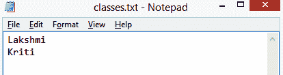
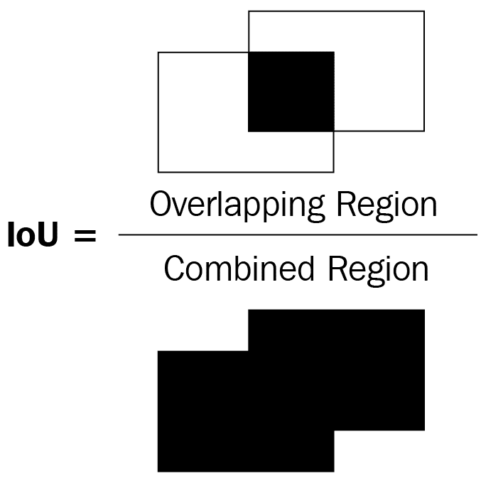
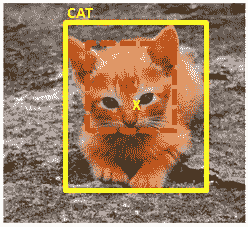
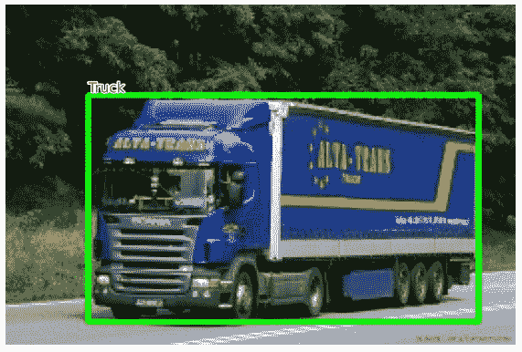
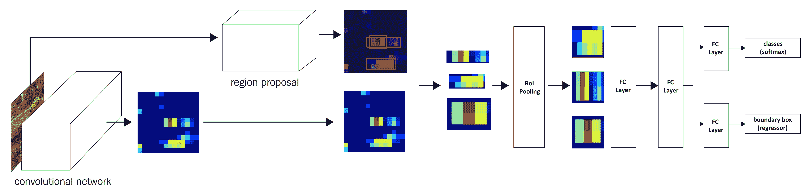
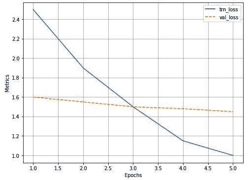
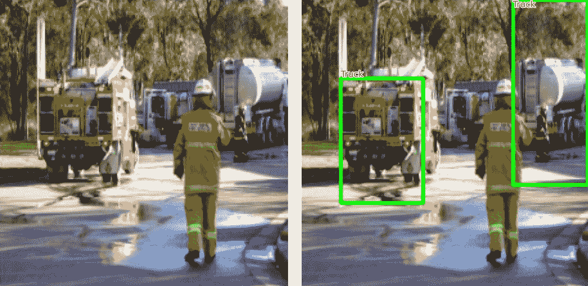

到目前为止，在前面的章节中，我们学习了执行图像分类。想象一个场景，我们正在利用计算机视觉来实现自动驾驶汽车。不仅需要检测道路的图像是否包含车辆、人行道和行人的图像，而且识别这些物体所在的位置也很重要。在这种情况下，我们将在本章和下一章学习的各种物体探测技术将会派上用场。

在这一章和下一章，我们将学习一些执行物体检测的技术。我们将从学习基础知识开始——使用名为`ybat`的工具标记边界框对象的基本事实，使用`selectivesearch`方法提取区域建议，并通过使用**联合交集** ( **IoU** )度量和平均精度度量来定义边界框预测的准确性。之后，我们将了解两个基于区域提议的网络——R-CNN 和 Fast R-CNN，首先了解它们的工作细节，然后在包含卡车和公共汽车图像的数据集上实现它们。

本章将涵盖以下主题:

*   目标检测简介
*   为训练创建边界框地面真实
*   了解区域提案
*   了解 IoU、非最大抑制和平均精度
*   训练基于 R-CNN 的自定义对象检测器
*   训练快速的基于 R-CNN 的自定义对象检测器

# 目标检测简介

随着自动驾驶汽车、面部检测、智能视频监控和人数统计解决方案的兴起，快速准确的物体检测系统需求很大。这些系统不仅包括来自图像的对象分类，还包括通过在每个对象周围绘制适当的边界框来定位每个对象。这(绘制边界框和分类)使得对象检测比其传统的计算机视觉前身图像分类更难。

为了了解对象检测的输出是什么样的，我们来看一下下图:


在上图中，我们可以看到，虽然典型的对象分类仅提及图像中存在的对象类别，但对象定位会在图像中存在的对象周围绘制一个边界框。另一方面，对象检测将涉及在图像中的单个对象周围绘制边界框，以及在跨越图像中存在的多个对象的边界框内识别对象的类别。

在我们了解对象检测的广泛使用案例之前，让我们了解它是如何添加到我们在上一章中介绍的对象分类任务中的。

想象一个场景，在一个图像中有多个对象。我要求你预测图像中出现的物体类别。举个例子，假设图像中同时包含了猫和狗。你如何对这些图片进行分类？在这种情况下，对象检测非常方便，它不仅可以预测其中存在的对象(边界框)的位置，还可以预测各个边界框中存在的对象的类别。

利用对象检测的各种使用案例包括:

*   安全:这有助于识别入侵者。
*   **自主** **汽车**:这有助于识别道路图像上出现的各种物体。
*   **图像搜索:**这有助于识别包含感兴趣的物体(或人)的图像。
*   **汽车**:这有助于识别汽车图像中的车牌。

在上述所有情况下，利用对象检测来围绕图像中存在的各种对象绘制边界框。

在这一章中，我们将学习预测物体的类别，并在图像中的物体周围有一个紧密的边界框，这是定位任务。我们还将学习检测图片中多个对象对应的类，以及每个对象周围的边界框，这是对象检测任务。

训练典型的对象检测模型包括以下步骤:

1.  创建包含与图像中存在的各种对象相对应的边界框和类的标签的基础事实数据。
2.  提出扫描图像以识别可能包含对象的区域(区域提议)的机制。在本章中，我们将了解如何利用名为*选择性搜索*的方法生成的区域建议。在下一章，我们将学习如何利用定位框来识别包含对象的区域。在结合计算机视觉和自然语言处理技术的一章中(第 15 章)，我们将学习如何利用转换器中的位置嵌入来帮助识别包含物体的区域。
3.  使用 IoU 度量创建目标类变量。
4.  创建目标边界框偏移变量，以对第二步中出现的区域提议的位置进行校正。
5.  建立模型，该模型可以预测对象的类别以及对应于区域提议的目标包围盒偏移。
6.  使用**平均精度** ( **图**)测量物体检测的精度。

现在，我们对训练对象检测模型要做的事情有了一个高层次的概述，我们将在下一节中学习如何为边界框创建数据集(这是构建对象检测模型的第一步)。

# 为训练创建边界框地面真实

我们已经知道，对象检测给出的输出是图像中感兴趣的对象周围的边界框。为了构建检测图像中对象周围的边界框的算法，我们必须创建输入-输出组合，其中输入是图像，输出是给定图像中对象周围的边界框，以及对应于对象的类。

注意，当我们检测边界框时，我们检测的是包围图像的边界框的四个角的像素位置。

为了训练提供边界框的模型，我们需要图像，以及图像中所有对象的相应边界框坐标。在本节中，我们将了解一种创建训练数据集的方法，其中图像是输入，相应的边界框和对象类存储在 XML 文件中作为输出。我们将使用`ybat`工具来注释边界框和相应的类。

让我们了解一下如何安装和使用`ybat`来创建(注释)图像中物体周围的边界框。此外，我们还将在下一节中检查包含带注释的类和边界框信息的 XML 文件。

## 安装图像注释工具

让我们从下面的 GitHub 链接开始下载`ybat-master.zip`，[https://github.com/drainingsun/ybat](https://github.com/drainingsun/ybat)，然后解压。解压后，存储在你选择的文件夹中。使用您选择的浏览器打开`ybat.html`，您将看到一个空白页面。下面的截图展示了文件夹的样子以及如何打开`ybat.html`文件:


在我们开始创建对应于一个图像的地面实况之前，让我们指定我们想要跨图像标记并存储在`classes.txt`文件中的所有可能的类，如下所示:



现在，让我们准备一个图像对应的地面真相。这包括在对象(下图中的人)周围绘制一个边界框，并在以下步骤中为图像中出现的对象分配标签/类别:

1.  上传所有要添加注释的图像(下图中的步骤 1)。
2.  上传`classes.txt`文件(下图中的步骤 2)。
3.  为每个图像添加标签，首先选择文件名，然后在每个要添加标签的对象周围画一个十字准线(下图中的步骤 3)。在绘制十字准线之前，请确保在“类别”区域(下图中第二个椭圆形下方的“类别”窗格)中选择了正确的类别。
4.  以所需格式保存数据转储(下图中的步骤 4)。每种格式都是由不同的研究团队独立开发的，所有格式都同样有效。基于它们的受欢迎程度和便利性，每个实现都喜欢不同的格式。

使用下图可以更好地表示所有这些步骤:


例如，当我们下载 PascalVOC 格式时，它会下载一个 XML 文件的 zip 文件。绘制矩形边界框后，XML 文件的快照如下:


从前面的截图中，注意到`bndbox`字段包含与图像中感兴趣的对象相对应的 *x* 和 *y* 坐标的最小值和最大值的坐标。我们还应该能够使用`name`字段提取对应于图像中对象的类。

既然我们已经了解了如何创建图像中存在的对象(类标签和边界框)的基本事实，在下面的部分中，我们将深入到识别图像中的对象的构建块中。首先，我们将讨论有助于突出显示图像中最有可能包含对象的部分的区域提议。

# 了解区域提案

想象一个假设场景，其中感兴趣的图像在背景中包含一个人和天空。此外，对于这种情况，让我们假设背景(天空)的像素强度几乎没有变化，而前景(人)的像素强度有相当大的变化。

仅仅从前面的描述本身，我们可以得出结论，这里有两个主要区域——一个是人的，另一个是天空的。此外，在人的图像的区域内，对应于头发的像素将具有与对应于脸的像素不同的强度，从而确定在一个区域内可以有多个子区域。

**区域提议**是一种帮助识别像素彼此相似的区域岛的技术。

生成区域建议对于我们必须识别图像中存在的对象的位置的对象检测来说很方便。此外，给定一个区域提议生成该区域的提议，这有助于对象定位，其中任务是识别正好适合图像中对象周围的边界框。我们将在后面的*培训基于 R-CNN 的自定义对象检测器*中了解区域提议如何帮助对象定位和检测，但让我们首先了解如何从图像中生成区域提议。

## 利用选择性研究生成区域建议书

SelectiveSearch 是一种用于对象定位的区域建议算法，它根据像素强度生成可能组合在一起的区域建议。SelectiveSearch 根据相似像素的层次分组对像素进行分组，这反过来又利用了图像中内容的颜色、纹理、大小和形状兼容性。

最初，SelectiveSearch 通过基于前面的属性对像素进行分组来过度分割图像。接下来，它遍历这些过度分割的组，并根据相似性对它们进行分组。在每次迭代中，它将较小的区域组合成一个较大的区域。

我们通过下面的例子来了解一下`selectivesearch`的流程:

以下代码在本书的 GitHub 知识库的`Chapter07`文件夹中以`Understanding_selectivesearch.ipynb`的形式提供-【https://tinyurl.com/mcvp-packt】请务必从 GitHub 中的笔记本上复制 URL，以避免在复制结果时出现任何问题

1.  安装所需的软件包:

```py
!pip install selectivesearch
!pip install torch_snippets
from torch_snippets import *
import selectivesearch
from skimage.segmentation import felzenszwalb
```

2.  获取并加载所需的图像:

```py
!wget https://www.dropbox.com/s/l98leemr7r5stnm/Hemanvi.jpeg
img = read('Hemanvi.jpeg', 1)
```

3.  从图像中提取`felzenszwalb`片段(根据图像中内容的颜色、纹理、大小和形状兼容性获得):

```py
segments_fz = felzenszwalb(img, scale=200)
```

注意，在`felzenszwalb`方法中，`scale`表示可以在图像的片段内形成的簇的数量。`scale`的值越高，保留的原始图像细节越多。

4.  绘制原始图像和分段图像:

```py
subplots([img, segments_fz], \
         titles=['Original Image',\
                 'Image post\nfelzenszwalb segmentation'],\
         sz=10, nc=2)
```

上述代码会产生以下输出:


从前面的输出可以看出，属于同一组的像素具有相似的像素值。

具有相似值的像素形成一个区域提议。这现在有助于对象检测，因为我们现在将每个区域提议传递给网络，并要求它预测该区域提议是背景还是对象。此外，如果它是一个对象，这将有助于我们确定获取与该对象相对应的紧边界框以及与区域建议内的内容相对应的类的偏移量。

现在我们已经了解了 SelectiveSearch 的工作，让我们实现`selectivesearch`函数来获取给定图像的区域建议。

## 实现选择性研究以生成区域建议

在本节中，我们将使用`selectivesearch`定义`extract_candidates`函数，以便在后续关于训练基于 R-CNN 和快速 R-CNN 的自定义对象检测器的部分中利用它:

1.  定义从图像中提取区域建议的`extract_candidates`函数:

*   定义将图像作为输入参数的函数:

```py
def extract_candidates(img):
```

*   使用`selectivesearch`包中可用的`selective_search`方法提取图像中的候选区域:

```py
    img_lbl, regions = selectivesearch.selective_search(img, \
                                     scale=200, min_size=100)
```

*   计算图像面积并初始化一个列表(候选项),我们将使用该列表存储通过定义阈值的候选项:

```py
    img_area = np.prod(img.shape[:2])
    candidates = []
```

*   仅提取那些超过总图像面积 5%且小于或等于图像面积 100%的候选(区域)并返回它们:

```py
    for r in regions:
        if r['rect'] in candidates: continue
        if r['size'] < (0.05*img_area): continue
        if r['size'] > (1*img_area): continue
        x, y, w, h = r['rect']
        candidates.append(list(r['rect']))
    return candidates
```

2.  导入相关包并获取图像:

```py
!pip install selectivesearch
!pip install torch_snippets
from torch_snippets import *
import selectivesearch
!wget https://www.dropbox.com/s/l98leemr7r5stnm/Hemanvi.jpeg
img = read('Hemanvi.jpeg', 1)
```

3.  提取候选对象并将其绘制在图像上:

```py
candidates = extract_candidates(img)
show(img, bbs=candidates)
```

上述代码生成以下输出:


上图中的网格代表来自`selective_search`方法的候选区域(区域建议)。

现在我们已经了解了区域建议书的生成，还有一个问题没有回答。我们如何利用区域提议进行目标检测和定位？

与感兴趣的图像中的对象的位置(地面实况)具有高交集的区域提议被标记为包含该对象的区域提议，而具有低交集的区域提议被标记为背景。

在下一节中，我们将在理解构成构建对象检测模型的主干的各种技术的过程中，了解如何计算候选区域提议与基本事实边界框的交集。

# 理解欠条

想象一个场景，我们想出了一个物体的边界框的预测。我们如何衡量我们预测的准确性？在这种情况下，**交于** ( **借据**)的概念就派上了用场。

*交集*在术语*交集在并集*内测量预测和实际边界框的重叠程度，而*并集*测量可能重叠的整体空间。IoU 是两个边界框之间的重叠区域与两个边界框的组合区域的比率。

这可以用下图表示:



在前面的两个边界框(矩形)的图中，让我们将左边的边界框视为地面真实，将右边的边界框视为对象的预测位置。作为度量的 IoU 是两个边界框之间的重叠区域与组合区域的比率。

在下图中，您可以观察到 IoU 度量随着边界框之间重叠的变化而变化:


从上图中我们可以看出，随着重叠减少，IoU 也会减少，在最后一张图中，当没有重叠时，IoU 度量为 0。

既然我们有了测量 IoU 的直觉，让我们用代码实现它，并创建一个函数来计算 IoU，因为我们将在“训练 R-CNN”和“训练快速 R-CNN”部分利用它。

下面的代码可以在本书的 GitHub 库【https://tinyurl.com/mcvp-packt[的`Chapter07`文件夹中找到`Calculating_Intersection_Over_Union.ipynb`](https://tinyurl.com/mcvp-packt)

让我们定义一个函数，它将两个边界框作为输入，并将 IoU 作为输出返回:

1.  指定将`boxA`和`boxB`作为输入的`get_iou`函数，其中`boxA`和`boxB`是两个不同的包围盒(可以将`boxA`视为地面真实包围盒，`boxB`视为区域提议):

```py
def get_iou(boxA, boxB, epsilon=1e-5):
```

我们定义了`epsilon`参数来处理两个盒子之间的并集为 0 的罕见情况，这导致了被零除的错误。注意，在每个边界框中，将有四个值对应于边界框的四个角。

2.  计算相交框的坐标:

```py
    x1 = max(boxA[0], boxB[0])
    y1 = max(boxA[1], boxB[1])
    x2 = min(boxA[2], boxB[2])
    y2 = min(boxA[3], boxB[3])
```

注意，`x1`正在存储两个边界框之间最左边的 *x* 值的最大值。类似地，`y1`存储最上面的 *y* 值，`x2`和`y2`分别存储最右边的 *x* 值和最下面的 *y* 值，对应于相交部分。

3.  计算相交区域(重叠区域)对应的`width`和`height`:

```py
    width = (x2 - x1)

    height = (y2 - y1)
```

4.  计算重叠面积(`area_overlap`):

```py
    if (width<0) or (height <0):
        return 0.0
    area_overlap = width * height
```

请注意，在前面的代码中，我们指定如果对应于重叠区域的宽度或高度小于 0，则相交面积为 0。否则，我们计算重叠(相交)的面积，类似于矩形面积的计算方式——宽度乘以高度。

5.  计算对应于两个边界框的组合面积:

```py
    area_a = (boxA[2] - boxA[0]) * (boxA[3] - boxA[1])
    area_b = (boxB[2] - boxB[0]) * (boxB[3] - boxB[1])
    area_combined = area_a + area_b - area_overlap
```

在前面的代码中，我们已经计算了两个边界框的组合面积—`area_a`和`area_b`，然后在计算`area_combined`时减去重叠面积，因为`area_overlap`被计算了两次，一次是在计算`area_a`时，另一次是在计算`area_b`时。

6.  计算欠条并归还:

```py
    iou = area_overlap / (area_combined+epsilon)
    return iou
```

在前面的代码中，我们将`iou`计算为重叠区域(`area_overlap`)与组合区域(`area_combined`)的面积之比，并将其返回。

到目前为止，我们已经学习了创建地面实况和计算 IoU，这有助于准备训练数据。接下来，对象检测模型将在检测图像中的对象时派上用场。最后，我们将计算模型性能并在新图像上进行推断。

我们将推迟构建模型，直到接下来的部分，因为训练模型更复杂，我们还必须在训练它之前学习更多的组件。在下一节中，我们将了解非最大值抑制，这有助于在新图像上使用训练模型进行推断时，从对象周围不同的可能预测边界框中进行筛选。

# 非最大抑制

设想一个场景，其中生成了多个区域提议，并且这些提议彼此明显重叠。本质上，所有预测的边界框坐标(对区域提议的偏移)彼此明显重叠。例如，让我们考虑下面的图像，其中为图像中的人生成了多个区域建议:


在上图中，我要求您在众多区域建议中找出我们认为包含对象的框，以及我们将丢弃的框。在这种情况下，非最大抑制很方便。让我们解开术语“非最大抑制”

**非最大值**是指不包含最大概率包含物体的盒子，**抑制**是指我们丢弃那些不包含最大概率包含物体的盒子。在非最大值抑制中，我们识别具有最高概率的边界框，并且丢弃 IoU 大于某个阈值的所有其他边界框，其中该框包含包含对象的最高概率。

在 PyTorch 中，使用`torchvision.ops`模块中的`nms`功能执行非最大抑制。`nms`函数采用边界框坐标、边界框中对象的置信度以及边界框间 IoU 的阈值来识别要保留的边界框。在分别位于*步骤 19* 和*步骤 16* 的*训练基于 R-CNN 的定制对象检测器*和*训练快速基于 R-CNN 的定制对象检测器*部分中，当预测新图像中的对象类别和对象边界框时，您将利用`nms`功能。

# 平均精度

到目前为止，我们已经了解了如何获得包含图像中每个对象周围的边界框和对应于边界框中对象的类的输出。现在下一个问题来了:我们如何量化来自我们模型的预测的准确性？

在这种情况下，地图可以提供帮助。在我们尝试理解 mAP 之前，让我们先理解精度，然后是平均精度，最后是 mAP:

*   **精度**:通常，我们计算精度为:


真阳性指的是预测正确的对象类别并且具有大于某个阈值的地面真值的 IoU 的边界框。假阳性是指边界框错误地预测了类，或者与地面真实值的重叠小于定义的阈值。此外，如果有多个边界框被识别为同一个基本事实边界框，则只有一个边界框会变成真阳性，而其他所有边界框都会变成假阳性。

*   **平均精度:**平均精度是在各种 IoU 阈值下计算的精度值的平均值。
*   **mAP:** mAP 是在数据集中所有对象类别的各种 IoU 阈值下计算的精度值的平均值。

到目前为止，我们已经了解了如何为模型准备训练数据集，对模型的预测执行非最大值抑制，以及计算其准确性。在下面的部分中，我们将学习训练模型(基于 R-CNN 和基于快速 R-CNN)来检测新图像中的对象。

# 训练基于 R-CNN 的自定义对象检测器

R-CNN 代表**基于区域的卷积神经网络**。**R-CNN 内部的**代表地区提案。区域提议用于识别图像内的对象。注意，R-CNN 有助于识别图像中存在的对象和图像中对象的位置。

在接下来的部分中，我们将学习 R-CNN 的工作细节，然后在我们的自定义数据集上训练它。

## R-CNN 的工作细节

让我们使用下图在高层次上了解一下基于 R-CNN 的对象检测:


图片来源:https://arxiv.org/pdf/1311.2524.pdf

当利用 R-CNN 技术进行对象检测时，我们执行以下步骤:

1.  从图像中提取区域建议:

*   确保我们提取大量的建议，不遗漏图像中的任何潜在对象。

2.  调整(扭曲)所有提取的区域，以获得相同大小的图像。
3.  通过网络传递调整大小的区域提议:

*   通常，我们通过预先训练的模型(如 VGG16 或 ResNet50)传递调整大小的区域建议，并在完全连接的层中提取特征。

4.  创建用于模型训练的数据，其中输入是通过将区域提议传递通过预训练的模型而提取的特征，输出是对应于每个区域提议的类以及区域提议与对应于图像的地面真实的偏移:

*   如果区域提议具有大于某个阈值的与对象的 IoU，我们以这样的方式准备训练数据，即该区域负责预测与其重叠的对象的类别，以及区域提议与包含感兴趣对象的地面真实边界框的偏移。

为区域方案创建边界框偏移和基础真值类的示例如下:



在上图中，o(红色)表示区域建议的中心(虚线边界框)，x 表示与 cat 类对应的地面真实边界框(实线边界框)的中心。我们将区域提议边界框和地面真实边界框之间的偏移计算为两个边界框的中心坐标之间的差(dx，dy)和边界框的高度和宽度之间的差(dw，dh)。

5.  将两个输出头，一个对应于图像的类别，另一个对应于区域提议的偏移，与地面真实边界框连接，以提取物体上的精细边界框:

*   这个练习将类似于我们根据上一章中人的面部图像预测性别(分类变量，类似于本案例研究中的对象类别)和年龄(连续变量，类似于要在区域建议之上完成的偏移)的用例。

6.  训练模型柱，编写自定义损失函数，使对象分类误差和边界框偏移误差最小化。

请注意，我们将最小化的损失函数不同于原始论文中优化的损失函数。我们这样做是为了降低从头构建 R-CNN 和快速 R-CNN 的复杂性。一旦读者熟悉了模型是如何工作的，并且能够使用下面的代码构建一个模型，我们强烈鼓励他们从头开始实现原始的论文。

在下一节中，我们将学习获取数据集和创建用于训练的数据。在接下来的部分中，我们将学习在预测新图像中存在的对象类别及其边界框之前设计和训练模型。

## 在自定义数据集上实现用于对象检测的 R-CNN

到目前为止，我们对 R-CNN 的工作原理有了理论上的了解。在本节中，我们将了解如何为培训创建数据。该过程包括以下步骤:

1.  下载数据集
2.  准备数据集
3.  定义区域建议提取和 IoU 计算功能

4.  创建培训数据

*   为模型创建输入数据
*   调整区域大小的建议
*   将它们通过预训练的模型以获取完全连接的层值
*   为模型创建输出数据
*   用类别或背景标签标记每个区域提议
*   如果所述区域提议对应于对象而不是背景，则定义所述区域提议相对于地面实况的偏移

5.  定义和训练模型
6.  对新图像进行预测

让我们从下面几节开始编码。

### **下载数据集**

对于对象检测的场景，我们将从 Google Open Images v6 数据集下载数据(可从[https://storage . Google APIs . com/Open img/V5/test-annotations-bbox . CSV](https://storage.googleapis.com/openimg/v5/test-annotations-bbox.csv)获得)。然而，在代码中，我们将只处理那些公共汽车或卡车的图像，以确保我们可以训练图像(您将很快注意到与使用`selectivesearch`相关的内存问题)。我们将扩大我们将在第 10 章[、*目标检测和分割应用*中培训的类别数量(除了公共汽车和卡车之外的更多类别)。](9b3e4a1d-dfbb-4580-920c-5ff1238021b2.xhtml)

以下代码在本书的 GitHub 知识库的`Chapter07`文件夹中以`Training_RCNN.ipynb`的形式提供-【https://tinyurl.com/mcvp-packt 代码包含下载数据的 URL，长度适中。我们强烈建议您在 GitHub 中执行笔记本以再现结果，同时您理解执行的步骤和对文本中各种代码组件的解释。

1.  导入相关包以下载包含图像及其基本事实的文件:

```py
!pip install -q --upgrade selectivesearch torch_snippets
from torch_snippets import *
import selectivesearch
from google.colab import files
files.upload() # upload kaggle.json file 
!mkdir -p ~/.kaggle
!mv kaggle.json ~/.kaggle/
!ls ~/.kaggle
!chmod 600 /root/.kaggle/kaggle.json
!kaggle datasets download -d sixhky/open-images-bus-trucks/
!unzip -qq open-images-bus-trucks.zip
from torchvision import transforms, models, datasets
from torch_snippets import Report
from torchvision.ops import nms
device = 'cuda' if torch.cuda.is_available() else 'cpu'
```

一旦我们执行了前面的代码，我们就会将图像及其相应的基本事实存储在一个可用的 CSV 文件中。

### **准备数据集**

现在我们已经下载了数据集，我们将准备数据集。这包括以下步骤:

1.  获取每个图像及其对应的类和边界框值
2.  获取每个图像内的区域提议、它们对应的 IoU 以及区域提议相对于地面实况要被校正的增量
3.  为每个类别分配数字标签(其中我们有一个额外的背景类别(除了公共汽车和卡车类别之外),其中带有真实边界框的 IoU 低于阈值)
4.  将每个区域提议调整到共同的大小，以便将它们传递到网络

在本练习结束时，我们将调整区域方案的裁剪大小，为每个区域方案分配地面实况类，并计算区域方案相对于地面实况边界框的偏移。我们将从上一节停止的地方继续编码:

1.  指定图像的位置，并阅读我们下载的 CSV 文件中的基本事实:

```py
IMAGE_ROOT = 'img/images'
DF_RAW = pd.read_csv('df.csv')
print(DF_RAW.head())
```

前面数据帧的示例如下:


注意，`XMin`、`XMax`、`YMin`和`YMax`对应于图像的边界框的地面真实度。再者，`LabelName`提供了形象的类。

2.  定义一个类，该类返回图像及其对应的类和基本事实以及图像的文件路径:

*   将数据框(`df`)和包含图像的文件夹路径(`image_folder`)作为输入传递给`__init__`方法，并获取数据框(`self.unique_images`)中的唯一值`ImageID`。我们这样做是因为一幅图像可以包含多个对象，因此多行可以对应同一个`ImageID`值:

```py
class OpenImages(Dataset):
    def __init__(self, df, image_folder=IMAGE_ROOT):
        self.root = image_folder
        self.df = df
        self.unique_images = df['ImageID'].unique()
    def __len__(self): return len(self.unique_images)
```

*   定义`__getitem__`方法，其中我们获取对应于索引(`ix`)的图像(`image_id`)，获取其边界框坐标(`boxes`)、`classes`，并返回图像、边界框、类和图像路径:

```py
    def __getitem__(self, ix):
        image_id = self.unique_images[ix]
        image_path = f'{self.root}/{image_id}.jpg'
        # Convert BGR to RGB
        image = cv2.imread(image_path, 1)[...,::-1] 
        h, w, _ = image.shape
        df = self.df.copy()
        df = df[df['ImageID'] == image_id]
        boxes = df['XMin,YMin,XMax,YMax'.split(',')].values
        boxes = (boxes*np.array([w,h,w,h])).astype(np.uint16)\
                                           .tolist()
        classes = df['LabelName'].values.tolist()
        return image, boxes, classes, image_path
```

3.  检查样本图像及其相应的类和边界框基础事实:

```py
ds = OpenImages(df=DF_RAW)
im, bbs, clss, _ = ds[9]
show(im, bbs=bbs, texts=clss, sz=10)
```

上述代码会产生以下结果:



4.  定义`extract_iou`和`extract_candidates`功能:

```py
def extract_candidates(img):
    img_lbl,regions = selectivesearch.selective_search(img, \
                                    scale=200, min_size=100)
    img_area = np.prod(img.shape[:2])
    candidates = []
    for r in regions:
        if r['rect'] in candidates: continue
        if r['size'] < (0.05*img_area): continue
        if r['size'] > (1*img_area): continue
        x, y, w, h = r['rect']
        candidates.append(list(r['rect']))
    return candidates
def extract_iou(boxA, boxB, epsilon=1e-5):
    x1 = max(boxA[0], boxB[0])
    y1 = max(boxA[1], boxB[1])
    x2 = min(boxA[2], boxB[2])
    y2 = min(boxA[3], boxB[3])
    width = (x2 - x1)
    height = (y2 - y1)
    if (width<0) or (height <0):
        return 0.0
    area_overlap = width * height
    area_a = (boxA[2] - boxA[0]) * (boxA[3] - boxA[1])
    area_b = (boxB[2] - boxB[0]) * (boxB[3] - boxB[1])
    area_combined = area_a + area_b - area_overlap
    iou = area_overlap / (area_combined+epsilon)
    return iou
```

到目前为止，我们已经定义了准备数据和初始化数据加载器所需的所有函数。在下一节中，我们将获取区域建议(模型的输入区域)和边界框偏移的基本事实以及对象的类别(预期输出)。

### 提取区域建议和偏移的基本原理

在本节中，我们将学习如何创建与我们的模型相对应的输入和输出值。输入构成使用`selectivesearch`方法提取的候选项，输出构成对应于候选项的类别和候选项相对于边界框的偏移，如果候选项包含对象，则该偏移与边界框重叠最多。我们将从上一节结束的地方继续编码:

1.  初始化空列表以存储文件路径(`FPATHS`)、基础事实边界框(`GTBBS`)、对象的类别(`CLSS`)、具有区域提议的边界框的增量偏移(`DELTAS`)、区域提议位置(`ROIS`)以及具有基础事实的区域提议的 IoU(`IOUS`):

```py
FPATHS, GTBBS, CLSS, DELTAS, ROIS, IOUS = [],[],[],[],[],[]
```

2.  遍历数据集并填充上面初始化的列表:

*   在这个练习中，我们可以使用所有的数据点进行训练，或者只使用前 500 个数据点进行说明。您可以在这两者之间进行选择，这决定了训练时间和训练精度(数据点越多，训练时间和精度就越大):

```py
N = 500
for ix, (im, bbs, labels, fpath) in enumerate(ds):
    if(ix==N):
        break
```

在前面的代码中，我们指定我们将处理 500 个图像。

*   使用`extract_candidates`功能从每幅图像(`im`)中提取绝对像素值的候选对象(注意`XMin`、`Xmax`、`YMin`和`YMax`可作为下载数据帧中图像形状的比例)，并将提取的区域坐标从(x，y，w，h)系统转换为(x，y，x+w，y+h)系统:

```py
    H, W, _ = im.shape
    candidates = extract_candidates(im)
    candidates = np.array([(x,y,x+w,y+h) \
                           for x,y,w,h in candidates])
```

*   将`ious`、`rois`、`deltas`和`clss`初始化为存储每个候选的`iou`、区域提议位置、边界框偏移和对应于每个图像的每个候选的类的列表。我们将仔细检查 SelectiveSearch 中的所有提案，并将 IOU 高的提案存储为公共汽车/卡车提案(以标签中的类别为准),其余的作为背景提案:

```py
    ious, rois, clss, deltas = [], [], [], []
```

*   存储关于图像的所有基本事实的所有候选的 IoU，其中`bbs`是图像中存在的不同对象的基本事实边界框，并且`candidates`是在先前步骤中获得的区域提议候选:

```py
    ious = np.array([[extract_iou(candidate, _bb_) for \
                candidate in candidates] for _bb_ in bbs]).T
```

*   遍历每个候选项，并存储候选项的 XMin ( `cx`)、YMin ( `cy`)、XMax ( `cX`)和 YMax ( `cY`)值:

```py
    for jx, candidate in enumerate(candidates):
        cx,cy,cX,cY = candidate
```

*   提取在获取`ious`的列表列表时已经计算出的所有基本事实包围盒的候选对应的 IoU

```py
        candidate_ious = ious[jx]
```

*   找到具有最高 IoU 的候选(`best_iou_at`)的索引和相应的基础事实(`best_bb`):

```py
        best_iou_at = np.argmax(candidate_ious)
        best_iou = candidate_ious[best_iou_at]
        best_bb = _x,_y,_X,_Y = bbs[best_iou_at]
```

*   如果 IoU ( `best_iou`)大于阈值(0.3)，我们分配对应于候选的类的标签，否则分配背景:

```py
        if best_iou > 0.3: clss.append(labels[best_iou_at])
        else : clss.append('background')
```

*   获取所需的偏移量(`delta`)以将当前提议转换为最佳区域提议的候选项(即基本事实边界框)–`best_bb`，换句话说，当前提议的左、右、上、下边界应调整多少，以使其与基本事实的`best_bb`完全对齐:

```py
        delta = np.array([_x-cx, _y-cy, _X-cX, _Y-cY]) /\
                    np.array([W,H,W,H])
        deltas.append(delta)
        rois.append(candidate / np.array([W,H,W,H]))
```

*   追加文件路径、IoU、roi、等级增量和基本事实边界框:

```py
    FPATHS.append(fpath)
    IOUS.append(ious)
    ROIS.append(rois)
    CLSS.append(clss)
    DELTAS.append(deltas)
    GTBBS.append(bbs)
```

*   获取图像路径名，并将获得的所有信息`FPATHS`、`IOUS`、`ROIS`、`CLSS`、`DELTAS`和`GTBBS`存储在列表列表中:

```py
FPATHS = [f'{IMAGE_ROOT}/{stem(f)}.jpg' for f in FPATHS] 
FPATHS, GTBBS, CLSS, DELTAS, ROIS = [item for item in \
                                     [FPATHS, GTBBS, \
                                      CLSS, DELTAS, ROIS]]
```

注意，到目前为止，类都可以作为类名使用。现在，我们将它们转换成相应的索引，这样，背景类的索引为 0，公共汽车类的索引为 1，卡车类的索引为 2。

3.  为每个类别分配索引:

```py
targets = pd.DataFrame(flatten(CLSS), columns=['label'])
label2target = {l:t for t,l in \
                enumerate(targets['label'].unique())}
target2label = {t:l for l,t in label2target.items()}
background_class = label2target['background']
```

到目前为止，我们已经为每个区域提议分配了一个类，并且还创建了边界框偏移的另一个基本事实。在下一节中，我们将获取与所获得的信息相对应的数据集和数据加载器(`FPATHS`、`IOUS`、`ROIS`、`CLSS`、`DELTAS`和`GTBBS`)。

### 创建培训数据

到目前为止，我们已经获取了数据、跨所有图像的区域提议、准备了每个区域提议中存在的对象类别的基本事实、以及对应于与对应图像中的对象具有高重叠(IoU)的每个区域提议的偏移。

在本节中，我们将根据在第*步第 8* 结束时获得的区域建议的基本事实准备一个数据集类，并从中创建数据加载器。接下来，我们将通过将每个区域调整到相同的形状并缩放来规范化它们。我们将从上一节停止的地方继续编码:

1.  定义归一化图像的函数:

```py
normalize= transforms.Normalize(mean=[0.485, 0.456, 0.406], \
                                 std=[0.229, 0.224, 0.225])
```

2.  定义一个函数(`preprocess_image`)来预处理图像(`img`)，其中我们切换通道、标准化图像并将其注册到设备:

```py
def preprocess_image(img):
    img = torch.tensor(img).permute(2,0,1)
    img = normalize(img)
    return img.to(device).float()
```

*   定义函数给类`decode`预测:

```py
def decode(_y):
    _, preds = _y.max(-1)
    return preds
```

3.  使用预处理的区域建议以及在先前步骤中获得的基础事实来定义数据集(*步骤 7* ):

```py
class RCNNDataset(Dataset):
    def __init__(self, fpaths, rois, labels, deltas, gtbbs):
        self.fpaths = fpaths
        self.gtbbs = gtbbs
        self.rois = rois
        self.labels = labels
        self.deltas = deltas
    def __len__(self): return len(self.fpaths)
```

*   根据区域建议获取作物，以及与类和边界框偏移相关的其他地面实况:

```py
    def __getitem__(self, ix):
        fpath = str(self.fpaths[ix])
        image = cv2.imread(fpath, 1)[...,::-1]
        H, W, _ = image.shape
        sh = np.array([W,H,W,H])
        gtbbs = self.gtbbs[ix]
        rois = self.rois[ix]
        bbs = (np.array(rois)*sh).astype(np.uint16)
        labels = self.labels[ix]
        deltas = self.deltas[ix]
        crops = [image[y:Y,x:X] for (x,y,X,Y) in bbs]
        return image,crops,bbs,labels,deltas,gtbbs,fpath
```

*   定义`collate_fn`，执行裁剪图像的尺寸调整和规格化(`preprocess_image`):

```py
    def collate_fn(self, batch):
        input, rois, rixs, labels, deltas =[],[],[],[],[]
        for ix in range(len(batch)):
            image, crops, image_bbs, image_labels, \
                image_deltas, image_gt_bbs, \
                image_fpath = batch[ix]
            crops = [cv2.resize(crop, (224,224)) \
                     for crop in crops]
            crops = [preprocess_image(crop/255.)[None] \
                     for crop in crops]
            input.extend(crops)
            labels.extend([label2target[c] \
                           for c in image_labels])
            deltas.extend(image_deltas)
        input = torch.cat(input).to(device)
        labels = torch.Tensor(labels).long().to(device)
        deltas = torch.Tensor(deltas).float().to(device)
        return input, labels, deltas
```

4.  创建训练和验证数据集以及数据加载器:

```py
n_train = 9*len(FPATHS)//10
train_ds = RCNNDataset(FPATHS[:n_train], ROIS[:n_train], \
                       CLSS[:n_train], DELTAS[:n_train], \
                       GTBBS[:n_train])
test_ds = RCNNDataset(FPATHS[n_train:], ROIS[n_train:], \
                      CLSS[n_train:], DELTAS[n_train:], \
                      GTBBS[n_train:])

from torch.utils.data import TensorDataset, DataLoader
train_loader = DataLoader(train_ds, batch_size=2, \
                          collate_fn=train_ds.collate_fn, \
                          drop_last=True)
test_loader = DataLoader(test_ds, batch_size=2, \
                         collate_fn=test_ds.collate_fn, \
                         drop_last=True)
```

到目前为止，我们已经学习了准备数据。接下来，我们将了解如何定义和训练模型，该模型预测要对区域提议进行的分类和偏移，以适合图像中对象周围的紧密边界框。

### R-CNN 网络架构

现在我们已经准备好了数据，在本节中，我们将学习如何构建一个模型，该模型可以预测区域建议的类别及其对应的偏移量，以便在图像中的对象周围绘制一个紧密的边界框。我们采取的策略如下:

1.  定义一个 VGG 主干。
2.  通过预训练模型传递归一化裁剪后获取要素。
3.  将具有 sigmoid 激活的线性层连接到 VGG 主干，以预测与区域提议相对应的类别。
4.  附加一个额外的线性图层来预测四个边界框偏移。

5.  为两个输出中的每一个定义损失计算(一个用于预测类，另一个用于预测四个边界框偏移)。
6.  训练预测区域建议类别和四个边界框偏移量的模型。

执行下面的代码。我们将从上一节结束的地方继续编码:

1.  定义 VGG 主干:

```py
vgg_backbone = models.vgg16(pretrained=True)
vgg_backbone.classifier = nn.Sequential()
for param in vgg_backbone.parameters():
    param.requires_grad = False
vgg_backbone.eval().to(device)
```

2.  定义`RCNN`网络模块:

*   定义类别:

```py
class RCNN(nn.Module):
    def __init__(self):
        super().__init__()
```

*   定义主干(`self.backbone`)以及我们如何计算类分数(`self.cls_score`)和边界框偏移值(`self.bbox`):

```py
        feature_dim = 25088
        self.backbone = vgg_backbone
        self.cls_score = nn.Linear(feature_dim, \
                                    len(label2target))
        self.bbox = nn.Sequential(
                          nn.Linear(feature_dim, 512),
                          nn.ReLU(),
                          nn.Linear(512, 4),
                          nn.Tanh(),
                        )
```

*   定义对应于类别预测(`self.cel`)和边界框偏移回归(`self.sl1`)的损失函数:

```py
        self.cel = nn.CrossEntropyLoss()
        self.sl1 = nn.L1Loss()
```

*   定义前馈方法，其中我们通过 VGG 主干(`self.backbone`)传递图像以获取特征(`feat`)，这些特征进一步通过对应于分类和边界框回归的方法以获取跨类的概率(`cls_score`)和边界框偏移(`bbox`):

```py
    def forward(self, input):
        feat = self.backbone(input)
        cls_score = self.cls_score(feat)
        bbox = self.bbox(feat)
        return cls_score, bbox
```

*   定义计算损失的函数(`calc_loss`)。注意，如果实际类别是背景，我们不计算对应于偏移的回归损失:

```py
    def calc_loss(self, probs, _deltas, labels, deltas):
        detection_loss = self.cel(probs, labels)
        ixs, = torch.where(labels != 0)
        _deltas = _deltas[ixs]
        deltas = deltas[ixs]
        self.lmb = 10.0
        if len(ixs) > 0:
            regression_loss = self.sl1(_deltas, deltas)
            return detection_loss + self.lmb *\
                regression_loss, detection_loss.detach(), \
                regression_loss.detach()
        else:
            regression_loss = 0
            return detection_loss + self.lmb *\
                regression_loss, detection_loss.detach(), \
                regression_loss
```

有了模型类，我们现在定义函数来训练一批数据并预测验证数据。

3.  定义`train_batch`功能:

```py
def train_batch(inputs, model, optimizer, criterion):
    input, clss, deltas = inputs
    model.train()
    optimizer.zero_grad()
    _clss, _deltas = model(input)
    loss, loc_loss, regr_loss = criterion(_clss, _deltas, \
                                            clss, deltas)
    accs = clss == decode(_clss)
    loss.backward()
    optimizer.step()
    return loss.detach(), loc_loss, regr_loss, \
        accs.cpu().numpy()
```

4.  定义`validate_batch`功能:

```py
@torch.no_grad()
def validate_batch(inputs, model, criterion):
    input, clss, deltas = inputs
    with torch.no_grad():
        model.eval()
        _clss,_deltas = model(input)
        loss,loc_loss,regr_loss = criterion(_clss, _deltas, \
                                               clss, deltas)
        _, _clss = _clss.max(-1)
        accs = clss == _clss
    return _clss,_deltas,loss.detach(),loc_loss, regr_loss, \
         accs.cpu().numpy()
```

5.  现在，让我们创建一个模型对象，获取损失标准，然后定义优化器和时期数:

```py
rcnn = RCNN().to(device)
criterion = rcnn.calc_loss
optimizer = optim.SGD(rcnn.parameters(), lr=1e-3)
n_epochs = 5
log = Report(n_epochs)
```

6.  我们现在在增加的时期上训练模型:

```py
for epoch in range(n_epochs):

    _n = len(train_loader)
    for ix, inputs in enumerate(train_loader):
        loss, loc_loss,regr_loss,accs = train_batch(inputs, \
                                  rcnn, optimizer, criterion)
        pos = (epoch + (ix+1)/_n)
        log.record(pos, trn_loss=loss.item(), \
                   trn_loc_loss=loc_loss, \
                   trn_regr_loss=regr_loss, \
                   trn_acc=accs.mean(), end='\r')

    _n = len(test_loader)
    for ix,inputs in enumerate(test_loader):
        _clss, _deltas, loss, \
        loc_loss, regr_loss, \
        accs = validate_batch(inputs, rcnn, criterion)
        pos = (epoch + (ix+1)/_n)
        log.record(pos, val_loss=loss.item(), \
                val_loc_loss=loc_loss, \
                val_regr_loss=regr_loss, \
                val_acc=accs.mean(), end='\r')

# Plotting training and validation metrics
log.plot_epochs('trn_loss,val_loss'.split(','))
```

跨训练和验证数据的总体损失图如下:


现在我们已经训练了一个模型，我们将在下一节中使用它来预测新图像。

### 预测新的图像

在本节中，我们将利用迄今为止训练的模型来预测和绘制新图像上的对象周围的边界框以及预测的边界框内的相应对象类别。我们采取的策略如下:

1.  从新图像中提取区域建议。
2.  调整大小和正常化每个作物。

3.  前馈已处理的作物以预测类别和偏移量。
4.  执行非最大抑制，仅提取那些包含对象的可信度最高的框。

我们通过一个将图像作为输入的函数和一个地面真实边界框(仅在我们比较地面真实和预测边界框时使用)来执行前面的策略。我们将从上一节停止的地方继续编码:

1.  定义`test_predictions`函数对新图像进行预测:

*   该函数将`filename`作为输入:

```py
def test_predictions(filename, show_output=True):
```

*   阅读图像并提取候选人:

```py
    img = np.array(cv2.imread(filename, 1)[...,::-1])
    candidates = extract_candidates(img)
    candidates = [(x,y,x+w,y+h) for x,y,w,h in candidates]
```

*   遍历候选图像以调整图像大小并对图像进行预处理:

```py
    input = []
    for candidate in candidates:
        x,y,X,Y = candidate
        crop = cv2.resize(img[y:Y,x:X], (224,224))
        input.append(preprocess_image(crop/255.)[None])
    input = torch.cat(input).to(device)
```

*   预测类别和偏移量:

```py
    with torch.no_grad():
        rcnn.eval()
        probs, deltas = rcnn(input)
        probs = torch.nn.functional.softmax(probs, -1)
        confs, clss = torch.max(probs, -1)
```

*   提取不属于背景类的候选项，并将候选项与预测的边界框偏移值相加:

```py
    candidates = np.array(candidates)
    confs,clss,probs,deltas =[tensor.detach().cpu().numpy() \
                                  for tensor in [confs, \
                                        clss, probs, deltas]]

    ixs = clss!=background_class
    confs, clss,probs,deltas,candidates = [tensor[ixs] for \
           tensor in [confs,clss, probs, deltas,candidates]]
    bbs = (candidates + deltas).astype(np.uint16)
```

*   使用非最大抑制`nms`消除近似重复的边界框(在这种情况下，IoU 大于 0.05 的框对被视为重复)。在重复的盒子中，我们挑选最有把握的那个盒子，并丢弃其余的:

```py
    ixs = nms(torch.tensor(bbs.astype(np.float32)), \
                torch.tensor(confs), 0.05)
    confs,clss,probs,deltas,candidates,bbs = [tensor[ixs] \
                                            for tensor in \
                            [confs, clss, probs, deltas, \
                            candidates, bbs]]
    if len(ixs) == 1:
        confs, clss, probs, deltas, candidates, bbs = \
                [tensor[None] for tensor in [confs, clss,
                            probs, deltas, candidates, bbs]]
```

*   获取具有最高可信度的边界框:

```py
    if len(confs) == 0 and not show_output:
        return (0,0,224,224), 'background', 0
    if len(confs) > 0:
        best_pred = np.argmax(confs)
        best_conf = np.max(confs)
        best_bb = bbs[best_pred]
        x,y,X,Y = best_bb
```

*   沿着预测的边界框绘制图像:

```py
    _, ax = plt.subplots(1, 2, figsize=(20,10))
    show(img, ax=ax[0])
    ax[0].grid(False)
    ax[0].set_title('Original image')
    if len(confs) == 0:
        ax[1].imshow(img)
        ax[1].set_title('No objects')
        plt.show()
        return
    ax[1].set_title(target2label[clss[best_pred]])
    show(img, bbs=bbs.tolist(), 
        texts=[target2label[c] for c in clss.tolist()], 
        ax=ax[1], title='predicted bounding box and class')
    plt.show()
    return (x,y,X,Y),target2label[clss[best_pred]],best_conf
```

2.  对新图像执行上述功能:

```py
image, crops, bbs, labels, deltas, gtbbs, fpath = test_ds[7]
test_predictions(fpath)
```

上述代码生成了以下图像:


从前面的图中，我们可以看到对图像类别的预测是准确的，并且包围盒预测也很不错。请注意，为前面的图像生成预测大约需要 1.5 秒。

所有这些时间都消耗在生成区域建议、调整每个区域建议的大小、通过 VGG 主干传递它们以及使用定义的模型生成预测上。然而，大部分时间都花在通过 VGG 骨干网传递每一个提案上。在下一节中，我们将学习如何通过使用基于快速 R-CNN 架构的模型来解决“将每个提议传递给 VGG”的问题。

# 训练快速的基于 R-CNN 的自定义对象检测器

R-CNN 的一个主要缺点是生成预测需要相当长的时间，因为为每个图像生成区域建议、调整区域裁剪的大小以及提取对应于每个裁剪的特征(区域建议)构成了瓶颈。

快速 R-CNN 通过将**整个图像**通过预训练的模型来提取特征，然后获取与原始图像的区域提议(从`selectivesearch`获得)相对应的特征区域，从而解决了这个问题。在接下来的部分中，我们将学习快速 R-CNN 的工作细节，然后在我们的自定义数据集上训练它。

## 快速 R-CNN 的工作细节

我们通过下图来了解一下 Fast R-CNN:



让我们通过以下步骤来理解上图:

1.  使图像通过预训练的模型，以在展平层之前提取特征；让我们称输出为特征地图。
2.  提取对应于该图像的区域提议。
3.  提取对应于区域提议的特征映射区域(注意，当图像通过 VGG16 架构时，由于执行了 5 次汇集操作，图像在输出端被缩小 32 倍。因此，如果在原始图像中存在具有(40，32，200，240)的边界框的区域，则对应于(5，4，25，30)的边界框的特征图将对应于完全相同的区域)。
4.  通过 RoI(感兴趣区域)汇集层一次传递一个对应于区域提议的特征图，使得区域提议的所有特征图具有相似的形状。这是对在 R-CNN 技术中执行的扭曲的替换。
5.  通过完全连接的层传递 RoI 池层输出值。
6.  训练模型以预测对应于每个区域建议的类别和偏移量。

请注意，R-CNN 和快速 R-CNN 之间的巨大差异在于，在 R-CNN 中，我们通过预训练模型一次一个地传递裁剪(调整大小的区域提议),而在快速 R-CNN 中，我们裁剪与每个区域提议相对应的特征图(通过将整个图像通过预训练模型获得),从而避免需要通过预训练模型传递每个调整大小的区域提议。

现在已经了解了 R-CNN 的工作速度，在下一节中，我们将使用在 R-CNN 一节中使用的相同数据集来构建模型。

## 在自定义数据集上实现用于对象检测的快速 R-CNN

在本节中，我们将使用快速 R-CNN 来训练我们的自定义对象检测器。此外，为了保持简洁，我们在本节中仅提供了额外的或更改的代码(您应该运行所有代码，直到 R-CNN 的前一节中的*创建训练数据*小节中的*步骤 2* ):

为了保持简洁，我们只提供了训练快速 R-CNN 的附加代码。完整的代码可以在本书的 GitHub 库的`Chapter07`文件夹中的`*Training_Fast_R_CNN.ipynb*`中找到。

1.  创建一个`FRCNNDataset`类，该类返回图像、标签、基本事实、区域建议以及对应于每个区域建议的增量:

```py
class FRCNNDataset(Dataset):
    def __init__(self, fpaths, rois, labels, deltas, gtbbs):
        self.fpaths = fpaths
        self.gtbbs = gtbbs
        self.rois = rois
        self.labels = labels
        self.deltas = deltas
    def __len__(self): return len(self.fpaths)
    def __getitem__(self, ix):
        fpath = str(self.fpaths[ix])
        image = cv2.imread(fpath, 1)[...,::-1]
        gtbbs = self.gtbbs[ix]
        rois = self.rois[ix]
        labels = self.labels[ix]
        deltas = self.deltas[ix]
        assert len(rois) == len(labels) == len(deltas), \
            f'{len(rois)}, {len(labels)}, {len(deltas)}'
        return image, rois, labels, deltas, gtbbs, fpath

    def collate_fn(self, batch):
        input, rois, rixs, labels, deltas = [],[],[],[],[]
        for ix in range(len(batch)):
            image, image_rois, image_labels, image_deltas, \
                image_gt_bbs, image_fpath = batch[ix]
            image = cv2.resize(image, (224,224))
            input.append(preprocess_image(img/255.)[None])
            rois.extend(image_rois)
            rixs.extend([ix]*len(image_rois))
            labels.extend([label2target[c] for c in \
                                image_labels])
            deltas.extend(image_deltas)
        input = torch.cat(input).to(device)
        rois = torch.Tensor(rois).float().to(device)
        rixs = torch.Tensor(rixs).float().to(device)
        labels = torch.Tensor(labels).long().to(device)
        deltas = torch.Tensor(deltas).float().to(device)
        return input, rois, rixs, labels, deltas
```

请注意，前面的代码非常类似于我们在 *R-CNN* 部分学到的内容，唯一的变化是我们返回了更多的信息(`rois`和`rixs`)。

`rois`矩阵保存了关于哪个 RoI 属于批次中哪个图像的信息。注意，`input`包含多个图像，而`rois`是一个单一的盒子列表。我们不知道有多少 ROI 属于第一幅图像，有多少属于第二幅图像，等等。这就是`ridx`出现的原因。这是一个索引列表。列表中的每个整数将相应的边界框与适当的图像相关联；例如，如果`ridx`是`[0,0,0,1,1,2,3,3,3]`，那么我们知道前三个边界框属于该批中的第一个图像，接下来的两个属于该批中的第二个图像。

2.  创建训练和测试数据集:

```py
n_train = 9*len(FPATHS)//10
train_ds = FRCNNDataset(FPATHS[:n_train], ROIS[:n_train], \
                        CLSS[:n_train], DELTAS[:n_train], \
                        GTBBS[:n_train])
test_ds = FRCNNDataset(FPATHS[n_train:], ROIS[n_train:], \
                       CLSS[n_train:], DELTAS[n_train:], \
                       GTBBS[n_train:])

from torch.utils.data import TensorDataset, DataLoader
train_loader = DataLoader(train_ds, batch_size=2, \
                          collate_fn=train_ds.collate_fn, \
                          drop_last=True)
test_loader = DataLoader(test_ds, batch_size=2, \
                         collate_fn=test_ds.collate_fn, \
                         drop_last=True)
```

3.  定义要在数据集上训练的模型:

*   首先，导入`torchvision.ops`类中的`RoIPool`方法:

```py
from torchvision.ops import RoIPool
```

*   定义`FRCNN`网络模块:

```py
class FRCNN(nn.Module):
    def __init__(self):
        super().__init__()
```

*   加载预训练模型并冻结参数:

```py
        rawnet = torchvision.models.vgg16_bn(pretrained=True)
        for param in rawnet.features.parameters():
            param.requires_grad = True
```

*   提取要素直到最后一个图层:

```py
        self.seq = nn.Sequential(*list(\
                            rawnet.features.children())[:-1])
```

*   指定`RoIPool`提取一个 7×7 的输出。这里，`spatial_scale`是建议(来自原始图像)需要缩小的因子，以便每个输出在通过展平层之前具有相同的形状。图像的大小为 224 x 224，而特征图的大小为 14 x 14:

```py
        self.roipool = RoIPool(7, spatial_scale=14/224)
```

*   定义输出头-`cls_score`和`bbox`:

```py
        feature_dim = 512*7*7
        self.cls_score = nn.Linear(feature_dim, \
                                   len(label2target))
        self.bbox = nn.Sequential(
                          nn.Linear(feature_dim, 512),
                          nn.ReLU(),
                          nn.Linear(512, 4),
                          nn.Tanh(),
                        )
```

*   定义损失函数:

```py
        self.cel = nn.CrossEntropyLoss()
        self.sl1 = nn.L1Loss()
```

*   定义`forward`方法，该方法将图像、区域建议和区域建议索引作为之前定义的网络的输入:

```py
    def forward(self, input, rois, ridx):
```

*   将`input`图像通过预训练的模型:

```py
        res = input
        res = self.seq(res)
```

*   创建一个矩阵`rois`作为`self.roipool`的输入，首先将`ridx`作为第一列，接下来的四列是区域提议边界框的绝对值:

```py
        rois = torch.cat([ridx.unsqueeze(-1), rois*224], \
                            dim=-1)
        res = self.roipool(res, rois)
        feat = res.view(len(res), -1)
        cls_score = self.cls_score(feat)
        bbox=self.bbox(feat)#.view(-1,len(label2target),4)
        return cls_score, bbox
```

*   定义损失值计算(`calc_loss`)，就像我们在 *R-CNN* 部分所做的那样:

```py
    def calc_loss(self, probs, _deltas, labels, deltas):
        detection_loss = self.cel(probs, labels)
        ixs, = torch.where(labels != background_class)
        _deltas = _deltas[ixs]
        deltas = deltas[ixs]
        self.lmb = 10.0
        if len(ixs) > 0:
            regression_loss = self.sl1(_deltas, deltas)
            return detection_loss +\
                self.lmb * regression_loss, \
                detection_loss.detach(), \
                regression_loss.detach()
        else:
            regression_loss = 0
            return detection_loss + \
                self.lmb * regression_loss, \
                detection_loss.detach(), \
                regression_loss
```

4.  像我们在 *R-CNN* 部分所做的那样，定义函数来训练和验证一个批处理:

```py
def train_batch(inputs, model, optimizer, criterion):
    input, rois, rixs, clss, deltas = inputs
    model.train()
    optimizer.zero_grad()
    _clss, _deltas = model(input, rois, rixs)
    loss, loc_loss, regr_loss = criterion(_clss, _deltas, \
                                           clss, deltas)
    accs = clss == decode(_clss)
    loss.backward()
    optimizer.step()
    return loss.detach(), loc_loss, regr_loss, \
        accs.cpu().numpy()
def validate_batch(inputs, model, criterion):
    input, rois, rixs, clss, deltas = inputs
    with torch.no_grad():
        model.eval()
        _clss,_deltas = model(input, rois, rixs)
        loss, loc_loss,regr_loss = criterion(_clss, _deltas, \
                                                clss, deltas)
        _clss = decode(_clss)
        accs = clss == _clss
    return _clss, _deltas,loss.detach(), loc_loss,regr_loss, \
        accs.cpu().numpy()
```

5.  在不断增加的时期内定义和训练模型:

```py
frcnn = FRCNN().to(device)
criterion = frcnn.calc_loss
optimizer = optim.SGD(frcnn.parameters(), lr=1e-3)

n_epochs = 5
log = Report(n_epochs)
for epoch in range(n_epochs):

    _n = len(train_loader)
    for ix, inputs in enumerate(train_loader):
        loss, loc_loss,regr_loss, accs = train_batch(inputs, \
                                 frcnn, optimizer, criterion)
        pos = (epoch + (ix+1)/_n)
        log.record(pos, trn_loss=loss.item(), \
                   trn_loc_loss=loc_loss, \
                   trn_regr_loss=regr_loss, \
                   trn_acc=accs.mean(), end='\r')

    _n = len(test_loader)
    for ix,inputs in enumerate(test_loader):
        _clss, _deltas, loss, \
        loc_loss, regr_loss, accs = validate_batch(inputs, \
                                          frcnn, criterion)
        pos = (epoch + (ix+1)/_n)
        log.record(pos, val_loss=loss.item(), \
                val_loc_loss=loc_loss, \
                val_regr_loss=regr_loss, \
                val_acc=accs.mean(), end='\r')

# Plotting training and validation metrics
log.plot_epochs('trn_loss,val_loss'.split(','))
```

总损失的变化如下:



6.  定义一个函数来预测测试图像:

*   定义一个函数，该函数将文件名作为输入，然后读取文件并将其大小调整为 224 x 224:

```py
import matplotlib.pyplot as plt
%matplotlib inline
import matplotlib.patches as mpatches
from torchvision.ops import nms
from PIL import Image
def test_predictions(filename):
    img = cv2.resize(np.array(Image.open(filename)), \
                               (224,224))
```

*   获取区域建议并将其转换为(x1，y1，x2，y2)格式(左上像素和右下像素坐标)，然后将这些值转换为它们所呈现的宽度和高度的比率，与图像成比例:

```py
    candidates = extract_candidates(img)
    candidates = [(x,y,x+w,y+h) for x,y,w,h in candidates]
```

*   预处理图像并缩放感兴趣区域(`rois`):

```py
    input = preprocess_image(img/255.)[None]
    rois = [[x/224,y/224,X/224,Y/224] for x,y,X,Y in \
                candidates]
```

*   由于所有建议都属于同一个图像，`rixs`将是一个零列表(与建议的数量一样多):

```py
    rixs = np.array([0]*len(rois))
```

*   通过训练的模型向前传播输入和`rois`,并获得每个提议的置信度和类别分数；

```py
    rois,rixs = [torch.Tensor(item).to(device) for item in \
                    [rois, rixs]]
    with torch.no_grad():
        frcnn.eval()
        probs, deltas = frcnn(input, rois, rixs)
        confs, clss = torch.max(probs, -1)
```

*   过滤掉背景类:

```py
    candidates = np.array(candidates)
    confs,clss,probs,deltas=[tensor.detach().cpu().numpy() \
                                  for tensor in [confs, \
                                       clss, probs, deltas]]

    ixs = clss!=background_class
    confs, clss, probs, deltas,candidates = [tensor[ixs] for \
           tensor in [confs, clss, probs, deltas,candidates]]
    bbs = candidates + deltas
```

*   移除带有`nms`的近似重复的边界框，并获得其中高度可信的模型是对象的那些提议的索引:

```py
    ixs = nms(torch.tensor(bbs.astype(np.float32)), \
                torch.tensor(confs), 0.05)
    confs, clss, probs,deltas,candidates,bbs = [tensor[ixs] \
                            for tensor in [confs,clss,probs, \
                            deltas, candidates, bbs]]
    if len(ixs) == 1:
        confs, clss, probs, deltas, candidates, bbs = \
                    [tensor[None] for tensor in [confs,clss, \
                     probs, deltas, candidates, bbs]]

    bbs = bbs.astype(np.uint16)
```

*   绘制获得的边界框:

```py
    _, ax = plt.subplots(1, 2, figsize=(20,10))
    show(img, ax=ax[0])
    ax[0].grid(False)
    ax[0].set_title(filename.split('/')[-1])
    if len(confs) == 0:
        ax[1].imshow(img)
        ax[1].set_title('No objects')
        plt.show()
        return
    else:
        show(img,bbs=bbs.tolist(),texts=[target2label[c] for \
                                c in clss.tolist()],ax=ax[1])
        plt.show()
```

7.  在测试图像上预测:

```py
test_predictions(test_ds[29][-1])
```

上述代码会产生以下结果:



前面的代码在 0.5 秒内执行，这明显优于 R-CNN。不过实时使用起来还是很慢。这主要是因为我们仍在使用两种不同的模型，一种用于生成区域建议，另一种用于预测等级和修正。在下一章中，我们将学习如何用一个单一的模型来做预测，这样在实时场景中就可以快速地做出推断。

# 摘要

在这一章中，我们开始学习为目标定位和检测过程创建训练数据集。接下来，我们学习了 SelectiveSearch，这是一种基于邻近像素相似性推荐区域的区域推荐技术。接下来，我们学习了如何计算 IoU 度量，以了解图像中存在的对象周围的预测边界框的优劣。接下来，我们学习了如何执行非最大值抑制，以便在从头开始构建 R-CNN 和快速 R-CNN 模型之前，为图像中的每个对象获取一个边界框。此外，我们还了解了 R-CNN 速度慢的原因，以及 R-CNN 利用 RoI 池和从特征地图获取区域建议的速度有多快，从而加快了推理速度。最后，我们了解到，来自单独模型的区域建议会导致在新图像上进行预测需要更长的时间。

在下一章中，我们将学习一些现代物体检测技术，这些技术被用来在更实时的基础上进行推断。

# 问题

1.  区域提议技术如何生成提议？
2.  如果一个图像中有多个对象，如何计算 IoU？
3.  为什么 R-CNN 生成预测需要很长时间？
4.  为什么快速 R-CNN 比 R-CNN 快？
5.  投资回报池是如何工作的？
6.  预测边界框校正时，如果没有多个图层来发布所获得的要素地图，会有什么影响？
7.  为什么在计算总体损失时，我们必须为回归损失分配更高的权重？
8.  非最大抑制是如何工作的？