# 八、高级目标检测

在前一章中，我们学习了 R-CNN 和快速 R-CNN 技术，它们利用区域建议来预测图像中对象的位置以及图像中对象对应的类别。此外，我们了解了推理速度的瓶颈，这是因为有两个不同的模型——一个用于区域提议生成，另一个用于目标检测。在这一章中，我们将了解不同的现代技术，如更快的 R-CNN、YOLO 和**单镜头检测器** ( **SSD** )，它们通过采用单个模型在单镜头中预测对象的类别和边界框来克服缓慢的推理时间。我们将从学习锚盒开始，然后继续学习每种技术如何工作，以及如何实现它们来检测图像中的对象。

我们将在本章中讨论以下主题:

*   现代目标检测算法的组成部分
*   在自定义数据集上训练更快的 R-CNN
*   YOLO 的工作细节
*   在自定义数据集上训练 YOLO
*   固态硬盘的工作细节
*   在自定义数据集上训练 SSD

# 现代目标检测算法的组成部分

R-CNN 和快速 R-CNN 技术的缺点是它们有两个脱节的网络——一个用于识别可能包含对象的区域，另一个用于对识别对象的边界框进行校正。此外，两个模型都需要与区域建议一样多的前向传播。现代目标检测算法主要集中在训练单个神经网络，并且具有在一次正向传递中检测所有对象的能力。在随后的章节中，我们将了解典型现代目标检测算法的各种组件:

*   锚箱
*   **地区提案网** ( **RPN** )
*   利息集中区域

## 锚箱

到目前为止，我们已经收到了来自`selectivesearch`方法的地区提案。锚定框是选择性搜索的便捷替代品——我们将在本节中了解它们如何取代基于`selectivesearch`的区域提议。

通常，大多数对象具有相似的形状，例如，在大多数情况下，与人的图像相对应的边界框的高度大于宽度，与卡车的图像相对应的边界框的宽度大于高度。因此，即使在训练模型之前(通过检查与各种类别的对象相对应的边界框的基本事实)，我们也将对图像中存在的对象的高度和宽度有相当好的了解。

此外，在某些图像中，感兴趣的对象可能会被缩放，导致比平均值小得多或大得多的高度和宽度，同时仍然保持纵横比(即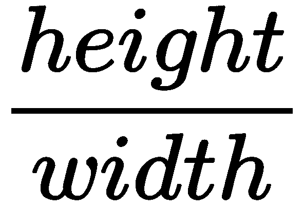)。

一旦我们对图像中存在的对象的长宽比以及高度和宽度(可以从数据集中的地面真实值获得)有了一个合适的概念，我们就可以用代表我们的数据集中大多数对象的边界框的高度和宽度来定义锚框。

典型地，这是通过在图像中存在的对象的真实边界框的顶部采用 K-means 聚类来获得的。

现在我们已经了解了锚盒的高度和宽度是如何获得的，我们将了解如何在此过程中利用它们:

1.  将每个锚定框从左上向右下滑动到图像上。
2.  与对象在并集 ( **IoU** )上有高**交集的锚定框将有一个标签，表明它包含一个对象，其他的将被标记为 0:**

*   我们可以这样修改 IoU 的阈值:如果 IoU 大于某个阈值，则对象类为 1；如果小于另一个阈值，则对象类为 0，否则未知。

一旦我们获得了这里定义的地面真相，我们就可以建立一个模型，该模型可以预测对象的位置以及对应于锚框的偏移，以将其与地面真相相匹配。现在让我们了解下图中锚定框是如何表示的:


在上图中，我们有两个定位框，一个高度大于宽度，另一个宽度大于高度，以对应图像中的对象(类)——一个人和一辆车。

我们在图像上滑动两个锚框，并注意锚框的 IoU 与地面实况最高的位置，并表示该特定位置包含对象，而其余位置不包含对象。

除了前面的两个锚定框，我们还将创建具有不同比例的锚定框，以便我们适应对象在图像中呈现的不同比例。以下是不同比例的锚盒外观示例:


请注意，所有锚定框都具有相同的中心，但具有不同的纵横比或比例。

现在我们已经了解了锚盒，在下一节中，我们将学习 RPN，它利用锚盒来预测可能包含对象的区域。

## 区域提案网络

想象一个场景，我们有一个 224 x 224 x 3 的图像。此外，在本例中，假设锚盒的形状为 8 x 8。如果我们有一个 8 像素的跨距，我们为每一行获取图像的 224/8 = 28 个裁剪，实质上是从一个图像获取 28*28 = 576 个裁剪。然后，我们获取这些作物中的每一个，并通过一个区域提议网络模型(RPN)来指示该作物是否包含图像。从本质上来说， **RPN** 暗示作物包含物体的可能性。

让我们比较一下`selectivesearch`的输出和一个 RPN 的输出。

`selectivesearch`基于像素值之上的一组计算，给出候选区域。然而，RPN 基于锚框和锚框在图像上滑动的步幅来生成区域候选。一旦我们使用这两种方法中的任何一种获得候选区域，我们就识别出最有可能包含对象的候选区域。

虽然基于`selectivesearch`的区域提议生成是在神经网络之外完成的，但是我们可以构建作为目标检测网络一部分的 RPN。使用 RPN，我们现在不必执行不必要的计算来计算网络外部的区域提议。这样，我们有一个单一的模型来识别区域，识别图像中的对象类别，并识别它们相应的边界框位置。

接下来，我们将学习 RPN 如何识别候选区域(滑动锚框后获得的裁剪)是否包含对象。在我们的训练数据中，我们会将地面实况与对象相对应。我们现在取每个候选区域，并与图像中对象的基本真实边界框进行比较，以识别候选区域和基本真实边界框之间的 IoU 是否大于某个阈值。如果 IoU 大于某个阈值(比如 0.5)，则候选区域包含对象，如果 IoU 小于阈值(比如 0.1)，则候选区域不包含对象，并且在训练时忽略 IoU 在两个阈值(0.1 - 0.5)之间的所有候选区域。

一旦我们训练一个模型来预测候选区域是否包含一个对象，我们就执行非最大值抑制，因为多个重叠区域可以包含一个对象。

总之，RPN 通过执行以下步骤来训练模型，以使其能够识别具有包含对象的高可能性的区域提议:

1.  在图像上滑动不同纵横比和大小的锚定框，以获取图像的裁剪。
2.  计算图像中对象的地面真实边界框和上一步获得的裁剪之间的 IoU。
3.  准备训练数据集，使 IoU 大于阈值的作物包含对象，IoU 小于阈值的作物不包含对象。
4.  训练模型以识别包含对象的区域。
5.  执行非最大抑制以识别包含对象的概率最高的候选区域，并消除与其高度重叠的其他候选区域。

### 分类和回归

到目前为止，我们已经了解了识别对象和执行边界框偏移的以下步骤:

1.  识别包含对象的区域。
2.  使用**感兴趣区域** ( **感兴趣区域**)池化(我们在前一章中了解过)，确保所有区域的特征图完全相同，而不管区域的形状如何。

这些步骤的两个问题如下:

1.  区域建议在对象上并不紧密对应(IoU>0.5 是我们在 RPN 中的阈值)。
2.  我们识别该区域是否包含对象，但是不识别位于该区域中的对象的类别。

我们将在本节中解决这两个问题，我们采用之前获得的统一形状的特征地图，并通过网络传递它。我们期望网络预测包含在该区域内的对象的类别以及对应于该区域的偏移，以确保边界框尽可能紧密地围绕图像中的对象。

让我们通过下图来理解这一点:

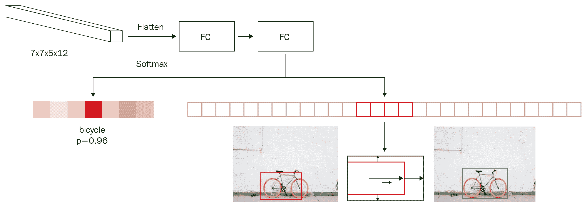

在上图中，我们将 RoI 池的输出作为输入(7 x 7 x 512 形状)，将其展平，并连接到密集层，然后预测两个不同的方面:

1.  区域中对象的类别
2.  要在区域的预测边界框上完成的偏移量，以使 IoU 与地面真实值最大化

因此，如果数据中有 20 个类，则神经网络的输出总共包含 25 个输出–21 个类(包括背景类)和应用于边界框的高度、宽度和两个中心坐标的 4 个偏移量。

现在我们已经了解了目标检测管道的不同组件，让我们用下图总结一下:

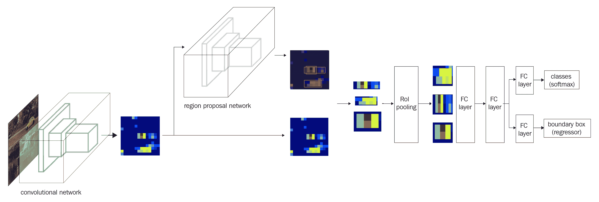

有了更快的 R-CNN 的每个组件的工作细节，在下一节中，我们将使用更快的 R-CNN 算法编写目标检测代码。

# 在自定义数据集上训练更快的 R-CNN

在下面的代码中，我们将训练更快的 R-CNN 算法来检测图像中对象周围的边界框。为此，我们将进行与上一章相同的卡车和公交车检测练习:

The following code is available as `Training_Faster_RCNN.ipynb` in the `Chapter08` folder of this book's GitHub repository - [https://tinyurl.com/mcvp-packt](https://tinyurl.com/mcvp-packt).

1.  下载数据集:

```py
import os
if not os.path.exists('images'):
    !pip install -qU torch_snippets
    from google.colab import files
    files.upload() # upload kaggle.json
    !mkdir -p ~/.kaggle
    !mv kaggle.json ~/.kaggle/
    !ls ~/.kaggle
    !chmod 600 /root/.kaggle/kaggle.json
    !kaggle datasets download \
        -d sixhky/open-images-bus-trucks/
    !unzip -qq open-images-bus-trucks.zip
    !rm open-images-bus-trucks.zip
```

2.  读取包含关于图像及其边界框和类的信息的元数据的数据帧:

```py
from torch_snippets import *
from PIL import Image
IMAGE_ROOT = 'img/images'
DF_RAW = df = pd.read_csv('df.csv')
```

3.  定义与标签和目标相对应的索引:

```py
label2target = {l:t+1 for t,l in \
                enumerate(DF_RAW['LabelName'].unique())}
label2target['background'] = 0
target2label = {t:l for l,t in label2target.items()}
background_class = label2target['background']
num_classes = len(label2target)
```

4.  定义预处理图像的功能-`preprocess_image`:

```py
def preprocess_image(img):
    img = torch.tensor(img).permute(2,0,1)
    return img.to(device).float()
```

5.  定义数据集类-`OpenDataset`:

*   定义一个`__init__`方法，将包含图像的文件夹和包含图像元数据的数据帧作为输入:

```py
class OpenDataset(torch.utils.data.Dataset):
    w, h = 224, 224
    def __init__(self, df, image_dir=IMAGE_ROOT):
        self.image_dir = image_dir
        self.files = glob.glob(self.image_dir+'/*')
        self.df = df
        self.image_infos = df.ImageID.unique()
```

*   定义`__getitem__`方法，其中我们返回预处理的图像和目标值:

```py
    def __getitem__(self, ix):
        # load images and masks
        image_id = self.image_infos[ix]
        img_path = find(image_id, self.files)
        img = Image.open(img_path).convert("RGB")
        img = np.array(img.resize((self.w, self.h), \
                              resample=Image.BILINEAR))/255.
        data = df[df['ImageID'] == image_id]
        labels = data['LabelName'].values.tolist()
        data = data[['XMin','YMin','XMax','YMax']].values
        # Convert to absolute coordinates
        data[:,[0,2]] *= self.w
        data[:,[1,3]] *= self.h 
        boxes = data.astype(np.uint32).tolist() 
        # torch FRCNN expects ground truths as 
        # a dictionary of tensors
        target = {}
        target["boxes"] = torch.Tensor(boxes).float()
        target["labels"] = torch.Tensor([label2target[i] \
                                for i in labels]).long()
        img = preprocess_image(img)
        return img, target
```

注意，我们第一次将输出作为张量的字典返回，而不是作为张量的列表。这是因为`FRCNN`类的官方 PyTorch 实现期望目标包含边界框的绝对坐标和标签信息。

*   定义`collate_fn`方法(默认情况下，`collate_fn`只使用张量作为输入，但是在这里，我们处理的是字典列表)和`__len__`方法:

```py
    def collate_fn(self, batch):
        return tuple(zip(*batch)) 

    def __len__(self):
        return len(self.image_infos)
```

6.  创建培训和验证数据加载器和数据集:

```py
from sklearn.model_selection import train_test_split
trn_ids, val_ids = train_test_split(df.ImageID.unique(), \
                    test_size=0.1, random_state=99)
trn_df, val_df = df[df['ImageID'].isin(trn_ids)], \
                    df[df['ImageID'].isin(val_ids)]

train_ds = OpenDataset(trn_df)
test_ds = OpenDataset(val_df)

train_loader = DataLoader(train_ds, batch_size=4, \
            collate_fn=train_ds.collate_fn, drop_last=True)
test_loader = DataLoader(test_ds, batch_size=4, \
            collate_fn=test_ds.collate_fn, drop_last=True)
```

7.  定义模型:

```py
import torchvision
from torchvision.models.detection.faster_rcnn import FastRCNNPredictor

device = 'cuda' if torch.cuda.is_available() else 'cpu'

def get_model():
    model = torchvision.models.detection\
                .fasterrcnn_resnet50_fpn(pretrained=True)
    in_features = model.roi_heads.box_predictor\
                       .cls_score.in_features
    model.roi_heads.box_predictor = FastRCNNPredictor(\
```

```py

                                in_features, num_classes)
    return model
```

该模型包含以下关键子模块:


我们注意到以下情况:

*   `GeneralizedRCNNTransform`是一个简单的 resize，后面跟着一个 normalize 变换:


*   `BackboneWithFPN`是将输入转换成特征图的神经网络。
*   `RegionProposalNetwork`为前面的特征图生成锚框，并为分类和回归任务预测各个特征图:


*   `RoIHeads`获取前面的图，使用 RoI 池对齐它们，处理它们，并返回每个建议的分类概率和相应的偏移:


8.  定义函数以对批量数据进行训练，并计算验证数据的损失值:

```py
# Defining training and validation functions 
def train_batch(inputs, model, optimizer):
    model.train()
    input, targets = inputs
    input = list(image.to(device) for image in input)
    targets = [{k: v.to(device) for k, v \
                in t.items()} for t in targets]
    optimizer.zero_grad()
    losses = model(input, targets)
    loss = sum(loss for loss in losses.values())
    loss.backward()
    optimizer.step()
    return loss, losses

@torch.no_grad() 
def validate_batch(inputs, model):
    model.train() 
#to obtain losses, model needs to be in train mode only
#Note that here we arn't defining the model's forward method 
#hence need to work per the way the model class is defined
    input, targets = inputs
    input = list(image.to(device) for image in input)
    targets = [{k: v.to(device) for k, v \
                in t.items()} for t in targets]

    optimizer.zero_grad()
    losses = model(input, targets)
    loss = sum(loss for loss in losses.values())
    return loss, losses
```

9.  在不断增加的时期内训练模型:

*   定义模型:

```py
model = get_model().to(device)
optimizer = torch.optim.SGD(model.parameters(), lr=0.005, \
                            momentum=0.9,weight_decay=0.0005)
n_epochs = 5
log = Report(n_epochs)
```

*   训练模型并计算训练和测试数据集的损失值:

```py
for epoch in range(n_epochs):
    _n = len(train_loader)
    for ix, inputs in enumerate(train_loader):
        loss, losses = train_batch(inputs, model, optimizer)
        loc_loss, regr_loss, loss_objectness, \
            loss_rpn_box_reg = \
                [losses[k] for k in ['loss_classifier', \
                'loss_box_reg', 'loss_objectness', \
                'loss_rpn_box_reg']]
        pos = (epoch + (ix+1)/_n)
        log.record(pos, trn_loss=loss.item(), \
                 trn_loc_loss=loc_loss.item(), \
                 trn_regr_loss=regr_loss.item(), \
                 trn_objectness_loss=loss_objectness.item(), \
               trn_rpn_box_reg_loss=loss_rpn_box_reg.item(), \
                 end='\r')

    _n = len(test_loader)
    for ix,inputs in enumerate(test_loader):
        loss, losses = validate_batch(inputs, model)
        loc_loss, regr_loss, loss_objectness, \
            loss_rpn_box_reg = \
                [losses[k] for k in ['loss_classifier', \
                'loss_box_reg', 'loss_objectness', \
                'loss_rpn_box_reg']]
        pos = (epoch + (ix+1)/_n)
        log.record(pos, val_loss=loss.item(), \
                 val_loc_loss=loc_loss.item(), \
                 val_regr_loss=regr_loss.item(), \
                val_objectness_loss=loss_objectness.item(), \
               val_rpn_box_reg_loss=loss_rpn_box_reg.item(), \
                 end='\r')
    if (epoch+1)%(n_epochs//5)==0: log.report_avgs(epoch+1)
```

10.  绘制各种损失值在增加的时期内的变化:

```py
log.plot_epochs(['trn_loss','val_loss'])
```

这会产生以下输出:


11.  对新图像进行预测:

*   经过训练的模型的输出包含对应于类别的框、标签和分数。在下面的代码中，我们定义了一个`decode_output`函数，它接受模型的输出，并在非最大值抑制后提供框、分数和类的列表:

```py
from torchvision.ops import nms
def decode_output(output):
    'convert tensors to numpy arrays'
    bbs = \
    output['boxes'].cpu().detach().numpy().astype(np.uint16)
    labels = np.array([target2label[i] for i in \
                output['labels'].cpu().detach().numpy()])
    confs = output['scores'].cpu().detach().numpy()
    ixs = nms(torch.tensor(bbs.astype(np.float32)), 
                            torch.tensor(confs), 0.05)
    bbs, confs, labels = [tensor[ixs] for tensor in [bbs, \
                                            confs, labels]]

    if len(ixs) == 1:
        bbs,confs,labels = [np.array([tensor]) for tensor \
                                in [bbs, confs, labels]]
    return bbs.tolist(), confs.tolist(), labels.tolist()
```

*   获取测试图像上的盒子和类的预测:

```py
model.eval()
for ix, (images, targets) in enumerate(test_loader):
    if ix==3: break
    images = [im for im in images]
    outputs = model(images)
    for ix, output in enumerate(outputs):
        bbs, confs, labels = decode_output(output)
        info = [f'{l}@{c:.2f}' for l,c in zip(labels, confs)]
        show(images[ix].cpu().permute(1,2,0), bbs=bbs, \
                texts=labels, sz=5)
```

上述代码提供了以下输出:

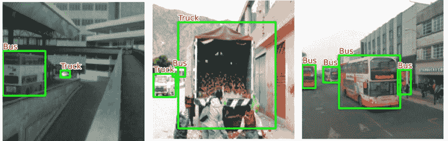

在本节中，我们使用 PyTorch `models`包中提供的`fasterrcnn_resnet50_fpn`模型类训练了一个更快的 R-CNN 模型。在下一节中，我们将了解 YOLO，这是一种现代的目标检测算法，它可以在单次拍摄中执行对象类别检测和区域校正，而无需单独的 RPN。

# YOLO 的工作细节

**你只看一次** ( **YOLO** )及其变体是突出的目标检测算法之一。在这一节中，我们将从较高的层面了解 YOLO 是如何工作的，以及 YOLO 所克服的基于 R-CNN 的目标检测框架的潜在局限性。

首先，让我们了解一下基于 R-CNN 的检测算法可能存在的局限性。在更快的 R-CNN 中，我们使用锚框在图像上滑动，并识别可能包含对象的区域，然后我们进行边界框校正。然而，在完全连接的层中，其中只有检测到的区域的 RoI 汇集输出作为输入被传递，在区域没有完全包围对象的情况下(其中对象在区域提议的边界框的边界之外)，网络必须猜测对象的真实边界，因为它没有看到完整的图像(但是只看到了区域提议)。

在这种情况下，YOLO 派上了用场，因为它在预测图像对应的边界框时会查看整个图像。

此外，fast R-CNN 仍然很慢，因为我们有两个网络:RPN 和预测类和对象周围的边界框的最终网络。

在这里，我们将了解 YOLO 如何克服更快的 R-CNN 的限制，既通过一次查看整个图像，又通过单一网络进行预测。我们将通过以下示例了解如何为 YOLO 准备数据:

1.  为给定图像创建地面实况以训练模型:

*   让我们考虑一个给定的红色边界框的图像:


*   将图像分成 *N* x *N* 个网格单元——现在，假设 *N* =3:

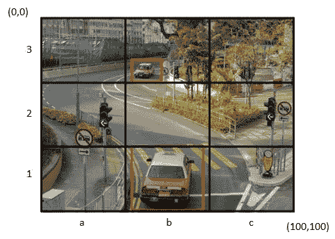

*   识别那些包含至少一个基本事实边界框中心的格网单元。在我们的例子中，它们是 3×3 网格图像的单元格 **b1** 和 **b3** 。
*   地面真实边界框的中点所在的单元负责预测对象的边界框。让我们创建对应于每个单元格的地面真相。
*   对应于每个单元的输出接地真值如下:


这里， **pc** (对象性得分)是单元格包含对象的概率。

先来了解一下如何通过、 **bw** 、 **bh** 计算 **bx** 、**。**

首先，我们将网格单元(让我们将 **b1** 网格单元)视为我们的宇宙，并将其归一化为 0 到 1 之间的范围，如下所示:


**bx** 和 **by** 是地面真实边界框相对于(网格单元的)图像的中点位置，如前所述。在我们的例子中， **bx** = 0.5，因为地面真实的中点距离原点 0.5 个单位。同理，**乘** = 0.5:


到目前为止，我们已经计算了从网格单元中心到对应于图像中对象的地面真实中心的偏移。现在，我们来了解一下 **bw** 和 **bh** 是如何计算的。

**bw** 是边界框的宽度相对于网格单元宽度的比值。

**bh** 是边界框的高度相对于网格单元高度的比值。

接下来，我们将预测网格单元对应的类。如果我们有三个类(C1-卡车，C2-汽车，C3-公共汽车)，我们将预测单元包含三个类中任何一个对象的概率。注意，这里我们不需要背景类，因为 **pc** 对应于网格单元是否包含对象。

现在我们已经了解了如何表示每个单元的输出层，让我们了解如何构造 3 x 3 网格单元的输出。

*   让我们考虑网格单元 **a3** 的输出:


单元格 **a3** 的输出如前面的截图所示。由于网格单元不包含对象，第一个输出(**PC**–objectness score)是 0，并且剩余的值无关紧要，因为单元不包含对象的任何地面真实边界框的中心。

*   让我们考虑对应于网格单元 **b1** 的输出:


前面的输出之所以是这样，是因为网格单元格包含一个对象，该对象的 **bx** 、 **by** 、 **bw** 和 **bh** 值是以与我们之前经历的相同的方式获得的(在上一个项目符号中)，最后类为`car`，导致 c2 为 1，而 c1 和 c3 为 0。

注意，对于每个单元，我们能够获取 8 个输出。因此，对于 3×3 网格的单元，我们获取 3×3×8 输出。

2.  定义一个模型，其中输入是一个图像，输出是 3 x 3 x 8，地面实况是上一步中定义的:

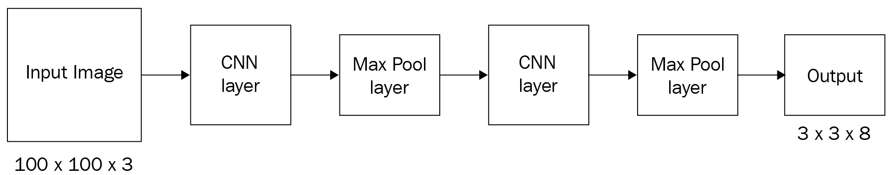

3.  通过考虑锚盒来定义地面实况。

到目前为止，我们已经构建了一个场景，期望在一个网格单元中只有一个对象。然而，在现实中，可能会出现在同一个网格单元中有多个对象的情况。这将导致创造不正确的真相。让我们通过下面的示例图像来理解这一现象:


在前面的示例中，汽车和人的基本事实边界框的中点都落在同一个单元格中——单元格 **b1** 。

避免这种情况的一种方法是使用包含更多行和列的网格，例如 19 x 19 的网格。但是，仍有可能出现增加网格单元数量于事无补的情况。锚盒在这种情况下就派上了用场。假设我们有两个锚定框——一个高度大于宽度(对应于人)，另一个宽度大于高度(对应于车):


通常，定位框会将网格单元中心作为它们的中心。在我们有两个锚盒的场景中，每个单元的输出被表示为两个锚盒的预期输出的串联:


这里， **bx** 、 **by** 、 **bw** 和 **bh** 表示从锚定框的偏移(这是图像中看到的这个场景中的宇宙，而不是网格单元)。

从前面的截图中，我们看到我们有一个 3 x 3 x 16 的输出，因为我们有两个锚点。预期输出的形式为*N*x*N*x(`num_classes`*+1*)x(`num_anchor_boxes`)，其中 *N* x *N* 是网格中单元的数量，`num_classes`是数据集中类的数量，`num_anchor_boxes`是锚框的数量。

4.  现在我们定义损失函数来训练模型。

当计算与模型相关联的损失时，我们需要确保当对象性分数小于某个阈值(这对应于不包含对象的单元)时，我们不计算回归损失和分类损失。

接下来，如果单元格包含一个对象，我们需要确保不同类之间的分类尽可能准确。

最后，如果单元格包含一个对象，边界框偏移量应该尽可能接近预期值。然而，由于宽度和高度的偏移量与中心的偏移量相比可能高得多(因为中心的偏移量在 0 和 1 之间，而宽度和高度的偏移量不需要)，所以我们通过取平方根值来给宽度和高度的偏移量一个较低的权重。

计算本地化和分类的损失如下:

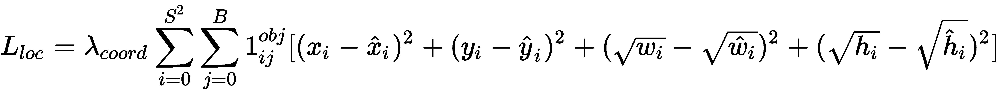


在这里，我们观察到以下情况:

*   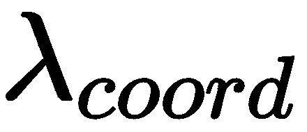是与回归损失相关的权重。
*   表示单元格中是否包含对象。
*   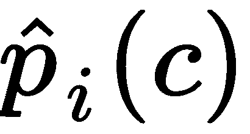对应于预测的类别概率，表示客观分数。

总损失是分类和回归损失值的总和。

有了这些，我们现在可以训练一个模型来预测物体周围的边界框。然而，为了更好地理解 YOLO 和它的变体，我们鼓励你浏览原始论文。现在我们已经了解了 YOLO 是如何在一次拍摄中预测边界框和对象类别的，我们将在下一节中编写代码。

# 在自定义数据集上训练 YOLO

建立在他人工作的基础上对于成为深度学习的成功实践者非常重要。对于这个实现，我们将使用官方的 YOLO-v4 实现来识别图像中公共汽车和卡车的位置。我们将克隆作者自己的 YOLO 实现的存储库，并在下面的代码中根据我们的需要定制它。

以下代码在本书的 GitHub 资源库【https://tinyurl.com/mcvp-packt[的`Chapter08`文件夹中以`Training_YOLO.ipynb`的形式提供。](https://tinyurl.com/mcvp-packt)

## 安装暗网

首先，从 GitHub 中拉出`darknet`库，并在环境中编译它。该模型是用一种叫做 Darknet 的独立语言编写的，它不同于 PyTorch。我们将使用以下代码来实现这一点:

1.  拉动 Git 回购:

```py
!git clone https://github.com/AlexeyAB/darknet
%cd darknet
```

2.  重新配置`Makefile`文件:

```py
!sed -i 's/OPENCV=0/OPENCV=1/' Makefile
# In case you dont have a GPU, make sure to comment out the
# below 3 lines
!sed -i 's/GPU=0/GPU=1/' Makefile
!sed -i 's/CUDNN=0/CUDNN=1/' Makefile
!sed -i 's/CUDNN_HALF=0/CUDNN_HALF=1/' Makefile
```

`Makefile`是在环境中安装`darknet`所需的配置文件(将此过程想象成类似于在 Windows 上安装软件时所做的选择)。我们正在强制`darknet`安装以下标志:`OPENCV`、`GPU`、`CUDNN`和`CUDNN_HALF`。这些都是让训练更快的重要优化。
此外，在前面的代码中，有一个奇怪的函数叫做`sed`，它代表**流编辑器**。这是一个强大的 Linux 命令，可以直接从命令提示符下修改文本文件中的信息。具体来说，这里我们使用它的搜索替换功能将`OPENCV=0`替换为`OPENCV=1`，以此类推。这里要理解的语法是`sed 's/<search-string>/<replace-with>/' path/to/text/file`。

3.  编译`darknet`源代码:

```py
!make
```

4.  安装`torch_snippets`包:

```py
!pip install -q torch_snippets
```

5.  下载并提取数据集，并删除 ZIP 文件以节省空间:

```py
!wget --quiet \
 https://www.dropbox.com/s/agmzwk95v96ihic/open-images-bus-trucks.tar.xz
!tar -xf open-images-bus-trucks.tar.xz
!rm open-images-bus-trucks.tar.xz
```

6.  获取预先训练的权重以进行样本预测:

```py
!wget --quiet\ https://github.com/AlexeyAB/darknet/releases/download/darknet_yolo_v3_optimal/yolov4.weights
```

7.  通过运行以下命令测试安装是否成功:

```py
!./darknet detector test cfg/coco.data cfg/yolov4.cfg\ yolov4.weights
 data/person.jpg
```

这将使用从`cfg/yolov4.cfg`和预先训练的权重`yolov4.weights`构建的网络对`data/person.jpg`进行预测。此外，它从`cfg/coco.data`中获取类，这是预训练权重被训练的内容。

前面的代码导致对样本图像(`data/person.jpg`)的预测如下:

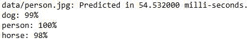

现在我们已经了解了如何安装`darknet`，在下一节中，我们将了解如何为我们的自定义数据集创建基本事实来利用`darknet`。

## 设置数据集格式

YOLO 使用固定的训练模式。一旦我们以所需的格式存储了图像和标签，我们就可以用一个命令在数据集上进行训练。因此，让我们了解一下 YOLO 培训所需的文件和文件夹结构。

有三个重要步骤:

1.  通过运行下面一行，在`data/obj.names`创建一个包含类名的文本文件，每行一个类(`%%writefile`是一个神奇的命令，它在`data/obj.names`创建一个包含笔记本单元格中存在的任何内容的文本文件):

```py
%%writefile data/obj.names
bus
truck
```

2.  在`data/obj.data`创建一个文本文件，描述数据集中的参数、包含训练和测试图像路径的文本文件的位置、包含对象名称的文件的位置以及保存训练模型的文件夹:

```py
%%writefile data/obj.data
classes = 2
train = data/train.txt
valid = data/val.txt
names = data/obj.names
backup = backup/
```

The extensions for the preceding text files are not `.txt`.
Yolo uses hardcoded names and folders to identify where data is.
Also, the magic `%%writefile` Jupyter function creates a file with the content mentioned in a cell, as shown previously. Treat each `%%writefile ...` as a separate cell in Jupyter.

3.  将所有图像和地面实况文本文件移动到`data/obj`文件夹。我们将把图像从`bus-trucks`数据集连同标签一起复制到该文件夹:

```py
!mkdir -p data/obj
!cp -r open-images-bus-trucks/img/* data/obj/
!cp -r open-images-bus-trucks/yolo_labels/all/\
{train,val}.txt data/
!cp -r open-images-bus-trucks/yolo_labels/all/\
labels/*.txt data/obj/
```

请注意，所有训练和验证图像都在同一个`data/obj`文件夹中。我们还将一些文本文件移动到同一个文件夹中。每个包含图像基本事实的文件都与该图像同名。例如，文件夹可能包含`1001.jpg`和`1001.txt`，这意味着文本文件包含该图像的标签和边界框。如果`data/train.txt`包含`1001.jpg`作为它的一条线，那么它就是一个训练图像。如果它出现在`val.txt`中，那么它是一个验证图像。

文本文件本身应该包含这样的信息:`cls, xc, yc, w, h,`，其中`cls`是位于`(xc, yc)`的边界框中对象的类索引，它代表宽度`w`和高度`h`的矩形的质心。`xc`、`yc`、`w`和`h`中的每一个都是图像宽度和高度的一部分。将每个对象存储在单独的行上。

例如，如果宽度为 800、高度为 600 的图像包含一辆卡车和一辆公共汽车，分别位于中心(500，300)和(100，400)，并且宽度和高度分别为(200，100)和(300，50)，则文本文件将如下所示:

```py
1 0.62 0.50 0.25 0.12
0 0.12 0.67 0.38 0.08
```

现在我们已经创建了数据，让我们在下一部分配置网络架构。

## 配置架构

YOLO 有一长串的建筑。一些是大的，一些是小的，以在大或小的数据集上进行训练。配置可以有不同的主干。标准数据集有预先训练好的配置。每个配置都是一个`.cfg`文件，位于我们克隆的同一个 GitHub repo 的`cfgs`文件夹中。每一个都包含了文本文件形式的网络架构(与我们用`nn.Module`类构建的方式相反)以及一些超参数，比如批量大小和学习速率。我们将采用最小的可用架构，并针对我们的数据集进行配置:

```py
# create a copy of existing configuration and modify it in place
!cp cfg/yolov4-tiny-custom.cfg cfg/\
yolov4-tiny-bus-trucks.cfg
# max_batches to 4000 (since the dataset is small enough)
!sed -i 's/max_batches = 500200/max_batches=4000/' \
cfg/yolov4-tiny-bus-trucks.cfg
# number of sub-batches per batch
!sed -i 's/subdivisions=1/subdivisions=16/' \
cfg/yolov4-tiny-bus-trucks.cfg
# number of batches after which learning rate is decayed
!sed -i 's/steps=400000,450000/steps=3200,3600/' \
cfg/yolov4-tiny-bus-trucks.cfg
# number of classes is 2 as opposed to 80 
# (which is the number of COCO classes)
!sed -i 's/classes=80/classes=2/g' \
cfg/yolov4-tiny-bus-trucks.cfg
# in the classification and regression heads, 
# change number of output convolution filters
# from 255 -> 21 and 57 -> 33, since we have fewer classes 
# we don't need as many filters
!sed -i 's/filters=255/filters=21/g' \
cfg/yolov4-tiny-bus-trucks.cfg
!sed -i 's/filters=57/filters=33/g' \
cfg/yolov4-tiny-bus-trucks.cfg
```

这样，我们重新调整了`yolov4-tiny`的用途，使其可以在我们的数据集上训练。剩下的唯一步骤是加载预训练的权重并训练模型，这将在下一节中进行。

## 训练和测试模型

我们将从下面的 GitHub 位置获取权重，并将它们存储在`build/darknet/x64`中:

```py
!wget --quiet \ https://github.com/AlexeyAB/darknet/releases/download/darknet_yolo_v4_pre/yolov4-tiny.conv.29
!cp yolov4-tiny.conv.29 build/darknet/x64/
```

最后，我们将使用以下代码来训练模型:

```py
!./darknet detector train data/obj.data \
cfg/yolov4-tiny-bus-trucks.cfg yolov4-tiny.conv.29 \
-dont_show -mapLastAt
```

`-dont_show`标志跳过显示中间预测图像，并且`-mapLastAt`将定期打印验证数据的平均精度。整个培训可能需要 1 到 2 个小时。权重定期存储在备份文件夹中，并可在训练后用于预测，如以下代码，该代码对新图像进行预测:

```py
!pip install torch_snippets
from torch_snippets import Glob, stem, show, read
# upload your own images to a folder
image_paths = Glob('images-of-trucks-and-busses')
for f in image_paths:
    !./darknet detector test \
    data/obj.data cfg/yolov4-tiny-bus-trucks.cfg\
    backup/yolov4-tiny-bus-trucks_4000.weights {f}
    !mv predictions.jpg {stem(f)}_pred.jpg
for i in Glob('*_pred.jpg'):
    show(read(i, 1), sz=20)
```

上述代码会导致以下结果:

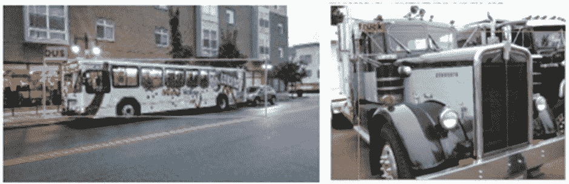

现在，我们已经了解了如何利用 YOLO 对我们的自定义数据集执行目标检测，在下一部分，我们将了解如何利用 SSD 执行目标检测。

# 固态硬盘的工作细节

到目前为止，我们已经看到了这样一个场景，我们在逐渐卷积和汇集来自前一层的输出后进行预测。然而，我们知道不同的层对原始图像有不同的感受域。例如，与具有较大感受野的最终层相比，初始层具有较小的感受野。在这里，我们将了解 SSD 如何利用这一现象来预测图像的边界框。

SSD 如何帮助克服检测不同比例对象的问题，其工作原理如下:

*   我们利用预训练的 VGG 网络，并用几个附加层来扩展它，直到我们获得 1×1 块。
*   我们将利用所有最后几层来进行类和边界框预测，而不是只利用最后一层来进行边界框和类预测。
*   在锚定框的位置，我们将提出具有特定比例和纵横比的默认框。
*   每个默认框都应该预测对象和边界框的偏移量，就像锚框在 YOLO 预测类和偏移量一样。

现在我们已经了解了 SSD 与 YOLO 的主要不同之处(即 SSD 中的默认盒取代了 YOLO 的锚盒，多个层连接到 SSD 中的最终层，而不是 YOLO 的渐进卷积池)，让我们了解以下内容:

*   固态硬盘的网络架构
*   如何利用不同的层进行边界框和类预测
*   如何为不同图层中的默认框分配比例和纵横比

固态硬盘的网络架构如下:

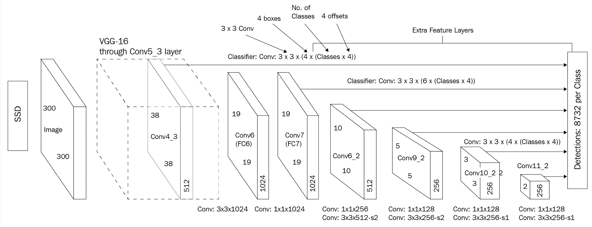

正如您在前面的图表中看到的，我们正在获取一个大小为 300 x 300 x 3 的图像，并通过预先训练的 VGG-16 网络来获取`conv5_3`层的输出。此外，我们通过向`conv5_3`输出添加一些卷积来扩展网络。

接下来，我们获得每个单元格和每个默认框的边界框偏移量和类预测(在下一节中有更多关于默认框的内容；现在，我们假设这类似于一个锚盒)。来自`conv5_3`输出的预测总数是 38 x 38 x 4，其中 38 x 38 是`conv5_3`层的输出形状，4 是在`conv5_3`层上运行的默认盒子的数量。类似地，网络中的参数总数如下:

| **层** | **参数数量** |
| `conv5_3` | 38 X 38 X 4 = 5,776 |
| `FC6` | 19 X 19 X 6 = 2,166 |
| `conv8_2` | 10 X 10 X 6 = 600 |
| `conv9_2` | 5 X 5 X 6 = 150 |
| `conv10_2` | 3 X 3 X 4 = 36 |
| `conv11_2` | 1 X 1 X 4 = 4 |
| **总参数** | **8732** |

请注意，与原始论文中描述的架构中的其他层相比，某些层有更多的盒子(6 个而不是 4 个)。

现在，让我们了解一下默认框的不同比例和长宽比。我们将从比例开始，然后讨论长宽比。

让我们设想一个场景，一个物体的最小尺度是一个图像高度的 20%和宽度的 20%，物体的最大尺度是高度的 90%和宽度的 90%。在这种情况下，我们逐渐增加跨层的比例(随着我们向后面的层前进，图像大小会显著缩小)，如下所示:


实现图像逐步缩放的公式如下:

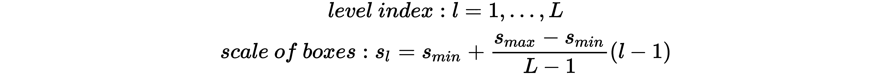

现在我们已经了解了如何跨层计算比例，我们现在将学习如何制作不同纵横比的盒子。

可能的纵横比如下:


不同层的方框中心如下:


这里 *i* 和 *j* 一起代表 *l* 层中的一个单元格。

对应于不同纵横比的宽度和高度计算如下:


请注意，我们考虑的是在某些层中有四个盒子，在另一层中有六个盒子。现在，如果我们想要有四个盒子，我们移除{3，1/3}纵横比，否则我们考虑所有六个可能的盒子(五个具有相同比例的盒子和一个具有不同比例的盒子)。那么，让我们学习如何获得第六个盒子:


现在我们已经有了所有可能的框，让我们了解如何准备训练数据集。

IoU 大于阈值(比如 0.5)的默认框被认为是正匹配，其余的是负匹配。

在 SSD 的输出中，我们预测盒子属于一个类的概率(其中第 0 个^(到第)个类代表背景)以及地面真实相对于默认盒子的偏移。

最后，我们通过优化以下损失值来训练模型:

*   **分类损失**:使用以下等式表示:


在前面的等式中，`pos`表示与地面实况高度重叠的几个默认框，而`neg`表示预测了类但实际上不包含对象的误分类框。最后，我们确保`pos` : `neg`的比率最多为 1:3，就好像我们不执行这个采样，我们将拥有背景类盒的优势。

*   **定位损失:**对于定位，我们仅在客观分数大于某个阈值时才考虑损失值。本地化损失计算如下:


这里 *t* 是预测偏移， *d* 是实际偏移。

现在我们已经了解了如何训练 SSD，让我们在下一节中使用它来进行公交车与卡车目标检测练习。

GitHub repo:[https://github.com/sizhky/ssd-utils/](https://github.com/sizhky/ssd-utils/)中提供了该部分的核心实用函数。在开始训练过程之前，让我们一个一个地了解它们。

## SSD 代码中的组件

GitHub repo 中有三个文件。先稍微挖掘一下，了解一下再训练。**请注意，本节不是培训过程的一部分，而是为了理解培训过程中使用的导入。**

我们正在从 GitHub 资源库的`model.py`文件中导入`SSD300`和`MultiBoxLoss`类。让我们来了解一下他们两个。

### 固态硬盘 300

当您查看`SSD300`函数定义时，很明显该模型包含三个子模块:

```py
class SSD300(nn.Module):
    ...
    def __init__(self, n_classes, device):
        ...
 self.base = VGGBase()
 self.aux_convs = AuxiliaryConvolutions()
 self.pred_convs = PredictionConvolutions(n_classes) ...
```

我们首先将输入发送给`VGGBase`，它返回维度为`(N, 512, 38, 38)`和`(N, 1024, 19, 19)`的两个特征向量。第二个输出将是`AuxiliaryConvolutions`的输入，它返回更多维度的特征图`(N, 512, 10, 10)`、`(N, 256, 5, 5)`、`(N, 256, 3, 3)`和`(N, 256, 1, 1)`。最后，来自`VGGBase`的第一个输出和这四个特征图被发送到`PredictionConvolutions`，它返回 8732 个锚盒，正如我们之前讨论的。

`SSD300`类的另一个关键方面是`create_prior_boxes`方法。对于每个特征地图，都有三个与之相关的项目:网格的大小、缩小网格单元的比例(这是该特征地图的基础锚点框)，以及单元中所有锚点的纵横比。使用这三种配置，代码使用三重`for`循环并为所有 8732 个锚盒创建一个`(cx, cy, w, h)`列表。

最后，`detect_objects`方法获取分类和回归值的张量(预测锚框的),并将它们转换成实际的边界框坐标。

### 多盒损耗

作为人类，我们只担心少数边界框。但是对于 SSD 的工作方式，我们需要比较来自几个特征地图的 8732 个边界框，并预测锚框是否包含有价值的信息。我们将这个损失计算任务分配给`MultiBoxLoss`。

正向方法的输入是来自模型和地面真实边界框的锚框预测。

首先，我们通过将模型中的每个锚点与边界框进行比较，将基础真实框转换成 8，732 个锚点框的列表。如果 IoU 足够高，则该特定锚定框将具有非零回归坐标，并且关联一个对象作为分类的基础事实。自然地，大多数被计算的定位框将有它们的相关类作为`background`，因为它们与实际边界框的 IoU 将很小，或者在相当多的情况下为零。

一旦地面事实被转换成这 8，732 个锚盒回归和分类张量，就很容易将它们与模型的预测进行比较，因为形状现在是相同的。

我们对回归张量执行`MSE-Loss`,对定位张量执行`CrossEntropy-Loss`,并将它们相加，作为最终损失返回。

# 在自定义数据集上训练 SSD

在下面的代码中，我们将训练 SSD 算法来检测图像中存在的对象周围的边界框。我们将使用我们一直在进行的卡车与公共汽车目标检测任务:

The following code is available as `Training_SSD.ipynb` in the `Chapter08` folder of this book's GitHub repository - [https://tinyurl.com/mcvp-packt](https://tinyurl.com/mcvp-packt) The code contains URLs to download data from and is moderately lengthy. We strongly recommend you to execute the notebook in GitHub to reproduce results while you understand the steps to perform and explanation of various code components from text.

1.  下载图像数据集并克隆 Git 存储库，该存储库托管模型的代码和用于处理数据的其他实用程序:

```py
import os
if not os.path.exists('open-images-bus-trucks'):
    !pip install -q torch_snippets
    !wget --quiet https://www.dropbox.com/s/agmzwk95v96ihic/\
    open-images-bus-trucks.tar.xz
    !tar -xf open-images-bus-trucks.tar.xz
    !rm open-images-bus-trucks.tar.xz
    !git clone https://github.com/sizhky/ssd-utils/
%cd ssd-utils
```

2.  预处理数据，就像我们在*培训* *更快的 R-CNN 定制数据集*部分所做的那样:

```py
from torch_snippets import *
DATA_ROOT = '../open-images-bus-trucks/'
IMAGE_ROOT = f'{DATA_ROOT}/images'
DF_RAW = pd.read_csv(f'{DATA_ROOT}/df.csv')
df = DF_RAW.copy()

df = df[df['ImageID'].isin(df['ImageID'].unique().tolist())]

label2target = {l:t+1 for t,l in enumerate(DF_RAW['LabelName'].unique())}
label2target['background'] = 0
target2label = {t:l for l,t in label2target.items()}
background_class = label2target['background']
num_classes = len(label2target)

device = 'cuda' if torch.cuda.is_available() else 'cpu'
```

3.  准备一个数据集类，就像我们在*在自定义数据集上训练更快的 R-CNN*部分所做的那样:

```py
import collections, os, torch
from PIL import Image
from torchvision import transforms
normalize = transforms.Normalize(
                mean=[0.485, 0.456, 0.406],
                std=[0.229, 0.224, 0.225]
            )
denormalize = transforms.Normalize(
                mean=[-0.485/0.229,-0.456/0.224,-0.406/0.255],
                std=[1/0.229, 1/0.224, 1/0.255]
            )

def preprocess_image(img):
    img = torch.tensor(img).permute(2,0,1)
    img = normalize(img)
    return img.to(device).float()

class OpenDataset(torch.utils.data.Dataset):
    w, h = 300, 300
    def __init__(self, df, image_dir=IMAGE_ROOT):
        self.image_dir = image_dir
        self.files = glob.glob(self.image_dir+'/*')
        self.df = df
        self.image_infos = df.ImageID.unique()
        logger.info(f'{len(self)} items loaded')

    def __getitem__(self, ix):
        # load images and masks
        image_id = self.image_infos[ix]
        img_path = find(image_id, self.files)
        img = Image.open(img_path).convert("RGB")
        img = np.array(img.resize((self.w, self.h), \
                       resample=Image.BILINEAR))/255.
        data = df[df['ImageID'] == image_id]
        labels = data['LabelName'].values.tolist()
        data = data[['XMin','YMin','XMax','YMax']].values
        data[:,[0,2]] *= self.w
        data[:,[1,3]] *= self.h
        boxes = data.astype(np.uint32).tolist() # convert to 
        # absolute coordinates
        return img, boxes, labels

    def collate_fn(self, batch):
        images, boxes, labels = [], [], []
        for item in batch:
            img, image_boxes, image_labels = item
            img = preprocess_image(img)[None]
            images.append(img)
            boxes.append(torch.tensor( \
                        image_boxes).float().to(device)/300.)
            labels.append(torch.tensor([label2target[c] \
                    for c in image_labels]).long().to(device))
        images = torch.cat(images).to(device)
        return images, boxes, labels
    def __len__(self):
        return len(self.image_infos)
```

4.  准备训练和测试数据集以及数据加载器:

```py
from sklearn.model_selection import train_test_split
trn_ids, val_ids = train_test_split(df.ImageID.unique(), \
                             test_size=0.1, random_state=99)
trn_df, val_df = df[df['ImageID'].isin(trn_ids)], \
                df[df['ImageID'].isin(val_ids)]

train_ds = OpenDataset(trn_df)
test_ds = OpenDataset(val_df)

train_loader = DataLoader(train_ds, batch_size=4, \
                          collate_fn=train_ds.collate_fn, \
                          drop_last=True)
test_loader = DataLoader(test_ds, batch_size=4, \
                         collate_fn=test_ds.collate_fn, \
                         drop_last=True)
```

5.  定义函数以对一批数据进行训练，并计算验证数据的准确度和损失值:

```py
def train_batch(inputs, model, criterion, optimizer):
    model.train()
    N = len(train_loader)
    images, boxes, labels = inputs
    _regr, _clss = model(images)
    loss = criterion(_regr, _clss, boxes, labels)
    optimizer.zero_grad()
    loss.backward()
    optimizer.step()
    return loss

@torch.no_grad()
def validate_batch(inputs, model, criterion):
    model.eval()
    images, boxes, labels = inputs
    _regr, _clss = model(images)
    loss = criterion(_regr, _clss, boxes, labels)
    return loss
```

6.  导入模型:

```py
from model import SSD300, MultiBoxLoss
from detect import *
```

7.  初始化模型、优化器和损失函数:

```py
n_epochs = 5

model = SSD300(num_classes, device)
optimizer = torch.optim.AdamW(model.parameters(), lr=1e-4, \
                              weight_decay=1e-5)
criterion = MultiBoxLoss(priors_cxcy=model.priors_cxcy, \
                         device=device)

log = Report(n_epochs=n_epochs)
logs_to_print = 5
```

8.  在不断增加的时期内训练模型:

```py
for epoch in range(n_epochs):
    _n = len(train_loader)
    for ix, inputs in enumerate(train_loader):
        loss = train_batch(inputs, model, criterion, \
                            optimizer)
        pos = (epoch + (ix+1)/_n)
        log.record(pos, trn_loss=loss.item(), end='\r')

    _n = len(test_loader)
    for ix,inputs in enumerate(test_loader):
        loss = validate_batch(inputs, model, criterion)
        pos = (epoch + (ix+1)/_n)
        log.record(pos, val_loss=loss.item(), end='\r')
```

各时期的训练和测试损失值的变化如下:


9.  获取对新图像的预测:

*   获取随机图像:

```py
image_paths = Glob(f'{DATA_ROOT}/img/*')
image_id = choose(test_ds.image_infos)
img_path = find(image_id, test_ds.files)
original_image = Image.open(img_path, mode='r')
original_image = original_image.convert('RGB')
```

*   获取与图像中存在的对象相对应的边界框、标签和分数:

```py
bbs, labels, scores = detect(original_image, model, \
                             min_score=0.9, max_overlap=0.5,\
                             top_k=200, device=device)
```

*   将获得的输出叠加到图像上:

```py
labels = [target2label[c.item()] for c in labels]
label_with_conf = [f'{l} @ {s:.2f}' \
                   for l,s in zip(labels,scores)]
print(bbs, label_with_conf)
show(original_image, bbs=bbs, \
     texts=label_with_conf, text_sz=10)
```

前面的代码获取如下输出示例(每次迭代执行一个图像):

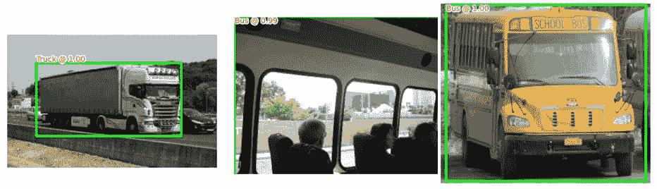

由此可见，我们可以相当准确地检测图像中的对象。

# 摘要

在这一章中，我们已经了解了现代目标检测算法的工作细节:更快的 R-CNN、YOLO 和 SSD。我们了解了他们如何克服拥有两个独立模型的限制——一个用于获取区域提议，另一个用于获取区域提议上的类和边界框偏移量。此外，我们使用 PyTorch 实现了更快的 R-CNN，使用`darknet`实现了 YOLO，并从头开始实现 SSD。

在下一章，我们将学习图像分割，它通过识别对应于物体的像素，比物体定位更进了一步。

此外，在[第 15 章](f31e7904-19a9-4ab3-8ab6-90b1596eebc6.xhtml)、*结合计算机视觉和 NLP 技术*中，我们将了解 DETR，一种基于转换器的目标检测算法，在[第 10 章](9b3e4a1d-dfbb-4580-920c-5ff1238021b2.xhtml)、*目标检测和分割的应用*中，我们将了解 Detectron2 框架，该框架不仅有助于检测对象，而且有助于在单次拍摄中分割它们。

# 测试你的理解能力

1.  为什么快速 R-CNN 比快速 R-CNN 更快？
2.  与更快的 R-CNN 相比，YOLO 和 SSD 的速度如何？
3.  是什么让 YOLO 和 SSD 单拍算法？
4.  客观分和类分有什么区别？
5.  锚定框和默认框有什么区别？