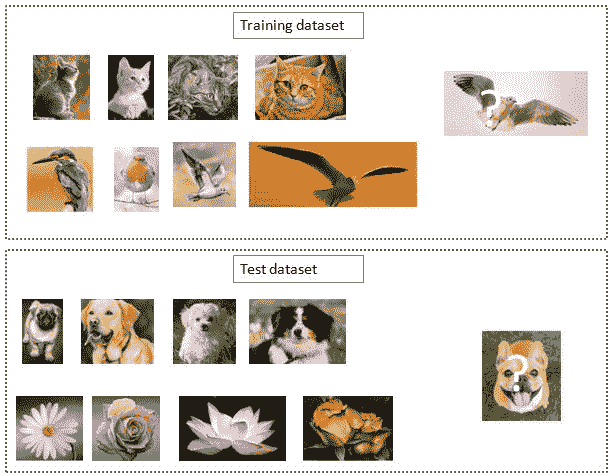
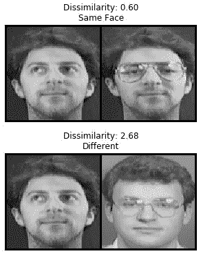

到目前为止，在前面的章节中，我们已经学习了如何分类图像，每个类别都有成百上千的示例图像要训练。在这一章中，我们将学习各种有助于图像分类的技术，即使每堂课只有很少的训练样本。我们将从训练一个模型来预测一个类别开始，即使在训练期间对应于该类别的图像不存在。接下来，我们将转到一个场景，在这个场景中，我们试图预测的类在训练期间只出现几个图像。我们将编码暹罗网络，这属于少数镜头学习的范畴，并了解关系网络和原型网络的工作细节。

我们将在本章中了解以下主题:

*   实现零射击学习
*   实现少量学习

# 实现零射击学习

想象一个场景，我让你预测图像中的对象类别，而你以前没有见过该对象类别的图像。在这种情况下，你如何做出预测？

直觉上，我们求助于图像中对象的属性，然后尝试识别最匹配属性的对象。

在一个这样的场景中，我们必须自动提出属性(属性不是为了训练而给出的)，我们利用词向量。词向量包含词之间的语义相似性。例如，所有的动物都有相似的单词向量，而汽车有非常不同的单词向量表示。虽然单词向量的生成超出了本书的范围，但我们将研究预先训练好的单词向量。在非常高的水平上，具有相似周围单词(上下文)的单词将具有相似的向量。以下是单词向量的 t-SNE 表示法示例:


从前面的示例中，我们可以看到单词 vectors of automobiles 位于图表的左侧，而对应于动物的 vectors 位于右侧。此外，相似的动物也有相似的媒介。

这给了我们直觉，文字，就像图像一样，也有帮助获得相似性的矢量嵌入。

在下一节中，当我们编写零触发学习时，我们将利用这一现象来识别模型在训练期间看不到的类。本质上，我们将学习直接将图像特征映射到单词特征。

## 编码零触发学习

我们在编码零炮学习时采用的高级策略如下:

1.  导入数据集——数据集由图像及其相应的类组成。
2.  从预先训练的词向量模型中取出对应于每个类别的词向量。
3.  通过预先训练的图像模型(如 VGG16)传递图像。
4.  我们期望网络预测图像中物体对应的词向量。
5.  一旦我们训练了模型，我们就可以预测新图像上的单词向量。
6.  最接近预测单词向量的单词向量的类别是图像的类别。

让我们将前面的策略编码如下:

以下代码在本书的 GitHub 资源库的`Chapter14`文件夹中以`Zero_shot_learning.ipynb`的形式提供-【https://tinyurl.com/mcvp-packt 确保从 GitHub 的笔记本中复制 URL，以避免在复制结果时出现任何问题

1.  克隆包含本练习数据集的 GitHub 存储库，并导入相关的包:

```py
!git clone https://github.com/sizhky/zero-shot-learning/
!pip install -Uq torch_snippets
%cd zero-shot-learning/src
import gzip, _pickle as cPickle
from torch_snippets import *
from sklearn.preprocessing import LabelEncoder, normalize
device = 'cuda' if torch.cuda.is_available() else 'cpu'
```

2.  定义特征数据的路径(`DATAPATH`)以及 word2vec 嵌入(`WORD2VECPATH`):

```py
WORD2VECPATH = "../data/class_vectors.npy"
DATAPATH = "../data/zeroshot_data.pkl"
```

3.  提取可用类的列表:

```py
with open('train_classes.txt', 'r') as infile:
    train_classes = [str.strip(line) for line in infile]
```

4.  加载特征向量数据:

```py
with gzip.GzipFile(DATAPATH, 'rb') as infile:
    data = cPickle.load(infile)
```

5.  定义训练数据和属于零触发类(训练期间不存在的类)的数据。注意，我们将仅显示属于训练类的类，并隐藏零射击模型类，直到推断时间:

```py
training_data = [instance for instance in data if \
                instance[0] in train_classes]
zero_shot_data = [instance for instance in data if \
                instance[0] not in train_classes]
np.random.shuffle(training_data)
```

6.  为每个类提取 300 个训练图像用于训练，并且为验证提取剩余的训练类图像:

```py
train_size = 300 # per class
train_data, valid_data = [], []
for class_label in train_classes:
    ctr = 0
    for instance in training_data:
        if instance[0] == class_label:
            if ctr < train_size:
                train_data.append(instance)
                ctr+=1
            else:
                valid_data.append(instance)
```

7.  混洗训练和验证数据，并将对应于类别的向量提取到字典中-`vectors`:

```py
np.random.shuffle(train_data)
np.random.shuffle(valid_data)
vectors = {i:j for i,j in np.load(WORD2VECPATH, \
                                allow_pickle=True)}
```

8.  获取用于训练和验证数据的图像和文字嵌入特征:

```py
train_data=[(feat,vectors[clss]) for clss,feat in train_data]
valid_data=[(feat,vectors[clss]) for clss,feat in valid_data]
```

9.  获取培训、验证和零触发类:

```py
train_clss = [clss for clss,feat in train_data]
valid_clss = [clss for clss,feat in valid_data]
zero_shot_clss = [clss for clss,feat in zero_shot_data]
```

10.  定义训练数据、验证数据和零炮数据的输入和输出数组:

```py
x_train, y_train = zip(*train_data)
x_train, y_train = np.squeeze(np.asarray(x_train)), \
                    np.squeeze(np.asarray(y_train))
x_train = normalize(x_train, norm='l2')

x_valid, y_valid = zip(*valid_data)
x_valid, y_valid = np.squeeze(np.asarray(x_valid)), \
                    np.squeeze(np.asarray(y_valid))
x_valid = normalize(x_valid, norm='l2')

y_zsl, x_zsl = zip(*zero_shot_data)
x_zsl, y_zsl = np.squeeze(np.asarray(x_zsl)), \
                np.squeeze(np.asarray(y_zsl))
x_zsl = normalize(x_zsl, norm='l2')
```

11.  定义训练和验证数据集以及数据加载器:

```py
from torch.utils.data import TensorDataset

trn_ds = TensorDataset(*[torch.Tensor(t).to(device) for t in \
                         [x_train, y_train]])
val_ds = TensorDataset(*[torch.Tensor(t).to(device) for t in \
                         [x_valid, y_valid]])
trn_dl = DataLoader(trn_ds, batch_size=32, shuffle=True)
val_dl = DataLoader(val_ds, batch_size=32, shuffle=False)
```

12.  构建一个模型，将 4096 维特征作为输入，预测 300 维向量作为输出:

```py
def build_model(): 
    return nn.Sequential(
        nn.Linear(4096, 1024), nn.ReLU(inplace=True),
        nn.BatchNorm1d(1024), nn.Dropout(0.8),
        nn.Linear(1024, 512), nn.ReLU(inplace=True),
        nn.BatchNorm1d(512), nn.Dropout(0.8),
        nn.Linear(512, 256), nn.ReLU(inplace=True),
        nn.BatchNorm1d(256), nn.Dropout(0.8),
        nn.Linear(256, 300)
    )
```

13.  定义对一批数据进行训练和验证的函数:

```py
def train_batch(model, data, optimizer, criterion):
    model.train()
    ims, labels = data
    _preds = model(ims)
    optimizer.zero_grad()
    loss = criterion(_preds, labels)
    loss.backward()
    optimizer.step()
    return loss.item()

@torch.no_grad()
def validate_batch(model, data, criterion):
    model.eval()
    ims, labels = data
    _preds = model(ims)
    loss = criterion(_preds, labels)
    return loss.item()
```

14.  在不断增加的时期内训练模型:

```py
model = build_model().to(device)
criterion = nn.MSELoss()
optimizer = optim.Adam(model.parameters(), lr=1e-3)
n_epochs = 60

log = Report(n_epochs)
for ex in range(n_epochs):
    N = len(trn_dl)
    for bx, data in enumerate(trn_dl):
        loss = train_batch(model, data, optimizer, criterion)
        log.record(ex+(bx+1)/N, trn_loss=loss, end='\r')

    N = len(val_dl)
    for bx, data in enumerate(val_dl):
        loss = validate_batch(model, data, criterion)
        log.record(ex+(bx+1)/N, val_loss=loss, end='\r')        

    if not (ex+1)%10: log.report_avgs(ex+1)

log.plot_epochs(log=True)
```

上述代码会产生以下输出:


15.  对包含零拍摄类(模型未见过的类)的图像(`x_zsl`)进行预测，并获取对应于所有可用类的实际特征(`vectors`)和`classnames`:

```py
pred_zsl = model(torch.Tensor(x_zsl).to(device)).cpu()\
                                    .detach().numpy()
class_vectors = sorted(np.load(WORD2VECPATH, \
                allow_pickle=True), key=lambda x: x[0])
classnames, vectors = zip(*class_vectors)
classnames = list(classnames)

vectors = np.array(vectors)
```

16.  计算每个预测向量与对应于可用类的向量之间的距离，并测量出现在前五个预测中的零炮类的数量:

```py
dists = (pred_zsl[None] - vectors[:,None])
dists = (dists**2).sum(-1).T

best_classes = []
for item in dists:
    best_classes.append([classnames[j] for j in \
                         np.argsort(item)[:5]])

np.mean([i in J for i,J in zip(zero_shot_clss, best_classes)])
```

从前面可以看出，在模型的前 5 个预测中，我们可以正确预测大约 73%的图像，这些图像包含的对象的类别在训练期间不存在。请注意，对于前 1、2 和 3 个预测，正确分类图像的百分比分别为 6%、14%和 40%。

现在，我们已经看到了在通过零镜头分类进行训练时不存在某个类别的图像时处理预测的场景，在下一节中，我们将了解如何在训练集中只有几个某个类别的示例时构建模型来预测图像中的对象类别。

# 实现少量学习

想象一下这样一个场景，我们只给你一个人的 10 张照片，并要求你辨别一张新照片是否是同一个人。作为人类，我们可以轻松地对这些任务进行分类。然而，到目前为止，我们学习的基于深度学习的算法需要数百/数千个标记的例子才能准确分类。

元学习范式中的多种算法可以方便地解决这种情况。在这一节中，我们将学习致力于解决少图像问题的连体网络、原型网络和关系匹配网络。

这三种算法都旨在学习比较两幅图像，以得出图像相似程度的分数。

下面是一个在少镜头分类过程中会发生什么的示例:



在前面的代表性数据集中，我们在训练时向网络显示了每个类的一些图像，并要求它根据这些图像预测新图像的类。

到目前为止，我们一直在使用预先训练好的模型来解决这类问题。然而，考虑到可用的数据量很少，这样的模型很可能很快就会过度拟合。

您可以利用多种指标、模型和基于优化的架构来解决这种情况。在这一章中，我们将了解基于度量的架构，这些架构提出了一个最佳度量，或者是欧几里德距离，或者是余弦相似度，将相似的图像分组在一起，然后对新图像进行预测。

N-shot k-class 分类是指 k 个类别各有 N 个图像来训练网络。

在接下来的章节中，我们将了解工作细节和代码连体网络，以及原型和关系网络的工作细节。

## 建立一个暹罗网络

这里，它是我们的两个图像(一个参考图像和查询图像)通过的网络。让我们来了解暹罗网络的工作细节，以及它们如何帮助识别只有几幅图像的同一个人的图像。首先，让我们大致了解一下暹罗网络的工作原理:


我们经历以下步骤:

1.  通过卷积网络传递图像。
2.  将另一幅图像通过与步骤 1 相同的神经网络。
3.  计算两幅图像的编码(特征)。
4.  计算两个特征向量之间的差。
5.  通过 sigmoid 激活传递差向量，表示两幅图像是否相似。

在前面的架构中，单词 Siamese 与通过双网络传递两个图像(其中我们复制网络来处理两个图像)以获取两个图像中每一个的图像编码有关。此外，我们正在比较两幅图像的编码，以获取两幅图像的相似性得分。如果相似性得分(或不相似性得分)超过阈值，我们认为图像是同一个人的。

有了这个策略，让我们对暹罗网络进行编码，以预测与图像对应的类别——其中图像类别在训练数据中只出现了几次。

### 编码连体网络

在这一节中，我们将学习编码暹罗网络来预测一个人的图像是否与我们数据库中的参考图像相匹配。

我们采用的高级策略如下:

1.  获取数据集。
2.  以这样一种方式创建数据，即同一个人的两个图像的不相似性将较低，而当两个图像是不同的人时，不相似性较高。
3.  构建一个**卷积神经网络** ( **CNN** )。
4.  我们期望 CNN 对损失值求和，这两个损失值对应于图像是同一个人时的分类损失，以及两幅图像之间的距离。我们在这个练习中使用对比损失。
5.  在不断增加的时期内训练模型。

让我们对前面的策略进行编码:

The following code is available as `Siamese_networks.ipynb` in the `Chapter14` folder in this book's GitHub repository - [https://tinyurl.com/mcvp-packt](https://tinyurl.com/mcvp-packt) Be sure to copy the URL from the notebook in GitHub to avoid any issue while reproducing the results

1.  导入相关的包和数据集:

```py
!pip install torch_snippets
from torch_snippets import *
!wget https://www.dropbox.com/s/ua1rr8btkmpqjxh/face-detection.zip
!unzip face-detection.zip
device = 'cuda' if torch.cuda.is_available() else 'cpu'
```

训练数据包括 38 个文件夹(每个文件夹对应于不同的人),并且每个文件夹包含该人的 10 个样本图像。测试数据包括 3 个不同人物的 3 个文件夹，每个文件夹有 10 幅图像。

2.  定义数据集类-`SiameseNetworkDataset`:

*   `__init__`方法将包含图像的`folder`和要执行的变换(`transform`)作为输入:

```py
class SiameseNetworkDataset(Dataset):
    def __init__(self, folder, transform=None, \
                 should_invert=True):
        self.folder = folder
        self.items = Glob(f'{self.folder}/*/*') 
        self.transform = transform
```

*   定义`__getitem__`方法:

```py
    def __getitem__(self, ix):
        itemA = self.items[ix]
        person = fname(parent(itemA))
        same_person = randint(2)
        if same_person:
            itemB = choose(Glob(f'{self.folder}/{person}/*', \
                                silent=True))
        else:
            while True:
                itemB = choose(self.items)
                if person != fname(parent(itemB)):
                    break
        imgA = read(itemA)
        imgB = read(itemB)
        if self.transform:
            imgA = self.transform(imgA)
            imgB = self.transform(imgB)
        return imgA, imgB, np.array([1-same_person])
```

在前面的代码中，我们获取了两幅图像— `imgA`和`imgB`，如果是同一个人，则返回第三个输出 0，如果不是，则返回 1。

*   定义`__len__`方法:

```py
    def __len__(self):
        return len(self.items)
```

3.  定义要执行的转换，并为培训和验证数据准备数据集和数据加载器:

```py
from torchvision import transforms

trn_tfms = transforms.Compose([
            transforms.ToPILImage(),
            transforms.RandomHorizontalFlip(),
            transforms.RandomAffine(5, (0.01,0.2), \
                                    scale=(0.9,1.1)),
            transforms.Resize((100,100)),
            transforms.ToTensor(),
            transforms.Normalize((0.5), (0.5))
        ])
val_tfms = transforms.Compose([
            transforms.ToPILImage(),
            transforms.Resize((100,100)),
            transforms.ToTensor(),
            transforms.Normalize((0.5), (0.5))
        ])

trn_ds=SiameseNetworkDataset(folder="./data/faces/training/" \
                             , transform=trn_tfms)
val_ds=SiameseNetworkDataset(folder="./data/faces/testing/", \
                               transform=val_tfms)

trn_dl = DataLoader(trn_ds, shuffle=True, batch_size=64)
val_dl = DataLoader(val_ds, shuffle=False, batch_size=64)
```

4.  定义神经网络架构:

*   定义卷积块(`convBlock`):

```py
def convBlock(ni, no):
    return nn.Sequential(
        nn.Dropout(0.2),
        nn.Conv2d(ni, no, kernel_size=3, padding=1, \
                  padding_mode='reflect'),
        nn.ReLU(inplace=True),
        nn.BatchNorm2d(no),
    )
```

*   定义在给定输入的情况下返回五维编码的`SiameseNetwork`架构:

```py
class SiameseNetwork(nn.Module):
    def __init__(self):
        super(SiameseNetwork, self).__init__()
        self.features = nn.Sequential(
            convBlock(1,4),
            convBlock(4,8),
            convBlock(8,8),
            nn.Flatten(),
            nn.Linear(8*100*100, 500), nn.ReLU(inplace=True),
            nn.Linear(500, 500), nn.ReLU(inplace=True),
            nn.Linear(500, 5)
        )

    def forward(self, input1, input2):
        output1 = self.features(input1)
        output2 = self.features(input2)
        return output1, output2
```

5.  定义`ContrastiveLoss`功能:

```py
class ContrastiveLoss(torch.nn.Module):
    """
    Contrastive loss function.
Based on: http://yann.lecun.com/exdb/publis/pdf/hadsell-chopra-lecun-06.pdf
    """

    def __init__(self, margin=2.0):
        super(ContrastiveLoss, self).__init__()
        self.margin = margin
```

请注意，这里的边距类似于 SVM 的边距，我们希望属于两个不同类的数据点之间的边距尽可能高。

*   定义`forward`方法:

```py
    def forward(self, output1, output2, label):
        euclidean_distance = F.pairwise_distance(output1, \
                                output2, keepdim = True)
        loss_contrastive = torch.mean((1-label) * \
                        torch.pow(euclidean_distance, 2) + \
                        (label) * torch.pow(torch.clamp( \
                        self.margin - euclidean_distance, \
                                            min=0.0), 2))
        acc = ((euclidean_distance>0.6)==label).float().mean()
        return loss_contrastive, acc
```

在前面的代码中，我们获取两个不同图像的编码—`output1`和`output2`，并计算它们的`eucledian_distance`。

接下来，我们计算对比损失–`loss_contrastive`,这对于相同标签的图像之间具有高欧几里德距离以及对于不同标签的图像具有低欧几里德距离和`self.margin`是不利的。

6.  定义函数以对一批数据进行训练并验证:

```py
def train_batch(model, data, optimizer, criterion):
    imgsA, imgsB, labels = [t.to(device) for t in data]
    optimizer.zero_grad()
    codesA, codesB = model(imgsA, imgsB)
    loss, acc = criterion(codesA, codesB, labels)
    loss.backward()
    optimizer.step()
    return loss.item(), acc.item()

@torch.no_grad()
def validate_batch(model, data, criterion):
    imgsA, imgsB, labels = [t.to(device) for t in data]
    codesA, codesB = model(imgsA, imgsB)
    loss, acc = criterion(codesA, codesB, labels)
    return loss.item(), acc.item()
```

7.  定义模型、损失函数和优化器:

```py
model = SiameseNetwork().to(device)
criterion = ContrastiveLoss()
optimizer = optim.Adam(model.parameters(),lr = 0.001)
```

8.  在不断增加的时期内训练模型:

```py
n_epochs = 200
log = Report(n_epochs)
for epoch in range(n_epochs):
    N = len(trn_dl)
    for i, data in enumerate(trn_dl):
        loss, acc = train_batch(model, data, optimizer, \
                                criterion)
        log.record(epoch+(1+i)/N,trn_loss=loss,trn_acc=acc, \
                   end='\r')
    N = len(val_dl)
    for i, data in enumerate(val_dl):
        loss, acc = validate_batch(model, data, \
                                   criterion)
        log.record(epoch+(1+i)/N,val_loss=loss,val_acc=acc, \
                   end='\r')
    if (epoch+1)%20==0: log.report_avgs(epoch+1)
```

*   绘制在增加的时期内训练和验证损失准确度的变化记录:

```py
log.plot_epochs(['trn_loss','val_loss'])
log.plot_epochs(['trn_acc','val_acc'])
```

上述代码会产生以下输出:


9.  在新图像上测试模型。请注意，该模型从未见过这些新图像。测试时，我们将获取一个随机测试图像，并将其与测试数据中的其他图像进行比较:

```py
model.eval()
val_dl = DataLoader(val_ds,num_workers=6,batch_size=1, \
                    shuffle=True)
dataiter = iter(val_dl)
x0, _, _ = next(dataiter)

for i in range(2):
    _, x1, label2 = next(dataiter)
    concatenated = torch.cat((x0*0.5+0.5, x1*0.5+0.5),0)
    output1,output2 = model(x0.cuda(),x1.cuda())
    euclidean_distance = F.pairwise_distance(output1, output2)
    output = 'Same Face' if euclidean_distance.item() < 0.6 \
                        else 'Different'
    show(torchvision.utils.make_grid(concatenated), \
         title='Dissimilarity: {:.2f}\n{}'. \
         format(euclidean_distance.item(), output))
    plt.show()
```

上述操作会产生以下输出:



从前面的描述中，我们可以看到，即使我们只有一个类的几个图像，我们也可以识别图像中的人。

在现实场景中(您可能会使用暹罗网络进行出勤跟踪)，在我们训练模型或在新图像上进行推断之前，从完整图像中裁剪人脸是一个好主意。

现在我们已经了解了暹罗网络的工作原理，在接下来的章节中，我们将学习其他基于度量的技术——原型网络和关系网络。

## 原型网络的工作细节

原型是某一类的代表。想象一个场景，我们给你每类 10 张图片，有 5 个这样的类。原型网络通过对属于一个类别的每个图像的嵌入进行平均，得出每个类别的代表性嵌入(原型)。

这里，让我们来理解一个实际的场景:

假设您有 5 个不同的图像类别，每个类别的数据集包含 10 个图像。此外，我们在培训中每班给你 5 张图片，并在另外 5 张图片上测试你的网络的准确性。我们将用每个类中的一个图像和随机选择的测试图像作为查询来构建我们的网络。我们的任务是识别与查询图像(测试图像)具有最高相似性的已知图像(训练图像)的类别。

对于面部识别，原型网络的工作细节如下:

*   随机选择 N 个不同的人进行训练。
*   选择与每个人相对应的 k 个样本作为可用于训练的数据点-这是我们的支持集(要比较的图像)。
*   选择与每个人相对应的 q 个样本作为要测试的数据点–这是我们的查询集(要比较的图像):


现在，我们已经选择了 N 个 [c] 类，N 个 [s] 图像在支持集中，N 个 [q] 图像在查询集中:

*   当通过 CNN 网络时，获取每个数据点在支持集(训练图像)和查询集(测试图像)内的嵌入，其中我们期望 CNN 网络识别与查询图像具有最高相似性的训练图像的索引。
*   训练完网络后，计算对应于支持集(训练图像)嵌入的原型:
    *   原型是属于同一类的所有图像的平均嵌入:


在前面的示例插图中，有三个类，每个圆圈代表属于该类的图像的嵌入。每个星形(原型)是图像中所有图像(圆形)的平均嵌入:

*   计算查询嵌入和原型嵌入之间的欧几里德距离:
*   如果有 5 个查询图像和 10 个类别，我们将有 50 个欧几里德距离。
*   在之前获得的欧几里德距离的基础上执行 softmax，以识别对应于不同支持类别的概率。
*   训练模型以最小化将查询图像分配给正确类别的损失值。此外，在数据集上循环时，在下一次迭代中随机选择一组新的人。

在迭代结束时，模型将学会识别查询图像所属的类别——给定一些支持集图像和查询图像。

## 关系网络的工作细节

关系网络非常类似于暹罗网络，除了我们优化的度量不是嵌入之间的 L1 距离，而是关系分数。让我们使用下图来了解关系网络的工作细节:


在上图中，左边的图片是五个类的支持集，底部的狗图像是查询图像:

*   通过嵌入模块传递支持和查询图像，该模块为输入图像提供嵌入。
*   将支持图像的特征图与查询图像的特征图连接起来。
*   通过 CNN 模块传递连接的要素以预测关系得分。

具有最高关系分数的类别是查询图像的预测类别。

至此，我们已经理解了少量学习算法的不同工作方式。我们将给定的查询图像与图像的支持集合进行比较，以得出支持集合中存在的与查询图像具有最高相似性的对象类别。

# 摘要

在这一章中，我们已经学习了如何利用词向量来提出一种方法来解决我们想要预测的类在训练期间不存在的情况。此外，我们学习了暹罗网络，它学习两幅图像之间的距离函数，以识别相似人的图像。最后，我们学习了原型网络和关系网络，以及它们如何学习执行少镜头图像分类。

在下一章中，我们将学习如何将计算机视觉和基于自然语言处理的技术结合起来，提出解决注释图像、检测图像中的对象和手写转录的方法。

# 问题

1.  预训练的词向量是如何获得的？
2.  零拍学习中我们如何从一个图像特征嵌入映射到一个单词嵌入？
3.  暹罗网为什么这么叫？
4.  暹罗网是怎么得出两幅图像的相似度的？