在前一章中，我们学习了在数据点数量最少的情况下如何利用新颖的架构。在这一章中，我们将切换话题，了解如何将**卷积神经网络** ( **CNN** )与**循环神经网络** ( **RNNs** )的广泛家族中的算法结合使用，这些算法在**自然语言处理** ( **NLP** )中被大量使用，以开发利用计算机视觉和 NLP 的解决方案。

为了理解 CNN 和 RNNs 的结合，我们将首先了解 RNNs 如何工作及其变体——主要是**长短期记忆**(**LSTM**)——以理解它们如何应用于预测给定图像作为输入的注释。在此之后，我们将了解另一个重要的损失函数，称为**连接主义者时间分类** ( **CTC** )损失函数，然后将其与 CNN 和 RNN 一起应用来执行手写图像的转录。最后，我们将了解并利用转换器，使用转换器**检测** ( **DETR** )架构来执行对象检测。

本章结束时，您将了解到以下主题:

*   RNNs 简介
*   介绍 LSTM 建筑
*   实现图像字幕
*   抄写手写图像
*   使用 DETR 的目标检测

# RNNs 简介

一个 RNN 可以有多种架构。设计 RNN 的一些可能方法如下:


在上图中，底部的框是输入层，后面是隐藏层(中间的框)，然后顶部的框是输出层。一对一架构是典型的神经网络，在输入层和输出层之间有一个隐藏层。不同架构的示例如下:

*   **一对多**:输入是图像，输出是图像的标题。
*   **多对一**:输入是电影评论(输入多个单词)，输出是与评论相关的情感。
*   多对多:机器翻译一种语言的句子到另一种语言的句子。

## 需要 RNN 建筑背后的想法

当我们想要预测给定一系列事件的下一个事件时，rnn 是有用的。一个例子就是预测这个单词后面的单词:*这是一个 __。*

假设在现实中，句子是*这是一个例子*。

传统的文本挖掘技术将通过以下方式解决这个问题:

1.  对每个单词进行编码，同时为潜在的新单词提供额外的索引:

*这个* : {1，0，0，0}

*是* : {0，1，0，0}

*一个* : {0，0，1，0}

2.  编码短语*这是一个*:

这是一个 : {1，1，1，0}

3.  创建训练数据集:

输入- > {1，1，1，0}

输出- > {0，0，0，1}

4.  使用给定的输入和输出组合构建模型:

该模型的一个主要缺点是，无论输入句子是以*这是一个*、*安是这个*还是*这安是*的形式，输入表示都不会改变。

但是，直观上，我们知道前面的每一个句子都是不同的，在数学上不能用相同的结构来表示。这需要不同的架构，如下所示:

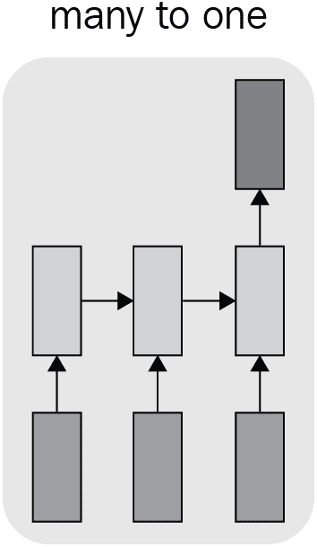

在前面的架构中，句子中的每个单词在输入框中输入一个单独的框。这确保了我们保留了输入句子的结构；比如*这个*进入第一个盒子，*是*进入第二个盒子，*安*进入第三个盒子。顶部的输出框将是输出–即*示例*。

了解了对 RNN 架构的需求后，在下一节中，让我们学习如何解释 rnn 的输出。

## 探索 RNN 的结构

你可以把 RNN 想象成一种保存记忆的机制——隐藏层包含了记忆。RNN 的展开版本如下:

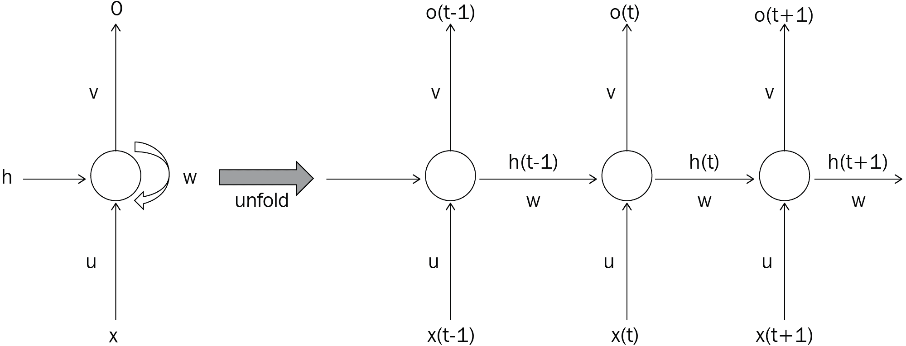

右边的网络是左边网络的展开版本。右侧的网络在每个时间步长中获取一个输入，并在每个时间步长提取输出。

请注意，在预测第三个时间步长的输出时，我们通过隐藏层合并了前两个时间步长的值，隐藏层连接了跨时间步长的值。

让我们来看看前面的图表:

*   u 权重表示连接输入层和隐藏层的权重。
*   w 权重表示隐藏层到隐藏层的连接。
*   v 权重表示隐藏层到输出层的连接。

给定时间步长中的输出取决于当前时间步长中的输入和前一时间步长中的隐藏层值。通过引入前一时间步的隐藏层作为输入，以及当前时间步的输入，我们从前一时间步获得信息。这样，我们就创建了一个支持内存存储的连接管道。

## 为什么要存储内存？

需要存储记忆，因为在前面的例子中，或者甚至在一般的文本生成中，下一个单词不仅依赖于前面的单词，而且依赖于要预测的单词前面的单词的上下文。

鉴于我们正在看前面的单词，应该有一种方法将它们保存在内存中，这样我们就可以更准确地预测下一个单词。

我们还应该把记忆整理好；通常，在预测下一个单词时，最近的单词比距离要预测的单词更远的单词更有用。

考虑多个时间步长进行预测的传统 RNN 可以如下所示:


请注意，随着时间步长的增加，出现在更早时间步长(时间步长 1)的输入对更晚时间步长(时间步长 7)的输出的影响会更小。这里可以看到一个这样的例子(暂且忽略偏置项，假设在时间步长 1 输入的隐藏层是`0`，我们预测时间步长 5 的隐藏层的值——*h[5]*):


可以看到，随着时间步长的增加，隐藏层的值(*h[5]T3)高度依赖于*X[1]if*U*>1；但是如果 *U* < 1，那么对 *X [1]* 的依赖性就小很多。**

对 *U* 矩阵的依赖还会导致隐藏层( *h* *[5]* )的值非常小，因此当 *U* 的值非常小时会导致渐变消失，当 *U* 的值非常高时会导致渐变爆炸。

当存在对预测下一个单词的长期依赖性时，前面的现象导致了一个问题。为了解决这个问题，我们将使用 LSTM 架构。

# 介绍 LSTM 建筑

在上一节中，我们了解了传统的 RNN 如何面临消失或爆炸的梯度问题，导致它无法适应长期记忆。在本节中，我们将了解如何利用 LSTM 来解决这个问题。

为了用一个例子进一步理解这个场景，让我们考虑下面的句子:

我来自英国。我讲 __ 。

在上一句中，直观地说，我们知道大多数英国人说英语。要填充的空白值(*英文*)是从这个人来自英国这一事实中获得的。虽然在这种情况下，我们的信号词(英格兰)更接近空白值，但在现实情况下，我们可能会发现信号词远离空白(我们试图预测的词)。当信号字和空白值之间的距离很大时，通过传统的 RNNs 的预测可能由于消失或爆炸梯度现象而出错。LSTM 解决了这种情况——我们将在下一节学习。

## LSTM 的工作细节

标准的 LSTM 架构如下:


在上图中，您可以看到，虽然输入 **X** 和输出 **h** 与我们在*探索 RNN* 部分的结构中看到的相似，但是在 LSTM，输入和输出之间发生的计算是不同的。让我们来理解输入和输出之间发生的各种激活:

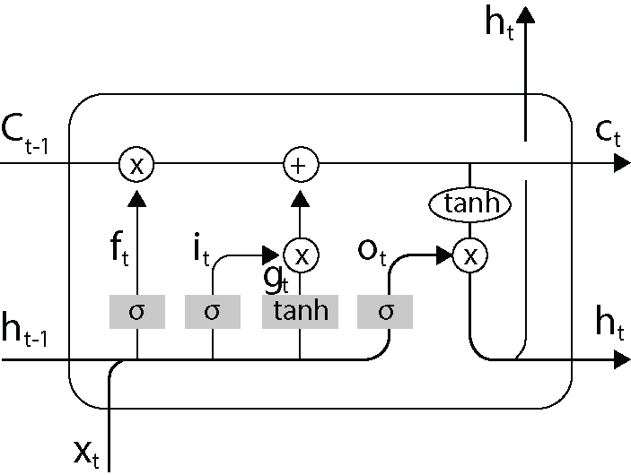

在上图中，我们可以观察到以下情况:

*   **X** 和 **h** 代表时间步 **t** 的输入和输出。
*   **C** 代表电池状态。这可能有助于储存长期记忆。

*   **C [t-1]**
*   **h**[t-1代表前一时间步的输出。]
*   **f[t]代表帮助遗忘某些信息的激活。**
*   **i [t]** 代表输入结合上一时间步的输出所对应的变换( **h [t-1]** )。

需要被遗忘的内容*f[t]如下获得:*

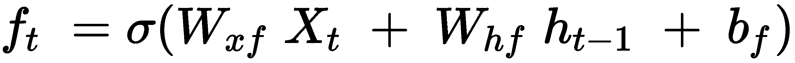

注意*W[xf]和*W[HF]分别代表与输入和前一个隐藏层相关联的权重。**

通过将来自前一时间步的单元状态*C[t-1]乘以有助于遗忘的输入内容*f[t]来更新单元状态。**

更新后的单元状态如下:

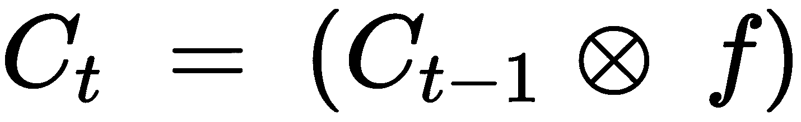

注意，在前面的步骤中，我们正在执行*C[t-1]和 *f [t]* 之间的元素到元素乘法，以获得修改后的单元格状态， *C [t]* 。*

为了理解前面的操作有什么帮助，我们来看一下输入句子:*我来自英国。我讲 __* 。

一旦我们用*英语*填补空白，我们就不再需要这个人来自英国的信息，因此应该从记忆中抹去。细胞状态和遗忘门的结合有助于实现这一点。

在下一步中，我们将包括从当前时间步长到单元状态以及输出的附加信息。通过输入激活(基于当前时间步长的输入和先前时间步长的输出)和调制门*g[t](有助于识别单元状态的更新量)更新修改后的单元状态(在忘记要忘记的内容之后)。*

输入激活的计算如下:

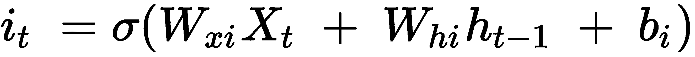

注意 *W* *[xi]* 和 *W* *[hi]* 分别代表与输入和前一个隐藏层相关联的权重。

修改门的激活计算如下:


注意 *W* *[xg]* 和 *W* *[hg]* 分别代表与输入和前一个隐藏层相关联的权重。

经修改的门可帮助隔离待更新的单元状态值而非其余的单元状态值，以及识别待完成的更新的量值。

修改后的单元状态*C[t]将传递到下一个时间步，现在如下:*


最后，我们将激活的更新单元状态( *tanh(C [t] )* )乘以激活的输出值 *O [t]* ，以获得最终输出 *h [t]* ，在时间步长 *t* :

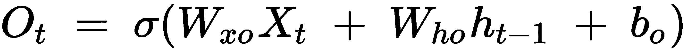


这样，我们可以利用 LSTM 中存在的各种门来选择性地记忆过长的时间步长。

## 在 PyTorch 实现 LSTM

在一个典型的文本相关练习中，每个单词都是 LSTM 的一个输入——每个时间步长一个单词。为了让 LSTM 工作，我们执行以下两个步骤:

1.  将每个单词转换成嵌入向量。
2.  将时间步长中对应于相关单词的嵌入向量作为输入传递给 LSTM。

我们先来理解一下为什么要把一个输入词转换成嵌入向量的原因。如果我们的词汇表中有 100K 个唯一的单词，我们必须在将它们传递到网络之前对它们进行一次性编码。然而，为每个单词创建一个 one-hot-encoded 向量会失去该单词的语义含义——例如，单词 *like* 和 *enjoy* 是相似的，应该具有相似的向量。为了解决这种情况，我们利用单词嵌入，这有助于自动学习单词向量表示(因为它们是网络的一部分)。单词嵌入按如下方式提取:

```py
embed = nn.Embedding(vocab_size, embed_size)
```

在前面的代码中，`nn.Embedding`方法将`vocab_size`个维度作为输入，并返回输出的`embed_size`个维度。这样，如果词汇大小是 100K，嵌入大小是 128，则 100K 个单词中的每一个都被表示为 128 维向量。进行这种练习的一个好处是，一般来说，相似的单词将具有相似的嵌入。

接下来，我们通过 LSTM 传递单词 embeddings。使用`nn.LSTM`方法在 PyTorch 中实现 LSTM，如下所示:

```py
hidden_state, cell_state = nn.LSTM(embed_size, \
                                   hidden_size, num_layers)
```

在前面的代码中，`embed_size`表示每个时间步长对应的嵌入大小，`hidden_size`对应隐藏层输出的维度，`num_layers`表示 LSTM 叠加的次数。

此外，`nn.LSTM`方法返回隐藏状态值和单元格状态值。

现在我们已经了解了 LSTM 和 RNNs 的工作细节，让我们了解在下一节中预测给定图像的字幕时，如何结合 CNN 利用它们。

# 实现图像字幕

图像字幕是指在给定图像的情况下生成字幕。在这一节中，我们将首先学习构建一个 LSTM 时要做的预处理，该库可以生成给定图像的文本字幕，然后我们将学习如何结合 CNN 和 LSTM 来执行图像字幕。在我们了解如何构建一个生成标题的系统之前，让我们先来了解一个输入和输出的例子:


在前面的例子中，图像是输入，预期的输出是图像的标题–**在这个图像中，我可以看到一些蜡烛。背景为黑色**。

我们将采取以下策略来解决这个问题:

1.  预处理输出(基本事实注释/标题),以便每个唯一的单词由一个唯一的 ID 表示。
2.  假设输出句子可以是任意长度，让我们指定一个开始和结束标记，以便模型知道何时停止生成预测。此外，确保所有输入的句子都被填充，以便所有输入都具有相同的长度。
3.  将输入影像传递给预先训练好的模型，如 VGG16、ResNet-18 等，以在拼合图层之前提取要素。
4.  使用图像的特征图和上一步中获得的文本(如果它是我们要预测的第一个单词，则是开始标记)来预测一个单词。
5.  重复前面的步骤，直到我们获得结束令牌。

既然我们已经在较高层次上理解了要做什么，那么让我们在下一节中用代码实现前面的步骤。

## 代码中的图像字幕

让我们用代码执行上一节中设计的策略:

The following code is available as `Image_captioning.ipynb` in the `Chapter15` folder of this book's GitHub repository - [https://tinyurl.com/mcvp-packt](https://tinyurl.com/mcvp-packt) The code contains URLs to download data from and is moderately lengthy. We strongly recommend you to execute the notebook in GitHub to reproduce results while you understand the steps to perform and explanation of various code components from text.

1.  从打开的图像数据集中获取数据集，该数据集包括训练图像、其注释和验证数据集:

*   导入相关的包，定义设备，并获取包含要下载的图像信息的 JSON 文件:

```py
!pip install -qU openimages torch_snippets urllib3
!wget -O open_images_train_captions.jsonl -q https://storage.googleapis.com/localized-narratives/annotations/open_images_train_v6_captions.jsonl
from torch_snippets import *
import json
device = 'cuda' if torch.cuda.is_available() else 'cpu'
```

*   遍历 JSON 文件的内容，获取前 100，000 张图像的信息:

```py
with open('open_images_train_captions.jsonl', 'r') as \
                                            json_file:
    json_list = json_file.read().split('\n')
np.random.shuffle(json_list)
data = []
N = 100000
for ix, json_str in Tqdm(enumerate(json_list), N):
    if ix == N: break
    try:
        result = json.loads(json_str)
        x = pd.DataFrame.from_dict(result, orient='index').T
        data.append(x)
    except:
        pass
```

从 JSON 文件获得的信息示例如下:

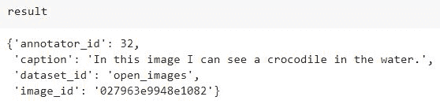

从前面的示例中，我们可以看到`caption`和`image_id`是我们将在后续步骤中使用的关键信息。`image_id`将用于获取相应的图像，而`caption`将用于关联与从给定图像 ID 获得的图像相对应的输出。

*   将数据帧(`data`)分成训练和验证数据集:

```py
np.random.seed(10)
data = pd.concat(data)
data['train'] = np.random.choice([True,False], \
                                 size=len(data),p=[0.95,0.05])
data.to_csv('data.csv', index=False)
```

*   下载与从 JSON 文件中获取的图像 id 相对应的图像:

```py
from openimages.download import _download_images_by_id
!mkdir -p train-images val-images
subset_imageIds = data[data['train']].image_id.tolist()
_download_images_by_id(subset_imageIds, 'train', \
                       './train-img/')

subset_imageIds = data[~data['train']].image_id.tolist()
_download_images_by_id(subset_imageIds, 'train', \
                       './val-img/')
```

2.  为数据帧中所有标题中出现的所有独特单词创建一个词汇表:

*   词汇对象可以将所有标题中的每个单词映射到一个唯一的整数，反之亦然。我们将利用`torchtext`库的`Field.build_vocab`功能，该功能贯穿所有单词(注释/标题)并将它们累积到两个计数器`stoi`和`itos`中，这两个计数器分别是“string to int”(一个字典)和“int to string”(一个列表):

```py
from torchtext.data import Field
from pycocotools.coco import COCO
from collections import defaultdict

captions = Field(sequential=False, init_token='<start>', \
                 eos_token='<end>')
all_captions = data[data['train']]['caption'].tolist()
all_tokens = [[w.lower() for w in c.split()] \
              for c in all_captions]
all_tokens = [w for sublist in all_tokens \
              for w in sublist]
captions.build_vocab(all_tokens)
```

在前面的代码中，`captions`的`Field`是用于在 PyTorch 中构建更复杂的 NLP 数据集的专用对象。我们不能像处理图像一样直接处理文本，因为字符串与张量是不兼容的。因此，我们需要跟踪所有唯一出现的单词(也称为标记)，这将有助于每个单词与唯一相关整数的一对一映射。例如，如果输入标题是*坐在垫子上的猫*，基于单词到整数的映射，该序列将被转换成，比如说，[5 23 24 4 29]，其中*猫*唯一地与整数 5 相关联。这种映射通常被称为词汇表，可能看起来像`{'<pad>': 0, '<unk'>: 1, '<start>': 2, '<end>': 3, 'the': 4, 'cat': 5, ...., 'on': 24, 'sat': 23, ... }`。前几个标记是为特殊功能保留的，比如填充、未知、句子的开始和句子的结束。

*   我们只需要`captions`词汇组件，所以在下面的代码中，我们创建了一个虚拟的`vocab`对象，它是轻量级的，将有一个额外的`<pad>`令牌，这是在`captions.vocab`中所缺少的:

```py
class Vocab: pass
vocab = Vocab()
captions.vocab.itos.insert(0, '<pad>')
vocab.itos = captions.vocab.itos

vocab.stoi = defaultdict(lambda: \
                         captions.vocab.itos.index('<unk>'))
vocab.stoi['<pad>'] = 0
for s,i in captions.vocab.stoi.items():
    vocab.stoi[s] = i+1
```

注意`vocab.stoi`被定义为具有默认功能的`defaultdict`。当一个键不存在时，Python 使用这个特殊的字典返回一个默认值。在我们的例子中，当我们试图调用`vocab.stoi[<new-key/word>]`时，我们将返回一个`'<unk>'`令牌。这在验证阶段非常方便，因为在验证阶段可能会有一些标记不在训练数据中。

3.  定义数据集类-`CaptioningDataset`:

*   定义`__init__`方法，其中我们提供之前获得的数据帧(`df`)、包含图像的文件夹(`root`)、`vocab`，以及图像转换管道(`self.transform`):

```py
from torchvision import transforms
class CaptioningData(Dataset):
    def __init__(self, root, df, vocab):
        self.df = df.reset_index(drop=True)
        self.root = root
        self.vocab = vocab
        self.transform = transforms.Compose([ 
            transforms.Resize(224),
            transforms.RandomCrop(224),
            transforms.RandomHorizontalFlip(), 
            transforms.ToTensor(), 
            transforms.Normalize((0.485, 0.456, 0.406), 
                                 (0.229, 0.224, 0.225))]
        )
```

*   定义`__getitem__`方法，获取图像及其相应的标题。此外，使用在上一步中构建的`vocab`将目标转换成相应的单词 id 列表:

```py
    def __getitem__(self, index):
        """Returns one data pair (image and caption)."""
        row = self.df.iloc[index].squeeze()
        id = row.image_id
        image_path = f'{self.root}/{id}.jpg'
        image = Image.open(os.path.join(image_path))\
                                  .convert('RGB')

        caption = row.caption
        tokens = str(caption).lower().split()
        target = []
        target.append(vocab.stoi['<start>'])
        target.extend([vocab.stoi[token] for token in tokens])
        target.append(vocab.stoi['<end>'])
        target = torch.Tensor(target).long()
        return image, target, caption
```

*   定义`__choose__`方法:

```py
    def choose(self):
        return self[np.random.randint(len(self))]
```

*   定义`__len__`方法:

```py
    def __len__(self):
        return len(self.df)
```

*   定义`collate_fn`方法来处理一批数据:

```py
    def collate_fn(self, data):
        data.sort(key=lambda x: len(x[1]), reverse=True)
        images, targets, captions = zip(*data)
        images = torch.stack([self.transform(image) \
                              for image in images], 0)
        lengths = [len(tar) for tar in targets]
        _targets = torch.zeros(len(captions), \
                               max(lengths)).long()
        for i, tar in enumerate(targets):
            end = lengths[i]
            _targets[i, :end] = tar[:end] 
        return images.to(device), _targets.to(device), \
    torch.tensor(lengths).long().to(device)
```

在`collate_fn`方法中，我们计算一批标题的最大长度(具有最大字数的标题),并填充该批中的其余标题，使其具有相同的长度。

4.  定义培训和验证数据集以及数据加载器:

```py
trn_ds = CaptioningData('train-images', data[data['train']], \
                        vocab)
val_ds = CaptioningData('val-images', data[~data['train']], \
                        vocab)

image, target, caption = trn_ds.choose()
show(image, title=caption, sz=5); print(target)
```

样本图像和相应的标题和标记的单词索引如下:


5.  为数据集创建数据加载器:

```py
trn_dl = DataLoader(trn_ds, 32, collate_fn=trn_ds.collate_fn)
val_dl = DataLoader(val_ds, 32, collate_fn=val_ds.collate_fn)
inspect(*next(iter(trn_dl)), names='images,targets,lengths')
```

样本批次将包含以下实体:


6.  定义网络类别:

*   定义编码器架构-`EncoderCNN`:

```py
from torch.nn.utils.rnn import pack_padded_sequence
from torchvision import models
class EncoderCNN(nn.Module):
    def __init__(self, embed_size):
        """Load the pretrained ResNet-152 and replace 
        top fc layer."""
        super(EncoderCNN, self).__init__()
        resnet = models.resnet152(pretrained=True)
        # delete the last fc layer.
        modules = list(resnet.children())[:-1] 
        self.resnet = nn.Sequential(*modules)
        self.linear = nn.Linear(resnet.fc.in_features, \
                                embed_size)
        self.bn = nn.BatchNorm1d(embed_size, \
                                 momentum=0.01)

    def forward(self, images):
        """Extract feature vectors from input images."""
        with torch.no_grad():
            features = self.resnet(images)
        features = features.reshape(features.size(0), -1)
        features = self.bn(self.linear(features))
        return features
```

在前面的代码中，我们获取预训练的 ResNet-152 模型，删除最后的`fc`层，将其连接到大小为`embed_size`的`Linear`层，然后通过批处理规范化(`bn`)传递它。

*   获取`encoder`类的摘要:

```py
encoder = EncoderCNN(256).to(device)
!pip install torch_summary
from torchsummary import summary
print(summary(encoder,torch.zeros(32,3,224,224).to(device)))
```

上述代码给出了以下输出:


*   定义解码器架构-`DecoderRNN`:

```py
class DecoderRNN(nn.Module):
    def __init__(self, embed_size, hidden_size, vocab_size, \
                 num_layers, max_seq_length=80):
        """Set the hyper-parameters and build the layers."""
        super(DecoderRNN, self).__init__()
        self.embed = nn.Embedding(vocab_size, embed_size)
        self.lstm = nn.LSTM(embed_size, hidden_size, \
                            num_layers, batch_first=True)
        self.linear = nn.Linear(hidden_size, vocab_size)
        self.max_seq_length = max_seq_length

    def forward(self, features, captions, lengths):
        """Decode image feature vectors and 
        generates captions."""
        embeddings = self.embed(captions)
        embeddings = torch.cat((features.unsqueeze(1), \
                                embeddings), 1)
        packed = pack_padded_sequence(embeddings, \
                            lengths.cpu(), batch_first=True) 
        outputs, _ = self.lstm(packed)
        outputs = self.linear(outputs[0])
        return outputs
```

在前面的解码器中，让我们了解我们正在初始化什么:

*   `self.embed`:一个`vocab x embed_size`矩阵，为每个单词创建并学习一个唯一的嵌入。
*   `self.lstm`将`CNNEncoder`的输出和前一时间步的单词输出嵌入作为输入，并返回每个时间步的隐藏状态。
*   `self.linear`将每个隐藏状态转换成一个`V`维向量，我们将使用 softmax 来获取时间步长的可能单词。

在`forward`方法中，我们看到以下内容:

1.  使用`self.embed`将标题(作为整数发送)转换成嵌入内容。
2.  来自`EncoderCNN`的`features`被连接到`embeddings`。如果每个字幕的时间步长数(在下面的例子中为 *L* )是 80，那么在拼接之后，时间步长数将是 81。请参见以下示例，了解每个时间步中的供给和预测内容:


3.  使用`pack_padded_sequences`，级联的嵌入被打包到一个数据结构中，该数据结构通过不在填充出现的时间步长展开而使 RNN 计算更有效。直观的解释见下图:

*   在下图中，我们有三个句子，它们用相应的单词索引进行编码。字索引`0`表示填充索引。打包后，批次大小为最后一个索引中的`1`,因为只有一个句子中的最后一个索引不是填充索引:


*   打包的填充现在被传递给 LSTM，如下所示:

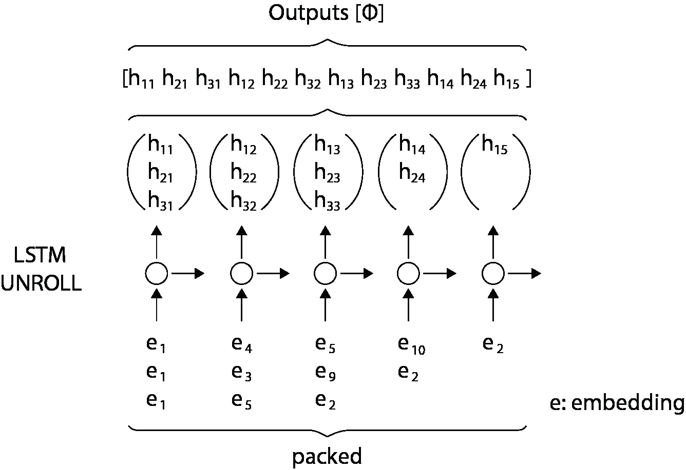

代码中上一个示例的对应行是`outputs, _ = self.lstm(packed)`。最后，LSTM 的输出通过线性层发送，因此维数从 512 变为 vocab 大小。

我们还将向 RNN 添加一个`predict`方法，该方法接受来自`EncoderCNN`的特性并返回每个特性的预期令牌。我们将在训练后使用它来获取图像的标题:

```py
    def predict(self, features, states=None):
        """Generate captions for given image 
        features using greedy search."""
        sampled_ids = []
        inputs = features.unsqueeze(1)
        for i in range(self.max_seq_length):
            hiddens, states = self.lstm(inputs, states) 
            # hiddens: (batch_size, 1, hidden_size)
            outputs = self.linear(hiddens.squeeze(1)) 
            # outputs: (batch_size, vocab_size)
            _, predicted = outputs.max(1) 
            # predicted: (batch_size)
            sampled_ids.append(predicted)
            inputs = self.embed(predicted) 
            # inputs: (batch_size, embed_size)
            inputs = inputs.unsqueeze(1) 
            # inputs: (batch_size, 1, embed_size)

        sampled_ids = torch.stack(sampled_ids, 1) 
        # sampled_ids: (batch_size, max_seq_length)
        # convert predicted tokens to strings
        sentences = []
        for sampled_id in sampled_ids:
            sampled_id = sampled_id.cpu().numpy()
            sampled_caption = []
            for word_id in sampled_id:
                word = vocab.itos[word_id]
                sampled_caption.append(word)
                if word == '<end>':
                    break
            sentence = ' '.join(sampled_caption)
            sentences.append(sentence)
        return sentences
```

7.  定义对一批数据进行训练的函数:

```py
def train_batch(data, encoder, decoder, optimizer, criterion):
    encoder.train()
    decoder.train()
    images, captions, lengths = data
    images = images.to(device)
    captions = captions.to(device)
    targets = pack_padded_sequence(captions, lengths.cpu(), \
                                   batch_first=True)[0]
    features = encoder(images)
    outputs = decoder(features, captions, lengths)
    loss = criterion(outputs, targets)
    decoder.zero_grad()
    encoder.zero_grad()
    loss.backward()
    optimizer.step()
    return loss
```

请注意，我们由此创建了一个名为`targets`的张量，它将项目打包到一个向量中。正如您在前面的图表中所知道的，`pack_padded_sequence`有助于以这样一种方式打包预测，即更容易在输出中调用带有打包的`target`值的`nn.CrossEntropyLoss`。

8.  定义要对一批数据进行验证的函数:

```py
@torch.no_grad()
def validate_batch(data, encoder, decoder, criterion):
    encoder.eval()
    decoder.eval()
    images, captions, lengths = data
    images = images.to(device)
    captions = captions.to(device)
    targets = pack_padded_sequence(captions, lengths.cpu(), \
                                   batch_first=True)[0]
    features = encoder(images)
    outputs = decoder(features, captions, lengths)
    loss = criterion(outputs, targets)
    return loss
```

9.  定义模型对象和损失函数，以及优化器:

```py
encoder = EncoderCNN(256).to(device)
decoder = DecoderRNN(256, 512, len(vocab.itos), 1).to(device)
criterion = nn.CrossEntropyLoss()
params = list(decoder.parameters()) + \
         list(encoder.linear.parameters()) + \
         list(encoder.bn.parameters())
optimizer = torch.optim.AdamW(params, lr=1e-3)
n_epochs = 10
log = Report(n_epochs)
```

10.  在不断增加的时期内训练模型:

```py
for epoch in range(n_epochs):
    if epoch == 5: optimizer = torch.optim.AdamW(params, \
                                                 lr=1e-4)
    N = len(trn_dl)
    for i, data in enumerate(trn_dl):
        trn_loss = train_batch(data, encoder, decoder, \
                               optimizer, criterion)
        pos = epoch + (1+i)/N
        log.record(pos=pos, trn_loss=trn_loss, end='\r')

    N = len(val_dl)
    for i, data in enumerate(val_dl):
        val_loss = validate_batch(data, encoder, decoder, \
                                  criterion)
        pos = epoch + (1+i)/N
        log.record(pos=pos, val_loss=val_loss, end='\r')
```

```py
    log.report_avgs(epoch+1)

log.plot_epochs(log=True)
```

前面的代码生成了在增加的时期内训练和验证损失的变化的输出:

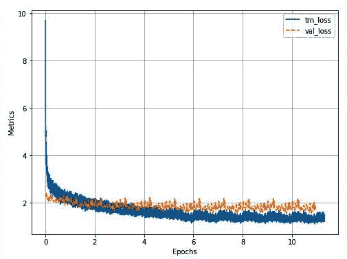

11.  定义一个在给定图像的情况下生成预测的函数:

```py
def load_image(image_path, transform=None):
    image = Image.open(image_path).convert('RGB')
    image = image.resize([224, 224], Image.LANCZOS)
    if transform is not None:
        tfm_image = transform(image)[None]
    return image, tfm_image

def load_image_and_predict(image_path):
    transform = transforms.Compose([
                    transforms.ToTensor(), 
                    transforms.Normalize(\
                        (0.485, 0.456, 0.406), 
                        (0.229, 0.224, 0.225))
                    ])
    org_image, tfm_image = load_image(image_path, transform)
    image_tensor = tfm_image.to(device)
    encoder.eval()
    decoder.eval()
    feature = encoder(image_tensor)
    sentence = decoder.predict(feature)[0]
    show(org_image, title=sentence)
    return sentence

files = Glob('val-images')
load_image_and_predict(choose(files))
```

前述生成给定图像的预测:

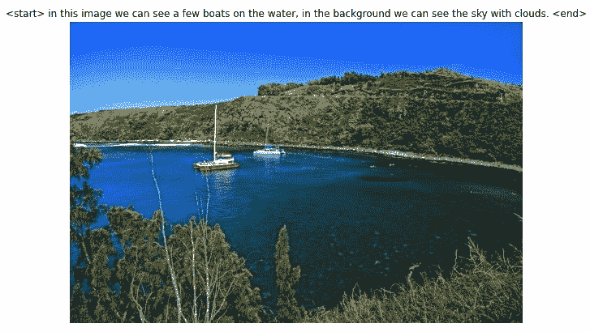

从前面的例子中，我们可以看到，给定一幅图像(在前面的例子中显示为标题)，我们可以生成合理的标题。

在本节中，我们学习了如何利用 CNN 和 RNN 一起生成字幕。在下一节中，我们将了解如何使用 CNN、RNNs 和 CTC 损失函数来转录包含手写单词的图像。

# 抄写手写图像

在上一节中，我们学习了从输入图像中生成单词序列。在这一节中，我们将学习用图像作为输入来生成字符序列。此外，我们将了解 CTC 损失功能，这有助于抄录手写图像。

在我们了解 CTC 损失函数之前，让我们了解一下为什么我们在图像字幕部分看到的架构可能不适用于手写转录。在图像字幕中，图像中的内容和输出单词之间没有直接的关联，而在手写图像中，图像中出现的字符序列和输出序列之间有直接的关联。因此，我们将遵循与上一节中设计的不同的架构。

此外，假设一幅图像被分成 20 个部分(假设一幅图像中每个单词最多 20 个字符)，其中每个部分对应一个字符。一个人的笔迹可能确保每个字符完全适合一个框，而另一个人的笔迹可能被混淆，使得每个框包含两个字符，而另一个人的笔迹中两个字符之间的间隔太大，以至于不可能将一个单词适合 20 个时间步长(部分)。这需要一种不同的方法来解决这个问题，即利用 CTC 丢失功能，我们将在下一节了解这一点。

## CTC 丢失的工作细节

想象一个场景，我们正在转录一个包含单词 *ab* 的图像。无论我们选择以下三个图像中的哪一个，图像看起来都像下面的任何一个，并且输出总是 *ab* :


在下一步中，我们将前面的三个示例分成六个时间步长，如下所示(其中每个方框代表一个时间步长):

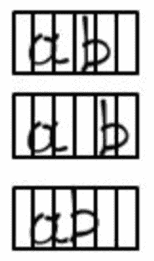

现在，我们将预测每个时间步中的输出字符——其中输出是词汇中出现单词的概率的软最大值。假设我们正在执行 softmax，假设通过我们的模型(我们将在后续部分中定义)运行图像后，每个时间步的输出字符如下所示(图像上方提供了每个单元的输出):


请注意，`*-*`表示在相应的时间步长中不存在任何东西。此外，注意字符 *b* 在两个不同的时间步长中重复出现。

在最后一步中，我们将压缩输出(一个字符序列),这是通过将我们的图像传递到模型中获得的，其方式是将连续的重复字符压缩成一个字符。

如果存在连续的相同字符预测，则压缩重复字符输出的前一步骤会产生如下最终输出:

-a-b-

在另一种情况下，当输出为 *abb* 时，预计最终输出压缩后在两个 *b* 字符之间有一个分隔符，示例如下:

-a-b-b-

现在我们已经了解了输入和输出值的概念，在下一节中，让我们了解如何计算 CTC 损失值。

## 计算 CTC 损失值

对于我们在上一节中解决的问题，让我们考虑以下场景——在下图的圆圈中提供了角色在给定时间步长中的概率(注意，在从 *t0* 到 *t5* 的每个时间步长中，概率加起来为 1):

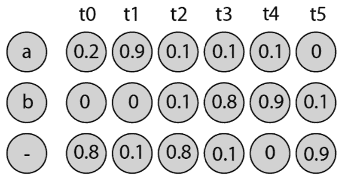

然而，为了使计算简单，为了让我们理解 CTC 损失值是如何计算的，让我们假设图像只包含字符 *a* 而不包含单词 *ab* 的场景。此外，为了简化计算，我们假设只有**三个时间步长**:

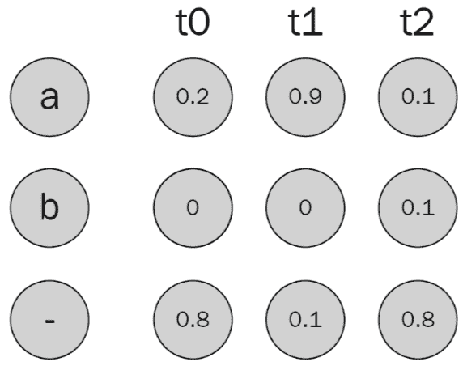

如果每个时间步中的 softmax 是以下七种情况中的任何一种，我们可以获得 *a* 的地面真值:

| **每个时间步的输出** | **Prob。t 中的人物[0]** | **Prob。中的人物 t[1]** | **Prob。中的人物 t[2]** | **组合概率** | **最终概率** |
| ［构成动植物的古名或拉丁化的现代名］ | Zero point eight | Zero point one | Zero point one | 0.8 x 0.1 x 0.1 | Zero point zero zero eight |
| -aa | Zero point eight | Zero point nine | Zero point one | 0.8 x 0.9 x 0.1 | Zero point zero seven two |
| 美国汽车协会 | Zero point two | Zero point nine | Zero point one | 0.2 x 0.9 x 0.1 | Zero point zero one eight |
| -一个- | Zero point eight | Zero point nine | Zero point eight | 0.8 x 0.9 x 0.8 | Zero point five seven six |
| -aa | Zero point eight | Zero point nine | Zero point one | 0.8 x 0.9 x 0.1 | Zero point zero seven two |
| 表示“不” | Zero point two | Zero point one | Zero point eight | 0.2 x 0.1 x 0.8 | Zero point zero one six |
| aa- | Zero point two | Zero point nine | Zero point eight | 0.2 x 0.9 x 0.8 | Zero point one four four |
|  |  |  |  | **总概率** | Zero point nine zero six |

从前面的结果可以看出，获得地面真值的总体概率为 0.906。

0.094 的其余部分对应于结果未获得地面真相的概率。

让我们来计算所有可能的地真理之和对应的二元交叉熵损失。

CTC 损失是导致地面实况= -log(0.906) = 0.1 的组合的总体概率总和的负对数。

既然我们已经了解了 CTC 损失是如何计算的，那么让我们在下一节中实现这一知识，同时构建一个从图像进行手写转录的模型。

## 代码中的手写转录

我们将采用以下策略来编码一个可以转录手写单词图像内容的网络:

1.  导入图像数据集及其相应的转录。
2.  给每个字符一个索引。
3.  通过卷积网络传递图像以获取对应于图像的特征图。
4.  通过 RNN 传递特征地图。
5.  获取每个时间步中的概率。
6.  利用 CTC 损失功能压缩输出，并提供转录和相应的损失。
7.  通过最小化 CTC 损失函数来优化网络的权重。

让我们用代码执行前面的策略:

The following code is available as `Handwriting_transcription.ipynb` in the `Chapter15` folder of this book's GitHub repository - [https://tinyurl.com/mcvp-packt](https://tinyurl.com/mcvp-packt).

1.  下载并导入图像数据集:

```py
!wget https://www.dropbox.com/s/l2ul3upj7dkv4ou/synthetic-data.zip
!unzip -qq synthetic-data.zip
```

在前面的代码中，我们已经下载了提供图像的数据集，并且图像的文件名包含对应于该图像的转录的基本事实。

下载的图像示例如下:

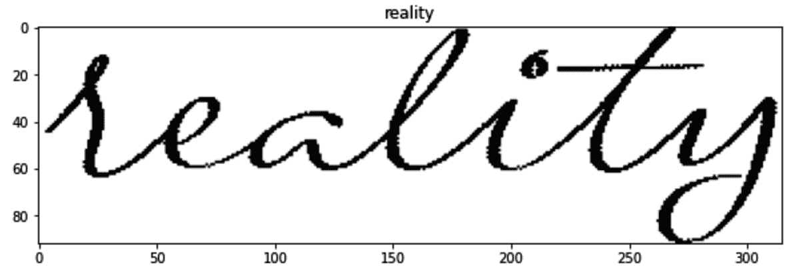

2.  安装所需的软件包并导入它们:

```py
!pip install torch_snippets torch_summary editdistance
```

*   导入包:

```py
from torch_snippets import *
from torchsummary import summary
import editdistance
```

3.  指定图像的位置和从图像中提取地面实况的功能:

```py
device = 'cuda' if torch.cuda.is_available() else 'cpu'
fname2label = lambda fname: stem(fname).split('@')[0]
images = Glob('synthetic-data')
```

请注意，我们正在创建`fname2label`函数，因为在文件名中的`@`符号之后可以获得图像的基本事实。文件名示例如下:


4.  定义字符的词汇量(`vocab`)、批量大小(`B`)、RNN 的时间步长(`T`)、词汇量的长度(`V`)、图像的高度(`H`)和宽度(`W`):

```py
vocab='QWERTYUIOPASDFGHJKLZXCVBNMqwertyuiopasdfghjklzxcvbnm'
B,T,V = 64, 32, len(vocab) 
H,W = 32, 128 
```

5.  定义`OCRDataset`数据集类:

*   定义`__init__`方法，通过循环`vocab`指定字符到字符 ID 的映射(`charList`)和反过来的映射(`invCharList`)，以及时间步数(`timesteps`)和要提取的图像的文件路径(`items`)。我们在这里使用`charList`和`invCharList`而不是`torchtext`的`build` vocab，因为词汇表更容易处理(包含更少数量的不同字符):

```py
class OCRDataset(Dataset):
    def __init__(self, items, vocab=vocab, \
                 preprocess_shape=(H,W), timesteps=T):
        super().__init__()
        self.items = items
        self.charList = {ix+1:ch for ix,ch \
                         in enumerate(vocab)}
        self.charList.update({0: '`'})
        self.invCharList = {v:k for k,v in \
                            self.charList.items()}
        self.ts = timesteps
```

*   定义`__len__` 和 **`__getitem__`** 的方法:

```py
    def __len__(self):
        return len(self.items)
    def sample(self):
        return self[randint(len(self))]
    def __getitem__(self, ix):
        item = self.items[ix]
        image = cv2.imread(item, 0)
        label = fname2label(item)
        return image, label
```

注意，在 **`__getitem__`** 方法中，我们使用前面定义的`fname2label`读取图像并创建标签。
此外，我们正在定义一个`sample`方法，帮助我们从数据集中随机抽取图像。

*   定义`collate_fn`方法，该方法获取一批图像，并将它们和它们的标签添加到不同的列表中。此外，它将对应于图像的地面实况的字符转换为其矢量格式(将每个字符转换为其对应的 ID ),最后，存储每个图像的标签长度和输入长度(总是时间步长的数量)。CTC 损耗函数在计算损耗值时利用标签长度和输入长度:

```py
    def collate_fn(self, batch):
        images, labels, label_lengths = [], [], []
        label_vectors, input_lengths = [], []
        for image, label in batch:
            images.append(torch.Tensor(self.\
                                preprocess(image))[None,None])
            label_lengths.append(len(label))
            labels.append(label)
            label_vectors.append(self.str2vec(label))
            input_lengths.append(self.ts)
```

*   将前面的每个列表转换成一个 Torch 张量对象，并返回`images`、`labels`、`label_lengths`、`label_vectors`和`input_lengths`:

```py
        images = torch.cat(images).float().to(device)
        label_lengths = torch.Tensor(label_lengths)\
                             .long().to(device)
        label_vectors = torch.Tensor(label_vectors)\
                             .long().to(device)
        input_lengths = torch.Tensor(input_lengths)\
                             .long().to(device)
        return images, label_vectors, label_lengths, \
                input_lengths, labels
```

*   定义`str2vec`函数，它将字符 id 的输入转换成一个字符串:

```py
    def str2vec(self, string, pad=True):
        string = ''.join([s for s in string if \
                          s in self.invCharList])
        val = list(map(lambda x: self.invCharList[x], \
                       string)) 
        if pad:
            while len(val) < self.ts:
                val.append(0)
        return val
```

在`str2vec`函数中，如果标签的长度(`len(val)`)小于时间步长的数量(`self.ts`)，我们从一串字符 id 中提取字符，并向向量添加填充索引`0`。

*   定义`preprocess`函数，该函数将一幅图像(`img`和`shape`作为输入，将其处理成一致的 32 x 128 的形状。注意，除了调整图像大小之外，还要进行额外的预处理，因为要在保持纵横比的同时调整图像大小。

定义`preprocess`函数和图像的目标形状，该图像目前被初始化为空白图像(白色图像–`target`):

```py
    def preprocess(self, img, shape=(32,128)):
        target = np.ones(shape)*255
```

获取图像的形状和预期形状:

```py
        try:
            H, W = shape
            h, w = img.shape
```

计算如何调整图像大小以保持纵横比:

```py
            fx = H/h
            fy = W/w
            f = min(fx, fy)
            _h = int(h*f)
            _w = int(w*f)
```

调整图像大小，并将其存储在前面定义的目标变量中:

```py
            _img = cv2.resize(img, (_w,_h))
            target[:_h,:_w] = _img
```

返回标准化的图像(我们首先将图像转换为黑色背景，然后将像素缩放到 0 到 1 之间的值):

```py
        except:
            ...
        return (255-target)/255
```

*   定义`decoder_chars`函数将预测解码成单词:

```py
    def decoder_chars(self, pred):
        decoded = ""
        last = ""
        pred = pred.cpu().detach().numpy()
        for i in range(len(pred)):
            k = np.argmax(pred[i])
            if k > 0 and self.charList[k] != last:
                last = self.charList[k]
                decoded = decoded + last
            elif k > 0 and self.charList[k] == last:
                continue
            else:
                last = ""
        return decoded.replace(" "," ")
```

在前面的代码中，我们一次循环一个时间步长的预测(`pred`)，获取具有最高置信度的字符(`k`)，将其与前一个时间步长中具有最高置信度的字符(`last`)进行比较，如果前一个时间步长中具有最高置信度的字符与当前时间步长中具有最高置信度的字符不同(相当于挤压，我们在“CTC 损失函数”一节中对此进行了讨论)，则将该字符追加到目前为止的`decoded`字符。

*   定义计算字符和单词准确性的方法:

```py
    def wer(self, preds, labels):
        c = 0
        for p, l in zip(preds, labels):
            c += p.lower().strip() != l.lower().strip()
        return round(c/len(preds), 4)
    def cer(self, preds, labels):
        c, d = [], []
        for p, l in zip(preds, labels):
            c.append(editdistance.eval(p, l) / len(l))
        return round(np.mean(c), 4)
```

*   定义一种在一组图像上评估模型并返回单词和字符错误率的方法:

```py
    def evaluate(self, model, ims, labels, lower=False):
        model.eval()
        preds = model(ims).permute(1,0,2) # B, T, V+1
        preds = [self.decoder_chars(pred) for pred in preds]
        return {'char-error-rate': self.cer(preds, labels), \
                'word-error-rate': self.wer(preds, labels), \
                'char-accuracy': 1-self.cer(preds, labels), \
                'word-accuracy' : 1-self.wer(preds, labels)}
```

在前面的代码中，我们对输入图像的通道进行了置换，以便按照模型的预期对数据进行预处理，使用`decoder_chars`函数对预测进行解码，然后返回字符错误率、单词错误率及其相应的准确性。

6.  指定训练和验证数据集以及数据加载器:

```py
from sklearn.model_selection import train_test_split
trn_items,val_items=train_test_split(Glob('synthetic-data'), \
                              test_size=0.2, random_state=22)
trn_ds = OCRDataset(trn_items)
val_ds = OCRDataset(val_items)

trn_dl = DataLoader(trn_ds, batch_size=B, \
                    collate_fn=trn_ds.collate_fn, \
                    drop_last=True, shuffle=True)
val_dl = DataLoader(val_ds, batch_size=B, \
                collate_fn=val_ds.collate_fn, drop_last=True)
```

7.  构建网络架构:

*   构建 CNN 的基本模块:

```py
from torch_snippets import Reshape, Permute
class BasicBlock(nn.Module):
    def __init__(self, ni, no, ks=3, st=1, \
                 padding=1, pool=2, drop=0.2):
        super().__init__()
        self.ks = ks
        self.block = nn.Sequential(
            nn.Conv2d(ni, no, kernel_size=ks, \
                      stride=st, padding=padding),
            nn.BatchNorm2d(no, momentum=0.3),
            nn.ReLU(inplace=True),
            nn.MaxPool2d(pool),
            nn.Dropout2d(drop)
        )
    def forward(self, x):
        return self.block(x)
```

*   构建神经网络类 OCR，其具有分别在`self.model`和`self.rnn`中的`__init__`方法中定义的 CNN 块和 RNN 块。接下来，我们定义`self.classification`层，它获取 RNN 的输出，并在通过密集层处理 RNN 输出后，将其传递给 softmax 激活:

```py
class Ocr(nn.Module):
    def __init__(self, vocab):
        super().__init__()
        self.model = nn.Sequential(
                    BasicBlock( 1, 128),
                    BasicBlock(128, 128),
                    BasicBlock(128, 256, pool=(4,2)),
                    Reshape(-1, 256, 32),
                    Permute(2, 0, 1) # T, B, D
                )
        self.rnn = nn.Sequential(
            nn.LSTM(256, 256, num_layers=2, \
                    dropout=0.2, bidirectional=True),
        )
        self.classification = nn.Sequential(
            nn.Linear(512, vocab+1),
            nn.LogSoftmax(-1),
        )
```

*   定义`forward`方法:

```py
    def forward(self, x):
        x = self.model(x)
        x, lstm_states = self.rnn(x)
        y = self.classification(x)
        return y
```

在前面的代码中，我们在第一步中获取 CNN 输出，然后通过 RNN 获取`lstm_states`和 RNN 输出`x`，最后通过分类层(`self.classification`)传递输出并返回。

*   定义 CTC 损失函数:

```py
def ctc(log_probs, target, input_lengths, \
        target_lengths, blank=0):
    loss = nn.CTCLoss(blank=blank, zero_infinity=True)
    ctc_loss = loss(log_probs, target, \
                    input_lengths, target_lengths)
    return ctc_loss
```

在前面的代码中，我们利用`nn.CTCLoss`方法来最小化`ctc_loss`，它将置信度矩阵、`log_probs`(每个时间步中的预测)、`target`(基本事实)、`input_lengths`和`target_lengths`作为输入来返回`ctc_loss`值。

*   获取已定义模型的概要:

```py
model = Ocr(len(vocab)).to(device)
summary(model, torch.zeros((1,1,32,128)).to(device))
```

上述代码会产生以下输出:


注意，输出有 53 个概率与批中的每个图像相关联，因为有 53 个字符的词汇表(26 x 2 = 52 个字母和分隔符)。

8.  定义对一批数据进行训练的函数:

```py
def train_batch(data, model, optimizer, criterion):
    model.train()
    imgs, targets, label_lens, input_lens, labels = data
    optimizer.zero_grad()
    preds = model(imgs)
    loss = criterion(preds, targets, input_lens, label_lens)
    loss.backward()
    optimizer.step()
    results = trn_ds.evaluate(model, imgs.to(device),labels)
    return loss, results
```

9.  定义要对一批数据进行验证的函数:

```py
@torch.no_grad()
def validate_batch(data, model):
    model.eval()
    imgs, targets, label_lens, input_lens, labels = data
    preds = model(imgs)
    loss = criterion(preds, targets, input_lens, label_lens)
    return loss, val_ds.evaluate(model, imgs.to(device), \
                                 labels)
```

10.  定义模型对象、优化器、损失函数和时期数:

```py
model = Ocr(len(vocab)).to(device)
criterion = ctc

optimizer = optim.AdamW(model.parameters(), lr=3e-3)

n_epochs = 50
log = Report(n_epochs)
```

11.  在不断增加的时期内运行模型:

```py
for ep in range( n_epochs):
    N = len(trn_dl)
    for ix, data in enumerate(trn_dl):
        pos = ep + (ix+1)/N
        loss, results = train_batch(data, model, optimizer, \
                                    criterion)
        ca, wa = results['char-accuracy'], \
                 results['word-accuracy']
        log.record(pos=pos, trn_loss=loss, trn_char_acc=ca, \
                   trn_word_acc=wa, end='\r')
    val_results = []
    N = len(val_dl)
    for ix, data in enumerate(val_dl):
        pos = ep + (ix+1)/N
        loss, results = validate_batch(data, model)
        ca, wa = results['char-accuracy'], \
                 results['word-accuracy']
        log.record(pos=pos, val_loss=loss, val_char_acc=ca, \
                   val_word_acc=wa, end='\r')

    log.report_avgs(ep+1)
    print()
    for jx in range(5):
        img, label = val_ds.sample()
        _img=torch.Tensor(val_ds.preprocess(img)[None,None])\
                                  .to(device)
        pred = model(_img)[:,0,:]
        pred = trn_ds.decoder_chars(pred)
        print(f'Pred: `{pred}` :: Truth: `{label}`')
    print()
```

上述代码会产生以下输出:

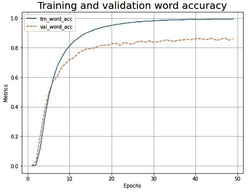

从图表中，我们可以看到，该模型在验证数据集上的单词准确率约为 80%。

此外，训练结束时的预测如下:

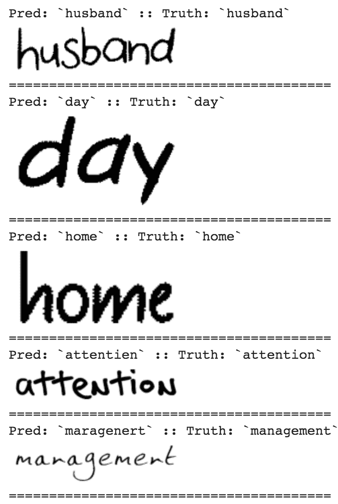

到目前为止，我们已经学习了如何结合使用 CNN 和 rnn。在下一节中，我们将了解如何利用 transformer 架构对我们在前面章节中处理过的卡车和公交车数据集执行对象检测。

# 使用 DETR 的目标检测

在前面关于对象检测的章节中，我们学习了利用锚盒/区域提议来执行对象分类和检测。然而，它涉及一系列步骤来实现对象检测。DETR 是一种利用转换器来提供端到端管道的技术，可以大大简化对象检测网络架构。转换器是在 NLP 中执行各种任务的最流行和最新的技术之一。在这一节中，我们将学习转换器 DETR 的工作细节，并编写代码来执行我们检测卡车和公共汽车的任务。

## 转换器的工作细节

转换器已被证明是解决序列间问题的出色架构。截至撰写本书时，几乎所有的 NLP 任务都有来自 transformers 的最先进的实现。这类网络仅使用线性层和 softmax 来创建**自我关注**(这将在下一小节中详细解释)。自我注意有助于识别输入文本中单词之间的相互依赖性。输入序列通常不超过 2，048 项，因为这对文本应用程序来说已经足够大了。然而，如果图像要与 transformers 一起使用，它们必须被展平，这将产生数千/数百万像素量级的序列(因为 300 x 300 x 3 图像将包含 270K 像素)，这是不可行的。脸书研究公司想出了一种绕过这种限制的新方法，将特征图(比输入图像小)作为输入输入到转换器。这一节先了解转换器的基础知识，后面再了解相关的代码块。

### 转换器基础

转换器的核心是**自我关注**模块。它以三个二维矩阵(称为**查询** ( **Q** )、**键** ( **K** )、**值** ( **V** )矩阵)作为输入。矩阵可以具有非常大的嵌入大小(因为它们将包含文本大小 x 嵌入大小的值的数量)，所以在遍历 scaled-dot-product-attention(下图中的步骤 2)之前，首先将它们拆分成较小的组件(下图中的步骤 1)。

让我们来理解自我关注是如何工作的。在序列长度为 3 的假设场景中，我们有三个字嵌入( *W [1]* 、 *W [2]* 和 *W [3]* )作为输入。假设每个嵌入的大小为 512。这些嵌入中的每一个都被单独转换成三个附加向量，它们是对应于每个输入的查询、键和值向量:

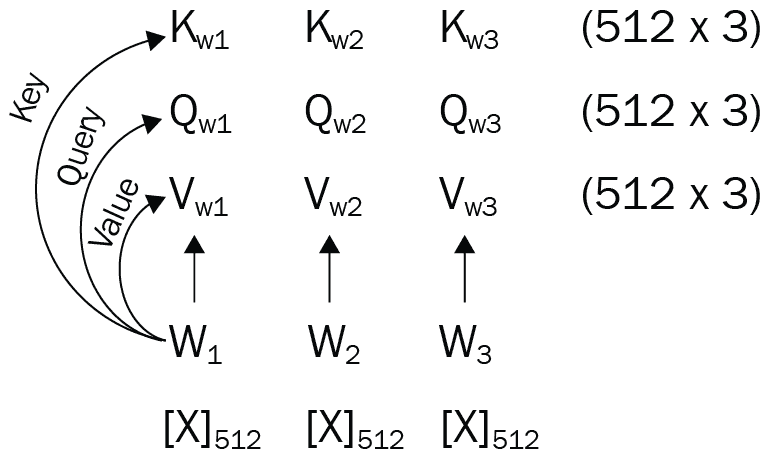

因为每个向量的大小是 512，所以在它们之间进行矩阵乘法在计算上是昂贵的。因此，我们将这些向量中的每一个分成八个部分，对于键、查询和值张量中的每一个有八组(64×3)向量，其中 64 是从 512(嵌入大小)/ 8(多头)获得的，3 是序列长度:

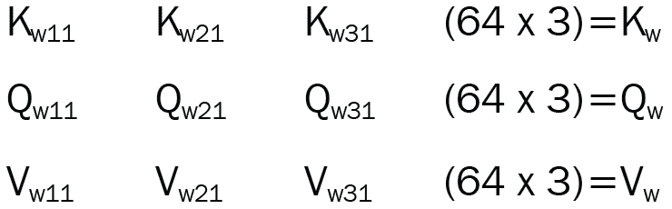

注意会有八组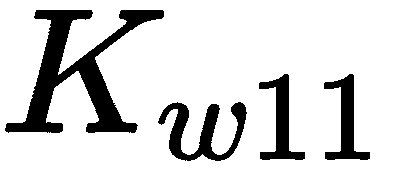、等张量，因为有八个多头。

在每一部分中，我们首先执行键矩阵和查询矩阵之间的矩阵乘法。这样，我们最终得到一个 3 x 3 的矩阵。让它通过 softmax 激活。现在，我们有一个矩阵来显示每个单词相对于其他单词的重要性:


最后，我们执行前面的张量输出与值张量的矩阵乘法，以获得我们的自我注意操作的输出:

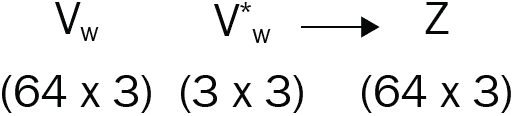

然后，我们组合这一步的八个输出，使用 concat layer 返回(下图中的步骤 3)，最终得到一个大小为 512 x 3 的张量。由于 Q、K、V 矩阵的分裂，该层也被称为**多头自关注**(来源:【https://arxiv.org/pdf/1706.03762.pdf】T2):


这样一个看起来复杂的网络背后的想法如下:

*   **值** ( **对**)是在键和查询矩阵的上下文中，对于给定的输入需要学习的处理过的嵌入。
*   **查询** ( **Qs** )和**键** ( **Ks** )的作用方式是，它们的组合将创建正确的掩码，以便仅将值矩阵的重要部分提供给下一层。

对于我们在计算机视觉中的例子，当搜索一个对象(比如一匹马)时，查询应该包含搜索一个大尺寸并且通常是棕色、黑色或白色的对象的信息。比例点积注意力的 softmax 输出将反映图像中包含该颜色(棕色、黑色、白色等)的按键矩阵部分。因此，从自我关注层输出的值将具有图像中大致具有期望颜色的那些部分，并且存在于值矩阵中。

我们在网络中多次使用自我关注模块，如下图所示。转换器网络包含一个编码网络(图的左边部分)，其输入是源序列。编码部分的输出用作解码部分的密钥和查询输入，而值输入将由神经网络独立于编码部分进行学习(来源:[https://arxiv.org/pdf/1706.03762.pdf](https://arxiv.org/pdf/1706.03762.pdf)):

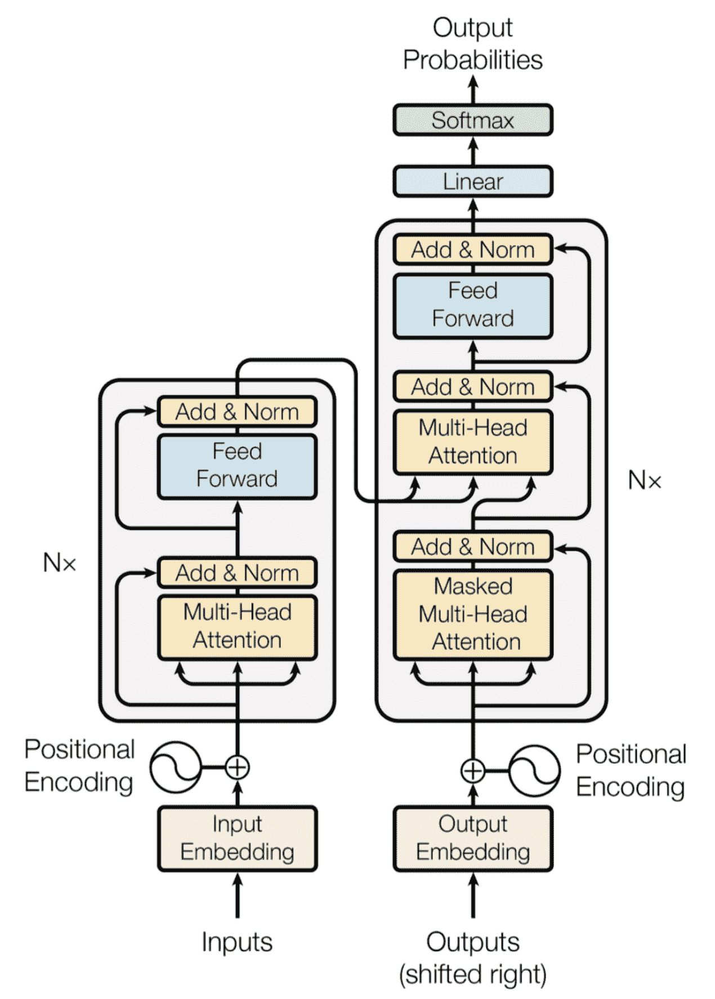

最后，尽管这是一个输入序列，但没有迹象表明哪个标记(单词)是第一个，哪个是下一个(因为线性图层没有位置指示)。位置编码是可学习的嵌入(有时是硬编码的向量),我们根据它在序列中的位置将其添加到每个输入中。这样做是为了使网络了解哪个单词嵌入是序列中的第一个，哪个是第二个，等等。

在 PyTorch 中创建转换器网络的方法非常简单。您可以创建一个内置的转换器块，如下所示:

```py
from torch import nn
transformer = nn.Transformer(hidden_dim, nheads, \
                        num_encoder_layers, num_decoder_layers)
```

这里，`hidden_dim`是嵌入的大小，`nheads`是多头自关注中的头数，`num_encoder_layers`和`num_decoder_layers`分别是网络中的编码和解码块数。

## DETR 的工作细节

普通的转换器网络和 DETR 没有什么关键区别。首先，我们的输入是图像，而不是序列。因此，DETR 通过 ResNet 主干传递图像，以获得大小为 256 的向量，然后可以将该向量视为一个序列。在我们的例子中，解码器的输入是对象查询嵌入，它是在训练过程中自动学习的。这些充当所有解码器层的查询矩阵。类似地，对于每一层，键和查询矩阵将成为编码器块的最终输出矩阵，复制两次。转换器的最终输出将是一个`Batch_Size` x 100 x `Embedding_Size`张量，其中模型已经用`100`作为序列长度进行了训练；也就是说，它学习了 100 个对象查询嵌入，并为每个图像返回 100 个向量，指示是否存在对象。这些 100 x `Embedding_Size`矩阵被分别馈送到对象分类模块和对象回归模块，它们分别独立地预测是否有对象(以及它是什么)和边界框坐标是什么。这两个模块都是简单的`nn.Linear`层。

在高层次上，DETR 的架构如下(来源:[https://arxiv.org/pdf/2005.12872.pdf](https://arxiv.org/pdf/2005.12872.pdf)):

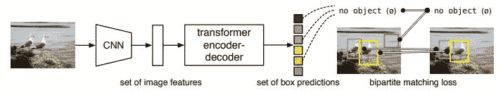

DETR 的一个较小变体的定义如下:

*   创建 DETR 模型类:

```py
from collections import OrderedDict
class DETR(nn.Module):
    def __init__(self,num_classes,hidden_dim=256,nheads=8, \
                 num_encoder_layers=6, num_decoder_layers=6):
        super().__init__()
        self.backbone = resnet50()
```

*   我们将只从 ResNet 中提取几层，并丢弃其余的层。这几层包含以下列表中给出的名称:

```py
        layers = OrderedDict()
        for name,module in self.backbone.named_modules():
            if name in ['conv1','bn1','relu','maxpool', \
                    'layer1','layer2','layer3','layer4']:
                layers[name] = module
        self.backbone = nn.Sequential(layers)
        self.conv = nn.Conv2d(2048, hidden_dim, 1)
        self.transformer = nn.Transformer(\
                            hidden_dim, nheads, \
                            num_encoder_layers, \
                            num_decoder_layers)
        self.linear_class = nn.Linear(hidden_dim, \
                                      num_classes + 1)
        self.linear_bbox = nn.Linear(hidden_dim, 4)
```

在前面的代码中，我们指定了以下内容:

*   感兴趣的层按顺序排列(`self.backbone`)
*   卷积运算(`self.conv`)
*   转换器座(`self.transformer`)
*   最终连接获得的类数(`self.linear_class`)
*   边界框(`self.linear_box`)

*   定义编码器和解码器层的位置嵌入:

```py
        self.query_pos = nn.Parameter(torch.rand(100, \
                                            hidden_dim))
        self.row_embed = nn.Parameter(torch.rand(50, \
                                            hidden_dim // 2))
        self.col_embed = nn.Parameter(torch.rand(50, \
                                            hidden_dim // 2))
```

`self.query_pos`是解码器层的位置嵌入输入，而`self.row_embed`和`self.col_embed`形成编码器层的二维位置嵌入。

*   定义`forward`方法:

```py
    def forward(self, inputs):
        x = self.backbone(inputs)
        h = self.conv(x)
        H, W = h.shape[-2:]
 '''Below operation is rearranging the positional 
 embedding vectors for encoding layer'''
        pos = torch.cat([\
            self.col_embed[:W].unsqueeze(0).repeat(H, 1, 1),\
            self.row_embed[:H].unsqueeze(1).repeat(1, W, 1),\
            ], dim=-1).flatten(0, 1).unsqueeze(1)
 '''Finally, predict on the feature map obtained 
 from resnet using the transformer network'''
        h = self.transformer(pos+0.1*h.flatten(2)\
                             .permute(2, 0, 1), \
                      self.query_pos.unsqueeze(1))\
                             .transpose(0, 1)
 '''post process the output `h` to obtain class 
 probability and bounding boxes'''
        return {'pred_logits': self.linear_class(h), \
                'pred_boxes': self.linear_bbox(h).sigmoid()}
```

您可以加载在 COCO 数据集上训练的预训练模型，并将其用于预测一般类。预测逻辑将在下一节中解释，您也可以在这个模型上使用相同的函数(当然，对于 COCO 类):

```py
detr = DETR(num_classes=91)
state_dict = torch.hub.load_state_dict_from_url(url=\ 'https://dl.fbaipublicfiles.com/detr/detr_demo-da2a99e9.pth'\
,map_location='cpu', check_hash=True)
detr.load_state_dict(state_dict)
detr.eval();
```

请注意，与我们在[第 7 章](1d1dcdce-2034-4501-ab20-6196eea7f75c.xhtml)、*物体探测基础知识*和[第 8 章](028d9c3a-56be-4695-9c2e-250d8329ca84.xhtml)、*高级物体探测*中学习的其他物体探测技术相比，DETR 可以在单次拍摄中获取预测。

更详细的 DETR 建筑版本如下(来源:[https://arxiv.org/pdf/2005.12872.pdf](https://arxiv.org/pdf/2005.12872.pdf)):


在**主干**段中，我们获取图像特征，然后通过编码器传递，编码器将图像特征与位置嵌入连接起来。

本质上，在`__init__`方法中，位置嵌入(表示为`self.row_embed, self.col_embed`)有助于对图像中各种对象的位置信息进行编码。编码器采用位置嵌入和图像特征的连接来获得隐藏状态向量`h`(在正向方法中)，该向量作为输入被传递给解码器。该变换器的输出被进一步馈送到两个线性网络，一个用于对象识别，一个用于边界框回归。转换器的所有复杂性都隐藏在网络的`self.transformer`模块中。

训练使用一种新颖的匈牙利损失，它负责将对象识别为一个集合，并惩罚冗余预测。这完全消除了对非最大抑制的需要。匈牙利损失的细节超出了本书的范围，我们鼓励你仔细阅读原始论文中的工作细节。

解码器采用编码器隐藏状态向量和对象查询的组合。对象查询的工作方式类似于位置嵌入/锚定框的工作方式，产生五个预测-一个针对对象的类别，另外四个针对与对象对应的边界框。

凭着对 DETR 工作细节的直觉和高度理解，让我们在下面的部分中对它进行编码。

## 使用代码中的转换器进行检测

在下面的代码中，我们将对 DETR 进行编码，以预测我们感兴趣的对象——公共汽车与卡车:

The following code is available as `Object_detection_with_DETR.ipynb` in the `Chapter15` folder of this book's GitHub repository - [https://tinyurl.com/mcvp-packt](https://tinyurl.com/mcvp-packt) The code contains URLs to download data from and is moderately lengthy. We strongly recommend you to execute the notebook in GitHub to reproduce results while you understand the steps to perform and explanation of various code components from text.

1.  导入数据集并创建一个名为`detr`的文件夹:

```py
import os
if not os.path.exists('open-images-bus-trucks'):
    !pip install -q torch_snippets torchsummary
    !wget --quiet https://www.dropbox.com/s/agmzwk95v96ihic/open-images-bus-trucks.tar.xz
    !tar -xf open-images-bus-trucks.tar.xz
    !rm open-images-bus-trucks.tar.xz
    !git clone https://github.com/sizhky/detr/
%cd detr
```

*   将注释图像移动到`detr`文件夹:

```py
%cd ../open-images-bus-trucks/annotations
!cp mini_open_images_train_coco_format.json\
 instances_train2017.json
!cp mini_open_images_val_coco_format.json\
 instances_val2017.json
%cd ..
!ln -s img/ train2017
!ln -s img/ val2017
%cd ../detr
```

*   定义感兴趣的类别:

```py
CLASSES = ['', 'BUS','TRUCK']
```

2.  导入预训练的 DETR 模型:

```py
from torch_snippets import *
if not os.path.exists('detr-r50-e632da11.pth'):
    !wget https://dl.fbaipublicfiles.com/detr/detr-r50-e632da11.pth
    checkpoint = torch.load("detr-r50-e632da11.pth", \
                            map_location='cpu')
    del checkpoint["model"]["class_embed.weight"]
    del checkpoint["model"]["class_embed.bias"]
    torch.save(checkpoint,"detr-r50_no-class-head.pth")
```

3.  用`open-images-bus-trucks`文件夹中的图像和注释训练模型:

```py
!python main.py --coco_path ../open-images-bus-trucks/\
  --epochs 10 --lr=1e-4 --batch_size=2 --num_workers=4\
  --output_dir="outputs" --resume="detr-r50_no-class-head.pth"
```

4.  一旦我们定型了模型，就从文件夹中加载它:

```py
from main import get_args_parser, argparse, build_model
parser=argparse.ArgumentParser('DETR training and \
            evaluation script', parents=[get_args_parser()])
args, _ = parser.parse_known_args()

model, _, _ = build_model(args)
model.load_state_dict(torch.load("outputs/checkpoint.pth")\
                      ['model']);
```

5.  后处理预测以获取图像和对象周围的边界框:

```py
from PIL import Image, ImageDraw, ImageFont

# standard PyTorch mean-std input image normalization
# colors for visualization
COLORS = [[0.000, 0.447, 0.741], [0.850, 0.325, 0.098], 
          [0.929, 0.694, 0.125], [0.494, 0.184, 0.556], 
          [0.466, 0.674, 0.188], [0.301, 0.745, 0.933]]

transform = T.Compose([
    T.Resize(800),
    T.ToTensor(),
    T.Normalize([0.485, 0.456, 0.406], [0.229, 0.224, 0.225])
])

# for output bounding box post-processing
def box_cxcywh_to_xyxy(x):
    x_c, y_c, w, h = x.unbind(1)
    b = [(x_c - 0.5 * w), (y_c - 0.5 * h), \
         (x_c + 0.5 * w), (y_c + 0.5 * h)]
    return torch.stack(b, dim=1)

def rescale_bboxes(out_bbox, size):
    img_w, img_h = size
    b = box_cxcywh_to_xyxy(out_bbox)
    b = b * torch.tensor([img_w, img_h, img_w, img_h], \
                         dtype=torch.float32)
    return b

def detect(im, model, transform):
    img = transform(im).unsqueeze(0)
    '''demo model only supports images up to 1600 pixels 
     on each side'''
    assert img.shape[-2] <= 1600 and \
    img.shape[-1] <= 1600
    outputs = model(img)
    # keep only predictions with 0.7+ confidence
    probas=outputs['pred_logits'].softmax(-1)[0,:,:-1]
    keep = probas.max(-1).values > 0.7
    # convert boxes from [0; 1] to image scales
    bboxes_scaled = rescale_bboxes(outputs['pred_boxes']\
                                   [0, keep], im.size)
    return probas[keep], bboxes_scaled

def plot_results(pil_img, prob, boxes):
    plt.figure(figsize=(16,10))
    plt.imshow(pil_img)
    ax = plt.gca()
    for p, (xmin, ymin, xmax, ymax), c in zip(prob, \
                            boxes.tolist(), COLORS * 100):
        ax.add_patch(plt.Rectangle((xmin, ymin), \
                        xmax - xmin, ymax - ymin,\
                        fill=False, color=c, linewidth=3))
        cl = p.argmax()
        text = f'{CLASSES[cl]}: {p[cl]:0.2f}'
        ax.text(xmin, ymin, text, fontsize=15,\
                bbox=dict(facecolor='yellow', alpha=0.5))
    plt.axis('off')
    plt.show()
```

6.  预测新图像:

```py
for _ in range(2):
    image = Image.open(choose(Glob(\
                '../open-images-bus-trucks/img/*')))\
                .resize((800,800)).convert('RGB')
    scores, boxes = detect(image, model, transform)
    plot_results(image, scores, boxes)
```

上述代码生成以下输出:

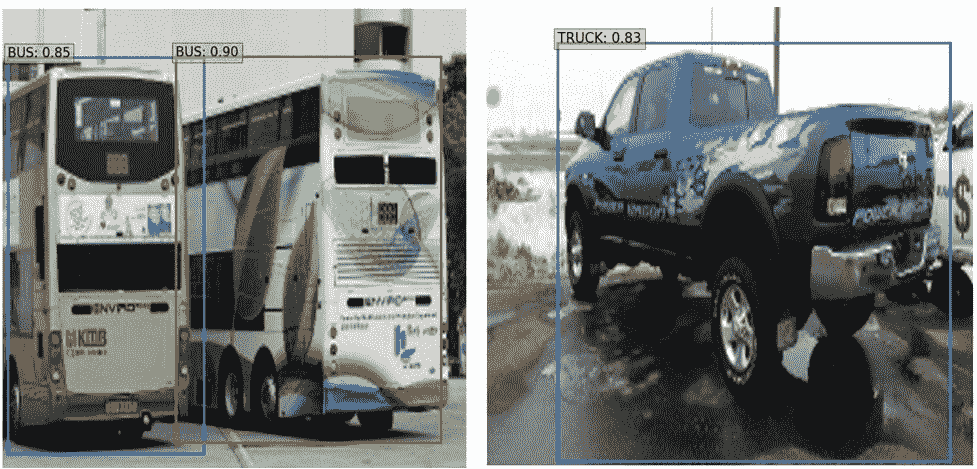

从前面，我们可以看到，我们现在可以训练模型，能够预测图像中的对象。

请注意，我们已经在小数据集上训练了模型，因此在这种特定情况下，检测的准确性可能不是很高。然而，同样的方法可以扩展到大型数据集。作为一个练习，我们建议你应用与我们在第 10 章、*物体检测应用和分割*中所做的相同的技术来检测多个物体。

# 摘要

在这一章中，我们学习了 RNNs 是如何工作的，特别是 LSTM 的变体。此外，在我们的图像字幕用例中，当我们将图像通过预先训练的模型来提取特征，并将特征作为时间步长传递给 RNN 来一次提取一个单词时，我们学习了如何一起利用 CNN 和 RNNs。然后，我们将 CNN 和 RNNs 的结合更进一步，我们利用 CTC 损失函数来转录手写图像。CTC 损失函数有助于确保我们将来自后续时间步骤的相同字符压缩成单个字符，并确保考虑所有可能的输出组合，然后我们基于产生地面真实的组合来评估损失。最后，我们学习了如何利用转换器来执行使用 DETR 的物体检测，在此期间，我们还了解了转换器如何工作，以及如何在物体检测的环境中利用它们。

在下一章中，我们将了解如何结合 CNN 和强化学习技术来开发自动驾驶汽车原型，这是一个能够在学习贝尔曼方程后在没有监督的情况下玩 Atari Space Invaders 游戏的代理，它能够为给定的状态赋值。

# 问题

1.  为什么 CNN 和 RNNs 在图像字幕中组合使用？
2.  为什么图像字幕中提供了开始和结束标记，而手写转录中没有？
3.  为什么在手写转录中利用 CTC 丢失功能？
4.  转换器如何帮助物体检测？