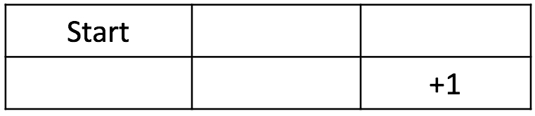
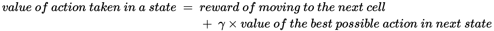
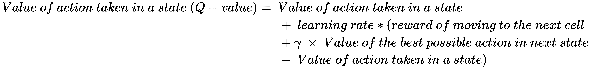
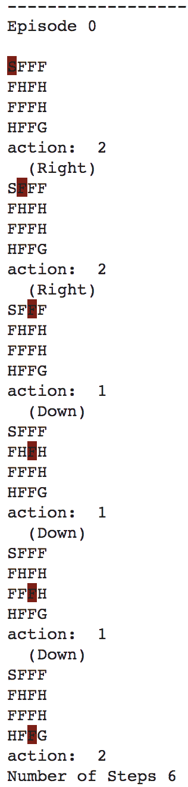
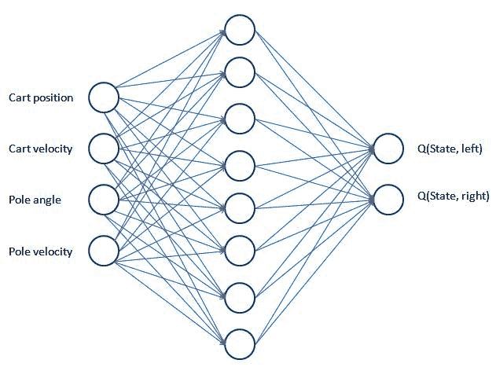
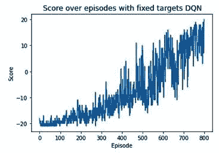
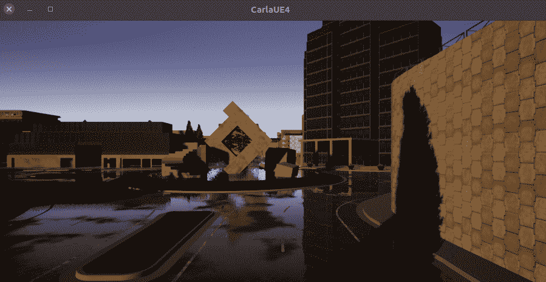

在前一章中，我们学习了如何将自然语言处理技术(LSTM 和转换器)与基于计算机视觉的技术相结合。在本章中，我们将学习如何将基于强化学习的技术(主要是深度 Q 学习)与基于计算机视觉的技术相结合。

我们将从学习强化学习的基础开始，然后学习与识别如何计算在给定状态下采取行动的相关值(Q 值)相关的术语。接下来，我们将了解如何填写 Q 表，这有助于确定给定状态下与各种行为相关的值。此外，我们将了解在由于大量的可能状态而无法提出 Q 表的情况下，如何确定各种行动的 Q 值；我们将使用深度 Q 网络来实现这一点。这是我们将理解如何利用神经网络与强化学习相结合的地方。接下来，我们将了解深度 Q 网络模型不起作用的情况，并通过使用深度 Q 网络和固定目标模型来解决这个问题。在这里，我们将通过利用 CNN 结合强化学习来玩一个名为 Pong 的视频游戏。最后，我们将利用我们所学的知识来构建一个可以在模拟环境卡拉中自动驾驶汽车的智能体。

总之，在本章中，我们将讨论以下主题:

*   学习强化学习的基础知识
*   实现探究式学习
*   实现深度 Q 学习
*   实现具有固定目标的深度 Q 学习
*   实现一个代理来执行自动驾驶

# 学习强化学习的基础知识

**强化学习** ( **RL** )是机器学习的一个领域，涉及软件**代理**在**环境**的给定**状态**下应该如何采取**动作**，以最大化累积**奖励**的概念。

为了理解 RL 如何帮助，让我们考虑一个简单的场景。想象你正在和一台电脑下棋(在我们的例子中，电脑是一个已经学会/正在学习如何下棋的**代理**)。游戏的设置(规则)构成了**环境**。此外，当我们走一步棋(采取**动作**)时，棋盘的**状态**(棋盘上各种棋子的位置)会发生变化。游戏结束，根据结果，代理人获得**奖励**。代理人的目标是最大化报酬。

如果机器(agent1)与人类对战，它可以玩的游戏数量是有限的(取决于人类可以玩的游戏数量)。这可能会给代理学习造成瓶颈。然而，如果 agent1(正在学习游戏的 agent)可以与 agent2 (agent2 可能是另一个正在学习象棋的 agent，也可能是一个已经被预编程来很好地玩游戏的象棋软件)对弈会怎么样呢？理论上，代理人可以相互玩无限的游戏，这使得学习玩好游戏的机会最大化。这样，通过相互玩多个游戏，学习代理很可能学会如何很好地处理游戏的不同场景/状态。

让我们来了解一下学习代理要学好所要遵循的流程:

1.  最初，代理在给定的状态下采取随机动作。
2.  代理将它在游戏中不同状态下采取的行动存储在**存储器**中。
3.  然后，代理将各种状态下的动作结果与奖励相关联。
4.  在玩了多个游戏之后，代理可以通过重放其**经历**来将一个状态中的动作与潜在奖励相关联。

接下来是量化对应于在给定状态下采取行动的**值**的问题。我们将在下一节学习如何计算这一点。

## 计算状态值

为了理解如何量化状态的值，让我们使用一个简单的场景，其中我们将如下定义环境和目标:



环境是一个两行三列的网格。代理从起始单元格开始，如果代理到达右下角的网格单元格，它就实现了它的目标(奖励+1 分)。如果它去了任何其他细胞，代理人不会得到奖励。代理可以通过向右、向左、向下或向上执行操作，这取决于操作的可行性(例如，代理可以在起始网格单元中向右或向下)。到达除右下角单元格之外的任何剩余单元格的奖励为 0。

通过使用这些信息，让我们计算一个单元的**值**(在给定的快照中，代理所处的状态)。假设从一个像元移动到另一个像元消耗了一些能量，我们将到达像元的值减去因子γ，其中γ考虑了从一个像元移动到另一个像元所消耗的能量。此外，γ的引入导致代理更快地学习玩得好。有了这个，让我们正式贝尔曼方程，这有助于计算一个细胞的价值:


有了前面的等式，让我们计算所有单元格的值(**)一旦确定了一个状态中的最优动作**)，γ的值为 0.9(γ的典型值在 0.9 和 0.99 之间):


从前面的计算中，我们可以理解如何计算给定状态(单元)中的值，当给定该状态中的最佳动作时。下面是我们到达终端状态的简单场景:


有了这些价值，我们期望代理遵循一条价值递增的道路。

现在我们已经了解了如何计算状态值，在下一节中，我们将了解如何计算与状态-动作组合相关的值。

## 计算状态-动作值

在上一节中，我们提供了一个场景，其中我们已经知道代理正在采取最优的行动(这是不现实的)。在这一节中，我们将看一个场景，在这个场景中，我们可以确定对应于状态-动作组合的值。

在下图中，单元格中的每个子单元格都表示在单元格中执行某项操作的值。最初，各种操作的单元格值如下:


注意，在前面的图像中，如果代理从单元格向右移动(因为它对应于终端单元格)，单元格 *b1* (2 ^(nd) 行和 2 ^(nd) 列)的值将为 1；其他操作产生的值为 0。x 表示该操作是不可能的，因此没有与之相关联的值。

经过四次迭代(步骤)，给定状态下动作的更新单元值如下:


然后，这将经历多次迭代，以提供使每个单元的价值最大化的最佳动作。

让我们了解如何获取第二个表中的单元格值(上图中的*迭代 2* )。让我们将它缩小到 0.3，当它出现在第二个表的第 1 ^第行和第 2 ^第列时，通过采取向下的动作获得。当代理人采取向下行动时，有 1/3 的机会在下一个状态采取最优行动。因此，采取向下行动的价值如下:


以类似的方式，我们可以获得在不同的单元格中采取不同的可能动作的值。

现在我们知道了如何计算给定状态下各种动作的值，在下一节中，我们将了解 Q-learning 以及如何利用它，以及健身房环境，以便它可以玩各种游戏。

# 实现探究式学习

在上一节中，我们手工计算了所有组合的状态-动作值。从技术上来说，现在我们已经计算了我们需要的各种状态-动作值，我们现在可以确定在每个状态下将要采取的动作。然而，在更复杂的情况下——例如，当玩视频游戏时——获取状态信息变得很棘手。OpenAI 的健身房环境在这种情况下派上了用场。它包含了我们正在玩的游戏的预定义环境。在这里，它获取下一个状态信息，给出在当前状态下已经采取的动作。到目前为止，我们已经考虑了选择最佳路径的场景。然而，可能会出现我们陷入局部最小值的情况。

在本节中，我们将学习 Q-learning，它有助于计算与状态中的动作相关联的值，以及如何利用健身房环境，以便我们可以玩各种游戏。现在，我们来看看一个简单的游戏，叫做冰封湖。我们还将看看探索-开发，这有助于我们避免陷入局部最小值。然而，在此之前，我们将了解 Q 值。

## q 值

Q 学习或 Q 值中的 Q 代表一个动作的质量。让我们来学习如何计算它:



我们已经知道，我们必须保持**更新**给定状态的状态动作值，直到它饱和。因此，我们将修改前面的公式，如下所示:


在前面的等式中，我们用学习率代替 1，这样我们就可以更加渐进地更新在某个状态下采取的动作的值:



有了 Q 值的正式定义，在下一节中，我们将了解健身房环境，以及它如何帮助我们获取 Q 表(它存储了在不同状态下采取的各种行动的值的信息)，从而得出一种状态下的最佳行动。

## 了解健身房环境

在本节中，我们将在玩健身房环境中的冰湖游戏时探索健身房环境和其中的各种功能:

下面的代码可以在本书的 GitHub 库【https://tinyurl.com/mcvp-packt[的`Chapter16`文件夹中找到`Understanding_the_Gym_environment.ipynb`](https://tinyurl.com/mcvp-packt)

1.  导入相关包:

```py
import numpy as np
import gym
import random
```

2.  打印体育馆环境中的各种环境:

```py
from gym import envs
print(envs.registry.all())
```

前面的代码打印了一个字典，其中包含了 Gym 中所有可用的游戏。

3.  为所选游戏创建环境:

```py
env = gym.make('FrozenLake-v0', is_slippery=False)
```

4.  检查创建的环境:

```py
env.render()
```

上述代码会产生以下输出:


在上图中，代理从**秒**开始。这里， **F** 指定单元格被冻结，而 **H** 指定单元格中有一个洞。如果代理到达单元格 **H** 并且游戏终止，代理将获得 0 的奖励。游戏的目标是让代理达到 **G** 。

5.  打印游戏中观察空间的大小(状态数):

```py
env.observation_space.n
```

前面的代码给出了 16 的输出。这代表了游戏中的 16 个单元格。

6.  打印可能操作的数量:

```py
env.action_space.n
```

前面的代码产生的值为 4，表示可以采取的四种可能的操作。

7.  对给定状态下的随机动作进行采样:

```py
env.action_space.sample()
```

指定我们获取给定状态下四个可能动作中的一个。对应于每个动作的标量可以与动作的名称相关联。我们可以通过检查 GitHub 中的代码来做到:[https://GitHub . com/open ai/gym/blob/master/gym/envs/toy _ text/frozen _ lake . py](https://github.com/openai/gym/blob/master/gym/envs/toy_text/frozen_lake.py)。

8.  将环境重置为其原始状态:

```py
env.reset()
```

9.  采取行动:

```py
env.step(env.action_space.sample())
```

前面的代码获取下一个状态、奖励、表示游戏是否完成的标志以及其他信息。我们可以用`.step`来执行这个游戏，因为当环境给出一个动作的步骤时，它很容易提供下一个状态。

这些步骤构成了我们构建 Q 表的基础，该表规定了在每个状态下要采取的最佳行动。我们将在下一节中完成这项工作。

## 构建 Q 表

在上一节中，我们学习了如何手动计算各种状态-动作对的 Q 值。在本节中，我们将利用健身房环境和与之相关的各种模块来填充 Q 表，其中行代表代理可以处于的状态，列代表代理可以采取的行动。Q 表的值表示在给定状态下采取行动的 Q 值。

我们可以使用以下策略填充 Q 表的值:

1.  用零初始化游戏环境和 Q 表。
2.  采取随机行动，获取下一个状态、奖励、表明游戏是否完成的标志以及其他信息。
3.  使用我们之前定义的贝尔曼方程更新 Q 值。
4.  重复*第 2 步*和*第 3 步*，这样一集最多有 50 步。
5.  多次重复*步骤 2* 、 *3、*和 *4* 。

让我们编写前面的策略:

The following code is available as `Building_Q_table.ipynb` in the `Chapter16` folder in this book's GitHub repository - [https://tinyurl.com/mcvp-packt](https://tinyurl.com/mcvp-packt)

1.  初始化游戏环境:

```py
import numpy as np
import gym
import random
env = gym.make('FrozenLake-v0', is_slippery=False)
```

*   用零初始化 Q 表:

```py
action_size=env.action_space.n
state_size=env.observation_space.n
qtable=np.zeros((state_size,action_size))
```

前面的代码检查可用于构建 Q 表的可能动作和状态。Q 表的维数应该是状态数乘以动作数。

2.  采取随机行动的同时播放多集。在这里，我们在每集的结尾重置环境:

```py
episode_rewards = []
for i in range(10000):
    state=env.reset()
```

*   每集最多走 50 步:

```py
    total_rewards = 0
    for step in range(50):
```

我们考虑每集最多 50 步，因为代理有可能永远在两种状态之间振荡(想象一下左右动作永远连续执行)。因此，我们需要指定代理可以执行的最大步骤数。

*   对一个随机动作进行采样，并执行它:

```py
        action=env.action_space.sample()
        new_state,reward,done,info=env.step(action)
```

*   更新对应于状态和动作的 Q 值:

```py
qtable[state,action]+=0.1*(reward+0.9*np.max(\
                            qtable[new_state,:]) \
                           -qtable[state,action])
```

在前面的代码中，我们指定学习率为 0.1，并通过考虑下一个状态(`np.max(qtable[new_state,:])`)的最大 Q 值来更新状态-动作组合的 Q 值。

*   将`state`值更新为我们之前获得的`new_state`，并将`reward`累加到`total_rewards`:

```py
        state=new_state
        total_rewards+=reward
```

*   将奖励放入列表(`episode_rewards`)并打印 Q 表(`qtable`):

```py
    episode_rewards.append(total_rewards)
print(qtable)
```

前面的代码获取某个状态下各种动作的 Q 值:


我们将在下一节了解如何利用获得的 Q 表。

到目前为止，我们每次都采取随机行动。然而，在现实场景中，一旦我们知道在某些状态下不能采取某些动作，反之亦然，我们就不再需要采取随机动作了。在这种情况下，探索开发的概念就派上了用场。

## 利用勘探开发

在上一节中，我们探讨了在给定空间中我们可以采取的可能行动。在本节中，我们将了解探索-开发的概念，具体如下:

*   探索是一种策略，在这种策略中，我们了解在给定的状态下需要做什么(采取什么行动)。
*   **利用**是一种策略，我们利用已经学到的东西；也就是说，在给定的状态下采取哪种动作。

在初始阶段，最好进行大量的探索，因为代理不知道最初应该采取什么样的最佳行动。通过情节，随着代理人随着时间的推移学习各种状态-动作组合的 Q 值，我们必须利用剥削来执行导致高回报的动作。

有了这种直觉，让我们修改我们在上一节中构建的 Q 值计算，以便它包括探索和开发:

```py
episode_rewards = []
epsilon=1
max_epsilon=1
min_epsilon=0.01
decay_rate=0.005
for episode in range(1000):
    state=env.reset()
    total_rewards = 0
    for step in range(50):
 exp_exp_tradeoff=random.uniform(0,1)
 ## Exploitation:
 if exp_exp_tradeoff>epsilon:
 action=np.argmax(qtable[state,:])
 else:
 ## Exploration
 action=env.action_space.sample()
        new_state,reward,done,info=env.step(action)
        qtable[state,action]+=0.9*(reward+0.9*np.max(\
                                  qtable[new_state,:])\
                                   -qtable[state,action])
        state=new_state
        total_rewards+=reward
    episode_rewards.append(total_rewards)
 epsilon=min_epsilon+(max_epsilon-min_epsilon)\
 *np.exp(decay_rate*episode)
print(qtable)
```

前面代码中的粗体行是添加到上一节中显示的代码中的内容。在这段代码中，我们指定，随着情节的增加，我们更多的是利用而不是探索。

一旦我们获得了 Q 表，我们就可以利用它来确定代理要达到其目的地需要采取的步骤:

```py
env.reset()
for episode in range(1):
    state=env.reset()
    step=0
    done=False
    print("-----------------------")
    print("Episode",episode)
    for step in range(50):
        env.render()
        action=np.argmax(qtable[state,:])
        print(action)
        new_state,reward,done,info=env.step(action) 
        if done:
            print("Number of Steps",step+1)
            break
        state=new_state
env.close()
```

在前面的代码中，我们获取代理所在的当前`state`，识别在给定的状态-动作组合中产生最大值的`action`，采取动作(`step`)获取代理所在的`new_state`对象，并重复这些步骤，直到游戏完成(终止)。

上述代码会产生以下输出:



注意，这是一个简化的例子，因为状态空间是离散的，导致我们建立一个 Q 表。如果状态空间是连续的(例如，状态空间是游戏当前状态的快照图像)会怎样？构建 Q 表变得非常困难(因为可能状态的数量非常大)。在这种情况下，深度 Q 学习就派上了用场。我们将在下一节了解这一点。

# 实现深度 Q 学习

到目前为止，我们已经学习了如何构建 Q-table，它通过多次重播一个游戏(在本例中是冰封湖游戏)来提供与给定状态-动作组合相对应的值。然而，当状态空间是连续的时(比如一个乒乓游戏的快照)，可能的状态空间的数量变得巨大。我们将在本节以及接下来的几节中使用深度 Q 学习来解决这个问题。在本节中，我们将学习如何使用神经网络在没有 Q 表的情况下估计状态-动作组合的 Q 值——因此有术语 **deep** Q-learning。

与 Q 表相比，深度 Q 学习利用神经网络将任何给定的状态-动作(其中状态可以是连续的或离散的)组合映射到 Q 值。

在这个练习中，我们将在体育馆里练习侧手翻。在这里，我们的任务是尽可能长时间地保持侧翻平衡。下图显示了 CartPole 环境的外观:


请注意，当手推车向右移动时，杆子会向左移动，反之亦然。该环境中的每个状态都使用四个观察值来定义，它们的名称以及最小和最大值如下:

| **观察** | **最小值** | **最大值** |
| 推车位置 | -2.4 | Two point four |
| 推车速度 | -inf | 中程核力量 |
| 磁极角度 | -41.8° | 41.8° |
| 尖端的极点速度 | -inf | 中程核力量 |

注意，代表一个状态的所有观察值都是连续的。

在一个高层次上，用于横竿平衡游戏的深度 Q 学习工作如下:

1.  获取输入值(游戏的图像/游戏的元数据)。
2.  通过具有尽可能多的输出的网络传递输入值。
3.  输出层预测对应于在给定状态下采取动作的动作值。

网络架构的高级概述如下:



在上图中，网络架构将状态(四个观察值)用作输入，将在当前状态下进行左右操作的 Q 值用作输出。我们按如下方式训练神经网络:

1.  在探索阶段，我们执行一个在输出层中具有最高值的随机操作。
2.  然后，我们将动作、下一个状态、奖励和表示游戏是否完成的标志存储在内存中。
3.  在给定状态下，如果游戏没有完成，将计算在给定状态下采取一个动作的 Q 值；即奖励+折扣因子 x 下一个状态所有行动的最大可能 Q 值。
4.  当前状态-动作组合的 Q 值保持不变，除了在*步骤 2* 中采取的动作。
5.  多次执行*步骤 1* 至 *4* 并存储经验。
6.  拟合一个模型，该模型将状态作为输入，将动作值作为预期输出(来自记忆和重放经验),并最小化 MSE 损失。
7.  在多个情节中重复上述步骤，同时降低探索率。

有了前面的策略，让我们编写深度 Q 学习的代码，这样我们就可以执行横向平衡:

The following code is available as `Deep_Q_Learning_Cart_Pole_balancing.ipynb` in the `Chapter16` folder in this book's GitHub repository - [https://tinyurl.com/mcvp-packt](https://tinyurl.com/mcvp-packt) The code contains URLs to download data from and is moderately lengthy. We strongly recommend you to execute the notebook in GitHub to reproduce results while you understand the steps to perform and explanation of various code components from text.

1.  导入相关包:

```py
import gym
import numpy as np
import cv2
from collections import deque
import torch
import torch.nn as nn
import torch.nn.functional as F
import random
from collections import namedtuple, deque
import torch.optim as optim
device = 'cuda' if torch.cuda.is_available() else 'cpu'
```

2.  定义环境:

```py
env = gym.make('CartPole-v1')
```

3.  定义网络架构:

```py
class DQNetwork(nn.Module):
    def __init__(self, state_size, action_size):
        super(DQNetwork, self).__init__()

        self.fc1 = nn.Linear(state_size, 24)
        self.fc2 = nn.Linear(24, 24)
        self.fc3 = nn.Linear(24, action_size)

    def forward(self, state):       
        x = F.relu(self.fc1(state))
        x = F.relu(self.fc2(x))
        x = self.fc3(x)
        return x
```

请注意，该架构相当简单，因为它在两个隐藏层中仅包含 24 个单元。输出层包含尽可能多的单元。

4.  定义`Agent`类，如下所示:

*   用定义的各种参数、网络和经验定义`__init__`方法:

```py
class Agent():
    def __init__(self, state_size, action_size):

        self.state_size = state_size
        self.action_size = action_size
        self.seed = random.seed(0)

        ## hyperparameters
        self.buffer_size = 2000
        self.batch_size = 64
        self.gamma = 0.99
        self.lr = 0.0025
        self.update_every = 4 

        # Q-Network
        self.local = DQNetwork(state_size, action_size)\
                                        .to(device)
        self.optimizer=optim.Adam(self.local.parameters(), \
                                        lr=self.lr)

        # Replay memory
        self.memory = deque(maxlen=self.buffer_size) 
        self.experience = namedtuple("Experience", \
                            field_names=["state", "action", \
                             "reward", "next_state", "done"])
        self.t_step = 0
```

*   定义`step`函数，该函数通过调用`learn`函数从内存中获取数据并使其符合模型:

```py
    def step(self, state, action, reward, next_state, done):
        # Save experience in replay memory
        self.memory.append(self.experience(state, action, \
                                    reward, next_state, done)) 
        # Learn every update_every time steps.
        self.t_step = (self.t_step + 1) % self.update_every
        if self.t_step == 0:
        # If enough samples are available in memory, 
        # get random subset and learn
            if len(self.memory) > self.batch_size:
                experiences = self.sample_experiences()
                self.learn(experiences, self.gamma)
```

*   定义`act`函数，该函数预测给定状态下的动作:

```py
    def act(self, state, eps=0.):
        # Epsilon-greedy action selection
        if random.random() > eps:
            state = torch.from_numpy(state).float()\
                         .unsqueeze(0).to(device)
            self.local.eval()
            with torch.no_grad():
                action_values = self.local(state)
            self.local.train()
            return np.argmax(action_values.cpu().data.numpy())
        else:
            return random.choice(np.arange(self.action_size))
```

请注意，在前面的代码中，我们在确定要采取的操作时，正在执行探索利用。

*   定义符合模型的`learn`函数，以便在给定状态时预测动作值:

```py
    def learn(self, experiences, gamma): 
        states,actions,rewards,next_states,dones= experiences
        # Get expected Q values from local model
        Q_expected = self.local(states).gather(1, actions)

        # Get max predicted Q values (for next states) 
        # from local model
        Q_targets_next = self.local(next_states).detach()\
                             .max(1)[0].unsqueeze(1)
        # Compute Q targets for current states 
        Q_targets = rewards+(gamma*Q_targets_next*(1-dones))

        # Compute loss
        loss = F.mse_loss(Q_expected, Q_targets)

        # Minimize the loss
        self.optimizer.zero_grad()
        loss.backward()
        self.optimizer.step()
```

在前面的代码中，我们获取了采样的体验，并预测了我们执行的动作的 Q 值。此外，假设我们已经知道下一个状态，我们可以预测下一个状态中的动作的最佳 Q 值。通过这种方式，我们现在知道了在给定状态下对应于所采取的动作的目标值。

最后，我们将计算在当前状态下采取的动作的 Q 值的期望值(`Q_targets`)和预测值(`Q_expected`)之间的损失。

*   定义`sample_experiences`函数，以便从记忆中取样体验:

```py
    def sample_experiences(self):
        experiences = random.sample(self.memory, \
                                    k=self.batch_size) 
        states = torch.from_numpy(np.vstack([e.state \
                    for e in experiences if e is not None]))\
                        .float().to(device)
        actions = torch.from_numpy(np.vstack([e.action \
                    for e in experiences if e is not None]))\
                        .long().to(device)
        rewards = torch.from_numpy(np.vstack([e.reward \
                    for e in experiences if e is not None]))\
                        .float().to(device)
        next_states=torch.from_numpy(np.vstack([e.next_state \
                    for e in experiences if e is not None]))\
                        .float().to(device)
        dones = torch.from_numpy(np.vstack([e.done \
                    for e in experiences if e is not None])\
                        .astype(np.uint8)).float().to(device) 
        return (states, actions, rewards, next_states, dones)
```

5.  定义`agent`对象:

```py
agent = Agent(env.observation_space.shape[0], \
              env.action_space.n)
```

6.  执行深度 Q 学习，如下所示:

*   初始化您的列表:

```py
scores = [] # list containing scores from each episode
scores_window = deque(maxlen=100) # last 100 scores
n_episodes=5000
max_t=5000
eps_start=1.0
eps_end=0.001
eps_decay=0.9995
eps = eps_start
```

*   重置每集的环境，并提取状态的形状。此外，重塑它，以便我们可以将它传递到网络:

```py
for i_episode in range(1, n_episodes+1):
    state = env.reset()
    state_size = env.observation_space.shape[0]
    state = np.reshape(state, [1, state_size])
    score = 0
```

*   循环通过`max_t`时间步骤，识别要执行的动作，并执行(`step`)。接下来，对其进行整形，以便将整形后的状态传递给神经网络:

```py
    for i in range(max_t):
        action = agent.act(state, eps)
        next_state, reward, done, _ = env.step(action)
        next_state = np.reshape(next_state, [1, state_size])
```

*   通过在当前状态的顶部指定`agent.step`来拟合模型，并将状态重置为下一个状态，以便它可以在下一次迭代中使用:

```py
        reward = reward if not done or score == 499 else -10
        agent.step(state, action, reward, next_state, done)
        state = next_state
        score += reward
        if done:
            break 
```

*   存储、定期打印，如果前 10 步的平均分数大于 450，则停止训练:

```py
    scores_window.append(score) # save most recent score 
    scores.append(score) # save most recent score
    eps = max(eps_end, eps_decay*eps) # decrease epsilon
    print('\rEpisode {}\tReward {} \tAverage Score: {:.2f} \
         \tEpsilon: {}'.format(i_episode,score, \
                        np.mean(scores_window), eps), end="")
    if i_episode % 100 == 0:
        print('\rEpisode {}\tAverage Score: {:.2f} \
        \tEpsilon: {}'.format(i_episode, \
                              np.mean(scores_window), eps))
    if i_episode>10 and np.mean(scores[-10:])>450:
        break
```

6.  绘制分数随情节增加的变化图:

```py
import matplotlib.pyplot as plt
%matplotlib inline
plt.plot(scores)
plt.title('Scores over increasing episodes')
```

显示分数随剧集变化的曲线图如下:


从上图中，我们可以看到，在第 2000 集之后，模特在平衡侧手翻时获得了高分。

现在我们已经了解了如何实现深度 Q 学习，在下一节中，我们将了解如何在不同的状态空间(Pong 中的视频帧)上工作，而不是在 CartPole 环境中定义状态的四个状态空间。我们还将学习如何使用固定目标模型实现深度 Q 学习。

# 用固定目标模型实现深度 Q 学习

在上一节中，我们学习了如何利用深度 Q-learning 来解决体育馆中的横竿环境。在本节中，我们将研究一个更复杂的 Pong 游戏，并了解深度 Q 学习以及固定目标模型如何解决这个游戏。在处理这个用例时，您还将学习如何利用一个基于 CNN 的模型(代替我们在上一节中使用的普通神经网络)来解决这个问题。

这个用例的目标是构建一个可以与计算机对抗的代理(一个预先训练过的、没有学习能力的代理)，并在 Pong 游戏中击败它，在这个游戏中，代理应该获得 21 分。

我们将采用以下策略来解决为 Pong 游戏创建成功代理的问题:

裁剪图像的不相关部分，以获取当前帧(状态):


请注意，在前面的图像中，我们获取了原始图像，并在处理后的图像中裁剪了原始图像的顶部和底部像素:

*   堆叠四个连续的帧–代理需要状态序列来理解球是否正在接近它。
*   让代理最初采取随机行动，并在内存中不断收集当前状态、未来状态、采取的行动和奖励。仅在内存中保留最近 10，000 次操作的信息，并刷新超过 10，000 次的历史操作。
*   建立一个网络(本地网络),从内存中提取状态样本，并预测可能的动作值。
*   定义作为本地网络副本的另一个网络(目标网络)。
*   本地网络每更新 1，000 次，就更新一次目标网络。目标网络在每 1000 个时期结束时的权重与本地网络的权重相同。
*   利用目标网络计算下一状态最佳行动的 Q 值。
*   对于局部网络建议的行动，我们期望它预测下一个状态中最佳行动的即时奖励和 Q 值的总和。
*   最小化本地网络的 MSE 损耗。
*   让代理人一直玩下去，直到它的回报最大化。

有了前面的策略，我们现在可以对代理进行编码，使其在玩 Pong 时获得最大回报。

## 编写一个代理来玩乒乓

按照以下步骤对代理进行编码，以便它能够自学如何玩 Pong:

The following code is available as `Pong_Deep_Q_Learning_with_Fixed_targets.ipynb` in the `Chapter16` folder in this book's GitHub repository - [https://tinyurl.com/mcvp-packt](https://tinyurl.com/mcvp-packt) The code contains URLs to download data from and is moderately lengthy. We strongly recommend you to execute the notebook in GitHub to reproduce results while you understand the steps to perform and explanation of various code components from text.

1.  导入相关包并设置游戏环境:

```py
import gym
import numpy as np
import cv2
from collections import deque
import matplotlib.pyplot as plt
import torch
import torch.nn as nn
import torch.nn.functional as F
import random
from collections import namedtuple, deque
import torch.optim as optim
import matplotlib.pyplot as plt
%matplotlib inline

device = 'cuda' if torch.cuda.is_available() else 'cpu'

env = gym.make('PongDeterministic-v0')
```

2.  定义状态大小和动作大小:

```py
state_size = env.observation_space.shape[0]
action_size = env.action_space.n
```

3.  定义一个函数来预处理一个帧，以去除不相关的底部和顶部像素:

```py
def preprocess_frame(frame): 
    bkg_color = np.array([144, 72, 17])
    img = np.mean(frame[34:-16:2,::2]-bkg_color,axis=-1)/255.
    resized_image = img
    return resized_image
```

4.  定义一个将堆叠四个连续帧的函数，如下所示:

*   该函数以`stacked_frames`、当前`state`和`is_new_episode`标志为输入:

```py
def stack_frames(stacked_frames, state, is_new_episode):
    # Preprocess frame
    frame = preprocess_frame(state)
    stack_size = 4
```

*   如果这一集是新的，我们将从一堆初始帧开始:

```py
    if is_new_episode:
        # Clear our stacked_frames
        stacked_frames = deque([np.zeros((80,80), \
                         dtype=np.uint8) for i in \
                            range(stack_size)], maxlen=4)
        # Because we're in a new episode, 
        # copy the same frame 4x
        for i in range(stack_size):
            stacked_frames.append(frame) 
        # Stack the frames
        stacked_state = np.stack(stacked_frames, \
                                 axis=2).transpose(2, 0, 1)
```

*   如果这一集不是新的，我们将从`stacked_frames`中移除最旧的帧并添加最新的帧:

```py
    else:
        # Append frame to deque, 
        # automatically removes the #oldest frame
        stacked_frames.append(frame)
        # Build the stacked state 
        # (first dimension specifies #different frames)
        stacked_state = np.stack(stacked_frames, \
                                 axis=2).transpose(2, 0, 1) 
    return stacked_state, stacked_frames
```

5.  定义网络架构；也就是，`DQNetwork`:

```py
class DQNetwork(nn.Module):
    def __init__(self, states, action_size):
        super(DQNetwork, self).__init__()

        self.conv1 = nn.Conv2d(4, 32, (8, 8), stride=4)
        self.conv2 = nn.Conv2d(32, 64, (4, 4), stride=2)
        self.conv3 = nn.Conv2d(64, 64, (3, 3), stride=1)
        self.flatten = nn.Flatten()
        self.fc1 = nn.Linear(2304, 512)
        self.fc2 = nn.Linear(512, action_size)

    def forward(self, state): 
        x = F.relu(self.conv1(state))
        x = F.relu(self.conv2(x))
        x = F.relu(self.conv3(x))
        x = self.flatten(x)
        x = F.relu(self.fc1(x))
        x = self.fc2(x)
        return x
```

6.  像我们在上一节中所做的那样，定义`Agent`类，如下所示:

*   定义`__init__`方法:

```py
class Agent():
    def __init__(self, state_size, action_size):

        self.state_size = state_size
        self.action_size = action_size
        self.seed = random.seed(0)

        ## hyperparameters
        self.buffer_size = 10000
        self.batch_size = 32
        self.gamma = 0.99
        self.lr = 0.0001
        self.update_every = 4
        self.update_every_target = 1000 
        self.learn_every_target_counter = 0
        # Q-Network
        self.local = DQNetwork(state_size, \
                               action_size).to(device)
 self.target = DQNetwork(state_size, \
 action_size).to(device)
        self.optimizer=optim.Adam(self.local.parameters(), \
                                    lr=self.lr)

        # Replay memory
        self.memory = deque(maxlen=self.buffer_size) 
        self.experience = namedtuple("Experience", \
                            field_names=["state", "action", \
                            "reward", "next_state", "done"])
        # Initialize time step (for updating every few steps)
        self.t_step = 0
```

请注意，与上一节中提供的代码相比，我们在前面的代码中对`__init__`方法所做的唯一添加是`target`网络和目标网络的更新频率(这些行在前面的代码中以粗体显示)。

*   定义将更新权重(`step`)的方法，就像我们在上一节中所做的那样:

```py
    def step(self, state, action, reward, next_state, done):
        # Save experience in replay memory
        self.memory.append(self.experience(state[None], \
                                    action, reward, \
                                    next_state[None], done))

        # Learn every update_every time steps.
        self.t_step = (self.t_step + 1) % self.update_every
        if self.t_step == 0:
    # If enough samples are available in memory, get random 
    # subset and learn
            if len(self.memory) > self.batch_size:
                experiences = self.sample_experiences()
                self.learn(experiences, self.gamma)
```

*   定义`act`方法，该方法将获取在给定状态下要执行的动作:

```py
    def act(self, state, eps=0.):
        # Epsilon-greedy action selection
        if random.random() > eps:
            state = torch.from_numpy(state).float()\
                         .unsqueeze(0).to(device)
            self.local.eval()
            with torch.no_grad():
                action_values = self.local(state)
            self.local.train()
            return np.argmax(action_values.cpu()\
                                          .data.numpy())
        else:
            return random.choice(np.arange(self.action_size))
```

*   定义`learn`函数，该函数将训练本地模型:

```py
    def learn(self, experiences, gamma):
        self.learn_every_target_counter+=1
        states,actions,rewards,next_states,dones = experiences
        # Get expected Q values from local model
        Q_expected = self.local(states).gather(1, actions)

        # Get max predicted Q values (for next states) 
        # from target model
 Q_targets_next = self.target(next_states).detach()\
 .max(1)[0].unsqueeze(1)
        # Compute Q targets for current state
        Q_targets = rewards+(gamma*Q_targets_next*(1-dones))

        # Compute loss
        loss = F.mse_loss(Q_expected, Q_targets)

        # Minimize the loss
        self.optimizer.zero_grad()
        loss.backward()
        self.optimizer.step()

        # ------------ update target network ------------- #
        if self.learn_every_target_counter%1000 ==0:
            self.target_update() 
```

注意，在前面的代码中，`Q_targets_next`是使用目标模型而不是上一节中使用的本地模型来预测的。我们还在每 1000 步之后更新目标网络，其中`learn_every_target_counter`是帮助确定我们是否应该更新目标模型的计数器。

*   定义一个更新目标模型的函数(`target_update`):

```py
    def target_update(self):
        print('target updating')
        self.target.load_state_dict(self.local.state_dict())
```

*   定义一个从记忆中取样体验的函数:

```py
    def sample_experiences(self):
        experiences = random.sample(self.memory, \
                                    k=self.batch_size) 
        states = torch.from_numpy(np.vstack([e.state \
                    for e in experiences if e is not None]))\
                                    .float().to(device)
        actions = torch.from_numpy(np.vstack([e.action \
                    for e in experiences if e is not None]))\
                                    .long().to(device)
        rewards = torch.from_numpy(np.vstack([e.reward \
                    for e in experiences if e is not None]))\
                                    .float().to(device)
        next_states=torch.from_numpy(np.vstack([e.next_state \
                     for e in experiences if e is not None]))\
                                    .float().to(device)
        dones = torch.from_numpy(np.vstack([e.done \
                    for e in experiences if e is not None])\
                        .astype(np.uint8)).float().to(device) 
        return (states, actions, rewards, next_states, dones)
```

7.  定义`Agent`对象:

```py
agent = Agent(state_size, action_size)
```

8.  定义将用于培训代理的参数:

```py
n_episodes=5000
max_t=5000
eps_start=1.0
eps_end=0.02
eps_decay=0.995
scores = [] # list containing scores from each episode
scores_window = deque(maxlen=100) # last 100 scores
eps = eps_start
stack_size = 4
stacked_frames = deque([np.zeros((80,80), dtype=np.int) \
                        for i in range(stack_size)], \
                       maxlen=stack_size) 
```

9.  按照我们在上一节中所做的那样，对代理进行越来越多的培训:

```py
for i_episode in range(1, n_episodes+1):
    state = env.reset()
    state, frames = stack_frames(stacked_frames, \
                                 state, True)
    score = 0
    for i in range(max_t):
        action = agent.act(state, eps)
        next_state, reward, done, _ = env.step(action)
        next_state, frames = stack_frames(frames, \
                                          next_state, False)
        agent.step(state, action, reward, next_state, done)
        state = next_state
        score += reward
        if done:
            break 
    scores_window.append(score) # save most recent score
    scores.append(score) # save most recent score
    eps = max(eps_end, eps_decay*eps) # decrease epsilon
    print('\rEpisode {}\tReward {} \tAverage Score: {:.2f} \
    \tEpsilon: {}'.format(i_episode,score,\
                          np.mean(scores_window),eps),end="")
    if i_episode % 100 == 0:
        print('\rEpisode {}\tAverage Score: {:.2f} \
        \tEpsilon: {}'.format(i_episode, \
                              np.mean(scores_window), eps))
```

下图显示了分数随情节增加而变化的情况:



从前面的图像中，我们可以看到代理逐渐学会了玩 Pong，到 800 集结束时，它学会了如何在获得高额奖励的同时玩 Pong。

现在，我们已经训练了一个代理来玩好 Pong，在下一部分，我们将训练一个代理，以便它可以在模拟环境中自动驾驶汽车。

# 实现一个代理来执行自动驾驶

现在，您已经看到了 RL 在越来越具有挑战性的环境中工作，我们将通过展示相同的概念可以应用于自动驾驶汽车来结束本章。由于在实际的汽车上看到这种工作是不切实际的，我们将求助于模拟环境。环境将是一个成熟的交通城市，在道路的图像中有汽车和其他细节。演员(经纪人)是一辆车。汽车的输入将是各种感官输入，如 dashcam、**光探测和测距** ( **激光雷达**)传感器和 GPS 坐标。输出将是汽车移动的快慢，以及转向的水平。这种模拟将试图成为真实世界物理的精确表示。因此，请注意，无论是模拟汽车还是真实汽车，基本原理都是一样的。

注意，我们将要安装的环境需要一个**图形用户界面** ( **GUI** )来显示模拟。此外，培训至少需要一天时间，如果不是更多的话。由于视觉设置的不可用性和 Google-Colab 的时间使用限制，我们将不会像迄今为止那样使用 Google-Colab 笔记本。这是本书中唯一需要一个活动的 Linux 操作系统的部分，最好是一个 GPU，以便在几天的培训中达到可接受的结果。

## 安装 CARLA 环境

正如我们之前提到的，我们需要一个可以模拟复杂交互的环境，让我们相信我们实际上正在处理一个现实的场景。卡拉就是这样一个环境。《环境》作者对卡拉做了如下描述:

“CARLA 是为了支持自动驾驶系统的开发、培训和验证而从头开始开发的。除了开放源代码和协议，CARLA 还提供了为此目的而创建的开放数字资产(城市布局、建筑和车辆),可以免费使用。仿真平台支持传感器套件、环境条件、所有静态和动态行为者的完全控制、地图生成等的灵活规范。”

安装环境需要遵循两个步骤:

1.  为模拟环境安装 CARLA 二进制文件。
2.  安装 Gym 版本，它为模拟环境提供 Python 连接。

本节的步骤在这里以视频演示的形式呈现:[https://tinyurl.com/mcvp-self-driving-agent](https://tinyurl.com/mcvp-self-driving-agent)。

我们开始吧！

### 安装 CARLA 二进制文件

在本节中，我们将学习如何安装必要的 CARLA 二进制文件:

1.  访问[https://github.com/carla-simulator/carla/releases/tag/0.9.6](https://github.com/carla-simulator/carla/releases/tag/0.9.6)，下载`CARLA_0.9.6.tar.gz`编译版本文件。
2.  将它移动到您希望 CARLA 在您的系统中存在的位置，并解压缩它。在这里，我们通过下载 CARLA 并将其解压缩到`Documents`文件夹来演示这一点:

```py
$ mv CARLA_0.9.6.tar.gz ~/Documents/
$ cd ~/Documents/
$ tar -xf  CARLA_0.9.6.tar.gz
$ cd CARLA_0.9.6/
```

3.  将 CARLA 添加到`PYTHONPATH`以便机器上的任何模块都可以导入 CARLA:

```py
$ echo "export PYTHONPATH=$PYTHONPATH:/home/$(whoami)/Documents/CARLA_0.9.6/PythonAPI/carla/dist/carla-0.9.6-py3.5-linux-x86_64.egg" >> ~/.bashrc
```

在前面的代码中，我们将包含 CARLA 的目录添加到一个名为`PYTHONPATH`的全局变量中，这是一个用于访问所有 Python 模块的环境变量。将其添加到`~/.bashrc`将确保每次打开终端时，它都可以访问这个新文件夹。运行上述代码后，重启终端并运行`ipython -c "import carla; carla.__spec__"`。您应该得到以下输出:


4.  最后，提供必要的权限并执行 CARLA，如下所示:

```py
$ chmod +x /home/$(whoami)/Documents/CARLA_0.9.6/CarlaUE4.sh
$ ./home/$(whoami)/Documents/CARLA_0.9.6/CarlaUE4.sh
```

一两分钟后，您应该会看到一个类似如下的窗口，显示 CARLA 作为模拟运行，准备接受输入:



在这一节中，我们已经验证了`CARLA`是一个模拟环境，它的二进制文件按预期工作。让我们继续为它安装健身房环境。让终端保持原样运行，因为在整个练习中，我们需要二进制文件在后台运行。

### 安装卡拉健身房环境

由于没有官方的健身房环境，我们将利用用户实现的 GitHub 存储库，从那里为 CARLA 安装健身房环境。按照以下步骤安装 CARLA 的健身房环境:

1.  将健身房存储库克隆到您选择的位置并安装库:

```py
$ cd /location/to/clone/repo/to
$ git clone https://github.com/cjy1992/gym-carla
$ cd gym-carla
$ pip install -r requirements.txt
$ pip install -e .

```

2.  通过运行以下命令来测试您的设置:

```py
$ python test.py
```

应该会打开一个类似下面的窗口，显示我们已经向环境中添加了一辆假汽车。从这里，我们可以监控俯视图、激光雷达传感器点云以及我们的 dashcam:


在这里，我们可以观察到以下情况:

*   第一个视图包含与汽车中的车辆 GPS 系统非常相似的视图；也就是我们的车辆、各种路点和道路车道。但是，我们不会将此输入用于训练，因为它还会在视图中显示其他汽车，这是不现实的。
*   第二种观点更有趣。有人认为它是自动驾驶汽车的眼睛。激光雷达每秒多次向周围环境发射脉冲光(各个方向)。它捕捉反射光，以确定该方向上最近的障碍物有多远。车载计算机整理所有最近的障碍物信息，以重建 3D 点云，使其对周围环境有 3D 了解。
*   在第一个和第二个视图中，我们可以看到汽车前面有一个条形。这是一个路标，指示汽车应该去的地方。
*   第三个视图是一个简单的仪表板摄像机。

除了这三个以外，CARLA 还提供其他传感器数据，例如:

*   `lateral-distance`(偏离它应该在的车道)
*   `delta-yaw`(相对于前方道路的角度)
*   `speed`
*   如果车辆前方有危险障碍物
*   还有更多...

我们将使用前面提到的前四个传感器，以及激光雷达和我们的 dashcam 来训练模型。

我们现在已经准备好了解卡拉的组成部分，并为自动驾驶汽车创建一个 DQN 模型。

## 培训自动驾驶代理

在笔记本中开始培训过程之前，我们将创建两个文件；也就是`model.py`和`actor.py`。这些将分别包含模型架构和`Agent`类。`Agent`类包含了我们用来训练代理的各种方法。

这一节的代码指令以`Carla.md`的形式出现在本书的 GitHub 库的`Chapter16`文件夹中。

### model.py

这将是一个 PyTorch 模型，它将接受提供给它的图像，以及其他传感器输入。预计它将返回最有可能的操作:

```py
from torch_snippets import *

class DQNetworkImageSensor(nn.Module):
    def __init__(self):
        super().__init__()
        self.n_outputs = 9
        self.image_branch = nn.Sequential(
                            nn.Conv2d(3, 32, (8, 8), stride=4), 
                            nn.ReLU(inplace=True),
                            nn.Conv2d(32, 64, (4, 4), stride=2), 
                            nn.ReLU(inplace=True),
                            nn.Conv2d(64,128,(3, 3),stride=1), 
                            nn.ReLU(inplace=True),
                            nn.AvgPool2d(8), 
                            nn.ReLU(inplace=True),
                            nn.Flatten(),
                            nn.Linear(1152, 512), 
                            nn.ReLU(inplace=True),
                            nn.Linear(512, self.n_outputs)
                        )

        self.lidar_branch = nn.Sequential(
                            nn.Conv2d(3, 32, (8, 8), stride=4), 
                            nn.ReLU(inplace=True),
                            nn.Conv2d(32,64,(4, 4),stride=2), 
                            nn.ReLU(inplace=True),
                            nn.Conv2d(64,128,(3, 3),stride=1), 
                            nn.ReLU(inplace=True),
                            nn.AvgPool2d(8), 
                            nn.ReLU(inplace=True),
                            nn.Flatten(),
                            nn.Linear(1152, 512), 
                            nn.ReLU(inplace=True),
                            nn.Linear(512, self.n_outputs)
                        )

        self.sensor_branch = nn.Sequential(
                                nn.Linear(4, 64), 
                                nn.ReLU(inplace=True),
                                nn.Linear(64, self.n_outputs)
                            )

    def forward(self, image, lidar=None, sensor=None):
        x = self.image_branch(image)
        if lidar is None:
            y = 0
        else:
            y = self.lidar_branch(lidar)
        z = self.sensor_branch(sensor)

        return x + y + z
```

正如您所看到的，与前面的部分相比，有更多类型的数据被输入到 forward 方法中，在前面的部分中，我们只是接受一个图像作为输入。`self.image_branch`将期待来自汽车仪表板摄像头的图像，而`self.lidar_branch`将接受激光雷达传感器生成的图像。最后，`self.sensor_branch`将以 NumPy 数组的形式接受四个传感器输入。这四个项目分别是横向距离(偏离预期车道)、偏航角(相对于前方道路的角度)、速度以及车辆前方是否有危险障碍物。相同的输出见`gym_carla/envs/carla_env.py`(已经被 git 克隆的存储库)中的第 543 行。在神经网络中使用不同的分支将让模块为每个传感器提供不同的重要性水平，并且输出被加起来作为最终输出。注意，有 9 个输出；我们将在以后研究这些。

### actor.py

与前面的部分非常相似，我们将使用一些代码来存储重放信息，并在需要训练时回放这些信息:

1.  让我们准备好导入和超参数:

```py
import numpy as np
import random
from collections import namedtuple, deque
import torch
import torch.nn.functional as F
import torch.optim as optim
from model1 import DQNetworkImageSensor

BUFFER_SIZE = int(1e3) # replay buffer size
BATCH_SIZE = 256 # minibatch size
GAMMA = 0.99 # discount factor
TAU = 1e-2 # for soft update of target parameters
LR = 5e-4 # learning rate 
UPDATE_EVERY = 50 # how often to update the network
ACTION_SIZE = 2

device = 'cuda' if torch.cuda.is_available() else 'cpu'
```

2.  接下来，我们将初始化目标网络和本地网络。除了正在导入的模块之外，没有对上一节中的代码进行任何更改:

```py
class Actor():
    def __init__(self):        
        # Q-Network
 self.qnetwork_local=DQNetworkImageSensor().to(device)
 self.qnetwork_target=DQNetworkImageSensor().to(device)
        self.optimizer = optim.Adam(self.qnetwork_local\
                                    .parameters(),lr=LR)

        # Replay memory
        self.memory= ReplayBuffer(ACTION_SIZE,BUFFER_SIZE, \
                                   BATCH_SIZE, 10)
        # Initialize time step 
        # (for updating every UPDATE_EVERY steps)
        self.t_step = 0

    def step(self, state, action, reward, next_state, done):
        # Save experience in replay memory
        self.memory.add(state, action, reward, \
                        next_state, done)

        # Learn every UPDATE_EVERY time steps.
        self.t_step = (self.t_step + 1) % UPDATE_EVERY
        if self.t_step == 0:
  # If enough samples are available in memory, 
  # get random subset and learn
            if len(self.memory) > BATCH_SIZE:
                experiences = self.memory.sample()
                self.learn(experiences, GAMMA)
```

3.  由于需要处理更多的传感器，我们将把它们作为状态字典来传输。状态包含`'image'`、`'lidar'`和`'sensor'`键，我们在上一节中已经介绍过了。我们在将它们发送到神经网络之前执行预处理，如下面的代码所示:

```py
    def act(self, state, eps=0.):
 images,lidars sensors=state['image'], \
 state['lidar'],state['sensor']
 images = torch.from_numpy(images).float()\
 .unsqueeze(0).to(device)
 lidars = torch.from_numpy(lidars).float()\
 .unsqueeze(0).to(device)
 sensors = torch.from_numpy(sensors).float()\
 .unsqueeze(0).to(device)
        self.qnetwork_local.eval()
        with torch.no_grad():
            action_values = self.qnetwork_local(images, \
                                lidar=lidars, sensor=sensors)
        self.qnetwork_local.train()
        # Epsilon-greedy action selection
        if random.random() > eps:
            return np.argmax(action_values.cpu().data.numpy())
        else:
            return random.choice(np.arange(\
                        self.qnetwork_local.n_outputs))
```

4.  现在，我们需要从重放存储器中获取项目。以下指令在以下代码中执行:
    1.  获得一批当前和下一个状态。
    2.  如果网络在当前状态下执行动作，则计算期望报酬`Q_expected`。
    3.  将它与目标回报`Q_targets`进行比较，该目标回报是在下一个状态被馈送到网络时获得的。
5.  使用本地网络定期更新目标网络:

```py
    def learn(self, experiences, gamma):
        states,actions,rewards,next_states,dones= experiences
 images, lidars, sensors = states
 next_images, next_lidars, next_sensors = next_states
 # Get max predicted Q values (for next states) 
        # from target model
        Q_targets_next = self.qnetwork_target(next_images, \
                       lidar=next_lidars,sensor=next_sensors)\
                            .detach().max(1)[0].unsqueeze(1)
        # Compute Q targets for current states 
        Q_targets = rewards +(gamma*Q_targets_next*(1-dones))

        # Get expected Q values from local model
        # import pdb; pdb.set_trace()
        Q_expected=self.qnetwork_local(images,lidar=lidars, \
                   sensor=sensors).gather(1,actions.long())
        # Compute loss
        loss = F.mse_loss(Q_expected, Q_targets)
        # Minimize the loss
        self.optimizer.zero_grad()
        loss.backward()
        self.optimizer.step()

        # ------------ update target network ------------- #
        self.soft_update(self.qnetwork_local, \
                         self.qnetwork_target, TAU) 

    def soft_update(self, local_model, target_model, tau):
        for target_param, local_param in \
            zip(target_model.parameters(), \
            local_model.parameters()):
            target_param.data.copy_(tau*local_param.data + \
                                (1.0-tau)*target_param.data)
```

6.  `ReplayBuffer`类中唯一的主要变化是数据的存储方式。由于我们有多个传感器，每个内存(`states`和`next_states`)都存储为一个数据元组；也就是`states = [images, lidars, sensors]`:

```py
class ReplayBuffer:
    """Fixed-size buffer to store experience tuples."""
    def __init__(self, action_size, buffer_size, \
                 batch_size, seed):
        self.action_size = action_size
        self.memory = deque(maxlen=buffer_size) 
        self.batch_size = batch_size
        self.experience = namedtuple("Experience", \
                          field_names=["state", "action", \
                                     "reward","next_state", \
                                       "done"])
        self.seed = random.seed(seed)

    def add(self, state, action, reward, next_state, done):
        """Add a new experience to memory."""
        e = self.experience(state, action, reward, \
                            next_state, done)
        self.memory.append(e)

    def sample(self):
        experiences = random.sample(self.memory, \
                                    k=self.batch_size) 
        images = torch.from_numpy(np.vstack(\
 [e.state['image'][None] \
 for e in experiences if e is not None]))\
 .float().to(device)
 lidars = torch.from_numpy(np.vstack(\
 [e.state['lidar'][None] \
 for e in experiences if e is not None]))\
 .float().to(device)
 sensors = torch.from_numpy(np.vstack(\
 [e.state['sensor'] \
 for e in experiences if e is not None]))\
 .float().to(device)
 states = [images, lidars, sensors]
 actions = torch.from_numpy(np.vstack(\
 [e.action for e in experiences \
 if e is not None])).long().to(device)
 rewards = torch.from_numpy(np.vstack(\
 [e.reward for e in experiences \
 if e is not None])).float().to(device)
 next_images = torch.from_numpy(np.vstack(\
 [e.next_state['image'][None] \
 for e in experiences if e is not None]))\
 .float().to(device)
 next_lidars = torch.from_numpy(np.vstack(\
 [e.next_state['lidar'][None] \
 for e in experiences if e is not None]))\
 .float().to(device)
 next_sensors = torch.from_numpy(np.vstack(\
 [e.next_state['sensor'] \
 for e in experiences if e is not None]))\
 .float().to(device)
 next_states = [next_images, next_lidars, next_sensors]
 dones = torch.from_numpy(np.vstack([e.done \
 for e in experiences if e is not None])\
 .astype(np.uint8)).float().to(device)

 return (states, actions, rewards, next_states, dones)

    def __len__(self):
        """Return the current size of internal memory."""
        return len(self.memory)
```

注意，粗体代码行获取当前状态、动作、奖励和下一个状态的信息。

既然关键组件已经就绪，让我们将健身房环境加载到 Python 笔记本中并开始训练。

### 用固定目标训练 DQN

这里没有我们需要学习的额外理论。基本保持不变；我们将只对健身房环境、神经网络的架构以及我们的代理需要采取的行动进行更改:

1.  首先，加载与环境相关的超参数。在下面的代码中，引用`params`字典中出现的每个键值对旁边的每个注释。由于我们正在模拟一个复杂的环境，我们需要选择环境的参数，例如城市中的汽车数量、步行者数量、要模拟的城镇、dashcam 图像的分辨率以及激光雷达传感器:

```py
import gym
import gym_carla
import carla
from model import DQNetworkState
from actor import Actor
from torch_snippets import *

params = {
    'number_of_vehicles': 10,
    'number_of_walkers': 0,
    'display_size': 256, # screen size of bird-eye render
    'max_past_step': 1, # the number of past steps to draw
    'dt': 0.1, # time interval between two frames
    'discrete': True, # whether to use discrete control space
    # discrete value of accelerations
    'discrete_acc': [-1, 0, 1],
    # discrete value of steering angles
    'discrete_steer': [-0.3, 0.0, 0.3], 
    # define the vehicle
    'ego_vehicle_filter': 'vehicle.lincoln*', 
    'port': 2000, # connection port
    'town': 'Town03', # which town to simulate
    'task_mode': 'random', # mode of the task
    'max_time_episode': 1000, # maximum timesteps per episode
    'max_waypt': 12, # maximum number of waypoints
    'obs_range': 32, # observation range (meter)
    'lidar_bin': 0.125, # bin size of lidar sensor (meter)
    'd_behind': 12, # distance behind the ego vehicle (meter)
    'out_lane_thres': 2.0, # threshold for out of lane
    'desired_speed': 8, # desired speed (m/s)
    'max_ego_spawn_times': 200, # max times to spawn vehicle
    'display_route': True, # whether to render desired route
    'pixor_size': 64, # size of the pixor labels
    'pixor': False, # whether to output PIXOR observation
}

# Set gym-carla environment
env = gym.make('carla-v0', params=params)
```

在前面的`params`字典中，就动作空间而言，以下内容对我们的模拟很重要:

*   我们的行为存在于一个离散的空间中。
*   `'discrete_acc':[-1,0,1]`:自动驾驶汽车在模拟过程中允许的所有可能的加速度。
*   `'discrete_steer':[-0.3,0,0.3]`:自动驾驶汽车在模拟过程中允许进行的所有可能的转向幅度。

如您所见，`discrete_acc`和`discrete_steer`列表各包含三个项目。这意味着汽车可以采取 3 x 3 种可能的独特行动。这意味着`model.py`文件中的网络有九个离散的状态。

一旦你看完了官方文档，你可以随意修改参数。

2.  这样，我们就有了训练模型所需的所有组件。加载预训练模型(如果存在):

```py
load_path = None # 'car-v1.pth' 
# continue training from an existing model
save_path = 'car-v2.pth'

actor = Actor()
if load_path is not None:
    actor.qnetwork_local.load_state_dict(\
                            torch.load(load_path))
    actor.qnetwork_target.load_state_dict(\
                            torch.load(load_path))
else:
    pass
```

3.  固定集数并定义`dqn`函数来训练代理，如下所示:

*   重置状态:

```py
n_episodes = 100000
def dqn(n_episodes=n_episodes, max_t=1000, eps_start=1, \
        eps_end=0.01, eps_decay=0.995):
    scores = [] # list containing scores from each episode
    scores_window = deque(maxlen=100) # last 100 scores
    eps = eps_start # Initialize epsilon 
    for i_episode in range(1, n_episodes+1):
        state = env.reset()
```

*   将状态包装到一个字典中(如在`actor.py:Actor`类中所讨论的),并在上面放置`act`:

```py
        image, lidar, sensor = state['camera'], \
                               state['lidar'], \
                               state['state']
        image, lidar = preprocess(image), preprocess(lidar)
        state_dict = {'image': image, 'lidar': lidar, \
                      'sensor': sensor}
        score = 0
        for t in range(max_t):
            action = actor.act(state_dict, eps)
```

*   存储从环境中获得的下一个状态，然后存储`state, next_state`对(以及奖励和其他状态信息),以使用 DQN 来训练演员:

```py
            next_state, reward, done, _ = env.step(action)
            image, lidar, sensor = next_state['camera'], \
                                   next_state['lidar'], \
                                   next_state['state']
            image,lidar = preprocess(image), preprocess(lidar)
            next_state_dict = {'image':image,'lidar':lidar, \
                               'sensor': sensor}
            actor.step(state_dict, action, reward, \
                       next_state_dict, done)
            state_dict = next_state_dict
            score += reward
            if done:
                break
        scores_window.append(score) # save most recent score
        scores.append(score) # save most recent score
        eps = max(eps_end, eps_decay*eps) # decrease epsilon
        if i_episode % 100 == 0:
            log.record(i_episode, \
                       mean_score=np.mean(scores_window))
            torch.save(actor.qnetwork_local.state_dict(), \
                       save_path)

```

我们必须重复这个循环，直到我们得到一个 done 信号，之后我们重置环境并再次开始存储动作。每 100 集之后，存储模型。

4.  调用`dqn`函数训练模型:

```py
dqn()
```

由于这是一个更复杂的环境，培训可能需要几天时间，所以请耐心等待，使用`load_path`和`save_path`参数一次持续培训几个小时。经过足够的训练，车辆可以自行操纵和学习驾驶。下面是我们经过两天训练后所能达到的训练效果的视频:【https://tinyurl.com/mcvp-self-driving-agent-result[。](https://www.youtube.com/watch?v=kKNZ_a1DATE)

# 摘要

在本章中，我们学习了如何计算给定状态下各种动作的值。然后，我们学习了代理如何使用在给定状态下采取行动的贴现值来更新 Q 表。在这样做的过程中，我们了解了在状态数很高的情况下 Q 表是不可行的。我们还学习了如何利用深度 Q 网络来处理可能状态数量较多的情况。接下来，我们继续利用基于 CNN 的神经网络，同时构建一个代理，该代理学习如何使用基于固定目标的 DQN 玩乒乓球。最后，我们学习了如何利用固定目标的 DQN，使用 CARLA 模拟器执行自动驾驶。正如我们在本章中反复看到的那样，你可以使用深度 Q 学习来学习非常不同的任务——比如横拉杆平衡、玩 Pong 和自驾导航——而代码几乎相同。虽然这不是我们探索 RL 之旅的终点，但在这一点上，我们应该能够理解如何一起使用基于 CNN 和基于强化学习的算法来解决复杂问题和构建学习代理。

到目前为止，我们已经学会了如何将基于计算机视觉的技术与其他重要研究领域的技术相结合，包括元学习、自然语言处理和强化学习。除此之外，我们还学习了如何使用 GANs 执行对象分类、检测、分割和图像生成。在下一章中，我们将切换齿轮，并学习如何将深度学习模型转移到生产中。

# 问题

1.  给定状态的值是如何计算的？
2.  Q 表是如何填充的？
3.  为什么我们在国家行为价值计算中要有一个贴现因子？
4.  我们需要什么样的勘探开发战略？
5.  为什么我们需要使用深度 Q 学习？
6.  如何使用深度 Q 学习计算给定状态-动作组合的值？
7.  一旦代理人在横竿环境中实现了报酬最大化，它以后还有机会学习次优策略吗？