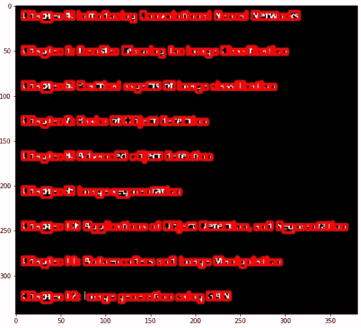
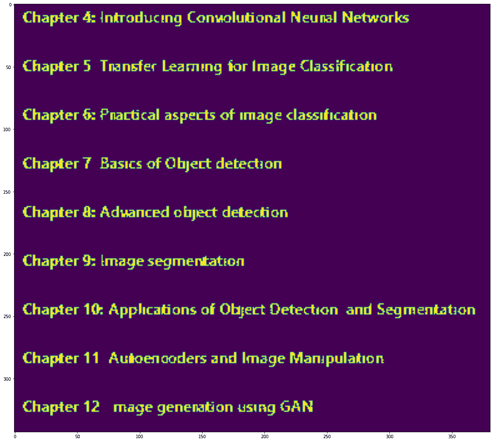
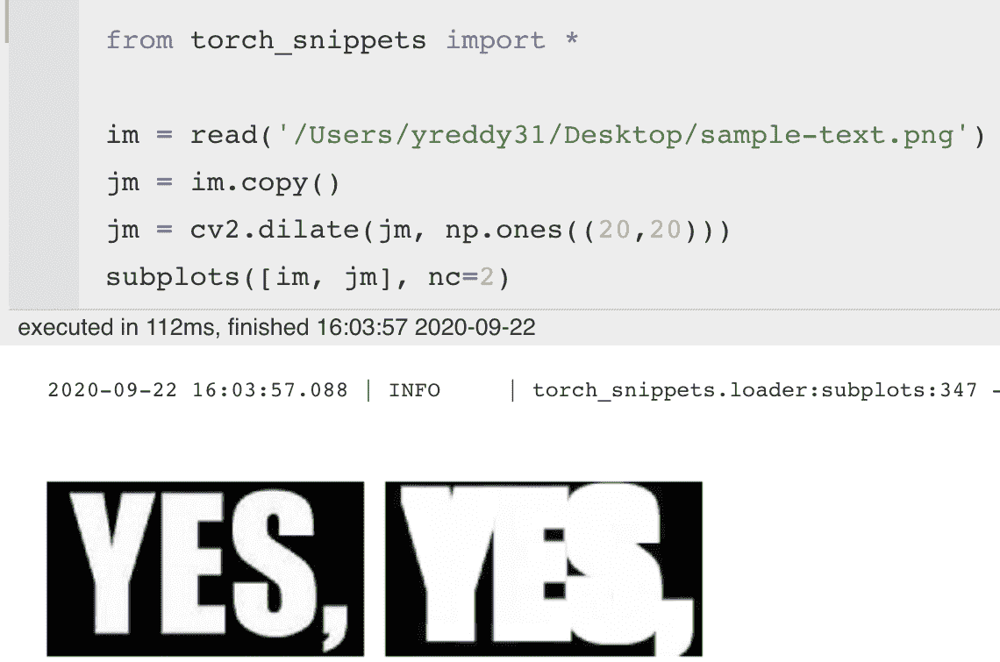
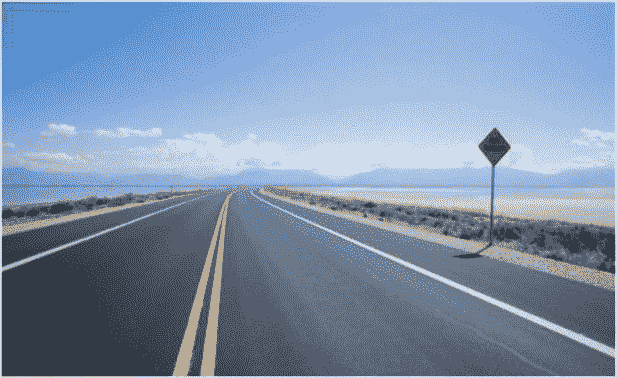
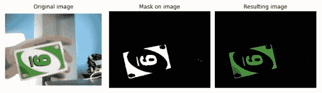
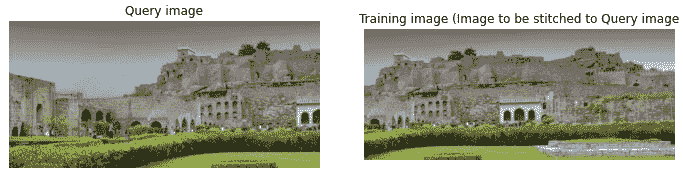
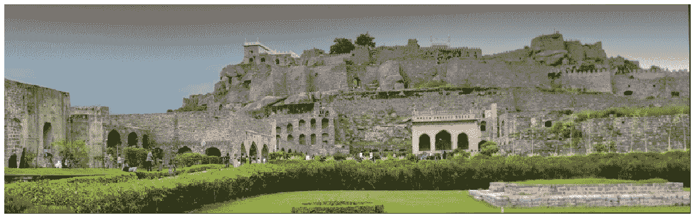
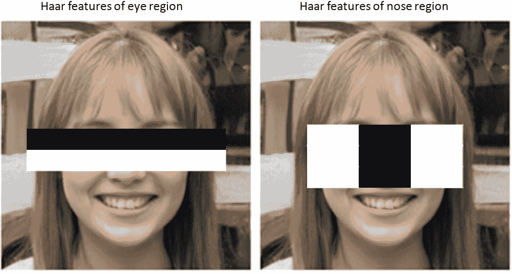

到目前为止，在前面的章节中，我们已经学习了利用各种技术来执行对象分类、定位和分割，以及生成图像。虽然所有这些技术都利用深度学习来解决任务，但对于相对简单和定义良好的任务，我们可以利用 OpenCV 包中提供的特定功能。例如，如果需要检测的物体总是具有相同背景的相同物体，则我们不需要 YOLO。在图像来自受限环境的情况下，OpenCV 实用程序很有可能在很大程度上帮助解决这个问题。

在本章中，我们将只讨论几个用例，因为要讨论的实用程序实在太多了，以至于需要专门写一本关于 OpenCV 的书。在进行单词检测时，您将了解图像膨胀、腐蚀和提取连接组件周围的轮廓。之后，您将学习 Canny 边缘检测，以识别图像中对象的边缘。此外，您将了解在视频/图像背景中使用绿色屏幕的优势，同时对图像执行逐位运算以识别感兴趣的色彩空间。然后，您将了解一种通过将两幅图像拼接在一起来创建全景视图的技术。最后，您将了解如何利用预先训练的级联过滤器来识别对象，如车牌。

在本章中，我们将了解以下主题:

*   在图像中的单词周围绘制边框
*   检测道路图像中的车道
*   基于颜色检测物体
*   构建图像的全景视图
*   检测汽车的牌照

# 在图像中的单词周围绘制边框

设想一个场景，您正在构建一个模型，该模型根据文档的图像执行单词转录。第一步是识别单词在图像中的位置。主要有两种方法来识别图像中的单词:

*   使用深度学习技术，如 CRAFT、EAST 等
*   使用基于 OpenCV 的技术

在这一部分，我们将了解如何在没有利用深度学习的情况下，在干净的图像中识别机器打印的单词。由于背景和前景之间的对比度很高，你不需要像 YOLO 这样的矫枉过正的解决方案来识别单个单词的位置。在这些场景中，使用 OpenCV 将会非常方便，因为我们可以用非常有限的计算资源得到一个解决方案，因此，即使是推理时间也会非常短。唯一的缺点是准确性可能不是 100%，但这也取决于扫描图像的清洁程度。如果扫描保证非常非常清晰，那么你可以期待接近 100%的准确性。

在较高层次上，让我们了解如何识别/隔离图像中的单词:

1.  将图像转换为灰度，因为颜色不会影响图像中的识别文字。
2.  稍微放大图像中的内容。膨胀将黑色像素渗色到紧邻的邻域中，从而连接同一个单词的字符之间的黑色像素。这有助于确保属于同一个单词的字符是相连的。但是，不要扩展得太多，否则属于不同相邻单词的字符也会连接起来。
3.  一旦字符被连接，利用`cv2.findContours`方法在每个单词周围画一个边界框。

让我们编写前面的策略:

The following code is available as `Drawing_bounding_boxes_around_words_in_an_image.ipynb` in the `Chapter18` folder of this book's GitHub repository - [https://tinyurl.com/mcvp-packt](https://tinyurl.com/mcvp-packt) Be sure to copy the URL from the notebook in GitHub to avoid any issue while reproducing the results

1.  让我们从下载一个示例图像开始:

```py
!wget https://www.dropbox.com/s/3jkwy16m6xdlktb/18_5.JPG
```

2.  使用以下代码行查看下载的图像:

```py
import cv2, numpy as np
img = cv2.imread('18_5.JPG')
img1 = cv2.cvtColor(img, cv2.COLOR_RGB2BGR)
import matplotlib.pyplot as plt,cv2
%matplotlib inline
plt.imshow(img1)
```

上述代码将返回以下输出:


3.  将输入图像转换为灰度图像:

```py
img_gray = cv2.cvtColor(img1, cv2.COLOR_BGR2GRAY)
```

4.  获取原始图像的随机裁剪:

```py
crop = img_gray[250:300,50:100]
plt.imshow(crop,cmap='gray')
```

上述代码会产生以下输出:


从前面的输出中，我们可以看到有一些像素包含噪声。接下来，我们将消除原始图像中的噪声。

5.  将输入灰度图像二值化:

```py
_img_gray = np.uint8(img_gray < 200)*255
```

前面的代码导致值小于 200 的像素的值为`0`，而亮的像素(像素强度大于 200)的值为`255`。

6.  查找图像中出现的各种人物的轮廓:

```py
contours,hierarchy=cv2.findContours(_img_gray, \
                   cv2.RETR_EXTERNAL,cv2.CHAIN_APPROX_SIMPLE)
```

`cv2`通过创建一组连续的像素作为对象的单个斑点来寻找轮廓。参考下面的截图了解`cv2.findContours`的工作原理:


7.  将之前获得的阈值图像转换为具有三个通道，以便我们可以绘制字符周围的彩色边界框:

```py
thresh1 = np.stack([_img_gray]*3,axis=2)
```

8.  创建一个空白图像，以便我们可以将相关内容从`thresh1`复制到新图像中:

```py
thresh2 = np.zeros((thresh1.shape[0],thresh1.shape[1]))
```

9.  获取上一步中获得的轮廓，并在提到轮廓的地方绘制一个带有矩形的边界框。此外，将与`thresh1`图像中的外接矩形相对应的内容复制到`thresh2`:

```py
for cnt in contours:
    if cv2.contourArea(cnt)>0:
        [x,y,w,h] = cv2.boundingRect(cnt)
        if ((h>5) & (h<100)):
            thresh2[y:(y+h),x:(x+w)] = thresh1[y:(y+h), \
                                       x:(x+w),0].copy()
            cv2.rectangle(thresh1,(x,y),(x+w,y+h),(255,0,0),2)
```

在前面的代码行中，我们只提取面积大于 5 个像素的轮廓，也只提取边界框高度在 5 到 100 个像素之间的轮廓(这样，我们就排除了太小的边界框，它们很可能是噪声，以及可能包含整个图像的大边界框)。

10.  绘制结果图像:

```py
fig = plt.figure()
fig.set_size_inches(20,20)
plt.imshow(thresh1)
```

上述代码获取以下输出:



到目前为止，我们可以在字符周围绘制边框，但是如果我们想在单词周围绘制边框，我们需要将单词中的像素组合成一个连续的单元。接下来，我们将看看如何利用单词膨胀技术在单词周围绘制边界框。

11.  检查填充的图像，`thresh2`:

```py
fig = plt.figure()
fig.set_size_inches(20,20)
plt.imshow(thresh2)
```

生成的图像如下所示:



现在，要解决的问题是如何将不同字符的像素连接成一个，使一个连续的像素集合构成一个单词。

我们使用一种叫做膨胀的技术(使用`cv2.dilate`)，将白色像素渗透到周围的像素中。出血量取决于果仁的大小。如果内核大小是 5，那么白色区域的所有边界向外移动 5 个像素。直观的解释参考下面的截图:



12.  使用 1 行 2 列的内核大小展开:

```py
dilated = cv2.dilate(thresh2, np.ones((1,2),np.uint8), \
                    iterations=1)
```

请注意，我们指定了 1 行 2 列(`np.ones((1,2),np.uint8)`)的内核大小，这样相邻的字符很可能会有一些交集。这样，`cv2.findContours`现在可以包含彼此非常接近的字符。

然而，如果内核大小更大，扩展的单词可能有一些交集，导致组合的单词被捕获在一个边界框中。

13.  获取放大图像的轮廓:

```py
contours,hierarchy = cv2.findContours(np.uint8(dilated), \
                    cv2.RETR_EXTERNAL,cv2.CHAIN_APPROX_SIMPLE)
```

14.  在原始图像上绘制放大图像的轮廓:

```py
for cnt in contours:
    if cv2.contourArea(cnt)>5:
        [x,y,w,h] = cv2.boundingRect(cnt)
        if ((h>5) & (h<100)):
            cv2.rectangle(img1,(x,y),(x+w,y+h),(255,0,0),2)
```

15.  用等高线绘制原始图像:

```py
fig = plt.figure()
fig.set_size_inches(20,20)
plt.imshow(img1)
```

上述代码会产生以下输出:


由此，您可以看到我们获取了一个对应于每个单词的边界框。

要学习的关键方面是我们如何识别像素的集合形成单个连接的单元，以及如果像素的集合没有形成单元，如何使用膨胀来操纵它们。当膨胀出血黑色像素时，有一个类似的函数叫做`erode`出血白色像素。我们鼓励你进行侵蚀并理解它是如何自己运作的。

到目前为止，我们已经学习了如何在图像中寻找人物(物体)的轮廓。在下一节中，我们将学习识别图像中的线条。

# 检测道路图像中的车道

想象一下这样一个场景，您必须检测道路图像中的车道。解决这个问题的一种方法是利用深度学习中的语义分割技术。使用 OpenCV 解决这个问题的传统方法之一是使用边缘和线检测器。在本节中，我们将了解边缘检测和线检测如何帮助识别道路图像中的车道。

在这里，我们将概述对该战略的高度理解:

1.  找出图像中各种物体的边缘。
2.  识别沿直线且相连的边。
3.  将识别的线从图像的一端延伸到另一端。

让我们制定我们的策略:

以下代码在本书的 GitHub 知识库的`Chapter18`文件夹中以`detecting_lanes_in_the_image_of_a_road.ipynb`的形式提供-【https://tinyurl.com/mcvp-packt】请务必从 GitHub 中的笔记本上复制 URL，以避免在复制结果时出现任何问题

1.  下载示例图像:

```py
!wget https://www.dropbox.com/s/0n5cs04sb2y98hx/road_image3.JPG
```

2.  导入包并检查映像:

```py
!pip install torch_snippets
from torch_snippets import show, read, subplots, cv2, np
IMG = read('road_image3.JPG',1)
img = np.uint8(IMG.copy())
```

导入的图像如下所示:



图像中有太多的信息，我们只对直线感兴趣。一种快速获取图像边缘的方法是使用 Canny 边缘检测器，当颜色发生剧烈变化时，它会将某些东西识别为边缘。颜色变化在技术上取决于图像中像素的梯度。两个像素的差异越大，像素代表物体边缘的可能性就越高。

3.  使用`cv2.Canny`边缘检测技术提取与图像内容相对应的边缘:

```py
blur_img = cv2.blur(img, (5,5))
edges = cv2.Canny(blur_img,150,255)
edges_org = cv2.Canny(img,150,255)
subplots([img,edges_org,blur_img,edges],nc=4, \
        titles=['Original image','Edges of original image', \
        'Blurred image','Edges of blurred image'],sz=15)
```

在前面的代码中，我们首先使用`cv2.blur`对原始图像进行模糊处理，我们查看一个 5 x 5 的小块，获取该小块中像素值的平均值，并用每个像素周围像素值的平均值替换中心元素。

当使用`cv2.Canny`方法计算边缘时，值`150`和`255`代表对应于边缘的最小和最大可能梯度值。注意，如果一个像素的一边具有某个像素值，而另一边具有与另一边上的像素显著不同的像素值，则该像素是边缘。

原始图像和模糊图像的图像和边缘如下所示:


从前面我们可以看到，当我们对原始图像进行模糊处理时，边缘更符合逻辑。既然边缘已经确定，我们只需要从图像中获取直线。这是使用`HoughLines`技术完成的。

4.  使用`cv2.HoughLines`方法识别长度至少为 100 像素的线条:

```py
lines = cv2.HoughLines(edges,1,np.pi/180,100)
```

注意，`100`的参数值指定被识别的线的长度应该至少为 100 个像素。

在这种情况下，获得的线具有 9×1×2 的形状；即图像中有九条线，每条线都有自己离图像左下角的距离和对应的角度(在极坐标中一般称为`[rho, theta]`)。

5.  画出不太水平的线:

```py
lines = lines[:,0,:]
for rho,theta in lines:
    a = np.cos(theta)
    b = np.sin(theta)
    x0 = a*rho
    y0 = b*rho
    x1 = int(x0 + 10000*(-b))
    y1 = int(y0 + 10000*(a))
    x2 = int(x0 - 10000*(-b))
    y2 = int(y0 - 10000*(a))
    if theta < 75*3.141/180 or theta > 105*3.141/180:
        cv2.line(blur_img,(x1,y1),(x2,y2),(255,0,0),1)

show(blur_img,sz=10, grid=True)
```

上述代码生成以下输出:


总之，我们首先通过执行模糊和边缘检测从图像中过滤掉所有可能的噪声。只有几个像素仍然是车道的可能候选者。接下来，使用`HoughLines`，我们进一步过滤掉不是至少 100 个像素的直线的候选。虽然在该图像中道路上的车道被相当好地检测到，但是不能保证前面的逻辑在道路的每一幅图像上都有效。作为练习，在一些不同的道路图像上尝试上述过程。在这里，您将体会到深度学习在使用 OpenCV 进行车道检测方面的强大功能，其中模型学习在各种各样的图像上进行准确预测(假设我们在各种各样的图像上训练模型)。

# 基于颜色检测物体

绿屏是一种经典的视频编辑技术，我们可以让某人看起来好像站在一个完全不同的背景前。这在天气预报中被广泛使用，记者指向移动的云和地图的背景。这项技术的诀窍在于，记者从不穿某种颜色的衣服(比如说绿色)，而是站在一个只有绿色的背景前。然后，识别绿色像素将识别什么是背景，并有助于仅替换这些像素处的内容。

在本节中，我们将了解如何利用`cv2.inRange`和`cv2.bitwise_and`方法来检测任何给定图像中的绿色。

我们将采取的策略如下:

1.  将图像从 RGB 转换到 HSV 空间。
2.  指定对应于绿色的 HSV 空间的上限和下限。
3.  确定有绿色的像素-这将是蒙版。
4.  在原始图像和掩模图像之间执行`bitwise_and`操作。

上述策略在代码中实现如下:

The following code is available as `Detecting_objects_based_on_color.ipynb` in the `Chapter18` folder of this book's GitHub repository - [https://tinyurl.com/mcvp-packt](https://tinyurl.com/mcvp-packt) Be sure to copy the URL from the notebook in GitHub to avoid any issue while reproducing the results

1.  获取映像并安装所需的软件包:

```py
!wget https://www.dropbox.com/s/utrkdooh08y9mvm/uno_card.png
!pip install torch_snippets
from torch_snippets import *
import cv2, numpy as np
```

2.  读取图像并转换到 **HSV** ( **色相-饱和度-值**)空间。从 RGB 转换到 HSV 空间将使我们从颜色中分离出亮度，这样我们就可以轻松地提取每个像素的颜色信息:

```py
img = read('uno_card.png', 1)
show(img)
hsv = cv2.cvtColor(img, cv2.COLOR_RGB2HSV)
```

以下是 RGB 空间中的图像:


3.  定义 HSV 空间中绿色的上限和下限:

```py
lower_green = np.array([45,100,100])
upper_green = np.array([80,255,255])
```

4.  生成遮罩，仅激活位于定义的上限和下限阈值内的像素。`cv2.inRange`是检查像素值是否在最小值和最大值之间但在 HSV 标度上的比较操作:

```py
mask = cv2.inRange(hsv, lower_green, upper_green)
```

5.  在原始图像和蒙版之间执行`cv2.bitwise_and`操作以获取结果图像:

```py
res = cv2.bitwise_and(img, img, mask=mask)
subplots([img, mask, res], nc=3, figsize=(10,5), \
        titles=['Original image','Mask on image', \
                'Resulting image'])
```

原始图像、蒙版和生成的图像如下:



从前面的图中，我们可以看到，该算法忽略了图像中的其余内容，只关注感兴趣的颜色。利用这一点，我们可以扩展逻辑，使用`cv2.bitwise_not`操作得出一个只*不是*绿色的前景蒙版，并执行绿屏技术。

总之，我们可以识别图像中的色彩空间，并且如果我们想要将另一个图像投影/覆盖到所识别的绿色屏幕上，我们从另一个图像中选取与原始图像中的绿色像素相对应的像素。

接下来，我们将学习使用关键点检测技术将一幅图像的特征与另一幅图像的特征进行匹配。

# 构建图像的全景视图

在本节中，我们将学习一种通过组合多幅图像来创建全景视图的技术。

想象一个场景，你正在用相机拍摄一个地方的全景。本质上，你正在拍摄多张照片，在后端，算法将图像中的公共元素映射到一张图像中(从最左边移动到最右边)。

为了执行图像的拼接，我们将利用`cv2`中可用的**球体** ( **快速定向和旋转简要**)方法。深入了解这些算法如何工作的细节超出了本书的范围——我们鼓励您浏览文档和论文，可从[https://opencv-python-tutro als . readthedocs . io/en/latest/py _ tutorials/py _ feature 2d/py _ orb/py _ orb . html](https://opencv-python-tutroals.readthedocs.io/en/latest/py_tutorials/py_feature2d/py_orb/py_orb.html)获得。

在高层次上，该方法识别在**查询图像** ( `image1`)中的关键点，然后如果关键点匹配，则将它们与在另一个**训练图像** ( `image2`)中识别的关键点相关联。

我们将采用以下策略来执行图像拼接:

1.  计算关键点并在两幅图像中提取它们。
2.  使用蛮力方法识别两幅图像中的共同特征。
3.  利用`cv2.findHomoGraphy`方法来转换训练图像，以匹配查询图像的方向。
4.  最后，我们利用`cv2.warpperspective`方法获取一个看起来像标准视图的视图。

现在，我们将使用以下代码实现上述策略:

The following code is available as `Building_a_panoramic_view_of_images.ipynb` in the `Chapter18` folder of the book's GitHub repository - [https://tinyurl.com/mcvp-packt](https://tinyurl.com/mcvp-packt) Be sure to copy the URL from the notebook in GitHub to avoid any issue while reproducing the results

1.  获取图像并导入相关包:

```py
!pip install torch_snippets
from torch_snippets import *
!wget https://www.dropbox.com/s/mfg1codtc2rue84/g1.png
!wget https://www.dropbox.com/s/4yhui8s1xjndavm/g2.png
```

2.  加载查询和训练图像，并将其转换为灰度图像:

```py
queryImg = read('g1.png', 1)
queryImg_gray = read('g1.png')

trainImg = read('g2.png', 1)
trainImg_gray = read('g2.png')

subplots([trainImg, queryImg], nc=2, figsize=(10,5), \
        titles = ['Query image', \
    'Training image (Image to be stitched to Query image)'])
```

查询和训练图像如下所示:



3.  使用 ORB 特征检测器提取两幅图像中的关键点和特征:

```py
# Fetch the keypoints and features corresponding to the images
descriptor = cv2.ORB_create()
kpsA, featuresA = descriptor.detectAndCompute(trainImg_gray, \
                                                None)
kpsB, featuresB = descriptor.detectAndCompute(queryImg_gray, \
                                                None)
# Draw the keypoints obtained on images
img_kpsA = cv2.drawKeypoints(trainImg_gray,kpsA,None, \
                            color=(0,255,0))
img_kpsB = cv2.drawKeypoints(queryImg_gray,kpsB,None, \
                            color=(0,255,0))
subplots([img_kpsB, img_kpsA], nc=2, figsize=(10,5), \
            titles=['Query image with keypoints', \
                'Training image with keypoints'])
```

两个图像中提取的关键点的绘图如下:


ORB 或任何其他特征检测器分两步工作:

1.  首先，它识别两幅图像中有趣的关键点。标准的关键点检测器之一是 Harris 角点检测器，它可以识别线的交点，以判断某个东西是否是尖角。
2.  第二，将来自两个图像的所有关键点对相互比较，以查看关键点附近的图像块周围是否有高相关性。如果匹配度很高，这意味着两个关键点都指向图像中的同一个位置。

要深入了解 ORB，请参考 *ORB:筛选或冲浪的高效替代方案*(【https://ieeexplore.ieee.org/document/6126544】T2)。

4.  使用`cv2.BFMatcher`方法找到两幅图像特征的最佳匹配:

```py
bf = cv2.BFMatcher(cv2.NORM_HAMMING)
best_matches = bf.match(featuresA,featuresB)
matches = sorted(best_matches, key = lambda x:x.distance)
```

匹配的输出是一个`DMatch`对象的列表。`DMatch`对象具有以下属性:

*   `DMatch.distance`:描述符之间的距离。越低越好
*   `DMatch.trainIdx`:训练描述符中描述符的索引
*   `DMatch.queryIdx`:查询描述符中描述符的索引
*   `DMatch.imgIdx`:列车图像索引

请注意，我们已经根据两个图像特征之间的距离对它们的匹配进行了排序。

5.  使用以下代码绘制匹配项:

```py
img3 = cv2.drawMatches(trainImg,kpsA,queryImg,kpsB, \
                        matches[:100],None, \
        flags=cv2.DrawMatchesFlags_NOT_DRAW_SINGLE_POINTS)
show(img3)
```

上述代码会产生以下输出:


现在，我们需要找到正确的平移、旋转和缩放设置，将第二幅图像叠加在第一幅图像之上。这组变换作为单应矩阵获得。

6.  获取对应于两幅图像的单应性:

```py
kpsA = np.float32([kp.pt for kp in kpsA])
kpsB = np.float32([kp.pt for kp in kpsB])
ptsA = np.float32([kpsA[m.queryIdx] for m in matches])
ptsB = np.float32([kpsB[m.trainIdx] for m in matches])

(H, status) = cv2.findHomography(ptsA, ptsB, cv2.RANSAC,4)
```

注意，我们只考虑被识别为两幅图像之间匹配的那些点。此外，通过执行单应性，我们得到了一个矩阵`H`，它能够使用下面的等式将`ptsA`与其在`ptsB`中的相关点进行变换:


7.  执行图像拼接:

给定`H`矩阵，您可以使用`cv2.warpPerspective`函数进行实际的平移、旋转和缩放。做完这些后，在`trainImg`上，我们将在上面叠加`queryImg`，我们就有了我们的全景图像！

```py
width = trainImg.shape[1] + queryImg.shape[1]
height = trainImg.shape[0] + queryImg.shape[0]

result = cv2.warpPerspective(trainImg, H, (width, height))
result[0:queryImg.shape[0], 0:queryImg.shape[1]] = queryImg

_x = np.nonzero(result.sum(0).sum(-1) == 0)[0][0]
_y = np.nonzero(result.sum(1).sum(-1) == 0)[0][0]

show(result[:_y,:_x])
```

上述操作会产生以下输出:



从前面的描述中，我们可以看到，我们已经使用被检测到在两幅图像之间具有匹配的关键点成功地组合了两幅图像。本节的关键在于，有几种关键点匹配技术可以识别两幅不同图像中的两个局部特征是否相同。

一旦确定了共同的关键点，我们就利用单应性来确定要执行的转换。最后，我们执行转换，通过利用`cv2.warpperspective`技术将两幅图像对齐，并将两幅图像缝合在一起。除了图像拼接之外，这种技术管道(关键点识别、识别两个图像之间的匹配关键点、识别要执行的变换以及执行变换)在诸如图像配准之类的应用中非常有用，其中一个图像需要叠加在另一个图像之上。

接下来，我们将了解在识别汽车牌照位置时如何利用预先训练好的级联分类器。

# 检测汽车的牌照

想象一个场景，我们要求您在汽车图像中识别车牌的位置。我们在关于目标检测的章节中学到的一种方法是提出基于锚盒的技术来识别车牌的位置。这将要求我们在利用模型之前，在几百张图像上训练模型。

但是，有一个级联分类器，它是一个预先训练好的文件，我们可以用它来识别汽车图像中车牌的位置。如果一个分类器由几个更简单的分类器(*阶段*)组成，那么它就是一个**级联**分类器，这些分类器随后被应用于感兴趣的区域，直到在某个阶段，候选区域被拒绝或者所有阶段都通过。这些类似于我们到目前为止已经学会如何使用的卷积核。这不是一个从其他内核学习内核的深度神经网络，而是一个内核列表，这些内核已经被识别为当它们的所有分类都被投票时给出良好的分类分数。

例如，一个人脸层叠可以有多达 6000 个内核来处理人脸的某个部分。其中一些内核可能看起来像这样:



这些级联也被称为哈尔级联。

有了这个高层次的理解，让我们用粉笔画出我们在利用预先训练的级联分类器来识别汽车图像中的车牌位置时将采用的策略:

1.  导入相关的级联。
2.  将图像转换为灰度图像。
3.  指定图像中感兴趣对象的最小和最大比例。
4.  获取来自级联分类器的区域建议。
5.  围绕区域方案绘制边界框。

让我们用代码实现前面的策略:

The following code is available as `Detecting_the_number_plate_of_a_car.ipynb` in the `Chapter18` folder of this book's GitHub repository - [https://tinyurl.com/mcvp-packt](https://tinyurl.com/mcvp-packt) Be sure to copy the URL from the notebook in GitHub to avoid any issue while reproducing the results

1.  获取车牌识别级联:

```py
!wget https://raw.githubusercontent.com/zeusees/HyperLPR/master/model/cascade.xml
```

2.  获取图像:

```py
!wget https://www.dropbox.com/s/4hbem2kxzqcwo0y/car1.jpg
```

3.  加载图像和级联分类器:

```py
!pip install torch_snippets
from torch_snippets import *
plate_cascade = cv2.CascadeClassifier('cascade.xml')
image = read("car1.jpg", 1)
```

4.  将图像转换为灰度并绘制:

```py
image_gray = cv2.cvtColor(image,cv2.COLOR_RGB2GRAY)
```

5.  利用级联检测多个秤的车牌:

```py
plates = plate_cascade.detectMultiScale(image_gray, 1.08, \
                                    2, minSize=(40, 40), \
                                    maxSize=(1000, 100))
```

`plate_cascade.detectMultiScale`将返回与级联核高度卷积匹配的所有可能的矩形区域，这有助于识别图像中车牌的位置。此外，我们正在指定宽度和高度的最小和最大尺寸。

6.  循环通过板区域建议(板)并获取比区域建议稍大的区域:

```py
image2 = image.astype('uint8')
for (x, y, w, h) in plates:
    print(x,y,w,h)
    x -= w * 0.14
    w += w * 0.75
    y -= h * 0.15
    h += h * 0.3
    cv2.rectangle(image2, (int(x), int(y)), \
                (int(x + w), int(y + h)), (0, 255, 0), 10)
show(image2, grid=True)
```

上述代码生成以下输出:


从前面的截图可以看出，预先训练好的级联分类器能够准确识别出车牌的位置。类似于道路车道检测练习，即使在车牌检测的情况下，我们也可能会遇到我们的策略在不同的图像集上不起作用的情况。我们鼓励您在不同的自定义图像上尝试上述步骤。

# 摘要

在这一章中，我们学习了利用一些基于 OpenCV 的技术来识别轮廓、边缘和线条，并跟踪彩色物体。虽然我们在本章中讨论了一些用例，但是这些技术在各种用例中有更广泛的应用。然后，我们学习了在拼接两幅彼此相关的图像时，使用关键点和特征提取技术来识别两幅图像之间的相似性。最后，我们学习了级联分类器，并利用预先训练好的分类器，只需很少的开发工作就能获得最佳解决方案，还能实时生成预测。

总的来说，通过这一章，我们希望表明，并不是所有的问题都需要神经网络，特别是在受约束的环境中，我们可以使用大量的历史知识和技术来快速解决这些问题。在 OpenCV 无法解决的地方，我们已经深入研究了神经网络。

图像很迷人。存储它们是人类最早的努力之一，也是获取内容的最有力的方式之一。在 21 世纪，捕捉图像变得很容易，这带来了许多问题，不管有没有人的干预，这些问题都可以得到解决。我们已经使用 PyTorch 完成了一些最常见也是最现代的任务——图像分类、对象检测、图像分割、图像嵌入、图像生成、处理生成的图像、用很少的数据点进行训练、将计算机视觉与 NLP 技术相结合以及强化学习。我们从头开始讲述了各种算法的工作细节。我们还学习了如何用公式表达一个问题，获取数据，创建网络，从训练好的模型中进行推断，以及如何训练和验证它们。我们了解了如何挑选代码库/预训练模型，并为我们的任务定制它们，最后，我们学习了如何部署我们的模型。

我们希望你已经掌握了处理图像的技能，就像处理图像是你的第二天性一样，并解决你自己感兴趣的任务。

最重要的是，我们希望这对你来说是一个快乐的旅程，你喜欢读这本书，就像我们喜欢写它一样！